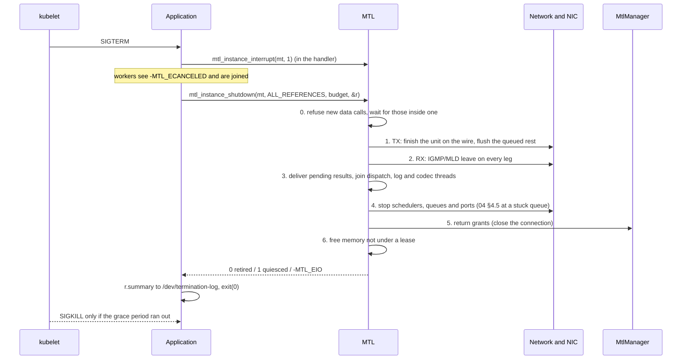

# 16 — Kubernetes pods and crash safety

| | |
|---|---|
| Status | Draft for maintainer review — revision 4, addendum K (2026-10-01), after review [RK](reviews/RK-kubernetes-review.md) ([response](reviews/RKNA-response.md)) |
| Date | 2026-10-01 |
| Baseline | `main` @ `545a266a` |
| Inputs | [K1 — the Kubernetes runtime](kubernetes/K1-kubernetes-runtime.md) (K-REQ-1…20), [K2 — MTL code audit](kubernetes/K2-mtl-code-audit.md) (H-K-1…28, 14 engine fixes), [K3 — shutdown prior art](kubernetes/K3-shutdown-prior-art.md) (P-1…P-12, the contract table) |
| Headers | `mtl.h` (R4, R8, `mtl_instance_open`, `mtl_instance_close`, `mtl_instance_abort`, ports `env:`), `mtl_observe.h` (health, shutdown), `mtl_options.h` (2020–2027, 2010, 2123–2125, 2207), `mtl_reasons.h` (10–12, 112–115, 520, 600–614), `mtl_queue.h` (events 23–25) |
| Decision | M16 ([OPEN-QUESTIONS.md](OPEN-QUESTIONS.md)) |

The question was whether MTL can run safely in a pod, and whether the way it closes and
destroys objects is good enough. A pod changes four things for a library like MTL:

1. **It ends on a timer.** On SIGTERM the process has the grace period (30 s by default,
   preStop included), then SIGKILL. A teardown that waits on a stuck queue, on MtlManager or
   on the network turns every rollout into a SIGKILL.
2. **It restarts in place.** A crashed container restarts in the same pod, with the same VF
   (just reset by vfio), the same IPC namespace and the same emptyDirs. Nothing from the
   previous run may block the next one.
3. **It sees only what it was given.** Its CPUs are an exclusive cpuset, its VF comes from
   the SR-IOV device plugin, and its hugepages are a cgroup limit. It may have no writable
   root filesystem, and no host PID or IPC namespace.
4. **Others decide about it from outside.** Probes decide when it is restarted and when it
   receives traffic. `kubectl describe` shows why it died.

Today's MTL fails several of these:

- Teardown waits are unbounded, and a timed-out tasklet unregister is followed by a free (H-K-13, H-K-14).
- Lcore arbitration is SysV shm checked with `kill(pid, 0)`, which is wrong across PID namespaces (H-K-10).
- The built-in phc2sys steers the node's `CLOCK_REALTIME` and leaves the frequency set (H-K-2).
- vfio no-IOMMU is not detected, so a SIGKILL can leave DMA into freed pages (H-K-1).
- There is no signal path or health signal, and open blocks for up to 180 s (H-K-16, H-K-20, H-K-21).

The design below makes the library safe in a pod. Almost all of it also helps a bare-metal
deployment.

## 1. The design in one page

| # | Rule | Where |
|---|---|---|
| 1 | **One bounded shutdown, network first.** `mtl_instance_close(mt, timeout)`, or `mtl_instance_shutdown()` with flags and a report. TX finishes the unit on the wire, RX leaves its groups, the devices stop, the MtlManager grants go last. No step starts that its remaining budget cannot finish. | §2 |
| 2 | **Outcomes reported apart.** 0 retired; 1 quiesced (no device can reach any memory, but something is still held); `-MTL_EIO` with `QUEUE_QUARANTINED` (a port could not be stopped: exit). | §2.3 |
| 3 | **Handles never dangle.** Handle slots are process-wide and never freed (R4). An object closed by the instance answers `-MTL_ESHUTDOWN`, its close and its leases' release return 0, and `mtl_instance_abort` is safe at any time. | §2.1, §2.5 |
| 4 | **Correct under SIGKILL by construction.** Everything held outside the process is tied to a descriptor the kernel closes, or reconciled by a named owner at the next open. Nothing is found by PID. Each residual effect is listed with its owner and duration. | §3 |
| 5 | **The process owns signals.** No handler and no `atexit` in the library (DPDK's own SIGBUS handler during heap growth is the one exception). A fork closes MTL's descriptors in the child (R8). | §2.5 |
| 6 | **Device loss is a state.** A removed or unrecoverable port fails calls fast with `-MTL_ENODEV`, wakes every wait, and still lets every close succeed. | §4 |
| 7 | **CPUs come from the pod.** `lcores` NULL takes the affinity mask. There is no cross-process arbitration where Kubernetes already gave exclusive CPUs. Every thread is pinned. | §5 |
| 8 | **Time is read, not steered.** In a pod, AUTO reads a node-disciplined PHC or `CLOCK_TAI`, else runs free. MTL never adjusts a clock it does not own. | §6 |
| 9 | **Fail fast, with one reason.** Open checks the environment before it touches a device, and does not wait for links or time lock. | §7 |
| 10 | **Probes read one lock-free call.** `mtl_instance_get_health()`: liveness never depends on links, packets or PTP lock, and a degraded 2022-7 session is not a liveness failure. | §8 |
| 11 | **Nothing on the filesystem unless asked.** No `/tmp`, no `kahawai.json`, no telemetry socket. `instance.runtime_dir` is the only place MTL writes. | §10 |

The core header gains no function. `mtl_instance_close` takes a timeout, and the
rest is in `mtl_observe.h` and `mtl_options.h`.

## 2. Shutdown

### 2.1 The calls

```c
/* mtl.h: what every program calls */
int mtl_instance_close(mtl_instance_h mt, int64_t timeout_ns);

/* mtl_observe.h: the same with flags and a report, for a service's SIGTERM path */
int mtl_instance_shutdown(mtl_instance_h mt, uint64_t flags, int64_t timeout_ns,
                          struct mtl_shutdown_report* r, size_t size);
```

- **References.** Each open of a shared instance returns its own reference handle. A
  reference that is not the last only drops itself, and the call returns 0 at once.
  `MTL_SHUTDOWN_ALL_REFERENCES` shuts down the shared instance of every component in the
  process: GStreamer elements, an FFmpeg device and the application. The application that
  owns `main()` uses it on SIGTERM; a plugin never does. The other components' handles then
  get `-MTL_ESHUTDOWN`, and their close returns 0.
- **Objects closed by the instance.** Sessions, queues and timelines still open are closed
  by the shutdown. Handle slots are process-wide and never freed (R4), so these handles
  stay safe to pass:
  - data calls return `-MTL_ESHUTDOWN`, and blocked waits wake with it;
  - `mtl_session_close` returns 0;
  - `mtl_rx_release` and `mtl_tx_release` of a lease taken before return 0.
- **Not from a library thread.** From a queue dispatch callback, the log sink or a codec
  thread the call returns `-MTL_EDEADLK` and does not consume `mt`, because the shutdown
  joins those threads.
- **Timeouts.** `timeout_ns = 0` means abort semantics: no drain. `MTL_FOREVER` still bounds
  each step by its own budget.
- **Session close stays as it is.** Instance close flushes queued TX units. To send them,
  close the sessions first: `mtl_session_close` drains.

### 2.2 The order and the budget



| Step | What | Bounded by | Typical time |
|---|---|---|---|
| 0 | New data calls return `-MTL_ESHUTDOWN`; health shows `SHUTTING_DOWN`, so readiness fails. Threads already inside a data call are waited for through each session's in-flight counter (03 §6.2). A `MTL_SESSION_SINGLE_READER` session elides the counter, so the application joins that thread first, as ex11 does. | the deadline | µs; a UHD DPC conversion: ms |
| 1 | TX: the unit whose first packet left is sent to its end at its pace, with its normal status: the wire never carries a partial unit. Rows units end by `tx.rows_late`, STALL as TRUNCATE. Queued units become `FLUSHED/CLOSE`. `MTL_SHUTDOWN_DRAIN` sends every queued unit instead, until the deadline minus what steps 2–6 need. | the deadline | one unit (16.7 ms at 59.94p) |
| 2 | RX: a leave on every leg before the queues close; incomplete units are discarded and counted | never waits on the network | one packet per group |
| 3 | Pending results and terminal events go to the dispatch callbacks, so a framework that releases buffers on results sees every one. Then the threads that call application code are joined: queue dispatch, the log sink, codec threads. Leftovers are counted in `results_discarded` and `threads_unjoined` (below). | the deadline | ms |
| 4 | The schedulers stop, then the queues and ports. Flows are destroyed, AF_XDP sockets close, imported regions are unmapped from the IOMMU. A queue that will not complete runs the 04 §4.5 steps, a reset only if the budget remains (`caps.reset_budget_ns`); otherwise it is **quarantined** (below). | the deadline | ms; a stuck rate-limit queue up to the reset budget |
| 5 | MtlManager grants (lcores, queues, flows, XDP references) are returned by closing the connection. This comes after step 4, because a grant returned while still in use is the double-booking K2 §5.1 found in today's code. | socket close | µs |
| 6 | Memory: library pools are freed, except slots under a lease the application still holds (§2.3) | — | ms |

**Stuck threads.** A thread stuck in foreign code past the deadline is not joined, and the
memory it can reach is not freed; nor is memory that a thread still inside a data call can
reach. A reset that fails also quarantines the queue.

**Quarantine.** The 04 §4.5 steps are a bounded cleanup, then a queue stop and restart, then
a port reset. A queue that still cannot be stopped is quarantined: its port counts in
`ports_unquiesced`, nothing the queue can reach is ever freed, and a later open of that port
in the same process returns `-MTL_EBUSY` with reason `QUEUE_QUARANTINED`.

**Abort.** `mtl_instance_abort()` (AS) during the call skips to the hard stop. TX stops at the
next packet, and the cut unit is `FLUSHED/ABORTED` with `MTL_TXR_PKT_SHORT`. Then the device
steps run at once. A second SIGTERM maps to it.

**The budget counts from SIGTERM.** The handler records the time (`clock_gettime` is AS), and
the main thread passes `grace − preStop time − margin − time already spent`. ex11 does this.
The downward API does not expose `terminationGracePeriodSeconds`, so the application is told
it, for example by an environment variable that repeats it. Set
`terminationGracePeriodSeconds ≥ preStop + drain + reset budget + 2 s`. Without
`MTL_SHUTDOWN_DRAIN` the drain is one unit, so the default 30 s is generous.

**preStop** is for work that must happen before SIGTERM reaches the process, such as NMOS
IS-04 unregistration ([17 §2.6](17-nmos-and-ipmx.md)). Its time comes out of the same grace
period. MTL teardown never belongs there: it runs on SIGTERM.

### 2.3 Outcomes and the report

| Return | Meaning | What the application does |
|---|---|---|
| 0 | retired: every object freed, every library thread joined | exit, or open again |
| 1 | quiesced: no device can reach any memory. Something is still held: leases or regions still referenced (`leases_out`, `regions_referenced`), or a library thread still in application code (`threads_unjoined`). | exit; or, in a long-lived process, return the leases. A slot's memory is freed by the process's next control-plane call after its last lease comes back, or at exit (`bytes_kept`). |
| `-MTL_EIO`, reason `QUEUE_QUARANTINED` | a port could not be stopped (`ports_unquiesced`); its memory is quarantined | exit now: the kernel's VFIO release turns bus mastering off and resets the function |

`-MTL_ETIMEDOUT` keeps its benign revision-4 meaning, "a drain ran out of time, the rest was
flushed". It is never used for the unsafe case.

`struct mtl_shutdown_report` (200 B) gives the counts for each step, `references_left`
(above 0 when only this reference was dropped), and `summary`, one line that fits a
termination message. For example:
`shutdown 41 ms: 3 sessions closed, 1 unit flushed, 4 groups left, 0 leases out, port 0 quiesced`.
Since `kubectl describe` shows the termination message, an operator sees why a pod took
long to stop without reading logs (P-12). `terminationMessagePolicy: FallbackToLogsOnError`
covers crashes that write nothing.

**Re-open in the same process.** After 0 or 1, `mtl_instance_open` works again on the same
ports and on a subset of the first open's CPUs, because EAL keeps the arguments of its first
init. This is what a GStreamer pipeline cycling NULL → PLAYING does.

### 2.4 Why not more

- **No shutdown thread inside MTL.** The application's main thread runs the shutdown, so the
  process exits right after it.
- **No unbounded step.** Every wait is bounded (EK1, §11). A step that its remaining budget
  cannot cover is reported and skipped, never extended.
- **Leases still out do not free their memory.** Freeing library memory under a lease the
  application holds would turn an application bug into a use-after-free. The slot is freed
  only after its last lease comes back. `mtl_rx_release` is DP and cannot free, so the
  process's next control-plane call does it, or the process exit.

### 2.5 Signals and fork (R8)

- **No handlers.** The library installs no signal handler and registers no `atexit`. DPDK
  installs its own SIGBUS handler while it grows its hugepage heap and restores the
  previous one after, and `instance.hotplug` installs DPDK's hotplug handler. R8 names those
  as the exceptions. MTL allocates its pools at create, so the heap grows only then.
- **AS calls at any time.** A signal handler may call `mtl_instance_interrupt(mt, 1)` and
  `mtl_instance_abort(mt)` at any time, also during and after close. The flags and the
  wake-up eventfd number live in the instance's never-freed handle slot. The AS path
  increments an in-flight counter, checks a `closed` flag, writes and decrements. Close sets
  `closed` and waits for the counter to reach 0 before it closes the eventfd. A late signal
  therefore never writes into a recycled descriptor: in ex11 that would have been
  `/dev/termination-log`.
- **The recipe ([ex11](10-api-sketch.md)).** Block SIGTERM and SIGINT before open and before
  any thread is created. Install the handlers after open, then unblock. A signal that
  arrives during open stays pending instead of being dropped: as PID 1, an unhandled SIGTERM
  is discarded. The image may also run `tini`.
- **Hotplug.** DPDK's hotplug support installs a process-wide SIGBUS handler. MTL enables it
  only with `instance.hotplug = 1`; device removal (§4) works without it.
- **Close-on-exec.** Every descriptor MTL opens is close-on-exec. DPDK opens the VFIO group
  and container descriptors and its hugepage memfds without it, so MTL sets `FD_CLOEXEC` on
  them after EAL init and after every allocation that can grow the heap (EK15).
- **Fork.** An instance belongs to the process that opened it. Close-on-exec does nothing
  for a fork without exec: such a child would keep the VFIO descriptors, the manager socket
  and the OFD CPU locks, and a SIGKILL of the parent would then not release them. A
  `pthread_atfork` child handler therefore closes every descriptor MTL tracks; closing the
  child's copies does not touch the parent's device. In the child every call returns
  `-MTL_EBADF` with reason `FORKED`, except close, which only drops local state. Library
  hugepages and pools are `MADV_DONTFORK`. Imported regions are the application's, and the
  documentation warns about them. `system()`, `popen()` and `posix_spawn` are safe under
  this rule.

## 3. What holds after each kind of ending

Legend:

- (a) orderly: close or shutdown returned 0 or 1, then the process exited;
- (b) SIGKILL at any instant, including inside a library call;
- (c) device removal, or a reset that does not recover, while the process keeps running.

Owners: **K** kernel, **L** library, **M** MtlManager, **A** application, **O** orchestrator (kubelet, CNI, device plugin).

| Resource | (a) orderly | (b) SIGKILL | (c) device removal | Owner |
|---|---|---|---|---|
| Instance threads | joined, or counted as stuck in foreign code | gone with the process | stay; event `PORT_REMOVED`, health `DEGRADED` or `SESSION_LOST`; close works | L / K |
| TX session | unit on the wire finished, rest `FLUSHED`; every accepted unit has a result | the wire stops (bus master off at fd release); a partial frame on the wire | ERROR `DEVICE_GONE`, or a degraded 2022-7 leg; units `FLUSHED`; waits `-MTL_ENODEV` | L / K |
| RX session | leave sent on every leg | **no leave**: the switch floods the group until the querier ages it out (about 260 s with IGMP defaults) | ERROR or degraded leg | L / K |
| Lease held by the application | release returns 0; its slot is freed after the last lease | gone | release still works | L |
| Library pools (hugepages, `--in-memory`) | freed, slot by slot as leases come back | freed by the kernel; with an IOMMU, pinned pages outlive the DMA | not freed under a lease | L / K |
| Imported regions | unmapped from the device before `mtl_mem_close` returns 0 | IOMMU unmap after DMA is off; the memory dies with the process | the removed port's mapping goes with its VFIO fd | L / K |
| **No-IOMMU mode** | as (a) | **no guarantee: DMA may hit freed pages** | **no guarantee** | refused unless `instance.allow_noiommu` (§9) |
| Queues (`mtl_queue`) and wait handles | results delivered, dispatch joined, eventfds closed | closed by the kernel | stay; deliver `PORT_REMOVED` | L / K |
| Timelines | closed with the instance | process-local, gone | unaffected; the time source may degrade (`TIME_STATE`) | L |
| Codec plugins | `stop` called; threads joined, or counted as unjoined | gone | sessions ERROR; the plugin stopped as in (a) | L / A |
| Lcores, Guaranteed pod | nothing to release (the cpuset is the lease) | nothing | — | O |
| Lcores, MtlManager | returned on socket close, after the schedulers stopped | returned at socket EOF | — | M / K |
| Lcores, lockfiles (no manager, shared host dir) | OFD locks released | released by the kernel at the last close; no PID involved | — | K |
| VF queues, rate-limit nodes, `rte_flow` rules | stopped and destroyed | FLR at fd release; the PF clears the VF's queues and filters **[inferred]**; flushed again at the next open | gone with the device | L / K |
| Manager ntuple rules, XDP program, XSK map entries, AF_XDP `tx_maxrate` | removed or reset by the manager at client EOF | the same at EOF; **if the manager itself is killed** they stay until it restarts and reconciles | the manager drops them with the netdev | M |
| Built-in PTP on a PF | frequency restored at close | **frequency offset stays** on the PF's PHC until the next owner sets it | — | L; in a pod the node daemon owns the PHC (§6) |
| VF MAC, VLAN, trust, spoof check | untouched (the CNI's) | untouched | — | O |

**Residual effects of a SIGKILL**, each with its owner and how long it lasts:

1. The stale IGMP membership: the switch's group membership interval (about 260 s at RFC
   3376 defaults). Operators enable an IGMP querier and fast-leave on media VLANs. A later
   option (SF-K3-7) has MtlManager send leaves for a dead client's groups.
2. A partial frame on the wire. Receivers count it as incomplete.
3. XDP state and an AF_XDP queue's `tx_maxrate` while MtlManager is down: they last until
   the manager restarts and reconciles. The manager resets `tx_maxrate` when it grants the
   queue again (§10.2).
4. A PHC frequency offset left by the built-in PTP client: it lasts until the next owner
   sets the frequency. It cannot happen in a pod, where the client may not adjust a VF clock.

None of these blocks the next start. Open assumes the previous run died uncleanly (P-11):

- It flushes `rte_flow` rules and rate-limit configuration on the VF.
- It does not assume a clean TM tree.
- It logs one line per kind of thing it reconciled (`instance.reconciled{kind}`).

## 4. Device removal and reset

DPDK reports `RTE_ETH_EVENT_INTR_RMV`, `INTR_RESET` and the `ERR_RECOVERING` /
`RECOVERY_SUCCESS` / `RECOVERY_FAILED` events per port. The callbacks only post to the admin
worker; nothing is closed inside a callback (EK14).

| Event | What MTL does | The application sees |
|---|---|---|
| **reset** (a PF reset resets every VF: far more common than removal) | the worker runs `rte_eth_dev_reset`, restores queues and flows, re-joins groups. It is a bounded device step, so it counts as worker progress for health. | `PORT_RESET` event; sessions on the port report `RECOVERY` and resume; units in between are `FAILED/PORT_RESET` |
| **removed**, or a reset that fails | the port becomes REMOVED; its legs go oper-down. A 2022-7 session with a surviving leg continues degraded (`LEG_STATE`); one with no leg left goes ERROR (`DEVICE_GONE`). | `PORT_REMOVED`; health `DEGRADED`, and `SESSION_LOST` (liveness) only when a started session has no leg left or every port is gone. Calls on a session with no leg return `-MTL_ENODEV`. |
| close after removal | skips every device step of 04 §4.5 for that port; the removed VF's buffers run no free callback that touches the device | 0 |

The library never closes the application's sessions on removal. They stay closeable in
ERROR, as in Vulkan and uverbs (Q-K3-4). When a session has lost every leg, a liveness probe
restarts the pod, and a fresh VF comes with the new pod. A pod still sending on its other
2022-7 leg is not restarted.

## 5. CPUs

| Topic | Rule |
|---|---|
| Which CPUs | `lcores` NULL: the opening thread's `sched_getaffinity()`, which is the pod's cpuset under the CPU manager. An explicit `lcores` naming a CPU outside the mask fails with `-MTL_EINVAL` and reason `CPU_NOT_ALLOWED`, before EAL starts (H-K-11). Lcore numbers reported to the application are CPU IDs. |
| Arbitration between processes | `instance.cpu_arbitration`: auto takes MtlManager if its socket is present, else one OFD lock per CPU in `instance.runtime_dir` when set, else none: the affinity mask is the lease. A pod mounts the manager socket only for AF_XDP, so there auto means none. The SysV table, `kill(pid, 0)` (EK6) and the "manager optional" flag are removed. |
| Pinning | Every scheduler is pinned to one CPU, `TASKLET_THREAD` included (04 §5.2 and §7.1 amended). `instance.main_lcore` is the CPU of EAL's main lcore and of every thread that is not a scheduler: by default the first CPU of the mask, never given a scheduler. The caller's threads and memory policy are never changed (H-K-12). Placement is in `sched.lcore` and the open log line. |
| Busy polling under a quota | Open reads the CFS quota (`cpu.max`) and flags it only when quota ÷ period is below the CPUs of the mask, so a Guaranteed pod whose quota equals its CPUs is fine. A shared cpuset is not visible from inside **[inferred]**; a non-integer CPU request always gives one. `instance.cpu_shared`: WARN (default), REFUSE (`CPU_SHARED`), or SLEEP (idle schedulers sleep). |
| SMT | A scheduler whose SMT sibling is outside the mask, and so shared with another pod, is logged once. The kubelet's `full-pcpus-only` policy option prevents this. |

## 6. Time in a pod

| Source | In a pod |
|---|---|
| `AUTO` (default) | the VF's PHC, read only, when a node daemon disciplines it; else `CLOCK_TAI` when the kernel's TAI offset is set (the host's phc2sys keeps it); else FREERUN. Re-evaluated while running ([17 §4](17-nmos-and-ipmx.md)). |
| `PHC`, `CLOCK_TAI`, `USER` | as named; read only |
| `PTP_BUILTIN` | only when named, and only on a PF that MTL owns. On a VF (whose PHC is not adjustable) it fails with `CLOCK_NOT_OWNED`. |
| built-in phc2sys (`time.phc2sys`) | steers `CLOCK_REALTIME` of the node: never in a pod; restores the frequency at close (H-K-2) |

"Disciplined" needs a signal the pod can see. `time.phc_trust` gives it:

- **absent, or detect**: the PHC counts as disciplined when it agrees with `CLOCK_TAI` within
  a bound at start **[design; the bound is a spike]**. Agreement cannot tell a
  grandmaster-locked PHC from a node in holdover: phc2sys keeps `CLOCK_REALTIME` on the
  drifting PHC. Only the application can tell MTL that the node lost its grandmaster, with
  `mtl_time_set_reference(..., locked = 0)`.
- **`YES`**: trust the node.
- **`NO`**: never use the PHC.

The node daemon knows the grandmaster and the clock class, but the pod cannot see them. The
application can pass them in with `mtl_time_set_reference()`, for example after reading them
from the PTP operator's events or with `pmc`. NMOS and IPMX need them in SDP and IS-04
([17 §4](17-nmos-and-ipmx.md)).

No time source needs `CAP_SYS_TIME` or `/dev/ptp*` write access. The time state is reported
in `time.*` stats, `mtl_health.time_state` and `time_error_ns`, and in `TIME_STATE` events.

## 7. Open: fail fast, no blocking

Open runs every check that needs no device before it touches one. A misconfigured pod then
fails at once, with one named reason and a one-line `mtl_last_error().detail` that the
application writes to its termination message. A CrashLoopBackOff is diagnosable from
`kubectl describe`.

| Check | Reason on failure |
|---|---|
| each `env:VAR[#n]` port resolves (not in a set-uid process) | `PORT_ENV_UNSET` |
| the device node exists in the container (`/dev/vfio/N`), is accessible to the process's user, and the device is bound to vfio-pci | `DEVICE_NODE_MISSING`, `DRIVER_MISMATCH`, `CAPABILITY_MISSING` (naming "/dev/vfio/N not writable") |
| an IOMMU is present (not no-IOMMU, not PA mode), unless `instance.allow_noiommu` | `NO_IOMMU` |
| hugepages within the **cgroup** hugetlb limit and the free pages | `HUGEPAGES_LIMIT` |
| `RLIMIT_MEMLOCK` covers the pools, or `CAP_IPC_LOCK` is **effective** | `MEMLOCK_LIMIT`, naming which is missing |
| the capabilities the backend needs (§10.3), checked in the effective set | `CAPABILITY_MISSING`, naming it |
| the CPUs (§5) | `CPU_NOT_ALLOWED`, `CPU_SHARED` |
| `instance.runtime_dir`, when set, is writable | `RUNTIME_DIR` |
| MtlManager, when the configuration needs it (AF_XDP on a shared netdev) | `MANAGER_REQUIRED` |
| AF_XDP: the socket or map from the node agent (`port.xsk_map`) | `XSK_UNAVAILABLE` |
| the named time source can be read | `TIME_SOURCE_UNAVAILABLE`, `CLOCK_NOT_OWNED` |

There is no preflight flag. An init container has its own CPUs, hugepage limit and memlock,
so it would check the wrong container; the application's own open is the check. Node-level
checks (IOMMU, VFs, drivers) belong in a node tool or the operator's validation.

**After the devices.** Open probes what each VF allows: trust (promiscuous and all-multicast
modes), the multicast filter budget, a Tx rate set by the PF, hardware pacing and TM, and
whether the PHC is readable. These become `caps.*` keys of the port. A session that needs
more fails at create, not inside a join: the first group past an untrusted VF's budget gets
`-MTL_ENOSPC` with reason `MCAST_FILTERS`. An untrusted E810 VF has 18 MAC filters, some of
which the unicast address and broadcast use **[inferred]**. MTL never sets the VF MAC; the
PF and the CNI own it.

**Open does not wait** for links, neighbours or time lock (today up to 30 s, 60 s and 180 s,
H-K-20). Health reports the phase: LINKS, TIME, READY. An application that must not send
before lock waits for `TIME_STATE` LOCKED. Units sent before lock carry `MTL_TXR_ESTIMATED`.

**Ports from Kubernetes.** The SR-IOV device plugin puts the allocated VFs' PCI addresses in
`PCIDEVICE_<resource>`. The port name `env:PCIDEVICE_INTEL_COM_E810_RED#0` takes the first
address. Use one resource per ST 2022-7 network (red and blue), so each leg's VF comes from
its own PF: one resource for both legs gives no such guarantee, and `#0`/`#1` follow the
plugin's order, not the leg order. The IP goes in the port spec's `sip` from the application's configuration
(or in `MTL_PORTS` as `env:…#0=10.1.0.5/24`). Multus's network-status annotation also has it, but may be
absent or stale when the container starts; a helper that reads it is a later item
(`mtl_port_specs_from_network_status` under `MTL_LATER`). `MTL_PORTS` takes the same spec, so
one image runs on any node.

## 8. Health and probes

```c
int mtl_instance_get_health(mtl_instance_h mt, struct mtl_health* h, size_t size); /* DP */
```

It returns the flags; `h` may be NULL. It reads atomics and copies a consistent snapshot,
never torn (the `detail` string is "" if it changed while being copied), so it answers even
when the control plane is wedged, which is when liveness matters. During close it reports
`SHUTTING_DOWN` and masks `SCHED_STALLED` (stopped schedulers do not loop). After close it
returns `-MTL_ESHUTDOWN`.

| Bit | Liveness | Readiness | Source |
|---|---|---|---|
| `SCHED_STALLED` | ✓ | ✓ | a scheduler's `last_loop` is older than `instance.stall_ns` (1 s). The heartbeat advances on wake-ups and timer ticks too, so a sleeping idle scheduler is not stalled; open rejects a `stall_ns` below twice the longest scheduler sleep. `MTL_EVENT_SCHED_STALLED` warns earlier, at 1/8, 1/4 and 1/2 of the limit. |
| `WORKER_STALLED` | ✓ | ✓ | the admin worker (recovery, ARP, IGMP, commands) missed its heartbeat outside a bounded device step. A port reset, up to its budget, counts as progress, so a PF reset that resets every VF on the node never restarts every pod. |
| `SESSION_LOST` | ✓ | ✓ | a started session lost every leg to removed ports, or every port is gone (§4) |
| `DEVICE_FAULT` | ✓ | ✓ | a queue was quarantined (§2.2), or a tasklet could not be unregistered and its memory was quarantined (EK2) |
| `STARTING` | | ✓ | the phase is below READY |
| `NO_LINK` | | ✓ | no port has a link |
| `TIME_UNLOCKED` | | ✓ | the time state is ACQUIRING or LOST. FREERUN and HOLDOVER are ready: IPMX runs without PTP. |
| `MANAGER_LOST` | | ✓ | MtlManager went away; AF_XDP ports stop receiving |
| `SHUTTING_DOWN` | | ✓ | close or shutdown has begun |
| `DEGRADED` | | | information only: a port's link is down or removed, or a started session is in ERROR or has an enabled leg not resolved or joined. One bad stream does not take a whole NMOS Node out of service. |

**Liveness never depends on links, packets or PTP lock.** Otherwise a grandmaster outage or a
switch reboot would restart every pod on the network at once. Readiness fails only on what
stops the whole instance from carrying media. `MTL_EVENT_HEALTH` reports every change of the
flags. The library never kills anything: the orchestrator decides. In thread mode on shared
CPUs a 100 ms preemption is normal, which is why the liveness limit is 1 s.

The application serves the probes itself (an HTTP or gRPC handler). An exec probe would
fork a process on exclusive CPUs every period. ex11 has the handler:

- **startup and liveness:** 503 until open returns, then on any liveness bit. The startup
  probe uses the same rule, so a grandmaster or link outage at start does not crash-loop
  the pod.
- **readiness:** 503 on any readiness bit.
- **after shutdown began:** liveness 200, readiness 503.

Stats keys for exporters ([08 §R4.5](08-observability.md)):

- per scheduler: `sched.loops`, `sched.last_loop_tai_ns`, `sched.busy_pct_x100`;
- per session: `session.last_progress_tai_ns`, `session.leases_out`, `session.oldest_lease_ns`.

The per-session keys name the holder when a close returns 1 (P-12). A TX session whose
scheduler loops but which makes no progress (a stalled rate-limit queue) shows in
`session.last_progress_tai_ns` before it reaches ERROR.

## 9. Memory and the IOMMU

- **Budget against the cgroup.** The hugepage capacity MTL reports, and checks at open and
  create, is the container's hugetlb limit (`hugetlb.<size>.max` in cgroup v2,
  `hugetlb.<size>.limit_in_bytes` in v1) minus its usage, not the host's `/sys` counters.
  DPDK allocates pages at create and recovers a SIGBUS during allocation, so going over the
  limit is `-MTL_ENOMEM` (`HUGEPAGES_LIMIT`) at create. It is never a SIGBUS later.
- **Memlock.** VFIO accounts pinned pages against `RLIMIT_MEMLOCK` unless the process has
  `CAP_IPC_LOCK` in the initial user namespace. `CAP_IPC_LOCK` inside a user namespace does
  not lift it (K1 §3.2). The VFIO type-1 driver also caps the number of mappings
  (`dma_entry_limit`, 65535 by default). Open checks both against the pools, and
  `mtl_mem_import` against each import.
- **No-IOMMU is refused** unless `instance.allow_noiommu = 1`. Without an IOMMU, a SIGKILL
  can leave the NIC writing into pages the kernel has already given to someone else.
  `caps.iova_mode` reports the mode, and open logs a warning that names the risk when the
  option is set. Deployment documents mark such pods as privileged and node-trusting
  ([15 §2](15-security-and-deployment.md)). Spike SF-K3-6 measures whether anonymous
  hugepages narrow the window.

## 10. MtlManager, AF_XDP, privileges and the pod spec

### 10.1 MtlManager in Kubernetes

A pod needs no manager by default, because the CPU manager and the VF already isolate it.
The manager remains for AF_XDP on shared host netdevs and for bare-metal hosts. As a
DaemonSet with its socket bind-mounted into pods, it must be:

- **identity from the kernel**: `SO_PEERCRED` (or `SO_PEERPIDFD`), never a self-reported
  PID; socket mode `0660` with a group (H-K-7);
- **netns independent**: ports named by PCI address or by host ifname, never by the
  client's ifindex, which means another interface in the manager's namespace (H-K-4);
- **connection scoped**: every grant (lcores, queues, flows, UDP filters) is released when
  the connection closes, and filters are tracked per client (H-K-19);
- **restartable**: clients re-register what they hold after a manager restart, and the
  manager reconciles. It deletes only rules in its own range, takes a single-instance lock
  before unlinking the socket, handles SIGTERM, and ignores SIGPIPE (H-K-5, H-K-6, H-K-24).

The library side uses `MSG_NOSIGNAL` and a per-request timeout. When the manager goes away
it posts `MTL_EVENT_MANAGER_LOST` and sets health `MANAGER_LOST`, and it never blocks forever
(H-K-8). The client closes its connection only after its schedulers and sockets have stopped
(§2.2 step 5).

### 10.2 AF_XDP

In a pod the node owns the XDP program, whether that is MtlManager, the AF_XDP device plugin
or bpfman. `port.xsk_map` names the XSK map or socket the node agent hands over: a bpffs
pin, an inherited `fd:<n>`, or `uds:<path>` (SCM_RIGHTS). MTL then never loads, attaches or
detaches a program. Open fails with `XSK_UNAVAILABLE` when there is no such map or socket.
Today native AF_XDP refuses to start without MtlManager; accepting a map from another agent
is an engine change (EK19). A manager that attaches programs holds a `bpf_link`, so its own
crash detaches them; or it reconciles at start (P-7, SF-K3-1, SF-K3-4).

### 10.3 Files and privileges

MTL writes nothing unless `instance.runtime_dir` is set: no `/tmp` lock, no
`/var/run/dpdk`, no telemetry socket (`instance.telemetry`, default off, H-K-27), no
implicit `kahawai.json` from the working directory (H-K-23). EAL runs with `--in-memory`
and a per-instance file prefix (today the prefix is the fixed `MT_DPDK`, EK12). A read-only
root filesystem then works.

**Capabilities are not enough for a non-root container.** For a container that runs as a
non-root user, `capabilities.add` lands in the bounding and inheritable sets but not in the
effective set (kubernetes#56374, still open). With `allowPrivilegeEscalation: false`, file
capabilities on the binary do not help either. The device plugin's `/dev/vfio/N` also keeps
its host ownership, root. Three set-ups work:

| Set-up | How | Trade-off |
|---|---|---|
| **A. Non-root, node prepared** (recommended) | the container runtime runs with `LimitMEMLOCK=infinity`, which containers inherit **[inferred: true of the packaged containerd and CRI-O units; check the node]**, and with `device_ownership_from_security_context = true`, so `/dev/vfio/N` is owned by the pod's user and group. No capability is added. | a node setting, done once |
| **B. Root in the container, unprivileged** | `runAsUser: 0`, drop ALL, add `IPC_LOCK`; no `privileged`, no host namespaces | root inside the container; outside the Restricted Pod Security Standard |
| **C. Privileged** | `privileged: true` | today's practice; not recommended |

Open reports which piece is missing (§7), so a pod on an unprepared node says
`MEMLOCK_LIMIT: RLIMIT_MEMLOCK 8 MiB, need 4.1 GiB, CAP_IPC_LOCK not effective`, not a DMA
mapping failure later.

| Backend | Needs | Does not need |
|---|---|---|
| DPDK PMD on a vfio VF | the device plugin's `/dev/vfio/*` (owned as in A), hugepages (resource limit), memlock (A or B); optionally `SYS_NICE` | root (in A), hostIPC, hostPID, hostNetwork, `/sys` writes, `SYS_ADMIN` |
| AF_XDP | `NET_RAW` (non-root: the same caveat, so set-up B, or a socket made by the node agent), an XSK map from the node agent, memlock for UMEM | `SYS_ADMIN`, `BPF` (the agent loads the program) |
| kernel socket | nothing extra | — |
| null | nothing | — |

Under seccomp `RuntimeDefault`, `get_mempolicy`, `set_mempolicy` and `mbind` need
`CAP_SYS_NICE`. Without it, libnuma reports NUMA as unavailable and DPDK's NUMA placement is
silently off, so add `SYS_NICE` on multi-socket hosts (B), or accept the first node's memory.
Open logs it.

### 10.4 A pod spec (set-up A)

```yaml
apiVersion: v1
kind: Pod
metadata:
  name: mtl-sender
  annotations:
    k8s.v1.cni.cncf.io/networks: media-red, media-blue # one SR-IOV network per 2022-7 leg
spec:
  terminationGracePeriodSeconds: 30 # >= preStop + drain + reset budget + 2 s (16 §2.2)
  securityContext:
    runAsUser: 10001
    runAsGroup: 10001
    runAsNonRoot: true
    seccompProfile: { type: RuntimeDefault }
  containers:
    - name: app
      image: example/mtl-app
      env:
        - name: MTL_PORTS # one resource per leg, so each VF comes from its own PF
          value: "env:PCIDEVICE_INTEL_COM_E810_RED#0=10.1.0.5/24,env:PCIDEVICE_INTEL_COM_E810_BLUE#0=10.2.0.5/24"
        - name: GRACE_SECONDS # repeats terminationGracePeriodSeconds, which the pod cannot read
          value: "30"
      resources: # Guaranteed QoS: integer CPUs become exclusive under the static policy
        requests: { cpu: "4", memory: 2Gi, hugepages-1Gi: 4Gi, intel.com/e810_red: "1", intel.com/e810_blue: "1" }
        limits: { cpu: "4", memory: 2Gi, hugepages-1Gi: 4Gi, intel.com/e810_red: "1", intel.com/e810_blue: "1" }
      securityContext:
        readOnlyRootFilesystem: true
        allowPrivilegeEscalation: false
        capabilities: { drop: [ALL] }
      terminationMessagePolicy: FallbackToLogsOnError
      startupProbe: { httpGet: { path: /live, port: 8080 }, periodSeconds: 2, failureThreshold: 30 }
      livenessProbe: { httpGet: { path: /live, port: 8080 }, periodSeconds: 5, failureThreshold: 3 }
      readinessProbe: { httpGet: { path: /ready, port: 8080 }, periodSeconds: 2 }
      volumeMounts:
        - { name: hugepages, mountPath: /dev/hugepages }
  volumes:
    - { name: hugepages, emptyDir: { medium: HugePages } }
```

The pod's IPs here are static, from the application's configuration. With IPAM-assigned
addresses the application reads them from the network-status annotation, mounted through
the downward API, and builds the same spec.

**Rolling updates.** A Deployment's default RollingUpdate starts the new pod before the old
one stops, so two senders transmit to one group. Use `strategy: Recreate` for senders, or
a controller that hands over at an NMOS activation (a new sender, then an IS-05 switch of the
receivers). Receivers can roll.

## 11. Engine fixes this needs

These are fixed in the engine whatever the API, and the legacy API benefits too. They are
tracked in [14](14-implementation-roadmap.md) (engines track) and in
[side-findings.md](side-findings.md) (SF-56…SF-68). The numbering EK keeps them apart from
the timing changes E1–E13 of 14 §2.

| ID | Fix | Hazards |
|---|---|---|
| EK1 | Bound every stop-path wait (`sch_stop`, `mt_handle_drain`, the manager `recv`, the lcore `flock`); on timeout report, quarantine and skip the free; start a reset only if the budget remains | H-K-13, H-K-15 |
| EK2 | A tasklet unregister timeout must not be followed by a free: propagate `-EIO`, quarantine, health `DEVICE_FAULT` | H-K-14 |
| EK3 | Kernel-socket ARP loop: check abort and timeout before the `continue` | H-K-22 |
| EK4 | Library manager I/O: `MSG_NOSIGNAL`, `SO_RCVTIMEO`, short reads, manager-lost detection | H-K-8 |
| EK5 | MtlManager: SIGTERM, SIGPIPE, `SO_PEERCRED`, `0660`, single-instance lock, own-rule deletion, per-client filters, the attached XDP mode, `tx_maxrate` reset, netns-independent port names, reconcile on restart | H-K-4…7, H-K-19, H-K-24, H-K-25 |
| EK6 | Replace the SysV lcore table and `kill(pid, 0)` with affinity-only or OFD locks; key everything by CPU ID | H-K-9, H-K-10, H-K-26 |
| EK7 | Validate CPUs against `sched_getaffinity` before EAL; no injected `main_lcore = 0`; never `rte_panic` on configuration | H-K-11 |
| EK8 | Detect no-IOMMU and PA mode; require the opt-in; log the IOMMU and IOVA mode | H-K-1 |
| EK9 | Leave groups in `mt_mcast_uinit` before the ports close; a gratuitous ARP and an unsolicited report once a port is up | H-K-17 |
| EK10 | Restore PHC and system-clock frequency at PTP and phc2sys uninit; phc2sys only by option; no PHC discipline on a clock MTL does not own | H-K-2, H-K-3 |
| EK11 | Per-scheduler heartbeat (`loop_seq`, `last_loop`), advanced on wake-ups too; a worker heartbeat that treats a bounded device step as progress; the stat thread stops resetting counters others read | H-K-21 |
| EK12 | `--no-telemetry` by default; a per-instance file prefix; no implicit config file; no filesystem writes outside `runtime_dir` | H-K-23, H-K-26, H-K-27 |
| EK13 | Do not `numa_bind` the caller's thread; policy on MTL threads only | H-K-12 |
| EK14 | Register ethdev RMV, RESET and RECOVERY callbacks; post to the admin worker | §4 |
| EK15 | Close-on-exec on every descriptor, including DPDK's VFIO and memfd descriptors after EAL init; `MADV_DONTFORK` on library memory; a `pthread_atfork` child handler that closes the tracked descriptors | R8 |
| EK16 | Flush VF flows and TM at open; reset the VF and verify a clean state | H-K-18 |
| EK17 | Detect a CFS quota below the CPUs of the mask in lcore mode | H-K-28 |
| EK18 | Non-blocking open: links, ARP and PTP lock move to health phases; open retryable in-process | H-K-20 |
| EK19 | Native AF_XDP without MtlManager, from an XSK map handed over by a node agent | K3 F-6 |
| EK20 | Process-wide, never-freed handle slots with a CLOSED_BY_INSTANCE state; the AS in-flight counter for interrupt and abort | R4, §2.5 |
| EK21 | Shutdown step 3: deliver pending results to dispatch threads before joining them; the `results_discarded` count | §2.2 |

## 12. Requirement coverage

After the review, all twenty are met in the design. Several still depend on engine fixes
(§11) and on the node settings of §10.3.

| K-REQ | Covered by |
|---|---|
| 1 bounded orderly shutdown | §2: `mtl_instance_close(mt, timeout)`, `mtl_instance_shutdown`; the budget from SIGTERM |
| 2 network first | §2.2 steps 1–2 before 4–6 |
| 3 signal-safe trigger, no handlers | R8 (with DPDK's SIGBUS exception named); §2.5; ex11 |
| 4 crash-only correctness | §3 table and residuals; R8 fork rule; EK15 |
| 5 restart in place | §3 (reconcile at open); §5 (no PIDs); EK6, EK16 |
| 6 fail fast with a reason | §7; reasons 600–614 |
| 7 liveness, readiness, startup | §8; `enum mtl_phase`; the startup probe on the liveness rule |
| 8 CPUs from the affinity mask | §5 |
| 9 every thread pinned | §5; `instance.main_lcore` |
| 10 budget against the cgroup | §9 |
| 11 ports from Kubernetes | §7: `env:` ports with addresses, one resource per leg |
| 12 VF capabilities probed | §7 "After the devices"; reason `MCAST_FILTERS` |
| 13 no assumptions about a VF's history | §3 (reconcile); EK16; MTL never sets the MAC |
| 14 explicit IOMMU policy | §9; `instance.allow_noiommu`; reason `NO_IOMMU` |
| 15 time sources that fit a pod | §6; `time.phc_trust`; `mtl_time_set_reference` |
| 16 minimal privilege profile | §10.3 set-ups A–C; §10.4 |
| 17 MtlManager optional and pod-safe | §10.1; EK5 |
| 18 AF_XDP program owned by the node | §10.2; `port.xsk_map`; EK19 |
| 19 multi-container pods | one instance per process (15 §8.1); §10.3 (no shared files); a sidecar gateway's own clients are its concern |
| 20 multicast that tolerates crashes | §3 residual 1; EK9; `port.igmp_version`, `port.igmp_report_ms` |

## 13. Open questions

They are summarised as M16 in [OPEN-QUESTIONS.md](OPEN-QUESTIONS.md).

| ID | Question | Recommendation |
|---|---|---|
| Q-K8S-1 | Adopt `mtl_instance_close(mt, timeout)` with 0 / 1 / `-MTL_EIO` (quarantine), and `mtl_instance_shutdown` with the report? | yes (Q-K3-1) |
| Q-K8S-2 | Leases still out at shutdown: free each slot when its last lease returns (at the next control-plane call), never earlier? | yes |
| Q-K8S-3 | Lcore arbitration: affinity only in pods, MtlManager otherwise, OFD locks as the manager-less fallback, SysV removed, `MANAGER_OPTIONAL` removed? | yes (Q-K3-3) |
| Q-K8S-4 | Device removal: sessions go ERROR and the application closes them; liveness only when a session has no leg left? | yes (Q-K3-4) |
| Q-K8S-5 | DPDK's SIGBUS hotplug handler only by option? | yes (Q-K3-5) |
| Q-K8S-6 | Refuse no-IOMMU unless `instance.allow_noiommu`? | yes (Q-K3-6); it changes behaviour for existing no-IOMMU users, who must set the option (the legacy API only warns) |
| Q-K8S-7 | IGMP after SIGKILL: document the window for v1; manager-sent leaves later? | yes (Q-K3-7) |
| Q-K8S-8 | Detecting "a node daemon disciplines the PHC": the start-time agreement test, plus the application's `locked` flag? | yes, after a spike on the bound |
| Q-K8S-9 | Default `instance.cpu_shared`: WARN, or REFUSE for lcore mode? | WARN in v1; the health detail shows it |
| Q-K8S-10 | The shutdown's default "finish the unit on the wire, flush the rest", rather than DRAIN? | yes: a pod is being replaced, and its queued frames are not wanted; `MTL_SHUTDOWN_DRAIN` exists |
| Q-K8S-11 | Recommend set-up A (non-root, node prepared) in the documentation? | yes; B as the fallback |
