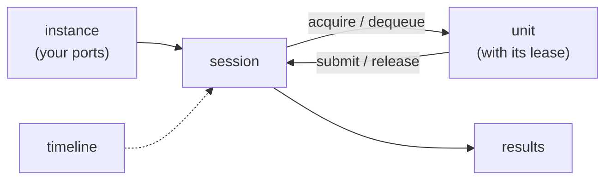
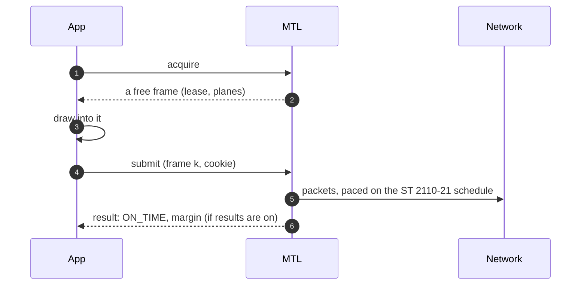
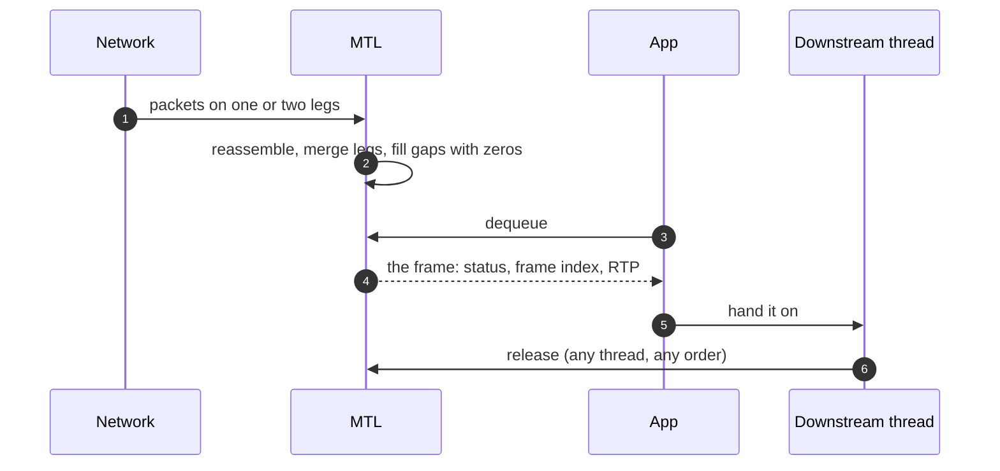
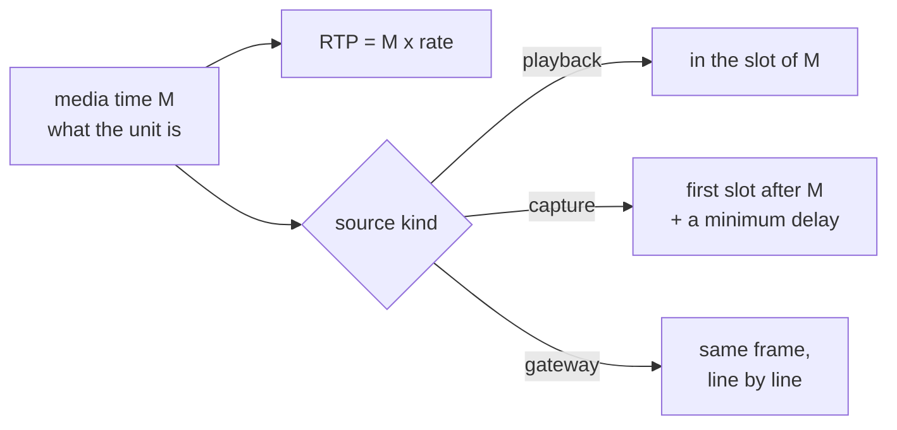
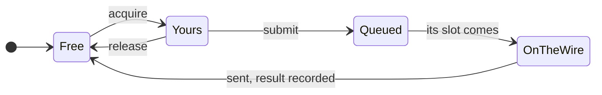

# Learn the unified MTL API in 30 minutes

| | |
|---|---|
| Status | Learning guide — revision 4, with addenda K (Kubernetes) and N (NMOS and IPMX). The API is a proposal; nothing is implemented yet |
| Date | 2026-10-01 |
| Assumes | you know today's MTL: `mtl_init`, `st20p_tx_get_frame` / `put_frame`, tasklets on pinned cores |
| Next | [LIST-OF-CHANGES.md](LIST-OF-CHANGES.md) (every change in bullets), [samples/diagrams.md](samples/diagrams.md) (a picture per example), [10-api-sketch.md](10-api-sketch.md) (the examples in full) |

## 1. The three questions it answers

The maintainer's review of PR #1610 asked three things. The proposal is built around them:

1. **"Did my frame go out on time?"** Today nobody can tell: "done" means an mbuf was freed.
   In the new API every unit can get one result: `ON_TIME`, `LATE`, `DROPPED` (and why),
   `FLUSHED` or `FAILED`, with how close it came.
2. **"Can audio and video from one file get consistent RTP without me doing the maths?"**
   Today the app timestamps each essence and gets up to half a frame of error. In the new API
   the sessions share a *timeline*, the app says "frame *k*" and "sample *n*", and the RTP of
   every essence is exact.
3. **"Can nothing I call ever block the pinned cores?"** Today callbacks, mutexes and even a
   60 s ARP wait run on the scheduler cores. In the new API the pinned cores only do packet
   work; everything the app calls runs on the app's own threads.

## 2. Five words

| Word | One sentence |
|---|---|
| **session** | one stream of one essence in one direction: video TX, audio RX, ANC TX, … |
| **unit** | what you move: a frame or field, a run of audio samples, the ANC of one frame, or a chunk of RTP packets |
| **lease** | permission to touch one unit's memory right now, from acquire or dequeue until submit or release |
| **result** | what happened to one unit you sent |
| **timeline** | a shared, exact clock origin, so units of several sessions mean the same instant |



## 3. Your first program

```c
mtl_instance_h mt;
mtl_session_h s;
struct mtl_session_config sc;
struct mtl_unit u;
MTL_INIT(&sc);
MTL_INIT(&u);
sc.direction = MTL_TX;
sc.essence = MTL_VIDEO;
mtl_flow_ipv4(&sc.flows[0], 239, 168, 85, 20, 20000);
sc.video.raster.width = 1920;
sc.video.raster.height = 1080;
sc.video.raster.rate = MTL_FPS_59_94;
sc.video.format = MTL_YUV422_10;
mtl_instance_open(NULL, &mt);  /* ports from MTL_PORTS, e.g. MTL_PORTS=null:1 */
mtl_session_open(mt, &sc, &s); /* create and start */
while (running) {
  if (mtl_tx_acquire(s, &u, MTL_MS(100)) != 0) continue; /* -MTL_EAGAIN: nothing free yet */
  render(u.plane[0].addr, u.plane[0].stride);
  mtl_tx_submit(s, &u); /* the next slot on the wire */
}
mtl_session_close(s, MTL_SEC(1)); /* sends what is queued, then cleans up */
mtl_instance_close(mt, MTL_SEC(1)); /* network first, within the deadline */
```

That is the whole sender ([ex01](../sketch/examples/ex01_tx_video.c) adds error reporting). With
`MTL_PORTS=null:1` it runs on the **null backend**: no NIC, no root, no hugepages. A receiver is
the same with `sc.direction = MTL_RX`, `mtl_rx_dequeue` and `mtl_rx_release`.

The configuration is typed: enums and defines, no strings. A rate without a name is a rational
in `sc.video.raster.fps`; audio sets `sc.audio.ptime = MTL_PTIME_1MS`. Everything this program
does not say has a default: MTL owns the buffers, frames go out at the next slot, no results to
read. Changing a default is one field or one option.

**Coming from today's API.** The new enums keep the legacy order: legacy + 1 where 0 means
"not set" (`MTL_FPS_59_94` is `ST_FPS_P59_94` + 1), the same values where 0 is a real default
(`mtl_packing` is `st20_packing`, `mtl_sender_type` is `st21_pacing`). The field-by-field map of
every legacy ops struct is [11 §R4](11-abi-compatibility-and-migration.md).

## 4. How one TX frame travels



- The app **pushes**; MTL never calls into the app to pull a frame.
- A failed submit puts the frame back into the pool, so a loop needs no cleanup branch.
- With MTL's own buffers results are off by default, so a minimal loop never stalls on unread
  results. With the app's own memory they are always on: a result is how the app learns its
  memory is free again.

## 5. How one RX frame travels



A frame with lost packets still arrives, marked `MTL_RX_INCOMPLETE`, with the gaps read as zero.
A unit that never completes is delivered at its deadline, so a stop never hangs.

## 6. Timing: two times, not one

Every unit has a **media time M**: the instant it represents. Its RTP timestamp is always
`floor(M × rate)`. Its **launch time** is when its packets leave; MTL derives it from M, the
ST 2110-21 model and the session's **source kind**.



How the app says what M is — the session's **media mode**:

| Mode | The app says | Typical user |
|---|---|---|
| `AUTO` (default) | nothing; MTL uses the next slot | generators, simple apps |
| `INDEX` | "this is unit *k* of the timeline": `u.media_index` | playout, files, sync |
| `TAI` | "this unit represents instant *t*": `u.media_tai_ns` | cameras, framework sinks, processors |
| `SENDER` (Phase 7, later) | "the source sampled this unit at *t*, on its own clock": `u.media_tai_ns`, never snapped | async IPMX sources, such as an HDMI input |

A unit that misses its slot is **dropped** (its slot stays empty), **sent late** only if it
still fits, or **moved to a later slot** (AUTO only). Nothing ever slides, so one late frame
never shifts the following ones or the other essences.

## 7. Synchronising audio, video and ANC

```c
struct mtl_timeline_config tc;
MTL_INIT(&tc);                       /* T0 is chosen when the sessions start */
mtl_timeline_create(mt, &tc, &tl);   /* mtl_sync.h */
/* three sessions with sc.timeline = tl and sc.media_mode = MTL_MEDIA_INDEX */
mtl_session_start(s, 3, NULL, NULL); /* video, audio, ANC: all three or none */
/* then: video u.media_index = frame k, audio = first sample n, ANC = frame k */
```

- RTP of video frame k equals RTP of ANC frame k; audio sample n is exactly
  `floor(T0 × 48000) + n` ([ex07](../sketch/examples/ex07_av_anc_playout.c)).
- The ANC session needs no raster of its own: it takes the video's.
- Several processes: keep the default timeline (the SMPTE epoch) and compute k with
  `mtl_epoch_index_at`; every process gets the same k for the same instant.
- Receivers: RX units report `media_index` too, and `mtl_rx_align` gives the audio sample that
  belongs to a video frame.

## 8. Memory without surprises

- **MTL's buffers** (the default): nothing to do.
- **Your buffers** (`mtl_mem.h`): attach a page-aligned arena once with `mtl_session_attach`;
  slot i is your surface i, and `mtl_tx_acquire_slot(s, i, ...)` sends exactly that one. MTL
  maps the memory into every NIC port and DMA engine the session uses, and `mtl_session_close`
  returns 0 only when nothing references it any more.
- **Zero-copy is a policy, not an accident**: `MTL_SESSION_REQUIRE_DIRECT` fails at create
  rather than copy; otherwise the path used is reported.
- **Forwarding**: one RX frame can feed several TX sessions at once; each TX unit holds the RX
  frame (`u.hold`) until it has been sent.



## 9. Building your own RTP packets

```c
sc.unit = MTL_UNIT_PACKETS;          /* mtl_packet.h */
sc.packet.packets_per_unit = 4320;   /* one 1080p frame */
/* acquire: u.plane[0] holds packet slots; write packets, set lengths, u.used = count;
   the chunk that ends the frame carries MTL_SUBMIT_UNIT_END; submit */
```

MTL adds UDP, IP and Ethernet, paces the packets on the frame's ST 2110-21 schedule, and sends
each on both ST 2022-7 legs; it rewrites only the RTP fields you name (none by default). On RX
you get chunks of packets with their leg, sequence number, gap and arrival time
([ex12](../sketch/examples/ex12_rtp_packets.c)). ST 2022-6 uses the generic RTP essence.

## 10. The pinned-core rule, in practice

| Context | May do | Never does |
|---|---|---|
| MTL core (pinned) | build packets, pace, reassemble, record results | block, take a lock an app thread holds, allocate, log, call app code, make a syscall (DPDK backend) |
| MTL waker thread | the wake-up syscall for sleeping app threads | anything else |
| MTL worker threads | recovery, ARP, flows, IGMP, queue resets | spin on core state |
| Your threads | every API call | — |

To wait inside your own event loop, get the session's wait handle once
(`mtl_session_get_wait_handle`, an fd on Linux), then: call MTL until it says `-MTL_EAGAIN`
(which also arms the handle), and sleep in `epoll` ([ex03](../sketch/examples/ex03_event_loop.c)).

## 11. Running in Kubernetes

A pod ends on a timer: on SIGTERM the process has the grace period (30 s by default), then
SIGKILL. So the instance shuts down within a deadline, and it stops the network first.

```c
/* first in main(): block SIGTERM; after open: a handler that calls
   mtl_instance_interrupt(mt, 1), then unblock. The workers see -MTL_ECANCELED and are
   joined; then the main thread: */
struct mtl_shutdown_report r;        /* mtl_observe.h */
memset(&r, 0, sizeof(r));
ret = mtl_instance_shutdown(mt, MTL_SHUTDOWN_ALL_REFERENCES, budget, &r, sizeof(r));
/* r.summary is one line for /dev/termination-log, which kubectl describe shows */
```

- **The order**: TX finishes the unit on the wire and flushes the rest, RX leaves its groups,
  the devices stop, MtlManager grants go back, then the memory is freed. No step starts that the
  rest of the budget cannot finish. `mtl_instance_close(mt, timeout)` does the same without
  flags or a report.
- **Three outcomes**: 0 retired; 1 quiesced (no device can reach any memory, but a lease or a
  library thread still holds some: exit is safe); `-MTL_EIO` with reason `QUEUE_QUARANTINED`
  (a port could not be stopped: exit now, and the kernel stops the device).
- **The process owns the signals** (rule R8): the library installs no handler and no
  `atexit`. A handler may call only the async-signal-safe calls: `mtl_instance_interrupt`, and
  `mtl_instance_abort` for a second signal, which cuts the shutdown short.
- **Probes read one call**: `mtl_instance_get_health` is lock-free and answers even when the
  control plane is stuck. Liveness (`MTL_HEALTH_LIVENESS`) never depends on links, packets or
  PTP lock, so a grandmaster outage restarts no pod; readiness (`MTL_HEALTH_READINESS`) also
  fails on no link, no time lock and shutdown.
- **What the pod gave is what MTL uses**: CPUs from the affinity mask (`lcores` NULL), VFs
  from `env:` port names, hugepages within the cgroup limit. Open checks these before it
  touches a device, fails at once with one reason, and never waits for links or lock.
- **Crash-only**: what MTL holds outside the process is tied to a descriptor the kernel closes,
  so a SIGKILL never blocks the restart. That needs an IOMMU: no-IOMMU is refused unless
  `instance.allow_noiommu` is set.

[ex11](../sketch/examples/ex11_signal.c) is the pod example: signals, probes, bounded shutdown.
[16](16-kubernetes-and-crash-safety.md) has the pod spec and the privilege set-ups.

## 12. NMOS and IPMX

MTL is the transport, not the NMOS Node. The Node (the application, or a library such as
nmos-cpp) keeps the registry, the REST APIs and `master_enable`; MTL switches on time and
says when it did.

**Port first.** Phases 1–6 port what MTL does today. They bring the atomic update below (it
replaces today's `update_destination`), its planned and applied instants, and per-leg enable.
The rest of the NMOS contract, `mtl_sdp.h`, IPMX and PEP are **Phase 7, later**
([14 §3.7–3.8](14-implementation-roadmap.md)): the design is kept, and their functions are
declared under `MTL_LATER`, so the API does not change when they arrive.

```c
/* one IS-05 PATCH = one update with every part it touches, all or nothing */
mtl_session_update(s, &sc, MTL_UPDATE_FLOWS | MTL_UPDATE_LEGS,
                   &when, &planned_tai_ns);       /* 202: it switches at planned_tai_ns */
mtl_session_get_status(s, &st, sizeof(st));       /* remember st.update_seq */
/* 200 once st.update_state is MTL_UPDATE_STATE_APPLIED for that update_seq,
   with activation_time = st.update_applied_tai_ns */
```

- **The switch is by the clock**: at the first slot boundary at or after `when`, whether a
  unit is there or not, so an idle or muted sender still activates. A `when` in the past
  means now.
- **Phase 7: the rest of IS-05 as flags**: a re-activation with the same parameters is
  `MTL_UPDATE_REAPPLY`; checking staged parameters is `MTL_UPDATE_DRY_RUN`; cancelling a
  scheduled activation is `parts` 0. `master_enable = false` disables every leg: the session
  is muted (`MTL_STATUS_MUTED`) and stays RUNNING. A leg with its `legs_disabled` bit set and
  no address is reserved, until an update gives it one. Until then a Node uses stop, update
  and start.
- **Phase 7: three optional headers**, only for NMOS and IPMX programs: `mtl_sdp.h` renders
  and parses SDP; `mtl_rtcp.h` sends IPMX sender reports with the Info Block and reads them on
  RX; `mtl_crypto.h` encrypts with IPMX PEP, its parameters as `crypto.*` options and its keys
  only through `mtl_crypto_set_key`.
- **Phase 7: IPMX is one option**: `session.profile` set to IPMX changes what zero means in a
  few fields (sender reports on, DSCP, the schedule) and the compliance labels; it never
  overrides a field you set. Without PTP, `MTL_TIME_SOURCE_FREERUN` is a clock that never
  steps.
- MTL's own NACK retransmission options are now `rtx.*`; `rtcp.*` means sender reports.

[ex13](../sketch/examples/ex13_nmos_switch.c) is the IS-05 pattern; [17](17-nmos-and-ipmx.md)
has the IS-04 values, SDP, RTCP, timing without PTP and encryption.

## 13. Which header do I need?

| You want to | Include |
|---|---|
| send or receive with MTL's buffers | `mtl.h` only |
| use your own memory, or lend one session's pool to another | `+ mtl_mem.h` |
| keep several essences in sync, or compute frame numbers | `+ mtl_sync.h` |
| build or parse RTP packets yourself | `+ mtl_packet.h` |
| read events, or wait on many sessions at once | `+ mtl_queue.h` |
| export stats, route logs, capture packets, answer probes, shut down with a report | `+ mtl_observe.h` |
| set a tuning knob | `+ mtl_options.h` (the `MTL_OPT_*` constants) |
| render or parse SDP (Phase 7, later) | `+ mtl_sdp.h` |
| send or read IPMX sender reports (Phase 7, later) | `+ mtl_rtcp.h` |
| encrypt with IPMX PEP (Phase 7, later) | `+ mtl_crypto.h` |

## 14. Error cheat sheet

| You get | It means | Do |
|---|---|---|
| `-MTL_EAGAIN` | nothing yet; the wait handle is armed | try again, or sleep on the handle |
| `-MTL_ECANCELED` | someone interrupted the waits | leave the wait; `interrupt(..., 0)` to wait again |
| `-MTL_ESHUTDOWN` | **you** stopped or closed the session | leave the loop |
| `-MTL_EIO` | the session failed; `status.error_reason` says why | stop, then start again or close |
| `-MTL_ENODEV` | the device is gone | stop, update onto another port, start |
| `-MTL_EINVAL` | a wrong argument | `mtl_last_error()` names the field or option |
| `-MTL_EBADF` / `-MTL_ESTALE` | a wrong handle / a lease already returned | fix the bug |
| `-MTL_ETIMEDOUT` | a stop or close deadline passed | the queue was flushed |
| `-MTL_EDEADLK` | a call a library thread may not make, such as an instance close from a dispatch callback | make it from your own thread |

## 15. Frequently asked questions

**Why not just fix the pipelines?** Most of the fixes *are* engine fixes, and they come first and
reach today's API ([02 §2.3](02-architecture.md)). What the pipelines cannot reach is one verb
set and one unit struct for every essence, versioned structs, no callbacks on tasklets, and one
contract for imported memory.

**Does the wire change for my existing app?** No. Wire-visible fixes (exact RTP rounding, the
default video RTP, ANC RTP, ST 2110-22 CBR) are opt-in on the legacy API and the default only in
the new one.

**Why no callbacks?** Callbacks run on the pinned cores with the session lock held: one slow
callback stalls every session on that core. Results, events and wait handles give the same
information on the app's thread.

**Where did all the knobs go?** The ≈ 40 fields most programs set are typed; the other ≈ 120
are named options (`mtl_options.h`), absent unless you set them. A program uses the constants
(`MTL_OPT_RX_SKEW_BUDGET_NS`); every option also has a name (`"rx.skew_budget_ns"`), so a
GStreamer element, an FFmpeg AVOption or a binding can list them all without code per knob.

**Why no configuration strings?** Typed fields are easier to read and closer to today's ops
structs, so moving from the legacy API is a field-by-field job ([11 §R4](11-abi-compatibility-and-migration.md)).
`MTL_PORTS` stays, so a test or a pod can name its ports without a rebuild.

**Is it slower?** The budget is no worse tasklet tail latency than today and data-path calls
around 150 ns, both measured before Phase 1 and gating it ([13 §8](13-guarantees-and-tests.md)).

**What happens to `st20_api.h`?** It stays until the new API is frozen, then becomes opt-in, then
internal. Everything only it can do — RTP passthrough, slice mode, external frames, RTCP — has a
home in the new headers first ([REVISION-4 §4.2](REVISION-4.md)).

**Can I try it?** Not yet: it is a design. The headers compile today (`sketch/check.sh`), and the
first code is Phase 0.5, a timeline helper for the *current* API.

## 16. Where to go next

| You are | Read |
|---|---|
| deciding whether to do it | [00-summary.md](00-summary.md), [REVISION-4.md](REVISION-4.md), then [OPEN-QUESTIONS.md](OPEN-QUESTIONS.md) §The decisions |
| writing an app or a plugin | [10-api-sketch.md](10-api-sketch.md), [samples/diagrams.md](samples/diagrams.md), [11 §6](11-abi-compatibility-and-migration.md) |
| working on the library | [02](02-architecture.md), [04](04-threading-and-execution.md), [14](14-implementation-roadmap.md) |
| caring about timing and standards | [06](06-timing-pacing-and-sync.md) |
| operating MTL in production | [08](08-observability.md), [09 §7](09-media-modes-and-backends.md), [15](15-security-and-deployment.md), [16](16-kubernetes-and-crash-safety.md) |
| building an NMOS Node or an IPMX device (Phase 7) | [17](17-nmos-and-ipmx.md), [ex13](../sketch/examples/ex13_nmos_switch.c) |
| testing | [13](13-guarantees-and-tests.md) |

## 17. Glossary

| Term | Meaning |
|---|---|
| essence | one ST 2110 media type: video (-20), cvideo (-22), audio (-30), anc (-40), fastmeta (-41), or generic RTP |
| unit | what one acquire, submit or dequeue moves: a frame or field, rows of a frame, audio samples, the ANC of one frame, a chunk of packets |
| slot | one buffer of a session's pool, named by its index (`u.slot`) |
| lease | access to one slot, from acquire or dequeue until submit or release |
| result | what happened to one TX unit |
| media time (M) | the TAI instant a unit represents; RTP = `floor(M × rate)` |
| launch time | when a unit's first packet leaves |
| timeline | an exact origin T0 shared by sessions; `M(k) = T0 + k × period` |
| source kind | playback, capture or gateway: when content exists relative to its media time |
| option | a tuning knob, absent unless set (`mtl_options.h`) |
| packet unit | a chunk of app-built RTP packets (RTP passthrough) |
| tasklet | a function MTL's scheduler calls in a tight loop on a pinned core |
| waker | a library thread that makes the wake-up syscalls, so tasklets never do |
| null backend | a port that needs no NIC; units complete on the clock |
| quiesced | after a close: no device can reach any memory, though a lease or thread still holds some |
| health | lock-free flags for probes: liveness, readiness and the phase (`mtl_instance_get_health`) |
| activation | an IS-05 change of flows and legs, applied by `mtl_session_update` at one instant |
| profile | `ST2110` or `IPMX` (Phase 7): what zero means in a few fields, and the compliance labels |
