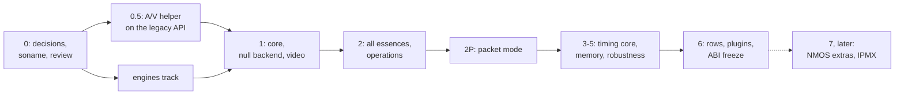

# Unified MTL API — list of changes

| | |
|---|---|
| Status | Proposal — revision 4 (five design reviews, a simplification pass, then the Kubernetes and NMOS/IPMX addenda K and N, then typed configuration and port first, §21). Nothing here is implemented; seventeen points need the maintainer's decision (§22) |
| Date | 2026-10-01 |
| Baseline | `main` @ `545a266a`; replaces PR #1610's `doc/new_API/List-of-changes.md` as the summary of what a new API would change |
| Details | the compiled headers and examples in [sketch/](../sketch/README.md); the readable API in [10](10-api-sketch.md); pictures in [samples/](samples/diagrams.md); a guided tour in [LEARN.md](LEARN.md); slides in [presentation/](../presentation/slides.md); what revision 4 changed in [REVISION-4.md](REVISION-4.md); the design rules in [00](00-summary.md)–[17](17-nmos-and-ipmx.md) |

This page lists every change the proposal makes, in bullet points, grouped by area. Each group
says what is wrong today, what changes, and what a user gains.

## 1. The idea in one paragraph

MTL gets **one session model for every ST 2110 essence** (video, compressed video, audio,
ancillary data, fast metadata, and app-built RTP packets), **driven by the application**: TX is
*acquire → fill → submit*, RX is *dequeue → read → release*, with one struct for the unit in
both directions. Every unit sent can get **exactly one result** that says whether it went out
on time. **Media time** (what a unit is) and **launch time** (when it leaves) are separate, so
audio, video and ANC from one file get exact, consistent RTP. **Nothing the application calls
runs on the pinned scheduler cores.** The header a program includes is small — `mtl.h`, 32
functions — and everything else is an optional header with one job. The packet builders,
pacing engines, RX reassembly and DPDK backends stay; they are fixed first, and the fixes reach
today's API too.

## 2. What stays the same

- The **packet builders, RX reassembly, pacing engines** (RL, TSC, TSN) and the DPDK PMD,
  AF_XDP and kernel-socket backends.
- **The legacy APIs** (`st20_*`, `st20p_*`, `st30p_*`, `st40p_*`, …) keep working unchanged
  during the transition and receive every engine bugfix; they become non-public only over
  three releases after the new API is frozen (§14).
- **Wire behaviour of legacy sessions** does not change unless the application opts in.
- MtlManager, the lcore model, hugepages and VFIO.

## 3. At a glance

| Area | Today | Proposed |
|---|---|---|
| Sessions | four exchange models (session callbacks, pipeline get/put, RTP level, slice); per-essence verbs and structs | one session type, one config, one verb set and one unit struct for every essence, in frame, row or packet units |
| First program | `mtl_init` + ops struct + create + get/put loop | a typed config (`mtl_flow_ipv4`, `raster.rate = MTL_FPS_59_94`, `format = MTL_YUV422_10`) + `mtl_session_open(mt, &sc, &s)` + acquire/submit loop + `mtl_session_close`: 42 lines |
| Outcome of a frame | "done" means an mbuf was freed; late reporting names no frame | one result per unit: `ON_TIME`, `LATE`, `DROPPED`, `FLUSHED` or `FAILED`, with a reason and a margin |
| Pinned cores | user callbacks, mutex + condvar, recovery, ARP waits run on tasklets | tasklets run packet work only; waking the app is a store + fence |
| Timing | one `timestamp` drives pacing and RTP | media time drives RTP (`floor(M × rate)`), launch derives from ST 2110-21 and the source kind |
| A/V sync | up to half a frame of RTP error between essences | exact by construction: a shared timeline and a start of several sessions at once |
| Memory | raw `{addr, iova}`, `mtl_dma_map` maps one port | regions mapped into every device, refcounted; one `mtl_session_attach` for a framework pool |
| RTP passthrough | DPDK mbufs, callbacks on the tasklet, no ST 2022-6 | packet units with the same verbs; a generic RTP essence for ST 2022-6 |
| Errors | `NULL`, or `-EIO` for many things | `MTL_E*` codes with one meaning each; `mtl_last_error()` names the field |
| Tuning | ≈ 200 flag bits and ops fields | ≈ 120 named options, absent unless set, listable by name |
| Observability | per-essence stats structs, reset on read | one registry of named, cumulative values; events with getters |
| Public headers | 14, the session layer included | `mtl.h` + 16 optional headers; the legacy headers opt-in, then internal |
| ABI | no soname, no struct versioning | `struct_size` + `MTL_INIT`, size-checked structs, a separate soname |
| Testing | a NIC for almost everything | a null backend, a test clock, fault injection |
| Pods | unbounded teardown waits, no health signal, open blocks up to 180 s | a bounded network-first shutdown, lock-free health for probes, fail-fast open (§19) |
| NMOS and IPMX | destination updates; no SDP helper, sender reports or encryption | one IS-05 update with its planned and applied instants; the rest of IS-05, SDP, IPMX and encryption designed for Phase 7, later (§20) |

## 4. One session model

- **One session type** (`mtl_session_h`) and **one config** (`struct mtl_session_config`) for
  every essence and direction: `direction`, `essence`, `flows`, and one member per essence
  (`sc.video`, `sc.audio`, …), of which only the selected one is read ([10 §1](10-api-sketch.md)).
- **One way in**: `mtl_session_open(mt, &sc, &s)` creates and starts from a typed config;
  `mtl_session_create` + `mtl_session_start` when the start needs an instant or several
  sessions; `mtl_session_query` is the dry run.
- **Typed fields only**: enums and defines, no configuration strings (§21).
- **The same verbs for all essences**: start, stop, close, acquire, submit, reap, dequeue,
  release, wait, update.
- **Direction-specific data verbs** (`mtl_tx_*`, `mtl_rx_*`), so no verb means opposite
  ownership moves in the two directions (a flaw of PR #1610's `buffer_get`/`buffer_put`).
- **ST 2110-41 gets frame-level RX** (RTP-only today); **ST 2110-22 is its own essence**.
- **Three unit kinds**: frames (or fields), rows published progressively (today's slice
  mode), and packets (today's RTP level, §11).

## 5. The data path: one unit struct

- **TX is app-driven**: `mtl_tx_acquire(s, &u, timeout)` lends a slot, the app fills
  `u.plane[]` and sets what this unit is (`u.media_index` or `u.media_tai_ns`, `u.cookie`),
  `mtl_tx_submit(s, &u)` hands it over. The library never calls into the app to pull frames.
- **RX is lending**: `mtl_rx_dequeue(s, &u, timeout)` lends a received unit with its status,
  frame index and RTP; the app reads it on any thread and `mtl_rx_release(s, u.lease)` returns
  it in any order — the `GstBuffer` / `AVBufferRef` model.
- **One struct for both**: `struct mtl_unit` replaces revision 3's buffer view, slot hint,
  submission and RX unit records; `MTL_INIT` it once, outside the loop.
- **A lease is its own C type**; a buffer is named by its slot index, so passing one for the
  other does not compile.
- **A failed submit cleans up after itself**: the slot goes back to the pool, so no loop needs
  a release branch.
- **Every accepted unit gets exactly one result** when results are on: a 96-byte record in
  submission order; pass a larger record size for the full timing detail. Results cannot be
  lost: they are built by the reader from the lease table.
- **Results on or off**: library pools produce none unless `MTL_SESSION_RESULTS` is set, so
  a minimal loop never stalls; application memory always produces them, because a result is
  how the app learns its memory is free.
- **Why acquire waits is reported**: `status.blocked_on` says `BUFFERS`, `RESULTS` or
  `APP_LEASES` (a leaked lease).
- **Copy essences need no buffer handling**: `mtl_tx_write(s, data, bytes, &how, timeout)`
  for audio, ANC and fast metadata; a received unit is a valid `how`, so passthrough is one
  call.

```c
/* today (st20p)                                  proposed */
struct st_frame* f = st20p_tx_get_frame(h);       int r = mtl_tx_acquire(s, &u, MTL_MS(100));
if (!f) continue;   /* timeout? stop? error? */   if (r == -MTL_EAGAIN) continue; /* only that */
fill(f->addr[0], f->linesize[0]);                 fill(u.plane[0].addr, u.plane[0].stride);
st20p_tx_put_frame(h, f);                         r = mtl_tx_submit(s, &u);  /* one result each */
```

## 6. Nothing on the pinned cores

- **No public API call executes on a scheduler tasklet**, and tasklets never run application
  code ([04](04-threading-and-execution.md)).
- **No mutex, condvar, allocation, log formatting or syscall on a tasklet** (DPDK PMD backend).
  Today the pipeline BLOCK_GET path does mutex + condvar on the pinned core.
- **Completion is one release store plus a fence**. If an application thread sleeps, the
  tasklet sets a bit and a **waker thread** makes the wake-up syscall.
- **One wait handle per session** (an eventfd on Linux, an event `HANDLE` on Windows) for
  epoll, GstPoll, asyncio or Rust `AsyncFd`. A data call that finds nothing arms it, so "drain
  until `-MTL_EAGAIN`, then sleep" never misses a wake-up.
- **Control changes are commands** acknowledged by the tasklet; one that is not acknowledged
  within 100 ms puts the session into ERROR — nothing waits forever.
- **Recovery, auto-detect, ARP, flow and IGMP work run on library workers**.
  `update_destination` no longer holds the session spinlock across a 60 s ARP wait.
- **Stats reads take no lock the tasklet uses**.
- **Call classes** (control, data, data with caller work, wait, async-signal-safe) are stated
  on every function and enforced in debug builds.

## 7. Errors, states and shutdown

- **Error codes instead of `NULL`**: every call returns 0 (or a count) or a negative `MTL_E*`
  code with Linux errno values on every OS ([07 §5](07-completions-events-and-errors.md)).
- **One meaning per code**: `-MTL_EAGAIN` nothing now; `-MTL_ECANCELED` interrupted;
  `-MTL_ESHUTDOWN` *you* stopped or closed the session; `-MTL_EIO` the session failed;
  `-MTL_ENODEV` the device is gone; `-MTL_EINVAL` a wrong argument, with the field named.
- **Why it failed**: `mtl_last_error()` gives the code, the reason (`mtl_reasons.h`) and the
  name of the config field or option at fault.
- **Explicit states**: created, armed, running, draining or flushing, stopped, error, closing.
- **Start at an instant**: `mtl_session_start(sessions, n, &when, &t0)` — now, at a TAI
  instant or at a media index, with preroll; several sessions at once, all or none.
- **Stop or close**: `mtl_session_stop` (drain or flush, restartable) and
  `mtl_session_close(s, timeout)` (drain, destroy, wait until nothing references the
  session's memory; null-safe).
- **Interruptible waits**: `mtl_session_interrupt(s, 1/0)` implements GStreamer `unlock` /
  `unlock_stop`; `mtl_instance_interrupt` is safe from a signal handler. Stop and close are
  never interrupted.
- **Deferred close**: closing while downstream still holds frames returns 1 at once; the
  session retires on the last release (`MTL_WAIT_RETIRED`). `GstBaseSrc::stop` and FFmpeg
  `read_close` can finish.
- **Update instead of re-create**: `mtl_session_update(s, &config, parts, &when, &planned)`
  changes flows, legs, format, pool size or options, keeping the handle, name, SSRC and stats.
- **Ports from the environment**: `mtl_instance_open(NULL, &mt)` reads `MTL_PORTS`, so
  a sample runs on any host; `MTL_INSTANCE_SHARED` replaces the singletons plugins write today.

## 8. Timing: media time and launch time

- **Two times, not one**. *Media time* (M) is what a unit represents; *launch time* is when
  its packets leave ([06 §4–5](06-timing-pacing-and-sync.md)).
- **RTP comes from media time only**: `RTP = floor(M × rate) mod 2^32`, exact rational
  arithmetic, one rule for every essence. The default video RTP becomes the frame epoch, so
  MTL's own ST 2110-20 and ST 2110-40 streams agree for the same frame.
- **The media mode is a session field**: `AUTO` (the next slot), `INDEX` (unit *k* of the
  timeline, exact), `TAI` (an instant, snapped to the grid).
- **Launch is derived** from the ST 2110-21 model and the **source kind** (`PLAYBACK`,
  `CAPTURE`, `GATEWAY`); experts override it per unit (`MTL_SUBMIT_NOT_BEFORE`, `EXACT`).
- **Late handling is explicit and bounded**: drop (the slot stays empty), bounded send-late,
  or reslot (AUTO only). Nothing ever slides.
- **The result says how close it was**: margin, sent time; the full record adds deadline,
  scheduled, enqueued and observed times.
- **Framework latency is declared**: `min_submit_lead_ns` (from the dry run) and
  `media_time_offset_ns`.
- **Keep-alive by default** for ANC and fast metadata; **ST 2110-22 is CBR**.

## 9. A/V/ANC synchronisation

- **A shared timeline** whose origin is fixed when its sessions start, on the common grid of
  their rates ([06 §3, §10](06-timing-pacing-and-sync.md)), and **one start for several
  sessions**: `mtl_session_start(s, 3, NULL, NULL)` arms video, audio and ANC together.
- **The maintainer's question is answered**: video, audio and ANC timestamped by unit index
  from one file carry exactly consistent RTP; a late video frame never shifts audio.
- **ANC and fast metadata follow their video**: their raster and rate come from the video
  they start with; live ANC is sent in the window of the frame its video is sent in.
- **Across processes**: the default timeline is the SMPTE epoch, and `mtl_epoch_index_at`
  gives every process the same frame number for the same instant.
- **Receivers too**: RX units carry `media_index`; `mtl_rx_align` gives the audio sample that
  goes with a video frame.
- **Available early on the legacy API**: a `st_timeline_*` helper with the same exact math
  (Phase 0.5).

## 10. Memory and zero-copy

- **Regions** are memory MTL may DMA: refcounted, mapped into every device the session uses
  (both 2022-7 ports and the DMA engine), and never destroyed while referenced. Today
  `mtl_dma_map` maps one port and keeps no reference ([05](05-memory-and-buffers.md)).
- **One call attaches a framework pool**: `mtl_session_attach(s, &a)` imports an arena and
  lays out N slots in the session's layout, with the reason when it does not fit (was ≈ 45
  lines in revision 3).
- **Slots by index**: `mtl_tx_acquire_slot(s, i, &u, timeout)` sends exactly surface i.
- **Zero-copy is a policy**: `MTL_SESSION_REQUIRE_DIRECT` fails at create rather than copy;
  otherwise the path used is reported per session and per unit.
- **Strided buffers stay zero-copy**: any stride ≥ the row size, so sub-rectangles and woven
  interlaced frames need no copy.
- **One RX frame can feed N TX sessions** zero-copy: each TX unit holds the RX unit
  (`u.hold`) until it is sent — the split-forward sample becomes zero-copy.
- **MXL-style rings**: `MTL_SESSION_RX_BY_INDEX` places frame *k* in slot *k mod N*.
- **Gaps read as zeros** in RX pools, as the repository rule requires.

## 11. RTP passthrough (app-built packets)

- **Today**: every essence has an RTP level that hands out DPDK `rte_mbuf`s, runs callbacks
  on the tasklet, ignores user pacing, finds frames only by "the timestamp changed", and
  cannot send ST 2022-6 (a 1396-byte packet against a 1352-byte limit)
  ([S8](simplification/S8-rtp-passthrough.md)).
- **Proposed**: `sc.unit = MTL_UNIT_PACKETS` on any essence. A unit is a chunk of packet
  slots: write the RTP packets, set their lengths, submit; mark the chunk that ends a frame.
  One result per chunk. The same verbs as frames.
- **The library writes Ethernet, IP and UDP**, and of the RTP header only the fields
  `packet.set_fields` names (timestamp, sequence, SSRC/PT, marker); by default nothing, so
  forwarding and pcap replay are verbatim.
- **Pacing follows the essence**: ST 2110-21 for video over the declared packets per frame,
  the packet time for audio, the ST 2110-40 window for ANC; or launch times per chunk, or as
  fast as possible.
- **ST 2022-7 for free**: every packet goes out on both legs; RX removes duplicates by
  sequence number and tells each packet's leg, gap and arrival time.
- **A generic RTP essence** (`MTL_RTP`) carries ST 2022-6 and payloads MTL does not packetise.
- **No mbufs, no callbacks, no app code on tasklets.**

## 12. Observability

- **One registry of named values**: every counter, gauge and histogram of a session, port,
  scheduler or instance has a stable name ("tx.units_late", "rx.pkts_lost{leg=1}",
  "port.rx_missed") and is read in bulk without locking a tasklet ([08](08-observability.md)).
  Exporters (Prometheus, OpenTelemetry) map it one to one.
- **Cumulative counters** (no reset, so several readers never interfere).
- **Events with getters**: link, PTP, legs, flows, signal, format change, recovery,
  back-pressure, timing warnings; every state an event reports also has a getter.
- **Lean typed status and info**: state, reasons, `blocked_on`, legs; the granted pool, path,
  pacing and latency range. Diagnostic values (TRS, TROFFSET, slot delay…) are "info.*" keys.
- **No silent downgrades**: what was granted is reported, and a dry run answers before create.
- **Logs never on tasklets**; `mtl_log_set_sink` routes them into the application's logger.
- **Packet capture** to pcapng from a library worker (`mtl_session_capture`).

## 13. Operations and NMOS

- **Atomic flow changes**: `mtl_session_update(s, &config, MTL_UPDATE_FLOWS, &when, &planned)`
  changes every leg at one instant, prepared before commit, all or nothing — an IS-05 scheduled
  activation maps one to one ([09 §7.1](09-media-modes-and-backends.md)).
- **Redundancy legs are managed**: every configured leg is reserved; `legs_disabled` takes a
  network out for maintenance; admin and oper state per leg.
- **Create and start never block on ARP or IGMP**; flow resolution is a per-leg state.
- **Stable identity**: session names are unique per instance and carried in events and logs;
  `mtl_instance_list_sessions` enumerates sessions for an exporter.
- **Capacity before activation**: the dry run with `MTL_QUERY_CHECK_CAPACITY`.
- **MtlManager loss is survivable**.

## 14. Only the high-level API is public

- **Today** the session headers (`st20_api.h` and siblings) are the vocabulary of every
  installed header: the pipelines, FFmpeg, GStreamer and codec plugins all depend on them.
- **Proposed**, in stages ([S9](simplification/S9-hiding-session-headers.md)): symbol version
  nodes in Phase 0; the legacy headers move to `include/mtl/legacy/` in Phase 1 with
  forwarding stubs; deprecated at the freeze release F; opt-in only at F+1; not installed from
  F+2, when libmtl's soname changes and `libmtl_unified.so.1` does not.
- **Nothing is lost on the way**: every capability reachable only through a session header
  has a home in the new headers, or is a removal you approve one by one (§22, M12).
- **Codec plugins get ABI v2** (`mtl_plugin.h`): a function table from the host, no libmtl
  link, no callback on a tasklet. **Colour conversion is one call** (`mtl_convert.h`)
  instead of ≈ 105 per-pair functions.

## 15. Frameworks and bindings

- **GStreamer**: `unlock`/`unlock_stop` map to `mtl_session_interrupt`; an exported buffer
  pool over leases; LATENCY and ALLOCATION from the dry run; deferred close for `stop`; every
  tuning knob as a property through the option names ([11 §6](11-abi-compatibility-and-migration.md)).
- **FFmpeg**: zero-copy RX with `av_buffer_create` over leases; real timestamps; AVOptions
  generated from `mtl_option_list`.
- **OBS**: input maps onto `mtl_rx_dequeue(timeout)`; real TAI timestamps on output.
- **Python and Rust**: plain handles and fixed structs, `mtl_struct_init` for any struct,
  copy-in/out helpers, no callbacks across the FFI.

## 16. ABI and headers

- **A real header set that compiles**: [sketch/](../sketch/README.md) holds 17 headers and 13
  examples; `check.sh` compiles them as C99 and C++17 with gcc and clang, `-Wpadded -Werror`,
  and checks the layering ([10](10-api-sketch.md)).
- **The include file is lean**: `mtl.h` has 32 functions and includes only the C library;
  125 functions in all headers (plus 14 under `MTL_LATER`), against 217 in revision 3.
- **Versioned structs**: input structs start with `struct_size` and are initialised with
  `MTL_INIT(&s)` (the caller's size, so an old program is safe on a new library); output
  structs are filled up to the size the caller passes; every struct has a size check.
- **Typed handles** with generation checks, so a stale handle fails instead of touching freed
  memory.
- **A real soname**, and the new API in its own library until the freeze.
- **One ABI on every OS**.

## 17. Testing

- **A null backend** (`null:<n>`): no NIC, no root, no hugepages; units complete at their
  scheduled time. `MTL_PORTS=null:1` runs every sample in CI.
- **A test clock** and **fault injection** (link down, queue hang, port reset, PTP step and
  loss, manager loss, forced error, packet loss) in debug builds only (`mtl_debug.h`).
- **Packet mode makes RX tests cheap**: out-of-order and truncated frames are built-in tests
  instead of needing a special sender.
- **Guarantees with contract tests** at the cheapest tier ([13](13-guarantees-and-tests.md)).

## 18. Delivery

- **Engines first**: the engine fixes (exact RTP math, admission and results, time sources,
  ANC keep-alive, ST 2110-22 CBR, RX deadlines, the RTP-level defects S8 found) land on the
  shared engines first. Bugfixes are on for legacy users; wire-visible changes are opt-in on
  the legacy API ([14 §2](14-implementation-roadmap.md)).
- **Phase 0.5 ships the A/V answer on the legacy API** in weeks.
- **Then the unified API**, phase by phase; packet mode is **phase 2P**, right after Phase 2,
  because hiding the legacy headers depends on it.
- **Port first**: Phases 1–6 port today's functionality, plus the Kubernetes lifecycle work
  (§19). The NMOS and IPMX extras are Phase 7, after the freeze (§20).
- **Effort** ≈ 55–85 engineer-months, plus 4–7 for packet mode; Phase 7 is outside the total.



## 19. Kubernetes pods and crash safety (addendum K)

- **Today**: teardown waits are unbounded, a timed-out tasklet unregister is followed by a
  free, lcore arbitration uses `kill(pid, 0)` across PID namespaces, no-IOMMU is not
  detected, and open blocks for up to 180 s ([16](16-kubernetes-and-crash-safety.md)).
- **One bounded shutdown, network first**: `mtl_instance_close(mt, timeout)` (was one
  argument). TX finishes the unit on the wire and flushes the rest, RX leaves its groups,
  the devices stop, MtlManager grants go back last. No step starts that the rest of the
  budget cannot finish.
- **Outcomes apart**: 0 retired; 1 quiesced (no device can reach any memory, but a lease, a
  region or a library thread still holds some); `-MTL_EIO` with reason `QUEUE_QUARANTINED`
  (a port could not be stopped: exit). `-MTL_ETIMEDOUT` keeps its "drain ran out" meaning.
- **A service's SIGTERM path**: `mtl_instance_shutdown(mt, flags, timeout, &report, size)` in
  `mtl_observe.h`; `MTL_SHUTDOWN_ALL_REFERENCES`, `MTL_SHUTDOWN_DRAIN`; the report's
  `summary` is one line for the termination message.
- **Handles never dangle** (R4): handle slots are process-wide and never freed. An object the
  instance closed answers `-MTL_ESHUTDOWN`; its close and its leases' release return 0.
- **The process owns signals and fork** (R8): no signal handler or `atexit` in the library
  (DPDK's SIGBUS handler during heap growth excepted); the async-signal-safe calls work at
  any time; every descriptor is close-on-exec; a forked child's copies are closed.
- **Crash-only**: everything held outside the process is tied to a descriptor the kernel
  closes, or reconciled at the next open; nothing is found by PID.
- **Health for probes**: `mtl_instance_get_health`, lock-free; liveness never depends on
  links, packets, PTP lock or a surviving 2022-7 leg; `MTL_EVENT_HEALTH` on every change.
- **From the pod**: CPUs from the affinity mask, every thread pinned, the SysV lcore table
  removed; VFs from `env:` port names; hugepages within the cgroup limit; time read, never
  steered.
- **Fail fast**: open checks the environment before any device, with one reason (600–614),
  and never waits for links, neighbours or lock.
- **No-IOMMU refused** unless `instance.allow_noiommu`; nothing written outside
  `instance.runtime_dir`.
- **ex11 is the pod example**: blocked signals, probes, a budget counted from SIGTERM.

## 20. NMOS and IPMX (addendum N)

- **Port first** (D-98): Phases 1–2 bring the atomic update with its planned and applied
  instants (it replaces today's `update_destination`) and per-leg enable. Everything else
  below is **Phase 7, later** ([14 §3.7–3.8](14-implementation-roadmap.md)): the design is
  kept, and the functions are declared under `MTL_LATER`, so the freeze does not block them.
- **The split stays**: the Node owns the registry, REST, JSON and `master_enable`; MTL owns
  what only the transport knows or can do on time ([17](17-nmos-and-ipmx.md)).
- **One IS-05 PATCH is one update**: `mtl_session_update(s, &sc, parts, &when,
  &planned_tai_ns)` gained the planned instant (the 202 response); `status.update_state`,
  `update_seq` and `update_applied_tai_ns` say when it applied (the 200), with
  `MTL_EVENT_UPDATE`.
- **The switch is by the clock**: at the slot boundary, whether a unit is there or not; a
  past instant means now; neighbours are resolved after commit, not awaited.
- **IS-05 semantics** (Phase 7): `MTL_UPDATE_REAPPLY`, `MTL_UPDATE_DRY_RUN`, cancel as `parts` 0; mute
  is every leg disabled (`MTL_STATUS_MUTED`, still RUNNING); reserved legs without an
  address; port changes while running.
- **`mtl_sdp.h`** (Phase 7): `mtl_sdp_render` and `mtl_sdp_parse`, both 2022-7 legs, colorimetry always.
- **`mtl_rtcp.h`** (Phase 7): IPMX sender reports with the Info Block on TX, report reception and
  sender time on RX. MTL's old `rtcp.*` NACK options are renamed `rtx.*`.
- **`mtl_crypto.h`** (Phase 7, after a cost spike): IPMX PEP encryption; the parameters are `crypto.*` options, keys only
  through `mtl_crypto_set_key`, never an IV and counter pair twice under one key.
- **The IPMX profile** (Phase 7): `session.profile` = IPMX changes zero defaults and compliance labels
  only.
- **Timing without PTP** (Phase 7): `MTL_TIME_SOURCE_FREERUN`, a clock that never steps; AUTO
  re-evaluated while running; `MTL_MEDIA_SENDER` for async sources;
  `MTL_SUBMIT_SENDER_TIME` for inline processors.
- **IS-04 values**: colorimetry, TCS and range in the config; the port's MAC;
  `mtl_time_set_reference` for a node-disciplined clock.
- **ex13 is one update per PATCH**.
- **Count**: the addenda's functions are all in optional headers; `mtl_sdp.h`, `mtl_rtcp.h`
  and `mtl_crypto.h` are under `MTL_LATER`.

## 21. Typed configuration and port first (D-97, D-98)

- **Revision 4 first had a string form**: a spec string (`"video tx addr=... 1080p59.94"`)
  next to the typed fields. The maintainer found it less readable and a bigger change for
  legacy users ([REVISION-4 §9](REVISION-4.md)).
- **Typed fields only**: enums and defines. `mtl_session_config_parse`, the spec grammar,
  `spec_options[16]`, the instance spec string and the string parsers of flows, rasters and
  rates are removed. `mtl_session_config` shrinks from 1320 to 936 bytes.
- **Opening**: `mtl_instance_open(&params, &mt)`; `MTL_PORTS` stays for tests and pods.
  `mtl_session_open(mt, &sc, &s)` creates and starts.
- **Helpers instead of parsers**: `mtl_flow_ipv4(&sc.flows[0], 239, 168, 85, 20, 20000)`;
  `sc.video.raster.rate = MTL_FPS_59_94`, or a rational in `raster.fps` for any other rate;
  `sc.audio.ptime = MTL_PTIME_1MS`.
- **The legacy order**: legacy + 1 where 0 means "not set" (`mtl_fps`, `mtl_video_format`,
  `mtl_audio_format`, `mtl_ptime`, `mtl_app_format`); the same values where 0 is a real
  default (`mtl_sender_type` = `st21_pacing`, `mtl_packing` = `st20_packing`).
- **A legacy field map**: every field of every legacy ops struct, and where it lives now
  ([11 §R4](11-abi-compatibility-and-migration.md)).
- **Option names stay**, for GStreamer properties, FFmpeg AVOptions and bindings; programs
  use the `MTL_OPT_*` constants.
- **Port first**: Phases 1–6 port today's functionality, plus the Kubernetes lifecycle work.
  The NMOS extras (`REAPPLY`, `DRY_RUN`, cancel, mute, reserved legs, port change while
  running), `mtl_sdp.h`, IPMX (RTCP, `FREERUN`, `SENDER`, the profile) and PEP are Phase 7
  ([14 §3.7–3.8](14-implementation-roadmap.md)).
- **Count**: `mtl.h` has 32 functions; 125 in 17 headers, plus 14 under `MTL_LATER`.

## 22. What needs a decision

Seventeen decisions need the maintainer ([OPEN-QUESTIONS.md](OPEN-QUESTIONS.md)); every other
question carries a proposed default.

| # | Decision | Recommendation |
|---|---|---|
| M1 | the core direction (push model, results, nothing on tasklets, one buffer contract, a new core over the existing engines) | confirm; engines first |
| M2 | wrap the pipelines through one internal slot interface | yes |
| M3 | media time primary with derived launch; source kinds | yes |
| M4 | the ST 2110-40 window for live ANC when video is late | the frame its video is sent in |
| M5 | no user code on tasklets in v1 | yes |
| M6 | may a pinned tasklet make the wake-up write for sub-millisecond sessions | yes, only below 1 ms |
| M7 | legacy wire changes | opt-in on the legacy API |
| M8 | the ABI promise | soname now; new API in its own library until the freeze |
| M9 | PR #1610 | keep as a reference, then close with credit |
| M10 | external design review, survey and staffing | review as the Phase 0 exit |
| M11 | the revision-4 shape (lean core, options, `MTL_INIT`, one unit struct, slots, one queue type, the samples-audit rules) | accept as one package |
| M12 | legacy capabilities proposed for removal | remove, unless the survey finds a user |
| M13 | wire-visible defaults of the unified API | accept |
| M14 | RTP passthrough defaults and phase | accept; phase 2P after Phase 2 |
| M15 | hiding the legacy headers | three tiers, F / F+1 / F+2 |
| M16 | running in Kubernetes pods: bounded network-first shutdown, crash-only rules (R8), health for probes, CPUs and time from the pod, fail-fast open, no-IOMMU refused by default | accept as one package |
| M17 | NMOS and IPMX: the IS-05 activation contract, `mtl_sdp.h`, `mtl_rtcp.h`, `mtl_crypto.h`, the IPMX profile and timing without PTP | accept as the design; implement in Phase 7 (D-98), `mtl_crypto.h` after its cost spike |

## 23. Compared with PR #1610

| PR #1610 | This proposal |
|---|---|
| one polymorphic session, media-specific create | one session and one config for every essence |
| `mtl_session_buffer_get` / `buffer_put` for both directions | `mtl_tx_acquire`/`submit` and `mtl_rx_dequeue`/`release`, with a lease type |
| library-owned vs user-owned session mode | one buffer contract; application memory is an attach |
| `mem_register` = an address lookup, no DMA map, no refcount | regions mapped into every device, refcounted, `-MTL_EBUSY` on destroy |
| one 64-entry event ring for completions and events, drop on full | results that cannot be lost, and separate coalescing events |
| wrapped the low-level session layer (timing metadata lost) | a new core over the hardened pipelines through an explicit slot interface |
| user-owned RX copies inside the RX tasklet | no copy, conversion or zero-fill on a tasklet |
| auto-start at create; `stop` only a flag | real states, start at an instant, drain or flush, close |
| one timestamp field | media time and launch time, exact RTP, shared timelines |
| ST20 frame mode only | every essence, TX and RX, frames, rows and packets |
| no ABI versioning | `struct_size`, `MTL_INIT`, size checks, soname |
