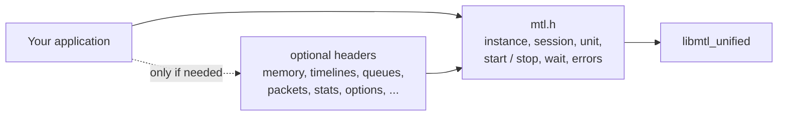
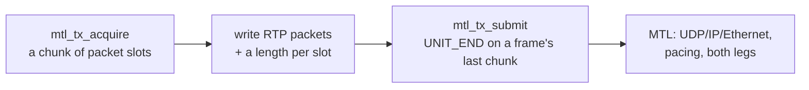

# Revision 4: a simpler API with the same reach

| | |
|---|---|
| Status | Design revision 4 for maintainer review, 2026-10-01. Nothing is implemented |
| Normative | the header set in [sketch/include/mtl/experimental/](../sketch/include/mtl/experimental/) and the examples in [sketch/examples/](../sketch/examples/); `sketch/check.sh` compiles them |
| Why | the maintainer found the diagrams and samples too complicated and asked for the leanest possible include file, more defaults, simpler helpers and better abstraction, while keeping every use case MTL covers today; RTP passthrough must become part of the high-level API, and `include/st20_api.h` and the other session-level headers should stop being public |
| How | nine studies ([simplification/](simplification/)): S1 coverage inventory, S2 object model, S3 configuration, S4 data path and memory, S5 observability and errors, S6 a minimal alternative designed from scratch, S7 the samples from a user's point of view, S8 RTP passthrough, S9 hiding the session headers; the designer merged them into one header set, then two reviews checked it (R4 coverage, R4 header review) |
| Supersedes | where a design document 00–15 still uses a revision-3 name (§6 maps them), this document and the header win |

## 1. What changed, in numbers

| | Revision 3 | Revision 4 |
|---|---|---|
| Headers | 3: `mtl_unified.h`, `mtl_simple.h`, `mtl_debug.h` | 14: a core `mtl.h` plus 13 optional headers, each with one job |
| What a first program includes | `mtl_unified.h`: 3029 lines, 203 functions | `mtl.h`: 33 functions (about 1000 lines, most of them the contract in comments) |
| Exported functions, all headers | 217 | 126 (+6 reserved for later phases) |
| Struct types / enums | 93 / 79 | 24 / 25 in the core |
| `*_init()` functions | 37 | 0: one `MTL_INIT(&s)` for every input struct |
| Handle types | 9 (+ the simple handle) | 5 in the core (instance, session, lease, region, timeline), 2 in extensions (queue, plugin) |
| Ways to create a session | 5 creates, 5 queries, a simple layer | one typed config: `mtl_session_open(mt, &sc, &s)` (create and start), or `mtl_session_create` + `mtl_session_start`; one dry-run `mtl_session_query` (D-97: no spec strings) |
| Data-path structs a sender or receiver touches | 5 (view, hint, submission, RX unit, TX result) + the lease | 1 (`struct mtl_unit`) + the result record |
| Typed knobs per video TX session | ≈ 85 | ≈ 40 typed fields; the rest are named options, absent unless set |
| Example lines (minimal TX / zero-copy TX / A/V/ANC / forwarder) | 63 / 139 / 120 / 88 | 34 / 60 / 75 / 59 with spec strings; 42 / 67 / 86 / 59 with typed fields (D-97) |
| Rules a reader of the examples must know but cannot see (S7 count) | 115 | the rest are in the call names and the defaults; each example's first comment lists the defaults it relies on |
| RTP passthrough (app-built packets) | legacy API only (NG2) | first class: `unit = MTL_UNIT_PACKETS` on every essence, plus a generic RTP essence for ST 2022-6 |
| Legacy session headers | stay public, frozen | moved behind an opt-in, then internal (§4) |

## 2. The shape

A program needs the core and nothing else. It does five things with one struct:

| Step | Sender | Receiver |
|---|---|---|
| 1. describe | `MTL_INIT(&sc)`; `sc.direction = MTL_TX`; `sc.essence = MTL_VIDEO`; `mtl_flow_ipv4(&sc.flows[0], 239, 1, 1, 1, 20000)`; raster, `rate = MTL_FPS_59_94`, `format = MTL_YUV422_10` | `MTL_RX`, the same fields |
| 2. create and start | `mtl_session_open(mt, &sc, &s)`, or `mtl_session_create` + `mtl_session_start(&s, 1, NULL, NULL)` | the same |
| 3. move a unit | `mtl_tx_acquire(s, &u, timeout)` → fill `u.plane[0]` → `mtl_tx_submit(s, &u)` | `mtl_rx_dequeue(s, &u, timeout)` → read → `mtl_rx_release(s, u.lease)` |
| 4. learn the outcome | `mtl_tx_reap` (only when results are on) | `u.status`, `u.media_index` |
| 5. stop | `mtl_session_close(s, timeout)`: drain, destroy, wait for retirement | the same |

The optional headers add one job each:

| Header | Include it to |
|---|---|
| `mtl_mem.h` | send from or receive into your own memory (framework pools, MXL rings), lend one session's pool to another, address a slot by index, size buffers before create |
| `mtl_sync.h` | start sessions on a fresh shared timeline, compute media indices, convert clocks, align audio to video on receive |
| `mtl_queue.h` | read events, or wait on many sessions through one queue |
| `mtl_packet.h` | build or parse RTP packets yourself (RTP passthrough) |
| `mtl_observe.h` | export stats, read full timing records, route logs, capture packets |
| `mtl_options.h` | set a tuning knob by key or by name |
| `mtl_reasons.h` | branch on a reason code (`mtl_reason_name()` is enough to log one) |
| `mtl_format.h` | use an application pixel format other than the wire format |
| `mtl_util.h` | the copy path for audio/ANC, one-call sends from a slot, parsers, ANC helpers |
| `mtl_plugin.h`, `mtl_convert.h` | write a codec plugin; convert colour formats outside a session |
| `mtl_legacy.h`, `mtl_debug.h` | share an instance with legacy code; test clocks and fault injection |

## 3. The decisions

Each row names the study it came from. "Approval" marks a change to a rule an earlier review asked for, or a cut; §5 collects them.

| ID | Decision | From | Approval |
|---|---|---|---|
| D-71 | A lean core `mtl.h` and 13 optional headers; `mtl_unified.h` and `mtl_simple.h` are retired. The core includes only `<stddef.h>` and `<stdint.h>`; every extension includes the core | S2 P10, S5 §3, S9 | M11 |
| D-72 | One `struct mtl_session_config` carries the direction, the essence and one member per essence (only the selected one is read; the others must be zero). One create, one dry-run query, one spec-string parser. The parser replaces the simple layer | S2 P4c, S3 P3/P8, S6 §7.7 | M11 |
| D-73 | Typed fields only for what most applications set and what the timing recipes of 06 §10.8 need; every other knob is an option (`mtl_options.h`): absent means the default, present is literal, every key has a string name and can be listed before any session exists | S3 P1/P2 | M11 |
| D-74 | Input structs carry `struct_size` and are initialised with `MTL_INIT(&s)` (the caller's size, so an old program on a new library is safe); output structs carry none and are filled up to the size argument of the getter. No per-struct init functions, no struct kinds | S5 P8 (fixes the out-of-bounds write of the exported `*_init`) | M11 |
| D-75 | One `struct mtl_unit` is what acquire and dequeue lend and what submit reads: lease, slot, planes, meta area, and the per-use fields (used, flags, media time, cookie, hold, launch time). The submission, view, slot hint and RX unit structs are gone; the slot hint is a getter in `mtl_sync.h` | S4 P1/P2, S6 §7.1 | — |
| D-76 | A buffer is a pool slot named by its index; `mtl_buffer_h` and the buffer object calls are retired. One `mtl_session_attach` imports and lays out N slots. The lease stays its own C type, so a slot index can never be passed where access is moved | S4 P4, S6 §7.2 | M11 (touches C5 §2.5) |
| D-77 | Results: a 96-byte core record, the full timing record selected by passing its size. One completion rule: a session over application memory always produces results; a library pool produces them only with `MTL_SESSION_RESULTS` | S4 P3/P6 | M11 (EXCEPTIONS mode cut) |
| D-78 | No group object: `mtl_session_start` and `mtl_session_stop` take an array; a start array is one timeline and one direction, all or none. ANC and fast-metadata sessions take their raster from the first video session of their start | S2 P5, S3 P5 | — |
| D-79 | Events and shared queues in `mtl_queue.h`: one queue type gathers results, RX readiness and events of many sessions behind one wait object; results stay lossless and ordered. Each session keeps its own events. The instance event queue, user-posted events and per-port subscriptions are removed | S2 P7, S5 P6/P7 | M11 |
| D-80 | Stats are one registry of named values (`mtl_observe.h`), read in bulk without locking a tasklet; the fixed stats structs and the eight host-status structs are gone. Session status (80 B) and info (256 B) keep only what a running application branches on | S5 P1–P4 | M11 |
| D-81 | One reason vocabulary (`mtl_reasons.h`) for errors, states, events and TX results | S5 P5 | — |
| D-82 | RTP passthrough is a unit kind, `MTL_UNIT_PACKETS`, on every essence, plus a generic RTP essence for ST 2022-6 and custom payloads; a chunk of packet slots is one unit with one result (§4.1). Supersedes D-25 and NG2 | S8 | M14 |
| D-83 | The legacy headers become non-public in three tiers (public, legacy opt-in, internal), staged over three releases; codec plugins get ABI v2 (`mtl_plugin.h`, no libmtl link); colour conversion is one call (`mtl_convert.h`) | S9 | M15 |
| D-84 | `mtl_last_error()` follows the errno contract (valid until the next call that is not AS); `mtl_call_seq()` is removed | S5 P9 | M11 |
| D-85 | `time_source = AUTO` means the NIC clock if disciplined, else system TAI; the built-in PTP client runs only when named | S3 P9 | M11 |
| D-86 | ANC packet tables and user meta live in the slot's meta area on TX as on RX, and are snapshotted at submit, so a later write by the application cannot reach the wire | S4 P2 (the snapshot variant) | — |
| D-87 | Coverage gate: every row of the S1 inventory has a revision-4 home, a later phase, or an approved cut ([R4-coverage-check](simplification/R4-coverage-check.md); met after the fixes of §7, pending M12) | S1, S9 §7 | M12 |
| D-88 | The samples-audit rules: a failed submit returns the slot to the pool; `-MTL_EAGAIN` is the one "nothing now" code and a miss arms the wait handle; interrupts cancel data waits only; `mtl_session_close` and `mtl_session_open`; a plain wait handle; `MTL_PORTS` | S7 | M11 (reverses C2 and 03 §4.1 "fix and resubmit") |

## 4. The two requirements added on 2026-10-01

### 4.1 RTP passthrough in the high-level API

What exists today ([S8 §1](simplification/S8-rtp-passthrough.md)): every essence has an RTP level.
The application gets a DPDK `rte_mbuf` as a `void*` and writes the RTP header and payload; the
library adds Ethernet/IP/UDP, paces and duplicates. It works, but:

- it exposes mbufs and runs application callbacks on the tasklet;
- it ignores user pacing on every essence and finds frame boundaries only by "the timestamp changed";
- it cannot send ST 2022-6 at all: a 2022-6 packet is 1396 bytes, the limit is 1352.

S8 lists sixteen defects with code references.

What revision 4 does ([example 12](../sketch/examples/ex12_rtp_packets.c), [mtl_packet.h](../sketch/include/mtl/experimental/mtl_packet.h)):

- The same verbs and the same unit struct as frames: plane 0 holds the slots, the meta area holds one length per slot, `used` is the packet count.
- The library writes L2–L4 always, and of the RTP header only the fields in `packet.set_fields` (timestamp, sequence, SSRC/PT, marker); 0 means verbatim, every byte from the RTP header on is the application's.
- Pacing follows the essence: ST 2110-21 for video over the declared packets per frame, the packet time for audio, the ST 2110-40 window for ANC, linear for generic RTP; or per-chunk launch times, or as fast as possible.
- RX hands out chunks of received packets with a table entry each: address, length, leg, extended sequence, gap, arrival time. Duplicates of the two legs are removed by sequence number unless an analyser asks for both.
- `MTL_RTP_PASSTHROUGH` of revision 3 (the application chooses the RTP timestamp of library-built packets) is renamed `MTL_SUBMIT_RTP_TS`, so "passthrough" means one thing.

### 4.2 Only the highest-level API is public

Today the session headers are the vocabulary of every other installed header: `st_pipeline_api.h` includes `st20_api.h`, and FFmpeg, GStreamer and the codec plugins use types from it. They cannot simply stop being installed ([S9 §2.4](simplification/S9-hiding-session-headers.md)). Revision 4 adopts S9's plan:

| Stage | When | What applications see |
|---|---|---|
| 0 | Phase 0 | symbol version nodes `MTL_LEGACY_SESSION`, `MTL_LEGACY_PIPELINE`, `MTL_LEGACY_CORE`, `MTL_INTERNAL`; hidden visibility; a soname. Nothing changes for consumers |
| 1 | Phase 1 | the legacy headers move unchanged to `include/mtl/legacy/` with forwarding stubs; no consumer source changes |
| F | the ABI-freeze release | legacy prototypes are deprecated; including a legacy header warns unless `MTL_LEGACY_API` is defined |
| F+1 | next release | a legacy header without `MTL_LEGACY_API` is an error; legacy only through `pkg-config mtl-legacy` |
| ≥ F+2 | 14 §7 | legacy headers are not installed; the session layer is internal; libmtl's soname changes, `libmtl_unified.so.1` does not |

The library keeps its session engine (the pipelines and the packet mode are built on it), and
the in-tree tests keep testing it through an internal dependency. Before stage F, every feature
reachable only through the session headers needs a unified home or an approved cut. S9 lists 19
gaps (H-01…H-19): after the R4 reviews, 14 have a home in the headers, 3 are in a named later
phase under `MTL_LATER` (RX destinations per unit, GPU memory, inline notification), and 2 are
removals on the M12 list (user tasklets, queue meta).

## 5. What needs your decision

Five decisions are added to [OPEN-QUESTIONS.md](OPEN-QUESTIONS.md) (M11–M15). Each has a recommendation; the tables below are the detail.

**M11 — the revision-4 shape.** Accept D-71…D-80, D-84 and D-85 as one package. They change rules earlier reviews set:

| Rule of revision 3 | Revision 4 | Why it is safe |
|---|---|---|
| every knob a typed field (A8/D-46) | typed core, named options for the rest | keys are enum constants, validated at create with the key named in the error; listable for frameworks |
| an exported `*_init()` per struct (D-22, A3/A7) | `MTL_INIT(&s)` | fixes an out-of-bounds write the per-struct form has across versions |
| distinct buffer and lease handles (C5 §2.5) | slots by index, leases typed | the blocker was "misuse compiles"; an index cannot be passed as a lease |
| completion modes NONE / EXCEPTIONS / ALL | results on or off; always on for app memory | EXCEPTIONS saved bandwidth, not safety; lateness stays in counters and events |
| separate CQ and EQ objects, an instance EQ, user posts | one queue type; per-session events | one wait object per framework element; user posts are not an MTL feature today |
| the simple layer | `mtl_session_open` with a spec string | a first program is 34 lines without a second handle type |
| `-MTL_EAGAIN` for timeout 0, `-MTL_ETIMEDOUT` for an expired wait (C2) | `-MTL_EAGAIN` for both | every loop handled them alike (S7 F-06) |
| a failed submit leaves the lease with the caller | the slot returns to the pool | seven examples carried a release branch, and a missed one leaked the pool (S7 F-05) |
| `mtl_session_destroy` + `MTL_DESTROY_FORCE` + waiting for `SESSION_RETIRED` | `mtl_session_close(s, timeout)` | one call, null-safe; it returns 1 while the application still holds leases |
| `mtl_call_seq()` | errno contract | one less call on every failure path |
| `time_source = AUTO` may start built-in PTP | only when named | no surprise PTP client |

**M12 — legacy capabilities proposed for removal.** None is used by an in-tree consumer beyond tests, a sample or RxTxApp; each needs a yes or a no.

| Candidate | Evidence (S1 §6, S9 §7.2) | If kept |
|---|---|---|
| header split RX | needs a DPDK patch absent for the pinned 26.07; one sample, one test | a later phase with the patch |
| `uframe_pg_callback` (app code per pixel group on the tasklet) | violates "no app code on tasklets"; RxTxApp and two tests | per-packet conversion stays as the option `rx.convert_per_packet` |
| `st20rc` redundant-combined RX | two-leg sessions do the same; one sample | — |
| public per-pair converters (≈105) | replaced by `mtl_convert()`; per-pair stay internal for tests | — |
| public user DMA (`mtl_udma_*`), public lcore borrowing | perf tools and tests only; sessions use DMA through `caps.dma` | an advanced header later |
| user schedulers and tasklets (`mtl_sch_*`) | one integration test | an advanced header with the inline-safe DP subset |
| `ST22_*_FLAG_DISABLE_BOXES`, RTCP flags on audio/ANC/fastmeta | no consumer; the RTCP flags do nothing today | — |
| queue meta / `DATA_PATH_ONLY` | tests only; suspected NULL dereference | an extension table after a verification test |
| `st_draw_logo`, `mtl_memcpy`, `mtl_sleep_us`, `mtl_delay_us`, `mtl_thread_setname`, `mtl_get_if_ip`, `mtl_udma_fill` | thin wrappers, zero or one consumer | — |
| deprecated or dead fields (`tx/rx_sessions_cnt_max`, `sample_size/num`, `sip_addr`, RX `pacing/packing`, `MTL_FLAG_BIND_NUMA`, ST40P `FORCE_NUMA`, `st40p_rx_ops.rtp_ring_size`, UDP transport remnants) | documented as unused | — |
| DPDK AF_XDP and AF_PACKET PMD backends | native AF_XDP and kernel sockets cover them | an experimental backend name |
| `st22_tx_ops.fmt`, `st22_rx_ops.fmt` | ignored by today's library (found by the field map, 11 §R4.15) | a `cvideo` sampling field |

**M13 — wire-visible defaults.** Unchanged from M7's rule for the legacy API (opt-in there); in the unified API: the default video RTP from the frame epoch, incomplete RX frames delivered (with status) instead of dropped, ST 2110-22 constant bitrate, and packet mode verbatim by default. Recommendation: accept all four.

**M14 — RTP passthrough defaults and phase.** S8's Q-PKT-1…9, with these recommendations:

- verbatim by default; RX chunks formed at dequeue by count or timeout;
- the generic RTP essence carries RTP only (no raw UDP yet); per-packet launch offsets later;
- RX copies in the caller by default, with a bounded zero-copy lend; no RX reordering;
- ST 2022-6 headers are written by the application; tests inject faults through packet mode;
- packet mode is phase 2P, right after Phase 2, because hiding the session headers depends on it.

**M15 — the hiding schedule.** S9's Q-HIDE-1…4: approve the three tiers and the F / F+1 / F+2 stages; keep `libmtl_unified.so.1` a separate library at the freeze so the legacy removal bumps only libmtl's soname; decide the pipeline headers' removal date at the Phase 2 go/no-go; user tasklets as an advanced opt-in or a cut (M12).

## 6. Revision 3 → revision 4 names

For readers of documents 00–15, which still use revision-3 names.

| Revision 3 | Revision 4 |
|---|---|
| `mtl_unified.h`, `mtl_simple.h` | `mtl.h` + extensions; `mtl_session_config_parse` |
| `mtl_<essence>_session_create/query` | `mtl_session_create/query` with `sc.essence` |
| `struct mtl_video_config` etc. as a separate argument | `sc.video`, `sc.cvideo`, `sc.audio`, `sc.anc`, `sc.fastmeta`, `sc.rtp` |
| `sc.timing.*`, `sc.pool.*`, `sc.completion`, `sc.caps`, `sc.options` | `sc.media_mode`, `sc.source_kind`, `sc.timeline`, `sc.min_tx_delay_ns`, `sc.media_time_offset_ns`, `sc.pool_count`, `sc.flags`; the rest options |
| `MTL_DIR_TX`, `MTL_ESSENCE_VIDEO` | `MTL_TX`, `MTL_VIDEO` |
| `*_init()`, `MTL_*_INIT(...)` | `MTL_INIT(&s)` |
| `mtl_instance_open_simple`, `_acquire_default`, `_release` | `mtl_instance_open(spec, params)` (+ `MTL_INSTANCE_SHARED`), `mtl_instance_close` |
| `mtl_instance_interrupt_all` / `uninterrupt_all` | `mtl_instance_interrupt(mt, 1 / 0)` |
| `mtl_tx_acquire(s, &lease, &view, &hint, t)` | `mtl_tx_acquire(s, &unit, t)`; hint: `mtl_tx_next_slot` |
| `mtl_tx_submit(s, lease, &submission)` | `mtl_tx_submit(s, &unit)` |
| `mtl_tx_publish` | submit the same lease again with a larger `used` |
| `mtl_rx_dequeue(s, &lease, &view, &rx_unit, size, t)` | `mtl_rx_dequeue(s, &unit, t)`; detail: `mtl_rx_get_detail` |
| `mtl_buffer_h`, `mtl_buffer_create`, `mtl_session_attach_buffers` | slot index `unit.slot`; `mtl_session_attach(s, &attach)` |
| `mtl_tx_acquire_buffer` | `mtl_tx_acquire_slot` |
| `mtl_buffer_hold` | `mtl_tx_pin(s, slot, on)` |
| `mtl_rx_transfer` | `mtl_tx_send_slot` with `how.hold = rx lease` |
| `MTL_COMPLETE_*` | `MTL_SESSION_RESULTS` (library pools); always for app memory |
| `mtl_group_*` | `mtl_session_start/stop` with an array |
| `mtl_timeline_open/destroy/get_anchor`, `mtl_timeline_epoch` | `mtl_timeline_create` (with a name), `mtl_timeline_close`, `mtl_timeline_get_info`; null = the epoch |
| `mtl_start_params`, `mtl_activation` | `struct mtl_when` |
| `mtl_session_reconfigure`, `update_flows`, `set_leg_enabled` | `mtl_session_update(s, &config, parts, &when)` |
| `mtl_session_discard_queued` | `mtl_session_discard` |
| `mtl_session_stop` + `mtl_session_destroy` | `mtl_session_close(s, timeout)`; `mtl_session_stop` stays for stop-and-restart |
| `mtl_session_get_wait_object` + `struct mtl_wait_object` | `mtl_session_get_wait_handle(s, mask, &native)` |
| `mtl_session_trywait` + `mtl_session_wait` | `mtl_session_wait` (`-MTL_EAGAIN` = nothing ready, armed); any data call returning `-MTL_EAGAIN` also arms |
| `mtl_mem_destroy` | `mtl_mem_close` (retires at the last reference) |
| `mtl_*_session_query` + `mtl_session_get_buffer_requirements` | `mtl_session_query(mt, &sc, flags, &info, size, &req, size)` |
| `MTL_RT_*` / `MTL_TT_*` validity masks | `MTL_UNITF_*` unit flags, `MTL_TXR_*` result flags |
| `MTL_FLOW_USER_MAC` | `MTL_FLOWF_USER_MAC` |
| `mtl_rx_wait_progress` | `mtl_rx_wait_rows` |
| `mtl_session_uninterrupt` | `mtl_session_interrupt(s, 0)` |
| `mtl_cq_*`, `mtl_eq_*`, `mtl_session_bind_cq/eq` | `mtl_queue_*`, `mtl_session_read_events` |
| `mtl_session_get_stats`, `mtl_*_stat_get`, port/sched/mem/time status getters | `mtl_stat_list/find/read/get` |
| `enum mtl_state_reason`, `enum mtl_tx_reason` | `enum mtl_reason` |
| `MTL_RTP_PASSTHROUGH`, `rtp_override` | `MTL_SUBMIT_RTP_TS`, `unit.rtp` |
| `MTL_UNIT_PACKET_CHUNK` (reserved) | `MTL_UNIT_PACKETS` |
| `mtl_session_set_option` and `MTL_OPT_*` (13 keys) | `mtl_set_option` and ≈ 120 keys in `mtl_options.h` |
| `mtl_time_test_source`, `mtl_time_test_advance` | `mtl_test_clock`, `mtl_test_clock_advance` |

## 7. The two reviews of revision 4

**Coverage check** ([R4-coverage-check](simplification/R4-coverage-check.md)), every row of the S1 inventory against the headers:

| | Revision 3 | Revision 4 as reviewed |
|---|---|---|
| covered or covered differently | 160 | 229 |
| partly covered | 34 | 24 |
| later phase | — | 5 |
| not covered | 93 | 8 |
| removal candidates (M12) | — | 24 |

The fixes below added a home for every row that was not covered and for most partly covered
ones. The coverage agent's re-check of the fixed headers ([R4-coverage-check §8](simplification/R4-coverage-check.md)):

| | Revision 4 after the fixes |
|---|---|
| covered or covered differently | 256 (212 + 44) |
| partly covered | 4 (bit layouts of pixel groups, a general copy call, the legacy stats-field map, a session cookie) |
| later phase | 5 |
| not covered | 0 |
| removal candidates (M12) | 24 |

S9's 74 session-only features: 56 covered, 1 partly, 3 later, 14 removal candidates. The device
abort the re-check still listed is now `mtl_instance_abort`, and a region's address is in
`mtl_mem_info.va` for IOVA computations.

The ten regressions it found are fixed: RX row waits (`mtl_rx_wait_rows`, `rx.rows_step`), `enum mtl_backend`, the stats key catalogue ([08 §R4](08-observability.md)), the reserved ST 2110-22 slice packing, and the two later-phase calls (`mtl_sched_run_once`, `mtl_open_ext`) back under `MTL_LATER`.

**Adversarial review** ([R4-header-review](simplification/R4-header-review.md)): 1 Blocker, 15 Major, 24 Minor, 11 Nit, plus 8 that the samples-audit changes had already fixed. All Blockers and Majors are fixed in the headers:

| Finding | Fix |
|---|---|
| a failed re-submit of a rows unit freed a slot still being sent (Blocker) | a rows unit that was accepted once ends where its rows stopped and still gets its one result |
| the meta-area layout disagreed with the packet helpers | frame units: header first; packet units: the table at `meta`, no header |
| the D-86 snapshot was missing | the meta area is validated and copied at submit |
| close, arming, update, start arrays, the audio index and the ANC raster were under-specified | each has its rule in the header (close always consumes; one wake request per target; fields outside `parts` must match; index periods per essence; ANC raster required on the epoch timeline) |
| options from a spec string had no storage; option scopes had four meanings | `spec_options[16]` inside the config; one scope convention with a descriptor field |
| pools over another session's pool and `RX_BY_INDEX` could touch memory in use | the hold must be the owner's same slot; a leased slot is never written over |
| plugin formats shared one number space; callbacks contradicted R6 | `MTL_PLUGIN_APP()`; R6 names the two library threads that call application code |

Most Minors and Nits are fixed too (names such as `MTL_UNITF_*`, `MTL_FLOWF_*`, `mtl_tx_pin`, `mtl_mem_close`; the requirements folded into `mtl_session_query`; `MTL_UPDATE_OPTIONS` removed; output structs zero what the library does not know). The few left are recorded in the review file.

**Now:** 14 headers, 126 functions (+6 for later phases), the core 33. They compile warning-free as C99 (`-Wpadded -pedantic`) and C++17 (`-pedantic`) with gcc and clang; every struct has a size check; the core includes only the C library. Documents 00–15 describe the design rules, which revision 4 keeps; their API names are revision 3's, and §6 maps them.

## 8. Addenda of 2026-10-01: Kubernetes, NMOS and IPMX

Two requirements came after the simplification pass:

- *"design API in a way that the library can safely work in kubernetes pod"*;
- *"we also want to work with NMOS and IPMX, please make sure that proposed API will be suitable with those"*.

Five studies answered them:

- [K1](kubernetes/K1-kubernetes-runtime.md) (the Kubernetes runtime), [K2](kubernetes/K2-mtl-code-audit.md) (an audit of today's code) and [K3](kubernetes/K3-shutdown-prior-art.md) (shutdown prior art);
- [N1](interop/N1-nmos-requirements.md) (NMOS requirements) and [I1](interop/I1-ipmx-requirements.md) (IPMX requirements).

Two design documents, [16](16-kubernetes-and-crash-safety.md) and [17](17-nmos-and-ipmx.md),
turn them into header changes. Three reviews, [RK](reviews/RK-kubernetes-review.md),
[RN](reviews/RN-nmos-ipmx-review.md) and [RA](reviews/RA-api-coherence-review.md), found 118
issues. Five were rated Critical or Blocker:

- the documented pod could not pin memory as non-root;
- objects closed by an instance's shutdown could be used after free;
- a signal during shutdown could write into a recycled descriptor;
- an IS-05 activation applied only when media flowed;
- two headers could not be included together (an enum and a struct shared a tag).

All five are fixed, and so is almost every other finding ([response](reviews/RKNA-response.md)).
A verification pass ([RV](reviews/RV-verification.md)) found nine fixes that had left stale
text and thirteen incomplete ones. The stale text is fixed. The IPMX-only gaps are open
items for Phase 7 (14 §3.8).

| | Before the addenda | Now |
|---|---|---|
| Headers | 14 | 17: `mtl_rtcp.h`, `mtl_crypto.h` and `mtl_sdp.h` added |
| Functions | 126 (+6 later) | 135 (+8 later): health, shutdown, the time reference, SDP render and parse, three RTCP calls, the crypto key call |
| `mtl.h` | 33 functions | 33 functions; `mtl_instance_close` takes a timeout, `mtl_session_update` returns its planned instant |
| Rules | R1–R7 | R1–R8: R4 handle slots are process-wide; R5 says what a time is without PTP; R8 is the process rule (signals, fork, crash-only) |
| Decisions | M1–M15 | M1–M17: M16 Kubernetes (D-89…D-92), M17 NMOS and IPMX (D-93…D-96) |
| Engine fixes | E1–E13, R1, R2 | plus EK1–EK21 (16 §11) and SF-56…SF-68 in [side-findings.md](side-findings.md) |

check.sh now also compiles every header together, in both orders and as C++. That probe
caught a tag clash between `enum mtl_rtcp_sr` and `struct mtl_rtcp_sr`, which the per-header
runs missed.

## 9. Typed configuration, and port first (2026-10-01, later)

The maintainer's direction after the addenda:

- *"session parameters passed by string is a mistake. It is less readable, and this is a big
  change. I would like to reduce the friction during movement from legacy API to new API.
  please use enums or defines."*
- *"for now I don't care about crypto and sdp unless it is requirement from IPMX or NMOS ...
  in implementation plan don't put any effort into those ... IPMX features for later ... first
  we need to port current functionalities."*

What changed (D-97, D-98):

| | Before | Now |
|---|---|---|
| Describing a session | a spec string (`"video tx addr=... 1080p59.94 format=yuv422_10"`) or fields | typed fields only: enums and defines; `mtl_session_open(mt, &sc, &s)` |
| Opening an instance | `mtl_instance_open(spec, &params, &mt)` | `mtl_instance_open(&params, &mt)`; `MTL_PORTS` stays for tests and pods |
| Enum values | revision 4's own order | the legacy order: `+ 1` where 0 means "not set" (`mtl_fps`, `mtl_video_format`, `mtl_audio_format`, `mtl_ptime`, `mtl_app_format`), the same values where 0 is a real default (`mtl_sender_type` = `st21_pacing`, `mtl_packing` = `st20_packing`) |
| Named rates | a rational only | `raster.rate = MTL_FPS_59_94` (or a rational for other rates); `audio.ptime = MTL_PTIME_1MS` |
| Addresses | `mtl_flow_parse("239.1.1.1:20000")` | `mtl_flow_ipv4(&f, 239, 1, 1, 1, 20000)` |
| Migration | the rename map of §6 | plus a field-by-field map of every legacy ops struct ([11 §R4](11-abi-compatibility-and-migration.md)) |
| `mtl_session_config` | 1320 B | 936 B (no `spec_options[16]`) |
| SDP, RTCP, PEP | in the v1 surface | declarations under `MTL_LATER`; Phase 7 (14 §3.8) |
| Functions | 135 (+8 later); `mtl.h` 33 | 125 (+14 later); `mtl.h` 32 |

Option names stay: they are how GStreamer properties, FFmpeg AVOptions and bindings list
every knob without code per knob. Programs use the `MTL_OPT_*` constants.
