# The examples as pictures

| | |
|---|---|
| Status | Revision 4, 2026-10-01: one picture per example, plus pictures of the ideas the examples share |
| Code | each picture names its example in [sketch/examples/](../../sketch/examples/); the code compiles |
| Legend | blue = your application, green = MTL, grey = the network or another system. Arrows carry verb names only; error handling is in [picture 18](#18-what-a-return-code-tells-you) |

Rules these pictures follow, so they stay readable: one idea each, at most about eight boxes, only what an application sees (the inside of MTL appears once, in [picture 17](#17-under-the-hood-nothing-waits-on-the-pinned-cores)), the happy path, and no function arguments.

## 1. Send video (ex01)

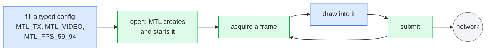

A typed config (enums and defines, no strings) describes the stream and `mtl_session_open` creates and starts it; MTL owns the buffers; each submitted frame goes out in the next slot. Nothing has to be read back, and one `close` at the end sends what is queued and cleans up.

## 2. Receive video on two networks (ex02)

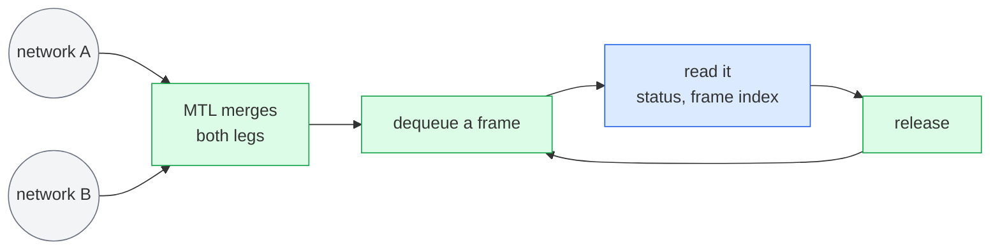

Two flows in the config (`sc.flows[0]` and `sc.flows[1]`) are two ST 2022-7 legs. A frame with lost packets still arrives, marked incomplete, with the gaps read as zero.

## 3. One frame's life

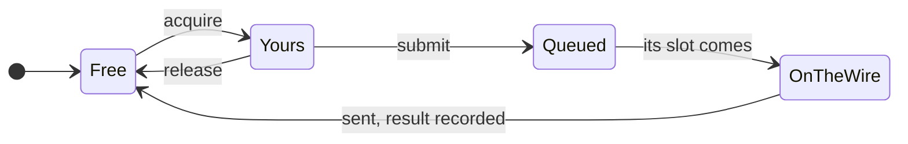

While a frame is yours, MTL never touches it. After submit it is MTL's until it has been sent; exactly one result says what happened (on time, late, dropped, flushed or failed).

## 4. In your own event loop (ex03)

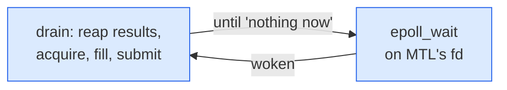

Every MTL call that finds nothing arms the file descriptor before it returns, so "drain until nothing, then sleep" never misses a wake-up.

## 4a. A session's life

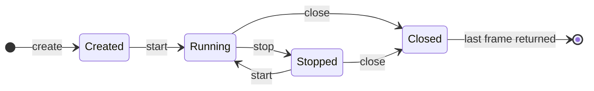

`mtl_session_open` goes straight to Running. If the session fails it moves to an error state that only stop and close leave ([picture 18](#18-what-a-return-code-tells-you)).

## 5. Zero copy from a framework's pool (ex04)

The framework's memory is attached once as the session's slots. Because it is your memory, every frame produces a result, and a surface goes back only when its result says the network is done with it.

## 6. Received frames handed to a framework (ex05)

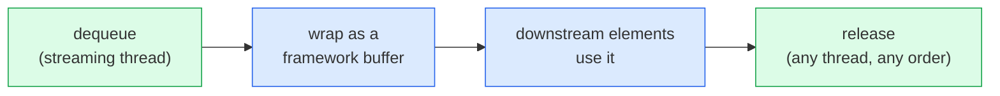

A received frame stays valid until it is released, on whatever thread drops it. Interrupting the session wakes a blocked dequeue (GStreamer `unlock`).

## 7. Into an MXL ring by frame number (ex06)

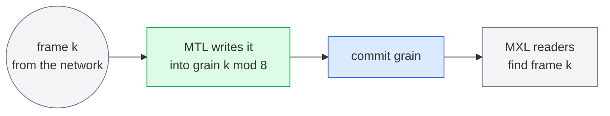

The ring is the session's pool. Frame numbers count from the SMPTE epoch, so every process agrees on which grain holds frame k.

## 8. Video, audio and captions from one file (ex07)

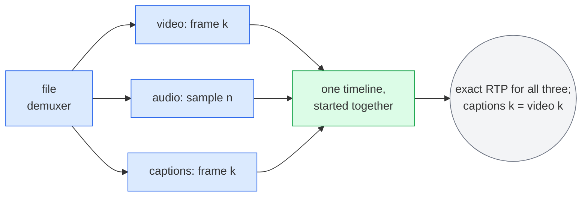

Each unit says which frame or sample it is. Because the three sessions start together on one timeline, MTL turns those numbers into timestamps that agree exactly.

## 9. Rows leave before the frame is finished (ex08)

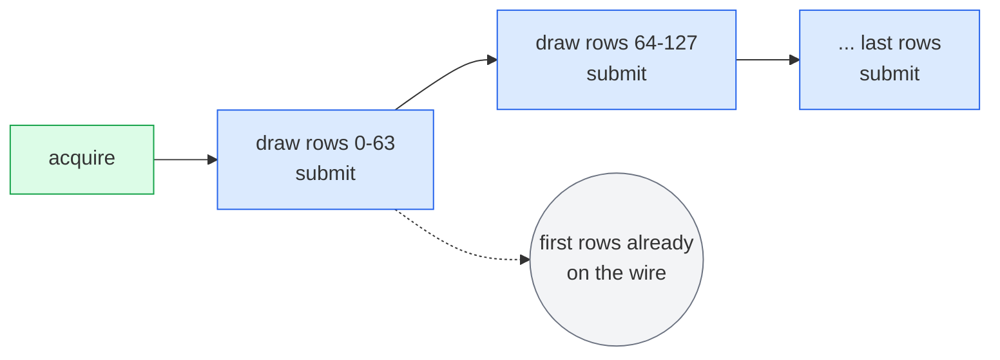

For an SDI-to-IP gateway: each submit of the same frame publishes more rows, and the first rows are sent while the rest are still being drawn.

## 10. One 4K frame in, four HD streams out, no copy (ex09)

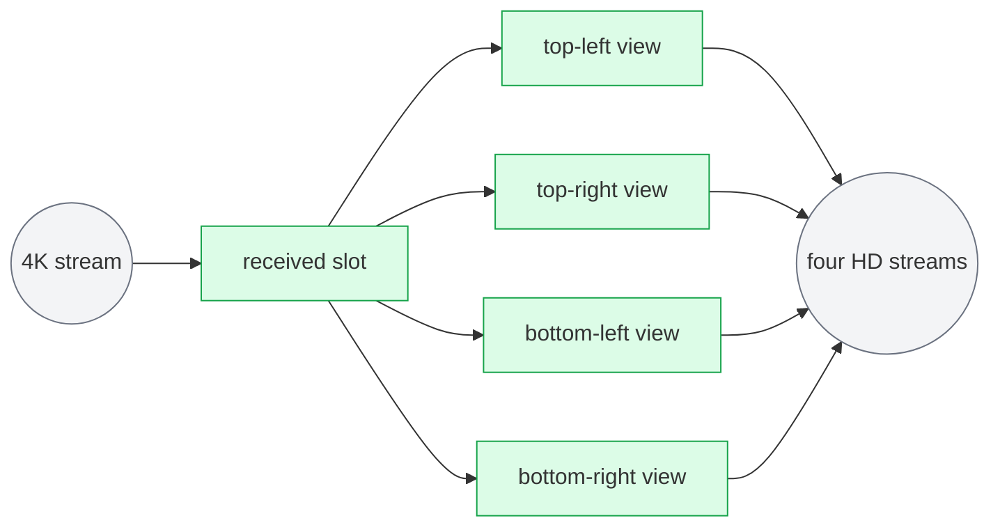

Each HD sender's slots are windows into the receiver's slots. Every send holds the received frame until it has left, so nothing is copied and nothing is freed early.

## 11. A processor that keeps the input's timing (ex10)

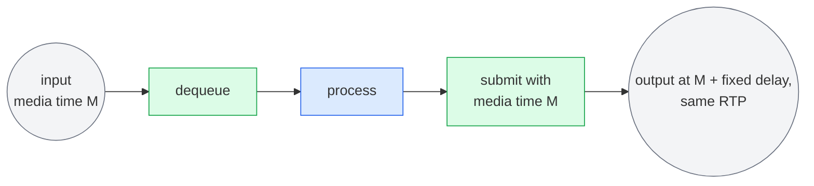

The output carries the input's media time, so its RTP timestamps match the input's and the delay through the processor is constant.

## 12. A service in a Kubernetes pod (ex11)

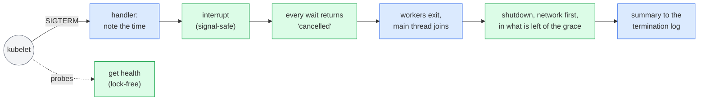

The signals are blocked before open and unblocked once the handler has the handle, so none is lost; the library installs no handler of its own. The interrupt is sticky, so a worker cannot miss it between two waits.

The budget counts from the signal: the shutdown finishes the unit on the wire, leaves the groups, stops the devices and returns 0 (retired), 1 (quiesced: exit is safe) or `-MTL_EIO` (a port could not be stopped: exit now). A second signal calls abort, which cuts the shutdown short. Liveness fails only on what a restart can fix; after the shutdown began it stays 200 while readiness answers 503.

## 13. RTP passthrough: you build the packets (ex12)

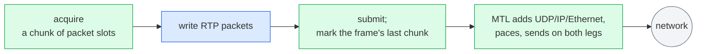

The same verbs as frames. MTL writes only the network headers and the RTP fields you ask it to (none by default). Receiving works the same way in reverse: chunks of packets with their leg, sequence number and arrival time.

## 14. An IS-05 activation at one instant (ex13)

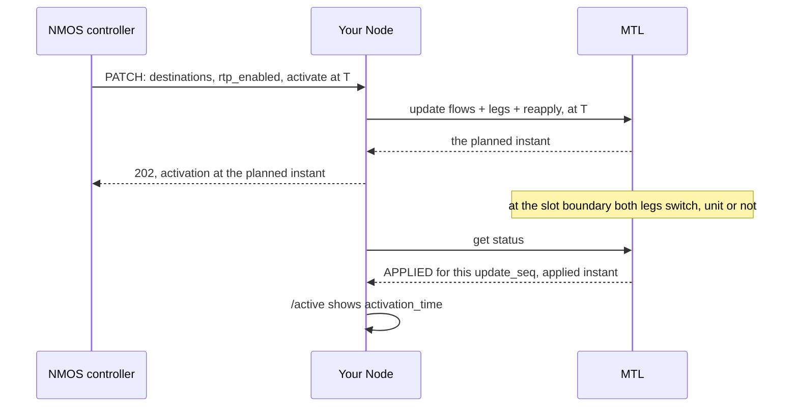

One PATCH is one update, all or nothing (the update with its planned and applied instants is ported in Phase 2; re-apply and mute are Phase 7, later):
if a leg cannot be prepared, the stream keeps its old configuration. The switch is by the clock, so an idle sender activates too. With `master_enable` false the Node disables every leg: the session is muted but stays RUNNING. A status whose `update_seq` moved on, or that says REPLACED, CANCELLED or FAILED, means this activation did not apply.

## 15. Media time and launch time

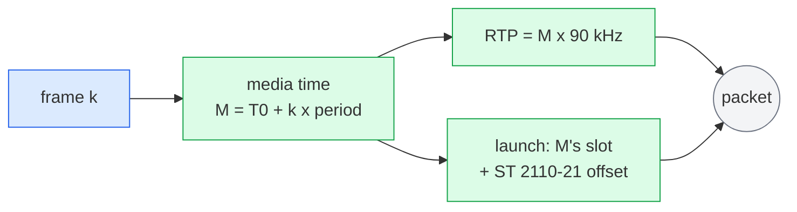

What a frame *is* (its media time, and so its RTP timestamp) is separate from when it *leaves*. A late frame is dropped or sent late, but never moves the frames after it.

## 16. Which header do I need?

| You want to | Include |
|---|---|
| send or receive with MTL's buffers | `mtl.h` only |
| use your own memory, or lend one session's pool to another | `+ mtl_mem.h` |
| keep several essences in sync, or compute frame numbers | `+ mtl_sync.h` |
| build or parse RTP packets yourself | `+ mtl_packet.h` |
| read events, or wait on many sessions at once | `+ mtl_queue.h` |
| export stats, route logs, capture packets, answer probes, shut down with a report | `+ mtl_observe.h` |
| set a tuning knob | `+ mtl_options.h` |
| render or parse SDP (Phase 7, later) | `+ mtl_sdp.h` |
| send or read IPMX sender reports (Phase 7, later) | `+ mtl_rtcp.h` |
| encrypt with IPMX PEP (Phase 7, later) | `+ mtl_crypto.h` |

## 17. Under the hood: nothing waits on the pinned cores

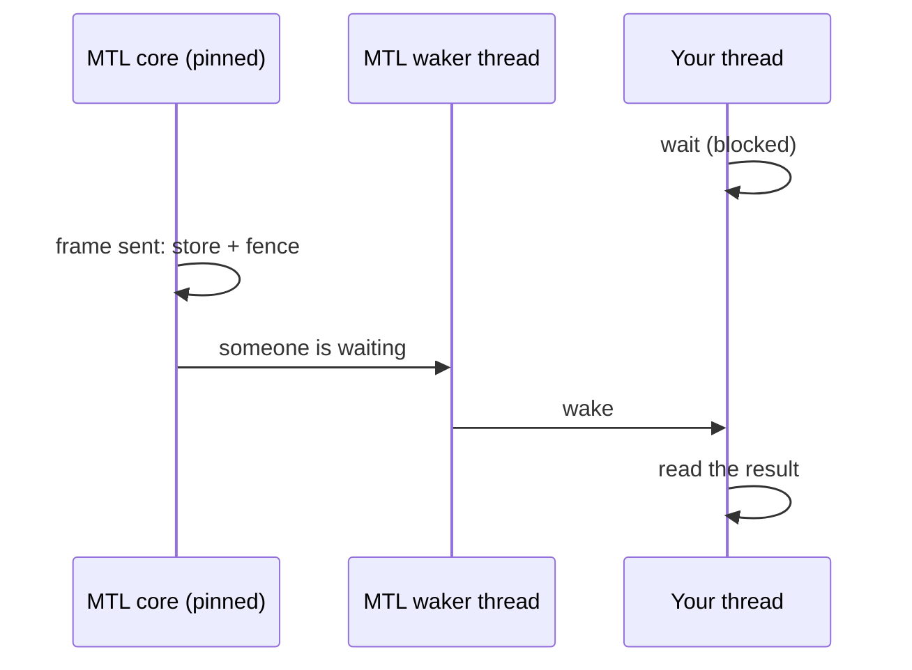

The pinned cores only send and receive packets. They never run application code, never take a lock an application holds, and leave the one system call of a wake-up to a library thread.

## 18. What a return code tells you

| You get | It means | Do |
|---|---|---|
| `-MTL_EAGAIN` | nothing yet (the wait handle is armed) | try again, or sleep on the wait handle |
| `-MTL_ETIMEDOUT` | a stop or close deadline passed | the rest was flushed |
| `-MTL_ECANCELED` | someone interrupted the waits | leave, or wait again after `interrupt(..., 0)` |
| `-MTL_ESHUTDOWN` | you stopped or closed the session | leave the loop |
| `-MTL_EIO` | the session failed | read `status.error_reason`; stop, then start again or destroy |
| `-MTL_ENODEV` | the device is gone | stop, update the session onto another port, start |
| `-MTL_EINVAL` | a wrong argument | `mtl_last_error()` names the field |
