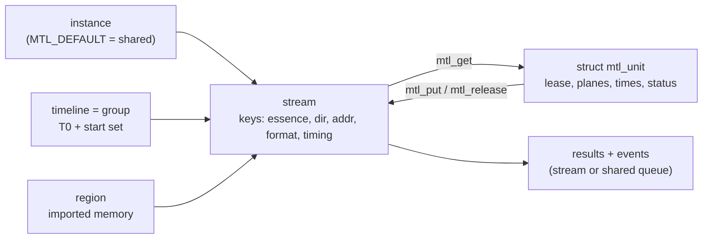

# S6 — A minimal alternative API, designed from first principles

| | |
|---|---|
| Status | Simplification study for the maintainer. This is an **alternative** to the revision-3 design, not a revision of it. Nothing is implemented or decided |
| Date | 2026-10-01 |
| Compared with | revision 3: [`sketch/include/mtl/experimental/mtl_unified.h`](../r3-sketch/include/mtl/experimental/mtl_unified.h) (3029 lines) plus `mtl_simple.h` and `mtl_debug.h` |
| Core header | [`S6-alt/mtl_alt.h`](S6-alt/mtl_alt.h): 381 lines, 30 functions, 7 structs, 6 enums. It compiles warning-free as C99 and C++17 with gcc 13 and clang (`-Wall -Wextra -Wpadded -pedantic -Werror`) |
| Owner update | covers RTP passthrough (packet-chunk units) for every essence, TX and RX, with the same verbs as frames (§2.2) |

## 1. The idea

Revision 3 is large for three reasons, and none of them is the data path. First, every configuration
choice is a typed struct field. That means 93 structs, 37 `*_init()` functions and a `struct_size` rule
everywhere. Second, every object kind has its own handle type and its own copy of the generic verbs:
close, wait, trywait, interrupt, uninterrupt, get wait object, read. Third, one unit of media shows up
as five different structs: the buffer view, the slot hint, the submission, the RX unit record and the
TX result. S6 keeps the revision-3 engine contract — leases, reader-side results, timelines, regions
and the timing model — and removes those three sources of size.

**Configuration is keys.** An object is created from a spec string, for example
`mtl_stream(inst, "video tx addr=239.1.1.1:20000 width=1920 height=1080 fps=59.94 format=yuv422_10bit", &s)`.
`mtl_set()` and `mtl_get_*()` set and read keys, the way libfabric `fi_setopt`, GStreamer properties and
FFmpeg AVOptions do. Every key defaults to zero or absent. An unknown key returns `-MTL_ENOTSUP`, which
doubles as a feature test, and new keys never break the ABI. Granted values, status and statistics are
read-only keys. The key catalogue (§2.1) lives in the documentation and in an optional `mtl_keys.h`,
not in the core header. A running stream **stages** key changes, and `mtl_apply(s, at, when)` commits
them on every leg at one activation. That single verb covers revision 3's `update_flows`,
`set_leg_enabled` and `reconfigure`.

**One unit struct.** `struct mtl_unit` (320 bytes, frozen size) holds:

- the lease (the only access token, with its own C type);
- the buffer's pool index (its identity, never an access token);
- up to four planes;
- media index and TAI media time;
- launch, deadline, first and last times, with a validity mask;
- status, reason, cookie, RTP timestamp, byte and sample counts;
- an extension chain.

`mtl_get` lends one, `mtl_put` sends it, `mtl_results` returns it as a TX result, and `mtl_attach`
uses an array of them to describe imported buffers. The unit also says how it is timed: `time_mode`
is 0 (AUTO), INDEX or TAI, so the session-level media mode disappears. Packet-chunk units for RTP
passthrough use the same struct, with plane 0 holding packet slots and plane 1 holding lengths (§2.2).

**One object handle and one queue type.** Instances, streams, timelines, queues and regions share one
handle type, `mtl_h`. Its kind byte is checked on every call, as the kernel checks a file descriptor.
So `mtl_close`, `mtl_wait`, `mtl_wait_handle`, `mtl_interrupt`, `mtl_events` and `mtl_set` and
`mtl_get` work on every kind of object. A **timeline is also the group**: streams name a timeline in
their spec, and `mtl_start(timeline, MTL_AT_INDEX, 0)` arms every member at one T0, all or none.
Results, RX units and events are read from the stream itself, or from a shared queue that streams bind
to by name. A null instance argument means the refcounted process-wide default instance, so a first
program needs no instance code and no separate "simple" layer.



What does not change: the tasklets do packet work only, and completing a unit is one store plus a
fence. Every accepted TX unit gets exactly one of ON_TIME, LATE, DROPPED, FLUSHED or FAILED, built by
the reader from the lease table. RTP is `floor(M × rate)` from media time. Launch time is derived from
ST 2110-21 and the source kind. Regions are refcounted and mapped into every device. Zero-copy is a
`require | prefer | allow` policy, and the null backend, the error codes and the call classes are the
same as in revision 3.

## 2. The core header

This is the complete file [`S6-alt/mtl_alt.h`](S6-alt/mtl_alt.h).

```c
/* SPDX-License-Identifier: BSD-3-Clause
 * Copyright(c) 2026 Intel Corporation
 *
 * mtl_alt.h - S6 minimal alternative to the unified MTL API (design sketch, nothing is
 * implemented). Explained in doc/unified-api/simplification/S6-minimal-alternative.md.
 *
 * R1 Returns: 0, or a count/mask >= 0, on success; a negative MTL_E* code on failure.
 * R2 Timeouts are the last argument, in ns: 0 = do not wait, MTL_FOREVER = no limit.
 *    Nothing ready with timeout 0 is -MTL_EAGAIN; an expired timeout is -MTL_ETIMEDOUT.
 * R3 mtl_h names any object: instance, stream, timeline, queue or region. Its kind is
 *    encoded in the id and checked on every call (-MTL_EBADF, like a file descriptor).
 *    id 0 is null; as an instance argument it means the process-wide default instance.
 *    A lease (mtl_lease_h) is the only access token and has its own C type; a buffer's
 *    identity is a plain pool index (mtl_unit.buf) that no access-moving call accepts.
 * R4 Configuration is keys: "key=value" strings set with mtl_set*() and read with
 *    mtl_get*(). Zero or absent is the default of every key. An unknown key is
 *    -MTL_ENOTSUP (feature test); a bad value is -MTL_EINVAL with the key named in
 *    mtl_last_error(). Keys are control plane only; the data path uses fixed structs.
 *    The key catalogue is in the S6 document and in the optional mtl_keys.h.
 * R5 Data structs have frozen sizes (size checks below); reserved fields must be zero;
 *    a zero-filled struct is the default. Growth goes through the mtl_unit.ext chain.
 * R6 Call classes: CP control plane (may allocate and block); DP data plane (O(1), no
 *    allocation, syscall or lock a tasklet takes); WT wait (DP when timeout is 0); AS
 *    async-signal-safe. No call runs on an MTL tasklet and the library never calls
 *    application code. From a library busy-loop thread only DP calls with timeout 0
 *    are legal; anything else returns -MTL_EDEADLK.
 */

#ifndef MTL_ALT_H
#define MTL_ALT_H

#include <stddef.h>
#include <stdint.h>

#if defined(__cplusplus)
extern "C" {
#endif

#if defined(_WIN32)
#define MTL_API __declspec(dllimport)
#elif defined(__GNUC__)
#define MTL_API __attribute__((visibility("default")))
#else
#define MTL_API
#endif

#define MTL_FOREVER ((int64_t)-1)
#define MTL_US(x) ((int64_t)(x)*1000)
#define MTL_MS(x) ((int64_t)(x)*1000000)
#define MTL_SEC(x) ((int64_t)(x)*1000000000)
#define MTL_MAX_PLANES 4

/* ---- Errors: Linux errno values on every OS, one meaning each ------------------- */

#define MTL_EIO 5         /* the object failed (ERROR); "status.reason" says why */
#define MTL_EBADF 9       /* null, destroyed or wrong-kind handle */
#define MTL_EAGAIN 11     /* nothing now (timeout 0) */
#define MTL_ENOMEM 12     /* allocation failed */
#define MTL_EBUSY 16      /* in use, or not allowed in this state */
#define MTL_EEXIST 17     /* name in use with another configuration */
#define MTL_ENODEV 19     /* device gone or reset */
#define MTL_EINVAL 22     /* invalid argument or key value; see mtl_last_error() */
#define MTL_ENOSPC 28     /* capacity: queues, lcores, regions, payload size */
#define MTL_ERANGE 34     /* time outside the accepted window */
#define MTL_EDEADLK 35    /* not allowed from a library busy-loop thread */
#define MTL_ENOTSUP 95    /* unknown key or absent capability */
#define MTL_ESHUTDOWN 108 /* the app stopped or closed the object */
#define MTL_ETIMEDOUT 110 /* the timeout expired */
#define MTL_ESTALE 116    /* a lease that was already returned */
#define MTL_ECANCELED 125 /* waiters interrupted; sticky until mtl_interrupt(h, 0) */

/* ---- Handles -------------------------------------------------------------------- */

typedef struct mtl_h {
  uint64_t id; /* | kind:8 | reserved:8 | index:16 | generation:32 | */
} mtl_h;
typedef struct mtl_lease_h {
  uint64_t id; /* | stream index:16 | slot:16 | generation:32 | */
} mtl_lease_h;
#if defined(__cplusplus)
#define MTL_DEFAULT (mtl_h{0})
#else
#define MTL_DEFAULT ((mtl_h){0})
#endif

/* ---- Units: one struct for every essence, both directions and every use ---------- */

/* One plane of a unit. Frame units: rows of pixels or bytes. Packet units: plane 0 is
   `rows` packet slots of `stride` bytes (RTP header + payload, no UDP/IP), plane 1 is
   `rows` uint16_t packet lengths, optional plane 2 is `rows` int64_t TAI arrival times
   (RX). With MTL_U_SCATTER plane 0 holds `rows` packet pointers instead of slots. */
struct mtl_plane {
  void* addr;         /* NULL in a layout query */
  uint32_t stride;    /* bytes between rows (or packet slots); >= row_bytes */
  uint32_t row_bytes; /* valid bytes per row (packet units: slot capacity) */
  uint32_t rows;      /* rows (packet units: packets in this unit) */
  uint32_t reserved;
};

enum mtl_time_mode { /* how a TX unit names its media time (input of mtl_put) */
  MTL_TIME_AUTO = 0, /* the next slot; get() suggests it in `index` */
  MTL_TIME_INDEX = 1, /* `index` on the stream's timeline: exact RTP */
  MTL_TIME_TAI = 2,   /* `media_ns` in TAI, snapped to the grid */
};

enum mtl_status { /* results (TX) and deliveries (RX); 0 is never terminal */
  MTL_STATUS_NONE = 0,
  MTL_ON_TIME = 1,
  MTL_LATE = 2,    /* sent late within late_tolerance_ns */
  MTL_DROPPED = 3, /* not sent; `reason` says why, its slot stays empty */
  MTL_FLUSHED = 4, /* stop(FLUSH), stop(DISCARD) or close */
  MTL_FAILED = 5,  /* device or queue failure; `reason` */
  MTL_COMPLETE = 6,
  MTL_INCOMPLETE = 7, /* RX: pkts_lost > 0; missing data reads as zero (library pools) */
};

/* mtl_unit.flags: inputs (put, write) */
#define MTL_U_DISCONTINUITY 0x1u /* media time jumps; a new time_mode is allowed */
#define MTL_U_REBASE 0x2u        /* map `index` to the next feasible slot (seek) */
#define MTL_U_PARTIAL 0x4u /* more follows: rows (same lease) or packet chunks (next) */
#define MTL_U_LAUNCH_NOT_BEFORE 0x8u /* user pacing: first packet not before launch_ns */
#define MTL_U_LAUNCH_EXACT 0x10u     /* first packet at launch_ns (flagged non-compliant) */
#define MTL_U_RTP 0x20u              /* send `rtp` as the RTP timestamp (rtp=passthrough) */
#define MTL_U_SCATTER 0x40u          /* packet units: plane 0 is a packet pointer table */
/* mtl_unit.flags: outputs */
#define MTL_U_USED_REDUNDANCY 0x10000u /* RX: complete thanks to the other 2022-7 leg */
#define MTL_U_COPIED 0x20000u          /* this unit did not take the direct path */
#define MTL_U_NON_COMPLIANT 0x40000u   /* EXACT launch, or a timing model violation */
#define MTL_U_SNAPPED 0x80000u         /* TAI media time moved to the grid */
#define MTL_U_RESLOTTED 0x100000u      /* AUTO unit moved to a later slot */

/* mtl_unit.time_valid: which time fields hold a value (zero is a valid time) */
#define MTL_T_INDEX 0x1u
#define MTL_T_MEDIA 0x2u
#define MTL_T_LAUNCH 0x4u
#define MTL_T_DEADLINE 0x8u
#define MTL_T_FIRST 0x10u
#define MTL_T_LAST 0x20u
#define MTL_T_MARGIN 0x40u
#define MTL_T_HW 0x80u        /* first/last are NIC timestamps, not software estimates */
#define MTL_T_ESTIMATED 0x100u /* the time base is not locked (e.g. SYSTEM_TAI) */

/* A unit is what get() lends, put() sends, results() returns and attach() describes.
   Field use by call (TX = transmit stream, RX = receive stream):
     get TX:     lease, buf, planes; index + deadline_ns = the next slot and its submit-by
     put TX:     lease, time_mode + index/media_ns, flags, cookie, hold, launch_ns, size,
                 samples, rows_ready, rtp, meta (copied), ext
     result TX:  everything from put + status, reason, launch_ns (scheduled), first_ns /
                 last_ns (wire), deadline_ns, margin_ns, rtp; lease is stale, buf valid
     get RX:     everything: status, index/media_ns, first_ns/last_ns (arrival),
                 deadline_ns (presentation = media + link_offset_ns), rtp, size, samples,
                 pkts_lost, meta (ANC packet table or sender user meta), planes
     attach:     planes (addresses inside an imported region) and cookie per buffer
   get() reads only `buf` (with MTL_GET_BUF) and `ext` (with MTL_GET_EXT) and writes
   every other field, so an uninitialised unit is fine for get. Zero a unit you build
   yourself (mtl_write, attach). */
struct mtl_unit {
  mtl_h stream;      /* the stream (results read from a shared queue) */
  mtl_lease_h lease; /* access to this slot, from get until put or release */
  mtl_lease_h hold;  /* TX: an RX lease kept alive until this unit's result (fan-out) */
  uint64_t cookie;   /* TX: returned in the result; RX: the attached buffer's cookie */
  int64_t index;     /* media index on the stream's timeline */
  int64_t media_ns;  /* TAI media time; RTP = floor(media x rate) */
  int64_t launch_ns; /* TX: requested (MTL_U_LAUNCH_*) or scheduled first packet */
  int64_t deadline_ns;
  int64_t first_ns; /* TX: first packet on the wire; RX: first packet arrival */
  int64_t last_ns;
  int64_t margin_ns; /* TX: deadline - submit; negative = late */
  uint32_t time_mode; /* enum mtl_time_mode */
  uint32_t time_valid; /* MTL_T_* */
  uint32_t status;     /* enum mtl_status */
  uint32_t reason;     /* MTL_REASON_* (mtl_reasons.h); mtl_reason_name() */
  uint32_t flags;      /* MTL_U_* */
  uint32_t buf;        /* pool index of the buffer: identity, never an access token */
  uint32_t rtp;        /* RTP timestamp of the first packet */
  uint32_t size;       /* valid bytes: audio, ANC user data words, fastmeta, cvideo */
  uint32_t samples;    /* audio samples */
  uint32_t rows_ready; /* progressive: rows [0, rows_ready) are final */
  uint32_t pkts_lost;  /* RX: after the 2022-7 merge */
  uint32_t plane_count;
  uint32_t meta_size;
  uint32_t reserved0;
  const void* meta;   /* see the field table above */
  void* ext;          /* chain of struct mtl_ext records (mtl_unit_ext.h); NULL = none */
  struct mtl_plane plane[MTL_MAX_PLANES];
  uint64_t reserved[8];
};

/* Head of every ext chain record (rare per-unit inputs and outputs: per-leg times,
   missing-packet ranges, typed user meta). */
struct mtl_ext {
  uint32_t type;
  uint32_t size;
  struct mtl_ext* next;
};

/* ---- Events ------------------------------------------------------------------------ */

enum mtl_event_type {
  MTL_EV_NONE = 0,
  MTL_EV_STATE = 1,   /* arg0 old, arg1 new enum mtl_state; reason */
  MTL_EV_RETIRED = 2, /* a closed stream returned its last lease; pool freed */
  MTL_EV_LINK = 3,    /* port arg0: arg1 up, arg2 Mb/s; reason PORT_RESET on reset */
  MTL_EV_LEG = 4,     /* leg: arg0 flow state, arg1 admin, arg2 oper */
  MTL_EV_TIME = 5,    /* arg0 time state, arg1 step ns (0 = no step) */
  MTL_EV_SIGNAL = 6,  /* RX: arg0 1 = packets present */
  MTL_EV_FORMAT = 7,  /* RX: detected format differs; arg0 changed-property mask */
  MTL_EV_DISCONTINUITY = 8, /* RX: arg0 old, arg1 new RTP */
  MTL_EV_TIMING = 9,        /* infeasible timing: arg0 shortfall ns, arg1 suggested delay */
  MTL_EV_BACKPRESSURE = 10, /* arg0 begin/end, "status.blocked_on" says on what */
  MTL_EV_UNDERRUN = 11,     /* TX: slots filled by the underrun policy, arg0 count */
  MTL_EV_RECOVERY = 12,     /* arg0 begin/end, arg1 units dropped */
  MTL_EV_PACING = 13,       /* granted pacing changed ("granted.pacing") */
  MTL_EV_MANAGER = 14,      /* MtlManager lost or back: arg0 state */
  MTL_EV_TICK = 15,         /* opt-in epoch tick: arg0 index (was vsync) */
  MTL_EV_USER = 16,         /* posted by the app (mtl_advanced.h) */
  MTL_EV_OVERFLOW = 17,     /* arg0 events lost; every state has a getter key */
};
struct mtl_event {
  uint32_t type;   /* enum mtl_event_type */
  uint32_t reason; /* MTL_REASON_* */
  mtl_h origin;    /* instance, stream or timeline */
  uint64_t seq;    /* per reader; a gap means overflow */
  int64_t tai_ns;  /* of the last occurrence */
  uint32_t coalesced;
  uint32_t leg; /* or port, for LINK */
  int64_t arg[3];
  char name[64]; /* the origin's name, readable after it retired */
};

/* Stream and timeline states: the value of key "state". */
enum mtl_state {
  MTL_STATE_CREATED = 1,
  MTL_STATE_ARMED = 2, /* start instant ahead */
  MTL_STATE_RUNNING = 3,
  MTL_STATE_DRAINING = 4,
  MTL_STATE_FLUSHING = 5,
  MTL_STATE_STOPPED = 6, /* keys may change; the next start applies them */
  MTL_STATE_ERROR = 7,   /* only stop and close are legal */
  MTL_STATE_CLOSING = 8, /* deferred close: leases still out */
};

struct mtl_error {
  int32_t code;    /* negative MTL_E*; 0 = none */
  uint32_t reason; /* MTL_REASON_* */
  char key[40];    /* the key at fault, "" if none */
  char detail[80];
};

/* ---- Objects and keys (CP) ------------------------------------------------------- */

/* spec: "ports=0000:af:01.0,0000:af:01.1 sip=192.168.1.10,192.168.2.10 lcores=2-5".
   "default ..." opens or joins the refcounted process-wide instance (merge rules). */
MTL_API int mtl_open(const char* spec, mtl_h* inst);
/* Any object. A stream with app leases out closes when they return (MTL_EV_RETIRED);
   a region is -MTL_EBUSY while referenced; an instance lives until its last stream. */
MTL_API int mtl_close(mtl_h h);

/* spec: "<essence> <tx|rx> key=value ...", essence: video cvideo audio anc fastmeta rtp.
   inst MTL_DEFAULT: the default instance, opened from this spec's port= and sip= when
   no default instance exists yet. The stream is CREATED; nothing is reserved yet. */
MTL_API int mtl_stream(mtl_h inst, const char* spec, mtl_h* out);
/* A named timeline (spec "name=av1 anchor=at_start"; "name=epoch" is predefined).
   Streams join with key timeline=<name>; starting the timeline starts its members. */
MTL_API int mtl_timeline(mtl_h inst, const char* spec, mtl_h* out);
/* A shared queue (spec "name=ui events=port,time,session"); streams bind with
   queue=<name>, their results, RX units and events are then read here. */
MTL_API int mtl_queue(mtl_h inst, const char* spec, mtl_h* out);
/* Memory MTL may DMA: page-aligned va/len, refcounted, mapped into every port and DMA
   engine a stream using it needs. alloc: library hugepages, *va written. */
#define MTL_MEM_READ 0x1u   /* TX reads it; 0 = read and write */
#define MTL_MEM_WRITE 0x2u  /* RX writes it */
#define MTL_MEM_MAP_ALL 0x4u /* map into every port now, or fail */
MTL_API int mtl_mem_import(mtl_h inst, void* va, uint64_t len, uint32_t flags,
                           mtl_h* region);
MTL_API int mtl_mem_alloc(mtl_h inst, uint64_t len, uint32_t flags, void** va,
                          mtl_h* region);

/* "key=value key=value ...". CREATED/STOPPED: applied at the next start. RUNNING: staged
   until mtl_apply(); a key that needs STOPPED is -MTL_EBUSY. */
MTL_API int mtl_set(mtl_h h, const char* kv);
MTL_API int mtl_set_int(mtl_h h, const char* key, int64_t value);
/* Effective, granted, status and stats keys. DP for "state", "status.*" and "stats.*". */
MTL_API int mtl_get_int(mtl_h h, const char* key, int64_t* value);
/* Returns the length; enum-valued keys read as names ("status.blocked_on" = "results"). */
MTL_API int mtl_get_str(mtl_h h, const char* key, char* buf, size_t cap);

/* ---- Lifecycle (CP) --------------------------------------------------------------- */

enum mtl_at {
  MTL_AT_NOW = 0,
  MTL_AT_TAI = 1,   /* `when` = TAI ns */
  MTL_AT_INDEX = 2, /* `when` = media index on the timeline */
};
/* Stream: reserve, join, arm. Timeline: arm every member at one T0, all or none. */
MTL_API int mtl_start(mtl_h h, uint32_t at, int64_t when);
enum mtl_stop_mode {
  MTL_STOP_DRAIN = 0,   /* send every queued unit at its slot */
  MTL_STOP_FLUSH = 1,   /* queued units become FLUSHED */
  MTL_STOP_DISCARD = 2, /* FLUSHED, but stay RUNNING (seek); next put may REBASE */
};
/* Returns when every accepted unit is terminal, or -MTL_ETIMEDOUT (then FLUSH). */
MTL_API int mtl_stop(mtl_h h, uint32_t mode, int64_t timeout_ns);
/* Commit every staged key of a running stream at one activation, on every leg, or
   change nothing (IS-05 activation, leg enable, flow change). */
MTL_API int mtl_apply(mtl_h h, uint32_t at, int64_t when);

#define MTL_ANY_BUF UINT32_MAX
/* buf MTL_ANY_BUF: the natural layout and a dry run of admission (nothing allocated);
   the granted.* and req.* keys are valid afterwards. buf = j: buffer j's planes. */
MTL_API int mtl_layout(mtl_h s, uint32_t buf, struct mtl_unit* out);
/* pool=attached: the stream's buffers, n = key count; CREATED or STOPPED. */
MTL_API int mtl_attach(mtl_h s, const struct mtl_unit* bufs, uint32_t n);

/* ---- Data path ---------------------------------------------------------------------- */

#define MTL_GET_BUF 0x1u     /* TX: lease buffer u->buf (a framework surface) */
#define MTL_GET_SLOT 0x2u    /* TX: a slot without memory; put sets planes (pool=dynamic) */
#define MTL_GET_PARTIAL 0x4u /* RX progressive: deliver once rows start to arrive */
#define MTL_GET_EXT 0x8u     /* fill the output records chained at u->ext */
/* TX: a writable slot; RX: a received unit. WT. */
MTL_API int mtl_get(mtl_h s, struct mtl_unit* u, uint32_t flags, int64_t timeout_ns);
/* TX only: send the leased unit; exactly one result follows. On failure the lease
   stays the app's. MTL_U_PARTIAL: progressive rows re-put the same lease with a larger
   rows_ready; packet chunks continue the media unit in the next chunk. DP (conversion
   runs in the caller when app_format differs). */
MTL_API int mtl_put(mtl_h s, const struct mtl_unit* u);
/* Give a lease back without sending: TX abort, RX done. Any thread, any order. DP. */
MTL_API int mtl_release(mtl_h s, mtl_lease_h lease);
/* TX copy path (audio, ANC, fastmeta, packet units): get + copy + put in one call;
   `meta` carries time_mode, index/media_ns, samples, meta, flags (NULL = AUTO). WT. */
MTL_API int mtl_write(mtl_h s, const void* data, size_t bytes,
                      const struct mtl_unit* meta, int64_t timeout_ns);
/* TX results ("results=all|errors"), and RX units of streams bound to queue h. WT. */
MTL_API int mtl_results(mtl_h h, struct mtl_unit* out, uint32_t max, int64_t timeout_ns);
/* Events of a stream, timeline, instance or queue. WT. */
MTL_API int mtl_events(mtl_h h, struct mtl_event* out, uint32_t max, int64_t timeout_ns);

/* ---- Waiting ----------------------------------------------------------------------- */

#define MTL_READY_UNIT 0x1u   /* get would succeed */
#define MTL_READY_RESULT 0x2u /* results would return >= 1 */
#define MTL_READY_EVENT 0x4u  /* events would return >= 1 */
/* > 0: the ready subset of mask. 0 (timeout 0 only): nothing ready and the wait handle
   is armed, so block on it. < 0: -MTL_ETIMEDOUT, -MTL_ECANCELED, ... WT. */
MTL_API int mtl_wait(mtl_h h, uint32_t mask, int64_t timeout_ns);
/* An fd (Linux eventfd, poll POLLIN) or a Windows event HANDLE; the library drains it. */
MTL_API int mtl_wait_handle(mtl_h h, uint32_t mask, intptr_t* native);
/* on = 1: every waiter on h (an instance: on everything) gets -MTL_ECANCELED until
   mtl_interrupt(h, 0). AS when on = 1, CP when on = 0. */
MTL_API int mtl_interrupt(mtl_h h, int on);

/* ---- Time, errors, version --------------------------------------------------------- */

/* TAI ns from the published time base. DP. */
MTL_API int mtl_now(mtl_h inst, int64_t* tai_ns);
/* Exact k = floor((tai - T0) / period) on a stream's (or timeline's) grid; -MTL_EAGAIN
   while T0 is unresolved. With timeline=epoch this is the cross-process index. DP. */
MTL_API int mtl_index_at(mtl_h h, int64_t tai_ns, int64_t* index);
/* The calling thread's last failure; valid right after a call returned < 0. DP. */
MTL_API int mtl_last_error(struct mtl_error* out);
MTL_API const char* mtl_strerror(int code); /* "MTL_EINVAL"; AS */
MTL_API uint32_t mtl_version(void);         /* (major << 16 | minor << 8 | patch); AS */

/* ---- Size checks (64-bit targets) ------------------------------------------------- */

#define MTL_ALT_SIZE(name, n) \
  typedef char mtl_alt_sz_##name[(sizeof(struct name) == (n)) ? 1 : -1]
MTL_ALT_SIZE(mtl_h, 8);
MTL_ALT_SIZE(mtl_lease_h, 8);
MTL_ALT_SIZE(mtl_plane, 24);
MTL_ALT_SIZE(mtl_unit, 320);
MTL_ALT_SIZE(mtl_ext, 16);
MTL_ALT_SIZE(mtl_event, 128);
MTL_ALT_SIZE(mtl_error, 128);

#if defined(__cplusplus)
}
#endif

#endif /* MTL_ALT_H */
```

### 2.1 The key catalogue (outside the header)

Keys are the configuration surface. They live here and in the optional `mtl_keys.h` (string macros
such as `MTL_K_WIDTH`, so names are checked at compile time), never in `mtl_alt.h`. Lists are
comma-separated, one entry per ST 2022-7 leg. Times are in ns, and rationals are written `60000/1001`
or `59.94`. Every revision-3 input field has a key. The right-hand column gives its revision-3 home.

| Object | Keys (default first, `|` = choices) | Revision 3 |
|---|---|---|
| stream, flows | `addr=ip:port[,ip:port]` (required; two = 2022-7), `port=` (instance port per leg, index or BDF; default leg *i* = port *i*), `sip=` (only when it opens the default instance), `pt`, `ssrc`, `udp_src`, `dscp`, `ttl`, `src_filter`, `mac` (no ARP), `fmd_dit`, `fmd_k` | `mtl_flow`, `leg_count` |
| stream, identity and unit | `name`, `unit=frame\|rows\|packets` | `name`, `unit` |
| stream, TX timing policy | `timeline=epoch\|<name>`, `source=playback\|capture\|gateway`, `late=default\|drop\|send_late\|reslot`, `underrun=default\|skip\|empty_anc\|keepalive\|silence\|repeat_last`, `snap=nearest\|locked_phase`, `off_grid=relock\|reanchor\|drop`, `tsmode`, `rtp=derived\|passthrough` | `mtl_timing_config` (the media mode moved into the unit) |
| stream, TX timing values | `min_tx_delay_ns`, `media_offset_ns`, `late_tolerance_ns`, `snap_tolerance_ns`, `horizon_ns`, `index_offset`, `link_offset_budget_ns`, `preroll_ns` | `mtl_timing_config`, `mtl_start_params.preroll_ns` |
| stream, RX timing | `rx_incomplete=deliver\|discard`, `mediaclk=direct\|sender`, `rtp_offset`, `link_offset_ns`, `rx_flush_offset_ns`, `skew_budget_ns`, `signal_timeout_ns` | `mtl_timing_config` |
| stream, pool and memory | `pool=library\|attached\|dynamic`, `count`, `zero_copy=allow\|prefer\|require`, `rx_overflow=drop_new\|reclaim_oldest`, `rx_slot=any\|by_index`, `rx_fill=default\|zero\|none`, `numa` | `mtl_pool_config`, `options.numa` |
| stream, results and queues | `results=default\|none\|errors\|all`, `results.source_released`, `results.rx_missing`, `queue=<name>` | `mtl_completion_config`, bind CQ/EQ |
| stream, capabilities | `pacing=any\|prefer:<class>\|require:<class>\|off` (classes `hw_rate`, `hw_launch`, `sw`, `best_effort`), `dma`, `hw_timestamps` (`any\|prefer\|require\|off`) | `mtl_capability_request` |
| stream, options | `txq=auto\|dedicated\|shared`, `src_port=fixed\|random\|multi`, `rx_burst`, `rx_threads`, `mt_submit`, `single_reader`, `export_pool`, `wake=auto\|direct\|waker`, `opt.disable_bulk`, `opt.static_pad_p`, `opt.start_vrx`, `opt.pad_interval`, `opt.audio_rl_warmup`, `opt.timing_parser`, `hist.<name>.linear` | `mtl_session_options`, session flags, `MTL_OPT_*` |
| stream, runtime (staged, then `mtl_apply`) | `leg.N.enabled`, `leg.N.addr`, `leg.N.ssrc`, … every flow key per leg; format keys while STOPPED | `update_flows`, `set_leg_enabled`, `reconfigure` |
| video | `width`, `height`, `fps`, `scan=progressive\|interlaced\|psf`, `format` (transport), `app_format` (default: = `format`, no conversion), `packing=gpm_sl\|bpm\|gpm`, `sender=n\|nl\|w`, `troffset_ns`, `progressive_late=truncate\|pad\|stall` | `mtl_video_config` |
| cvideo (ST 2110-22) | `width`, `height`, `fps`, `scan`, `codec=jpegxs\|h264\|h265`, `codestream_bytes` (required), `rate=cbr\|vbr_max`, `app_format`, `codec_device=auto\|cpu\|gpu\|fpga`, `codec_threads`, `quality`, `pack=codestream\|slice`, `sender`, `troffset_ns` | `mtl_cvideo_config` |
| audio | `format=pcm8\|pcm16\|pcm24\|am824`, `rate`, `channels`, `samples_per_packet`, `rx_unit_samples`, `buffer_bytes`, `absorb_samples`, `strict`, `build_pacing`, `fifo_ms`, `launch_offset_ns` | `mtl_audio_config` |
| anc | `fps`, `scan`, `total_lines`, `detect=auto\|off\|on`, `split_by_packet`, `timing_model=ctm\|lltm`, `window=auto\|media`, `max_udw_bytes`, `max_packets`, `target_delay_ns` | `mtl_anc_config` |
| fastmeta (ST 2110-41) | `rate` (default: the timeline's video rate), `scan`, `dit`, `k`, `free_running`, `buffer_bytes`, `target_delay_ns` | `mtl_fastmeta_config` |
| packet units (§2.2) | `pkts_per_unit`, `pkt_bytes`, `chunk_pkts` (64), `chunk_timeout_ns` (RX), `pkt_rate` (essence `rtp`), `rx.pkt_times`, `rx.split_on_marker` | new (legacy `*_TYPE_RTP_LEVEL`) |
| stream, read-only status | `state`, `status.reason`, `status.error_reason`, `status.blocked_on`, `status.signal`, `status.format_changed`, `status.timing_warning`, `leg.N.admin`, `leg.N.oper`, `leg.N.flow_state` | `mtl_session_status` |
| stream, read-only grants | `granted.*`: pacing, path, results, per-leg ssrc, udp_src and MACs, troffset_ns, trs_ps, tsdelay_ns, cmax, vrx_full, slot_delay, unit_samples, codestream_bytes, sched, waker, convert_context, ts_refclk | `mtl_session_info` |
| stream, read-only requirements and stats | `req.*`: min_count, min_count_direct, max_count, buffer_bytes, stride_align, offset_align, internal_bytes, min_submit_lead_ns, latency_min_ns, latency_max_ns, completion_latency_ns; `stats.*`: every counter, gauge and histogram bucket of 08 §2 | `mtl_buffer_requirements`, `mtl_session_stats`, `mtl_session_stat_get` |
| instance (open spec) | `default`, `ports`, `sip`, `netmask`, `gateway`, `queues`, `numa`, `lcores`, `time_source=auto\|ptp\|phc\|clock_tai\|system_tai\|user\|test`, `ptp_domain`, `sched_max`, `sched_quota_mbs`, `log`, `max_queues`, `cmd_ack_timeout_ns`, `api` | `mtl_instance_params`, `mtl_port_spec` |
| instance flags (0\|1) | `tasklet_thread`, `tasklet_sleep`, `hw_timestamp`, `bind_numa`, `rx_separate_video_lcore`, `tx_video_migrate`, `rx_video_migrate`, `tasklet_time_measure`, `manager=required\|optional` | `MTL_INSTANCE_*` |
| instance, read-only | `port.N.caps.*`, `port.N.status.*`, `port.N.capacity.*`, `sched.N.*`, `time.*` (source, state, offset_ns, path_delay_ns, gm_id, utc_offset, steps), `mem.N.*`, `manager.state`, `sessions`, `debug_api` | port, sched, time and memory getters |
| timeline | `name`, `anchor=at_start\|next_grid\|at_tai\|epoch`, `tai_ns`, `grid`, `step=default\|reanchor\|keep`, `link_offset_ns` (RX group); read-only `resolved`, `t0_ns`, `t0` (`num/den` s), `members`, `state` | `mtl_timeline_config`, `mtl_group_config`, `_info` |
| queue | `name`, `events=port,time,instance,session,tick,user`, `capacity` | `mtl_cq_config`, `mtl_eq_config`, subscriptions |
| region, read-only | `backing`, `numa`, `numa_mismatch`, `direct`, `mapped`, `buffers`, `refs` | `mtl_mem_info` |

### 2.2 Packet-chunk units: RTP passthrough with the same verbs (owner update)

Today `*_TYPE_RTP_LEVEL` sessions hand DPDK mbufs to the app (`get_mbuf`/`put_mbuf`). Revision 3 left
them to the legacy API (NG2) and reserved `MTL_UNIT_PACKET_CHUNK`. Once the session-level headers are
hidden, S6 has to cover them itself. It does so without a new verb, struct or function.

- **Shape.** `unit=packets` on any essence. A packet unit is a *chunk*: plane 0 holds `rows` packet
  slots of `stride` bytes (RTP header + payload; MTL writes Ethernet, IP and UDP), plane 1 holds `rows`
  `uint16_t` lengths, and plane 2 optionally holds `int64_t` TAI arrival times (RX, `rx.pkt_times=1`).
  On `get` TX, `rows` is the chunk's capacity; on `put`, the app sets it to the packet count. With
  `MTL_U_SCATTER`, plane 0 is a table of packet pointers instead of slots. That is how RX hands out
  packets in place with zero copy (they stay in the library's packet pool, which is a region), and how
  TX sends packets scattered across an imported region.
- **TX timing.** A chunk carries the media unit it belongs to, through `time_mode` and `index` or
  `media_ns`, exactly as a frame does. `MTL_U_PARTIAL` means "this media unit continues in the next
  chunk". MTL places packet *n* of the media unit on its ST 2110-21 schedule (video and cvideo: TRS
  from the format and `pkts_per_unit`; audio: the packet time; ANC and fastmeta: their window), or at
  `launch_ns` with `MTL_U_LAUNCH_EXACT` for Rivermax-style exact first-packet times. The essence
  `rtp`, paced by `pkt_rate` or by launch times, carries anything else, including ST 2022-6.
- **RTP fields are the app's.** MTL does not rewrite the RTP header; `rtp=passthrough` is implied.
  For ST 2022-7, MTL sends each packet on both legs, rewriting only the outer headers.
- **Results.** Every chunk gets exactly one result (ON_TIME, LATE, DROPPED, FLUSHED or FAILED). A
  frame is on time when all of its chunks are.
- **RX.** MTL filters by `pt`, `ssrc` and `src_filter`, merges the two legs by sequence number
  (`MTL_U_USED_REDUNDANCY`, per-leg times in the ext chain), and delivers chunks in sequence order. A
  chunk is handed over when `chunk_pkts` packets have arrived or after `chunk_timeout_ns`, and
  optionally at every marker bit. `pkts_lost` counts sequence gaps. `index` and `media_ns` come from
  the first packet's RTP timestamp (`mediaclk=direct`).
- **Memory.** Library pools, attached pools and `zero_copy=require` apply unchanged. TX packets are
  sent from the slots as external buffers when the NIC supports multi-segment TX, and copied
  otherwise. Both cases are reported (`granted.path`, `MTL_U_COPIED`).

## 3. Optional extension headers

A typical app includes only `mtl_alt.h`. The extensions below add types and helpers, but no new
concepts. Together they hold 28 functions.

| Header | For | Contents |
|---|---|---|
| `mtl_keys.h` | typo-safe keys, bindings, GStreamer property generation | `MTL_K_*` string macros for every key; `mtl_key_info(h, i, struct mtl_key_info*)` and `mtl_key_find(h, name, ...)`, which give the type, default, range, settable states and whether the key is runtime-changeable |
| `mtl_reasons.h` | tests that assert on reasons, logging | `enum mtl_reason`: the 07 §5.4 table, the TX drop reasons and the RX reject causes, all with revision-3 values; `mtl_reason_name()` |
| `mtl_stats.h` | exporters that want one snapshot | the revision-3 TX, RX, leg, gauge and histogram structs (versioned with `struct_size`, since outputs grow); `mtl_stats_get(h, out, size)` |
| `mtl_time.h` | frameworks with their own clocks, receivers aligning essences | `mtl_time_cross`, `mtl_time_convert`, `mtl_time_feed` (user time source), `mtl_index_tai` (inverse of `mtl_index_at`), `mtl_epoch_index` (no instance), `mtl_rx_align` (audio sample for a video unit), `mtl_row_deadline` |
| `mtl_anc.h` | ST 2110-40 | `struct mtl_anc_packet` (the TX `meta` table and the RX meta area) |
| `mtl_unit_ext.h` | rare per-unit data | ext chain records: `MTL_EXT_LEGS` (per-leg first/last times, packets, leg reasons), `MTL_EXT_RX_MISSING` (missing ranges), `MTL_EXT_USER_META` (typed sender meta), `MTL_EXT_TIMING` (enqueued time, pickup slack, snap error, samples padded, dropped or inserted, slots skipped) |
| `mtl_advanced.h` | uncommon control | `mtl_withdraw(s, buf)`, `mtl_wait_rows(s, lease, &rows, timeout)` (RX progressive), `mtl_post(q, ev)` (user events), `mtl_dispatch` and `mtl_dispatch_stop` (a library thread reads a queue and calls the app, never a tasklet), `mtl_list(h, kind, out, cap, &n)` (enumerate streams and timelines), `mtl_copy_in` and `mtl_copy_out` (bindings) |
| `mtl_legacy.h` | sharing one instance with legacy sessions | `mtl_from_legacy`, `mtl_to_legacy` |
| `mtl_debug.h` | tests (`-Denable_debug_api=true`) | `mtl_test_clock`, `mtl_test_advance`, `mtl_inject(h, "link_down port=0 ms=500")` |
| `mtl_sdp.h` | NMOS and SDP users (a helper library over public keys; needs a decision, NG3) | `mtl_sdp_apply(h, sdp, media)`, `mtl_sdp_write(h, buf, cap)` |
| `mtl_formats.h` | format tables | `mtl_format_info(name, struct mtl_format_info*)` (pgroup, planes, FourCC, GStreamer and FFmpeg names), `mtl_format_next(i)` |
| `mtl.hpp` | C++ static typing | header-only `mtl::Instance`, `Stream`, `Timeline`, `Queue`, `Region`, and a move-only `Lease` that releases on destruction; no exported functions |

## 4. Examples

All five compile warning-free against `mtl_alt.h` as C99 with gcc 13 and clang
(`-Wall -Wextra -Wpadded -pedantic -Werror`). Application hooks are declared but not defined.

### 4.1 Minimal video TX (32 lines; revision 3 `ex01`: 63, or `ex12` with `mtl_simple.h`)

With `MTL_DEFAULT`, the stream opens (or joins) the default instance using its own `port=` and `sip=`. A library pool and `results=none` are the defaults, so nothing has to be read.

```c
#include <mtl/mtl_alt.h>

extern volatile int g_running;
void render(void* addr, uint32_t stride);
int report(const char* what, int ret); /* prints mtl_last_error() */

int main(void) {
  mtl_h s;
  int ret = mtl_stream(MTL_DEFAULT,
                       "video tx port=0000:af:01.0 sip=192.168.1.10"
                       " addr=239.168.85.20:20000 width=1920 height=1080 fps=59.94"
                       " format=yuv422_10bit",
                       &s);
  if (ret < 0) return report("stream", ret);
  ret = mtl_start(s, MTL_AT_NOW, 0);
  while (ret >= 0 && g_running) {
    struct mtl_unit u;
    ret = mtl_get(s, &u, 0, MTL_MS(100));
    if (ret == -MTL_ETIMEDOUT) { /* back-pressure: "status.blocked_on" says why */
      ret = 0;
      continue;
    }
    if (ret < 0) break; /* -MTL_ECANCELED, -MTL_EIO, -MTL_ENODEV, ... */
    render(u.plane[0].addr, u.plane[0].stride);
    ret = mtl_put(s, &u);
    if (ret < 0) mtl_release(s, u.lease); /* the lease is still ours */
  }
  if (ret < 0) report("tx", ret);
  mtl_stop(s, MTL_STOP_DRAIN, MTL_SEC(1));
  mtl_close(s); /* also drops the default instance */
  return ret < 0;
}
```

### 4.2 epoll-driven RX with ST 2022-7 (37 lines; revision 3 `ex03` is TX-side, 76)

`mtl_wait(h, mask, 0)` returns the ready mask, or 0 when nothing is ready and the handle is armed. It replaces revision 3's separate `trywait` and `wait`.

```c
#include <mtl/mtl_alt.h>
#include <sys/epoll.h>
#include <unistd.h>

extern volatile int g_running;
void consume(const struct mtl_unit* u); /* status, index, media_ns, planes */

int rx_epoll(mtl_h mt) {
  mtl_h s = {0};
  intptr_t fd;
  int ret = mtl_stream(mt,
                       "video rx addr=239.168.85.20:20000,239.168.86.20:20000"
                       " width=1920 height=1080 fps=59.94 format=yuv422_10bit",
                       &s); /* two addresses: ST 2022-7 legs on ports 0 and 1 */
  if (ret >= 0) ret = mtl_start(s, MTL_AT_NOW, 0);
  if (ret >= 0) ret = mtl_wait_handle(s, MTL_READY_UNIT, &fd);
  int ep = ret >= 0 ? epoll_create1(0) : -1;
  struct epoll_event ev = {.events = EPOLLIN, .data.u64 = s.id};
  if (ret >= 0 && (ep < 0 || epoll_ctl(ep, EPOLL_CTL_ADD, (int)fd, &ev) < 0))
    ret = -MTL_EINVAL;
  while (ret >= 0 && g_running) {
    int ready = mtl_wait(s, MTL_READY_UNIT, 0); /* > 0 ready, 0 armed */
    if (ready < 0) ret = ready;
    if (ready == 0) epoll_wait(ep, &ev, 1, 100);
    if (ready <= 0) continue;
    struct mtl_unit u;
    while ((ret = mtl_get(s, &u, 0, 0)) == 0) {
      consume(&u); /* MTL_INCOMPLETE: u.pkts_lost > 0, the gaps read as zero */
      mtl_release(s, u.lease);
    }
    if (ret == -MTL_EAGAIN) ret = 0;
  }
  if (ep >= 0) close(ep);
  mtl_stop(s, MTL_STOP_FLUSH, 0);
  mtl_close(s);
  return ret;
}
```

### 4.3 A/V/ANC from one file (61 lines; revision 3 `ex07`: 120)

The timeline is the group, and each unit says what it is (`MTL_TIME_INDEX`, index = pts). RTP is exact for every essence, and ANC frame *k* carries the same RTP as video frame *k*.

```c
#include <mtl/mtl_anc.h> /* struct mtl_anc_packet */

extern volatile int g_running;
enum { VIDEO, AUDIO };
/* the demuxer: video pts in frames, audio pts in samples, both from 0 */
int demux_next(int* st, int64_t* pts, const void** data, size_t* size, uint32_t* smp);
int captions_for(int64_t pts, const struct mtl_anc_packet** pk, uint32_t* n,
                 const void** udw, size_t* len);
void decode_into(const struct mtl_unit* u, const void* data, size_t size);

int av_anc_playout(mtl_h mt) {
  mtl_h tl, v = {0}, a = {0}, c = {0};
  int st, ret = mtl_timeline(mt, "name=file1", &tl); /* T0 on the common grid at start */
  if (ret >= 0)
    ret = mtl_stream(mt, "video tx timeline=file1 addr=239.168.85.20:20000"
                         " width=1920 height=1080 fps=59.94 format=yuv422_10bit", &v);
  if (ret >= 0)
    ret = mtl_stream(mt, "audio tx timeline=file1 addr=239.168.85.20:30000"
                         " format=pcm24 rate=48000 channels=2", &a);
  if (ret >= 0)
    ret = mtl_stream(mt, "anc tx timeline=file1 addr=239.168.85.20:40000 fps=59.94", &c);
  if (ret >= 0) ret = mtl_start(tl, MTL_AT_INDEX, 0); /* all three armed at one T0 */
  int64_t pts;
  const void* data;
  size_t size;
  uint32_t samples;
  while (ret >= 0 && g_running && demux_next(&st, &pts, &data, &size, &samples) == 0) {
    struct mtl_unit m = {0};
    m.time_mode = MTL_TIME_INDEX; /* exact RTP: video frame k, audio sample n */
    m.index = pts;
    if (st == AUDIO) {
      m.samples = samples;
      ret = mtl_write(a, data, size, &m, MTL_MS(20));
      continue;
    }
    const struct mtl_anc_packet* pk;
    const void* udw;
    size_t len;
    uint32_t n;
    if (captions_for(pts, &pk, &n, &udw, &len) == 0) { /* else: empty ANC packet */
      m.meta = pk;
      m.meta_size = n * (uint32_t)sizeof(*pk);
      ret = mtl_write(c, udw, len, &m, MTL_MS(20));
      if (ret < 0) break;
    }
    struct mtl_unit u;
    ret = mtl_get(v, &u, 0, MTL_MS(40));
    if (ret < 0) break;
    decode_into(&u, data, size);
    u.time_mode = MTL_TIME_INDEX;
    u.index = pts;
    ret = mtl_put(v, &u);
    if (ret < 0) mtl_release(v, u.lease);
  }
  mtl_stop(tl, MTL_STOP_DRAIN, MTL_SEC(2)); /* stops every member */
  mtl_close(c);                             /* null handles: -MTL_EBADF, harmless */
  mtl_close(a);
  mtl_close(v);
  mtl_close(tl);
  return ret;
}
```

### 4.4 Zero-copy TX from a framework pool (59 lines; revision 3 `ex04`: 139)

There are no buffer handles: `mtl_attach` takes unit structs whose planes point into the imported arena, and `MTL_GET_BUF` leases surface *i* by its index. `mtl_stop(FLUSH)` returns once every accepted unit is terminal, so after the last results are read nothing references the arena. `mtl_close` on the stream is then immediate, and `mtl_close(region)` succeeds.

```c
#include <mtl/mtl_alt.h>

#define N 4
extern volatile int g_running;
extern void* arena; /* the framework's pool: one page-aligned arena, N surfaces */
extern uint64_t arena_len;
int next_framework_frame(uint32_t* surface, uint64_t* frame_id); /* 0 = one ready */
void framework_free(uint64_t frame_id);

static int reap(mtl_h s) {
  struct mtl_unit r[8];
  int n = mtl_results(s, r, 8, 0); /* status, margin_ns, first_ns per frame */
  for (int i = 0; i < n; i++) framework_free(r[i].cookie); /* nothing reads it now */
  return n;
}

int zero_copy_tx(mtl_h mt) {
  mtl_h s, region = {0};
  struct mtl_unit b[N];
  int64_t bytes = 0;
  int ret = mtl_stream(mt, "video tx addr=239.168.85.21:20000 width=1920 height=1080"
                           " fps=59.94 format=yuv422_10bit pool=attached count=4"
                           " zero_copy=require", &s); /* results=all is forced */
  if (ret < 0) return ret;
  ret = mtl_layout(s, MTL_ANY_BUF, &b[0]); /* dry run: fails now if a copy is needed */
  if (ret >= 0) ret = mtl_get_int(s, "req.buffer_bytes", &bytes);
  for (uint32_t i = 0; ret >= 0 && i < N; i++) {
    b[i] = b[0];
    b[i].plane[0].addr = (char*)arena + i * (uint64_t)bytes;
    b[i].cookie = i;
  }
  if (ret >= 0) ret = mtl_mem_import(mt, arena, arena_len, MTL_MEM_READ, &region);
  if (ret >= 0) ret = mtl_attach(s, b, N);
  if (ret >= 0) ret = mtl_start(s, MTL_AT_NOW, 0);
  while (ret >= 0 && g_running) {
    uint32_t i;
    uint64_t id;
    struct mtl_unit u;
    if ((ret = reap(s)) < 0) break;
    if (next_framework_frame(&i, &id) < 0) continue;
    u.buf = i; /* exactly surface i: no copy */
    ret = mtl_get(s, &u, MTL_GET_BUF, MTL_MS(20));
    if (ret == -MTL_ETIMEDOUT) { /* surface still in flight: skip the frame */
      framework_free(id);
      ret = 0;
      continue;
    }
    if (ret < 0) break;
    u.cookie = id;
    ret = mtl_put(s, &u);
    if (ret < 0) mtl_release(s, u.lease);
  }
  mtl_stop(s, MTL_STOP_FLUSH, MTL_SEC(1)); /* every accepted unit is terminal */
  while (reap(s) > 0) {
  }
  mtl_close(s);
  if (mtl_close(region) == -MTL_EBUSY) ret = -MTL_EBUSY; /* else the arena may go */
  return ret;
}
```

### 4.5 Packet-chunk TX and RX (owner update, §2.2)

```c
#include <mtl/mtl_alt.h>

#define PKTS 4320 /* packets per 1080p frame, as the app packetises */
uint16_t build_rtp(int64_t frame, uint32_t pkt, uint8_t* slot); /* returns its length */
void parse_rtp(const uint8_t* pkt, uint16_t len);

/* "video tx unit=packets pkts_per_unit=4320 addr=A,B width=1920 height=1080 fps=59.94
   format=yuv422_10bit": app-built RTP, library pacing and 2022-7 duplication */
int send_frame_packets(mtl_h s, int64_t k) {
  for (uint32_t sent = 0; sent < PKTS;) {
    struct mtl_unit u;
    int ret = mtl_get(s, &u, 0, MTL_MS(20)); /* a chunk of up to chunk_pkts slots */
    if (ret < 0) return ret;
    uint16_t* len = (uint16_t*)u.plane[1].addr;
    uint32_t n = 0;
    for (; n < u.plane[0].rows && sent < PKTS; n++, sent++)
      len[n] = build_rtp(k, sent, (uint8_t*)u.plane[0].addr + n * u.plane[0].stride);
    u.plane[0].rows = u.plane[1].rows = n;
    u.time_mode = MTL_TIME_INDEX; /* the frame these packets belong to */
    u.index = k;
    if (sent < PKTS) u.flags |= MTL_U_PARTIAL; /* frame k continues in the next chunk */
    ret = mtl_put(s, &u); /* paced on frame k's ST 2110-21 schedule, on both legs */
    if (ret < 0) {
      mtl_release(s, u.lease);
      return ret;
    }
  }
  return 0;
}

/* "video rx unit=packets chunk_pkts=64 chunk_timeout_ns=500000 addr=A,B ..." */
int receive_packets(mtl_h s) {
  struct mtl_unit u;
  int ret = mtl_get(s, &u, 0, MTL_MS(10)); /* merged across legs, in sequence order */
  if (ret < 0) return ret;
  const uint16_t* len = (const uint16_t*)u.plane[1].addr;
  for (uint32_t n = 0; n < u.plane[0].rows; n++)
    parse_rtp((const uint8_t*)u.plane[0].addr + n * u.plane[0].stride, len[n]);
  return mtl_release(s, u.lease); /* u.pkts_lost: sequence gaps after the merge */
}
```

In C++, `mtl_unit u{};` zero-initialises a unit. `mtl.hpp` adds typed wrappers.

## 5. Coverage compared with revision 3

### 5.1 Covered the same way

| Area | What S6 keeps unchanged |
|---|---|
| Data path | app-driven get → fill → put on TX and get → read → release on RX; a typed lease; release from any thread, in any order; no library callbacks |
| Results | every accepted TX unit gets exactly one of ON_TIME, LATE, DROPPED, FLUSHED or FAILED (`0` is never terminal), built by the reader from the lease table and bounded by the pool, so results cannot be lost; `results=none\|errors\|all` defaults to `none` for library pools and is forced to `all` for attached memory; `status.blocked_on` |
| Pinned cores | no call runs on a tasklet; completion is a store plus a fence; the waker thread; call classes enforced in debug builds; only the DP subset with timeout 0 from busy-loop threads, anything else `-MTL_EDEADLK` |
| Errors | the same 16 `MTL_E*` values with one meaning each: `-MTL_ETIMEDOUT` timeout, `-MTL_ECANCELED` interrupt, `-MTL_ESHUTDOWN` app stop, `-MTL_EIO` failure, `-MTL_ENODEV` device gone, `-MTL_ESTALE` returned lease |
| Timing | media time vs launch time; `RTP = floor(M × rate)`; source kinds; late and underrun policies with keep-alive defaults; snapping; `min_tx_delay_ns` and `media_offset_ns`; NOT_BEFORE and EXACT launch (user pacing); RTP passthrough per unit; the next-slot hint on TX `get` (index + deadline) |
| Sync | exact rational timelines with lazy, AT_TAI and EPOCH anchors on the common grid; atomic start; the cross-process epoch index; RX `index` and link offset |
| Memory | page-aligned imports, refcounted, mapped into every port and DMA engine, `-MTL_EBUSY` on close while referenced; READ/WRITE access checked at attach; library pools are regions too; `zero_copy=allow\|prefer\|require` with the granted path reported and per-unit `MTL_U_COPIED`; RX zero-fill of gaps |
| Redundancy | ST 2022-7 on every essence; every configured leg reserved; leg admin and oper state; atomic multi-leg activation |
| Lifecycle | CREATED → ARMED → RUNNING → DRAINING/FLUSHING → STOPPED, ERROR, deferred close with a RETIRED event; start at a TAI instant or media index with preroll; sticky interrupts; fd or `HANDLE` wait objects with race-free arming |
| Essences | ST 2110-20, -22 (CBR default), -30/-31, -40, -41 (with frame RX), TX and RX; progressive rows; forward fan-out through `hold` |
| Operations and test | stable names, enumeration (`mtl_advanced.h`), capacity and dry run, null backend `null:<n>`, test clock and fault injection (`mtl_debug.h`), cumulative stats and a getter for every state event |

### 5.2 Covered differently

| Revision 3 | S6 |
|---|---|
| 93 structs, 37 `*_init()`, `struct_size` on every input | keys for configuration and readouts; three frozen data structs (`mtl_unit`, `mtl_event`, `mtl_error`); no `*_init()` |
| 9 handle types, 18 `is_null`/`eq` helpers, 23 exported inline twins | `mtl_h` for every object plus `mtl_lease_h`; no helpers needed |
| `mtl_buffer_h` and `buffer_create`, `destroy`, `get_view`, `get_desc`, `lease_buffer`, `buffer_index`, `lease_slot` | a buffer is a pool index (`unit.buf`); layouts are `mtl_unit` arrays passed to `mtl_attach`; `mtl_layout(s, j, &u)` gives buffer *j*'s planes; addresses resolve to regions by lookup, so layouts carry no region field |
| `buffer_view`, `slot_hint`, `tx_submission`, `rx_unit`, `tx_result`, the 256-B CQ entry union | `struct mtl_unit` in and out |
| five `*_session_create` and five `*_session_query` | `mtl_stream(inst, spec)`; `mtl_layout(s, MTL_ANY_BUF)` is the dry run, after which `granted.*` and `req.*` can be read |
| `timing.media_mode` per session | `unit.time_mode` per unit (0 = AUTO), fixed until a `MTL_U_DISCONTINUITY` |
| group objects (7 functions, config, state enum) | the timeline is the group: `mtl_start(tl)`, `mtl_stop(tl)`, key `state` |
| CQ and EQ objects, bind, subscribe, instance EQ, `cq_read`, `tx_reap`, `eq_read` | results and events are read from the stream itself, from a shared queue (`mtl_queue(inst, "name=ui events=port,session")`, `queue=ui` on streams), or from the instance; `mtl_results` and `mtl_events` |
| `trywait` + `wait` + `get_wait_object` per object kind; four interrupt/uninterrupt pairs and `interrupt_all` | `mtl_wait(h, mask, timeout)` (ready mask; 0 = armed), `mtl_wait_handle`, `mtl_interrupt(h, on)` on any object, instance included |
| `start_params`, `activation`, `discard_params` and `reconfigure_params` structs | an `(at, when)` pair; `MTL_STOP_DISCARD` (stay RUNNING) and `MTL_U_REBASE` |
| `update_flows`, `set_leg_enabled`, `reconfigure` | staged keys, then `mtl_apply(s, at, when)`, all or nothing; format keys while STOPPED apply at the next start |
| `tx_acquire`, `acquire_buffer`, `acquire_dynamic`; `submit`, `publish`; `tx_release`, `rx_release`; `tx_write` | `mtl_get` (flags `GET_BUF`, `GET_SLOT`); `mtl_put` (`MTL_U_PARTIAL`); `mtl_release`; `mtl_write` |
| `rx_transfer`, `get_pool_region`, `get_buffers` | TX layouts over the RX pool's addresses (a library pool is a region) plus `unit.hold` |
| `mem_alloc`, `import`, `destroy`, `get_info`, `map_device` | `mtl_mem_alloc`, `mtl_mem_import` (`MTL_MEM_MAP_ALL`), `mtl_close`, region keys |
| ≈ 25 info, status, stats, caps, capacity, sched, time and memory getters and their structs | keys (DP for `state`, `status.*`, `stats.*`); `mtl_stats.h` for struct snapshots |
| `mtl_simple.h` (10 functions and its own handle) | not needed: §4.1 is the simple program |
| `instance_open`, `acquire_default`, `open_simple`, `release`, `from_legacy` | `mtl_open(spec)` (`default ...` joins the shared instance), `MTL_DEFAULT` in `mtl_stream`, `mtl_close`; legacy bridge in `mtl_legacy.h` |
| `enum mtl_fps`, `mtl_fps_parse`, `mtl_flow_parse`, `struct mtl_time` | strings in keys; times are `int64_t` TAI ns plus validity bits, with clock conversion in `mtl_time.h` |
| 11 typed event payload structs | `arg[3]` per event type, documented per type |
| record stride passed per call (C4) | frozen record sizes |
| RTP level and ST 2022-6: legacy API only (NG2) | **packet-chunk units for every essence, TX and RX, same verbs (§2.2)**; ST 2022-6 through essence `rtp` |

### 5.3 CUT — needs approval

| # | Cut | Why it is acceptable, and the mitigation |
|---|---|---|
| C1 | static C typing between object kinds (instance, stream, timeline, queue, region) | the wrong kind compiles and fails deterministically with `-MTL_EBADF` (kind byte), as file descriptors do. The lease stays a distinct type, and buffers are no longer handles at all, so C5 §2.5 is met more strongly. `mtl.hpp` and the Rust binding restore static typing |
| C2 | compile-time checking of configuration names and value types | a misspelt key is `-MTL_ENOTSUP` and a bad value `-MTL_EINVAL`, both at create or set, with the key named in `mtl_last_error()`. `mtl_keys.h` macros check names at compile time; `mtl_key_info` lets bindings check types; the null backend catches the rest in CI |
| C3 | the `struct_size` rule on every input (R-ABI-1, R-ABI-5) | configuration grows through keys. The three data structs are frozen with reserved fields and grow through the `ext` chain, which is revision 3's frozen 256-B CQ entry rule applied to the unit. This is a rule change |
| C4 | several independent atomic start sets on one timeline | one timeline is one start set. A second set joins the running timeline stream by stream, each join exact but not atomic. If it is needed: a `start_set=<name>` key |
| C5 | `mtl_buffer_hold` / `unhold` (keep reading a library-pool buffer after submit with results off) | use `results=all` (the result says when the buffer is free) or an attached pool |
| C6 | `mtl_call_seq()` | the last error is defined right after the failing call |
| C7 | typed event payloads and the per-call record stride | three documented `int64_t` arguments per event type; frozen record sizes |

**Non-negotiables.** No app call runs on or blocks a tasklet: kept. Exactly one unlosable result per TX
unit, ON_TIME/LATE/DROPPED/FLUSHED/FAILED: kept, for packet chunks too. Exact RTP and automatic A/V/ANC
sync: kept, through the timeline. Imported and library memory with zero-copy as an explicit policy:
kept. ST 2022-7: kept. All five essences TX and RX: kept, plus packet level. User pacing and user
timestamps: kept, through `launch_ns` plus flags and `time_mode`. Distinct errors: kept. ABI
extensibility: kept by a different mechanism (C3). C99 and C++ clean: verified. Buffer vs lease
typing: kept in a stronger form (C1). The only items that need approval are C1–C3, which change rules
rather than coverage, and C4–C7, which are small.

## 6. Counts

| | Revision 3 | S6 core (`mtl_alt.h`) | S6 core + every extension (outline) |
|---|---|---|---|
| Lines | 3029 (`mtl_unified.h`); 3193 with `mtl_simple.h` and `mtl_debug.h` | **381** | ≈ 1100, estimated; `mtl_stats.h` and `mtl_reasons.h` carry most of it |
| Exported functions | 217 (203 + 10 + 4), of which 37 `*_init()` and 23 inline twins | **30** | 58 |
| Structs | 93 (100 `struct` definitions by grep, including 9 handle types) and 4 unions | **7** (2 are handles) | ≈ 22 |
| Enums | 79 (+2 in `mtl_debug.h`) | **6** | ≈ 9 |
| `#define` constants | 195 | 60 | — |
| `*_init()` functions | 37 | 0 | 0 |
| Handle types | 9 (+ `mtl_simple_h`) | 2 | 2 |
| Data-path structs an app touches | 5 + the lease | 1 + the lease | — |
| Example lines: minimal TX / A/V/ANC / zero-copy TX | 63 / 120 / 139 | 32 / 61 / 59 | — |
| Configuration decisions per video TX stream | ≈ 90 typed fields | the same ≈ 90, as keys outside the header | — |

The last row matters. S6 does **not** remove decisions. It moves them from compiled declarations into
a key catalogue with runtime validation. What it does remove is verbs (one set across object kinds),
data-path types (one struct) and ceremony (no init functions, size fields or handle helpers).

## 7. Ideas worth adopting into the main design

Even if the alternative as a whole is not adopted, these ideas stand on their own. They are ranked by
how much they cut against how little they cost.

1. **One unit struct.** Collapse `mtl_buffer_view`, `mtl_slot_hint`, `mtl_tx_submission`,
   `mtl_rx_unit` and `mtl_tx_result` into one frozen record that `acquire` and `dequeue` fill,
   `submit` reads and `reap` returns. A TX result then looks like what was submitted. This saves five
   structs, three `*_init()` functions and the CQ union, and shortens every data-path signature.
2. **Buffer identity as an index, not a handle.** Drop `mtl_buffer_h`. Describe attached buffers by
   layout and name them by pool index; `mtl_lease_h` becomes the only handle on the data path. This
   saves about 11 functions and two structs, and meets C5 §2.5 with nothing left to confuse.
3. **Timeline is the group.** `start` and `stop` on a timeline arm its members all or none. This saves
   7 functions, one handle type, a config struct and a state enum; C4 is the only loss.
4. **Staged changes plus one `apply(at, when)`.** One verb replaces `update_flows`, `set_leg_enabled`
   and `reconfigure`, and drops the `mtl_activation` and `mtl_reconfigure_params` structs. It is
   atomic across legs by construction, which is what IS-05 asks for.
5. **Generic verbs across object kinds, even with typed handles.** One `close`, `wait` (returning the
   ready mask, so `trywait` merges into it), `wait_handle`, `interrupt(h, on)` and `events` for
   sessions, queues and instances. This saves about 15 functions. Revision 3 can keep its typed
   handles by passing them through its existing `struct mtl_object`.
6. **Per-unit time mode with 0 = AUTO.** The session media mode disappears, and "what this unit is"
   sits next to the index or TAI time it qualifies.
7. **A spec-string constructor instead of an L4 layer.** `mtl_session_create_spec(inst, "video tx
   addr=... width=1920 ...", &s)` over the same sessions deletes `mtl_simple.h` and its separate handle
   type, and gives bindings and GStreamer a one-to-one property map.
8. **Keys for the long tail only.** Keep typed structs for the 15–20 fields every app sets: flows,
   format, the basic timing and pool fields. Move capability requests, session options, pacing tuning,
   rare per-essence fields and every read-only info, status, caps and capacity value to keys.
   Revision 3's `MTL_OPT_*` and `mtl_session_stat_get` already start down this path.
9. **Packet chunks as a plane convention.** Plane 0 holds slots, plane 1 holds `uint16_t` lengths, and
   `MTL_U_SCATTER` turns plane 0 into a pointer table. This fills revision 3's reserved
   `MTL_UNIT_PACKET_CHUNK` with the same verbs and no mbufs, which the owner update now requires.
10. **Small ones.** `MTL_GET_SLOT` instead of `MTL_POOL_DYNAMIC` plus `acquire_dynamic`; the error
    record names the offending field or key; an `ext` chain on frozen data structs instead of
    `struct_size` on hot-path records.
