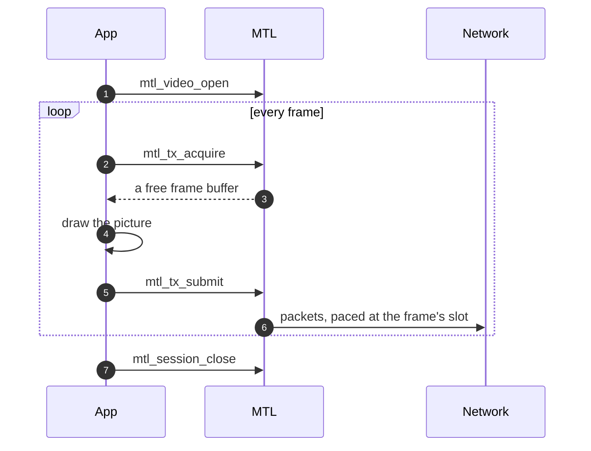
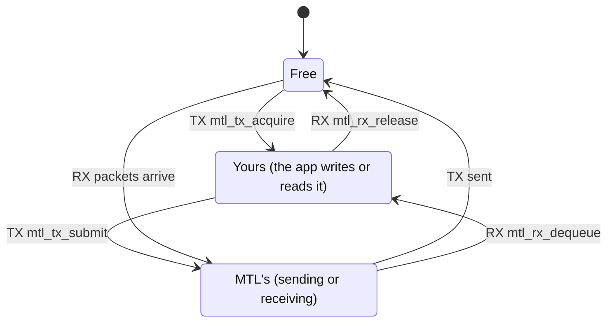
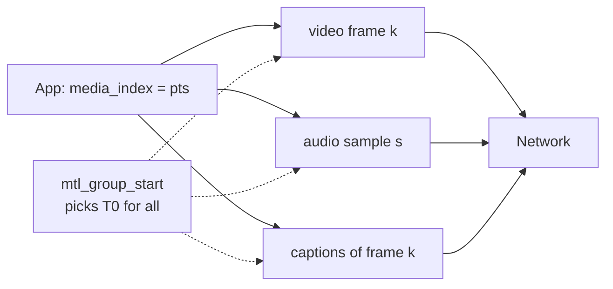

# S7 — Samples friction: the application developer's view

| | |
|---|---|
| Status | Simplification pass on revision 3, input for the owner. Nothing here is implemented; the API names in §5 are proposals |
| Date | 2026-10-01 |
| Scope | The 13 sketch examples in [`../sketch/examples/`](../../sketch/examples/), the 31 diagrams in [`../samples/diagrams.md`](../samples/diagrams.md), today's [`app/sample/`](../../../../app/sample/) and [`include/st_pipeline_api.h`](../../../../include/st_pipeline_api.h) |
| Question | The owner found the diagrams hard to read and suspects the samples are too complicated. This pass checks that suspicion and proposes the shortest API that still covers today's use cases |

## 0. Summary

The owner is right. The diagrams are complicated because the code they trace is complicated.

- **About 82 % of the example code is API ceremony.** Init calls, `struct_size` setup, split
  create and start, out-structs that need an init on every iteration, the release after a failed
  submit, error plumbing and teardown ordering take up that share. The application's own logic
  (render, demux, decode, framework hand-off) is about 18 %. Counted by hand, ±2 lines per example.
- **The rev 3 sketch is longer than today's st20p for three of the four core tasks:**
  minimal TX is 54 lines against ≈ 36 today, and zero-copy TX is 120 against ≈ 35 today. It is
  shorter only where today's API cannot express the task at all: A/V sync, epoll, safe framework
  lending and RX holds.
- **The examples carry 115 hidden rules (about 130 with the C++ twin)**: rules you must know but cannot see in the
  call. Examples: "view must be re-initialised or cached by index", "attached pools force
  completion ALL", "wait for `SESSION_RETIRED` on an EQ you subscribed *before* destroy",
  "uninterrupt before a DRAIN stop", and "`media_index` counts frames for video but samples for
  audio".
- **Two examples have bugs that the APIs shape invites.** ex03 and ex04 take a source frame,
  then fail to acquire, then drop the frame without releasing it (F-25). ex08 does not release
  after a failed publish, although diagram I says it must (F-23).
- **The proposals change no engine and no wire behaviour.** About fifteen changes (§4, §5) bring
  the four core examples from **54 / ≈50 / 104 / 120** to **26 / 25 / 48 / 36** code lines. Each
  result is shorter than today's equivalent, and every safety property of rev 3 is kept.
- **Diagrams.** Proposed: 18 diagrams instead of 31, in three tiers (teach / advanced /
  internals). There are 12 style rules: at most 4 participants or 9 nodes, no argument lists, no
  internals, happy path only, and formulas in tables. §8 redraws three diagrams in that style.

Top ten fixes, by impact (details in §4):

| # | Friction | Fix |
|---|---|---|
| F-02/03 | 10–14 lines to create one session: two configs, `direction`, `flows[0]` parse, create, then start, each with its own error branch; a forgotten RX start is a silent timeout loop | `mtl_video_open(mt, dir, "flow spec", &vc, adv_or_NULL, &s)`: create **and** start; one per essence |
| F-05 | A failed `mtl_tx_submit` leaves the lease with the app; 7 examples carry a release branch, and forgetting it leaks the pool | Submit always consumes the lease; on failure the lease is released with no result |
| F-07 | Teardown is stop(mode, timeout) → destroy(flags) → (EQ wait for RETIRED) → buffers → region → EQ → instance | `mtl_session_close(s, timeout)`: drain, destroy, wait for retire, null-safe |
| F-04 | `struct mtl_buffer_view v; mtl_buffer_view_init(&v);` on every iteration, or a cache-by-index rule; `sizeof(u)` stride on a single-record dequeue | `mtl_lease_view(lease)` and `mtl_lease_unit(lease)` return const pointers to the library's immutable per-slot records |
| F-01 | 44 `*_init(&x)` calls; the C value macros exist but no example uses them | Examples use `MTL_*_INIT(...)` designated initialisers and `&MTL_TX_SUBMISSION_INIT(.user_cookie = c)` compound literals |
| F-08 | Zero-copy import is query → check → region → N buffer descs (6 fields each) → attach (≈ 45 lines) | `pool.source = MTL_POOL_IMPORTED` with `pool.va`, `pool.length`, `pool.pitch`: the session imports and carves the arena itself; `mtl_tx_acquire_index(s, i, …)` |
| F-06 | `-MTL_EAGAIN` and `-MTL_ETIMEDOUT` are handled identically everywhere; each app re-implements `ex_fail` | One "nothing now" code (`-MTL_EAGAIN`); `mtl_perror(what, ret)`; destroy-class calls accept null handles |
| F-11 | A/V/ANC needs a timeline, timing fields set ×3, a group with three `add` calls, start params, and a 6-line ordered teardown | A group owns a private lazily anchored timeline; `sc.group = g` joins at open; `mtl_group_start(g, NULL, NULL)` starts at index 0; `mtl_group_close` |
| F-12 | epoll needs `get_wait_object(mask)`, a kind check, and `trywait(mask)` before every sleep | `mtl_session_get_fd(s)`: a timeout-0 call that finds nothing arms the fd ("drain until EAGAIN, then sleep") |
| F-09 | Attached pools force completion ALL, so a forwarder that does not care must still reap (ex09); NONE rejects cookies | Results never throttle the producer unless ALL is requested; cookies are legal in every mode |

## 1. Method

Every example was read as if by a developer who knows `st20p_tx_get_frame` / `put_frame` and
has read nothing in `doc/unified-api/`. Each code line (blank and comment-only lines excluded)
falls into one of two groups:

- **ceremony**: a line the API makes the developer write that does not express the program's
  intent. This covers declarations of out-structs, `*_init`, the `direction` field, flow parsing
  plumbing, error branches, `goto` labels, casts, null checks, stride arguments, and teardown
  calls and their ordering.
- **app**: application logic and configuration values that carry intent, such as width, fps, the
  multicast address, `render()` and the demux loop.

A **hidden rule** is a contract the developer must obey that is not visible at the call site:
not in the arguments, not in the name, not in the return value. The **friction score** runs
from 1 to 5:

- 1: reads like the intent.
- 2: some boilerplate, no traps.
- 3: traps that are documented in the header comment next to the call.
- 4: traps documented elsewhere (in 03–07).
- 5: cannot be written correctly without the design documents.

## 2. Per-example audit

| Ex | Demonstrates | Lines total / code | Ceremony / app | Hidden rules | Score |
|---|---|---|---|---|---|
| ex01 | minimal TX, library pool, completion NONE | 63 / 54 | 46 / 8 (85 %) | 12 | 4 |
| ex02 | minimal RX, zero-filled gaps | 67 / 59 | 49 / 10 (83 %) | 9 | 4 |
| ex03 | TX results in an epoll loop | 76 / 67 | 57 / 10 (85 %; 12 lines are epoll itself) | 9 + 1 bug | 5 |
| ex04 | zero-copy TX from a framework arena, retire-aware teardown | 139 / 120 | 105 / 15 (88 %) | 20 + 1 bug | 5 |
| ex05 | RX lent to a framework, GStreamer unlock | 51 / 42 | 36 / 6 (86 %) | 8 | 3 |
| ex06 | MXL grains, `MTL_RX_SLOT_BY_INDEX` | 58 / 47 | 39 / 8 (83 %) | 9 | 4 |
| ex07 | A/V/ANC from one file on one timeline | 120 / 104 | 79 / 25 (76 %) | 13 | 5 |
| ex08 | progressive (line) TX | 40 / 33 | 23 / 10 (70 %) | 8 + 1 inconsistency | 4 |
| ex09 | 2160p → 4 × 1080p zero-copy split with RX holds | 88 / 76 | 56 / 20 (74 %) | 10 + incomplete teardown | 4 |
| ex10 | time-preserving processor (video, audio, ANC) | 77 / 67 | 57 / 10 (85 %) | 7 | 3 |
| ex11 | SIGINT shutdown | 53 / 44 | 25 MTL + 10 POSIX / 9 | 5 | 3 |
| ex12 | L4 simple TX and RX | 46 / 40 | 32 / 8 (80 %, 16 per program) | 5 | 2 |
| cpp | C++ twin: init functions, view cache, CQ dispatcher, debug API | 130 / 111 | ≈ 95 / 16 | ≈ 15 | 5 |

The hidden rules, one line per example (each item is a rule a first user trips on):

- **ex01:** `direction` is required, and 0 is invalid (`mtl_session_config.direction`); `*_init`
  must come before any field; the view needs an init on every iteration, or must be cached by
  index; create does not start; `-MTL_ETIMEDOUT` means back-pressure, and only
  `get_status().blocked_on` says why; a failed submit leaves the lease with the app; a DRAIN stop
  may return `-MTL_ETIMEDOUT`, and that is tolerated; `destroy(s, 0)` may be deferred; the
  instance outlives DESTROYING sessions; a cookie in completion NONE is `-MTL_EINVAL`; `pt=112`
  lives inside the flow string; fps goes through `mtl_fps_rational(enum)`.
- **ex02:** without start, `dequeue` times out for ever with no hint; `unit_size` is a stride
  argument; zero fill applies to library pools only (`rx_fill` default); RX stops with FLUSH and
  timeout 0 (why not DRAIN?); release is mandatory; the view init again; `-MTL_ESHUTDOWN` means
  "you asked", never "not started".
- **ex03:** the session must have been created with `MTL_COMPLETE_ALL`, and that is not visible
  in the loop; the masks of `get_wait_object` and `trywait` must match; `trywait` returns 1/0/<0,
  unlike every other call; the library drains the fd, so the app must not read it; at timeout 0
  `acquire` returns `-MTL_EAGAIN` while `reap` returns 0; `wo.kind` must be checked; results come
  in submission order; one waiter per target; the stride argument on reap. **Bug:** the loop takes
  a source frame and then acquire returns EAGAIN, so the frame is never sent or released (F-25).
- **ex04:** query before allocating; check `min_count_direct` and `min_span` by hand; ATTACHED
  forces completion ALL, so the app must reap or `acquire` blocks on RESULTS; page alignment;
  `access = READ` for TX; `MAP_REQUIRED`; six buffer-desc fields are copied from the
  requirements; attach only in CREATED, before start; `acquire_buffer` returns EBUSY or
  ETIMEDOUT; the submission cookie overrides the buffer cookie; FLUSH guarantees every accepted
  unit a result; reap until 0; destroy is deferred; RETIRED needs an EQ subscribed with
  `MTL_EQ_SUB_SESSION` **before** destroy (the session's own EQ, `mtl_session_get_eq`, would also
  do, so there are two ways); escalate with `MTL_DESTROY_FORCE`; `mtl_buffer_destroy` and
  `mtl_mem_destroy` are EBUSY until retire; the framework memory must stay mapped until
  `mtl_mem_destroy` returns 0; the EQ is destroyed last. **Bug:** the frame is dropped on EBUSY
  (F-25).
- **ex05:** release works from any thread and is legal while DESTROYING; `-MTL_ECANCELED` is
  sticky and needs uninterrupt; `-MTL_ESHUTDOWN` comes only from your own stop or destroy; both
  EAGAIN and ETIMEDOUT must be handled; destroy is deferred while downstream holds buffers;
  RETIRED is delivered on subscribed EQs; latest-only receive needs `count = 2` plus
  `RECLAIM_OLDEST_READY`, which is mentioned only in a comment; a failed wrap needs a release.
- **ex06:** with BY_INDEX the slot is `index mod count`; RECLAIM with BY_INDEX reclaims only the
  target slot; there is a sizing formula; the epoch timeline is set explicitly although null
  already means epoch (a redundant default that teaches the wrong thing); attach before start;
  `access` WRITE; the `MTL_RT_MEDIA` validity bit must be checked; `mtl_buffer_index(mtl_lease_buffer(l))`
  and `mtl_lease_slot(l)` do the same thing.
- **ex07:** every member needs the timeline, INDEX mode and a source kind, and `PLAYBACK` is 0,
  so setting it is redundant; `mtl_group_add` rejects AUTO members; `media_index` counts frames
  for video and ANC but **samples** for audio; ANC k is submitted before or with video k; the
  empty ANC packet is automatic; ANC fps and raster must equal the video's; start needs
  `AT_MEDIA_INDEX` and `media_index = 0`; start is all or nothing; the reused submission must have
  its `anc` fields reset; there are two submit styles (write vs acquire/submit); teardown order is
  group stop → group destroy → sessions → timeline (EBUSY otherwise); null checks are needed
  before every destroy.
- **ex08:** the session needs `MTL_UNIT_ROWS` + `GATEWAY` + `INDEX` + `troffset_ns`, none of it
  visible in the code; the hint needs an init; INDEX mode needs `hint.next_media_index`;
  `ready_rows` is set at submit; the lease stays current after submit, unlike in every other
  example; `ready_rows == rows` is FINAL; late rows are truncated. **Inconsistency:** a failed
  `mtl_tx_publish` returns without a release, while diagram I says "submit or publish failed →
  release first" (F-23).
- **ex09:** TX buffers can be built over the RX library pool region; `stride ≥ row_bytes` keeps
  the path DIRECT; TX needs READ access; ALL is forced, so the app reaps and discards; a hold
  keeps the RX slot until the last TX result; release after all submits; EBUSY drops the quad; TX
  starts before RX; the media-time validity bit; a `MAX_SLOTS` cap. The 16 TX buffers are never
  destroyed (teardown incomplete).
- **ex10:** TAI + CAPTURE + `min_tx_delay_ns`; PASSTHROUGH + AUTO is rejected; a
  `mediaclk:sender` input has no media time; audio needs both `sample_count` and `valid_bytes`;
  ANC needs a cast `(const struct mtl_anc_packet*)v.meta` plus `u.anc_count`; two return codes
  are combined by hand.
- **ex11:** `interrupt_all` is async-signal-safe and sticky; you **must** `uninterrupt_all`
  before a DRAIN stop, or its wait is cancelled; join the workers first; `g_mt` must be written
  before the handler is installed.
- **ex12:** one frame outstanding per handle; the port spec per handle acquires the default
  instance; format names are strings; `null:1` is the backend; close is a 1 s DRAIN.
- **cpp:** query with `CHECK_CAPACITY`; the `is_null`/`eq` calls are demonstration noise; a view
  cache vector sized from `info.pool_count`; acquire with a NULL view and then a lazy
  `get_view`; `mtl_time_diff_ns` takes 5 arguments including two validity masks; a private CQ
  read; a dispatcher start and stop; the debug API. It shows too many ideas for one file.

## 3. The same task today, in the rev 3 sketch, and proposed

Today's numbers come from code stripped of `sample_util` scaffolding: one session, no file
source, the same error handling as the sketch. Minimal TX today:

```c
struct mtl_init_params p;
memset(&p, 0, sizeof(p));
snprintf(p.port[MTL_PORT_P], MTL_PORT_MAX_LEN, "0000:af:01.0");
inet_pton(AF_INET, "192.168.1.10", p.sip_addr[MTL_PORT_P]);
p.num_ports = 1;
p.flags = MTL_FLAG_DEV_AUTO_START_STOP;
mtl_handle st = mtl_init(&p);                       /* NULL: no reason given */
struct st20p_tx_ops ops;
memset(&ops, 0, sizeof(ops));
ops.port.num_port = 1;
snprintf(ops.port.port[MTL_SESSION_PORT_P], MTL_PORT_MAX_LEN, "0000:af:01.0");
inet_pton(AF_INET, "239.168.85.20", ops.port.dip_addr[MTL_SESSION_PORT_P]);
ops.port.udp_port[MTL_SESSION_PORT_P] = 20000;
ops.port.payload_type = 112;
ops.width = 1920; ops.height = 1080; ops.fps = ST_FPS_P59_94;
ops.input_fmt = ST_FRAME_FMT_YUV422RFC4175PG2BE10; ops.transport_fmt = ST20_FMT_YUV_422_10BIT;
ops.framebuff_cnt = 3; ops.flags = ST20P_TX_FLAG_BLOCK_GET;
st20p_tx_handle h = st20p_tx_create(st, &ops);      /* live immediately */
while (g_running) {
  struct st_frame* f = st20p_tx_get_frame(h);       /* NULL = timeout, stop or destroy */
  if (!f) continue;
  render(f->addr[0], f->linesize[0]);
  st20p_tx_put_frame(h, f);
}
st20p_tx_free(h);                                   /* synchronous: memory free after this */
mtl_uninit(st);
```

| Task | Today | Rev 3 sketch | Proposed (§6) | Where rev 3 is longer or harder | Where rev 3 is shorter or better |
|---|---|---|---|---|---|
| Minimal TX | ≈ 36 | 54 (ex01); 17 with L4 (ex12) | 26 | two config structs, `direction`, create + start, view init per frame, release after a failed submit, 3-step teardown | instance and flow from strings; real error codes and reasons; no `framebuff_cnt`, no BLOCK_GET flag, no `wake_block` |
| Minimal RX | ≈ 36 | 59 (ex02) | ≈ 24 | as for TX, plus the `sizeof(u)` stride and the silent "forgot to start" | missing data reads as zero by contract; `INCOMPLETE` status per unit |
| epoll loop | not expressible (no fd; a `notify_frame_available` callback on the tasklet writing the app's own eventfd, ≈ +15 lines) | 67 (ex03, TX); RX ≈ 50 (estimated) | 25 (RX), +4 for TX results | wait object, kind check, the trywait arming protocol | a portable fd, no app code on the pinned core |
| A/V/ANC from one file | ≈ 90: three ops blocks, `USER_PACING` + ST 2110-10 epoch maths by hand, no common start, alignment not guaranteed | 104 (ex07) | 48 | timeline + group + 3 adds + start params + 6-line teardown | exact RTP for every essence, one start instant, one late frame does not move audio |
| Zero-copy TX | ≈ 35: `mtl_dma_mem_alloc`, `EXT_FRAME` flag, 8-line `st_ext_frame` fill, `put_ext_frame`, `notify_frame_done` | 120 (ex04) | 36 | query, region, N buffer descs, attach, app EQ, retire wait, 5-step teardown | memory lifetime is safe and checked; the path (DIRECT or COPY) is reported; per-surface results |
| RX lent to a framework | needs app refcounts plus a deferred `st20p_rx_free` (not safe today) | 42 (ex05) | ≈ 30 | five return codes to tell apart | release from any thread, deferred destroy, sticky unlock |
| 1 → 4 split forward | ≈ 60 per quad mapping (`fwd/rx_st20p_tx_st20p_split_fwd.c`), app tracks RX frame lifetime | 76 (ex09) | ≈ 45 | buffer-desc arithmetic, forced reaping | `.hold` keeps the RX slot alive with no app refcount |

In short, rev 3 adds safety and timing exactness that today's API lacks, and makes the simple
case pay for it. The proposals in §4 make the simple case free again. The safety stays, behind
defaults and composite calls.

## 4. Friction register

Ranked by impact, meaning how many examples are hit × how many lines each costs × whether a
mistake is silent or dangerous. "Saves" counts code lines across the 13 examples.

| ID | Rank | Friction | Header symbols | Fix | Hits | Saves |
|---|---|---|---|---|---|---|
| F-02 | 1 | One session = two config structs, an init each, `direction`, `mtl_flow_parse(…, &sc.flows[0])`, create, error branch (10–14 lines) | `mtl_session_config`, `.direction`, `.flows[]`, `mtl_flow_parse`, `mtl_*_session_create` | `mtl_<essence>_open(mt, dir, flow_spec, &cfg, adv_or_NULL, &s)`; `adv` NULL = defaults; `_create` stays (§5) | 11 of 13 | ≈ 80 |
| F-03 | 1 | Create and start are separate; a forgotten RX start is an endless timeout with no hint | `mtl_session_start`, `MTL_STATE_CREATED` | `_open` starts NOW (not for group members or attach-later pools); a timeout in CREATED sets reason `NOT_STARTED` | 9 | ≈ 25 |
| F-05 | 2 | A failed submit leaves the lease with the app; 7 examples carry the release branch, and a missed one silently leaks the pool | `mtl_tx_submit`, `mtl_tx_publish`, `mtl_tx_release`, diagram I | Submit and publish always consume the lease (released, no result, error returned); `MTL_SUBMIT_KEEP_ON_ERROR` keeps the rev 3 rule | 7 | ≈ 20 |
| F-07 | 3 | Teardown is a protocol: stop(mode, timeout) → destroy(flags) → wait for RETIRED → buffers → region → EQ → instance (ex04: 20 lines) | `mtl_session_stop`, `mtl_session_destroy`, `MTL_EVENT_SESSION_RETIRED`, `MTL_DESTROY_FORCE` | `mtl_session_close(s, timeout)`: drain, destroy, wait for retire; 0 = memory free; null-safe; timeout 0 = deferred (§5) | 8 | ≈ 45 |
| F-04 | 4 | View and unit out-structs initialised on every iteration, a `sizeof(u)` stride on a single dequeue, or a cache-by-index rule (cpp) | `mtl_tx_acquire`, `mtl_rx_dequeue`, `mtl_buffer_view` | `mtl_lease_view(lease)` and `mtl_lease_unit(lease)` return const pointers to immutable per-slot records; 3-argument acquire and dequeue; hint via `mtl_tx_next_slot` | 10 | ≈ 30 |
| F-01 | 5 | 44 `*_init(&x)` calls; no example uses the C value macros `MTL_*_INIT(...)` (header §20) | `mtl_*_init`, `MTL_*_INIT`, C3 | Examples use designated initialisers and per-call compound literals (`&MTL_TX_SUBMISSION_INIT(.media_index = pts)`); C++ keeps `_init`. No API change | 12 | ≈ 40 |
| F-08 | 6 | Zero-copy import is ≈ 45 lines: query, size checks, `mtl_mem_desc`, import, N × `mtl_buffer_desc` (7 fields), attach, ordered destroy | `mtl_*_session_query`, `mtl_mem_import`, `mtl_buffer_create`, `mtl_session_attach_buffers` | `pool.source = MTL_POOL_IMPORTED` + `pool.va/length/pitch`: the session imports, carves and owns the arena; `mtl_tx_acquire_index` (§5) | 2 + plugins | ≈ 50 |
| F-06 | 7 | EAGAIN and ETIMEDOUT are handled alike in every loop; every app writes its own `ex_fail`; null checks before every destroy (ex07) | C2, C7, `mtl_last_error`, `mtl_error_name`, `mtl_reason_name` | One "nothing now" code, `-MTL_EAGAIN`; `mtl_perror(what, ret)`; destroy-class calls accept null handles | 12 | ≈ 30 |
| F-11 | 8 | A/V/ANC: timeline create, timing fields ×3, group create, 3 × add, start params, an ordered 6-line teardown | `mtl_timeline_*`, `mtl_group_*`, `mtl_timing_config`, `mtl_start_params` | A group with a null timeline owns a lazy one; `sc.group = g` joins at open (AUTO → INDEX); `mtl_group_start(g, NULL, NULL)` = index 0; `mtl_group_close` | 1 + playout apps | ≈ 30 |
| F-12 | 9 | epoll needs `get_wait_object(mask)`, a kind check, a cast of `wo.native`, and `trywait(mask)` before each sleep | `mtl_session_get_wait_object`, `mtl_session_trywait`, `MTL_WAIT_*` | `mtl_session_get_fd(s)`; a timeout-0 call that finds nothing arms its target, so the loop is "drain until EAGAIN, then sleep"; `trywait` moves to the advanced tier | 2 | ≈ 15 |
| F-09 | 10 | Attached pools force completion ALL, so ex09 reaps and discards; NONE rejects cookies | `mtl_completion_config`, `MTL_COMPLETE_*`, D-35, `MTL_BLOCKED_RESULTS` | Unread results never throttle `acquire` (newest `pool.count` kept, overwrites counted); ALL is an opt-in that back-pressures; cookies are legal in every mode | 3 | ≈ 10 |
| F-13 | 11 | Interruption is sticky for every wait, so shutdown must `uninterrupt_all` before a DRAIN stop | `mtl_instance_interrupt_all`, `mtl_*_uninterrupt`, `mtl_session_stop` | Interrupts cancel data waits only; stop, close and destroy ignore them | 1 + signal apps | ≈ 3 |
| F-16 | 12 | `mtl_buffer_index(mtl_lease_buffer(lease))` and `mtl_lease_slot(lease)` return the same number under two names | `mtl_lease_slot`, `mtl_buffer_index`, `mtl_lease_buffer` | One **`mtl_lease_index(lease)`**, matching `mtl_tx_acquire_index`; `mtl_buffer_index` stays for buffer handles | 3 | ≈ 3 |
| F-17 | 13 | Progressive and INDEX producers need a `mtl_slot_hint` + init + `next_media_index` copied into the submission | `mtl_slot_hint`, `mtl_slot_hint_init`, `submission.media_index` | `MTL_SUBMIT_NEXT_INDEX` (flag): the unit takes `last + 1` (the start index first). The hint moves to the `mtl_tx_next_slot` getter for apps that check the deadline | 1 | ≈ 4 |
| F-15 | 14 | Media time is valid only if a bit is set: `u.hdr.time_valid & MTL_RT_MEDIA`; `mtl_time_diff_ns` takes two values and two masks | C8, `MTL_RT_*`, `MTL_TT_*`, `mtl_time_diff_ns` | Inline helpers `mtl_rx_has_media_time(u)` and `mtl_tx_launch_error_ns(r, &ns)`; the mask stays the ABI | 4 | ≈ 4 |
| F-18 | 15 | Examples set fields to their defaults (ex06 `timeline = mtl_timeline_epoch(mt)`, ex07 `source_kind = MTL_SOURCE_PLAYBACK`, cpp `is_null`/`eq` checks), which teaches that those settings are required | — (documentation) | Examples set only non-defaults; each example's first comment lists the defaults it relies on | 3 | ≈ 6 |
| F-10 | 16 | One `mtl_tx_submission` of 20 fields serves all essences; ex07 reuses it and must reset `anc` and `anc_count` before the video submit | `mtl_tx_submission` | Compound literal per call (F-01), plus a header note that the submission is read at the call only. No API change | 1 | ≈ 3 |
| F-19 | 17 | The port string is deployment data hard-coded in every program | `mtl_instance_open_simple` | `mtl_instance_open_simple(NULL, &mt)` reads `MTL_PORTS` from the environment, the same grammar | all | 0, but samples run unchanged on any host |
| F-20 | 18 | 2022-7 needs `flows[0]` and `flows[1]` filled separately; no example shows redundancy at all | `mtl_flow_parse`, `.flows[]`, `.leg_count` | The flow spec in `_open` takes legs separated by `\|`: `"239.1.1.1:20000@0000:af:01.0\|239.1.2.1:20000@0000:af:01.1"` | 0 today (a coverage gap) | — |
| F-21 | 19 | ANC passthrough casts the meta area: `(const struct mtl_anc_packet*)v.meta` + `u.anc_count` | `mtl_buffer_view.meta`, `mtl_rx_unit.anc_count` | `mtl_lease_anc(lease, &pkts, &n)` returns the typed table; with it, `mtl_tx_write` can take the RX lease directly for passthrough | 1 | ≈ 2 |
| F-22 | 20 | Audio passthrough passes `valid_bytes` and `sample_count`; `sample_count` is authoritative, so the bytes are redundant | `mtl_tx_write`, `submission.sample_count` | For PCM, `bytes = 0` means "derive from `sample_count`" | 2 | ≈ 1 |
| F-23 | 21 | The publish failure contract is inconsistent: ex08 does not release, diagram I says release | `mtl_tx_publish` | Settled by F-05: publish consumes the lease on failure (the unit ends `FAILED`, rows truncated) | 1 | 2 |
| F-24 | 22 | `examples_cpp.cpp` demonstrates 42 functions in one 111-line function | — | Split it: the C++ twin of ex01, a results/CQ demo, a debug-API demo | 1 | — |
| F-25 | 23 | **Example bugs** in ex03 and ex04: the source frame is taken before the acquire, and on EAGAIN or EBUSY it is lost (never sent, never released to its owner) | ordering of `mtl_tx_acquire*` vs the app's source | Acquire first, then take the source; in ex04, EBUSY cannot happen when results drive the framework's free list (R4 drops the branch) | 2 | — |
| F-26 | 24 | ex09's teardown never destroys the 16 TX buffers or the sessions | `mtl_buffer_destroy` | `mtl_session_close` on each session; TX buffers created over another session's pool are owned by the session they are attached to (`MTL_ATTACH_OWN`) | 1 | — |

These items need a decision against the current design log:

- F-05 changes 03 §4.1 ("fix and resubmit").
- F-06 changes C2 (EAGAIN vs ETIMEDOUT) and C7 (null rejected with EBADF) for destroy-class calls only.
- F-09 changes D-35.
- F-12 changes D-43, making the arming implicit (trywait remains).
- F-13 narrows D-30.
- F-02 and F-07 together add 7 functions.
- In total the proposals add 15 functions (§5) and move about 20 to an "advanced" tier that no
  core example uses.

## 5. Invented API

Each name has a one-line contract. They are additions to rev 3 unless marked "changed".

| Name | Contract | Fixes |
|---|---|---|
| `mtl_video_open`, `mtl_cvideo_open`, `mtl_audio_open`, `mtl_anc_open`, `mtl_fastmeta_open` `(mt, dir, flow_spec, cfg, adv, &s)` | CP. `_create` with `adv` (NULL = defaults), `direction` and `flows[]` from the arguments, then `start(NOW)` unless `adv->group` is set or the pool is ATTACHED; on failure `*out` stays null | F-02, F-03, F-20 |
| `mtl_session_close(s, timeout_ns)` | CP, null-safe, ignores interrupts. If RUNNING: stop(DRAIN), switching to FLUSH at the deadline; then destroy; then wait for RETIRED until the deadline. 0 means retired (memory references gone); `-MTL_ETIMEDOUT` means still DESTROYING; timeout 0 means a non-blocking deferred close | F-07, F-13, F-26 |
| `mtl_group_close(g, timeout_ns)` | CP, null-safe. `mtl_group_stop(DRAIN)`, then `mtl_session_close` on every member, then destroy the group and its private timeline | F-07, F-11 |
| `mtl_session_config.group` (field) | Non-null: the session joins `g` at create, takes its timeline, turns media mode AUTO into INDEX, and is started by `mtl_group_start`. Validation is that of `mtl_group_add` | F-11 |
| `mtl_group_create(mt, MTL_TIMELINE_NULL, …)` (changed) | A null timeline creates a private `MTL_ANCHOR_AT_START` timeline owned by the group | F-11 |
| `mtl_group_start(g, NULL, …)` (changed) | On a TX group with INDEX members, NULL means `AT_MEDIA_INDEX 0` instead of NOW | F-11 |
| `mtl_lease_view(lease)` | DP. Returns `const struct mtl_buffer_view*` for the lease's buffer: library-owned, immutable, valid until the session retires; NULL for a null or stale lease | F-04 |
| `mtl_lease_unit(lease)` | DP. Returns `const struct mtl_rx_unit*` of a dequeued RX lease, valid until `mtl_rx_release`; NULL otherwise | F-04 |
| `mtl_tx_acquire(s, &lease, timeout)`, `mtl_rx_dequeue(s, &lease, timeout)` (changed) | The 3-argument forms. The rev 3 forms with view, hint and unit out-pointers become `mtl_tx_acquire_ex` and `mtl_rx_dequeue_ex` | F-04 |
| `mtl_tx_next_slot(s, &hint)` | DP. The slot hint `acquire` used to fill: the next index, its media time and its submit deadline | F-04, F-17 |
| `mtl_tx_submit`, `mtl_tx_publish` (changed) | Always consume the lease. On failure the slot goes back to FREE with no result. The `MTL_SUBMIT_KEEP_ON_ERROR` flag keeps the rev 3 behaviour | F-05, F-23 |
| `MTL_POOL_IMPORTED` with `pool.va`, `pool.length`, `pool.pitch` | At create: import `[va, va+length)` as one region (access by direction, page-aligned), carve `pool.count` buffers at `i × pitch` (0 = aligned `min_span`) and attach them; owned by the session until retire; `-MTL_ENOSPC` if too small | F-08 |
| `mtl_tx_acquire_index(s, i, &lease, timeout)` | WT. Lease attached buffer `i`; `-MTL_EBUSY` while it is queued or in flight | F-08 |
| `mtl_lease_index(lease)` | DP. The buffer index of a lease (replaces `mtl_lease_slot` and the `mtl_buffer_index(mtl_lease_buffer())` pair) | F-16 |
| `mtl_session_get_fd(s)` / `mtl_session_get_handle(s)` | CP. The session wait object as a plain int (Linux) or HANDLE (Windows), covering every target. Any DP call with timeout 0 that returns nothing arms its target; the library drains the fd | F-12 |
| `mtl_perror(what, ret)` | CP. Logs `what: <code name> <reason name> <detail>` from `mtl_last_error`; returns `ret` | F-06 |
| `-MTL_EAGAIN` for every "nothing now" (changed) | Single-object verbs return `-MTL_EAGAIN` with or without a timeout; `-MTL_ETIMEDOUT` is kept only for stop and close deadlines | F-06 |
| Interruption scope (changed) | `interrupt` cancels data waits only; stop, close and destroy are never cancelled | F-13 |
| `MTL_SUBMIT_NEXT_INDEX` | Submission flag: the unit takes the index after the last submitted one | F-17 |
| `mtl_rx_has_media_time(u)`, `mtl_tx_launch_error_ns(r, &ns)` | Inline helpers over the validity masks | F-15 |
| `mtl_lease_anc(lease, &pkts, &n)` | DP. The typed ANC packet table of an RX ANC lease | F-21 |
| `mtl_instance_open_simple(NULL, &mt)` (changed) | The port spec is read from `MTL_PORTS` | F-19 |

The advanced tier keeps the rev 3 calls. No core example uses them:

- `mtl_session_trywait`, `mtl_session_get_wait_object`
- `mtl_tx_acquire_ex`, `mtl_rx_dequeue_ex`
- `mtl_mem_import`, `mtl_buffer_create`, `mtl_session_attach_buffers`
- `mtl_session_stop` and `mtl_session_destroy` with explicit modes
- EQ subscriptions, CQs and dispatchers
- explicit timelines

## 6. Rewrites

The rewrites use the §5 names. Line counts include declarations of the app hooks, the same
way the originals were counted.

| Rewrite | Before (code lines) | After | Change |
|---|---|---|---|
| R1 minimal TX (ex01) | 54 | 26 | −52 % |
| R2 epoll RX (no rev 3 example; ex03 is TX) | ≈ 50 RX, 67 TX | 25 RX (+4 for TX results) | −50 % / −57 % |
| R3 A/V/ANC from one file (ex07) | 104 | 48 | −54 % |
| R4 zero-copy import TX (ex04) | 120 | 36 | −70 % |

### R1. Minimal TX

Uses F-01, F-02/03, F-04, F-05, F-06, F-07. Rev 3's guarantees are kept: real error codes, no
lease leak on a failed submit, bounded drain, retire before return.

```c
#include <mtl/experimental/mtl_unified.h>

extern volatile int g_running;
void render_yuv422_10(void* addr, uint32_t stride);

int main(void) {
  struct mtl_video_config vc = MTL_VIDEO_CONFIG_INIT(
      .width = 1920, .height = 1080, .fps = MTL_RATIONAL(60000, 1001),
      .transport_format = MTL_VIDEO_YUV422_10BIT);
  mtl_instance_h mt;
  mtl_session_h s = MTL_SESSION_NULL;
  int ret = mtl_instance_open_simple("0000:af:01.0=192.168.1.10", &mt);
  if (ret < 0) return mtl_perror("open", ret);
  ret = mtl_video_open(mt, MTL_DIR_TX, "239.168.85.20:20000,pt=112", &vc, NULL, &s);
  while (ret >= 0 && g_running) {
    mtl_lease_h lease;
    ret = mtl_tx_acquire(s, &lease, MTL_MS(100));
    if (ret == -MTL_EAGAIN) ret = 0; /* back-pressure: no free frame yet */
    if (ret != 0) continue;
    const struct mtl_buffer_view* v = mtl_lease_view(lease);
    render_yuv422_10(v->plane[0].addr, v->plane[0].stride);
    ret = mtl_tx_submit(s, lease, NULL); /* consumes the lease, also on failure */
  }
  if (ret < 0) mtl_perror("tx", ret);
  mtl_session_close(s, MTL_SEC(1)); /* drain, destroy, wait for retire; null-safe */
  mtl_instance_release(mt);
  return ret < 0;
}
```

R1 has no `goto`, no labels, no init calls and no release branch. A developer who knows st20p
can read it line for line: `open` is `create`, `acquire` is `get_frame`, `submit` is
`put_frame`, `close` is `free`.

### R2. epoll RX

Uses F-04, F-06, F-12. A timeout-0 `dequeue` that returns `-MTL_EAGAIN` has armed the fd, so the
app does what it already does for sockets.

```c
#include <sys/epoll.h>
#include <unistd.h>
#include <mtl/experimental/mtl_unified.h>

extern volatile int g_running;
void consume(const struct mtl_buffer_view* v, const struct mtl_rx_unit* u);

int rx_epoll(mtl_session_h s) { /* s: an open RX session */
  struct epoll_event ev = {.events = EPOLLIN};
  int ep = epoll_create1(0);
  if (ep < 0) return -MTL_ENOMEM;
  int ret = epoll_ctl(ep, EPOLL_CTL_ADD, mtl_session_get_fd(s), &ev) < 0 ? -MTL_EINVAL : 0;
  while (ret >= 0 && g_running) {
    mtl_lease_h lease;
    ret = mtl_rx_dequeue(s, &lease, 0);
    if (ret == -MTL_EAGAIN) { /* empty: this call armed the fd */
      (void)epoll_wait(ep, &ev, 1, 100);
      ret = 0;
      continue;
    }
    if (ret < 0) break;
    consume(mtl_lease_view(lease), mtl_lease_unit(lease));
    ret = mtl_rx_release(s, lease);
  }
  close(ep);
  return ret;
}
```

For TX results (ex03), replace the dequeue block with
`n = mtl_tx_reap(s, r, sizeof(r[0]), 16, 0); for (…) on_result(&r[i]); if (n == 0) epoll_wait(…);`
(4 lines). As F-25 requires, the feed loop acquires *before* it takes a source frame.

### R3. A/V/ANC from one file

Uses F-01, F-02, F-05, F-06, F-10, F-11. The timing guarantees of ex07 are unchanged: one
lazily anchored T0 on the common grid, all members armed together, and RTP an exact function
of `media_index`. What is gone is the plumbing around them.

```c
#include <mtl/experimental/mtl_unified.h>

enum { STREAM_VIDEO = 0, STREAM_AUDIO = 1 };
extern volatile int g_running;
/* demuxer: video pts = frame index, audio pts = first-sample index */
int demux_next(int* stream, int64_t* pts, const void** data, size_t* size, uint32_t* samples);
int captions_for(int64_t pts, const struct mtl_anc_packet** pkts, uint32_t* n, const void** udw,
                 size_t* udw_len);
void decode_into(const struct mtl_buffer_view* v, const void* data, size_t size);

int av_anc_playout(mtl_instance_h mt, const struct mtl_video_config* vc,
                   const struct mtl_audio_config* ac, const struct mtl_anc_config* nc) {
  mtl_group_h g;
  int ret = mtl_group_create(mt, MTL_TIMELINE_NULL, NULL, &g); /* own timeline, T0 at start */
  if (ret < 0) return mtl_perror("group", ret);
  struct mtl_session_config adv = MTL_SESSION_CONFIG_INIT(.group = g);
  mtl_session_h video, audio, anc;
  ret = mtl_video_open(mt, MTL_DIR_TX, "239.168.85.20:20000", vc, &adv, &video);
  if (ret >= 0) ret = mtl_audio_open(mt, MTL_DIR_TX, "239.168.85.20:30000", ac, &adv, &audio);
  if (ret >= 0) ret = mtl_anc_open(mt, MTL_DIR_TX, "239.168.85.20:40000", nc, &adv, &anc);
  if (ret >= 0) ret = mtl_group_start(g, NULL, NULL); /* every member at index 0, together */
  int stream;
  int64_t pts;
  const void* data;
  size_t size;
  uint32_t samples;
  while (ret >= 0 && g_running && demux_next(&stream, &pts, &data, &size, &samples) == 0) {
    if (stream == STREAM_AUDIO) { /* pts = index of the first sample */
      ret = mtl_tx_write(audio, data, size,
                         &MTL_TX_SUBMISSION_INIT(.media_index = pts, .sample_count = samples),
                         MTL_MS(20));
      continue;
    }
    const struct mtl_anc_packet* pkts;
    const void* udw;
    size_t udw_len;
    uint32_t n;
    if (captions_for(pts, &pkts, &n, &udw, &udw_len) == 0) /* ANC k before video k */
      ret = mtl_tx_write(anc, udw, udw_len,
                         &MTL_TX_SUBMISSION_INIT(.media_index = pts, .anc = pkts, .anc_count = n),
                         MTL_MS(20));
    mtl_lease_h lease;
    if (ret >= 0) ret = mtl_tx_acquire(video, &lease, MTL_MS(40));
    if (ret >= 0) {
      decode_into(mtl_lease_view(lease), data, size);
      ret = mtl_tx_submit(video, lease, &MTL_TX_SUBMISSION_INIT(.media_index = pts));
    }
  }
  if (ret < 0) mtl_perror("playout", ret);
  mtl_group_close(g, MTL_SEC(2)); /* drain, close every member, the group and its timeline */
  return ret;
}
```

Of the 48 lines, 20 are the demuxer's declarations and locals, so the MTL part is about 25
lines. The one rule left that a reader must know is in the comment: `media_index` counts frames
for video and ANC and samples for audio. Renaming the field to `unit_index` with an
essence-specific doc line, or adding `submission.sample_index` for audio, would make that rule
visible too (an open question for the owner, §9).

### R4. Zero-copy import TX

Uses F-01, F-02, F-05, F-07, F-08. The guarantees of ex04 are unchanged: one region, DIRECT
required, the framework frees a surface only after its TX result, and the app's memory is
released only after retire.

```c
#include <mtl/experimental/mtl_unified.h>

#define N 4
extern volatile int g_running;
extern void* pool_base; /* the framework arena: N surfaces, page aligned */
extern uint64_t pool_len;
int next_framework_frame(uint32_t* surface, uint64_t* frame_id); /* 0 = one ready */
void framework_surface_free(uint64_t frame_id);

static int reap(mtl_session_h s) {
  struct mtl_tx_result r[8];
  int n = mtl_tx_reap(s, r, sizeof(r[0]), 8, 0);
  for (int i = 0; i < n; i++) framework_surface_free(r[i].hdr.user_cookie); /* NIC done */
  return n;
}

int zero_copy_tx(mtl_instance_h mt, const struct mtl_video_config* vc) {
  struct mtl_session_config adv = MTL_SESSION_CONFIG_INIT(
      .pool = {.source = MTL_POOL_IMPORTED, .count = N, .va = pool_base, .length = pool_len,
               .data_path = MTL_PATH_REQUIRE_DIRECT},
      .completion = {.mode = MTL_COMPLETE_ALL}); /* a result = the NIC is done with it */
  mtl_session_h s = MTL_SESSION_NULL;
  int ret = mtl_video_open(mt, MTL_DIR_TX, "239.168.85.21:20000", vc, &adv, &s);
  while (ret >= 0 && g_running) {
    uint32_t i;
    uint64_t frame_id;
    mtl_lease_h lease;
    if (reap(s) < 0 || next_framework_frame(&i, &frame_id) < 0) continue;
    ret = mtl_tx_acquire_index(s, i, &lease, 0); /* surface i is free: its result came */
    if (ret >= 0)
      ret = mtl_tx_submit(s, lease, &MTL_TX_SUBMISSION_INIT(.user_cookie = frame_id));
  }
  if (ret < 0) mtl_perror("zero-copy tx", ret);
  mtl_session_stop(s, MTL_STOP_FLUSH, 0); /* every accepted unit gets a result */
  while (reap(s) > 0) {
  }
  int r = mtl_session_close(s, MTL_SEC(5)); /* 0 = retired: pool_base is the app's again */
  return ret < 0 ? ret : r;
}
```

The query disappears because the requirement checks run inside `_open` and fail with a reason.
The app-owned EQ disappears because `close` waits for retire. The buffer table disappears
because the session owns the carved buffers. The EBUSY branch disappears because a framework
that frees surfaces from results can never hand over one that is still in flight; EBUSY would
now mean a framework bug and ends the loop. The last 4 lines remain: a framework that frees by
result must read the flushed results before close.

## 7. Coverage: today's use cases in the reduced example set

The owner asked that every use case MTL covers today stays covered. Proposed: 9 full examples
plus "variant" snippets of 2–6 lines under them, instead of 13 files that each repeat setup and
teardown.

| Today (`app/sample/`, RxTxApp, plugins) | Covered by | Note |
|---|---|---|
| `tx/rx_st20_pipeline_sample` | E1 TX (R1), E2 RX | — |
| `tx/rx_st22_pipeline_sample` | E1 variant: `mtl_cvideo_open(…, &cc, …)` | gap in rev 3: no -22 example exists |
| `tx/rx_st30_pipeline_sample`, `tx/rx_st40_pipeline_sample` | E1 variant (`mtl_audio_open` + `mtl_tx_write`), E3 | — |
| `experimental/rx_st20_redundant_combined_sample` (2022-7) | E1 variant: flow spec `"a\|b"` (F-20) | gap in rev 3 |
| `rx_st20p_auto_detect_sample` | E2 variant: `MTL_EVENT_RX_FORMAT` via `mtl_session_get_eq` | gap in rev 3 |
| `rx_st20p_timing_parser_sample` | E2 variant: `mtl_lease_unit(l)->timing` + `mtl_session_get_stats` | gap in rev 3 |
| `input_fmt ≠ transport_fmt` conversion (every pipeline sample) | E1 variant: `.app_format = MTL_APP_YUV422P10LE` | gap in rev 3: no example converts |
| user meta (`has_user_meta`) | E1 variant: `.user_meta` in the submission | gap in rev 3 |
| `ext_frame/tx_st20_pipeline_ext_frame_sample` (fixed pitch) | E4 zero-copy TX (R4) | moving-cursor variant: `MTL_POOL_DYNAMIC`, Phase 4 |
| `ext_frame/rx_st20_pipeline_dyn_ext_frame_sample` | E4 RX variant: `MTL_POOL_IMPORTED` RX (WRITE) or `mtl_rx_provide` (later) | — |
| `ext_frame/tx_video_split_sample`, `fwd/*split*`, `fwd/*merge*` | E6 forwarder (ex09 shape, with `mtl_session_close`) | merge = attached RX buffers over one TX region; one variant |
| `fwd/rx_st20p_tx_st20p_fwd`, `fwd/rx_st20p_tx_st22p_fwd` | E6 variant: `mtl_rx_transfer` (1 → 1), or copy into a `_open`ed TX | — |
| `fwd/*downsample*` | E7 processor (ex10 shape): `transform()` is app code | — |
| `gpu_direct/*`, `rx_st20p_hdr_split_gpu_direct` | E4 variant with a device-domain region | header split is `-MTL_ENOTSUP` in 0.1 (rev 3 says so) |
| `low_level/*slice*` | E8 progressive (ex08 shape + `MTL_SUBMIT_NEXT_INDEX`) | — |
| `low_level/*rtp*`, `legacy/*` session API | legacy API (D-25) | unchanged |
| `dma/dma_sample` | not a session feature | unchanged (`mtl_udma_*`) |
| GStreamer/FFmpeg plugins | E5 lend to framework (ex05), E9 event loop (R2) | — |
| MXL | E5 variant: `rx_slot_select = BY_INDEX` (ex06 is 10 lines on top of E2) | — |
| A/V/ANC playout (no sample today) | E3 (R3) | new capability |
| shutdown | in every example: `interrupt_all` in the handler, `close` in main | ex11 becomes 6 lines in E1 |
| L4 simple layer | E0 (ex12) | unchanged; it is the "hello world" |

The reduced set is E0 simple, E1 TX, E2 RX, E3 A/V/ANC, E4 zero-copy, E5 lend to framework, E6
forwarder, E7 processor, E8 progressive, E9 event loop: 10 files instead of 13. Each variant
names the default it overrides.

## 8. Diagrams

### 8.1 What makes the current set hard

The 31 diagrams have these properties (measured):

- **Size:** 25 mermaid lines on average and up to 36; 4–7 participants per sequence; 39
  `alt`/`else`/`opt` branches across the 15 example diagrams (C3 alone has 6).
- **Full signatures:** for example `mtl_rx_dequeue(s, &lease, &v, &u, sizeof(u), MTL_MS(200))`,
  where the reader parses argument lists instead of the flow.
- **Internals in teaching figures:** "CAS HELD to FREE" (C9b), "last mbuf freed" (C1),
  `seq_cst` fences, `fetch_add` and wake words (E), `rte_eth_tx_done_cleanup` (H3), and the
  L2/L0 layer names in every participant list.
- **Formulas inside nodes:** `T0 = ceil((now + lead + preroll − k·P) / G) · G` (C7a, F2) and
  `RTP_v = 15015n + floor(1501.5·k)` (C7b).
- **Error branches in every flow:** this repeats diagram I eight times and hides the happy path.
- **Notes that restate the code** ("on failure `mtl_tx_release(s, lease)`" appears in 6
  diagrams).
- **One idea split over two diagrams, or two ideas in one:** C4a/C4b, C7a/C7b, C9a/C9b; B2 mixes
  the loop, the waker and teardown.

### 8.2 Style rules

| # | Rule |
|---|---|
| S1 | One idea per diagram; the title states it as a sentence ("A buffer is free, yours, or MTL's") |
| S2 | At most 4 participants in a sequence, 9 nodes in a flowchart, 6 states in a state diagram, 10 messages |
| S3 | Participants are only **App**, **MTL**, **Network**, and **Framework** where needed; never L0–L4, tasklet, waker or EQ |
| S4 | Call names without arguments (`mtl_tx_acquire`, not `mtl_tx_acquire(s, &lease, &v, NULL, MTL_MS(100))`); no timeouts, no `&`, no casts |
| S5 | Happy path only. Errors live in one error figure or table; no `alt`/`else`, at most one `opt` for a real domain choice |
| S6 | No internals: no CAS, fences, mbufs, `rte_*`, wake bits, slot-state names beyond Free / App / MTL |
| S7 | No formulas in nodes; numbers and formulas go in a small table under the diagram |
| S8 | Labels of 6 words or fewer; at most one `<br/>` per node |
| S9 | Return arrows only when they carry something the app uses (a lease, a result) |
| S10 | `autonumber` on sequences used in presentations, so a speaker can say "step 4" |
| S11 | The same participant names, order and wording in every diagram |
| S12 | Each diagram sits next to the ≤ 15 lines of example code it explains; if the code needs more, the diagram is two ideas |

### 8.3 Keep, merge, drop

| Tier | New diagram | From | Action |
|---|---|---|---|
| Teach | T1 The big picture: app threads, MTL, NIC | A | redraw with 3 boxes; waker, workers and admin go to the internals tier |
| Teach | T2 Old and new: get/put vs acquire/submit | B1 + B2 | merge into two 5-message sequences side by side |
| Teach | T3 Send a frame | C1 + C12 + B2 loop | merge (redrawn below) |
| Teach | T4 Receive a frame | C2 | redraw, happy path |
| Teach | T5 A buffer is free, yours, or MTL's | D2 + D3 | merge (redrawn below) |
| Teach | T6 A session: open, running, closing, closed | D1 | redraw with 5 states; DRAINING and FLUSHING fold into "closing", ERROR in the error table |
| Teach | T7 Video, audio and ANC share one clock | C7a + C7b + F2 | merge (redrawn below); the formulas move to a table |
| Teach | T8 Zero-copy: whose memory, when | C4a + C4b | merge into one 6-step sequence (open, submit, result → framework frees, close returns 0 → app frees) |
| Advanced | A1 Event loop with an fd | C3 + E (app side only) | merge; drop arming internals |
| Advanced | A2 Lending buffers to a framework, unlock | C5 + G2 | merge |
| Advanced | A3 Line-by-line sending | C8 | redraw, happy path |
| Advanced | A4 One input, four outputs, held until sent | C9a + C9b | merge into a 6-node flowchart with hold counts |
| Advanced | A5 Media time vs send time | F1 + C10 | merge; processor as the worked example |
| Advanced | A6 Changing flows and legs live | H1 + H2 | merge |
| Internals | I1 Completion and wake-up | E | keep for implementers |
| Internals | I2 Destroy on a stalled queue | H3 | keep for implementers |
| Internals | I3 RX timing and alignment | F3 | keep, move formulas to a table |
| Internals | I4 GStreamer exported pool | G1 | keep for plugin authors |
| — | MXL by index | C6 | drop: a 2-row table in E2 ("slot = index mod N") |
| — | Signal shutdown | C11 | drop: two lines in T3's caption |
| — | Errors | I | replace the flowchart with a 9-row table (code → meaning → what to do) |

The result is 18 diagrams (8 teach, 6 advanced, 4 internals) instead of 31. A presentation
needs only T1–T8.

### 8.4 Three redrawn diagrams

**T3. Send a frame.** 3 participants, 7 messages; it replaces C1, C12 and the loop of B2.



Caption: *If no buffer is free yet, `acquire` says "try again". `submit` always takes the buffer
back. `close` drains and returns when everything is released. Ctrl-C:
`mtl_instance_interrupt_all` in the handler, `close` in main.*

**T5. A buffer is free, yours, or MTL's.** 3 states; it replaces D2 and D3.



Caption: *Only "Yours" may be touched. A forwarded RX buffer stays out of "Free" until every
output that uses it has been sent (advanced diagram A4).*

**T7. Video, audio and ANC share one clock.** 7 nodes; it replaces C7a, C7b and F2.



| Unit | Its time | Its RTP timestamp |
|---|---|---|
| video frame k | T0 + k × 1001/60000 s | from that time, 90 kHz |
| audio sample s | T0 + s / 48000 s | from that time, 48 kHz |
| ANC of frame k | the same as video frame k | the same as video frame k |

Caption: *The app numbers its units and MTL turns the numbers into time. A late video frame is
dropped and audio is not moved. T0 lies on a grid shared by all three rates, so every timestamp
is exact.*

## 9. Questions for the owner

1. **Submit consumes the lease (F-05).** Is there a real user of "fix and resubmit" after a failed
   submit? If not, the rule and its branch in every TX loop go away; `MTL_SUBMIT_KEEP_ON_ERROR`
   would cover the exception.
2. **`_open` auto-starts (F-03).** Should `_open` start the session (today's st20p behaviour),
   with `_create` + `start` kept for groups and attached pools?
3. **One "nothing now" code (F-06).** May `-MTL_ETIMEDOUT` be dropped from data verbs in favour of
   `-MTL_EAGAIN`? (This reverses C2.)
4. **Results never throttle by default (F-09).** Is ALL as an opt-in acceptable for attached pools
   once `acquire_index` returns EBUSY until a surface is done? (This reverses the D-35 force.)
5. **Implicit arming (F-12).** Is "a timeout-0 miss arms the fd" acceptable instead of an
   explicit `trywait` in the default loop? The cost is one atomic add and fence on an empty poll.
6. **`media_index` units (R3).** Keep one field whose unit depends on the essence, or split it
   into `frame_index` and `sample_index`?
7. **Diagram tiers (§8.3).** Is 8 teaching diagrams the right size for the presentation, with the
   internals tier moved to the design documents?
