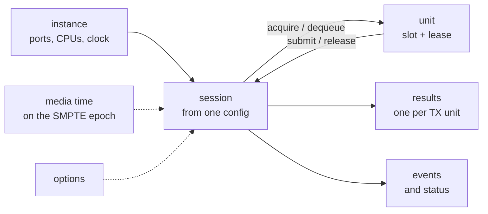
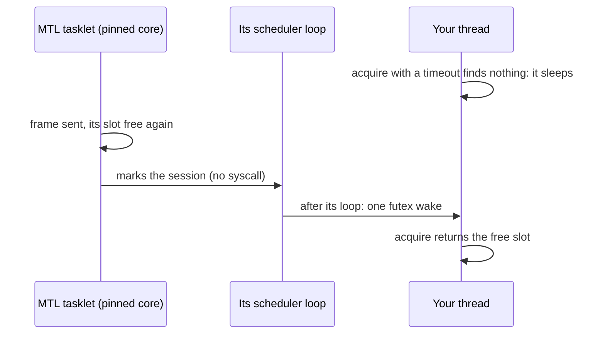
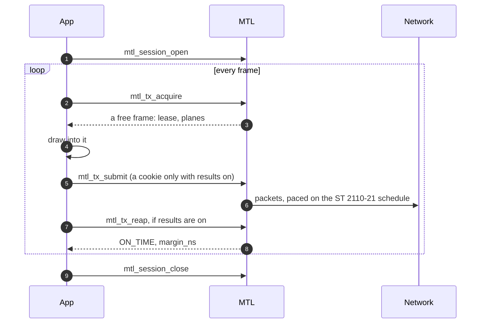
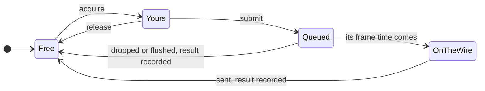
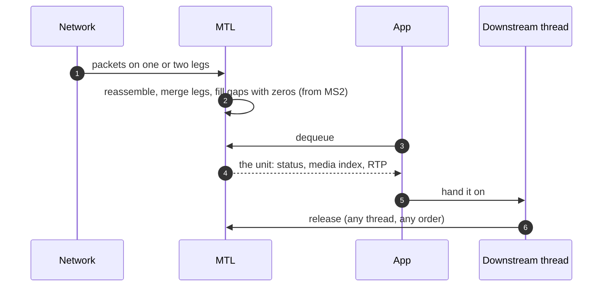
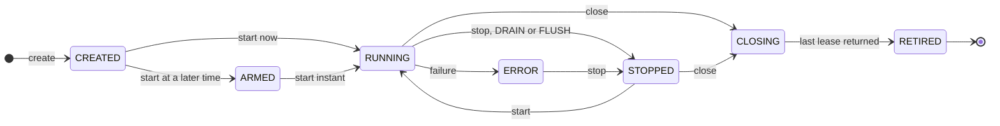
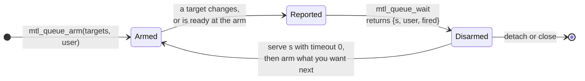
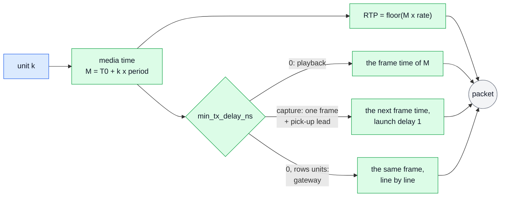

# Unified MTL API: concepts

| | |
|---|---|
| Status | The first read on the unified API. The headers in [sketch/include/mtl/experimental/](sketch/include/mtl/experimental/) are normative; where this page and a header disagree, the header wins |
| Date | 2026-10-02 |

This page teaches the API in one sitting: why it exists, the ten words it is built on, a first
sender and receiver, what happens to one unit, and where to read on. It assumes no knowledge of
today's MTL API. Where a legacy name helps a reader who is moving an application, it is given in
parentheses, for example `mtl_instance_open` (legacy `mtl_init`). The full legacy map is
[migration.md](migration.md). Each picture sits where the text explains its subject; every example
is drawn in [examples.md](examples.md), at the head of its section.

## How to read the pictures

The pictures of this page, of [examples.md](examples.md) and of the other documents share one
notation. The names in every picture are checked against the headers in
[sketch/include/mtl/experimental/](sketch/include/mtl/experimental/), and the headers win.

| Notation | Meaning |
|---|---|
| blue box | your application's own code |
| green box | an MTL call, or MTL's work |
| grey circle | the network, or another system (MXL readers, an NMOS controller, the kubelet) |
| arrow labels | verb names only; the arguments are in the example |
| plain boxes | concepts, and pictures of a mechanism, which show the inside of MTL as well |
| MS1 … MS7, (Phase 7), (`MTL_LATER`) | the milestone of [implementation-plan.md §1.2](implementation-plan.md#12-the-milestones) that builds it; MS1 is the first. Phase 7 comes after MS7; `MTL_LATER` marks names the headers declare only for Phase 7 or later |

The example pictures follow four rules, so they stay readable: one idea each, at most about eight
boxes, only what an application sees, and the happy path. Error handling is in
[§6.4](#64-errors); the inside of MTL appears once on this page, in
[§2.2](#22-the-app-pushes-mtl-never-calls-back), and then in the documents that own each
mechanism ([core.md](core.md), [engine.md](engine.md), [timing.md](timing.md)).

## 1. Why a new API

Three questions a user of MTL should be able to answer, and today cannot:

1. *Did my frame go out on time?* One result per unit (§6.1).
2. *Can audio, video and ANC from one file get consistent RTP without the application doing the
   maths?* Media time on one epoch, and a start of several sessions at once (§7.5).
3. *Can nothing I call ever block the pinned cores?* Pinned cores do packet work only (§2.2).

MTL's engines (packet builders, pacing, reassembly, ST 2022-7 merge) are sound. The API around
them leaves users unable to answer basic questions, and leaves maintainers four exchange models,
twelve metadata structs and no ABI versioning to carry. Each point below is a fact of today's code
([legacy-internals.md](legacy-internals.md)).

| What a user cannot do today | Why |
|---|---|
| know whether a frame went out on time | "done" means a buffer was freed; late reporting names no frame; recovery reports lost frames as complete |
| get consistent RTP for audio, video and ANC from one file | each essence is timestamped separately, with up to half a frame of error |
| trust that nothing blocks the pinned cores | application callbacks, mutexes and a 60 s ARP wait run on the scheduler cores |
| share memory safely | `mtl_dma_map` maps one port and keeps no reference |
| send their own RTP packets cleanly | packet mode needs DPDK mbufs and tasklet callbacks; ST 2022-6 cannot be sent |
| tell errors apart | `NULL` means timeout, stop and destroy alike |
| treat essences alike | each media type has its own verbs, structs and gaps (ST 2110-22 has no stats, ST 2110-30 pipelines no user timestamp, only video emits events) |
| start or stop one session, or learn why a create failed | no per-session start or stop; create returns `NULL` without a reason; no soname, no symbol or struct versioning, and fields have moved silently; `mtl_init` fails after `mtl_uninit` |
| write a plugin without re-inventing MTL | every framework re-implements condvar wake-ups, an instance singleton and audio re-framing; FFmpeg never reached zero copy |

The answer: one small header for every essence, one result per unit, exact timing across
essences, RTP packets as a unit kind, and pinned cores that do packet work only. The engines stay;
their fixes reach the legacy API too, wire-visible ones as an opt-in there and the default here.
For maintainers it is one core under every API: the legacy pipelines become thin wrappers on it,
so a fix lands once. ST 2110-20 video comes first ([implementation-plan.md](implementation-plan.md)).

### 1.1 What changes, area by area

| Area | Today | Unified API |
|---|---|---|
| Sessions | four exchange models (session callbacks, pipeline get/put, RTP level, slice) with per-essence verbs and structs | one session type, one config, one verb set and one unit struct for every essence, in frame, rows or packet units |
| First program | `mtl_init`, an ops struct, create, a get/put loop | a typed config, `mtl_session_open`, an acquire/submit loop, `mtl_session_close` (§3) |
| Outcome of a frame | "done" means a buffer was freed; late reporting names no frame | one result per unit: `MTL_TX_ON_TIME`, `_DROPPED`, `_FLUSHED`, `_FAILED`, with a reason and a margin |
| Pinned cores | callbacks, mutex and condvar, recovery and ARP waits run on tasklets | packet work only; a completion only flags the session |
| Timing and A/V sync | one `timestamp` drives pacing and RTP; up to half a frame of RTP error between essences | media time drives RTP (`floor(M × rate)`); launch from ST 2110-21 and `min_tx_delay_ns`; every session on the SMPTE epoch, and a start of several sessions at once |
| Memory | raw `{addr, iova}`; `mtl_dma_map` maps one port | regions mapped into every device, refcounted; one `mtl_session_attach` for a framework pool |
| RTP passthrough | DPDK mbufs, callbacks on the tasklet, no ST 2022-6 | `MTL_UNIT_PACKETS` with the same verbs; `MTL_RTP` for ST 2022-6 |
| Errors | `NULL`, or `-EIO` for many things | `MTL_E*` codes with one meaning each; `mtl_last_error()` names the field |
| Tuning | flag bits and ops fields per essence | named options, absent unless set, listable by name |
| Observability | per-essence stats structs, reset on read | one registry of named, cumulative values; events with getters |
| Public headers | the session layer included | `mtl.h` and optional headers by topic (`sketch/check.sh` prints the functions per header and per milestone); the legacy headers opt-in, then internal |
| ABI | no soname, no struct versioning | `struct_size` and `MTL_INIT`, size-checked structs; in libmtl, one symbol version node per milestone `MTL_UNIFIED_EXPERIMENTAL_<rev>_MSn`, then `MTL_1.0` at the freeze; a call above `MTL_LEVEL` fails to compile |
| Testing | a NIC for almost everything | the null backend, a test clock, fault injection |
| Pods | unbounded teardown, no health signal, open blocks up to 180 s | a bounded network-first shutdown, lock-free health, fail-fast open |
| NMOS and IPMX | destination updates only | one atomic `mtl_session_update` with planned and applied instants (MS5); RTCP sender reports (MS5) and FREERUN (MS6); the rest of IS-05, SDP, IPMX and PEP (Phase 7) |

What does not change: the legacy APIs keep working and get every engine bugfix during the
transition; the wire of a legacy session changes only on opt-in; MtlManager, the lcore model,
hugepages and VFIO stay. Every change as a rule: [contract.md](contract.md); the legacy map:
[migration.md](migration.md).

### 1.2 Who it is for

Nine personas, from the simple generator or player (P1) and the framework integrator (P2) to
broadcast playout (P3), live capture and gateways (P4), zero-copy forwarders (P5), Rivermax and
libfabric developers (P6, P7), validation (P8) and the operator or NMOS integrator (P9). Each has
one thing the API must make excellent, and several rules only make sense per persona: the sticky
interrupt for P2, `MTL_SESSION_RX_BY_INDEX` for P5, the capacity query for P9. The table, with
what each persona uses today, is [requirements.md §2.3](requirements.md#23-personas-and-the-quality-bar).

### 1.3 Goals

| ID | Goal |
|---|---|
| GO-1 | **One session model** for ST 2110-20, -22, -30, -40 and -41, TX and RX; media-specific fields only at creation, the same verbs at runtime |
| GO-2 | **A familiar shape**: acquire → fill → submit → result; dequeue → read → release; one queue for many sessions, regions, a cookie, requested versus granted |
| GO-3 | **One buffer contract** for every provisioning path: a library pool, attached memory, later device memory |
| GO-4 | **Timing correct by construction**: media time and launch time apart, RTP from media time only, one exact epoch shared by essences, late handling as a policy with a per-unit result |
| GO-5 | **Nothing happens silently**: one result per unit, granted values reported, an event and a getter for every state |
| GO-6 | **Real-time safety**: no public call and no application code on a pinned core |
| GO-7 | **A robust lifecycle**: per-session states, drain or flush, interruptible waits, stale-handle safety, codes not `NULL` |
| GO-8 | **An evolvable ABI**: versioned structs, opaque handles, soname and symbol versions, an experimental tier |
| GO-9 | **Incremental delivery, engines first**: today's builders and reassembly are reused; engine fixes land first and reach legacy users |

### 1.4 Non-goals of the first version

The first version keeps the packet builders and RX reassembly, parses no SDP inside `lib/`, gives
no direct NIC access to GPU memory, shares no session between processes, has no RX header split,
no library-scheduled RX delivery and no runtime port open; several of these reserve their shape
now. NG1–NG8 with their standing: [requirements.md §2.2](requirements.md#22-non-goals-of-the-first-version).

### 1.5 What works when

The API grows milestone by milestone ([implementation-plan.md §1.2](implementation-plan.md#12-the-milestones)).
A function is exported from its milestone, and a value of an exported call not built yet returns
`-MTL_ENOTSUP` (`NOT_IMPLEMENTED`). Each example says what it needs in its header comment
(`Needs: MSn`).

| Milestone | What you can build | Examples |
|---|---|---|
| MS1 | ST 2110-20 frames, TX and RX: library pools, one or two legs (ST 2022-7), conversion to an application format, results, media modes AUTO and TAI; the null backend, PCI ports through the legacy bridge ([examples.md §26](examples.md#26-from-the-legacy-api)) | ex01, ex02, ex20, ex24 |
| MS2a | rows units (slice mode), RX zero fill and `MTL_SESSION_RX_LATEST`, PCI ports opened directly, the log sink, queues for event loops (ex03) | ex03, ex19 |
| MS2b | zero copy for video: imported and attached memory, holds, split forwarding, MXL rings | ex10, ex11, ex12 |
| MS3 | timing: media mode INDEX, a start at an instant, `mtl_tx_get_next`, the declared latency of TAI mode (`media_time_offset_ns`); `mtl_session_update` on a stopped session; events, health, a shutdown with a report | ex04, ex05, ex06, ex07, ex08, ex16, ex21 |
| MS4 | every essence: audio and fast metadata (MS4a1) and ANC (MS4a2), in media mode AUTO for audio and fast metadata until MS6; compressed video, codec plugins and `mtl_convert` (MS4b) | ex13, ex14, ex15, ex17 |
| MS5 | packet units (RTP passthrough, ST 2022-6) and `mtl_session_update` while running | ex09, ex18 |
| MS6 | sync: start arrays, ANC that follows its video, audio and fast metadata in media modes TAI and INDEX (sample-accurate audio); the framework and language ports | ex22, ex23 |
| MS7 | the frozen ABI `MTL_1.0`; the legacy headers deprecated | — |

The table below reads the same plan per product: the earliest milestone that carries everything
the product needs, and what it waits for. On a NIC every row needs MS2a, which opens PCI and
`native_af_xdp:` ports directly; before it, a program reaches a VF through the legacy bridge
(`mtl_legacy.h`).

| Product | Earliest | What it waits for | Examples |
|---|---|---|---|
| your product's tests in CI, without a NIC (`null:` ports) | MS1 | — | ex01, ex02, examples_cpp.cpp |
| ST 2110-20 sender or receiver, one or two legs (ST 2022-7) | MS2a | PCI ports opened directly (MS1: through the bridge, [examples.md §26](examples.md#26-from-the-legacy-api)) | ex01, ex02, ex06, ex07 |
| framework video source (FFmpeg demuxer, GStreamer source) with zero copy | MS2a | lost packets read as zero, `MTL_SESSION_RX_LATEST` (the lending itself: MS1) | ex20 |
| framework video sink with a copy (GStreamer, `ffmpeg -re`, OBS) | MS3 | a declared latency in TAI mode, one phase per programme (TAI mode and `MTL_SUBMIT_SRC_PLANES`: MS1) | ex21 |
| framework sink or forwarder with zero copy; MXL rings | MS2b | attached pools, per-acquire layouts, holds | ex10, ex11, ex12 |
| playout with a deep pre-roll, started at an instant, in one or several processes | MS3 | media mode INDEX, a start at an instant, `mtl_epoch_index_at` | ex04 |
| sending at an exact instant | MS3 | the launch apart from the media time (exact launch: MS2a) | ex05 |
| SDI-to-IP gateway that sends rows | MS3 | media mode INDEX, `mtl_tx_get_next` (rows: MS2a) | ex08 |
| Kubernetes service with probes and a bounded shutdown | MS3 | health, the shutdown report | ex16, ex17 |
| audio sender or receiver (ST 2110-30, AES67) on its own | MS4a1 | the audio binding, media mode AUTO | ex13 |
| ANC (captions, SCTE-104, timecode) timed to its video | MS4a2 | the ANC binding | ex14 |
| compressed video (JPEG XS) with codec plugins | MS4b | cvideo, plugin ABI v2 | ex15 |
| NMOS IS-05 Node that switches without re-creating | MS3 (stop, update, start); MS5 without the stop | `mtl_session_update` | ex18 |
| RTP passthrough, ST 2022-6 | MS5 | packet units | ex09 |
| audio timed to video; V+A+ANC playout or processing with exact RTP | MS6 | audio TAI and INDEX, start arrays | ex22, ex23 |
| a binary that keeps running on later releases without a rebuild | MS7 | `MTL_1.0` | — |
| IPMX sender or receiver | Phase 7 | SDP, sender time, PEP (sender reports: MS5) | — |

## 2. The mental model

### 2.1 Ten words

| Word | One sentence | In the API |
|---|---|---|
| **instance** | your process's handle on a set of NIC ports, CPUs and a clock | `mtl_instance_h`, `mtl_instance_open` (legacy `mtl_init`) |
| **session** | one stream of one essence in one direction: video TX, audio RX, ANC TX, … | `mtl_session_h` (legacy `st20p_tx_handle` and its siblings) |
| **config** | one typed struct that describes a session: direction, essence, flows, essence fields | `struct mtl_session_config` (legacy `struct st20p_tx_ops` and friends) |
| **unit** | what one call moves: a frame or field, rows of a frame, a run of audio samples, the ANC of one frame, or a chunk of RTP packets | `struct mtl_unit` (legacy `struct st_frame`) |
| **slot** | one buffer of a session's pool, named by its index; the stable identity of a buffer. The time a unit takes on the wire is its **frame time**, at its launch index, never a slot | `u.slot`, `sc.pool_count` (legacy `framebuff_cnt`) |
| **lease** | permission to touch one slot's memory now, from acquire or dequeue until submit or release | `mtl_lease_h`, `u.lease` |
| **result** | what happened to one TX unit you submitted | `struct mtl_tx_result`, `mtl_tx_reap` (legacy `notify_frame_done`) |
| **media time** | the TAI instant a unit represents, counted from the SMPTE epoch, so units of every session mean the same instant | `u.media_index`, `u.media_tai_ns`, `sc.media_mode` |
| **event** | a notice that something changed (link, time base, session state); every state also has a getter | `struct mtl_event`, `mtl_session_read_events` |
| **option** | a tuning knob, absent unless set, and absent means the documented default | `struct mtl_option`, `MTL_OPT_*` in `mtl_options.h` |



Five essences plus generic RTP share the same verbs: `MTL_VIDEO` (ST 2110-20), `MTL_CVIDEO`
(ST 2110-22), `MTL_AUDIO` (ST 2110-30/31), `MTL_ANC` (ST 2110-40), `MTL_FASTMETA` (ST 2110-41)
and `MTL_RTP` (generic RTP such as ST 2022-6, packet units only). A unit is one of three kinds,
`sc.unit`:

| Kind | Moves | Typical use |
|---|---|---|
| `MTL_UNIT_FRAME` (default) | a frame or a field | almost every program |
| `MTL_UNIT_ROWS` | rows of a video frame, published progressively | an SDI-to-IP gateway ([ex08](sketch/examples/ex08_rows.c)) |
| `MTL_UNIT_PACKETS` | a chunk of RTP packets the application builds or parses (legacy `ST20_TYPE_RTP_LEVEL`) | forwarders, custom payloads ([ex09](sketch/examples/ex09_rtp_packets.c), `mtl_packet.h`) |

The objects and who owns what: [contract.md](contract.md#object-verbs); the
shape next to libfabric and Rivermax: [migration.md §13](migration.md#13-if-you-know-libfabric-or-rivermax).

### 2.2 The app pushes, MTL never calls back

TX is `acquire → fill → submit`; RX is `dequeue → read → release`. MTL never calls your code:
what legacy callbacks did, the application now reads on its own thread (results, events,
status), and it waits in a call with a timeout or on a queue (§6.2). Completions on the pinned
cores only flag the session.

| Where | What runs there |
|---|---|
| MTL's pinned cores (tasklets) | packet work only: build, pace, reassemble, record results, flag a session for a wake-up; never your code, a call that blocks, or a lock your threads take |
| MTL worker threads | recovery, ARP, flow rules, IGMP, queue resets |
| your threads | every API call, and every format conversion (in the caller of the DPC call) |

One exception to "no conversion on a pinned core": with the option `rx.convert_per_packet`
(legacy `ST20P_RX_FLAG_PKT_CONVERT`) the library converts each packet on the RX tasklet as it
lands. It is library code; your code still never runs there.

The picture below is how a completion on a pinned core reaches a thread of yours that sleeps in a
call with a timeout, for example a sender whose pool is full:



Nothing in it waits on the pinned core. Inside a tasklet a wake-up costs one mark on the session
and on its scheduler loop. The loop, after its handlers, wakes a bounded number of marked sessions
per iteration ([D-142](decisions.md)), and only for a thread that sleeps (W2-deferred, D-68, every
mode from MS1). An event loop sleeps on a queue's descriptor instead (MS2a, §6.2); the scheduler
then writes it once for all the sessions that changed before the loop came back. A notifier thread
that takes those wakes off the core is a contingency, built only by D-142's rules (S1, MS2a). The
protocol is in [core.md §4.2](core.md#42-the-completing-context-protocol) and
[§6](core.md#6-waking); who makes the wake-up syscall in every context:
[core.md §6.2](core.md#62-the-deferred-wake); the threads:
[engine.md §1.2](engine.md#12-execution-contexts).

### 2.3 The rules every call follows

Eight rules, R1–R8, head `mtl.h`; [contract.md §1](contract.md#1-the-rules-r1r8) has them in full.
In short: success is 0, a count or a mask, failure a negative `MTL_E*` (Linux errno values on every
OS), and `mtl_last_error()` adds the reason and the field at fault; timeouts are the last argument,
in ns (`MTL_MS(100)`; 0 = do not wait, `MTL_FOREVER` = no limit); `MTL_INIT(&s)` zero-fills an
input struct and sets its `struct_size`, and zero in every other field is the default; handles are typed 64-bit values, 0 is null, a closed handle
is never reissued, and close accepts a null handle and may be called again to poll; times are TAI
ns, valid by their flag; every function has a call class: CP (control plane, may block), DP (data
plane, O(1), no syscall but one wake when it makes a target ready for a sleeper), DPC (data plane that
copies or converts in the caller), WT (waits; DP when the timeout is 0) and AS (async-signal-safe,
the only calls a signal handler may make).

## 3. The first sender

[ex01](sketch/examples/ex01_tx_video.c), copied verbatim. It shares `ex_fail()` and
`g_running` from [ex_common.h](sketch/examples/ex_common.h): `ex_fail()` prints
`mtl_error_name(ret)` and, when the last error is this failure, the reason and the field from
`mtl_last_error()`.

```c
/* ex01 — the smallest video sender: one config, a library pool, no results to read.
   Defaults it relies on: media mode AUTO (the next frame time of the SMPTE epoch),
   results off. Needs: MS1 (null: and kernel: ports; a VF from MS2a, or in MS1 through
   the legacy bridge, ex24).
 */
#include "ex_common.h"

void render(void* addr, uint32_t stride, int64_t frame);

int main(void) {
  mtl_instance_h mt = MTL_NULL(mtl_instance_h);
  mtl_session_h s = MTL_NULL(mtl_session_h);
  struct mtl_session_config sc;
  struct mtl_unit u;
  MTL_INIT(&sc);
  MTL_INIT(&u);

  sc.direction = MTL_TX;
  sc.essence = MTL_VIDEO;
  mtl_flow_ipv4(&sc.flows[0], 239, 168, 85, 20, 20000);
  sc.video.raster.width = 1920;
  sc.video.raster.height = 1080;
  sc.video.raster.fps = mtl_fps_rational(MTL_FPS_59_94);
  sc.video.format = MTL_YUV422_10;

  int ret = mtl_instance_open(NULL, &mt); /* ports from MTL_PORTS, e.g. "null:1" */
  if (ret >= 0) ret = mtl_session_open(mt, &sc, &s); /* create and start */

  for (int64_t k = 0; ret >= 0 && g_running;) {
    ret = mtl_tx_acquire(s, &u, MTL_MS(100));
    if (ret == -MTL_EAGAIN) { /* back-pressure: status.blocked_on says on what */
      ret = 0;
      continue;
    }
    if (ret == 0) {
      render(u.plane[0].addr, u.plane[0].stride, k++);
      ret = mtl_tx_submit(s, &u); /* sent at the next frame time */
    }
  }

  if (ret < 0) ex_fail("mtl", ret);
  mtl_session_close(s, MTL_SEC(1));   /* sends what is queued, then retires */
  mtl_instance_close(mt, MTL_SEC(1)); /* leaves groups, stops the devices */
  return ret < 0;
}
```

What to notice:

- **One header, one typed config**: `ex_common.h` includes `mtl.h` only, and the config is enums
  and defines, no strings. The frame rate is a rational, `sc.video.raster.fps`; `mtl_fps_rational()`
  gives the exact value of a named one.
  `mtl_flow_ipv4()` fills a flow (legacy `dip_addr[0]` and `udp_port[0]`).
  Audio has its own typed field for packet time, `sc.audio.ptime = MTL_PTIME_1MS` (legacy
  `ST30_PTIME_1MS` + 1); changing any default is one field or one option.
- **Enums keep the legacy order**: legacy + 1 where 0 must mean "not set" (`MTL_FPS_59_94` is
  `ST_FPS_P59_94` + 1, `MTL_YUV422_10` is `ST20_FMT_YUV_422_10BIT` + 1), the same values where 0
  is a real default (`enum mtl_packing` is `enum st20_packing`, `enum mtl_sender_type` is
  `enum st21_pacing`). Porting an ops struct is mostly a field-by-field copy
  ([migration.md](migration.md)), with the inline converters of `mtl_legacy.h`
  (`mtl_video_format_from_legacy()`, `mtl_packing_from_legacy()`, …) for every legacy enum: a value
  copied by the wrong rule is still valid and changes the wire; one trap: for interlaced video, legacy `fps` is the field rate
  and `raster.fps` the frame rate ([migration.md §5.1](migration.md#51-media-enums)).
- **Ports from the environment.** `mtl_instance_open(NULL, &mt)` reads `MTL_PORTS`, for example
  `MTL_PORTS=null:1`: the **null backend**, which needs no NIC, no root and no hugepages. A VF
  (`MTL_PORTS=0000:af:01.0=192.168.1.10/24`) opens directly from MS2a; in MS1 it opens through
  the legacy bridge ([examples.md §26](examples.md#26-from-the-legacy-api)). Explicit
  ports go in `struct mtl_instance_params` (legacy `struct mtl_init_params`).
- **`mtl_session_open` creates and starts** (legacy `st20p_tx_create`); `mtl_session_create` plus
  `mtl_session_start` start at a chosen time or several sessions together.
- **Defaults do the rest**: MTL owns the buffers, each frame goes out at the next frame time, and no
  results are produced, so the loop never stalls on unread results.
- **Back-pressure is a return code.** `-MTL_EAGAIN` from acquire means no slot is free yet
  (legacy `st20p_tx_get_frame` returning `NULL`); `status.blocked_on` says why.
- **Close is bounded.** `mtl_session_close` drains what is queued, destroys and waits for
  retirement in one call; `mtl_instance_close` shuts down network first within its deadline
  (legacy `mtl_uninit`).

The program's loop as a picture is in [examples.md §3](examples.md#3-send-video-smallest-program).
The picture below follows it one frame at a time, with the reap that a program adds when it turns
results on (§6.1); each step is explained in §5.1, and the RX twin is §5.2.



## 4. The first receiver

[ex02](sketch/examples/ex02_rx_video.c), copied verbatim. It takes an open instance.

```c
/* ex02 — a video receiver on two ST 2022-7 legs: dequeue, read, release. Needs: MS1
   (media_index is valid from MS3). */
#include "ex_common.h"

void show(const void* addr, uint32_t stride, int complete, int64_t media_index);

int rx_video(mtl_instance_h mt) {
  mtl_session_h s = MTL_NULL(mtl_session_h);
  struct mtl_session_config sc;
  struct mtl_unit u;
  MTL_INIT(&sc);
  MTL_INIT(&u);

  sc.direction = MTL_RX;
  sc.essence = MTL_VIDEO;
  /* two flows = two legs on instance ports 0 and 1 (two ports, e.g.
     MTL_PORTS=null:1,null:2); packets merge by sequence */
  mtl_flow_ipv4(&sc.flows[0], 239, 168, 85, 20, 20000);
  mtl_flow_ipv4(&sc.flows[1], 239, 168, 86, 20, 20000);
  sc.video.raster.width = 1920;
  sc.video.raster.height = 1080;
  sc.video.raster.fps = mtl_fps_rational(MTL_FPS_59_94);
  sc.video.format = MTL_YUV422_10;
  int ret = mtl_session_open(mt, &sc, &s);

  while (ret >= 0 && g_running) {
    ret = mtl_rx_dequeue(s, &u, MTL_MS(100));
    if (ret == -MTL_EAGAIN) { /* no signal: status.flags lacks MTL_STATUS_RX_SIGNAL */
      ret = 0;
      continue;
    }
    if (ret < 0) break;
    show(
        u.plane[0].addr, u.plane[0].stride, u.status == MTL_RX_COMPLETE,
        (u.flags & MTL_UNITF_INDEX_VALID) ? u.media_index : -1); /* lost packets read 0 */
    ret = mtl_rx_release(s, u.lease);
  }

  if (ret < 0) ex_fail("rx", ret);
  mtl_session_close(s, 0); /* MTL_RETIRING is not a failure: it ends on its own */
  return ret;
}
```

What to notice:

- **The same config, `MTL_RX`.** A receiver differs from a sender in `sc.direction` and the
  verbs (`mtl_rx_dequeue`, `mtl_rx_release`; legacy `st20p_rx_get_frame`, `st20p_rx_put_frame`).
- **Two flows are two ST 2022-7 legs.** `flows[1]` that exists is the redundant leg; packets merge
  by sequence number. `u.flags & MTL_UNITF_USED_REDUNDANCY` says the frame needed the other leg.
  Leg i uses instance port i unless `mtl_flow_on_port(&sc.flows[i], p)` names another; two legs on
  one port are reported with `MTL_INFO_LEGS_SHARE_PORT`.
- **Lost packets never hide a frame.** A frame with gaps arrives with `u.status ==
  MTL_RX_INCOMPLETE`, and the gaps read as zero in library pools (from MS2).
- **Every RX unit says which frame it is**: `u.media_index` (valid with `MTL_UNITF_INDEX_VALID`),
  `u.media_tai_ns` and the received `u.rtp`.
- **Close with timeout 0** returns 1 instead of waiting when a frame is still leased; the session
  retires on the last release, and calling close again polls (1, then 0).

As a picture: [examples.md §4](examples.md#4-receive-video-on-two-st-2022-7-legs); the legs and
their flow states: [contract.md §14.2](contract.md#142-admin-oper-and-flow-state).

## 5. The life of a unit

### 5.1 TX

The picture is one TX unit as the application sees it ([ex01](sketch/examples/ex01_tx_video.c)):
while it is Yours, MTL never touches it; once Queued it is MTL's until it has left, and it comes
back Free with exactly one result. The steps below follow it.



1. **Acquire** (`mtl_tx_acquire`) lends a free slot: `u.lease`, `u.slot`, `u.plane[]` (address,
   stride, row bytes, rows per plane) and `u.meta`, the slot's metadata area, reset to an empty
   list (a NONE header). The per-use fields (`used`, `flags`, media time, `cookie`, `hold`) are
   zeroed.
2. **Fill** the planes and set what this unit needs: `u.media_index` or `u.media_tai_ns` (by
   media mode, §7), `u.cookie` (returned in the result), `u.used` (the table below), `u.flags`
   (`MTL_SUBMIT_*`, for example `MTL_SUBMIT_DISCONTINUITY` after a seek).
3. **Submit** (`mtl_tx_submit`) hands the unit over. While a unit is yours MTL never touches it;
   after submit it is MTL's until it has left. The meta area is copied at submit; plane bytes are
   read at send time, so do not write them after submit.
4. **Its frame time comes**: MTL paces the packets on the ST 2110-21 schedule (sender type
   `MTL_SENDER_N`, `W` or `NL`) and sends them on every leg.
5. **One result** records what happened (`ON_TIME`, `DROPPED`, `FLUSHED`, `FAILED`), if results
   are on (§6.1), or a counter when they are off, and the slot is free again.

A failed first submit puts the slot back without a result, so a loop needs no cleanup branch; only
`-MTL_EBADF` and `-MTL_ESTALE` change nothing, because the lease was never valid.
`mtl_tx_release(s, u.lease)` gives back an unsubmitted lease. Rows units submit the same lease
again with a larger `u.used` to publish more rows. A frame time with no unit is an underrun
(§7.4). The same unit step by step: §3; through the layers:
[core.md §3](core.md#3-a-unit-through-the-core); the seven slot states behind
the four of the picture: [core.md §3.1](core.md#31-the-slot-table).

What `u.used` counts, per essence (`mtl.h`, `struct mtl_unit`):

| Unit | `u.used` counts | 0 means |
|---|---|---|
| video frame | rows | TX: the whole frame |
| video rows unit | rows ready | legal: the slot is claimed before row 0 exists |
| audio | bytes, whole samples of every channel | `-MTL_EINVAL` |
| compressed video | codestream bytes | literal |
| ANC | user data word bytes | no ANC packets: the empty ANC packet that keeps the stream alive |
| fast metadata | bytes | one RTP packet with no data item, the ST 2110-41 keep-alive |
| packet unit | packets in the chunk | literal |

### 5.2 RX



- **Dequeue** (`mtl_rx_dequeue`) returns units in delivery order, each with its lease.
- **A unit that never completes is delivered at its deadline**, marked incomplete, so a stop never
  hangs on a missing packet.
- **Release** (`mtl_rx_release`) may come from any thread in any order, so a frame can be lent to
  a framework buffer and released when downstream drops it ([ex20](sketch/examples/ex20_rx_to_framework.c)).
- **A full pool** drops new units by default and counts them in the next unit's
  `u.missed_before`. `MTL_SESSION_RX_LATEST` reclaims the oldest unread unit instead;
  `MTL_SESSION_RX_BY_INDEX` puts frame k in slot k mod `pool_count`, for MXL rings
  ([ex11](sketch/examples/ex11_rx_into_memory.c)).

Through the layers: [core.md §3](core.md#3-a-unit-through-the-core); who owns a
slot when, in both directions: [contract.md §5.4](contract.md#54-lease-rules).

### 5.3 A session's life

The picture is the path an application sees; [ex10](sketch/examples/ex10_zero_copy_tx.c) walks it
(create, attach, start, stop, close). The full machine with every transition is in
[contract.md §4.1](contract.md#41-states).



- `mtl_session_open` goes straight to RUNNING. **Stop** (`mtl_session_stop`; legacy pipelines had
  none per session) passes through DRAINING (`MTL_STOP_DRAIN`: queued units are sent) or FLUSHING
  (`MTL_STOP_FLUSH`: queued units become FLUSHED), and a start undoes it.
- **ERROR** is left only by stop and close; data calls return the error status (`-MTL_EIO`, and
  `status.error_reason` says why); release, reap, status, events, wait and interrupt still work
  ([contract.md](contract.md) §4.2).
- **Close** works from any state and is idempotent: 0 = retired, nothing references the session
  any more; 1 = still retiring (leases out, or units the device still holds), so call it again,
  with a timeout to wait, until it returns 0. From the first close on, the only other valid calls
  are `mtl_session_get_status` (CLOSING, then RETIRED) and the release of leases taken before the
  close.
- **Change without re-creating**: `mtl_session_update` (a stopped session MS3, a running one
  MS5) changes flows, legs, media fields or
  the pool, all or nothing, at a frame boundary on the wire (legacy `st20p_tx_update_destination`);
  `mtl_session_discard` (MS2) flushes the queue for a seek and stays RUNNING.

The full state machine: [contract.md §4.1](contract.md#41-states); what close does:
[contract.md §4.9](contract.md#49-close); starting sessions together:
[timing.md §7.1](timing.md#71-starting-sessions-together).

### 5.4 Packet units

With `sc.unit = MTL_UNIT_PACKETS` (`mtl_packet.h`) the verbs stay the same; a unit is a chunk of
RTP packets the application builds or parses (legacy `ST20_TYPE_RTP_LEVEL`).

- **TX.** Acquire lends a chunk: the packet table (`u.meta`) points at each slot; plane 0
  addresses them only when contiguous. Write each RTP header and payload into `mtl_pkt_slot(&u, i)`, set its length in `mtl_pkt_tx_table(&u)[i].len`, set `u.used` to
  the count and submit; the table is validated and copied at submit, and each chunk gets one
  result. The chunk that ends a frame carries `MTL_SUBMIT_UNIT_END`.
- **Packets per unit.** `sc.packet.packets_per_unit` is derived for video (reported in
  `mtl_session_info.pkts_per_unit`) and required for cvideo and for generic RTP paced per unit.
- **What MTL still does.** It writes UDP, IP and Ethernet, paces the packets by the essence's
  wire model (video: the frame's ST 2110-21 schedule), duplicates each on both ST 2022-7 legs,
  and rewrites only the RTP fields named in `sc.packet.set_fields` (none by default).
- **RX.** A unit is a chunk of received packets, each with leg, sequence, gap and arrival time
  (`mtl_pkt_rx_table(&u)`), copied in the caller by default; duplicates of the two legs are
  removed by RTP timestamp and sequence number.

ST 2022-6 uses the generic RTP essence `MTL_RTP`. Example: [ex09](sketch/examples/ex09_rtp_packets.c);
the full rules: [contract.md §13](contract.md#13-packet-units).

## 6. Results and errors you program against

### 6.1 Results

A result is the answer to "did my frame go out on time?". `mtl_tx_reap(s, r, max, timeout)`
returns up to `max` results in submission order.

| `status` | Meaning |
|---|---|
| `MTL_TX_ON_TIME` | sent at its frame time (AUTO late: a later one, `MTL_TXR_DEFERRED`) |
| `MTL_TX_DROPPED` | not sent; `reason` says why (for example `TOO_LATE`, `SNAP_COLLISION`, `WAITING_NEIGHBOUR`); its frame time stays empty on the wire |
| `MTL_TX_FLUSHED` | removed by stop with FLUSH, discard or close (`STOP_FLUSH`, `DISCARD`, `CLOSE`, `STOP_TIMEOUT`, `ABORTED`) |
| `MTL_TX_FAILED` | a device or queue failure; `error` and `reason` |

The core record, `struct mtl_tx_result` (96 bytes), also carries `cookie`, `seq`, `slot`,
`media_index`, `media_tai_ns`, `margin_ns` (deadline minus submit; negative = late),
`sent_tai_ns` (first packet), `rtp` and `MTL_TXR_*` flags such as `MTL_TXR_COPIED`.
`mtl_tx_reap_full` (`mtl_observe.h`) reads the full timing record instead. A sent-late status
(`MTL_TX_LATE`, a bounded late send) is reserved for Phase 7.

- **Exactly one result per submitted unit**, never lost: the completer writes it into the unit's
  submission descriptor, and the reaper returns the descriptors in submission order.
- **Off by default with MTL's buffers** (turn them on with `MTL_SESSION_RESULTS`), so a minimal
  loop cannot stall on unread results. **Always on with your own memory**: a result is how you
  learn the memory is free again.
- **Unread results take room**: when the ring of `pool_count` results is full, acquire waits with
  `status.blocked_on == MTL_BLOCKED_RESULTS` (other reasons: `BUFFERS`, `APP_LEASES`).
- **RX has no results**: the unit itself carries `status`, `media_index`, `rtp` and flags;
  `mtl_rx_get_detail` (`mtl_observe.h`, with the ST 2110-21 `timing[]`) adds per-unit detail.

Every path a submitted unit can take to its result:
[contract.md §6.3](contract.md#63-statuses-and-reasons).

### 6.2 Waiting without missing a wake-up

A data call (acquire, dequeue, reap, read, wait) with **timeout 0** tries once: it returns what is
ready, or `-MTL_EAGAIN` for "nothing now", and changes no wait state. With a **timeout** it sleeps
on its session until its target is ready, the timeout passes (`-MTL_EAGAIN`), it is interrupted
(`-MTL_ECANCELED`) or the state ends it; any number of threads may sleep on one session, on one
target or on different ones. An application that never sleeps never causes a wake-up syscall.

- `mtl_session_wait(s, mask, timeout)` waits for `MTL_WAIT_ACQUIRE`, `_DEQUEUE`, `_RESULTS` or
  `_EVENTS` without consuming anything.
- **An event loop waits on a queue** (MS2a, [ex03](sketch/examples/ex03_event_loop.c)).
  `mtl_queue_create(mt, 0, &q, &fd)` gives a queue and one descriptor for any number of sessions
  and the instance (an eventfd on Linux, a `HANDLE` on Windows). `mtl_queue_arm(q, s, targets,
  user)` arms what you want to hear about; the first change reports `s` once, with `user`, and the
  report disarms it, so serve `s` with timeout-0 calls and arm it again with what you want next.
  `mtl_queue_wait(q, r, size, max, 0)` returns the reports, or `-MTL_EAGAIN` with the descriptor
  armed: sleep in `epoll` only after that. Detach (`mtl_queue_arm(q, s, 0, 0)`) or close `s`
  before you free what `user` points to.
- `mtl_session_interrupt(s, 1)` makes every data wait on `s` return `-MTL_ECANCELED` until
  `mtl_session_interrupt(s, 0)` (GStreamer `unlock` and `unlock_stop`; legacy
  `st20p_tx_wake_block`); `mtl_interrupt` can limit it to some targets, so an interrupted acquire
  does not make a reaper of the same session spin. A loop that sleeps on a queue is interrupted
  with `mtl_queue_interrupt(q, 1)`; `mtl_instance_interrupt` does both for every session and
  queue and is safe in a signal handler.

A thread that sleeps in a call with a timeout is woken as in the picture of §2.2. The picture
below is one session on a queue: a report hands it to you disarmed, and the queue says nothing
more about it until you arm it again. A detach or a close ends it in either state.



Pictures: an event loop ([examples.md §5](examples.md#5-many-sessions-in-the-applications-epoll-loop)),
a queue ([contract.md §7.2](contract.md#72-queues-ms2)) and interrupts
([contract.md §7.3](contract.md#73-interrupts)).

### 6.3 Events and status

Events (`MTL_EVENT_*`: session, leg, flow, RX signal and format, pacing, time, link, health,
updates) are read with `mtl_session_read_events`, and the instance's own with
`mtl_instance_read_events` (`mtl_events.h`, MS3). Every state an event reports also has a getter
(`mtl_session_get_status`, `mtl_instance_get_health`, …), so a lost event loses nothing. Numbers live in one stats registry (`mtl_stat_list`, `mtl_stat_read`, `mtl_observe.h`).

### 6.4 Errors

One code, one meaning, on every call. The table is what a loop sees and what to do;
[ex_common.h](sketch/examples/ex_common.h) prints any of them, with the reason and the field from
`mtl_last_error()`, and [contract.md §8.1](contract.md#81-codes) has every code in full.

| You get | It means | Do |
|---|---|---|
| `-MTL_EAGAIN` | nothing now, or by the timeout | try again, or sleep: in a call with a timeout, or on a queue (§6.2) |
| `-MTL_ECANCELED` | someone interrupted the waits | leave the wait; `interrupt(..., 0)` to wait again |
| `-MTL_ESHUTDOWN` | you stopped or closed the session or instance, or the process's owner did (`mtl_instance_shutdown` with `MTL_SHUTDOWN_ALL_REFERENCES`) | leave the loop |
| `-MTL_EIO` | the session failed (ERROR), or a device could not be stopped | read `status.error_reason`; stop, then start again or close |
| `-MTL_ENODEV` | the device was removed, or its reset failed | close, and create on another port (from MS3: stop, update the flows, start) |
| `-MTL_ETIMEDOUT` | a `MTL_STOP_DRAIN` stop missed its deadline (close never returns it: 0 or 1) | the rest became FLUSHED (`STOP_TIMEOUT`) |
| `-MTL_EINVAL` | a wrong argument | `mtl_last_error()` names the field or option |
| `-MTL_EBUSY` | in use, or not allowed in this state | check the state first |
| `-MTL_ENOSPC` | out of capacity: queues, CPUs, regions, payload size | `mtl_session_query(..., MTL_QUERY_CHECK_CAPACITY, ...)` asks first |
| `-MTL_ENOTSUP` | a capability or option this port or build lacks | choose another mode |
| `-MTL_ERANGE` | a time outside the accepted window | check the media time or `when` |
| `-MTL_EEXIST` | a name in use with another configuration | use the same config, or another name |
| `-MTL_ENOMEM` | an allocation failed | free memory, or lower `pool_count` |
| `-MTL_EBADF` / `-MTL_ESTALE` | a wrong or closed handle / a lease already returned | fix the bug |
| `-MTL_EDEADLK` | a call a library thread may not make, such as closing the instance from the log-sink callback | make it from your own thread |
| close returns 1 | still retiring: leases are out, or the device holds units | call close again, with a timeout to wait, until it returns 0 |

`mtl_error_name(ret)` and `mtl_reason_name(reason)` give printable names; `mtl_reasons.h` lists
the reasons for code that branches on them.

### 6.5 Where do I look?

Every fact has one home: a result, an event with its getter, a status field, an info field or a
stats key ([contract.md](contract.md) §11.3 lists the keys). Logs are for humans and never the
only carrier of a fact.

| Question | Where | From |
|---|---|---|
| was my frame on time? | the result's `status` and `margin_ns` (`mtl_tx_reap`) | MS1 |
| how early or late? | `margin_ns`; stats `tx.margin_ns` (histogram), `tx.margin_min_ns`; `mtl_tx_get_next` before acquiring | MS1; stats MS2; `mtl_tx_get_next` MS3 |
| why can I not acquire? | `-MTL_EAGAIN`, `status.blocked_on`, `MTL_EVENT_BACKPRESSURE` | MS1; the event MS3 |
| how much is buffered? | `queue.gauge{state}`, `queue.queued_media_ns` | MS2 |
| did a frame time go empty? | `indices_skipped_before` in the full result, `tx.indices_empty`, `MTL_EVENT_TX_UNDERRUN` | MS1; stats MS2; the event MS3 |
| is my sender ST 2110-21 compliant? | `tx.vrx_max`, `tx.cinst_max`, `tx.tpr_late_pkts` | MS2 |
| is PTP locked, which grandmaster? | the flags of `mtl_time_now`, `time.*`, `MTL_EVENT_TIME_STATE`, `MTL_EVENT_GRANDMASTER` | MS1; stats MS2; events MS3 |
| which leg is alive? | `status.leg[]` (admin, oper), `MTL_EVENT_LEG_STATE` | MS1; the event MS3 |
| did ARP and IGMP work? | `status.leg[].flow_state`, `MTL_EVENT_FLOW_STATE` | MS1; the event MS3 |
| RX loss? | `u.status`, `u.missed_before`, `mtl_rx_get_detail`, `leg.*` | MS1; detail and stats MS2 |
| latency? | `latency_min_ns` and `latency_max_ns` from `mtl_session_get_info`; `rx.latency_ns` | MS1; stats MS2 |
| is the CPU starved? | `sched.*`, `MTL_EVENT_SCHED_OVERLOAD` | MS3 |
| was a copy path used? | `MTL_INFO_DIRECT`, `MTL_TXR_COPIED` | MS1 |
| how much bandwidth on the wire? | `mtl_session_info.wire_bps` from `mtl_session_query` or `mtl_session_get_info` | MS1 |
| did a recovery happen? | `tx.recoveries_ok`, `tx.recoveries_failed`, `MTL_EVENT_RECOVERY` | stats MS2; the event MS3 |
| which sessions exist? | `mtl_instance_list_sessions` | MS2 |
| can this host take more streams? | `capacity.*`, `mtl_session_query(mt, &sc, MTL_QUERY_CHECK_CAPACITY, ...)` | stats MS2; the check MS5 |
| how many hugepages are left? | `mem.*` | MS2 |

An MS1 program has the results, the status (`blocked_on`, `flags`, `leg[].flow_state`,
`error_reason`), the unit's own fields (`u.status`, `u.missed_before`), `mtl_last_error()` and the
log on stderr at `log_level`; the stats registry comes in MS2, events and health in MS3.

Every key: [contract.md §11.3](contract.md#113-key-catalogue); what today's API answers to the same
questions: [legacy-internals.md](legacy-internals.md); the picture of events and queues:
[contract.md §10.1](contract.md#101-events).

## 7. Timing in one page

### 7.1 Two times, not one

Every unit has a **media time M**, the TAI instant it represents. Its RTP timestamp is always
`floor(M × rate)`, exact, for every essence. Its **launch time** is when its first packet leaves;
MTL derives it from M, the ST 2110-21 model and the session's `min_tx_delay_ns`. Legacy MTL used
one field for both, so pacing and RTP could not be set apart.

The picture follows unit k: its media time gives its RTP timestamp, and, through
`min_tx_delay_ns` (§7.3), the frame time it is launched in; the packet carries both.



Within its frame time the first packet leaves at the ST 2110-21 offset: with `min_tx_delay_ns` 0
(playback) at TVD − VRX0·TRS, TVD = N × TFRAME + TROFFSET. A late unit is dropped (INDEX, TAI) or
moved to the next feasible index (AUTO) by `tx.late_policy`, but never moves the units after it
(§7.4). [ex22](sketch/examples/ex22_av_playout.c) and [ex23](sketch/examples/ex23_processor.c)
use the split; the formulas are in [timing.md §4](timing.md#4-media-time-on-tx) and
[§5](timing.md#5-launch-time); one video frame on the ST 2110-21 schedule:
[timing.md §5.1](timing.md#51-the-st-2110-21-model).

### 7.2 What the application says: the media mode

| `sc.media_mode` | The application says | Typical user |
|---|---|---|
| `MTL_MEDIA_AUTO` (default) | nothing; MTL uses the next frame time | generators, simple programs |
| `MTL_MEDIA_INDEX` | "this is unit k": `u.media_index`, counted from the epoch, or from the start's T0 with `MTL_WHEN_ORIGIN` (§7.5) | playout, files, sync |
| `MTL_MEDIA_TAI` | "this unit represents instant t": `u.media_tai_ns`, snapped to the grid | cameras, framework sinks, processors |
| `MTL_MEDIA_SENDER` (Phase 7, `MTL_LATER`) | "the source sampled this unit at t on its own clock", never snapped | asynchronous IPMX sources |

Legacy `ST20P_TX_FLAG_USER_TIMESTAMP` with `st_frame.timestamp` maps to TAI with
`MTL_SUBMIT_RTP_TS` for byte-identical RTP (MS3), or to TAI alone when the snapped RTP is fine
([migration.md](migration.md) §4.1). The index
period is one frame (one field when interlaced) for video, one sample for audio (`u.media_index`
is the unit's first sample), and the video's frame for ANC and fast metadata. Which mode to pick:
[timing.md §4.1](timing.md#41-media-modes).

### 7.3 When content exists: `min_tx_delay_ns`

`sc.min_tx_delay_ns` is the earliest a unit may leave after its media time, and the one setting
that says when content exists:

| Producer | Content exists | `sc.min_tx_delay_ns` | Launch delay |
|---|---|---|---|
| playback (the default): files, graphics, generators | before its media time | 0 | 0: the frame time of M |
| capture: cameras, encoders, RX-to-TX processors | only after its sampling instant | one frame period plus the pick-up lead | 1 |
| gateway: SDI to IP, with rows units ([ex08](sketch/examples/ex08_rows.c)) | in the same frame period, line by line | 0, with `sc.video.troffset_us` if needed | 0 |

The pick-up lead is how long before its frame time MTL takes a unit: about 0.5 ms with rate-limit pacing
and about 20 µs with TSC pacing, plus a conversion stage when there is one. The launch delay is
reported (`info.launch_delay`), never configured. In TAI mode `sc.media_time_offset_ns` declares the
producer's latency and moves the frame time; the legacy RTP trim with the launch kept is the option
`tx.rtp_trim_ns`. A processor that submits each output with its input's media time keeps the
input's RTP and a constant delay ([ex23](sketch/examples/ex23_processor.c)). The rule and its
numbers: [timing.md §5.2](timing.md#52-min_tx_delay_ns-and-the-launch-rule).

### 7.4 Late units and empty frame times

**Nothing ever slides**: one late unit never shifts the following ones or the other essences.
The late policy (option `MTL_OPT_LATE_POLICY`) follows the media mode:

| Policy | A unit whose deadline passed | Default for |
|---|---|---|
| `MTL_LATE_DROP` | is not sent; result `DROPPED`, reason `TOO_LATE`; its frame time stays empty | INDEX and TAI |
| `MTL_LATE_DEFER` | gets the next free frame time and its media time; result `ON_TIME` with `MTL_TXR_DEFERRED` | AUTO |

A bounded late send (`MTL_LATE_SEND_LATE`, result `MTL_TX_LATE`) is reserved for Phase 7. A frame
time without a unit follows the underrun policy (option `MTL_OPT_UNDERRUN_POLICY`): nothing for video,
compressed video and audio; the empty ANC packet that ST 2110-40 requires for ANC; a keep-alive
packet for fast metadata (ST 2110-41).

### 7.5 Start arrays: audio, video and ANC in sync

Every session runs on the SMPTE epoch: `M(k) = T0 + k × period`, with T0 = 1970 TAI unless a start
sets it (below). That is
enough for one session and for sessions in different processes (`mtl_epoch_index_at` gives every
process the same k for the same instant); it rounds down, so k is the unit that contains t, and the
first unit at or after t is k, or k + 1 when t is past the start of unit k. For playout from a
file, start the sessions together (MS6) with `MTL_WHEN_ORIGIN`: media index 0 of every session started
there is the start's T0, so the file's frame and sample counts are media indices as they are. This
excerpt is from [ex22](sketch/examples/ex22_av_playout.c):

```c
/* T0: the first feasible instant plus a preroll, so the first units of all three are
   submitted before it; media index 0 of all three is T0 */
const struct mtl_when origin = {
    .kind = MTL_NOW, .flags = MTL_WHEN_ORIGIN, .preroll_ns = MTL_MS(100)};
struct mtl_unit u;
MTL_INIT(&u);

int ret = open_tx(mt, MTL_VIDEO, 20000, &s[VIDEO]);
if (ret >= 0) ret = open_tx(mt, MTL_AUDIO, 30000, &s[AUDIO]);
if (ret >= 0) ret = open_tx(mt, MTL_ANC, 40000, &s[CAPTIONS]);
if (ret >= 0) ret = mtl_session_start(s, 3, &origin, NULL); /* all three or none */
```

Each session has `sc.media_mode = MTL_MEDIA_INDEX`, and each unit says which frame or sample it
is. The RTP of ANC frame k equals that of video frame k, and audio sample n has exactly
`floor(T0 × 48000) + n`. The ANC session needs no raster: it takes the raster and launch delay of
the first video of its start. On RX, units report `media_index` too, and `mtl_rx_align` gives the
audio sample that belongs to a video frame. Created timelines with their own anchors are reserved
for later (`MTL_LATER`). As a picture:
[examples.md §24](examples.md#24-video-audio-and-captions-from-one-file),
[timing.md §10.1](timing.md#101-mechanism).

### 7.6 The clock

All times are TAI on the instance clock. `mtl_instance_params.time_source` picks it:

| `time_source` | The clock |
|---|---|
| `MTL_TIME_SOURCE_AUTO` (default) | `CLOCK_TAI` when the kernel TAI offset is set, else `SYSTEM_TAI` (ESTIMATED), both read through the vDSO; from MS6 a disciplined NIC PHC first. AUTO chooses once, at open; re-evaluating while running is Phase 7 |
| `PTP_BUILTIN` | MTL's own PTP client, only when named: on a PF it disciplines the PHC of a port MTL owns; on a VF it disciplines MTL's own software time base, as today, and never steers the VF's PHC |
| `PHC` | the NIC PHC, disciplined by `ptp4l` and `phc2sys`; read only |
| `CLOCK_TAI` | the kernel's TAI clock; rejected if the kernel TAI offset is 0 |
| `SYSTEM_TAI` | `CLOCK_REALTIME` plus the UTC offset, ESTIMATED, follows NTP |
| `USER` | the application feeds (TAI, `CLOCK_MONOTONIC`) pairs (`mtl_sync.h`) |
| `FREERUN` (MS6) | seeded once from the system clock, never stepped, ESTIMATED; under `MTL_LATER` until it is built |

MTL steers a clock only with `PTP_BUILTIN`, never `CLOCK_REALTIME` and never a clock a node
daemon disciplines. A time taken while the clock is not locked is flagged ESTIMATED.
`mtl_time_now` reads it, with `CLOCK_MONOTONIC` and `CLOCK_REALTIME` of the same instant;
`mtl_time_convert` converts over one such sample.
When a node daemon disciplines the clock, `mtl_time_set_reference` tells MTL what it cannot see
itself (grandmaster, clock class, `locked`), for example that the node lost its grandmaster; pods
need it, so it comes in MS2 ([deployment.md](deployment.md)). Where each time comes from:
[timing.md §2.2](timing.md#22-time-sources).

A wrapper of a legacy instance (`mtl_instance_from_legacy`, MS1's way onto a VF) does not use
this table: it runs on the legacy clock. By default that clock is UTC read as TAI (flagged
`MTL_TIMEF_UTC`, about 37 s off PTP time). Give the legacy instance a `ptp_get_time_fn` on
`CLOCK_TAI` ([examples.md §26](examples.md#26-from-the-legacy-api),
[contract.md §2.8](contract.md#28-legacy-bridge)).

Details: grids, snapping, ANC windows, RX timing, time sources and steps are in
[timing.md](timing.md).

## 8. Memory and zero copy in one page

**MTL's buffers** (the default): nothing to do. The pool has `sc.pool_count` slots (0 = by
essence), and `mtl_session_query` reports the layout and the buffer requirements before create.

**Your buffers** (`mtl_mem.h`), for framework pools, MXL rings or pinned host memory. The
picture of a framework's pool sent without a copy, surface i as slot i, is at the head of
[examples.md §12](examples.md#12-send-from-your-memory-without-a-copy).

- **A region** is memory MTL may DMA: page aligned, refcounted, and mapped into every port and DMA
  engine a session using it needs (`mtl_mem_import`, `mtl_mem_alloc`; legacy `mtl_dma_map`, which
  mapped one port and held no reference). Shared memory, memfd and hugetlbfs work.
- **Attach** lays the arena out as the session's slots in one call: set
  `MTL_SESSION_POOL_ATTACHED`, create, `mtl_session_attach(s, &a)`, start. It fails at attach,
  with a reason, if the arena is too small. Slot i is surface i.
- **`mtl_tx_acquire_slot(s, i, &u, timeout)`** sends exactly that surface (legacy
  `st20p_tx_put_ext_frame`). Results are always on: a slot is never reused before you read the
  result that frees it ([ex10](sketch/examples/ex10_zero_copy_tx.c)).
- **Zero copy is a policy, not an accident**: `MTL_SESSION_REQUIRE_DIRECT` fails at create rather
  than copy; otherwise `MTL_INFO_DIRECT` and `MTL_TXR_COPIED` report the path used. Any stride of at
  least the row size stays direct, so sub-rectangles and woven interlaced frames need no copy.
- **Forwarding**: one RX slot can feed several TX sessions. A TX session attaches over the
  receiver's pool (`mtl_session_get_pool_region`) and each TX unit sets `u.hold` to the RX lease,
  which keeps the RX slot until it has been sent ([ex12](sketch/examples/ex12_split_forwarder.c)).
- **Caller memory without a pool of your own**: `MTL_SUBMIT_SRC_PLANES` makes submit copy or
  convert `u.plane[]` from your memory into the slot during the call (`MTL_TXR_COPIED`; not on a
  `MTL_SESSION_REQUIRE_DIRECT` session), and the slot stays the admission and back-pressure token.
- **Close returns when the memory is free**: `mtl_session_close` and `mtl_mem_close` return 0
  once nothing references the memory, and 1 while something still does.

Regions, attached pools, per-acquire layouts and per-unit RX destinations (`mtl_tx_acquire_layout`,
`mtl_rx_provide`) come in MS2 for video; device memory (`MTL_MEM_DEVICE`, `-MTL_ENOTSUP` until
then) in MS6. Pictures: regions, pools, leases and holds as four separate ideas ([contract.md §9](contract.md#9-memory)),
where a session's memory comes from ([contract.md §9](contract.md#9-memory)),
forwarding with holds ([contract.md §9.6](contract.md#96-holds-and-forwarding)). Details:
[contract.md](contract.md) (memory), [engine.md](engine.md) (how pools map onto today's
framebuffers).

## 9. Instances in production, briefly

- **Bounded shutdown.** `mtl_instance_close(mt, timeout)` stops the network first (TX finishes the
  unit on the wire, RX leaves its groups, devices stop, then memory is freed) and returns 0
  (retired), 1 (quiesced: no device can reach any memory, exit is safe) or `-MTL_EIO` (a port
  could not be stopped: exit now). `mtl_instance_shutdown` adds flags and a report.
- **Signals belong to the process**: a handler may call `mtl_instance_interrupt(mt, 1)`, and
  `mtl_instance_abort` (legacy `mtl_abort`) for a second signal ([ex16](sketch/examples/ex16_pod_service.c)).
- **Probes** read the lock-free `mtl_instance_get_health`; liveness never depends on links or PTP.
- **NMOS IS-05**: one PATCH is one `mtl_session_update` of flows and legs at a frame boundary
  (MS5). TX sender reports driven by options come in MS5 and FREERUN in MS6; the rest of NMOS,
  SDP, IPMX and encryption is Phase 7 ([nmos-ipmx.md](nmos-ipmx.md)).

Pictures: the shutdown order and the instance phases with their probes
([deployment.md §4.2](deployment.md#42-shutdown),
[deployment.md §4.10](deployment.md#410-health-and-probes)), one IS-05 activation
([examples.md §20](examples.md#20-an-nmos-node-is-04-interfaces-is-05-activation)). Details:
[deployment.md](deployment.md).

## 10. Where each header fits

A program includes `mtl.h`. Every other header is optional and includes `mtl.h` (`mtl_util.h`
through `mtl_mem.h` and `mtl_sync.h`, whose calls its helpers make); each serves one kind of
program, and the table says which. `mtl.h` holds the frame-unit layout of every essence, the ANC
packet table included, and `mtl_packet.h` the packet-unit tables; `mtl_observe.h` is everything a
service's operations side needs (stats, full results and RX detail, enumeration and ports, logs,
capture, health and shutdown). A
function is exported from the milestone that implements it (the header declares the whole design,
and a call above `MTL_LEVEL` fails to compile, naming its milestone); `sketch/check.sh` prints the exported functions per header and per milestone and the number
of frozen names. A verb several objects share is one exported function over `struct mtl_object`
(`mtl_close`, `mtl_interrupt`, `mtl_wait`, `mtl_reap`, `mtl_read_events`), and the lease release
of both directions is one exported `mtl_release(s, lease)`, all with `static inline` typed wrappers;
an event loop's queue is `mtl_queue_*` (MS2). The wrappers keep the familiar names
(`mtl_session_close`, `mtl_instance_close`, `mtl_tx_reap`, `mtl_session_wait`, `mtl_rx_release`,
…); a verb on a kind that does not have it is `-MTL_EINVAL`. Helpers built only on public calls
(`mtl_util.h`, the packet table accessors, `mtl_session_open`) are inline too, so a binding calls
the exported verb with a `struct mtl_object`. Today's API has four frame-exchange models
([legacy-internals.md](legacy-internals.md)); the unified API has one, lease and result. The
table says which header to include for a job, and from which milestone; the headers with their
full jobs are in [examples.md §1](examples.md#1-the-headers).

| Header | Include it to | Milestone |
|---|---|---|
| `mtl.h` | send or receive with MTL's buffers: instance, session config and lifecycle, the unit, TX and RX verbs, results, waiting, errors | MS1 (video), MS4 (the other essences) |
| `mtl_mem.h` | use your own memory, lend one session's pool to another, address a slot by index | MS2 (video), MS4 |
| `mtl_sync.h` | compute media indices, the next frame time and row deadlines, convert clocks, align audio to video on RX | MS2 (media ticks, row deadlines, the time reference), MS3 (epoch index, `mtl_tx_get_next`); start arrays (`mtl.h`) MS6 |
| `mtl_events.h` | read the events of a session or of the instance | MS3 |
| `mtl_packet.h` | build or parse RTP packets yourself (`MTL_UNIT_PACKETS`) | MS5 |
| `mtl_observe.h` | export stats, read full result records and RX detail, answer probes from health, shut down with a report, route logs, capture packets | MS1 (full TX results), MS2 (stats, RX detail, enumeration, ports, log sink), MS3 (health, shutdown), MS4 (capture) |
| `mtl_options.h` | set a tuning knob (`MTL_OPT_*`), or list every knob by name | MS1 |
| `mtl_reasons.h` | branch on a reason code | values only, no functions |
| `mtl_format.h` | use an application pixel format other than the wire format; convert colour or audio formats outside a session | MS1 (application formats), MS4 (`mtl_convert`) |
| `mtl_util.h` | the copy path (`mtl_tx_write`, from a byte buffer), one-call slot sends, stride-aware plane copies, meta records, ANC helpers, the RX reserve of a framework source | MS3 (`mtl_tx_write`; audio and ANC sessions MS4), MS2 (named slots) |
| `mtl_plugin.h` | write a codec plugin | MS4 |
| `mtl_legacy.h` | share an instance with legacy code (`mtl_handle`) | MS1 |
| `mtl_debug.h` | test clock and fault injection (debug builds) | MS1 |
| `mtl_ipmx.h` | add the application's Info Block entries, read received sender reports, encrypt with IPMX PEP | Phase 7; TX sender reports driven by the `rtcp.*` options (`mtl_options.h`) MS5 |
| `mtl_sdp.h` | render or parse SDP (the companion library libmtl_sdp, pkg-config `mtl-sdp`) | Phase 7, or with NX-4 |

**Options** cover the knobs most programs never touch. Pass them at create in an array, or change
them later with `mtl_set_option(MTL_OBJ_OF_SESSION(s), &opt)` where the key allows it. Each key also
has a name (`"tx.late_policy"`), so GStreamer properties, FFmpeg AVOptions and bindings can list
them all. From [examples_cpp.cpp](sketch/examples/examples_cpp.cpp):

```cpp
// a tuning knob: options are absent unless set, and absent means the default
const std::array<mtl_option, 1> opts{
    {{MTL_OPT_LATE_POLICY, 0, MTL_LATE_DROP, nullptr}}};
sc.options = opts.data();
sc.option_count = static_cast<uint32_t>(opts.size());
```

## 11. Coming from the legacy API

The most common names, so a reader of today's code can place each concept. Every field and enum
is in [migration.md](migration.md); the legacy headers stay until the new API is frozen, then
become opt-in, then internal.

| Legacy | Unified |
|---|---|
| `mtl_init(&params)`, `mtl_uninit` | `mtl_instance_open(&params, &mt)`, `mtl_instance_close(mt, timeout)` |
| `MTL_FLAG_TASKLET_THREAD` | `MTL_INSTANCE_TASKLET_THREAD` |
| `st20p_tx_create(mt, &ops)`, `st20p_tx_free` | `mtl_session_open(mt, &sc, &s)`, `mtl_session_close(s, timeout)` |
| `struct st20p_tx_ops`: `port.dip_addr`, `port.udp_port`, `width`, `height`, `fps`, `transport_fmt`, `framebuff_cnt` | `sc.flows[]` via `mtl_flow_ipv4`, `sc.video.raster.width`, `.height`, `.fps` (`mtl_fps_rational`), `sc.video.format`, `sc.pool_count` |
| `st20p_tx_get_frame`, `st20p_tx_put_frame` | `mtl_tx_acquire`, `mtl_tx_submit` |
| `st20p_rx_get_frame`, `st20p_rx_put_frame` | `mtl_rx_dequeue`, `mtl_rx_release` |
| `struct st_frame`: `addr[]`, `linesize[]`, `timestamp` | `struct mtl_unit`: `plane[].addr`, `plane[].stride`, `media_index` or `media_tai_ns` |
| `notify_frame_done` callback | `mtl_tx_reap` results, read on your thread |
| `ST20P_TX_FLAG_BLOCK_GET`, `st20p_tx_wake_block` | the timeout argument, `mtl_session_interrupt` |
| `st20p_tx_put_ext_frame`, `mtl_dma_map` | `mtl_session_attach`, `mtl_tx_acquire_slot`, `mtl_mem_import` |
| `st20p_tx_update_destination` | `mtl_session_update(s, &sc, MTL_UPDATE_FLOWS, &when, &planned)` |
| `st20_tx_create` with `ST20_TYPE_RTP_LEVEL` | `sc.unit = MTL_UNIT_PACKETS` |
| `st20_get_bandwidth_bps` | `mtl_session_info.wire_bps` (`mtl_session_query`, `mtl_session_get_info`) |
| `mtl_abort` | `mtl_instance_abort` |

## 12. Glossary

The ten words of §2.1, plus:

| Term | Meaning |
|---|---|
| activation | an IS-05 change of flows and legs, applied by `mtl_session_update` at one frame boundary |
| arm | `mtl_queue_arm`: tell a queue which targets of an object to report; a report disarms |
| epoch | the SMPTE epoch, 1970-01-01 TAI: index 0 of every session unless its start sets T0 (`MTL_WHEN_ORIGIN`) |
| essence | one media type: video (-20), compressed video (-22), audio (-30), ANC (-40), fast metadata (-41), or generic RTP |
| frame time | a unit's period on the epoch grid, the wire period of the launch index it is sent at: a frame or a field for video, the video's frame for ANC; never a buffer (that is a slot) |
| health | lock-free liveness and readiness flags for probes (`mtl_instance_get_health`) |
| launch time | when a unit's first packet leaves |
| leg | one of a session's two ST 2022-7 network paths, `flows[0]` and `flows[1]` |
| media index | k, the unit's number from the epoch or its start's T0: a frame, a field, or an audio sample |
| media time (M) | the TAI instant a unit represents; RTP = `floor(M × rate)` |
| null backend | a port named `null:<n>`: no NIC, no root; units complete on the clock |
| packet unit | a chunk of application-built RTP packets (`MTL_UNIT_PACKETS`, RTP passthrough, §5.4) |
| pick-up lead | how long before its frame time MTL takes a unit: about 0.5 ms with rate-limit pacing, about 20 µs with TSC |
| pool | a session's slots: MTL's buffers, or your memory attached |
| profile | `session.profile`, ST 2110 or IPMX (Phase 7): what zero means in a few fields, and the compliance labels |
| quiesced | after a close: no device can reach any memory, though a lease or thread still holds some |
| region | memory MTL may DMA, refcounted and mapped into every device on the path |
| retired | closed, with no memory, lease or device reference left |
| launch delay | how many frame times after its media time a unit leaves (`info.launch_delay`): 0 for playback, 1 for capture |
| tasklet | a function MTL's scheduler calls in a tight loop on a pinned core |
| underrun | a frame time with no unit; the underrun policy says what is sent |
| wake-up | the futex wake of a thread that sleeps in a call with a timeout, or the write of a queue's descriptor; a tasklet only flags the session, and its scheduler loop wakes after its handlers, a bounded number per iteration |

## 13. Frequently asked questions

**Why not just fix the pipelines?** Most of the work is engine fixes, and they come first and reach
today's API too. What the pipelines cannot reach is one verb set and one unit struct for every
essence (GO-1), versioned structs, no callbacks on tasklets, and one contract for imported memory
(D-01–D-04). The pipelines do not go away: they become wrappers on the same core (D-99).

**Does the wire change for my existing application?** No. Wire-visible fixes (exact RTP rounding,
the default video RTP, ANC RTP, ST 2110-22 CBR) are opt-in on the legacy API and the default only
in the unified one (D-10, D-24, D-32).

**Why no callbacks?** Today's callbacks run on the pinned cores with the session lock held, so one
slow callback stalls every session on that core. Results, events, and calls with a timeout or a
queue give the same information on your thread (§2.2, §6).

**Where did the knobs go?** The fields most programs set are typed fields of the config. The
others are options (`mtl_options.h`), absent unless set. Each has a constant
(`MTL_OPT_RX_SKEW_BUDGET_NS`) and a name (`"rx.skew_budget_ns"`), so a GStreamer element, an FFmpeg
AVOption or a binding can list them all without code per knob (§10).

**Why no configuration strings?** Typed fields are easier to read and close to today's ops structs,
and the enums keep the legacy order, so porting is mostly a field-by-field copy (D-97,
[migration.md](migration.md); mind the interlaced `fps`, §3). The one string left is the environment variable `MTL_PORTS`, so a
test or a pod names its ports without a rebuild.

**Is it slower?** It must not be. The budgets compare it with today's stack on the same host, the
same night, at the default scheduler load for 1080p, 2160p and 4320p: each session's visit by its
tasklet at most 50 ns dearer, the scheduler iteration's p99.9 and p99.99 at most 1 and 2 µs longer,
no more lost frames, the same pacing compliance, and as many sessions per scheduler; data-path
calls (acquire, submit, reap, dequeue) p50 ≤ 150 ns plus the cache-line transfers they cannot
avoid, p99 ≤ 1 µs. The baseline spike S0 measures today's numbers first
([implementation-plan.md](implementation-plan.md) §8.4).

**What happens to `st20_api.h`?** It moves unchanged to `mtl/legacy/`, with forwarding stubs so
existing includes still build. At the ABI freeze (release F, MS7) it is deprecated, one release
later it needs `MTL_LEGACY_API`, and from F+2 it is internal and no longer installed; the engines
keep using it inside the library. Everything only it can do (RTP passthrough, slice mode, external
frames, NACK retransmission) has a home in the new headers first; the few capabilities removed are
listed in [migration.md](migration.md) §8.4 (D-83, D-87).

**Can I try it?** The headers and examples compile today (`sketch/check.sh`), and the null backend
runs the first code without a NIC. The first milestone is ST 2110-20 frames TX and RX
([implementation-plan.md](implementation-plan.md) §5).

**Why does my epoll loop never wake?** A queue reports an armed session once, and the report
disarms it (§6.2). A loop that serves a reported session and goes back to `epoll` without arming it
again hears nothing more from that session. Arm it again after serving it, with every target the
loop wants next (`MTL_WAIT_RESULTS`, and `MTL_WAIT_ACQUIRE` while a frame waits, in
[ex03](sketch/examples/ex03_event_loop.c); `MTL_WAIT_DEQUEUE` for a receiver), and sleep in
`epoll` only after `mtl_queue_wait` returned `-MTL_EAGAIN`, which arms the queue's descriptor.

**How do I serve many receivers from one thread?** The [ex03](sketch/examples/ex03_event_loop.c)
pattern: one queue (`mtl_queue_create`), every session armed on it with `MTL_WAIT_DEQUEUE`, and its
descriptor in your `epoll` set beside the descriptor of every other source of work (a socket, a
control pipe) (MS2a, ex03); for each report, dequeue with timeout 0 until `-MTL_EAGAIN`, hand each
frame on, arm the session again, and sleep only after `mtl_queue_wait` returned `-MTL_EAGAIN`. Set
`MTL_SESSION_RX_LATEST` (MS2a), so a session the thread reaches late reclaims its oldest unread
frame instead of dropping new ones, and keep `pool_count` at 2 or 3, which bounds both the memory
and the age of a frame.

**How do I set up PTP on an ST 2110 network?** MTL reads time from the instance clock (§7.6). With
the default source, AUTO, run `ptp4l` on the NIC against the grandmaster and `phc2sys` to steer
the system clock from the NIC's PHC; `phc2sys` also sets the kernel TAI offset when the UTC offset
is traceable ([deployment.md §4.1](deployment.md#41-what-a-pod-changes)), and AUTO then reads
`CLOCK_TAI`. Without that offset AUTO falls back to `SYSTEM_TAI`, flagged ESTIMATED. Check at
start: `mtl_time_now(mt, &tai, NULL, NULL)` returns the time flags, and `MTL_TIMEF_ESTIMATED` set
means the times are not locked to PTP. On a port without a node daemon,
`MTL_TIME_SOURCE_PTP_BUILTIN` runs MTL's own client instead. A wrapper of a legacy instance
(MS1 on a VF) runs on the legacy clock instead
([examples.md §26](examples.md#26-from-the-legacy-api)). The host steps:
[PTP setup](../chunks/_ptp_setup.md).

**What runs where on a real host?** Root, or the capabilities [run.md](../run.md) lists; hugepages
reserved (`vm.nr_hugepages`); the NIC's VFs bound to `vfio-pci` (`script/nicctl.sh create_vf`);
`MtlManager` running ([manager/README.md](../../manager/README.md)); and a PTP time source (above).
The null backend (`null:1`) needs none of these. In containers and pods:
[deployment.md](deployment.md).

**What sample layout and byte order does audio use?** Plane 0 of an audio unit holds the samples
as they go on the wire: interleaved by channel (sample 0 of every channel, then sample 1, …), each
sample in network byte order (big-endian): L16 two bytes, L24 three; AM824 the 4-byte subframes.
MTL copies the bytes into the packets and never swaps them, as today's ST 2110-30 sessions do. A
program with little-endian PCM, as most sound APIs give, swaps the bytes itself.
[ex13](sketch/examples/ex13_audio.c) reads it into host `int32` samples.

## 14. Where to go next

| You want to | Read |
|---|---|
| see the status and the map of the set | [README.md](README.md) |
| read every example in full | [examples.md](examples.md), [sketch/examples/](sketch/examples/) |
| know exactly what a call guarantees | [contract.md](contract.md) |
| understand timing, sync and RX timing | [timing.md](timing.md) |
| port an application or a plugin | [migration.md](migration.md) |
| implement it | [core.md](core.md), [engine.md](engine.md), [implementation-plan.md](implementation-plan.md) |
| run it in containers or pods | [deployment.md](deployment.md) |
| build an NMOS Node or an IPMX device | NMOS and IPMX: [nmos-ipmx.md](nmos-ipmx.md) (a Node on today's API, §5; the full design, Phase 7) |
| see why each design decision was made | [decisions.md](decisions.md) |
| present it | [presentation/slides.md](presentation/slides.md) |
| operate MTL in production: stats, events, logs, probes | [contract.md](contract.md) §11 (stats registry), [deployment.md §4.10](deployment.md#410-health-and-probes) |
| test it: guarantees, fault injection, the null backend | [implementation-plan.md](implementation-plan.md) §8 |
| read the goals and every requirement by ID | [requirements.md](requirements.md) |
| check that every legacy feature has a home | [coverage.md](coverage.md) |
| know how today's library behaves and which standards the code must meet | [legacy-internals.md](legacy-internals.md), [standards.md](standards.md) |
