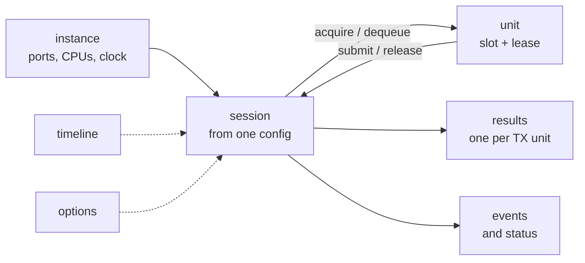
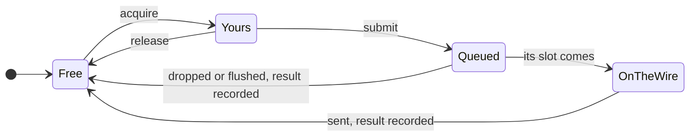
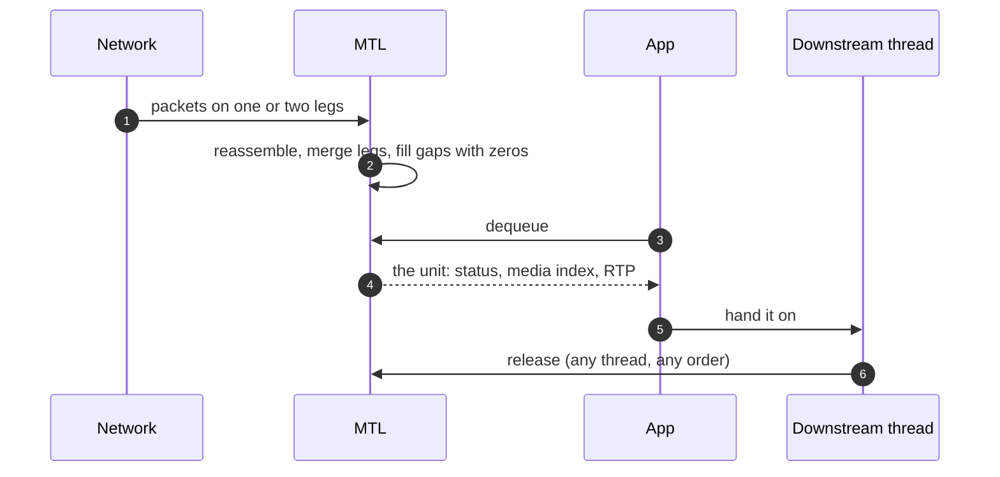
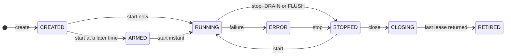
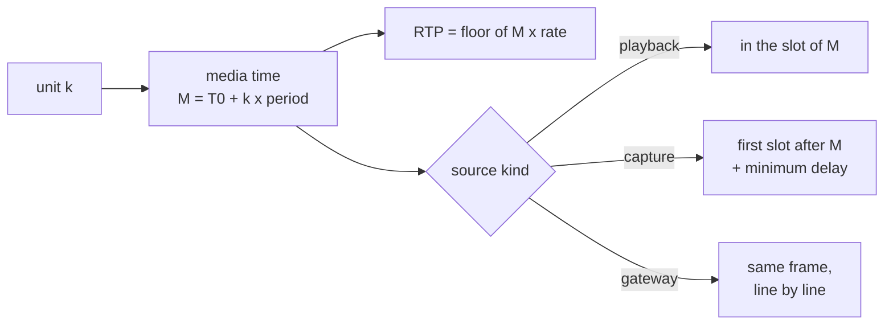

# Unified MTL API: concepts

| | |
|---|---|
| Status | Learning document for the proposed unified API (revision 4, typed configuration D-97, port first D-98). Nothing is implemented; the headers in [sketch/](sketch/) are normative, and where this page and a header disagree, the header wins |
| Date | 2026-10-02 |
| Sources | [archive/LEARN.md](archive/LEARN.md), [archive/00-summary.md](archive/00-summary.md), [archive/01-goals-and-requirements.md](archive/01-goals-and-requirements.md) §1–§4, [archive/08-observability.md](archive/08-observability.md) §1, [archive/LIST-OF-CHANGES.md](archive/LIST-OF-CHANGES.md) §3, [archive/samples/diagrams.md](archive/samples/diagrams.md), [archive/samples/README.md](archive/samples/README.md), [archive/10-api-sketch.md](archive/10-api-sketch.md), [archive/REVISION-4.md](archive/REVISION-4.md) §1, §2, §9, [presentation/slides.md](presentation/slides.md), [sketch/include/mtl/experimental/](sketch/include/mtl/experimental/), [sketch/examples/](sketch/examples/) |

This page teaches the API in one sitting: why it exists, the ten words it is built on, a first
sender and receiver, what happens to one unit, and where to read on. It assumes no knowledge of
today's MTL API. Where a legacy name helps a reader who is moving an application, it is given in
parentheses, for example `mtl_instance_open` (legacy `mtl_init`). The full legacy map is
[migration.md](migration.md). Every picture of the set, one per example included, is in
[diagrams.md](diagrams.md).

## 1. Why a new API

The design answers the three questions of the maintainer's review of PR #1610:

1. *Did my frame go out on time?* One result per unit (§6.1).
2. *Can audio, video and ANC from one file get consistent RTP without the application doing the
   maths?* Timelines and media time (§7.5).
3. *Can nothing I call ever block the pinned cores?* Pinned cores do packet work only (§2.2).

MTL's engines (packet builders, pacing, reassembly, ST 2022-7 merge) are sound. The API around
them leaves users unable to answer basic questions. Each point below was verified in today's
code ([archive/research/](archive/research/)).

| What a user cannot do today | Why |
|---|---|
| know whether a frame went out on time | "done" means a buffer was freed; late reporting names no frame; recovery reports lost frames as complete |
| get consistent RTP for audio, video and ANC from one file | each essence is timestamped separately, with up to half a frame of error |
| trust that nothing blocks the pinned cores | application callbacks, mutexes and a 60 s ARP wait run on the scheduler cores |
| share memory safely | `mtl_dma_map` maps one port and keeps no reference |
| send their own RTP packets cleanly | packet mode needs DPDK mbufs and tasklet callbacks; ST 2022-6 cannot be sent |
| tell errors apart | `NULL` means timeout, stop and destroy alike |
| treat essences alike | each media type has its own verbs, structs and gaps (ST 2110-22 has no stats, ST 2110-30 pipelines no user timestamp, only video emits events) |
| start or stop one session, or learn why a create failed | no per-session start or stop; create returns `NULL` without a reason; no soname, no symbol or struct versioning, and fields have moved silently; `mtl_init` fails after `mtl_uninit` (#1341) |
| write a plugin without re-inventing MTL | every framework re-implements condvar wake-ups, an instance singleton and audio re-framing; FFmpeg never reached zero copy |

Timing is the largest cluster of external bug reports (#1653). Lock contention on pinned cores
shows as #1622 (UHD performance) and #1620 (audio and ANC sessions lose packets when another
stream connects or disconnects).

The answer: one small header for every essence, one result per unit, exact timing across
essences, RTP packets as a unit kind, and pinned cores that do packet work only. The engines stay;
their fixes reach the legacy API too, wire-visible ones as an opt-in there and the default here.
The branch implements ST 2110-20 video first ([implementation-plan.md](implementation-plan.md)).

### 1.1 What changes, area by area

| Area | Today | Unified API |
|---|---|---|
| Sessions | four exchange models (session callbacks, pipeline get/put, RTP level, slice) with per-essence verbs and structs | one session type, one config, one verb set and one unit struct for every essence, in frame, rows or packet units |
| First program | `mtl_init`, an ops struct, create, a get/put loop | a typed config, `mtl_session_open`, an acquire/submit loop, `mtl_session_close` (§3) |
| Outcome of a frame | "done" means a buffer was freed; late reporting names no frame | one result per unit: `MTL_TX_ON_TIME`, `_LATE`, `_DROPPED`, `_FLUSHED`, `_FAILED`, with a reason and a margin |
| Pinned cores | callbacks, mutex and condvar, recovery and ARP waits run on tasklets | packet work only; waking the application is a store and a fence |
| Timing and A/V sync | one `timestamp` drives pacing and RTP; up to half a frame of RTP error between essences | media time drives RTP (`floor(M × rate)`); launch from ST 2110-21 and the source kind; a shared timeline and a start of several sessions at once |
| Memory | raw `{addr, iova}`; `mtl_dma_map` maps one port | regions mapped into every device, refcounted; one `mtl_session_attach` for a framework pool |
| RTP passthrough | DPDK mbufs, callbacks on the tasklet, no ST 2022-6 | `MTL_UNIT_PACKETS` with the same verbs; `MTL_RTP` for ST 2022-6 |
| Errors | `NULL`, or `-EIO` for many things | `MTL_E*` codes with one meaning each; `mtl_last_error()` names the field |
| Tuning | about 200 flag bits and ops fields | about 160 named options, absent unless set |
| Observability | per-essence stats structs, reset on read | one registry of named, cumulative values; events with getters |
| Public headers | 14, the session layer included | `mtl.h` and 16 optional headers; the legacy headers opt-in, then internal |
| ABI | no soname, no struct versioning | `struct_size` and `MTL_INIT`, size-checked structs, its own soname |
| Testing | a NIC for almost everything | the null backend, a test clock, fault injection |
| Pods | unbounded teardown, no health signal, open blocks up to 180 s | a bounded network-first shutdown, lock-free health, fail-fast open |
| NMOS and IPMX | destination updates only | one atomic `mtl_session_update` with planned and applied instants (Phase 2); the rest of IS-05, SDP, IPMX and PEP (Phase 7, later) |

What does not change: the legacy APIs keep working and get every engine bugfix during the
transition; the wire of a legacy session changes only on opt-in; MtlManager, the lcore model,
hugepages and VFIO stay. Every change as a rule: [contract.md](contract.md); the legacy map:
[migration.md](migration.md).

### 1.2 Who it is for

Each persona has one thing the API must make excellent, not merely possible. Several rules only
make sense per persona (the sticky interrupt for P2, `MTL_SESSION_RX_BY_INDEX` for P5, the
capacity query for P9). The personas come from code archaeology, not interviews; the external
review of M10 ([decisions.md](decisions.md)) validates them.

| ID | Persona | Must be excellent at |
|---|---|---|
| P1 | simple generator or player (sample apps, test tools) | a short loop with one config, a library pool and results off ([ex01](sketch/examples/ex01_tx_video.c)); one-call sends in `mtl_util.h` |
| P2 | framework integrator (FFmpeg, GStreamer, OBS, Python, Rust) | interruptible waits, one wait handle, pool import and export, clean errors, a latency report, a query before create |
| P3 | broadcast playout (file to ST 2110, A/V/ANC together) | exact RTP for every essence from one timeline, an atomic start, a deterministic late policy |
| P4 | live capture and contribution (camera, SDI to IP) | latency visibility, `mtl_tx_next_slot`, rows units, a drop policy |
| P5 | zero-copy forwarder or GPU pipeline (MXL bridge, split forward) | regions with a defined lifetime, RX release in any order, holds, `MTL_SESSION_REQUIRE_DIRECT` |
| P6 | Rivermax migrant | an application-driven loop, chunks as packet units, regions, non-blocking back-pressure |
| P7 | libfabric developer | handles, queues, a cookie per unit, requested versus granted, `-MTL_EAGAIN` |
| P8 | validation and compliance (KahawaiTest, pytest, EBU LIST users) | scheduled versus actual times, per-unit status, exact arithmetic, the null backend, fault injection |
| P9 | operator or NMOS integrator | an atomic multi-leg update, leg admin state (`sc.legs_disabled`), stable session names, enumeration, a capacity query |

### 1.3 Goals

| ID | Goal |
|---|---|
| GO-1 | **One session model** for ST 2110-20, -22, -30, -40 and -41, TX and RX; media-specific fields only at creation, the same verbs at runtime |
| GO-2 | **A familiar shape**: acquire → fill → submit → result; dequeue → read → release; queues, regions, a cookie, requested versus granted |
| GO-3 | **One buffer contract** for every provisioning path: a library pool, attached memory, later device memory |
| GO-4 | **Timing correct by construction**: media time and launch time apart, RTP from media time only, one exact timeline shared by essences, late handling as a policy with a per-unit result |
| GO-5 | **Nothing happens silently**: one result per unit, granted values reported, an event and a getter for every state |
| GO-6 | **Real-time safety**: no public call and no application code on a pinned core |
| GO-7 | **A robust lifecycle**: per-session states, drain or flush, interruptible waits, stale-handle safety, codes not `NULL` |
| GO-8 | **An evolvable ABI**: versioned structs, opaque handles, soname and symbol versions, an experimental tier |
| GO-9 | **Incremental delivery, engines first**: today's builders and reassembly are reused; engine fixes land first and reach legacy users |

### 1.4 Non-goals of the first version

Several are "reserve the shape now, implement later", so they come without an ABI break.
Details: [archive/01 §4](archive/01-goals-and-requirements.md).

| ID | Not in the first version | Where it stands |
|---|---|---|
| NG1 | replacing the packet builders and RX reassembly | kept; pacing admission, RTP derivation, the time source and completion plumbing are re-plumbed (E1–E13, [engine.md](engine.md)) |
| NG2 | application-built RTP packets inside the unified API | superseded by D-82: `MTL_UNIT_PACKETS` and `MTL_RTP` (phase 2P) |
| NG3 | SDP parsing inside `lib/` for MTL's own use | holds; `mtl_sdp.h` is a helper on public calls only (Phase 7, later; D-94) |
| NG4 | direct NIC access to DMA-BUF, CUDA or Level Zero memory | GPU-pinned host memory imports as host memory; `mtl_mem_import_device` is `MTL_LATER` (Phases 4–6) |
| NG5 | multi-process session sharing, DPDK secondary processes | one process per instance (Q-LIFE-8); processes sync through the epoch timeline (§7.5) |
| NG6 | RX header split | not in the unified API (Q-MEM-9, M12); needs a DPDK patch |
| NG7 | library-scheduled RX delivery ("present at T") | the presentation time is reported; scheduling is later (Q-TIME-12) |
| NG8 | runtime `mtl_port_open` (no header symbol yet) | Phase 6 |

## 2. The mental model

### 2.1 Ten words

| Word | One sentence | In the API |
|---|---|---|
| **instance** | your process's handle on a set of NIC ports, CPUs and a clock | `mtl_instance_h`, `mtl_instance_open` (legacy `mtl_init`) |
| **session** | one stream of one essence in one direction: video TX, audio RX, ANC TX, … | `mtl_session_h` (legacy `st20p_tx_handle` and its siblings) |
| **config** | one typed struct that describes a session: direction, essence, flows, essence fields | `struct mtl_session_config` (legacy `struct st20p_tx_ops` and friends) |
| **unit** | what one call moves: a frame or field, rows of a frame, a run of audio samples, the ANC of one frame, or a chunk of RTP packets | `struct mtl_unit` (legacy `struct st_frame`) |
| **slot** | one buffer of a session's pool, named by its index; the stable identity of a buffer | `u.slot`, `sc.pool_count` (legacy `framebuff_cnt`) |
| **lease** | permission to touch one slot's memory now, from acquire or dequeue until submit or release | `mtl_lease_h`, `u.lease` |
| **result** | what happened to one TX unit you submitted | `struct mtl_tx_result`, `mtl_tx_reap` (legacy `notify_frame_done`) |
| **timeline** | an exact clock origin T0 shared by sessions, so their units mean the same instant | `mtl_timeline_h`; null = the SMPTE epoch |
| **event** | a notice that something changed (link, time base, session state); every state also has a getter | `struct mtl_event`, `mtl_session_read_events` |
| **option** | a tuning knob, absent unless set, and absent means the documented default | `struct mtl_option`, `MTL_OPT_*` in `mtl_options.h` |



Five essences plus generic RTP share the same verbs: `MTL_VIDEO` (ST 2110-20), `MTL_CVIDEO`
(ST 2110-22), `MTL_AUDIO` (ST 2110-30/31), `MTL_ANC` (ST 2110-40), `MTL_FASTMETA` (ST 2110-41)
and `MTL_RTP` (generic RTP such as ST 2022-6, packet units only). A unit is one of three kinds,
`sc.unit`:

| Kind | Moves | Typical use |
|---|---|---|
| `MTL_UNIT_FRAME` (default) | a frame or a field | almost every program |
| `MTL_UNIT_ROWS` | rows of a video frame, published progressively | an SDI-to-IP gateway ([ex08](sketch/examples/ex08_progressive_rows.c)) |
| `MTL_UNIT_PACKETS` | a chunk of RTP packets the application builds or parses (legacy `ST20_TYPE_RTP_LEVEL`) | forwarders, custom payloads ([ex12](sketch/examples/ex12_rtp_packets.c), `mtl_packet.h`) |

The objects and who owns what: [diagrams.md §3.4](diagrams.md#34-objects-and-ownership); the
shape next to libfabric and Rivermax: [§3.7](diagrams.md#37-the-shape-shared-with-libfabric-and-rivermax).

### 2.2 The app pushes, MTL never calls back

TX is `acquire → fill → submit`; RX is `dequeue → read → release`. MTL never calls into the
application to pull a frame or to report one. What legacy callbacks did, the application now
reads on its own thread: results, events, status and a wait handle.

| Context | May do | Never does |
|---|---|---|
| MTL core, on pinned CPUs (tasklets) | build packets, pace, reassemble, record results | block, take a lock an application thread holds, allocate, log, call application code, make a syscall (DPDK backend), convert pixel formats |
| MTL waker thread | the wake-up syscall for sleeping application threads | anything else |
| MTL worker threads | recovery, ARP, flow rules, IGMP, queue resets | spin on core state |
| your threads | every API call, and every format conversion (in the caller of the DPC call) | — |

One exception to "no conversion on a tasklet": with the option `rx.convert_per_packet` (legacy
`ST20P_RX_FLAG_PKT_CONVERT`) the library converts each packet on the RX tasklet as it lands.
It is library code; application code still never runs there. The waker runs `SCHED_OTHER`
unless `instance.waker_priority` (`MTL_OPT_WAKER_PRIORITY`, `SCHED_FIFO` 1–99, needs
`CAP_SYS_NICE`) is set. Whether a pinned core may write the wake-up itself for sub-millisecond
units is open decision M6 ([decisions.md](decisions.md)). Pictures:
[diagrams.md §3.3](diagrams.md#33-threads-and-the-pinned-cores) and
[§2.19](diagrams.md#219-under-the-hood-nothing-waits-on-the-pinned-cores).

### 2.3 The rules every call follows

These come from the top of `mtl.h` (R1–R8); [contract.md](contract.md) has them in full.

- **Returns**: 0, or a count or mask, on success; a negative `MTL_E*` (Linux errno values on every
  OS) on failure. `mtl_last_error()` adds the reason and the name of the field at fault.
- **Timeouts** are the last argument, in ns (`MTL_MS(100)`): 0 = do not wait, `MTL_FOREVER` = no limit.
- **Structs**: `MTL_INIT(&s)` zero-fills an input struct and sets its `struct_size`; zero is the default.
- **Handles** are typed 64-bit values; 0 is the null handle (`MTL_NULL(T)`, `MTL_IS_NULL(h)`), a
  closed handle is never reissued, and every close accepts a null handle.
- **Times** are `int64_t` TAI nanoseconds, valid only when their flag says so.
- **Call classes**: CP (control plane, may allocate and block), DP (data plane: O(1), no
  allocation, no lock a tasklet takes, no logging, and no syscall except the non-blocking read
  that drains an armed wait handle, §6.2), DPC (data plane that copies or converts in the
  caller), WT (waits; DP when the timeout is 0), AS (async-signal-safe: the only calls a signal
  handler may make).

## 3. The first sender

[ex01](sketch/examples/ex01_tx_video.c), copied verbatim. It shares `ex_fail()` and
`g_running` from [ex_common.h](sketch/examples/ex_common.h): `ex_fail()` prints
`mtl_error_name(ret)`, the reason and the field from `mtl_last_error()`.

```c
/* ex01 — the smallest video sender: one config, a library pool, no results to read.
   Defaults it relies on: media mode AUTO, source PLAYBACK, epoch timeline, results off.
 */
#include "ex_common.h"

void render(void* addr, uint32_t stride, int64_t frame);

int main(void) {
  mtl_instance_h mt = MTL_NULL(mtl_instance_h);
  mtl_session_h s = MTL_NULL(mtl_session_h);
  struct mtl_session_config sc;
  struct mtl_unit u;
  MTL_INIT(&sc);
  MTL_INIT(&u);

  sc.direction = MTL_TX;
  sc.essence = MTL_VIDEO;
  mtl_flow_ipv4(&sc.flows[0], 239, 168, 85, 20, 20000);
  sc.video.raster.width = 1920;
  sc.video.raster.height = 1080;
  sc.video.raster.rate = MTL_FPS_59_94;
  sc.video.format = MTL_YUV422_10;

  int ret = mtl_instance_open(NULL, &mt); /* ports from MTL_PORTS, e.g. "null:1" */
  if (ret >= 0) ret = mtl_session_open(mt, &sc, &s); /* create and start */

  for (int64_t k = 0; ret >= 0 && g_running;) {
    ret = mtl_tx_acquire(s, &u, MTL_MS(100));
    if (ret == -MTL_EAGAIN) { /* back-pressure: status.blocked_on says on what */
      ret = 0;
      continue;
    }
    if (ret == 0) {
      render(u.plane[0].addr, u.plane[0].stride, k++);
      ret = mtl_tx_submit(s, &u); /* the next slot on the wire */
    }
  }

  if (ret < 0) ex_fail("mtl", ret);
  mtl_session_close(s, MTL_SEC(1));   /* sends what is queued, then retires */
  mtl_instance_close(mt, MTL_SEC(1)); /* leaves groups, stops the devices */
  return ret < 0;
}
```

What to notice:

- **One header, one typed config**: `ex_common.h` includes `mtl.h` only, and the config is enums
  and defines, no strings. Any rate without a name is a rational in `sc.video.raster.fps`.
  `mtl_flow_ipv4()` fills a flow (legacy `dip_addr[0]` and `udp_port[0]`).
- **Enums keep the legacy order**: legacy + 1 where 0 must mean "not set" (`MTL_FPS_59_94` is
  `ST_FPS_P59_94` + 1, `MTL_YUV422_10` is `ST20_FMT_YUV_422_10BIT` + 1), the same values where 0
  is a real default (`enum mtl_packing` is `enum st20_packing`, `enum mtl_sender_type` is
  `enum st21_pacing`). Porting an ops struct is a field-by-field copy
  ([migration.md](migration.md)).
- **Ports from the environment.** `mtl_instance_open(NULL, &mt)` reads `MTL_PORTS`, for example
  `MTL_PORTS=0000:af:01.0=192.168.1.10/24` or `MTL_PORTS=null:1`. The **null backend** needs no
  NIC, no root and no hugepages. Explicit ports go in `struct mtl_instance_params` (legacy
  `struct mtl_init_params`).
- **`mtl_session_open` creates and starts** (legacy `st20p_tx_create`); `mtl_session_create` plus
  `mtl_session_start` start at a chosen time or several sessions together.
- **Defaults do the rest**: MTL owns the buffers, each frame goes out in the next slot, and no
  results are produced, so the loop never stalls on unread results.
- **Back-pressure is a return code.** `-MTL_EAGAIN` from acquire means no slot is free yet
  (legacy `st20p_tx_get_frame` returning `NULL`); `status.blocked_on` says why.
- **Close is bounded.** `mtl_session_close` drains what is queued, destroys and waits for
  retirement in one call; `mtl_instance_close` shuts down network first within its deadline
  (legacy `mtl_uninit`).

The same program as a picture: [diagrams.md §2.1](diagrams.md#21-send-video-ex01).

## 4. The first receiver

[ex02](sketch/examples/ex02_rx_video.c), copied verbatim. It takes an open instance.

```c
/* ex02 — a video receiver on two ST 2022-7 legs: dequeue, read, release. */
#include "ex_common.h"

void show(const void* addr, uint32_t stride, int complete, int64_t media_index);

int rx_video(mtl_instance_h mt) {
  mtl_session_h s = MTL_NULL(mtl_session_h);
  struct mtl_session_config sc;
  struct mtl_unit u;
  MTL_INIT(&sc);
  MTL_INIT(&u);

  sc.direction = MTL_RX;
  sc.essence = MTL_VIDEO;
  /* two flows = two legs on instance ports 0 and 1; packets merge by sequence */
  mtl_flow_ipv4(&sc.flows[0], 239, 168, 85, 20, 20000);
  mtl_flow_ipv4(&sc.flows[1], 239, 168, 86, 20, 20000);
  sc.video.raster.width = 1920;
  sc.video.raster.height = 1080;
  sc.video.raster.rate = MTL_FPS_59_94;
  sc.video.format = MTL_YUV422_10;
  int ret = mtl_session_open(mt, &sc, &s);

  while (ret >= 0 && g_running) {
    ret = mtl_rx_dequeue(s, &u, MTL_MS(100));
    if (ret == -MTL_EAGAIN) { /* no signal: status.flags lacks MTL_STATUS_RX_SIGNAL */
      ret = 0;
      continue;
    }
    if (ret < 0) break;
    show(
        u.plane[0].addr, u.plane[0].stride, u.status == MTL_RX_COMPLETE,
        (u.flags & MTL_UNITF_INDEX_VALID) ? u.media_index : -1); /* lost packets read 0 */
    ret = mtl_rx_release(s, u.lease);
  }

  if (ret < 0) ex_fail("rx", ret);
  mtl_session_close(s, 0);
  return ret;
}
```

What to notice:

- **The same config, `MTL_RX`.** A receiver differs from a sender in `sc.direction` and the
  verbs (`mtl_rx_dequeue`, `mtl_rx_release`; legacy `st20p_rx_get_frame`, `st20p_rx_put_frame`).
- **Two flows are two ST 2022-7 legs.** `flows[1]` that exists is the redundant leg; packets merge
  by sequence number. `u.flags & MTL_UNITF_USED_REDUNDANCY` says the frame needed the other leg.
- **Lost packets never hide a frame.** A frame with gaps arrives with `u.status ==
  MTL_RX_INCOMPLETE`, and the gaps read as zero in library pools.
- **Every RX unit says which frame it is**: `u.media_index` (valid with `MTL_UNITF_INDEX_VALID`),
  `u.media_tai_ns` and the received `u.rtp`.
- **Close with timeout 0** returns 1 instead of waiting when a frame is still leased; the session
  retires on the last release.

As a picture: [diagrams.md §2.2](diagrams.md#22-receive-video-on-two-networks-ex02); the legs and
their flow states: [§4.4](diagrams.md#44-legs-and-flow-states).

## 5. The life of a unit

### 5.1 TX



1. **Acquire** (`mtl_tx_acquire`) lends a free slot: `u.lease`, `u.slot`, `u.plane[]` (address,
   stride, row bytes, rows per plane) and `u.meta`, the slot's metadata area. The per-use fields
   (`used`, `flags`, media time, `cookie`, `hold`) are zeroed.
2. **Fill** the planes and set what this unit needs: `u.media_index` or `u.media_tai_ns` (by
   media mode, §7), `u.cookie` (returned in the result), `u.used` (0 = the whole unit), `u.flags`
   (`MTL_SUBMIT_*`, for example `MTL_SUBMIT_DISCONTINUITY` after a seek).
3. **Submit** (`mtl_tx_submit`) hands the unit over. While a unit is yours MTL never touches it;
   after submit it is MTL's until it has left. The meta area is copied at submit; plane bytes are
   read at send time, so do not write them after submit.
4. **The slot comes**: MTL paces the packets on the ST 2110-21 schedule (sender type
   `MTL_SENDER_N`, `W` or `NL`) and sends them on every leg.
5. **One result** records what happened (`ON_TIME`, `LATE`, `DROPPED`, `FLUSHED`, `FAILED`),
   if results are on (§6.1), and the slot is free again.

A failed submit puts the slot back without a result, so a loop needs no cleanup branch (only
`-MTL_EAGAIN` from a busy-loop thread leaves the lease yours). `mtl_tx_release(s, u.lease)` gives
back an unsubmitted lease. Rows units submit the same lease again with a larger `u.used` to
publish more rows. A slot with no unit is an underrun (§7.4). The same unit through the layers
and step by step: [diagrams.md §5.1](diagrams.md#51-one-tx-unit-through-the-layers),
[§5.5](diagrams.md#55-one-tx-frame-step-by-step).

### 5.2 RX



- **Dequeue** (`mtl_rx_dequeue`) returns units in delivery order, each with its lease.
- **A unit that never completes is delivered at its deadline**, marked incomplete, so a stop never
  hangs on a missing packet.
- **Release** (`mtl_rx_release`) may come from any thread in any order, so a frame can be lent to
  a framework buffer and released when downstream drops it ([ex05](sketch/examples/ex05_rx_to_framework.c)).
- **A full pool** drops new units by default and counts them in the next unit's
  `u.missed_before`. `MTL_SESSION_RX_LATEST` reclaims the oldest unread unit instead;
  `MTL_SESSION_RX_BY_INDEX` puts frame k in slot k mod `pool_count`, for MXL rings
  ([ex06](sketch/examples/ex06_mxl_ring.c)).

Through the layers: [diagrams.md §5.2](diagrams.md#52-one-rx-unit-through-the-layers); who owns a
slot when, in both directions: [§5.4](diagrams.md#54-free-yours-mtls-both-directions).

### 5.3 A session's life



- `mtl_session_open` goes straight to RUNNING. **Stop** (`mtl_session_stop`; legacy pipelines had
  none per session) passes through DRAINING (`MTL_STOP_DRAIN`: queued units are sent) or FLUSHING
  (`MTL_STOP_FLUSH`: queued units become FLUSHED), and a start undoes it.
- **ERROR** admits only stop and close; data calls return `-MTL_EIO` and `status.error_reason`
  says why.
- **Close** works from any state and always consumes the handle: 0 = retired, nothing references
  the session any more; 1 = leases still out, and `MTL_WAIT_RETIRED` reports the end.
- **Change without re-creating**: `mtl_session_update` changes flows, legs, media fields or the
  pool, all or nothing, at a slot boundary (legacy `st20p_tx_update_destination`);
  `mtl_session_discard` flushes the queue for a seek and stays RUNNING.

The full state machine, what close does and starting sessions together:
[diagrams.md §4.1–§4.3](diagrams.md#41-the-session-state-machine).

## 6. Results and errors you program against

### 6.1 Results

A result is the answer to "did my frame go out on time?". `mtl_tx_reap(s, rec, sizeof(rec[0]),
max, timeout)` returns up to `max` results in submission order.

| `status` | Meaning |
|---|---|
| `MTL_TX_ON_TIME` | sent in its slot |
| `MTL_TX_LATE` | sent late, within the late tolerance |
| `MTL_TX_DROPPED` | not sent; `reason` says why (for example `TOO_LATE`, `WOULD_OVERLAP`, `WAITING_NEIGHBOUR`); its slot stays empty on the wire |
| `MTL_TX_FLUSHED` | removed by stop with FLUSH, discard, withdraw or close (`STOP_FLUSH`, `DISCARD`, `WITHDRAWN`, `STOP_TIMEOUT`, `ABORTED`) |
| `MTL_TX_FAILED` | a device or queue failure; `error` and `reason` |

The core record, `struct mtl_tx_result` (96 bytes), also carries `cookie`, `seq`, `slot`,
`media_index`, `media_tai_ns`, `margin_ns` (deadline minus submit; negative = late),
`sent_tai_ns` (first packet), `rtp` and `MTL_TXR_*` flags such as `MTL_TXR_COPIED`. Pass the size
of `struct mtl_tx_result_full` (`mtl_observe.h`) to get the full timing record.

- **Exactly one result per submitted unit**, never lost: the core only marks a unit done, and
  the reader builds the results in order.
- **Off by default with MTL's buffers** (turn them on with `MTL_SESSION_RESULTS`), so a minimal
  loop cannot stall on unread results. **Always on with your own memory**: a result is how you
  learn the memory is free again.
- **Unread results take room**: when the ring of `pool_count` results is full, acquire waits with
  `status.blocked_on == MTL_BLOCKED_RESULTS` (other reasons: `BUFFERS`, `APP_LEASES`, `APP_PINS`).
- **RX has no results**: the unit itself carries `status`, `media_index`, `rtp` and flags;
  `mtl_rx_get_detail` and `mtl_rx_get_timing` (`mtl_observe.h`) add per-unit detail.

Every path a submitted unit can take to its result:
[diagrams.md §9.1](diagrams.md#91-what-happens-to-a-submitted-tx-unit).

### 6.2 Waiting without missing a wake-up

Every data call (acquire, dequeue, reap, read, wait) that finds nothing returns `-MTL_EAGAIN` and
**arms** the session's wait handle. So the pattern for an event loop is: call MTL until it says
`-MTL_EAGAIN`, then sleep. An application that never sleeps never causes a wake-up syscall.

- `mtl_session_get_wait_handle(s, mask, &native)` gives an eventfd on Linux (a `HANDLE` on
  Windows) for `epoll` ([ex03](sketch/examples/ex03_event_loop.c)); `mtl_session_wait(s, mask,
  timeout)` blocks on `MTL_WAIT_ACQUIRE`, `_DEQUEUE`, `_RESULTS`, `_EVENTS` or `_RETIRED`.
- `mtl_session_interrupt(s, 1)` makes every data wait return `-MTL_ECANCELED` until
  `mtl_session_interrupt(s, 0)` (GStreamer `unlock` and `unlock_stop`; legacy
  `st20p_tx_wake_block`). `mtl_instance_interrupt` does it for every session and is safe in a
  signal handler.
- Many sessions behind one wait handle: a queue (`mtl_queue.h`) gathers their results, RX
  readiness and events.

Pictures: an event loop ([diagrams.md §2.4](diagrams.md#24-in-your-own-event-loop-ex03)),
arming ([§6.1](diagrams.md#61-arming-in-the-applications-terms)) and interrupts
([§6.3](diagrams.md#63-interrupts)).

### 6.3 Events and status

Events (`MTL_EVENT_*`: session, leg, flow, RX signal and format, pacing, time, link, health,
updates) are read with `mtl_session_read_events` (`mtl_queue.h`). Every state an event reports also
has a getter (`mtl_session_get_status`, `mtl_instance_get_health`, …), so a lost event loses
nothing. Numbers live in one stats registry (`mtl_stat_list`, `mtl_stat_read`, `mtl_observe.h`).

### 6.4 Errors

One code, one meaning, on every call:

| You get | It means | Do |
|---|---|---|
| `-MTL_EAGAIN` | nothing now, or by the timeout; the wait handle is armed | try again, or sleep on the handle |
| `-MTL_ECANCELED` | someone interrupted the waits | leave the wait; `interrupt(..., 0)` to wait again |
| `-MTL_ESHUTDOWN` | **you** stopped or closed the session or instance | leave the loop |
| `-MTL_EIO` | the session failed (ERROR), or a device could not be stopped | read `status.error_reason`; stop, then start again or close |
| `-MTL_ENODEV` | the device was removed, or its reset failed | stop, update the session onto another port, start |
| `-MTL_ETIMEDOUT` | a `MTL_STOP_DRAIN` stop missed its deadline (close never returns it: 0 or 1) | the rest became FLUSHED (`STOP_TIMEOUT`) |
| `-MTL_EINVAL` | a wrong argument | `mtl_last_error()` names the field or option |
| `-MTL_EBUSY` | in use, or not allowed in this state | check the state first |
| `-MTL_ENOSPC` | out of capacity: queues, CPUs, regions, payload size | `mtl_session_query(..., MTL_QUERY_CHECK_CAPACITY, ...)` asks first |
| `-MTL_ENOTSUP` | a capability or option this port or build lacks | choose another mode |
| `-MTL_ERANGE` | a time outside the accepted window | check the media time or `when` |
| `-MTL_EEXIST` | a name in use with another configuration | use the same config, or another name |
| `-MTL_ENOMEM` | an allocation failed | free memory, or lower `pool_count` |
| `-MTL_EBADF` / `-MTL_ESTALE` | a wrong or closed handle / a lease already returned | fix the bug |
| `-MTL_EDEADLK` | a call a library thread may not make, such as closing the instance from a dispatch callback | make it from your own thread |

`mtl_error_name(ret)` and `mtl_reason_name(reason)` give printable names; `mtl_reasons.h` lists
the reasons for code that branches on them. The codes as a decision tree:
[diagrams.md §2.20](diagrams.md#220-what-a-return-code-tells-you).

### 6.5 Where do I look?

Every fact has one home: a result, an event with its getter, a status field, an info field or a
stats key ([contract.md](contract.md) §11.3 lists the keys). Logs are for humans and never the
only carrier of a fact.

| Question | Where |
|---|---|
| was my frame on time? | the result's `status` and `margin_ns` (`mtl_tx_reap`) |
| how early or late? | `margin_ns`; stats `tx.margin_ns` (histogram), `tx.margin_min_ns`; `mtl_tx_next_slot` before acquiring |
| why can I not acquire? | `-MTL_EAGAIN`, `status.blocked_on`, `MTL_EVENT_BACKPRESSURE` |
| how much is buffered? | `queue.gauge{state}`, `queue.queued_media_ns` |
| did a slot go empty? | `tx.slots_empty`, `MTL_EVENT_TX_UNDERRUN`, `slots_skipped_before` in the full result |
| is my sender ST 2110-21 compliant? | `tx.vrx_max`, `tx.cinst_max`, `tx.tpr_late_pkts` |
| is PTP locked, which grandmaster? | the flags of `mtl_time_now`, `time.*`, `MTL_EVENT_TIME_STATE`, `MTL_EVENT_GRANDMASTER` |
| which leg is alive? | `status.leg[]` (admin, oper), `MTL_EVENT_LEG_STATE` |
| did ARP and IGMP work? | `status.leg[].flow_state`, `MTL_EVENT_FLOW_STATE` |
| RX loss? | `u.status`, `mtl_rx_get_detail`, `leg.*` |
| latency? | `rx.latency_ns`; `latency_min_ns` and `latency_max_ns` from `mtl_session_get_info` |
| is the CPU starved? | `sched.*`, `MTL_EVENT_SCHED_OVERLOAD` |
| was a copy path used? | `info.direct`, `MTL_TXR_COPIED` |
| did a recovery happen? | `MTL_EVENT_RECOVERY`, `tx.recoveries_ok`, `tx.recoveries_failed` |
| which sessions exist? | `mtl_instance_list_sessions` |
| can this host take more streams? | `capacity.*`, `mtl_session_query(mt, &sc, MTL_QUERY_CHECK_CAPACITY, ...)` |
| how many hugepages are left? | `mem.*` |

Details: [archive/08 §1](archive/08-observability.md); the picture of events and shared queues:
[diagrams.md §9.2](diagrams.md#92-events-and-shared-queues).

## 7. Timing in one page

### 7.1 Two times, not one

Every unit has a **media time M**, the TAI instant it represents. Its RTP timestamp is always
`floor(M × rate)`, exact, for every essence. Its **launch time** is when its first packet leaves;
MTL derives it from M, the ST 2110-21 model and the session's **source kind**. Legacy MTL used
one field for both, so pacing and RTP could not be set apart.



The same split with numbers, and one video frame on the ST 2110-21 schedule:
[diagrams.md §2.17](diagrams.md#217-media-time-and-launch-time),
[§8.3](diagrams.md#83-one-video-frame-on-the-st-2110-21-schedule).

### 7.2 What the application says: the media mode

| `sc.media_mode` | The application says | Typical user |
|---|---|---|
| `MTL_MEDIA_AUTO` (default) | nothing; MTL uses the next slot | generators, simple programs |
| `MTL_MEDIA_INDEX` | "this is unit k of the timeline": `u.media_index` | playout, files, sync |
| `MTL_MEDIA_TAI` | "this unit represents instant t": `u.media_tai_ns`, snapped to the grid | cameras, framework sinks, processors |
| `MTL_MEDIA_SENDER` (Phase 7, later) | "the source sampled this unit at t on its own clock", never snapped | asynchronous IPMX sources |

Legacy `ST20P_TX_FLAG_USER_TIMESTAMP` with `st_frame.timestamp` maps to INDEX or TAI. The index
period is one frame (one field when interlaced) for video, one sample for audio (`u.media_index`
is the unit's first sample), and the video's frame for ANC and fast metadata. Which mode to pick:
[diagrams.md §8.2](diagrams.md#82-media-modes).

### 7.3 When content exists: the source kind

| `sc.source_kind` | Content exists | Default minimum transmit delay |
|---|---|---|
| `MTL_SOURCE_PLAYBACK` (default) | before its media time: files, graphics | 0 |
| `MTL_SOURCE_CAPTURE` | only after its sampling instant: cameras, encoders, RX-to-TX processors | one unit period plus the pick-up lead, never 0 |
| `MTL_SOURCE_GATEWAY` | in the same frame period, line by line: SDI to IP | none: sent in the same frame, with rows units and the application's `troffset_ns` |

`sc.min_tx_delay_ns` overrides the delay; `sc.media_time_offset_ns` declares a latency that
shifts media time and RTP. A processor that submits each output with its input's media time
keeps the input's RTP and a constant delay ([ex10](sketch/examples/ex10_processor.c)).

### 7.4 Late units and empty slots

**Nothing ever slides**: one late unit never shifts the following ones or the other essences.
The late policy (option `MTL_OPT_LATE_POLICY`) follows the media mode:

| Policy | A unit whose deadline passed | Default for |
|---|---|---|
| `MTL_LATE_DROP` | is not sent; result `DROPPED`, reason `TOO_LATE`; its slot stays empty | INDEX and TAI |
| `MTL_LATE_SEND_LATE` | is sent late only if it still fits before the next unit; result `LATE`, else `DROPPED` (`WOULD_OVERLAP`) | — |
| `MTL_LATE_RESLOT` | gets the next free slot and that slot's media time; flag `MTL_TXR_RESLOTTED` | AUTO |

A slot without a unit follows the underrun policy (option `MTL_OPT_UNDERRUN_POLICY`): nothing for
video, compressed video and audio; the empty ANC packet that ST 2110-40 requires for ANC; a
keep-alive packet for fast metadata (ST 2110-41).

### 7.5 Timelines: audio, video and ANC in sync

Every session runs on a timeline: `M(k) = T0 + k × period`. The default timeline is the SMPTE
epoch, enough for one session or for sessions in different processes
(`mtl_epoch_index_at` gives every process the same k for the same instant). `mtl_index_at` and
`mtl_epoch_index_at` round down: k is the unit that contains t. To start at the first unit at or
after t, use k, or k + 1 when t is past the start of unit k. For playout from a
file, create a fresh timeline and start the sessions together; this excerpt is from
[ex07](sketch/examples/ex07_av_anc_playout.c):

```c
MTL_INIT(&tc); /* anchor AT_START: T0 is chosen when the sessions start */
MTL_INIT(&u);

int ret = mtl_timeline_create(mt, &tc, &tl);
if (ret >= 0) ret = open_tx(mt, MTL_VIDEO, 20000, tl, &s[VIDEO]);
if (ret >= 0) ret = open_tx(mt, MTL_AUDIO, 30000, tl, &s[AUDIO]);
if (ret >= 0) ret = open_tx(mt, MTL_ANC, 40000, tl, &s[CAPTIONS]);
if (ret >= 0) ret = mtl_session_start(s, 3, NULL, NULL); /* all three or none */
```

Each session has `sc.timeline = tl` and `sc.media_mode = MTL_MEDIA_INDEX`; each unit says which
frame or sample it is. The RTP of ANC frame k equals that of video frame k, and audio sample n has
exactly `floor(T0 × 48000) + n`. The ANC session needs no raster: it takes the video's. On RX,
units report `media_index` too, and `mtl_rx_align` gives the audio sample that belongs to a video
frame. As a picture: [diagrams.md §2.9](diagrams.md#29-video-audio-and-captions-from-one-file-ex07),
[§8.5](diagrams.md#85-video-audio-and-anc-on-one-timeline).

### 7.6 The clock

All times are TAI on the instance clock. `mtl_instance_params.time_source` picks it:

| `time_source` | The clock |
|---|---|
| `MTL_TIME_SOURCE_AUTO` (default) | a disciplined NIC PHC, else `CLOCK_TAI`, else `SYSTEM_TAI` (ESTIMATED); from Phase 7 the last step is `FREERUN`. AUTO chooses once, at open; re-evaluating while running is Phase 7 |
| `PTP_BUILTIN` | MTL's own PTP client, only when named: on a PF it disciplines the PHC of a port MTL owns; on a VF it disciplines MTL's own software time base, as today, and never steers the VF's PHC |
| `PHC` | the NIC PHC, disciplined by `ptp4l` and `phc2sys`; read only |
| `CLOCK_TAI` | the kernel's TAI clock; rejected if the kernel TAI offset is 0 |
| `SYSTEM_TAI` | `CLOCK_REALTIME` plus the UTC offset, ESTIMATED, follows NTP |
| `USER` | the application feeds (TAI, `CLOCK_MONOTONIC`) pairs (`mtl_sync.h`) |
| `FREERUN` | seeded once from the system clock, never stepped, ESTIMATED |

MTL steers a clock only with `PTP_BUILTIN`, never `CLOCK_REALTIME` and never a clock a node
daemon disciplines. A time taken while the clock is not locked is flagged ESTIMATED.
`mtl_time_now` reads it; `mtl_time_convert` converts to `CLOCK_MONOTONIC` or `CLOCK_REALTIME`.
When a node daemon disciplines the clock, `mtl_time_set_reference` tells MTL what it cannot see
itself (grandmaster, clock class, `locked`), for example that the node lost its grandmaster; pods
need it from Phases 1–2 ([deployment.md](deployment.md)). Where each time comes from:
[diagrams.md §8.6](diagrams.md#86-where-the-time-comes-from).

Details: grids, snapping, ANC windows, RX timing, time sources and steps are in
[timing.md](timing.md).

## 8. Memory and zero copy in one page

**MTL's buffers** (the default): nothing to do. The pool has `sc.pool_count` slots (0 = by
essence), and `mtl_session_query` reports the layout and the buffer requirements before create.

**Your buffers** (`mtl_mem.h`), for framework pools, MXL rings or pinned host memory:


- **A region** is memory MTL may DMA: page aligned, refcounted, and mapped into every port and DMA
  engine a session using it needs (`mtl_mem_import`, `mtl_mem_alloc`; legacy `mtl_dma_map`, which
  mapped one port and held no reference). Shared memory, memfd and hugetlbfs work.
- **Attach** lays the arena out as the session's slots in one call: set
  `MTL_SESSION_POOL_ATTACHED`, create, `mtl_session_attach(s, &a)`, start. It fails at attach,
  with a reason, if the arena is too small. Slot i is surface i.
- **`mtl_tx_acquire_slot(s, i, &u, timeout)`** sends exactly that surface (legacy
  `st20p_tx_put_ext_frame`). Results are always on: a slot is never reused before you read the
  result that frees it ([ex04](sketch/examples/ex04_zero_copy_tx.c)).
- **Zero copy is a policy, not an accident**: `MTL_SESSION_REQUIRE_DIRECT` fails at create rather
  than copy; otherwise `info.direct` and `MTL_TXR_COPIED` report the path used. Any stride of at
  least the row size stays direct, so sub-rectangles and woven interlaced frames need no copy.
- **Forwarding**: one RX slot can feed several TX sessions. A TX session attaches over the
  receiver's pool (`mtl_session_get_pool_region`) and each TX unit sets `u.hold` to the RX lease,
  which keeps the RX slot until it has been sent ([ex09](sketch/examples/ex09_split_forwarder.c)).
- **Close returns when the memory is free**: `mtl_session_close` and `mtl_mem_close` return 0
  once nothing references the memory, and 1 while something still does.

Device memory (GPU) and per-unit RX destinations are `MTL_LATER`. Pictures: regions, pools,
leases and holds as four separate ideas ([diagrams.md §7.1](diagrams.md#71-four-separate-ideas)),
where a session's memory comes from ([§7.2](diagrams.md#72-where-a-sessions-memory-comes-from)),
forwarding with holds ([§7.3](diagrams.md#73-forwarding-with-holds)). Details:
[contract.md](contract.md) (memory), [engine.md](engine.md) (how pools map onto today's
framebuffers).

## 9. Instances in production, briefly

- **Bounded shutdown.** `mtl_instance_close(mt, timeout)` stops the network first (TX finishes the
  unit on the wire, RX leaves its groups, devices stop, then memory is freed) and returns 0
  (retired), 1 (quiesced: no device can reach any memory, exit is safe) or `-MTL_EIO` (a port
  could not be stopped: exit now). `mtl_instance_shutdown` adds flags and a report.
- **Signals belong to the process**: a handler may call `mtl_instance_interrupt(mt, 1)`, and
  `mtl_instance_abort` (legacy `mtl_abort`) for a second signal ([ex11](sketch/examples/ex11_signal.c)).
- **Probes** read the lock-free `mtl_instance_get_health`; liveness never depends on links or PTP.
- **NMOS IS-05**: one PATCH is one `mtl_session_update` of flows and legs at a slot boundary. The
  rest of NMOS, SDP, IPMX and encryption are Phase 7, later ([nmos-ipmx.md](nmos-ipmx.md)).

Pictures: the shutdown order and the instance phases with their probes
([diagrams.md §10.1](diagrams.md#101-the-instance-shutdown-order),
[§10.3](diagrams.md#103-instance-phases-and-probes)), one IS-05 activation
([§2.15](diagrams.md#215-an-is-05-activation-at-one-instant-ex13)). Details:
[deployment.md](deployment.md).

## 10. Where each header fits

A program includes `mtl.h`. Every other header is optional, includes `mtl.h`, and adds one job.
17 headers, 125 functions, plus 14 declared under `MTL_LATER` for later phases
(`sketch/check.sh` counts them). For comparison, today's public surface is 475 functions (about
154 of them colour conversion, 104 pipeline verbs), 75 flag defines and four frame-exchange
models; the unified API has one model, lease and result. The total grows during the transition,
because the legacy API stays until it is hidden (M15). As a picture:
[diagrams.md §2.18](diagrams.md#218-which-header-do-i-need).

| Header | Include it to | Functions |
|---|---|---|
| `mtl.h` | instance, session config and lifecycle, the unit, TX and RX verbs, results, waiting, errors | 32 |
| `mtl_mem.h` | use your own memory, lend one session's pool to another, address a slot by index | 12 (+3 later) |
| `mtl_sync.h` | create timelines, compute media indices, convert clocks, align audio to video on RX | 15 |
| `mtl_queue.h` | read events, or wait on many sessions through one queue | 12 (+1 later) |
| `mtl_packet.h` | build or parse RTP packets yourself (`MTL_UNIT_PACKETS`) | inline only |
| `mtl_observe.h` | stats, full result records, RX detail, health, shutdown with a report, logging, capture | 16 |
| `mtl_options.h` | set a tuning knob (`MTL_OPT_*`), or list every knob by name | 6 |
| `mtl_reasons.h` | branch on a reason code | 0 |
| `mtl_format.h` | use an application pixel format other than the wire format | 10 |
| `mtl_util.h` | the copy path (`mtl_tx_write`), one-call slot sends, ANC helpers | 11 (+3 later) |
| `mtl_plugin.h`, `mtl_convert.h` | write a codec plugin; convert colour formats outside a session | 3, 3 (+1 later) |
| `mtl_legacy.h` | share an instance with legacy code (`mtl_handle`) | 2 |
| `mtl_debug.h` | test clock and fault injection (debug builds) | 3 |
| `mtl_sdp.h`, `mtl_rtcp.h`, `mtl_crypto.h` | SDP, IPMX sender reports, IPMX encryption (Phase 7, later) | 0 (+2, +3, +1 later) |

**Options** cover the ≈ 160 knobs most programs never touch. Pass them at create in an array, or
change them later with `mtl_set_option(MTL_OBJ_OF_SESSION(s), &opt)` where the key allows it. Each
key also has a name (`"tx.late_policy"`), so GStreamer properties, FFmpeg AVOptions and bindings
can list them all. From [examples_cpp.cpp](sketch/examples/examples_cpp.cpp):

```cpp
// a tuning knob: options are absent unless set, and absent means the default
const std::array<mtl_option, 1> opts{{{MTL_OPT_LATE_POLICY, 0, MTL_LATE_SEND_LATE, nullptr}}};
sc.options = opts.data();
sc.option_count = static_cast<uint32_t>(opts.size());
```

## 11. Coming from the legacy API

The most common names, so a reader of today's code can place each concept. Every field and enum
is in [migration.md](migration.md); the legacy headers stay until the new API is frozen, then
become opt-in, then internal.

| Legacy | Unified |
|---|---|
| `mtl_init(&params)`, `mtl_uninit` | `mtl_instance_open(&params, &mt)`, `mtl_instance_close(mt, timeout)` |
| `MTL_FLAG_TASKLET_THREAD` | `MTL_INSTANCE_TASKLET_THREAD` |
| `st20p_tx_create(mt, &ops)`, `st20p_tx_free` | `mtl_session_open(mt, &sc, &s)`, `mtl_session_close(s, timeout)` |
| `struct st20p_tx_ops`: `port.dip_addr`, `port.udp_port`, `width`, `height`, `fps`, `transport_fmt`, `framebuff_cnt` | `sc.flows[]` via `mtl_flow_ipv4`, `sc.video.raster.width`, `.height`, `.rate`, `sc.video.format`, `sc.pool_count` |
| `st20p_tx_get_frame`, `st20p_tx_put_frame` | `mtl_tx_acquire`, `mtl_tx_submit` |
| `st20p_rx_get_frame`, `st20p_rx_put_frame` | `mtl_rx_dequeue`, `mtl_rx_release` |
| `struct st_frame`: `addr[]`, `linesize[]`, `timestamp` | `struct mtl_unit`: `plane[].addr`, `plane[].stride`, `media_index` or `media_tai_ns` |
| `notify_frame_done` callback | `mtl_tx_reap` results, read on your thread |
| `ST20P_TX_FLAG_BLOCK_GET`, `st20p_tx_wake_block` | the timeout argument, `mtl_session_interrupt` |
| `st20p_tx_put_ext_frame`, `mtl_dma_map` | `mtl_session_attach`, `mtl_tx_acquire_slot`, `mtl_mem_import` |
| `st20p_tx_update_destination` | `mtl_session_update(s, &sc, MTL_UPDATE_FLOWS, &when, &planned)` |
| `st20_tx_create` with `ST20_TYPE_RTP_LEVEL` | `sc.unit = MTL_UNIT_PACKETS` |
| `mtl_abort` | `mtl_instance_abort` |

## 12. Glossary

The ten words of §2.1, plus:

| Term | Meaning |
|---|---|
| arm | what a data call returning `-MTL_EAGAIN` does to the wait handle, so the next completion wakes you |
| essence | one media type: video (-20), compressed video (-22), audio (-30), ANC (-40), fast metadata (-41), or generic RTP |
| health | lock-free liveness and readiness flags for probes (`mtl_instance_get_health`) |
| launch time | when a unit's first packet leaves |
| leg | one of a session's two ST 2022-7 network paths, `flows[0]` and `flows[1]` |
| media index | k, the unit's number on its timeline: a frame, a field, or an audio sample |
| media time (M) | the TAI instant a unit represents; RTP = `floor(M × rate)` |
| null backend | a port named `null:<n>`: no NIC, no root; units complete on the clock |
| pool | a session's slots: MTL's buffers, or your memory attached |
| quiesced | after a close: no device can reach any memory, though a lease or thread still holds some |
| region | memory MTL may DMA, refcounted and mapped into every device on the path |
| retired | closed, with no memory, lease or device reference left |
| source kind | playback, capture or gateway: when content exists relative to its media time |
| tasklet | a function MTL's scheduler calls in a tight loop on a pinned core |
| underrun | a slot with no unit; the underrun policy says what is sent |
| waker | a library thread that makes the wake-up syscalls, so tasklets never do |

## 13. Frequently asked questions

**Why not just fix the pipelines?** Most of the work is engine fixes, and they come first and reach
today's API too. What the pipelines cannot reach is one verb set and one unit struct for every
essence (GO-1), versioned structs, no callbacks on tasklets, and one contract for imported memory
(decision M1 in [decisions.md](decisions.md)).

**Does the wire change for my existing application?** No. Wire-visible fixes (exact RTP rounding,
the default video RTP, ANC RTP, ST 2110-22 CBR) are opt-in on the legacy API and the default only
in the unified one (decisions M7 and M13).

**Why no callbacks?** Today's callbacks run on the pinned cores with the session lock held, so one
slow callback stalls every session on that core. Results, events and the wait handle give the
same information on your thread (§2.2, §6).

**Where did the knobs go?** The about 40 fields most programs set are typed fields of the config.
The about 160 others are options (`mtl_options.h`), absent unless set. Each has a constant
(`MTL_OPT_RX_SKEW_BUDGET_NS`) and a name (`"rx.skew_budget_ns"`), so a GStreamer element, an FFmpeg
AVOption or a binding can list them all without code per knob (§10).

**Why no configuration strings?** Typed fields are easier to read and close to today's ops structs,
and the enums keep the legacy order, so porting is a field-by-field copy (D-97,
[migration.md](migration.md)). The one string left is the environment variable `MTL_PORTS`, so a
test or a pod names its ports without a rebuild.

**Is it slower?** It must not be. The budgets: tasklet iteration p99.99 no worse than legacy + 2 %
under the same load, and data-path calls (acquire, submit, reap, dequeue) p50 ≤ 150 ns and p99 ≤
1 µs. The baseline spike S0 measures today's numbers first
([implementation-plan.md](implementation-plan.md) §8.4).

**What happens to `st20_api.h`?** It moves unchanged to `mtl/legacy/` in Phase 1, with forwarding
stubs so existing includes still build. At the ABI freeze (release F) it is deprecated, one
release later it needs `MTL_LEGACY_API`, and after that it becomes internal and is no longer
installed. Everything only it can do (RTP passthrough, slice mode, external frames, RTCP) gets a
home in the new headers first, or a removal the maintainer approves (M12, M15;
[migration.md](migration.md) §8).

**Can I try it?** Not yet: the headers and examples compile (`sketch/check.sh`), and the null
backend will let the first code run without a NIC. The first code is the ST 2110-20 branch of
[implementation-plan.md](implementation-plan.md).

## 14. Where to go next

| You want to | Read |
|---|---|
| see the status and the map of the set | [README.md](README.md) |
| read every example in full | [examples.md](examples.md), [sketch/examples/](sketch/examples/) |
| see a picture of every example and every mechanism | [diagrams.md](diagrams.md) |
| know exactly what a call guarantees | [contract.md](contract.md) |
| understand timing, sync and RX timing | [timing.md](timing.md) |
| port an application or a plugin | [migration.md](migration.md) |
| implement it | [engine.md](engine.md), [implementation-plan.md](implementation-plan.md) |
| run it in containers or pods | [deployment.md](deployment.md) |
| build an NMOS Node or an IPMX device (Phase 7, later) | [nmos-ipmx.md](nmos-ipmx.md) |
| see what is decided and what is open | [decisions.md](decisions.md) |
| present it | [presentation/slides.md](presentation/slides.md) |
| read the original tour, the goals and every requirement by ID | [archive/LEARN.md](archive/LEARN.md), [archive/01-goals-and-requirements.md](archive/01-goals-and-requirements.md) |
