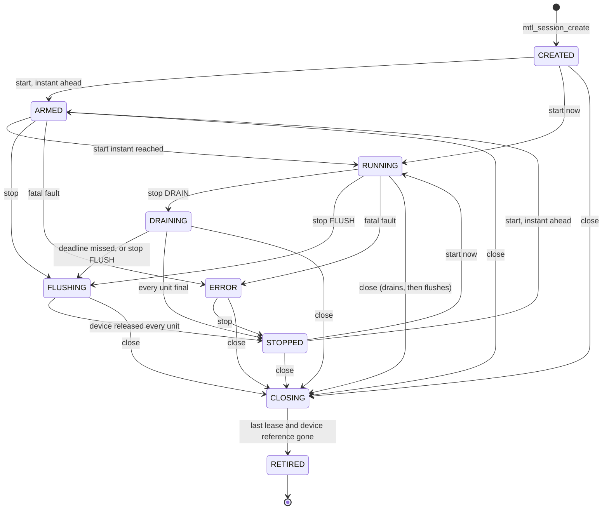

# Unified API contract

| | |
|---|---|
| Status | Normative behaviour of every call of the unified API, the Kubernetes lifecycle and the NMOS/IPMX extensions included. Nothing is implemented. MS1–MS6 port today's functionality; items marked "(Phase 7, later)" come after MS7, and everything of Phase 7, shared queues and created timelines included, is declared only under `MTL_LATER` |
| Date | 2026-10-02 |

This file states what every call does, in every state, by area. It is the reference for
implementers and test writers. Names, types, layouts and call classes come from the headers
in [sketch/include/mtl/experimental/](sketch/include/mtl/experimental/). **If this file and a
header disagree, the header wins** and this file is fixed. Media time, RTP, launch and late
policy are in [timing.md](timing.md). How the contract sits on today's engines (the core, the
bindings, the slot table, the deferred wake, commands, the stalled-queue path) is in
[engine.md](engine.md). Guarantee IDs (G-xx) name the contract test that pins a rule; the test
plan is in [implementation-plan.md](implementation-plan.md), the full list in
[requirements.md](requirements.md) §4.

**The library.** There is one library, libmtl. It exports the unified functions in their own
symbol version node, `MTL_UNIFIED_EXPERIMENTAL_<rev>` (renamed on every incompatible change until
the freeze), and `MTL_1.0` from MS7; the API shell (`lib/src/unified/`) is compiled into libmtl and
pkg-config stays `mtl`. In MS1 a version script puts the unified functions in that node and leaves
every other symbol exported as today; the soname, the `MTL_LEGACY` node of the legacy functions and
the hiding of internals come in MS3 (D-23, D-108).

**The surface.** A function is exported from the milestone its sketch comment names, `(MS1)` to
`(MS7)`; the installed header declares the whole design, so a call to a function not yet exported
fails at link time, naming the symbol. One tagged `(Phase 7)` or `(later)` is declared only under
`MTL_LATER`. The values of an exported call are declared from the start and return
`-MTL_ENOTSUP` until their milestone (R1, D-106). The functions per header, per call class and per
milestone, and the number of frozen names, are printed by `sketch/check.sh`, the one source of those
counts. Everything else is `static inline` and exports no symbol: the typed wrappers of the object
verbs ([§1, Object verbs](#object-verbs)), and helpers built only on public calls
(`mtl_session_open`, `mtl_stat_get`, `mtl_port_find`, `mtl_flow_ipv4`, `mtl_flow_parse`,
`mtl_time_convert`, `mtl_rx_align`, `mtl_fps_rational`, `mtl_error_name`, `mtl_struct_init`,
`mtl_audio_bytes`, all of `mtl_util.h`).

## 1. The rules R1–R8

The top of `mtl.h` carries eight rules that every call follows. They are stated once here; the sections below only add what is specific to a call.

### R1 Returns

- Every call returns 0, or a count or mask > 0, on success, and a negative `MTL_E*` code on failure.
- A getter that returns a state (`mtl_session_get_status`, and its wrapper `mtl_session_get_state`) or flags (`mtl_time_now`, `mtl_instance_get_health`) returns them as the non-negative result.
- **Not implemented yet.** A function of a later milestone is declared in the installed header but
  not exported: a call to it fails at link time. A known value of an exported call that the running library does not implement
  yet (a flag, enum value, update part, `when` kind, wait mask, option key or port prefix) is
  `-MTL_ENOTSUP` with reason `NOT_IMPLEMENTED`, and `mtl_last_error().field` names it. An unknown
  value is `-MTL_EINVAL`. An output field not computed yet is zero with its VALID flag clear.
- A call that succeeds never writes `mtl_last_error()` (errno semantics, §8.2). A helper of `mtl_util.h` that detects a failure itself (a bound, a malformed payload) returns its code without setting it, so a program prints the reason and the field of `mtl_last_error()` only when its `code` equals the code it got.
- Codes are Linux errno values on every OS, one meaning each (§8.1). Programs compare with `MTL_E*`, never with `errno.h`.

### R2 Timeouts and "nothing now"

- A timeout is the last argument, `int64_t` ns: 0 = do not wait, `MTL_FOREVER` (−1) = no limit. A timeout below −1 is `-MTL_EINVAL`.
- A data call (acquire, dequeue, reap, read, wait) that finds nothing, now or by its timeout, returns `-MTL_EAGAIN`. There is no separate "timed out" code for data calls.
- A read that returns a count returns at least 1; it never returns 0.
- `-MTL_EAGAIN` sets only `code` and `reason` in `mtl_last_error()` (no detail is formatted on the data path).
- `-MTL_ETIMEDOUT` is only for a control-plane deadline: a DRAIN `mtl_session_stop` that missed it. No close returns it: `mtl_session_close` returns 0 or 1, `mtl_instance_close` 0, 1, `-MTL_EIO` (`QUEUE_QUARANTINED`) or `-MTL_EDEADLK` (`LIBRARY_THREAD`).
- **Arming.** A WT call with a non-zero timeout that finds nothing arms its own target. With timeout
  0 (DP) a call arms its target only when the target is in the mask of an existing wait handle
  (`mtl_get_wait_handle`). The first completion for an armed target signals the object's one wait
  handle, and the next data call drains it. A completing tasklet never makes the syscall itself: its
  scheduler signals once per loop. Details: §7.2.

### R3 Structs

- Input structs start with `uint32_t struct_size`. `MTL_INIT(&s)` zero-fills and sets it through the inline `mtl_struct_init(p, size)`; bindings do the same in their own language (zero-fill, then the first `uint32_t` = the size).
- Zero in every field but `struct_size` is the default: no input field has a non-zero default (G-73).
- The library reads `min(struct_size, known)`. Non-zero bytes beyond what it knows are `-MTL_EINVAL` (`NONZERO_TAIL`); unknown flag bits are `-MTL_EINVAL` (`UNKNOWN_BITS`) (G-33, G-51).
- `struct_size` 0, or below the first published size, is `-MTL_EINVAL` (`NONZERO_TAIL`): a zero-initialised struct from a binding (SWIG `new_*()`, Rust `Default`) must never silently mean "all defaults"; it goes through `MTL_INIT`, `mtl_struct_init()` or the binding's equivalent.
- Output structs carry no `struct_size`. The library fills them up to the `size` argument and zeroes what it does not know.
- A struct the library writes and reads back (`struct mtl_unit`) uses its own `struct_size`.
- Every pointer in an input struct is read during the call and deep-copied, strings included. The caller may free it on return. (The plugin device table of `mtl_plugin.h` is the one exception; see [migration.md](migration.md).)
- Embedded structs (`mtl_flow`, `mtl_raster`, the essence members) are fixed size and version with their parent.
- Enumerated fields are `uint32_t`; no `_MAX` sentinel is exported. **Status enums start at 1** (`MTL_TX_ON_TIME`, `MTL_RX_COMPLETE`): 0 is never a terminal status, so a zeroed or half-filled record never reads as success (G-57).

### R4 Handles

- Handles are 64-bit values of distinct C types: `mtl_instance_h`, `mtl_session_h`, `mtl_lease_h`, `mtl_region_h`, plus `mtl_plugin_h` (`mtl_plugin.h`).
- 0 is the null handle of every type (`MTL_NULL(T)`, `MTL_IS_NULL(h)`). `MTL_SAME(a, b)` compares two lvalue handles of one type; mixing types warns in C and fails in C++ (G-71).
- A closed handle is never reissued.
- A call with an out handle writes the null handle on failure.
- **Close is idempotent.** `mtl_close` returns 1 while the object retires and 0 once it retired.
  Calling it again on the same handle polls (0 or 1), never `-MTL_EBADF`, and a null handle returns
  0, so cleanup paths need no checks. From the first close on, the only other calls valid on the
  handle are `mtl_session_get_status` (state `MTL_STATE_CLOSING`, then `MTL_STATE_RETIRED`), the
  release of a lease taken before the close (retirement waits for it, §4.9), and `mtl_interrupt`
  (AS; a no-op that returns 0).
- A stale or foreign handle fails with `-MTL_EBADF`. A lease already returned fails with `-MTL_ESTALE`. Neither changes any state (G-07). The one exception: `mtl_instance_get_health` on an instance handle consumed by close or shutdown returns `-MTL_ESHUTDOWN`, so a probe thread racing the close reads "shutting down" (liveness 200, readiness 503), never a liveness failure (§2.7).
- Handle slots are process-wide and never freed. A handle therefore stays safe to pass after its instance is gone: on an object the instance closed, data calls return `-MTL_ESHUTDOWN`, its close returns 0 and a lease's release returns 0 (§2.4).
- A buffer is named by its pool slot index (`uint32_t`), never by a handle. The lease stays its own type, so a slot can never be passed where access moves.

### R5 Times

- Every time is `int64_t` ns since 1970-01-01 TAI on the instance clock.
- A time is valid only when its flag says so (`MTL_TIMEF_*`, `MTL_UNITF_TAI_VALID`, `MTL_TXR_*`). Zero is a valid time when flagged (G-17).
- While the time base is locked, times are TAI. When it is not (a free-running clock without PTP), they are flagged ESTIMATED (`MTL_TIMEF_ESTIMATED`, `MTL_TXR_ESTIMATED`).
- When the grandmaster runs an ARB timescale (`clockClass` 220 or 228, or `timeSource` F0h, ST
  2059-2 §5.5.4), times are common to its PTP domain but are not TAI: `mtl_time_now` flags
  `MTL_TIMEF_ARB_TIMESCALE`, and `time.arb_timescale` reads 1. The built-in client reads it from
  Announce; with another source the application passes `clock_class` and `time_source` in
  `mtl_time_set_reference` ([timing.md](timing.md) §2.3).
- An RX value on the sender's clock is flagged `MTL_UNITF_SENDER_TIME` (IPMX; Phase 7, later).
- Details: [timing.md](timing.md).

### R6 Call classes

| Class | Contract |
|---|---|
| CP | control plane: application threads; may allocate and block; serialised per object inside the library. It never holds a lock a tasklet can take while it blocks: ARP, IGMP, flow and queue work run off to the side and are published by a command ([engine.md](engine.md) §6) |
| DP | data plane: O(1); no allocation, no lock a tasklet takes, no syscall but one (below), no logging |
| DPC | data plane that does work in the caller: copy, conversion, zero-fill; bounded by the unit size |
| WT | wait; DP when the timeout is 0 |
| AS | async-signal-safe: callable from a signal handler at any time, also during and after close |

- **The one DP syscall.** A DP call, or the DP attempt of a WT call, may make exactly one syscall:
  the non-blocking `read()` that drains the session's own wait handle, and only when it was
  signalled (arming, §7.2). The debug-build class check (G-50; from MS3, D-05)
  allows this read and nothing else. A tasklet never makes the wake-up syscall: `mt_wake()` sets
  the session's bit in its scheduler's pending bitmap, and the scheduler loop writes the eventfd of
  each flagged session once per iteration, after its handler loop (W2-deferred, G-39,
  [engine.md](engine.md) §7.2). A completion on an application thread writes the eventfd directly.
- Every exported function carries exactly one class annotation (`MTL_API_CP`, `MTL_API_DP`, `MTL_API_DPC`, `MTL_API_WT`, `MTL_API_AS`), and debug builds assert it (G-50).
- **No application code ever runs on an MTL tasklet** (G-38, G-39).
- The library calls application code only from the thread that `mtl_log_set_sink()` creates, and codec plugins from their own threads. An opt-in inline notify on the completing context (`mtl_session_set_inline_notify`) is reserved for later (`MTL_LATER`): it is added only if busy polling (W0) does not close the latency gap to today's tasklet callbacks (D-04).
- Those library threads may not open, close or shut down the instance (close and shutdown join them): `-MTL_EDEADLK` (`LIBRARY_THREAD`).
- **Busy polling.** An application thread may poll the DP calls, and the WT calls with timeout 0, in
  a tight loop (W0, the lowest-latency wake-up, [engine.md](engine.md) §7): they never block or
  sleep, and a poller that never sleeps on a wait handle causes no wake-up syscall (§7.2). The
  library's own busy loops (scheduler loops, the RX packet lcore) run no application code, so no
  public call is ever made from one; user schedulers and tasklets are cut (D-112).

### R7 Options

Tuning knobs are options (`mtl_options.h`): absent means the documented default, present is literal. §12.

### R8 The process

- The library installs no signal handler and registers no `atexit`. The exceptions are DPDK's own SIGBUS handlers: held while DPDK grows its heap (MTL allocates pools at create, so only then), and installed by the option `instance.hotplug`.
- A signal handler may call the AS functions only, at any time.
- Framework plugins (GStreamer, FFmpeg) and codec plugins install no handlers either: the host application owns signals. The library never calls `exit`. The application turns SIGTERM into work on an ordinary thread (self-pipe, `signalfd`, or a flag; ex11 uses the handler plus `mtl_instance_interrupt`). Nothing may rely on SIGTERM arriving: the design is correct for SIGKILL.
- Every descriptor MTL or DPDK opens for it is close-on-exec.
- An instance belongs to the process that opened it. In a `fork()`ed child MTL at once closes the descriptors it tracks (VFIO, MtlManager, CPU locks, eventfds). Every call then returns `-MTL_EBADF` (reason `FORKED`) except close, which drops local state only. Library memory is `MADV_DONTFORK`. Imported regions are the application's.
- Everything MTL holds outside the process (device DMA, queues, CPUs, kernel programs, MtlManager grants) is tied to a descriptor the kernel closes at exit, or reconciled at the next open. Nothing is found by PID. A SIGKILL at any instant therefore leaves nothing that blocks a restart (§2.5).

### Object verbs

A verb that several objects have is one exported function over `struct mtl_object`, with `static inline` typed wrappers that keep each object's own name, so programs read the same:

| Verb | Objects | Typed wrappers |
|---|---|---|
| `mtl_close(o, timeout_ns)` (CP) | instance, session, region, plugin | `mtl_instance_close`, `mtl_session_close`, `mtl_mem_close`, `mtl_plugin_unload` |
| `mtl_interrupt(o, mode)` (AS; CP with `MTL_INTR_OFF`) | instance, session; `MTL_INTR_ABORT` instance only | `mtl_instance_interrupt`, `mtl_instance_abort`, `mtl_session_interrupt` |
| `mtl_wait(o, mask, timeout)` (WT) | session; instance (`MTL_WAIT_EVENTS` only) | `mtl_session_wait` |
| `mtl_get_wait_handle(o, mask, &native)` (CP) | session; instance (`MTL_WAIT_EVENTS` only) | `mtl_session_get_wait_handle`, `mtl_instance_get_wait_handle` |
| `mtl_reap(o, rec, rec_size, max, timeout)` (WT) | TX session | `mtl_tx_reap` (`struct mtl_tx_result`), `mtl_tx_reap_full` (`struct mtl_tx_result_full`, `mtl_observe.h`) |
| `mtl_read_events(o, ev, ev_size, max, timeout)` (WT) | session, instance | `mtl_session_read_events`, `mtl_instance_read_events` |
| `mtl_release(s, lease)` (DP) | a TX or RX lease of `s` | `mtl_tx_release`, `mtl_rx_release` |

- A kind without the verb is `-MTL_EINVAL`. The rules of a verb for one kind are stated at its wrapper and in the section of that object; this filenames the wrappers.
- The record wrappers take a typed pointer and pass `sizeof(*r)`; the exported `mtl_reap` and `mtl_read_events` keep `rec_size`, so a larger record version is filled further.
- `timeout_ns` of `mtl_close` bounds the instance and session closes only; the other kinds never wait.
- Shared queues (`mtl_queue_h`) and created timelines (`mtl_timeline_h`) are reserved for later (`MTL_LATER`); they are not objects of these verbs in v1.

## 2. Instance

### 2.1 Open

`mtl_instance_open(p, &mt)` (CP) opens the ports of `struct mtl_instance_params` (legacy `mtl_init`).

| Field | Rule; zero means |
|---|---|
| `port_count`, `ports` | the ports, copied at open. `p` NULL or no port: the environment variable `MTL_PORTS` lists them, `"0000:af:01.0=192.168.1.10/24,0000:af:01.1=192.168.2.10"` or `"null:1"`. No port at all: `-MTL_EINVAL` naming `"ports"`. In a set-uid process `MTL_PORTS` and `env:` ports are `-MTL_EINVAL` |
| `lcores` | CPU IDs `"2-5,8"`; NULL = the opening thread's affinity mask (the pod's cpuset). A CPU outside the mask: `-MTL_EINVAL`, `CPU_NOT_ALLOWED`, before EAL starts |
| `time_source` | `enum mtl_time_source`; 0 = AUTO: `CLOCK_TAI` if its kernel offset is set, else `SYSTEM_TAI` (estimated), chosen once at open; from MS6 a disciplined NIC PHC first. Built-in PTP runs only when named (`PTP_BUILTIN`): on a PF MTL owns it disciplines the PHC, on a VF only MTL's software time base ([timing.md](timing.md) §2.2) |
| `flags` | `MTL_INSTANCE_SHARED`, `MTL_INSTANCE_TASKLET_THREAD` (schedulers are pinned pthreads, not EAL lcores), `MTL_INSTANCE_TASKLET_SLEEP` (idle schedulers sleep), `MTL_INSTANCE_HW_TIMESTAMP` (sessions may then require NIC timestamps) |
| `options`, `option_count` | instance keys, copied at open; session keys here are defaults for the instance's sessions (§12.4) |

**Port names** (`struct mtl_port_spec.name`):

| Form | Backend |
|---|---|
| PCI BDF `"0000:af:01.0"` | DPDK PMD |
| `"kernel:<ifname>"` | kernel socket |
| `"native_af_xdp:<ifname>"` | native AF_XDP |
| `"null:<n>"` | no NIC, no root, no hugepages: units complete on the instance clock; the substrate of unit tests and examples (G-92). An RX session receives the TX units of the same instance whose flow (destination IP and UDP port) it matches: loopback without packets |
| `"env:<VAR>[#n]"` | the n-th (from 0) PCI address in the environment variable, as the SR-IOV device plugin sets `PCIDEVICE_<resource>`; `-MTL_EINVAL`, `PORT_ENV_UNSET`, if absent |
| `"dpdk_af_xdp:"`, `"dpdk_af_packet:"` | removed (D-112): open fails with `-MTL_ENOTSUP`, `BACKEND_REMOVED`, and `detail` names the replacement (`native_af_xdp:`, `kernel:`) |

Port spec defaults: `ip_family` 0 = IPv4 (bytes 0..3, the rest zero); `prefix_len` 0 = 24 (IPv6: 64); `sip` all zero = DHCP on kernel backends; `gateway` all zero = none; `tx_queues`, `rx_queues` 0 = auto; `numa` 0 = the device's socket, else node + 1. `mac` is output only. **MTL never sets a port's MAC**: a VF keeps the one its PF or CNI gave it.

**Fail fast.** Every check that needs no device runs before any device is touched. A misconfigured pod fails at once with one reason and a one-line `mtl_last_error().detail` fit for a termination message:

| Check | Reason on failure |
|---|---|
| each `env:` port resolves | `PORT_ENV_UNSET` |
| the device node exists in the container, is accessible, and is bound to vfio-pci | `DEVICE_NODE_MISSING`, `DRIVER_MISMATCH`, `CAPABILITY_MISSING` |
| an IOMMU is present (not no-IOMMU, not PA mode), unless `instance.allow_noiommu` | `NO_IOMMU` |
| hugepages within the **cgroup** hugetlb limit and the free pages | `HUGEPAGES_LIMIT` |
| `RLIMIT_MEMLOCK` covers the pools, or `CAP_IPC_LOCK` is effective | `MEMLOCK_LIMIT` |
| the capabilities the backend needs, in the effective set | `CAPABILITY_MISSING`, naming it |
| the CPUs: inside the affinity mask; busy polling under a CFS quota (`instance.cpu_shared`) | `CPU_NOT_ALLOWED`, `CPU_SHARED` |
| `instance.runtime_dir`, when set, is writable | `RUNTIME_DIR` |
| MtlManager, when the configuration needs it (AF_XDP on a shared netdev) | `MANAGER_REQUIRED` |
| AF_XDP: the socket or map from a node daemon (`port.xsk_map`) | `XSK_UNAVAILABLE` |
| the named time source can be read; `PTP_BUILTIN` is not asked to steer a PHC MTL does not own (a VF runs it on the software time base instead) | `TIME_SOURCE_UNAVAILABLE`, `CLOCK_NOT_OWNED` |

- After the devices, open probes what each VF allows (trust, multicast filter budget, PF rate limit, pacing, PHC) into `caps.*` keys. A session that needs more fails at create: the first group past an untrusted VF's filter budget is `-MTL_ENOSPC`, `MCAST_FILTERS`.
- **Open does not wait** for links, neighbours, time lock or a DHCP lease. `mtl_instance_get_health()` reports them (§2.7). Units sent before lock carry `MTL_TXR_ESTIMATED`.
- A port with `port.dhcp` stays in `MTL_PHASE_LINKS` until it has a lease, and `MTL_EVENT_PORT_ADDRESS` reports it (today open waits up to 49 × 100 ms and then fails, `mt_dhcp.c:549-564`).
  Timesync start and TSC calibration (about 1 s each) stay inside open.
- Open assumes the previous run died uncleanly: it flushes the VF's flow rules and rate-limit configuration and logs what it reconciled (`instance.reconciled{kind}`).
- **Re-open.** After a close in the same process, open works again on the same ports and on a subset of the first open's CPUs (EAL keeps its first arguments). A port quarantined by an earlier close is `-MTL_EBUSY` (`QUEUE_QUARANTINED`) until the process exits.
- **Null-only instances and the open order.** An instance whose ports are all `null:` never calls
  the legacy init: it initialises EAL itself (no hugepages, no PCI, in memory) or joins an EAL the
  process already initialised, and runs one library thread as its loop instead of pinned schedulers.
  EAL is initialised once per process, so after a null-only instance initialised it, an instance
  that names a NIC port fails open with `-MTL_EEXIST` (`INSTANCE_MISMATCH`, `detail` naming EAL) for
  the life of the process. A process that needs both opens the NIC instance first; a NIC instance
  may also carry `null:` ports.
- Files: MTL writes nothing to the filesystem unless `instance.runtime_dir` is set; it is then the only place. Details: [deployment.md](deployment.md).

### 2.2 Ports

- A port is an index into the instance's ports. `mtl_port_find(mt, name, &port)` (inline, over `mtl_port_get_spec`) finds one by name, BDF or IPv4 address.
- `mtl_port_get_spec()` returns the port as granted: the address, prefix and gateway in use (a DHCP lease included) and the MAC on the wire. A changed address posts `MTL_EVENT_PORT_ADDRESS`.
- A port's capabilities, status and counters are the stats keys `caps.*`, `port.*`, `time.*`, `nic.*` (§11).
- A port whose link is down at open is opened anyway, with its links reported down.

**`MTL_PORTS` grammar.** The environment variable is read only when `p` is
NULL or names no port, and is `-MTL_EINVAL` in a set-uid process.

```text
ports   := port { "," port }
port    := name [ "=" address [ "/" prefix ] [ "@" gateway ] ]
name    := BDF ("0000:af:01.0") | "kernel:" ifname | "native_af_xdp:" ifname
         | "null:" n | "env:" VAR [ "#" n ]
address := IPv4 dotted quad | "[" IPv6 "]"
```

The prefix defaults to 24 (IPv6: 64). A port without an address uses DHCP on kernel backends
and is `-MTL_EINVAL` (naming the port) elsewhere. `env:VAR#n` takes the n-th PCI address (from
0) of the comma-separated list in `VAR`, as the SR-IOV device plugin writes it. When `p` names
ports, `MTL_PORTS` is ignored, never merged.

### 2.3 Shared instance

- A process has at most one instance per port set (one EAL per process). Components share a port through `MTL_INSTANCE_SHARED`; a second open of a port already open in the process without it is refused with `-MTL_EEXIST` (`INSTANCE_MISMATCH`).
- With `MTL_INSTANCE_SHARED` the first open creates the process-wide instance and later opens join it.
- Each open returns its own reference handle: `MTL_SAME` is false between two, and every call accepts any live reference.
- A later open that names ports, lcores, time source or options that differ from the live instance fails with `-MTL_EEXIST` (`INSTANCE_MISMATCH`). A field the later open leaves zero is not a request. There is no merging of settings between opens.
- Components that share an instance (framework elements, plugins) leave `lcores` and the port queue counts zero and put what is theirs in session keys (`session.tx_queue`, `session.migrate`), so their opens never disagree; each session takes its queues at create (`-MTL_ENOSPC`, `CAPACITY_*_QUEUES`, when none is left).
- `mtl_instance_close` on a reference that is not the last only drops that reference and returns 0 (G-77).
- `mtl_instance_shutdown(mt, MTL_SHUTDOWN_ALL_REFERENCES, …)` shuts the instance down for every component in the process (GStreamer elements, an FFmpeg device, the application). The application that owns `main()` uses it on SIGTERM; a plugin never does. The other references then get `-MTL_ESHUTDOWN` and their close returns 0.

### 2.4 Close and shutdown

`mtl_instance_close(mt, timeout_ns)` (CP; `mtl_close` on the instance) drops this reference. The last reference shuts the instance down within `timeout_ns`, network first; calling close again on the same reference polls (0 or 1, R4). `mtl_instance_shutdown(mt, flags, timeout_ns, &report, size)` (in `mtl_observe.h`, MS3) does the same with flags and a report.

| Step | What | Bounded by |
|---|---|---|
| 0 | New data calls get `-MTL_ESHUTDOWN`; health shows `SHUTTING_DOWN`, so readiness fails. Calls already inside a data call are waited for: every session counts its calls in flight | the deadline |
| 1 | TX: the unit whose first packet left is sent to its end at its pace and gets its normal status; the wire never carries a partial unit (rows units end by `tx.rows_late`, STALL as TRUNCATE). Queued units become `MTL_TX_FLUSHED` with reason `CLOSE`. With `MTL_SHUTDOWN_DRAIN` every queued unit is sent instead, until the deadline minus what the later steps need | the deadline |
| 2 | RX: an IGMP/MLD leave on every leg before the queues close; incomplete units are discarded and counted | never waits on the network |
| 3 | The log-sink and codec threads are joined | the deadline |
| 4 | Schedulers, queues and ports stop; flows are destroyed; imported regions are unmapped. A queue that will not complete runs the stalled-queue steps ([engine.md](engine.md)), a reset only if the budget remains (`caps.reset_budget_ns`), otherwise it is quarantined | the deadline |
| 5 | MtlManager grants are returned by closing the connection; after step 4, so no grant is returned while still in use | socket close |
| 6 | Library memory is freed, except slots under a lease the application still holds | — |

- Sessions and regions still open are closed by the shutdown. Their handles stay safe (R4): data calls return `-MTL_ESHUTDOWN`, blocked waits wake with it, `mtl_session_close` returns 0, and `mtl_rx_release`/`mtl_tx_release` of a lease taken before return 0.
- To send queued TX units, close the sessions first: `mtl_session_close` drains (§4.9). Instance close flushes them.
- `timeout_ns` 0 means abort semantics: no drain. `MTL_FOREVER` still bounds every step by its own budget. No step starts that its remaining budget cannot finish.
- From a library thread (log sink, codec) the call returns `-MTL_EDEADLK` and has no effect.

| Return | Meaning | Application |
|---|---|---|
| 0 | retired: every object freed, every library thread joined | exit, or open again |
| 1 | quiesced: no device can reach any memory, but leases or regions are still referenced, or a library thread is still in application code past the deadline (counted; its memory is kept) | exit; or return the leases. A slot's memory is freed by the process's next control-plane call after its last lease returns, or at exit |
| `-MTL_EIO`, reason `QUEUE_QUARANTINED` | a port could not be stopped; nothing it can reach is freed | exit now; the kernel's VFIO release stops the device |

- `-MTL_ETIMEDOUT` is never used for the unsafe case.
- `struct mtl_shutdown_report` (filled whatever the call returns) counts each step: `sessions_closed`, `sessions_retiring`, `units_flushed`, `results_discarded`, `groups_left`, `leases_out`, `regions_referenced`, `ports_unquiesced` (bit per port), `threads_unjoined`, `bytes_kept`, and `references_left` > 0 when only this reference was dropped. `summary` is one line for a termination message.
- **Abort.** `mtl_instance_abort(mt)` (AS; legacy `mtl_abort`; a second SIGTERM) interrupts every wait and stops every TX session at its next packet: the cut unit is `MTL_TX_FLUSHED`, reason `ABORTED`, with `MTL_TXR_PKT_SHORT`; queued units are `FLUSHED`/`ABORTED`. During close it skips to the hard stop; after close it does nothing. Close still has to follow.
- **Interrupt.** `mtl_instance_interrupt(mt, 1)` (AS) makes every data wait of every session return `-MTL_ECANCELED` until `mtl_instance_interrupt(mt, 0)` (CP). Stop and close still work (§7.4).
- **The budget counts from SIGTERM.** The signal handler records the time and calls `mtl_instance_interrupt(mt, 1)`; the main thread passes `grace − preStop − margin − time spent`. ex11 is the recipe ([examples.md](examples.md)).
- **Signals in the recipe.** Block SIGTERM and SIGINT before open and before any thread is created; install the handlers after open; then unblock. A signal arriving during open stays pending.
- **The AS path is safe after close.** The interrupt flags and the wake-up eventfd live in the instance's never-freed handle slot; close waits for AS callers in flight before it closes the eventfd, so a late signal never writes into a recycled descriptor.

### 2.5 What holds after each kind of ending

| Resource | Orderly close, then exit | SIGKILL at any instant | Device removal, process keeps running |
|---|---|---|---|
| TX session | unit on the wire finished, rest `FLUSHED`; every accepted unit has a result | the wire stops at descriptor release; a partial frame may be on the wire | ERROR `DEVICE_GONE`, or a degraded 2022-7 leg; waits `-MTL_ENODEV` |
| RX session | leave sent on every leg | no leave: the switch keeps the group until the querier ages it out (about 260 s with IGMP defaults) | ERROR or degraded leg |
| application lease | release returns 0; the slot is freed after its last lease | gone | release still works |
| library pools | freed slot by slot as leases come back | freed by the kernel | not freed under a lease |
| imported regions | unmapped before `mtl_mem_close` returns 0 | IOMMU unmap after DMA is off | the removed port's mapping goes with its VFIO descriptor |
| no-IOMMU mode | as orderly | **no guarantee: DMA may hit freed pages**; refused unless `instance.allow_noiommu` | no guarantee |
| CPUs | nothing to release in a pod (the cpuset is the lease); MtlManager grants on socket close; OFD locks released | released by the kernel or at manager socket EOF | — |
| VF queues, rate-limit nodes, flow rules | stopped and destroyed | FLR at descriptor release; flushed again at the next open | gone with the device |

The residual effects of a SIGKILL, none of which blocks the next start: the stale IGMP membership; a partial frame; XDP state and `tx_maxrate` while MtlManager itself is down; a PHC frequency offset left by the built-in PTP client on a PF it owns (impossible on a VF, where it steers only MTL's software time base). Details: [deployment.md](deployment.md) §4.5.

### 2.6 Device removal and reset

| Event | MTL | The application sees |
|---|---|---|
| reset (a PF reset resets every VF) | the admin worker resets the port, restores queues and flows, re-joins groups; a bounded device step that counts as worker progress | `MTL_EVENT_PORT_RESET`; sessions report `MTL_EVENT_RECOVERY` and resume; units in the gap are `MTL_TX_FAILED`, reason `PORT_RESET` |
| removed, or a reset that fails | the port becomes removed; its legs go oper-down. A 2022-7 session with a surviving leg continues degraded; one with no leg left enters ERROR (`DEVICE_GONE`) | `MTL_EVENT_PORT_REMOVED`; health `MTL_HEALTH_DEGRADED`, and `MTL_HEALTH_SESSION_LOST` only when a started session has no leg left or every port is gone; calls on a session with no leg return `-MTL_ENODEV` |
| close after removal | skips every device step for that port | 0 |

The library never closes the application's sessions on removal; they stay closeable in ERROR.

TX units in a port-reset gap are `MTL_TX_FAILED`, reason `PORT_RESET` ([deployment.md](deployment.md) §4.6), not the TX-hang outcome (`MTL_TX_DROPPED`, `RECOVERY`, §4.10).

### 2.7 Health

`mtl_instance_get_health(mt, &h, size)` (DP) returns the `MTL_HEALTH_*` flags; `h` may be NULL.
It is lock-free from any thread at any rate, even when the control plane is wedged, and returns a
consistent snapshot, never torn (`detail` is "" if it changed while being copied). During close
it reports `MTL_HEALTH_SHUTTING_DOWN` and masks `MTL_HEALTH_SCHED_STALLED`; after close it
returns `-MTL_ESHUTDOWN`, the one exception to R4's `-MTL_EBADF`: the handle slot is never freed, so the answer stays defined. `MTL_EVENT_HEALTH` reports every change.

| Bit | Liveness | Readiness | Set when |
|---|---|---|---|
| `MTL_HEALTH_SCHED_STALLED` | yes | yes | a scheduler loop is older than `instance.stall_ns` (default 1 s). The heartbeat advances on wake-ups and timer ticks, so a sleeping idle scheduler is not stalled. `MTL_EVENT_SCHED_STALLED` warns at 1/8, 1/4 and 1/2 of the limit |
| `MTL_HEALTH_WORKER_STALLED` | yes | yes | the admin worker missed its heartbeat outside a bounded device step (a port reset is progress) |
| `MTL_HEALTH_SESSION_LOST` | yes | yes | a started session lost every leg to removed ports, or every port is gone |
| `MTL_HEALTH_DEVICE_FAULT` | yes | yes | a queue was quarantined; its memory is never freed |
| `MTL_HEALTH_STARTING` | | yes | the phase is below `MTL_PHASE_READY` (`MTL_PHASE_LINKS`, `MTL_PHASE_TIME`) |
| `MTL_HEALTH_NO_LINK` | | yes | no port has a link |
| `MTL_HEALTH_TIME_UNLOCKED` | | yes | time state ACQUIRING or LOST; FREERUN and HOLDOVER are ready |
| `MTL_HEALTH_MANAGER_LOST` | | yes | MtlManager is gone (AF_XDP stops receiving) |
| `MTL_HEALTH_SHUTTING_DOWN` | | yes | close or shutdown has begun |
| `MTL_HEALTH_DEGRADED` | | | information only: a port's link is down or removed, or a started session is in ERROR or has an enabled leg not resolved or joined |

- `MTL_HEALTH_LIVENESS` and `MTL_HEALTH_READINESS` are the two masks.
- **Liveness never depends on packets, links or PTP lock**, so a grandmaster outage or a switch reboot never restarts a pod; a degraded 2022-7 session is not a liveness failure.
- The library never kills anything; the orchestrator decides. The application serves the probes: startup and liveness 503 until open returns, then on any liveness bit; readiness 503 on any readiness bit; after shutdown began, liveness 200 and readiness 503.
- `struct mtl_health` also carries `phase`, `reason` (of the first bit set), `time_state`, port, scheduler and session counts, `oldest_loop_age_ns` and `time_error_ns`.

### 2.8 Legacy bridge

`mtl_instance_from_legacy(legacy, &mt)` (CP, `mtl_legacy.h`, MS1) wraps a legacy `mtl_handle`,
so legacy and unified sessions share one instance; there is no call in the other direction (the
application that bridges already holds the legacy handle). `mtl_instance_close()` on the wrapper
closes the unified sessions and regions made through it, but never stops the legacy instance's
devices or legacy sessions; `mtl_uninit()` does that. Details: [migration.md](migration.md).

- **Teardown order:** close the wrapper (`mtl_instance_close`) first, then `mtl_uninit()`.
- `mtl_uninit()` while unified sessions or regions made through a wrapper are still open returns `-EBUSY` and stops nothing. Today `mtl_uninit` with live sessions self-deadlocks (SP-01, [engine.md](engine.md)); the legacy teardown order is fixed as a bugfix.
- **Before the legacy `mtl_start()`.** On a bridged instance, create works at any time; a start before the legacy `mtl_start()` is `-MTL_EBUSY` (`WRONG_STATE`), because no tasklet runs until it (`dev/mt_dev.c:2113-2125`). RxTxApp and KahawaiTest start the legacy instance first (or set `MTL_FLAG_DEV_AUTO_START_STOP`).

## 3. Session configuration

### 3.1 One typed config

- `struct mtl_session_config` describes one stream of one essence in one direction. It is typed only: enums and defines, no spec strings (D-97).
- `MTL_INIT(&sc)`; set `direction`, `essence`, `flows[0]` and the essence's required fields; everything else defaults.
- The member for `essence` is read (`sc.video`, `sc.cvideo`, `sc.audio`, `sc.anc`, `sc.fastmeta`, `sc.rtp`; plus `sc.packet` when `unit = MTL_UNIT_PACKETS`). The other essence members must stay zero: `-MTL_EINVAL`, `OTHER_ESSENCE`.
- A required field left zero is `-MTL_EINVAL`, `FIELD_REQUIRED`, and `mtl_last_error().field` names it.
- Enums follow the legacy order: legacy + 1 where 0 means "not set" (`mtl_fps`, `mtl_video_format`, `mtl_audio_format`, `mtl_ptime`, `mtl_app_format`), the same values where 0 is a real default (`mtl_packing` = `st20_packing`, `mtl_sender_type` = `st21_pacing`). The field map from the legacy ops is in [migration.md](migration.md).

### 3.2 Common fields

| Field | Rule; zero means |
|---|---|
| `direction` | `MTL_TX` or `MTL_RX`; required |
| `essence` | `MTL_VIDEO`, `MTL_CVIDEO`, `MTL_AUDIO`, `MTL_ANC`, `MTL_FASTMETA`, `MTL_RTP` (generic RTP, packet units only); required |
| `unit` | `MTL_UNIT_FRAME` (0), `MTL_UNIT_ROWS` (video), `MTL_UNIT_PACKETS` (§13); fixed for the session's life |
| `name` | unique per instance (`-MTL_EEXIST`, `NAME_EXISTS`, against live and closing sessions); "" = generated `<essence>_<tx or rx>_<n>`. Copied at create; in `mtl_session_info`, the log prefix and every event's `origin_name` (G-88); kept by `mtl_session_update()`. Re-create: below |
| `flows[MTL_MAX_LEGS]` | `flows[0]` required; a `flows[1]` that exists is the ST 2022-7 leg (§14) |
| `flags` | `MTL_SESSION_*` (§3.4) |
| `pool_count` | 0 = by essence: video `max(min_count_direct, 3)` (3 on RX), the others 4; the limit is `mtl_session_info.max_count` (8 for video and cvideo until engine change E11) |
| `legs_disabled` | a bit per existing leg (others `-MTL_EINVAL`): admin down (§14.2). A reserved leg and every existing leg set (mute) are Phase 7, `-MTL_ENOTSUP` until then |
| `media_mode` | `enum mtl_media_mode`; 0 = `MTL_MEDIA_AUTO`, the next slot ([timing.md](timing.md) §4.1). Every session runs on the SMPTE epoch |
| `ssrc` | TX: 0 = one random SSRC for the session, the same on every leg (ST 2022-7); RX: 0 = no check, else the SSRC every leg must carry |
| `payload_type` | TX: 0 = the essence default (video and cvideo 112, audio 111, ANC 113, fastmeta 115), the same on every leg; else a dynamic type 96–127 (ST 2110-10 §6.2, ST 2110-41 §5.2; `MTL_RTP`: 1–127), otherwise `-MTL_EINVAL`; RX: 0 = no check |
| `min_tx_delay_ns` | TX: the earliest send after the media time. 0 = playback (content exists before its media time); a capture producer (camera, encoder, RX → TX) sets one frame period plus the pick-up lead, a slot delay of 1 ([timing.md](timing.md) §5.2) |
| `media_time_offset_ns` | TX, TAI mode: the producer's declared latency, which moves the slot; 0 = none. RTP stays the slot's `floor(N × period × rate)`, so the ST 2110-10 §7.6.3 ±TFRAME bound does not apply to it. In AUTO and INDEX mode it must be 0 (`-MTL_EINVAL`): the legacy RTP trim with the launch fixed (`rtp_timestamp_delta_us`) is the option `tx.rtp_trim_ns` ([timing.md](timing.md) §4.5) |
| `options`, `option_count` | session keys, deep-copied (§12) |

To keep an identity across a re-create, close and create with the same name. A closing session
still owns its name, so that create is `-MTL_EEXIST` until the old session is RETIRED (call
`mtl_session_close` again, with a timeout, until it returns 0).

**Flow fields** (`struct mtl_flow`, fixed size, one per leg):

| Field | Zero means |
|---|---|
| `port` | the leg's own instance port (leg i → port i); else port index + 1 |
| `ip_family` | IPv4 in bytes 0..3; 6 = IPv6 |
| `ip` | TX destination; RX group (multicast), or the port's own address or all zero (unicast) |
| `source_filter` | RX source-specific multicast; all zero = none; with unicast RX it checks the sender |
| `udp_port` | required; a leg with `udp_port` 0 does not exist (a reserved leg is Phase 7, §14.1) |
| `udp_src_port` | TX: `udp_port`; RX: any |
| `dscp` | TX: into the IP TOS; 0 = CS0. Implemented with the bindings: video in MS1, the other essences in MS4. On the kernel-socket backend, where MTL writes no IP header, it is set with `setsockopt(IP_TOS)`. The IPMX profile's defaults (AF41 audio, AF42 others) and `MTL_FLOWF_DSCP_LITERAL` are Phase 7 |
| `ttl` | 64 |
| `dst_mac` | used only with `MTL_FLOWF_USER_MAC` (no ARP) |
| `vlan` | reserved, 0 |

A flow carries no RTP identity: SSRC and payload type are the session's (`sc.ssrc`,
`sc.payload_type`), the same on every leg. `mtl_flow_ipv4(&f, a, b, c, d, udp_port)` fills an IPv4
flow (legacy `dip_addr[i]`, `udp_port[i]`); `mtl_flow_parse(&f, "239.1.1.1:20000")`, with an
optional `@source` for a source-specific group, sets `ip`, `udp_port` and `source_filter` from text
(IPv4 only; `-MTL_EINVAL` for anything else). The granted values (SSRC, source port, payload type,
DSCP, TTL, MACs) are in `mtl_session_info.leg[]`; `dst_mac` is zero while the neighbour is
unresolved.

### 3.3 Essence members

| Member | Required | Zero means |
|---|---|---|
| `video` (`struct mtl_video_config`) | `raster` (unless `detect`); `format` or `app_format` | `format` 0 = from `app_format`; `app_format` 0 = the transport format itself, no conversion; `packing` 0 = `MTL_PACKING_BPM` (the legacy default); `sender_type` 0 = `MTL_SENDER_N` (below); `detect` 0 = `MTL_DETECT_AUTO`, off for video; `linesize[]` 0 = packed (library pools) |
| `video`, colour and timing | — | `colorimetry` 0 = UNSPECIFIED (still rendered: SDP requires it), `tcs` 0 = SDR, `range` 0 = narrow (SDP and conversion metadata, never on the wire); TROFFSET is the option `tx.troffset_ns` (below) |
| `cvideo` | `raster`, `codec`, `codestream_bytes` (CBR bytes, or the VBR ceiling, per unit) | `rate_mode` 0 = `MTL_CVIDEO_CBR`; `app_format` 0 = the application gives the codestream, else a codec plugin encodes; colour and TROFFSET as video; `sender_type` shapes the network model only (ST 2110-22 §5.3), so N is granted on any raster |
| `audio` | `format`, `sample_rate`, `channels` | `ptime` 0 = 1 ms; `unit_samples` 0 = 10 ms in whole packets (RX unit, TX pool capacity) |
| `anc` | `video.fps` (and scan), unless a video session is in its start | `video` all zero = the raster and slot delay of the first video session of its start (`-MTL_EINVAL`, `FIELD_REQUIRED`, if there is none); `max_udw_bytes` 0 = 64 KiB; `detect` 0 = `MTL_DETECT_AUTO`, on for ANC (interlace from the F bits) |
| `fastmeta` | as ANC; with `MTL_FASTMETA_FREE_RUNNING` the own rate in `video.fps`, always required | `buffer_capacity_bytes` 0 = 64 KiB (bounds the whole unit, below); RX filters on `data_item_type` and `k_bit` only with `MTL_FASTMETA_RX_MATCH_DIT` / `MTL_FASTMETA_RX_MATCH_K` |
| `rtp` | `clock_rate` (ST 2022-6: 27000000) | `profile` 0 = `MTL_RTP_LINEAR`; `unit` = unit rate and scan, all zero = no unit rate (§13.6); `bitrate_bps` 0 = derived; `encoding` is the SDP rtpmap name; `"SMPTE2022-6"` adds the rules of §13.6 |
| `packet` | — | §13.2 |

- `video.format` 0 takes the natural transport of `app_format` from a fixed table, not a guess:
  `MTL_APP_V210`, `MTL_APP_Y210`, `MTL_APP_YUV422P10LE` → `MTL_YUV422_10`; `MTL_APP_UYVY`,
  `MTL_APP_YUV422P8` → `MTL_YUV422_8`; `MTL_APP_YUV420P8`, `MTL_APP_NV12` → `MTL_YUV420_8`;
  `MTL_APP_RGBA`, `MTL_APP_BGRA`, `MTL_APP_RGB8` → `MTL_RGB_8`; `MTL_APP_YUV444P10LE` →
  `MTL_YUV444_10`; `MTL_APP_GBRP10LE` → `MTL_RGB_10`; an RFC 4175 pixel-group app format → its own
  transport. Both 0 is `-MTL_EINVAL`, `FIELD_REQUIRED`.
- Audio `format`, `sample_rate` and `channels` stay required on purpose: a wire format that silently defaults is a receive-garbage bug, and 48 kHz / L24 / 2 channels is common, not universal.
- `struct mtl_raster`: any width and height up to 32767, any rate with num ≤ 4194303 and den ≤ 1023,
  not a table. The frame rate is only the rational `fps` (interlaced: frames, not fields); a named
  rate is `raster.fps = mtl_fps_rational(MTL_FPS_59_94)`, the inline that maps `enum mtl_fps` to its
  exact value. The engines take a rate from a table today; until that changes in MS4, a rate outside
  the legacy `enum st_fps` is `-MTL_ENOTSUP` (`NOT_IMPLEMENTED`).
- `enum mtl_scan`: `MTL_PROGRESSIVE`, `MTL_INTERLACED` (the unit is a field), `MTL_PSF` (paced as interlaced, one index per frame).
- Formats outside RFC 4175 (`MTL_YUV422P10LE_NONSTD`, `MTL_V210_NONSTD`) are kept for existing deployments and set `MTL_INFO_NON_COMPLIANT`.
- **4:2:0 is progressive only** (ST 2110-20 §6.2.5): a 4:2:0 `format` with `MTL_INTERLACED` or `MTL_PSF` is `-MTL_EINVAL`, naming `video.format`.
- **No KEY transport format.** Colorimetry ALPHA belongs to KEY sampling (ST 2110-20 §6.2.6, §7.4.1), which `enum mtl_video_format` does not carry, so `MTL_COLOR_ALPHA` is declared only under `MTL_LATER` and the value 8 is `-MTL_EINVAL` (an unknown value, R1) until a KEY format exists.
- **Sender type N needs a gapped raster.** The gapped read schedule exists only for the rasters of
  ST 2110-21 §6.3.1, the sizes and rates of BT.656, BT.1543, BT.1847, BT.709 and BT.2020 (720 ×
  480–486 and 720 × 576 interlaced, 1280 × 720, 1920 × 1080, 3840 × 2160, 7680 × 4320 at those
  standards' rates). On any other raster (1920 × 1200, 2048 × 1080, a rate outside them) a video
  session with `sender_type` N gets NL: `sender_type` 0 is the default and must not fail on a valid
  raster, and the grant is reported in `info.sender_type` for the SDP's `TP=`
  ([timing.md](timing.md) §5.1). W and NL are linear on every raster.
- **`tx.troffset_ns`** (video, cvideo, generic RTP with `MTL_RTP_LINEAR`): absent = TRODEFAULT.
  Present, it must be a whole number of µs (a multiple of 1000 ns) below TFRAME, else `-MTL_EINVAL`
  (`OPTION_RANGE`): TROFF is signalled as a positive integer of µs and is mandatory when TROFFSET is
  not the default (ST 2110-21 §6.2, §8.2), so a value the SDP cannot carry exactly is refused rather
  than rounded. 0 is TROFFSET 0: the read schedule starts at N × TFRAME. The first packet still
  respects VRX0 ≤ floor(TROFFSET / TRS) ([engine.md](engine.md)). `info.troffset_ns` reports the
  value in use.
- **Audio samples.** Plane 0 of an audio unit holds the samples as on the wire: interleaved by
  channel, each sample in network byte order (big-endian; L16 two bytes, L24 three, AM824 the
  4-byte subframes). MTL copies the bytes into the packets and out of them and never swaps them,
  as today's engine does (`st_tx_audio_session.c:496`, `:530`; `st_rx_audio_session.c:510`).
- **Audio.** `MTL_AM824` counts AES3 subframes in `channels`, two per AES3 signal, so an odd count
  is `-MTL_EINVAL` (ST 2110-31 §6.1). `MTL_PTIME_80US` is the ST 2110-31 0.08 packet time: 4 samples
  at 48 kHz (8 at 96 kHz), a packet every 83⅓ µs (ST 2110-31 Table 1; the legacy engine sends one
  every 80 µs, SF-35); an AM824 SDP writes the Table 1 strings, `0.12` for `MTL_PTIME_125US` and
  `0.08`. `MTL_PCM8` (L8) sets `MTL_INFO_NON_COMPLIANT`: ST 2110-30 takes the AES67 formats L16 and
  L24 *(inferred: AES67 not read)*.
- **Fastmeta.** A unit goes out as data items of at most 359 words (1436 B), one per RTP packet,
  because a data item lies wholly inside one packet under the 1460 B Standard UDP Size Limit (ST
  2110-41 §5.4; the 9-bit length would allow 511 words); `used` 0 sends one RTP packet with no data
  item, the keep-alive (§5.1). A session carries one `data_item_type` and `k_bit`: several item
  types in one stream (§5.1) and Annex A segmentation are not offered (packet units carry them). The
  payload type is dynamic, 96–127 (§5.2), and the marker is 0 on every packet. A unit of several
  packets leaves within the §7 burst limit: at most CMAX = 4 packets back to back, then one per
  TDRAIN, 1.25 ms below 727 packets/s.

### 3.4 Session flags

| Flag | Meaning |
|---|---|
| `MTL_SESSION_RESULTS` | results for a library pool (application memory always has them, §6.1) |
| `MTL_SESSION_POOL_ATTACHED` | slots come from `mtl_session_attach` (§9.3) |
| `MTL_SESSION_REQUIRE_DIRECT` | fail at create if any unit would be copied (§9.7) |
| `MTL_SESSION_RX_BY_INDEX` | RX slot = media index mod `pool_count` (§9.8) |
| `MTL_SESSION_RX_LATEST` | RX: a full pool reclaims the oldest unread unit |
| `MTL_SESSION_RX_NO_FILL` | RX, library pools: do not zero what lost packets left out. Attached pools are never zero-filled (§9.8) |
| `MTL_SESSION_MT_SUBMIT` | several threads submit (acquire is MP-safe without it) |
| `MTL_SESSION_EXACT_LAUNCH` | TX: the session admits `MTL_SUBMIT_EXACT` units; its other units start at their slot's first-packet time. Without it, `MTL_SUBMIT_EXACT` is `-MTL_EINVAL` (§5.2) |

A framework pool whose slots several threads submit sets `MTL_SESSION_MT_SUBMIT`; one whose only submitter is the sink's `render` needs neither it nor results ([migration.md](migration.md) §12.4). Reaps and dequeues are MP-safe on every session: each data call counts itself in flight, and stop and close always drain that count.

### 3.5 Query and info

- `mtl_session_query(mt, &sc, flags, &info, size, &req, size)` (CP) is a dry run of create: it validates and grants without allocating. `info` and `req` may be NULL; `req` gives the layout an attached pool needs (§9.4). ANC and fastmeta rasters taken from a start read 0 until then.
- `MTL_QUERY_CHECK_CAPACITY` also checks free capacity and runs the real placement without reserving: `-MTL_ENOSPC` with the limiting resource as reason (`CAPACITY_*`). If it succeeds and nothing else changes the host, the create succeeds (G-89).
- The limits a controller runs into today: 18 schedulers per instance (`MT_MAX_SCH_NUM`, `mt_main.h:49`); 60 video TX and 60 video RX sessions per scheduler (`ST_SCH_MAX_TX_VIDEO_SESSIONS`, `st_header.h:33-34`);
  a data quota per scheduler (`instance.sched_quota_mbs`, default 12 × the 1080p59.94 4:2:2 10-bit bandwidth, `ST_QUOTA_TX1080P_PER_SCH`, `st_header.h:23`; `mt_sch_add_quota`, `mt_sch.c:1060`); TX and RX queue counts fixed when the port is configured; the rate-limited queues of each port. Today a create that finds no scheduler fails with an `err` log only ("no free sch", `mt_sch.c:378`, `:1171`).
- The `capacity.*` and `port.free_*` keys are a snapshot: another creator can take the capacity first. A reservation object (hold capacity for N sessions, then create into it) is later; no milestone carries it.
- `mtl_session_get_info()` (CP) returns the granted configuration: `pacing_class` (`enum
  mtl_pacing`), `pool_count`, `max_count`, `leg_count`, `pkts_per_unit`, `unit_samples`,
  `buffer_capacity_bytes`, `meta_capacity`, `codestream_bytes` (in whole packets), `sched_index`,
  `unit_bytes`, `pool_slot_pitch`, `created_tai_ns`, `leg[]`, and `wire_bps`, the bandwidth of one
  leg on the wire, headers included (legacy `st20_get_bandwidth_bps`; the dry run fills it too).
- It also gives `latency_min_ns`/`latency_max_ns` (framework LATENCY queries), `min_submit_lead_ns`
  (submit at least this long before the media time) and `flags` (`MTL_INFO_NON_COMPLIANT`,
  `MTL_INFO_RESULTS`: results are produced, `MTL_INFO_DIRECT`: no unit is copied,
  `MTL_INFO_JTNM_DEFAULT_WINDOW_EXCEEDED`: the slot delay puts the stream outside the JT-NM Tested
  default windows, `MTL_INFO_RTP_OFF_GRID`: a `tx.rtp_trim_ns` that is not a multiple of the index
  period puts RTP off the `N × period` grid, [timing.md](timing.md) §4.5, §5.2). Everything else
  granted is an `info.*` stats key (§11).
- The `info.*` keys (SDP timing values such as `info.trs_ps`, `info.troffset_ns`, `info.vrx_full`, and the transport, placement and wake diagnostics) exist only on a created session: the dry run returns the typed `struct mtl_session_info` but no keys. A controller that needs them before start creates the session (CREATED sends nothing) and reads them there; NMOS publishes the SDP after create.
- There is no configuration getter: the application keeps the `struct mtl_session_config` it created the session with, and `mtl_session_update()` reads only the members its `parts` name (§4.7). Options are read with `mtl_get_option()`.

### 3.6 Features per essence

What each essence gets in MS1–MS6 (yes, or the milestone), later, or not at all (—). Today's asymmetry is accidental; the target is the same verbs and outcomes for every essence. Each legacy mode's unified home and milestone: [coverage.md](coverage.md).

| Feature | video | cvideo | audio | ANC | fastmeta |
|---|---|---|---|---|---|
| frame units, ST 2022-7 legs, library and attached pools | yes | yes | yes | yes | yes |
| direct TX (any stride ≥ row) | yes | — (copy) | — (copy) | — (copy) | — (copy) |
| media modes and late policies | yes | yes | AUTO yes; TAI/INDEX MS6 | yes | AUTO yes; TAI/INDEX MS6 |
| `MTL_SUBMIT_NOT_BEFORE` / `MTL_SUBMIT_EXACT` | yes | yes | MS6 | MS6 | MS6 |
| underrun policy (`tx.underrun_policy`) default | SKIP | SKIP | SKIP; `MTL_UNDERRUN_SILENCE` as an option | `MTL_UNDERRUN_EMPTY_ANC` | `MTL_UNDERRUN_KEEPALIVE` |
| underrun REPEAT_LAST | later | later | later | later | — |
| results, events, one stats schema | yes | yes (no stats today) | yes | yes | yes |
| start arrays (MS6) | yes | yes | yes | yes | yes (on the grid like ANC) |
| pixel conversion (`app_format`) | yes | codec plugin | — | — | — |
| RX auto-detect | `sc.video.detect` (off) | — | — | `sc.anc.detect` (interlace, on) | — |
| RX timing parser (`rx.timing_parser`) | opt-in | — | opt-in | — | — |
| TX ST 2110-21 self-check | yes | network model only | — | — | — |
| RX DMA offload | yes (reported) | — | — | — | — |
| NACK retransmission (`rtx.*`) | yes | yes | — | — | — |
| rows units (`MTL_UNIT_ROWS`) | MS2 (progressive and interlaced) | — | — | — | — |
| packet units (`MTL_UNIT_PACKETS`, also `MTL_RTP`) | MS5 | MS5 | MS5 | MS5 | MS5 |
| header split | — (cut, D-112) | — | — | — | — |

Until MS6 a launch flag on audio, ANC or fastmeta is `-MTL_ENOTSUP` (`NOT_IMPLEMENTED`, R1).

## 4. Lifecycle and states

### 4.1 States

| State | Meaning |
|---|---|
| `MTL_STATE_CREATED` | validated; queues, scheduler quota, slot table and flow-rule capacity reserved; nothing on a tasklet; nothing sent |
| `MTL_STATE_ARMED` | started, start instant ahead. TX accepts preroll; RX is joined and discards units whose media time is before the start instant |
| `MTL_STATE_RUNNING` | sending or receiving |
| `MTL_STATE_DRAINING` | `stop(DRAIN)`: queued units are still being sent |
| `MTL_STATE_FLUSHING` | `stop(FLUSH)`, a drain deadline, or ERROR entry: queued units are being flushed; units the device holds are not yet released |
| `MTL_STATE_STOPPED` | like CREATED, with history: slots attached, RX memberships and rules kept, counters kept; can start again |
| `MTL_STATE_ERROR` | the library cannot continue without the application: only stop and close leave it; data calls return the error status; release, reap, status, events, wait and interrupt still work (§4.2) |
| `MTL_STATE_CLOSING` | closed, retiring: leases or device references remain |
| `MTL_STATE_RETIRED` | closed and retired; the handle stays retired |



`mtl_session_close` from ARMED, RUNNING or DRAINING first stops (DRAIN until the deadline, then FLUSH) inside CLOSING, then retires (§4.9). `mtl_session_get_status(s, NULL, 0)` (DP; the inline `mtl_session_get_state(s)`) returns the state as its result; with a status struct it gives the full picture (§4.10).

### 4.2 What each state allows

`-EBUSY` is `-MTL_EBUSY`, and so on; "yes" means the call does its normal work. A call not listed for ERROR fails with the session's error code (`status.error`, `-MTL_EIO` or `-MTL_ENODEV`) (G-49).

| Call | CREATED, STOPPED | ARMED | RUNNING | DRAINING | FLUSHING | ERROR | CLOSING | RETIRED |
|---|---|---|---|---|---|---|---|---|
| `mtl_session_attach` (NULL detaches), `mtl_set_options` (C, S keys) | yes | `-EBUSY` | `-EBUSY` | `-EBUSY` | `-EBUSY` | `-EBUSY` (stop first) | `-ESHUTDOWN` | `-EBADF` |
| `mtl_session_update` `MTL_UPDATE_MEDIA`, `MTL_UPDATE_POOL` | yes, applied during the call | `-EBUSY` | `-EBUSY` (colorimetry, tcs, range: posted) | `-EBUSY` | `-EBUSY` | `-EIO` | `-ESHUTDOWN` | `-EBADF` |
| `mtl_session_update` `MTL_UPDATE_FLOWS`, `MTL_UPDATE_LEGS`, R options | yes, applied during the call | posted for the boundary | posted for the boundary | `-EBUSY` | `-EBUSY` | `-EIO` | `-ESHUTDOWN` | `-EBADF` |
| `mtl_session_start` | yes; from STOPPED after ERROR it re-reserves or fails `-ENODEV` | `-EBUSY` | `-EBUSY` | `-EBUSY` | `-EBUSY` | `-EIO` (stop first) | `-ESHUTDOWN` | `-EBADF` |
| `mtl_session_stop` | 0 (no-op) | yes | yes | FLUSH escalates; a second DRAIN waits for the first | waits for the flush | yes → STOPPED | `-ESHUTDOWN` | `-EBADF` |
| `mtl_session_discard` | yes: queued preroll units `FLUSHED`/`DISCARD` | yes | yes | `-EBUSY` | 0 (no-op) | 0 (no-op) | `-ESHUTDOWN` | `-EBADF` |
| `mtl_tx_acquire`, `mtl_tx_acquire_slot` | yes (preroll) | yes | yes | `-ESHUTDOWN` | `-ESHUTDOWN` | error code | `-ESHUTDOWN` | `-EBADF` |
| `mtl_tx_submit` | yes, held until start | yes, held until the instant | yes | `-ESHUTDOWN` | `-ESHUTDOWN` | error code | `-ESHUTDOWN` | `-EBADF` |
| `mtl_tx_release`, `mtl_rx_release` | yes | yes | yes | yes | yes | yes | **yes** | — (no lease can be out) |
| `mtl_tx_reap`, `mtl_session_read_events` | yes | yes | yes | yes | yes | yes | `-ESHUTDOWN` (unread results discarded) | `-EBADF` |
| `mtl_rx_dequeue` | remaining ready units, then `-EAGAIN` | `-EAGAIN` / waits | yes | force-completed and ready units, then `-ESHUTDOWN` | ready units, then `-ESHUTDOWN` | ready units, then the error code | `-ESHUTDOWN` | `-EBADF` |
| `mtl_session_wait` | yes | yes | yes | yes | yes | yes | `-ESHUTDOWN` | `-EBADF` |
| `mtl_session_interrupt` | yes | yes | yes | yes | yes | yes | 0 (no-op: close wins) | `-EBADF` |
| `mtl_session_get_status(s, NULL, 0)` (`mtl_session_get_state`) | state | state | state | state | state | state | `MTL_STATE_CLOSING` | `MTL_STATE_RETIRED` |
| `mtl_session_get_status` with a struct | yes | yes | yes | yes | yes | yes | the state; the struct holds the last snapshot | the state; the struct holds the last snapshot |
| `get_info`, stats | yes | yes | yes | yes | yes | yes | `-ESHUTDOWN` | `-EBADF` |
| `mtl_session_close` | yes | yes | yes | yes | yes | yes | polls: 1 while retiring, 0 once retired | 0 |

- **A WT call that starts in CREATED, ARMED or STOPPED waits normally** and ends with `-MTL_EAGAIN`, so a concurrent dequeue during a stop/update/start cycle never reads as end of stream.
- A WT call that is already blocked when the session enters DRAINING, FLUSHING, ERROR or CLOSING is woken with the code of the table once nothing remains for it (G-30).
- `-MTL_ESHUTDOWN` only ever means "the application asked" (stop, discard, close, instance close). `-MTL_EIO` means the session failed; the reason is in the status. `-MTL_EAGAIN` means nothing yet (G-70).
- **A lease the application holds stays valid across stop and close.** Stop never takes memory the application is reading or writing; close retires only after the leases come back.
- **Results stay drainable** until close; close discards what is unread.
- After close only `mtl_session_get_status` (`mtl_session_get_state`), close itself (which polls), the release of leases taken before and `mtl_session_interrupt` (a no-op that returns 0) are defined on the handle; any other call gets the code of the CLOSING or RETIRED column (§8.4).

### 4.3 Create and open

- `mtl_session_create(mt, &sc, &s)` (CP) validates and reserves queues, scheduler quota, the slot table and flow-rule capacity; nothing runs on a tasklet and nothing is sent. Failures surface here, so start is fast. Flow-rule capacity is checked with `rte_flow_validate` and nothing is installed; the rule (and the RX join) comes at the first start.
- **A failed create leaves nothing behind**: no session, mapping, flow, scheduler quota or handle; `*out` is the null handle (G-32).
- **Create never waits for ARP or IGMP.** Neighbour resolution runs on a worker. An unresolved TX leg is `MTL_FLOW_WAITING_NEIGHBOUR` and its units are not sent on it (reason `WAITING_NEIGHBOUR`; `MTL_TX_DROPPED` when every leg is unresolved); resolution resumes sending without an API call. `MTL_FLOWF_USER_MAC` bypasses ARP (G-90).
- `mtl_session_open(mt, &sc, &s)` (inline) is create and start now: the whole setup of a stream that needs nothing else. On failure `*s` is the null handle, the created session is closed, and the failing step's error stays in `mtl_last_error()` (the close succeeds, so it does not write it, R1).
- A create whose configuration needs MtlManager (an lcore, an AF_XDP queue) while MtlManager is lost returns `-MTL_EBUSY`, reason `MANAGER_LOST`; running sessions continue (G-98).

### 4.4 Start

`mtl_session_start(s[], n, when, &t0)` (CP) starts n sessions, all or none (G-23).

- The sessions must share one direction, and with n > 1 no TX session may use `MTL_MEDIA_AUTO` (AUTO stamps whatever slot a unit gets and cannot be synchronised): `-MTL_EINVAL`, `START_SET_MIXED`.
- **Every session runs on the SMPTE epoch**: index k is at k × its index period from 1970 TAI (a frame or field for video and ANC, a sample for audio). T0 is resolved once, on the common grid of the sessions' index periods, at or after `when` (NOW: the first feasible instant). `t0` (may be NULL) receives T0.
- Without `MTL_WHEN_ORIGIN` the media indices stay epoch indices and T0 is the first unit's media time. With `MTL_WHEN_ORIGIN` in `when->flags`, index 0 of every session started here is at T0, so a file's frame and sample counts are media indices as they are; it changes the numbering only, never a media time or an RTP timestamp. `MTL_WHEN_ORIGIN` on RX or with `MTL_AT_INDEX` is `-MTL_EINVAL`.
- `when` NULL means now. `struct mtl_when`: `kind` (`MTL_NOW`, `MTL_AT_TAI`, `MTL_AT_INDEX`: a media index of `s[0]`), `flags` (`MTL_WHEN_*`), `value`, `preroll_ns` (extra lead before the first unit).
- ANC and fastmeta sessions with an all-zero video raster take the raster and the slot delay of the first video session of the array.
- Milestones: n = 1 with `when` NULL or `MTL_NOW` in MS1; `MTL_AT_TAI` and `MTL_AT_INDEX` (ARMED) in MS3; start arrays (n > 1) and `MTL_WHEN_ORIGIN` in MS6. Until then each is `-MTL_ENOTSUP` (`NOT_IMPLEMENTED`, R1).
- Start re-checks what can have changed since create (pool complete, layouts, device resources after an ERROR) and either reaches ARMED/RUNNING or fails with nothing changed.
- A session cannot start until its pool is complete and validated: with `MTL_SESSION_POOL_ATTACHED` and `pool_count` set, `-MTL_EINVAL`, `POOL_TOO_SMALL`, until that many slots are attached (G-35).
- If a preroll unit lies beyond the horizon measured from the resolved start instant, start fails atomically with `-MTL_ERANGE`, `BEYOND_HORIZON`, and no session starts (G-94). Preroll units whose media time precedes the start instant become `MTL_TX_FLUSHED`, reason `BEFORE_START`.
- **RX:** `when` is the earliest media time delivered. The first start installs the flow rule and sends the join on a worker, not awaited: `MTL_EVENT_FLOW_STATE` reports `MTL_FLOW_JOINED` or `MTL_FLOW_JOIN_FAILED`. Rule and membership are kept across stop until close or an update.
- RX in ARMED: every unit with media time before the instant is discarded and counted (`rx.units_before_start`), never delivered (G-76).
- Start posts the attach to the scheduler as a command and never runs on a tasklet. The T0 formula and the common grid are in [timing.md](timing.md) §3.

### 4.5 Stop

`mtl_session_stop(s[], n, mode, timeout_ns)` (CP) stops n sessions; arrays may mix directions; the sessions can be started again. `mode` is `enum mtl_stop_mode`:

- `MTL_STOP_DRAIN` (0): every queued unit is sent at its slot.
- `MTL_STOP_FLUSH`: queued units are `FLUSHED` (`STOP_FLUSH`); a unit whose first packet left is sent to its end at its pace and gets its normal status.
- `-MTL_ETIMEDOUT` if DRAIN missed the deadline: the rest became `FLUSHED`, reason `STOP_TIMEOUT`. Units already handed to the device get their result when the device releases them, and the session stays FLUSHING until then.
- Stop and discard are immediate commands: a TX unit waiting up to 1 s for its launch does not delay them. RX stop ends assembly at once; rule and membership stay, so a later start is instant, and packets that arrive while the session is STOPPED (or CREATED after an update) are dropped by the queue, never delivered.
- A slot a codec or conversion plugin is converting belongs to the plugin: stop FLUSH, discard and
  abort wait for that conversion, so the flush is bounded by the plugin's conversion time (the
  transform state's claim and done on the slot, D-100; today's pipeline reclaim CAS CONVERTED →
  FLUSHED is safe against the builder's pick-up CAS the same way, `st20_pipeline_tx.c:210-213`). Every command is acknowledged within one tasklet iteration, even
  with no unit and no packet; an ack not received within a fixed 100 ms puts the session in ERROR,
  reason `CMD_TIMEOUT`; no call waits forever (G-80). The acknowledged commands come with the
  session's `tick` in MS2.
- After stop returns 0, every accepted unit has a terminal outcome (G-31).

**Stop and flush outcomes**:

| | `mtl_session_discard` | stop DRAIN | stop FLUSH | ERROR entered |
|---|---|---|---|---|
| State after | stays (RUNNING, ARMED, CREATED, STOPPED) | STOPPED | STOPPED | ERROR, then stop → STOPPED |
| New TX submits | accepted after the call; the next is an implicit DISCONTINUITY; with `MTL_DISCARD_REBASE` `first_index` maps to the next feasible slot | `-ESHUTDOWN` | `-ESHUTDOWN` | the error code |
| Queued, not picked up | `FLUSHED`/`DISCARD` | sent in order at their slots | `FLUSHED`/`STOP_FLUSH` | `FLUSHED`/`SESSION_ERROR` |
| Picked up, no packet sent yet | `FLUSHED`/`DISCARD` | sent | `FLUSHED`/`STOP_FLUSH` | `FLUSHED`/`SESSION_ERROR` |
| First packet left | completes | completes | sent to its end at its pace, normal status (rows units: `tx.rows_late`, STALL as TRUNCATE) | `FAILED`/reason (for example `TX_QUEUE_FATAL`) once every device reference is gone |
| Deadline reached | — | the rest `FLUSHED`/`STOP_TIMEOUT`; `-ETIMEDOUT` | — | — |
| RX unit being assembled | dropped, counted (`rx.units_flushed`) | force-completed and delivered with its status | discarded, counted | discarded, counted |
| RX ready, not dequeued | discarded, counted (`rx.units_flushed`) | stays dequeuable | stays dequeuable | stays dequeuable |
| Blocked callers | unaffected | woken with `-ESHUTDOWN` once nothing remains | woken with `-ESHUTDOWN` | woken with the error code |
| Returns | 0 | 0, or `-ETIMEDOUT` | 0 | — (`MTL_EVENT_SESSION_STATE` with the reason) |

Discard drops the RX unit being received and the units that are ready but not dequeued, and counts them (`rx.units_flushed`), so the first dequeue after a seek is a new unit, which a GStreamer source's `FLUSH_STOP` expects. A unit already dequeued stays the application's lease. Stop DRAIN, stop FLUSH and ERROR keep the ready units dequeuable.

**Close and abort outcomes**:

| | `mtl_session_close` | instance close or shutdown | `mtl_instance_abort` |
|---|---|---|---|
| Queued units | sent (DRAIN) until the deadline, then `FLUSHED`/`STOP_TIMEOUT` | `FLUSHED`/`CLOSE`; sent with `MTL_SHUTDOWN_DRAIN` | `FLUSHED`/`ABORTED` |
| First packet left | completes | sent to its end at its pace | cut at the next packet: `FLUSHED`/`ABORTED` with `MTL_TXR_PKT_SHORT` |
| Unread results | discarded | discarded, counted in `results_discarded` | as instance close |

### 4.6 Discard

`mtl_session_discard(s, flags, first_index)` (CP): queued units become `FLUSHED` (`DISCARD`) and the
session stays RUNNING: GStreamer `FLUSH_STOP` and seek. RX drops the unit being received and the
ready units not yet dequeued (`rx.units_flushed`, §4.5). With `MTL_DISCARD_REBASE`, `first_index` maps to the next feasible slot. A taken-back unit that a plugin is converting bounds the call by that conversion.

### 4.7 Update

`mtl_session_update(s, &sc, parts, &when, &planned_tai_ns)` (CP) is one atomic change, applied at `when` on every leg. It replaces today's `update_destination`/`update_source`, reconfigure and per-leg enable. One call, not one per part: NMOS IS-05 patches transport parameters and `master_enable` together under one activation, so one atomic change fits it.

| Part | Changes | States |
|---|---|---|
| `MTL_UPDATE_FLOWS` | `sc->flows` (IS-05) | any started state but DRAINING/FLUSHING; applied during the call in CREATED and STOPPED |
| `MTL_UPDATE_LEGS` | `sc->legs_disabled` | as FLOWS |
| `MTL_UPDATE_MEDIA` | the essence member | CREATED or STOPPED; colorimetry, tcs and range also while running |
| `MTL_UPDATE_POOL` | `pool_count` | CREATED or STOPPED |

The contract:

- **All or nothing.** Resources (rules, queues, joins, header templates, a kernel-socket queue) are reserved before commit; on any failure nothing changes (G-75).
- Neighbours are resolved from commit on and not awaited: a leg without one waits in `MTL_FLOW_WAITING_NEIGHBOUR`, and the update still applies.
- The update reads only the members its `parts` name, and `sc->options`; every other member of `sc` is ignored, so the application passes the config it created the session with, edited. `direction`, `essence` and `unit` never change.
- Every key in `sc->options` must equal its current value (`-MTL_EBUSY`, `OPTION_STATE`), except that a key that may change while running (R) applies at the same boundary: Phase 7; until then a changed R key is `-MTL_ENOTSUP` (`NOT_IMPLEMENTED`), and `mtl_set_options` changes it at the next unit boundary instead.
- `when` applies to FLOWS, LEGS, those options, and colorimetry/tcs/range under MEDIA while running. It is NULL otherwise. In ARMED a `when` before T0 means T0; an `MTL_AT_TAI` or `MTL_AT_INDEX` already past means now.
- **The switch happens at the slot boundary by the clock, whether a unit is there or not.** TX: the first slot at or after `when`; all legs switch on the same unit, and no unit goes to a mix of old and new destinations. RX: units with media time at or after `when`, or by local arrival time for unlocked clocks. Audio: a packet boundary, so a salvo lands within one packet time.
- RX prepares the new rules beside the old ones and removes the old ones after the switch; joins go out at the call (Phase 7: at `max(call, when − rx.join_lead_ns)`).
- A port change while running is made before break (Phase 7), or `-MTL_EBUSY` (`PORT_CHANGE_NEEDS_STOP`) on a backend that cannot, and on every backend until then: stop, update, start.
- An update while an earlier one is pending is `-MTL_EBUSY` (`WRONG_STATE`).
- **Cancel.** `sc` NULL with `parts` 0 cancels a pending update (IS-05 activation mode null): it
  returns 0 when it cancelled one, 1 when none was pending, and `-MTL_EBUSY` (`UPDATE_COMMITTING`)
  when the update will still apply. Phase 7; `-MTL_ENOTSUP` until then.
- A pending update fails (`TIME_STEP`) if the time base steps.
- The call returns once the change is posted. `planned_tai_ns` (may be NULL) receives the media time of the boundary. In CREATED and STOPPED it applies during the call and planned = applied = now.
- `status.update_state` (`enum mtl_update_state`: NONE, PENDING, APPLIED, FAILED with `update_reason`), `status.update_seq` (+1 per posted update; read it after the call to match events), `status.update_applied_tai_ns` (INT64_MIN until applied) and `MTL_EVENT_UPDATE` report when it applied.
- The update keeps the handle, name, SSRC and counters; library pools are re-created under MEDIA or POOL, attached pools are re-validated (G-87).
- Re-creating a library pool needs every slot FREE (no lease or hold out): `-MTL_EBUSY` otherwise. The pacing values (TRS, VRX, rate-limit rate) and the scheduler weight are re-derived from the new configuration as a dry run first; a weight or rate that no longer fits the scheduler or the queue is `-MTL_ENOSPC`, with nothing changed.
- A MEDIA or POOL update fails with nothing changed, `-MTL_EINVAL`, `LAYOUT_MISMATCH`, when an attached pool no longer fits the new layout (G-87).

**What is Phase 7.** MS5 delivers the atomic update of today's destination and source
update, per-leg enable and disable, MEDIA and POOL in STOPPED, the planned instant,
`status.update_*`, `MTL_EVENT_UPDATE` and the switch by the clock. These are Phase 7, later
(D-98): mute (every leg disabled), reserved legs, port changes while running, R options at the
boundary, and `rx.join_lead_ns`. Each is `-MTL_ENOTSUP` until then; `MTL_STATUS_MUTED` and
`rx.join_lead_ns` are declared only under `MTL_LATER`, as are the re-apply and dry-run modifiers,
cancel and the REPLACED and CANCELLED update states. An NMOS Node
can be built on MS5 with stop, update and start. The IS-05 mapping is in
[nmos-ipmx.md](nmos-ipmx.md).

### 4.8 ERROR

A session enters ERROR only for faults it cannot recover from without the application. Every entry has one reason in `status.error_reason`, and `status.error` is the code data calls return.

| Reason | Trigger |
|---|---|
| `TX_QUEUE_FATAL` | TX hang recovery could not get a new queue or mempool |
| `DEVICE_GONE` | NIC removal, or a reset after which queues and flows cannot be re-reserved |
| `CMD_TIMEOUT` | a command was not acknowledged within a fixed 100 ms |
| `BACKEND_FAILED` | a kernel-socket or AF_XDP failure after retries |
| `FORCED` | `mtl_debug_inject(…, MTL_FAULT_FORCE_ERROR, …)` (debug builds) |

- On entry, in this order: the state is marked and blocked callers wake with the error code; the session is detached from its scheduler; the TX queue is reset or quarantined so that no descriptor references application memory; every device reference is dropped; the units get the ERROR column of §4.5; `MTL_EVENT_SESSION_STATE` is posted.
- Leaving ERROR: `mtl_session_stop` → STOPPED. `mtl_session_start` from there re-reserves what the fault invalidated (queues, flow rules, memberships, the rate-limit shaper) or fails `-MTL_ENODEV` with a reason and nothing changed. `mtl_session_update` (for example a new `flow.port`) may come before the start.

### 4.9 Close

`mtl_session_close(s, timeout_ns)` (CP) stops (DRAIN until the deadline, then FLUSH), destroys, and waits up to `timeout_ns` for the session to retire.

- 0: retired; no memory, lease, hold or device reference remains.
- 1: still retiring (leases out, or units held by the device).
- **Close is idempotent.** Calling it again on the same handle polls: 1 while retiring, 0 once retired, never `-MTL_EBADF`. Waiting for retirement is calling `mtl_session_close(s, timeout)` again; there is no retirement wait target and no retirement event. A null handle returns 0.
- From the first call on, the only other calls valid on `s` are `mtl_session_get_status` (`mtl_session_get_state`: `MTL_STATE_CLOSING`, then `MTL_STATE_RETIRED`), the release of leases taken before the close (retirement waits for it), and `mtl_session_interrupt` (AS; a no-op that returns 0); every other call gets the CLOSING or RETIRED column of §4.2.
- A close that returns 1 logs one warning for the session (once, not on every poll) with its count of held leases and the oldest lease's age, taken from the acquire time already in the slot table (no per-lease allocation on the data path); `session.leases_out` and `session.oldest_lease_ns` hold the same.
- Unread results are discarded.
- Sessions attached over this session's pool must close first: 1 until they do.
- After retirement: no library thread calls application code for `s`; no thread or device reads or writes memory the application gave `s`, including after a stalled or hung TX queue; threads blocked in calls on `s` have returned (G-37, G-65, G-81).
- **Close cannot race an active call or a completion into freed memory** (G-29): every data call counts itself in flight, and close waits for that count to drain before anything is freed.
- The last `mtl_rx_release`/`mtl_tx_release` of a closing session is DP and cannot free; a library worker runs the retirement.

### 4.10 Status and recoverable incidents

`mtl_session_get_status(s, &st, size)` (DP: a published snapshot, never torn, lock-free from any thread) says why the session is where it is: `state`, `reason` of the last transition, `error_reason` and `error` in ERROR, `blocked_on` (§5.5), `flags`, `timing_reason` with `shortfall_ns` and `suggested_min_tx_delay_ns`, `leg[]` (§14.2) and the update fields of §4.7.

| `flags` bit | Meaning |
|---|---|
| `MTL_STATUS_RX_SIGNAL` | RX: packets are arriving |
| `MTL_STATUS_FORMAT_CHANGED` | RX: the stream differs from the config (`rx.detected.*` keys) |
| `MTL_STATUS_PACING_DOWNGRADED` | TX: running below the granted pacing class |
| `MTL_STATUS_TIMING_WARNING` | TX: `timing_reason` and `shortfall_ns` are set |
| `MTL_STATUS_MUTED` | every leg admin-disabled; RUNNING, nothing sent (Phase 7, `MTL_LATER`) |
| `MTL_STATUS_TIMEBASE_SUSPECT` | RX: on a DIRECT stream arrival and media time differ by more than 1 s ([timing.md](timing.md) §11.1); the getter of `MTL_EVENT_RX_TIMEBASE_SUSPECT` |

Recoverable incidents never enter ERROR; they are events plus per-unit results:

| Incident | Outcome |
|---|---|
| TX hang fixed by recovery | `MTL_EVENT_RECOVERY` begin and end; units in the gap `DROPPED`/`RECOVERY`, never `ON_TIME`; `tx.recoveries_ok` is the count of record |
| link down on one 2022-7 leg, or on the only leg | stays RUNNING; `MTL_EVENT_LEG_STATE`, `MTL_EVENT_PORT_LINK`; units not sent on that leg (`LINK_DOWN`); resumes on link up |
| port reset that restores | §2.6 |
| PTP holdover or loss | `MTL_EVENT_TIME_STATE`; timing flags in results |
| MtlManager lost | running sessions continue; `MTL_EVENT_MANAGER_LOST` |
| unresolved neighbour, failed join | `MTL_EVENT_FLOW_STATE` |

## 5. Data path

### 5.1 The unit

One `struct mtl_unit` is what acquire and dequeue lend and what submit reads.

- `MTL_INIT(&u)` once. Acquire and dequeue write every field up to `struct_size` except `struct_size` itself, so the init can stay outside the loop. On failure they leave `*u` unchanged.
- `lease` is the access token; `slot` the pool slot, a stable buffer identity; `plane[]` the planes (`addr` is NULL in device memory without a CPU mapping); `meta`, `meta_capacity` the slot's meta area (§9.9).
- Per-use fields: TX inputs, zeroed by acquire; RX outputs. `used`, `flags`, `rtp`, `media_index`, `media_tai_ns`, `cookie`, `hold`, `launch_tai_ns`, and RX `status`, `missed_before`.
- **TX acquire resets the meta area**: it writes an `MTL_META_NONE` header at the start of the slot's meta area (frame and row units), so a slot never carries the previous use's records (§9.9).
- **As a template** (`mtl_tx_write`, `mtl_tx_send_slot`) a unit contributes `media_index`, `media_tai_ns`, `cookie`, `hold`, `launch_tai_ns`, `meta` and the TX bits of `flags` (0–31, `MTL_SUBMIT_MASK`); every other field is ignored. A received unit is a valid template.
- **`mtl_tx_write` returns the bytes it accepted**, or the first call's error when it accepted
  none. Inside one call each unit after the first takes the next index of `mtl_tx_next_slot`.
  After a partial write (fewer bytes than asked, for example when acquire timed out on a full
  pool), call it again with the rest and `how.media_index` (or `media_tai_ns`) set to
  `next_media_index` (`next_media_tai_ns`) of `mtl_tx_next_slot`: the first index at or after the
  end of the last submitted unit (for audio its first sample plus its samples), so the stream stays
  contiguous.

**Units per essence**:

| Essence | Unit | `used` counts | Index period |
|---|---|---|---|
| video, frame units | a frame; a field when interlaced (`rows` = height / 2); one per frame for PsF | rows; TX 0 = the whole unit | a frame, or a field |
| video, `MTL_UNIT_ROWS` | a frame or field whose rows are published progressively | rows ready; 0 is legal (the slot is claimed before row 0 exists) | a frame, or a field |
| cvideo | a codestream per frame or field | bytes, literal | a frame, or a field |
| audio | a run of samples: `unit_samples` per RX unit, the TX pool capacity per acquire | bytes, literal: a whole number of sample frames (channels × bytes per sample; else `-MTL_EINVAL`), so 0 is `-MTL_EINVAL`; samples = `used` / (channels × bytes per sample) | one sample: `media_index` is the unit's first sample |
| ANC | the ANC packets of one frame or field: user data words in plane 0, the packet table in the meta area | user data word bytes, literal; 0 = no ANC packets: the empty ANC packet that keeps the stream alive | the frame or field of the video it follows |
| fastmeta | one data item group | bytes, literal; 0 = one RTP packet with no data item, the keep-alive (§3.3) | as ANC, or its own rate with `MTL_FASTMETA_FREE_RUNNING` |
| generic RTP, any essence with `MTL_UNIT_PACKETS` | a chunk of packet slots | packets, literal | the essence's; the unit rate for generic RTP |

### 5.2 TX

- `mtl_tx_acquire(s, &u, timeout)` (WT) lends a writable slot: 0, or `-MTL_EAGAIN` (none free; `status.blocked_on` says why), `-MTL_ECANCELED`, `-MTL_ESHUTDOWN`, `-MTL_EIO`.
- `mtl_tx_submit(s, &u)` (DPC) hands the unit to MTL. Exactly one result follows when results are on (§6).
- **A failed first submit returns the slot to the pool without a result**, except `-MTL_EBADF` and `-MTL_ESTALE`, which change no state. No loop needs a release on the failure path (D-88). "Fix and resubmit" means acquire and fill again.
- `mtl_tx_release(s, lease)` (DP) returns an acquired, unsubmitted lease; no result. On a submitted lease it is `-MTL_ESTALE` and changes nothing (G-78).
- **Rows units**: submit the same lease again with a larger `used` to publish more rows. A submit
  publishes the contiguous prefix `[0, used)` with release ordering, and the engine reads only
  published rows with acquire ordering: the bytes written before the call are what is sent. Waiting
  for a late row never moves the unit: its slot and RTP are fixed at the first submit. Once a submit
  was accepted, a later failing submit ends the unit where its rows stopped (by `tx.rows_late`),
  consumes the lease, and the unit's one result follows when its packets have left. Unpublished rows
  are never read (G-12). The other per-use fields must equal the first submit's.
- **Order**: units are sent in submit order, never slot order and never acquire order (G-08).
- An accepted unit progresses without any further API call, the last one before the application goes idle included (G-03).

**Submit flags** (`unit.flags` is `uint64_t`: TX bits 0–31, RX bits 32–63):

| Flag | Meaning |
|---|---|
| `MTL_SUBMIT_DISCONTINUITY` | media time jumps (seek, new clip) |
| `MTL_SUBMIT_RTP_TS` | send `unit.rtp` as the RTP timestamp; not with `MTL_MEDIA_AUTO` (`-MTL_EINVAL`, `RTP_TS_AUTO`) |
| `MTL_SUBMIT_NOT_BEFORE` | first packet not before `launch_tai_ns` |
| `MTL_SUBMIT_EXACT` | first packet at `launch_tai_ns`; non-compliant; only on a session created with `MTL_SESSION_EXACT_LAUNCH`, else `-MTL_EINVAL` |
| `MTL_SUBMIT_UNIT_END` | packet units: the last chunk of its unit |
| `MTL_SUBMIT_SRC_PLANES` | `u.plane[]` names caller memory (with its stride and rows) that submit reads during the call and copies or converts into the slot's own planes; the result carries `MTL_TXR_COPIED`; `-MTL_EINVAL` only with `MTL_SESSION_REQUIRE_DIRECT` |

- `MTL_SUBMIT_NOT_BEFORE` and `MTL_SUBMIT_EXACT` exclude each other; `MTL_SUBMIT_UNIT_END` on a unit that is not a packet unit is `-MTL_EINVAL`. `MTL_SUBMIT_SENDER_TIME` (RTP and the sender report's time from the received unit) is Phase 7 and declared only under `MTL_LATER`.
- **Exact launch is a session property.** The engine pins every frame of a session to its launch or to none (`ST20_TX_FLAG_EXACT_USER_PACING` is a session flag, [engine.md](engine.md) §4.13), so a TX session admits `MTL_SUBMIT_EXACT` units only with `MTL_SESSION_EXACT_LAUNCH`; its other units start at their slot's first-packet time, which the binding computes ([timing.md](timing.md) §6.8).
- **TX from caller memory.** With `MTL_SUBMIT_SRC_PLANES` the slot stays the admission and
  back-pressure token: acquire it, set `u.plane[]` to the caller's planes, submit; the bytes are
  read before submit returns, so the caller may reuse its memory at once. On any session, direct
  ones included, submit copies or converts the planes into the slot during the call and the result
  carries `MTL_TXR_COPIED`; only a session created with `MTL_SESSION_REQUIRE_DIRECT` returns
  `-MTL_EINVAL`. With an asynchronous converter device, submit converts in the
  caller or returns `-MTL_ENOTSUP`. On any session the inline `mtl_unit_copy_plane_in` /
  `mtl_unit_copy_plane_out` (`mtl_util.h`) copy a whole plane, row by row, from or to caller memory
  with its own stride.
- `launch_tai_ns` is read with NOT_BEFORE or EXACT, and always with `MTL_PKT_PACE_LAUNCH`.
- Submit validates synchronously what it can know: a non-zero `cookie` without results (`COOKIE_WITHOUT_RESULTS`), a backward `MTL_SUBMIT_DISCONTINUITY` while RUNNING (`MEDIA_TIME_BACKWARDS`), a missing hold on a pool over another session's pool (`HOLD_REQUIRED`), a cvideo codestream above the granted size (`-MTL_ENOSPC`, `CODESTREAM_OVERSIZE`, G-66).
- Lateness is never a submit error: it is decided at pick-up and reported in the result.
- The meta area is validated and copied at submit, so later writes never reach the wire. Plane bytes are read at send time.
- **MTL never writes a TX buffer.** After submit its bytes are unchanged and it stays mapped until it is acquired again (G-100).
- `mtl_tx_next_slot()` (`mtl_sync.h`) says where the next unit lands; submitting before `submit_deadline_tai_ns` yields `ON_TIME` in that slot (G-53). `mtl_tx_row_deadline()` gives a row's latest submit time.

### 5.3 RX

- `mtl_rx_dequeue(s, &u, timeout)` (WT) returns a received unit, in delivery order. Missing packets read as zero in library pools, and `u.status` says so.
- It is DPC for packet units without `MTL_PKT_RX_LEND`, which copy the packets in the caller.
- `mtl_rx_release(s, lease)` (DP) from any thread, in any order (G-56).
- The unit's memory is valid while the lease is held, across stop; after release MTL may write the slot again.
- `MTL_UNITF_PARTIAL` (rows units): more rows follow. `mtl_rx_wait_rows(s, lease, min_rows, &rows, timeout)` (`mtl_sync.h`) waits until at least `min_rows` are complete or the unit ends; `rx.rows_step` sets how often a wake-up happens.
- A unit whose due time (first-packet arrival + unit period + `rx.flush_offset_ns`) passes is force-completed within one scheduler iteration and delivered or discarded per `rx.incomplete`, with no further packet needed (G-82).

### 5.4 Lease rules

1. A lease is one access grant on one pool slot, from acquire or dequeue until submit or release.
2. A pool slot is never re-acquirable before its outcome is recorded (G-05). "Reusable" means no reader or writer remains: no converter, encoder, DMA descriptor or NIC (G-06).
3. Submit and release end a lease; any later use is `-MTL_ESTALE`. A lease of another session is `-MTL_EBADF`, deterministically (G-07).
4. A TX lease is the application's to write; a submitted one is MTL's until its result.
5. An RX lease is the application's to read; release returns it, from any thread.
6. A lease held across stop and close stays valid; close retires the session only after it returns (G-65).
7. A slot's planes never change between uses; per-use values live only in the unit (G-48).
8. A TX unit may hold an RX lease (`unit.hold`) until its result (§9.6).
9. A rejected call (any validation failure) produces no outcome (G-02; D-88: a failed first submit returns the slot to the pool, except `-MTL_EBADF` and `-MTL_ESTALE`).

### 5.5 Back-pressure

`status.blocked_on` (`enum mtl_blocked_on`) says why acquire returns `-MTL_EAGAIN`:

| Value | Meaning | What to do |
|---|---|---|
| `MTL_BLOCKED_NONE` | not blocked | — |
| `MTL_BLOCKED_BUFFERS` | every slot is queued or in flight: normal back-pressure | wait |
| `MTL_BLOCKED_RESULTS` | unread results fill the ring | reap |
| `MTL_BLOCKED_APP_LEASES` | every slot is leased by the application | submit or release what you hold |

`MTL_EVENT_BACKPRESSURE` reports each begin (NONE → X) and end (X → NONE); `tx.acquire_blocked{on=…}` counts them.

### 5.6 Concurrency

| Function | Class | Concurrency | Signal handler |
|---|---|---|---|
| `mtl_instance_open`, `mtl_instance_close`, `mtl_instance_shutdown` | CP | any application thread; never from a library thread (`-MTL_EDEADLK`) | no |
| `mtl_interrupt` with `MTL_INTR_ON` or `MTL_INTR_ABORT` (`mtl_instance_interrupt` (on 1), `mtl_instance_abort`, `mtl_session_interrupt` (on 1)) | AS | any thread, any time, also during and after close | yes |
| the same with `MTL_INTR_OFF` (on 0) | CP | any application thread | no |
| `mtl_session_create`, `open`, `query`, `start`, `stop`, `update`, `discard`, `close`, `attach`, `detach` | CP | any thread; serialised per session inside the library | no |
| `mtl_tx_acquire`, `mtl_tx_acquire_slot` | WT | MP-safe | no |
| `mtl_tx_submit`, `mtl_tx_write`, `mtl_tx_send_slot` | DPC, WT | one submitting thread at a time; MP-safe with `MTL_SESSION_MT_SUBMIT` | no |
| `mtl_tx_release`, `mtl_rx_release` | DP | any thread, any order | no |
| `mtl_tx_reap`, `mtl_tx_reap_full`, `mtl_rx_dequeue`, `mtl_session_read_events`, `mtl_instance_read_events` | WT | MP-safe; each call counts itself in flight | no |
| `mtl_wait` (`mtl_session_wait`), `mtl_rx_wait_rows` | WT | several waiters per target | no |
| `mtl_session_get_status` (`mtl_session_get_state`), `mtl_last_error`, `mtl_time_now` (and the inline `mtl_time_convert` over it), `mtl_stat_read`, `mtl_instance_get_health`, `mtl_rx_get_detail`, `mtl_session_get_slot`, `mtl_tx_next_slot` | DP | any thread | no |
| `mtl_reason_name`, `mtl_version_string`, `mtl_option_list`, `mtl_option_find`, `mtl_epoch_index_at`, `mtl_media_ticks`, `mtl_media_tai`, `mtl_format_describe`, `mtl_format_parse`; the pure inlines (`mtl_error_name`, `mtl_version_num`, `mtl_struct_init`, `mtl_fps_rational`, `mtl_flow_ipv4`, `mtl_flow_parse`, `mtl_rx_align`, the ANC helpers) | AS | any thread; pure | yes |

Debug builds detect a violation of "one submitting thread" by overlap, not by thread identity, so a framework pool whose acquire and submit never overlap is legal.

## 6. Results

### 6.1 When there are results

- **A session whose slots are application memory always produces results** (rule MEM3): a slot is never reused before the application has read the result that frees it. This covers slots imported by an attach and slots over a region the application imported or allocated; a pool over another session's library pool counts as library memory.
- A library pool produces results only with `MTL_SESSION_RESULTS`. `MTL_INFO_RESULTS` in `mtl_session_info.flags` says what was granted.
- A pool attached over another session's library pool submits every unit with a hold (`HOLD_REQUIRED`); the hold, not a result, returns the bytes, so it may run without results (§9.6).
- Without results, outcomes go to counters and coalesced events; a non-zero cookie is `-MTL_EINVAL`, `COOKIE_WITHOUT_RESULTS` (G-47).
- There are no completion modes beyond results on or off: lateness also reaches counters and events, so reporting only exceptions would save reap bandwidth, not safety.

### 6.2 Lossless, ordered, exactly once

- **Every accepted TX submission has exactly one terminal outcome**: a result, or a counter increment when results are off (G-01, G-45).
- **Results cannot be lost.** The results ring holds `pool_count` entries and acquire reserves one, so producing a result never waits. With the results never read, acquire eventually reports `MTL_BLOCKED_RESULTS`; then every result is readable (G-04).
- **Results are published in submission order**, whatever context completed them. A unit that completes before an older one frees its slot at once; its result waits for its predecessors (G-09). `seq` is assigned at submit.
- `mtl_tx_reap(s, r, max, timeout)` (WT; `mtl_reap` with `sizeof(struct mtl_tx_result)`) returns up to `max` results: a count ≥ 1, or `-MTL_EAGAIN` (G-72). `mtl_tx_reap_full` reads the full records (§6.4).
- Identities a test can check at every instant: accepted = results published + results suppressed + units not yet terminal; at quiescence, accepted = published + suppressed; RX slots = free + receiving + ready + leased + held. The gauges satisfy `entries − exits = gauge` per lease state (G-43).

### 6.3 Statuses and reasons

Status 0 is never terminal (R3): a zeroed record never reads as `ON_TIME`.

| Status | Sent? | Meaning | Reasons |
|---|---|---|---|
| `MTL_TX_ON_TIME` | yes, on at least one leg | picked up by its deadline and scheduled in its slot (an admission verdict; wire accuracy is reported, not graded); an AUTO unit that missed its slot and took a later one is ON_TIME with `MTL_TXR_RESLOTTED` | `NONE`; per leg `leg_reason` in the full record |
| `MTL_TX_DROPPED` | no; its slot stays empty on the wire | not sent | `TOO_LATE`, `DUPLICATE_SLOT`, `DUPLICATE_INDEX`, `BEHIND`, `WAITING_NEIGHBOUR`, `LINK_DOWN`, `RECOVERY`, `INVALID_PAYLOAD`, `ENCODER_FAILED`, `REJECTED_AT_PICKUP`, `NO_KEY` (Phase 7), `LEG_DISABLED` (muted, Phase 7) |
| `MTL_TX_FLUSHED` | no | removed by stop, discard, close, abort or ERROR | `STOP_FLUSH`, `STOP_TIMEOUT`, `DISCARD`, `CLOSE`, `BEFORE_START`, `SESSION_ERROR`, `ABORTED` |
| `MTL_TX_FAILED` | partial or unknown | a device or queue failure; `error` has the code | `TX_QUEUE_FATAL`, `DEVICE_GONE`, `PORT_RESET`, `SESSION_ERROR` |

A muted session (every existing leg disabled, §14.2; Phase 7, later) counts no drops: its units retire at their slots with `MTL_TX_DROPPED`, reason `LEG_DISABLED`, and count only in `tx.units_muted`, never in `tx.units_dropped{reason}` (`mtl.h`, `legs_disabled`).

There is no late-sent status in v1: by default (`tx.late_policy`) a late INDEX or TAI unit is DROPPED and a late AUTO unit is ON_TIME in a later slot; with `MTL_LATE_DROP` any mode gives `DROPPED`/`TOO_LATE`. A status for bounded send-late (`MTL_TX_LATE`, with `MTL_LATE_SEND_LATE`) is Phase 7 and declared only under `MTL_LATER`.

Under DROP, dropping one unit never shifts later units of it or of other sessions (G-24). A late unit gets the policy's outcome and its margins (G-28). Late policy, snapping and the horizon: [timing.md](timing.md) §6.

### 6.4 The records

`struct mtl_tx_result` (96 B) is the core: `status`, `reason`, `slot`, `flags`, `cookie`, `seq`,
`media_index`, `media_tai_ns`, `margin_ns` (deadline − submit; negative = late), `sent_tai_ns`
(first packet), `rtp` (first packet on the wire), `error` (for FAILED), `session`.
`mtl_tx_reap_full` (`mtl_observe.h`; `mtl_reap` with `sizeof(struct mtl_tx_result_full)`, 216 B)
fills the full record: submitted,
deadline, scheduled and enqueued times, observed times per leg, pick-up slack, snap error, packet
lateness, `slots_skipped_before`, audio sample counts, packets and reasons per leg, `path`, DMA
and partial-copy counts. A larger record is filled further; nothing is written beyond
`max × rec_size`.

| `flags` | Meaning |
|---|---|
| `MTL_TXR_MEDIA_VALID` | `media_index`, `media_tai_ns` |
| `MTL_TXR_MARGIN_VALID` | `margin_ns` |
| `MTL_TXR_SENT_VALID` | `sent_tai_ns` |
| `MTL_TXR_SENT_HW` | `sent_tai_ns` is a NIC timestamp |
| `MTL_TXR_ESTIMATED` | the time base was not locked |
| `MTL_TXR_SNAPPED` | a TAI media time moved to the grid |
| `MTL_TXR_RESLOTTED` | an AUTO unit moved to a later slot |
| `MTL_TXR_COPIED` | this unit took a copy path |
| `MTL_TXR_PKT_SHORT` | packet units, or a cut unit: fewer packets than declared |

### 6.5 RX outcomes

| Field | Meaning |
|---|---|
| `status` | `MTL_RX_COMPLETE`, or `MTL_RX_INCOMPLETE` (lost packets; library pools read them as zero). `rx.incomplete` = `MTL_RX_DELIVER` (default) or `MTL_RX_DISCARD` |
| `missed_before` | units the pool could not take since the last delivered one |
| `MTL_UNITF_INDEX_VALID`, `MTL_UNITF_TAI_VALID` | `media_index`, `media_tai_ns` are valid; arrival time is never substituted for media time (G-25) |
| `MTL_UNITF_USED_REDUNDANCY` | complete thanks to the other leg |
| `MTL_UNITF_DISCONTINUITY`, `MTL_UNITF_FORMAT_CHANGED` | the sender re-anchored; the stream differs from the config |
| `MTL_UNITF_RELOCKED` | with `MTL_UNITF_DISCONTINUITY`: the receiver relocked onto a restarted sender and `media_index` may go backwards ([timing.md](timing.md) §11.5) |
| `MTL_UNITF_SECOND_FIELD` | interlaced: the second field, from the stream |
| `MTL_UNITF_PARTIAL` | §5.3 |
| `MTL_UNITF_SENDER_TIME` | Phase 7 (`MTL_LATER`, R5) |

For a held unit: `mtl_rx_get_detail()` (DP) gives arrival per leg, presentation and delivery times,
packets expected, received and recovered, the format-changed mask and the path, and
`MTL_RXF_INCOMPLETE_BY_DUE` when the unit was force-completed at its due time rather than by a stop,
and the loss counts (`pkts_received[]`, `missing_ranges`: runs of lost packets); there is no
list of lost ranges. The detail's `timing[]` holds the ST 2110-21
results per leg when `rx.timing_parser` is on (`MTL_RXF_TIMING_LEG0`/`LEG1`; audio: DPVR, IPT,
TSDF).

`struct mtl_rx_timing_result` uses the names and formulas of RP 2110-25 §4 ([standards.md](standards.md) §6.3):

- `compliance`: `MTL_COMPLIANT_NARROW` (type N, gapped read schedule), `MTL_COMPLIANT_NARROW_LINEAR` (NL: linear, with the N limits), `MTL_COMPLIANT_WIDE` (W, linear) or `MTL_NOT_COMPLIANT` with `failed_cause`. NL and W are checked against the linear schedule (ST 2110-21 §7.1.3, §7.1.4), unlike the legacy parser, which knows only narrow and wide on the gapped one.
- The VRX read schedule starts at TVD = N × TFRAME + TROFFSET, TROFFSET = `rx.troffset_ns` (the sender's SDP `TROFF`), absent = TRODEFAULT (RP 2110-25 §4.9.2, shall); the legacy parser ignores TROFF.
- `fpt_ns` = TPA0 − TCF with TCF = N × TFRAME and N = round(TPA0 / TFRAME) (§4.4, §4.8.3), so it lies within ±½ frame and a packet slightly before N × TFRAME reads negative. EBU LIST and the legacy parser take the floor (`st_rx_timing_parser.c:21`); the binding converts (subtract TFRAME above TFRAME / 2).
- `rtp_offset_ticks` is RTPOFFSET (§4.8.4), `latency_ns` the video latency VL = TPA0 − RTP time (§4.8.5), `margin_ns` = TROFFSET − FPT (§4.8.6), `gap_ns` this unit's first packet minus the previous unit's last (§4.8.7; negative = reordering).
- `vrx_underflow` counts reads that found the buffer empty and `vrx_missing` packets absent at their read time (VRX_UNDERFLOW, VRX_PACKET_MISSING, §4.9.2), besides `vrx_min`, `vrx_max`, `vrx_avg_x100` and the CINST values.

## 7. Waiting

### 7.1 Data waits

- A WT call is a DP attempt; with a timeout it sleeps until something arrives, the timeout passes, or a condition of §7.5 holds.
- With timeout 0 every WT call is DP: it never waits and never sleeps.
- "Nothing now" is `-MTL_EAGAIN` with or without a timeout (R2).
- `mtl_wait(o, mask, timeout)` (WT) returns the ready subset of `mask` (> 0), or `-MTL_EAGAIN` with the targets armed (R2). On a session (`mtl_session_wait`) every target applies; on an instance (`MTL_OBJ_OF_INSTANCE(mt)`) only `MTL_WAIT_EVENTS`, for its port, time, scheduler, health, manager and region events (§10.1).

| Target | Ready when |
|---|---|
| `MTL_WAIT_ACQUIRE` | TX: acquire would succeed |
| `MTL_WAIT_DEQUEUE` | RX: dequeue would succeed |
| `MTL_WAIT_RESULTS` | TX: reap would return a result |
| `MTL_WAIT_EVENTS` | events are pending (`mtl_events.h`, MS3) |

`MTL_WAIT_RTCP` (RX sender reports) is Phase 7 and declared only under `MTL_LATER`. Retirement has no wait target: a closing handle is polled with `mtl_close` (§4.9).

### 7.2 Arming

- A WT call with a non-zero timeout that finds nothing arms its own target.
- A DP call, or a WT call with timeout 0, that returns `-MTL_EAGAIN` arms its target only when the target is in the mask of an existing wait handle (§7.3). An application that polls without a wait handle therefore never causes a wake-up write.
- The first completion for an armed target signals the object's one wait handle. A completing tasklet only marks the session in its scheduler's pending bitmap; the scheduler loop writes the eventfd once per iteration, after its handler loop. A completion on an application thread writes it directly ([engine.md](engine.md) §7.2).
- The next data call on the object drains the handle: one non-blocking `read()`, the only syscall a DP call makes (R6).
- So "drain until `-MTL_EAGAIN`, then sleep on the wait handle" never misses a wake-up (G-52), and an application that never sleeps never causes a wake-up syscall.
- Each target has its own armed count: a thread blocked in acquire and another in reap wake for their own target and never steal each other's wake-up (G-95).

### 7.3 Wait handles

- `mtl_get_wait_handle(o, mask, &native)` (CP; `mtl_session_get_wait_handle`, and `mtl_instance_get_wait_handle(mt, &native)` for `MTL_WAIT_EVENTS` on the instance) returns the object's one wait handle for an event loop: a Linux eventfd (poll `POLLIN`) or a Windows auto-reset event `HANDLE`.
- The mask (the union of the masks ever requested) names the targets that DP calls arm (§7.2). A WT call with a timeout polls the session's eventfd and the instance's interrupt eventfd; the per-target armed counts only decide whether a completion writes at all.
- **Spurious wake-ups are possible.** There is one eventfd per session (D-122), so a completion for a target another thread waits on in a WT call also wakes an event loop polling that handle, even when the target is not in its mask. The loop's data calls then return `-MTL_EAGAIN` and it sleeps again; no wake-up is ever lost (G-52).
- The application never reads the eventfd itself; data calls drain it, so a level-triggered epoll does not spin.
- The pattern is ex03: reap until `-MTL_EAGAIN`, acquire until `-MTL_EAGAIN`, then `epoll_wait`. A framework with many sessions epolls their handles (and the instance's); shared queues are reserved for later (§10.3).

### 7.4 Interrupts

`mtl_interrupt(o, mode)`: bits 0–7 of `mode` are `MTL_INTR_ON` (AS), `MTL_INTR_OFF` (CP) or `MTL_INTR_ABORT` (the instance's emergency stop, `mtl_instance_abort`, §2.4); bits 8–31 are an optional wait-target mask (`MTL_WAIT_*` << 8; 0 = every target), not read with ABORT. The typed wrappers take `on` = 1 or 0 and every target:

| Call | Scope | Class |
|---|---|---|
| `mtl_session_interrupt(s, 1)` / `(s, 0)` | every data wait on `s` | AS / CP |
| `mtl_interrupt(MTL_OBJ_OF_SESSION(s), MTL_INTR_ON \| MTL_WAIT_ACQUIRE << 8)` | the acquire waits on `s` only | AS |
| `mtl_instance_interrupt(mt, 1)` / `(mt, 0)` | every data wait of the instance and of every session | AS / CP |

- **Interrupts are sticky.** While set, every data wait on a selected target returns `-MTL_ECANCELED`, also waits that start after the interrupt and waits that would find data. This is GStreamer `unlock` / `unlock_stop`; with the target mask, `unlock` interrupts acquire without making a reaper of the same session spin.
- Interrupting one session never wakes another's waiters. The effective state of a waiter is the session's flag for its target or the instance flag (G-64).
- **Interrupts cancel data waits only**: stop and close still work.
- On a closing session, interrupt is a no-op that returns 0: close wins.

### 7.5 Precedence

When several conditions hold, a WT call returns the first of:

1. `-MTL_EBADF`;
2. `-MTL_ESHUTDOWN` (closing, or draining or flushing with nothing left for the call);
3. the error code in ERROR (`-MTL_EIO`, `-MTL_ENODEV`);
4. `-MTL_ECANCELED`;
5. the normal result, or `-MTL_EAGAIN`.

## 8. Errors and reasons

### 8.1 Codes

| Code | Value | Meaning, and only this | Action |
|---|---|---|---|
| `MTL_EIO` | 5 | it failed: a session in ERROR, or a device that could not be stopped; the reason says why | report; stop then start, or close |
| `MTL_EBADF` | 9 | null, foreign or closed handle; any call in a forked child (`FORKED`) | bug |
| `MTL_EAGAIN` | 11 | nothing now, or by the timeout; the target is armed (with timeout 0 only if it is in the wait handle's mask, R2) | wait, retry |
| `MTL_ENOMEM` | 12 | allocation failed (hugepages, `HUGEPAGES_LIMIT`, `MEMLOCK_LIMIT`) | free memory |
| `MTL_EBUSY` | 16 | in use, or not allowed in this state (`WRONG_STATE`, `OPTION_STATE`, `QUEUE_QUARANTINED`, `MANAGER_LOST`) | later, or change state |
| `MTL_EEXIST` | 17 | a session name in use, an incompatible shared open or EAL (`NAME_EXISTS`, `INSTANCE_MISMATCH`) | another name, or match |
| `MTL_ENODEV` | 19 | device missing or removed, or its reset failed (`DEVICE_NODE_MISSING`, `DRIVER_MISMATCH`, `XSK_UNAVAILABLE`, `DEVICE_GONE`) | another port, or give up |
| `MTL_EINVAL` | 22 | invalid argument; `mtl_last_error()` names the field | fix the call |
| `MTL_ENOSPC` | 28 | capacity: queues, lcores, regions, payload size (`CAPACITY_*`, `REGION_BUDGET`, `CODESTREAM_OVERSIZE`, `MCAST_FILTERS`, `CPU_SHARED`) | free capacity |
| `MTL_ERANGE` | 34 | a time outside the accepted window (`BEYOND_HORIZON`, `START_IN_PAST`, `LAUNCH_IN_PAST`), a pool above its maximum (`POOL_COUNT_MAX`) | fix the value |
| `MTL_EDEADLK` | 35 | not allowed from this thread: a library thread that the call would join or wait for (`LIBRARY_THREAD`, §10.4) | bug |
| `MTL_ENOTSUP` | 95 | a capability or option absent (`DIRECT_IMPOSSIBLE`, `PACING_UNAVAILABLE`, `NOT_IMPLEMENTED`, `BACKEND_REMOVED`, the environment reasons of §8.3 that name one, a release build's `mtl_debug.h`) | choose another |
| `MTL_ESHUTDOWN` | 108 | the application stopped or closed the session or instance | leave the loop |
| `MTL_ETIMEDOUT` | 110 | a control-plane deadline passed: a DRAIN stop only; never a close | the rest was flushed |
| `MTL_ESTALE` | 116 | a lease already returned | bug |
| `MTL_ECANCELED` | 125 | data waits interrupted; sticky until interrupt off | the framework's flushing path |

- Each code has exactly this one meaning, and each reason its documented trigger (G-57, G-70).
- `mtl_error_name(code)` (inline) and `mtl_reason_name(reason)` (AS) give the names for logs.
- A TX verb on an RX session, and the reverse, is `-MTL_EINVAL` and changes nothing (G-46).

### 8.2 Last error

- `mtl_last_error(&e, size)` (DP) copies the calling thread's last failure: `code`, `reason`, `field` (the config field or option at fault) and `detail`.
- **errno semantics**: a call that succeeds never writes it, so it stays valid until the thread's next failing call. A cleanup that succeeds after a failure (the close inside `mtl_session_open`) cannot clobber it (D-84). There is no call sequence counter.
- Data-path failures set `code` and `reason` only; `detail` stays empty.

### 8.3 Reasons

One vocabulary (`enum mtl_reason`, `mtl_reasons.h`) for `mtl_error_info.reason`, `status.reason` and `status.error_reason`, event reasons and TX result reasons. Values are grouped by hundreds so each group can grow, and are frozen once published.

**This table is the source of truth.** The implementation generates `mtl_reasons.h`,
`mtl_reason_name()` and the test trigger list from it (G-57: every value has a trigger a test can
produce, through `mtl_debug_inject` where no natural one exists, G-93). A row marked `MTL_LATER` is
declared only under `MTL_LATER`, with its value kept, and has no trigger before its feature lands; a
value never published (512) stays unused.
`MTL_FAULT_FORCE_ERROR` with its `reason` field set enters ERROR with that reason, the trigger of last resort for every ERROR reason. "Accompanies" names the code, event, status field or result that carries the reason.

| Value | Name | Accompanies | Trigger a test can produce |
|---|---|---|---|
| 0 | `NONE` | — | no reason |
| **1–99** | **lifecycle** | | |
| 1 | `APP_REQUEST` | `MTL_EVENT_SESSION_STATE`, `status.reason` | a transition the application asked for: start, stop, close |
| 2 | `START_INSTANT` | `MTL_EVENT_SESSION_STATE` | ARMED → RUNNING when the start instant is reached: start `MTL_AT_TAI` ahead |
| 3 | `DRAIN_COMPLETE` | `MTL_EVENT_SESSION_STATE` | DRAINING → STOPPED: stop DRAIN with units queued |
| 4 | `DRAIN_TIMEOUT` | `MTL_EVENT_SESSION_STATE` (DRAINING → FLUSHING); the stop returns `-MTL_ETIMEDOUT` | stop DRAIN with a deadline shorter than the queue |
| 5 | `CMD_TIMEOUT` | ERROR (`status.error_reason`) | a command not acknowledged within a fixed 100 ms: a scheduler that stops looping, or `MTL_FAULT_FORCE_ERROR` |
| 6 | `FORCED` | ERROR | `mtl_debug_inject(…, MTL_FAULT_FORCE_ERROR, …)` (debug builds) |
| 7 | `WRONG_STATE` | `-MTL_EBUSY`, `-MTL_EIO`, `-MTL_ESHUTDOWN` | a call the state does not allow (§4.2), for example attach while RUNNING; an update while an earlier one is pending |
| 8 | `START_SET` | the start's failure, on the other sessions of the array | a start array in which one session cannot be armed: none starts (G-23) |
| 9 | `CLOSE_IN_PROGRESS` | `-MTL_ESHUTDOWN` | a call on a session in CLOSING (another thread called close) |
| 10 | `INSTANCE_SHUTDOWN` | `-MTL_ESHUTDOWN`, `MTL_EVENT_SESSION_STATE` | the instance's close or shutdown closed the session; any data call after it |
| 11 | `FORKED` | `-MTL_EBADF` | any call except close in a `fork()`ed child (R8) |
| 12 | `UPDATE_COMMITTING` | `-MTL_EBUSY` | Phase 7 (`MTL_LATER`): cancelling an update that is already committing; it applies |
| **100–199** | **device, port, network** | | |
| 100 | `TX_QUEUE_FATAL` | ERROR, `MTL_TX_FAILED` results | TX hang recovery that cannot get a new queue or mempool: `MTL_FAULT_TX_QUEUE_HANG` with the port's TX queues used up |
| 101 | `TX_QUEUE_HANG` | `MTL_EVENT_RECOVERY` | a TX hang recovery began (recoverable): `MTL_FAULT_TX_QUEUE_HANG` |
| 102 | `LINK_DOWN` | `MTL_EVENT_PORT_LINK`, `MTL_EVENT_LEG_STATE`, `MTL_TX_DROPPED` when no leg sent the unit | a link or leg goes down (recoverable): `MTL_FAULT_LEG_DOWN` |
| 103 | `PORT_RESET` | `MTL_EVENT_PORT_RESET`, `MTL_TX_FAILED` for units in the gap (§2.6) | a VF or PF reset: `MTL_FAULT_PORT_RESET` |
| 104 | `DEVICE_GONE` | ERROR, `-MTL_ENODEV`, `MTL_TX_FAILED` | the device is removed, or a reset after which queues and flows cannot be re-reserved: `MTL_FAULT_PORT_RESET` with `unrecoverable` |
| 105 | `BACKEND_FAILED` | ERROR | a kernel-socket or AF_XDP failure after retries; `MTL_FAULT_FORCE_ERROR` |
| 106 | `PORT_NOT_OPEN` | `-MTL_EINVAL` | a flow or option names a port the instance did not open |
| 107 | `WAITING_NEIGHBOUR` | `MTL_EVENT_FLOW_STATE`, the leg's `leg_reason`, `MTL_TX_DROPPED` when no leg is resolved | a unicast destination that does not answer ARP |
| 108 | `JOIN_FAILED` | `MTL_EVENT_FLOW_STATE` (`MTL_FLOW_JOIN_FAILED`) | the IGMP/MLD join or the flow rule failed at start or update |
| 109 | `LEG_DISABLED` | `MTL_EVENT_LEG_STATE`, the leg's `leg_reason` in the full TX record; with every leg disabled (mute) the `MTL_TX_DROPPED` result of each unit, counted in `tx.units_muted`, not in `tx.units_dropped` (§6.3) | a leg set in `legs_disabled` |
| 110 | `MANAGER_LOST` | `MTL_EVENT_MANAGER_LOST`, `-MTL_EBUSY` from a create whose configuration needs MtlManager | MtlManager unreachable: `MTL_FAULT_MANAGER_LOST` |
| 111 | `SCHED_OVERLOAD` | `MTL_EVENT_SCHED_OVERLOAD` | a scheduler above its busy threshold: more load than one scheduler sustains |
| 112 | `SCHED_STALLED` | `MTL_EVENT_SCHED_STALLED`, health `MTL_HEALTH_SCHED_STALLED` | a scheduler loop older than 1/8, 1/4, 1/2 and all of `instance.stall_ns` |
| 113 | `WORKER_STALLED` | health `MTL_HEALTH_WORKER_STALLED` | the admin worker misses its heartbeat outside a bounded device step |
| 114 | `QUEUE_QUARANTINED` | `-MTL_EIO` from instance close, `-MTL_EBUSY` from a later open on the port, health `MTL_HEALTH_DEVICE_FAULT` | a queue that cannot be stopped within the reset budget |
| 115 | `MCAST_FILTERS` | `-MTL_ENOSPC` | one group more than the VF's filter budget (`caps.mcast_filters_max`) |
| **200–299** | **configuration and arguments** (`field` and `detail` name the culprit) | | |
| 200 | `INVALID_ARGUMENT` | `-MTL_EINVAL` | any argument check without a more specific reason |
| 201 | `UNKNOWN_BITS` | `-MTL_EINVAL` | an unknown flag bit |
| 202 | `NONZERO_TAIL` | `-MTL_EINVAL` | non-zero bytes beyond the known size, or `struct_size` 0 |
| 203 | `FIELD_REQUIRED` | `-MTL_EINVAL` | a required field left zero |
| 204 | `OTHER_ESSENCE` | `-MTL_EINVAL` | a non-zero member for another essence |
| 205 | `INSTANCE_MISMATCH` | `-MTL_EEXIST` | a shared open that names ports, lcores, time source or options that differ (§2.3); a NIC instance opened after a null-only instance initialised EAL (§2.1) |
| 206 | `OPTION_UNKNOWN` | `-MTL_EINVAL` | an unknown option key |
| 207 | `OPTION_RANGE` | `-MTL_EINVAL` | a value outside the key's range |
| 208 | `OPTION_STATE` | `-MTL_EBUSY` | `mtl_set_option` outside the key's C, S or R rule; a non-R key that differs in an update |
| 209 | `COOKIE_WITHOUT_RESULTS` | `-MTL_EINVAL` | a non-zero cookie on a session without results |
| 210 | `MEDIA_TIME_BACKWARDS` | `-MTL_EINVAL` | a backward jump flagged `MTL_SUBMIT_DISCONTINUITY` while RUNNING (a backward re-anchor needs stop and start, [timing.md](timing.md) §4.4) |
| 211 | `RTP_TS_AUTO` | `-MTL_EINVAL` | `MTL_SUBMIT_RTP_TS` with `MTL_MEDIA_AUTO` |
| 212 | `LAYOUT_MISMATCH` | `-MTL_EINVAL` | an attached layout that misses a requirement; an attached pool that no longer fits after a MEDIA or POOL update |
| 213 | `STRIDE_MISMATCH` | `-MTL_EINVAL` | attached slots of one pool with different strides |
| 214 | `ACCESS_MISMATCH` | `-MTL_EINVAL` | an RX pool over a region without `MTL_MEM_WRITE`, a TX pool without `MTL_MEM_READ` (G-101) |
| 215 | `UNALIGNED` | `-MTL_EINVAL` | an import or attach whose `va` or `length` is not page aligned (hugepage aligned for hugetlbfs) |
| 216 | `SPAN` | `-MTL_EINVAL` | a slot outside its region |
| 217 | `MIXED_BACKING` | `-MTL_EINVAL` | an import spanning mappings of different backings |
| 218 | `POOL_TOO_SMALL` | `-MTL_EINVAL`, `-MTL_ENOTSUP` | start with fewer slots attached than `pool_count`; a pool below `min_count_direct` with `MTL_SESSION_REQUIRE_DIRECT` |
| 219 | `HOLD_REQUIRED` | `-MTL_EINVAL` | a submit without `hold` on a pool attached over another session's pool |
| 220 | `NAME_EXISTS` | `-MTL_EEXIST` | a session name used by a live or closing session |
| 221 | `TIMELINE_MISMATCH` | `-MTL_EEXIST` | reserved for later (`MTL_LATER`): a named timeline created again with another config |
| 222 | `START_SET_MIXED` | `-MTL_EINVAL` | a start array that mixes directions, or holds an AUTO TX session |
| 224 | `PORT_CHANGE_NEEDS_STOP` | `-MTL_EBUSY` | an update that moves a leg to another port while running, on a backend that cannot make before break |
| 225 | `GRID_MISMATCH` | `-MTL_EINVAL` | reserved for later (`MTL_LATER`): a unit period that does not fit a created timeline's grid |
| 226 | `PKT_CONFIG` | `-MTL_EINVAL` | packet sizes or counts that do not fit the port or the pacing class |
| 227 | `LIBRARY_THREAD` | `-MTL_EDEADLK` | the instance's open, close or shutdown from a log-sink or codec thread |
| 228 | `NOT_IMPLEMENTED` | `-MTL_ENOTSUP` | a known function, flag, enum value, update part, `when` kind, wait mask, option key or port prefix this library does not implement yet; `field` names it (R1) |
| 229 | `RASTER_MISMATCH` | `-MTL_EINVAL` from start | an ANC or grid-fastmeta session whose `anc.video` or `fastmeta.video` has another rate or raster than the first video session of its start ([timing.md](timing.md) §7.1) |
| 230 | `RX_TIMELINE_LAZY` | `-MTL_EINVAL` from create | reserved for later (`MTL_LATER`): an RX session on a lazily anchored timeline |
| 231 | `BACKEND_REMOVED` | `-MTL_ENOTSUP` from open | a port name with a removed prefix, `"dpdk_af_xdp:"` or `"dpdk_af_packet:"`; `detail` names the replacement (§2.1) |
| **300–399** | **capacity and memory** | | |
| 300 | `CAPACITY_TX_QUEUES` | `-MTL_ENOSPC` | no free TX queue (video never falls back to a shared one, §12.8) |
| 301 | `CAPACITY_RX_QUEUES` | `-MTL_ENOSPC` | no free RX queue or flow rule |
| 302 | `CAPACITY_RL_QUEUES` | `-MTL_ENOSPC`, `-MTL_ENOTSUP` | no free rate-limited queue |
| 303 | `CAPACITY_SCHED_QUOTA` | `-MTL_ENOSPC` | no scheduler has quota left (`instance.sched_quota_mbs`) |
| 304 | `CAPACITY_LCORES` | `-MTL_ENOSPC` | no free CPU for a new scheduler |
| 305 | `CAPACITY_SESSIONS` | `-MTL_ENOSPC` | a scheduler's session table is full (60 video TX, §3.5) |
| 306 | `REGION_BUDGET` | `-MTL_ENOSPC` | an import or attach beyond `caps.max_regions` (G-102) |
| 307 | `CODESTREAM_OVERSIZE` | `-MTL_ENOSPC` | a cvideo codestream larger than granted, at submit (G-66) |
| 308 | `HUGEPAGES` | `-MTL_ENOMEM` | a hugepage allocation fails at create or `mtl_mem_alloc` |
| 309 | `NUMA_MISMATCH` | `-MTL_EINVAL` with `MTL_MEM_NUMA_CHECK`; otherwise `info.numa_mismatch` only | memory not on the node it must be on |
| 310 | `DIRECT_IMPOSSIBLE` | `-MTL_ENOTSUP` | `MTL_SESSION_REQUIRE_DIRECT` with a unit that would be copied or converted |
| 311 | `PACING_UNAVAILABLE` | `-MTL_ENOTSUP` | `caps.pacing` with `MTL_REQ_REQUIRE` naming a class the port cannot grant (§12.7) |
| 312 | `POOL_COUNT_MAX` | `-MTL_ERANGE` | `pool_count` above `max_count`, at query and create (G-103) |
| 313 | `RX_RING_BUDGET` | `-MTL_ENOSPC` | packet RX `rx_ring_packets` beyond the pool headroom |
| **400–499** | **timing** | | |
| 400 | `BEYOND_HORIZON` | `-MTL_ERANGE` from start or submit, else the late policy's result | a preroll unit or a launch beyond `tx.horizon_ns` from the resolved start (G-94) |
| 401 | `START_IN_PAST` | `-MTL_ERANGE` | `MTL_AT_INDEX` or `MTL_AT_TAI` whose instant is closer than now + lead |
| 402 | `LAUNCH_IN_PAST` | `-MTL_ERANGE` at submit when knowable, else the late policy's result | a NOT_BEFORE or EXACT launch in the past or inside the minimum lead (G-26) |
| 403 | `TIMING_SHORTFALL` | `status.timing_reason`, `MTL_EVENT_TIMING_INFEASIBLE` | units of a capture producer (a session with a non-zero `min_tx_delay_ns`) that arrive after their deadline |
| 404 | `LINK_OFFSET_BUDGET` | `status.timing_reason` | a slot delay above `tx.link_offset_budget_ns`; never a rejection |
| 405 | `TIME_ESTIMATED` | `status.timing_reason`, `MTL_EVENT_TIME_STATE` | an estimated time source: AUTO on a host with no disciplined PHC and a kernel TAI offset of 0 falls back to `SYSTEM_TAI` |
| 406 | `TIME_STEP` | `MTL_EVENT_TIME_STEP`, a pending update's `update_reason` | the time base steps: `MTL_FAULT_TIME_STEP` |
| 407 | `OFF_GRID_PHASE` | `status.timing_reason` | reserved for later (`MTL_LATER`): a locked-phase snap relocked or dropped off-grid units |
| **500–599** | **why a TX unit was not on time** (`mtl_tx_result.reason`) | | |
| 500 | `TOO_LATE` | `MTL_TX_DROPPED` | a unit picked up after its deadline: by default (`tx.late_policy`) an INDEX or TAI unit; with `MTL_LATE_DROP` any mode |
| 501 | `WOULD_OVERLAP` | `MTL_TX_DROPPED` | Phase 7 (`MTL_LATER`): a late unit that bounded send-late cannot fit before the next occupied slot |
| 502 | `DUPLICATE_SLOT` | `MTL_TX_DROPPED` | TAI: two units snapped to one slot (the binding's slot decision, [timing.md](timing.md) §6.8) |
| 503 | `DUPLICATE_INDEX` | `MTL_TX_DROPPED` | INDEX: an index equal to the last one |
| 504 | `BEHIND` | `MTL_TX_DROPPED` | INDEX: an index smaller than the last one; TAI: a unit that snaps to a slot before the last one |
| 505 | `OFF_GRID` | `MTL_TX_DROPPED` | reserved for later (`MTL_LATER`): a TAI media time off a locked phase |
| 506 | `RECOVERY` | `MTL_TX_DROPPED` | a unit in the gap of a TX hang recovery |
| 507 | `INVALID_PAYLOAD` | `MTL_TX_DROPPED` | a payload the builder cannot packetise at pick-up (not an oversize codestream: that is `CODESTREAM_OVERSIZE` at submit) |
| 508 | `ENCODER_FAILED` | `MTL_TX_DROPPED` | the cvideo encoder plugin failed (a test codec device that fails) |
| 509 | `REJECTED_AT_PICKUP` | `MTL_TX_DROPPED` | the engine claimed the unit and did not build it ([engine.md](engine.md)) |
| 510 | `STOP_FLUSH` | `MTL_TX_FLUSHED` | `mtl_session_stop(…, MTL_STOP_FLUSH, …)` with units queued |
| 511 | `DISCARD` | `MTL_TX_FLUSHED` | `mtl_session_discard` with units queued |
| 513 | `CLOSE` | `MTL_TX_FLUSHED` | instance close or shutdown with units queued |
| 514 | `BEFORE_START` | `MTL_TX_FLUSHED` | a preroll unit whose media time precedes the start instant |
| 515 | `SESSION_ERROR` | `MTL_TX_FLUSHED`, `MTL_TX_FAILED` | the session entered ERROR with units queued or in flight |
| 516 | `PKT_COUNT` | `-MTL_EINVAL` at submit | packet units: a chunk that takes its unit past `packets_per_unit` |
| 517 | `PKT_INVALID` | the chunk's result | packet units: `MTL_PKT_TX_VALIDATE` found a malformed packet |
| 518 | `STOP_TIMEOUT` | `MTL_TX_FLUSHED` | a DRAIN stop or a session close whose deadline passed with units queued |
| 519 | `NO_KEY` | `MTL_TX_DROPPED` | Phase 7 (`MTL_LATER`): an encrypted session without a key for the unit |
| 520 | `ABORTED` | `MTL_TX_FLUSHED` | `mtl_instance_abort` |
| **600–699** | **the environment** (checked at open, [deployment.md](deployment.md)) | the code `mtl_instance_open` returns; `VF_UNTRUSTED` comes from create | |
| 600 | `NO_IOMMU` | `-MTL_ENOTSUP` | no-IOMMU or PA mode without `instance.allow_noiommu` |
| 601 | `DEVICE_NODE_MISSING` | `-MTL_ENODEV` | `/dev/vfio/N` not in the container |
| 602 | `DRIVER_MISMATCH` | `-MTL_ENODEV` | the device is not bound to the expected driver |
| 603 | `HUGEPAGES_LIMIT` | `-MTL_ENOMEM` at open and at create | the cgroup hugetlb limit or the free pages are short |
| 604 | `MEMLOCK_LIMIT` | `-MTL_ENOMEM` | `RLIMIT_MEMLOCK` short and `CAP_IPC_LOCK` not effective |
| 605 | `CAPABILITY_MISSING` | `-MTL_ENOTSUP` | a capability the backend needs is not effective; `detail` names it |
| 606 | `CPU_NOT_ALLOWED` | `-MTL_EINVAL` | a CPU outside the affinity mask |
| 607 | `CPU_SHARED` | `-MTL_ENOSPC` (with `MTL_CPU_SHARED_REFUSE`) | busy-poll CPUs under a CFS quota below the mask |
| 608 | `PORT_ENV_UNSET` | `-MTL_EINVAL` | `env:VAR` unset, or `#n` out of range |
| 609 | `RUNTIME_DIR` | `-MTL_EINVAL` | `instance.runtime_dir` missing or not writable |
| 610 | `MANAGER_REQUIRED` | `-MTL_ENOTSUP` | the configuration needs MtlManager and it is absent |
| 611 | `XSK_UNAVAILABLE` | `-MTL_ENODEV` | AF_XDP: no socket or map from the node daemon (`port.xsk_map`) |
| 612 | `VF_UNTRUSTED` | `-MTL_ENOTSUP` from create | a request that needs a trusted VF |
| 613 | `TIME_SOURCE_UNAVAILABLE` | `-MTL_ENOTSUP` | the named time source cannot be read (`CLOCK_TAI` with a kernel offset of 0) |
| 614 | `CLOCK_NOT_OWNED` | `-MTL_EINVAL` | `PTP_BUILTIN` asked to steer a PHC MTL does not own |

### 8.4 Codes per call

The codes each call can return besides `-MTL_EBADF`, which every call but close returns for a null, foreign or retired handle (bindings map each code to one exception). Codes drop the `-MTL_` prefix.
State-dependent codes follow §4.2; "W" means only with a timeout other than 0. Every call that takes a timeout returns `EINVAL` for one below −1 (R2). A specific reason is named where one code has one. The header does not list codes per function; this table is normative, and a G-49 test is generated from it.

| Call | Codes (reasons) |
|---|---|
| `mtl_instance_open` | `EINVAL` (no port, `PORT_ENV_UNSET`, `CPU_NOT_ALLOWED`, `RUNTIME_DIR`, `CLOCK_NOT_OWNED`, `PORT_NOT_OPEN`, option reasons), `EEXIST` (`INSTANCE_MISMATCH`: a shared open that differs, or a NIC port after a null-only instance initialised EAL), `EBUSY` (`QUEUE_QUARANTINED`), `ENOMEM` (`HUGEPAGES_LIMIT`, `MEMLOCK_LIMIT`), `EDEADLK` (`LIBRARY_THREAD`) |
| `mtl_instance_open`, continued | `ENODEV` (`DEVICE_NODE_MISSING`, `DRIVER_MISMATCH`, `XSK_UNAVAILABLE`), `ENOSPC` (`CPU_SHARED`), `ENOTSUP` (`NO_IOMMU`, `CAPABILITY_MISSING`, `MANAGER_REQUIRED`, `TIME_SOURCE_UNAVAILABLE`, `BACKEND_REMOVED`, `NOT_IMPLEMENTED`). Each environment reason has exactly this one code (§8.3) |
| `mtl_instance_close` | returns 0 or 1, also when called again (it polls); `EIO` (`QUEUE_QUARANTINED`); `EDEADLK` (`LIBRARY_THREAD`, no effect). Never `ETIMEDOUT` |
| `mtl_interrupt` (`mtl_instance_interrupt`, `mtl_instance_abort`, `mtl_session_interrupt`) | `EINVAL` (mode, an unknown target bit, ABORT on another kind) |
| `mtl_session_query`, `mtl_session_create` | `EINVAL` (config reasons), `EEXIST` (`NAME_EXISTS`), `ENOSPC` (`CAPACITY_*`, `MCAST_FILTERS`, `REGION_BUDGET`), `ERANGE` (`POOL_COUNT_MAX`), `ENOMEM` (`HUGEPAGES`, `HUGEPAGES_LIMIT`), `ENOTSUP` (`DIRECT_IMPOSSIBLE`, `PACING_UNAVAILABLE`, `CAPACITY_RL_QUEUES`, `POOL_TOO_SMALL`, `VF_UNTRUSTED`, `NOT_IMPLEMENTED`), `EBUSY` (`MANAGER_LOST`), `ESHUTDOWN` |
| `mtl_session_open` (inline) | the codes of create and of start |
| `mtl_session_get_info` | `EINVAL` (size), `ESHUTDOWN` (CLOSING) |
| `mtl_session_start` | `EINVAL` (`START_SET_MIXED`, `POOL_TOO_SMALL`, `RASTER_MISMATCH`, `FIELD_REQUIRED`: ANC without a raster or a video; `MTL_WHEN_ORIGIN` on RX or with `MTL_AT_INDEX`) |
| `mtl_session_start`, continued | `EBUSY` (`WRONG_STATE`), `EIO` (ERROR), `ENODEV` (re-reserve after ERROR failed), `ENOMEM` (re-reservation after ERROR), `ENOTSUP` (a capability lost since create, for example the pacing class; `NOT_IMPLEMENTED`), `ERANGE` (`BEYOND_HORIZON`, `START_IN_PAST`), `ENOSPC`, `ESHUTDOWN` |
| `mtl_session_stop` | `ETIMEDOUT` (a DRAIN deadline), `EINVAL` (mode), `ESHUTDOWN` |
| `mtl_session_update` | `EINVAL` (`LAYOUT_MISMATCH`, an invalid member named by `parts`), `EBUSY` (`WRONG_STATE`: the state, or an update pending; `OPTION_STATE`, `PORT_CHANGE_NEEDS_STOP`, library pool slots out), `EIO`, `ENODEV` (a leg's port gone), `ENOMEM`, `ENOSPC`, `ENOTSUP` (a flow or leg the backend cannot carry), `ESHUTDOWN` |
| `mtl_session_discard` | `EBUSY` (DRAINING), `ESHUTDOWN` |
| `mtl_session_close` | returns 0 or 1, also when called again on the same handle (it polls); never `EBADF` for a handle it closed |
| `mtl_session_get_status` (`mtl_session_get_state`) | the state (≥ 0); `EINVAL` (size) |
| `mtl_get_wait_handle` (`mtl_session_get_wait_handle`, `mtl_instance_get_wait_handle`) | `EINVAL` (mask; on an instance any target but `MTL_WAIT_EVENTS`), `ESHUTDOWN` |
| `mtl_tx_acquire`, `mtl_tx_acquire_slot` | `EAGAIN`, `ECANCELED` (W), `ESHUTDOWN`, `EIO`, `ENODEV`, `EINVAL` (slot) |
| `mtl_tx_submit` | `EINVAL` (`COOKIE_WITHOUT_RESULTS`, `HOLD_REQUIRED`, `MEDIA_TIME_BACKWARDS`, `RTP_TS_AUTO`, `PKT_COUNT`; `MTL_SUBMIT_EXACT` without `MTL_SESSION_EXACT_LAUNCH`; `MTL_SUBMIT_SRC_PLANES` with `MTL_SESSION_REQUIRE_DIRECT`; audio `used` 0) |
| `mtl_tx_submit`, continued | `ENOTSUP` (`NOT_IMPLEMENTED`; `MTL_SUBMIT_SRC_PLANES` with an asynchronous converter that cannot convert in the caller), `ENOSPC` (`CODESTREAM_OVERSIZE`), `ERANGE` (`BEYOND_HORIZON`, `LAUNCH_IN_PAST`), `EBUSY` (a 256th hold on one RX slot), `ESTALE`, `ESHUTDOWN`, `EIO` |
| `mtl_release` (`mtl_tx_release`, `mtl_rx_release`) | `ESTALE`, `EINVAL`; 0 on an object the instance closed (R4) |
| `mtl_session_get_slot` | `EINVAL` (slot), `ESHUTDOWN` |
| `mtl_tx_write`, `mtl_tx_send_slot` (inline) | the codes of acquire, `mtl_tx_next_slot` and submit |
| `mtl_reap`, `mtl_read_events` (`mtl_tx_reap`, `mtl_tx_reap_full`, `mtl_session_read_events`, `mtl_instance_read_events`) | `EAGAIN`, `ECANCELED` (W), `EINVAL` (record size), `ESHUTDOWN` (CLOSING) |
| `mtl_rx_dequeue` | `EAGAIN`, `ECANCELED` (W), `ESHUTDOWN`, `EIO`, `ENODEV`, `EINVAL` |
| `mtl_wait` (`mtl_session_wait`), `mtl_rx_wait_rows` | `EAGAIN`, `ECANCELED`, `ESHUTDOWN`, `EIO`, `ENODEV`, `EINVAL` (mask), `ESTALE` (`mtl_rx_wait_rows`: lease) |
| `mtl_last_error`, `mtl_time_now`, `mtl_instance_get_health` | `EINVAL` (size); health `ESHUTDOWN` after close |
| `mtl_stat_read` | `ESTALE` (schema changed), `EINVAL` |
| `mtl_rx_get_detail` | `ESTALE` (lease), `EINVAL` |
| `mtl_mem_open` (`mtl_mem_import`, `mtl_mem_alloc`) | `EINVAL` (`UNALIGNED`, `MIXED_BACKING`, `NUMA_MISMATCH`), `ENOSPC` (`REGION_BUDGET`), `ENOMEM` (`HUGEPAGES`), `ENOTSUP` (`NOT_IMPLEMENTED` for `MTL_MEM_DEVICE` until MS6) |
| `mtl_close` for a region or plugin (`mtl_mem_close`, `mtl_plugin_unload`) | returns 0, or 1 for a region still referenced (again: it polls); a plugin in use `EBUSY` (not consumed) |
| `mtl_session_attach` (NULL detaches) | `EINVAL` (`SPAN`, `STRIDE_MISMATCH`, `UNALIGNED`, `ACCESS_MISMATCH`, `LAYOUT_MISMATCH`), `ENOSPC` (`REGION_BUDGET`), `EBUSY` (state; detach with leases or sessions over the pool), `ESHUTDOWN` |
| `mtl_set_options` (`mtl_set_option`) | `EINVAL` (`OPTION_UNKNOWN`, `OPTION_RANGE`), `EBUSY` (`OPTION_STATE`; nothing applied), `ENOTSUP` (`NOT_IMPLEMENTED`) |
| every function of `mtl_debug.h` in a release build | `ENOTSUP` (G-93) |

## 9. Memory

### 9.1 Library pools

- By default MTL allocates the pool (`pool_count` slots) at create, on the session's NUMA node. Nothing from `mtl_mem.h` is needed.
- `mtl_session_info.unit_bytes` is one unit in the application layout; `mtl_session_info.pool_slot_pitch` the distance between slots.
- `video.linesize[]` sets the bytes per row of a library pool (legacy `linesize`; 0 = packed).
- Library pools are EAL hugepage memory: they need no mapping and consume no region budget.
- `mtl_session_get_pool_region(s, &r)` exposes a library pool as a region for forwarding (§9.6).

### 9.2 Regions

| Rule | Detail |
|---|---|
| MEM1 | A region (`mtl_region_h`) is memory MTL may DMA: page aligned (hugepage aligned for hugetlbfs), refcounted, mapped into every port and DMA engine a session using it needs (G-10, G-16). `mtl_mem_close()` retires it once no session, slot, in-flight unit or DMA references it |
| MEM2 | A slot is one buffer of one session's pool, named by its index. Its layout is fixed when it is attached. Any stride ≥ `row_bytes` is direct (no copy) |
| MEM3 | A session whose slots are application memory always produces results |

- `mtl_mem_open(mt, &d, &r, &va)` (CP) registers `[d.va, d.va + length)`, or allocates library
  hugepages when `d.va` is NULL; `va` (`MTL_ADDR(void)*`, may be NULL) receives the start either
  way. The inline `mtl_mem_import` and `mtl_mem_alloc` name the two uses. `MTL_MEM_DEVICE`
  with `d.device` (a dma-buf fd or device address) is device memory, in MS6 (`-MTL_ENOTSUP`,
  `NOT_IMPLEMENTED`, until then). `struct mtl_mem_desc.numa`: allocation placement, or with `MTL_MEM_NUMA_CHECK` the node the pages must be on; node + 1, 0 = the ports'.
- Flags: `MTL_MEM_READ` (TX reads it), `MTL_MEM_WRITE` (RX writes it), 0 = both; `MTL_MEM_MAP_ALL` maps into every port now or fails; `MTL_MEM_NUMA_CHECK` fails unless the pages are on `numa` (`NUMA_MISMATCH`), and makes an attach fail the same way for a session on another socket than the pages. Without it a mismatch is reported (`mtl_mem_info.numa`, `info.numa_mismatch`), never rejected.
- `va` and `length` must be page aligned (hugepage aligned for hugetlbfs): `-MTL_EINVAL`, `UNALIGNED`, and nothing is mapped. MTL never rounds outward. An aligned import maps exactly `[va, va + length)` (G-96).
- A range spanning mappings of different backings is `-MTL_EINVAL`, `MIXED_BACKING`.
- Page-cache file mappings (`MTL_BACKING_FILE`) are accepted copy-only (`mtl_mem_info.direct` = 0); MTL never DMA-maps them.
- A read-only CPU mapping (`PROT_READ`) is accepted copy only (`direct` 0): DPDK maps every region read-write in VFIO, and the kernel's write-pin of a read-only mapping fails **[inferred]**.
- `MTL_MEM_READ` and `MTL_MEM_WRITE` are checked at attach (`ACCESS_MISMATCH`). They are a contract check, not IOMMU protection: the device mapping is read-write in the first implementation.
- **PA mode** (`caps.iova_mode`; accepted only with `instance.allow_noiommu`): imported memory other
  than EAL hugepages is copy only (today `mtl_dma_map` refuses PA mode, `mt_main.c:840`, `:901`);
  library pools copy every packet that crosses a page (`st_tx_video_session.c:2923`), counted in
  `tx.pkts_copied_partial`; the DMA engines are not available (`mtl_udma_create` refuses PA mode,
  `mt_main.c:1146`).
- An import beyond the region budget is `-MTL_ENOSPC`, `REGION_BUDGET`, never an opaque DPDK error (G-102). Import one region per pool arena, not one per buffer. Memlock and the VFIO mapping limit are checked per import.
- Mapping and unmapping are CP steps, never on the data path of a running session (G-36).
- `mtl_mem_close(r)` (CP; `mtl_close` on the region) drops the caller's reference. 0: retired, the application may unmap the memory. 1: still referenced; calling it again polls, and `MTL_EVENT_REGION_RELEASED` on the instance reports the end. A null handle returns 0. A region still referenced makes close return 1, never `-MTL_EBUSY` (G-11).
- `mtl_mem_get_info()` (CP) gives backing, NUMA, `va`, length, page size, `mapped_ports`, `direct` and `refs`. MTL exposes no IOVA: a device the application drives itself gets its memory from the application's own regions, and MTL's sessions reach that memory through `mtl_session_attach` (§9.3).

### 9.3 Attached pools

- With `MTL_SESSION_POOL_ATTACHED` the slots come from `mtl_session_attach(s, &a)` (CP), in CREATED or STOPPED. This is why a session is created stopped: an RX backend can never receive before the application's slots exist.
- `struct mtl_attach` appends `count` slots in the session's natural layout: slot i at `offset + i × pitch` (`pitch` 0 = `unit_bytes`), or at `slot_offset[i]` (woven interlaced fields, scattered surfaces).
- `plane_offset[]` is from the slot start (0 = after the previous plane). `stride[]` 0 = natural, one stride per pool.
- With a null `region`, `[va, va + length)` is imported for this session and released when it retires.
- `flags` take `MTL_ATTACH_META_IN_SLOT` (RX meta written into the slot at `meta_offset`, for MXL grain headers) and the `MTL_MEM_*` access and mapping bits.
- Attach validates span, stride, alignment, access and the region budget, each with its reason: `SPAN`, `STRIDE_MISMATCH`, `UNALIGNED`, `ACCESS_MISMATCH` (RX needs write access, TX read access; G-101), `REGION_BUDGET`, `LAYOUT_MISMATCH`.
- Calling attach again appends slots. With `pool_count` set, start is `-MTL_EINVAL` (`POOL_TOO_SMALL`) until that many slots are attached; with `pool_count` 0 the attached slots are the pool.
- If a layout satisfies every advertised requirement and capacity remains, attach and start never reject it later for an undisclosed reason.
- `mtl_session_attach(s, NULL)` (CP) detaches every slot: CREATED or STOPPED, with no lease, hold or session attached over this pool.
- `mtl_session_get_slot(s, slot, &u)` (DP) gives the static part of a slot (planes, meta); `lease` is null.

### 9.4 Requirements

`mtl_session_query(…, &req, sizeof(req))` returns `struct mtl_buffer_requirements` before create.

| Field | Meaning |
|---|---|
| `plane_count`, `plane[]` | per plane: `min_span` at the natural stride, `row_bytes`, `rows` per unit (a field: height / 2), natural `stride`, `stride_align` and `offset_align` (1 = byte granular: the extbuf attach, the DMA engine and the SIMD converters, with unaligned loads in `st_avx512.c`, accept any byte offset) |
| `min_count`, `max_count` | pool size limits; a count above `max_count` fails at query and create with `-MTL_ERANGE`, `POOL_COUNT_MAX`, never at start (G-103) |
| `min_count_direct` | video TX: slots needed to stay direct, because zero-copy slots are reusable only when the NIC recycles their descriptors, about `nb_tx_desc` packets later (formula below) |
| `meta_capacity`, `direct_possible`, `unit_bytes` | per slot |
| `internal_bytes` | frames MTL allocates besides the pool (conversion paths double memory) |
| `completion_latency_ns` | expected delay from a unit's last packet to its result on the direct path; add it to framework pool sizing |

- Alignment: only the region needs page alignment (for mapping), not the planes inside it, so framework heap memory (64 B aligned) is still not importable as is. Internal frames are 64 B aligned; in PA mode a DMA-offloaded payload must not cross a page.
- The engines take one contiguous plane with one line size (`ops->linesize`, `st_rx_video_session.c:3343-3348`), which a direct slot's stride becomes. Multi-plane application formats are reached only through conversion, where per-plane layouts are fine because the converters use `addr[p]` and `linesize[p]` (`st_convert.c:48-62`).

**`min_count_direct`** = 1 + ceil(`nb_tx_desc` / packets per unit) for video TX. `nb_tx_desc` is 512 by default (`MT_DEV_TX_DESC`, `dev/mt_dev.h:12`; option `port.tx_desc`). Today `tv_pkts_capable_chain` falls back to copy, with only a warning, when the pool is smaller (`st_tx_video_session.c:2873`).

| Unit (GPM_SL) | Packets per unit | `min_count_direct` at 512 descriptors | `completion_latency_ns` ≈ 512 × TRS |
|---|---|---|---|
| 1080p59.94 4:2:2 10-bit | 4320 | 2 | ≈ 1.9 ms |
| 1080i59.94 field | 2160 | 2 | ≈ 3.8 ms (512 × the gapped TRS 7.4148 µs) |
| 2160p59.94 4:2:2 10-bit | 17280 | 2 | ≈ 0.5 ms |
| a small unit, for example a 480i field (about 360 packets) | 256–511 | 3 | ≈ 512 × TRS |
| a smaller unit | < 256 | 1 + ceil(512 / packets): 5 at 128 | ≈ 512 × TRS |
| cvideo, audio, ANC, fastmeta; every RX session | — | 0 (no direct TX path) | 0 |

The latency column is a model: the PMD's `tx_rs_thresh` and `tx_free_thresh` change it, and the spikes S0 and S6 measure it ([implementation-plan.md](implementation-plan.md)).

### 9.5 Named slots

- `mtl_tx_acquire_slot(s, slot, &u, timeout)` (WT) leases that slot, for example framework surface i; `-MTL_EAGAIN` while it is not free. It leases exactly the named slot (G-60).
- `mtl_tx_send_slot(s, slot, &how, timeout)` (`mtl_util.h`, inline) acquires slot `slot` and submits it with the per-use fields of `how`, or does nothing (`-MTL_EAGAIN` while it is in flight).
- A queued unit is taken back only with the whole queue: `mtl_session_discard` (§4.6).
- An application that keeps displaying a slot after submit may read it, because MTL never writes a TX buffer (§5.2). To keep a slot from being reused after its result, it acquires its slots by name with `mtl_tx_acquire_slot` instead of taking any free one.

### 9.6 Holds and forwarding

- `unit.hold` is an RX lease a TX unit reads from, kept until the TX unit's result.
- Each accepted submit with a hold adds a reference to that RX slot; the TX unit's terminal outcome drops it. At most 255 holds per RX slot; one more is `-MTL_EBUSY`.
- The RX slot returns to free exactly once, when the application has released it and its hold count is 0, in any order. In between it is held: MTL never writes a slot that is held or leased (G-83).
- One RX unit may feed several TX sessions in the same frame period (split forward): each TX session's slots lie over the RX pool region with their own layout (sub-rectangle: offset and half-width rows, full stride), and each submits with `hold` = the RX lease.
- `mtl_session_get_pool_region(rx, &r)` (CP) returns a library pool as a region, so another session
  can attach over it. The region holds a reference; `mtl_mem_close()` drops it. Over today's
  pipelines each library frame is its own allocation, so the region may be one segment per slot:
  slot j starts at `j × pool_slot_pitch`, and a slot attached over it must lie inside one owner slot
  (`-MTL_EINVAL`, `SPAN`). The region lives until the owning session retires; it is EAL hugepage
  memory, so it needs no mapping and no region budget.
- A session attached over another's pool submits slot j only with `hold` = a lease of the owner's slot j (`-MTL_EINVAL`, `HOLD_REQUIRED`).
- The owner cannot change or detach its pool while attached sessions exist (`-MTL_EBUSY`), and its close returns 1 until they close.
- Every hold must be submitted before the application's own release of the RX lease; a hold naming a released lease is `-MTL_ESTALE`.
- MTL does not track byte overlap between slots of different sessions; `unit.hold` is how the application says which RX unit a TX unit reads. A TX slot over an RX slot the application did not hold is an application error (torn frames: the RX engine may write it while it is sent), not a memory-safety issue: the region stays mapped while any slot references it.

### 9.7 Direct and copy

- Video TX is direct by default when the NIC supports multi-segment packets, the layout allows it and the pool is at least `min_count_direct`: the NIC reads the slot.
- Any `stride` ≥ `row_bytes` is direct: a sub-rectangle or an interleaved field stays direct, the stride reaching the engine as its line size (G-84). Only a packet that crosses row padding (non-GPM_SL packing) or a PA-mode page is copied, each counted in `tx.pkts_copied_partial`.
- cvideo, audio, ANC and fastmeta packets are always built by copying; on AF_XDP and kernel sockets every TX path copies.
- RX places packets into the slot, by CPU or DMA engine (`rx.pkts_dma`, `rx.pkts_cpu`).
- Conversion (`app_format` different from `format`) runs in the caller (DPC), on a library worker or in a codec plugin, never on a tasklet, with one exception:
- **`rx.convert_per_packet`** (legacy `ST20P_RX_FLAG_PKT_CONVERT`) converts each packet's payload on the RX tasklet as it lands. It is library code, bounded per packet, and reported as `info.convert_context`; no application code runs. RX DMA offload is then off, and only the output formats the per-packet converter supports are accepted (three today; another is `-MTL_ENOTSUP` at create).
- The granted path is reported: `MTL_INFO_DIRECT` in `mtl_session_info.flags`, `tx.path`, `MTL_TXR_COPIED` per unit, `path` in the full records. It matches what happens (G-14).

| `enum mtl_path` | TX | RX |
|---|---|---|
| `MTL_PATH_DIRECT` | the NIC reads the slot (extbuf chain); packets crossing row padding or a PA-mode page are copied and counted | the CPU places each payload into the slot, no intermediate frame |
| `MTL_PATH_DIRECT_DMA` | — (no TX session uses a DMA engine at `545a266a`; TX `pkts_dma` stays 0) | a DMA engine places payloads, with a per-packet CPU fallback (`rx.pkts_dma`, `rx.pkts_cpu`) |
| `MTL_PATH_CONVERT` | a converter reads the slot and writes an internal transport frame, which is sent | an internal frame is filled; a converter writes the slot |
| `MTL_PATH_COPY` | packets built by copying (no chain, cvideo, audio, ANC, fastmeta, AF_XDP, kernel socket, copy-only regions) | an extra copy from an internal frame |
| `MTL_PATH_COPY_CONVERT` | a copy of a converted frame | — |

`path` is the granted session path; it changes only on a reported downgrade (`MTL_EVENT_PACING_CHANGED`, loss of a DMA engine). What each packet did is in the per-unit counters, because the RX DMA decision is per packet (`st_rx_video_session.c:1804-1827`). Header split, a third RX direct path, is cut (CUT-1, [coverage.md](coverage.md)).
- **`MTL_SESSION_REQUIRE_DIRECT` never copies silently**: query and create fail when a unit would be copied or converted (`-MTL_ENOTSUP`, `DIRECT_IMPOSSIBLE`; a pool below `min_count_direct` is `POOL_TOO_SMALL`) (G-13). An attach of a copy-only region (`MTL_BACKING_FILE`, a read-only mapping, imported memory in PA mode) to such a session fails the same way. `caps.tx_copy` with it is `-MTL_EINVAL`.
- Library-pool and attached-pool units follow the same timing and outcome accounting (G-15).

### 9.8 RX placement

- `MTL_SESSION_RX_BY_INDEX`: slot = media index mod `pool_count` (MXL rings), so unit k lands in slot k mod N (G-60). A unit whose slot is leased or held is dropped and counted in the next unit's `missed_before`, never written over. With `MTL_SESSION_RX_LATEST` an unread (not leased) unit in that slot is replaced.
- With `MTL_SESSION_RX_BY_INDEX`, size the pool with `N > H + 1 + ceil((rx.flush_offset_ns + skew) / unit period)`, H the units held at once.
- `MTL_SESSION_RX_LATEST`: a full pool reclaims the oldest unread unit (latest-only monitoring: `pool_count` 2, or 3 for a consumer that holds one while it dequeues the next). Leased and held slots are never reclaimed.
- Without either, a full pool drops the new unit and the next delivered unit carries `missed_before`.
- Missing packets read as zero in library pools; `MTL_SESSION_RX_NO_FILL` turns the fill off. The fill runs in the caller's dequeue or on a worker, never on the RX tasklet, where a lost leg could mean a 5 MB memset.
- Attached pools are never zero-filled (D-37): the application owns the memory, and the unit arrives as `MTL_RX_INCOMPLETE` with the loss counts of `mtl_rx_get_detail` (§6.5); there is no list of lost ranges. `MTL_SESSION_RX_NO_FILL` therefore matters only for library pools.
- The fill reads a copy of the unit's packet bitmap that the RX binding takes into the slot table when the unit completes (≈ 540 B at 1080p), because today's engine clears the reassembly slot's bitmap at reuse (`st_rx_video_session.c:1298-1299`, [engine.md](engine.md) §4.12). It lands in MS2; until then a library-pool unit with lost packets is delivered `MTL_RX_INCOMPLETE` without the fill.

### 9.9 The meta area

- Every slot has a meta area, TX and RX alike, at `unit.meta`, `meta_capacity` bytes
  (`mtl_session_info.meta_capacity`). It is library memory, part of the slot table, for every slot
  of every pool, attached pools included, so an attached layout needs no meta region (except with
  `MTL_ATTACH_META_IN_SLOT`, where RX writes it into the slot). Sizes: ANC up to 255 × 16 B plus a
  header (≤ 4 KiB), video user meta 1332 B, audio 0.
- Frame and row units: records back to back, each a `struct mtl_meta_hdr` and its payload padded to 4 bytes, ended by kind `MTL_META_NONE` or the capacity; at most one record per (kind, tag).
- TX acquire writes an `MTL_META_NONE` header at the start of the area, so a slot starts each use
  with no records. The inline `mtl_meta_put(u, kind, tag, data, n)` (`mtl_util.h`) appends a record
  at the terminating NONE header and writes a new terminator after it (`-MTL_EEXIST` for a (kind,
  tag) already there, `-MTL_ENOSPC` beyond the capacity); `mtl_meta_find(u, kind, tag, &hdr)`
  returns 1 with the record's header, or 0.
- Packet units: no header; the packet table starts at `meta`, one entry per slot, `used` entries valid (§13).

| Kind | Payload |
|---|---|
| `MTL_META_ANC` | `count` × `struct mtl_anc_packet` (DID, SDID, line, horizontal offset, C bit, stream, `udw_count` ≤ 255, `udw_offset` into plane 0) |
| `MTL_META_USER` | user meta bytes; `tag` 0 = untagged. Video and cvideo only, at most 1332 B, one packet: `pkt_udp_suggest_max_size` − `sizeof(st20_rfc4175_rtp_hdr)` = 1352 − 20 (`st_tx_video_session.c:271-272`); the other essences report a capacity of 0 for it |
| `MTL_META_RTCP_MIB` | TX: Media Info Blocks for this unit's sender report only (Phase 7, `MTL_LATER`) |

TX: the meta area is validated and copied at submit, so later writes never reach the wire.

**ANC packet entries.** `line` is the SDI line or an RFC 8331 §2.1 location code; 0 means no location
and goes on the wire as `MTL_ANC_LINE_ANY` (0x7FF) with `MTL_ANC_HOFFSET_ANY` (0xFFF), its `hoffset`
not read. RX never reports line 0: an unlocated packet reads `MTL_ANC_LINE_ANY`. `hoffset` counts
10-bit words from SAV, so 0 is a real position. An exact line or stream obliges `VPID_Code` in the SDP,
and the located packets of a frame go in increasing location order (ST 2110-40 §5.2.2). A user data
word is one byte in plane 0, the 8-bit value: the library adds the b8/b9 parity on TX and drops it on
RX, as the legacy engine does. ANC that uses all ten bits of its user data words (ST 291-1 §6.6, where
parity binds only DID, SDID or DBN and DC) goes through packet units with the RFC 8331 inlines of
`mtl_util.h`:

- `mtl_anc_rfc8331_decode(data, len, anc_count, flags, pkts, max, udw, cap, &info)` stops after
  `ANC_Count` packets, so padding is never read as a packet. A packet with a DID or SDID parity
  miss, DID 00h or a checksum mismatch is skipped and counted (`info.pkts_skipped`), and decoding
  continues; a DC parity miss or a packet past `len` hides the next packet's start, so it and the
  rest are counted as skipped. `MTL_ANC_UDW_10BIT` returns the words as `uint16_t`, unchanged; in
  the 8-bit mode a word with a parity miss keeps its low 8 bits and is counted
  (`info.udw_parity_errors`), never a reason to drop the packet.
- `mtl_anc_rfc8331_encode(pkts, n, flags, udw, payload, cap, &len)` writes the packets of one RTP
  packet (`n` ≤ 255). It is `-MTL_EINVAL` for DID 00h or a Type 2 SDID 00h (reserved, ST 291-1 §6.2,
  Figure 4b), a field out of range, a 10-bit word with a protected value (000h–003h, 3FCh–3FFh, ST
  291-1 §9.1), and exact locations that decrease in table order (ST 2110-40 §5.2.2).

**Tagged user meta on the wire.** With `tag` 0 the `MTL_META_USER` payload is sent exactly as today, so legacy receivers see no change.
A non-zero `tag` prefixes the payload on the wire with 12 bytes, `{uint32_t magic = 'MTLM'; uint32_t tag; uint16_t tag_version; uint16_t length}`, which leaves 1320 of the 1332 bytes for user data. A received payload without the magic (a legacy sender) arrives with `tag` 0. Tag values below 0x80000000 are registered by MTL; the others are private.

### 9.10 Teardown order

1. Close the sessions that use the memory: `mtl_session_close`, and while it returns 1, call it again with a timeout until it returns 0.
2. Close the region: `mtl_mem_close`, and while it returns 1, poll it again, or wait for `MTL_EVENT_REGION_RELEASED` on the instance.
3. **Only then** unmap or free the memory. Earlier is undefined: the IOMMU may still hold the mapping. Memory imported by an attach with a null region may be freed once its session retired.

After a hung TX queue, retirement waits for the stalled-queue reset, so these steps never wait forever. Process exit is the one case that bypasses the order. A framework pool or source element finishes these steps inside its own stop.

### 9.11 Later

Exported from MS2: `mtl_tx_acquire_layout` (a new layout per acquire, for framework buffers and moving-cursor producers) and `mtl_rx_provide` (RX destination per unit, legacy `query_ext_frame`). Device memory such as GPU VRAM is the flag `MTL_MEM_DEVICE` of `mtl_mem_open`, in MS6, `-MTL_ENOTSUP` (`NOT_IMPLEMENTED`) until then.
GPU pinned host memory imports as host memory today.

**`mtl_tx_acquire_layout` rules (MS2).** One mechanism covers the moving-cursor ext frame, FFmpeg per-frame TX from one imported arena, and GStreamer upstream pools whose arena was imported once.

- The layout must lie in a region already imported and mapped into every device of the session (`MTL_MEM_MAP_ALL` or an earlier attach), else `-MTL_EINVAL`: mapping is CP work and never runs in a data call.
- Validation is the attach check (span, stride ≥ `row_bytes`, one stride per pool, access) in O(planes); the slot keeps the layout inline, so the call allocates nothing (WT; DP with timeout 0).
- The session always produces results (MEM3); the result's cookie tells the producer it may reuse its memory. `pool_count` slots bound what is in flight, and `min_count_direct` still applies to direct sends.

**Early source release (later, no header symbol yet; D-56).** A zero-copy framework sink
keeps its upstream buffer until the unit's result: wire time plus `completion_latency_ns`. Upstream
pools negotiated with `min_buffers = 2` (`videotestsrc`, `v4l2src`) then block in their own acquire;
today's GStreamer sink has the same exposure, holding the reference until `notify_frame_done`
(`gst_mtl_st20p_tx.c:547-597`). On copy and convert paths MTL stops reading the source long before
transport ends, so an opt-in session option posts an early "source released" result as soon as MTL
stops reading, flagged "more coming", and the terminal result follows (two completions, the io_uring
zero-copy send model). The results ring then grows by one entry per unit. A direct session rejects
the option (`-MTL_ENOTSUP`): the NIC reads the memory until completion. The sink then drops the
buffer one conversion time after submit instead of one completion latency. Without it: copy into an
acquired slot and drop the buffer at once (v4l2 mmap pools with a small fixed count).

**Not in any header, not before Phase 7.** Mixed pools (library and attached slots in one pool;
multi-region slots such as host-visible RTP headers with a GPU-resident payload; an imported source
plus an internal conversion destination as one slot; fallback capacity while an external producer
withholds buffers), header/payload split regions, and producer/consumer fences for device memory
(with `MTL_MEM_DEVICE`). Each would be a backend capability, enabled only once its
conformance tests pass, without changing the basic calls.

## 10. Events and queues

### 10.1 Events

- Events say that something changed. **Every state they report also has a getter, so a lost event loses nothing** (G-41; §10.2 names the getter). G-41 covers state events only; notices (`MTL_EVENT_EPOCH_TICK`, `MTL_EVENT_OVERFLOW`, …) are exempt. Its test overflows the events, then compares every getter with the true state.
- Events are MS3 (`mtl_events.h`). Each session keeps its own events, and the instance keeps the
  port, time, scheduler, health, manager and region events (an instance's reader never sees its
  sessions' events). Both are read with the object verb `mtl_read_events(o, ev, ev_size, max,
  timeout)` (WT) through its typed wrappers `mtl_session_read_events(s, ev, max, timeout)` and
  `mtl_instance_read_events(mt, ev, max, timeout)`, which pass `sizeof(struct mtl_event)`: a count ≥
  1 or `-MTL_EAGAIN`. Each object signals its pending events through its one wait handle
  (`MTL_WAIT_EVENTS`, §7).
- Events coalesce. A record stands for `coalesced` occurrences and keeps the first and last state of a transition; nothing ever blocks a producer (G-58). On overflow the reader gets `MTL_EVENT_OVERFLOW` (value[0] = events lost) first, and should re-read the getters.
- `struct mtl_event`: `type`, `severity` (`MTL_SEV_INFO`, `MTL_SEV_WARNING`, `MTL_SEV_ERROR`),
  `reason`, `coalesced`, `seq` (per reader; a gap means overflow), `time_tai_ns` (valid with
  `MTL_EVF_TIME_VALID`), `origin` (`struct mtl_object`), `origin_name` (readable after the origin
  retired), `index` (leg or port), `old_value`, `new_value`, `value[2]`. The name is carried in the
  record, not as an index into an instance name table, so a reader needs no lookup that could race
  with the origin's retirement.

### 10.2 Event types

| Type | Origin | old → new; values | Getter |
|---|---|---|---|
| `MTL_EVENT_SESSION_STATE` | session | state | `mtl_session_get_state`, `status.reason`, `status.error_reason` |
| `MTL_EVENT_RECOVERY` | session | 0 → 1 begin, 1 → 0 end; value[0] units dropped | `tx.recoveries_ok`, `tx.recoveries_failed` |
| `MTL_EVENT_LEG_STATE` | session, index = leg | oper; value[0] admin | `status.leg[]` (`admin`, `oper`) |
| `MTL_EVENT_FLOW_STATE` | session, index = leg | `enum mtl_flow_state`; value[0] first index | `status.leg[].flow_state` |
| `MTL_EVENT_RX_SIGNAL` | session | 0/1 packets present (no unit for `rx.signal_timeout_ns`) | `MTL_STATUS_RX_SIGNAL` |
| `MTL_EVENT_RX_FORMAT` | session | new = changed-property mask; values in `rx.detected.*` | `MTL_STATUS_FORMAT_CHANGED`, `rx.detected.*` |
| `MTL_EVENT_RX_TIMEBASE_SUSPECT` | session | value[0] arrival − media ns | `MTL_STATUS_TIMEBASE_SUSPECT` |
| `MTL_EVENT_PACING_CHANGED` | session | `enum mtl_pacing` | `MTL_STATUS_PACING_DOWNGRADED`, `tx.pacing_class` |
| `MTL_EVENT_TIMING_INFEASIBLE` | session | value[0] shortfall, value[1] suggested delay | `status.timing_reason`, `shortfall_ns`, `suggested_min_tx_delay_ns` |
| `MTL_EVENT_BACKPRESSURE` | session | `enum mtl_blocked_on` | `status.blocked_on` |
| `MTL_EVENT_TX_UNDERRUN` | session | value[0] slots filled by the underrun policy | `tx.slots_empty`, `tx.units_padded` |
| `MTL_EVENT_TIME_STATE` | port | `enum mtl_time_state`; value[0] offset ns | `time.state`, `mtl_instance_get_health` |
| `MTL_EVENT_TIME_STEP` | instance | value[0] step ns | notice (`time.step_count`) |
| `MTL_EVENT_PORT_LINK` | port | 0/1 up; value[0] Mb/s | `port.link_up`, `port.speed_mbps` |
| `MTL_EVENT_PORT_RESET`, `MTL_EVENT_PORT_REMOVED` | port | §2.6 | `port.resets`, `port.removed` |
| `MTL_EVENT_PORT_ADDRESS` | port | the granted address changed (DHCP) | `mtl_port_get_spec` |
| `MTL_EVENT_SCHED_OVERLOAD` | scheduler | value[0] busy % × 100 | `sched.busy_pct_x100` |
| `MTL_EVENT_SCHED_STALLED` | scheduler | value[0] loop age ns, at 1/8, 1/4, 1/2 of `instance.stall_ns` | `sched.last_loop_tai_ns`, `mtl_instance_get_health` |
| `MTL_EVENT_MANAGER_LOST` | instance | MtlManager connection state | `instance.manager` |
| `MTL_EVENT_HEALTH` | instance | old → new `MTL_HEALTH_*` flags | `mtl_instance_get_health` |
| `MTL_EVENT_REGION_RELEASED` | region | its last reference went | `mtl_mem_get_info` (`refs`) |
| `MTL_EVENT_EPOCH_TICK` | session | opt-in (`session.epoch_tick`); value[0] index | notice |
| `MTL_EVENT_CAPTURE_DONE` | session | a packet capture finished | notice |
| `MTL_EVENT_UPDATE` | session | an update left PENDING: new = `enum mtl_update_state`; value[0] applied TAI, value[1] update seq | `status.update_state`, `update_applied_tai_ns` |
| `MTL_EVENT_GRANDMASTER` | port | value[0] new ID, value[1] old | `time.grandmaster_id` |
| `MTL_EVENT_RTCP_INFO`, `MTL_EVENT_KEY_NEEDED` | session | Phase 7, later | — |
| `MTL_EVENT_OVERFLOW` | reader | value[0] events lost | notice |

Events whose origin is a port, a scheduler, a region or the instance are the instance's and are read with `mtl_instance_read_events`; the others are the session's.

### 10.3 Shared queues

Shared queues are reserved for later (`MTL_LATER`); a framework waits per session or epolls the session handles (§7.3).

### 10.4 Library threads that call application code

- `mtl_log_set_sink(fn, user, prefix)` (CP, MS2) sends library log lines to `fn` instead of stderr,
  process-wide. `fn` runs on one library thread, never on a tasklet. Lines are queued, and dropped
  with a count when `fn` is too slow. `fn` may not call `mtl_log_set_sink` or an instance's close or
  shutdown (`-MTL_EDEADLK`). `fn` NULL restores the default and waits for a running `fn`, so `user`
  may be freed after it returns.
- A tasklet never prints or calls the sink: it writes an already formatted, length-capped line into its scheduler's log ring, dropped with a count when the ring is full, and a library thread hands the lines on (G-44). There are no per-site codes. The level is the option `log.level` of each instance. Every fact that is logged has a structured home first.
- A configuration without MtlManager is normal and logs nothing above INFO; the manager state is the `instance.manager` gauge and `MTL_EVENT_MANAGER_LOST`, never a log line (today `mtl_is_manager_alive()` logs an error on every call without one, SF-40).

## 11. Stats registry

### 11.1 Rules

- Every number MTL reports about an object (session, port, scheduler, instance) is a named `int64_t` value in one registry (`mtl_observe.h`).
- One value type, `int64_t`: gauges such as `audio.drift_samples` and `margin_min_ns` stay signed; counters lose one bit (63 bits of bytes at 100 Gb/s last about 23 years). Unit and kind are in the descriptor; a histogram's slots overlay as count, sum, min, max, buckets, and `bucket_width` gives the layout (0 = log2 buckets, the layout of every histogram).
- **The names are the stable contract.** A key not listed here is not part of it. A published name never changes meaning; adding names is never an ABI event.
- Names are checked, not compiled: no generated header of key names ships. Resolve keys once at setup with `mtl_stat_find` (it fails loudly); CI compares this catalogue with `mtl_stat_list` on the null backend.
- `mtl_stat_list(o, d, desc_size, cap, &n, &gen)` (CP) lists the schema once: `struct mtl_stat_desc` gives `name`, `label`, `slot`, `width`, `kind`, `unit`, `flags` and `bucket_width`.
- `mtl_stat_read(o, gen, first, count, values, &snapshot_tai_ns)` (DP) reads values in bulk, one snapshot, and **never takes a lock a tasklet takes** (G-40).
- `mtl_stat_find(o, "name{label}", &slot)` (CP) resolves a key; the inline `mtl_stat_get(o, key, &value)` lists, finds and reads one value, again after a schema change.
- The schema can grow (a leg added, a reason seen for the first time). Its generation then changes, and a bulk read against an old generation fails with `-MTL_ESTALE`, so the reader lists again.
- A value a backend cannot produce is absent from the schema, never a silent zero. An inexact value is flagged `MTL_STAT_ESTIMATE`; one polled off the tasklet is flagged `MTL_STAT_CACHED`, and `<scope>.sampled_tai_ns` says when.
- **Counters are cumulative for the life of the object**: across stop and start, update and recovery. No call resets them, and two readers never interfere (G-42). Readers compute rates from their own previous snapshot. Exporters append `_total`; the library never does.
- Kinds: `MTL_STAT_COUNTER`, `MTL_STAT_GAUGE`, `MTL_STAT_CONST` (granted configuration and
  capabilities), `MTL_STAT_HIST` (4 + `MTL_HIST_BUCKETS` slots: count, sum, min, max, log2
  buckets). Units: `enum mtl_stat_unit`; `MTL_SU_TAI_NS` reads INT64_MIN
  for never; `MTL_SU_ID` is an identifier, an EUI-64 or a MAC in the low 48 bits
  (`time.grandmaster_id`, `port.mac`, `info.ts_refclk.gm_identity`).
- Objects are addressed with `struct mtl_object`: `MTL_OBJ_OF_SESSION(s)`, `MTL_OBJ_OF_PORT(mt, p)`, `MTL_OBJ_OF_INSTANCE(mt)`, and `MTL_OBJ_SCHED` with the scheduler index.
- Each histogram's `count` equals the number of published results; `queue.queued_media_ns` equals the sum of the queued units' durations (G-55).

### 11.2 Naming

- A key is `scope.metric`: lower case, `[a-z0-9_.]`, at most 47 characters. Lookup accepts `scope.metric{label}` (Prometheus syntax); one label string of `k=v[,k=v]`, at most 47 characters.
- Scopes: `tx`, `rx`, `leg`, `queue`, `tp`, `pkt`, `rtx`, `session`, `video`, `cvideo`, `audio`, `anc`, `fastmeta`, `info` (session); `port`, `caps`, `nic`, `time` (port); `sched`; `instance`, `mem`, `capacity` (instance).
- A unit appears as a suffix when the value is not a plain count: `_ns`, `_ps`, `_bytes`, `_pct_x100`, `_mbps`.
- Label keys: `leg`, `reason` (lower-case `mtl_reason_name` without the prefix), `cause`, `state` (lease state), `window` (`1s`, `60s`), `numa`, `on`, `essence`, `dir`, `name`, `size`, `kind`, `version`.

### 11.3 Key catalogue

G = gauge, C = const, H = histogram; the rest are counters.

**Session.**

| Scope | Keys |
|---|---|
| `tx.` units | `units_submitted`, `units_on_time`, `units_dropped{reason}`, `units_flushed`, `units_before_start`, `units_failed`, `units_suppressed`, `slots_empty`, `units_repeated`, `units_padded`, `units_muted` (Phase 7) |
| `tx.` work | `acquire_blocked{on=results\|buffers\|app_leases}`, `build_overrun`, `recoveries_ok`, `recoveries_failed`, `cmd_timeouts`, `bytes`, `pkts`, `pkts_dma`, `pkts_copied_partial`, `tpr_late_pkts`, `caller_work_ns` |
| `tx.` timing | `vrx_max{window}` G, `cinst_max{window}` G, `margin_min_ns{window}` G, `margin_ns` H, `launch_error_ns` H, `vrx` H, `cinst` H, `pacing_class` G, `path` G, `timing_warning_reason` G, `shortfall_ns` G, `suggested_min_tx_delay_ns` G, `snap_error_ns` G |
| `rx.` units | `units_delivered`, `units_complete`, `units_incomplete_delivered`, `units_incomplete_discarded`, `units_used_redundancy`, `units_missed_pool_full`, `units_reclaimed`, `units_flushed`, `units_before_start`, `units_stale`, `units_dropped_notify`, `format_changes`, `discontinuities`, `units_late_presentation` |
| `rx.` packets | `pkts_received`, `pkts_redundant`, `pkts_stale`, `pkts_dma`, `pkts_cpu`, `pkts_lost_est` (ESTIMATE when inexact), `cmd_timeouts`, `caller_work_ns`, `pkts_rejected{cause}` (pt, ssrc, len, interlace, seq_old, rtp_out_of_range, no_slot, dma_busy, wrong_port, fmd_filter, before_start, offset, stale) |
| `rx.` timing, format | `latency_max_ns{window}` G, `latency_ns` H, `delivery_ns` H, `format_changed` G (mask), `detected.width`, `.height`, `.fps_num`, `.fps_den`, `.interlaced`, `.format`, `.packing` (all G; the getter of `MTL_EVENT_RX_FORMAT`), `link_offset_min_ns` G, `link_offset_max_ns` G |
| `tp.` (opt-in `rx.timing_parser`) | `narrow`, `narrow_linear`, `wide`, `fail`, `untrusted_pkts`, `vrx_underflow`, `vrx_missing`, `margin_min_ns{window}` G, `gap_max_ns{window}` G, `vrx_max{window}` G, `cinst_max{window}` G, `fpt_max_ns{window}` G, `latency_max_ns{window}` G; audio `dpvr_max_ns{window}` G, `ipt_max_ns{window}` G, `tsdf_max_ns{window}` G; thresholds `pass.*` C |
| `leg.` (`leg=N`) | `pkts`, `bytes`, `pkts_lost`, `pkts_reordered`, `pkts_duplicate_same_leg`, `pkts_skipped`, `pkts_late`, `igmp_reports`, `receiving` G, `last_packet_tai_ns` G, `observed_skew_ns` G (TX 2022-7) |
| `queue.` | `gauge{state}` G (free, app_writable, queued, in_flight, done, receiving, ready, app_reading, held_by_tx), `entries{state}`, `exits{state}`, `unread_results` G, `queued_media_ns` G |
| `session.` | `last_progress_tai_ns` G, `leases_out` G, `oldest_lease_ns` G (they name the holder when a close returns 1) |
| essence | `cvideo.padding_bytes`, `cvideo.oversize_rejected`, `audio.samples_padded`, `audio.samples_dropped`, `audio.samples_inserted`, `audio.drift_samples` G, `audio.rephase_count`, `anc.packets`, `anc.udw_bytes`, `anc.did_sdid_seen` G, `fastmeta.items`, `fastmeta.keepalives` |
| `pkt.` (packet units) | `chunks`, `units`, `pkts{leg}`, `bytes{leg}`, `stamp_violations{reason}`, `validate_violations{reason}`, `late_pkts`, `rx_ring_full`, `lend_to_copy`, `dedup_drops`, `seq_gaps` |
| `rtx.` (video, cvideo NACK) | `nacks_sent`, `nacks_received`, `retransmitted`, `recovered` |
| `info.` C, placement and pacing | `sched_index`, `pacing_profile`, `sender_type`, `tsmode`, `media_mode`, `tx_queue_kind`, `backend_syscalls_on_tasklet`, `numa`, `numa_mismatch`, `internal_buffer_count`, `internal_bytes`, `box_hdr_bytes`, `cvideo_rate_mode`, `cbr_headroom_bytes`, `anc_tm`, `anc_window_frame_offset`, `total_lines` |
| `info.` C, timing and conversion | `max_slot_delay`, `slot_delay`, `vrx_full`, `cmax`, `seq_restarted`, `troffset_ns`, `trs_ps`, `ptime_ps`, `tsdelay_ns`, `pickup_lead_ns`, `media_time_offset_ns`, `completion_latency_ns`, `expected_wake_latency_ns`, `tolerated_skew_ns`, `horizon_ns`, `rx_flush_offset_ns`, `convert_context`, `converter{name}` |
| `info.` C, wire and packet units | `wire_kbps{leg}`, `payload_kbps`, `max_udp_bytes`, `troffset_default`, `rx_path`, `pkts_per_chunk`, `slot_stride`; `ts_refclk.gm_identity{leg}` G, `ts_refclk.domain{leg}` G, `ts_refclk.kind{leg}` G |
| Phase 7 | `tx.rtcp_sr`, `tx.rtcp_info_version` G, `tx.f2f_pp_ns` G, `tx.units_no_key`, `rx.rtcp_sr`, `rx.rtcp_sr_dropped`, `rx.rtcp_info_version` G, `rx.sender_rate_ppb` G, `rx.crypto_auth_fail`, `rx.crypto_unknown_key{version}` |

**Port, scheduler, instance.**

| Scope | Keys |
|---|---|
| `port.` | `link_up` G, `speed_mbps` G, `rl_queues_in_use` G, `resets`, `rx_pkts`, `tx_pkts`, `rx_bytes`, `tx_bytes`, `rx_errors`, `tx_errors`, `rx_missed`, `rx_nombuf`, `sampled_tai_ns` G, `free_tx_queues` G, `free_rx_queues` G, `free_rl_queues` G, `mcast_filters_used` G, `removed` G, `mac` C |
| `caps.` C | `backend` (`enum mtl_backend`), `pacing_classes`, `numa`, `tx_multi_seg`, `hw_rx_timestamp`, `hw_tx_timestamp`, `launch_time_offload`, `dma_engines`, `header_split`, `max_rl_queues`, `iova_va`, `iova_mode`, `backend_syscalls_on_tasklet` |
| `caps.` C, continued | `max_regions`, `link_source`, `page_size`, `hugepage_sizes`, `max_sessions{essence}`, `vf_trusted`, `mcast_filters_max`, `pf_tx_rate_mbps`, `phc_readable`, `reset_budget_ns` |
| `time.` | `source` G, `state` G, `ptp_domain` G, `offset_ns` G, `path_delay_ns` G, `last_sync_age_ns` G, `grandmaster_id` G, `utc_offset_s` G, `step_count`, `disciplined_by` G, `error_ns` G, `gm_traceable` G, `gm_clock_class` G, `gm_clock_accuracy` G, `gm_priority1` G, `gm_time_source` G, `gm_locking_status` G, `arb_timescale` G |
| `nic.` | driver xstats under the driver's names |
| `sched.` | `lcore` C, `sessions` G, `busy_pct_x100` G, `sleep_ratio_x100` G, `quota_used_1080p_x100` G, `loop_avg_ns` G, `loop_max_ns` G, `tasklet_p9999_ns` G, `tasklet_max_ns` G, `loops`, `last_loop_tai_ns` G (the heartbeat of `MTL_HEALTH_SCHED_STALLED`) |
| `instance.` | `api_version` C, `sched_count` C, `time_source` C, `flags` C, `debug_api` C, `simd_level` C (`enum mtl_simd`), `port_count` C, `iova_mode` C, `cpu_quota` C, `manager` G, `refcount` G, `sessions` G, `sessions{essence,dir}` G, `sessions_closing` G, `regions` G, `regions_used` G, `regions_free` G, `lcores` G, `dma_devs` G, `health` G, `phase` G, `reconciled{kind}` |
| `mem.` (`numa=N`) | `hugepage_size` C, `hugepages_total` G, `hugepages_free` G, `library_bytes` G, `internal_bytes` G, `imported_bytes` G, `largest_free_segment` G, `hugetlb_limit_bytes{size}` G, `hugetlb_usage_bytes{size}` G (the container's cgroup), `memlock_limit_bytes` C |
| `capacity.` | `free_lcores` G, `free_sessions_per_sched` G, `quota_free_1080p_x100` G, `quota_max_one_sched_x100` G |

**Keys whose name does not say what they count.** A name without its meaning is half a contract; these are the definitions.

| Key | Meaning |
|---|---|
| `tx.units_suppressed` | outcomes counted instead of reported, because results are off |
| `tx.margin_ns` H | the results' signed `margin_ns` (negative = late), one sample per published result |
| `tx.launch_error_ns` H | `enqueued_tai_ns` (software) or `observed_first_tai_ns` (NIC timestamp) minus `scheduled_tai_ns` of the unit's first packet |
| `rx.latency_ns` H, `rx.latency_max_ns{window}` | first packet arrival minus the unit's media time |
| `rx.delivery_ns` H | `delivered_tai_ns` minus the unit's media time |
| `rx.units_before_start` | units discarded in ARMED, before the start's `when` |
| `tx.units_padded` | slots filled by the underrun policy: keep-alive, silence or empty ANC |
| `tx.build_overrun` | units the builder could not finish before their pick-up |
| `rx.units_dropped_notify` | deliveries the engine refused (SF-45) |
| `rx.units_reclaimed` | unread units replaced under `MTL_SESSION_RX_LATEST` |
| `leg.pkts_skipped` | TX packets not sent on a leg that is down or disabled |
| `leg.igmp_reports` | periodic membership renewals sent |
| `leg.pkts_late` | packets that arrived after their unit was delivered or flushed |
| `anc.did_sdid_seen` | up to 16 DID/SDID pairs seen, one slot each |
| `instance.cpu_quota` | the CFS quota in µs per period; 0 = none |
| `instance.manager` | the MtlManager connection, `enum mtl_manager_state`: `MTL_MANAGER_NONE` (not configured: normal, nothing logged), `MTL_MANAGER_CONNECTED`, `MTL_MANAGER_LOST`, `MTL_MANAGER_RECONNECTING` (sessions continue; reconnect in the background with back-off, re-registration and re-announcement of held lcores). A cached value, never a socket round trip |
| `capacity.free_lcores` | lcores the instance can still take (from MtlManager or the shared-memory allocator) |
| `capacity.free_sessions_per_sched` | free video session slots on the least-loaded scheduler (of 60, `ST_SCH_MAX_TX_VIDEO_SESSIONS`) |
| `capacity.quota_free_1080p_x100` | the scheduler data quota left over all schedulers, in 1080p59.94 equivalents × 100 |
| `capacity.quota_max_one_sched_x100` | the largest quota left on one scheduler: bounds the biggest single session |
| `caps.link_source` | how the link monitor learns the link state: LSC interrupt or polling (§14.2) |
| `info.tx_queue_kind` | a dedicated rate-limited TX queue, or a shared queue (software pacing) |
| `info.backend_syscalls_on_tasklet` | non-zero when the backend makes syscalls on the tasklet: kernel socket and AF_XDP ([engine.md](engine.md) §2.3) |
| `instance.reconciled{kind}` | what open cleaned up after an unclean exit (flow rules, rate-limit nodes, …) |
| `time.disciplined_by` | who disciplines the time base: the node, MTL, the application, none |
| `time.arb_timescale` | 1 when the grandmaster runs an ARB timescale (`clockClass` 220 or 228, or `timeSource` F0h, ST 2059-2 §5.5.4): times are common, not TAI (R5) |
| `time.gm_locking_status` | the SM TLV `masterLockingStatus` (ST 2059-2 §5.13): 0 not in use or unknown, 1 free run, 2 cold locking, 3 warm locking, 4 locked. 2 is the one standard warning that the grandmaster may step its time |
| `info.sender_type` | the granted ST 2110-21 sender type for `TP=`: N only on the rasters of ST 2110-21 §6.3.1, else NL (§3.3) |
| `info.tsmode` | the claimed `TSMODE`, `enum mtl_tsmode`; 0 = no claim (§12.6) |
| `info.cmax` | the CMAX of the granted sender type ([timing.md](timing.md) §5.1), the SDP's `CMAX`. 0 where ST 2110-21 defines none: type W at 900 000 packets/s or more (§7.1.4: the W formula applies only below that rate, for example not to 2160p59.94 W). Then the TX self-check and the timing parser report `cinst_max` without a pass/fail verdict on it |
| `caps.mcast_filters_max` | the groups left after MTL's own filters: all-hosts on every DPDK port (`mt_mcast.c:484`) and the PTP group when built-in PTP runs |
| `caps.reset_budget_ns` | the port-reset budget a shutdown must leave (§2.4 step 4) |
| `info.convert_context` | where conversion runs: caller, worker, plugin, or the RX tasklet with `rx.convert_per_packet` |
| `info.seq_restarted` | 1 when the RTP sequence was re-randomised at the last start |
| `info.ptime_ps` | audio: the granted packet time S / Fs in ps, rounded down; it differs from `audio.ptime` when that is not whole samples (`MTL_PTIME_80US` at 48 kHz: 4 samples, 83333333 ps; [timing.md](timing.md) §8) |
| `tx.snap_error_ns` | TAI media mode: the last unit's `snap_error_ns` |
| `info.pickup_lead_ns` | the pick-up lead the slot decision uses ([timing.md](timing.md) §6.1), not the builder ring depth |

Apart from the scheduler loop gauges the engine measures today (`sched.loop_avg_ns`), the library computes no averages: it exposes sums and counts, and readers divide.

The legacy stats fields map onto these keys in [migration.md](migration.md) §4.14. An exporter calls `mtl_instance_list_sessions()` (every live session, closing ones included), then lists and reads each session's schema.

## 12. Options

### 12.1 Presence

- An option is a tuning knob most applications never touch. It is absent by default, and **absent means the documented default; a present option is literal (0 means 0)**.
- `struct mtl_option`: `key` (`MTL_OPT_*`), `scope`, `value`, `str` (string keys).
- Pass options at open or create in an array (`mtl_instance_params.options`, `mtl_session_config.options`; deep-copied), or change them later with `mtl_set_options()` (several keys, all or none; the inline `mtl_set_option()` for one) where the key allows it.
- A later duplicate (key, scope) in one array wins.
- An unknown key is `-MTL_EINVAL`, `OPTION_UNKNOWN`; a value outside the key's range is `OPTION_RANGE`; detail names the key.
- Options are read on the control plane and copied into the object; no tasklet looks a key up.
- Option names and stats names are separate registries.
- Keys are frozen with the API: a frozen key may become an accepted no-op in a later release, never an error. Keys of Phase 7 are declared only under `MTL_LATER`; every other key is known from the start and is `-MTL_ENOTSUP` (`NOT_IMPLEMENTED`) until its milestone.

### 12.2 When a key may change

| Mark | Rule |
|---|---|
| C | at create (or open) only |
| S | also when STOPPED |
| R | also while running: at the next unit boundary, or at the boundary of the `mtl_session_update()` whose config carries it (Phase 7, later, for the update's boundary) |

`mtl_set_options(o, opts, n, flags)` with a key outside its rule is `-MTL_EBUSY`, `OPTION_STATE`,
naming the key, and applies none of them. With `MTL_OPTION_RESET` the listed keys return to
absent. `mtl_get_option(o, key, scope, &value, buf, cap)` returns the effective value, the derived default included; a string key goes to `buf` (NUL-terminated, `-MTL_ENOSPC` if `cap` is short) and the result is its length.

### 12.3 Scopes

Keys marked per port, per leg or per scheduler take a scope: 0 = every port, leg or scheduler the key applies to (or not scoped), else index + 1. `mtl_option_desc.scope_kind` says which (`MTL_SCOPE_NONE`, `MTL_SCOPE_PORT`, `MTL_SCOPE_LEG`, `MTL_SCOPE_SCHED`).

### 12.4 Instance defaults for session keys

A session key set on the instance (`mtl_instance_params.options`, or `mtl_set_option` on the instance) is the default for that instance's sessions, as legacy instance-wide settings were. A key in the session's own array wins.
Example: `session.tx_queue` = `MTL_TXQ_SHARED` on the instance is the default TX queue placement of its sessions (legacy `MTL_FLAG_SHARED_TX_QUEUE`), and `session.migrate` on the instance lets the scheduler move its sessions (the legacy video migrate flags); so neither has an instance twin.

### 12.5 Discovery

- `mtl_option_list(d, desc_size, cap, &n)` and `mtl_option_find(name, &d, size)` (AS) need no instance. They let GStreamer properties, FFmpeg AVOptions and bindings expose every knob without code per knob.
- `struct mtl_option_desc`: `key`, `object_kind`, `type` (`MTL_OPTION_INT`, `BOOL`, `ENUM`, `NS`, `STR`), `when` (`MTL_OPTION_AT_CREATE`, `MTL_OPTION_STOPPED`, `MTL_OPTION_RUNNING`), `scope_kind`, `min`, `max`, `def` (INT64_MIN for a derived default), `enum_names` (`"deliver,discard"` for values 1, 2) and `name`.
- `mtl_option_find` returns `-MTL_EINVAL` (`OPTION_UNKNOWN`) when the running library does not know the name, and `-MTL_ENOTSUP` (`NOT_IMPLEMENTED`) for a key it knows but does not implement yet: the feature test (R1).
- Enumerated values never use 0 for "derived"; absence is that.

### 12.6 Key groups

The header lists every key with its default and mark; this is the map.

| Range | Group | Examples |
|---|---|---|
| 100–199 | TX timing ([timing.md](timing.md)) | `tx.late_policy`, `tx.underrun_policy`, `tx.snap_mode`, `tx.snap_tolerance_ns`, `tx.tsmode`, `tx.horizon_ns`, `tx.index_offset` R, `tx.link_offset_budget_ns`, `tx.rows_late`, `tx.troffset_ns`, `tx.rtp_trim_ns`, `session.epoch_tick`; Phase 7: `tx.late_tolerance_ns`, `tx.precede` |
| 200–299 | RX timing and delivery | `rx.incomplete`, `rx.rtp_offset`, `rx.link_offset_ns`, `rx.flush_offset_ns`, `rx.skew_budget_ns` (10 ms), `rx.signal_timeout_ns`, `rx.burst` (128), `rx.threads`, `rx.timing_parser`, `rx.convert_per_packet`, `rx.rows_step` (64), `rx.troffset_ns` (§6.5); Phase 7, under `MTL_LATER`: `rx.mediaclk`, `rx.join_lead_ns` |
| 300–399 | queues and placement | `session.tx_queue`, `session.numa`, `session.src_port_mode`, `session.migrate`, `session.max_udp_payload` (1452, §13.2), `session.tx_hang_detect_ns` |
| 400–499 | capability requests | `caps.pacing` (`MTL_REQ_REQUIRE` << 16 fails instead of falling back), `caps.dma`, `caps.hw_timestamps`, `caps.tx_copy` |
| 500–599 | video, cvideo (the `video.*` keys apply to cvideo too) | `video.disable_bulk`, `video.static_pad_p`, `video.start_vrx`, `video.pad_interval`, `video.convert_device` (on cvideo the codec device), `cvideo.threads`, `cvideo.quality`, `cvideo.pack`, `cvideo.max_bitrate_bps`; Phase 7: `video.vtotal`, `video.htotal` |
| 600–699 | audio | `audio.absorb_samples`, `audio.launch_offset_ns`, `audio.build_pacing`, `audio.fifo_ms` (10), `audio.rl_accuracy_ns`, `audio.rl_offset_ns` |
| 700–799 | ANC, fastmeta | `anc.timing_model` (CTM), `anc.target_delay_ns`, `anc.total_lines`, `anc.split_by_packet`, `anc.max_packets` (255), `fastmeta.target_delay_ns`; interlace detection is the field `anc.detect` |
| 800–899 | packet units | `packet.header_slot_bytes` (64), `packet.rx_min_packets` (1), `packet.rx_max_wait_ns` (one ptime, or 1 ms) |
| 1000–1009 | NACK retransmission (MTL's own; legacy "rtcp") | `rtx.enable`, `rtx.buffer_pkts`, `rtx.nack_interval_us`, `rtx.seq_bitmap_bytes`, `rtx.seq_skip_window` |
| 1010–1039 | sender reports, encryption, profile | `rtcp.*`, `crypto.*`, `session.profile`: Phase 7, declared under `MTL_LATER`; the TX sender-report keys (`rtcp.sr`, `rtcp.cname`, `rtcp.dst_port`) leave it in MS5 |
| 2000–2049 | instance: scheduling, threads, pods | `instance.sched_max` (≤ 18), `instance.sched_quota_mbs`, `instance.sched_sleep_us`, `instance.tasklets_per_sched`, `instance.sched_tx_audio_max`, `instance.sched_rx_audio_max`, `instance.rx_separate_video_lcore`, `instance.tasklet_time_measure` R, `instance.sys_lcore`, `instance.main_lcore` |
| 2000–2049, continued | | `instance.iova`, `instance.cni`, `instance.stall_ns` (1 s), `instance.cpu_arbitration`, `instance.cpu_shared`, `instance.allow_noiommu`, `instance.runtime_dir`, `instance.hotplug`, `instance.telemetry`; the command acknowledgement timeout is a fixed 100 ms, not a key |
| 2100–2199 | ports, all per port | `port.max_queues`, `port.tx_desc`, `port.rx_desc`, `port.rss`, `port.shared_rx_queue`, `port.no_igmp`, `port.af_xdp_copy`, `port.arp_timeout_s`, `port.dhcp`, `port.xsk_map`, `port.igmp_report_ms`; Phase 7, under `MTL_LATER`: `port.igmp_version` |
| 2200–2299 | time and logging | `time.ptp_domain` (127, range 0–127), `time.ptp_pi`, `time.ptp_unicast`, `time.phc2sys` (never in a pod), `time.phc_trust`, `time.ptp_announce_timeout` (3 intervals, range 2–10), `log.level` R, `log.stat_dump_s` R, `instance.dma`; Phase 7: `time.fallback`, `time.freerun_slew_ppm` |

Notes on keys whose rule the name does not give:

- `rx.threads`: the automatic value is 2 above 40 Gb/s. Today's engine rejects 2 with two legs or with rows units, so for them an explicit 2 fails at create (`-MTL_ENOTSUP`) and the automatic choice stays 1; use `caps.dma` instead.
- `instance.sys_lcore` places the system tasklets (CNI, ARP, PTP) on a shared scheduler or on their own (`MTL_SYS_SHARED`, `MTL_SYS_DEDICATED`). `instance.main_lcore` is the CPU of EAL's main lcore and of every thread that is not a scheduler, and is never given a scheduler. The two never coincide.
- `rx.convert_per_packet` is the one key that puts conversion on a tasklet (§9.7).
- `tx.tsmode` is what the session claims for the SDP's `TSMODE` (`info.tsmode`); absent is no claim,
  `info.tsmode` 0, and an SDP without `TSMODE`, which receivers read as NEW (ST 2110-10 §8.7). The
  library cannot see whether an input was SAMP, so it never derives the claim: the application sets
  SAMP only when the RTP is the sampling or intended instant (a camera, a playback or SDI
  encapsulation that follows ST 2110-10 §7.6.2–§7.6.4 and §7.7.2–§7.7.5, a time-preserving processor
  whose input was SAMP, with an inclusive TSDELAY), PRES for a time-preserving processor of an input
  not marked SAMP, and NEW for one that re-stamps or snaps (§7.9, Annex C).
- `tx.rtp_trim_ns` on video, cvideo and ANC sessions keeps |value| < TFRAME, else `-MTL_EINVAL` (`OPTION_RANGE`): a playback RTP stays within ±TFRAME of the most recent N × TFRAME (ST 2110-10 §7.6.3); whole frames are `tx.index_offset`.
- `tx.troffset_ns`: §3.3. `session.max_udp_payload`: §13.2. `rx.troffset_ns`: §6.5.

### 12.7 Capability requests

A capability request says what a session needs from the hardware. The rule is libfabric's: absent lets the library choose, a request is honoured or fails, and the grant is always reported. **No silent downgrade** (D-19).

| Request | When it cannot be met |
|---|---|
| absent | the library chooses; the choice is in `mtl_session_get_info` and the `info.*` keys |
| `MTL_REQ_PREFER` | success; the granted value differs, is visible in `mtl_session_get_info` and `info.*`, and is counted |
| `MTL_REQ_REQUIRE` | query and create fail (start, for what is known only then) with `-MTL_ENOTSUP` and a reason; `mtl_last_error().field` names the key |
| `MTL_REQ_OFF` | never use it: always met |

- `caps.dma` and `caps.hw_timestamps` take `enum mtl_req`. `caps.hw_timestamps` also needs the instance's `MTL_INSTANCE_HW_TIMESTAMP`.
- Pacing: `caps.pacing` names a class (`enum mtl_pacing`; absent = any), which is a PREFER; with `MTL_REQ_REQUIRE << 16` added to its value it is a REQUIRE, and the failure reason is `PACING_UNAVAILABLE`. `MTL_PACING_HW` asks for any hardware class.
- `caps.tx_copy` forces the copy path; with `MTL_SESSION_REQUIRE_DIRECT` it is `-MTL_EINVAL`.
- The direct data path has one knob only, `MTL_SESSION_REQUIRE_DIRECT` (`DIRECT_IMPOSSIBLE`, §9.7).
- A later runtime downgrade is an event on every affected session (`MTL_EVENT_PACING_CHANGED`, `MTL_EVENT_LEG_STATE`) plus a status flag (`MTL_STATUS_PACING_DOWNGRADED`). The silent downgrades of today's engine are listed in [timing.md](timing.md) and [engine.md](engine.md).

### 12.8 TX queue placement

`session.tx_queue` (`MTL_TXQ_DEDICATED`, `MTL_TXQ_SHARED`) absent means, by essence:

| Essence | Default | Today |
|---|---|---|
| video, cvideo | a dedicated queue: rate-limited if the port grants `MTL_PACING_HW_RATE`, else software paced. **Never silently shared**: none left is `-MTL_ENOSPC`, `CAPACITY_TX_QUEUES` | `mt_queue.c:165` |
| audio | dedicated when its pacing resolves to the rate limiter, else shared | `st_tx_audio_session.c:2121-2124` |
| ANC, fastmeta | shared | `st_tx_ancillary_session.c:1693-1694`, `st_tx_fastmetadata_session.c:1438-1439` |

`session.tx_queue` set on the instance is the default (§12.4); the session's own wins. A shared TX queue forces software pacing for the whole port, which `info.tx_queue_kind` and `mtl_session_info.pacing_class` report.

## 13. Packet units

### 13.1 The model

- With `unit = MTL_UNIT_PACKETS` a session moves application-built RTP packets instead of frames, on any essence or on the generic RTP essence `MTL_RTP` (ST 2022-6, custom payloads). It replaces today's RTP-level sessions; no identifier says "passthrough".
- The verbs and the unit struct are the frame ones; only the unit's shape differs. **A chunk is the unit** for leases and results: one lease, one submit, one result per chunk.
- For timing, the unit is still the frame or field (video, cvideo, ANC, fastmeta, generic RTP) or the packet (audio). A unit spans one or more chunks, ended by `MTL_SUBMIT_UNIT_END`. Admission, late policy and RTP derivation are per unit.
- One unit kind per session, fixed at create: the slot shape, the pacing state and RTP ownership differ, and two producers of one RTP stream would collide on sequence numbers.
- TX chunk states: FREE → application (acquire) → QUEUED (submit) → IN_FLIGHT (picked up) → done
  when the last NIC buffer referencing it is freed; exactly one outcome per submitted chunk, results
  in submission order, each naming the unit the chunk belongs to (`media_index`). An RX chunk is
  formed at dequeue, so packet sessions skip RECEIVING and READY: FREE → application at dequeue →
  FREE at release, or held while a TX unit holds it.
- **No DPDK buffer is ever exposed, and no application code runs on a tasklet.**

### 13.2 Configuration

`sc.packet` (`struct mtl_packet_config`):

| Field | Zero means |
|---|---|
| `packets_per_chunk` | slots per lease, by essence: 32 for video, cvideo and generic RTP; 1 ms of packets for audio; 8 for ANC and fastmeta |
| `slot_bytes` | `session.max_udp_payload`: 1452 B, the 1460 B Standard UDP Size Limit minus the UDP header (ST 2110-10 §6.3, `MTL_UDP_STD_LIMIT_BYTES`) |
| `packets_per_unit` | derived for video (the library packetiser's count, in `mtl_session_info.pkts_per_unit`), unlimited for ANC; required for cvideo and for generic RTP with UNIT pacing |
| `pacing` | `MTL_PKT_PACE_UNIT` |
| `unit_time` | `MTL_PKT_TIME_SUBMIT` |
| `rx_ring_packets` | 512: RX NIC buffers the session may hold (`-MTL_ENOSPC`, `RX_RING_BUDGET`, beyond the pool headroom) |
| `set_fields` | verbatim (§13.4) |
| `packet_flags` | `MTL_PKT_*` |

Sizes or counts that do not fit the port or the pacing class are `-MTL_EINVAL`, `PKT_CONFIG`.

**`session.max_udp_payload`** (C) bounds the RTP packet (UDP payload) of every session, frame
units included. Absent, it is 1452 B, so the UDP datagram stays within the Standard UDP Size Limit
of 1460 B (ST 2110-10 §6.3) that every receiver accepts. Above 1452 only video and cvideo may go,
up to port MTU − 28: that is the Extended UDP Size Limit (ST 2110-10 §6.4), signalled in the SDP as
`MAXUDP` (`info.max_udp_bytes`), and it changes `VRX_FULL`, which ST 2110-21 §7.1 computes from
`MAXUDP`. `MTL_RTP` may also go up to MTU − 28 (an ST 2022-6 packet is up to 1456 B, §13.6). Any
other essence above 1452 is `-MTL_EINVAL` (`OPTION_RANGE`).

- Create checks: `slot_bytes` ≤ `session.max_udp_payload` ≤ port MTU − 28 (`MTL_IPV4_HDR_BYTES`, `MTL_UDP_HDR_BYTES`); the packets per unit and the rate fit the granted pacing class (`PKT_CONFIG`); `rx_ring_packets` fits the RX queue pool headroom (`RX_RING_BUDGET`).
- The meta area of a chunk is `packets_per_chunk × sizeof(record)` (`struct mtl_pkt_tx` 16 B, `struct mtl_pkt_rx` 40 B), reported as `meta_capacity`.
- A UNIT-paced session asks a rate limiter for `packets_per_unit × slot_bytes × unit rate` (as today's `st_tx_video_session.c:84-91`); `rtp.bitrate_bps` 0 is the same product.
- An update in STOPPED may change `sc.packet`, never `unit`.

### 13.3 TX

- `mtl_tx_acquire` lends a chunk of `rows` packet slots of `row_bytes` capacity; the meta area is
  the packet table, one `struct mtl_pkt_tx` per slot, no meta header. Each entry's `data` (written by acquire, read-only to the application) is its slot, so the slots may be separate buffers (the data rooms of NIC buffers, never exposed as such) or one region; plane 0 addresses them only when they are contiguous (`addr` NULL otherwise).
- Write the RTP header and payload into slot i (`mtl_pkt_slot(&u, i)`, which reads `data`), set its `len` (`mtl_pkt_tx_table(&u)[i].len`; 0 skips the slot), set `u.used` to the packets used, and submit. The table is validated and copied at submit.
- With `MTL_PKT_SPLIT`, plane 0 holds header slots (`hdr_len`) and plane 1 payload slots, so payloads may live in another region.
- The library writes Ethernet, IP and UDP always. It duplicates every packet on both ST 2022-7 legs: the RTP bytes are identical on both legs by construction.
- A chunk that would take a unit past `packets_per_unit` is rejected (`PKT_COUNT`). A unit that ends short completes with `MTL_TXR_PKT_SHORT`, and the pacing grid is kept.

### 13.4 RTP header ownership

`packet.set_fields` lists the RTP fields the library writes; every other byte from the RTP header on is the application's. 0 (default) = verbatim.

| Bit | The library writes |
|---|---|
| `MTL_PKT_SET_TIMESTAMP` | `floor(M × rate)` from the unit's media time, one per unit; audio per packet from the sample index. `-MTL_EINVAL` (`PKT_CONFIG`) on an `SMPTE2022-6` session, whose packets each carry their own timestamp (ST 2022-6 §6.3): the application writes them |
| `MTL_PKT_SET_SEQ` | the 16-bit sequence, plus the RFC 4175 extended sequence for video, continuous across units |
| `MTL_PKT_SET_SSRC_PT` | SSRC and payload type from `sc.ssrc` and `sc.payload_type` |
| `MTL_PKT_SET_MARKER` | the essence's marker rule: M on the last packet of a unit (video: of a frame or field, ST 2110-20; cvideo; ST 2022-6: the last packet of a frame; ANC: also the empty packet of §5.1, ST 2110-40 §5.5), and M = 0 on every audio packet (AM824: ST 2110-31 §5.3; ST 2110-30 sets no rule for PCM, which follows the same) and every fastmeta packet (ST 2110-41 §5.2) |

- A stamped field is written before leg duplication, so it is equal on both legs.
- `MTL_PKT_TX_VALIDATE` checks V = 2, PT = the session's payload type, `len` ≤ `slot_bytes`, one timestamp per
  unit (`SMPTE2022-6`: timestamps that increase within the unit), the marker by the
  `MTL_PKT_SET_MARKER` rule, and with `MTL_PKT_TIME_SUBMIT` the application's
  timestamp against the derived one within ±1 unit; for video also the F bit, for audio the expected
  length from the packet time and format, for fastmeta the data item type against
  `fastmeta.data_item_type`. It counts violations (`pkt.validate_violations{reason}`), flags the
  chunk's result with reason `PKT_INVALID`, and never fixes a packet.
- `MTL_SUBMIT_RTP_TS` is for library-built packets; on a packet unit it is `-MTL_EINVAL` (stamping covers it).
- The header layouts (`struct mtl_rtp_hdr`, `mtl_rfc4175_hdr`, `mtl_rfc4175_srd`, `mtl_rfc9134_hdr`, `mtl_rfc8331_hdr`, `mtl_st41_hdr`) and endian-safe accessors (`mtl_rtp_get_ts`, `mtl_rtp_get_seq`, `mtl_rtp_set`) are in `mtl_packet.h`.

### 13.5 Pacing and unit time

| `pacing` | Packets leave | Compliance |
|---|---|---|
| `MTL_PKT_PACE_UNIT` | by the essence's wire model over each unit (video: ST 2110-21 over `packets_per_unit`; audio: the packet time; ANC: the ST 2110-40 window; generic RTP: `rtp.profile`) | compliant when the application sends the declared count |
| `MTL_PKT_PACE_LAUNCH` | a chunk at `unit.launch_tai_ns`, then at the session rate | the application's responsibility |
| `MTL_PKT_PACE_ASAP` | as fast as the queue accepts | non-compliant, reported |

| `unit_time` | The unit's media time |
|---|---|
| `MTL_PKT_TIME_SUBMIT` | from the first chunk's submission, by media mode, with the late policy and horizon of frames; later chunks of the unit carry no media fields |
| `MTL_PKT_TIME_FROM_RTP` | from the RTP timestamp of the unit's first packet (the inverse of the RTP rule, unambiguous within half a wrap); the slot is the first at or after M + `min_tx_delay_ns`. `SMPTE2022-6`: the unit-grid instant nearest it (§13.6) |

- A chunk submitted after its due time leaves at once, bounded by the essence's burst limit, and is counted (`pkt.late_pkts`).
- If a unit's first chunk is admitted late, DROP latches the unit: its remaining chunks complete `DROPPED`/`TOO_LATE` until `MTL_SUBMIT_UNIT_END`.
- Whole-unit underrun defaults to SKIP for every essence in packet mode. `MTL_UNDERRUN_EMPTY_ANC` and `MTL_UNDERRUN_KEEPALIVE` need a library-built packet inside the application's stream, so they are accepted only with `MTL_PKT_SET_TIMESTAMP | MTL_PKT_SET_SEQ | MTL_PKT_SET_SSRC_PT`.
- Pacing classes: `MTL_PKT_PACE_UNIT` runs on `MTL_PACING_HW_RATE`, `MTL_PACING_HW_LAUNCH` or `MTL_PACING_SW`; `MTL_PKT_PACE_LAUNCH` on `MTL_PACING_HW_LAUNCH` or `MTL_PACING_SW` (with `MTL_SUBMIT_EXACT` reported non-compliant); a chunk without a launch time follows the previous one at the session rate (Rivermax's "0 = follow"); `MTL_PKT_PACE_ASAP` on any.
- A late chunk in the middle of an admitted unit leaves at once within the burst limit; its result keeps the unit's status and reports `max_packet_lateness_ns` in the full record, and the next unit still starts on its own slot. DROP and RESLOT apply per unit as for frames.
- `MTL_PKT_TIME_FROM_RTP` needs a timestamp the library can read (contiguous slots, or the SPLIT header plane). Half a wrap is 2^31 ticks: about 6.6 h at 90 kHz, 12.4 h at 48 kHz, 80 s at 27 MHz. It applies the processor recipe (M + `min_tx_delay_ns`) per unit, so a forwarder keeps the input's timestamps and a fixed RTP-to-launch offset.
- Today's `USER_PACING` and `EXACT_USER_PACING`, ignored on RTP sessions ([engine.md](engine.md) §12.4 #2), map to INDEX or TAI media mode with UNIT pacing, or to LAUNCH pacing.

### 13.6 Essence rules

| Essence | Rule in packet mode |
|---|---|
| video | field parity comes from the unit's media index, not the application's F bit (VALIDATE checks the F bit): today's RTP applications that never set the F bit send interlace at half rate (`doc/design.md:501`, `st_tx_video_session.c:1399-1404`) |
| cvideo | the RFC 9134 header fields are the application's; CBR needs exactly `packets_per_unit` packets per unit (`MTL_SUBMIT_UNIT_END` with fewer is `-MTL_EINVAL`); `MTL_CVIDEO_VBR_MAX` allows fewer; a rate-limiter class is downgraded to software as today, and reported |
| audio | the pacing unit is one packet; a chunk is consecutive packets, its media time the first sample of the first packet, each later packet first sample + the packet's samples; a chunk off the packet grid is a DISCONTINUITY (D-41); `MTL_SUBMIT_UNIT_END` is ignored |
| ANC | packets go out in the ST 2110-40 window, after the pacing sync (fixes [engine.md](engine.md) §12.4 #4); bytes are in wire order in both directions, the library swaps nothing (fixes #5) |
| fastmeta | data item type, K bit and length are the application's; the RX filters apply |
| generic RTP | `rtp.clock_rate` required; `MTL_RTP_LINEAR` (type NL) or `MTL_RTP_GAPPED` (type N, RACTIVE 1080/1125), below; `packets_per_unit` required with UNIT pacing, no pacing unit with LAUNCH or ASAP; `rtp.encoding` reported for SDP; RX duplicates removed as in §13.7; RTP only, no raw UDP |

**Generic RTP schedules.** `MTL_RTP_LINEAR` is the ST 2110-21 type NL read schedule over each
unit: TRS = unit period / `packets_per_unit`, TROFFSET = `tx.troffset_ns` or, absent, the ST 2022-8
§6 TRODEFAULT (the NL `VRX_FULL` × TRS). It is reported for `TP=2110TPNL` as `info.troffset_ns`,
`info.vrx_full` and `info.cmax`. `MTL_RTP_GAPPED` is the type N gapped schedule.

**ST 2022-6** (`rtp.encoding` `"SMPTE2022-6"`, timed by ST 2022-8) adds these rules:

- `rtp.clock_rate` 27000000, and `MTL_RTP_LINEAR`: ST 2022-8 §6 allows type NL or W, never
  the gapped schedule, so `MTL_RTP_GAPPED` is `-MTL_EINVAL`.
- The unit is one SDI frame, also for interlaced and PsF formats (ST 2022-8 §5.3 note 3):
  `rtp.unit.fps` is the SDI frame rate and `rtp.unit.scan` `MTL_PROGRESSIVE`.
- `packets_per_unit` is the ST 2022-6 §6.5 count for the SDI format: 4497 at 1080i29.97 and at
  1080p59.94 3G level A.
- A packet is 1396–1456 B of RTP: the 12 B RTP header, the 8 B payload header, 0–60 B of payload
  header extension and 1376 B of media (ST 2022-6 §6.2–§6.5). That is above the 1452 B of
  ST 2110-10, hence the MTU-derived limit of `MTL_RTP` (§13.2, PE7).
- Every packet carries its own timestamp (ST 2022-6 §6.3), so the application writes the
  timestamps: `MTL_PKT_SET_TIMESTAMP` is `-MTL_EINVAL`, `MTL_PKT_TX_VALIDATE` checks that they
  increase within the unit. `MTL_PKT_TIME_FROM_RTP` takes the unit-grid instant nearest the first
  packet's timestamp: for an epoch-aligned source that is the frame's Synchronizing Timestamp, which
  the first packet's own RTP precedes by 0.6–8.6 µs (ST 2022-8 §5.3).

**Timed text** (ST 2110-43, `rtp.encoding` `"ttml+xml"`, 90 kHz): with `rtp.unit` all zero the
session has no unit rate. It runs in TAI media mode only and never snaps a media time; UNIT pacing
is `-MTL_EINVAL`. With `MTL_PKT_PACE_LAUNCH` a document may leave before its media time, because it
becomes active at its RTP timestamp (ST 2110-43 §5.1), and LAUNCH pacing is not flagged
non-compliant on an essence that has no wire timing model.

### 13.7 RX

- `mtl_rx_dequeue` lends a chunk of 1..N received packets, formed at dequeue: up to `packets_per_chunk`, at least `packet.rx_min_packets`, or what arrived within `packet.rx_max_wait_ns`.
- The meta area is the table, one `struct mtl_pkt_rx` per packet (`mtl_pkt_rx_table(&u)`): `data` (the RTP header, or Ethernet with `MTL_PKT_RX_INCLUDE_L2`), `len`, `payload`/`payload_len` (SPLIT), `leg`, `seq` (extended for video), `gap` (missing sequence numbers before it, saturating), `flags`, `arrival_tai_ns`. `u.used` is the count.
- Packet flags: `MTL_PKTE_GAP_BEFORE`, `MTL_PKTE_UNIT_START`, `MTL_PKTE_MARKER`, `MTL_PKTE_REDUNDANT`, `MTL_PKTE_ARRIVAL_VALID`, `MTL_PKTE_HW_ARRIVAL`, `MTL_PKTE_HDR_EXT` (CSRCs or an RFC 8285 extension follow; `data` stays at the RTP header).
- **By default the packets are copied into the chunk in the caller** (dequeue is DPC), so NIC buffers are held only briefly. `MTL_PKT_RX_LEND` points the table into NIC buffers instead (zero copy, dequeue DP), bounded by `rx_ring_packets`; `mtl_rx_release` frees them.
- Duplicates of the two legs are removed for every essence by the key (RTP timestamp, sequence
  number; extended for video). The window holds `rx.skew_budget_ns` × the packet rate entries, and
  the timestamp keeps the key unique where the 16-bit sequence wraps inside it: ST 2022-6 at
  1080p59.94 sends about 270 000 packets/s and wraps every 0.24 s, inside a class C skew of 150 ms
  (ST 2022-7 Annex A). `MTL_PKT_RX_NO_DEDUP` delivers both copies (analysers), the second flagged
  REDUNDANT.
- A packet dropped because the session's RX ring is full (`pkt.rx_ring_full`) is not marked received, so its copy from the other leg is still delivered (G-PKT-5, [requirements.md](requirements.md) §4.5; today's order is the opposite, [engine.md](engine.md) §12.4 #8).
- Under `MTL_PKT_RX_LEND`, once `rx_ring_packets` packets are lent the next chunks are copied and counted (`pkt.lend_to_copy`).
- `MTL_PKT_RX_UNIT_ALIGNED`: a chunk never spans two units; it ends at a marker or a timestamp change, for application frame assemblers.
- `MTL_PKTE_HW_ARRIVAL` needs `caps.hw_timestamps` = `MTL_REQ_REQUIRE` (and the instance's `MTL_INSTANCE_HW_TIMESTAMP`). `MTL_PKT_RX_NO_DEDUP` plus per-leg arrival lets analysers measure the path differential.
- The chunk's unit record: packets in the chunk, per-leg received counts, packets recovered from the second leg only, missing sequence ranges, first and last arrival, and the unit's `media_index` when the first packet's timestamp maps onto the epoch. Frames are the application's to assemble. `MTL_STATUS_RX_SIGNAL` uses packet arrival.
- Packets are delivered in arrival order; there is no reordering.
- RTCP NACK is not offered in packet mode.

### 13.8 Results and the rest

- One TX result per chunk, with the unit's media index and time and the first packet's RTP on the wire. Reasons as for frames, plus `PKT_COUNT` and `PKT_INVALID`.
- Packet sessions share start arrays with frame sessions, only with `MTL_PKT_TIME_SUBMIT` and `MTL_PKT_PACE_UNIT`: app-built ANC with `MTL_PKT_SET_TIMESTAMP` beside a library video session gets the video's RTP and window.
- An update changes the Ethernet, IP and UDP headers at a unit boundary, never the RTP bytes.
- Holds work as for frames: zero-copy RTP-level forwarding with TX chunk slots over an RX chunk pool and `unit.hold` = the RX lease. With `MTL_PKT_RX_LEND` the TX side chains the lent NIC buffers behind new Ethernet, IP and UDP header buffers (zero copies end-to-end); held lent packets count against the RX `rx_ring_packets`.
- **Recipe, analyse and forward verbatim.** RX: a video packet session on two legs with
  `MTL_PKT_RX_UNIT_ALIGNED`. TX: `MTL_RTP`, `set_fields` 0, `unit_time` = `MTL_PKT_TIME_FROM_RTP`,
  `MTL_PKT_PACE_UNIT`, `min_tx_delay_ns` 2 ms, `rtp.clock_rate` 90000, the
  input's unit rate. Per RX chunk: note `MTL_PKTE_GAP_BEFORE` (`seq`, `gap`) and `arrival_tai_ns`
  per leg, copy each packet into a TX slot with its `len`, set `MTL_SUBMIT_UNIT_END` when the last
  packet has `MTL_PKTE_MARKER`, submit, release the RX chunk. A TX miss drops the chunk, and the TX
  stats show it.

## 14. Legs and ST 2022-7

### 14.1 Which legs exist

- A session has up to `MTL_MAX_LEGS` (2) legs. A leg exists when its `udp_port` is not 0. `flows[1]` that exists is the ST 2022-7 leg.
- A **reserved leg** (its bit in `legs_disabled` set, its flow all zero) also exists; it is Phase 7, and that bit on an all-zero flow is `-MTL_ENOTSUP` until then (§14.2).
- **Two legs with the same source and destination** (the same port, `ip` and `udp_port`, and TX `udp_src_port` or RX `source_filter`) are `-MTL_EINVAL`, naming `flows[1]`: an SDP cannot describe them (ST 2110-10 §8.5).
- **The set of existing legs is fixed at create**; in STOPPED, an update with `MTL_UPDATE_FLOWS` or `MTL_UPDATE_LEGS` may change it.
- Create reserves the queue, flow rule and scheduler quota of every leg whatever its link state. A configured leg is never pruned (G-91); the legacy `ALLOW_DOWN_PORTS` pruning stays legacy-only.
- `flows[i].port` 0 is the leg's own instance port, so a literal two-leg flow never puts both legs on one NIC by accident. Both legs on one interface need an explicit `flows[1].port = 1` (port 0).

### 14.2 Admin, oper and flow state

- `legs_disabled` sets the admin state per leg (`MTL_UPDATE_LEGS` changes it; a boundary command while started, so a leg never switches mid-unit).
- TX: a disabled leg builds and sends nothing, and keeps its reservation.
- RX: a disabled leg's packets are ignored; the rule stays installed and the membership is left. Re-enabling joins again.
- A **reserved leg** is a disabled leg that stays all zero until an update gives it an address together with `MTL_UPDATE_LEGS` (Phase 7, later; `-MTL_ENOTSUP` until then).
- **Every existing leg disabled = muted** (Phase 7, later; `-MTL_ENOTSUP` until then, and `MTL_STATUS_MUTED` is declared under `MTL_LATER`): the session stays RUNNING, TX units retire at their slots (counted in `tx.units_muted`, not `tx.units_dropped`), no sender reports, RX leaves its groups. `MTL_STATUS_MUTED` is a transport state.
- `status.leg[]` (`struct mtl_leg_status`): `admin` (1 = enabled), `oper` (1 = link up and flow resolved or joined), `flow_state` (`enum mtl_flow_state`). TX: `MTL_FLOW_WAITING_NEIGHBOUR` or `MTL_FLOW_RESOLVED`. RX: `MTL_FLOW_JOINING`, `MTL_FLOW_JOINED`, `MTL_FLOW_JOIN_FAILED`.
- A leg carries traffic only when it is admin enabled, its link is up and its flow is resolved or joined. `MTL_EVENT_LEG_STATE` and `MTL_EVENT_FLOW_STATE` report changes.
- Oper state comes from a link monitor (MS5, a prerequisite of `MTL_EVENT_LEG_STATE`;
  `caps.link_source`): the LSC interrupt where the PMD supports it, else the admin thread polls
  `rte_eth_link_get_nowait()` every 100 ms; netlink on the kernel-socket and AF_XDP backends. A down
  leg is skipped (§14.3) and its queue is reset through the stalled-queue path
  ([engine.md](engine.md) §9, §10), so the pool never starves. Today the link is probed only in
  `mtl_start` ([legacy-internals.md](legacy-internals.md)).
- `mtl_session_info.leg[]` (`struct mtl_leg_info`) gives the granted values per leg: port, SSRC, source and destination ports, payload type, DSCP, TTL, source and resolved destination MAC.

### 14.3 TX

- One TX session builds every leg's packets from one header set: the payload and the RTP header, SSRC and payload type included (`sc.ssrc`, `sc.payload_type`), are identical on both legs, and an update switches all legs on the same unit.
- A leg whose link is down is skipped: its packets are counted in `leg.pkts_skipped`, and its descriptors are reclaimed through the stalled-queue path. The units complete with that leg marked not sent (`leg_reason` in the full record), so the pool never starves on a dead link. The leg resumes at the next unit boundary when the link returns, without application action.
- A unit is `ON_TIME` when sent on at least one leg; it is `DROPPED` with `LINK_DOWN` or `WAITING_NEIGHBOUR` only when no enabled leg sent it. With every leg disabled the session is muted (§14.2, Phase 7): its units count in `tx.units_muted`, not as drops (§6.3).
- `leg.observed_skew_ns` reports the observed path differential.

### 14.4 RX

- Packets of both legs feed one unit. Duplicates are removed (frames: in reassembly; packet units: by RTP timestamp and sequence number, §13.7).
- `rx.skew_budget_ns` (10 ms) is the tolerated path differential; `rx.flush_offset_ns` defaults to it with two legs and to 1 ms with one. A unit's due time is first-packet arrival on the earliest leg + unit period + the flush offset.
- A unit completed by the other leg carries `MTL_UNITF_USED_REDUNDANCY`; `mtl_rx_get_detail()` gives `pkts_received[]` per leg and `pkts_recovered`.
- Per-leg counters: `leg.pkts`, `leg.pkts_lost`, `leg.pkts_reordered`, `leg.pkts_duplicate_same_leg`, `leg.pkts_late`, `leg.receiving`.
- A non-zero `sc.ssrc` or `sc.payload_type` on RX is checked on every leg; packets that differ are rejected and counted (`rx.pkts_rejected{cause=ssrc}`, `{cause=pt}`).
- **Skew.** The out-of-order units the receiver tracks are n = ceil(`rx.skew_budget_ns` / TFRAME) + 1
  (3 at 119.88p with the 10 ms class A default). n units tolerate a path differential below
  (n − RACTIVE) × TFRAME, not (n − 1) × TFRAME, because the lagging leg's unit is evicted when the
  leading leg starts unit N + n. Where the engine's cap is smaller (2 today: 17.4 ms at 59.94p, but
  8.7 ms at 119.88p, below class A), `info.tolerated_skew_ns` reports (n − RACTIVE) × TFRAME for the
  n it has and the session warns (MS1) (ST 2022-7 §7 Table 1; [standards.md](standards.md) §12).
- **Output latency.** The due time follows each unit's earliest-leg arrival, while ST 2022-7 §7 fixes
  PT at start-up: when the leading leg fails, delivery moves later by up to the path differential.
  A fixed presentation time needs `rx.link_offset_ns` *(inferred)*.
- **Relock** (MS2). The receiver relocks onto a stream only when the stale value lags the newest by more than `rx.skew_budget_ns` worth of media-clock ticks, or when every enabled leg is stale ([timing.md](timing.md) §11.5).
- Losing a leg: link loss is an event, not ERROR (§4.10); device removal with a surviving leg leaves the session degraded, with none it enters ERROR (§2.6). Use one SR-IOV resource per network, so each leg's VF comes from its own PF ([deployment.md](deployment.md)).

## 15. Formats, plugins, capture and IPMX calls

### 15.1 Standalone conversion

`mtl_convert(&d)` (DPC, `mtl_format.h`, MS4) runs the converters of the sessions outside a session (file tools, test pattern generators): one call for every pair; the pair, the CPU features and an optional DMA engine are chosen inside.

- `struct mtl_convert_desc` (`struct_size` first, R3): `width` × `height` pixels (audio: `width` = samples per channel, `height` 1), `src` and `dst`, `flags`, `mt`, `channel_map`.
- `struct mtl_convert_image`: `format` in the number space of `kind` (`MTL_FORMAT_TRANSPORT`, `MTL_FORMAT_APP` or `MTL_FORMAT_AUDIO`), `plane_count`, `channels` (audio: interleaved channels; video 0), `plane[]` (audio: one plane).
- `mt` null: CPU only, no instance needed. An instance: the call may use its DMA engines.
- Flags: `MTL_CONVERT_NO_SIMD` (the scalar reference path, for tests), `MTL_CONVERT_FIELD_SPLIT` (a
  frame in, two fields out: `dst` planes 0–1 and 2–3), `MTL_CONVERT_FIELD_MERGE` (two fields in, one
  woven frame out), `MTL_CONVERT_HALF_SCALE` (downsample by 2 in both directions),
  `MTL_CONVERT_CHECK` (only whether MTL converts the pair, in this call or in a session: 0 or
  `-MTL_ENOTSUP`; the planes are not read).
- Audio: AM824 ↔ AES3 (`MTL_AES3`, `enum mtl_audio_format_ext`), or a channel remap within one format. `channel_map` has `dst.channels` entries: `dst` channel i = `src` channel `channel_map[i]`, or `MTL_AUDIO_SILENT`; NULL = the same order. The remap is a later capability: a non-NULL `channel_map` is `-MTL_ENOTSUP` (`NOT_IMPLEMENTED`) until then.
- Returns 0; `-MTL_ENOTSUP` for a pair MTL does not convert; `-MTL_EINVAL` for an invalid descriptor (R1, R3).
- Ownership: the planes stay the caller's. The call reads `src` and writes `dst` on the caller's thread, bounded by the frame size, and keeps no reference after it returns.

### 15.2 Format descriptions

- `mtl_format_describe(format, kind, width, height, &out, size)` (AS) fills `struct mtl_format_desc`
  (output; `size` versions it): the names `name`, `sdp` (codecs: the encoding name), `gst`,
  `av_pix_fmt` (static strings, NULL where none exists), `fourcc`, `plane_count`, the pixel group
  (`pg_bytes`, `pg_pixels`; audio: bytes per sample and 1), and the layout of one frame of `width` ×
  `height` (`row_bytes[]`, 0 when `width` is 0; `rows[]`; `plane_bytes[]`). 0 × 0 gives the names
  and the pixel group only. `-MTL_EINVAL` for an unknown format.
- `kind` (`enum mtl_format_kind`) names the number space, because format values overlap between kinds: TRANSPORT (`enum mtl_video_format`, `enum mtl_video_format_ext`), APP (`enum mtl_app_format`), CODEC (`enum mtl_codec`), AUDIO (`enum mtl_audio_format`, `enum mtl_audio_format_ext`).
- `mtl_format_parse(name, &format, &kind)` (AS) is the reverse: a name, an SDP string, a codec name or an FFmpeg or GStreamer name to a format and its kind; a name that matches nothing is `-MTL_EINVAL` (R1).
- A session's wire bandwidth is `mtl_session_info.wire_bps`, filled by `mtl_session_query` (no instance resources needed) and `mtl_session_get_info` (§3.5).
- `mtl_format_describe` and `mtl_format_parse` need no instance; the strings they return are static, valid for the life of the process. `mtl_audio_bytes(&a, samples, &bytes)` is the inline for audio sizes.

### 15.3 Plugins

`mtl_plugin_open(mt, path, dev, &p)` (CP, `mtl_plugin.h`) adds a codec or converter device to the instance.

- Exactly one of `path` and `dev`, else `-MTL_EINVAL`. `path` loads a plugin shared object into the instance; `dev` registers an in-process device (tests, applications that embed a codec; `MTL_CODEC_DEVICE_TEST`).
- A plugin exports one symbol, `MTL_PLUGIN_ENTRY_SYMBOL` (`"mtl_plugin_entry_v2"`), and never links libmtl: the host passes it a function table. Its entry returns < 0 when it cannot serve the host's ABI (`MTL_PLUGIN_ABI_VERSION` 2), and the open then fails.
- Formats are explicit pairs (`struct mtl_plugin_format_pair`) in the plugin number space: a transport format below 0x10000, `MTL_PLUGIN_APP(fmt)` or `MTL_PLUGIN_CODESTREAM(codec)`, never a bare application value.
- Ownership: the device struct and what it points to stay valid until `mtl_plugin_unload` returns (the one exception to R3's deep copy). The host table (`struct mtl_plugin_host`) is valid from `create_session` until `free_session` returns; a frame is lent to the plugin between `get_work` and `put_work`.
- Threads: plugin threads wait for work in `host->get_work()`; no plugin code runs on an MTL tasklet (R6).
- `mtl_plugin_unload(p)` (inline, `mtl_close` on the plugin) is `-MTL_EBUSY` while a session uses the plugin, and then does not consume `p`.

### 15.4 Packet capture

`mtl_session_capture(s, &p)` (CP, `mtl_observe.h`) copies a session's packets to a pcapng file from a library worker, never on a tasklet; `MTL_EVENT_CAPTURE_DONE` reports the end.

- `struct mtl_capture_params` (`struct_size` first, R3): `max_pkts` (0 = until stopped), `path` (the pcapng file, copied at the call), `legs` (a bit per leg; 0 = all).
- `p` NULL stops a running capture.
- Codes: those of R1–R4 (`-MTL_EINVAL` for an invalid struct, `-MTL_EBADF`).
- Payload keys never reach a capture (§15.5).

### 15.5 RTCP, SDP and encryption

Everything of `mtl_ipmx.h` is Phase 7 and declared only under `MTL_LATER`, with the option keys
(`rtcp.*`, `crypto.*`, `session.profile`), their value enums and the inline `mtl_rtcp_mib_next`. A
Phase 7 name leaves `MTL_LATER` in the milestone that implements it: TX sender reports driven by the
`rtcp.*` options, with the library-built Info Block, in MS5. The behaviour of sender reports, SDP
and encryption is in the header comment and [nmos-ipmx.md](nmos-ipmx.md).

- `mtl_rtcp_set_info(s, &info)` (CP): the Info Block fields of `struct mtl_rtcp_info` (deep-copied,
  R3) apply from the next report. When the bytes change the block version increments
  (`tx.rtcp_info_version`) and `MTL_EVENT_RTCP_INFO` is posted; a unit's `MTL_META_RTCP_MIB` record
  only appends to that unit's report and never changes the version. `-MTL_ENOSPC` if the report,
  Info Block and SDES do not fit one datagram; `-MTL_EINVAL` beyond the wire field sizes.
- `mtl_rtcp_read(s, &rpt, rpt_size, buf, cap, timeout)` (WT): the oldest unread report; a full ring
  drops the oldest (`rx.rtcp_sr_dropped`). 1, or `-MTL_EAGAIN`, and `MTL_WAIT_RTCP` is then armed.
  `buf` (may be NULL) receives up to `cap` bytes of the Info Block (`info_bytes`); `mtl_rtcp_mib_next`
  iterates its Media Info Blocks from `mib_offset`.
- `mtl_sdp_render(s, &meta, buf, cap)` (CP): the SDP of a created session as it is now; built only
  on public calls, it allocates nothing. The length written, without the NUL; `-MTL_ENOSPC` if `cap`
  is short; `-MTL_EBUSY` (`WRONG_STATE`) while a value it needs is not known yet (an ANC raster
  before start).
- `mtl_sdp_parse(sdp, len, &sc, &meta)` (CP): fills `sc` (flows, payload types, source filters, the
  essence member; direction as given) and `meta` (`meta.options`: `rx.rtp_offset`, `rx.mediaclk`,
  `crypto.*`, for the caller to pass in `sc.options`). Returns the leg count; legs beyond those
  parsed are zeroed and their `legs_disabled` bits set. Unknown attributes are ignored; a malformed
  required one is `-MTL_EINVAL` naming it; a string that does not fit its field is `-MTL_ENOSPC`
  naming the field.
- `mtl_crypto_set_key(s, key_version, key, key_bytes, when)` (CP): installs a 16- or 32-byte key,
  copied into locked, non-dumpable memory, zeroised on replace and close, never readable back and
  never in logs, stats or captures. `key` NULL zeroises every key, and TX units are then
  `MTL_TX_DROPPED`, `NO_KEY`. TX: from the first unit at or after `when` (NULL = the next unit). RX:
  units with media time at or after `when` (§4.7), kept beside the current key and chosen per packet
  by key version. A re-installed key continues its counter, so no IV and counter pair repeats under
  one key.

## 16. Where the rest is

What this file does not state, and where it is.

| Topic | Where |
|---|---|
| the armed-waiter protocol, waker options W0–W3, command classes, the slot table layout, completing contexts | [engine.md](engine.md) §5–§7 |
| producer-by-producer memory recipes (GStreamer, FFmpeg, MXL, capture SDKs), framework pool sizing | [migration.md](migration.md) §12.4–§12.7; early source release is §9.11 |
| event producer classes and coalescing construction | [engine.md](engine.md) §7.5 |
| stats read construction (per-writer blocks, scans, seqlocks), USDT probes | [engine.md](engine.md) §2.8 |
| backends and what each grants, plugin and sample parity, OBS (capability requests are §12.7) | [engine.md](engine.md) §2.7; [migration.md](migration.md) §11.3–§11.5, §11.7; [coverage.md](coverage.md) |
| packet mode cost model, today's RTP-level defects, legacy mapping | [engine.md](engine.md) §11 (PE1–PE9) and §12.4; [coverage.md](coverage.md) §2.16; [requirements.md](requirements.md) §3.3, §4.5, §8 |
| the defaults | each key's comment in `mtl_options.h`; §2.1, §3.2, §3.3, §12.6, §12.8; [timing.md](timing.md) |
| the one-line rationale of each design decision (D-xx) | [decisions.md](decisions.md) |
| the plugin ABI beyond `mtl_plugin_open` (the device, session and frame structs) | the header comment of `mtl_plugin.h` |
| sender report schedule, Info Block contents, SDP lines, the encryption scheme (Phase 7) | the header comment of `mtl_ipmx.h`; [nmos-ipmx.md](nmos-ipmx.md) |
| pod privileges, MtlManager in Kubernetes, AF_XDP from a node daemon, time in a pod | [deployment.md](deployment.md) §4.7–§4.15 |
