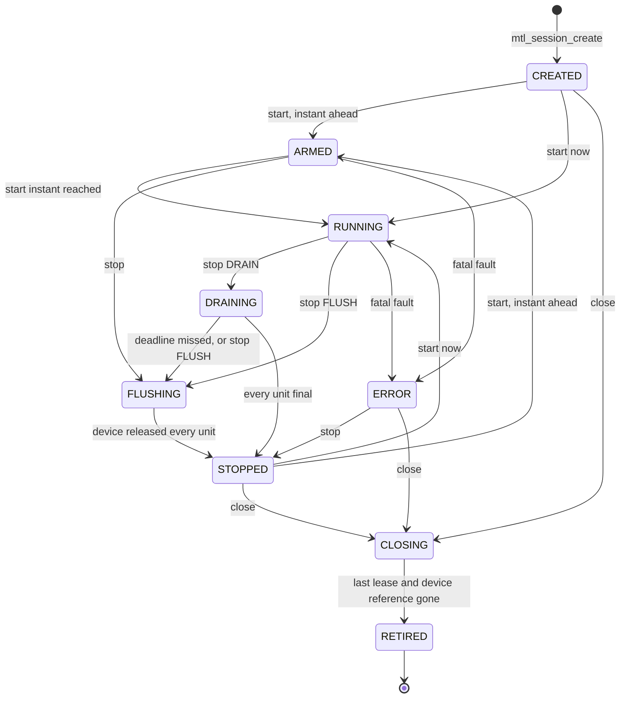

# Unified API contract

| | |
|---|---|
| Status | Normative behaviour of the unified API, revision 4 with the Kubernetes and NMOS/IPMX addenda. Nothing is implemented. Phases 1–6 port today's functionality; items marked "(Phase 7, later)" or "(`MTL_LATER`)" are not in the first implementation |
| Date | 2026-10-02 |
| Sources | [archive/03](archive/03-object-model-and-lifecycle.md), [archive/04](archive/04-threading-and-execution.md), [archive/05](archive/05-memory-and-buffers.md), [archive/07](archive/07-completions-events-and-errors.md), [archive/08](archive/08-observability.md) |
| | [archive/09](archive/09-media-modes-and-backends.md), [archive/13](archive/13-guarantees-and-tests.md), [archive/16](archive/16-kubernetes-and-crash-safety.md), [archive/17](archive/17-nmos-and-ipmx.md) |
| Also | [archive/REVISION-4.md](archive/REVISION-4.md) §3–§9; [archive/simplification/](archive/simplification/) S2–S5, S7, S8 and the R4 reviews |

This file states what every call does, in every state, by area. It is the reference for
implementers and test writers. Names, types, layouts and call classes come from the headers
in [sketch/include/mtl/experimental/](sketch/include/mtl/experimental/). **If this file and a
header disagree, the header wins** and this file is fixed. Media time, RTP, launch and late
policy are in [timing.md](timing.md). How the contract sits on today's engines (slot
interface, lease table, waker, commands, stalled-queue path) is in [engine.md](engine.md).
Guarantee IDs (G-xx) name the contract test that pins a rule; the test plan is in
[implementation-plan.md](implementation-plan.md), the full list in
[archive/13](archive/13-guarantees-and-tests.md).

The surface: 17 headers, 125 functions plus 14 under `MTL_LATER`; `mtl.h` has 32. By class: 53 CP, 19 DP, 7 DPC, 13 WT, 33 AS (`sketch/check.sh`).

## 1. The rules R1–R8

The top of `mtl.h` carries eight rules that every call follows. They are stated once here; the sections below only add what is specific to a call.

### R1 Returns

- Every call returns 0, or a count or mask > 0, on success, and a negative `MTL_E*` code on failure.
- A getter that returns a state (`mtl_session_get_state`) or flags (`mtl_time_now`, `mtl_instance_get_health`) returns them as the non-negative result.
- Codes are Linux errno values on every OS, one meaning each (§8.1). Programs compare with `MTL_E*`, never with `errno.h`.

### R2 Timeouts and "nothing now"

- A timeout is the last argument, `int64_t` ns: 0 = do not wait, `MTL_FOREVER` = no limit.
- A data call (acquire, dequeue, reap, read, wait) that finds nothing, now or by its timeout, returns `-MTL_EAGAIN`. There is no separate "timed out" code for data calls.
- A read that returns a count returns at least 1; it never returns 0.
- `-MTL_EAGAIN` sets only `code` and `reason` in `mtl_last_error()` (no detail is formatted on the data path).
- `-MTL_ETIMEDOUT` is only for a control-plane deadline: a DRAIN `mtl_session_stop` that missed it. No close returns it: `mtl_session_close` returns 0 or 1, `mtl_instance_close` 0, 1 or `-MTL_EIO` (`QUEUE_QUARANTINED`).
- Arming is part of R2 and is explained in §7.2.

### R3 Structs

- Input structs start with `uint32_t struct_size`. `MTL_INIT(&s)` zero-fills and sets it; bindings call `mtl_struct_init(p, size)`.
- A zero-filled struct is the default configuration: no input field has a non-zero default (G-73).
- The library reads `min(struct_size, known)`. Non-zero bytes beyond what it knows are `-MTL_EINVAL` (`NONZERO_TAIL`); unknown flag bits are `-MTL_EINVAL` (`UNKNOWN_BITS`) (G-33, G-51).
- Output structs carry no `struct_size`. The library fills them up to the `size` argument and zeroes what it does not know.
- Structs the library writes and reads back (`struct mtl_unit`, a config from `mtl_session_get_config`) use their own `struct_size`.
- Every pointer in an input struct is read during the call and deep-copied, strings included. The caller may free it on return. (The plugin device table of `mtl_plugin.h` is the one exception; see [migration.md](migration.md).)
- Embedded structs (`mtl_flow`, `mtl_raster`, the essence members) are fixed size and version with their parent.
- Enumerated fields are `uint32_t`; no `_MAX` sentinel is exported. **Status enums start at 1** (`MTL_TX_ON_TIME`, `MTL_RX_COMPLETE`): 0 is never a terminal status, so a zeroed or half-filled record never reads as success (G-57).

### R4 Handles

- Handles are 64-bit values of distinct C types: `mtl_instance_h`, `mtl_session_h`, `mtl_lease_h`, `mtl_region_h`, `mtl_timeline_h`, plus `mtl_queue_h` (`mtl_queue.h`) and `mtl_plugin_h` (`mtl_plugin.h`).
- 0 is the null handle of every type (`MTL_NULL(T)`, `MTL_IS_NULL(h)`). `MTL_SAME(a, b)` compares two lvalue handles of one type; mixing types warns in C and fails in C++ (G-71).
- A closed handle is never reissued.
- A call with an out handle writes the null handle on failure.
- Every close returns 0 for a null handle, so cleanup paths need no checks.
- A stale or foreign handle fails with `-MTL_EBADF`. A lease already returned fails with `-MTL_ESTALE`. Neither changes any state (G-07).
- Handle slots are process-wide and never freed. A handle therefore stays safe to pass after its instance is gone: on an object the instance closed, data calls return `-MTL_ESHUTDOWN`, its close returns 0 and a lease's release returns 0 (§2.4).
- A buffer is named by its pool slot index (`uint32_t`), never by a handle. The lease stays its own type, so a slot can never be passed where access moves.

### R5 Times

- Every time is `int64_t` ns since 1970-01-01 TAI on the instance clock.
- A time is valid only when its flag says so (`MTL_TIMEF_*`, `MTL_UNITF_TAI_VALID`, `MTL_TXR_*`). Zero is a valid time when flagged (G-17).
- While the time base is locked, times are TAI. When it is not (a free-running clock without PTP), they are flagged ESTIMATED (`MTL_TIMEF_ESTIMATED`, `MTL_TXR_ESTIMATED`).
- An RX value on the sender's clock is flagged `MTL_UNITF_SENDER_TIME` (IPMX; Phase 7, later).
- Details: [timing.md](timing.md).

### R6 Call classes

| Class | Contract |
|---|---|
| CP | control plane: application threads; may allocate and block; serialised per object inside the library |
| DP | data plane: O(1); no allocation, no lock a tasklet takes, no syscall but one (below), no logging |
| DPC | data plane that does work in the caller: copy, conversion, zero-fill; bounded by the unit size |
| WT | wait; DP when the timeout is 0 |
| AS | async-signal-safe: callable from a signal handler at any time, also during and after close |

- **The one DP syscall.** A DP call, or the DP attempt of a WT call, may make exactly one syscall: the non-blocking `read()` that drains the session's own wait handle, and only when it was signalled (arming, §7.2). Busy-loop threads never make it. The debug-build class check (G-50) allows this read and nothing else. On the tasklet side the matching exception is the W2 wake-up `write()` (G-39, [engine.md](engine.md)).
- Every exported function carries exactly one class annotation (`MTL_API_CP`, `MTL_API_DP`, `MTL_API_DPC`, `MTL_API_WT`, `MTL_API_AS`), and debug builds assert it (G-50).
- **No application code ever runs on an MTL tasklet** (G-38, G-39).
- The library calls application code only from the threads that `mtl_queue_dispatch_start()` and `mtl_log_set_sink()` create, and codec plugins from their own threads. The opt-in inline notify of M5 (`mtl_session_set_inline_notify`, `MTL_LATER`) is the one exception and runs on the completing context.
- Those library threads may not close or shut down the instance, which joins them: `-MTL_EDEADLK` (`LIBRARY_THREAD`).
- Library busy-loop threads (only through a later advanced header, M12) may call DP functions with timeout 0; anything else returns `-MTL_EDEADLK` (`BUSY_LOOP_THREAD`) (G-79).

### R7 Options

Tuning knobs are options (`mtl_options.h`): absent means the documented default, present is literal. §12.

### R8 The process

- The library installs no signal handler and registers no `atexit`. The exceptions are DPDK's own SIGBUS handlers: held while DPDK grows its heap (MTL allocates pools at create, so only then), and installed by the option `instance.hotplug`.
- A signal handler may call the AS functions only, at any time.
- Every descriptor MTL or DPDK opens for it is close-on-exec.
- An instance belongs to the process that opened it. In a `fork()`ed child MTL at once closes the descriptors it tracks (VFIO, MtlManager, CPU locks, eventfds). Every call then returns `-MTL_EBADF` (reason `FORKED`) except close, which drops local state only. Library memory is `MADV_DONTFORK`. Imported regions are the application's.
- Everything MTL holds outside the process (device DMA, queues, CPUs, kernel programs, MtlManager grants) is tied to a descriptor the kernel closes at exit, or reconciled at the next open. Nothing is found by PID. A SIGKILL at any instant therefore leaves nothing that blocks a restart (§2.5).

## 2. Instance

### 2.1 Open

`mtl_instance_open(p, &mt)` (CP) opens the ports of `struct mtl_instance_params` (legacy `mtl_init`).

| Field | Rule; zero means |
|---|---|
| `port_count`, `ports` | the ports, copied at open. `p` NULL or no port: the environment variable `MTL_PORTS` lists them, `"0000:af:01.0=192.168.1.10/24,0000:af:01.1=192.168.2.10"` or `"null:1"`. No port at all: `-MTL_EINVAL` naming `"ports"`. In a set-uid process `MTL_PORTS` and `env:` ports are `-MTL_EINVAL` |
| `lcores` | CPU IDs `"2-5,8"`; NULL = the opening thread's affinity mask (the pod's cpuset). A CPU outside the mask: `-MTL_EINVAL`, `CPU_NOT_ALLOWED`, before EAL starts |
| `time_source` | `enum mtl_time_source`; 0 = `MTL_TIME_SOURCE_AUTO`: a disciplined NIC PHC, else `CLOCK_TAI`, else `SYSTEM_TAI` (estimated), chosen once at open. `FREERUN` as the last step, and re-evaluation while running, are Phase 7, later. Built-in PTP runs only when named (`MTL_TIME_SOURCE_PTP_BUILTIN`): on a PF MTL owns it disciplines the PHC; on a VF it disciplines MTL's own software time base, as today, and never steers the VF's PHC. [timing.md](timing.md) |
| `flags` | `MTL_INSTANCE_SHARED`, `MTL_INSTANCE_TASKLET_THREAD` (schedulers are pinned pthreads, not EAL lcores), `MTL_INSTANCE_TASKLET_SLEEP` (idle schedulers sleep), `MTL_INSTANCE_HW_TIMESTAMP` (sessions may then require NIC timestamps) |
| `options`, `option_count` | instance keys, copied at open; session keys here are defaults for the instance's sessions (§12.4) |

**Port names** (`struct mtl_port_spec.name`):

| Form | Backend |
|---|---|
| PCI BDF `"0000:af:01.0"` | DPDK PMD |
| `"kernel:<ifname>"` | kernel socket |
| `"native_af_xdp:<ifname>"` | native AF_XDP |
| `"null:<n>"` | no NIC, no root: units complete on the instance clock; the substrate of unit tests and examples (G-92) |
| `"env:<VAR>[#n]"` | the n-th (from 0) PCI address in the environment variable, as the SR-IOV device plugin sets `PCIDEVICE_<resource>`; `-MTL_EINVAL`, `PORT_ENV_UNSET`, if absent |
| `"dpdk_af_xdp:"`, `"dpdk_af_packet:"` | on the removal list (M12) |

Port spec defaults: `ip_family` 0 = IPv4 (bytes 0..3, the rest zero); `prefix_len` 0 = 24 (IPv6: 64); `sip` all zero = DHCP on kernel backends; `gateway` all zero = none; `tx_queues`, `rx_queues` 0 = auto; `numa` 0 = the device's socket, else node + 1. `mac` is output only. **MTL never sets a port's MAC**: a VF keeps the one its PF or CNI gave it.

**Fail fast.** Every check that needs no device runs before any device is touched. A misconfigured pod fails at once with one reason and a one-line `mtl_last_error().detail` fit for a termination message:

| Check | Reason on failure |
|---|---|
| each `env:` port resolves | `PORT_ENV_UNSET` |
| the device node exists in the container, is accessible, and is bound to vfio-pci | `DEVICE_NODE_MISSING`, `DRIVER_MISMATCH`, `CAPABILITY_MISSING` |
| an IOMMU is present (not no-IOMMU, not PA mode), unless `instance.allow_noiommu` | `NO_IOMMU` |
| hugepages within the **cgroup** hugetlb limit and the free pages | `HUGEPAGES_LIMIT` |
| `RLIMIT_MEMLOCK` covers the pools, or `CAP_IPC_LOCK` is effective | `MEMLOCK_LIMIT` |
| the capabilities the backend needs, in the effective set | `CAPABILITY_MISSING`, naming it |
| the CPUs: inside the affinity mask; busy polling under a CFS quota (`instance.cpu_shared`) | `CPU_NOT_ALLOWED`, `CPU_SHARED` |
| `instance.runtime_dir`, when set, is writable | `RUNTIME_DIR` |
| MtlManager, when the configuration needs it (AF_XDP on a shared netdev) | `MANAGER_REQUIRED` |
| AF_XDP: the socket or map from a node daemon (`port.xsk_map`) | `XSK_UNAVAILABLE` |
| the named time source can be read; `PTP_BUILTIN` is not asked to steer a PHC MTL does not own (a VF runs it on the software time base instead) | `TIME_SOURCE_UNAVAILABLE`, `CLOCK_NOT_OWNED` |

- After the devices, open probes what each VF allows (trust, multicast filter budget, PF rate limit, pacing, PHC) into `caps.*` keys. A session that needs more fails at create: the first group past an untrusted VF's filter budget is `-MTL_ENOSPC`, `MCAST_FILTERS`.
- **Open does not wait** for links, neighbours, time lock or a DHCP lease. `mtl_instance_get_health()` reports them (§2.7). Units sent before lock carry `MTL_TXR_ESTIMATED`.
- A port with `port.dhcp` stays in `MTL_PHASE_LINKS` until it has a lease, and `MTL_EVENT_PORT_ADDRESS` reports it (today open waits up to 49 × 100 ms and then fails, `mt_dhcp.c:549-564`).
  Timesync start and TSC calibration (about 1 s each) stay inside open.
- Open assumes the previous run died uncleanly: it flushes the VF's flow rules and rate-limit configuration and logs what it reconciled (`instance.reconciled{kind}`).
- **Re-open.** After a close in the same process, open works again on the same ports and on a subset of the first open's CPUs (EAL keeps its first arguments). A port quarantined by an earlier close is `-MTL_EBUSY` (`QUEUE_QUARANTINED`) until the process exits.
- Files: MTL writes nothing to the filesystem unless `instance.runtime_dir` is set; it is then the only place. Details: [deployment.md](deployment.md).

### 2.2 Ports

- A port is an index into the instance's ports. `mtl_port_find(mt, name, &port)` finds one by name, BDF or IP.
- `mtl_port_get_spec()` returns the port as granted: the address, prefix and gateway in use (a DHCP lease included) and the MAC on the wire. A changed address posts `MTL_EVENT_PORT_ADDRESS`.
- A port's capabilities, status and counters are the stats keys `caps.*`, `port.*`, `time.*`, `nic.*` (§11).
- A port whose link is down at open is opened anyway, with its links reported down.

**`MTL_PORTS` (proposed grammar, OI-47).** The environment variable is read only when `p` is
NULL or names no port, and is `-MTL_EINVAL` in a set-uid process.

```text
ports   := port { "," port }
port    := name [ "=" address [ "/" prefix ] [ "@" gateway ] ]
name    := BDF ("0000:af:01.0") | "kernel:" ifname | "native_af_xdp:" ifname
         | "null:" n | "env:" VAR [ "#" n ]
address := IPv4 dotted quad | "[" IPv6 "]"
```

The prefix defaults to 24 (IPv6: 64). A port without an address uses DHCP on kernel backends
and is `-MTL_EINVAL` (naming the port) elsewhere. `env:VAR#n` takes the n-th PCI address (from
0) of the comma-separated list in `VAR`, as the SR-IOV device plugin writes it. When `p` names
ports, `MTL_PORTS` is ignored, never merged.

### 2.3 Shared instance

- With `MTL_INSTANCE_SHARED` the first open creates the process-wide instance and later opens join it.
- Each open returns its own reference handle: `MTL_SAME` is false between two, and every call accepts any live reference.
- A later open that names ports, lcores, time source or options that differ from the live instance fails with `-MTL_EEXIST` (`INSTANCE_MISMATCH`). A field the later open leaves zero is not a request. (Rejected: the revision-3 merge table of invariant, mergeable and ignored fields; [archive/03 §7.2](archive/03-object-model-and-lifecycle.md).)
- `mtl_instance_close` on a reference that is not the last only drops that reference and returns 0 (G-77, restated for revision 4).
- `mtl_instance_shutdown(mt, MTL_SHUTDOWN_ALL_REFERENCES, …)` shuts the instance down for every component in the process (GStreamer elements, an FFmpeg device, the application). The application that owns `main()` uses it on SIGTERM; a plugin never does. The other references then get `-MTL_ESHUTDOWN` and their close returns 0.

### 2.4 Close and shutdown

`mtl_instance_close(mt, timeout_ns)` (CP) drops this reference and consumes `mt`. The last reference shuts the instance down within `timeout_ns`, network first. `mtl_instance_shutdown(mt, flags, timeout_ns, &report, size)` (in `mtl_observe.h`) does the same with flags and a report.

| Step | What | Bounded by |
|---|---|---|
| 0 | New data calls get `-MTL_ESHUTDOWN`; health shows `SHUTTING_DOWN`, so readiness fails. Calls already inside a data call are waited for. A `MTL_SESSION_SINGLE_READER` session has no in-flight counter, so the application joins that thread first | the deadline |
| 1 | TX: the unit whose first packet left is sent to its end at its pace and gets its normal status; the wire never carries a partial unit (rows units end by `tx.rows_late`, STALL as TRUNCATE). Queued units become `MTL_TX_FLUSHED` with reason `CLOSE`. With `MTL_SHUTDOWN_DRAIN` every queued unit is sent instead, until the deadline minus what the later steps need | the deadline |
| 2 | RX: an IGMP/MLD leave on every leg before the queues close; incomplete units are discarded and counted | never waits on the network |
| 3 | Pending results and terminal events go to dispatch threads; then the dispatch, log-sink and codec threads are joined | the deadline |
| 4 | Schedulers, queues and ports stop; flows are destroyed; imported regions are unmapped. A queue that will not complete runs the stalled-queue steps ([engine.md](engine.md)), a reset only if the budget remains (`caps.reset_budget_ns`), otherwise it is quarantined | the deadline |
| 5 | MtlManager grants are returned by closing the connection; after step 4, so no grant is returned while still in use | socket close |
| 6 | Library memory is freed, except slots under a lease the application still holds | — |

- Sessions, queues and timelines still open are closed by the shutdown. Their handles stay safe (R4): data calls return `-MTL_ESHUTDOWN`, blocked waits wake with it, `mtl_session_close` returns 0, and `mtl_rx_release`/`mtl_tx_release` of a lease taken before return 0.
- To send queued TX units, close the sessions first: `mtl_session_close` drains (§4.9). Instance close flushes them.
- `timeout_ns` 0 means abort semantics: no drain. `MTL_FOREVER` still bounds every step by its own budget. No step starts that its remaining budget cannot finish.
- From a library thread (dispatch, log sink, codec) the call returns `-MTL_EDEADLK` and does not consume `mt`.

| Return | Meaning | Application |
|---|---|---|
| 0 | retired: every object freed, every library thread joined | exit, or open again |
| 1 | quiesced: no device can reach any memory, but leases or regions are still referenced, or a library thread is still in application code past the deadline (counted; its memory is kept) | exit; or return the leases. A slot's memory is freed by the process's next control-plane call after its last lease returns, or at exit |
| `-MTL_EIO`, reason `QUEUE_QUARANTINED` | a port could not be stopped; nothing it can reach is freed | exit now; the kernel's VFIO release stops the device |

- `-MTL_ETIMEDOUT` is never used for the unsafe case.
- `struct mtl_shutdown_report` (filled whatever the call returns) counts each step: `sessions_closed`, `sessions_retiring`, `units_flushed`, `results_discarded`, `groups_left`, `leases_out`, `regions_referenced`, `ports_unquiesced` (bit per port), `threads_unjoined`, `bytes_kept`, and `references_left` > 0 when only this reference was dropped. `summary` is one line for a termination message.
- **Abort.** `mtl_instance_abort(mt)` (AS; legacy `mtl_abort`; a second SIGTERM) interrupts every wait and stops every TX session at its next packet: the cut unit is `MTL_TX_FLUSHED`, reason `ABORTED`, with `MTL_TXR_PKT_SHORT`; queued units are `FLUSHED`/`ABORTED`. During close it skips to the hard stop; after close it does nothing. Close still has to follow.
- **Interrupt.** `mtl_instance_interrupt(mt, 1)` (AS) makes every data wait of every session return `-MTL_ECANCELED` until `mtl_instance_interrupt(mt, 0)` (CP). Stop and close still work (§7.4).
- **The budget counts from SIGTERM.** The signal handler records the time and calls `mtl_instance_interrupt(mt, 1)`; the main thread passes `grace − preStop − margin − time spent`. ex11 is the recipe ([examples.md](examples.md)).
- **Signals in the recipe.** Block SIGTERM and SIGINT before open and before any thread is created; install the handlers after open; then unblock. A signal arriving during open stays pending.
- **The AS path is safe after close.** The interrupt flags and the wake-up eventfd live in the instance's never-freed handle slot; close waits for AS callers in flight before it closes the eventfd, so a late signal never writes into a recycled descriptor.

### 2.5 What holds after each kind of ending

| Resource | Orderly close, then exit | SIGKILL at any instant | Device removal, process keeps running |
|---|---|---|---|
| TX session | unit on the wire finished, rest `FLUSHED`; every accepted unit has a result | the wire stops at descriptor release; a partial frame may be on the wire | ERROR `DEVICE_GONE`, or a degraded 2022-7 leg; waits `-MTL_ENODEV` |
| RX session | leave sent on every leg | no leave: the switch keeps the group until the querier ages it out (about 260 s with IGMP defaults) | ERROR or degraded leg |
| application lease | release returns 0; the slot is freed after its last lease | gone | release still works |
| library pools | freed slot by slot as leases come back | freed by the kernel | not freed under a lease |
| imported regions | unmapped before `mtl_mem_close` returns 0 | IOMMU unmap after DMA is off | the removed port's mapping goes with its VFIO descriptor |
| no-IOMMU mode | as orderly | **no guarantee: DMA may hit freed pages**; refused unless `instance.allow_noiommu` | no guarantee |
| CPUs | nothing to release in a pod (the cpuset is the lease); MtlManager grants on socket close; OFD locks released | released by the kernel or at manager socket EOF | — |
| VF queues, rate-limit nodes, flow rules | stopped and destroyed | FLR at descriptor release; flushed again at the next open | gone with the device |

The residual effects of a SIGKILL, none of which blocks the next start: the stale IGMP membership; a partial frame; XDP state and `tx_maxrate` while MtlManager itself is down; a PHC frequency offset left by the built-in PTP client on a PF it owns (impossible on a VF, where it steers only MTL's software time base). Details: [deployment.md](deployment.md), [archive/16 §3](archive/16-kubernetes-and-crash-safety.md).

### 2.6 Device removal and reset

| Event | MTL | The application sees |
|---|---|---|
| reset (a PF reset resets every VF) | the admin worker resets the port, restores queues and flows, re-joins groups; a bounded device step that counts as worker progress | `MTL_EVENT_PORT_RESET`; sessions report `MTL_EVENT_RECOVERY` and resume; units in the gap are `MTL_TX_FAILED`, reason `PORT_RESET` |
| removed, or a reset that fails | the port becomes removed; its legs go oper-down. A 2022-7 session with a surviving leg continues degraded; one with no leg left enters ERROR (`DEVICE_GONE`) | `MTL_EVENT_PORT_REMOVED`; health `MTL_HEALTH_DEGRADED`, and `MTL_HEALTH_SESSION_LOST` only when a started session has no leg left or every port is gone; calls on a session with no leg return `-MTL_ENODEV` |
| close after removal | skips every device step for that port | 0 |

The library never closes the application's sessions on removal; they stay closeable in ERROR.

Open: the outcome of TX units in a port-reset gap. This file follows archive/16 (`MTL_TX_FAILED`, `PORT_RESET`); archive/03 gave them the TX-hang outcome (`MTL_TX_DROPPED`, `RECOVERY`, §4.10).

### 2.7 Health

`mtl_instance_get_health(mt, &h, size)` (DP) returns the `MTL_HEALTH_*` flags; `h` may be NULL.
It is lock-free from any thread at any rate, even when the control plane is wedged, and returns a
consistent snapshot, never torn (`detail` is "" if it changed while being copied). During close
it reports `MTL_HEALTH_SHUTTING_DOWN` and masks `MTL_HEALTH_SCHED_STALLED`; after close it
returns `-MTL_ESHUTDOWN`. `MTL_EVENT_HEALTH` reports every change.

| Bit | Liveness | Readiness | Set when |
|---|---|---|---|
| `MTL_HEALTH_SCHED_STALLED` | yes | yes | a scheduler loop is older than `instance.stall_ns` (default 1 s). The heartbeat advances on wake-ups and timer ticks, so a sleeping idle scheduler is not stalled. `MTL_EVENT_SCHED_STALLED` warns at 1/8, 1/4 and 1/2 of the limit |
| `MTL_HEALTH_WORKER_STALLED` | yes | yes | the admin worker missed its heartbeat outside a bounded device step (a port reset is progress) |
| `MTL_HEALTH_SESSION_LOST` | yes | yes | a started session lost every leg to removed ports, or every port is gone |
| `MTL_HEALTH_DEVICE_FAULT` | yes | yes | a queue was quarantined; its memory is never freed |
| `MTL_HEALTH_STARTING` | | yes | the phase is below `MTL_PHASE_READY` (`MTL_PHASE_LINKS`, `MTL_PHASE_TIME`) |
| `MTL_HEALTH_NO_LINK` | | yes | no port has a link |
| `MTL_HEALTH_TIME_UNLOCKED` | | yes | time state ACQUIRING or LOST; FREERUN and HOLDOVER are ready |
| `MTL_HEALTH_MANAGER_LOST` | | yes | MtlManager is gone (AF_XDP stops receiving) |
| `MTL_HEALTH_SHUTTING_DOWN` | | yes | close or shutdown has begun |
| `MTL_HEALTH_DEGRADED` | | | information only: a port's link is down or removed, or a started session is in ERROR or has an enabled leg not resolved or joined |

- `MTL_HEALTH_LIVENESS` and `MTL_HEALTH_READINESS` are the two masks.
- **Liveness never depends on packets, links or PTP lock**, so a grandmaster outage or a switch reboot never restarts a pod; a degraded 2022-7 session is not a liveness failure.
- The library never kills anything; the orchestrator decides. The application serves the probes: startup and liveness 503 until open returns, then on any liveness bit; readiness 503 on any readiness bit; after shutdown began, liveness 200 and readiness 503.
- `struct mtl_health` also carries `phase`, `reason` (of the first bit set), `time_state`, port, scheduler and session counts, `oldest_loop_age_ns` and `time_error_ns`.

### 2.8 Legacy bridge

`mtl_instance_from_legacy(legacy, &mt)` wraps a legacy `mtl_handle`, and
`mtl_instance_to_legacy()` goes the other way, so legacy and unified sessions share one instance.
`mtl_instance_close()` on the wrapper closes the unified sessions, queues and timelines made
through it, but never stops the legacy instance's devices or legacy sessions; `mtl_uninit()` does
that. Details: [migration.md](migration.md).

- **Teardown order:** close the wrapper (`mtl_instance_close`) first, then `mtl_uninit()`.
- `mtl_uninit()` while unified sessions, queues or timelines made through a wrapper are still open returns `-EBUSY` and stops nothing (Q-LIFE-3). Today `mtl_uninit` with live sessions self-deadlocks (SP-01, [engine.md](engine.md)).
- Open: what create and start mean on a bridged instance before the legacy `mtl_start()`.

## 3. Session configuration

### 3.1 One typed config

- `struct mtl_session_config` describes one stream of one essence in one direction. It is typed only: enums and defines, no spec strings (D-97).
- `MTL_INIT(&sc)`; set `direction`, `essence`, `flows[0]` and the essence's required fields; everything else defaults.
- The member for `essence` is read (`sc.video`, `sc.cvideo`, `sc.audio`, `sc.anc`, `sc.fastmeta`, `sc.rtp`; plus `sc.packet` when `unit = MTL_UNIT_PACKETS`). The other essence members must stay zero: `-MTL_EINVAL`, `OTHER_ESSENCE`.
- A required field left zero is `-MTL_EINVAL`, `FIELD_REQUIRED`, and `mtl_last_error().field` names it.
- Enums follow the legacy order: legacy + 1 where 0 means "not set" (`mtl_fps`, `mtl_video_format`, `mtl_audio_format`, `mtl_ptime`, `mtl_app_format`), the same values where 0 is a real default (`mtl_packing` = `st20_packing`, `mtl_sender_type` = `st21_pacing`). The field map from the legacy ops is in [migration.md](migration.md).
- `next` is reserved and must be NULL.

### 3.2 Common fields

| Field | Rule; zero means |
|---|---|
| `direction` | `MTL_TX` or `MTL_RX`; required |
| `essence` | `MTL_VIDEO`, `MTL_CVIDEO`, `MTL_AUDIO`, `MTL_ANC`, `MTL_FASTMETA`, `MTL_RTP` (generic RTP, packet units only); required |
| `unit` | `MTL_UNIT_FRAME` (0), `MTL_UNIT_ROWS` (video), `MTL_UNIT_PACKETS` (§13); fixed for the session's life |
| `name` | unique per instance (`-MTL_EEXIST`, `NAME_EXISTS`, against live and closing sessions); "" = generated `<essence>_<tx or rx>_<n>` (Open: archive/08 wrote `<essence>-<dir>-<n>`). Copied at create; in `mtl_session_info`, the log prefix and every event's `origin_name` (G-88) |
| `flows[MTL_MAX_LEGS]` | `flows[0]` required; a `flows[1]` that exists is the ST 2022-7 leg (§14) |
| `flags` | `MTL_SESSION_*` (§3.4) |
| `pool_count` | 0 = by essence: video `max(min_count_direct, 3)` (3 on RX), the others 4; the limit is `mtl_session_info.max_count` (8 for video and cvideo until engine change E11) |
| `legs_disabled` | a bit per existing leg (others `-MTL_EINVAL`): admin down, or a reserved leg (§14.2) |
| `media_mode` | `enum mtl_media_mode`; 0 = `MTL_MEDIA_AUTO`, the next slot ([timing.md](timing.md)) |
| `source_kind` | `enum mtl_source_kind`; 0 = `MTL_SOURCE_PLAYBACK` |
| `timeline` | null = the SMPTE epoch |
| `min_tx_delay_ns` | 0 = by source kind (CAPTURE: one unit period plus the pick-up lead, never 0) |
| `media_time_offset_ns` | declared latency: shifts media time and RTP; 0 = none |
| `options`, `option_count` | session keys, deep-copied (§12) |

**Flow fields** (`struct mtl_flow`, fixed size, one per leg):

| Field | Zero means |
|---|---|
| `port` | the leg's own instance port (leg i → port i); else port index + 1 |
| `ip_family` | IPv4 in bytes 0..3; 6 = IPv6 |
| `ip` | TX destination; RX group (multicast), or the port's own address or all zero (unicast) |
| `source_filter` | RX source-specific multicast; all zero = none; with unicast RX it checks the sender |
| `udp_port` | required unless the leg is reserved |
| `udp_src_port` | TX: `udp_port`; RX: any |
| `payload_type` | TX: the essence default (video and cvideo 112, audio 111, ANC 113, fastmeta 115); RX: no check |
| `dscp` | the profile's: ST 2110 CS0 (IPMX: AF41 audio, AF42 others; Phase 7, later); `MTL_FLOWF_DSCP_LITERAL` sends the value as given |
| `ttl` | 64 |
| `ssrc` | TX: random; RX: no check |
| `dst_mac` | used only with `MTL_FLOWF_USER_MAC` (no ARP) |
| `vlan` | reserved, 0 |

`mtl_flow_ipv4(&f, a, b, c, d, udp_port)` fills an IPv4 flow (legacy `dip_addr[i]`, `udp_port[i]`). The granted values (SSRC, source port, payload type, DSCP, TTL, MACs) are in `mtl_session_info.leg[]`; `dst_mac` is zero while the neighbour is unresolved.

### 3.3 Essence members

| Member | Required | Zero means |
|---|---|---|
| `video` (`struct mtl_video_config`) | `raster` (unless `detect`); `format` or `app_format` | `format` 0 = from `app_format`; `app_format` 0 = the transport format itself, no conversion; `packing` 0 = `MTL_PACKING_BPM` (the legacy default); `sender_type` 0 = `MTL_SENDER_N`; `detect` 0 = off; `linesize[]` 0 = packed (library pools) |
| `video`, colour and timing | — | `colorimetry` 0 = UNSPECIFIED (still rendered: SDP requires it), `tcs` 0 = SDR, `range` 0 = narrow (SDP and conversion metadata, never on the wire); `troffset_ns` 0 = TRODEFAULT (an explicit 0 is the option `tx.troffset_ns`) |
| `cvideo` | `raster`, `codec`, `codestream_bytes` (CBR bytes, or the VBR ceiling, per unit) | `rate_mode` 0 = `MTL_CVIDEO_CBR`; `app_format` 0 = the application gives the codestream, else a codec plugin encodes; colour and `troffset_ns` as video |
| `audio` | `format`, `sample_rate`, `channels` | `ptime` 0 = 1 ms; `unit_samples` 0 = 10 ms in whole packets (RX unit, TX pool capacity) |
| `anc` | `video.rate` or `video.fps` (and scan) on the epoch timeline | `video` all zero on a created timeline = the first video of the timeline's first start (`-MTL_EINVAL`, `FIELD_REQUIRED`, if there is none); `max_udw_bytes` 0 = 64 KiB |
| `fastmeta` | as ANC; with `MTL_FASTMETA_FREE_RUNNING` the own rate in `video.fps`, always required | `buffer_capacity_bytes` 0 = 64 KiB; RX filters on `data_item_type` and `k_bit` only with `MTL_FASTMETA_RX_MATCH_DIT` / `MTL_FASTMETA_RX_MATCH_K` |
| `rtp` | `clock_rate` (ST 2022-6: 27000000) | `profile` 0 = `MTL_RTP_LINEAR`; `unit` = unit rate and scan; `bitrate_bps` 0 = derived; `encoding` is the SDP rtpmap name |
| `packet` | — | §13.2 |

- `struct mtl_raster`: any width and height up to 32767, any rate with num ≤ 4194303 and den ≤ 1023, not a table. `rate` is an `enum mtl_fps`; 0 = the rational `fps`, which is `{0, 0}` when `rate` is set. `mtl_fps_rational()` gives the exact value.
- `enum mtl_scan`: `MTL_PROGRESSIVE`, `MTL_INTERLACED` (the unit is a field), `MTL_PSF` (paced as interlaced, one index per frame).
- Formats outside RFC 4175 (`MTL_YUV422P10LE_NONSTD`, `MTL_V210_NONSTD`) are kept for existing deployments and set `MTL_INFO_NON_COMPLIANT`.

### 3.4 Session flags

| Flag | Meaning |
|---|---|
| `MTL_SESSION_RESULTS` | results for a library pool (application memory always has them, §6.1) |
| `MTL_SESSION_POOL_ATTACHED` | slots come from `mtl_session_attach` (§9.3) |
| `MTL_SESSION_REQUIRE_DIRECT` | fail at create if any unit would be copied (§9.7) |
| `MTL_SESSION_RX_BY_INDEX` | RX slot = media index mod `pool_count` (§9.8) |
| `MTL_SESSION_RX_LATEST` | RX: a full pool reclaims the oldest unread unit |
| `MTL_SESSION_RX_NO_FILL` | RX: do not zero what lost packets left out |
| `MTL_SESSION_MT_SUBMIT` | several threads acquire and submit |
| `MTL_SESSION_SINGLE_READER` | one thread reaps and dequeues (release: any thread) |
| `MTL_SESSION_EXPORT_POOL` | slots lent to a framework pool; implies `MTL_SESSION_RESULTS` |

### 3.5 Query, info and config

- `mtl_session_query(mt, &sc, flags, &info, size, &req, size)` (CP) is a dry run of create: it validates and grants without allocating. `info` and `req` may be NULL; `req` gives the layout an attached pool needs (§9.4). ANC and fastmeta rasters taken from a start read 0 until then.
- `MTL_QUERY_CHECK_CAPACITY` also checks free capacity and runs the real placement without reserving: `-MTL_ENOSPC` with the limiting resource as reason (`CAPACITY_*`). If it succeeds and nothing else changes the host, the create succeeds (G-89).
- The limits a controller runs into today: 18 schedulers per instance (`MT_MAX_SCH_NUM`, `mt_main.h:49`); 60 video TX and 60 video RX sessions per scheduler (`ST_SCH_MAX_TX_VIDEO_SESSIONS`, `st_header.h:33-34`);
  a data quota per scheduler (`instance.sched_quota_mbs`, default 12 × the 1080p59.94 4:2:2 10-bit bandwidth, `ST_QUOTA_TX1080P_PER_SCH`, `st_header.h:23`; `mt_sch_add_quota`, `mt_sch.c:1060`); TX and RX queue counts fixed when the port is configured; the rate-limited queues of each port.
- The `capacity.*` and `port.free_*` keys are a snapshot: another creator can take the capacity first. A reservation object (hold capacity for N sessions, then create into it) is Phase 6.
- `mtl_session_get_info()` (CP) returns the granted configuration: `pacing_class` (`enum mtl_pacing`), `pool_count`, `max_count`, `results`, `direct`, `leg_count`, `pkts_per_unit`, `unit_samples`, `buffer_capacity_bytes`, `meta_capacity`, `codestream_bytes` (in whole packets), `sched_index`, `unit_bytes`, `pool_slot_pitch`, `created_tai_ns` and `leg[]`.
- It also gives `latency_min_ns`/`latency_max_ns` (framework LATENCY queries), `min_submit_lead_ns` (submit at least this long before the media time) and `flags` (`MTL_INFO_NON_COMPLIANT`, `MTL_INFO_MEDIACLK_SENDER`). Everything else granted is an `info.*` stats key (§11).
- `mtl_session_get_config()` (CP) returns the current configuration, to edit and pass to `mtl_session_update()`. Options are not returned (`options` NULL); read them with `mtl_get_option()`.

### 3.6 Features per essence

What each essence gets in Phases 1–6 (yes), later (with the phase), or not at all (—). Today's asymmetry is accidental; the target is the same verbs and outcomes for every essence. Details: [archive/09 §3, §8](archive/09-media-modes-and-backends.md).

| Feature | video | cvideo | audio | ANC | fastmeta |
|---|---|---|---|---|---|
| frame units, ST 2022-7 legs, library and attached pools | yes | yes | yes | yes | yes |
| direct TX (any stride ≥ row) | yes | — (copy) | — (copy) | — (copy) | — (copy) |
| media modes, source kinds, late policies | yes | yes | yes | yes | yes |
| `MTL_SUBMIT_NOT_BEFORE` / `MTL_SUBMIT_EXACT` | yes | yes | later | yes | later |
| underrun policy (`tx.underrun_policy`) default | SKIP | SKIP | SKIP; `MTL_UNDERRUN_SILENCE` as an option | `MTL_UNDERRUN_EMPTY_ANC` | `MTL_UNDERRUN_KEEPALIVE` |
| underrun REPEAT_LAST | Phase 6 | Phase 6 | Phase 6 | Phase 6 | — |
| results, events, one stats schema | yes | yes (no stats today) | yes | yes | yes |
| timelines and start arrays | yes | yes | yes | yes | yes (on the grid like ANC) |
| pixel conversion (`app_format`) | yes | codec plugin | — | — | — |
| RX auto-detect | `sc.video.detect` | — | — | `anc.rx_detect` (interlace, on) | — |
| RX timing parser (`rx.timing_parser`) | opt-in | — | opt-in | — | — |
| TX ST 2110-21 self-check | yes | network model only | — | — | — |
| RX DMA offload | yes (reported) | — | — | — | — |
| NACK retransmission (`rtx.*`) | yes | yes | — | — | — |
| rows units (`MTL_UNIT_ROWS`) | Phase 6 (progressive) | — | — | — | — |
| packet units (`MTL_UNIT_PACKETS`, also `MTL_RTP`) | Phase 2P | Phase 2P | Phase 2P | Phase 2P | Phase 2P |
| header split | — (M12) | — | — | — | — |

Open: the launch flags on audio and fastmeta. The archive plans them later; the header does not restrict `MTL_SUBMIT_NOT_BEFORE` or `MTL_SUBMIT_EXACT` by essence, so what such a submit returns until then is undecided.

## 4. Lifecycle and states

### 4.1 States

| State | Meaning |
|---|---|
| `MTL_STATE_CREATED` | validated; queues, scheduler quota, lease table and flow-rule capacity reserved; nothing on a tasklet; nothing sent |
| `MTL_STATE_ARMED` | started, start instant ahead. TX accepts preroll; RX is joined and discards units whose media time is before the start instant |
| `MTL_STATE_RUNNING` | sending or receiving |
| `MTL_STATE_DRAINING` | `stop(DRAIN)`: queued units are still being sent |
| `MTL_STATE_FLUSHING` | `stop(FLUSH)`, a drain deadline, or ERROR entry: queued units are being flushed; units the device holds are not yet released |
| `MTL_STATE_STOPPED` | like CREATED, with history: slots attached, RX memberships and rules kept, counters kept; can start again |
| `MTL_STATE_ERROR` | the library cannot continue without the application: only stop and close are legal |
| `MTL_STATE_CLOSING` | closed, retiring: leases or device references remain |
| `MTL_STATE_RETIRED` | closed and retired; the handle stays retired |



`mtl_session_close` from ARMED, RUNNING or DRAINING first stops (DRAIN until the deadline, then FLUSH), then retires (§4.9). `mtl_session_get_state()` (DP) returns the state as its result; `mtl_session_get_status()` (CP) gives the full picture (§4.10).

### 4.2 What each state allows

`-EBUSY` is `-MTL_EBUSY`, and so on; "yes" means the call does its normal work. A call not listed for ERROR fails with the session's error code (`status.error`, `-MTL_EIO` or `-MTL_ENODEV`). Calls on a queue-bound session follow the queue for what is bound (§10.3) (G-49).

| Call | CREATED, STOPPED | ARMED | RUNNING | DRAINING | FLUSHING | ERROR | CLOSING | RETIRED |
|---|---|---|---|---|---|---|---|---|
| `mtl_session_attach`, `mtl_session_detach`, `mtl_queue_bind`, `mtl_set_option` (C, S keys) | yes | `-EBUSY` | `-EBUSY` | `-EBUSY` | `-EBUSY` | `-EBUSY` (stop first) | `-ESHUTDOWN` | `-EBADF` |
| `mtl_session_update` `MTL_UPDATE_MEDIA`, `MTL_UPDATE_POOL` | yes, applied during the call | `-EBUSY` | `-EBUSY` (colorimetry, tcs, range: posted) | `-EBUSY` | `-EBUSY` | `-EIO` | `-ESHUTDOWN` | `-EBADF` |
| `mtl_session_update` `MTL_UPDATE_FLOWS`, `MTL_UPDATE_LEGS`, R options | yes, applied during the call | posted for the boundary | posted for the boundary | `-EBUSY` | `-EBUSY` | `-EIO` | `-ESHUTDOWN` | `-EBADF` |
| `mtl_session_start` | yes; from STOPPED after ERROR it re-reserves or fails `-ENODEV` | `-EBUSY` | `-EBUSY` | `-EBUSY` | `-EBUSY` | `-EIO` (stop first) | `-ESHUTDOWN` | `-EBADF` |
| `mtl_session_stop` | 0 (no-op) | yes | yes | FLUSH escalates; a second DRAIN waits for the first | waits for the flush | yes → STOPPED | `-ESHUTDOWN` | `-EBADF` |
| `mtl_session_discard` | yes: queued preroll units `FLUSHED`/`DISCARD` | yes | yes | `-EBUSY` | 0 (no-op) | 0 (no-op) | `-ESHUTDOWN` | `-EBADF` |
| `mtl_tx_acquire`, `mtl_tx_acquire_slot` | yes (preroll) | yes | yes | `-ESHUTDOWN` | `-ESHUTDOWN` | error code | `-ESHUTDOWN` | `-EBADF` |
| `mtl_tx_submit` | yes, held until start | yes, held until the instant | yes | `-ESHUTDOWN` | `-ESHUTDOWN` | error code | `-ESHUTDOWN` | `-EBADF` |
| `mtl_tx_release`, `mtl_rx_release` | yes | yes | yes | yes | yes | yes | **yes** | — (no lease can be out) |
| `mtl_tx_withdraw` | yes | yes | yes | yes | `-EBUSY` (being flushed) | `-EBUSY` (already flushed) | `-ESHUTDOWN` | `-EBADF` |
| `mtl_tx_reap`, `mtl_session_read_events` | yes | yes | yes | yes | yes | yes | `-ESHUTDOWN` (unread results discarded) | `-EBADF` |
| `mtl_rx_dequeue` | remaining ready units, then `-EAGAIN` | `-EAGAIN` / waits | yes | force-completed and ready units, then `-ESHUTDOWN` | ready units, then `-ESHUTDOWN` | ready units, then the error code | `-ESHUTDOWN` | `-EBADF` |
| `mtl_session_wait` | yes | yes | yes | yes | yes | yes | `MTL_WAIT_RETIRED` only | `MTL_WAIT_RETIRED` |
| `mtl_session_interrupt` | yes | yes | yes | yes | yes | yes | 0 (no-op: close wins) | `-EBADF` |
| `mtl_session_get_state` | state | state | state | state | state | state | `MTL_STATE_CLOSING` | `MTL_STATE_RETIRED` |
| `mtl_session_get_status`, `get_info`, `get_config`, stats | yes | yes | yes | yes | yes | yes | `-ESHUTDOWN` | `-EBADF` |
| `mtl_session_close` | yes | yes | yes | yes | yes | yes | never: the handle is consumed | never |

- **A WT call that starts in CREATED, ARMED or STOPPED waits normally** and ends with `-MTL_EAGAIN`, so a concurrent dequeue during a stop/update/start cycle never reads as end of stream.
- A WT call that is already blocked when the session enters DRAINING, FLUSHING, ERROR or CLOSING is woken with the code of the table once nothing remains for it (G-30).
- `-MTL_ESHUTDOWN` only ever means "the application asked" (stop, discard, close, instance close). `-MTL_EIO` means the session failed; the reason is in the status. `-MTL_EAGAIN` means nothing yet (G-70).
- **A lease the application holds stays valid across stop and close.** Stop never takes memory the application is reading or writing; close retires only after the leases come back.
- **Results stay drainable** until close; close discards what is unread.
- After close only `mtl_session_get_state`, `mtl_session_wait(s, MTL_WAIT_RETIRED, …)` and the release of leases taken before are defined on the handle; any other call gets the code of the CLOSING or RETIRED column. (Open: the header does not yet state these codes per call.)

### 4.3 Create and open

- `mtl_session_create(mt, &sc, &s)` (CP) validates and reserves queues, scheduler quota, the lease table and flow-rule capacity; nothing runs on a tasklet and nothing is sent. Failures surface here, so start is fast.
- **A failed create leaves nothing behind**: no session, mapping, flow, scheduler quota or handle; `*out` is the null handle (G-32).
- **Create never waits for ARP or IGMP.** Neighbour resolution runs on a worker. An unresolved TX leg is `MTL_FLOW_WAITING_NEIGHBOUR` and its units are not sent on it (reason `WAITING_NEIGHBOUR`; `MTL_TX_DROPPED` when every leg is unresolved); resolution resumes sending without an API call. `MTL_FLOWF_USER_MAC` bypasses ARP (G-90).
- `mtl_session_open(mt, &sc, &s)` is create and start now: the whole setup of a stream that needs nothing else. On failure `*s` is the null handle.
- A create that needs an lcore after MtlManager is lost returns `-MTL_EAGAIN`, reason `MANAGER_LOST`; running sessions continue (G-98).

### 4.4 Start

`mtl_session_start(s[], n, when, &t0)` (CP) starts n sessions, all or none (G-23).

- The sessions must share one timeline and one direction, and with n > 1 no TX session may use `MTL_MEDIA_AUTO` (AUTO stamps whatever slot a unit gets and cannot be synchronised): `-MTL_EINVAL`, `START_SET_MIXED`.
- T0 is resolved once on the timeline's grid: index 0 of every session is at T0 and index k at T0 + k × that session's index period (a frame or field for video and ANC, a sample for audio). On an already resolved timeline a start joins at the first feasible index, or at `when->value` with `MTL_AT_INDEX`. `t0` (may be NULL) receives T0.
- `when` NULL means now. `struct mtl_when` kinds: `MTL_NOW`, `MTL_AT_TAI`, `MTL_AT_INDEX`; `preroll_ns` adds lead before the first unit.
- Start re-checks what can have changed since create (pool complete, layouts, device resources after an ERROR) and either reaches ARMED/RUNNING or fails with nothing changed.
- A session cannot start until its pool is complete and validated: with `MTL_SESSION_POOL_ATTACHED` and `pool_count` set, `-MTL_EINVAL`, `POOL_TOO_SMALL`, until that many slots are attached (G-35).
- If a preroll unit lies beyond the horizon measured from the resolved start instant, start fails atomically with `-MTL_ERANGE`, `BEYOND_HORIZON`, and no session starts (G-94). Preroll units whose media time precedes the start instant become `MTL_TX_FLUSHED`, reason `BEFORE_START`.
- **RX:** `when` is the earliest media time delivered. The first start installs the flow rule and sends the join on a worker, not awaited: `MTL_EVENT_FLOW_STATE` reports `MTL_FLOW_JOINED` or `MTL_FLOW_JOIN_FAILED`. Rule and membership are kept across stop until close or an update.
- RX in ARMED: every unit with media time before the instant is discarded and counted (`rx.units_before_start`), never delivered (G-76).
- Start posts the attach to the scheduler as a command and never runs on a tasklet. The T0 formula, timelines and lazy anchors are in [timing.md](timing.md).

### 4.5 Stop

`mtl_session_stop(s[], n, mode, timeout_ns)` (CP) stops n sessions; arrays may mix directions; the sessions can be started again. `mode` is `enum mtl_stop_mode`:

- `MTL_STOP_DRAIN` (0): every queued unit is sent at its slot.
- `MTL_STOP_FLUSH`: queued units are `FLUSHED` (`STOP_FLUSH`); a unit whose first packet left is sent to its end at its pace and gets its normal status.
- `-MTL_ETIMEDOUT` if DRAIN missed the deadline: the rest became `FLUSHED`, reason `STOP_TIMEOUT`. Units already handed to the device get their result when the device releases them, and the session stays FLUSHING until then.
- Stop and discard are immediate commands: a TX unit waiting up to 1 s for its launch does not delay them. Every command is acknowledged within one tasklet iteration, even with no unit and no packet; an ack not received within `instance.cmd_ack_timeout_ns` (100 ms) puts the session in ERROR, reason `CMD_TIMEOUT`; no call waits forever (G-80).
- After stop returns 0, every accepted unit has a terminal outcome (G-31).

**Stop and flush outcomes**:

| | `mtl_session_discard` | stop DRAIN | stop FLUSH | ERROR entered |
|---|---|---|---|---|
| State after | stays (RUNNING, ARMED, CREATED, STOPPED) | STOPPED | STOPPED | ERROR, then stop → STOPPED |
| New TX submits | accepted after the call; the next is an implicit DISCONTINUITY; with `MTL_DISCARD_REBASE` `first_index` maps to the next feasible slot | `-ESHUTDOWN` | `-ESHUTDOWN` | the error code |
| Queued, not picked up | `FLUSHED`/`DISCARD` | sent in order at their slots | `FLUSHED`/`STOP_FLUSH` | `FLUSHED`/`SESSION_ERROR` |
| Picked up, no packet sent yet | `FLUSHED`/`DISCARD` | sent | `FLUSHED`/`STOP_FLUSH` | `FLUSHED`/`SESSION_ERROR` |
| First packet left | completes | completes | sent to its end at its pace, normal status (rows units: `tx.rows_late`, STALL as TRUNCATE) | `FAILED`/reason (for example `TX_QUEUE_FATAL`) once every device reference is gone |
| Deadline reached | — | the rest `FLUSHED`/`STOP_TIMEOUT`; `-ETIMEDOUT` | — | — |
| RX unit being assembled | force-completed, delivered or discarded per `rx.incomplete` | force-completed and delivered with its status | discarded, counted | discarded, counted |
| RX ready, not dequeued | stays dequeuable (Open, below) | stays dequeuable | stays dequeuable | stays dequeuable |
| Blocked callers | unaffected | woken with `-ESHUTDOWN` once nothing remains | woken with `-ESHUTDOWN` | woken with the error code |
| Returns | 0 | 0, or `-ETIMEDOUT` | 0 | — (`MTL_EVENT_SESSION_STATE` with the reason) |

Open: what discard does to RX units that are READY but not dequeued. This table keeps them dequeuable; archive/03 §3.4 discarded them and counted them (`rx.units_flushed`), so that the first dequeue after a seek is a new unit, which a GStreamer source's `FLUSH_STOP` expects. The header (`mtl_session_discard`) does not say. Stop DRAIN, stop FLUSH and ERROR keep them dequeuable in both designs.

**Close and abort outcomes**:

| | `mtl_session_close` | instance close or shutdown | `mtl_instance_abort` |
|---|---|---|---|
| Queued units | sent (DRAIN) until the deadline, then `FLUSHED`/`STOP_TIMEOUT` | `FLUSHED`/`CLOSE`; sent with `MTL_SHUTDOWN_DRAIN` | `FLUSHED`/`ABORTED` |
| First packet left | completes | sent to its end at its pace | cut at the next packet: `FLUSHED`/`ABORTED` with `MTL_TXR_PKT_SHORT` |
| Unread results | discarded | delivered to dispatch threads, the rest counted in `results_discarded` | as instance close |

### 4.6 Discard

`mtl_session_discard(s, flags, first_index)` (CP): queued units become `FLUSHED` (`DISCARD`) and the session stays RUNNING: GStreamer `FLUSH_STOP` and seek. RX force-completes the unit being received. With `MTL_DISCARD_REBASE`, `first_index` maps to the next feasible slot. A taken-back unit that a plugin is converting bounds the call by that conversion.

### 4.7 Update

`mtl_session_update(s, &sc, parts, &when, &planned_tai_ns)` (CP) is one atomic change, applied at `when` on every leg. It replaces today's `update_destination`/`update_source`, reconfigure and per-leg enable.

| Part | Changes | States |
|---|---|---|
| `MTL_UPDATE_FLOWS` | `sc->flows` (IS-05) | any started state but DRAINING/FLUSHING; applied during the call in CREATED and STOPPED |
| `MTL_UPDATE_LEGS` | `sc->legs_disabled` | as FLOWS |
| `MTL_UPDATE_MEDIA` | the essence member | CREATED or STOPPED; colorimetry, tcs and range also while running |
| `MTL_UPDATE_POOL` | `pool_count` | CREATED or STOPPED |
| `MTL_UPDATE_REAPPLY` (modifier) | re-applies identical enabled legs: RX re-sends membership reports and re-arms rules without a leave; TX resolves the neighbour again and rebuilds headers | as FLOWS |
| `MTL_UPDATE_DRY_RUN` (modifier) | validates and plans (`planned_tai_ns` filled); nothing reserved, posted or replaced; status untouched; a later update may still fail with `-MTL_ENOSPC` | any |

The contract:

- **All or nothing.** Resources (rules, queues, joins, header templates, a kernel-socket queue) are reserved before commit; on any failure nothing changes (G-75).
- Neighbours are resolved from commit on and not awaited: a leg without one waits in `MTL_FLOW_WAITING_NEIGHBOUR`, and the update still applies.
- Fields outside `parts` must equal the current configuration: `-MTL_EINVAL` naming the first that differs. `direction`, `essence` and `unit` never change.
- Options in `sc->options` whose key may change while running (R) apply at the same boundary. Any other key there must equal its current value: `-MTL_EBUSY`, `OPTION_STATE`.
- `when` applies to FLOWS, LEGS, those options, and colorimetry/tcs/range under MEDIA while running. It is NULL otherwise. In ARMED a `when` before T0 means T0; an `MTL_AT_TAI` or `MTL_AT_INDEX` already past means now.
- **The switch happens at the slot boundary by the clock, whether a unit is there or not.** TX: the first slot at or after `when`; all legs switch on the same unit, and no unit goes to a mix of old and new destinations. RX: units with media time at or after `when`, or by local arrival time for SENDER or unlocked clocks. Audio: a packet boundary, so a salvo lands within one packet time.
- RX prepares the new rules beside the old ones and removes the old ones after the switch; joins go out at `max(call, when − rx.join_lead_ns)`.
- A port change while running is made before break, or `-MTL_EBUSY` (`PORT_CHANGE_NEEDS_STOP`) on a backend that cannot.
- A new update replaces a pending one (`MTL_UPDATE_STATE_REPLACED`). `parts` 0 with `sc` and `when` NULL cancels the pending one: 0 cancelled, 1 none pending, `-MTL_EBUSY` (`UPDATE_COMMITTING`) when it is already committing and will apply.
- A pending update fails (`TIME_STEP`) if the time base steps.
- The call returns once the change is posted. `planned_tai_ns` (may be NULL) receives the media time of the boundary. In CREATED and STOPPED it applies during the call and planned = applied = now.
- `status.update_state` (`enum mtl_update_state`: NONE, PENDING, APPLIED, FAILED with `update_reason`, REPLACED, CANCELLED), `status.update_seq` (+1 per posted update, not dry runs or cancels; read it after the call to match events), `status.update_applied_tai_ns` (INT64_MIN until applied) and `MTL_EVENT_UPDATE` report when it applied.
- The update keeps the handle, name, SSRC, counters, timeline and queue bindings; library pools are re-created under MEDIA or POOL, attached pools are re-validated (G-87).
- A MEDIA or POOL update fails with nothing changed: `-MTL_EINVAL`, `LAYOUT_MISMATCH`, when an attached pool no longer fits the new layout; `-MTL_EINVAL`, `GRID_MISMATCH`, when the new unit period no longer fits the grid of the session's timeline (G-87).

**What is Phase 7.** Phase 2 delivers the atomic update of today's destination and source
update, per-leg enable and disable, MEDIA and POOL in STOPPED, the planned instant,
`status.update_*`, `MTL_EVENT_UPDATE` and the switch by the clock. These are Phase 7, later
(D-98): `MTL_UPDATE_REAPPLY`, `MTL_UPDATE_DRY_RUN`, cancel, mute (every leg disabled), reserved
legs, port changes while running, R options at the boundary, and `rx.join_lead_ns`. An NMOS Node
can be built on Phase 2 with stop, update and start. The IS-05 mapping is in
[nmos-ipmx.md](nmos-ipmx.md).

### 4.8 ERROR

A session enters ERROR only for faults it cannot recover from without the application. Every entry has one reason in `status.error_reason`, and `status.error` is the code data calls return.

| Reason | Trigger |
|---|---|
| `TX_QUEUE_FATAL` | TX hang recovery could not get a new queue or mempool |
| `DEVICE_GONE` | NIC removal, or a reset after which queues and flows cannot be re-reserved |
| `CMD_TIMEOUT` | a command was not acknowledged within `instance.cmd_ack_timeout_ns` |
| `BACKEND_FAILED` | a kernel-socket or AF_XDP failure after retries |
| `FORCED` | `mtl_debug_inject(…, MTL_FAULT_FORCE_ERROR, …)` (debug builds) |

- On entry, in this order: the state is marked and blocked callers wake with the error code; the session is detached from its scheduler; the TX queue is reset or quarantined so that no descriptor references application memory; every device reference is dropped; the units get the ERROR column of §4.5; `MTL_EVENT_SESSION_STATE` is posted.
- Leaving ERROR: `mtl_session_stop` → STOPPED. `mtl_session_start` from there re-reserves what the fault invalidated (queues, flow rules, memberships, the rate-limit shaper) or fails `-MTL_ENODEV` with a reason and nothing changed. `mtl_session_update` (for example a new `flow.port`) may come before the start.

### 4.9 Close

`mtl_session_close(s, timeout_ns)` (CP) stops (DRAIN until the deadline, then FLUSH), destroys, and waits up to `timeout_ns` for the session to retire.

- **It always consumes `s`, whatever it returns: never close twice.** A null handle returns 0.
- 0: retired; no memory, lease, hold or device reference remains.
- 1: still retiring (leases out, or units held by the device). `MTL_WAIT_RETIRED` on `s` and `MTL_EVENT_SESSION_RETIRED` report the end; the closed handle stays readable for that wait and for `mtl_session_get_state` (`MTL_STATE_RETIRED`).
- Unread results are discarded; the session is unbound from every queue.
- Sessions attached over this session's pool must close first: 1 until they do.
- After retirement: no library thread calls application code for `s`; no thread or device reads or writes memory the application gave `s`, including after a stalled or hung TX queue; threads blocked in calls on `s` have returned (G-37, G-65, G-81).
- **Close cannot race an active call or a completion into freed memory** (G-29). A session with `MTL_SESSION_SINGLE_READER` and without `MTL_SESSION_MT_SUBMIT` declares that its data calls are never concurrent with its close, so the application joins that thread first.
- The last `mtl_rx_release`/`mtl_tx_release` of a closing session is DP and cannot free; a library worker runs the retirement.

### 4.10 Status and recoverable incidents

`mtl_session_get_status(s, &st, size)` (CP, never blocks on a tasklet) says why the session is where it is: `state`, `reason` of the last transition, `error_reason` and `error` in ERROR, `blocked_on` (§5.5), `flags`, `timing_reason` with `shortfall_ns` and `suggested_min_tx_delay_ns`, `leg[]` (§14.2) and the update fields of §4.7.

| `flags` bit | Meaning |
|---|---|
| `MTL_STATUS_RX_SIGNAL` | RX: packets are arriving |
| `MTL_STATUS_FORMAT_CHANGED` | RX: the stream differs from the config (`rx.detected.*` keys) |
| `MTL_STATUS_PACING_DOWNGRADED` | TX: running below the granted pacing class |
| `MTL_STATUS_TIMING_WARNING` | TX: `timing_reason` and `shortfall_ns` are set |
| `MTL_STATUS_MUTED` | every leg admin-disabled; RUNNING, nothing sent (Phase 7, later) |

Recoverable incidents never enter ERROR; they are events plus per-unit results:

| Incident | Outcome |
|---|---|
| TX hang fixed by recovery | `MTL_EVENT_RECOVERY` begin and end; units in the gap `DROPPED`/`RECOVERY`, never `ON_TIME`; `tx.recoveries_ok` is the count of record |
| link down on one 2022-7 leg, or on the only leg | stays RUNNING; `MTL_EVENT_LEG_STATE`, `MTL_EVENT_PORT_LINK`; units not sent on that leg (`LINK_DOWN`); resumes on link up |
| port reset that restores | §2.6 |
| PTP holdover or loss | `MTL_EVENT_TIME_STATE`; timing flags in results |
| MtlManager lost | running sessions continue; `MTL_EVENT_MANAGER_LOST` |
| unresolved neighbour, failed join | `MTL_EVENT_FLOW_STATE` |

## 5. Data path

### 5.1 The unit

One `struct mtl_unit` is what acquire and dequeue lend and what submit reads.

- `MTL_INIT(&u)` once. Acquire and dequeue write every field up to `struct_size` except `struct_size` itself, so the init can stay outside the loop. On failure they leave `*u` unchanged.
- `lease` is the access token; `slot` the pool slot, a stable buffer identity; `plane[]` the planes (`addr` is NULL in device memory without a CPU mapping); `meta`, `meta_capacity` the slot's meta area (§9.9).
- Per-use fields: TX inputs, zeroed by acquire; RX outputs. `used`, `flags`, `rtp`, `media_index`, `media_tai_ns`, `cookie`, `hold`, `launch_tai_ns`, and RX `status`, `missed_before`.
- **As a template** (`mtl_tx_write`, `mtl_tx_send_slot`) a unit contributes `media_index`, `media_tai_ns`, `cookie`, `hold`, `launch_tai_ns`, `meta` and the low 16 bits of `flags`; every other field is ignored. A received unit is a valid template.

**Units per essence**:

| Essence | Unit | `used` counts (TX 0 = the whole unit) | Index period |
|---|---|---|---|
| video | a frame; a field when interlaced (`rows` = height / 2); one per frame for PsF; with `MTL_UNIT_ROWS` rows published progressively | rows | a frame, or a field |
| cvideo | a codestream per frame or field | bytes | a frame, or a field |
| audio | a run of samples: `unit_samples` per RX unit, the TX pool capacity per acquire | bytes | one sample: `media_index` is the unit's first sample |
| ANC | the ANC packets of one frame or field: user data words in plane 0, the packet table in the meta area | user data word bytes | the frame or field of the video it follows |
| fastmeta | one data item group | bytes | as ANC, or its own rate with `MTL_FASTMETA_FREE_RUNNING` |
| generic RTP, any essence with `MTL_UNIT_PACKETS` | a chunk of packet slots | packets | the essence's; the unit rate for generic RTP |

### 5.2 TX

- `mtl_tx_acquire(s, &u, timeout)` (WT) lends a writable slot: 0, or `-MTL_EAGAIN` (none free; `status.blocked_on` says why), `-MTL_ECANCELED`, `-MTL_ESHUTDOWN`, `-MTL_EIO`.
- `mtl_tx_submit(s, &u)` (DPC) hands the unit to MTL. Exactly one result follows when results are on (§6).
- **A failed first submit returns the slot to the pool without a result**, except `-MTL_EAGAIN` (contention from a busy-loop thread), where the lease stays the application's. No loop needs a release on the failure path (D-88). "Fix and resubmit" means acquire and fill again.
- `mtl_tx_release(s, lease)` (DP) returns an acquired, unsubmitted lease; no result. On a submitted lease it is `-MTL_ESTALE` and changes nothing (G-78).
- **Rows units**: submit the same lease again with a larger `used` to publish more rows. Once a submit was accepted, a later failing submit ends the unit where its rows stopped (by `tx.rows_late`), consumes the lease, and the unit's one result follows when its packets have left. Unpublished rows are never read (G-12). The other per-use fields must equal the first submit's.
- **Order**: units are sent in submit order, never slot order and never acquire order (G-08).
- An accepted unit progresses without any further API call, the last one before the application goes idle included (G-03).

**Submit flags** (`unit.flags`, low 16 bits):

| Flag | Meaning |
|---|---|
| `MTL_SUBMIT_DISCONTINUITY` | media time jumps (seek, new clip) |
| `MTL_SUBMIT_RTP_TS` | send `unit.rtp` as the RTP timestamp; not with `MTL_MEDIA_AUTO` (`-MTL_EINVAL`, `RTP_TS_AUTO`) |
| `MTL_SUBMIT_NOT_BEFORE` | first packet not before `launch_tai_ns` |
| `MTL_SUBMIT_EXACT` | first packet at `launch_tai_ns`; non-compliant |
| `MTL_SUBMIT_UNIT_END` | packet units: the last chunk of its unit |
| `MTL_SUBMIT_SENDER_TIME` | SENDER mode and inline processors: RTP and the sender report's time come from `unit.rtp` and `unit.media_tai_ns` (Phase 7, later) |

- `MTL_SUBMIT_NOT_BEFORE` and `MTL_SUBMIT_EXACT` exclude each other; `MTL_SUBMIT_UNIT_END` on a unit that is not a packet unit is `-MTL_EINVAL`.
- `launch_tai_ns` is read with NOT_BEFORE or EXACT, and always with `MTL_PKT_PACE_LAUNCH`.
- Submit validates synchronously what it can know: a non-zero `cookie` without results (`COOKIE_WITHOUT_RESULTS`), a media time that goes backwards without DISCONTINUITY (`MEDIA_TIME_BACKWARDS`), a missing hold on a pool over another session's pool (`HOLD_REQUIRED`), a cvideo codestream above the granted size (`-MTL_ENOSPC`, `CODESTREAM_OVERSIZE`, G-66).
- Lateness is never a submit error: it is decided at pick-up and reported in the result.
- The meta area is validated and copied at submit, so later writes never reach the wire. Plane bytes are read at send time.
- **MTL never writes a TX buffer.** After submit its bytes are unchanged and it stays mapped until it is acquired again (G-100).
- `mtl_tx_next_slot()` (`mtl_sync.h`) says where the next unit lands; submitting before `submit_deadline_tai_ns` yields `ON_TIME` in that slot (G-53). `mtl_tx_row_deadline()` gives a row's latest submit time.

### 5.3 RX

- `mtl_rx_dequeue(s, &u, timeout)` (WT) returns a received unit, in delivery order. Missing packets read as zero in library pools, and `u.status` says so.
- It is DPC for packet units without `MTL_PKT_RX_LEND`, which copy the packets in the caller.
- `mtl_rx_release(s, lease)` (DP) from any thread, in any order (G-56).
- The unit's memory is valid while the lease is held, across stop; after release MTL may write the slot again.
- `MTL_UNITF_PARTIAL` (rows units): more rows follow. `mtl_rx_wait_rows(s, lease, min_rows, &rows, timeout)` (`mtl_sync.h`) waits until at least `min_rows` are complete or the unit ends; `rx.rows_step` sets how often a wake-up happens.
- A unit whose due time (first-packet arrival + unit period + `rx.flush_offset_ns`) passes is force-completed within one scheduler iteration and delivered or discarded per `rx.incomplete`, with no further packet needed (G-82).

### 5.4 Lease rules

1. A lease is one access grant on one pool slot, from acquire or dequeue until submit or release.
2. A pool slot is never re-acquirable before its outcome is recorded (G-05). "Reusable" means no reader or writer remains: no converter, encoder, DMA descriptor or NIC (G-06).
3. Submit and release end a lease; any later use is `-MTL_ESTALE`. A lease of another session is `-MTL_EBADF`, deterministically (G-07).
4. A TX lease is the application's to write; a submitted one is MTL's until its result.
5. An RX lease is the application's to read; release returns it, from any thread.
6. A lease held across stop and close stays valid; close retires the session only after it returns (G-65).
7. A slot's planes never change between uses; per-use values live only in the unit (G-48).
8. A TX unit may hold an RX lease (`unit.hold`) until its result (§9.6).
9. A rejected call (any validation failure) produces no outcome (G-02, restated by D-88: a failed first submit returns the slot to the pool).

### 5.5 Back-pressure

`status.blocked_on` (`enum mtl_blocked_on`) says why acquire returns `-MTL_EAGAIN`:

| Value | Meaning | What to do |
|---|---|---|
| `MTL_BLOCKED_NONE` | not blocked | — |
| `MTL_BLOCKED_BUFFERS` | every slot is queued or in flight: normal back-pressure | wait |
| `MTL_BLOCKED_RESULTS` | unread results fill the ring | reap |
| `MTL_BLOCKED_APP_LEASES` | every slot is leased by the application | submit or release what you hold |
| `MTL_BLOCKED_APP_PINS` | the free slots are pinned (`mtl_tx_pin`) | unpin, or acquire the slot by name |

`MTL_EVENT_BACKPRESSURE` reports each begin (NONE → X) and end (X → NONE); `tx.acquire_blocked{on=…}` counts them.

### 5.6 Concurrency

| Function | Class | Concurrency | Signal handler |
|---|---|---|---|
| `mtl_instance_open`, `mtl_instance_close`, `mtl_instance_shutdown` | CP | any application thread; never from a library thread (`-MTL_EDEADLK`) | no |
| `mtl_instance_interrupt` (on 1), `mtl_instance_abort`, `mtl_session_interrupt` (on 1), `mtl_queue_interrupt` (on 1) | AS | any thread, any time, also during and after close | yes |
| the same with on 0 | CP | any application thread | no |
| `mtl_session_create`, `open`, `query`, `start`, `stop`, `update`, `discard`, `close`, `attach`, `detach` | CP | any thread; serialised per session inside the library | no |
| `mtl_tx_acquire`, `mtl_tx_acquire_slot` | WT | MP-safe | no |
| `mtl_tx_submit`, `mtl_tx_withdraw`, `mtl_tx_write`, `mtl_tx_send_slot` | DPC, DP, WT | one submitting thread at a time; MP-safe with `MTL_SESSION_MT_SUBMIT` | no |
| `mtl_tx_release`, `mtl_rx_release`, `mtl_tx_pin` | DP | any thread, any order | no |
| `mtl_tx_reap`, `mtl_rx_dequeue`, `mtl_session_read_events`, `mtl_queue_reap`, `mtl_queue_ready`, `mtl_queue_read_events` | WT | MP-safe under the reader lock; one thread with `MTL_SESSION_SINGLE_READER` | no |
| `mtl_session_wait`, `mtl_queue_wait`, `mtl_rx_wait_rows` | WT | several waiters per target | no |
| `mtl_session_get_state`, `mtl_last_error`, `mtl_time_now`, `mtl_stat_read`, `mtl_instance_get_health`, `mtl_rx_get_detail`, `mtl_rx_get_timing`, `mtl_session_get_slot`, `mtl_tx_next_slot` | DP | any thread | no |
| `mtl_error_name`, `mtl_reason_name`, `mtl_version_num`, `mtl_version_string`, `mtl_struct_init`, `mtl_fps_rational`, `mtl_option_list`, `mtl_option_find`, `mtl_epoch_index_at`, `mtl_media_ticks`, `mtl_media_tai`, format and ANC helpers | AS | any thread; pure | yes |

Debug builds detect a violation of "one submitting thread" by overlap, not by thread identity, so a framework pool whose acquire and submit never overlap is legal.

## 6. Results

### 6.1 When there are results

- **A session whose slots are application memory always produces results** (rule MEM3): a slot is never reused before the application has read the result that frees it. This covers slots imported by an attach and slots over a region the application imported or allocated; a pool over another session's library pool counts as library memory.
- A library pool produces results only with `MTL_SESSION_RESULTS`; `MTL_SESSION_EXPORT_POOL` implies it. `mtl_session_info.results` says what was granted.
- A pool attached over another session's library pool submits every unit with a hold (`HOLD_REQUIRED`); the hold, not a result, returns the bytes, so it may run without results (§9.6).
- Without results, outcomes go to counters and coalesced events; a non-zero cookie is `-MTL_EINVAL`, `COOKIE_WITHOUT_RESULTS` (G-47).
- With `MTL_BIND_RESULTS` the results go to the queue instead of the session (§10.3).
- Rejected: the completion modes NONE / EXCEPTIONS / ALL of revision 3; EXCEPTIONS saved reap bandwidth, not safety ([archive/07 §2](archive/07-completions-events-and-errors.md)).

### 6.2 Lossless, ordered, exactly once

- **Every accepted TX submission has exactly one terminal outcome**: a result, or a counter increment when results are off (G-01, G-45).
- **Results cannot be lost.** The results ring holds `pool_count` entries and acquire reserves one, so producing a result never waits. With the results never read, acquire eventually reports `MTL_BLOCKED_RESULTS`; then every result is readable (G-04).
- **Results are published in submission order**, whatever context completed them. A unit that completes before an older one frees its slot at once; its result waits for its predecessors (G-09). `seq` is assigned at submit.
- A withdrawn unit's `FLUSHED`/`WITHDRAWN` result is published in submission order too.
- `mtl_tx_reap(s, rec, rec_size, max, timeout)` (WT) returns up to `max` results, each `rec_size` bytes apart: a count ≥ 1, or `-MTL_EAGAIN` (G-72).
- Identities a test can check at every instant: accepted = results published + results suppressed + units not yet terminal; at quiescence, accepted = published + suppressed; RX slots = free + receiving + ready + leased + held. The gauges satisfy `entries − exits = gauge` per lease state (G-43).

### 6.3 Statuses and reasons

Status 0 is never terminal (R3): a zeroed record never reads as `ON_TIME`.

| Status | Sent? | Meaning | Reasons |
|---|---|---|---|
| `MTL_TX_ON_TIME` | yes, on at least one leg | picked up by its deadline and scheduled in its slot (an admission verdict; wire accuracy is reported, not graded) | `NONE`; per leg `leg_reason` in the full record |
| `MTL_TX_LATE` | yes | sent late, within the late tolerance (SEND_LATE policy) | `TOO_LATE` |
| `MTL_TX_DROPPED` | no; its slot stays empty on the wire | not sent | `TOO_LATE`, `WOULD_OVERLAP`, `DUPLICATE_SLOT`, `DUPLICATE_INDEX`, `BEHIND`, `OFF_GRID`, `WAITING_NEIGHBOUR`, `LINK_DOWN`, `LEG_DISABLED` (every leg), `RECOVERY`, `INVALID_PAYLOAD`, `ENCODER_FAILED`, `REJECTED_AT_PICKUP`, `NO_KEY` (Phase 7) |
| `MTL_TX_FLUSHED` | no | removed by stop, discard, close, withdraw, abort or ERROR | `STOP_FLUSH`, `STOP_TIMEOUT`, `DISCARD`, `WITHDRAWN`, `CLOSE`, `BEFORE_START`, `SESSION_ERROR`, `ABORTED` |
| `MTL_TX_FAILED` | partial or unknown | a device or queue failure; `error` has the code | `TX_QUEUE_FATAL`, `DEVICE_GONE`, `PORT_RESET`, `SESSION_ERROR` |

Under DROP and bounded SEND_LATE, dropping or delaying one unit never shifts later units of it or of other sessions (G-24). A late unit gets the policy's outcome and its margins (G-28). Late policy, snapping and the horizon: [timing.md](timing.md).

### 6.4 The records

`struct mtl_tx_result` (96 B) is the core: `status`, `reason`, `slot`, `flags`, `cookie`, `seq`,
`media_index`, `media_tai_ns`, `margin_ns` (deadline − submit; negative = late), `sent_tai_ns`
(first packet), `rtp` (first packet on the wire), `error` (for FAILED), `session`. Passing
`sizeof(struct mtl_tx_result_full)` (216 B, `mtl_observe.h`) fills the full record: submitted,
deadline, scheduled and enqueued times, observed times per leg, pick-up slack, snap error, packet
lateness, `slots_skipped_before`, audio sample counts, packets and reasons per leg, `path`, DMA
and partial-copy counts. A larger record is filled further; nothing is written beyond
`max × rec_size`.

| `flags` | Meaning |
|---|---|
| `MTL_TXR_MEDIA_VALID` | `media_index`, `media_tai_ns` |
| `MTL_TXR_MARGIN_VALID` | `margin_ns` |
| `MTL_TXR_SENT_VALID` | `sent_tai_ns` |
| `MTL_TXR_SENT_HW` | `sent_tai_ns` is a NIC timestamp |
| `MTL_TXR_ESTIMATED` | the time base was not locked |
| `MTL_TXR_SNAPPED` | a TAI media time moved to the grid |
| `MTL_TXR_RESLOTTED` | an AUTO unit moved to a later slot |
| `MTL_TXR_COPIED` | this unit took a copy path |
| `MTL_TXR_PKT_SHORT` | packet units, or a cut unit: fewer packets than declared |

### 6.5 RX outcomes

| Field | Meaning |
|---|---|
| `status` | `MTL_RX_COMPLETE`, or `MTL_RX_INCOMPLETE` (lost packets; library pools read them as zero). `rx.incomplete` = `MTL_RX_DELIVER` (default) or `MTL_RX_DISCARD` |
| `missed_before` | units the pool could not take since the last delivered one |
| `MTL_UNITF_INDEX_VALID`, `MTL_UNITF_TAI_VALID` | `media_index`, `media_tai_ns` are valid; arrival time is never substituted for media time (G-25) |
| `MTL_UNITF_USED_REDUNDANCY` | complete thanks to the other leg |
| `MTL_UNITF_DISCONTINUITY`, `MTL_UNITF_FORMAT_CHANGED` | the sender re-anchored; the stream differs from the config |
| `MTL_UNITF_SECOND_FIELD` | interlaced: the second field, from the stream |
| `MTL_UNITF_PARTIAL`, `MTL_UNITF_SENDER_TIME` | §5.3; R5 |

For a held unit: `mtl_rx_get_detail()` (DP) gives arrival per leg, presentation and delivery times, packets expected, received and recovered, the format-changed mask and the path; `mtl_rx_get_missing()` (DPC) the missing packet ranges; `mtl_rx_get_timing()` (DP) the ST 2110-21 results per leg when `rx.timing_parser` is on (audio: DPVR, IPT, TSDF).

## 7. Waiting

### 7.1 Data waits

- A WT call is a DP attempt; with a timeout it sleeps until something arrives, the timeout passes, or a condition of §7.5 holds.
- With timeout 0 every WT call is DP: it never waits and never sleeps.
- "Nothing now" is `-MTL_EAGAIN` with or without a timeout (R2).
- `mtl_session_wait(s, mask, timeout)` (WT) returns the ready subset of `mask` (> 0), or `-MTL_EAGAIN` with the targets armed.

| Target | Ready when |
|---|---|
| `MTL_WAIT_ACQUIRE` | TX: acquire would succeed |
| `MTL_WAIT_DEQUEUE` | RX: dequeue would succeed |
| `MTL_WAIT_RESULTS` | TX: reap would return a result |
| `MTL_WAIT_EVENTS` | events are pending (`mtl_queue.h`) |
| `MTL_WAIT_RETIRED` | a close that returned 1 finished; on a closed handle only this target is answered: `-MTL_EAGAIN` until the session retired, then `MTL_WAIT_RETIRED` |
| `MTL_WAIT_RTCP` | RX: `mtl_rtcp_read()` would return a report (Phase 7, later) |

### 7.2 Arming

- A data call that returns `-MTL_EAGAIN` on an application thread sets its target's wake request.
- The first completion for that target clears the request and signals the session's one wait handle.
- The next data call on the session drains the handle: one non-blocking `read()`, the only syscall a DP call makes (R6).
- So "drain until `-MTL_EAGAIN`, then sleep on the wait handle" never misses a wake-up (G-52), and an application that never sleeps never causes a wake-up syscall.
- One wake request per target: a thread blocked in acquire and another in reap wake for their own target and never steal each other's wake-up (G-95).
- Busy-loop threads never arm and never drain (G-79).

### 7.3 Wait handles

- `mtl_session_get_wait_handle(s, mask, &native)` (CP) returns the session's one wait handle for an event loop: a Linux eventfd (poll `POLLIN`) or a Windows auto-reset event `HANDLE`.
- The handle fires for the armed targets in the union of the masks ever requested.
- The application never reads the eventfd itself; data calls drain it, so a level-triggered epoll does not spin.
- The pattern is ex03: reap until `-MTL_EAGAIN`, acquire until `-MTL_EAGAIN`, then `epoll_wait`.

### 7.4 Interrupts

| Call | Scope | Class |
|---|---|---|
| `mtl_session_interrupt(s, 1)` / `(s, 0)` | every data wait on `s` | AS / CP |
| `mtl_queue_interrupt(q, 1)` / `(q, 0)` | waits on that queue only | AS / CP |
| `mtl_instance_interrupt(mt, 1)` / `(mt, 0)` | every data wait of every session | AS / CP |

- **Interrupts are sticky.** While set, every data wait returns `-MTL_ECANCELED`, also waits that start after the interrupt and waits that would find data. This is GStreamer `unlock` / `unlock_stop`.
- Interrupting one session or queue never wakes another's waiters. The effective state of a waiter is session flag or queue flag or instance flag (G-64).
- **Interrupts cancel data waits only**: stop and close still work.
- On a closing session, interrupt is a no-op that returns 0: close wins.

### 7.5 Precedence

When several conditions hold, a WT call returns the first of:

1. `-MTL_EBADF`;
2. `-MTL_ESHUTDOWN` (closing, or draining or flushing with nothing left for the call);
3. the error code in ERROR (`-MTL_EIO`, `-MTL_ENODEV`);
4. `-MTL_ECANCELED`;
5. the normal result, or `-MTL_EAGAIN`.

## 8. Errors and reasons

### 8.1 Codes

| Code | Value | Meaning, and only this | Action |
|---|---|---|---|
| `MTL_EIO` | 5 | it failed: a session in ERROR, or a device that could not be stopped; the reason says why | report; stop then start, or close |
| `MTL_EBADF` | 9 | null, foreign or closed handle; any call in a forked child (`FORKED`) | bug |
| `MTL_EAGAIN` | 11 | nothing now, or by the timeout; the wait target is armed | wait, retry |
| `MTL_ENOMEM` | 12 | allocation failed (hugepages, `HUGEPAGES_LIMIT`) | free memory |
| `MTL_EBUSY` | 16 | in use, or not allowed in this state (`WRONG_STATE`, `OPTION_STATE`, `UPDATE_COMMITTING`, `QUEUE_QUARANTINED`) | later, or change state |
| `MTL_EEXIST` | 17 | a name in use with another configuration (session, timeline), an incompatible shared open | another name, or match |
| `MTL_ENODEV` | 19 | device removed, or its reset failed | another port, or give up |
| `MTL_EINVAL` | 22 | invalid argument; `mtl_last_error()` names the field | fix the call |
| `MTL_ENOSPC` | 28 | capacity: queues, lcores, regions, payload size (`CAPACITY_*`, `REGION_BUDGET`, `CODESTREAM_OVERSIZE`, `MCAST_FILTERS`) | free capacity |
| `MTL_ERANGE` | 34 | a time outside the accepted window (`BEYOND_HORIZON`, `START_IN_PAST`, `LAUNCH_IN_PAST`), a pool above its maximum (`POOL_COUNT_MAX`) | fix the value |
| `MTL_EDEADLK` | 35 | not allowed from this thread: a busy-loop thread, or a library thread that close would join | bug |
| `MTL_ENOTSUP` | 95 | a capability or option absent (`DIRECT_IMPOSSIBLE`, `PACING_UNAVAILABLE`, a release build's `mtl_debug.h`) | choose another |
| `MTL_ESHUTDOWN` | 108 | the application stopped or closed the session or instance | leave the loop |
| `MTL_ETIMEDOUT` | 110 | a control-plane deadline passed: a DRAIN stop only; never a close | the rest was flushed |
| `MTL_ESTALE` | 116 | a lease already returned | bug |
| `MTL_ECANCELED` | 125 | data waits interrupted; sticky until interrupt off | the framework's flushing path |

- Each code has exactly this one meaning, and each reason its documented trigger (G-57, G-70).
- `mtl_error_name(code)` and `mtl_reason_name(reason)` (AS) give the names for logs.
- A TX verb on an RX session, and the reverse, is `-MTL_EINVAL` and changes nothing (G-46).

### 8.2 Last error

- `mtl_last_error(&e, size)` (DP) copies the calling thread's last failure: `code`, `reason`, `field` (the config field or option at fault) and `detail`.
- It is valid until the thread's next MTL call that is not AS: the errno contract.
- Data-path failures set `code` and `reason` only; `detail` stays empty.
- Rejected: revision 3's `call_seq` counter (D-84).

### 8.3 Reasons

One vocabulary (`enum mtl_reason`, `mtl_reasons.h`) for `mtl_error_info.reason`, `status.reason` and `status.error_reason`, event reasons and TX result reasons. Values are grouped by hundreds so each group can grow, and are frozen once published.

**This table is the source of truth.** The implementation generates `mtl_reasons.h`, `mtl_reason_name()` and the test trigger list from it (G-57: every value has a trigger a test can produce, through `mtl_debug_inject` where no natural one exists, G-93).
`MTL_FAULT_FORCE_ERROR` with its `reason` field set enters ERROR with that reason, the trigger of last resort for every ERROR reason. "Accompanies" names the code, event, status field or result that carries the reason.

| Value | Name | Accompanies | Trigger a test can produce |
|---|---|---|---|
| 0 | `NONE` | — | no reason |
| **1–99** | **lifecycle** | | |
| 1 | `APP_REQUEST` | `MTL_EVENT_SESSION_STATE`, `status.reason` | a transition the application asked for: start, stop, close |
| 2 | `START_INSTANT` | `MTL_EVENT_SESSION_STATE` | ARMED → RUNNING when the start instant is reached: start `MTL_AT_TAI` ahead |
| 3 | `DRAIN_COMPLETE` | `MTL_EVENT_SESSION_STATE` | DRAINING → STOPPED: stop DRAIN with units queued |
| 4 | `DRAIN_TIMEOUT` | `MTL_EVENT_SESSION_STATE` (DRAINING → FLUSHING); the stop returns `-MTL_ETIMEDOUT` | stop DRAIN with a deadline shorter than the queue |
| 5 | `CMD_TIMEOUT` | ERROR (`status.error_reason`) | a command not acknowledged within `instance.cmd_ack_timeout_ns` (100 ms): a scheduler that stops looping, or `MTL_FAULT_FORCE_ERROR` |
| 6 | `FORCED` | ERROR | `mtl_debug_inject(…, MTL_FAULT_FORCE_ERROR, …)` (debug builds) |
| 7 | `WRONG_STATE` | `-MTL_EBUSY`, `-MTL_EIO`, `-MTL_ESHUTDOWN` | a call the state does not allow (§4.2), for example attach while RUNNING; `mtl_index_at` and the SDP render while T0 is unresolved |
| 8 | `START_SET` | the start's failure, on the other sessions of the array | a start array in which one session cannot be armed: none starts (G-23) |
| 9 | `CLOSE_IN_PROGRESS` | `-MTL_ESHUTDOWN` | a call on a session in CLOSING (another thread called close) |
| 10 | `INSTANCE_SHUTDOWN` | `-MTL_ESHUTDOWN`, `MTL_EVENT_SESSION_STATE` | the instance's close or shutdown closed the session; any data call after it |
| 11 | `FORKED` | `-MTL_EBADF` | any call except close in a `fork()`ed child (R8) |
| 12 | `UPDATE_COMMITTING` | `-MTL_EBUSY` | cancelling an update that is already committing; it applies (§4.7) |
| **100–199** | **device, port, network** | | |
| 100 | `TX_QUEUE_FATAL` | ERROR, `MTL_TX_FAILED` results | TX hang recovery that cannot get a new queue or mempool: `MTL_FAULT_TX_QUEUE_HANG` with the port's TX queues used up |
| 101 | `TX_QUEUE_HANG` | `MTL_EVENT_RECOVERY` | a TX hang recovery began (recoverable): `MTL_FAULT_TX_QUEUE_HANG` |
| 102 | `LINK_DOWN` | `MTL_EVENT_PORT_LINK`, `MTL_EVENT_LEG_STATE`, `MTL_TX_DROPPED` when no leg sent the unit | a link or leg goes down (recoverable): `MTL_FAULT_LEG_DOWN` |
| 103 | `PORT_RESET` | `MTL_EVENT_PORT_RESET`, `MTL_TX_FAILED` for units in the gap (§2.6) | a VF or PF reset: `MTL_FAULT_PORT_RESET` |
| 104 | `DEVICE_GONE` | ERROR, `-MTL_ENODEV`, `MTL_TX_FAILED` | the device is removed, or a reset after which queues and flows cannot be re-reserved: `MTL_FAULT_PORT_RESET` with `unrecoverable` |
| 105 | `BACKEND_FAILED` | ERROR | a kernel-socket or AF_XDP failure after retries; `MTL_FAULT_FORCE_ERROR` |
| 106 | `PORT_NOT_OPEN` | `-MTL_EINVAL` | a flow or option names a port the instance did not open |
| 107 | `WAITING_NEIGHBOUR` | `MTL_EVENT_FLOW_STATE`, the leg's `leg_reason`, `MTL_TX_DROPPED` when no leg is resolved | a unicast destination that does not answer ARP |
| 108 | `JOIN_FAILED` | `MTL_EVENT_FLOW_STATE` (`MTL_FLOW_JOIN_FAILED`) | the IGMP/MLD join or the flow rule failed at start or update |
| 109 | `LEG_DISABLED` | `MTL_EVENT_LEG_STATE`, `MTL_TX_DROPPED` when every leg is disabled | a leg set in `legs_disabled` |
| 110 | `MANAGER_LOST` | `MTL_EVENT_MANAGER_LOST`, `-MTL_EAGAIN` from a create that needs an lcore | MtlManager unreachable: `MTL_FAULT_MANAGER_LOST` |
| 111 | `SCHED_OVERLOAD` | `MTL_EVENT_SCHED_OVERLOAD` | a scheduler above its busy threshold: more load than one scheduler sustains |
| 112 | `SCHED_STALLED` | `MTL_EVENT_SCHED_STALLED`, health `MTL_HEALTH_SCHED_STALLED` | a scheduler loop older than 1/8, 1/4, 1/2 and all of `instance.stall_ns` |
| 113 | `WORKER_STALLED` | health `MTL_HEALTH_WORKER_STALLED` | the admin worker misses its heartbeat outside a bounded device step |
| 114 | `QUEUE_QUARANTINED` | `-MTL_EIO` from instance close, `-MTL_EBUSY` from a later open on the port, health `MTL_HEALTH_DEVICE_FAULT` | a queue that cannot be stopped within the reset budget |
| 115 | `MCAST_FILTERS` | `-MTL_ENOSPC` | one group more than the VF's filter budget (`caps.mcast_filters_max`) |
| **200–299** | **configuration and arguments** (`field` and `detail` name the culprit) | | |
| 200 | `INVALID_ARGUMENT` | `-MTL_EINVAL` | any argument check without a more specific reason |
| 201 | `UNKNOWN_BITS` | `-MTL_EINVAL` | an unknown flag bit |
| 202 | `NONZERO_TAIL` | `-MTL_EINVAL` | non-zero bytes beyond the known size, or `struct_size` 0 |
| 203 | `FIELD_REQUIRED` | `-MTL_EINVAL` | a required field left zero |
| 204 | `OTHER_ESSENCE` | `-MTL_EINVAL` | a non-zero member for another essence |
| 205 | `INSTANCE_MISMATCH` | `-MTL_EEXIST` | a shared open that names ports, lcores, time source or options that differ (§2.3) |
| 206 | `OPTION_UNKNOWN` | `-MTL_EINVAL` | an unknown option key |
| 207 | `OPTION_RANGE` | `-MTL_EINVAL` | a value outside the key's range |
| 208 | `OPTION_STATE` | `-MTL_EBUSY` | `mtl_set_option` outside the key's C, S or R rule; a non-R key that differs in an update |
| 209 | `COOKIE_WITHOUT_RESULTS` | `-MTL_EINVAL` | a non-zero cookie on a session without results |
| 210 | `MEDIA_TIME_BACKWARDS` | `-MTL_EINVAL` | a media time that goes backwards without `MTL_SUBMIT_DISCONTINUITY` |
| 211 | `RTP_TS_AUTO` | `-MTL_EINVAL` | `MTL_SUBMIT_RTP_TS` with `MTL_MEDIA_AUTO` |
| 212 | `LAYOUT_MISMATCH` | `-MTL_EINVAL` | an attached layout that misses a requirement; an attached pool that no longer fits after a MEDIA or POOL update |
| 213 | `STRIDE_MISMATCH` | `-MTL_EINVAL` | attached slots of one pool with different strides |
| 214 | `ACCESS_MISMATCH` | `-MTL_EINVAL` | an RX pool over a region without `MTL_MEM_WRITE`, a TX pool without `MTL_MEM_READ` (G-101) |
| 215 | `UNALIGNED` | `-MTL_EINVAL` | an import or attach whose `va` or `length` is not page aligned (hugepage aligned for hugetlbfs) |
| 216 | `SPAN` | `-MTL_EINVAL` | a slot outside its region |
| 217 | `MIXED_BACKING` | `-MTL_EINVAL` | an import spanning mappings of different backings |
| 218 | `POOL_TOO_SMALL` | `-MTL_EINVAL`, `-MTL_ENOTSUP` | start with fewer slots attached than `pool_count`; a pool below `min_count_direct` with `MTL_SESSION_REQUIRE_DIRECT` |
| 219 | `HOLD_REQUIRED` | `-MTL_EINVAL` | a submit without `hold` on a pool attached over another session's pool |
| 220 | `NAME_EXISTS` | `-MTL_EEXIST` | a session name used by a live or closing session |
| 221 | `TIMELINE_MISMATCH` | `-MTL_EEXIST` | a named timeline created again with another config |
| 222 | `START_SET_MIXED` | `-MTL_EINVAL` | a start array that mixes timelines or directions, or holds an AUTO TX session |
| 223 | `BUSY_LOOP_THREAD` | `-MTL_EDEADLK` | a non-DP call, or a timeout other than 0, from a library busy-loop thread (G-79) |
| 224 | `PORT_CHANGE_NEEDS_STOP` | `-MTL_EBUSY` | an update that moves a leg to another port while running, on a backend that cannot make before break |
| 225 | `GRID_MISMATCH` | `-MTL_EINVAL` | a MEDIA update whose unit period no longer fits the timeline's grid |
| 226 | `PKT_CONFIG` | `-MTL_EINVAL` | packet sizes or counts that do not fit the port or the pacing class |
| 227 | `LIBRARY_THREAD` | `-MTL_EDEADLK` | the instance's close or shutdown from a dispatch, log-sink or codec thread |
| **300–399** | **capacity and memory** | | |
| 300 | `CAPACITY_TX_QUEUES` | `-MTL_ENOSPC` | no free TX queue (video never falls back to a shared one, §12.8) |
| 301 | `CAPACITY_RX_QUEUES` | `-MTL_ENOSPC` | no free RX queue or flow rule |
| 302 | `CAPACITY_RL_QUEUES` | `-MTL_ENOSPC`, `-MTL_ENOTSUP` | no free rate-limited queue |
| 303 | `CAPACITY_SCHED_QUOTA` | `-MTL_ENOSPC` | no scheduler has quota left (`instance.sched_quota_mbs`) |
| 304 | `CAPACITY_LCORES` | `-MTL_ENOSPC` | no free CPU for a new scheduler |
| 305 | `CAPACITY_SESSIONS` | `-MTL_ENOSPC` | a scheduler's session table is full (60 video TX, §3.5) |
| 306 | `REGION_BUDGET` | `-MTL_ENOSPC` | an import or attach beyond `caps.max_regions` (G-102) |
| 307 | `CODESTREAM_OVERSIZE` | `-MTL_ENOSPC` | a cvideo codestream larger than granted, at submit (G-66) |
| 308 | `HUGEPAGES` | `-MTL_ENOMEM` | a hugepage allocation fails at create or `mtl_mem_alloc` |
| 309 | `NUMA_MISMATCH` | `-MTL_EINVAL` with `MTL_MEM_NUMA_CHECK`; otherwise `info.numa_mismatch` only | memory not on the node it must be on |
| 310 | `DIRECT_IMPOSSIBLE` | `-MTL_ENOTSUP` | `MTL_SESSION_REQUIRE_DIRECT` with a unit that would be copied or converted |
| 311 | `PACING_UNAVAILABLE` | `-MTL_ENOTSUP` | `caps.pacing` with `caps.pacing_required` that the port cannot grant (§12.7) |
| 312 | `POOL_COUNT_MAX` | `-MTL_ERANGE` | `pool_count` above `max_count`, at query and create (G-103) |
| 313 | `RX_RING_BUDGET` | `-MTL_ENOSPC` | packet RX `rx_ring_packets` beyond the pool headroom |
| **400–499** | **timing** | | |
| 400 | `BEYOND_HORIZON` | `-MTL_ERANGE` from start or submit, else the late policy's result | a preroll unit or a launch beyond `tx.horizon_ns` from the resolved start (G-94) |
| 401 | `START_IN_PAST` | `-MTL_ERANGE` | `MTL_AT_INDEX` or `MTL_AT_TAI` whose instant is closer than now + lead |
| 402 | `LAUNCH_IN_PAST` | `-MTL_ERANGE` at submit when knowable, else the late policy's result | a NOT_BEFORE or EXACT launch in the past or inside the minimum lead (G-26) |
| 403 | `TIMING_SHORTFALL` | `status.timing_reason`, `MTL_EVENT_TIMING_INFEASIBLE` | CAPTURE units that arrive after their deadline |
| 404 | `LINK_OFFSET_BUDGET` | `status.timing_reason` | a slot delay above `tx.link_offset_budget_ns`; never a rejection |
| 405 | `TIME_ESTIMATED` | `status.timing_reason`, `MTL_EVENT_TIME_STATE` | an estimated time source: AUTO on a host with no disciplined PHC and a kernel TAI offset of 0 falls back to `SYSTEM_TAI` |
| 406 | `TIME_STEP` | `MTL_EVENT_TIME_STEP`, a pending update's `update_reason` | the time base steps: `MTL_FAULT_TIME_STEP` |
| **500–599** | **why a TX unit was not on time** (`mtl_tx_result.reason`) | | |
| 500 | `TOO_LATE` | `MTL_TX_DROPPED`, `MTL_TX_LATE` | picked up after its deadline |
| 501 | `WOULD_OVERLAP` | `MTL_TX_DROPPED` | a late unit that bounded SEND_LATE cannot fit before the next occupied slot |
| 502 | `DUPLICATE_SLOT` | `MTL_TX_DROPPED` | TAI: two units snapped to one slot |
| 503 | `DUPLICATE_INDEX` | `MTL_TX_DROPPED` | INDEX: an index equal to the last one |
| 504 | `BEHIND` | `MTL_TX_DROPPED` | INDEX: an index smaller than the last one |
| 505 | `OFF_GRID` | `MTL_TX_DROPPED` | LOCKED_PHASE: a TAI media time off the grid (the first two before a relock) |
| 506 | `RECOVERY` | `MTL_TX_DROPPED` | a unit in the gap of a TX hang recovery |
| 507 | `INVALID_PAYLOAD` | `MTL_TX_DROPPED` | a payload the builder cannot packetise at pick-up (not an oversize codestream: that is `CODESTREAM_OVERSIZE` at submit) |
| 508 | `ENCODER_FAILED` | `MTL_TX_DROPPED` | the cvideo encoder plugin failed (a test codec device that fails) |
| 509 | `REJECTED_AT_PICKUP` | `MTL_TX_DROPPED` | the engine claimed the unit and did not build it ([engine.md](engine.md)) |
| 510 | `STOP_FLUSH` | `MTL_TX_FLUSHED` | `mtl_session_stop(…, MTL_STOP_FLUSH, …)` with units queued |
| 511 | `DISCARD` | `MTL_TX_FLUSHED` | `mtl_session_discard` with units queued |
| 512 | `WITHDRAWN` | `MTL_TX_FLUSHED` | `mtl_tx_withdraw` |
| 513 | `CLOSE` | `MTL_TX_FLUSHED` | instance close or shutdown with units queued |
| 514 | `BEFORE_START` | `MTL_TX_FLUSHED` | a preroll unit whose media time precedes the start instant |
| 515 | `SESSION_ERROR` | `MTL_TX_FLUSHED`, `MTL_TX_FAILED` | the session entered ERROR with units queued or in flight |
| 516 | `PKT_COUNT` | `-MTL_EINVAL` at submit | packet units: a chunk that takes its unit past `packets_per_unit` |
| 517 | `PKT_INVALID` | the chunk's result | packet units: `MTL_PKT_TX_VALIDATE` found a malformed packet |
| 518 | `STOP_TIMEOUT` | `MTL_TX_FLUSHED` | a DRAIN stop or a session close whose deadline passed with units queued |
| 519 | `NO_KEY` | `MTL_TX_DROPPED` | an encrypted session without a key for the unit (Phase 7, later) |
| 520 | `ABORTED` | `MTL_TX_FLUSHED` | `mtl_instance_abort` |
| **600–699** | **the environment** (checked at open, [deployment.md](deployment.md)) | open fails, except where noted | |
| 600 | `NO_IOMMU` | open | no-IOMMU or PA mode without `instance.allow_noiommu` |
| 601 | `DEVICE_NODE_MISSING` | open | `/dev/vfio/N` not in the container |
| 602 | `DRIVER_MISMATCH` | open | the device is not bound to the expected driver |
| 603 | `HUGEPAGES_LIMIT` | open; `-MTL_ENOMEM` at create | the cgroup hugetlb limit or the free pages are short |
| 604 | `MEMLOCK_LIMIT` | open | `RLIMIT_MEMLOCK` short and `CAP_IPC_LOCK` not effective |
| 605 | `CAPABILITY_MISSING` | open | a capability the backend needs is not effective; `detail` names it |
| 606 | `CPU_NOT_ALLOWED` | `-MTL_EINVAL` at open | a CPU outside the affinity mask |
| 607 | `CPU_SHARED` | open (with `MTL_CPU_SHARED_REFUSE`) | busy-poll CPUs under a CFS quota below the mask |
| 608 | `PORT_ENV_UNSET` | `-MTL_EINVAL` at open | `env:VAR` unset, or `#n` out of range |
| 609 | `RUNTIME_DIR` | open | `instance.runtime_dir` missing or not writable |
| 610 | `MANAGER_REQUIRED` | open | the configuration needs MtlManager and it is absent |
| 611 | `XSK_UNAVAILABLE` | open | AF_XDP: no socket or map from the node daemon (`port.xsk_map`) |
| 612 | `VF_UNTRUSTED` | create | a request that needs a trusted VF |
| 613 | `TIME_SOURCE_UNAVAILABLE` | open | the named time source cannot be read (`CLOCK_TAI` with a kernel offset of 0) |
| 614 | `CLOCK_NOT_OWNED` | open | `PTP_BUILTIN` asked to steer a PHC MTL does not own |

Open: the error codes that accompany the 600-group reasons where this table says only "open" or "create" are not fixed by the header yet.

### 8.4 Codes per call

The codes each call can return besides `-MTL_EBADF`, which every call returns for a null, foreign or closed handle (bindings map each code to one exception). Codes drop the `-MTL_` prefix.
State-dependent codes follow §4.2; "W" means only with a timeout other than 0. A specific reason is named where one code has one. Details: [archive/07 §5.3](archive/07-completions-events-and-errors.md) (revision-3 names).

| Call | Codes (reasons) |
|---|---|
| `mtl_instance_open` | `EINVAL` (no port, `PORT_ENV_UNSET`, `CPU_NOT_ALLOWED`, option reasons), `EEXIST` (`INSTANCE_MISMATCH`), `EBUSY` (`QUEUE_QUARANTINED`), `ENOMEM` (`HUGEPAGES_LIMIT`), `EDEADLK` (from a library thread), the 600-group reasons (§8.3) |
| `mtl_instance_close` | returns 0 or 1; `EIO` (`QUEUE_QUARANTINED`); `EDEADLK` (`LIBRARY_THREAD`, `mt` not consumed). Never `ETIMEDOUT` |
| `mtl_instance_interrupt`, `mtl_instance_abort`, `mtl_session_interrupt` | none beyond `EBADF` |
| `mtl_session_query`, `mtl_session_create` | `EINVAL` (every config reason), `EEXIST` (`NAME_EXISTS`), `ENOSPC` (`CAPACITY_*`, `MCAST_FILTERS`, `REGION_BUDGET`), `ERANGE` (`POOL_COUNT_MAX`), `ENOMEM` (`HUGEPAGES`), `ENOTSUP` (`DIRECT_IMPOSSIBLE`, `PACING_UNAVAILABLE`, `CAPACITY_RL_QUEUES`, `POOL_TOO_SMALL`), `EAGAIN` (`MANAGER_LOST`), `ESHUTDOWN` (instance closing), `EDEADLK` |
| `mtl_session_open` | the codes of create and of start |
| `mtl_session_get_info`, `get_config`, `get_status` | `EINVAL` (size), `ESHUTDOWN` (CLOSING) |
| `mtl_session_start` | `EINVAL` (`START_SET_MIXED`, `POOL_TOO_SMALL`), `EBUSY` (`WRONG_STATE`), `EIO` (ERROR), `ENODEV` (re-reserve after ERROR failed), `ERANGE` (`BEYOND_HORIZON`, `START_IN_PAST`), `ENOSPC`, `ESHUTDOWN`, `EDEADLK` |
| `mtl_session_stop` | `ETIMEDOUT` (a DRAIN deadline), `EINVAL` (mode), `ESHUTDOWN`, `EDEADLK` |
| `mtl_session_update` | returns 0, or 1 for a cancel with nothing pending; `EINVAL` (a field outside `parts` differs, `LAYOUT_MISMATCH`, `GRID_MISMATCH`), `EBUSY` (`WRONG_STATE`, `OPTION_STATE`, `UPDATE_COMMITTING`, `PORT_CHANGE_NEEDS_STOP`), `EIO`, `ENOSPC`, `ESHUTDOWN`, `EDEADLK` |
| `mtl_session_discard` | `EBUSY` (DRAINING), `ESHUTDOWN`, `EDEADLK` |
| `mtl_session_close` | returns 0 or 1; from a dispatch callback of a queue the session is bound to, `EDEADLK` and `s` is not consumed |
| `mtl_session_get_state` | the state (≥ 0) |
| `mtl_session_get_wait_handle` | `EINVAL` (mask), `ESHUTDOWN` |
| `mtl_tx_acquire`, `mtl_tx_acquire_slot` | `EAGAIN`, `ECANCELED` (W), `ESHUTDOWN`, `EIO`, `ENODEV`, `EINVAL` (slot), `EDEADLK` (W, from a busy-loop thread) |
| `mtl_tx_submit` | `EINVAL` (`COOKIE_WITHOUT_RESULTS`, `HOLD_REQUIRED`, `MEDIA_TIME_BACKWARDS`, `RTP_TS_AUTO`, `PKT_COUNT`), `ENOSPC` (`CODESTREAM_OVERSIZE`), `ERANGE` (`BEYOND_HORIZON`, `LAUNCH_IN_PAST`), `EBUSY` (a 256th hold on one RX slot), `ESTALE`, `ESHUTDOWN`, `EIO`, `EAGAIN` (contention from a busy-loop thread), `EDEADLK` (caller work from a busy-loop thread) |
| `mtl_tx_release`, `mtl_rx_release` | `ESTALE`, `EINVAL`; 0 on an object the instance closed (R4) |
| `mtl_tx_withdraw` | `EBUSY` (being sent), `EINVAL` (slot), `ESHUTDOWN` |
| `mtl_tx_pin`, `mtl_session_get_slot` | `EINVAL` (slot), `ESHUTDOWN` |
| `mtl_tx_write`, `mtl_tx_send_slot` | the codes of acquire and submit |
| `mtl_tx_reap`, `mtl_session_read_events`, `mtl_queue_reap`, `mtl_queue_read_events` | `EAGAIN`, `ECANCELED` (W), `EINVAL` (record size), `ESHUTDOWN` (CLOSING), `EDEADLK` (W) |
| `mtl_rx_dequeue`, `mtl_queue_ready` | `EAGAIN`, `ECANCELED` (W), `ESHUTDOWN`, `EIO`, `ENODEV`, `EINVAL`, `EDEADLK` (W, or packet-unit copies from a busy-loop thread) |
| `mtl_session_wait`, `mtl_queue_wait`, `mtl_rx_wait_rows` | `EAGAIN`, `ECANCELED`, `ESHUTDOWN`, `EIO`, `ENODEV`, `EINVAL` (mask), `ESTALE` (`mtl_rx_wait_rows`: lease), `EDEADLK` (W) |
| `mtl_last_error`, `mtl_time_now`, `mtl_instance_get_health` | `EINVAL` (size); health `ESHUTDOWN` after close |
| `mtl_stat_read` | `ESTALE` (schema changed), `EINVAL` |
| `mtl_rx_get_detail`, `mtl_rx_get_missing`, `mtl_rx_get_timing` | `ESTALE` (lease), `EINVAL` |
| `mtl_index_at` | `EBUSY` (`WRONG_STATE`, T0 unresolved) |
| `mtl_mem_import`, `mtl_mem_alloc` | `EINVAL` (`UNALIGNED`, `MIXED_BACKING`, `NUMA_MISMATCH`), `ENOSPC` (`REGION_BUDGET`), `ENOMEM` (`HUGEPAGES`), `ENOTSUP`, `EDEADLK` |
| `mtl_mem_close`, `mtl_queue_close`, `mtl_timeline_close` | returns 0, or 1 for a region still referenced |
| `mtl_session_attach`, `mtl_session_detach`, `mtl_queue_bind` | `EINVAL` (`SPAN`, `STRIDE_MISMATCH`, `UNALIGNED`, `ACCESS_MISMATCH`, `LAYOUT_MISMATCH`), `ENOSPC` (`REGION_BUDGET`), `EBUSY` (state; detach with leases or sessions over the pool), `ESHUTDOWN` |
| `mtl_timeline_create` | `EINVAL`, `EEXIST` (`TIMELINE_MISMATCH`), `ENOMEM` |
| `mtl_set_option` | `EINVAL` (`OPTION_UNKNOWN`, `OPTION_RANGE`), `EBUSY` (`OPTION_STATE`) |
| every function of `mtl_debug.h` in a release build | `ENOTSUP` (G-93) |

## 9. Memory

### 9.1 Library pools

- By default MTL allocates the pool (`pool_count` slots) at create, on the session's NUMA node. Nothing from `mtl_mem.h` is needed.
- `mtl_session_info.unit_bytes` is one unit in the application layout; `mtl_session_info.pool_slot_pitch` the distance between slots.
- `video.linesize[]` sets the bytes per row of a library pool (legacy `linesize`; 0 = packed).
- Library pools are EAL hugepage memory: they need no mapping and consume no region budget.
- `mtl_session_get_pool_region(s, &r)` exposes a library pool as a region for forwarding (§9.6).

### 9.2 Regions

| Rule | Detail |
|---|---|
| MEM1 | A region (`mtl_region_h`) is memory MTL may DMA: page aligned (hugepage aligned for hugetlbfs), refcounted, mapped into every port and DMA engine a session using it needs (G-10, G-16). `mtl_mem_close()` retires it once no session, slot, in-flight unit or DMA references it |
| MEM2 | A slot is one buffer of one session's pool, named by its index. Its layout is fixed when it is attached. Any stride ≥ `row_bytes` is direct (no copy) |
| MEM3 | A session whose slots are application memory always produces results |

- `mtl_mem_import(mt, &d, &r)` registers `[va, va + length)`; `mtl_mem_alloc(mt, &d, &r, &va)` allocates library hugepages. Both are CP. `struct mtl_mem_desc.numa`: allocation placement, or with `MTL_MEM_NUMA_CHECK` the node the pages must be on; node + 1, 0 = the ports'.
- Flags: `MTL_MEM_READ` (TX reads it), `MTL_MEM_WRITE` (RX writes it), 0 = both; `MTL_MEM_MAP_ALL` maps into every port now or fails; `MTL_MEM_NUMA_CHECK` fails unless the pages are on `numa` (`NUMA_MISMATCH`).
- `va` and `length` must be page aligned (hugepage aligned for hugetlbfs): `-MTL_EINVAL`, `UNALIGNED`, and nothing is mapped. MTL never rounds outward. An aligned import maps exactly `[va, va + length)` (G-96).
- A range spanning mappings of different backings is `-MTL_EINVAL`, `MIXED_BACKING`.
- Page-cache file mappings (`MTL_BACKING_FILE`) are accepted copy-only (`mtl_mem_info.direct` = 0); MTL never DMA-maps them.
- A read-only CPU mapping (`PROT_READ`) is accepted copy only (`direct` 0): DPDK maps every region read-write in VFIO, and the kernel's write-pin of a read-only mapping fails **[inferred]**.
- `MTL_MEM_READ` and `MTL_MEM_WRITE` are checked at attach (`ACCESS_MISMATCH`). They are a contract check, not IOMMU protection: the device mapping is read-write in the first implementation.
- **PA mode** (`caps.iova_mode`; accepted only with `instance.allow_noiommu`): imported memory other than EAL hugepages is copy only (today `mtl_dma_map` refuses PA mode, `mt_main.c:840`, `:901`); library pools copy every packet that crosses a page (`st_tx_video_session.c:2923`), counted in `tx.pkts_copied_partial`; the DMA engines are not available (`mtl_udma_create` refuses PA mode, `mt_main.c:1146`).
- An import beyond the region budget is `-MTL_ENOSPC`, `REGION_BUDGET`, never an opaque DPDK error (G-102). Import one region per pool arena, not one per buffer. Memlock and the VFIO mapping limit are checked per import.
- Mapping and unmapping are CP steps, never on the data path of a running session (G-36).
- `mtl_mem_close(r)` (CP) drops the caller's reference and always consumes `r`. 0: retired, the application may unmap the memory. 1: still referenced; `MTL_EVENT_REGION_RELEASED` reports the end. A null handle returns 0 (G-11, restated for revision 4: close returns 1 instead of `-MTL_EBUSY`).
- `mtl_mem_iova(r, offset, &iova)` (DP) gives the IOVA of a byte, for devices the application drives itself; `mtl_mem_get_info()` gives backing, NUMA, `va`, length, page size, `mapped_ports`, `direct` and `refs`.

### 9.3 Attached pools

- With `MTL_SESSION_POOL_ATTACHED` the slots come from `mtl_session_attach(s, &a)` (CP), in CREATED or STOPPED.
- `struct mtl_attach` appends `count` slots in the session's natural layout: slot i at `offset + i × pitch` (`pitch` 0 = `unit_bytes`), or at `slot_offset[i]` (woven interlaced fields, scattered surfaces).
- `plane_offset[]` is from the slot start (0 = after the previous plane). `stride[]` 0 = natural, one stride per pool.
- With a null `region`, `[va, va + length)` is imported for this session and released when it retires.
- `flags` take `MTL_ATTACH_META_IN_SLOT` (RX meta written into the slot at `meta_offset`, for MXL grain headers) and the `MTL_MEM_*` access and mapping bits.
- Attach validates span, stride, alignment, access and the region budget, each with its reason: `SPAN`, `STRIDE_MISMATCH`, `UNALIGNED`, `ACCESS_MISMATCH` (RX needs write access, TX read access; G-101), `REGION_BUDGET`, `LAYOUT_MISMATCH`.
- Calling attach again appends slots. With `pool_count` set, start is `-MTL_EINVAL` (`POOL_TOO_SMALL`) until that many slots are attached; with `pool_count` 0 the attached slots are the pool.
- If a layout satisfies every advertised requirement and capacity remains, attach and start never reject it later for an undisclosed reason.
- `mtl_session_detach(s)` (CP): CREATED or STOPPED, with no lease, hold or session attached over this pool.
- `mtl_session_get_slot(s, slot, &u)` (DP) gives the static part of a slot (planes, meta); `lease` is null.

### 9.4 Requirements

`mtl_session_query(…, &req, sizeof(req))` returns `struct mtl_buffer_requirements` before create.

| Field | Meaning |
|---|---|
| `plane_count`, `plane[]` | per plane: `min_span` at the natural stride, `row_bytes`, `rows` per unit (a field: height / 2), natural `stride`, `stride_align` and `offset_align` (1 = byte granular) |
| `min_count`, `max_count` | pool size limits; a count above `max_count` fails at query and create with `-MTL_ERANGE`, `POOL_COUNT_MAX`, never at start (G-103) |
| `min_count_direct` | video TX: slots needed to stay direct, because zero-copy slots are reusable only when the NIC recycles their descriptors, about `nb_tx_desc` packets later (formula below) |
| `meta_capacity`, `direct_possible`, `unit_bytes` | per slot |
| `internal_bytes` | frames MTL allocates besides the pool (conversion paths double memory) |
| `completion_latency_ns` | expected delay from a unit's last packet to its result on the direct path; add it to framework pool sizing |

**`min_count_direct`** = 1 + ceil(`nb_tx_desc` / packets per unit) for video TX. `nb_tx_desc` is 512 by default (`MT_DEV_TX_DESC`, `dev/mt_dev.h:12`; option `port.tx_desc`). Today `tv_pkts_capable_chain` falls back to copy, with only a warning, when the pool is smaller (`st_tx_video_session.c:2873`).

| Unit (GPM_SL) | Packets per unit | `min_count_direct` at 512 descriptors | `completion_latency_ns` ≈ 512 × TRS |
|---|---|---|---|
| 1080p59.94 4:2:2 10-bit | 4320 | 2 | ≈ 1.9 ms |
| 1080i59.94 field | 2160 | 2 | ≈ 1.9 ms |
| 2160p59.94 4:2:2 10-bit | 17280 | 2 | ≈ 0.5 ms |
| any unit under 512 packets | < 512 | 3 | ≈ 512 × TRS |
| cvideo, audio, ANC, fastmeta; every RX session | — | 0 (no direct TX path) | 0 |

The latency column is a model: the PMD's `tx_rs_thresh` and `tx_free_thresh` change it, and the spikes S0 and S6 measure it ([implementation-plan.md](implementation-plan.md)).

### 9.5 Named slots and pins

- `mtl_tx_acquire_slot(s, slot, &u, timeout)` (WT) leases that slot, for example framework surface i; `-MTL_EAGAIN` while it is not free. It leases exactly the named slot (G-60).
- `mtl_tx_send_slot(s, slot, &how, timeout)` (`mtl_util.h`) acquires slot `slot` and submits it with the per-use fields of `how`, or does nothing (`-MTL_EAGAIN` while it is in flight).
- `mtl_tx_withdraw(s, slot)` (DP) pulls the slot's queued, not yet picked-up unit. Its `FLUSHED`/`WITHDRAWN` result is published in submission order; later units keep their slots, and the withdrawn slot follows the underrun policy. `-MTL_EBUSY` if it is already being sent.
- `mtl_tx_pin(s, slot, 1)` (DP) keeps the slot out of any-free acquire after submit, so the application can keep displaying it while it is sent; `mtl_tx_acquire_slot` still leases it. Pins count against the pool (`MTL_BLOCKED_APP_PINS`).

### 9.6 Holds and forwarding

- `unit.hold` is an RX lease a TX unit reads from, kept until the TX unit's result.
- Each accepted submit with a hold adds a reference to that RX slot; the TX unit's terminal outcome drops it. At most 255 holds per RX slot; one more is `-MTL_EBUSY`.
- The RX slot returns to free exactly once, when the application has released it and its hold count is 0, in any order. In between it is held: MTL never writes a slot that is held or leased (G-83).
- One RX unit may feed several TX sessions in the same frame period (split forward): each TX session's slots lie over the RX pool region with their own layout (sub-rectangle: offset and half-width rows, full stride), and each submits with `hold` = the RX lease.
- `mtl_session_get_pool_region(rx, &r)` (CP) returns a library pool as a region, so another session can attach over it. The region holds a reference; `mtl_mem_close()` drops it.
- A session attached over another's pool submits slot j only with `hold` = a lease of the owner's slot j (`-MTL_EINVAL`, `HOLD_REQUIRED`).
- The owner cannot change or detach its pool while attached sessions exist (`-MTL_EBUSY`), and its close returns 1 until they close.
- Every hold must be submitted before the application's own release of the RX lease; a hold naming a released lease is `-MTL_ESTALE`.

### 9.7 Direct and copy

- Video TX is direct by default when the NIC supports multi-segment packets, the layout allows it and the pool is at least `min_count_direct`: the NIC reads the slot.
- Any `stride` ≥ `row_bytes` is direct: a sub-rectangle or an interleaved field stays direct, the stride reaching the engine as its line size (G-84). Only a packet that crosses row padding (non-GPM_SL packing) or a PA-mode page is copied, each counted in `tx.pkts_copied_partial`.
- cvideo, audio, ANC and fastmeta packets are always built by copying; on AF_XDP and kernel sockets every TX path copies.
- RX places packets into the slot, by CPU or DMA engine (`rx.pkts_dma`, `rx.pkts_cpu`).
- Conversion (`app_format` different from `format`) runs in the caller (DPC), on a library worker or in a codec plugin, never on a tasklet, with one exception:
- **`rx.convert_per_packet`** (legacy `ST20P_RX_FLAG_PKT_CONVERT`) converts each packet's payload on the RX tasklet as it lands. It is library code, bounded per packet, and reported as `info.convert_context`; no application code runs. RX DMA offload is then off, and only the output formats the per-packet converter supports are accepted (three today; another is `-MTL_ENOTSUP` at create).
- The granted path is reported: `mtl_session_info.direct`, `tx.path`, `MTL_TXR_COPIED` per unit, `path` in the full records. It matches what happens (G-14).
- **`MTL_SESSION_REQUIRE_DIRECT` never copies silently**: query and create fail when a unit would be copied or converted (`-MTL_ENOTSUP`, `DIRECT_IMPOSSIBLE`; a pool below `min_count_direct` is `POOL_TOO_SMALL`) (G-13). `caps.tx_copy` with it is `-MTL_EINVAL`.
- Library-pool and attached-pool units follow the same timing and outcome accounting (G-15).

### 9.8 RX placement

- `MTL_SESSION_RX_BY_INDEX`: slot = media index mod `pool_count` (MXL rings), so unit k lands in slot k mod N (G-60). A unit whose slot is leased or held is dropped and counted in the next unit's `missed_before`, never written over. With `MTL_SESSION_RX_LATEST` an unread (not leased) unit in that slot is replaced.
- With `MTL_SESSION_RX_BY_INDEX`, size the pool with `N > H + 1 + ceil((rx.flush_offset_ns + skew) / unit period)`, H the units held at once.
- `MTL_SESSION_RX_LATEST`: a full pool reclaims the oldest unread unit (latest-only monitoring: `pool_count` 2, or 3 for a consumer that holds one while it dequeues the next). Leased and held slots are never reclaimed.
- Without either, a full pool drops the new unit and the next delivered unit carries `missed_before`.
- Missing packets read as zero in library pools; `MTL_SESSION_RX_NO_FILL` turns the fill off. The fill runs in the caller's dequeue or on a worker, never on the RX tasklet, where a lost leg could mean a 5 MB memset.
- Open: the default for attached pools. Archive/05 §8 and D-37 leave them unfilled, because the application owns the memory and `mtl_rx_get_missing()` gives the ranges to fill; a later study (S4) proposed filling every pool. The header comment of `MTL_SESSION_RX_NO_FILL` names no pool kind.
- Open: how the fill and `mtl_rx_get_missing()` are built. Today's engine keeps no per-unit packet bitmap past slot reuse; milestone M2 chooses between copying the bitmap into the lease table and zero-filling the whole frame before reuse ([engine.md](engine.md)). Until then `mtl_rx_get_missing()` would have to return `-MTL_ENOTSUP`.

### 9.9 The meta area

- Every slot has a meta area, TX and RX alike, at `unit.meta`, `meta_capacity` bytes (`mtl_session_info.meta_capacity`).
- Frame and row units: records back to back, each a `struct mtl_meta_hdr` and its payload padded to 4 bytes, ended by kind `MTL_META_NONE` or the capacity; at most one record per (kind, tag).
- Packet units: no header; the packet table starts at `meta`, one entry per slot, `used` entries valid (§13).

| Kind | Payload |
|---|---|
| `MTL_META_ANC` | `count` × `struct mtl_anc_packet` (DID, SDID, line, horizontal offset, C bit, stream, `udw_count` ≤ 255, `udw_offset` into plane 0) |
| `MTL_META_USER` | user meta bytes (video: at most 1332 B, one packet); `tag` 0 = untagged |
| `MTL_META_RTCP_MIB` | TX: Media Info Blocks for this unit's sender report only (Phase 7, later) |

TX: the meta area is validated and copied at submit, so later writes never reach the wire.

**Tagged user meta on the wire.** With `tag` 0 the `MTL_META_USER` payload is sent exactly as today, so legacy receivers see no change.
A non-zero `tag` prefixes the payload on the wire with 12 bytes, `{uint32_t magic = 'MTLM'; uint32_t tag; uint16_t tag_version; uint16_t length}`, which leaves 1320 of the 1332 bytes for user data. A received payload without the magic (a legacy sender) arrives with `tag` 0. Tag values below 0x80000000 are registered by MTL; the others are private.

### 9.10 Teardown order

1. Close the sessions that use the memory: `mtl_session_close`, and if it returned 1, wait for `MTL_WAIT_RETIRED` or `MTL_EVENT_SESSION_RETIRED`.
2. Close the region: `mtl_mem_close`, and if it returned 1, wait for `MTL_EVENT_REGION_RELEASED`.
3. **Only then** unmap or free the memory. Earlier is undefined: the IOMMU may still hold the mapping. Memory imported by an attach with a null region may be freed once its session retired.

After a hung TX queue, retirement waits for the stalled-queue reset, so these steps never wait forever. Process exit is the one case that bypasses the order. A framework pool or source element finishes these steps inside its own stop.

### 9.11 Later

Under `MTL_LATER`: `mtl_tx_acquire_layout` (a new layout per acquire, for moving-cursor producers; Phase 4), `mtl_rx_provide` (RX destination per unit, legacy `query_ext_frame`; Phase 4), `mtl_mem_import_device` (device memory such as GPU VRAM; Phases 4–6).
GPU pinned host memory imports as host memory today. Early source release on copy paths is in [archive/05 §7](archive/05-memory-and-buffers.md) only.

## 10. Events and queues

### 10.1 Events

- Events say that something changed. **Every state they report also has a getter, so a lost event loses nothing** (G-41).
- Each session keeps its own events: `mtl_session_read_events(s, ev, ev_size, max, timeout)` (WT) returns a count ≥ 1 or `-MTL_EAGAIN`.
- Events coalesce. A record stands for `coalesced` occurrences and keeps the first and last state of a transition; nothing ever blocks a producer (G-58). On overflow the reader gets `MTL_EVENT_OVERFLOW` (value[0] = events lost) first, and should re-read the getters.
- `struct mtl_event`: `type`, `severity` (`MTL_SEV_INFO`, `MTL_SEV_WARNING`, `MTL_SEV_ERROR`), `reason`, `coalesced`, `seq` (per reader; a gap means overflow), `time_tai_ns` (valid with `MTL_EVF_TIME_VALID`), `origin` (`struct mtl_object`), `origin_name` (readable after the origin retired), `index` (leg or port), `old_value`, `new_value`, `value[2]`.

### 10.2 Event types

| Type | Origin | old → new; values |
|---|---|---|
| `MTL_EVENT_SESSION_STATE` | session | state |
| `MTL_EVENT_SESSION_RETIRED` | session | a close that returned 1 finished; memory may be freed |
| `MTL_EVENT_RECOVERY` | session | 0 → 1 begin, 1 → 0 end; value[0] units dropped |
| `MTL_EVENT_LEG_STATE` | session, index = leg | oper; value[0] admin |
| `MTL_EVENT_FLOW_STATE` | session, index = leg | `enum mtl_flow_state`; value[0] first index |
| `MTL_EVENT_RX_SIGNAL` | session | 0/1 packets present (no unit for `rx.signal_timeout_ns`) |
| `MTL_EVENT_RX_FORMAT` | session | new = changed-property mask; values in `rx.detected.*` |
| `MTL_EVENT_RX_TIMEBASE_SUSPECT` | session | value[0] arrival − media ns |
| `MTL_EVENT_PACING_CHANGED` | session | `enum mtl_pacing` |
| `MTL_EVENT_TIMING_INFEASIBLE` | session | value[0] shortfall, value[1] suggested delay |
| `MTL_EVENT_BACKPRESSURE` | session | `enum mtl_blocked_on` |
| `MTL_EVENT_TX_UNDERRUN` | session | value[0] slots filled by the underrun policy |
| `MTL_EVENT_TIME_STATE` | port | `enum mtl_time_state`; value[0] offset ns |
| `MTL_EVENT_TIME_STEP` | instance | value[0] step ns |
| `MTL_EVENT_PORT_LINK` | port | 0/1 up; value[0] Mb/s |
| `MTL_EVENT_PORT_RESET`, `MTL_EVENT_PORT_REMOVED` | port | §2.6 |
| `MTL_EVENT_PORT_ADDRESS` | port | the granted address changed (DHCP) |
| `MTL_EVENT_SCHED_OVERLOAD` | scheduler | value[0] busy % × 100 |
| `MTL_EVENT_SCHED_STALLED` | scheduler | value[0] loop age ns, at 1/8, 1/4, 1/2 of `instance.stall_ns` |
| `MTL_EVENT_MANAGER_LOST` | instance | MtlManager connection state |
| `MTL_EVENT_HEALTH` | instance | old → new `MTL_HEALTH_*` flags |
| `MTL_EVENT_REGION_RELEASED` | region | its last reference went |
| `MTL_EVENT_EPOCH_TICK` | session | opt-in (`session.epoch_tick`); value[0] index |
| `MTL_EVENT_CAPTURE_DONE` | session | a packet capture finished |
| `MTL_EVENT_UPDATE` | session | an update left PENDING: new = `enum mtl_update_state`; value[0] applied TAI, value[1] update seq |
| `MTL_EVENT_GRANDMASTER` | port | value[0] new ID, value[1] old |
| `MTL_EVENT_RTCP_INFO`, `MTL_EVENT_KEY_NEEDED` | session | Phase 7, later |
| `MTL_EVENT_OVERFLOW` | reader | value[0] events lost |

### 10.3 Shared queues

- A queue (`mtl_queue_h`) gathers the TX results, RX readiness and events of many sessions, plus port, time and instance events, behind one wait handle: the shape a framework or an operator console needs.
- `mtl_queue_create(mt, &c, &q)`: `event_capacity` is records per producer (0 = 64); `subscribe` takes `MTL_SUB_PORT`, `MTL_SUB_TIME`, `MTL_SUB_INSTANCE` and `MTL_SUB_SESSIONS` (SESSION_STATE and SESSION_RETIRED of every session).
- `mtl_queue_bind(q, s, parts)` (CP; CREATED or STOPPED; parts 0 unbinds):
  - `MTL_BIND_RESULTS`: TX results go to the queue instead of the session;
  - `MTL_BIND_READY`: RX readiness is reported by `mtl_queue_ready()`;
  - `MTL_BIND_EVENTS`: a copy of the session's events.
- `mtl_queue_reap` returns TX results of bound sessions, lossless and in submission order per session; `mtl_tx_result.session` says whose.
- `mtl_queue_ready` returns up to `max` bound RX sessions with a unit ready to dequeue.
- `mtl_queue_read_events` reads the queue's events.
- `mtl_queue_wait`, `mtl_queue_get_wait_handle` and `mtl_queue_interrupt` follow the session rules of §7 with `MTL_WAIT_RESULTS`, `MTL_WAIT_DEQUEUE` (some bound RX session is ready) and `MTL_WAIT_EVENTS`.
- The cost of a read is proportional to the members with work, not to the member count.
- `mtl_queue_close(q)` unbinds every session (their results and events return to them) and retires the queue; it always consumes `q`; 0 for a null handle.

### 10.4 Library threads that call application code

- `mtl_queue_dispatch_start(q, fn, user)`: a library thread (never a tasklet, not a busy-loop thread) reads `q` and calls `fn` for each result and event. A slow `fn` delays only this queue.
- `fn` may make any call except close, stop or update of a session bound to `q`, `mtl_queue_close(q)`, `mtl_queue_dispatch_stop(q)`, and the instance's close and shutdown (`-MTL_EDEADLK` there).
- `mtl_queue_dispatch_stop` waits for a running `fn`, so `user` may be freed after it returns.
- `mtl_log_set_sink(fn, user, prefix)` (CP) sends library log lines to `fn` instead of stderr, process-wide. `fn` runs on one library thread, never on a tasklet. Lines are queued, and dropped with a count when `fn` is too slow. `fn` may not call `mtl_log_set_sink` or an instance's close or shutdown. `fn` NULL restores the default and waits for a running `fn`.
- Tasklets never format or print a log line at any level in release builds (G-44). The level is the option `log.level` of each instance. Every fact that is logged has a structured home first.
- A configuration without MtlManager is normal and logs nothing above INFO; the manager state is the `instance.manager` gauge and `MTL_EVENT_MANAGER_LOST`, never a log line (today `mtl_is_manager_alive()` logs an error on every call without one, SF-40).

## 11. Stats registry

### 11.1 Rules

- Every number MTL reports about an object (session, port, scheduler, instance) is a named `int64_t` value in one registry (`mtl_observe.h`).
- **The names are the stable contract.** A key not listed here is not part of it. A published name never changes meaning; adding names is never an ABI event.
- `mtl_stat_list(o, d, desc_size, cap, &n, &gen)` (CP) lists the schema once: `struct mtl_stat_desc` gives `name`, `label`, `slot`, `width`, `kind`, `unit`, `flags` and `bucket_width`.
- `mtl_stat_read(o, gen, first, count, values, &snapshot_tai_ns)` (DP) reads values in bulk, one snapshot, and **never takes a lock a tasklet takes** (G-40).
- `mtl_stat_find(o, "name{label}", &slot)` and `mtl_stat_get(o, key, &value)` (CP) look one value up.
- The schema can grow (a leg added, a reason seen for the first time). Its generation then changes, and a bulk read against an old generation fails with `-MTL_ESTALE`, so the reader lists again.
- A value a backend cannot produce is absent from the schema, never a silent zero. An inexact value is flagged `MTL_STAT_ESTIMATE`; one polled off the tasklet is flagged `MTL_STAT_CACHED`, and `<scope>.sampled_tai_ns` says when.
- **Counters are cumulative for the life of the object**: across stop and start, update and recovery. No call resets them, and two readers never interfere (G-42). Readers compute rates from their own previous snapshot. Exporters append `_total`; the library never does.
- Kinds: `MTL_STAT_COUNTER`, `MTL_STAT_GAUGE`, `MTL_STAT_CONST` (granted configuration and capabilities), `MTL_STAT_HIST` (4 + `MTL_HIST_BUCKETS` slots: count, sum, min, max, buckets; log2 unless `hist.*` sets a linear width). Units: `enum mtl_stat_unit`; `MTL_SU_TAI_NS` reads INT64_MIN for never.
- Objects are addressed with `struct mtl_object`: `MTL_OBJ_OF_SESSION(s)`, `MTL_OBJ_OF_PORT(mt, p)`, `MTL_OBJ_OF_INSTANCE(mt)`, and `MTL_OBJ_SCHED` with the scheduler index.
- Each histogram's `count` equals the number of published results; `queue.queued_media_ns` equals the sum of the queued units' durations (G-55).

### 11.2 Naming

- A key is `scope.metric`: lower case, `[a-z0-9_.]`, at most 47 characters. Lookup accepts `scope.metric{label}` (Prometheus syntax); one label string of `k=v[,k=v]`, at most 47 characters.
- Scopes: `tx`, `rx`, `leg`, `queue`, `tp`, `pkt`, `rtx`, `session`, `video`, `cvideo`, `audio`, `anc`, `fastmeta`, `info` (session); `port`, `caps`, `nic`, `time` (port); `sched`; `instance`, `mem`, `capacity` (instance).
- A unit appears as a suffix when the value is not a plain count: `_ns`, `_ps`, `_bytes`, `_pct_x100`, `_mbps`.
- Label keys: `leg`, `reason` (lower-case `mtl_reason_name` without the prefix), `cause`, `state` (lease state), `window` (`1s`, `60s`), `numa`, `on`, `essence`, `dir`, `name`, `size`, `kind`, `version`.

### 11.3 Key catalogue

G = gauge, C = const, H = histogram; the rest are counters.

**Session.**

| Scope | Keys |
|---|---|
| `tx.` units | `units_submitted`, `units_on_time`, `units_late`, `units_dropped{reason}`, `units_flushed`, `units_withdrawn`, `units_before_start`, `units_failed`, `units_suppressed`, `slots_empty`, `units_repeated`, `units_padded`, `units_muted` (Phase 7) |
| `tx.` work | `acquire_blocked{on=results\|buffers\|app_leases\|app_pins}`, `build_overrun`, `recoveries_ok`, `recoveries_failed`, `cmd_timeouts`, `bytes`, `pkts`, `pkts_dma`, `pkts_copied_partial`, `tpr_late_pkts`, `caller_work_ns` |
| `tx.` timing | `vrx_max{window}` G, `cinst_max{window}` G, `margin_min_ns{window}` G, `margin_ns` H, `launch_error_ns` H, `vrx` H, `cinst` H, `pacing_class` G, `path` G, `timing_warning_reason` G, `shortfall_ns` G, `suggested_min_tx_delay_ns` G |
| `rx.` units | `units_delivered`, `units_complete`, `units_incomplete_delivered`, `units_incomplete_discarded`, `units_used_redundancy`, `units_missed_pool_full`, `units_reclaimed`, `units_flushed`, `units_before_start`, `units_stale`, `units_dropped_notify`, `format_changes`, `discontinuities`, `units_late_presentation` |
| `rx.` packets | `pkts_received`, `pkts_redundant`, `pkts_stale`, `pkts_dma`, `pkts_cpu`, `pkts_lost_est` (ESTIMATE when inexact), `cmd_timeouts`, `caller_work_ns`, `pkts_rejected{cause}` (pt, ssrc, len, interlace, seq_old, rtp_out_of_range, no_slot, dma_busy, wrong_port, fmd_filter, before_start, offset, stale) |
| `rx.` timing, format | `latency_max_ns{window}` G, `latency_ns` H, `delivery_ns` H, `format_changed` G (mask), `detected.width`, `.height`, `.fps_num`, `.fps_den`, `.interlaced`, `.format`, `.packing` (all G; the getter of `MTL_EVENT_RX_FORMAT`), `link_offset_min_ns` G, `link_offset_max_ns` G |
| `tp.` (opt-in `rx.timing_parser`) | `narrow`, `wide`, `fail`, `untrusted_pkts`, `vrx_max{window}` G, `cinst_max{window}` G, `fpt_max_ns{window}` G, `latency_max_ns{window}` G; audio `dpvr_max_ns{window}` G, `ipt_max_ns{window}` G, `tsdf_max_ns{window}` G; thresholds `pass.*` C |
| `leg.` (`leg=N`) | `pkts`, `bytes`, `pkts_lost`, `pkts_reordered`, `pkts_duplicate_same_leg`, `pkts_skipped`, `pkts_late`, `igmp_reports`, `receiving` G, `last_packet_tai_ns` G, `observed_skew_ns` G (TX 2022-7) |
| `queue.` | `gauge{state}` G (free, app_writable, queued, in_flight, done, receiving, ready, app_reading, held_by_tx), `entries{state}`, `exits{state}`, `unread_results` G, `held_by_app` G, `queued_media_ns` G |
| `session.` | `last_progress_tai_ns` G, `leases_out` G, `oldest_lease_ns` G (they name the holder when a close returns 1) |
| essence | `cvideo.padding_bytes`, `cvideo.oversize_rejected`, `audio.samples_padded`, `audio.samples_dropped`, `audio.samples_inserted`, `audio.drift_samples` G, `audio.rephase_count`, `anc.packets`, `anc.udw_bytes`, `anc.did_sdid_seen` G, `fastmeta.items`, `fastmeta.keepalives` |
| `pkt.` (packet units) | `chunks`, `units`, `pkts{leg}`, `bytes{leg}`, `stamp_violations{reason}`, `validate_violations{reason}`, `late_pkts`, `rx_ring_full`, `lend_to_copy`, `dedup_drops`, `seq_gaps` |
| `rtx.` (video, cvideo NACK) | `nacks_sent`, `nacks_received`, `retransmitted`, `recovered` |
| `info.` C, placement and pacing | `sched_index`, `pacing_profile`, `sender_type`, `tsmode`, `source_kind`, `media_mode`, `tx_queue_kind`, `waker_mode`, `backend_syscalls_on_tasklet`, `numa`, `numa_mismatch`, `internal_buffer_count`, `internal_bytes`, `box_hdr_bytes`, `cvideo_rate_mode`, `cbr_headroom_bytes`, `anc_tm`, `anc_window_frame_offset`, `total_lines` |
| `info.` C, timing and conversion | `max_slot_delay`, `slot_delay`, `vrx_full`, `cmax`, `seq_restarted`, `troffset_ns`, `trs_ps`, `tsdelay_ns`, `pickup_lead_ns`, `media_time_offset_ns`, `completion_latency_ns`, `expected_wake_latency_ns`, `tolerated_skew_ns`, `horizon_ns`, `rx_flush_offset_ns`, `convert_context`, `converter{name}` |
| `info.` C, wire and packet units | `wire_kbps{leg}`, `payload_kbps`, `max_udp_bytes`, `troffset_default`, `rx_path`, `pkts_per_chunk`, `slot_stride`; `ts_refclk.gm_identity{leg}` G, `ts_refclk.domain{leg}` G, `ts_refclk.kind{leg}` G |
| Phase 7 | `tx.rtcp_sr`, `tx.rtcp_info_version` G, `tx.f2f_pp_ns` G, `tx.units_no_key`, `rx.rtcp_sr`, `rx.rtcp_sr_dropped`, `rx.rtcp_info_version` G, `rx.sender_rate_ppb` G, `rx.crypto_auth_fail`, `rx.crypto_unknown_key{version}` |

**Port, scheduler, instance.**

| Scope | Keys |
|---|---|
| `port.` | `link_up` G, `speed_mbps` G, `rl_queues_in_use` G, `resets`, `rx_pkts`, `tx_pkts`, `rx_bytes`, `tx_bytes`, `rx_errors`, `tx_errors`, `rx_missed`, `rx_nombuf`, `sampled_tai_ns` G, `free_tx_queues` G, `free_rx_queues` G, `free_rl_queues` G, `mcast_filters_used` G, `removed` G, `mac` C |
| `caps.` C | `backend` (`enum mtl_backend`), `pacing_classes`, `numa`, `tx_multi_seg`, `hw_rx_timestamp`, `hw_tx_timestamp`, `launch_time_offload`, `dma_engines`, `header_split`, `max_rl_queues`, `iova_va`, `iova_mode`, `backend_syscalls_on_tasklet` |
| `caps.` C, continued | `max_regions`, `link_source`, `page_size`, `hugepage_sizes`, `max_sessions{essence}`, `vf_trusted`, `mcast_filters_max`, `pf_tx_rate_mbps`, `phc_readable`, `reset_budget_ns` |
| `time.` | `source` G, `state` G, `ptp_domain` G, `offset_ns` G, `path_delay_ns` G, `last_sync_age_ns` G, `grandmaster_id` G, `utc_offset_s` G, `step_count`, `disciplined_by` G, `error_ns` G, `gm_traceable` G, `gm_clock_class` G, `gm_clock_accuracy` G, `gm_priority1` G |
| `nic.` | driver xstats under the driver's names |
| `sched.` | `lcore` C, `sessions` G, `busy_pct_x100` G, `sleep_ratio_x100` G, `waker_cpu_pct_x100` G, `quota_used_1080p_x100` G, `loop_avg_ns` G, `loop_max_ns` G, `tasklet_p9999_ns` G, `tasklet_max_ns` G, `loops`, `last_loop_tai_ns` G (the heartbeat of `MTL_HEALTH_SCHED_STALLED`) |
| `instance.` | `api_version` C, `sched_count` C, `time_source` C, `flags` C, `debug_api` C, `simd_level` C (`enum mtl_simd`), `port_count` C, `iova_mode` C, `cpu_quota` C, `manager` G, `refcount` G, `sessions` G, `sessions{essence,dir}` G, `sessions_closing` G, `regions` G, `regions_used` G, `regions_free` G, `lcores` G, `dma_devs` G, `health` G, `phase` G, `reconciled{kind}` |
| `mem.` (`numa=N`) | `hugepage_size` C, `hugepages_total` G, `hugepages_free` G, `library_bytes` G, `internal_bytes` G, `imported_bytes` G, `largest_free_segment` G, `hugetlb_limit_bytes{size}` G, `hugetlb_usage_bytes{size}` G (the container's cgroup), `memlock_limit_bytes` C |
| `capacity.` | `free_lcores` G, `free_sessions_per_sched` G, `quota_free_1080p_x100` G, `quota_max_one_sched_x100` G |

**Keys whose name does not say what they count.** A name without its meaning is half a contract; these are the definitions.

| Key | Meaning |
|---|---|
| `tx.units_suppressed` | outcomes counted instead of reported, because results are off |
| `tx.units_padded` | slots filled by the underrun policy: keep-alive, silence or empty ANC |
| `tx.build_overrun` | units the builder could not finish before their pick-up |
| `rx.units_dropped_notify` | deliveries the engine refused (SF-45) |
| `rx.units_reclaimed` | unread units replaced under `MTL_SESSION_RX_LATEST` |
| `leg.pkts_skipped` | TX packets not sent on a leg that is down or disabled |
| `leg.igmp_reports` | periodic membership renewals sent |
| `leg.pkts_late` | packets that arrived after their unit was delivered or flushed |
| `queue.held_by_app` | slots pinned with `mtl_tx_pin` |
| `anc.did_sdid_seen` | up to 16 DID/SDID pairs seen, one slot each |
| `instance.cpu_quota` | the CFS quota in µs per period; 0 = none |
| `instance.reconciled{kind}` | what open cleaned up after an unclean exit (flow rules, rate-limit nodes, …) |
| `time.disciplined_by` | who disciplines the time base: the node, MTL, the application, none |
| `caps.mcast_filters_max` | the groups left after MTL's own filters: all-hosts on every DPDK port (`mt_mcast.c:484`) and the PTP group when built-in PTP runs |
| `caps.reset_budget_ns` | the port-reset budget a shutdown must leave (§2.4 step 4) |
| `info.convert_context` | where conversion runs: caller, worker, plugin, or the RX tasklet with `rx.convert_per_packet` |
| `info.seq_restarted` | 1 when the RTP sequence was re-randomised at the last start |

Apart from the scheduler loop gauges the engine measures today (`sched.loop_avg_ns`), the library computes no averages: it exposes sums and counts, and readers divide.

The legacy stats fields map onto these keys in [migration.md](migration.md) ([archive/08 §R4.4](archive/08-observability.md)). An exporter calls `mtl_instance_list_sessions()` (every live session, closing ones included), then lists and reads each session's schema.

## 12. Options

### 12.1 Presence

- An option is a tuning knob most applications never touch. It is absent by default, and **absent means the documented default; a present option is literal (0 means 0)**.
- `struct mtl_option`: `key` (`MTL_OPT_*`), `scope`, `value`, `str` (string keys).
- Pass options at open or create in an array (`mtl_instance_params.options`, `mtl_session_config.options`; deep-copied), or change them later with `mtl_set_option()` where the key allows it.
- A later duplicate (key, scope) in one array wins.
- An unknown key is `-MTL_EINVAL`, `OPTION_UNKNOWN`; a value outside the key's range is `OPTION_RANGE`; detail names the key.
- Options are read on the control plane and copied into the object; no tasklet looks a key up.
- Option names and stats names are separate registries.

### 12.2 When a key may change

| Mark | Rule |
|---|---|
| C | at create (or open) only |
| S | also when STOPPED |
| R | also while running: at the next unit boundary, or at the boundary of the `mtl_session_update()` whose config carries it (Phase 7, later, for the update's boundary) |

`mtl_set_option(o, &opt)` outside the key's rule is `-MTL_EBUSY`, `OPTION_STATE`. `mtl_reset_option(o, key, scope)` returns a key to absent. `mtl_get_option()` and `mtl_get_option_str()` return the effective value, the derived default included.

### 12.3 Scopes

Keys marked per port, per leg or per scheduler take a scope: 0 = every port, leg or scheduler the key applies to (or not scoped), else index + 1. `mtl_option_desc.scope_kind` says which (`MTL_SCOPE_NONE`, `MTL_SCOPE_PORT`, `MTL_SCOPE_LEG`, `MTL_SCOPE_SCHED`).

### 12.4 Instance defaults for session keys

A session key set on the instance (`mtl_instance_params.options`, or `mtl_set_option` on the instance) is the default for that instance's sessions, as legacy instance-wide settings were. A key in the session's own array wins. Example: `port.shared_tx_queue` is the default for sessions without `session.tx_queue`, which wins.

### 12.5 Discovery

- `mtl_option_list(d, desc_size, cap, &n)` and `mtl_option_find(name, &d, size)` (AS) need no instance. They let GStreamer properties, FFmpeg AVOptions and bindings expose every knob without code per knob.
- `struct mtl_option_desc`: `key`, `object_kind`, `type` (`MTL_OPTION_INT`, `BOOL`, `ENUM`, `NS`, `STR`), `when` (`MTL_OPTION_AT_CREATE`, `MTL_OPTION_STOPPED`, `MTL_OPTION_RUNNING`), `scope_kind`, `min`, `max`, `def` (INT64_MIN for a derived default), `enum_names` (`"drop,send_late,reslot"` for values 1, 2, 3) and `name`.
- `mtl_option_find` returns `-MTL_ENOTSUP` when the running library does not know the name: the feature test.
- Enumerated values never use 0 for "derived"; absence is that.

### 12.6 Key groups

The header lists every key with its default and mark; this is the map.

| Range | Group | Examples |
|---|---|---|
| 100–199 | TX timing ([timing.md](timing.md)) | `tx.late_policy`, `tx.late_tolerance_ns`, `tx.underrun_policy`, `tx.snap_mode`, `tx.horizon_ns`, `tx.index_offset` R, `tx.rows_late`, `tx.troffset_ns`, `session.epoch_tick`, `tx.precede` (Phase 7) |
| 200–299 | RX timing and delivery | `rx.incomplete`, `rx.mediaclk`, `rx.rtp_offset`, `rx.link_offset_ns`, `rx.flush_offset_ns`, `rx.skew_budget_ns` (10 ms), `rx.signal_timeout_ns`, `rx.burst` (128), `rx.threads`, `rx.timing_parser`, `rx.convert_per_packet`, `rx.rows_step` (64), `rx.join_lead_ns` (Phase 7) |
| 300–399 | queues, placement, waking | `session.tx_queue`, `session.numa`, `session.src_port_mode`, `session.migrate`, `session.waker`, `session.max_udp_payload` (MTU − 28), `session.tx_hang_detect_ns` |
| 400–499 | capability requests | `caps.pacing`, `caps.pacing_required` (fail instead of fall back), `caps.dma`, `caps.hw_timestamps`, `caps.tx_copy` |
| 500–599 | video, cvideo | `video.disable_bulk`, `video.static_pad_p`, `video.start_vrx`, `video.pad_interval`, `video.convert_device`, `cvideo.device`, `cvideo.threads`, `cvideo.quality`, `cvideo.pack`; Phase 7: `video.vtotal`, `video.htotal`, `cvideo.max_bitrate_bps` |
| 600–699 | audio | `audio.absorb_samples`, `audio.launch_offset_ns`, `audio.build_pacing`, `audio.fifo_ms` (10), `audio.rl_accuracy_ns`, `audio.rl_offset_ns` |
| 700–799 | ANC, fastmeta | `anc.timing_model` (CTM), `anc.target_delay_ns`, `anc.window`, `anc.total_lines`, `anc.split_by_packet`, `anc.max_packets` (255), `anc.rx_detect` (on), `fastmeta.target_delay_ns` |
| 800–899 | packet units | `packet.header_slot_bytes` (64), `packet.rx_min_packets` (1), `packet.rx_max_wait_ns` (one ptime, or 1 ms) |
| 900–999 | histogram layout | `hist.margin`, `hist.launch_error`, `hist.latency`, `hist.delivery`, `hist.vrx`, `hist.cinst` (linear bucket width; 0 = log2) |
| 1000–1009 | NACK retransmission (MTL's own; legacy "rtcp") | `rtx.enable`, `rtx.buffer_pkts`, `rtx.nack_interval_us`, `rtx.seq_bitmap_bytes`, `rtx.seq_skip_window` |
| 1010–1039 | sender reports, encryption, profile | `rtcp.*`, `crypto.*`, `session.profile`: Phase 7, later |
| 2000–2049 | instance: scheduling, threads, pods | `instance.sched_max` (≤ 18), `instance.sched_quota_mbs`, `instance.sched_sleep_us`, `instance.tasklets_per_sched`, `instance.tx_video_migrate`, `instance.rx_video_migrate`, `instance.sys_lcore`, `instance.main_lcore`, `instance.cmd_ack_timeout_ns` (100 ms) |
| 2000–2049, continued | | `instance.iova`, `instance.cni`, `instance.stall_ns` (1 s), `instance.cpu_arbitration`, `instance.cpu_shared`, `instance.allow_noiommu`, `instance.runtime_dir`, `instance.hotplug`, `instance.telemetry`, `instance.waker_priority` (SCHED_FIFO 1–99 for the waker thread; needs `CAP_SYS_NICE`; absent = SCHED_OTHER), `instance.profile` (Phase 7) |
| 2100–2199 | ports, all per port | `port.max_queues`, `port.tx_desc`, `port.rx_desc`, `port.rss`, `port.shared_rx_queue`, `port.shared_tx_queue`, `port.no_igmp`, `port.af_xdp_copy`, `port.arp_timeout_s`, `port.dhcp`, `port.xsk_map`, `port.igmp_version` (Phase 7), `port.igmp_report_ms` |
| 2200–2299 | time and logging | `time.ptp_domain`, `time.ptp_pi`, `time.ptp_unicast`, `time.phc2sys` (never in a pod), `time.phc_trust`, `time.fallback`, `log.level` R, `log.stat_dump_s` R, `instance.dma`, `time.freerun_slew_ppm` |

Notes on keys whose rule the name does not give:

- `rx.threads`: the automatic value is 2 above 40 Gb/s. Today's engine rejects 2 with two legs or with rows units, so for them an explicit 2 fails at create (`-MTL_ENOTSUP`) and the automatic choice stays 1; use `caps.dma` instead.
- `instance.sys_lcore` places the system tasklets (CNI, ARP, PTP) on a shared scheduler or on their own (`MTL_SYS_SHARED`, `MTL_SYS_DEDICATED`). `instance.main_lcore` is the CPU of EAL's main lcore and of every thread that is not a scheduler, and is never given a scheduler. The two never coincide.
- `rx.convert_per_packet` is the one key that puts conversion on a tasklet (§9.7).

### 12.7 Capability requests

A capability request says what a session needs from the hardware. The rule is libfabric's: absent lets the library choose, a request is honoured or fails, and the grant is always reported. **No silent downgrade** (D-19).

| Request | When it cannot be met |
|---|---|
| absent | the library chooses; the choice is in `mtl_session_get_info` and the `info.*` keys |
| `MTL_REQ_PREFER` | success; the granted value differs, is visible in `mtl_session_get_info` and `info.*`, and is counted |
| `MTL_REQ_REQUIRE` | query and create fail (start, for what is known only then) with `-MTL_ENOTSUP` and a reason; `mtl_last_error().field` names the key |
| `MTL_REQ_OFF` | never use it: always met |

- `caps.dma` and `caps.hw_timestamps` take `enum mtl_req`. `caps.hw_timestamps` also needs the instance's `MTL_INSTANCE_HW_TIMESTAMP`.
- Pacing: `caps.pacing` names a class (`enum mtl_pacing`; absent = any), which is a PREFER; with `caps.pacing_required` it is a REQUIRE, and the failure reason is `PACING_UNAVAILABLE`. `MTL_PACING_HW` asks for any hardware class.
- `caps.tx_copy` forces the copy path; with `MTL_SESSION_REQUIRE_DIRECT` it is `-MTL_EINVAL`.
- The direct data path has one knob only, `MTL_SESSION_REQUIRE_DIRECT` (`DIRECT_IMPOSSIBLE`, §9.7).
- A later runtime downgrade is an event on every affected session (`MTL_EVENT_PACING_CHANGED`, `MTL_EVENT_LEG_STATE`) plus a status flag (`MTL_STATUS_PACING_DOWNGRADED`). The silent downgrades of today's engine are listed in [timing.md](timing.md) and [engine.md](engine.md).

### 12.8 TX queue placement

`session.tx_queue` (`MTL_TXQ_DEDICATED`, `MTL_TXQ_SHARED`) absent means, by essence:

| Essence | Default | Today |
|---|---|---|
| video, cvideo | a dedicated queue: rate-limited if the port grants `MTL_PACING_HW_RATE`, else software paced. **Never silently shared**: none left is `-MTL_ENOSPC`, `CAPACITY_TX_QUEUES` | `mt_queue.c:165` |
| audio | dedicated when its pacing resolves to the rate limiter, else shared | `st_tx_audio_session.c:2121-2124` |
| ANC, fastmeta | shared | `st_tx_ancillary_session.c:1693-1694`, `st_tx_fastmetadata_session.c:1438-1439` |

`port.shared_tx_queue` sets the instance default (§12.4); `session.tx_queue` wins. A shared TX queue forces software pacing for the whole port, which `info.tx_queue_kind` and `mtl_session_info.pacing_class` report.

## 13. Packet units

### 13.1 The model

- With `unit = MTL_UNIT_PACKETS` a session moves application-built RTP packets instead of frames, on any essence or on the generic RTP essence `MTL_RTP` (ST 2022-6, custom payloads). It replaces today's RTP-level sessions; no identifier says "passthrough".
- The verbs and the unit struct are the frame ones; only the unit's shape differs. **A chunk is the unit** for leases and results: one lease, one submit, one result per chunk.
- For timing, the unit is still the frame or field (video, cvideo, ANC, fastmeta, generic RTP) or the packet (audio). A unit spans one or more chunks, ended by `MTL_SUBMIT_UNIT_END`. Admission, late policy and RTP derivation are per unit.
- One unit kind per session, fixed at create.
- **No DPDK buffer is ever exposed, and no application code runs on a tasklet.**

### 13.2 Configuration

`sc.packet` (`struct mtl_packet_config`):

| Field | Zero means |
|---|---|
| `packets_per_chunk` | by essence (slots per lease) |
| `slot_bytes` | `session.max_udp_payload` (port MTU − 28); an RTP packet is at most the MTU minus IP and UDP headers (`MTL_IPV4_HDR_BYTES`, `MTL_UDP_HDR_BYTES`) |
| `packets_per_unit` | derived for video (the library packetiser's count, in `mtl_session_info.pkts_per_unit`), unlimited for ANC; required for cvideo and for generic RTP with UNIT pacing |
| `pacing` | `MTL_PKT_PACE_UNIT` |
| `unit_time` | `MTL_PKT_TIME_SUBMIT` |
| `rx_ring_packets` | 512: RX NIC buffers the session may hold (`-MTL_ENOSPC`, `RX_RING_BUDGET`, beyond the pool headroom) |
| `set_fields` | verbatim (§13.4) |
| `packet_flags` | `MTL_PKT_*` |

Sizes or counts that do not fit the port or the pacing class are `-MTL_EINVAL`, `PKT_CONFIG`.

### 13.3 TX

- `mtl_tx_acquire` lends a chunk: plane 0 holds `rows` packet slots of `stride` bytes; the meta area is the packet table, one `struct mtl_pkt_tx` per slot, no meta header.
- Write the RTP header and payload into slot i (`mtl_pkt_slot(&u, i)`), set its `len` (`mtl_pkt_tx_table(&u)[i].len`; 0 skips the slot), set `u.used` to the packets used, and submit. The table is validated and copied at submit.
- With `MTL_PKT_SPLIT`, plane 0 holds header slots (`hdr_len`) and plane 1 payload slots, so payloads may live in another region.
- The library writes Ethernet, IP and UDP always. It duplicates every packet on both ST 2022-7 legs: the RTP bytes are identical on both legs by construction.
- A chunk that would take a unit past `packets_per_unit` is rejected (`PKT_COUNT`). A unit that ends short completes with `MTL_TXR_PKT_SHORT`, and the pacing grid is kept.

### 13.4 RTP header ownership

`packet.set_fields` lists the RTP fields the library writes; every other byte from the RTP header on is the application's. 0 (default) = verbatim.

| Bit | The library writes |
|---|---|
| `MTL_PKT_SET_TIMESTAMP` | `floor(M × rate)` from the unit's media time; audio per packet from the sample index |
| `MTL_PKT_SET_SEQ` | the 16-bit sequence, plus the RFC 4175 extended sequence for video, continuous across units |
| `MTL_PKT_SET_SSRC_PT` | SSRC and payload type from `flows[]` |
| `MTL_PKT_SET_MARKER` | M on the last packet of a unit only |

- A stamped field is written before leg duplication, so it is equal on both legs.
- `MTL_PKT_TX_VALIDATE` checks version, payload type, length, timestamps and marker; it counts violations (`pkt.validate_violations{reason}`), flags the chunk's result with reason `PKT_INVALID`, and never fixes a packet.
- `MTL_SUBMIT_RTP_TS` is for library-built packets; packet units use stamping instead.
- The header layouts (`struct mtl_rtp_hdr`, `mtl_rfc4175_hdr`, `mtl_rfc4175_srd`, `mtl_rfc9134_hdr`, `mtl_rfc8331_hdr`, `mtl_st41_hdr`) and endian-safe accessors (`mtl_rtp_get_ts`, `mtl_rtp_get_seq`, `mtl_rtp_set`) are in `mtl_packet.h`.

### 13.5 Pacing and unit time

| `pacing` | Packets leave | Compliance |
|---|---|---|
| `MTL_PKT_PACE_UNIT` | by the essence's wire model over each unit (video: ST 2110-21 over `packets_per_unit`; audio: the packet time; ANC: the ST 2110-40 window; generic RTP: `rtp.profile`) | compliant when the application sends the declared count |
| `MTL_PKT_PACE_LAUNCH` | a chunk at `unit.launch_tai_ns`, then at the session rate | the application's responsibility |
| `MTL_PKT_PACE_ASAP` | as fast as the queue accepts | non-compliant, reported |

| `unit_time` | The unit's media time |
|---|---|
| `MTL_PKT_TIME_SUBMIT` | from the first chunk's submission, by media mode, with the late policy and horizon of frames; later chunks of the unit carry no media fields |
| `MTL_PKT_TIME_FROM_RTP` | from the RTP timestamp of the unit's first packet (the inverse of the RTP rule, unambiguous within half a wrap); with GATEWAY the slot is M + `min_tx_delay_ns` |

- A chunk submitted after its due time leaves at once, bounded by the essence's burst limit, and is counted (`pkt.late_pkts`).
- If a unit's first chunk is admitted late, DROP latches the unit: its remaining chunks complete `DROPPED`/`TOO_LATE` until `MTL_SUBMIT_UNIT_END`.
- Whole-unit underrun defaults to SKIP for every essence in packet mode.

### 13.6 Essence rules

| Essence | Rule in packet mode |
|---|---|
| video | field parity comes from the unit's media index, not the application's F bit (VALIDATE checks the F bit) |
| cvideo | CBR needs exactly `packets_per_unit` packets per unit; `MTL_CVIDEO_VBR_MAX` allows fewer |
| audio | the pacing unit is one packet; a chunk is consecutive packets, its media time the first sample of the first packet; `MTL_SUBMIT_UNIT_END` is ignored |
| ANC | packets go out in the ST 2110-40 window; bytes are in wire order in both directions |
| fastmeta | data item type, K bit and length are the application's; the RX filters apply |
| generic RTP | `rtp.clock_rate` required; LINEAR (equal spacing over the unit, as ST 2022-6 senders do) or GAPPED; RX duplicates removed by the 16-bit sequence; RTP only, no raw UDP |

### 13.7 RX

- `mtl_rx_dequeue` lends a chunk of 1..N received packets, formed at dequeue: up to `packets_per_chunk`, at least `packet.rx_min_packets`, or what arrived within `packet.rx_max_wait_ns`.
- The meta area is the table, one `struct mtl_pkt_rx` per packet (`mtl_pkt_rx_table(&u)`): `data` (the RTP header, or Ethernet with `MTL_PKT_RX_INCLUDE_L2`), `len`, `payload`/`payload_len` (SPLIT), `leg`, `seq` (extended for video), `gap` (missing sequence numbers before it, saturating), `flags`, `arrival_tai_ns`. `u.used` is the count.
- Packet flags: `MTL_PKTE_GAP_BEFORE`, `MTL_PKTE_UNIT_START`, `MTL_PKTE_MARKER`, `MTL_PKTE_REDUNDANT`, `MTL_PKTE_ARRIVAL_VALID`, `MTL_PKTE_HW_ARRIVAL`, `MTL_PKTE_HDR_EXT` (CSRCs or an RFC 8285 extension follow; `data` stays at the RTP header).
- **By default the packets are copied into the chunk in the caller** (dequeue is DPC), so NIC buffers are held only briefly. `MTL_PKT_RX_LEND` points the table into NIC buffers instead (zero copy, dequeue DP), bounded by `rx_ring_packets`; `mtl_rx_release` frees them.
- Duplicates of the two legs are removed by sequence number for every essence; `MTL_PKT_RX_NO_DEDUP` delivers both copies (analysers), the second flagged REDUNDANT.
- A packet dropped because the session's RX ring is full (`pkt.rx_ring_full`) is not marked received, so its copy from the other leg is still delivered (G-PKT-5 of [archive/simplification/S8](archive/simplification/S8-rtp-passthrough.md); today's order is the opposite).
- `MTL_PKT_RX_UNIT_ALIGNED`: a chunk never spans two units.
- Packets are delivered in arrival order; there is no reordering.
- RTCP NACK is not offered in packet mode.

### 13.8 Results and the rest

- One TX result per chunk, with the unit's media index and time and the first packet's RTP on the wire. Reasons as for frames, plus `PKT_COUNT` and `PKT_INVALID`.
- Packet sessions share timelines and start arrays with frame sessions: app-built ANC with `MTL_PKT_SET_TIMESTAMP` beside a library video session gets the video's RTP and window.
- An update changes L2–L4 at a unit boundary, never the RTP bytes.
- Holds work as for frames: zero-copy RTP-level forwarding with TX chunk slots over an RX chunk pool.

## 14. Legs and ST 2022-7

### 14.1 Which legs exist

- A session has up to `MTL_MAX_LEGS` (2) legs. A leg exists when its `udp_port` is not 0 or its bit in `legs_disabled` is set. `flows[1]` that exists is the ST 2022-7 leg.
- **The set of existing legs is fixed at create**; in STOPPED, an update with `MTL_UPDATE_FLOWS` or `MTL_UPDATE_LEGS` may change it.
- Create reserves the queue, flow rule and scheduler quota of every leg whatever its link state. A configured leg is never pruned (G-91); the legacy `ALLOW_DOWN_PORTS` pruning stays legacy-only.
- `flows[i].port` 0 is the leg's own instance port, so a literal two-leg flow never puts both legs on one NIC by accident. Both legs on one interface need an explicit `flows[1].port = 1` (port 0).

### 14.2 Admin, oper and flow state

- `legs_disabled` sets the admin state per leg (`MTL_UPDATE_LEGS` changes it; a boundary command while started, so a leg never switches mid-unit).
- TX: a disabled leg builds and sends nothing, and keeps its reservation.
- RX: a disabled leg's packets are ignored; the rule stays installed and the membership is left. Re-enabling joins again.
- A **reserved leg** is a disabled leg that stays all zero until an update gives it an address together with `MTL_UPDATE_LEGS` (Phase 7, later).
- **Every existing leg disabled = muted** (Phase 7, later): the session stays RUNNING, TX units retire at their slots (counted in `tx.units_muted`, not `tx.units_dropped`), no sender reports, RX leaves its groups. `MTL_STATUS_MUTED` is a transport state.
- `status.leg[]` (`struct mtl_leg_status`): `admin` (1 = enabled), `oper` (1 = link up and flow resolved or joined), `flow_state` (`enum mtl_flow_state`). TX: `MTL_FLOW_WAITING_NEIGHBOUR` or `MTL_FLOW_RESOLVED`. RX: `MTL_FLOW_JOINING`, `MTL_FLOW_JOINED`, `MTL_FLOW_JOIN_FAILED`.
- A leg carries traffic only when it is admin enabled, its link is up and its flow is resolved or joined. `MTL_EVENT_LEG_STATE` and `MTL_EVENT_FLOW_STATE` report changes.
- `mtl_session_info.leg[]` (`struct mtl_leg_info`) gives the granted values per leg: port, SSRC, source and destination ports, payload type, DSCP, TTL, source and resolved destination MAC.

### 14.3 TX

- One TX session builds every leg's packets from one header set: the payload and RTP are identical on both legs, and an update switches all legs on the same unit.
- A leg whose link is down is skipped: its packets are counted in `leg.pkts_skipped`, and its descriptors are reclaimed through the stalled-queue path. The units complete with that leg marked not sent (`leg_reason` in the full record), so the pool never starves on a dead link. The leg resumes at the next unit boundary when the link returns, without application action.
- A unit is `ON_TIME` when sent on at least one leg; it is `DROPPED` with `LINK_DOWN`, `WAITING_NEIGHBOUR` or `LEG_DISABLED` only when no leg sent it.
- `leg.observed_skew_ns` reports the observed path differential.

### 14.4 RX

- Packets of both legs feed one unit. Duplicates are removed (frames: in reassembly; packet units: by sequence number).
- `rx.skew_budget_ns` (10 ms) is the tolerated path differential; `rx.flush_offset_ns` defaults to it with two legs and to 1 ms with one. A unit's due time is first-packet arrival on the earliest leg + unit period + the flush offset.
- A unit completed by the other leg carries `MTL_UNITF_USED_REDUNDANCY`; `mtl_rx_get_detail()` gives `pkts_received[]` per leg and `pkts_recovered`.
- Per-leg counters: `leg.pkts`, `leg.pkts_lost`, `leg.pkts_reordered`, `leg.pkts_duplicate_same_leg`, `leg.pkts_late`, `leg.receiving`.
- Losing a leg: link loss is an event, not ERROR (§4.10); device removal with a surviving leg leaves the session degraded, with none it enters ERROR (§2.6). Use one SR-IOV resource per network, so each leg's VF comes from its own PF ([deployment.md](deployment.md)).

## 15. What stays in the archive

These are deliberately not distilled here; follow the links for depth.

| Topic | Where |
|---|---|
| the revision-3 design rationale, rejected alternatives and review findings for lifecycle, leases and groups | [archive/03](archive/03-object-model-and-lifecycle.md), [archive/simplification/S2-object-model.md](archive/simplification/S2-object-model.md) |
| the armed-waiter protocol, waker options W0–W3, command classes, lease table layout, completing contexts | [engine.md](engine.md); [archive/04](archive/04-threading-and-execution.md) |
| producer-by-producer memory recipes (GStreamer, FFmpeg, MXL, capture SDKs), framework pool sizing, early source release | [archive/05 §2.1, §5.6, §7](archive/05-memory-and-buffers.md), [archive/simplification/S4-data-path-and-memory.md](archive/simplification/S4-data-path-and-memory.md) |
| event producer classes and coalescing construction | [archive/07 §3.3](archive/07-completions-events-and-errors.md) |
| stats read construction (per-writer blocks, scans, seqlocks), USDT probes | [archive/08 §2.4, §5](archive/08-observability.md) |
| backends and what each grants, plugin and sample parity, OBS (capability requests are §12.7) | [archive/09 §5–§8](archive/09-media-modes-and-backends.md) |
| packet mode cost model, today's RTP-level defects, legacy mapping | [archive/simplification/S8-rtp-passthrough.md](archive/simplification/S8-rtp-passthrough.md) |
| the full defaults table of revision 3 | [archive/09 §9](archive/09-media-modes-and-backends.md) |
| the R4 header review findings and their fixes | [archive/simplification/R4-header-review.md](archive/simplification/R4-header-review.md), [archive/simplification/R4-coverage-check.md](archive/simplification/R4-coverage-check.md) |
| pod privileges, MtlManager in Kubernetes, AF_XDP from a node daemon, time in a pod | [deployment.md](deployment.md), [archive/16 §5–§10](archive/16-kubernetes-and-crash-safety.md) |
