# Core: the unit session, its bindings and its seams

| | |
|---|---|
| Status | Maintained. The design of the core, its bindings and the seams to the API shell, the instance and the engines. Nothing here is implemented yet |
| Date | 2026-10-06 |

This document owns the core: the unit session that sits under the unified API and the legacy
pipelines, the binding ops through which it reaches today's engines, and the states, order,
results, commands, waking and close of every unit. Where each part starts in today's `lib/`,
the engine changes and the known defects are [engine.md](engine.md); what every call promises is
[contract.md](contract.md). Public names are those of the headers in
`sketch/include/mtl/experimental/`, which are normative. Internal names (`st_core.h`,
`st_core_*`, `bind_*.c`, `lib/src/st2110/core/`, `lib/src/unified/`) are indicative; task C0
fixes them (§8).

**Citations.** Every `path:line` is at `main` @ `545a266a`, with the markers of
[engine.md](engine.md): **[verified at HEAD]** re-read against that commit, **[inferred]**
following from the code without a run.

## 1. The layers and the seams

The picture shows who calls whom; every green box is in libmtl. A unified application enters
through the API shell, a legacy pipeline application through the `st*p_*` wrappers, and both
reach the core. Below the core the engine bindings are clients of the legacy session API, and the
engines call back into them through the callbacks they already make (the upward arrow), so frames
and rows need no new engine entry point; the null binding has no engine. The core reaches
everything else through two seams: the binding ops below it (§2.1) and the instance context
beside it (§2.4); a binding reaches engine internals only through `st_engine_core.h` ([engine.md](engine.md) §2.11).
The table below the picture gives each part's path and milestone.

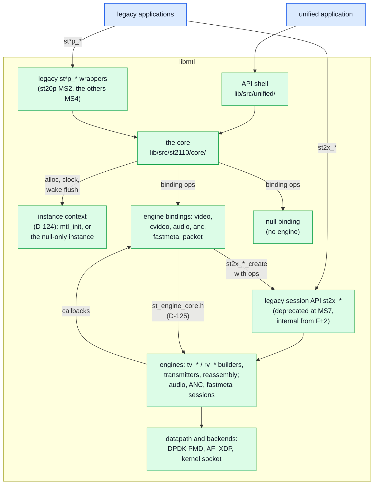

The callbacks on the upward arrow are, in full, `get_next_frame`, `notify_frame_done`,
`query_frame_lines_ready`, `query_ext_frame`, `notify_frame_ready`, `notify_slice_ready` and
`notify_detected` (the first rule below the table); packet units add one shared chunk expander
(MS5, [engine.md](engine.md) §6.2). The transmitters pace on tasklets (RL, TSC, TSN; PTP), and the datapath is
`mt_txq` / `mt_rxq`, TSQ and SRSS. The one-box version for a talk is
[presentation/slides.md, "The idea in one picture"](presentation/slides.md#the-idea-in-one-picture).

| Part | What | Where | Milestone |
|---|---|---|---|
| API shell | the installed headers' functions, each exported in its milestone (counts: `sketch/check.sh`); validates and stores the config and options (§2.1); selects the binding (§2.4); reasons, `mtl_last_error`, call classes; compatibility log lines (§1); no data-path state, no engine `ops` | `lib/src/unified/` in **libmtl**, nodes `MTL_UNIFIED_EXPERIMENTAL_<rev>_MSn` (D-23) | MS1 (task H1b) |
| core | the unit session (§3.1): slot table, descriptor ring, results, holds, nine session states, `ctl`/`ack` and `tick` (§5), waiting, the deferred `mt_wake` (§6), handles (§4.7), the transform state; reaches the instance through its context (§2.4), the engines only through binding ops (§2.1) | `lib/src/st2110/core/` in libmtl, header `st_core.h` (task C0) | MS1 (`ctl`/`ack`, `tick`: MS2) |
| instance context | allocation on a NUMA socket, the clock, the wake flush hook, the scheduler ID (§2.4) | declared in `st_core.h`, filled by the API shell | MS1 (C0, A1) |
| engine accessor header | every engine entry point a binding uses besides the callbacks | `lib/src/st2110/st_engine_core.h` ([engine.md](engine.md) §2.11, D-125) | MS1 (E1); grows per essence |
| bindings | one per essence and direction, plus `packet` and `null`: each implements the binding ops (§2.1) and the callbacks its engine already calls (§2.3); the only code that builds engine `ops` and includes engine headers | `lib/src/st2110/core/bind_*.c` | video and null MS1; others MS4; packet MS5 |
| legacy pipelines | `st*p_*` as wrappers on the core: `get_frame` = acquire seen as `st_frame`, `put_frame` = submit, `put_frame_abort` = release, `BLOCK_GET` = the core's wait, one legacy notifier for `notify_frame_done` and `notify_frame_available` | `lib/src/st2110/pipeline/` (about 7.9 k lines today, about 2.5 k after [inferred]) | st20p MS2, the others MS4 |
| legacy sessions | `st20_tx_create` and the other session calls stay exactly as they are: they are the engines' native interface, and the bindings are their clients | `lib/src/st2110/` | deprecated at MS7 (F), internal from F+2 (D-83, §1.1) |
| engines | today's builders, transmitters and reassembly, plus the changes of [engine.md](engine.md) §6 and one `tick` per session (the TX builder, the RX handler, §5) | `lib/src/st2110/`, `datapath/`, `dev/`, `mt_sch.c`, `mt_ptp.c` | per [engine.md](engine.md) §6 |
| null backend | `null:<n>` ports: a binding with no engine; a null-only instance runs without `mtl_init`; units complete at the launch instant of the null grid (§3.2) on the instance clock, and a TX unit loops to every RX session whose flow matches (§2.4) | `lib/src/st2110/core/bind_null.c` (D-111, D-124) | MS1 (task C2) |

Rules of the picture:

- **One implementation of record.** The frame ring, the blocking get, completion and stats exist
  once, in the core. The pipelines keep only what is theirs to keep (the `st_frame` view, the
  legacy flags), and become wrappers as soon as their essence is on the core, not at the end.
- **Bindings use the callbacks the engines already make.** Every TX engine pulls through
  `get_next_frame` (`st_tx_video_session.c:1922`, ST22 `:2444`, `st_tx_audio_session.c:765`,
  `st_tx_ancillary_session.c:937`, `st_tx_fastmetadata_session.c:718`) and reports through
  `notify_frame_done`; RX asks `query_ext_frame` (`st_rx_video_session.c:1273`) and reports
  `notify_frame_ready`, `notify_slice_ready` (`:1095`) and `notify_detected` (`:2803`). Today's
  pipelines are one implementation of exactly these (`st20_pipeline_tx.c:456-457`,
  `st30_pipeline_tx.c:294-295`, `st20_pipeline_rx.c:566`, `:595`) **[verified at HEAD]**. So
  frames and rows need no new engine entry point; packets need one shared chunk expander ([engine.md](engine.md) §6.2).
  ANC adds one create-time internal setter per direction in `st_engine_core.h` because
  `struct st40_frame` (20 entries) and `struct st40_rx_ops` are frozen ABI until F+2 (§1.1): TX
  `st40_tx_set_unit_source` (the wire records' layout, the internal bits; per frame TX keeps
  `get_next_frame` and its `st40_tx_frame_meta`); RX `st40_rx_set_unit_sink`, which installs the
  per-unit destination callback the ST40 RX engine lacks (the analogue of video's
  `query_ext_frame`) ([engine.md](engine.md) §2.11, D-149).
- **Bindings are wait-free.** They run on the tasklet with the session spinlock held
  (`st_tx_video_session.c:2682`, `st_rx_video_session.c:3516`): a CAS, a release store of
  PUBLISHED, one RMW of the event word and, when a target is armed, a mark in the loop's bitmap
  (§6.2). No lock, no allocation, no syscall. They are wait-free, except the queue push of MS2a
  (P2: a lock-free CAS whose retries are bounded by the pushes racing on one queue and two
  consumer transitions per call; S1 measures it). A log line goes only into the per-scheduler log
  ring ([engine.md](engine.md) §1.8; MS2a; in MS1 the legacy macros, at `dbg` and `err` only).
- **Why not a facade.** PR #1610 put a facade on the session layer and lost the application's
  timing: `frame->tv_meta = meta` overwrites what the facade wrote, so USER_PACING,
  USER_TIMESTAMP and user meta were ignored for every frame (`st_tx_video_session.c:1945`
  **[verified at HEAD]**; R7 in [legacy-internals.md](legacy-internals.md)).
  A binding *is* `get_next_frame`, so the meta it writes is the meta the engine keeps.
- **One library** (D-23, D-106, D-108): the API shell `lib/src/unified/` and the core are compiled
  into libmtl, with the unified functions in one version node per milestone; the nodes, the version script,
  the soname and the hiding of symbols are in [migration.md](migration.md) §7.2.
- **Binding pitfalls PR #1610 hit** (the video bindings set transport ops the same way): set the
  enabling flag together with its field (`ST20_RX_FLAG_ENABLE_VSYNC` with `notify_event`,
  `*_FLAG_FORCE_NUMA` with `socket_id`; PR #1610 set only the field, so RX VSYNC never fired and RX
  NUMA was ignored, D6, D7); never write the transport `refcnt` (D9 zeroed it in
  `get_next_frame`, which defeats the transport's own busy check); reject a second submit of a
  slot (D4 re-queued a frame in flight); never copy or convert in `notify_frame_ready` (D2: a 4K
  copy on the tasklet). PR #1610's defects D1…D10, and what of it each MS1 task can reuse, are in
  [legacy-internals.md](legacy-internals.md) §12.
- **The acceptance engine reads library log lines** (D-110, D-177). One file of the API
  shell, `lib/src/unified/compat_log.c`, prints the lines of the legacy pipelines that
  `tests/acceptance` parses, in the pipelines' format, for each unified video session:
  - at create, `st20p_tx_create(<n>), transport fmt …, input fmt: …, flags 0x…` and the RX twin
    (`st20_pipeline_tx.c:1175`, `st20_pipeline_rx.c:1104`; read by `RxTxApp.py:973-976` and
    `rxtxapp.py:349`, `:401`), `<n>` the shell's own create count per direction, as
    `st20p_tx_idx`;
  - at each stat dump, `TX_st20p(<n>), frame get try X succ Y, put Z, drop D`
    (`st20_pipeline_tx.c:680`, parsed at `application_base.py:424-426`), as deltas since the
    previous dump, which the shell keeps per session: X and Y the units leased (the core counts no
    failed acquire), Z the units submitted, D the units DROPPED, all from the core's cumulative
    counters ([engine.md](engine.md) §1.8).

  The core and the bindings print no compatibility line and keep no legacy counter. The engines'
  own lines (`tv_attach(…)`, `TX_VIDEO_SESSION(…)`) need nothing: the bindings pass the session
  name as the engine `ops.name`. `Compat.log_lines` (U) matches the output against the regexes
  copied from those parsers, with their `path:line`. The file leaves at F+2 with the legacy
  RxTxApp (§1.1).

### 1.1 The end state after F+2

At hiding stage F+2 ([migration.md](migration.md) §8.3) the legacy session headers become
internal and their functions local, and the layers shrink to those of the picture (D-178):

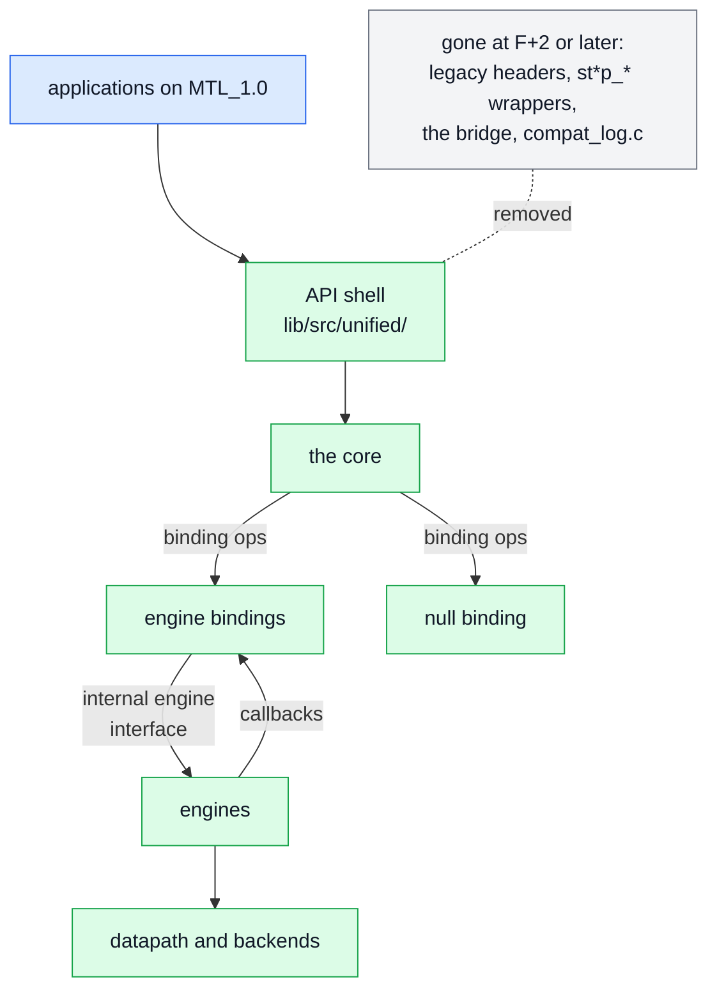

- **The internal engine interface** is the former session API (`st2x_*_create`, the `ops`
  structs, the callbacks). It has no ABI user left, so from F+2 it changes like any internal
  interface: the `st_engine_core.h` setters that exist only because a legacy struct was frozen
  (`st40_tx_set_unit_source`, `st40_rx_set_unit_sink`, `st41_rx_set_unit_sink`, the tasklet RX
  frame put) may fold into the `ops` or the callbacks. Until F+2 no legacy struct layout changes.
- **What leaves**: the `st*p_*` wrappers with the pipeline headers (F+2 or later, set at the MS4
  exit); the bridge `mtl_instance_from_legacy` with the legacy tier (migration.md §6.2);
  `compat_log.c` with the legacy RxTxApp (§1); the frozen pipeline-level tests
  ([implementation-plan.md](implementation-plan.md) §4.1).
- **What stays**: the API shell, the core, the bindings, the engines and the datapath; the
  session-level `KahawaiTest` suites, the engine's internal test on `mtl_internal_dep`, which task
  F2-1 moves into the unified harness ([implementation-plan.md](implementation-plan.md) §4.1).

## 2. The binding ops

The binding ops are the core's one interface below it (D-171). The core calls the ops of the
first table of §2.1; a binding calls the core functions of the second; nothing else crosses.
Three rules hold:

- **The core never reads a session's essence.** What differs per essence is either an op or a
  value the binding grants at create: the unit layout, the pool, the slot memory, the RX shape
  (§2.2), the admission grid (§3.2) and the transform stages (§3.1). A lint in C1a, the meson
  test `core_no_essence`, fails if `lib/src/st2110/core/st_core_*.c` names `essence` or an
  `MTL_<ESSENCE>` value.
- **The API shell chooses the binding** from one table indexed by the port's binding set
  (§2.4), the essence, the direction and the unit; it is the only place where an essence selects
  code. A missing entry is `-MTL_ENOTSUP` (`NOT_IMPLEMENTED`), naming `essence`.
- **One table for all.** `TestBinding` (the U tests of C1a–C1b), `bind_null` and every essence
  binding implement the same `struct st_core_binding_ops`; an optional op is NULL.

This section is the acceptance text of maintainer checkpoint 1 (task C0): `st_core.h` declares
exactly these ops and calls, each with its context and milestone in a comment.

### 2.1 The ops and the core calls

Contexts are those of [engine.md](engine.md) §1.2: CP control plane, DP data plane, DPC data plane with work in the
caller, TK tasklet.

| Op (the core calls) | Context | Called in | MS | Optional | Duty |
|---|---|---|---|---|---|
| `create(b, sc, flags, grant)` | CP | `mtl_session_create`; `mtl_session_query` (`ST_CORE_DRY_RUN`); `MTL_QUERY_CHECK_CAPACITY` (`ST_CORE_CHECK_CAPACITY`, MS5); update MEDIA or POOL (`ST_CORE_RECREATE`, MS5) | MS1 | no | check the essence member and the binding's keys; build the engine `ops` and session (not in a dry run); fill the grant (below). A failure leaves nothing behind (G-32) |
| `destroy(b)` | CP | close step 4 (detach); a failed create after `create` succeeded | MS1 | no | free the engine session; once it returns, no engine callback runs for the session |
| `start(b, when)` | CP | `mtl_session_start` | MS1 | yes | engine work at start (none for video in MS1: its callbacks read the session state) |
| `stop(b, mode)` | CP | `mtl_session_stop`, close step 2, after the core's flush CAS | MS1 | yes | engine work at stop (none in MS1) |
| `set_option(b, key, scope, value)` | CP | `mtl_set_options` on a key the binding owns, after create | MS1 | yes: without it the change is `-MTL_ENOTSUP` (`NOT_IMPLEMENTED`) | apply the key now, at the next start (S keys) or at a unit boundary through `apply` (R keys) |
| `info(b, info)` | CP | `mtl_session_get_info`, `mtl_session_get_status` | MS1 | yes | the engine's live values: the pacing class after RL training, TRS, TRO, VRX, `wire_bps` |
| `submit_prep(b, unit, desc)` | DPC | `mtl_tx_submit`, after the lease and media-time checks (and the APP → XFORM claim when the grant asks for it), before the QUEUED store | MS1 | yes | the layout check, the caller's work, the derived descriptor fields (below). Returns 0; a refusal (the slot goes back FREE, nothing is queued); or a failed result (the unit gets its `seq` and a FAILED result) |
| `dequeue_finish(b, unit, rec)` | DPC | `mtl_rx_dequeue`, after the slot is APP and the reaper lock is released | MS1 | yes | conversion, the zero fill of library pools (MS2a), the ANC decode (MS4a2), the packet copy of ring-RX (MS5) |
| `slot_free(b, slot)` | DP, TK, any thread | the core, when an RX slot reaches FREE: release, the last hold, `RX_LATEST` reclaim, discard | MS1 | yes; required when slots carry engine frames | give the engine its frame back (`rv_put_frame` through `st_engine_core.h`); wait-free |
| `apply(b, cmd)` | TK | the `tick` applying a command (§5) | MS2 | yes | the engine side of a command: flush a unit waiting for its launch, drop the unit in assembly, detach, swap the prepared headers (MS5), cut at the next packet (abort) |
| `update(b, parts, sc)` | CP | `mtl_session_update` with FLOWS or LEGS | MS5 | yes: without it `-MTL_ENOTSUP` | prepare the header templates and the worker work of §5 |
| `ring_ready(b)` | DP | the readiness predicate of a ring-RX target (§6.1) | MS5 | ring-RX only | a load-only test: at least `packet.rx_min_packets`, a marker, or `packet.rx_max_wait_ns` since the chunk's first packet; the ring binding's tick calls `st_core_event(s, lane 0)` when `packet.rx_max_wait_ns` passes or the threshold or a marker is crossed |
| `ring_take(b, slot)` | DP | `mtl_rx_dequeue` on a ring-RX session, under the reaper lock | MS5 | ring-RX only | move up to `packets_per_chunk` packets from the engine's RTP ring into the slot's packet table (the copy and the mbuf free are `dequeue_finish`'s, outside the lock) |

| Core call (a binding calls) | Context | Called from | MS | Does |
|---|---|---|---|---|
| `st_core_state(s)` | any | the engine callbacks | MS1 | the session state, one acquire load |
| `st_core_tx_pick(s, now, &pick)` | TK | `get_next_frame`; the null loop | MS1 | the descriptor at the pick cursor whose slot is QUEUED with its generation; runs the admission (§3.2); QUEUED → ENGINE with N and the launch instant, or completes a DROPPED unit and tries the next; "none" otherwise; wait-free, except the queue push (MS2a) |
| `st_core_admit(s, d, now, g, &out)` | any; pure | `st_core_tx_pick`; U tests | MS1 (C2) | the launch decision (§3.2) |
| `st_core_complete(s, slot, gen, &res)` | TK, WK, any | `notify_frame_done`, the PMD free callback, the stalled-queue worker | MS1 | the completion protocol (§4.2); wait-free, except the queue push (MS2a) |
| `st_core_set_verdict(s, slot, gen, status, reason)` | TK | the recovery verdict hook | MS1 | records the outcome the last reference publishes ([engine.md](engine.md) §5) |
| `st_core_rx_assign(s, key, &slot)` | TK | `query_ext_frame`, the ANC and fastmeta unit sinks, the audio frame path | MS1 (any FREE), MS2 (`RX_BY_INDEX`, `RX_LATEST`) | FREE → ENGINE, or the `RX_LATEST` reclaim; the first arrival recorded |
| `st_core_rx_publish(s, slot, gen, &rec)` | TK, any | `notify_frame_ready`, the DMA drain, the packet lcore, the due time (MS2) | MS1 | ENGINE → PUBLISHED with the next `pub_seq` (§4.4), through §4.2; wait-free, except the queue push (MS2a) |
| `st_core_progress(s, slot, gen, rows)` | TK | `query_frame_lines_ready`, `notify_slice_ready` | MS2 | rows: an RMW of `progress` that runs EVENT only at `want` (RW1, §6.1); wait-free, except the queue push (MS2a) |
| `st_core_event(s, lanes)` | TK, any | session events (MS3); the packet RX handler at a threshold and the ring binding's tick (MS5); library threads post instance events directly | MS3 | EVENT (§6.1); wait-free, except the queue push (MS2a) |
| `st_core_session_error(s, reason)` | any | `notify_event` (fatal error, recovery error) | MS1 | ERROR with the reason |
| `st_core_opt(s, key, scope, &v)` | CP | `create`, `start`, `set_option` | MS1 | the effective value of a key and whether it is present (the options paragraph below) |
| `st_core_opt_derived(s, key, scope, v)` | CP | `create` | MS1 | stores the value the binding derived for an absent key it owns; `mtl_get_option` returns it |
| `st_core_slot_alloc(s, layout)` | CP | `create` | MS1 | slot memory on the scheduler's socket through the instance context (§2.4) |
| `st_core_xform_claim`, `st_core_xform_done` | transform threads | the converter plugin host (MS2b), codec threads (MS4b) | MS2b | the XFORM claim and done (§3.1) |

- **The grant** that `create` fills: the layout, the pool count, the slot memory (the binding's
  own, or the core's through `st_core_slot_alloc`), the RX shape, the grid, the transform stages,
  the `mtl_session_info` values the binding owns and the derived values of absent keys it owns.
  `internal_bytes` is the binding's part (internal frames, the engine's mempools, the ANC wire
  areas) plus the core's (the slot table, the stats blocks), in a dry run as at create.
- **`submit_prep`** checks the layout (video planes and `used`, audio whole samples, the ANC
  table), does the work in the caller (conversion, the copy of `MTL_SUBMIT_SRC_PLANES`, the ANC
  encode from MS4a2) and fills the unit's derived descriptor fields (index span, packet count).
- The core calls every op with no core lock held. A TK op or call runs under the engine's
  session spinlock and is wait-free, except the queue push (MS2a) (§1). A DP op makes no
  syscall. No op calls a public function.
- Post-claim work (`dequeue_finish`, a converter's) stays inside the call's in-flight count, so
  CLOSE and X2 may wait out a conversion (8–20 ms).
- An op of a later milestone is NULL until then; the core treats NULL as "nothing to do" or as
  the R1 answer the table gives.
- `TestBinding` implements `create` and `destroy` and whichever others its test needs.
- A frame-level device's completion context registers the instance context's flush hook, so it
  is a library loop for M1 (§6.2); a transform thread is any other thread: one direct wake per
  armed unit.

**Options** (D-172). The API shell validates every key against the option table
(`lib/src/unified/mtl_options.def`: type, range, when, scope, the object, essences, directions
and units it applies to, contract.md §12) and stores the effective values in the object; it never
writes an engine field. Each row names its owner, the part that applies the key and derives its
default; any part may read a key's effective value with `st_core_opt`:

| Owner | Keys (examples) | Applied |
|---|---|---|
| `SHELL` | instance and port keys, `log.*` | at open, into `mtl_init_params`, the port configuration or the null-only instance; R keys by the shell |
| `CORE` | `tx.late_policy`, `tx.snap_mode`, `tx.snap_tolerance_ns`, `tx.horizon_ns`, `tx.index_offset`, `rx.incomplete`, `rx.flush_offset_ns`, `rx.rows_step`, `session.epoch_tick` | by the core, at create and at the key's C/S/R point |
| `BINDING` | `video.*`, `cvideo.*`, `audio.*`, `anc.*`, `fastmeta.*`, `packet.*`, `rx.burst`, `rx.threads`, `rx.convert_per_packet`, `rx.skew_budget_ns`, `session.tx_queue`, `session.numa`, `caps.*` | by the binding's `create`; after create through `set_option`, else `-MTL_ENOTSUP` (`NOT_IMPLEMENTED`) |

Where a binding derives an `ops` value that a key also sets, a present key wins and is checked
against the binding's constraint, never overwritten: today `video.start_vrx` and
`video.disable_bulk` against the TLINE/2 cap and the W bound of [contract.md](contract.md) §3.3,
a value they refuse being `-MTL_EINVAL`, `OPTION_RANGE`, naming the key, with the cap in
`detail`. For an absent key the binding stores what it derived (`st_core_opt_derived`), which
`mtl_get_option` returns.

### 2.2 The two RX shapes

An RX unit takes one of two shapes, and the binding's grant names which (D-174):

| | slot-RX | ring-RX |
|---|---|---|
| units | every frame and rows unit of every essence | packet units (`MTL_UNIT_PACKETS`) of every essence and `MTL_RTP` |
| the unit exists | in a core slot from its first packet: the engine asks the binding (`query_ext_frame`, the ANC and fastmeta unit sinks, the audio frame path), which calls `st_core_rx_assign`; the completer publishes it in `pub_seq` order | as packets in the engine's RTP ring; `mtl_rx_dequeue` forms the chunk in a FREE slot (`ring_take`, then `dequeue_finish`) |
| ready for dequeue | a PUBLISHED slot at the dequeue cursor | `ring_ready` |
| `MTL_SESSION_RX_BY_INDEX`, `MTL_SESSION_RX_LATEST` | yes | `-MTL_EINVAL` at create, naming `flags`: a chunk has no media index |
| `MTL_SESSION_RX_NO_FILL`, `rx.incomplete` | yes (library pools) | the flag `-MTL_EINVAL`, the key `NOT_APPLICABLE`: a chunk is never incomplete |
| the due time (§6.4) | force-completes the unit (video MS2; the others with their tick) | `packet.rx_max_wait_ns` bounds a chunk |
| `mtl_session_discard` | ENGINE and PUBLISHED units to FREE, counted in `rx.units_flushed` | the packets in the ring are dropped and counted |
| `missed_before`, per-unit `mtl_rx_get_detail` | yes | no |
| `unit.hold`, `mtl_release` from any thread | yes | yes ([contract.md](contract.md) §13) |

Fastmeta frame RX is slot-RX through `st41_rx_set_unit_sink` ([engine.md](engine.md) §2.11, E16, MS4a1), the pattern of
ANC's sink: the engine assigns a core slot per new RTP timestamp, copies each data item into the
slot's wire area, and the unit is published when a packet of the next timestamp arrives or its due
time passes. So every slot rule holds for every frame unit with one definition, and ring-RX is the
packet path only.

### 2.3 Bindings per essence

Every binding implements the ops of §2.1; the table gives the engine callbacks each one implements
and the engine work it needs.

| Essence × direction | Callbacks the binding implements | Engine work it needs |
|---|---|---|
| video TX, frames | `get_next_frame` (the descriptor at the pick cursor if its slot word is QUEUED with its generation; N from `st_core_tx_pick`, §3.2; the meta; ENGINE), `notify_frame_done` (the completion CAS, the result) | MF1 (`st_tx_video_session.c:134-139`), MF7, the recovery verdict ([engine.md](engine.md) §5); idle descriptor cleanup ([engine.md](engine.md) §2.3); "last packet handed" for no-chain (MS2) |
| video TX, rows (MS2) | the same, with the session created `ST20_TYPE_SLICE_LEVEL`; `query_frame_lines_ready` returns `rows(progress)` only (an acquire load), or the TRUNCATE code that ends the frame early | the TRUNCATE return code and `sc.video.troffset_us` ([engine.md](engine.md) §2.13); the rest is today's slice path (`st_tx_video_session.c:2005-2033`) |
| video RX, frames | `query_ext_frame` hands the engine a core slot (MS1: any FREE; MS2: attached pools, by index, or the oldest unread with `RX_LATEST`) and records the first arrival; `notify_frame_ready` publishes it with the next `pub_seq` | incomplete delivery always on; the RX hook never refuses (SF-45); MF4; a tasklet-callable frame put and the frame count ([engine.md](engine.md) §2.11) |
| video RX, rows (MS2) | `notify_slice_ready`: an RMW of `progress` that runs EVENT only at a reader's `want` (RW1, §6.1) | none |
| per-packet conversion | the engine's `uframe_pg_callback` path, installed by the video RX binding (library code, the one tasklet conversion contract.md §9.7 allows) | none |
| cvideo TX/RX (MS4) | the ST22 `get_next_frame` (`st_tx_video_session.c:2444`) and RX callbacks; codecs on the transform state | per-unit status, stats, CBR (E10), SF-42 |
| audio TX/RX (MS4) | `get_next_frame` (`st_tx_audio_session.c:765`), done, RX ready | "last packet handed" (done fires at build today, `:923-925`); media time from the sample index; carry buffer (E6) |
| ANC TX/RX (MS4a2) | TX: `get_next_frame` (`st_tx_ancillary_session.c:937`) fills `st40_tx_frame_meta` and returns frame 0 or the carrier 1; the engine sends the wire records of `st40_tx_set_unit_source`. RX: `st40_rx_set_unit_sink` gives a core slot per new timestamp; the binding decodes at dequeue (detail below the table) | E7, E12, UDW |
| fastmeta TX/RX (MS4a1) | TX: `get_next_frame` (`st_tx_fastmetadata_session.c:718`), done. RX: `st41_rx_set_unit_sink` gives a core slot per new RTP timestamp, slot-RX (§2.2); today `st_rx_fastmetadata_session.c:183`, `:205` are RTP-only | keep-alive; the unit sink (E16) |
| packet units, every essence (MS5) | one shared chunk expander on the TX tasklet (header mbufs plus extbuf attaches, one `shinfo` per chunk whose `free_cb` completes the chunk) feeding the engine's existing RTP ring; RX chunks made at dequeue from `rtps_ring` (ring-RX, §2.2) | PE1 as one helper (about 250 lines [inferred]) + about 10 lines per TX engine where it dequeues `packet_ring`; PE2–PE8 |
| null | none: completes units at the launch instant `st_core_admit` gives with the null grid (§3.2) on the instance clock (synchronously under the test clock) and loops each TX unit to the RX sessions whose flow matches (§2.4) | none |

**ANC.** TX: `get_next_frame` (`st_tx_ancillary_session.c:937`) takes the descriptor, decides the
index and the late policy, fills `st40_tx_frame_meta` (TAI TFST, `second_field`, `rtp_timestamp`)
and returns frame 0 or the carrier 1, O(1); the engine sends the slot's wire records set up by
`st40_tx_set_unit_source` ([engine.md](engine.md) §2.11), 16 per call; `notify_frame_done` is the completion. RX:
`st40_rx_set_unit_sink` gives a FREE core slot per new timestamp; the engine copies payloads into
its wire area; `notify_frame_ready` publishes it; the binding decodes at dequeue. st40p is
re-based on the core in MS4a2 (N6a, N6b).

UB tests drive the real engine through the bindings, so they survive refactors of the engine
internals.

### 2.4 The instance context and the null-only instance

The core never sees `struct mtl_main_impl*`. It takes an instance context (D-124), filled by the
API shell and declared in `st_core.h` (task C0):

| Member | NIC or mixed instance | Null-only instance |
|---|---|---|
| allocate and free on a NUMA socket | `mt_rte_zmalloc_socket` with `mt_socket_id(impl, port)` | the same over EAL memory without hugepages |
| clock: TAI now and TSC | the instance clock of [engine.md](engine.md) §2.12 and `mt_get_tsc` | the instance clock, or the test clock under `MTL_FAULT_TEST_CLOCK` |
| wake flush hook | called by `sch_tasklet_func` after its handler loop, its return added to `pending` (§6.2) | called by the instance's loop thread |
| scheduler ID of the calling context | the scheduler's index | 0 |

The scheduler ID selects the pending wake bitmap (§6.2), the stats block ([engine.md](engine.md) §1.8) and the log ring.
With this interface the core and the null binding build and run in the unit tier without a NIC,
and a binding is the only core file that includes engine headers.

A **null-only instance** (only `null:<n>` ports) does not call `mtl_init`:

- **EAL.** It initialises EAL itself with `--no-huge --no-pci --in-memory`, or accepts an EAL the
  process already initialised. Today's init path cannot share an EAL: `dev_eal_init` keeps a
  function-static `eal_initted` and refuses a second init with `-EIO` (`dev/mt_dev.c:324`,
  `:499-502`), and it does not know an EAL it did not start **[verified at HEAD]**; the open
  order across instance kinds is a contract rule ([contract.md](contract.md)).
- **Loop.** A library thread is its loop: it runs the null binding's completions and the wake
  flush, as a scheduler would (a TK context, [engine.md](engine.md) §1.2), pinned at creation ([engine.md](engine.md) §1.5).
- **Test clock.** Under `MTL_FAULT_TEST_CLOCK` the clock moves only by `MTL_FAULT_CLOCK_ADVANCE`,
  and the completions that fall due run synchronously inside that call on the caller's thread, in
  `seq` order, so a test sees one deterministic sequence (G-92). The loop thread parks; ADVANCE
  marks the completions like the loop and runs the flush with no bound before it returns (§6.2), so
  the production path runs and the order stays deterministic.
- **Loopback.** A TX unit completes at its scheduled instant and is delivered to every RX session
  whose flow (destination IP and UDP port) matches (D-111).

**Ports and binding sets.** The shell reads each port's prefix once at open and gives the port to
the side that opens it; the binding set decides which bindings a session on that port gets:

| Port name ([contract.md](contract.md) §2.1) | Backend | Opened by | Binding set |
|---|---|---|---|
| PCI BDF; `env:<VAR>[#n]`, resolved to a BDF first | `MTL_BACKEND_DPDK_PMD` | `mtl_init`, from the shell's port list | the engine bindings |
| `kernel:<ifname>` | `MTL_BACKEND_KERNEL_SOCKET` | `mtl_init` | the engine bindings |
| `native_af_xdp:<ifname>` | `MTL_BACKEND_AF_XDP` | `mtl_init` | the engine bindings |
| `null:<n>` | `MTL_BACKEND_NULL` | the shell: taken out of the list before `mtl_init` (whose `mtl_pmd_by_port_name`, `mt_util.c:967`, never sees it), so nothing in `lib/src/dev/` changes (D-111) | `bind_null` |
| `dpdk_af_xdp:`, `dpdk_af_packet:` | removed (D-112) | none: open fails with `BACKEND_REMOVED` | — |

- An instance whose ports all belong to engine-less sets (today only `null:`) skips `mtl_init`:
  the null-only instance above.
- Every leg of a session is on ports of one binding set: a `flows[1].port` of another set is
  `-MTL_EINVAL` (`INVALID_ARGUMENT`), naming the field.
- The shell's binding table (§2) is indexed by binding set, essence, direction and unit.

### 2.5 Extending the core

Three kinds of extension, each with the core untouched (D-179); a change that needs a core
edit is a design change and gets a D-row.

- **A new essence** (an IPMX USB or InfoFrame stream, a later ST 2110 part):
  1. an `enum mtl_essence` value, known from its header revision and `-MTL_ENOTSUP` until built
     (R1);
  2. its config member appended at the end of `mtl_session_config` (R3: the library reads
     `min(struct_size, known)`, so older callers keep working), and its keys in a new range of
     `mtl_options.h` with their applicability masks ([contract.md](contract.md) §12.5);
  3. a binding per direction implementing §2.1, with its RX shape (§2.2), its grid row in
     [timing.md](timing.md) §6.8 and its row in §2.3;
  4. an engine, or none (as `null`), with its entry points in `st_engine_core.h`;
  5. its entries in the shell's binding table (§2).
- **A new backend.**
  - Packet level (RDMA verbs, a new socket type): below the engines, in `lib/src/datapath/` and
    `lib/src/dev/`, with a row in §2.4's port table (opened by `mtl_init`, the engine bindings),
    an `enum mtl_backend` value and its `caps.*` keys ([engine.md](engine.md) §1.7). No binding is backend-specific, so
    no binding changes.
  - Frame level (a DPU that packetises ST 2110-20, a Rivermax-style media API): there is no
    `tv_*` engine, so it is an engine-less binding set like `null`: a port-table row, bindings
    that implement §2.1 and complete units with `st_core_complete` from the device's completion
    context (`mt_wake` picks the wake path by context, §6.2), and a grid from the device's timing
    model.
- **A transport feature** (payload encryption, RTCP sender reports, an RTP header extension):
  payload work is a transform stage (§3.1); header fields are a builder hook of the engine, listed
  in `st_engine_core.h`. Neither adds a slot state or a core word.

## 3. A unit through the core

The core owns the units and their states; a binding is the engine's callbacks plus the ops of
§2.1, written against the core. The two pictures follow one video frame through the layers in
MS1, TX first, with the ops and core calls of §2.1 on the arrows. The slot states they name are
§3.1's.

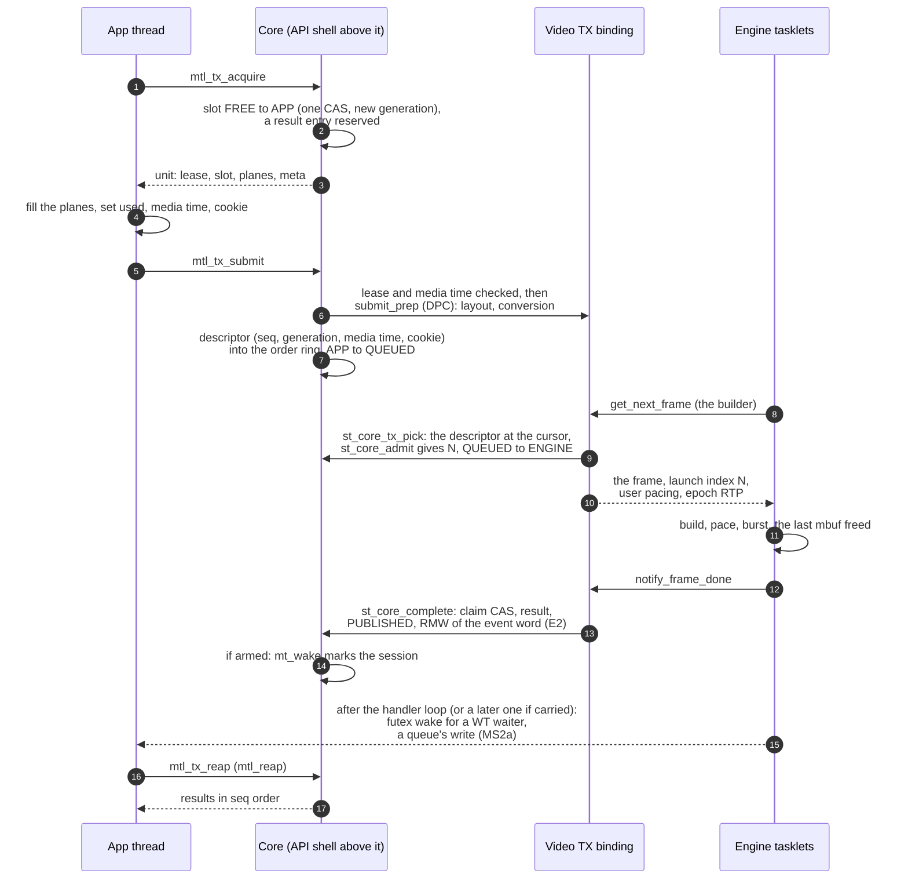

With results off the completion stores FREE instead of PUBLISHED. At `get_next_frame` the binding
calls `st_core_tx_pick` (step 9), which takes the launch decision with `st_core_admit` and the
binding's grid (§3.2): N, or a DROPPED unit that completes at once. The binding then drives the
engine with user pacing and the epoch RTP (step 10), so the engine's own late notification never
fires for a core session ([engine.md](engine.md) §2.12). A failed first submit (step 6) returns the slot FREE. The steps
of the completion (step 13) are §4.2; the wake (steps 14 and 15) is §6: a waiter in a call with a
timeout gets a futex wake, an event loop its queue's write (MS2a), both after the handler loop
that completed the unit or a later one when the flush bound carries it (D-142).

RX runs the other way: the engine asks the binding for a slot when a new frame's first packet
arrives, and the application dequeues what the binding published. The RX rules are
[contract.md §5.3](contract.md#53-rx).

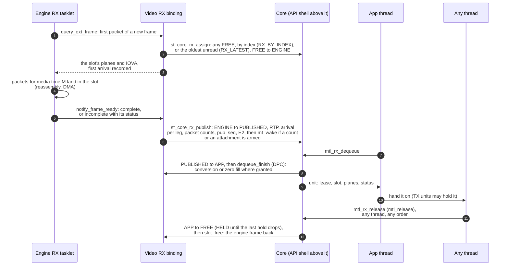

From MS2 a unit whose due time passes is force-completed: the first arrival (earliest leg) + the
unit period + `rx.flush_offset_ns` (§6.4,
[timing.md §11.7](timing.md#117-due-time-completion-and-2022-7-skew)).

### 3.1 The slot table

One state machine serves both directions, because a TX result and an RX unit are the same
thing for the reader: something published to read. A TX slot moves as the first picture shows:

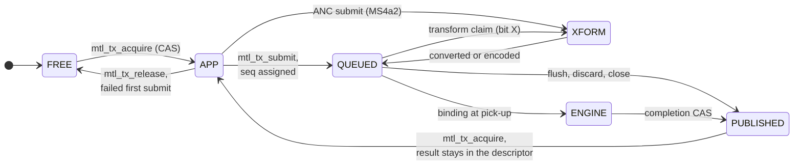

An RX slot moves as the second picture shows:

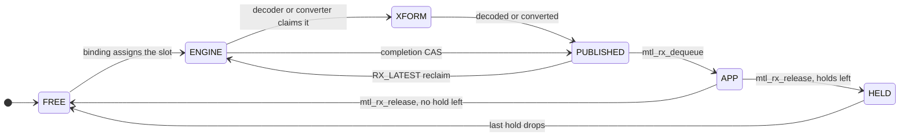

The pictures leave out the exits that end a unit without a result: with results off a TX
completion goes from ENGINE (or QUEUED, when flushed) straight to FREE; RX discard takes ENGINE or
PUBLISHED to FREE; a refused ANC unit goes XFORM to FREE, and a failed conversion ends XFORM with
a failed result. The table names every exit and who takes it. XFORM is used from MS2 (converter
plugins) and MS4 (codecs); MS1 converts in the caller.

| State | TX | RX | Who moves it out |
|---|---|---|---|
| FREE | acquirable | assignable by the engine | `mtl_tx_acquire` (CAS); the RX binding |
| APP | leased, writable | dequeued, readable | `mtl_tx_submit`, `mtl_release` |
| QUEUED (+ bit X: needs transform) | submitted, `seq` assigned | — | the binding at pick-up; a transform claim; a control-plane CAS for flush and discard |
| XFORM | a converter or encoder owns it | a decoder or converter owns it | the transform's done |
| ENGINE | picked up (in flight) | receiving | the completion CAS (TX done; RX ready, due time); RX discard (applied by the `tick`, §5): the completion CAS straight to FREE, counted in `rx.units_flushed`, never PUBLISHED |
| PUBLISHED | result in its descriptor; the slot is acquirable again | unit readable | TX: `mtl_tx_acquire` (the result stays in the descriptor, §4.4); RX: `mtl_rx_dequeue`, `RX_LATEST` reclaim (tasklet CAS back to ENGINE), RX discard (control-plane CAS to FREE, counted in `rx.units_flushed`) |
| HELD | — | released while TX units still hold it | the last hold drops (CAS to FREE) |

- **The slot word** (D-118). One 64-bit atomic per slot, whose layout D-118 states: the state,
  the transform bit X, the claim bit C, the transform stage `xs` (0 until Phase 7, D-176), the
  hold count and the generation. Acquire (TX) and dequeue (RX)
  write the new generation in the CAS that takes the slot; tasklet CASes carry the generation
  through unchanged; release, submit, hold changes and every tasklet CAS compare the whole word, so
  a stale lease or a late completer fails on the generation or the state, never on a second check.
- **The completion CAS is the claim.** One CAS moves the word out of ENGINE (or out of QUEUED for a
  control-plane flush) to the same state with bit C set, so a second completer (the free callback
  against recovery, SF-39) fails by construction; no separate claim word. The winner alone writes
  the result, then release-stores PUBLISHED.
- **Completion protocol** (§4.2, §6.1): claim, write the result, store PUBLISHED (release), then E2
  on the event word; `mt_wake` only if a count or an attachment is armed.
- **Order.** `seq` is the position in the descriptor ring (§4.4), so one ring gives pick-up
  order, result order and reap order. Acquire reserves a result entry through the `resv` counter
  (§4.4); with results off the completer stores FREE.
- **Generation** advances whenever a lease is made (TX `mtl_tx_acquire`, RX `mtl_rx_dequeue`) and
  is written by that application thread inside the slot-word CAS, so a tasklet never changes it;
  leases are `{session:16, slot:16, generation:32}` (§4.7).
- **Holds**: `unit.hold` on a TX submit adds one to the RX slot word's `holds` field (at most 255),
  and the TX unit's terminal outcome removes it.
- **Progress**: `progress` (`used`) carries rows and packets in the same slot (§2.3), plus the
  `want` of a waiting rows reader (RW1, §6.1). For rows units `used` counts rows and 0 is legal,
  because the slot is claimed before row 0 exists.
- **APP → XFORM**: an inline transform in submit (ANC), the same exits as a converter's.
- **Transform stages** (Phase 7; D-176). A session whose units pass several transforms runs
  them as a chain of at most four stages in a fixed order, TX convert → encode → encrypt (RX the
  reverse). Each stage is a claim and a done on the same slot: QUEUED+X with `xs` = k → XFORM, and
  done to QUEUED+X with `xs` = k + 1, or to QUEUED without X after the last stage. A session with
  one transform keeps `xs` = 0. Payload encryption is the last TX stage of a cvideo session, run
  by a codec or crypto worker, because its codestream exists only after encode
  ([nmos-ipmx.md](nmos-ipmx.md) §20). The slot word is internal, not ABI: the bits are named now
  only so that C0 does not spend them.

Today's st20p TX frame states (`st20_pipeline_tx.h:12-19`) map onto these: FREE = FREE, IN_USER =
APP, READY = QUEUED with X, CONVERTED = QUEUED, IN_CONVERTING = XFORM, IN_TRANSMITTING = ENGINE,
DROPPED = PUBLISHED with an `MTL_TX_DROPPED` result. st20p has no HELD and keeps no result: it
stores FREE before it notifies ([engine.md](engine.md) §2.1).

### 3.2 Admission: the launch decision

Every TX unit's launch index is decided once, at pick-up, by one core function (D-173; D-131
stands: the binding takes the decision at `get_next_frame`, by calling the core). The picture
shows the path; the rules, the outcomes and every essence's grid are
[timing.md](timing.md) §6.8, their one home.

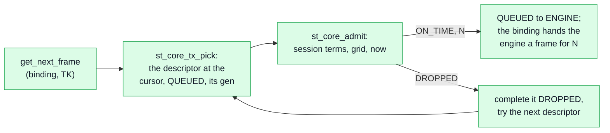

`st_core_tx_pick` takes the descriptor at the pick cursor and calls `st_core_admit`. On
`ON_TIME` the slot goes QUEUED → ENGINE with N and its launch instant, and the binding turns them
into its engine's frame meta; on `DROPPED` the unit completes at once through §4.2 and the next
descriptor is tried. A binding supplies only its grid, filled in `create` (§2.1):

```c
struct st_core_grid {     /* the essence's part of the launch decision, fixed at create */
  uint64_t rate_num;      /* index rate, reduced: frames, fields, samples or units */
  uint64_t rate_den;
  int64_t first_off_ns[2]; /* first-packet time of N minus its media time, for even, odd N */
  int64_t lead_ns;        /* pick-up lead: N's deadline = its first-packet time - lead */
  int64_t exact_lo_ns;    /* MTL_SUBMIT_EXACT window: now + lo <= t <= now + hi */
  int64_t exact_hi_ns;
  uint32_t defer_step;    /* a defer moves N by whole steps: 1, or 2 for fields */
  uint32_t index_bytes;   /* 0: a unit is one index; else used / index_bytes indices (audio) */
};
/* Pure: reads the descriptor, the session's terms and its last N; writes only *out. */
int st_core_admit(const struct st_core_session* s, const struct st_core_desc* d, int64_t now,
                  const struct st_core_grid* g, struct st_core_admit_out* out);
```

`struct st_core_admit_out` carries N, the launch instant, the status (`MTL_TX_ON_TIME`,
`MTL_TX_DROPPED`), the reason, the flags (`MTL_TXR_DEFERRED`) and `indices_skipped_before`.

- **Pure.** It allocates nothing, reads no clock and writes only `*out`. Its U test is a table,
  `Admit.table`: every row of timing.md §6.8 with the video, audio and null grids, interlaced
  parity included (`Tai.interlaced_parity`). So the U tier proves the rule every binding runs.
- **The session's terms are the core's**: media mode, `tx.late_policy`, snapping,
  `min_tx_delay_ns`, `media_time_offset_ns`, `tx.horizon_ns`, the last N. The grid never repeats
  them.
- **Owners.** C2 writes it beside `st_rate.h` and gives `bind_null` its grid; C1b's
  `st_core_tx_pick` calls it from C2 on; B1 fills the video grid once at create from
  `st20_tx_get_pacing_params`. A later binding adds a grid row to timing.md §6.8, never a copy of
  the rules.

## 4. Lease table and result materialisation

### 4.1 Layout

The slot table of §3.1 and the descriptor ring of §4.4, one each per session, in hugepage memory on
the scheduler's NUMA node, split by writer so that the completing context and the application write
one cache line together only at hand-over:

| Part | Fields | Writer |
|---|---|---|
| slot word and tasklet fields (own cache line per slot) | the 64-bit slot word (§3.1); `progress`; the RX unit record (frame meta, per-leg arrival, packet counts) | the application only at hand-over (acquire, submit, dequeue, release, hold changes); the binding and every completing context by CAS, generation preserved |
| per-slot template (application half) | planes, meta pointer, the static layout (≈ 130 B) | the control plane at create and attach |
| descriptor ring entry (64 B, one line) | `{seq:48 \| slot:16}`, generation, media time, launch, flags, `used`, cookie, …; after completion the result in place | the application at submit, in one line; the completer writes the result; the reaper reads it |
| session lines (the register below) | `.app`: `resv`, submit tail, `reap_seq`, dequeue cursor, reaper lock; `.tk`: pick cursor, `pub_seq`, `ack`; `.cp`: constants, `ctl` | application threads; completing contexts; the control plane |

The application writes the slot word only at hand-over: one line transfer per hand-over, which is
inherent. Fields of `struct mtl_tx_result_full` beyond the 64-byte entry (the timing record, E4)
sit in a side array indexed like the ring.

The static part of a unit is copied by acquire and dequeue into the caller's `struct mtl_unit`
(208 B, `MTL_SIZE_CHECK(mtl_unit, 208)` in `mtl.h`), with the per-use fields zeroed (TX) or filled
(RX): an estimated 10–20 ns per call on a warm line, within the dense-audio budget of
implementation-plan.md §8.4 (D-184); the DP-call micro-benchmark of implementation-plan.md §8.4 measures
it, and a pointer form comes only if it shows. Submit reads only the lease and the per-use fields of
the unit and uses its own copy of the slot layout, never the unit's `plane[]` or `meta` outputs, so
an application that scribbles on them changes nothing. `mtl_rx_get_detail()` is a plain copy of
the RX unit record without a lock, because the record is stable while the slot is APP.

**The state register** (D-180). Every word the core shares between contexts, grouped by the
64-byte line its writers share. Task C0 writes each row as the field's comment in `st_core.h`, in
the form below, and the lint `lib/src/st2110/core/check_register.sh` fails when a field of a
`struct st_core_*` lacks it or names a G-, WH-, WC- or QW- id that implementation-plan.md §8.2 and
design/wait-tests.md do not define; from the MS1 exit commit it also fails when a named
`Suite.case` is absent from `tests/unit/` (the suites marked new here are written by C1a–C2).
C0's commit then replaces this table with a link. The `pahole` output of the structs is in C0's
commit message. The wait words (line A, the in-flight line's `intr`, line C, `progress.want` and
the queue entries) are the table of §6.1, which is this register's part for them.

```c
/* W: <writers> R: <readers> ord: <relaxed|acquire|release|acq_rel|seq_cst|plain|const>
   reset: <create|use|Y1|never> test: <G-n|WHn|WCn|QWn|Suite.case>[, ...] */
```

`plain` means written only under a lock or before publication; `const` means fixed at create
and read after the state store that publishes it. `use` means rewritten for each lease or
submission. The columns are writer (W), reader (R), ordering (ord), reset and test.

| Line (struct) | Field | W | R | ord | reset | test |
|---|---|---|---|---|---|---|
| slot (`st_core_slot`, one line per slot, scheduler node) | `word` (layout: [D-118](decisions.md); `xs` the transform stage, D-176) | app (acquire, dequeue: CAS with a new gen; release, submit, holds), binding and completers (CAS, gen kept), CP (flush, discard CAS) | all | acq_rel CAS; the publish a release store (E1), then E2 on the event word | create (FREE, random gen) | G-05, G-07, G-49 |
| slot | `progress` (rows, ended, `want`: §6.1) | RW1 (the RX binding), RW2 (the reader), the TX app (re-submit) | the other side | RMW | use | G-113 (MS2a), WC4 |
| slot | the RX unit record (meta, arrival per leg, packet counts) | the RX completer, before E1 | the app after dequeue | plain (published by E1) | use | `Rx.incomplete_status` |
| template (`st_core_slot_tmpl`) | planes, meta pointer, layout | CP at create, attach | all | const | create | `Ub.submit_carries_meta` |
| descriptor (`st_core_desc`, 64 B) | `{seq:48\|slot:16}`, gen, media time, launch, flags, `used`, cookie; the result in place | submitter (before its APP → QUEUED CAS); the completer (the result, before E1) | the binding (after the QUEUED load), the reaper | plain | use | G-08, G-09 |
| session app line (`.app`) | `resv` | acquire (CAS), release (sub) | acquire | acq_rel | create | G-04 |
| `.app` | submit tail | submit (plain; CAS with `MTL_SESSION_MT_SUBMIT`) | submit | plain / acq_rel | create | G-08 |
| `.app` | `reap_seq` | the reaper (E1, then E2 with lane 0) | acquire (`resv` check), the reaper | release | create | G-09 |
| `.app` | RX dequeue cursor | the reaper | the reaper | plain (reaper lock) | create | G-70 |
| `.app` | the reaper lock | `mtl_reap`, `mtl_rx_dequeue` (the claim only, D-203) | same | TTAS spinlock (§4.4, D-183) | create | `Ub.reap_mp` |
| session tasklet line (`.tk`) | pick cursor | the binding | the binding; CP flush with the session detached | plain (one writer) | create | G-08 |
| `.tk` | `pub_seq` | RX completers (fetch_add) | dequeue | acq_rel | create | `Rx.order_pub_seq` |
| `.tk` | `ack` (MS2) | the `tick` | CP | release | create | G-80 |
| `.tk` | `provide_gen` (MS2b) | the RX binding at the stop, discard and detach acks | `mtl_session_get_status` | release / acquire | create | G-137 |
| session CP line (`.cp`, read-mostly) | ring mask, slot count, pointers, scheduler index | CP | all | const | create | `Core.layout` |
| `.cp` | `ctl` (MS2) | CP | the `tick` | release / relaxed load | create | G-80 |
| stats blocks (own lines) | the home scheduler's, the application threads' and the library threads' blocks at create; a foreign scheduler's when a shared TX queue gains a session of it (D-202) | that context | stats readers (sum) | relaxed | never (G-42) | G-42, `Core.stats_blocks_at_create` |
| debug owner flags (debug builds) | one per externally serialised entry | that entry (CAS for its duration) | same | acq_rel | create | `Debug.overlap` |
| entry (`st_core_entry`) header | `gen` | CP at create and Y1 | every lookup | release / acquire | Y1 (advance) | G-07 |
| entry header | `state` (nine states) | CP; a tasklet's ERROR entry (CAS); X1 by the last release | all | seq_cst | Y1 (CREATED, last) | G-49 |
| entry header | `closed_by_instance` (D-186) | the instance's close (CP) | every call's entry check (`-MTL_ESHUTDOWN`) | release / acquire | Y1 | `UnifiedRx.ReleaseAfterInstanceClose` |
| entry in-flight line | `inflight` | every data call | close, retire (X2), a queue's close (C2) | seq_cst add, release sub | never | WH11, WH14b |
| entry in-flight line, line A, line C | the wait words | §6.1's table | §6.1's table | §6.1's table (orderings) | §6.1's table (resets) | WC1–WC5, QW1–QW19 ([design/wait-tests.md](design/wait-tests.md) §5) |
| process | the orphan-list head (D-186) | the last release of a session whose instance is gone (CAS, DP) | the control-plane entry `st_api_cp_enter` (drains it) | acq_rel | never | `CoreClose.orphan_freed_at_next_cp` |
| session table | `hw` | create | the walk | seq_cst | never | WH10 |
| loop (`st_core_loop`, the scheduler's node) | `L0`, `L1`, `L2`, `cursor` | the loop's own thread | same | relaxed | never | WH16 |
| loop | `wake_k` | CP at attach and detach | F2 | relaxed | create (1) | `WaitFlush.count_bound` |
| loop | `wake_carried`, `wake_syscalls` | the loop | stats readers | relaxed | never | WH16 |

The lines of a session follow the writer classes:

- `.app` is written only by application threads;
- `.tk` only by completing contexts;
- `.cp` is read-mostly;
- the in-flight line (with `intr`) and line A sit on lines of their own; line A is written by
  tasklets and by sleeping or arming threads, never by probes.

So the builder's idle poll (the pick cursor, the state) never shares a line with `resv` or
`reap_seq`, which every DP call writes.

### 4.2 The completing-context protocol

Whatever context completes a unit (§4.3) runs the same five steps against the unit's slot word,
its result and the object's event word; the reader, an application thread under the reaper lock,
only ever looks at the slot word and the result. The picture shows the steps in order, and the
lists below give each one exactly.

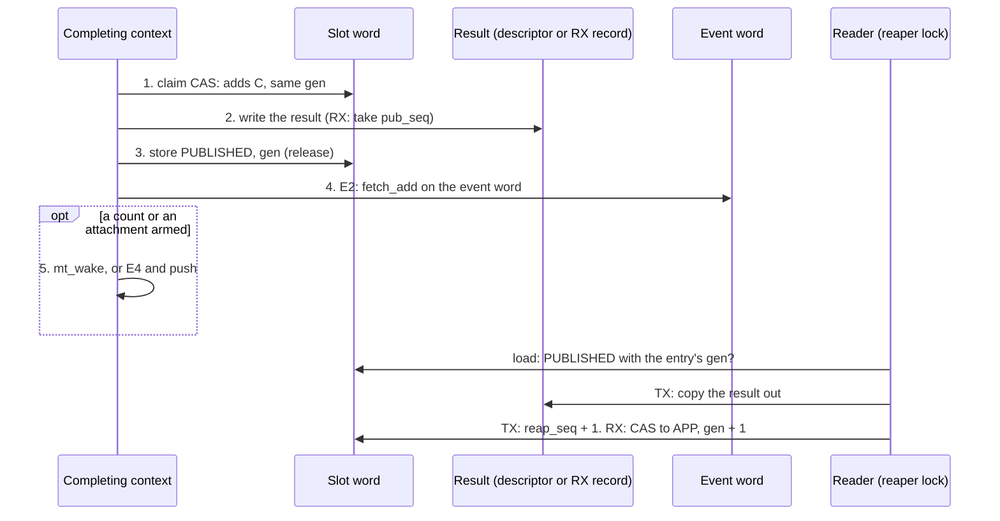

The completing context:

1. **Claim**: CAS the slot word ENGINE|gen → ENGINE+C|gen (a control-plane flush:
   QUEUED|gen → QUEUED+C|gen).
2. **Write the result**: TX into the unit's descriptor, RX into the unit record (RX: take
   `pub_seq`).
3. **Publish**: store the slot word = PUBLISHED\|gen (release). With results off it stores FREE.
4. **E2**: one `fetch_add` on the object's event word (acq_rel), which returns its counts and
   attachment bits (§6.1); no fence.
5. A count on a lane of the event: `mt_wake(object, lanes)`; an attachment bit (MS2a): E4 claims
   it and pushes the object to its queue.

The reader:

- **TX**: the entry at `reap_seq` is done once its slot word is PUBLISHED with the entry's gen, or
  carries another gen; the reader copies the result out and advances `reap_seq` by 1.
- **RX**: the entry at the dequeue cursor names a PUBLISHED slot; the reader CASes it to
  APP|gen + 1.

- **Single producer per result.** The claim CAS makes exactly one context complete a unit, and only
  the winner writes the result, so a losing completer never touches the record. It also closes the
  double-completion window between `tv_frame_free_cb` and recovery (`st_tx_video_session.c:127-135`
  vs `:4295-4300`, SF-39).
- **No queue on the tasklet side.** The result's entry was reserved at acquire (§4.4), so nothing
  the tasklet writes can overflow, and the core has no tasklet: the bindings run inside the engine's
  own callbacks (the builder enters `get_next_frame` only while it waits for a frame).
- **Migration-proof.** No state depends on which lcore produced the completion.
- **Tasklet cost per unit:** the claim CAS, the release store and E2, two locked instructions on
  x86; the mark only when a sleeper or an attachment is armed; the budget is
  implementation-plan.md §8.4's. They run inside the PMD free callback inside `rte_eth_tx_burst`,
  once per unit, not per tasklet iteration.

### 4.3 Every completing context

The wake path is what `mt_wake()` does from that context (§6.2): a library loop marks the object,
which its loop flushes after its handlers (§6.2); any other thread wakes directly (§6.2). The stats
column is the block a completion writes ([engine.md](engine.md) §1.8).

| Context | Where today | Wake path and stats block |
|---|---|---|
| PMD free callback inside `rte_eth_tx_burst` on the transmitter (chain mode) | `tv_frame_free_cb` `st_tx_video_session.c:116-143` via `sh_info` (`:235-237`, `:1295-1298`) | the scheduler's bitmap and block |
| builder, no-chain ST20 and ST22 (done at end of build) | `:2130-2134`, `:2655-2659` | the scheduler's bitmap and block; moves to the "last packet handed" completion ([engine.md](engine.md) §2.2, MS2) |
| TX recovery (on the transmitter until R1 moves it to a worker in MS6): only the verdict and the software-held references ([engine.md](engine.md) §5); the PMD free callback still publishes | `:4293-4301` | tasklet: the scheduler's bitmap; worker: direct |
| the transmitter state cleanup, which frees in-flight chain mbufs: at teardown and in recovery | `st_tx_video_transmitter_state_cleanup` `:3073` (per port `:3056`), called at `:3293` and `:4256` **[verified at HEAD]** | the calling context: direct |
| another session's tasklet, on another scheduler, freeing the last mbuf in a shared TX queue | TSQ **[inferred]** | the bitmap and the stats block of that other scheduler |
| native AF_XDP TX copy: every segment is copied into UMEM and the original freed at once, so "transport done" there is the copy, before the wire | `dev/mt_af_xdp.c:555-597` **[verified at HEAD]** | the scheduler's bitmap and block |
| queue stop/start after a stall, on a worker (new, [engine.md](engine.md) §4) | — | direct |
| the application thread in `mtl_tx_submit` with in-caller conversion: it converts before the QUEUED store, so it completes a unit only when the conversion fails (today `put_frame`/`put_ext_frame` fire `notify_frame_done` here) | `st20_pipeline_tx.c:991-1000` | direct |
| a plugin converter or encoder thread ending XFORM (MS2): QUEUED on success, a failed result otherwise (today it fires `notify_frame_done`) | `st20_pipeline_tx.c:380-385` | direct |
| the application thread in `mtl_tx_release` (an APP lease) or `mtl_reap` (result space) | not a completion: a wake source for ACQUIRE (§6.1) | direct |
| RX tasklet, session spinlock held | `st_rx_video_session.c:3516` → `rv_slot_full_frame` (`:1850-1858`) | the scheduler's bitmap and block |
| the RX packet lcore (`USE_MULTI_THREADS`) | `rv_pkt_lcore_func` `:2470-2482` | it marks `fired` and, after its handler, wakes its one session (B3); its own stats block |
| the RX DMA completion drain | `rv_dma_dequeue` | the scheduler's bitmap and block |
| the last reference to a HELD RX slot (MS2): a TX completing context or `mtl_release` | the core's CAS HELD → FREE, then `rv_put_frame` (`:222-232`) | none for the slot; in a deferred close the last drop posts the retire to a worker |

Removed: the destroying application thread as a completing context (`tv_uinit_hw` →
`mt_txq_flush` → `tv_frame_free_cb`, `:2722-2728`, `dev/mt_dev.c:1782-1799`).

**Recovery never touches `sh_info`.** Today recovery does `rte_atomic32_dec(&frame->refcnt);
rte_mbuf_ext_refcnt_set(&frame->sh_info, 0)` (`st_tx_video_session.c:4299-4300` **[verified at
HEAD]**) while chain mbufs of the frame may still sit in descriptors (the other leg, which
recovery only pads, `:4284-4288`). The next PMD free then decrements a zeroed count, so the
callback never fires or fires for a reused frame **[inferred]** (SF-41). The rule is the recovery
verdict of [engine.md](engine.md) §5: recovery records the outcome, drops only the references it owns, and lets the last
PMD reference publish; `sh_info` is written only at frame setup.

### 4.4 Results, the reaper and order

- **The descriptor ring** (D-119). Each session has one ring of 64-byte entries, a power of two ≥
  `pool_count`, indexed by `seq mod size`. Submit writes the whole entry in one line: `{seq:48 |
  slot:16}`, the slot's generation, media time, launch, flags, `used`, cookie and the rest of the
  per-use fields; then it moves the slot word APP → QUEUED. The binding picks up only the entry
  whose `seq` is its pick cursor and whose slot word is QUEUED with the entry's generation, so
  pick-up is in submission order (G-08; PR #1610 could send `A B D C`) and a stale entry is never
  picked. The completer writes the result back into the same entry.
- **ANC submit claims before it writes** (MS4a2). It first CASes the slot word APP|g → XFORM|g
  (§3.1); a stale or second submit fails there with `-MTL_EBADF` or `-MTL_ESTALE` and writes
  nothing. It then checks and encodes the unit into the session's private wire area (the RTP record
  count goes into the descriptor entry), writes the descriptor and release-stores XFORM|g →
  QUEUED|g; a refused unit goes XFORM|g → FREE|g with the error and no descriptor. So a wire area
  never mixes two units, and a write to the planes after submit never reaches the wire.
- **The reservation** (D-120). Acquire CAS-increments a counter `resv` while `resv − reap_seq <
  size`, so every leased slot already owns the entry its result will use and producing a result
  never waits; releasing an APP lease decrements it. When unread results fill the ring, acquire
  fails and `status.blocked_on` is `MTL_BLOCKED_RESULTS`.
- **When results exist.** A session over application memory always produces results; a library
  pool produces them only with `MTL_SESSION_RESULTS` (D-77). Results off: the completer stores FREE
  (§4.2), and `mtl_tx_acquire` takes any FREE slot, in any order, and reserves nothing.
- **Reaping.** `mtl_reap` returns entries from `reap_seq` on. An entry is done once its slot word is
  PUBLISHED with the entry's generation or carries another one (the slot was reused, so this use
  completed). A TX slot is acquirable again as soon as it is PUBLISHED, because its result lives in
  the entry, so a unit that completes before an older one frees its slot at completion and only its
  result waits for its predecessors (G-09). Units complete out of order only on a drop at pick-up
  while an older unit is in flight, a flush, and recovery. Two legs in chain mode do not: `sh_info`
  counts the mbufs of both queues, so a frame completes once.
- **RX order** (D-126). The completer takes the next `pub_seq` with one fetch-add and writes the
  slot index into RX ring entry `pub_seq mod size` before its PUBLISHED store; `mtl_rx_dequeue`
  takes entries in `pub_seq` order. Several completing contexts (the RX tasklet, the DMA drain, the
  packet lcore) can complete units of one session, hence the fetch-add.
- **Stop against submit** (D-121). After its QUEUED store, submit re-loads the session state with
  seq_cst; if the session no longer accepts (stop or close began), submit applies the flush CAS
  QUEUED → QUEUED+C itself. Stop's flush and submit's own flush are the same CAS, so exactly one of
  them completes the unit (`MTL_TX_FLUSHED`), and no unit is left QUEUED behind a stopped binding.
  Stop always drains the session's in-flight counter before it reports.
- **Records.** `mtl_tx_reap` (`mtl_reap` on a session) returns the 96-byte `struct mtl_tx_result`;
  passing the size of `struct mtl_tx_result_full` (`mtl_observe.h`, 216 B) fills the timing record.
- **The reaper lock** serialises application readers (`mtl_reap`, `mtl_rx_dequeue`) for the cursor
  move and the claim only. It is a test-and-test-and-set spinlock (`rte_spinlock_t`) on the
  session's application line (§4.1), never held across a conversion, a zero fill or a syscall. A
  reader first evaluates the predicate with loads only and returns `-MTL_EAGAIN` without the lock
  when nothing is ready (§6.1, ATTEMPT). Dequeue takes the next `pub_seq` entry and moves its slot
  PUBLISHED → APP under the lock, releases it, and only then does the caller's work on the claimed
  unit: conversion, ANC decode, the zero fill, the tail write, the copy of packet units. The lock
  is never held across that work, so N threads dequeueing one session work on N consecutive units
  at once; the claim order is the delivery order, and a thread may return before an earlier
  claimant, as in the picture. Tasklets only trylock it. `mtl_tx_acquire` and `mtl_release` never
  take it.

  ```mermaid
  sequenceDiagram
      participant A as thread A
      participant L as reaper lock
      participant B as thread B
      A->>L: lock
      Note over A,L: claim unit k: pub_seq cursor,<br/>PUBLISHED → APP
      A->>L: unlock
      B->>L: lock
      Note over B,L: claim unit k+1
      B->>L: unlock
      par
          A->>A: convert, decode or fill k
      and
          B->>B: convert, decode or fill k+1
      end
      Note over B: returns k+1 first
      Note over A: returns k
  ```

- **RMW budget per unit.** About 7 atomic RMWs per frame today (`get_frame` + `put_frame`). The core
  adds the acquire CAS and the `resv` CAS, the submit CAS on the tail (with `MTL_SESSION_MT_SUBMIT`
  only), the in-flight counter (2 per call) and the reaper lock (2 per read that finds a unit; none
  for an empty poll); the completion CAS replaces the pipeline's state store. The DP-call
  micro-benchmark (implementation-plan.md §8.4) measures the count at the dense-audio reference
  load; the C1 micro-benchmark gates the
  descriptor ring.
- **Progressive RX** (`mtl_rx_wait_rows`, MS2) keeps at most one pending row-progress entry per
  unit, updated in place: the slot's `progress`.

### 4.5 Concurrency contracts

| Verb | Default | Option |
|---|---|---|
| `mtl_tx_acquire`, `mtl_tx_acquire_slot` | MP-safe (CAS on the slot word, CAS on `resv`) | — |
| `mtl_release` (`mtl_tx_release`, `mtl_rx_release`) | MP-safe (CAS, or hold-count change), any thread, any order | — |
| `mtl_tx_submit` (and the inline `mtl_tx_write`, `mtl_tx_send_slot`) | one submitting context at a time | `MTL_SESSION_MT_SUBMIT`: CAS on the submission tail, for several submitting threads (an exported pool whose only submitter is `render` does not need it) |
| `mtl_reap`, `mtl_rx_dequeue` | MP-safe under the reaper lock | — |
| waits | any number of waiters per target and on any targets (G-95); a queue: any number of callers, each report to one | — |

Debug builds detect violations by overlap, not by thread identity: each externally serialised
entry point sets an owner flag with a CAS for its duration. A framework pool whose acquire and
submit never overlap must not trip it.

### 4.6 Instance events

Instance-level events (port, time, health, manager) are read with `mtl_read_events` on the
instance object (`MTL_OBJ_INSTANCE`), and `mtl_wait` and `mtl_queue_arm` (MS2a) accept the instance
object as well as sessions. The instance has its own event word (§6.1) and its own per-reader
rings, filled by the library threads that post these events (§6.5); no tasklet writes them. A
queue (§6.6) tells an event loop which objects changed; it carries no events itself.

### 4.7 Handle table

Every public handle is a 64-bit `{ uint64_t id; }` of its own C type (the handle typedefs of `mtl.h`), 0 the null
handle (R4). There are two layouts, with their fields in this order:

| Handle | Field | Bits | Meaning |
|---|---|---|---|
| object handle (instance, session, region, plugin) | `type` | 8 | the object type |
| | `reserved` | 8 | — |
| | `index` | 16 | the entry in the type's table |
| | `generation` | 32 | the entry's generation |
| lease handle (`mtl_lease_h`; the C type is the type) | `session index` | 16 | the session's entry |
| | `slot` | 16 | the slot in the session's slot table |
| | `generation` | 32 | the slot's generation |

| Property | Rule |
|---|---|
| tables | process-wide, one per type, never per instance (R4, EK20): grow-only chunked arrays of 256 chunk pointers × 256 entries = 65 536 objects per type, in chunks per NUMA node (below the table). A chunk is never freed, so a stale handle always indexes valid memory and fails the generation compare. Nothing is preallocated at 65 536 |
| size check | the largest session count the engine allows today, 18 schedulers × (60 + 60 video + 512 + 1024 audio) = 29 808 (`st_header.h:33-34`, `:48`, `:50`), fits 16 bits |
| generations | start from a random seed per table slot (per session for leases), skip 0, advance on every reuse. A lease of another session fails deterministically on the index (`-MTL_EBADF`); an old lease of the right session fails on the generation (`-MTL_ESTALE`), so a double submit or a double release cannot corrupt another lease (PR #1610 D4) |
| reuse | free slots are reused FIFO, as late as possible. Until reuse the slot is a tombstone: `mtl_session_get_state()` answers `MTL_STATE_RETIRED`; an object its instance closed keeps its slot with the condition *closed by the instance* (a flag of the entry, set by the instance's close), where data calls return `-MTL_ESHUTDOWN` and close and release return 0 (contract.md §4.2, last column; R4) |
| orphans | memory whose instance is gone (a session's slots released after its instance's close) goes on one process-wide lock-free list, each entry with its own free function, pushed by the last release (one CAS, DP); the API shell's control-plane entry, where the fork check runs, frees it before its own work; nothing else frees it, and exit returns it (contract.md §4.9, D-116) |
| lookup | a chunk index, an array index and a 32-bit compare |
| destroy protection | a per-object in-flight counter on its own cache line, never written inside a tasklet handler; no wake enters the in-flight counter; it covers data calls only; close and retire wait for it to drain (§7, §6.3). Rejected: QSBR or epochs per thread (below the table) |
| no elision | every data call, stop included, takes the in-flight counter; `mtl_release` too, because it is legal from any thread during a deferred close |
| wait words | line A and the in-flight line's `intr`, §6.1; they live as long as the process; reuse resets every word but `seq` and the counter (Y1) |

**Chunks per node** (D-182). A chunk belongs to one NUMA node and holds the entries of objects
whose scheduler is on that node (an instance and a queue: its main lcore's node); it is allocated
on the control plane with `mmap` and `mbind(MPOL_PREFERRED)`, not through EAL, when the node's
chunks are full. Free entries are reused FIFO per node. A session that migrates keeps its entry
(`info.numa_mismatch`).

Today's guard cannot give this: it reads `impl->type` through the raw pointer
(`mt_handle_guard.h:75-95`), and its `lc_refcnt` shares a line with tasklet-read fields ([engine.md](engine.md) §1.6).
The DP-call micro-benchmark (implementation-plan.md §8.4) measures the counter's per-call cost. Why not QSBR (`rte_rcu_qsbr`) or epochs: QSBR
needs a registered thread ID below `max_threads` and online/quiescent reporting; a thread that stays
online and then blocks elsewhere (GStreamer or Python threads) stalls every destroy, and the safe
per-call online/offline pattern costs a seq_cst fence in `rte_rcu_qsbr_thread_online`, the same as
an RMW. A state gate alone is unsafe: a reader that loaded RUNNING and was preempted is still
inside the call when destroy proceeds. Core sessions do not pass the pipelines'
`MT_HANDLE_GUARD` (`st20_pipeline_tx.c:763`, `:832`), whose RMW on an application-owned line costs
about 20 ns at frame rate in false sharing; legacy st20p keeps it until the MS2 re-base replaces it
with the core's counter. Revisit QSBR only if a per-packet DP call ever appears (packet units are
per chunk). Loop quiescence without a fence (retire waits until every loop's counter advanced
twice) is unsound: on x86-TSO a loop's state load can pass its counter store. No wake needs it,
because no wake enters the in-flight counter.

## 5. Commands and acknowledgements

Control operations that change tasklet-owned state are commands (D-48) in their smallest form
(D-103): one `ctl` word and one `ack` word per session, each on its own cache line, and one
per-visit `tick` hook per session. Operations on units that the engine has not picked up are not
commands at all: flush and discard of QUEUED units are control-plane CASes on the slot table
(§4.2), which the binding's `get_next_frame` can never race into a double outcome.

| Class | Commands | Applied |
|---|---|---|
| **immediate** | `mtl_session_stop` (DRAIN begin, FLUSH), `mtl_session_discard`, detach (close, ERROR entry), `mtl_instance_abort` (stop at the next packet) | by the `tick` on the tasklet's next visit of the session, outside a packet burst, every iteration, whether or not a unit is in progress |
| **boundary** | `mtl_session_update` with `MTL_UPDATE_FLOWS` or `MTL_UPDATE_LEGS` (a leg never switches mid-unit), the media fields allowed while running, `mtl_session_discard` with `MTL_DISCARD_REBASE` | at the first unit boundary at or after the activation (`struct mtl_when`: `MTL_NOW` = next boundary, `MTL_AT_TAI`, `MTL_AT_INDEX`) |

**The `tick` hook** (MS2, D-127). One tick per session: TX in the builder's
`tvs_tasklet_handler` (`st_tx_video_session.c:2673-2711`), RX in `rvs_pkt_rx_tasklet_handler`
(`st_rx_video_session.c:3506-3535`); the transmitter (`video_trs_tasklet_handler`,
`st_video_transmitter.c:665-690`) calls nothing of the core. A session's builder and transmitter
run on one scheduler ([engine.md](engine.md) §2.8), so the builder's tick may act on the transmitter's per-session state
between handler calls. The other essences' handlers get the same tick when they join (MS4). Per
visit it:

1. loads `ctl` once (relaxed) and compares it with the last acknowledged sequence; on a change it
   applies the command and stores `ack` (release);
2. force-completes an RX unit whose due time has passed (§6.4, E8), comparing it with the
   scheduler's one TSC sample of this iteration;
3. runs the rate-limited idle descriptor cleanup ([engine.md](engine.md) §2.3);
4. advances the scheduler heartbeat (EK11).

The per-session loops already run every iteration, and the transmitter returns to the scheduler
while it waits for a launch (`st_video_transmitter.c:188-191`), so the builder's `tick` runs while
a unit waits too.

**MS1, before the `tick`.** Start and stop are a session state the bindings read: the TX
binding's `get_next_frame` returns "no frame" unless the session is RUNNING, and stop(FLUSH) is
the control-plane CAS over the QUEUED slots, raced by submit as §4.4 says; a unit already in
ENGINE completes normally. Close
detaches through today's lock-based `st20_tx_free`/`st20_rx_free` path (`tv_mgr_detach`,
`st_tx_video_session.c:3798-3816`). There is no `ack`, no `CMD_TIMEOUT` and no cut at the next
packet for `mtl_instance_abort` until MS2.

- **A TX unit waiting for its launch.** Stop(FLUSH) and discard are immediate: the waiting unit
  (packets in the session ring, none handed to the NIC) is flushed as recovery cleans the ring
  today (`mt_ring_dequeue_clean`, `st_tx_video_session.c:4250-4253`); its outcome is
  `MTL_TX_FLUSHED` with `STOP_FLUSH` or `DISCARD`.
- **A sleeping scheduler.** Posting calls `sch_sleep_wakeup` when the scheduler sleeps; the mutex
  and condvar are taken by the posting CP thread, never by the tasklet.
- **A detached session** (CREATED, STOPPED, ERROR after detach): no tasklet walks it, so the CP
  applies the command itself.
- **The ack.** The `tick` stores the acknowledged sequence (release) and a result (boundary
  commands: the first media index on the new state, which `status.update_applied_tai_ns` and
  `MTL_EVENT_FLOW_STATE` report). The CP polls with a back-off from 50 µs to 1 ms; the tasklet
  makes no syscall.
- **Ack timeout** (MS2). Fixed (D-48). On expiry the session enters ERROR with `MTL_REASON_CMD_TIMEOUT`, and the CP falls back to
  today's lock-based detach (`tv_mgr_detach`): the tasklet only `try_get`s the spinlock, so the
  detach succeeds once the tasklet is outside the session. If that also fails within a second
  timeout, the session is quarantined: its memory is never freed. There is no infinite wait.

Flow updates while running (MS5) keep all blocking work off the tasklet; the swap is the prepared header swap of
D-103. The application thread (CP) and the workers prepare everything off to the side, the
tasklet only swaps at a unit boundary, and the old resources go after the ack, as the picture
shows:

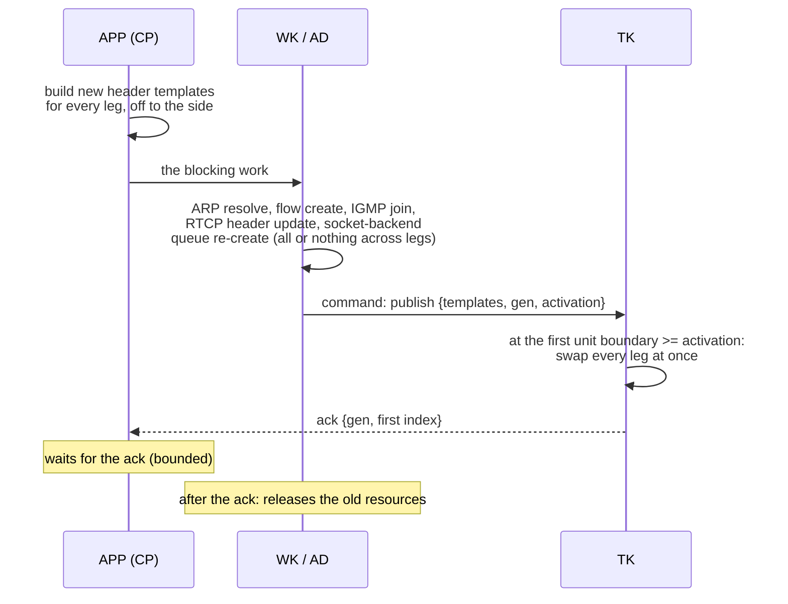

- Packets already in rings and descriptors carry the old header, so the ack reports the first
  media index sent to the new destination (this matches IS-05 scheduled activation).
- The kernel-socket backend sends GSO to `t->send_addr`, fixed at queue creation
  (`datapath/mt_dp_socket.c:236`, SF-36): a worker creates a new queue and it is swapped at the
  boundary. The RTCP TX header copied from `s_hdr` at init (`st_tx_video_session.c:1023-1025`)
  is updated too (SF-37).
- RX: the new flow rule joins the same queue before the old one is removed. With `MTL_AT_TAI t`
  the old rules accept only units whose media time is before t and the new ones only units at or
  after t; a worker removes the old rules and leaves the old groups after the first unit at or
  after t completes, or at t + `rx.flush_offset_ns` + `rx.skew_budget_ns` if none does. RX
  `MTL_NOW` switches at once; the unit being assembled from the old flow completes by its flush
  deadline and is counted.

In CREATED and STOPPED every part (MS3) goes this way; `MTL_UPDATE_MEDIA` and `MTL_UPDATE_POOL`
are allowed only there. They change what today's engines fix at create. The core runs the new configuration as a dry run, then the binding
re-creates the engine session while the core keeps the handle, the name, the counters (carried as
core offsets) and the SSRC (pinned through `ops.ssrc`). The RTP sequence continues only if the
engine counter can be seeded, which no ops field allows today (the seed of `st_engine_core.h`,
[engine.md](engine.md) §2.11, OI-62); otherwise it restarts at 0 and the
`info.seq_restarted` key says so. RX keeps
its flow rules and memberships. This turns a GStreamer caps change, a detected RX format change
or an MXL grain-count change into stop, update, start instead of close and create. The rules are
[contract.md §4.7](contract.md#47-update).

## 6. Waking

### 6.1 Wait targets, wait words and the protocol

Every session and the instance have one 64-bit **event word** `ec` on the never-freed line A of
their handle-table entry (§4.7, D-158). Every change that can make a target ready is one RMW on it
after its publish; a call with a timeout loads it before its attempt, arms with a CAS of a count in
its lane, sleeps on its 32-bit `seq` and removes its own count. No producer ever clears an arming.
Calls with timeout 0 are pure probes. Event loops wait on queues (§6.6, MS2a); MS1 ships no
descriptor. The register of these words is the table below; §4.1's register lists the other words
of the core and links here.

| Lane | TX session | RX session | Instance |
|---|---|---|---|
| 0 | `MTL_WAIT_ACQUIRE` | `MTL_WAIT_DEQUEUE` | — |
| 1 | `MTL_WAIT_RESULTS` | rows (`mtl_rx_wait_rows`, MS2) | — |
| 2 | `MTL_WAIT_EVENTS` (MS3) | `MTL_WAIT_EVENTS` (MS3) | `MTL_WAIT_EVENTS` (MS3) |
| 3 | spare | `MTL_WAIT_RTCP` (Phase 7) | — |

An interrupt of RX `MTL_WAIT_DEQUEUE` selects lanes 0 and 1. A state change has F = every lane.

| Where | Word | Layout | Writers | Readers | Ordering | Reset |
|---|---|---|---|---|---|---|
| entry line A (never freed) | `ec` | `seq` in bits 32–63 (the futex word), `HA(0..3)` in bits 28–31, four 7-bit counts below (lane l at bit 7l) | E2 (every producer), E4, J4a, J5, X3, C4 (`fetch_and` of one `HA`), T7 (CAS + ONE), T9 (`fetch_sub` ONE), J8 (CAS \| HA) | T2, J7 (acquire), E2, K1 (relaxed), the kernel (`seq`) | RMW only (below) | `seq` never; counts and `HA` 0 at retire |
| line A | `fired` | u32 lanes marked for the loop's flush | M1 (`fetch_or` release) | F6 (`xchg` acquire) | release / acquire | Y1 |
| line A | `owner`, `kind` | u16, u8 | create | V2, the flush | seq_cst / const | Y1 |
| line A (MS2a) | `alink[4]` | u64 per slot `{next:20 \| qidx:16 \| qgen:16 \| lanes:4 \| fired:5}`; fired's fifth bit is STATE | the slot's owner: J6 (qidx, qgen, lanes), P2 (next, fired) | P1, A5 | relaxed atomics; published by the `HA` CAS (J8 release, E4 acquire) and by `qword` (P2 release, A4 acquire) | per use |
| entry in-flight line (application threads; read-mostly) | `inflight` | u64 | every data call (D1, T1, Q1, A1, J1) | X2, C2 | seq_cst add, release sub | never |
| in-flight line | `intr` | u64 `{gen:32 \| targets:32}` | N5 (CAS, the handle's generation checked), Y1 (`{new gen, 0}`) | T3, Q2 (relaxed: ordered by `ec`), A9 for the instance's queues (seq_cst) | seq_cst CAS | Y1 |
| entry line C (MS2a; application threads) | `astate[4]`, `user[4]` | u8 `{state:2 (FREE, IDLE, ARMED, DEAD) \| want:4}`; u64 | under the queue's lock: J4a–J6, A5, X3, C3, C4. Without it, only P2's stale path (FREE; the node is the claimer's) | the same | relaxed atomics | Y1 (FREE; a DEAD slot stays busy until its pop) |
| slot line (MS2) | `progress` | u64 `{rows:31 \| ended:1 \| want:32}` | RW1 (the binding: `fetch_add`, `fetch_or`, `fetch_and`), RW2 (the reader: CAS) | RW1, RW2, TX `query_frame_lines_ready` (rows only) | RMW only | per use |
| queue entry line A (MS2a; never freed) | `qword` | u64 `{head:20 \| qgen:16 \| ARMED:1 \| CLOSED:1}`; head = node (index(o) << 2 \| i) + 1, 0 = empty | P2 (CAS), A4 (CAS head → 0), A8 (CAS ARMED), U1 (`fetch_or` CLOSED), U2 (CAS ARMED → 0), C3, Y2 | everything on the queue path | acq_rel; A8 and U2's load seq_cst | Y2 |
| queue line A | `intr` | u64 `{gen:32 \| ON:1}` | N5 | A3, A9 (seq_cst) | seq_cst CAS | Y2 |
| queue line A | `owed` | u32 writes owed by library loops | P3 on a loop (`fetch_add`) | F6 (`xchg`) | release / acquire | Y2 |
| queue line B (application threads) | `local`, `lock`, `fd` | u32 head of the consumer chain; a TTAS spinlock, never held across a syscall; i32, open while the process runs (a forked child closes it) | A4, A5 (under the lock); create of a fresh entry (`fd`) | the same | plain under the lock | Y2 (`local`); `fd` kept |
| queue line B | `dlv[2]`, `dph` | u32 deliveries in progress per phase; the phase bit | A5 (`fetch_add` under the lock), A10 (`fetch_sub` release, the call's last step); DV1–DV3 flip `dph` under the lock | DV1–DV3 (acquire) | as stated | never; `dph` Y2 |
| loop | `L0`–`L2`, `cursor`, `wake_k` | today's bitmap and D-142's bound | the loop | the loop | relaxed | never |

`ec` is written only by RMWs: producers release, arms acquire; `seq` is at byte offset 4 on
little-endian, and a carry out of bit 63 is discarded. Line A is written by tasklets and by
sleeping or arming threads, never by probes.

Line A of a session is 48 bytes: `ec` 8, `fired` 4, `owner/kind` 4, `alink` 32. There is no line B: `fired`
sits on line A and `intr` on the in-flight line, so probes never touch line A.
Queue entries come from their own never-freed table (one per type, R4), on the node of the
instance's main lcore (D-182).

The steps, with the labels the model (`design/models/final_model.py`), `st_core_wait.c` and the
tests use (`check_labels.py` compares them). Interrupts, close and retire are explained in §6.3,
the flush in §6.2, the queue path in §6.6.

```text
Notation: SEQ = 1 << 32; ONE(L) = sum of 1 << 7l over the lanes L; CNT(a, F) = the lanes of F
with a count > 0 in a; HA(i) = 1 << (28 + i). "enter"/"leave" = the in-flight counter of data
calls. Every syscall of a DP, WT or AS call is a raw syscall().

EVENT(o, F): after every change that can make a target of the lanes F ready
E1  publish (release is enough): the completion's PUBLISHED or FREE store | a release's
    APP -> FREE CAS | store(reap_seq) | RW1's progress RMW | an event's pending state |
    store(state) (F = every lane) | N5's CAS of intr (F = its lanes) | MS5: the ring-RX
    enqueue crossing packet.rx_min_packets or a marker, and the tick that sees
    packet.rx_max_wait_ns pass (both TK, through st_core_event)
E2  a = fetch_add(ec(o), SEQ, acq_rel)
E3  w = CNT(a, F); if (w) mt_wake(o, w)
E4  (MS2a) unless E1 is an interrupt or CLOSING: for each slot i with HA(i) in a and
    (E1 a state change, or lanes(alink[i]) & F):
        if (fetch_and(ec(o), ~HA(i), acquire) & HA(i)) PUSH(o, i, F, E1 a state change)

mt_wake(x, w): x an object (w its lanes) or a queue (w = 1, a write owed)
M1  a library loop (a scheduler, the null loop, the RX packet lcore, any loop that registers
    the instance context's flush hook): an object: if (fetch_or(fired(x), w, release) == 0)
    mark index(x); a queue: if (fetch_add(owed(x), 1) == 0) mark index(x); the loop flushes
    after its handlers
    any other thread: WAKE_NOW(x, w)

WAKE_NOW(x, w): no in-flight count; returns the syscalls made
K1  an object: w &= CNT(load(ec(x), relaxed), w);
    if (w) futex(&seq(x), FUTEX_WAKE_BITSET|FUTEX_PRIVATE_FLAG, INT_MAX, w)
K2  (MS2a) a queue: write(fd(x), 1)         // fd is open while the entry exists
    a failed K1 or K2 syscall counts instance.wake_errors and is not retried (unreachable for
    a private futex and an eventfd that stays open)

FLUSH(Lp): F1-F8 of §6.2 with D-142's bound, and
F6  an object: F = xchg(fired(entry(i)), 0, acquire); a queue: F = xchg(owed(entry(i)), 0)
F7  if (F) { if (WAKE_NOW(entry(i), F) > 0) n++; else z++ }

WT(o, M, timeout): every data call with timeout != 0; L = lanes(M)
T1  deadline = timeout == MTL_FOREVER ? NONE : now(CLOCK_MONOTONIC) + timeout; enter
T2  e = load(ec(o), acquire)        (mtl_rx_wait_rows: also p = load(progress, acquire), RW2)
T3  c = the state's code for M; if none and (bits(intr(o)) | bits(intr(I))) & M:
    c = -MTL_ECANCELED (intr(I) loaded seq_cst); if (c) { leave; return c }
T4  r = ATTEMPT(o, M) (mtl_wait: the ready subset; the predicate's loads first, the reaper
    lock only when it is READY); if (r >= 0) { the call's own sources; leave; return r }
T5  if (deadline passed) { leave; return -MTL_EAGAIN }
T6  if (a lane of L counts 127 in e) { futex(&seq(o), FUTEX_WAIT_BITSET|FUTEX_PRIVATE_FLAG,
    seq(e), min(deadline, now + 1 ms), L); goto T2 }        // uncounted: it re-checks
T7  if (!CAS(ec(o), e, e + ONE(L), acq_rel)) goto T2
T8  futex(&seq(o), FUTEX_WAIT_BITSET|FUTEX_PRIVATE_FLAG, seq(e), deadline (absolute), L)
T9  fetch_sub(ec(o), ONE(L), release); goto T2

DP(o, T): timeout 0
D1  enter; CLOSING: leave, -MTL_ESHUTDOWN; RETIRED: C-sources' column (-MTL_EBADF self-closed,
    -MTL_ESHUTDOWN closed by the instance)
D2  r = ATTEMPT(o, T); if (r >= 0) the call's own sources (EVENT); leave; return r

WAIT0(o, M): mtl_wait with timeout 0
Q1  enter; c = the state's code for M; if (c) { leave; return c }
Q2  if ((bits(intr(o)) | bits(intr(I))) & M) { leave; return -MTL_ECANCELED }
Q3  R = the lanes of M that are READY; leave; return R ? R : -MTL_EAGAIN

ROWS (MS2): the second word of a row wait
RW1 the RX binding, per rows step d (the unit's end: fetch_or(progress, ended)):
    old = fetch_add(progress, d, acq_rel); w = want(old);
    if (w && (rows(old) + d >= w || ended)) { fetch_and(progress, ~WANT); EVENT(s, lane 1) }
RW2 mtl_rx_wait_rows, between T4 and T7: CAS(progress, p, p with want = want(p) ?
    min(want(p), min_rows) : min_rows), else goto T2

INTERRUPT(o, mode, targets): AS with ON and ABORT, CP with OFF
N1  the mode and target checks, pure, without mtl_last_error
N0' if (syscall(SYS_getpid) != load(mt_pid, relaxed)) return -MTL_EBADF
N2  saved = errno; x = entry(o) (chunk acquire); g = the handle's generation
N3  st = load(state(x), seq_cst): a session CLOSING or RETIRED, a queue closed, an instance
    closing: r = 0 (R4), goto N9
N4  pm = targets ? targets : every target
N5  CAS loop on intr(x) (seq_cst): gen(intr) != g: r = -MTL_EBADF, goto N9;
    ON: targets |= pm; OFF: targets &= ~pm, r = 0, goto N9
N6  a session or the instance: E2 on x, then K1 directly with the lanes of pm (never M1:
    no thread-local state, no loop's bitmap); a queue (MS2a): U2(x, load(qword(x), seq_cst))
N7  an instance: WALK(x, pm)
N8  ABORT: the instance's abort flag (§5)
N9  errno = saved; return r
WALK(I, pm)
V1  h = load(session_table.hw, seq_cst)
V2  for each entry e < h (chunk pointers acquire) with load(owner(e), seq_cst) == index(I):
        a session: E2, then K1 with the interrupt lanes of pm; a queue (MS2a): U2(e, ...)

CLOSE(s): store(state, CLOSING, seq_cst); E2 and K1 directly with every lane (no E4: a
          closing object is never reported); (MS2a) for each slot i of s not FREE:
          DRAIN_DLV(the queue of alink[i]) (§6.6); then wait for the in-flight counter
RETIRE(s): only on the control plane (a worker, the closer's poll, the orphan drain), never in
          the data call that made s retirable, which only performs X1 and posts the rest
X1  store(state(s), RETIRED, seq_cst)
X2  while (load(inflight(s), seq_cst) != 0) sched_yield()   // data calls only, never its own
X3  (MS2a) for each slot i of s not FREE, under its queue's lock: IDLE -> FREE; ARMED: the
    fetch_and of HA(i) won -> FREE, lost (listed) -> DEAD, freed by its pop
X4  tombstone (§4.7); the words stay
Y1  create on a reused entry, before the handle is returned: the generation + 1;
    intr = {generation, 0}; fired = 0; slots not DEAD -> FREE; owner, kind (seq_cst);
    the state RETIRED -> CREATED (release), last; hw (seq_cst) if it grows. seq is never
    reset; the counts and HA are already 0.
```

The call's own sources:

- a reap that advanced `reap_seq` runs EVENT(o, ACQUIRE);
- a release of an APP TX lease runs EVENT(o, ACQUIRE);
- a failed in-caller conversion, or submit's own flush (D-121), runs EVENT(o, RESULTS | ACQUIRE).

In MS1, E4, K2, the queue branches of N6, V2 and CLOSE, and X3 are not built: `HA` is always 0. RW1–RW2
land in MS2.

**Why it is correct** (the model checks every interleaving of its cases, D-158; weak memory is
argued).

**The single-location lemma (WT).**

- Take a producer that publishes (E1, any ordering) and then RMWs `ec` (E2, release). Take a
  waiter that loads `ec` (T2, acquire, reading e), attempts (T4), and arms with `CAS(ec, e, e +
  ONE)` (T7).
- Every write of `ec` is an RMW, so every RMW after E2 continues E2's release sequence.
- Suppose E2 precedes T7's read in `ec`'s modification order. Then e is E2's value or a later one,
  T2 synchronises with E2, T4 sees the publish, and the waiter does not sleep.
- Otherwise E2 follows T7. It reads T7's count, because nothing but the waiter itself removes that
  count (T9), so E3 sees it and wakes.
- The futex closes the gap between T7 and T8. E2 changes `seq`, so either T8's compare fails, or
  the waiter is queued when the wake comes.
- Arms by other threads change only the low half, so they never make T8 return early.

**No producer ever clears an arming.** With bits cleared by a second RMW, a waiter's CAS can be a
no-op that the clear then erases, and the wake precedes its sleep. That is why a sleeper is a
count it removes itself, not a sleeper bit a producer clears (D-158). The model's mutant `bits` is
LOST in o1.

**Row waits (MS2)** are a two-word arm:

- RW2's CAS on `progress` follows T2's load of it. RW1 clears `want` and *then* runs E2 on `ec`,
  so a reader whose CAS was a no-op before that clear has loaded `ec` before E2. Its T7 then fails,
  or E2 sees its count.
- Several readers share the smallest `want`. The others wake early and arm again.
- Case o6 checks it; the mutant `want_store` (a plain store, no minimum) is LOST.

**The wrap bound.**

- The 32-bit `seq` repeats after 2³² EVENTs on one object.
- A waiter stopped between T7 and T8 for exactly k · 2³² EVENTs (at 30 k/s, 40 h: a SIGSTOP, a
  debugger, a paused VM) can compare equal after the wakes passed. It then sleeps until the next
  EVENT.
- The 64-bit CAS at T7 and J8 sees the same wrap only with identical counts and bits.
- This bound is accepted and stated; no timer guards it. A periodic re-check cap (the counters
  design's 1 s) was rejected: it turned that design's lost wake-up (mutant `bits`) into a silent
  1 s stall instead of a failing test.

**A sleeper beyond a full count** (T6) sleeps uncounted and re-checks every 1 ms, so its latency is bounded and
it never busy-loops.

**Interrupts and state changes.**

- Both are publishes followed by E2. T3 reads `intr` and the state after T2, so either T3 sees
  them, or T7 fails, or E3 sees the count. The model's mutant `intr_no_bump` is LOST in o4.
- `intr(I)` reaches existing sessions through V2. Sessions created after V1 are covered by
  today's argument: `hw` and `owner` are stored seq_cst before the handle is returned, and T3
  loads `intr(I)` seq_cst.
- The generation inside `intr` makes a late interrupt on a reused entry fail its CAS (N5), so the
  AS path needs no in-flight count.
- N6 and V2 wake directly (K1) and never touch a loop's bitmap.

**Lifetime.**

- The futex word and every word of line A live as long as the process.
- A queue's descriptor stays open while its entry exists (C5, Y2). A late write, from a flush
  carrying `owed` or from a claimer that pushed before CLOSED, therefore lands on a live eventfd:
  at worst one spurious wake of the next queue on that entry.
- So no wake takes an in-flight count, and there is no `INSIDE` and no use-after-close class.
- Descriptors are never closed while the process runs (Y2), so an AS interrupt preempted between
  U2's CAS and its `write()` across the last instance close still writes its own eventfd, never a
  descriptor number the application reused.
- The descriptor count is bounded by the peak number of live queues.
- `futex_waitv` (Linux ≥ 5.16, missing from the RHEL 9 and Ubuntu 22.04 GA kernels) is not used:
  every sleeper sleeps on one 32-bit word, and a wait on many objects is a queue.

**A stale claimer.**

- A claimer can sit between E4 and P2 for milliseconds (thread mode, or a preempted application
  thread releasing a lease). Meanwhile its queue can close and the entry can be reused.
- `alink[i]` stores the queue's 16-bit generation (J6), and P2 compares it with `qword`'s in the
  same CAS that pushes. A mismatch is treated as CLOSED, and the claimer frees its own node.
- Case r3 checks it; the mutant `no_qgen` pushes onto the new queue (XQ).
- The ABA bound: 65 536 reuses of one entry while one claimer is stopped.
- A call on the old handle cannot reach the new queue: A1 and J1 check the handle's generation,
  and close waits for every call already inside (C2), so no call spans a reuse.
- The mutant `close_no_wait` lets the new queue's reset (Y2) take the close's write from a sleeper
  inside `mtl_queue_wait`, which is LOST in r4.

**The queue: no lost report.**

1. **The object.**
   - J7 loads `ec` before the predicates, and J8's CAS from that value is the arming. A change
     after J7 fails the CAS. A change after J8 runs E2, sees `HA(i)`, and its E4 is the only
     `fetch_and` that gets it back.
   - `HA` is set only by J8, and only while it is clear (the slot is IDLE, owned by the arming
     thread under the lock), so the no-op arm of a producer-cleared bit cannot occur.
   - Mutants `arm_no_validate` (LOST) and `claim_by_load` (OVER) are killed.
2. **The queue word.**
   - A8's `CAS(head == 0 → ARMED)`, taken under the lock with `local` empty, is the consumer's
     arming.
   - Every push after it in `qword`'s order sees `ARMED`; the first claims it and owes one write
     (P2, P3). That write follows A7's reset: program order, then the CAS chain.
   - A push before A8 makes `head != 0`, so A8 fails and the consumer takes the list.
   - Mutants `arm_store` and `reset_after_arm` are LOST.
3. **The write-back rule.**
   - A7 runs only when the list and `local` were empty under the lock. A7 may take a signal owed to
     another sleeper: a push, a close, or an interrupt that claimed `ARMED` and wrote.
   - Every exit of the call except its own `-MTL_EAGAIN` (A9) writes that signal back (A10). This
     covers A8 finding work, a CLOSED seen at A8 then A3, and an interrupt seen at A9 then A3.
   - The other sleepers therefore still wake, even if this caller leaves for good.
   - Cases q3, r1 and r2; mutants `no_resignal` (q3) and `no_exit_resignal` (r1, r2) are LOST.
4. **Interrupts of a queue** are the one store-buffering pair.
   - N5's seq_cst CAS of `intr` is followed by U2's seq_cst load of `qword`.
   - A8's seq_cst CAS is followed by A9's seq_cst loads.
   - In the total order S, either U2 sees `ARMED` and writes, or A9 sees the interrupt.
   - Mutants `intr_no_claim` and `no_intr_recheck` are LOST in q6.

**Detach and `user`.**

- A5 reads `astate` and `user` under the lock, which J4a, J5 and X3 also hold. So once a detach
  returns, the node is FREE (its `HA` won back) or DEAD (dropped at its pop), and no pop after
  that carries its `user`. The mutant `no_dead` is RPT in q10.
- After `o`'s close returned, A5's seq_cst load of `o`'s state sees CLOSING and drops the node.
- A pop is not a return: a consumer that popped `o` before the detach may still be between A5
  and its return. A5 counts the delivery under the lock, and the detach (J4a) and `o`'s CLOSE run
  DRAIN_DLV, so they return only after every delivery that started before them has returned. A
  delivery that starts after the flip counts in the other phase and cannot carry `o` (its node is
  FREE or DEAD, or `o` is CLOSING). DV1 waits out the phase a previous drainer left, so a phase
  being waited on never takes new deliveries, and a stream of consumers never starves a drainer.
  The spin is bounded by one delivery (no sleep, at most one `write()`); a preempted deliverer
  makes it spin as a preempted reaper-lock holder does (D-183).
- **A stale caller.** A call that passed A1 after C2 and before Y2 is not waited
  for. Under the lock, A3 and J2 compare the handle's generation with `qgen`, so it returns
  `-MTL_EBADF` and never drains or arms a reused queue.
- J5's lost branch stores the new `user` under the same lock and returns 1, so the report already
  on its way carries the new `user`.

**State changes.**

- A state change is an EVENT with every lane, so E4 claims every armed slot and the report
  carries STATE.
- J7 never counts a state code as ready, so an ERROR session reports once per change, never on
  every arm.
- Arming succeeds in every state but CLOSING and RETIRED, so a DRAIN stop, an update and a start
  (an IS-05 activation), or an ERROR, stop and start recovery, keep the session armed.

**No busy loop.**

- Writes happen only in K2 (owed by a claim of `ARMED`, at most one per arm) and in A10's
  write-back (at most one per taken signal).
- Every `-MTL_EAGAIN` with a descriptor resets first (A7).
- The model checks the whole state graph for cycles: the design has none, and the mutant
  `no_reset` has one (SPIN).
- The arm carries the mask, so a source-limited sender sleeps.

**The queue never overflows.**

- Each attachment slot has one link and is in exactly one place: armed, claimed, listed, local,
  reported (IDLE), or free.
- E4's `fetch_and` makes the claim exclusive, and a node is armed again only after its report. So
  no node is pushed twice (OVER is checked in every state).
- Nothing is allocated, so there is no capacity and no full queue.

**Close and retire.**

- A session's CLOSING runs E2 and K1 with every lane (no E4): sleepers return `-MTL_ESHUTDOWN`,
  and no queue reports it.
- X2 waits for the data calls. RETIRE runs only on the control plane, so X2 never waits for its
  own caller (a self-deadlock). The session's producers are gone by then, so an
  ARMED slot without `HA` is listed, becomes DEAD, and is freed at its pop.
- A queue's close sets CLOSED (pushes then free their own node), wakes and waits out its calls,
  frees the listed nodes, frees the armed slots by the walk, and keeps its descriptor.

**Fork.**

- Every queue call and every AS call starts with the `getpid` check and returns `-MTL_EBADF` in a
  child.
- The queue descriptors are among the tracked descriptors closed there.
- Futexes are private.

**Threads.**

- WT: the bitset keeps lanes apart (G-95, case o2).
- Queues: the lock serialises A3–A6, A8–A9 and J2–J9, and never covers a syscall. Each report
  leaves the queue once. Any thread may make one call and leave (q3, q8, q9, r1).

**Weak memory.** The model is sequentially consistent. The orderings are argued:

- the WT path, `HA` and `qword` are one location each;
- the queue-interrupt pair is seq_cst on both sides;
- the model's write-backs happen at the decision point, while the text delays them past the
  unlock (A10, J10), which can only wake other sleepers later, never lose a wake.

On x86 every RMW is a full barrier; on Arm64 they are `LDADDAL`, `CASAL` and `LDAR`. A herd7 run of
the interrupt pair joins MS2a's weak-memory item.

### 6.2 The deferred wake

A completing context never makes a syscall inside a tasklet handler (D-68). The picture shows
who makes the wake-up syscall. Every completing context runs EVENT and calls the one `mt_wake()`
(D-102), so the choice is in one place. A tasklet only marks the object (or, for an armed queue,
owes the queue one write), and its scheduler loop flushes once per iteration, after its handler
loop and before its sleep check, waking a bounded number of marked objects and queues whose wake
makes a syscall ([D-142](decisions.md)). The rest stay marked and the loop returns 1, so a
scheduler never sleeps on a pending wake (D-68). A WT call sleeps on its object's `seq` (§6.1); an
event loop sleeps on a queue's descriptor (§6.6, MS2a). The notifier thread (D-165) would change
only who flushes, and is built only by D-142's rules (S1, MS2a). An application that never sleeps
(W0) causes no wake-up at all.

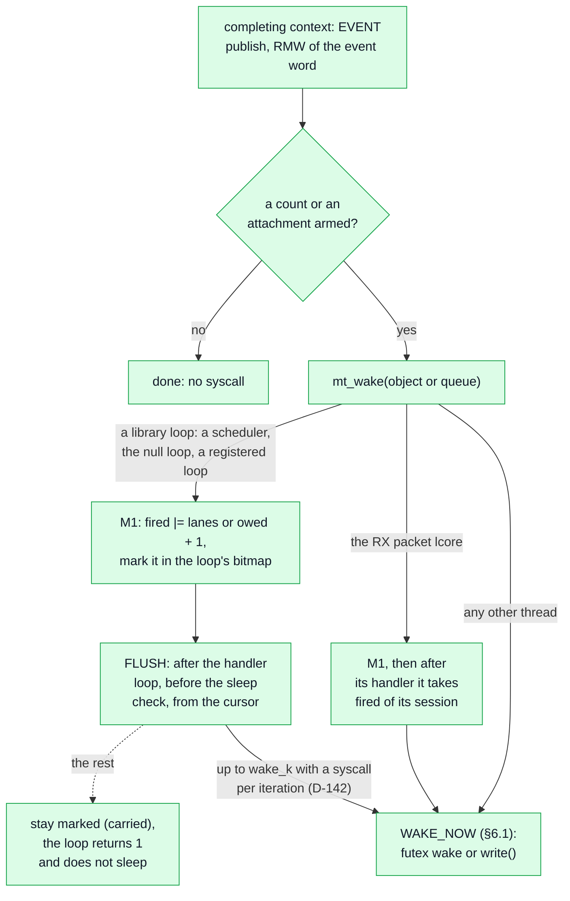

"Any other thread" is an application thread, a worker, the control plane, a transform or plugin
thread. Such a thread makes one direct wake per armed unit it completes. The table says the same
per context:

| Calling context | `mt_wake()` does |
|---|---|
| a scheduler (lcore or thread mode), the loop thread of a null-only instance, or any library loop that registers the instance context's flush hook (a frame-level device's completion context, §2.4) | M1: marks the object or the queue, only when E3 saw a count or E4 claimed an attachment |
| the RX packet lcore (`USE_MULTI_THREADS`, task B3) | M1; after `rv_handle_frame_pkt` it takes `xchg(fired)` of its one session and runs WAKE_NOW; no bitmap |
| an application thread, a worker, the admin thread, the control plane, a transform or plugin thread | WAKE_NOW at once |
| the test clock (`MTL_FAULT_CLOCK_ADVANCE`) | the null loop thread parks; ADVANCE marks like the loop and runs FLUSH with no bound before it returns, under the instance's test-clock lock |

**The flush.** Each scheduler calls the environment's wake flush hook (§2.4) once per iteration.
In `sch_tasklet_func` (`mt_sch.c:155-242`) the call sits after the handler loop (`:210`), inside
the `time_measure` window, and before the sleep check (`:211`); its return is added to `pending`.
On loop exit the flush runs with no bound (after the `ops->stop` loop, `mt_sch.c:231-236`).

```text
FLUSH(Lp)
F1  if (load(Lp.L2, relaxed) == 0) return 0
F2  n = 0; z = 0; k = load(Lp.wake_k, relaxed)       // D-142
F3  for each set bit i of Lp.L0, ascending from Lp.cursor, wrapping once:
F4      if (n >= k || z >= 32) { Lp.cursor = i; sched.wake_carried += the bits left; return 1 }
F5      clear bit i (and its summary bits once their word is 0)
F6      an object: F = xchg(fired(entry(i)), 0, acquire); a queue: F = xchg(owed(entry(i)), 0)
F7      if (F) { if (WAKE_NOW(entry(i), F) > 0) n++; else z++ }
F8  Lp.cursor = 0; return 0
```

- **The bound is a count**: `wake_k` objects or queues whose wake made a syscall, and a fixed
  number whose wake had nothing to do, per iteration (the values: [D-142](decisions.md)). The
  control plane sets `wake_k` per loop at every attach and detach of a session's tasklets: the
  strict bound under software-paced video TX, which tolerates no loop stall, and S1's larger bound
  elsewhere (`sched.wake_k`).
- **Entries beyond it** stay marked. Later completions merge into their `fired` lanes or `owed`
  count, and the next flush resumes at the cursor, so an entry marked with F others is woken
  within F iterations. A return of 1 keeps the loop from sleeping.
- **Counters:** `sched.wake_carried`, `sched.wake_syscalls` and `instance.wake_errors`.

**Layout.**
- One bitmap per library loop, indexed by the entry's process-wide index (sessions and the
  instance in the handle table, queues in their own table), with two summary levels.
- The loop's own thread is the only writer, using relaxed loads and stores; the notifier, if
  built, switches to RMWs.
- A completion by another scheduler's tasklet (a shared TX queue, §4.3) marks the object in that
  other loop. `fired` is one word per object, so whichever loop flushes first takes every lane.

**Cost** (S1 measures it; the budgets are implementation-plan.md §8.4's).
- Per completion with nothing armed: E2, one `lock xadd` on line A, which stays local while no
  thread sleeps or arms on the object.
- With a WT sleeper counted: also M1's `fetch_or` and the bitmap.
- With an attachment armed: also E4's `fetch_and` and P2's CAS on `qword`; line A comes back from
  the arming thread once per unit (one transfer in an aligned burst), and `qword` too under
  staggered arrivals (two).
- That transfer is the price of exact per-object readiness with single-location arming. The
  per-object handle and counters designs paid ≈ 25 ns per armed completion and packed claim bits
  ≈ 50–70 ns [inferred]; D-166 keeps the packed bits for aligned bursts.
- Per iteration with nothing marked: one load.
- Per woken entry: about 0.2 µs of bitmap and `xchg` work [inferred], plus one futex wake per
  object with a counted sleeper on a fired lane, or one `write()` per queue, once per consumer
  cycle.
- A flush therefore stalls the pinned core by at most `wake_k` wakes of one syscall each. That
  fits rate-limit pacing and TSC pacing at 1080p. At 2160p under TSC pacing it may not, so S1b
  decides the slack gate or the notifier (D-165).
- W2 fits while Σ(armed objects and queues × their wake rate) × the cost per wake ≤ 2 % of a core
  per scheduler, about 13 k wakes/s, where a queue counts once per consumer cycle. Dense audio
  (hundreds of sessions per scheduler) polls a queue without a descriptor or the sessions on its
  own timer (D-170); `MTL_UNIT_ROWS` at a small `rx.rows_step` reads `progress` (W0).
- A thread per session with a timeout does not scale to dense audio. Genlocked sessions are
  woken `wake_k` per iteration, so at `wake_k` = 1 the 512th of 512 sessions wakes ≈ 6–14 ms
  late [inferred], later than its 1 ms unit.
- The estimates MS4a1 measures the dense shapes against (OI-80) [inferred]: the W0 sweep costs the
  application 1024 × ≈ 25 ns per ms (≈ 2.5 % of a core) and the scheduler nothing. Armed queues
  cost the scheduler ≈ 8–13 % of a core under staggered RX. Sleeping queues add a `write()` per
  consumer cycle, up to 100–200 k/s per scheduler, at 1–3 µs each when it wakes an epoll sleeper.
  TX is mostly unarmed: a gateway acquires with a frame in hand.
- Waiting threads run on CPUs disjoint from the schedulers' ([deployment.md](deployment.md)):
  otherwise the kernel's wake-affine placement can put a woken thread on a scheduler's CPU.
- The waker does not pay the wakee's C-state exit, but the wake latency does (C6: about
  100–300 µs on Xeon), so `info.expected_wake_latency_ns` comes from S1 per C-state policy.

| Option | Cost on the tasklet side | Added latency | Use |
|---|---|---|---|
| W0 application busy-polls with timeout 0, or polls a queue without a descriptor on its own timer | E2 per completion; with a queue, E4 and P2 per armed unit | 0, or the timer | lowest latency; 125 µs and 1 ms audio, dense loads, `MTL_UNIT_ROWS` (line mode) |
| W1 application spins then sleeps with back-off | E2 per completion | up to the back-off | fallback |
| W2-deferred (the design) | E2 per completion; a mark when armed; per iteration up to `wake_k` wakes (D-142) | ≤ the marked entries' iterations plus the wake-up | every session, every mode, from MS1 (queues from MS2a) |
| the notifier thread (contingency, D-165) | as W2 without the flush's syscalls | a hop of 2–20 µs, about 130 µs at C6 | built only by D-142's rules (MS2a), in place of the earlier W3 (D-165) |
| predictive sleep (considered, not built) | none: the call arms only codes and interrupts | timer slack (50 µs) plus a guard | a WT call whose readiness time is known (TX: the oldest launch plus its transmit time; RX: the due time) sleeps until then and arms its lane only if the unit is late |

**The notifier, if built (D-165).** It is one thread per instance on `instance.main_lcore`,
`SCHED_OTHER`, every signal blocked, not an EAL thread. A loop only marks. After its handlers it
kicks the notifier (one futex wake) only if the notifier has announced SLEEPING. The notifier
announces SLEEPING with a seq_cst store and then re-checks every loop's summary word; the loop
does a seq_cst bitmap RMW and then loads the notifier state. That is a store-buffering pair, and
a CAS elects one kicker per sleep. After a pass that woke something, the notifier spins `spin_ns`
(50 µs), so a burst costs one kick. A TSC-paced quiet loop never kicks a napping notifier, which
then sleeps with a timeout of about 100 µs. Under the test clock the notifier parks and ADVANCE
runs its pass. A stalled notifier raises `MTL_EVENT_SCHED_STALLED`. There is one per instance, not
one per NUMA node, because per node needs a free CPU on every node.

Its price keeps it a contingency: a thread, the hop above, one point of failure for every
loop-caused wake, a latency-sensitive main lcore, the two option keys it
would add (`instance.notify_spin_ns`, `instance.notify_lcore`) and a ceiling of about 250–600 k wakes/s [inferred]. With queues the
flush already writes once per queue per consumer cycle. It is adopted only by D-142's rules: SR2
(a slow guest futex) and SR3 (pacing still failing after D-170's patterns and the slack gate),
[engine.md](engine.md) §6.1.

### 6.3 Interrupts, close and retire

**Interrupts** (`mtl_interrupt(o, mode, targets)`; the checks and codes are contract.md §8.4's;
the steps N1–N9 and WALK V1–V2 are §6.1's). The interrupting thread, which may be a signal
handler, works only on never-freed words: it sets the sticky targets in `intr` with a CAS that
checks the handle's generation, then runs E2 on the object and wakes its counted sleepers
directly (K1, never through a loop's bitmap); for an instance it then walks the session table and
the queue table. No in-flight count is taken. The picture shows the shape (MTL_INTR_ON):

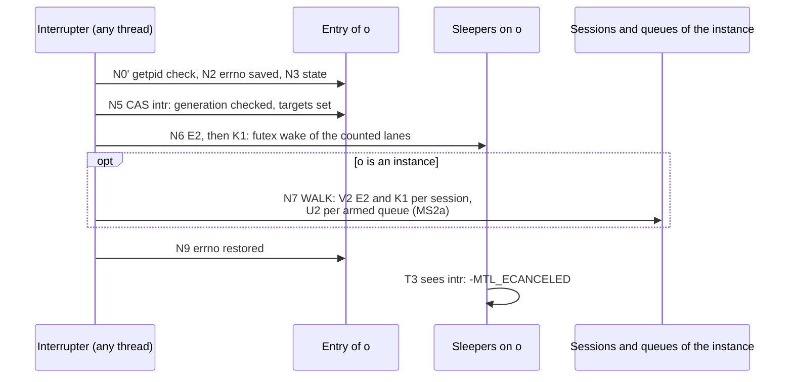

- **Sleepers and the walk.** A WT sleeper reads `intr` and the instance's `intr` (seq_cst) after
  its T2 load, so either it sees the interrupt, or its T7 fails, or N6's E2 sees its count. An
  entry's `hw` and `owner` are stored (`seq_cst`) before its handle is returned, so a walk that
  misses an entry cannot miss its sleeper's view of the instance's `intr`.
- **Queues** (MS2a). A queue's interrupt and its sleepers are the one store-buffering pair of the
  design (N5 then U2, A8 then A9, §6.6). A session's interrupt does not reach the queues it is armed
  on; the instance's interrupt does, through the walk. A session interrupt that also reports its
  armed slots with `-MTL_ECANCELED` was considered for multi-session framework elements and not
  taken: an element that sleeps on a queue interrupts that queue.
- **Cost.** O(`hw`) loads (≤ 65 536), plus one RMW and one syscall per object with a counted
  sleeper, and one `write()` per armed queue; the budget is ST8 (implementation-plan.md §8.4).
- **AS-safety.**
  - Atomics, raw `futex` and `write`; `errno` saved and restored; no TLS (no `mtl_last_error()`,
    no debug class, no `mt_in_busy_loop`).
  - Only never-freed memory is read, and a queue's descriptor is never closed while the process
    runs (§6.6). In a forked child the call returns at N0': `mt_pid` is stored at the first
    instance open, before any handle exists.
  - From MS2a MTL blocks asynchronous signals around `rte_eal_init` and in the threads it creates
    on a direct open. A bridged instance keeps the legacy behaviour.
- **Precedence.** Close wins over an interrupt.

**Close and retire.** A handle-table entry is never freed: close makes it CLOSING and wakes every
lane (no queue reports it), retire makes it a tombstone once its data calls have left, and a later
create may reuse the tombstone with a new generation. Retirement never runs inside a data call
(D-168): the last release or hold drop of a closing session only stores RETIRED and posts X2–X4 to
the control plane (a library worker, or, once the instance is gone, the orphan drain of the next
control-plane call, §4.7). The picture shows the cycle; the listing of §6.1 gives the steps.

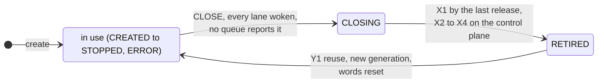

**Timeouts.**
- A timeout is a duration on `CLOCK_MONOTONIC`, turned into one absolute deadline at entry.
  `FUTEX_WAIT_BITSET` takes it as is, so a TAI step or PTP loss never changes it.
- Timer slack (50 µs by default) can lengthen a timeout; it never delays a wake.
- DP, WT and AS calls are not cancellation points; a call with a timeout is not ended by
  `pthread_cancel` (contract.md §7.1). A call with a timeout is ended with `mtl_interrupt`.
- Neither `longjmp` out of any MTL call nor asynchronous cancellation of a thread inside one is
  allowed.

**Windows (from MS2a).**
- `WaitOnAddress` loops on a QPC deadline. Sub-millisecond timeouts round up to 1 ms, and the 15.6
  ms tick applies unless `timeBeginPeriod` is set.
- `WakeByAddressAll` has no bitset: sleepers of other lanes wake, re-check and sleep again.
- A queue's descriptor is a manual-reset event (`SetEvent`/`ResetEvent`, `WaitForSingleObject`).
  An auto-reset event would be consumed by the application's own wait.
- One queue serves any number of sessions, so `WaitForMultipleObjects`' limit of 64 handles counts
  queues, not sessions.
- The console control handler runs on its own thread.
- In MS1 the unified library and its waits are Linux only.

Today `*_wake_block()` does not make `get_frame` return early: the predicate loop sleeps again
until the deadline (`st20_pipeline_tx.c:781-788`, SF-16), so shutdown takes up to the 1 s block
timeout. From the MS2b re-base `wake_block` increments the wrapper's `kick` and runs
EVENT(s, ACQUIRE), and the legacy wait's T3 also returns when `kick` moved, so a blocked
`get_frame` returns NULL once (migration.md §6.5, LB-14).

### 6.4 The RX due time

The RX due time is the first-packet arrival (earliest leg) + unit period + the flush offset
(`MTL_OPT_RX_FLUSH_OFFSET_NS`; 0 means `MTL_OPT_RX_SKEW_BUDGET_NS` with two legs, 1 ms with one),
capped at the presentation time when a link offset is set. The RX `tick` checks it on every visit
and force-completes the unit (E8, MS2). Without it an RX unit completes only when full or evicted,
and DRAIN cannot deliver a partial unit. Arrival and due times live in the `mt_get_tsc` domain:
the RX handler reads the TSC once per burst that returned packets, the due time is that first
arrival + (unit period + flush offset) in the same units, and the `tick` compares it with the TSC
sample the scheduler loop already takes once per iteration (`mt_sch.c:217`, stored in the
scheduler); TAI comes in once per unit, at completion.

### 6.5 Events

Events (MS3) are produced without blocking any producer (contract.md has the reader's rules:
coalescing, `coalesced`, `seq` gaps, `MTL_EVENT_OVERFLOW`). A reader is `mtl_read_events` on a
session (`mtl_session_read_events`) or on the instance object (§4.6).

| Producer | Mechanism | Why |
|---|---|---|
| tasklets (session events) | not a ring: per source a pending-type bitmask, a seqlocked latest payload and a count per type, written wait-free by the one producing tasklet, plus a per-scheduler event counter bumped for each newly pending source | coalescing is free, nothing overflows, and the tasklet's cost does not depend on the number of readers |
| library threads (admin, PTP servo, workers) | one small ring per producer class per reader, filled at post time | a preempted producer delays only its own class, never a tasklet |
| application threads (`MTL_EVENT_BACKPRESSURE` from acquire) | their own ring per reader, with a lock between application threads | application threads never share a structure with tasklets |

The reader materialises records from the pending state (the first and last state of a
transition are kept), visits only the schedulers whose event counter moved since its last read,
then drains the rings. A full ring increments its `lost` count; the next read returns
`MTL_EVENT_OVERFLOW` first (`value[0]` = events lost) and `seq` jumps. Library-class events are
copied into each reader's ring at post time, so a reader whose ring is full overflows alone.

### 6.6 Queues (MS2a)

A queue tells an event loop, or a pool of threads, which of its objects changed (contract.md §7.2,
D-159–D-162). It is an entry of its own never-freed table on the node of the instance's main lcore
(D-182): one word `qword`, an intrusive list through the objects' attachment slots (`alink` on line A, `astate` and `user` on
line C of §6.1's table), and an eventfd that lives as long as the process (a forked child closes it). The
first change of an armed target claims the attachment bit `HA` in the object's event word and
pushes the object once; a report disarms it. Tasks C1q1 and C1q2 build it. A session on another
node's scheduler pays a remote `qword` transfer per push (≈ 200–400 ns [inferred]); a consumer
per node with its own queue avoids it, and S1a measures it on two sockets.

The push runs in the completing context (E4, P2), not in the loop's flush. The flush handles at
most 32 entries without a syscall per iteration (F4), so a dense burst pushed from there would be
carried 32 objects per iteration.

**Why queues (D-159).** The per-object wait handle they replace needed a descriptor per session, a
`read()` per missed probe, wait groups with an O(members + hw) sweep for dense audio, and an
in-flight count on every wake. Its sweep also spun a source-limited sender (ex03), because a free
slot kept ACQUIRE ready. A queue is one descriptor for any number of objects, its consumer visits
only the ready ones, and a burst costs one write; it reports only the objects armed on it (no
user posts, contract.md §7.2). `mtl_queue_wait` is its own export, not a kind of `mtl_reap`: its timeout 0 arms the
descriptor and its `-MTL_ECANCELED` applies at any timeout. MS1 has no descriptor because no MS1
consumer sleeps on one (`UnifiedRxTxApp` and `UnifiedKahawaiTest` use a thread per session) and S1
measures the wake costs first (MS2a); a stop-gap MS1 loop, a WT thread writing an application
pipe, was rejected as the wrong pattern to teach.

```text
PUSH(o, i, F, st): by the winner of HA(i) (E4), or by an arm that found o ready (J8)
P1  a = alink[i]; q = qidx(a); f = (F & lanes(a)) | (st ? STATE : 0)
P2  v = load(qword(q), relaxed); loop:
        if ((v & CLOSED) || qgen(v) != qgen(a)) { astate[i] = FREE; return }   // stale queue
        alink[i].next = head(v); alink[i].fired = f                         // the node is ours
        n = v with head = node(o, i); if (v & ARMED) n &= ~ARMED
        if (CAS(qword(q), v, n, acq_rel)) break                             // else v reloaded
P3  if (v & ARMED) mt_wake(q, 1)        // one write owed: the loop's flush, or K2 now

SIGNAL OF A QUEUE: its close or an interrupt; never on a library loop
U1  close: v = fetch_or(qword(q), CLOSED, seq_cst)
U2  U2(q, v): while (v & ARMED) { if (CAS(qword(q), v, v & ~ARMED, acq_rel)) { K2(q); break };
        v = load(qword(q), seq_cst) }

QWAIT(q, out, r_size, max, timeout): mtl_queue_wait
A1  N0'; a queue without a descriptor and timeout != 0: -MTL_EINVAL; deadline; enter q (a
    closed handle: -MTL_EBADF); got = 0
A2  lock(q)        // a TTAS spinlock of application threads, held for memory operations only
A3  v = load(qword(q), acquire); if (qgen(v) != low16(gen(handle))) { r = -MTL_EBADF; goto A10 }
    if (v & CLOSED) { r = -MTL_ESHUTDOWN; goto A10 }   // a reused entry is never drained
    if (bits(intr(q)) | bits(intr(I))) { r = -MTL_ECANCELED; goto A10 }
A4  if (local(q) == 0 && head(qword(q)) != 0): CAS qword: head -> 0, flags kept (acq_rel);
    local(q) = the list taken, reversed (oldest first)
A5  n = 0; while (n < max && local(q) != 0): (o, i) = pop local(q);
        if (astate[i] == DEAD) { astate[i] = FREE; continue }
        if (load(state(o), seq_cst) is CLOSING or RETIRED) { astate[i] = IDLE; continue }
        if (n == 0) { p = dph(q); fetch_add(dlv[p](q), 1, relaxed) }   // the delivery count
        out[n++] = {o, user[i], alink[i].fired & (want(astate[i]) | STATE)}; astate[i] = IDLE
A6  if (n) { r = n; goto A10 }; no descriptor: { r = -MTL_EAGAIN; goto A10 }
A7  unlock(q); if (read(fd(q)) returned a count) got = 1; lock(q)    // the reset, unlocked
A8  CAS qword: {head 0} -> {head 0, ARMED} (seq_cst), only while local(q) == 0; CLOSED: goto
    A3; head != 0 or local(q) != 0: goto A4 (got is kept)
A9  if (bits(intr(q)) | bits(intr(I)), seq_cst loads) goto A3     // the interrupt pair
    r = -MTL_EAGAIN; got = 0                            // this call armed: it keeps the signal
A10 unlock(q); if (got) write(fd(q), 1)                 // the write-back rule
    if (r != -MTL_EAGAIN || timeout == 0 || deadline passed) {
        leave; if (n) fetch_sub(dlv[p](q), 1, release); return r }      // the last step
A11 ppoll(fd(q), the time left); got = 0; lock(q); goto A3
    // with timeout 0 the application's own epoll_wait is this step

ARM(q, o, M, user): mtl_queue_arm, DP
J1  N0'; enter o; enter q; lock(q)
J2  v = load(qword(q)); if (qgen(v) != low16(gen(handle))) { r = -MTL_EBADF; goto J10 }
    if (v & CLOSED) { r = -MTL_ESHUTDOWN; goto J10 }
J3  i = o's slot on q; none: M == 0: r = 0, goto J10; a lane of M in another slot of o:
    r = -MTL_EBUSY, goto J10; else a FREE slot (none: r = -MTL_ENOSPC, goto J10)
J4  o CLOSING or RETIRED: J4a; r = D1's code; goto J10.  M == 0: J4a; r = 0; goto J10
J4a DETACH: IDLE -> FREE; ARMED: the fetch_and of HA(i) won -> FREE, lost -> DEAD; DEAD stays;
    then DRAIN_DLV(q) after J10's unlock, before the call returns (also for M == 0 and CLOSING)
J5  astate[i] == ARMED: if (fetch_and(ec(o), ~HA(i)) & HA(i)) astate[i] = IDLE  // won: re-arm
        else { user[i] = user; want = lanes(M); r = 1; goto J10 }   // its report is coming
    astate[i] == DEAD: { astate[i] = ARMED; user[i] = user; want = lanes(M); r = 1; goto J10 }
J6  alink[i] = {qidx q, qgen(qword(q)), lanes(M)}; user[i] = user; astate[i] = {ARMED, lanes(M)}
J7  e = load(ec(o), acquire); R = the lanes of M whose predicate is READY (loads only; a state
    code is never READY)
J8  if (R) PUSH(o, i, R, 0) with its write owed until J10; else if (!CAS(ec(o), e, e | HA(i),
    release)) goto J7
J9  r = 0
J10 unlock(q); the owed write, if any (K2); leave q, o; return r

QCLOSE(q): mtl_close on a queue, CP; returns 0
C1  U1, then U2 (a sleeper inside mtl_queue_wait or epoll gets a write)
C2  wait until q's in-flight counter is 0 (its waits woke on C1's write; it yields)
C3  lock(q); CAS head -> 0; every node of the list and of local(q): its astate -> FREE; unlock
C4  for each entry e < hw, each slot i of e with qidx q and qgen(q): lock(q); IDLE -> FREE;
    ARMED: the fetch_and of HA(i) won -> FREE (lost: its claimer's P2 sees CLOSED and frees
    it); unlock (the lock is taken per slot)
C5  tombstone; fd stays open for the next queue on the entry (C2 has waited out every call,
    deliveries included)
Y2  mtl_queue_create on a reused queue entry: the generation + 1; owed = 0; local = 0;
    intr = {generation, 0}; read(fd) (the reset; nothing on a fresh entry, which creates the
    eventfd); qword = {head 0, qgen = the generation's low 16 bits} (release); the state, last.
    No queue descriptor is closed while the process runs, not at the last mtl_instance_close
    either: the kernel closes them at exit, a later instance reuses them, and a forked child
    closes them (R8). So an AS write that U2 or V2 owes after any close lands on a live
    eventfd of the same table
DRAIN_DLV(q): waits out the deliveries in progress, two phases so new ones never starve it
DV1 lock(q); while (load(dlv[dph ^ 1]) != 0) { unlock(q); spin until it is 0 (acquire); lock(q) }
DV2 old = dph; dph ^= 1; unlock(q)      // new deliveries count in the other phase
DV3 spin until load(dlv[old], acquire) == 0    // bounded: A5 to A10, no sleep, one write()
```

The picture shows a burst on one queue: many objects, one write.

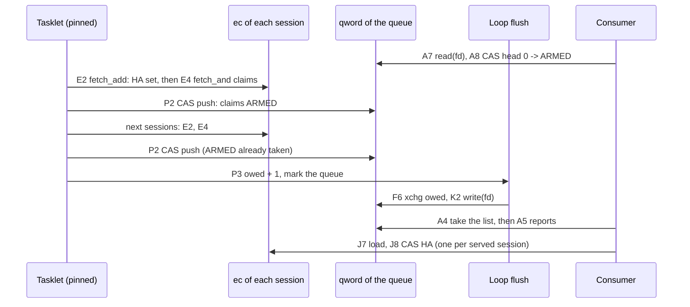

The syscalls of the whole subsystem, by context:

| Context | Syscalls of the wait subsystem |
|---|---|
| a tasklet handler | none (M1 marks) |
| a loop's flush, after its handlers | at most `wake_k` marked entries whose wake makes a syscall per iteration (D-142): per object one futex wake, per queue one `write()` |
| a probe (timeout 0) | none, except as a producer (release, reap, failed conversion): one futex wake or one `write()` |
| a call with a timeout | one `futex_wait` per sleep; beyond a full count on a target, one per ms |
| `mtl_queue_wait` | none on a queue without a descriptor; else one `read()` when it finds nothing, one `write()` when its read took a signal and it does not arm, `ppoll` with a timeout |
| `mtl_queue_arm` | none, or one `write()`, after its unlock, when it reports at once to an armed queue |
| an AS interrupt | per object with a sleeper one futex wake, per armed queue one `write()`, plus `getpid` |
| the control plane | state changes wake directly; a queue's close writes once; no queue descriptor is closed while the process runs (D-161) |

The correctness of the queue path is argued in §6.1's list (the queue, the write-back rule,
interrupts of a queue, detach and `user`, state changes, no busy loop, no overflow, close); the
model's cases q1–q11 and r1–r4 check it, and QW1–QW19 pin it (design/wait-tests.md).

## 7. Close and retire

`mtl_session_close(s, timeout)` runs the steps of the picture in order. It returns 1 while the
session is retiring and 0 once it is retired; calling it again on `s` polls, and never returns
`-MTL_EBADF`.

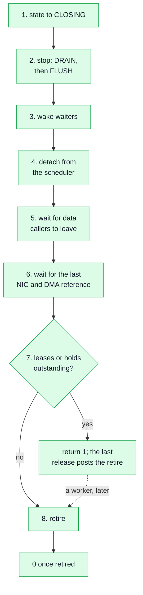

| Step | What it does |
|---|---|
| 1. CLOSING | the state goes to CLOSING; new data calls return `-MTL_ESHUTDOWN`; release and `get_status` keep working |
| 2. stop | DRAIN until the deadline, then FLUSH (`STOP_TIMEOUT`); an immediate command |
| 3. wake | waiters are woken (`-MTL_ESHUTDOWN`) |
| 4. detach | from the scheduler: `ctl` + `ack`, the lock fallback on ack timeout; MS1: the lock |
| 5. data callers | wait for them to leave: the per-session in-flight counter, on its own line |
| 6. device references | wait for the last NIC and DMA reference: the stalled-queue path of [engine.md](engine.md) §4 |
| 7. leases or holds | outstanding: return 1; the last `mtl_tx_release` / `mtl_rx_release` posts the retire to a worker, or to the orphan list once the instance is gone (§4.7; a DP call cannot free, D-168); waiting for it is calling `mtl_close` again |
| 8. retire | drop region references, discard unread results (counted), tombstone the process-wide handle slot (never freed, R4), drop the instance reference |

Instance close and `mtl_instance_shutdown` run the network-first order: close the instance's
queues first (C1–C5 of §6.6, MS2a; their descriptors stay open, D-161); refuse new data calls and
wait for those inside one; TX finishes the unit on the wire and flushes the rest; RX leaves every
group; schedulers, queues and ports stop (the stalled-queue path, a reset only if the budget remains); MtlManager
grants are returned after the devices stopped (a grant returned while in use is booked
twice); memory not under a lease is freed. Outcomes: 0 retired, 1 quiesced, `-MTL_EIO`
quarantined. Details: [deployment.md](deployment.md).

## 8. Files and tasks

The core's files, in `lib/src/st2110/core/` (added with `subdir('core')` to
`lib/src/st2110/meson.build` next to `subdir('pipeline')`), and the task that writes each:

| File | Task | Contents |
|---|---|---|
| `st_core.h` | C0 | the slot word (§3.1), the descriptor ring (§4.4), line A's words and the in-flight line's `intr` (§6.1), the per-loop bitmap (§6.2), the binding ops and the core calls (§2.1), the grant and the grid (§3.2), the instance context (§2.4) |
| `st_core_handle.c`, `st_core_session.c` | C1a | the handle table (§4.7), the nine session states, the deferred and idempotent close (§7) |
| `st_core_wait.c` | C1w | the wait protocol (§6) |
| `st_core_queue.c` | C1q1, C1q2 (MS2a) | the queue path (§6.6) |
| `st_core_slot.c` | C1b | the slot table, the descriptor ring, results, the reservation, `st_core_tx_pick` (§3.1, §4) |
| `st_rate.h`, `st_core_admit.c` | C2 | the exact rate rows A and B ([timing.md](timing.md) §3.5), the launch decision (§3.2) |
| `bind_null.c` | C2 | the null binding, the test clock, null loopback (§2.4) |
| `bind_video_tx.c`, `bind_video_rx.c` | B1, B2 | the video bindings ([engine.md](engine.md) §2) |
| `st_core_xform.c` | MS2b | the transform claim and done (§3.1) |

Names are indicative. The bindings of later essences add `bind_<essence>_{tx,rx}.c` and
`bind_packet.c`; the API shell is `lib/src/unified/`, with `compat_log.c` (§1).

- **C0, the core's internal header.** `lib/src/st2110/core/st_core.h`: the slot word (§3.1), the
  descriptor ring (§4.4), line A's words (`ec`, `fired`, `alink`) and `intr` on the in-flight line
  (§6.1), the binding ops and the core calls of §2.1, the grant and the grid (§3.2), and the
  instance context (§2.4). Maintainer checkpoint 1; no code depends on it before it is approved.

- **C1a, C1w and C1b, the core.** New files in `lib/src/st2110/core/` (`st_core_slot.c`,
  `st_core_session.c`, `st_core_wait.c`, `st_core_handle.c`; names indicative), added with
  `subdir('core')` to `lib/src/st2110/meson.build` next to `subdir('pipeline')`. C1a: the handle
  table (§4.7; today's guard `mt_handle_guard.h:75-95` is not reused), the nine session states,
  the deferred and idempotent close (§7), with U tests on a test binding. C1b: the slot table, the
  descriptor ring, results and the reservation (§3.1, §4), with each target's readiness predicate.
  C1b also writes `st_core_tx_pick`; C2 inserts the admission into it.
  **C1w** (after C1a, before C1b): the object path of §6.1–§6.3, sticky interrupts included
  (queues are C1q1 and C1q2, MS2a), and the one engine line, the wake flush call in
  `sch_tasklet_func` between `mt_sch.c:210` and `:211` (the handler loop and the sleep check),
  reached through the instance context. Start and stop
  are a session state the bindings read; `ctl`/`ack` come in MS2 (§5).

- **C2, the null binding.** `lib/src/st2110/core/bind_null.c`. The test
  clock with synchronous completions (§2.4) and `mtl_debug_inject` (`FORCE_ERROR`, `DROP_PKTS`)
  are core code built with `-Denable_debug_api=true`. Detail: §1, §2.4, [engine.md](engine.md) §1.7.
