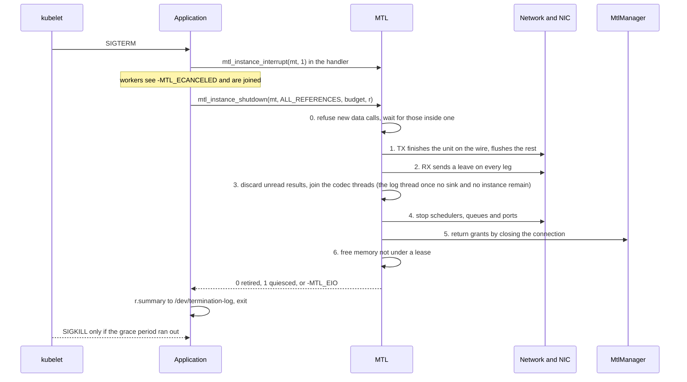

# Deployment: security, containers, Kubernetes pods and crash safety

| | |
|---|---|
| Status | The operator's document: security, containers, Kubernetes pods and crash safety. The Kubernetes rules are decisions D-89–D-92; the instance open and close land in MS1, health and the shutdown report in MS3 ([implementation-plan.md](implementation-plan.md) §6.2), and the engine fixes EK1–EK21 on the Kubernetes track beside the milestones, done by the MS3 exit (§6.10 there) |
| Date | 2026-10-02 |
| Headers | `mtl.h` (R4, R8, `mtl_instance_open`, `mtl_instance_close`, `mtl_instance_abort`, `env:` ports), `mtl_observe.h` (health, shutdown), `mtl_options.h` 400, 2010, 2020–2027, 2110, 2123–2125, 2203, 2207, `mtl_reasons.h` 10, 11, 104, 112–115, 520, 600–614, `mtl_events.h` events 23–25 |
| Baseline | `main` @ `545a266a`, DPDK 26.07 |

MTL runs with privileges most libraries never get. It owns NIC queues through VFIO, pins memory and
maps it for device DMA, runs polling tasklet schedulers on dedicated CPUs, and may talk to a root daemon. This
document says what each of those surfaces exposes, what the design does about it, and what stays the
deployer's job; then how MTL runs on bare metal, in containers and in Kubernetes pods, and what holds
after every way a process can end.

Evidence labels: **[verified]** = the source line or document was read; **[inferred]** = reasoning,
not re-checked: a hypothesis to test. Paths without a prefix are under `lib/src/`.

## 1. Threat model and surfaces

The threat model is **a local process boundary**. MTL does not defend a process against code running
inside it (the application, its plugins, its bindings). It must not let one process, or one mistake,
reach memory, devices or CPUs it did not ask for.

| Surface | New? | What can go wrong | Section |
|---|---|---|---|
| imported memory mapped into the IOMMU (`mtl_mem_import`) | yes | the NIC reads or writes memory the application did not mean to share; DMA into freed memory | §1.1 |
| wait handles (eventfd, Windows event `HANDLE`) | yes | descriptor leaks across `fork`/`exec`; an application draining the library's eventfd loses wake-ups | §1.2 |
| worker threads, affinity | yes | starvation of other threads; landing on a scheduler CPU | §1.3 |
| handle table | yes | handle confusion across sessions | §1.4 |
| null backend, test clock, fault injection | yes | a fake clock or fault injection in a production process | §1.5 |
| MtlManager socket | existing | any local user steering CPUs, XDP maps and flows | §1.6 |
| shared instance, several processes | extended | one component's settings imposed on another | §2 |

### 1.1 Imported memory and the IOMMU

`mtl_mem_import` (`mtl_mem.h`) takes application memory (anonymous, `memfd`, POSIX shmem, hugetlbfs
files, pinned host memory), pins it and maps it into every port and DMA engine a session using it needs
(rule MEM1 of `mtl_mem.h`). From then on the device can **read** it (TX) or **write** it (RX) without the CPU.

- **Page alignment.** `va` and `length` must be page aligned (hugepage aligned for hugetlbfs), else
  `-MTL_EINVAL` with reason `UNALIGNED`. The IOMMU maps whole pages, so rounding out would expose the
  neighbouring bytes: readable by the NIC on TX, writable on RX. MTL never rounds. Offsets and strides
  inside an aligned region stay byte granular (`stride_align` 1). The accepted page sizes are the port
  stats `caps.page_size` and `caps.hugepage_sizes`.
- **Access is a contract check, not IOMMU protection.** A region imported `MTL_MEM_READ` cannot back
  an RX session, which needs `MTL_MEM_WRITE`; 0 means read and write. A mismatch fails at attach with
  `-MTL_EINVAL` (`ACCESS_MISMATCH`). The IOMMU mapping itself is read-write in v1: DPDK maps every region
  with `VFIO_DMA_MAP_FLAG_READ` and `_WRITE` (DPDK 26.07 `lib/eal/linux/eal_vfio.c:1442-1443`), and
  `rte_dev_dma_map` takes no direction. So a NIC on a TX-only region could still write it, and the
  flags protect against mistakes in MTL and the application, not against the device. A read-only CPU
  mapping (`PROT_READ`) is accepted copy only (`direct` 0): the kernel's write-pin of a read-only VMA
  fails **[inferred]**. The region rules are [contract.md](contract.md) §9.2.
- **Lifetime.** The mapping lives until `mtl_mem_close` returns 0, which happens only when no session,
  slot, in-flight unit or DMA references the region; otherwise it returns 1 and
  `MTL_EVENT_REGION_RELEASED` reports the end. The application must not `munmap`, free or truncate the
  memory before that: the device could DMA into pages the kernel has reused, a device-level
  use-after-free the library cannot detect. Teardown order: close each session until
  `mtl_session_close` returns 0, then close the region.
- **Shared memory is shared.** Every process mapping a `memfd` or shmem region can change it while a TX
  unit is in flight, and sees what the NIC writes on RX: the sharer's choice, not a library bug. Seal
  `memfd` regions with `F_SEAL_SHRINK | F_SEAL_GROW` before import. Regular files are copy only
  (`MTL_BACKING_FILE`, `direct` 0 in `mtl_mem_get_info`); hugetlbfs files are direct.
- **PA mode** (no IOMMU, `--iova-mode=pa`) protects nothing: the device reaches any physical address.
  It is the port stat `caps.iova_mode`, and open refuses it unless `instance.allow_noiommu` (§4.11).
  With the option set, imports are copy only (`direct` 0), and a session with
  `MTL_SESSION_REQUIRE_DIRECT` over one fails with `-MTL_ENOTSUP`.
- **Budget.** Imports use IOMMU mappings and memseg entries; `caps.max_regions` and `-MTL_ENOSPC`
  (`REGION_BUDGET`) stop one process exhausting them. Pinning counts against `RLIMIT_MEMLOCK`; a failed
  pin is a clean `-MTL_ENOMEM`, never a partial mapping.

### 1.2 Wait handles

`mtl_get_wait_handle` (`mtl_session_get_wait_handle`, `mtl_instance_get_wait_handle`) returns an
`intptr_t`: a Linux eventfd (poll for `POLLIN`) or a Windows manual-reset event `HANDLE` (from MS2a).

The library **owns** it: the application may poll or wait on it, never read, write or close it. A
call that finds nothing resets it (R2), so an application that reads or resets it steals a wake-up.
It is close-on-exec and non-blocking (R8; fork: §4.4). It carries no data and grants no access: a
write to it only causes a spurious wake-up, which every wait loop tolerates.

### 1.3 Threads, priorities and affinity

- No library thread asks for a real-time priority: the workers, the admin thread and the log-sink
  thread run `SCHED_OTHER`. The wake-ups of the deferred wake run on each scheduler's own CPU,
  after its tasklets, one object per iteration (D-142); a slack gate or a waker thread (W3) is built
  only by D-142's rules. Threads that wait in MTL calls or on MTL wait handles run on CPUs disjoint
  from the scheduler lcores: the kernel's wake-affine placement can otherwise put a woken thread on a
  scheduler's CPU and preempt it.
- Affinity is explicit: every non-scheduler thread runs on `instance.main_lcore`, never on a scheduler
  CPU, never with the creating thread's affinity (§4.7). `MTL_INSTANCE_TASKLET_THREAD` (no dedicated
  CPUs) makes schedulers preemptible pthreads, still pinned one per CPU and registered with
  `rte_thread_register` (an lcore ID and a mempool cache).

### 1.4 Handles

- Handles are 64-bit values (`index | generation`) checked against a process-wide table whose slots are
  never freed (R4); no call dereferences them. 0 is null for every type; a closed handle is never reissued.
- Lease generations are random per session and skip 0, and a lease names its session, so a foreign or
  stale lease fails with `-MTL_EBADF` or `-MTL_ESTALE` instead of acting on another session's slot.
- Handles are **not capabilities**: they mean nothing outside their process, and the randomness defends
  against mistakes (reuse after close, cross-session mix-ups), not hostile code.

### 1.5 Null backend, test clock and debug API

| Piece | Built | Why |
|---|---|---|
| null backend (port `null:<n>`) | always | touches no device and no clock; needed by bindings and doc tests on release builds |
| test clock (the faults `MTL_FAULT_TEST_CLOCK` and `MTL_FAULT_CLOCK_ADVANCE` of `mtl_debug_inject`, `mtl_debug.h`) | only with `-Denable_debug_api=true` | a fake clock re-times every session of the instance |
| fault injection (`mtl_debug_inject`, `mtl_debug.h`) | only with `-Denable_debug_api=true`; never in release packages | forces ERROR, drops packets, fakes link and manager loss |

The meson option is independent of `buildtype` (`./build.sh debug` does not set it); it replaces
today's TX mutation helpers, compiled into every debug build (`-DMTL_SIMULATE_PACKET_DROPS`,
`lib/meson.build:91-96`). A release library keeps the `mtl_debug.h` entry points as stubs returning
`-MTL_ENOTSUP`, so generated bindings still load, and links no fault or test-clock code; CI checks both
builds. A debug-API library logs a warning at open and reports it in its stats.

### 1.6 MtlManager trust

MtlManager is a root daemon: it grants CPUs across processes, loads XDP programs, adds flows and UDP
filters, and hands out XSK map descriptors. At `545a266a` **[verified]** unless marked:

- the socket `/var/run/imtl/mtl_manager.sock` (`manager/mtl_mproto.h:16`, no override) is mode `0777`
  ("Allow all users to connect (which might be insecure)", `manager/mtl_manager.cpp:95-96`);
- a client's identity is the PID and UID it writes in its own register message (`mt_instance.c:213-214`,
  read at `manager/mtl_instance.hpp:191-213`); there is no `SO_PEERCRED`;
- so any local user can get an interface's XSK map descriptor over `SCM_RIGHTS`
  (`manager/mtl_instance.hpp:244-269`), add or remove flows and take CPUs (SF-47);
- the manager's `send`/`sendmsg` pass no `MSG_NOSIGNAL` and it does not ignore SIGPIPE
  (`manager/mtl_instance.hpp:58`, `:269`), so a client that disconnects early can kill it (SF-48,
  **[inferred]**).

The library survives manager loss (§4.12). The manager needs, whatever the API: mode `0660` with a
group (for example `mtl`), `SO_PEERCRED` identity, grants owned per client, SIGPIPE ignored (EK5,
[engine.md](engine.md)), backported to the legacy API.

## 2. Processes and instances

- **One EAL per process** (`--in-memory`): no secondary processes, no session shared between processes.
- **At most one instance per port set.** One EAL per process means one instance per port set. A
  second `mtl_instance_open` of a port the process already has open, without `MTL_INSTANCE_SHARED`,
  fails with `-MTL_EEXIST` (`INSTANCE_MISMATCH`) (OI-49).
- **One shared instance per process.** `MTL_INSTANCE_SHARED` gives the components of one process (a
  GStreamer element, an FFmpeg device, the application) one refcounted instance. Each open returns its
  own reference handle. A later open that names ports, lcores, time source or options that differ from
  the live instance fails with `-MTL_EEXIST` (`INSTANCE_MISMATCH`), so no component silently
  reconfigures another's instance.
- **Separate processes share time, not state.** One process per essence aligns through the SMPTE
  epoch, on which every session runs, and `mtl_epoch_index_at` ([timing.md](timing.md)). CPUs between
  processes come from the affinity mask, OFD locks or MtlManager (§4.7).
- **Re-open in the same process.** After a close that returned 0 or 1, open works again on the same
  ports and a subset of the first open's CPUs (EAL keeps its first arguments), as a GStreamer pipeline
  cycling NULL → PLAYING needs. A quarantined port stays `-MTL_EBUSY` (`QUEUE_QUARANTINED`) until exit.

## 3. Bare metal and containers

**Bare metal.** Everything in §4 applies, except that the host owns the CPUs, the hugepage pool and the
clock. MtlManager arbitrates CPUs and queues between processes; without it, `instance.runtime_dir`
names a directory for one OFD lock per CPU, shared by the processes (§4.7). The built-in PTP client
(`MTL_TIME_SOURCE_PTP_BUILTIN`) may discipline the PHC of a PF that MTL owns; on a VF it disciplines
MTL's own software time base, as today, and never the VF's PHC (§4.8). `time.phc2sys` may steer
`CLOCK_REALTIME`. Both restore the frequency at close (EK10).

**Containers** (Docker, Podman, or a pod) need the VFIO device nodes of their VFs (`/dev/vfio/N`,
`/dev/vfio/vfio`); hugepages (with `--in-memory` the resource is enough, no hugetlbfs mount
**[inferred for MTL]**; DPDK still reads `/sys/kernel/mm/hugepages`); `RLIMIT_MEMLOCK` large enough for
pools and imports, or an effective `CAP_IPC_LOCK` (§4.11); `CAP_SYS_NICE` on multi-socket hosts
(§4.14); the MtlManager socket, bind-mounted with a group the
container user is in, only for AF_XDP on shared netdevs; `MTL_INSTANCE_TASKLET_THREAD` where CPUs are not dedicated. The null backend needs none
of this and is the recommended way to run an application's own CI in an ordinary container.

## 4. Kubernetes

### 4.1 What a pod changes

1. **It ends on a timer**: SIGTERM, the grace period, then SIGKILL. A teardown that waits on a stuck
   queue, on MtlManager or on the network turns every rollout into a SIGKILL.
2. **It restarts in place**, with the same VF (just reset by vfio), IPC namespace and emptyDirs.
   Nothing from the previous run may block the next.
3. **It sees only what it was given**: a cpuset, a VF from the SR-IOV device plugin, a hugepage cgroup
   limit, maybe no writable root filesystem, no host PID or IPC namespace.
4. **Others decide about it from outside**: probes decide restarts and readiness; `kubectl describe`
   shows why it died.

The facts the design rests on:

| Fact | Consequence for MTL | Mark |
|---|---|---|
| `terminationGracePeriodSeconds` (default 30 s) covers `preStop` and SIGTERM handling; then SIGKILL; a `preStop` still running at expiry gets one 2 s extension | one bounded shutdown; budget counted from SIGTERM | [verified, k8s pod lifecycle and hooks docs] |
| hard node-pressure eviction uses a 0 s grace period and ignores PDBs and the pod's grace period | correctness never depends on the shutdown running | [verified, eviction docs] |
| an OOM kill is SIGKILL without SIGTERM; Guaranteed pods get `oom_score_adj` −997 | as above | [verified; "no SIGTERM" inferred] |
| `preStop` is delivered at least once, also before a liveness- or startup-probe kill, and a failed hook kills the container | `preStop` work is idempotent; a liveness kill runs the same shutdown | [verified, hooks docs] |
| only PID 1 of each container gets SIGTERM; PID 1 ignores signals left at their default disposition | the application handles SIGTERM, or the image runs `tini` | [inferred, pid_namespaces(7)] |
| a shell wrapper without `exec` is PID 1 and swallows SIGTERM; `ContainerStopSignals` lets a pod pick another stop signal (it needs `spec.os.name`) | start the binary with `exec`; handle the configured stop signal, not only SIGTERM | [verified for the feature; the wrapper inferred] |
| graceful node shutdown is off unless `shutdownGracePeriod` is set; a non-graceful shutdown force-deletes pods | a node shutdown can be a SIGKILL | [verified, node shutdown docs] |
| the SR-IOV Network Operator drains the node, by pool, when it reconfigures VFs | a VF policy change restarts every SR-IOV pod on the node | [verified that drains are pool scoped; the restart inferred] |
| a container restart keeps the network namespace, emptyDirs (also `medium: HugePages`), the IPC namespace and the VF; the PID namespace and root filesystem are new | nothing found by PID; no state in SysV IPC or `/tmp` | [verified for netns and emptyDir; inferred for IPC and VF] |
| vfio-pci resets the function on last close (`vfio_pci_core_disable`, `vfio_pci_core.c:683-810`: bus master off, IRQs off, FLR) and again on open (`:612`) | a SIGKILL stops the device; the next run starts from a reset VF | [verified] |
| an ice VF reset clears promiscuous, all-multicast and FDIR and rebuilds the VSI (`ice_vf_lib.c:889-982`); PF admin state (MAC, VLAN, Tx rate) persists (`:491-521`) | MTL reads the admin state, never sets the MAC | [verified] |
| sriov-cni applies VLAN, MAC, rates, spoof check and trust at ADD and restores them at DEL (`cni.go:98-110`, `:240-325`); it neither saves nor restores all-multicast, promiscuous or multicast filters | VF-requested state is the vfio reset's to clear | [verified] |
| the SR-IOV device plugin sets `PCIDEVICE_<RESOURCE>=0000:03:02.1,…` and mounts `/dev/vfio/N` and `/dev/vfio/vfio`; it neither binds drivers nor creates VFs | ports named `env:PCIDEVICE_…#n` | [verified] |
| an untrusted E810 VF cannot enable promiscuous or all-multicast (`virtchnl.c:508-509`) and holds at most 18 MAC filters, unicast and multicast together (`virtchnl.h:26`, `virtchnl.c:965-970`) | about 16 multicast groups per untrusted VF; probed at open | [verified; the count inferred] |
| the static CPU manager gives exclusive CPUs only to Guaranteed pods with integer CPU requests; DPDK with no `-l` takes `sched_getaffinity` (`eal_common_options.c:2163-2168`); with load balancing disabled an unpinned thread stays where it started | CPUs from the affinity mask; every thread pinned | [verified; the last part inferred] |
| hugepages are per-container resources, requests equal limits, no overcommit; `/sys/kernel/mm/hugepages` shows the host pool | budget against the cgroup | [verified; the `/sys` view inferred] |
| vfio type1 charges pinned pages to `RLIMIT_MEMLOCK` unless `capable(CAP_IPC_LOCK)` (`vfio_iommu_type1.c:1659`, `:1777`), checked in the initial user namespace; `dma_entry_limit` caps mappings (65535); the Pod API has no rlimit field | memlock and mapping count checked at open; set-up A or B (§4.14) | [verified; the user-namespace case and the rlimit field inferred] |
| a VF's PHC is readable through virtchnl but not adjustable (`iavf_ptp.c:184-332`) | time read only in a pod | [verified] |
| `phc2sys` sets the kernel TAI offset (`ADJ_TAI`, `clockadj.c:211-219`, needs `CAP_SYS_TIME`) only when the UTC offset is traceable (`phc2sys.c:1137-1141`), else `CLOCK_TAI` = `CLOCK_REALTIME`; time namespaces offset only MONOTONIC and BOOTTIME (`kernel/time/namespace.c:31-35`) | `CLOCK_TAI` with offset 0 is rejected; a pod's TAI is the host's | [verified] |
| a crashed RX process sends no IGMP leave; the switch forwards for the group membership interval, 2 × 125 s + 10 s = 260 s at RFC 3376 defaults | residual 1 of §4.5 | [inferred] |
| Pod Security Standards: Restricted allows adding back only `NET_BIND_SERVICE`; Baseline's list has no `IPC_LOCK` | a pod adding `IPC_LOCK` needs a `privileged` namespace label or an exception | [verified] |
| an XSK binds in its socket's network namespace (`xsk.c:1645`) and needs `CAP_NET_RAW` there (`xsk.c:2196`) | MtlManager cannot resolve a pod's ifindex | [verified] |
| Media Communications Mesh's MTL DaemonSets run `privileged: true`, as root, with hostPath `/dev/vfio` and a hard-coded VF | today's practice is set-up C | [verified] |

More facts and their sources: [standards.md](standards.md). All twenty requirements K-REQ-1…20
are met by this design, several through the engine fixes EK1–EK21 ([engine.md](engine.md)) and the
node settings of §4.14; the map is [requirements.md](requirements.md) §5.

### 4.2 Shutdown

```c
/* mtl.h: what every program calls */
int mtl_instance_close(mtl_instance_h mt, int64_t timeout_ns);
/* mtl_observe.h: the same steps and return values, with flags and a report */
int mtl_instance_shutdown(mtl_instance_h mt, uint64_t flags, int64_t timeout_ns,
                          struct mtl_shutdown_report* r, size_t size);
```

- **References.** A reference that is not the last only drops itself; the call returns 0 at once
  (`references_left` > 0). `MTL_SHUTDOWN_ALL_REFERENCES` shuts down the shared instance for every
  component of the process. The application that owns `main()` uses it on SIGTERM; a plugin never
  does. The other components' handles then get `-MTL_ESHUTDOWN`, and their close returns 0.
- **Objects closed by the instance.** Sessions and regions still open are closed by it, sessions
  in reverse attach order (a session over another session's pool before the owner).
  Because handle slots are never freed (R4), their handles stay safe: data calls return
  `-MTL_ESHUTDOWN` (reason `INSTANCE_SHUTDOWN`), blocked waits wake with it, `mtl_session_close` returns
  0, and `mtl_rx_release`/`mtl_tx_release` of an earlier lease return 0.
- **Not from a library thread.** From the log-sink callback or a codec thread the call returns
  `-MTL_EDEADLK` and does not consume `mt`: the shutdown joins those threads.
- **Timeouts.** 0 means abort semantics (no drain). `MTL_FOREVER` still bounds each step by its own
  budget.
- **Instance close flushes queued TX units.** To send them, close the sessions first:
  `mtl_session_close` drains.



| Step | What | Bounded by | Typical time |
|---|---|---|---|
| 0 | New data calls return `-MTL_ESHUTDOWN`; health shows `SHUTTING_DOWN`, so readiness fails. Threads already inside a data call are waited for through each session's in-flight counter. | the deadline | µs; a UHD conversion in the caller: ms |
| 1 | TX: the unit whose first packet left is sent to its end at its pace, with its normal result: the wire never carries a partial unit. Rows units end by `tx.rows_late` (STALL as TRUNCATE). Queued units: `MTL_TX_FLUSHED`, reason `CLOSE`. `MTL_SHUTDOWN_DRAIN` sends every queued unit instead, until the deadline minus what steps 2–6 need. | the deadline | one unit (16.7 ms at 59.94p) |
| 2 | RX: an IGMP/MLD leave on every leg before the queues close; incomplete units are discarded and counted. | never waits on the network | one packet per group |
| 3 | Results no reader took are discarded and counted (`results_discarded`), so a framework that frees buffers on results reaps before it shuts down. Then the codec threads are joined, and the log thread once no sink and no other instance remain; one stuck in foreign code counts in `threads_unjoined`. | the deadline | ms |
| 4 | Schedulers stop, then queues and ports; flows go, AF_XDP sockets close, regions leave the IOMMU only after the queues stopped. A stuck queue runs the stalled-queue steps ([engine.md](engine.md)): a port reset if the budget left covers `caps.reset_budget_ns`, else quarantine. | the deadline | ms; a stuck rate-limit queue: up to the reset budget |
| 5 | MtlManager grants (CPUs, queues, flows, XDP references) are returned by closing the connection, after step 4: a grant returned while still in use is the double booking in today's `mtl_uninit`, where `mt_sch_mrg_uinit` releases the lcores before it frees the schedulers still polling them (`mt_sch.c:1022-1030`). | socket close | µs |
| 6 | Library pools are freed, except slots under a lease the application still holds. | — | ms |

- **Stuck threads.** A thread stuck in foreign code past the deadline is not joined, and the memory it
  can reach is not freed; nor is memory a thread still inside a data call can reach.
- **Quarantine.** The stalled-queue steps are a bounded cleanup, then a queue stop and restart, then a
  port reset. A queue that still cannot be stopped, or whose reset fails, is quarantined: its port
  counts in `ports_unquiesced`, nothing it can reach is ever freed, and a later open of that port in the
  same process returns `-MTL_EBUSY` (`QUEUE_QUARANTINED`). Health shows `DEVICE_FAULT`.
- **Abort.** `mtl_instance_abort()` (AS) during the call skips to the hard stop: TX stops at the next
  packet, the cut unit is `MTL_TX_FLUSHED` (reason `ABORTED`) with `MTL_TXR_PKT_SHORT`, then the device steps run at
  once. A second SIGTERM maps to it. After close it does nothing.
- **The budget counts from SIGTERM.** The handler records the time (`clock_gettime` is AS-safe); the
  main thread passes `grace − preStop time − margin − time already spent` (ex11 keeps 2 s for its own
  exit and never passes less than 100 ms). The downward API does not expose
  `terminationGracePeriodSeconds`, so the pod repeats it in an environment variable. Set
  `terminationGracePeriodSeconds ≥ preStop + drain + reset budget + 2 s`. Without
  `MTL_SHUTDOWN_DRAIN` the drain is one unit, so the default 30 s is generous. Size the margin for the
  reset, not the drain: four queued 59.94 Hz units are 67 ms, but a stalled rate-limit queue holds its
  units until the port reset, so `caps.reset_budget_ns` sets the margin.
- **`preStop`** is for work that must happen before SIGTERM, such as NMOS IS-04 unregistration
  ([nmos-ipmx.md](nmos-ipmx.md)). Its time comes out of the same grace period. MTL teardown never
  belongs there.
- **No more than that.** No shutdown thread in MTL: the application's main thread runs the shutdown,
  and the process exits right after it returns. No step runs that its remaining budget cannot cover
  (reported and skipped, never extended). Shutdown is a call of its own, not close with a
  thread-local report, because the flags and the report need a call.

### 4.3 Outcomes and the report

| Return | Meaning | The application |
|---|---|---|
| 0 | retired: every object freed, every library thread joined | exits, or opens again |
| 1 | quiesced: no device can reach any memory, but something is still held: leases or regions (`leases_out`, `regions_referenced`), or a library thread still in application code (`threads_unjoined`) | exits; or, long-lived, returns the leases. A slot's memory is freed by the process's next control-plane call after its last lease returns, or at exit (`bytes_kept`) |
| `-MTL_EIO`, reason `QUEUE_QUARANTINED` | a port could not be stopped (`ports_unquiesced`); its memory is quarantined | exits now: the kernel's VFIO release turns bus mastering off and resets the function |

Close and shutdown return only these three values, never `-MTL_ETIMEDOUT`: a drain that runs out of
time flushes the rest and the call still returns 0 or 1 (`units_flushed` counts it). `-MTL_ETIMEDOUT`
comes only from a DRAIN `mtl_session_stop` that missed its deadline, and it is never the unsafe case;
`mtl_session_close` returns 0 or 1. Freeing library memory under a lease the application holds would turn an application
bug into a use-after-free; `mtl_rx_release` is DP and cannot free, so the next control-plane call does.

`struct mtl_shutdown_report` (200 B, filled whatever the call returns; `r` may be NULL) counts each
step (`reason` names the first that did not finish; `ports_unquiesced` is a bit per port) and ends with
`summary[128]`, one line for the termination message, for example
`shutdown 41 ms: 3 sessions closed, 1 unit flushed, 4 groups left, 0 leases out, port 0 quiesced`.
`kubectl describe` shows it; `terminationMessagePolicy: FallbackToLogsOnError` covers silent crashes.

### 4.4 Signals and fork (R8)

- **No handlers.** The library installs no signal handler and no `atexit`, and never calls `exit`;
  nor do the framework plugins (GStreamer, FFmpeg) or codec plugins: the host application owns
  signals and turns SIGTERM into work on an ordinary thread (a self-pipe, `signalfd`, or a flag; ex11
  uses the handler plus `mtl_instance_interrupt`). Nothing relies on SIGTERM arriving: the design holds
  for SIGKILL. DPDK's own are the
  exceptions: it swaps the SIGBUS handler while it grows its heap (`eal_memalloc.c:100-121`
  **[verified]**; MTL allocates at create, so only then), `instance.hotplug` installs its hotplug
  handler, and its telemetry socket registers an `atexit` (`telemetry.c:610-652` **[verified]**), off by
  default (`instance.telemetry`).
- **AS calls at any time.** A handler may call `mtl_instance_interrupt(mt, 1)`, `mtl_instance_abort(mt)`,
  `mtl_session_interrupt(s, 1)` and `mtl_interrupt` with `MTL_INTR_ON` at any time, also during and
  after close. Their state lives in the never-freed handle slot. Every AS call, every wake and every
  syscall on a wait handle runs inside the slot's in-flight counter; retire marks the slot RETIRED
  and waits for the counter before closing the descriptor, so a late signal never writes into a
  recycled descriptor (in ex11 that descriptor number could have been `/dev/termination-log`). An AS
  call keeps `errno` and never writes `mtl_last_error()`; in a `fork()`ed child it returns
  `-MTL_EBADF`.
- **The recipe ([examples.md](examples.md), ex11).** Block SIGTERM and SIGINT before open and before any
  thread exists; install the handlers after open, then unblock, so a signal during open stays pending
  (as PID 1 an unhandled SIGTERM is discarded; or run `tini`; a wrapper script must `exec` the binary).
Handle the pod's configured stop signal if it is not SIGTERM. Workers leave on the sticky
  `-MTL_ECANCELED`; the main thread joins them and calls `mtl_instance_shutdown`.
- **Close-on-exec.** Every descriptor MTL opens is close-on-exec. DPDK opens the VFIO group and
  container descriptors (`eal_vfio.c:367`, `:379`, `:1297`) and its hugepage memfds
  (`eal_memalloc.c:224-247`) without it **[verified]**, so MTL sets `FD_CLOEXEC` on them after EAL init
  and after every allocation that can grow the heap (EK15).
- **Fork.** An instance belongs to the process that opened it. Close-on-exec does nothing for a fork
  without exec: the child would keep the VFIO descriptors, the manager socket and the OFD CPU locks, and
  a SIGKILL of the parent would not release them. A `pthread_atfork` child handler therefore closes
  every descriptor MTL tracks (VFIO, MtlManager, CPU locks, eventfds); this does not touch the parent's
  device. In the child every call returns `-MTL_EBADF` (reason `FORKED`) except close, which drops local
  state only. Library memory is `MADV_DONTFORK`, so a child that touches it segfaults: the intended
  failure. Since about Linux 5.12 the kernel copies pinned anonymous pages early at fork, so the parent
  keeps its DMA pages even without it **[inferred]**. Imported regions are the application's, and the
  documentation warns about them. `system()`, `popen()` and `posix_spawn` are safe under this rule.

### 4.5 The crash contract

Kinds of ending: **(a)** orderly, close or shutdown returned 0 or 1, then the process exited; **(b)**
SIGKILL at any instant, including inside a library call; **(c)** device removal, or a reset that does
not recover, while the process runs. Owners: **K** kernel, **L** library, **M** MtlManager,
**A** application, **O** orchestrator (kubelet, CNI, device plugin).

| Resource | (a) orderly | (b) SIGKILL | (c) device removal | Owner |
|---|---|---|---|---|
| instance threads | joined, or counted as stuck in foreign code | gone with the process | stay; `PORT_REMOVED`, health `DEGRADED` or `SESSION_LOST`; close works | L / K |
| TX session | unit on the wire finished, rest `MTL_TX_FLUSHED`; every accepted unit has a result | the wire stops (bus master off at descriptor release); a partial frame on the wire | ERROR `DEVICE_GONE`, or a degraded 2022-7 leg; units `MTL_TX_FLUSHED`; waits `-MTL_ENODEV` | L / K |
| RX session | leave sent on every leg | **no leave**: the switch floods until the querier ages the group out (about 260 s) | ERROR or degraded leg | L / K |
| lease held by the application | release returns 0; the slot is freed after its last lease | gone | release still works; the slot is never reused for that device | L |
| library pools (hugepages, `--in-memory`) | freed, slot by slot as leases return | freed by the kernel; with an IOMMU, pinned pages outlive the DMA | not freed under a lease | L / K |
| imported regions | unmapped from the device before `mtl_mem_close` returns 0 | IOMMU unmap after DMA is off; the memory dies with the process | the removed port's mapping goes with its VFIO descriptor | L / K |
| **no-IOMMU mode** | as (a) | **no guarantee: DMA may hit freed pages** | **no guarantee** | refused unless `instance.allow_noiommu` |
| wait handles (eventfds) | closed once the last async-signal-safe caller left | closed by the kernel | stay; the instance's handle delivers `PORT_REMOVED` | L / K |
| codec plugins | `stop` called; threads joined or counted unjoined | gone | sessions ERROR; plugin stopped as in (a) | L / A |
| CPUs, Guaranteed pod | nothing to release: the cpuset is the lease | nothing | — | O |
| CPUs, MtlManager | returned on socket close, after the schedulers stopped | returned at socket EOF | — | M / K |
| CPUs, OFD locks in `runtime_dir` | released | released by the kernel at the last close; no PID involved | — | K |
| VF queues, rate-limit nodes, `rte_flow` rules | stopped and destroyed | FLR at descriptor release, the PF clears the VF's queues and filters **[inferred]**; flushed again at the next open | gone with the device | L / K |
| manager ntuple rules, XDP program, XSK map entries | removed by the manager at client EOF | the same at EOF; **if the manager itself is killed** they stay until it restarts and reconciles | the manager drops them with the netdev | M |
| AF_XDP `tx_maxrate` (written by the library through sysfs, §4.13) | cleared to 0 when the library releases the queue (`dev/mt_af_xdp.c:889-892`) | **stays on the kernel queue**; the manager resets it when it grants the queue again (EK5) | goes with the netdev | L / M |
| built-in PTP on a PF | frequency restored at close | **frequency offset stays** on the PF's PHC until the next owner sets it | — | L; in a pod the node daemon owns the PHC |
| VF MAC, VLAN, trust, spoof check | untouched (the CNI's) | untouched | — | O |
| files and IPC | none: `--in-memory` backs hugepages with `memfd_create(MFD_HUGETLB)` (DPDK `eal_memalloc.c:224-247`), so no hugetlbfs file stays in an emptyDir `medium: HugePages`, which survives a container crash; OFD lockfiles stay, unlocked by design | the same | unaffected | L / K |
| the VF itself | returned to the device plugin's pool at pod deletion | the same | the device plugin reports it unhealthy | O |

**Residual effects of a SIGKILL**, with owner and duration:

1. Stale IGMP membership for the switch's group membership interval (about 260 s). Operators enable an
   IGMP querier and fast-leave on media VLANs; later, MtlManager sends leaves for a dead client.
   Only the kernel-socket backend leaves correctly after SIGKILL, at socket close **[inferred]**.
2. A partial frame on the wire; receivers count it as incomplete.
3. XDP state while MtlManager is down, until it restarts and reconciles; an AF_XDP queue's
   `tx_maxrate` after the library was killed, until the manager grants the queue again and resets it
   (EK5). Without a manager the rate stays for the queue's next user, MTL or not **[inferred]**.
4. A PHC frequency offset left by the built-in PTP client on a PF, until the next owner sets the
   frequency. It cannot happen on a VF, where the client steers only MTL's software time base.

None of these blocks the next start. **Open assumes the previous run died uncleanly**: it flushes
`rte_flow` rules and rate-limit configuration on the VF, does not assume a clean TM tree, and logs one
line per kind of thing it reconciled (`instance.reconciled{kind}`). It never resets state the CNI owns
(MAC, VLAN, spoof check) and reconciles only names and ranges MTL created.

### 4.6 Device removal and reset

DPDK reports `RTE_ETH_EVENT_INTR_RMV`, `INTR_RESET` and the `ERR_RECOVERING` / `RECOVERY_SUCCESS` /
`RECOVERY_FAILED` events per port. Today MTL registers none of them (grep of `lib/src`
**[verified]**). The callbacks will only post to the admin worker; nothing is closed inside a callback,
as DPDK's documentation requires (EK14).

| Event | What MTL does | The application sees |
|---|---|---|
| **reset** (a PF reset resets every VF: far more common than removal) | the worker runs `rte_eth_dev_reset`, restores queues and flows, re-joins groups; a bounded device step, so it counts as worker progress for health | `MTL_EVENT_PORT_RESET`; sessions on the port report `MTL_EVENT_RECOVERY` and resume; units in between are `MTL_TX_FAILED` with reason `PORT_RESET` |
| **removed**, or a reset that fails | the port becomes REMOVED, its legs oper-down; a 2022-7 session with a surviving leg goes on degraded (`LEG_STATE`), one with no leg left goes ERROR (`DEVICE_GONE`) | `MTL_EVENT_PORT_REMOVED`; health `DEGRADED`; `SESSION_LOST` (liveness) only when a started session has no leg left or every port is gone; calls on a session with no leg: `-MTL_ENODEV` |
| close after removal | skips every device step for that port; the removed VF's buffers run no free callback that touches the device | 0 |

MTL never closes the application's sessions on removal: they stay closeable in ERROR (as in Vulkan and
uverbs). A session with no leg left fails liveness, and the new pod brings a fresh VF; a pod still
sending on its other 2022-7 leg is not restarted. Removal handling needs no `instance.hotplug`.

### 4.7 CPUs

| Topic | Rule |
|---|---|
| which CPUs | `lcores` NULL: the opening thread's `sched_getaffinity()`, which is the pod's cpuset under the CPU manager. An explicit `lcores` naming a CPU outside the mask fails with `-MTL_EINVAL`, reason `CPU_NOT_ALLOWED`, before EAL starts. Lcore numbers reported to the application are CPU IDs. |
| arbitration between processes | `instance.cpu_arbitration` (`MTL_CPUARB_NONE`, `_LOCKS`, `_MANAGER`); absent = auto: none inside an exclusive cpuset (below); else MtlManager if its socket is present, else one OFD lock per CPU in `instance.runtime_dir` when set, else none (the affinity mask is the lease). SysV table, `kill(pid, 0)` and "manager optional" removed (EK6). |
| pinning | every scheduler is pinned to one CPU, `TASKLET_THREAD` included. `instance.main_lcore` is the CPU of EAL's main lcore and of every non-scheduler thread: by default the first CPU of the mask (EAL's default), never given a scheduler. The caller's threads and memory policy are never changed (EK13). Placement: the `sched.lcore` stat and the one-line open log. |
| busy polling under a quota | open reads the CFS quota (`cpu.max`) and flags it only when quota ÷ period is below the CPUs of the mask (a Guaranteed pod is fine). A shared cpuset is not visible from inside **[inferred]**; a non-integer CPU request always gives one. `instance.cpu_shared`: `MTL_CPU_SHARED_WARN` (default), `_REFUSE` (reason `CPU_SHARED`), `_SLEEP` (idle schedulers sleep). |
| SMT | a scheduler whose SMT sibling is outside the mask (so shared with another pod) is logged once. The kubelet's `full-pcpus-only` policy option prevents this. |
| NUMA | MTL cannot fix a mismatch inside a pod; `info.numa_mismatch` only reports it (§5). Run media pods under the Topology Manager policy `single-numa-node`, so the VF, the exclusive CPUs and the hugepages share a node. |
| IRQs | kernel-socket and AF_XDP pods depend on IRQ and softirq placement, which a pod cannot set: keep IRQs off their CPUs (`globallyDisableIrqLoadBalancing`, or on OpenShift the `cpu-load-balancing.crio.io`, `cpu-quota.crio.io` and `irq-load-balancing.crio.io` annotations set to `disable`). |

**Auto arbitration in a pod.** A pod mounts the MtlManager socket only for AF_XDP grants; manager CPU
arbitration inside the pod's exclusive cpuset would break K-REQ-8. So inside an exclusive cpuset auto
is none, even with the socket mounted: the affinity mask is the lease, and the manager grants only
AF_XDP queues, never CPUs. Setting `MTL_CPUARB_NONE` explicitly is the same.

**The OFD lock protocol.** `MTL_CPUARB_LOCKS` takes a non-blocking `F_OFD_SETLK` write lock on byte
n of `<runtime_dir>/lcore.lock` for host CPU n (CPU numbers in a pod are host numbers), file mode 0660
with a shared group. A held byte is a CPU in use; the kernel drops the lock when the last descriptor
closes, in any PID, IPC or user namespace. The layout is a compatibility contract: processes built from
different MTL versions on one host must agree on it. It replaces `/tmp/kahawai_lcore.lock` and the SysV
table (EK6). OFD locks need one inode for all processes: a bind-mounted host directory (not an
emptyDir, not NFS), with a shared GID. Rejected: SysV shm with `kill(pid, 0)`, which in pods
arbitrates nothing (one segment per IPC namespace) or frees a live pod's CPUs (PIDs from another
namespace look dead).

### 4.8 Time in a pod

| Source | In a pod |
|---|---|
| `MTL_TIME_SOURCE_AUTO` (default) | `CLOCK_TAI` when the kernel's TAI offset is set; else `SYSTEM_TAI` (`CLOCK_REALTIME` plus the UTC offset, ESTIMATED). From MS6 the VF's PHC comes first, read only, when a node daemon disciplines it (E9). AUTO chooses once, at open; from Phase 7 it is re-evaluated while running and falls back to `FREERUN` without a step ([timing.md](timing.md) §13). |
| `_PHC`, `_CLOCK_TAI`, `_USER` | as named; read only. `CLOCK_TAI` is rejected while the kernel offset is 0. |
| `_PTP_BUILTIN` | only when named, never by AUTO. On a PF that MTL owns it disciplines the PHC. On a VF it runs as today in software mode (`ptp->no_timesync`, `mt_ptp.c:1390-1393`): it disciplines MTL's own software time base, never the VF's PHC. `CLOCK_NOT_OWNED` is only for a request to steer a PHC MTL does not own. |
| built-in phc2sys (`time.phc2sys`) | steers the node's `CLOCK_REALTIME`: never in a pod; restores the frequency at close. |

Built-in PTP on a VF needs PTP multicast to reach the VF (224.0.1.129 over UDP or 01:1B:19:00:00:00
over layer 2, each a MAC filter of the budget in §4.9, and a switch that forwards PTP to the VLAN),
and N pods run N clients with N slightly different estimates, so a node daemon disciplining the PHC
is preferred where one exists.

"Disciplined" needs a signal the pod can see; `time.phc_trust` gives it:

- **absent (detect)**: the PHC counts as disciplined when it agrees with `CLOCK_TAI` within a bound at
  start (the bound is a spike). Agreement cannot tell a grandmaster-locked PHC from a node in holdover,
  because the node's phc2sys keeps `CLOCK_REALTIME` (so `CLOCK_TAI`) on the drifting PHC: both agree
  while both drift. Only the application can tell MTL that the node lost its grandmaster, with
  `mtl_time_set_reference(..., locked = 0)` (`mtl_sync.h`);
- **`MTL_PHC_TRUST_YES`**: trust the node; **`MTL_PHC_TRUST_NO`**: never use the PHC.

The application can pass the grandmaster and clock class, read from the PTP operator's events or
`pmc`, with `mtl_time_set_reference()`. `mtl_time_set_reference()` (MS2) and `time.phc_trust`
therefore come with the pod time rules, not with NMOS; only their IS-04 use is Phase 7
([nmos-ipmx.md](nmos-ipmx.md)). No source needs `CAP_SYS_TIME` or `/dev/ptp*`
write access. The state is in `time.*` stats, `mtl_health.time_state`, `time_error_ns` and
`MTL_EVENT_TIME_STATE`.

**A PHC MTL does not own** (`CLOCK_NOT_OWNED`, 614, OI-7): `PTP_BUILTIN` together with
`time.phc_trust` = `MTL_PHC_TRUST_YES`, where the operator says a node daemon disciplines the PHC.
MTL cannot see a node ptp4l on the same PF, so without that option the built-in client on a PF
steers the PHC as today; on a VF it never steers a PHC.

### 4.9 Fail-fast open

Open runs every check that needs no device before it touches one. A misconfigured pod fails at once,
with one reason and a one-line `mtl_last_error()` detail the application writes to its termination
message, so a CrashLoopBackOff is diagnosable from `kubectl describe`.

| Check | Reason on failure | Code |
|---|---|---|
| each `env:VAR[#n]` port resolves (not in a set-uid process, where `env:` and `MTL_PORTS` are `-MTL_EINVAL`) | `PORT_ENV_UNSET` (608) | `-MTL_EINVAL` |
| the device node exists in the container (`/dev/vfio/N`), the process's user can open it, the device is bound to vfio-pci | `DEVICE_NODE_MISSING` (601), `DRIVER_MISMATCH` (602), `CAPABILITY_MISSING` (605) naming "/dev/vfio/N not writable" | `-MTL_ENODEV` (601, 602), `-MTL_ENOTSUP` (605) |
| an IOMMU is present (not no-IOMMU, not PA mode), unless `instance.allow_noiommu` | `NO_IOMMU` (600) | `-MTL_ENOTSUP` |
| hugepages within the **cgroup** hugetlb limit and the free pages | `HUGEPAGES_LIMIT` (603) | `-MTL_ENOMEM` |
| `RLIMIT_MEMLOCK` covers the pools, or `CAP_IPC_LOCK` is **effective** | `MEMLOCK_LIMIT` (604), naming which is missing | `-MTL_ENOMEM` |
| the capabilities the backend needs (§4.14), in the effective set | `CAPABILITY_MISSING` (605), naming it | `-MTL_ENOTSUP` |
| the CPUs (§4.7) | `CPU_NOT_ALLOWED` (606), `CPU_SHARED` (607) | `-MTL_EINVAL` (606), `-MTL_ENOSPC` (607, with `MTL_CPU_SHARED_REFUSE`) |
| `instance.runtime_dir`, when set, exists and is writable | `RUNTIME_DIR` (609) | `-MTL_EINVAL` |
| MtlManager, when the configuration needs it (AF_XDP on a shared netdev) | `MANAGER_REQUIRED` (610) | `-MTL_ENOTSUP` |
| AF_XDP: the socket or map from the node agent (`port.xsk_map`) | `XSK_UNAVAILABLE` (611) | `-MTL_ENODEV` |
| the named time source can be read; `PTP_BUILTIN` is not asked to steer a PHC MTL does not own (§4.8) | `TIME_SOURCE_UNAVAILABLE` (613), `CLOCK_NOT_OWNED` (614) | `-MTL_ENOTSUP` (613), `-MTL_EINVAL` (614) |

There is no preflight flag (rejected: an init container has its own CPUs, hugepage limit and memlock,
so it would check the wrong container). Node-level checks (IOMMU, VFs, drivers) belong in a node tool
or the operator's validation.

**After the devices**, open probes what each VF allows and publishes it as port stats: `caps.vf_trusted`
(promiscuous and all-multicast), `caps.mcast_filters_max`, `caps.pf_tx_rate_mbps`, hardware pacing and
TM, `caps.phc_readable`, `caps.iova_mode`, `caps.reset_budget_ns`. What needs more fails with a reason,
never silently and never inside a join:

| Request | When | Failure |
|---|---|---|
| `port.promiscuous` (2110), or any other port setting that needs promiscuous or all-multicast, on a VF the probe found untrusted | open, after the probe | `-MTL_ENOTSUP`, reason `VF_UNTRUSTED` (612). Today `rte_eth_promiscuous_enable` is called and its result ignored (`dev/mt_dev.c:1292-1296`), so an untrusted VF stays filtered without a word |
| one multicast group past the VF's filter budget (about 16 on an untrusted E810 VF, §4.1) | session create, or `mtl_session_update` with `MTL_UPDATE_FLOWS` | `-MTL_ENOSPC`, reason `MCAST_FILTERS` (115) |

MTL never sets the VF MAC (`mac` in `mtl_port_spec` is output only); the PF and the CNI own it.

**Open does not wait** for links, neighbours or time lock (today up to 30 s, 60 s and 180 s, §4.16).
Health reports the phase (`MTL_PHASE_LINKS`, `_TIME`, `_READY`, and `_SHUTDOWN` once close began). An application that must not send
before lock waits for `MTL_EVENT_TIME_STATE` LOCKED; units sent before lock carry `MTL_TXR_ESTIMATED`.

**Ports from Kubernetes.** `env:PCIDEVICE_INTEL_COM_E810_RED#0` takes the first address the device
plugin put in that variable. Use **one resource per ST 2022-7 network** (red and blue), so each leg's VF
comes from its own PF: with one resource for both legs there is no such guarantee, and `#0`/`#1` follow
the plugin's order, not the leg order. The address comes from the configuration (`sip`) or from
`MTL_PORTS` as `env:…#0=10.1.0.5/24`, so one image runs on any node. MTL ships no Multus reader;
the recipe is short: mount the pod annotations with the downward API, read
`k8s.v1.cni.cncf.io/network-status`, and for each network of the leg order fill one
`mtl_port_spec` with `name` = its `device-info.pci.pci-address`, `sip` = its first `ips` entry and
`prefix_len` from the network's IPAM configuration (the annotation carries none); while the file
or a network's entry is missing (Multus writes it, the kubelet refreshes it), retry.

### 4.10 Health and probes

```c
int mtl_instance_get_health(mtl_instance_h mt, struct mtl_health* h, size_t size); /* DP */
```

It returns the flags; `h` (152 B: `phase`, `reason`, `time_state`, counts, `oldest_loop_age_ns`,
`time_error_ns`, `detail[96]`) may be NULL. It copies a consistent snapshot of atomics, never torn
(`detail` is "" if it changed meanwhile), so it answers even when the control plane is wedged, which
is exactly when liveness matters. During close it reports `SHUTTING_DOWN` and masks `SCHED_STALLED`
(stopped schedulers no longer loop); after close it returns `-MTL_ESHUTDOWN`.

| Bit (`MTL_HEALTH_`) | Liveness | Readiness | Source |
|---|---|---|---|
| `SCHED_STALLED` | ✓ | ✓ | a scheduler's last loop is older than `instance.stall_ns` (1 s). The heartbeat also advances on wake-ups and timer ticks, so a sleeping idle scheduler is not stalled; open rejects a `stall_ns` below twice the longest scheduler sleep. `MTL_EVENT_SCHED_STALLED` warns at 1/8, 1/4 and 1/2 of the limit. |
| `WORKER_STALLED` | ✓ | ✓ | the admin worker (recovery, ARP, IGMP, commands) missed its heartbeat outside a bounded device step. A port reset, up to its budget, is progress, so a PF reset that hits every VF on a node never restarts every pod. |
| `SESSION_LOST` | ✓ | ✓ | a started session lost every leg to removed ports, or every port is gone |
| `DEVICE_FAULT` | ✓ | ✓ | a queue was quarantined, or a tasklet could not be unregistered and its memory was quarantined (EK2) |
| `STARTING` | | ✓ | phase below `MTL_PHASE_READY` |
| `NO_LINK` | | ✓ | no port has a link |
| `TIME_UNLOCKED` | | ✓ | time state ACQUIRING or LOST; FREERUN and HOLDOVER are ready (IPMX runs without PTP) |
| `MANAGER_LOST` | | ✓ | MtlManager went away; AF_XDP ports stop receiving |
| `SHUTTING_DOWN` | | ✓ | close or shutdown has begun |
| `DEGRADED` | | | information only: a link down or a port removed, or a started session in ERROR or with an enabled leg not resolved or joined |

`MTL_HEALTH_LIVENESS` (0xff) and `MTL_HEALTH_READINESS` (0xffff) are the masks. **Liveness never
depends on links, packets or PTP lock**, or a grandmaster outage or a switch reboot would restart every
pod on the network at once. Readiness fails only on what stops the whole instance from carrying media;
one bad stream does not take a whole NMOS Node out of service. `MTL_EVENT_HEALTH` reports every change.
The library never kills anything. In thread mode on shared CPUs a 100 ms preemption is normal, which is
why the liveness limit is 1 s.

The application serves the probes itself (HTTP or gRPC); an exec probe would fork a process on
exclusive CPUs every period. ex11 has the handler:

- **startup and liveness**: 503 until open returns, then on any liveness bit. The startup probe uses
  the liveness rule, so a grandmaster or link outage at start does not crash-loop the pod;
- **readiness**: 503 on any readiness bit;
- **after shutdown began** (`-MTL_ESHUTDOWN`): liveness 200, readiness 503.

Stats for exporters: per scheduler `sched.loops`, `sched.last_loop_tai_ns`, `sched.busy_pct_x100`; per
session `session.last_progress_tai_ns`, `session.leases_out`, `session.oldest_lease_ns`. The session keys
name the holder when a close returns 1, and that close logs one warning per session (once, not every
poll) with its count of held leases and the oldest lease's age; the age comes from the acquire
timestamp already in the lease table, so nothing is allocated per lease on the data path.

What health does not see, accepted and documented: a TX session whose scheduler loops but which makes
no progress (a stalled rate-limit queue) shows only in `session.last_progress_tai_ns` before it
reaches ERROR; an application thread wedged in a control-plane call that holds the instance mutex
sets no bit unless the admin worker needs that mutex (then `WORKER_STALLED`). With
`cpu-load-balancing.crio.io: disable` the probe server may share a CPU with a scheduler and miss the
1 s `timeoutSeconds`: pin it to `instance.main_lcore`, never a scheduler CPU.

### 4.11 Memory and the IOMMU

- **Budget against the cgroup.** The hugepage capacity MTL reports, and checks at open and create, is the
  container's hugetlb limit (`hugetlb.<size>.max` in cgroup v2, `hugetlb.<size>.limit_in_bytes` in v1)
  minus its usage, not the host's `/sys` counters: `mem.hugetlb_limit_bytes{size}`,
  `mem.hugetlb_usage_bytes{size}`. DPDK allocates at create and catches a SIGBUS during allocation
  ("SIGBUS: Cannot mmap more hugepages", `eal_memalloc.c:589-594` **[verified]**), so going over is
  `-MTL_ENOMEM` (`HUGEPAGES_LIMIT`) at create, never a SIGBUS later.
- **Memlock.** VFIO charges pinned pages to `RLIMIT_MEMLOCK` unless the process has `CAP_IPC_LOCK` in
  the initial user namespace; `CAP_IPC_LOCK` inside a user namespace (`hostUsers: false`) does not lift
  it. The type-1 driver also caps the mapping count (`dma_entry_limit`, 65535). Open checks both against
  the pools (`mem.memlock_limit_bytes`), `mtl_mem_import` against each import.
- **No-IOMMU is refused** unless `instance.allow_noiommu = 1`. In no-IOMMU mode nothing is pinned, and
  at exit `exit_mm` runs before `exit_files`, so anonymous hugepages can go back to the pool while the VF
  can still DMA until its descriptor closes **[inferred; a spike checks it]**: the NIC may write into pages
  the kernel gave to someone else. With an IOMMU, pages are unpinned only after DMA is off
  **[inferred]**. With the option set, open logs a warning naming the risk. Such pods are privileged and
  node-trusting: `/dev/vfio/noiommu-N` needs `privileged`, `IPC_LOCK` and `SYS_RAWIO` **[verified]**
  (vfio refuses a no-IOMMU group without `CAP_SYS_RAWIO`, `drivers/vfio/group.c:428-429`); PA mode reads
  PFNs from `/proc/self/pagemap`, which needs `DAC_READ_SEARCH` and `SYS_ADMIN` (DPDK Linux drivers
  guide, which calls no-IOMMU "inherently unsafe"). Clouds without a virtual IOMMU are the common case.

### 4.12 MtlManager in Kubernetes

A pod needs no manager by default: the CPU manager and the VF already isolate it. The manager remains
for AF_XDP on shared host netdevs and for bare-metal hosts. As a DaemonSet with its socket bind-mounted
into pods, it must be (EK5):

- **identity from the kernel**: `SO_PEERCRED` (or `SO_PEERPIDFD`), never a self-reported PID; socket
  mode `0660` with a group. The kernel translates a peer's PID into the reader's namespace (0 when not
  visible) and its UID into the reader's user namespace, so checks rest on UID/GID or a per-pod socket,
  never on the PID **[inferred]**;
- **netns independent**: ports named by PCI address or host ifname, never by the client's ifindex,
  which names another interface in the manager's namespace;
- **connection scoped**: every grant (CPUs, queues, flows, UDP filters) is released when the
  connection closes, and filters are tracked per client; a queue's `tx_maxrate` is reset when the
  queue is granted again (§4.13);
- **restartable**: clients re-register what they hold after a manager restart and the manager
  reconciles; it deletes only rules in its own range, takes a single-instance lock before unlinking the
  socket, handles SIGTERM and ignores SIGPIPE.

The library uses `MSG_NOSIGNAL` and a per-request timeout (EK4; open PR #1770 covers part). On manager
loss it posts `MTL_EVENT_MANAGER_LOST`, sets health `MANAGER_LOST` and never blocks; it closes its
connection only after its schedulers and sockets stopped (§4.2 step 5).

### 4.13 AF_XDP in pods

In a pod the node owns the XDP program: MtlManager, the AF_XDP device plugin or bpfman. `port.xsk_map`
names the XSK map or socket the node agent hands over: a bpffs pin path, an inherited `fd:<n>`, or
`uds:<path>` (`SCM_RIGHTS`). MTL then never loads, attaches or detaches a program; open fails with
`XSK_UNAVAILABLE` when there is none. Today native AF_XDP refuses to start without MtlManager
(`dev/mt_af_xdp.c:727-733` **[verified]**), so accepting a map from another agent is an engine change
(EK19). Today the manager-assisted path works in a pod only with `hostNetwork: true`: sriov-cni moves
a kernel VF into the pod's network namespace, where it has another ifindex, and the manager resolves the
client's ifindex in its own (H-K 4); without `hostNetwork` it needs EK5's netns-independent naming. A
netlink-attached program outlives its loader **[inferred]**, so a manager that attaches
programs holds a `bpf_link` (its crash detaches them) or reconciles at start. A `bpf_link` and a
netlink attach exclude each other on one interface, and libxdp's multiprog dispatcher uses netlink, so
EK5 picks one per interface: a manager that holds a `bpf_link` cannot use libxdp's dispatcher there.
Native XDP depends on the NIC driver; a manager that cannot attach native falls back to SKB mode
(`manager/mtl_interface.hpp:420-422`), and EK5 must then detach in SKB mode (H-K 25). XSK sockets and their map entries go with the process (`xsk.c:1574` **[verified]**).

**Rate pacing.** The library, not the manager, writes the queue rate today: a probe write to
`/sys/class/net/<if>/queues/tx-1/tx_maxrate` at init (`dev/mt_af_xdp.c:277-292`), the rate at queue
get (`:867-874`), 0 at put (`:889-892`) **[verified]**. An unprivileged pod mounts `/sys` read only, so
the probe fails and rate pacing on AF_XDP is unavailable: the session runs `MTL_PACING_SW` with
`MTL_STATUS_PACING_DOWNGRADED`, or fails at create when `caps.pacing_req` is `MTL_REQ_REQUIRE`. With EK19 and no
MtlManager nobody sets the rate.

**Who sets the rate in a pod** (OI-23): MtlManager, when it is the node agent that hands over
`port.xsk_map`, sets and resets the queue rate on MTL's behalf through a rate request in its
protocol (EK5). With any other node agent, AF_XDP in an unprivileged pod has software pacing only.
Intel's AF_XDP device plugin is unmaintained; the fork is
`redhat-et/afxdp-plugins-for-kubernetes` **[verified]**.

### 4.14 Files and privileges

MTL writes nothing unless `instance.runtime_dir` is set: no `/tmp` lock, no `/var/run/dpdk`, no
telemetry socket (`instance.telemetry`, default off), no implicit `kahawai.json` from the working
directory. EAL runs `--in-memory` with a per-instance file prefix (today the fixed `MT_DPDK`). A
read-only root filesystem then works (EK12).

**Capabilities are not enough for a non-root container.** For a container running as a non-root user,
`capabilities.add` lands in the bounding and inheritable sets but not the effective set
(kubernetes#56374, still open). With `allowPrivilegeEscalation: false`, file capabilities on the binary
do not help either. And the device plugin's `/dev/vfio/N` keeps its host ownership, root. Three set-ups
work:

| Set-up | How | Trade-off |
|---|---|---|
| **A. Non-root, node prepared** (recommended) | the container runtime runs with `LimitMEMLOCK=infinity`, which containers inherit **[inferred: true of the packaged containerd and CRI-O units; check the node]**, and with `device_ownership_from_security_context = true`, so `/dev/vfio/N` belongs to the pod's user and group. No capability added. | a node setting, done once |
| **B. Root in the container, unprivileged** | `runAsUser: 0`, drop ALL, add `IPC_LOCK` (and `SYS_NICE` on multi-socket hosts); no `privileged`, no host namespaces | root inside the container; outside the Restricted standard, and `IPC_LOCK` needs a `privileged` namespace label |
| **C. Privileged** | `privileged: true` | today's practice; not recommended |

Open names the missing piece, for example
`MEMLOCK_LIMIT: RLIMIT_MEMLOCK 8 MiB, need 4.1 GiB, CAP_IPC_LOCK not effective`, not a DMA mapping
failure later.

| Backend | Needs | Does not need |
|---|---|---|
| DPDK PMD on a vfio VF | the device plugin's `/dev/vfio/*` (owned as in A), hugepages (resource limit), memlock (A or B); optionally `SYS_NICE` | root (in A), hostIPC, hostPID, hostNetwork, `/sys` writes, `SYS_ADMIN` |
| AF_XDP | `NET_RAW` (non-root has the same caveat: set-up B, or a socket made by the node agent), an XSK map from the node agent, memlock for UMEM | `SYS_ADMIN`, `BPF` (the agent loads the program) |
| kernel socket | nothing extra | — |
| null | nothing | — |

Under seccomp `RuntimeDefault`, `get_mempolicy`, `set_mempolicy` and `mbind` need `CAP_SYS_NICE`.
Without it libnuma reports NUMA as unavailable and DPDK's NUMA placement is silently off; add `SYS_NICE`
on multi-socket hosts (set-up B), or accept the first node's memory. Open logs it.

### 4.15 A pod spec (set-up A)

```yaml
apiVersion: v1
kind: Pod
metadata:
  name: mtl-sender
  annotations:
    k8s.v1.cni.cncf.io/networks: media-red, media-blue # one SR-IOV network per 2022-7 leg
spec:
  terminationGracePeriodSeconds: 30 # >= preStop + drain + reset budget + 2 s
  securityContext:
    runAsUser: 10001
    runAsGroup: 10001
    runAsNonRoot: true
    seccompProfile: { type: RuntimeDefault }
  containers:
    - name: app
      image: example/mtl-app
      env:
        - name: MTL_PORTS # one resource per leg, so each VF comes from its own PF
          value: "env:PCIDEVICE_INTEL_COM_E810_RED#0=10.1.0.5/24,env:PCIDEVICE_INTEL_COM_E810_BLUE#0=10.2.0.5/24"
        - name: GRACE_SECONDS # repeats terminationGracePeriodSeconds, which the pod cannot read
          value: "30"
      resources: # Guaranteed QoS: integer CPUs become exclusive under the static policy
        requests: { cpu: "4", memory: 2Gi, hugepages-1Gi: 4Gi, intel.com/e810_red: "1", intel.com/e810_blue: "1" }
        limits: { cpu: "4", memory: 2Gi, hugepages-1Gi: 4Gi, intel.com/e810_red: "1", intel.com/e810_blue: "1" }
      securityContext:
        readOnlyRootFilesystem: true
        allowPrivilegeEscalation: false
        capabilities: { drop: [ALL] }
      terminationMessagePolicy: FallbackToLogsOnError
      startupProbe: { httpGet: { path: /live, port: 8080 }, periodSeconds: 2, failureThreshold: 30 }
      livenessProbe: { httpGet: { path: /live, port: 8080 }, periodSeconds: 5, failureThreshold: 3 }
      readinessProbe: { httpGet: { path: /ready, port: 8080 }, periodSeconds: 2 }
      volumeMounts:
        - { name: hugepages, mountPath: /dev/hugepages }
  volumes:
    - { name: hugepages, emptyDir: { medium: HugePages } }
```

- **Node settings** the spec relies on: the static CPU manager policy (with `full-pcpus-only`), the
  Topology Manager policy `single-numa-node` (§4.7), and the container runtime of set-up A (§4.14).
- The IPs here are static, from the application's configuration. With IPAM-assigned addresses the
  application reads them from the network-status annotation, mounted through the downward API, and
  builds the same spec.
- **Rolling updates.** A Deployment's default RollingUpdate starts the new pod before the old one stops,
  so two senders transmit to one group. Use `strategy: Recreate` for senders, or a controller that hands
  over at an NMOS activation (a new sender, then an IS-05 switch of the receivers). Receivers can roll.
- **Multi-container pods.** One instance per process; each container has its own VF, hugepage limit
  and CPUs and shares no files or IPC with the others. A sidecar MTL gateway stops after the app
  containers **[verified]**, so its bounded close must also cover clients that never said goodbye. Init
  containers cannot hold devices for the application **[inferred]**.

### 4.16 Today's code at `545a266a`

What the audit found, with the engine fix that removes it ([engine.md](engine.md) has the fixes, EK1–EK21).
**[verified]** unless marked.

| H-K | Hazard | Evidence | Fix |
|---|---|---|---|
| 1 | no-IOMMU never detected (no hit for `noiommu` or `enable_unsafe_noiommu_mode`); PA DMA into freed hugepages after SIGKILL **[inferred]** | grep of `lib/src`; `dev/mt_dev.c:453-461` | EK8 |
| 2–3 | opt-in phc2sys steers the node's `CLOCK_REALTIME` (`ADJ_SETOFFSET`, `ADJ_FREQUENCY`, `ADJ_TICK`) and never restores it; the PTP client leaves its frequency offset on a shared PF PHC | `mt_ptp.c:163-240`, `:358-390` | EK10 |
| 4 | MtlManager resolves a pod's ifindex in its own namespace: XDP on the wrong interface **[inferred]** | `dev/mt_af_xdp.c:390` (the client sends its ifindex); `manager/mtl_instance.hpp:274-276` (the UDP-filter handler takes it from the message); the resolution, `if_indextoname` in the manager's namespace, `manager/mtl_interface.hpp:171`, `:238`, `:272`, `:379`, and the attach at `:420` | EK5 |
| 5 | manager restart: clients never reconnect; `clear_flow_rules` deletes every ntuple rule on the interface | `mt_main.h:1268-1270`; `manager/mtl_interface.hpp:73-91`, `:168-233` | EK5 |
| 6–7, 24 | manager: only SIGINT handled, so SIGTERM kills it without cleanup **[inferred]**; socket `0777`, identity self-reported; a second manager unlinks the live socket | `manager/mtl_manager.cpp:57-61`, `:85`, `:96`; `manager/mtl_instance.hpp:191-213` | EK5 |
| 8 | library manager I/O: no timeout, no `MSG_NOSIGNAL`; a missing manager silently selects the shm allocator | `mt_instance.c:17`, `:24`, `:69`, `:91`; `mt_main.c:484` | EK4 |
| 9 | CPU allocators keyed by remapped lcore ID (`--remap-lcore-ids`), not CPU | `manager/mtl_lcore.hpp:11-55`; `mt_sch.c:744-760`; `dev/mt_dev.c:443-446` | EK6 |
| 10 | SysV lcore table (`ftok("/dev/null", 21)`, `/tmp/kahawai_lcore.lock`) with `kill(pid, 0)` and hostname checks; the clean tool clears nothing | `mt_sch.c:505-525`, `:550-556`, `:685-699`, `:1308-1333`; `mt_platform.h:57` | EK6 |
| 11 | `lcores` without `main_lcore` puts CPU 0 in `-l`; a worker CPU outside the cpuset is `rte_panic` | `dev/mt_dev.c:430-441`; DPDK `eal.c:838-843`, `:878-881` | EK7 |
| 12 | `numa_bind` rewrites the caller's affinity and memory policy | `mt_main.c:448-461` | EK13 |
| 13 | unbounded stop waits: `sch_stop`, `rte_eal_wait_lcore`, `mt_handle_drain`, `flock`, manager `recv` | `mt_sch.c:316-321`, `:517`; `mt_handle_guard.h:130`; `mt_instance.c:24` | EK1 |
| 14 | tasklet unregister times out at 1 s with `-EIO`, callers free anyway: use-after-free **[inferred]** | `mt_sch.c:885-901`; `st2110/st_tx_video_session.c:3902-3914` | EK2 |
| 15 | st20p TX free waits up to about 1 s per held frame; 16 sessions × 3 frames ≈ 48 s **[inferred]** | `st2110/pipeline/st20_pipeline_tx.c:722-753` | EK1 |
| 16 | no SIGTERM path: the library has none, RxTxApp and the samples catch only SIGINT | `tests/tools/RxTxApp/src/rxtx_app.c:350-359`; `app/sample/sample_util.c:478-509` | ex11 recipe |
| 17 | `mt_mcast_uinit` frees the group list without leaves; no gratuitous ARP at start | `mt_mcast.c:527-559`, leaves only at `:735-743` | EK9 |
| 18 | VF rate-limit state in the PF stays until a VF reset | `patches/ice_drv/2.6.7/0001-*.patch` | EK16 |
| 19 | AF_XDP `tx_maxrate` left on the queue; UDP filter refcounts per interface, not per client | `dev/mt_af_xdp.c:867-892`; `manager/mtl_instance.hpp:272-287` | EK5 |
| 20 | open blocks: link 30 s (the header comment's 90 s is wrong), ARP 60 s, PTP 180 s; `mtl_init` cannot be retried in-process | `dev/mt_dev.c:815-850`, `:500-503`; `mt_arp.c:171-203`; `st2110/st_tx_video_session.c:374-376` | EK18 |
| 21 | no heartbeat; the stat thread reads and resets counters without a lock | `mt_sch.c:162`, `:462-484` | EK11 |
| 22 | kernel-socket ARP busy-spins on a failing `sendto`; `mtl_abort` cannot stop it | `mt_socket.c:323-328` | EK3 |
| 23 | `kahawai.json` in the working directory can `dlopen` plugins | `mt_config.c:52-61` | EK12 |
| 25 | SKB-mode XDP never detached: the mode is overwritten to NATIVE | `manager/mtl_interface.hpp:420-430` | EK5 |
| 26–27 | `/tmp` lock needed without the manager; telemetry socket on by default, fixed `MT_DPDK` prefix | `mt_sch.c:505-514`; `dev/mt_dev.c:336-345` | EK6, EK12 |
| 28 | busy-poll CPUs under a CFS quota not detected **[inferred]** | — | EK17 |
| — | no ethdev RMV, RESET or RECOVERY callback | grep of `lib/src` | EK14 |
| — | DPDK's VFIO and memfd descriptors without close-on-exec | DPDK `eal_vfio.c:367`, `:379`, `:1297`; `eal_memalloc.c:224-247` | EK15 |

Two facts that are easy to get wrong: manager-less native AF_XDP with libxdp loading its own
program is unreachable at HEAD, because native AF_XDP needs MtlManager (`dev/mt_af_xdp.c:727-733`);
and `mtl_abort` is a plain atomic store (`mt_main.c:747-757`), so it is already AS-safe. The
inventory per backend, the threads and the time to ready: [legacy-internals.md](legacy-internals.md);
the H-K rows with their severity: [engine.md](engine.md) §12.3.

### 4.17 Open points

Every rule above is decided (D-89–D-92). What remains is measurement and one behaviour change to
announce:

- **No-IOMMU users** must set `instance.allow_noiommu`, since open refuses no-IOMMU without it
  (§4.11); the legacy API only warns. The release notes say so.
- **The PHC agreement bound** of `time.phc_trust` detect (§4.8) is set by a spike before the
  default is fixed.
- **The no-IOMMU exit order** (§4.11: hugepages back to the pool before the VF's descriptor closes)
  is **[inferred]** and needs a test on a no-IOMMU host.
- `instance.cpu_shared` defaults to `MTL_CPU_SHARED_WARN`; the health detail shows a shared CPU
  (§4.7).

The requirement coverage K-REQ-1…20 is [requirements.md](requirements.md) §5.

## 5. Hugepage budgeting

- **Per session.** `mtl_session_query` (dry run) and `mtl_session_get_info` give the pool (`pool_count`,
  `unit_bytes`, `pool_slot_pitch`); `struct mtl_buffer_requirements.internal_bytes` and the stat
  `info.internal_bytes` give the frames MTL allocates besides the pool. A converting session holds
  `pool_count` app-format frames and as many transport frames. Example: 4K 4:2:2 10-bit with
  `pool_count` 3 holds 3 transport frames (20.7 MB each) and 3 `MTL_APP_YUV422P10LE` frames (33.2 MB
  each): 162 MB against 62 MB direct; 30 such sessions need 4.9 GB of hugepages against 1.9 GB
  (st20p passes its own frame count to the transport, `st20_pipeline_tx.c:455`, RX
  `st20_pipeline_rx.c:564`).
- **Per instance**, per NUMA node (stats `mem.*`, scope `numa=N`): `hugepage_size`, `hugepages_total`,
  `hugepages_free`, `library_bytes`, `internal_bytes`, `imported_bytes`, `largest_free_segment`; in a
  pod also the cgroup's `hugetlb_limit_bytes{size}` and `hugetlb_usage_bytes{size}` (§4.11).
- **Sizing.** Σ(pool + internal) per node, plus the instance's fixed cost (mempools, rings) reported at
  open, plus headroom for recovery: a recovering TX session creates its new mempool before the old one
  is freed (mempool names carry the `recovery_idx` suffix). In a pod the limit is the container's
  `hugepages-<size>` request, which must equal its limit.
- **Failure** is `-MTL_ENOMEM` at create with the node in `mtl_last_error`, never a crash.
- **NUMA.** `info.numa_mismatch` flags a pool on another node than its ports; for imports,
  `MTL_MEM_NUMA_CHECK` turns a mismatch into a failure. A mismatch roughly doubles DMA latency.

## 6. Windows

- **Stance.** The unified headers are one ABI on every OS (D-43). A wait handle is
  a manual-reset event `HANDLE` (from MS2a) in the same `intptr_t`; error codes are `MTL_E*` constants equal to the
  Linux errno values on every OS, also where the UCRT lacks the name (`ESHUTDOWN`, `ESTALE`) or gives
  it another value, so Windows code compares against `MTL_E*` only; values ≥ 1000 are reserved for
  future MTL-only codes. Flags are plain integer literals.
- **Waits (from MS2a).** `WaitForMultipleObjects` takes at most 64 handles; a framework with more
  sessions uses thread-pool waits. Sub-millisecond timeouts round up to 1 ms, and the 15.6 ms tick
  applies unless `timeBeginPeriod` is set.
- **v1 commitment.** A compile-only CI job builds the headers and the examples with MSVC and MinGW.
  Runtime support follows the legacy library's Windows support; two of the eleven open issues at the
  baseline are Windows build failures (#1672, #1301). Everything in §4 is Linux only.

## 7. Release, deprecation and support policy

Tags follow `vYY.MM` (v25.02, v25.12-rc1, v26.01; PR #1768 prepares v26.09).

**Before the freeze.** The unified API ships inside libmtl in one symbol version node per
milestone, `MTL_UNIFIED_EXPERIMENTAL_<rev>_MSn`, all renamed together on every incompatible
change. `ld.so` rejects a binary linked against an older revision at load, and also a binary that
needs a node the library lacks. A node is frozen at its milestone's exit. A function added to the
open node after a release fails only at its first call (or at load with `BIND_NOW`), so a binary
built against a later snapshot of the same milestone has no load-time guarantee. `MTL_LEVEL` in
`mtl.h` names the last milestone whose exit passed. There is no compatibility promise and no
deprecation period for the unified API before the freeze. libmtl itself gets a soname and the
`MTL_LEGACY` node in MS3.

**Targets.** The maintainer publishes, in this section and in the release notes of the MS3
release, the `vYY.MM` of three releases:

| Stage | Release | No earlier than |
|---|---|---|
| F: the `MTL_1.0` freeze (MS7); the legacy APIs deprecated | `<vYY.MM of F>` | `<YYYY-MM>` |
| F+1: the last release that installs the legacy headers through `mtl.pc` | `<vYY.MM of F+1>` | the release after F |
| F+2: the legacy session API leaves the public set (migration.md §8.3) | `<vYY.MM of F+2>` | `<YYYY-MM>`, at least 12 months after F ships |

1. **Never earlier.** A published target may move later, announced at least one release ahead;
   it never moves earlier, also when the work is early.
2. **Calendar floor.** F+2 ships no earlier than 12 months after F, however many releases fall
   between; this adds a time floor to the two-release rule of D-69.
3. **Slip rule.** F moves to a later release whenever, at that release's feature freeze, the
   pre-hide gate (migration.md §8.4), the legacy-coverage check (migration.md §8.3) or the
   external review of MS7 is not green. When F moves, F+1 and F+2 move with it, so that F+1 is a
   later release than F and F+2 keeps its 12-month floor; the new targets are published in the
   release notes of the release that would have been F.
4. **Notice.** The release before F lists every legacy symbol the deprecation covers with its
   unified home (the output of the legacy-coverage check), and asks private users for their
   `readelf -V` and `nm -D` reports.

**Deprecation.** At F the unified API becomes `MTL_1.0`, and the legacy APIs it replaces carry
`MTL_LEGACY_DEPRECATED` and a release-note entry. A deprecated legacy API is removed no earlier
than two `vYY.MM` releases after the one that deprecated it and no earlier than the F+2 floor
above, only when the migration map ([migration.md](migration.md)) covers every in-tree use, and
the maintainer signs off. Removal moves the session headers to the internal tier; no legacy struct
layout ever changes.

**Long-term support.** F+1 gets a `vYY.MM.x` branch, maintained until `<YYYY-MM>`: at least
24 months after F+1 ships and at least 12 months after F+2 ships. The branch pins one DPDK LTS and
one ICE driver in `versions.env`, changed only for a security fix or a build break on a supported
kernel. It never gains a symbol: no `MTL_1.1` node and no new legacy function. After F+2 the legacy
session API is internal, and this branch is its only public maintenance until it ends.

**Backport scope**, on the LTS branch (legacy API and `MTL_1.0` alike) and on the legacy session
layer from F:

- security fixes (MtlManager, §1.6; import validation, §1.1);
- crashes, hangs and memory corruption;
- data-plane correctness fixes: on the legacy API behind its legacy opt-in flags only, so no
  default changes on the wire (D-24); on `MTL_1.0` as on the main branch, within its documented
  behaviour;
- build fixes for supported compilers and kernels;
- no features and no new symbols.

Every release note lists the legacy opt-in flags the engine work added, and which may become
default at the freeze. From F the legacy session-level APIs (`st20_*`, …) take bugfixes only.
