# Unified MTL API: diagrams

| | |
|---|---|
| Status | Maintained. The picture book of the unified API: one picture per example, then the pictures of each topic, then an index of every diagram in the maintained set. Nothing here is implemented yet |
| Date | 2026-10-02 |
| Headers | [sketch/include/mtl/experimental/](sketch/include/mtl/experimental/): the names in every picture are checked against them, and the headers win |

The pictures are drawn from the headers and the compiling examples in
[sketch/examples/](sketch/examples/). Each example picture links to its section in
[examples.md](examples.md) (the examples with their full text) and to its file.

| Notation | Meaning |
|---|---|
| blue box | your application's own code |
| green box | an MTL call, or MTL's work |
| grey circle | the network, or another system (MXL readers, an NMOS controller, the kubelet) |
| arrow labels | verb names only; the arguments are in the example |
| plain boxes | topic pictures (sections 3 to 13), which show the inside of MTL as well |
| MS1 … MS7, (Phase 7), (`MTL_LATER`) | the milestone of [implementation-plan.md §1.2](implementation-plan.md#12-the-milestones) that builds it; MS1 is the first. Phase 7 comes after MS7; `MTL_LATER` marks names the headers declare only for Phase 7 or later |

The example pictures follow four rules, so they stay readable: one idea each, at most about eight
boxes, only what an application sees, and the happy path. Error handling is in
[§2.20](#220-what-a-return-code-tells-you); the inside of MTL appears once, in
[§2.19](#219-under-the-hood-nothing-waits-on-the-pinned-cores), and then in the topic sections.

## 1. The samples at a glance

**Every example compiles.** The files in [sketch/examples/](sketch/examples/) are built
warning-free as C99 and C++17, with gcc and clang, against the headers, by
[sketch/check.sh](sketch/check.sh). They are never linked: application hooks such as `render()`
are declared, not defined. Every function in the pictures exists in the headers. Every
configuration is typed (enums and defines, no strings).

Personas ([requirements.md §2.3](requirements.md#23-personas-and-the-quality-bar)): P1 simple generator or player,
P2 framework integrator, P3 broadcast playout, P4 live capture or gateway, P5 zero-copy forwarder
or processor, P7 libfabric- or Rivermax-familiar developer, P9 operator or NMOS integrator.

| Example | Persona | What it shows | Headers | Milestone | Picture | Text |
|---|---|---|---|---|---|---|
| [ex01_tx_video.c](sketch/examples/ex01_tx_video.c) | P1 | the smallest sender: ports from `MTL_PORTS`, a typed config, `mtl_session_open`, acquire → draw → submit, close | `mtl.h` | MS1 | [2.1](#21-send-video-ex01), [2.3](#23-one-frames-life) | [examples §3](examples.md#3-send-video-smallest-program) |
| [ex02_rx_video.c](sketch/examples/ex02_rx_video.c) | P1 | a receiver on two ST 2022-7 legs; lost packets read as zero (library pools, from MS2) | `mtl.h` | MS1 | [2.2](#22-receive-video-on-two-networks-ex02) | [examples §4](examples.md#4-receive-video-on-two-st-2022-7-legs) |
| [ex03_event_loop.c](sketch/examples/ex03_event_loop.c) | P2, P7 | a sender in the application's own epoll loop, a result per frame | `mtl.h` | MS1 | [2.4](#24-in-your-own-event-loop-ex03) | [examples §5](examples.md#5-a-sender-in-the-applications-epoll-loop) |
| [ex04_zero_copy_tx.c](sketch/examples/ex04_zero_copy_tx.c) | P2, P5 | a framework's pool attached in one call; surface i = slot i; close returns 0 when the memory is free | `mtl_mem.h` | MS2b | [2.6](#26-zero-copy-from-a-frameworks-pool-ex04) | [examples §6](examples.md#6-zero-copy-from-a-frameworks-pool) |
| [ex05_rx_to_framework.c](sketch/examples/ex05_rx_to_framework.c) | P2 | received frames lent to a framework, released on any thread; GStreamer `unlock` | `mtl.h` | MS1 | [2.7](#27-received-frames-handed-to-a-framework-ex05) | [examples §7](examples.md#7-received-frames-lent-to-a-framework) |
| [ex06_mxl_ring.c](sketch/examples/ex06_mxl_ring.c) | P5 | frame k lands in MXL grain k mod 8 | `mtl_mem.h` | MS2b | [2.8](#28-into-an-mxl-ring-by-frame-number-ex06) | [examples §8](examples.md#8-receive-into-an-mxl-ring-by-frame-number) |
| [ex07_av_anc_playout.c](sketch/examples/ex07_av_anc_playout.c) | P3 | video, audio and captions from one file, started together with `MTL_WHEN_ORIGIN`, exact RTP | `mtl_util.h` | MS6 | [2.9](#29-video-audio-and-captions-from-one-file-ex07), [2.17](#217-media-time-and-launch-time) | [examples §9](examples.md#9-video-audio-and-captions-from-one-file) |
| [ex08_progressive_rows.c](sketch/examples/ex08_progressive_rows.c) | P4 | rows leave before the frame is finished (SDI-to-IP gateway) | `mtl_sync.h` | MS3 (rows MS2a, INDEX and the slot hint MS3) | [2.10](#210-rows-leave-before-the-frame-is-finished-ex08) | [examples §10](examples.md#10-rows-that-leave-before-the-frame-is-finished) |
| [ex09_split_forwarder.c](sketch/examples/ex09_split_forwarder.c) | P5 | one 4K frame in, four HD streams out, no copy | `mtl_util.h` (includes `mtl_mem.h`) | MS2b | [2.11](#211-one-4k-frame-in-four-hd-streams-out-no-copy-ex09) | [examples §11](examples.md#11-one-4k-frame-in-four-hd-streams-out-no-copy) |
| [ex10_processor.c](sketch/examples/ex10_processor.c) | P5 | a processor that keeps the input's media time and RTP | `mtl_util.h` | MS4a (`process_video`: MS1) | [2.12](#212-a-processor-that-keeps-the-inputs-timing-ex10) | [examples §12](examples.md#12-a-processor-that-keeps-the-inputs-timing) |
| [ex11_signal.c](sketch/examples/ex11_signal.c) | P9, any service | a service in a Kubernetes pod: SIGTERM, probes from health, a bounded network-first shutdown with a report | `mtl_observe.h` | MS3 | [2.13](#213-a-service-in-a-kubernetes-pod-ex11) | [examples §13](examples.md#13-a-service-in-a-kubernetes-pod-signals-probes-bounded-shutdown) |
| [ex12_rtp_packets.c](sketch/examples/ex12_rtp_packets.c) | P5, P7 | RTP passthrough: app-built packets, library pacing, both legs; RX packet chunks | `mtl_packet.h` | MS5 | [2.14](#214-rtp-passthrough-you-build-the-packets-ex12) | [examples §14](examples.md#14-rtp-passthrough-the-application-builds-the-packets) |
| [ex13_nmos_switch.c](sketch/examples/ex13_nmos_switch.c) | P9 | one IS-05 PATCH as one update: destinations and `rtp_enabled` on both legs at one instant; the planned instant (the 202 response) and the applied one (in `/active`) | `mtl.h` | MS5; mute (every leg disabled) is Phase 7 | [2.15](#215-an-is-05-activation-at-one-instant-ex13) | [examples §15](examples.md#15-nmos-is-05-switch-destinations-at-one-instant) |
| [examples_cpp.cpp](sketch/examples/examples_cpp.cpp) | P2 (bindings) | the same API from C++17: `MTL_INIT`, an option, an RAII lease guard, a stride-safe result read | `mtl.h`, `mtl_options.h` | MS5 (`cpp_sender`: MS1) | [2.16](#216-the-same-api-from-c-examples_cppcpp) | [examples §16](examples.md#16-the-same-api-from-c) |
| [ex_common.h](sketch/examples/ex_common.h) | all | `ex_fail()`: the code, reason, field and detail of a failure | `mtl.h` | MS1 | [2.20](#220-what-a-return-code-tells-you) | [examples §2](examples.md#2-shared-by-the-examples) |
| (no file) | P1, P2 | an st20p program side by side with the unified calls | — | — | — | [examples §17](examples.md#17-an-st20p-program-side-by-side) |

Return codes are always negative `MTL_E*` constants with the Linux errno values; `0` is success,
and reads that return a count return at least 1.

Checking:

```bash
doc/unified-api/sketch/check.sh      # compiles every header and example
```

The mermaid blocks of this page use only what GitHub renders (flowchart, sequence,
stateDiagram-v2).

## 2. The examples as pictures

### 2.1 Send video (ex01)

[ex01_tx_video.c](sketch/examples/ex01_tx_video.c), [examples §3](examples.md#3-send-video-smallest-program).

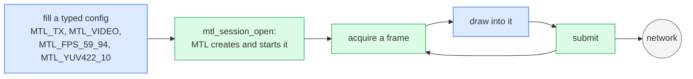

A typed config (`MTL_INIT(&sc)`, then `direction`, `essence`, `flows[0]` with `mtl_flow_ipv4()`,
`video.raster` and `video.format`) describes the stream, and `mtl_session_open` creates and starts
it. `mtl_instance_open(NULL, &mt)` takes the ports from `MTL_PORTS` (`"null:1"` runs without a
NIC). MTL owns the buffers; each submitted frame goes out in the next slot (media mode AUTO on the
SMPTE epoch, `min_tx_delay_ns` 0, results off). Nothing has to be read back, and one
`mtl_session_close` at the end sends what is queued and retires the session.

### 2.2 Receive video on two networks (ex02)

[ex02_rx_video.c](sketch/examples/ex02_rx_video.c), [examples §4](examples.md#4-receive-video-on-two-st-2022-7-legs).

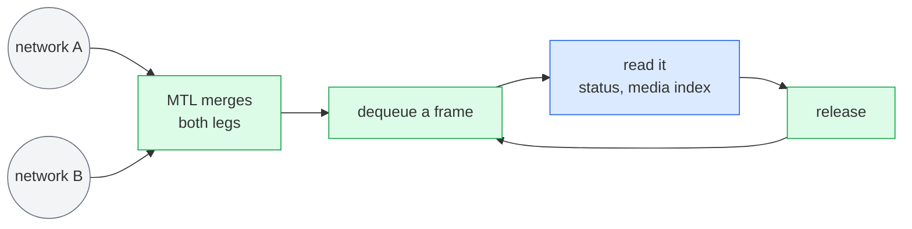

Two flows in the config (`sc.flows[0]` and `sc.flows[1]`) are two ST 2022-7 legs on instance ports
0 and 1; packets merge by sequence number. A frame with lost packets still arrives, with
`u.status == MTL_RX_INCOMPLETE` and the gaps read as zero (library pools, from MS2). `u.media_index` is valid when
`MTL_UNITF_INDEX_VALID` is set. `-MTL_EAGAIN` with no signal: `status.flags` lacks
`MTL_STATUS_RX_SIGNAL`.

### 2.3 One frame's life

[ex01_tx_video.c](sketch/examples/ex01_tx_video.c); the same picture, with the RX side, is in
[concepts.md §5](concepts.md#5-the-life-of-a-unit); the seven slot states behind it are in
[§5.3](#53-slot-states) and [engine.md §3.2](engine.md#32-the-slot-table).

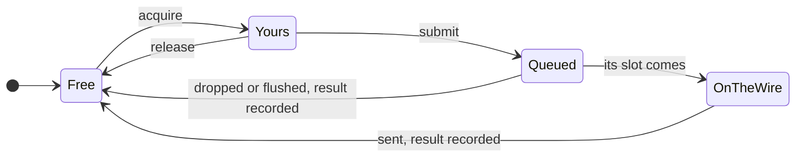

While a frame is yours, MTL never touches it. After submit it is MTL's until it has been sent;
exactly one result says what happened (`MTL_TX_ON_TIME`, `DROPPED`, `FLUSHED` or `FAILED`), or
a counter when results are off. A failed first submit gives the slot back without a
result.

### 2.4 In your own event loop (ex03)

[ex03_event_loop.c](sketch/examples/ex03_event_loop.c), [examples §5](examples.md#5-a-sender-in-the-applications-epoll-loop).

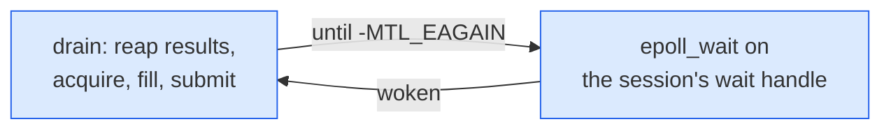

The session is created with `MTL_SESSION_RESULTS`; `mtl_session_get_wait_handle(s,
MTL_WAIT_ACQUIRE | MTL_WAIT_RESULTS, &fd)` gives an eventfd. Every data call that finds nothing
returns `-MTL_EAGAIN` and arms its target, which is in the handle's mask, before it returns (R2), so "drain until nothing, then
sleep" never misses a wake-up. The slot is acquired before the source frame is taken, so no source
frame is taken without a place to go; `u.cookie` comes back in the result.

### 2.5 A session's life

[ex04_zero_copy_tx.c](sketch/examples/ex04_zero_copy_tx.c) (create, attach, start, stop, close). The
full machine with every transition is in [contract.md §4.1](contract.md#41-states); this is the
path an application sees.

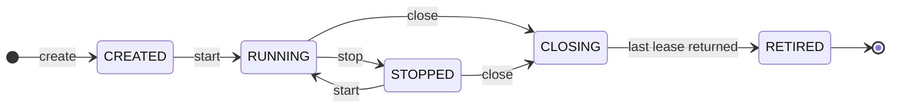

`mtl_session_open` is create plus start, so it goes straight to `MTL_STATE_RUNNING`. A start at a
later instant passes through ARMED; a stop passes through DRAINING or FLUSHING; a failed session
moves to ERROR, which only stop and close leave. Close is idempotent: 0 when retired, 1 while
still retiring, and calling it again polls ([§2.20](#220-what-a-return-code-tells-you)).

### 2.6 Zero copy from a framework's pool (ex04)

[ex04_zero_copy_tx.c](sketch/examples/ex04_zero_copy_tx.c), [examples §6](examples.md#6-zero-copy-from-a-frameworks-pool). MS2.


The config sets `MTL_SESSION_POOL_ATTACHED | MTL_SESSION_REQUIRE_DIRECT` and `pool_count`; one
`mtl_session_attach` imports the arena (`a.va`, `a.length`, `a.count`), and fails with a reason if
it is too small. `mtl_tx_acquire_slot(s, i, ...)` acquires exactly surface i, or returns
`-MTL_EAGAIN` while it is still in flight. Because it is your memory, every frame produces a result
(rule MEM3), and a surface goes back only when its result says the network is done with it. Stop with
`MTL_STOP_DRAIN`, reap, then close: 0 means the arena may be freed.

### 2.7 Received frames handed to a framework (ex05)

[ex05_rx_to_framework.c](sketch/examples/ex05_rx_to_framework.c), [examples §7](examples.md#7-received-frames-lent-to-a-framework).


A received frame stays valid until it is released, on whatever thread drops it. GStreamer `unlock`
and `unlock_stop` map to `mtl_session_interrupt(s, 1)` and `(s, 0)`: the blocked dequeue returns
`-MTL_ECANCELED` at once, and `create` returns FLUSHING without waiting for `unlock_stop`, which
runs on another thread. `-MTL_ESHUTDOWN` means the element stopped or closed the session; close
returns 1 while downstream still holds buffers, the session retires on the last release, and a
later close returns 0.

### 2.8 Into an MXL ring by frame number (ex06)

[ex06_mxl_ring.c](sketch/examples/ex06_mxl_ring.c), [examples §8](examples.md#8-receive-into-an-mxl-ring-by-frame-number). MS2b.

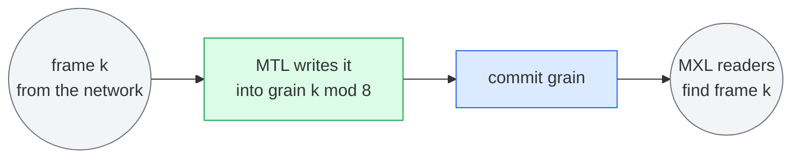

The ring is the session's pool (`MTL_SESSION_POOL_ATTACHED | MTL_SESSION_RX_BY_INDEX |
MTL_SESSION_RX_LATEST`, `a.pitch = grain_size`). With RX_BY_INDEX the slot is the media index mod
`pool_count`, so `u.slot == media_index mod 8`. Frame numbers count from the SMPTE epoch, on
which every session runs, so every process agrees on which grain holds frame k.

### 2.9 Video, audio and captions from one file (ex07)

[ex07_av_anc_playout.c](sketch/examples/ex07_av_anc_playout.c), [examples §9](examples.md#9-video-audio-and-captions-from-one-file). MS6.

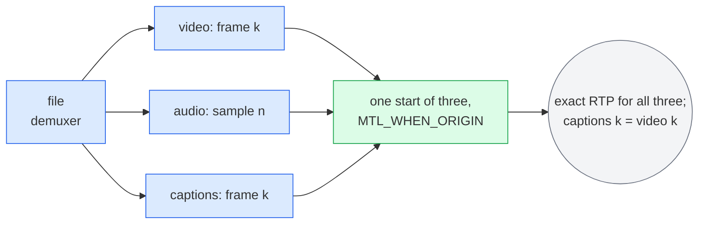

The three TX sessions use `MTL_MEDIA_INDEX`, so `u.media_index` is the frame (video, ANC) or the
first sample (audio). `mtl_session_start(s, 3, &origin, NULL)` with `origin.flags =
MTL_WHEN_ORIGIN` starts all three or none, resolves T0 once on the common grid, and makes media
index 0 of every session T0, so the file's counts are media indices as they are. MTL turns the
indices into timestamps that agree exactly; the ANC session takes the raster and slot delay of
the video. Audio uses the copy path
`mtl_tx_write`; frames without captions still get the empty ANC packet. The arithmetic is in
[timing.md §10](timing.md#10-avanc-synchronisation).

### 2.10 Rows leave before the frame is finished (ex08)

[ex08_progressive_rows.c](sketch/examples/ex08_progressive_rows.c), [examples §10](examples.md#10-rows-that-leave-before-the-frame-is-finished). MS3 (rows MS2a, INDEX and the slot hint MS3).

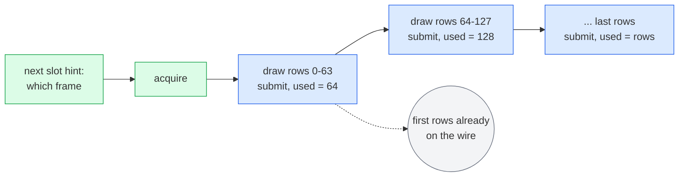

For an SDI-to-IP gateway (`unit = MTL_UNIT_ROWS`, `media_mode = MTL_MEDIA_INDEX`, the option
`tx.troffset_ns`, `min_tx_delay_ns` 0): `mtl_tx_next_slot` says which frame is being filled, and each
submit of the same lease with a larger `used` publishes more rows; `used == rows` ends the frame.
The first rows are sent while the rest are still being drawn. A failing later submit ends the unit
where its rows stopped (option `tx.rows_late`) and its one result follows.

### 2.11 One 4K frame in, four HD streams out, no copy (ex09)

[ex09_split_forwarder.c](sketch/examples/ex09_split_forwarder.c), [examples §11](examples.md#11-one-4k-frame-in-four-hd-streams-out-no-copy). MS2.

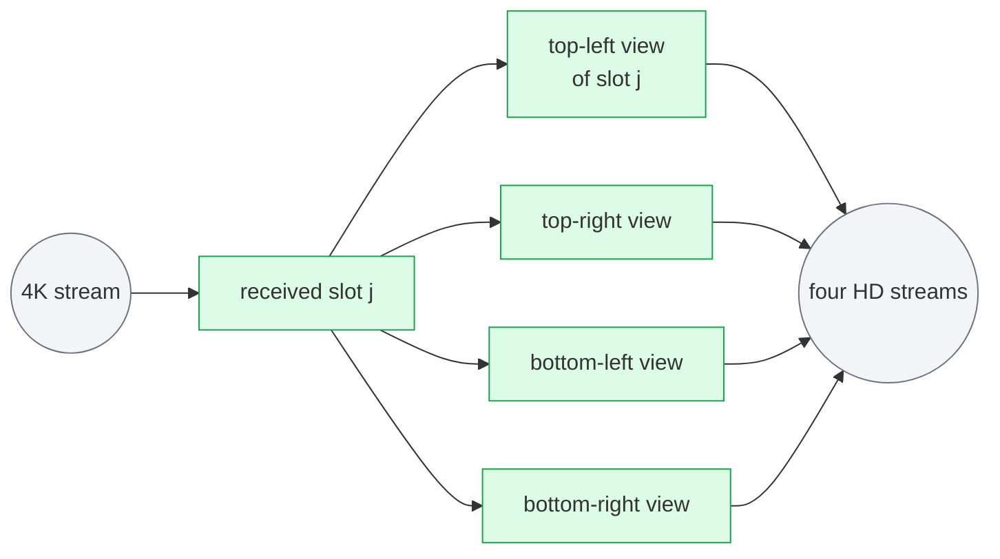

`mtl_session_get_pool_region(rx, &pool)` lends the receiver's library pool; each HD sender attaches
over it (`a.region`, `a.pitch = info.pool_slot_pitch`, `a.offset` = its quadrant, `a.stride[0]` =
the 4K stride), so TX slot j lies over RX slot j. `mtl_tx_send_slot(tx[q], in.slot, &how, 0)` with
`how.hold = in.lease` holds the received frame until each send has left; the RX slot is free once
it is released and every hold has completed ([§7.3](#73-forwarding-with-holds)). Nothing is copied
and nothing is freed early.

### 2.12 A processor that keeps the input's timing (ex10)

[ex10_processor.c](sketch/examples/ex10_processor.c), [examples §12](examples.md#12-a-processor-that-keeps-the-inputs-timing). MS4 (audio and ANC through the copy path).

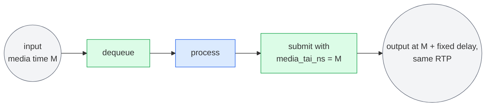

The output sessions use `MTL_MEDIA_TAI` and `min_tx_delay_ns` = the pipeline budget: one frame period (RX completion) + processing + the pick-up lead. The output carries the input's media time (only when the input has
`MTL_UNITF_TAI_VALID`), so for a compliant input its RTP timestamps equal the input's and the delay
is constant. Audio and ANC pass through `mtl_tx_write` with the received unit as the template.

### 2.13 A service in a Kubernetes pod (ex11)

[ex11_signal.c](sketch/examples/ex11_signal.c), [examples §13](examples.md#13-a-service-in-a-kubernetes-pod-signals-probes-bounded-shutdown). MS3 (health, shutdown with a report).

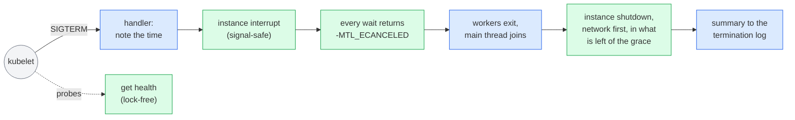

The signals are blocked before open and unblocked once the handler has the handle, so none is
lost; the library installs no handler of its own (R8). `mtl_instance_interrupt(mt, 1)` is sticky,
so a worker cannot miss it between two waits. The budget counts from the signal:
`mtl_instance_shutdown(mt, MTL_SHUTDOWN_ALL_REFERENCES, budget, &r, sizeof(r))` finishes the unit on
the wire, leaves the groups, stops the devices and returns 0 (retired), 1 (quiesced: exit is safe)
or `-MTL_EIO` (a port could not be stopped: exit now). A second signal calls `mtl_instance_abort`,
which cuts the shutdown short. `mtl_instance_get_health` answers the probes: liveness fails only on
what a restart can fix (`MTL_HEALTH_LIVENESS`), readiness also on no link, no time lock and
shutdown (`MTL_HEALTH_READINESS`); after the shutdown began (`-MTL_ESHUTDOWN`) liveness stays 200
while readiness answers 503. The whole order is in
[deployment.md §4.2](deployment.md#42-shutdown) and [§10](#10-shutdown-pods-and-crash-safety).

### 2.14 RTP passthrough: you build the packets (ex12)

[ex12_rtp_packets.c](sketch/examples/ex12_rtp_packets.c), [examples §14](examples.md#14-rtp-passthrough-the-application-builds-the-packets). MS5.

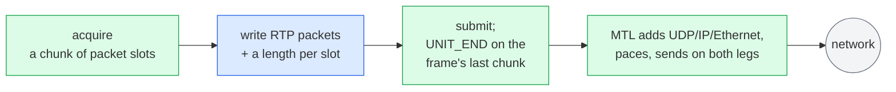

`sc.unit = MTL_UNIT_PACKETS`, `sc.packet.packets_per_unit`, and `sc.packet.set_fields =
MTL_PKT_SET_TIMESTAMP | MTL_PKT_SET_SSRC_PT`: MTL writes only the network headers and the RTP fields
asked for (none by default). The packet table is `mtl_pkt_tx_table(&u)`, a slot is
`mtl_pkt_slot(&u, n)`, and `MTL_SUBMIT_UNIT_END` marks the frame's last chunk. The same verbs as
frames. Receiving works the same way in reverse: chunks of packets with their leg, sequence
number and gap (`mtl_pkt_rx_table(&u)`), duplicates of the two legs already removed.

### 2.15 An IS-05 activation at one instant (ex13)

[ex13_nmos_switch.c](sketch/examples/ex13_nmos_switch.c), [examples §15](examples.md#15-nmos-is-05-switch-destinations-at-one-instant). The update with its planned and applied instants and per-leg enable is MS5; mute and `MTL_UPDATE_REAPPLY` are Phase 7.

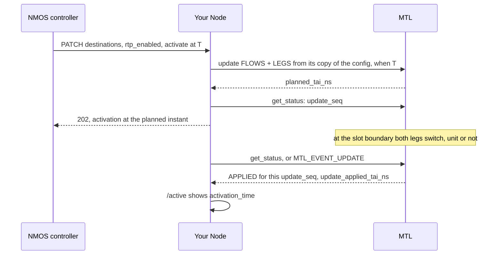

One PATCH is one `mtl_session_update`, all or nothing: if a leg cannot be prepared the stream keeps
its old configuration. The Node keeps its own copy of the session's configuration and copies only
what IS-05 changed (`ip`, `source_filter`, `udp_port`) into it; the update reads only the members
its `parts` name, so the session's SSRC and payload type (`sc.ssrc`, `sc.payload_type`) and each
leg's DSCP stay. The switch is by the clock, so an idle sender activates too. With `master_enable`
false the Node sets every leg in `legs_disabled`: the session is muted (`MTL_STATUS_MUTED`) but
stays RUNNING (Phase 7). A status whose `update_seq` moved on, or whose `update_state` is
`MTL_UPDATE_STATE_FAILED`, means this activation did not apply. The
update states are in [§11.2](#112-update-states); the contract in
[nmos-ipmx.md §11](nmos-ipmx.md#11-is-05-the-activation-contract).

### 2.16 The same API from C++ (examples_cpp.cpp)

[examples_cpp.cpp](sketch/examples/examples_cpp.cpp), [examples §16](examples.md#16-the-same-api-from-c).

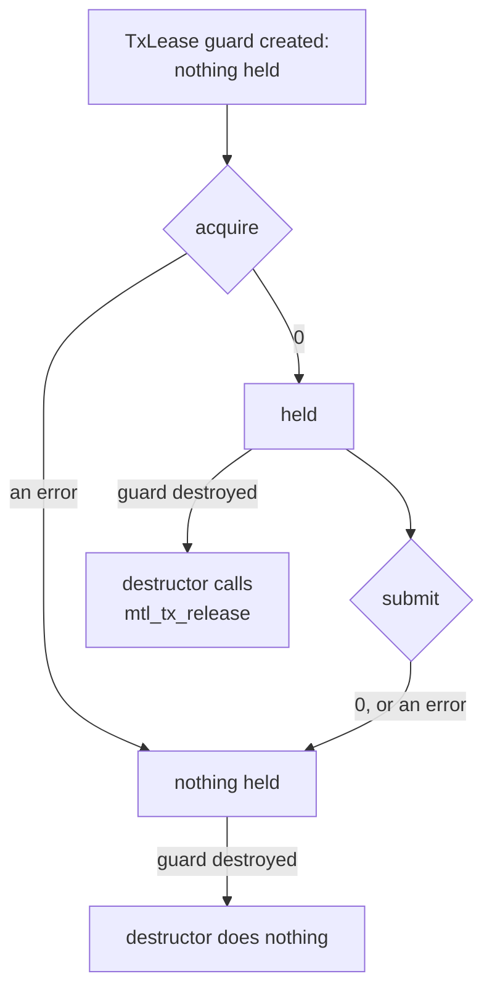

The guard mirrors the lease rule of `mtl_tx_submit`: on failure of a first submit the slot goes
back to the pool without a result. Options are an array in the config (`MTL_OPT_LATE_POLICY` =
`MTL_LATE_DROP`); absent means the default. Results are read with `sizeof(r[0])` as the
record size, so a larger record type stays safe.

### 2.17 Media time and launch time

[ex07_av_anc_playout.c](sketch/examples/ex07_av_anc_playout.c), [ex10_processor.c](sketch/examples/ex10_processor.c); `min_tx_delay_ns` is in [concepts.md §7.3](concepts.md#73-when-content-exists-min_tx_delay_ns), the formulas in [timing.md §4](timing.md#4-media-time-on-tx) and [§5](timing.md#5-launch-time).

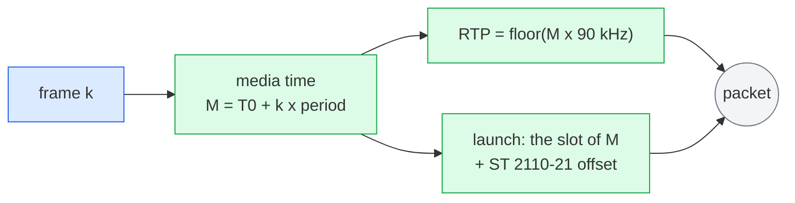

What a frame *is* (its media time, and so its RTP timestamp) is separate from when it *leaves*.
With `min_tx_delay_ns` 0 (playback) the first packet leaves at TVD − VRX0·TRS, TVD = N × TFRAME +
TROFFSET. A late frame is dropped (INDEX, TAI) or moved to the next free slot (AUTO) by
`tx.late_policy`, but never moves the frames after it.

### 2.18 Which header do I need?

The full table is [concepts.md §10](concepts.md#10-where-each-header-fits); the functions per
header and per milestone are printed by `sketch/check.sh`.

| You want to | Include | Milestone |
|---|---|---|
| send or receive with MTL's buffers | `mtl.h` only | MS1 (video), MS4 (the other essences) |
| use your own memory, or lend one session's pool to another | `+ mtl_mem.h` | MS2 (video), MS4 |
| compute frame numbers and row deadlines, or align essences on RX | `+ mtl_sync.h` | MS2 (media ticks, row deadlines, the time reference), MS3 (epoch index, slot hint); start arrays (`mtl.h`) MS6 |
| build or parse RTP packets yourself | `+ mtl_packet.h` | MS5 |
| read the events of a session or of the instance | `+ mtl_events.h` | MS3 |
| export stats, route logs, capture packets, answer probes, shut down with a report | `+ mtl_observe.h` | MS1 (full TX results), MS2 (stats, RX detail, enumeration, ports, log sink; MS1 if A2b lands), MS3 (health, shutdown), MS4 (capture) |
| set a tuning knob | `+ mtl_options.h` | MS1 |
| send from a byte buffer, or send a named slot in one call | `+ mtl_util.h` | MS3 (`mtl_tx_write`; audio and ANC sessions MS4), MS2 (named slots) |
| render or parse SDP, add Info Block entries, read IPMX sender reports, encrypt with IPMX PEP | `+ mtl_ipmx.h` | Phase 7; TX sender reports from the `rtcp.*` options (`mtl_options.h`) MS5 |
| use an application pixel format, or convert colour or audio formats outside a session | `+ mtl_format.h` | MS1 (application formats), MS4 (`mtl_convert`) |

### 2.19 Under the hood: nothing waits on the pinned cores

The protocol is in [engine.md §5.2](engine.md#52-the-completing-context-protocol) and
[§7](engine.md#7-waking); the topic picture is [§6.2](#62-who-makes-the-wake-up-syscall).

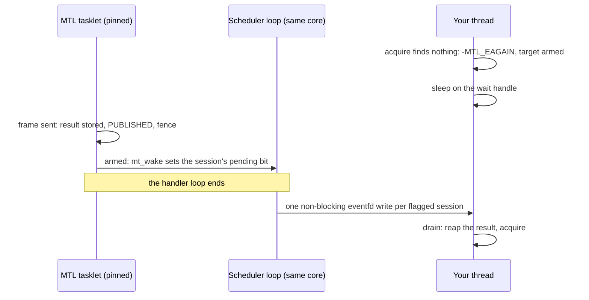

The pinned cores only send and receive packets. They never run application code and never take a
lock an application holds. Inside a tasklet a wake-up costs one bit set; the scheduler loop, after
its handlers, writes the eventfd of each flagged session once per iteration, and only for an armed
waiter (W2-deferred, D-68, every mode from MS1). A waker thread that takes those writes off the
core (W3) is a contingency, built only if spike S1 shows that they harm pacing (D-102).

### 2.20 What a return code tells you

[ex_common.h](sketch/examples/ex_common.h) prints any of them with `mtl_error_name()`,
`mtl_reason_name()` and the field from `mtl_last_error()`. The full table is
[concepts.md §6.4](concepts.md#64-errors) and [contract.md §8.1](contract.md#81-codes).

| You get | It means | Do |
|---|---|---|
| `-MTL_EAGAIN` | nothing yet, now or by the timeout; the target is armed (with timeout 0 only if it is in the wait handle's mask, R2) | try again, or sleep on the wait handle |
| `-MTL_ETIMEDOUT` | a DRAIN stop missed its deadline (never a close) | the rest was flushed |
| `-MTL_ECANCELED` | someone interrupted the waits | leave, or wait again after `interrupt(..., 0)` |
| `-MTL_ESHUTDOWN` | you stopped or closed the session or instance | leave the loop |
| `-MTL_EIO` | the session failed (ERROR), or a device could not be stopped | read `status.error_reason`; stop, then start again, or close |
| `-MTL_ENODEV` | the device was removed, or its reset failed | stop, update the session onto another port, start |
| `-MTL_EINVAL` | a wrong argument | `mtl_last_error()` names the field or option |
| `-MTL_EBUSY` | in use, or not allowed in this state | check the state first |
| `-MTL_EBADF`, `-MTL_ESTALE` | a wrong or closed handle; a lease already returned | fix the bug |
| close returns 1 | still retiring: leases are out, or the device holds units | call close again, with a timeout to wait, until it returns 0 |

## 3. Architecture

### 3.1 The shape of the API

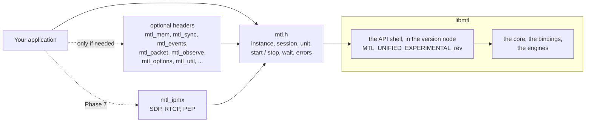

`mtl.h` holds the core calls, and every optional header includes it and adds one job; no unified
header includes a legacy one. The rest is `static inline`: typed wrappers of the object verbs
`mtl_close`, `mtl_interrupt`, `mtl_wait`, `mtl_get_wait_handle`, `mtl_reap`, `mtl_read_events` and
`mtl_release`, and helpers on public calls. A function is exported in the milestone that
implements it, in libmtl's node `MTL_UNIFIED_EXPERIMENTAL_<rev>` (`MTL_1.0` from MS7); a known
value of an exported call that is not built yet returns `-MTL_ENOTSUP` with
`MTL_REASON_NOT_IMPLEMENTED`. `sketch/check.sh` prints the functions per header and per milestone.

### 3.2 Layers

Who calls whom; everything is in libmtl. The parts table with their paths and milestones is
[engine.md §1](engine.md#1-the-layer-picture).

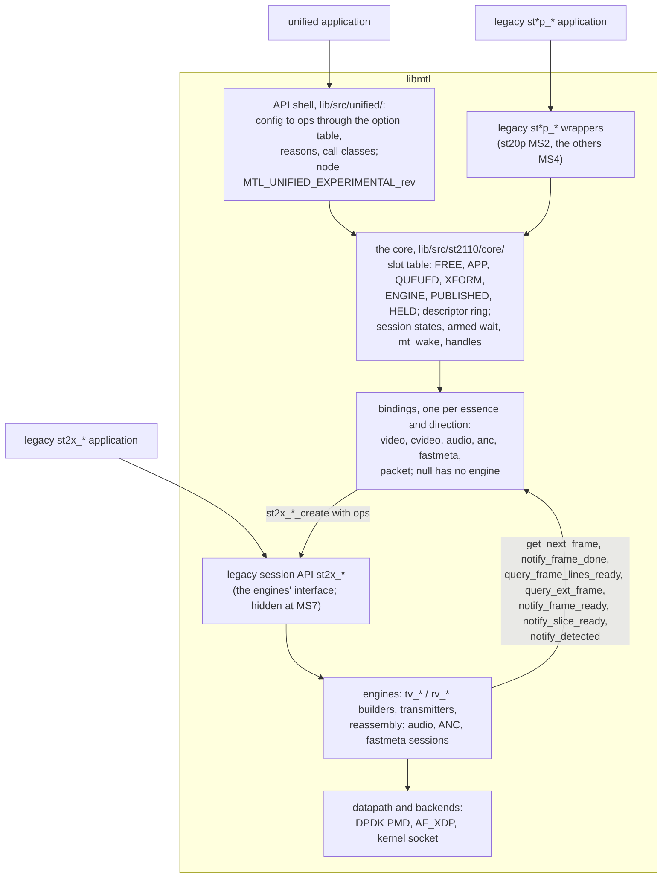

The bindings are clients of the legacy session API and implement the callbacks the engines
already call, so frames and rows need no new engine entry point; packet units add one shared
chunk expander (MS5). The one-box version for a talk is
[presentation/slides.md, "The idea in one picture"](presentation/slides.md#the-idea-in-one-picture).

### 3.3 Threads and the pinned cores

The parts are [§3.2](#32-layers); the rules per context are in
[engine.md §2.2](engine.md#22-execution-contexts).

```mermaid
flowchart LR
    APP["Application threads<br/>any core, may block:<br/>control calls, data calls, waits"]
    TK["Pinned scheduler cores: tasklets<br/>(TX builders and transmitters, RX;<br/>the bindings' callbacks; the tick hook, MS2),<br/>then the deferred wake flush"]
    WK["Library workers:<br/>recovery, auto-detect, ARP, flow<br/>and IGMP for updates, stalled-queue<br/>reset, deferred retire"]
    AD["Admin thread: link monitor,<br/>publishes the time base, stats"]
    DS["Log-sink and codec threads:<br/>the only ones that run app code"]
    NIC(("NIC: DPDK PMD,<br/>AF_XDP, kernel<br/>socket, or null"))
    APP -->|"slot CAS,<br/>ctl (MS2)"| TK
    TK -->|"completion CAS; after the handlers,<br/>one eventfd write per flagged session"| APP
    APP -->|"blocking control work"| WK
    TK -.- AD
    DS -->|"your log callback,<br/>your codec"| APP
    TK <--> NIC
```

Arrows into the tasklet world are lock-free hand-offs (a CAS on the slot, the `ctl` word that the
`tick` hook acknowledges in `ack`); arrows out of it are wait-free stores (the completion CAS, a
fence, and for an armed waiter a bit in the scheduler's pending bitmap). The scheduler loop turns
those bits into eventfd writes after its handlers. No tasklet allocates, prints a log line (it
writes formatted lines into a per-scheduler ring), takes a lock an application thread can hold, or
runs application code (R6). The deferred wake and the W3 contingency are
[§6.2](#62-who-makes-the-wake-up-syscall).

### 3.4 Objects and ownership

The handle rules are [contract.md](contract.md#1-the-rules-r1r8) R4, the memory objects
[contract.md §9](contract.md#9-memory).

```mermaid
flowchart TB
    I["mtl_instance_h<br/>ports, schedulers, time source,<br/>instance events; one reference<br/>per open if SHARED"]
    I --> P["ports 0..n<br/>link, pacing class, time state"]
    I --> S["mtl_session_h<br/>one essence, one direction,<br/>unique name, the SMPTE epoch"]
    I --> R["mtl_region_h<br/>memory MTL may DMA,<br/>refcounted"]
    S --> F["flows 0..1 = legs<br/>admin, oper, flow state"]
    S --> PL["pool: slots by index<br/>library or attached"]
    S --> LT["slot table and descriptor ring,<br/>results, events, status, stats,<br/>one wait handle"]
    PL --> L["mtl_lease_h<br/>access to one slot, now"]
    PL -.->|"attached over"| R
```

Handles are typed 64-bit values; 0 is null, a closed handle is never reissued, and handle slots are
process-wide and never freed (R4). A buffer is named by its slot index, access to it by a lease.
`mtl_close` closes every kind of object; `mtl_session_close`, `mtl_instance_close` and the other
typed wrappers call it. Created timelines and shared queues are reserved for later
(`MTL_LATER`).

### 3.5 Coexistence with the legacy API

```mermaid
flowchart LR
    UA["unified code<br/>mtl_session_*, mtl_tx_*, mtl_rx_*"] --> SH["API shell<br/>(in libmtl)"]
    LA["legacy pipeline code<br/>st20p_*, st30p_*, ..."] --> LW["legacy pipelines:<br/>wrappers on the core"]
    LSA["legacy session code<br/>st20_tx_create, ..."] --> LS["legacy session API"]
    SH --> C["the core"]
    LW --> C
    C --> B["bindings"]
    B --> LS
    LS --> E["engines, schedulers, devices<br/>(one shared instance)"]
    UA -. "mtl_instance_from_legacy()" .- LA
```

One process may run legacy and unified sessions on one instance. A legacy pipeline becomes a
wrapper on the core when its essence is on it (st20p in MS2, the others in MS4); until then it
runs on the legacy session API as it does today. The legacy session API stays as the engines'
interface, and its headers are hidden at MS7. The rules, the bridge and the mixed-API RTP hazard
are [migration.md §6](migration.md#6-coexistence).

### 3.6 The legacy headers and where they go

From [coverage.md §4.1](coverage.md#41-todays-public-header-set), checked against `include/` at
`545a266a`. An arrow means "includes": every installed legacy header reaches `st20_api.h` or
`mtl_api.h`, which is why the set moves as one tier
([migration.md §8](migration.md#8-hiding-the-legacy-headers)).

```mermaid
flowchart TB
    API["mtl_api.h"] --> CFG["mtl_build_config.h<br/>(generated)"]
    SCH["mtl_sch_api.h"] --> API
    SHM["mtl_lcore_shm_api.h"] --> API
    ST["st_api.h"] --> API
    S20["st20_api.h<br/>(ST 20 and ST 22)"] --> ST
    S30["st30_api.h"] --> ST
    S40["st40_api.h"] --> ST
    S41["st41_api.h"] --> ST
    PIPE["st_pipeline_api.h"] --> S20
    P30["st30_pipeline_api.h"] --> S30
    P30 --> PIPE
    P40["st40_pipeline_api.h"] --> S40
    P40 --> PIPE
    COMB["experimental/<br/>st20_combined_api.h"] --> S20
    CI["st_convert_internal.h"] --> S20
    CI --> S30
    CA["st_convert_api.h"] --> CI
```

The install layout during the transition, with the tier names of
[migration.md §8.2](migration.md#82-three-tiers):

```text
include/mtl/experimental/mtl.h + the optional headers    public    MTL_UNIFIED_EXPERIMENTAL_<rev>, then MTL_1.0 (release F)
include/mtl/legacy/mtl_api.h, st_api.h, st20_api.h, ...  legacy    MTL_LEGACY (from MS3)
include/mtl/legacy/mtl_legacy_gate.h                     legacy    included first by every legacy header; reads MTL_LEGACY_STAGE
include/mtl/st20_api.h, ...                              stubs     #include "legacy/st20_api.h"; removed at F+1
lib/include/mtl_internal/                                internal  session declarations from F+2; never installed; local: *
```

```mermaid
flowchart LR
    S1["MS1, tasks H1a, H1b<br/>unified headers in<br/>include/mtl/experimental/;<br/>the unified node in libmtl"] --> S3["MS3<br/>soname, MTL_LEGACY node,<br/>local: * after the nm audit;<br/>gate added, inert"]
    S3 --> S6["MS4 to MS6<br/>pre-hide gaps closed; legacy in<br/>mtl/legacy/ + stubs; in-tree consumers port"]
    S6 --> F["MS7, release F<br/>deprecation warnings;<br/>unified API is MTL_1.0"]
    F --> F1["F+1<br/>#error unless MTL_LEGACY_API;<br/>stubs removed"]
    F1 --> F2["F+2 or later<br/>session headers internal,<br/>their symbols local"]
```

### 3.7 The shape shared with libfabric and Rivermax

The call map is [migration.md §13](migration.md#13-if-you-know-libfabric-or-rivermax).

```mermaid
flowchart LR
    A["register memory once<br/>fi_mr_reg, rmx_register_memory,<br/>mtl_mem_import + attach"] --> B["get a slot<br/>get_next_chunk,<br/>mtl_tx_acquire"]
    B --> C["fill"]
    C --> D["post or commit<br/>fi_send, commit_chunk,<br/>mtl_tx_submit"]
    D --> E["completion<br/>fi_cq_read, poll_for_completion,<br/>mtl_tx_reap"]
```

What only MTL adds is time: the submit carries a media time, and MTL derives RTP and the launch.

## 4. Lifecycle and states

### 4.1 The session state machine

The full machine of `enum mtl_state` (CREATED, ARMED, RUNNING, DRAINING, FLUSHING, STOPPED, ERROR,
CLOSING, RETIRED), with what each state allows, is
[contract.md §4.1](contract.md#41-states) and [§4.2](contract.md#42-what-each-state-allows). The
learner's version is [concepts.md §5.3](concepts.md#53-a-sessions-life); the application's path is
[§2.5](#25-a-sessions-life).

### 4.2 What close does

The rules are [contract.md §4.9](contract.md#49-close) and
[engine.md §9](engine.md#9-close-and-error-on-a-stalled-queue). `mtl_session_close(s, timeout)`
is idempotent: from the first call on, `mtl_session_get_state` on the handle answers CLOSING, then
RETIRED, and close called again polls.

```mermaid
stateDiagram-v2
    [*] --> Drain: close in ARMED, RUNNING or DRAINING
    [*] --> Detach: close in CREATED, STOPPED, FLUSHING or ERROR
    Drain --> Flush: deadline passed, rest FLUSHED (STOP_TIMEOUT)
    Drain --> Detach: every queued unit sent
    Flush --> Detach: queued units FLUSHED
    Detach --> DeviceRefs: tasklet ack, data callers left
    DeviceRefs --> Leases: last NIC and DMA reference gone
    Leases --> RETIRED: no lease or hold left
    RETIRED --> [*]
    note right of Leases
        close returns 1 here if leases are out;
        the last release posts the retire to a worker
    end note
```

Every step before RETIRED is the state CLOSING. Close returns 0 once retired and 1 while still
retiring; waiting for the end is calling close again with a timeout. Unread results are discarded.
Sessions attached over this session's pool must close first. A queue that will not release its descriptors takes the stalled-queue path
([§10.2](#102-the-stalled-queue-path)).

### 4.3 Starting sessions together

One call starts several sessions on the epoch (start arrays MS6; MS1 starts one session, MS3 adds a
start at a TAI instant or an index). The rules are
[timing.md §7.1](timing.md#71-starting-sessions-together), the formulas
[timing.md §3.3](timing.md#33-the-start-formula) and [§7](timing.md#7-start).

```mermaid
flowchart LR
    A["mtl_session_start(s, n, when, &t0)<br/>one direction"] --> V["validate every session:<br/>any failure changes nothing"]
    V --> T0["resolve T0 once, on the<br/>common grid of the sessions'<br/>index periods"]
    T0 --> ARM["ARMED: TX takes preroll,<br/>RX is joined and filters<br/>media time before the start"]
    ARM --> RUN["RUNNING at the instant;<br/>MTL_WHEN_ORIGIN: index 0 at T0,<br/>else epoch indices"]
```

Mixed directions, or a TX session in `MTL_MEDIA_AUTO` in an array of more than one, are
`-MTL_EINVAL` (`START_SET_MIXED`). An ANC or fastmeta session with an all-zero video raster takes
the raster and slot delay of the first video session of the array. `t0` receives T0. Stop arrays
may mix directions.

### 4.4 Legs and flow states

Per leg (`status.leg[]`, `MTL_EVENT_LEG_STATE`, `MTL_EVENT_FLOW_STATE`); the rules are
[contract.md §14](contract.md#14-legs-and-st-2022-7).

```mermaid
stateDiagram-v2
    state "TX leg" as TXL {
        [*] --> WAITING_NEIGHBOUR: start, or update of FLOWS
        WAITING_NEIGHBOUR --> RESOLVED: neighbour resolved
    }
    state "RX leg" as RXL {
        [*] --> JOINING: IGMP join sent
        JOINING --> JOINED
        JOINING --> JOIN_FAILED
    }
```

`admin` is the leg's bit in `legs_disabled` (`MTL_UPDATE_LEGS`); `oper` is 1 when the link is up
and the flow is RESOLVED or JOINED. A TX unit on a leg still WAITING_NEIGHBOUR is
`MTL_TX_DROPPED` with reason `WAITING_NEIGHBOUR` there; an update does not wait for neighbours.
Every existing leg disabled means muted (Phase 7).

## 5. Data path and leases

### 5.1 One TX unit through the layers

A video frame in MS1. The core and its bindings are
[engine.md §3](engine.md#3-the-core-and-its-bindings); the slot states are [§5.3](#53-slot-states).

```mermaid
sequenceDiagram
    autonumber
    participant A as App thread
    participant C as Core (API shell above it)
    participant B as Video TX binding
    participant E as Engine tasklets
    A->>C: mtl_tx_acquire
    C->>C: slot FREE to APP (one CAS that writes the new generation), a result entry reserved
    C-->>A: unit: lease, slot, planes, meta
    A->>A: fill the planes, set used, media time, cookie
    A->>C: mtl_tx_submit
    C->>C: check lease, layout, media time, a failed first submit returns the slot FREE
    C->>C: the submission descriptor (seq, generation, media time, cookie) in the order ring, APP to QUEUED
    E->>B: get_next_frame (the builder, on the tasklet)
    B->>C: the descriptor at the pick cursor, its slot QUEUED with that generation: QUEUED to ENGINE
    B-->>E: the frame and its slot N (the slot decision), user pacing, epoch RTP
    E->>E: build, pace, burst, the last mbuf freed
    E->>B: notify_frame_done
    B->>C: completion CAS to claimed, result in the descriptor, PUBLISHED, fence, armed load
    C->>C: if armed: mt_wake sets the session's pending bit
    E-->>A: after the handler loop: the scheduler loop's eventfd write
    A->>C: mtl_tx_reap (mtl_reap)
    C-->>A: results in seq order, each slot PUBLISHED to FREE
```

With results off the completion stores FREE instead of PUBLISHED. The binding decides the slot at
`get_next_frame` with exact math (AUTO: the next feasible slot; INDEX and TAI: the unit's slot, or
DROPPED when it can no longer be met) and drives the engine with user pacing and the epoch RTP, so
the engine's own late notification never fires for a core session; the outcome is the result's
status ([timing.md §6.8](timing.md#68-the-slot-decision-of-the-video-tx-binding)).

### 5.2 One RX unit through the layers

The RX rules are [contract.md §5.3](contract.md#53-rx).

```mermaid
sequenceDiagram
    autonumber
    participant E as Engine RX tasklet
    participant B as Video RX binding
    participant C as Core (API shell above it)
    participant A as App thread
    participant D as Any thread
    E->>B: query_ext_frame: first packet of a new frame
    B->>C: assign a slot: any FREE, by index (RX_BY_INDEX), or the oldest unread (RX_LATEST), FREE to ENGINE
    B-->>E: the slot's planes and IOVA, first arrival recorded
    E->>E: packets for media time M land in the slot (reassembly, DMA)
    E->>B: notify_frame_ready: complete, or incomplete with its status
    B->>C: completion CAS ENGINE to PUBLISHED: RTP, arrival per leg, packet counts, pub_seq, fence, mt_wake if armed
    A->>C: mtl_rx_dequeue
    C->>C: media index and flags, zero fill or conversion in the caller where granted, PUBLISHED to APP
    C-->>A: unit: lease, slot, planes, status
    A->>D: hand it on, TX units may hold it
    D->>C: mtl_rx_release (mtl_release), any thread, any order
    C->>C: APP to FREE, or HELD while holds remain, the last hold drops it to FREE
```

From MS2 a unit whose due time passes is force-completed: the first arrival (earliest leg) + the
unit period + `rx.flush_offset_ns`
([timing.md §11.7](timing.md#117-due-time-completion-and-2022-7-skew)).

### 5.3 Slot states

One slot table per session, seven states shared by TX and RX; the table of who moves each state is
[engine.md §3.2](engine.md#32-the-slot-table). TX:

```mermaid
stateDiagram-v2
    direction LR
    [*] --> FREE
    FREE --> APP: mtl_tx_acquire (CAS)
    APP --> FREE: mtl_tx_release, failed first submit
    APP --> QUEUED: mtl_tx_submit, seq assigned
    QUEUED --> XFORM: transform claim (bit X)
    XFORM --> QUEUED: converted or encoded
    QUEUED --> ENGINE: binding at pick-up
    QUEUED --> PUBLISHED: flush, discard, close
    ENGINE --> PUBLISHED: completion CAS
    PUBLISHED --> FREE: mtl_tx_reap
```

RX:

```mermaid
stateDiagram-v2
    direction LR
    [*] --> FREE
    FREE --> ENGINE: binding assigns the slot
    ENGINE --> XFORM: decoder or converter claims it
    XFORM --> PUBLISHED: decoded or converted
    ENGINE --> PUBLISHED: completion CAS
    PUBLISHED --> ENGINE: RX_LATEST reclaim
    PUBLISHED --> APP: mtl_rx_dequeue
    APP --> FREE: mtl_rx_release, no hold left
    APP --> HELD: mtl_rx_release, holds left
    HELD --> FREE: last hold drops
```

The completion CAS is the claim, so a second completer (a free callback racing recovery) fails by
construction. With results off a TX completion goes from ENGINE (or QUEUED, when flushed) straight
to FREE. Every transition out of FREE advances the slot's generation, which is in the lease. XFORM
is used from MS2 (converter plugins) and MS4 (codecs); MS1 converts in the caller.

### 5.4 Free, yours, MTL's: both directions

The application's three views of the seven slot states of [§5.3](#53-slot-states).

```mermaid
stateDiagram-v2
    state "Free" as F
    state "Yours: the app writes or reads it" as Y
    state "MTL's: sending or receiving" as M
    [*] --> F
    F --> Y: TX acquire
    Y --> M: TX submit
    M --> F: TX sent, result recorded
    F --> M: RX packets arrive
    M --> Y: RX dequeue
    Y --> F: TX release, RX release
```

### 5.5 One TX frame, step by step

The steps are [concepts.md §5.1](concepts.md#51-tx); the RX twin is
[concepts.md §5.2](concepts.md#52-rx).

```mermaid
sequenceDiagram
    autonumber
    participant App
    participant M as MTL
    participant N as Network
    App->>M: mtl_session_open
    loop every frame
        App->>M: mtl_tx_acquire
        M-->>App: a free frame: lease, planes
        App->>App: draw into it
        App->>M: mtl_tx_submit: media index k, cookie
        M->>N: packets, paced on the ST 2110-21 schedule
        App->>M: mtl_tx_reap, if results are on
        M-->>App: ON_TIME, margin_ns
    end
    App->>M: mtl_session_close
```

### 5.6 The slot table and the completing context

The two cache-line halves of a slot (one written by the completing context, one by the
application) and the steps of a completion (completion CAS, result, release store, fence, armed
load, `mt_wake`) are [engine.md §5.1](engine.md#51-layout) and
[§5.2](engine.md#52-the-completing-context-protocol); every context that completes a unit today is
listed in [§5.3](engine.md#53-every-completing-context).

## 6. Waking

### 6.1 Arming, in the application's terms

A data call that finds nothing returns `-MTL_EAGAIN` and arms its target (with timeout 0 only if
it is in the wait handle's mask, R2), so "drain until
`-MTL_EAGAIN`, then sleep on the wait handle" never misses a wake-up: [§2.4](#24-in-your-own-event-loop-ex03).
`mtl_wait` (typed: `mtl_session_wait`) blocks on the same targets, and `mtl_get_wait_handle`
(`mtl_session_get_wait_handle`, `mtl_instance_get_wait_handle`) gives the eventfd for the
application's own loop; the instance's handle carries its events (`MTL_WAIT_EVENTS`). The armed-waiter protocol with its two fences is
[engine.md §7.1](engine.md#71-wait-targets-and-the-armed-waiter-protocol).

### 6.2 Who makes the wake-up syscall

The rules are [engine.md §5.2](engine.md#52-the-completing-context-protocol),
[§7.1](engine.md#71-wait-targets-and-the-armed-waiter-protocol) and
[§7.2](engine.md#72-the-deferred-wake).

```mermaid
flowchart TB
    C["completing context:<br/>completion CAS to PUBLISHED,<br/>result stored, fence"] --> Q{"target armed?"}
    Q -->|"no"| N["done: no syscall"]
    Q -->|"yes"| MW["mt_wake(session, target)"]
    MW -->|"on a tasklet"| B["set the session's bit in its<br/>scheduler's pending bitmap<br/>and the summary word"]
    MW -->|"an application thread,<br/>a worker, the control plane"| D["one non-blocking<br/>eventfd write()"]
    B --> F["the scheduler loop, after its handlers:<br/>one eventfd write per flagged session<br/>(W2-deferred, every mode, MS1)"]
    B -.->|"contingency W3: only if<br/>spike S1 shows harm to pacing"| W3["a waker thread drains<br/>the same bitmaps"]
    F --> A["application thread wakes,<br/>drains until -MTL_EAGAIN"]
    W3 -.-> A
    D --> A
```

Every completing context calls one internal `mt_wake()`, so the choice is in one place (D-102). A
tasklet only sets bits; `sch_tasklet_func` flushes them once per iteration, after its handler loop
and before its sleep check, so a scheduler never sleeps on a pending wake (D-68). W3 would change
only who flushes, and is checked in MS2. An application that never sleeps (W0) causes no wake-up
at all.

### 6.3 Interrupts

From [engine.md §7.3](engine.md#73-wait-handles-and-interrupts).

```mermaid
flowchart LR
    S["mtl_session_interrupt(s, 1)"] --> G["mtl_interrupt(o, MTL_INTR_ON,<br/>optional targets << 8)"]
    I["mtl_instance_interrupt(mt, 1)<br/>(signal handlers)"] --> G
    T["GStreamer unlock:<br/>MTL_INTR_ON with<br/>MTL_WAIT_ACQUIRE << 8"] --> G
    G --> F["sticky flag on the selected<br/>targets, every waiter woken"]
    F --> W["their data waits return<br/>-MTL_ECANCELED at once,<br/>until MTL_INTR_OFF"]
    C["stop or close"] --> X["-MTL_ESHUTDOWN:<br/>close wins over interrupt"]
```

The typed wrappers all call `mtl_interrupt`; bits 8–31 of the mode limit it to some wait targets
(0 = every target), so an interrupted acquire does not make a reaper of the same session spin.
`MTL_INTR_ON` is async-signal-safe; `MTL_INTR_OFF` is CP. Stop and close still work while
interrupted.

### 6.4 Commands and acknowledgements

Immediate commands (stop, discard, detach, abort) and boundary commands (`mtl_session_update` with
FLOWS or LEGS, `MTL_DISCARD_REBASE`) are posted to the session's `ctl` word; the `tick` hook that
each engine tasklet handler calls applies them and acknowledges them in `ack` (MS2). The rules and
the flow update with its APP, worker and tasklet columns are
[engine.md §6](engine.md#6-commands-and-acknowledgements).

## 7. Memory

### 7.1 Four separate ideas

The rules are [concepts.md §8](concepts.md#8-memory-and-zero-copy-in-one-page)
and [contract.md §9](contract.md#9-memory).

```mermaid
flowchart LR
    R["region: where bytes live<br/>VA, length, backing, NUMA,<br/>IOVA per device, refcount"] --> S["slot: one buffer of a pool,<br/>named by its index;<br/>planes and meta, layout<br/>fixed when attached"]
    S --> L["lease: who may touch it now<br/>the slot state: FREE, APP, QUEUED,<br/>XFORM, ENGINE, PUBLISHED, HELD;<br/>the generation in the lease"]
    L --> U["unit and result: this use<br/>media time, cookie, hold,<br/>launch; one terminal outcome"]
```

Who allocated the bytes, who may touch them now, and what this use means are separate questions,
so library and application memory run one data path. The rules are
[contract.md §9](contract.md#9-memory).

### 7.2 Where a session's memory comes from

Every source of memory ends in the same slots and the same data path.

```mermaid
flowchart LR
    LP["library pool<br/>default, mtl.h"] --> SL["the session's slots"]
    subgraph REG["a region: mtl_region_h"]
        direction TB
        MA["mtl_mem_open, va NULL<br/>library hugepages"]
        MI["mtl_mem_open, va set<br/>application memory"]
        PR["mtl_session_get_pool_region<br/>another session's pool"]
        MD["mtl_mem_open, MTL_MEM_DEVICE<br/>GPU memory (MS6)"]
    end
    REG -->|"mtl_session_attach"| SL
    AV["mtl_session_attach with va:<br/>imported for this session"] --> SL
    SL --> V["one data path:<br/>acquire, submit, dequeue, release"]
```

Application memory always produces results (rule MEM3); a pool over another session's library pool
submits every unit with a hold (`HOLD_REQUIRED`). Per-acquire layouts (`mtl_tx_acquire_layout`)
and per-unit RX destinations (`mtl_rx_provide`) come in MS2, device memory in MS6. On any session but a
`MTL_SESSION_REQUIRE_DIRECT` one, `MTL_SUBMIT_SRC_PLANES` copies one unit from caller memory into
the slot during submit.

### 7.3 Forwarding with holds

The rules are [contract.md §9.6](contract.md#96-holds-and-forwarding); the code is [ex09](sketch/examples/ex09_split_forwarder.c).

```mermaid
sequenceDiagram
    participant RX as RX session
    participant A as App
    participant TX as Four TX sessions
    RX-->>A: dequeue: slot j, lease
    A->>TX: mtl_tx_send_slot(j), hold = lease, four times
    Note over RX: hold count of slot j is 4
    A->>RX: mtl_rx_release(lease)
    Note over RX: slot j is HELD, not FREE
    TX-->>RX: each TX unit's terminal outcome drops one hold
    Note over RX: hold count 0: slot j is FREE
```

A hold is +1 at the TX submit and −1 at that unit's terminal outcome, whatever it is; the owner
cannot change or detach its pool while attached sessions exist, and its close returns 1 until they
close.

### 7.4 Mapping onto today's internals

The bindings that hand attached slots to the engines are in
[engine.md §3](engine.md#3-the-core-and-its-bindings), the memory changes MF1–MF10 in
[§11](engine.md#11-the-engine-change-list). MS2 for video.

```mermaid
flowchart LR
    R["region<br/>import: extmem register;<br/>DMA map per device,<br/>eager or at first attach"] -->|"refcount + 1 per attach<br/>and per RX hold"| S["attached slot<br/>validated once against the<br/>requirements; addr, IOVA;<br/>stride becomes linesize"]
    S -->|"TX"| T["the video TX binding's<br/>get_next_frame hands the slot<br/>as an ext frame with its IOVA"]
    S -->|"RX"| X["the video RX binding's<br/>query_ext_frame returns<br/>the slot, addr and IOVA"]
    T --> D["refcount - 1 at the<br/>completion CAS"]
    X --> D2["refcount - 1 at the last of<br/>release and holds, or DMA drain"]
```

The teardown order (sessions before regions before the memory) is
[contract.md §9.10](contract.md#910-teardown-order).

## 8. Timing

### 8.1 Two times, not one

What a unit is (media time, RTP) and when it leaves (the slot, by `min_tx_delay_ns`) are separate:
[concepts.md §7.1](concepts.md#71-two-times-not-one) and [§2.17](#217-media-time-and-launch-time).

### 8.2 Media modes

From `enum mtl_media_mode`; the rules are [timing.md §4.1](timing.md#41-media-modes) and
[§5.2](timing.md#52-min_tx_delay_ns-and-the-slot-rule).

```mermaid
flowchart LR
    AUTO["MTL_MEDIA_AUTO<br/>the next slot"] --> M["media time M<br/>on the SMPTE epoch"]
    IDX["MTL_MEDIA_INDEX<br/>T0 + media_index x period"] --> M
    TAI["MTL_MEDIA_TAI<br/>media_tai_ns,<br/>snapped to the grid"] --> M
    M --> RTP["RTP = floor(M x rate)"]
    M --> LA["launch: the first slot whose first<br/>packet is at or after M + min_tx_delay_ns;<br/>0: the slot of M; one frame + the<br/>pick-up lead: the next slot"]
    SND["MTL_MEDIA_SENDER, Phase 7:<br/>the source's own instant,<br/>never snapped"] --> RS["RTP follows the source;<br/>launch = M + min_tx_delay_ns"]
```

The slot rule: the slot is the first N whose first-packet time TVD(N) − VRX0·TRS is at or after
M + `min_tx_delay_ns`. `MTL_SUBMIT_NOT_BEFORE` or `MTL_SUBMIT_EXACT` with `launch_tai_ns` override
the launch of one unit.

### 8.3 One video frame on the ST 2110-21 schedule

Progressive, gapped, sender type N, a playback unit (`min_tx_delay_ns` 0) on the grid; the standard's terms are
[standards.md §6](standards.md#6-st-2110-21-receivers-and-what-compliance-tools-measure). The formulas are
[timing.md §5.1](timing.md#51-the-st-2110-21-model).

```text
 TAI ──┬─────────────────────┬─────────────────────────────────────────────┬────────────┬──▶
     E(N) = N·TFRAME       TVD = E(N) + TROFFSET = TPR0                TPR(NP−1)     E(N+1)
       │ RTP of frame N      │ ← read schedule: one packet every TRS →     │
       │ = floor(E(N)·90k)   │                                             │ vertical gap ≈
       │             ┌───────┘ the sender may run ahead by VRX_FULL packets │ TFRAME·(1−RACTIVE) − TROFFSET
       │             │ first packet on the wire = TVD − VRX0·TRS
       │◀── offset ─▶│
 JT-NM / EBU LIST: latency = first packet − RTP time in [0, 1 ms];
                   RTP offset = RTP − rtp(E(N)) in [−1, ceil(TROFFSET·90000) + 1] ticks
```

At 1080p59.94: TROFFSET = TRODEFAULT = 43/1125 × TFRAME, RACTIVE = 1080/1125. Today's MTL stamps
the TX-cursor time instead of E(N) by default ([§12.6](#126-the-video-tx-timeline-today)), which is
the mixed-API RTP hazard of [migration.md §6.4](migration.md#64-mixed-api-rtp-hazard).

### 8.4 Where the admission decision happens

submit, QUEUED, pick-up (the decision), first packet, last packet, with `margin_ns`,
`min_submit_lead_ns` and `pickup_slack_ns`: [timing.md §6.1](timing.md#61-where-the-decision-happens).

### 8.5 Video, audio and ANC on one epoch

The worked mechanism at 59.94p and 48 kHz (T0, RTP per essence, launch per essence) is
[timing.md §10.1](timing.md#101-mechanism); the example picture is
[§2.9](#29-video-audio-and-captions-from-one-file-ex07), the start picture [§4.3](#43-starting-sessions-together).

### 8.6 Where the time comes from

From `enum mtl_time_source` in `mtl.h`; the table of sources is
[timing.md §2.2](timing.md#22-time-sources).

```mermaid
flowchart LR
    A["MTL_TIME_SOURCE_AUTO"] --> P{"from MS6:<br/>a disciplined NIC PHC?"}
    P -->|"yes"| PHC["PHC, through the<br/>published time base"]
    P -->|"no, or before MS6"| T{"CLOCK_TAI with a<br/>non-zero kernel offset?"}
    T -->|"yes"| CT["CLOCK_TAI (vDSO)"]
    T -->|"no"| S["SYSTEM_TAI (vDSO):<br/>ESTIMATED, time state FREERUN"]
    N["named: PTP_BUILTIN, PHC,<br/>CLOCK_TAI, SYSTEM_TAI, USER;<br/>FREERUN from MS6"] --> X["that source only;<br/>AUTO never starts<br/>the built-in PTP client"]
```

LOCKED exists only for `PTP_BUILTIN`, `PHC`, `CLOCK_TAI` and `USER`. AUTO chooses once, at open;
re-evaluating while running (moving to a better source, holdover, fallback by `time.fallback`) is
Phase 7. The published time base, read wait-free by the tasklets, comes with E9 in MS6:
[engine.md §8](engine.md#8-the-published-time-base), [timing.md §2.4](timing.md#24-the-published-time-base).

### 8.7 RX timing

Media time and media index from RTP, and the due time of a unit, are formula pictures in
[timing.md §11.2](timing.md#112-media-time-and-media-index-from-rtp) and
[§11.7](timing.md#117-due-time-completion-and-2022-7-skew). Timing without PTP (`MTL_MEDIA_SENDER`)
is [timing.md §13](timing.md#13-timing-without-ptp-phase-7-later) (Phase 7).

## 9. Results, events and errors

### 9.1 What happens to a submitted TX unit

From `enum mtl_tx_status` and [contract.md §6.3](contract.md#63-statuses-and-reasons).

```mermaid
flowchart TB
    S["accepted submit:<br/>seq assigned"] --> X{"removed while queued,<br/>or not sendable?"}
    X -->|"stop FLUSH, discard, close,<br/>abort, ERROR"| FL["MTL_TX_FLUSHED"]
    X -->|"no"| D{"its slot still<br/>feasible at pick-up?"}
    D -->|"yes"| B["built and paced"]
    D -->|"no: tx.late_policy"| LP{"policy"}
    LP -->|"DROP (INDEX, TAI)"| DR["MTL_TX_DROPPED<br/>its slot stays empty"]
    LP -->|"RESLOT (AUTO)"| RS["a later slot,<br/>MTL_TXR_RESLOTTED"]
    RS --> B
    X -->|"not sendable: no neighbour,<br/>link down, every leg disabled"| DR
    B -->|"sent"| OT["MTL_TX_ON_TIME"]
    B -->|"device or queue failure"| FA["MTL_TX_FAILED"]
```

Every accepted submission has exactly one terminal outcome: a result (published in submission
order, never lost: the ring holds `pool_count` entries and acquire reserves one) or, with results
off, a counter. A bounded late send (`MTL_LATE_SEND_LATE`, status `MTL_TX_LATE`) is Phase 7. The
reasons per status are in the contract table; the testable identities (accepted = published +
suppressed + not yet terminal) are [contract.md §6.2](contract.md#62-lossless-ordered-exactly-once).

### 9.2 Events and wait handles

From `mtl_events.h` (MS3) and [contract.md §10](contract.md#10-events-and-queues); the instance
side is [engine.md §5.6](engine.md#56-instance-events).

```mermaid
flowchart LR
    SE["session events: state, legs,<br/>flows, RX signal and format,<br/>pacing, underrun, update"] --> SR["mtl_session_read_events"]
    IE["instance events: ports, time,<br/>schedulers, health, MtlManager,<br/>regions"] --> IR["mtl_instance_read_events"]
    SE -.->|"MTL_WAIT_EVENTS"| SH["the session's<br/>wait handle"]
    IE -.->|"MTL_WAIT_EVENTS"| IH["the instance's<br/>wait handle"]
    RES["TX results, RX units<br/>MTL_WAIT_RESULTS, _DEQUEUE"] -.-> SH
    SH --> EP["one epoll set: a handle<br/>per session, one for the instance"]
    IH --> EP
```

A session keeps its own events and the instance its own (not its sessions'). Events are coalesced
and may overflow (`MTL_EVENT_OVERFLOW`: re-read the getters, since every state an event reports
also has a getter). Shared queues that gather many sessions behind one handle, and dispatch
threads, are reserved for later (`MTL_LATER`).

### 9.3 Return codes

[§2.20](#220-what-a-return-code-tells-you), and in full [contract.md §8](contract.md#8-errors-and-reasons).

## 10. Shutdown, pods and crash safety

### 10.1 The instance shutdown order

The network-first sequence (kubelet, application, MTL, network and NIC, MtlManager) is
[deployment.md §4.2](deployment.md#42-shutdown); the one-row version for a talk is
[presentation/slides.md, "Running in a Kubernetes pod"](presentation/slides.md#running-in-a-kubernetes-pod),
and the application's side is [§2.13](#213-a-service-in-a-kubernetes-pod-ex11).

### 10.2 The stalled-queue path

The rules are [contract.md §4.9](contract.md#49-close) and
[engine.md §9](engine.md#9-close-and-error-on-a-stalled-queue). Used by close, ERROR entry, link
loss and shutdown.

```mermaid
flowchart TB
    A["bounded idle cleanup:<br/>rte_eth_tx_done_cleanup, up to<br/>max(2 x completion latency, 10 ms)"] --> D{"descriptors released?"}
    D -->|"yes"| OK["device references gone:<br/>the session may retire"]
    D -->|"no, dedicated queue"| QS["worker: tx queue stop, then start;<br/>free callbacks claim each unit once<br/>(FAILED or FLUSHED/CLOSE)"]
    D -->|"no, shared queue"| SH["mark the session's frames;<br/>reset at the queue's last user;<br/>session stays CLOSING"]
    QS --> D2{"stopped and restarted?"}
    D2 -->|"yes"| OK
    D2 -->|"no"| PR["port reset: every queue of the port"]
    SH --> OK
    PR --> D3{"reset worked?"}
    D3 -->|"yes"| OK
    D3 -->|"no"| QU["quarantine: nothing it can reach is freed;<br/>instance close -MTL_EIO (QUEUE_QUARANTINED);<br/>a later open of the port -MTL_EBUSY"]
```

Whether iavf and ice release chained external mbufs on queue stop is spike S8.

### 10.3 Instance phases and probes

From `mtl_observe.h` (`enum mtl_phase`, `MTL_HEALTH_*`) and
[deployment.md §4.10](deployment.md#410-health-and-probes).

```mermaid
stateDiagram-v2
    direction LR
    [*] --> LINKS: open returns, devices up
    LINKS --> TIME: links up
    TIME --> READY: time base no longer acquiring
    LINKS --> SHUTDOWN: close or shutdown
    TIME --> SHUTDOWN: close or shutdown
    READY --> SHUTDOWN: close or shutdown
```

| Probe ([ex11](sketch/examples/ex11_signal.c)) | 503 when |
|---|---|
| startup, liveness | before open returns; any `MTL_HEALTH_LIVENESS` bit: `SCHED_STALLED`, `WORKER_STALLED`, `SESSION_LOST`, `DEVICE_FAULT`. After the shutdown began: 200 until exit |
| readiness | before open returns; any `MTL_HEALTH_READINESS` bit: the liveness bits and `STARTING`, `NO_LINK`, `TIME_UNLOCKED`, `MANAGER_LOST`, `SHUTTING_DOWN`; after the shutdown began (`-MTL_ESHUTDOWN`) |

`mtl_instance_get_health` is lock-free from any thread; liveness never depends on packets, links or
PTP lock, so a grandmaster outage or a switch reboot never restarts a pod. `MTL_HEALTH_DEGRADED`
is information only.

### 10.4 Crash safety

What holds after each kind of ending (close, shutdown, abort, exit, SIGKILL, fork) is
[contract.md §2.5](contract.md#25-what-holds-after-each-kind-of-ending) and
[deployment.md §4.5](deployment.md#45-the-crash-contract).

## 11. NMOS and IPMX

### 11.1 One IS-05 activation

[§2.15](#215-an-is-05-activation-at-one-instant-ex13); the contract is
[nmos-ipmx.md §11](nmos-ipmx.md#11-is-05-the-activation-contract).

### 11.2 Update states

From `enum mtl_update_state` and the `mtl_session_update` comment in `mtl.h`. MS5.

```mermaid
stateDiagram-v2
    direction LR
    [*] --> NONE
    NONE --> PENDING: update posted while ARMED or RUNNING
    NONE --> APPLIED: update in CREATED or STOPPED
    PENDING --> APPLIED: the slot boundary at or after when
    PENDING --> FAILED: e.g. the time base stepped (TIME_STEP)
```

The status reports the last update call; each posted update adds 1 to `update_seq`, so a Node reads `update_seq` after the call and matches `MTL_EVENT_UPDATE` (new =
state, value[0] = applied TAI, value[1] = seq). FAILED keeps the old configuration;
`update_applied_tai_ns` is `INT64_MIN` until APPLIED. REPLACED and CANCELLED, with the cancel and
the dry run, are Phase 7.

### 11.3 Where PEP sits in a packet (Phase 7, later)

The design is [nmos-ipmx.md §20](nmos-ipmx.md#20-pep-encryption-and-hdcp-mtl_ipmxh-mtl_later)
(PEP, `mtl_crypto_set_key` in `mtl_ipmx.h`).

```text
| Eth 14 | IPv4 20 | UDP 8 | RTP 12, X=1 | RFC 8285 ext: 0xBEDE + len (4) + CTR Short (4) or Full (16) | payload header (clear) | payload: 16-byte slices, the last may be partial | [MAC 8, MAC modes] |
```

## 12. Today's engines

What `lib/` does at `545a266a`, the code the bindings and the engine changes start from; the facts
with their evidence are [legacy-internals.md](legacy-internals.md), and citations are
`lib/src/st2110/` lines at that commit.

### 12.1 Execution contexts today

From [legacy-internals.md §5.1](legacy-internals.md#51-execution-contexts-today); what changes is
[engine.md §2](engine.md#2-the-pinned-core-rules).

```mermaid
flowchart TB
    APP["application threads:<br/>control create, free, update;<br/>fast get, put, mbuf;<br/>wait BLOCK_GET"]
    subgraph PIN["pinned EAL lcores (default)"]
        SCH["lcore k: mtl_sch loop over tasklets:<br/>video builder and transmitter, audio,<br/>RX video and audio, ANC, fastmeta,<br/>CNI, PTP, SRSS, user tasklets"]
        PKT["lcore m: rv_pkt_lcore_func<br/>(ST20_RX_FLAG_USE_MULTI_THREADS)"]
        TAP["lcore t: TAP background thread"]
        CB["user callbacks: get_next_frame,<br/>notify_*, query_ext_frame;<br/>session spinlock held (H1)"]
    end
    subgraph LIB["library pthreads"]
        ADM["mtl_admin (6 s), stat, CNI,<br/>SRSS, socket TX and RX"]
        EAL["TSC calibration at init,<br/>EAL interrupt and alarm thread"]
    end
    PLG["plugin threads:<br/>ST22 encoders, decoders, converters"]
    APP -->|"API calls"| SCH
    SCH -->|"calls, on the pinned core"| CB
```

### 12.2 The blocking get and put wake-up today

The hand-off is [legacy-internals.md §5.5](legacy-internals.md#55-hand-offs-between-app-and-library); hazard H3 in
[engine.md §2.1](engine.md#21-what-todays-code-does) (`pipeline/st20_pipeline_tx.c:29-34`,
`:41-43`, `:774-789`).

```mermaid
sequenceDiagram
    participant A as App thread (st20p_tx_get_frame)
    participant T as Tasklet (frame done)
    A->>A: claim FREE to IN_USER (CAS) fails
    A->>A: lock block_wake_mutex
    A->>A: claim again, then cond_timedwait (releases the mutex)
    T->>T: store FREE (release)
    T->>T: user notify_frame_available, user code on the pinned core
    T->>T: lock block_wake_mutex: may FUTEX_WAIT while the app holds it
    T->>A: cond_signal: FUTEX_WAKE syscall if a waiter
    T->>T: unlock: FUTEX_WAKE if contended
```

The core replaces this with the armed wait and `mt_wake()`
([§6.2](#62-who-makes-the-wake-up-syscall)): no lock and no condition variable on the tasklet.

### 12.3 A TX video frame today

From [legacy-internals.md §6.1](legacy-internals.md#61-modes-and-when-mtl-stops-touching-memory) (`struct st_frame_trans`).

```mermaid
flowchart LR
    E["EXT only: the app sets the frame,<br/>st20_tx_set_ext_frame (:4502)"] --> F["FREE<br/>refcnt 0"]
    F -->|"builder get_next_frame:<br/>refcnt 0 checked (:1936-1944),<br/>inc (:1963)"| S["SENDING<br/>refcnt 1"]
    S --> P["per packet: attach_extbuf,<br/>sh_info + 1 (:1293-1298),<br/>or a copy into the mbuf"]
    P --> CB["sh_info reaches 0: DPDK calls<br/>tv_frame_free_cb (:116-141):<br/>notify_frame_done, refcnt - 1"]
    CB --> F
```

With no chain, `tv_frame_free_cb` is called directly after the last packet is built (`:2130-2134`).
Recovery and stop force `tv_notify_frame_done`, `refcnt--` and `sh_info = 0` (`:4295-4300`), the
double-completion window SF-39 and the zeroed count SF-41 of
[engine.md §5.3](engine.md#53-every-completing-context).

### 12.4 An RX video frame today

From [legacy-internals.md §6.1](legacy-internals.md#61-modes-and-when-mtl-stops-touching-memory).

```mermaid
stateDiagram-v2
    direction LR
    [*] --> FREE
    FREE --> ASSEMBLING: rv_get_frame scan, refcnt + 1 (st_rx_video_session.c:205-220)
    ASSEMBLING --> APP: complete, notify_frame_ready(addr)
    ASSEMBLING --> FREE: incomplete without RECEIVE_INCOMPLETE, or dynamic ext query failed
    APP --> FREE: st20_rx_put_framebuff(addr) (:4692), rv_put_frame refcnt - 1 (:222-232)
```

A negative `notify_frame_ready` return puts a complete frame back (`:937-944`); on an incomplete
frame the return is ignored (`:978`). The dynamic ext-frame query is at `:1259`.

### 12.5 The st20p TX paths today

From [legacy-internals.md §6.1](legacy-internals.md#61-modes-and-when-mtl-stops-touching-memory); the pipeline states are
`pipeline/st20_pipeline_tx.h:11-20`, mapped onto the seven slot states in
[engine.md §3.2](engine.md#32-the-slot-table).

```mermaid
flowchart LR
    P["put_ext_frame"] -->|"derive"| D["st20_tx_set_ext_frame"] --> CV["CONVERTED"] --> IT["IN_TRANSMITTING"] --> ND["NIC done:<br/>frame_done,<br/>notify_frame_done"]
    P -->|"internal converter"| IC["convert in the caller thread"] --> NI["notify_frame_done(src) at once:<br/>network not done"]
    P -->|"plugin converter"| RD["READY"] --> PC["plugin converts,<br/>convert_put_frame"] --> NP["notify_frame_done(src):<br/>network not done"]
```

In the two converter paths the source frame is reusable before the network is done with the
converted one; the unified result is the transport outcome on every path.

### 12.6 The video TX timeline today

From [legacy-internals.md §7.3](legacy-internals.md#73-how-tx-picks-the-epoch).

```text
  epoch N boundary = N·T_FRAME          (T = the field period if interlaced)
  |◀──────────────────────────────── T_FRAME ───────────────────────────────▶|
  N·T       start_N = N·T + TR_OFFSET − VRX·TRS                          (N+1)·T
  |──────────────────|══════ ~total_pkts × TRS (active) ══════|──── idle ────|
                     ^ packet 0 target (tsc_time_cursor)
  RTP (default)    = round_tick(start_N)          not N·T
  RTP (EPOCH flag) = round(90k × N·T)             ST20_TX_FLAG_RTP_TIMESTAMP_EPOCH
  the builder decides N at get_next_frame(), about ring_count (≤ 512 packets) × TRS before the previous frame ends
```

### 12.7 TX queueing stages today

From [legacy-internals.md §7.4](legacy-internals.md#74-rtp-derivation) ("Latency and buffering", video pipeline).

```mermaid
flowchart LR
    A["app put_frame"] --> F["framebuffs:<br/>FIFO by seq"]
    F --> C["converter or plugin<br/>(optional): CONVERTED"]
    C --> B["builder get_next_frame:<br/>the epoch is decided here"]
    B --> R["rte_ring, up to 512 packets<br/>(about 1.9 ms at 1080p60)"]
    R --> T["transmitter:<br/>TSC, RL or TSN wait"]
    T --> Q["NIC TX queue<br/>nb_tx_desc, default 512"]
    Q --> W["RL shaper, wire"]
```

### 12.8 The legacy instance and session lifecycle

From [legacy-internals.md §4.1, §4.3](legacy-internals.md#41-instance); the unified
calls that replace them are [migration.md §2](migration.md#2-call-map-per-legacy-family).

```mermaid
stateDiagram-v2
    direction LR
    state "Instance (mtl_handle)" as INST {
        [*] --> INITIALIZED: mtl_init, ports and admin up
        INITIALIZED --> STARTED: mtl_start, schedulers run
        STARTED --> INITIALIZED: mtl_stop, ports stay up
        INITIALIZED --> [*]: mtl_uninit, EAL cleaned up, no second init
    }
    state "Session (st20, st20p, ...)" as SESS {
        [*] --> ACTIVE: create, attached to a scheduler
        ACTIVE --> [*]: free, handle dangling
    }
```

With `MTL_FLAG_DEV_AUTO_START_STOP`, init calls start and `mtl_stop()` is a no-op; `mtl_abort()`
only sets a flag. A legacy session has no start or stop: its tasklet runs while the instance is
started, and a fatal error sets `active = false` (`ST_EVENT_FATAL_ERROR`, TX video only). Today
`mtl_uninit` with live sessions may self-deadlock (SP-01).

## 13. Roadmap

### 13.1 Milestones

The milestones of [implementation-plan.md §1.2](implementation-plan.md#12-the-milestones);
their scope is [§6](implementation-plan.md#6-ms2ms7). Port first (D-98): every
milestone up to MS7 ports what MTL does today, plus the Kubernetes lifecycle.

```mermaid
flowchart TB
    MS1["MS1, month 1: ST 2110-20 frames on the core,<br/>video and null bindings, the API shell in libmtl,<br/>tests, RxTxApp, acceptance"] --> MS2
    MS2["MS2a: rows (slice), tick and acks, the nightly;<br/>MS2b: video memory, then st20p on the core"] --> MS3
    MS3["MS3: ST20 timing subset, events, per-scheduler stats,<br/>health, libmtl soname and MTL_LEGACY node"] --> MS4
    MS4["MS4a: audio, ANC, fastmeta, A/V sync, any frame rate;<br/>MS4b: cvideo, plugin ABI v2, mtl_convert"] --> MS5
    MS5["MS5: packet units, ST 2022-6, session update,<br/>legs, capacity, RTCP sender reports"] --> MS6
    MS6["MS6: start arrays, the published time base<br/>and FREERUN, recovery workers, FFmpeg,<br/>GStreamer, OBS, Python, Rust ports"] --> MS7
    MS7["MS7: external review, MTL_1.0 freeze,<br/>hiding the legacy headers"] -.-> P7
    P7["Phase 7: NMOS extras, SDP,<br/>IPMX timing and the RTCP MIB, PEP"]
```

### 13.2 The first milestone

MS1 in four weeks, with its tasks, test pool and exit criteria, is
[implementation-plan.md §5](implementation-plan.md#5-ms1-st-2110-20-frames-in-a-month); the
one-row delivery picture for a talk is
[presentation/slides.md, "Delivery"](presentation/slides.md#delivery).

## 14. Index of every diagram

Every diagram of the maintained set: the mermaid and text pictures of this page and of the other
maintained documents, and the three tables that stand in for pictures here. The text blocks of the
other documents are formula, layout and protocol pictures.

| # | Diagram | Where | Shows | Kind |
|---|---|---|---|---|
| 1 | 2.1 Send video (ex01) | [diagrams.md#21-send-video-ex01](#21-send-video-ex01) | ex01: typed config, open, acquire, draw, submit | flowchart |
| 2 | 2.2 Receive video on two networks (ex02) | [diagrams.md#22-receive-video-on-two-networks-ex02](#22-receive-video-on-two-networks-ex02) | ex02: two ST 2022-7 legs merged, dequeue, release | flowchart |
| 3 | 2.3 One frame's life | [diagrams.md#23-one-frames-life](#23-one-frames-life) | a TX frame: free, yours, queued, on the wire | state |
| 4 | 2.4 In your own event loop (ex03) | [diagrams.md#24-in-your-own-event-loop-ex03](#24-in-your-own-event-loop-ex03) | ex03: drain until -MTL_EAGAIN, then epoll | flowchart |
| 5 | 2.5 A session's life | [diagrams.md#25-a-sessions-life](#25-a-sessions-life) | the application's path through the session states | state |
| 6 | 2.6 Zero copy from a framework's pool (ex04) | [diagrams.md#26-zero-copy-from-a-frameworks-pool-ex04](#26-zero-copy-from-a-frameworks-pool-ex04) | ex04: framework surface i is slot i; result frees it | flowchart |
| 7 | 2.7 Received frames handed to a framework (ex05) | [diagrams.md#27-received-frames-handed-to-a-framework-ex05](#27-received-frames-handed-to-a-framework-ex05) | ex05: dequeue, wrap, release on any thread; unlock | flowchart |
| 8 | 2.8 Into an MXL ring by frame number (ex06) | [diagrams.md#28-into-an-mxl-ring-by-frame-number-ex06](#28-into-an-mxl-ring-by-frame-number-ex06) | ex06: frame k into MXL grain k mod 8 | flowchart |
| 9 | 2.9 Video, audio and captions from one file (ex07) | [diagrams.md#29-video-audio-and-captions-from-one-file-ex07](#29-video-audio-and-captions-from-one-file-ex07) | ex07: three essences, one start with `MTL_WHEN_ORIGIN` | flowchart |
| 10 | 2.10 Rows leave before the frame is finished (ex08) | [diagrams.md#210-rows-leave-before-the-frame-is-finished-ex08](#210-rows-leave-before-the-frame-is-finished-ex08) | ex08: row units published by resubmits (MS3 (rows MS2a, INDEX and the slot hint MS3)) | flowchart |
| 11 | 2.11 One 4K frame in, four HD streams out, no copy (ex09) | [diagrams.md#211-one-4k-frame-in-four-hd-streams-out-no-copy-ex09](#211-one-4k-frame-in-four-hd-streams-out-no-copy-ex09) | ex09: four TX pools over one RX pool, no copy | flowchart |
| 12 | 2.12 A processor that keeps the input's timing (ex10) | [diagrams.md#212-a-processor-that-keeps-the-inputs-timing-ex10](#212-a-processor-that-keeps-the-inputs-timing-ex10) | ex10: output keeps the input's media time and RTP | flowchart |
| 13 | 2.13 A service in a Kubernetes pod (ex11) | [diagrams.md#213-a-service-in-a-kubernetes-pod-ex11](#213-a-service-in-a-kubernetes-pod-ex11) | ex11: SIGTERM, interrupt, join, bounded shutdown, probes | flowchart |
| 14 | 2.14 RTP passthrough: you build the packets (ex12) | [diagrams.md#214-rtp-passthrough-you-build-the-packets-ex12](#214-rtp-passthrough-you-build-the-packets-ex12) | ex12: app-built RTP packets in chunks (MS5) | flowchart |
| 15 | 2.15 An IS-05 activation at one instant (ex13) | [diagrams.md#215-an-is-05-activation-at-one-instant-ex13](#215-an-is-05-activation-at-one-instant-ex13) | ex13: one PATCH as one update; planned and applied instants | sequence |
| 16 | 2.16 The same API from C++ (examples_cpp.cpp) | [diagrams.md#216-the-same-api-from-c-examples_cppcpp](#216-the-same-api-from-c-examples_cppcpp) | examples_cpp.cpp: the RAII lease guard | flowchart |
| 17 | 2.17 Media time and launch time | [diagrams.md#217-media-time-and-launch-time](#217-media-time-and-launch-time) | media time, RTP and launch from frame k | flowchart |
| 18 | 2.18 Which header do I need? | [diagrams.md#218-which-header-do-i-need](#218-which-header-do-i-need) | header per job, with its milestone | table |
| 19 | 2.19 Under the hood: nothing waits on the pinned cores | [diagrams.md#219-under-the-hood-nothing-waits-on-the-pinned-cores](#219-under-the-hood-nothing-waits-on-the-pinned-cores) | completion, the pending bit, the scheduler loop's eventfd write | sequence |
| 20 | 2.20 What a return code tells you | [diagrams.md#220-what-a-return-code-tells-you](#220-what-a-return-code-tells-you) | the codes a loop sees, and what to do | table |
| 21 | 3.1 The shape of the API | [diagrams.md#31-the-shape-of-the-api](#31-the-shape-of-the-api) | mtl.h, optional headers, the Phase 7 header, libmtl with the unified node | flowchart |
| 22 | 3.2 Layers | [diagrams.md#32-layers](#32-layers) | the API shell, the core, the bindings, the engines and the legacy wrappers, all in libmtl | flowchart |
| 23 | 3.3 Threads and the pinned cores | [diagrams.md#33-threads-and-the-pinned-cores](#33-threads-and-the-pinned-cores) | application, library and pinned threads; slot CAS, completion CAS, the deferred eventfd write | flowchart |
| 24 | 3.4 Objects and ownership | [diagrams.md#34-objects-and-ownership](#34-objects-and-ownership) | instance, ports, sessions, regions, leases | flowchart |
| 25 | 3.5 Coexistence with the legacy API | [diagrams.md#35-coexistence-with-the-legacy-api](#35-coexistence-with-the-legacy-api) | legacy and unified code on one instance: wrappers on the core, bindings on the session API | flowchart |
| 26 | 3.6 The legacy headers and where they go | [diagrams.md#36-the-legacy-headers-and-where-they-go](#36-the-legacy-headers-and-where-they-go) | today's legacy include graph | flowchart |
| 27 | 3.6 The legacy headers and where they go | [diagrams.md#36-the-legacy-headers-and-where-they-go](#36-the-legacy-headers-and-where-they-go) | install layout of the public, legacy and internal tiers | text |
| 28 | 3.6 The legacy headers and where they go | [diagrams.md#36-the-legacy-headers-and-where-they-go](#36-the-legacy-headers-and-where-they-go) | stages of hiding the legacy headers, MS1 to F+2 | flowchart |
| 29 | 3.7 The shape shared with libfabric and Rivermax | [diagrams.md#37-the-shape-shared-with-libfabric-and-rivermax](#37-the-shape-shared-with-libfabric-and-rivermax) | register, slot, fill, submit, completion in three APIs | flowchart |
| 30 | 4.2 What close does | [diagrams.md#42-what-close-does](#42-what-close-does) | the steps inside CLOSING until RETIRED | state |
| 31 | 4.3 Starting sessions together | [diagrams.md#43-starting-sessions-together](#43-starting-sessions-together) | array start: validate, resolve T0, arm, run | flowchart |
| 32 | 4.4 Legs and flow states | [diagrams.md#44-legs-and-flow-states](#44-legs-and-flow-states) | per-leg flow states, TX and RX | state |
| 33 | 5.1 One TX unit through the layers | [diagrams.md#51-one-tx-unit-through-the-layers](#51-one-tx-unit-through-the-layers) | a TX unit across the app, the core, the video TX binding and the engine | sequence |
| 34 | 5.2 One RX unit through the layers | [diagrams.md#52-one-rx-unit-through-the-layers](#52-one-rx-unit-through-the-layers) | an RX unit across the engine, the video RX binding, the core and the app | sequence |
| 35 | 5.3 Slot states | [diagrams.md#53-slot-states](#53-slot-states) | the seven slot states on TX | state |
| 36 | 5.3 Slot states | [diagrams.md#53-slot-states](#53-slot-states) | the slot states on RX, with HELD | state |
| 37 | 5.4 Free, yours, MTL's: both directions | [diagrams.md#54-free-yours-mtls-both-directions](#54-free-yours-mtls-both-directions) | free, yours, MTL's for TX and RX | state |
| 38 | 5.5 One TX frame, step by step | [diagrams.md#55-one-tx-frame-step-by-step](#55-one-tx-frame-step-by-step) | one TX frame per loop iteration | sequence |
| 39 | 6.2 Who makes the wake-up syscall | [diagrams.md#62-who-makes-the-wake-up-syscall](#62-who-makes-the-wake-up-syscall) | armed or not; mt_wake: the pending bit and the scheduler loop's write, the W3 contingency, a direct write off the tasklet | flowchart |
| 40 | 6.3 Interrupts | [diagrams.md#63-interrupts](#63-interrupts) | session and instance interrupts, limited to wait targets, through mtl_interrupt; close wins | flowchart |
| 41 | 7.1 Four separate ideas | [diagrams.md#71-four-separate-ideas](#71-four-separate-ideas) | region, slot, lease and slot state, unit and result | flowchart |
| 42 | 7.2 Where a session's memory comes from | [diagrams.md#72-where-a-sessions-memory-comes-from](#72-where-a-sessions-memory-comes-from) | library pool, alloc, import, device import, pool lending | flowchart |
| 43 | 7.3 Forwarding with holds | [diagrams.md#73-forwarding-with-holds](#73-forwarding-with-holds) | an RX slot held by four TX units | sequence |
| 44 | 7.4 Mapping onto today's internals | [diagrams.md#74-mapping-onto-todays-internals](#74-mapping-onto-todays-internals) | regions and attached slots handed to the engines by the bindings | flowchart |
| 45 | 8.2 Media modes | [diagrams.md#82-media-modes](#82-media-modes) | AUTO, INDEX, TAI, SENDER to M, RTP and launch | flowchart |
| 46 | 8.3 One video frame on the ST 2110-21 schedule | [diagrams.md#83-one-video-frame-on-the-st-2110-21-schedule](#83-one-video-frame-on-the-st-2110-21-schedule) | E(N), TVD, read schedule, first packet, JT-NM windows | text |
| 47 | 8.6 Where the time comes from | [diagrams.md#86-where-the-time-comes-from](#86-where-the-time-comes-from) | AUTO's choice of time source | flowchart |
| 48 | 9.1 What happens to a submitted TX unit | [diagrams.md#91-what-happens-to-a-submitted-tx-unit](#91-what-happens-to-a-submitted-tx-unit) | ON_TIME, DROPPED, FLUSHED, FAILED | flowchart |
| 49 | 9.2 Events and wait handles | [diagrams.md#92-events-and-wait-handles](#92-events-and-wait-handles) | session and instance events, read and waited on | flowchart |
| 50 | 10.2 The stalled-queue path | [diagrams.md#102-the-stalled-queue-path](#102-the-stalled-queue-path) | cleanup, queue stop and start, port reset, quarantine | flowchart |
| 51 | 10.3 Instance phases and probes | [diagrams.md#103-instance-phases-and-probes](#103-instance-phases-and-probes) | LINKS, TIME, READY, SHUTDOWN | state |
| 52 | 10.3 Instance phases and probes | [diagrams.md#103-instance-phases-and-probes](#103-instance-phases-and-probes) | which health bits fail which probe | table |
| 53 | 11.2 Update states | [diagrams.md#112-update-states](#112-update-states) | NONE, PENDING, APPLIED, FAILED | state |
| 54 | 11.3 Where PEP sits in a packet (Phase 7, later) | [diagrams.md#113-where-pep-sits-in-a-packet-phase-7-later](#113-where-pep-sits-in-a-packet-phase-7-later) | PEP packet layout (Phase 7) | text |
| 55 | 12.1 Execution contexts today | [diagrams.md#121-execution-contexts-today](#121-execution-contexts-today) | today's lcores, pthreads and plugin threads | flowchart |
| 56 | 12.2 The blocking get and put wake-up today | [diagrams.md#122-the-blocking-get-and-put-wake-up-today](#122-the-blocking-get-and-put-wake-up-today) | today's BLOCK_GET mutex and condvar on the tasklet | sequence |
| 57 | 12.3 A TX video frame today | [diagrams.md#123-a-tx-video-frame-today](#123-a-tx-video-frame-today) | today's st_frame_trans refcount on TX | flowchart |
| 58 | 12.4 An RX video frame today | [diagrams.md#124-an-rx-video-frame-today](#124-an-rx-video-frame-today) | today's RX frame refcount | state |
| 59 | 12.5 The st20p TX paths today | [diagrams.md#125-the-st20p-tx-paths-today](#125-the-st20p-tx-paths-today) | today's st20p put_ext_frame paths | flowchart |
| 60 | 12.6 The video TX timeline today | [diagrams.md#126-the-video-tx-timeline-today](#126-the-video-tx-timeline-today) | today's epoch, start_N, RTP default and EPOCH flag | text |
| 61 | 12.7 TX queueing stages today | [diagrams.md#127-tx-queueing-stages-today](#127-tx-queueing-stages-today) | today's queueing from put_frame to the wire | flowchart |
| 62 | 12.8 The legacy instance and session lifecycle | [diagrams.md#128-the-legacy-instance-and-session-lifecycle](#128-the-legacy-instance-and-session-lifecycle) | today's mtl_handle and session lifecycle | state |
| 63 | 13.1 Milestones | [diagrams.md#131-milestones](#131-milestones) | the milestones MS1 to MS7 and Phase 7 | flowchart |
| 64 | 2.1 Ten words | [concepts.md#21-ten-words](concepts.md#21-ten-words) | instance, session, unit, results, events, media time, options | flowchart |
| 65 | 5.1 TX | [concepts.md#51-tx](concepts.md#51-tx) | a TX unit's life, including dropped and flushed | state |
| 66 | 5.2 RX | [concepts.md#52-rx](concepts.md#52-rx) | an RX unit from packets to release | sequence |
| 67 | 5.3 A session's life | [concepts.md#53-a-sessions-life](concepts.md#53-a-sessions-life) | the main session states | state |
| 68 | 7.1 Two times, not one | [concepts.md#71-two-times-not-one](concepts.md#71-two-times-not-one) | media time, RTP and `min_tx_delay_ns` | flowchart |
| 69 | 8. Memory and zero copy in one page | [concepts.md#8-memory-and-zero-copy-in-one-page](concepts.md#8-memory-and-zero-copy-in-one-page) | zero copy from a framework's pool | flowchart |
| 70 | 2.2 Ports | [contract.md#22-ports](contract.md#22-ports) | the grammar of `MTL_PORTS` | text |
| 71 | 4.1 States | [contract.md#41-states](contract.md#41-states) | every state and transition of a session | state |
| 72 | 2.4 The published time base | [timing.md#24-the-published-time-base](timing.md#24-the-published-time-base) | the published time base record and its reader | text |
| 73 | 3.1 The epoch timeline | [timing.md#31-the-epoch-timeline](timing.md#31-the-epoch-timeline) | M(k) = T0 + k x P; T0 the epoch or the start's T0 | text |
| 74 | 3.3 The start formula | [timing.md#33-the-start-formula](timing.md#33-the-start-formula) | the start formula for T0 | text |
| 75 | 4.2 Derived RTP: exact, and its exceptions | [timing.md#42-derived-rtp-exact-and-its-exceptions](timing.md#42-derived-rtp-exact-and-its-exceptions) | derived RTP per essence | text |
| 76 | 5.1 The ST 2110-21 model | [timing.md#51-the-st-2110-21-model](timing.md#51-the-st-2110-21-model) | the ST 2110-21 model and formulas | text |
| 77 | 6.1 Where the decision happens | [timing.md#61-where-the-decision-happens](timing.md#61-where-the-decision-happens) | submit to last packet: deadline and margins | text |
| 78 | 9.2 The ANC transmit window and live ANC | [timing.md#92-the-anc-transmit-window-and-live-anc](timing.md#92-the-anc-transmit-window-and-live-anc) | the ANC transmit window | text |
| 79 | 10.1 Mechanism | [timing.md#101-mechanism](timing.md#101-mechanism) | video, audio and ANC started together with `MTL_WHEN_ORIGIN`, worked | text |
| 80 | 11.2 Media time and media index from RTP | [timing.md#112-media-time-and-media-index-from-rtp](timing.md#112-media-time-and-media-index-from-rtp) | media time and media index from RX RTP | text |
| 81 | 11.7 Due time, completion and 2022-7 skew | [timing.md#117-due-time-completion-and-2022-7-skew](timing.md#117-due-time-completion-and-2022-7-skew) | the RX due time and skew budget | text |
| 82 | 13. Timing without PTP (Phase 7, later) | [timing.md#13-timing-without-ptp-phase-7-later](timing.md#13-timing-without-ptp-phase-7-later) | RTP and launch without PTP (Phase 7) | text |
| 83 | 1. The layer picture | [engine.md#1-the-layer-picture](engine.md#1-the-layer-picture) | the API shell, the core, the bindings, the engines, and the legacy APIs | flowchart |
| 84 | 5.2 The completing-context protocol | [engine.md#52-the-completing-context-protocol](engine.md#52-the-completing-context-protocol) | claim, result, publication and the reader, step by step | text |
| 85 | 5.7 Handle table | [engine.md#57-handle-table](engine.md#57-handle-table) | the bit layout of a handle | text |
| 86 | 6. Commands and acknowledgements | [engine.md#6-commands-and-acknowledgements](engine.md#6-commands-and-acknowledgements) | a flow update across the application, worker and tasklet | text |
| 87 | 7.1 Wait targets and the armed-waiter protocol | [engine.md#71-wait-targets-and-the-armed-waiter-protocol](engine.md#71-wait-targets-and-the-armed-waiter-protocol) | the armed waiter and the completing context, with their fences | text |
| 88 | 8. The published time base | [engine.md#8-the-published-time-base](engine.md#8-the-published-time-base) | the published time base record | text |
| 89 | 9. Close and ERROR on a stalled queue | [engine.md#9-close-and-error-on-a-stalled-queue](engine.md#9-close-and-error-on-a-stalled-queue) | close and the stalled-queue steps | text |
| 90 | 6. Coexistence | [migration.md#6-coexistence](migration.md#6-coexistence) | legacy and unified code on one instance | flowchart |
| 91 | 4.2 Shutdown | [deployment.md#42-shutdown](deployment.md#42-shutdown) | the network-first shutdown in a pod | sequence |
| 92 | 4.1 Instance | [legacy-internals.md#41-instance](legacy-internals.md#41-instance) | today's instance lifecycle calls | text |
| 93 | 4.3 Sessions | [legacy-internals.md#43-sessions](legacy-internals.md#43-sessions) | today's session lifecycle calls | text |
| 94 | 6.5 MTL's TX today against the model | [standards.md#65-mtls-tx-today-against-the-model](standards.md#65-mtls-tx-today-against-the-model) | today's TX timing against the ST 2110-21 model | text |
| 95 | 13. Synchronisation, latency and lip-sync | [standards.md#13-synchronisation-latency-and-lip-sync](standards.md#13-synchronisation-latency-and-lip-sync) | the RTP and arrival times of the latency measures | text |
| 96 | The idea in one picture | [presentation/slides.md#the-idea-in-one-picture](presentation/slides.md#the-idea-in-one-picture) | the idea: app, API shell, core, bindings, engines, pinned cores | flowchart |
| 97 | Nothing on the pinned cores | [presentation/slides.md#nothing-on-the-pinned-cores](presentation/slides.md#nothing-on-the-pinned-cores) | the deferred wake-up: pending bit, then the scheduler loop's write | sequence |
| 98 | A/V/ANC in sync by construction | [presentation/slides.md#avanc-in-sync-by-construction](presentation/slides.md#avanc-in-sync-by-construction) | A/V/ANC in one start with `MTL_WHEN_ORIGIN` | flowchart |
| 99 | RTP passthrough, coherently | [presentation/slides.md#rtp-passthrough-coherently](presentation/slides.md#rtp-passthrough-coherently) | RTP passthrough | flowchart |
| 100 | Running in a Kubernetes pod | [presentation/slides.md#running-in-a-kubernetes-pod](presentation/slides.md#running-in-a-kubernetes-pod) | the pod shutdown in one row | flowchart |
| 101 | Delivery | [presentation/slides.md#delivery](presentation/slides.md#delivery) | the milestones in one row | flowchart |
