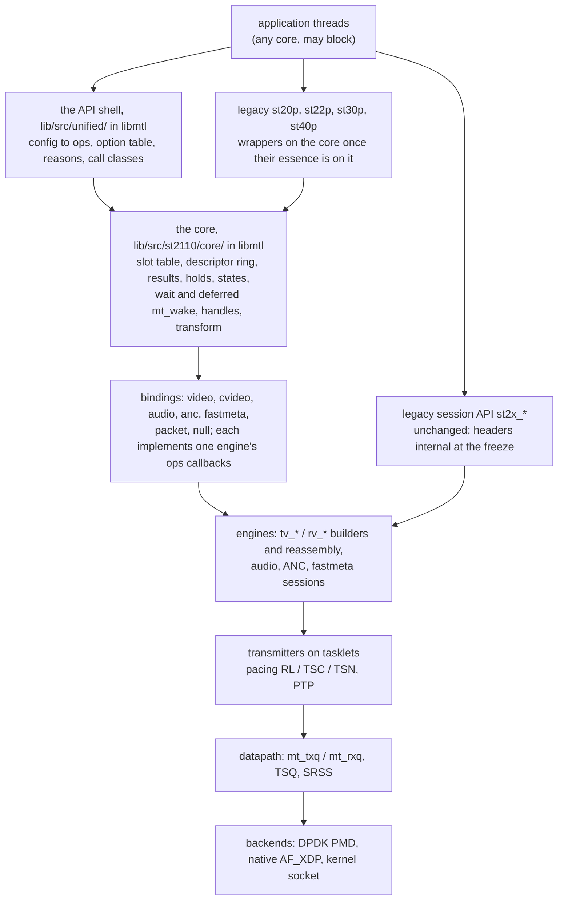

# Engine: how the unified API sits on today's engines

| | |
|---|---|
| Status | Maintained. The implementer's map of `lib/` for the unified API. Nothing here is implemented yet |
| Date | 2026-10-02 |

This document says where each part of the unified API lives in `lib/`, which existing
function it calls or replaces, and what has to change in today's engines first. Public names
are those of the headers in `sketch/include/mtl/experimental/`, which are normative. Internal
names (the core, the bindings, `lib/src/st2110/core/`, `lib/src/unified/`) are indicative.

**Citations.** Every `path:line` is at `main` @ `545a266a` (`lib/` is unchanged at later documentation-only commits). Paths
without a directory are under `lib/src/`; session files are in `lib/src/st2110/`, pipeline files
in `lib/src/st2110/pipeline/`. Citations marked **[verified at HEAD]** were re-read against that
commit. **[inferred]** means the effect follows from the code but was not run.

## 1. The layer picture



| Part | What | Where | Milestone |
|---|---|---|---|
| API shell | the installed headers' functions, each exported in the milestone that implements it (counts: `sketch/check.sh`); `mtl_session_config` into engine `ops` through the option table `lib/src/unified/mtl_options.def`; reasons, `mtl_last_error`, call classes; no data-path state | `lib/src/unified/` in **libmtl**, node `MTL_UNIFIED_EXPERIMENTAL_<rev>` (D-23) | MS1 (task H1b) |
| core | the unit session (§3.2): slot table, descriptor ring, results, holds, nine session states, `ctl`/`ack` and `tick` (§6), the armed wait and the deferred `mt_wake` (§7), handles (§5.7), the transform state; reaches the instance via §4.11, the engines via callbacks and §4.12 | `lib/src/st2110/core/` in libmtl, header `st_core.h` (task C0) | MS1 (`ctl`/`ack`, `tick`: MS2) |
| bindings | one per essence and direction, plus `packet` and `null`: each implements the callbacks its engine already calls (§3.1) | `lib/src/st2110/core/bind_*.c` | video and null MS1; others MS4; packet MS5 |
| legacy pipelines | `st*p_*` as wrappers on the core: `get_frame` = acquire seen as `st_frame`, `put_frame` = submit, `put_frame_abort` = release, `BLOCK_GET` = the core's wait, one legacy notifier for `notify_frame_done` and `notify_frame_available` | `lib/src/st2110/pipeline/` (about 7.9 k lines today, about 2.5 k after [inferred]) | st20p MS2, the others MS4 |
| legacy sessions | `st20_tx_create` and the other session calls stay exactly as they are: they are the engines' native interface, and the bindings are their clients | `lib/src/st2110/` | headers internal at MS7 (D-83) |
| engines | today's builders, transmitters and reassembly, plus the changes of §11 and one `tick` per session (the TX builder, the RX handler, §6) | `lib/src/st2110/`, `datapath/`, `dev/`, `mt_sch.c`, `mt_ptp.c` | per §11 |
| null backend | `null:<n>` ports: a binding with no engine; a null-only instance runs without `mtl_init`; units complete at their scheduled instant on the instance clock, and a TX unit loops to every RX session whose flow matches (§4.11) | `lib/src/st2110/core/bind_null.c` (D-111, D-124) | MS1 (task C2) |

Rules of the picture:

- **One implementation of record.** The frame ring, the blocking get, completion and stats exist
  once, in the core. The pipelines keep only what is theirs to keep (the `st_frame` view, the
  legacy flags), and become wrappers as soon as their essence is on the core, not at the end.
- **Bindings use the callbacks the engines already make.** Every TX engine pulls through
  `get_next_frame` (`st_tx_video_session.c:1922`, ST22 `:2444`, `st_tx_audio_session.c:765`,
  `st_tx_ancillary_session.c:937`, `st_tx_fastmetadata_session.c:718`) and reports through
  `notify_frame_done`; RX asks `query_ext_frame` (`st_rx_video_session.c:1273`) and reports
  `notify_frame_ready`, `notify_slice_ready` (`:1095`) and `notify_detected` (`:2803`). Today's
  pipelines are one implementation of exactly these (`st20_pipeline_tx.c:456-457`,
  `st30_pipeline_tx.c:294-295`, `st20_pipeline_rx.c:566`, `:595`) **[verified at HEAD]**. So
  frames and rows need no new engine entry point; packets need one shared chunk expander (§11.2).
- **Bindings are wait-free.** They run on the tasklet with the session spinlock held
  (`st_tx_video_session.c:2682`, `st_rx_video_session.c:3516`): a CAS, a release store, a fence,
  an armed-word load and at most one bit set in the scheduler's pending wake bitmap (§7.2). No
  lock, no allocation, no syscall; a log line goes only into the per-scheduler log ring (§2.8).
- **Why not a facade.** PR #1610 put a facade on the session layer and lost the application's
  timing: `frame->tv_meta = meta` overwrites what the facade wrote, so USER_PACING,
  USER_TIMESTAMP and user meta were ignored for every frame (`st_tx_video_session.c:1945`
  **[verified at HEAD]**; R7 in [legacy-internals.md](legacy-internals.md)).
  A binding *is* `get_next_frame`, so the meta it writes is the meta the engine keeps.
- **One library** (D-23, D-106, D-108): the API shell `lib/src/unified/` and the core are compiled
  into libmtl, with the unified functions in their own version node; the node, the version script,
  the soname and the hiding of symbols are in [migration.md](migration.md) §7.2.
- **Binding pitfalls PR #1610 hit** (the video bindings set transport ops the same way): set the
  enabling flag together with its field (`ST20_RX_FLAG_ENABLE_VSYNC` with `notify_event`,
  `*_FLAG_FORCE_NUMA` with `socket_id`; PR #1610 set only the field, so RX VSYNC never fired and RX
  NUMA was ignored, D6, D7); never write the transport `refcnt` (D9 zeroed it in
  `get_next_frame`, which defeats the transport's own busy check); reject a second submit of a
  slot (D4 re-queued a frame in flight); never copy or convert in `notify_frame_ready` (D2: a 4K
  copy on the tasklet). PR #1610's defects D1…D10, and what of it each MS1 task can reuse, are in
  [legacy-internals.md](legacy-internals.md) §12.
- **The acceptance engine reads library log lines.** The video bindings print the same
  `st20p_tx_create(...)` and `st20p_rx_create(...)` lines as the pipelines
  (`st20_pipeline_tx.c:1175`, `st20_pipeline_rx.c:1104`), which `tests/acceptance` greps (D-110).

## 2. The pinned-core rules

The rule: MTL runs tasklets on pinned cores; everything called from the API runs
outside them and never blocks them. The header states it as R6: no application code ever runs on
an MTL tasklet.

### 2.1 What today's code does

| # | Today | Evidence |
|---|---|---|
| H1 | almost every user callback (`get_next_frame`, `notify_*`, `query_ext_frame`, `uframe_pg_callback`, `notify_detected`) runs on the tasklet with the session spinlock held; `get_next_frame` is polled every iteration while idle | `st_tx_video_session.c:2682`, `st_rx_video_session.c:3516` **[verified at HEAD]**; `st_video_transmitter.c:674` |
| H2 | a same-session stats getter called from a callback spins forever on the non-recursive spinlock | `st_tx_video_session.c:4760`, `st20_pipeline_tx.c:1311` (SF-13) |
| H3 | BLOCK_GET: the tasklet does `pthread_mutex_lock` + `pthread_cond_signal` on every frame event; the application holds that mutex while scanning, so the pinned core can sleep in `FUTEX_WAIT` | `st20_pipeline_tx.c:29-34` called at `:41-43` **[verified at HEAD]**; `:774-789`; same in every `st*p` (SF-15) |
| H4 | TX-hang recovery runs on the transmitter: queue re-acquire under a pthread mutex, mempool re-create, busy flush, INFO logs | `st_video_transmitter.c:681` → `st_tx_video_session.c:4231-4332` **[verified at HEAD]**; audio `st_tx_audio_session.c:2742-2753` |
| H5 | RX auto-detect allocates on the tasklet | `rv_init_sw` `st_rx_video_session.c:2564`, `rx_st20p_notify_detected` `st20_pipeline_rx.c:341-393` |
| H6 | `update_destination` holds the session spinlock across an ARP wait of up to 60 s; `update_source` across flow and IGMP work | `st_tx_video_session.c:3848-3855` **[verified at HEAD]**, `mt_arp.c:171-199`, `st_rx_video_session.c:3932-3990` (SF-14) |
| H7 | `ptp_get_time_fn`, PHC reads and the log printer (`localtime_r`) run on the hot path | `dev/mt_dev.c:1603-1608`, `mt_ptp.c:393-403`, `mt_log.h:24-39` |
| H8 | TX `notify_frame_done` fires on the transmitter, the builder, the application thread or a plugin thread; migration moves sessions between lcores | [legacy-internals.md](legacy-internals.md) (which context runs which callback) |
| H9 | the admin CPU-busy scan takes the blocking session spinlock of every video session each cycle, so tasklets skip that session; TSQ `tx_mutex` and the SRSS list lock spin inside tasklets | `mt_admin.c:29-33` **[verified at HEAD]**; `datapath/mt_shared_queue.c:642`, `datapath/mt_shared_rss.c:66-71` |
| H10 | `USE_MULTI_THREADS` RX: with the packet ring full the tasklet and the packet lcore process one session at once | `st_rx_video_session.c:2901-2907` (SP-03, **[inferred]** race) |

Severity: H1 design, H2 fatal, H3 high, H4 high (error path), H5 medium, H6 high, H7 medium, H9
medium, H10 medium. Three more tasklet hazards are listed in
[legacy-internals.md](legacy-internals.md): pcap file I/O on the tasklet (debug only), the builder
`pending` overwrite (SF-08 here) and samples that teach mutex + condvar in callbacks.

The scheduler itself is sound and stays as it is, with one addition: one loop per scheduler that
sums handler returns and may sleep (`sch_tasklet_func`, `mt_sch.c:155-242`); register and
unregister run under a pthread mutex with an ack handshake (`mt_sch.c:873-966`). The addition is
the wake flush between the handler loop and the sleep check (§7.2).

### 2.2 Execution contexts

| Context | Pinned | May run | Must never |
|---|---|---|---|
| **TK** tasklet (lcore, thread-mode scheduler, null-only loop) | yes | packet build, pacing, RX reassembly, mempool get/put, lock-free ring ops, release stores, fences, one RMW on a line the application rarely writes, log-ring lines | block, sleep, take an application-holdable lock, allocate, call the log sink, run application code, make a syscall in a handler (except §2.3; wake flush: §7.2) |
| **WK** library workers | no | recovery rebuilds, auto-detect re-init, ARP/flow/IGMP for updates, stalled-queue stop/start, deferred-close retire, pcap writes, conversion when not in the caller | spin on tasklet-owned state |
| **AD** admin, stat, CNI, EAL alarm and log-sink threads | no | periodic work, PTP servo, time-base publication, NIC counters, link monitor, handing log lines to the sink (§2.8) | take a lock a tasklet takes |
| **APP** application threads | application's choice | every public call; DPC work (conversion, zero-fill, copies) | — |

"Never allocate" is precise: no `malloc`/`calloc`/`rte_malloc*` and no mempool, ring or heap
creation or destruction on a tasklet. Mempool get/put and ring enqueue/dequeue are allowed:
tasklets already take one mbuf per packet and one per frame at TX start
(`st_tx_video_session.c:4350`).

### 2.3 Syscalls on tasklets, per backend

| Backend | Syscalls on the tasklet | Status |
|---|---|---|
| DPDK PMD | none inside a handler; the scheduler loop makes one non-blocking eventfd `write()` per iteration for each session flagged for an armed waiter (§7.2) | promise (G-39, the deferred wake write excepted); the writes are counted per scheduler and reported |
| kernel socket | `sendto`/`sendmsg` in `mt_tx_socket_burst` (`datapath/mt_dp_socket.c:421-445`) | reported per backend; G-39 scoped out |
| native AF_XDP | `send()` kick (`dev/mt_af_xdp.c:522-526`) | same |
| built-in PTP time reads | `rte_eth_timesync_read_time` per `mt_get_ptp_time` | replaced by the published time base (§8, MS6) |

### 2.4 How the new core keeps the rules

| Rule | Mechanism | Section |
|---|---|---|
| arrows into the tasklet world are lock-free hand-offs | commands in the session's `ctl` word, acknowledged in its `ack` word by the per-visit `tick` (MS2); flush and discard of queued units are control-plane CASes on the slot table; the CP applies commands itself on a detached session | §6 |
| arrows out of the tasklet world are wait-free stores | a completion is the claim CAS, the result written into the unit's descriptor, a release store of PUBLISHED and a fence; an event updates pending state; a waiter is woken through `mt_wake()`: a bit in the scheduler's pending bitmap, turned into one eventfd write per iteration by the scheduler loop | §5, §7 |
| heavy per-unit work never runs on a tasklet | conversion, RX copies into application memory, zero-fill of missing data run in the caller (DPC) or on a worker. One exception, library code only: `rx.convert_per_packet` (`MTL_OPT_RX_CONVERT_PER_PACKET`) converts each packet on the RX tasklet as it lands, as `ST20P_RX_FLAG_PKT_CONVERT` does today (§4.4) | §3, §4 |
| results cannot be lost or overflow | acquire reserves the result's descriptor (the `resv` counter) before the unit exists, and the completer writes the result in place; the tasklet allocates no entry | §5 |
| no user code or driver read for time | one published, slewed time base per CPU socket (MS6) | §8 |
| no log I/O on tasklets | tasklets write already formatted, length-capped lines into a per-scheduler log ring that drops when full; a library thread hands them to the sink | §2.8 |
| no lock shared with tasklets on read paths | per-scheduler counter blocks summed by the reader; gauges by scan; seqlocked groups; the admin scan reads tasklet-written busy counters | §2.8 |
| events never block their producer | per-source pending state for tasklets, small rings per producer class for library threads | §7.5 |

**Call classes in the engine.** Each public function carries one of `MTL_API_CP`, `MTL_API_DP`,
`MTL_API_DPC`, `MTL_API_WT`, `MTL_API_AS` (the contract is in [contract.md](contract.md)). For the
engine this means: DP and DPC calls never wait for a tasklet and return `-MTL_EAGAIN` instead; a
tasklet never waits for an application thread (an empty submission means idle, a full results
ring cannot happen, §5). The one syscall a DP call may make is the non-blocking `read()` that
drains a signalled wait handle (R6, §7.3). Seqlock readers (`mtl_time_now`, and with it the
inline `mtl_time_convert`, `mtl_stat_read`, health) are DP, not AS: a signal handler that interrupts the writer's own
thread mid-update would retry forever.

**Inline notify** (`mtl_session_set_inline_notify`, `mtl_events.h`, `MTL_LATER`). v1 runs no
application code on a completing context (D-04); the function is added only if W0 busy polling
cannot close the latency gap for slice producers, zero-hop forwarders and the MXL bridge. If it
is added, it runs on the completing context without any session lock held (so it cannot
self-deadlock, H2), must be wait-free and bounded, may call only the inline-safe subset (the DP
calls with timeout 0, which then only trylock the reaper lock and never drain a wait handle, and
the AS calls), has a
measured budget with counters, and is disabled with `MTL_EVENT_OVERFLOW` when it overruns
repeatedly.

**Library loops.** No public function is called from a tasklet or a library loop (the scheduler
loop, the loop thread of a null-only instance, the RX packet lcore of `USE_MULTI_THREADS`, the TAP
lcore), and none runs application code
(R6). Busy polling belongs to application threads: they may poll the DP calls and the WT calls
with timeout 0 (W0). Each library loop sets a thread-local `mt_in_busy_loop` that backs a
debug-build assert on every public entry; it is not a public error. AS calls are allowed on any
thread: a signal can be delivered to a pinned lcore thread too, and an AS call is atomics plus at
most one eventfd `write()`, made from a context already in a signal handler. User schedulers and
tasklets (`mtl_sch_*`) are cut ([coverage.md](coverage.md)), so neither H2 nor the 1 s sleep of
a self-unregistering tasklet (`mt_sch.c:885-901`) can be reached from the API.

**Debug enforcement** (MS3). Every entry point sets a thread-local "current class". `mt_rte_zmalloc*`,
`mt_pthread_mutex_lock`, `mt_sleep_ms`, `info()` and `warn()` assert that the class is not DP,
DPC or AS and that the thread is not a tasklet or library loop. A WT call with timeout 0 runs as DP. A
signal-safety test raises a signal inside every CP call with `malloc` and `pthread_mutex_lock`
interposers armed, and calls every AS function from the handler.

### 2.5 Thread mode and sleep

- `MTL_INSTANCE_TASKLET_THREAD`: today `sch_start` creates a plain pthread
  (`mt_sch.c:285-287`, `sch_tasklet_thread` at `:252-257`) that is never registered with EAL;
  `rte_thread_register` appears nowhere in `lib/src` **[verified at HEAD]** (SF-49). Such a
  thread has `LCORE_ID_ANY` and no mempool cache. The fix calls `rte_thread_register` in the
  scheduler thread at start and pins each scheduler thread to one CPU (MS1, task E1). The wake is
  the same in this mode: the scheduler thread flushes after its handler loop (§7.2).
- **Threads that are not schedulers** run on `instance.main_lcore` (`MTL_OPT_MAIN_LCORE`, D-92).
  Today every one inherits the affinity of the thread that called `mtl_init`; each is pinned at
  its creation site: admin (`mt_admin.c:384`), stat (`mt_stat.c:156`), CNI (`mt_cni.c:415`),
  kernel-socket TX and RX (`datapath/mt_dp_socket.c:288`, `:627`) and TSC calibration
  (`mt_main.c:200`) **[verified at HEAD]**; the workers, the log-sink thread and the loop thread
  of a null-only instance are new and are created pinned (part of EK7).
- `MTL_INSTANCE_TASKLET_SLEEP`: the idle path already enters the kernel
  (`rte_eal_alarm_set` + `cond_timedwait` with a 1 s safety net, `mt_sch.c:86-96`
  **[verified at HEAD]**). The wake flush runs before the sleep check (`mt_sch.c:211-213`), so a
  scheduler never sleeps on a pending wake (§7.2), and posting a command calls `sch_sleep_wakeup`
  (`mt_sch.c:52-56` **[verified at HEAD]**) from the CP thread.

### 2.6 Mempools and application threads

| Case | Rule |
|---|---|
| frame pools (all essences) | keep today's atomic release: RX release is an atomic decrement (`rv_put_frame`, `st_rx_video_session.c:222-232` **[verified at HEAD]**), not a mempool operation |
| application threads and MP/MC mempools | an application thread never gets from or puts to a mempool a tasklet also uses: a preempted thread mid-dequeue makes the tasklet spin in the ring tail update (`mt_util.c:516-545`, default `ring_mp_mc`, **[inferred]** from DPDK). `st20_tx_get_mbuf` (`st_tx_video_session.c:4628`) is such a path and stays legacy-only |
| packet units (`MTL_UNIT_PACKETS`) | a tasklet-refilled allocation ring per consumer plus a return ring the tasklet drains |
| non-EAL threads | have no mempool cache; one more reason for the rules above |

Why the rules hold: an `rte_ring` consumer never waits on a producer; only peers on the same side
wait in `__rte_ring_update_tail`. So a tasklet that dequeues a ring filled by application threads
(the return rings of packet units) is safe, but an application thread that gets from or puts to an
MP/MC mempool the tasklet also uses makes the tasklet a same-side peer of a thread that can be
preempted. RTS/HTS ring modes only bound that window; they do not remove it. In thread mode
without `rte_thread_register`, two scheduler threads that share a port pool also contend on its
MP ring tail, because neither has a mempool cache (§2.5).

Other hazards on the way: the handle guard's `lc_refcnt` RMW shares a cache line with
tasklet-read fields (`st20_pipeline_tx.h:35-42`), so the core's in-flight counter sits on its own
line; slot tables live on the scheduler's NUMA node and `mtl_session_info.sched_index` names the
scheduler. An application thread that polls from the other socket pays cross-socket latency on
every call, so polling threads should run on the scheduler's node: the `sched.lcore` and
`info.numa` stats keys give it.

### 2.7 Backends and what they grant

The capability keys (`caps.backend`, `caps.pacing_classes`, `caps.tx_multi_seg`,
`caps.hw_rx_timestamp`, …), `tx.path`, the per-backend scope of G-39 and the expected pacing class
per test come from this table. Driver table: `dev/mt_dev.c:14-107` **[verified at HEAD]**.

| Backend (`enum mtl_backend`) | Pacing classes | Path and steering | Notes |
|---|---|---|---|
| `MTL_BACKEND_DPDK_PMD` (E810/E830 PF or VF) | `HW_RATE` (TM shaper: ice PF, iavf VF), `HW_LAUNCH` (E830 PF, built-in PTP), `SW`, `SW_NARROW`, `BEST_EFFORT` | zero copy when the NIC has multi-segment TX; flow director, else shared RSS (ixgbe: `MT_FLOW_NONE`) | CNI inside MTL; the only backend with TX hang recovery; no secondary processes (`--in-memory`, `dev/mt_dev.c:344`) |
| `MTL_BACKEND_AF_XDP` (native) | `HW_RATE` through sysfs `tx_maxrate` on ice (`dev/mt_af_xdp.c:96`), else `SW` | always copies into UMEM; XDP program and per-queue XSK from MtlManager, or from a node daemon's XSK map (EK19) | — |
| `MTL_BACKEND_KERNEL_SOCKET` | `SW` only | single segment; a socket per flow, no flow steering | still needs hugepages; the destination is fixed at queue creation, so an update swaps the queue (§6) |
| `MTL_BACKEND_NULL` | none | no NIC; units complete at their launch instant on the instance clock; loopback RX by flow | the null binding and the null-only instance (§4.11, D-111), MS1 |
| Windows | DPDK PMD only | — | no MtlManager, AF_XDP or kernel socket |

**DSCP** (D-134). The TX header templates today are IPv4 only, TTL 64, TOS 0, DF set (video
`st_tx_video_session.c:944-947`) **[verified at HEAD]**, and the builders copy the template into
every packet (`:1062`, `:1107`, `:1213`); no `ops` field carries a TOS. `mtl_flow.dscp` (and
`ttl`) reach the wire through these templates: the video TX binding passes them at create (MS1,
task B1), the other bindings with their essence (MS4): audio `st_tx_audio_session.c:165`, ANC
`st_tx_ancillary_session.c:225`, fastmeta `st_tx_fastmetadata_session.c:168` (TOS lines). Each
engine gains the field in its `ops` or a setter in `st_engine_core.h` (§4.12). The kernel-socket
backend sends from an `AF_INET`/`SOCK_DGRAM` socket (`datapath/mt_dp_socket.c:212`) and hands
`sendto` only the UDP payload (`:67-80`), so the template's TOS never reaches the wire there: that
backend needs `setsockopt(IP_TOS)` (and `IP_TTL`) on the queue's socket **[verified at HEAD]**.

Constraints the capability model must make visible, all silent today:

- a shared TX queue forces software pacing for the whole port (§4.9);
- ST 2110-22 downgrades a rate-limited port to software pacing for its sessions (§4.9);
- `mtl_dma_map` needs IOVA-VA mode;
- HW RX timestamps need the PMD's RX timestamp offload (`dev/mt_dev.c:2422-2440`), with the iavf
  descriptor-count workaround of `99b96c16` (`dev/mt_dev.c:1018-1027`); `include/mtl_api.h:371`
  still says "PF on E810" (to confirm);
- legacy `ALLOW_DOWN_PORTS` prunes a 2022-7 session to one leg at create (`tv_ops_prune_down_ports`
  `st_tx_video_session.c:4006`, audio `st_tx_audio_session.c:2599`, RX `rv_ops_prune_down_ports`
  `st_rx_video_session.c:4199`).

Backend facts beyond this table (CNI per backend, DPDK AF_XDP and AF_PACKET) are in
[legacy-internals.md](legacy-internals.md).

### 2.8 Stats, traces and logs

| Part | Construction |
|---|---|
| counters | per scheduler (D-128): each scheduler writes its own block of a session's counters, on its own cache line; a completion on another scheduler (a shared TX queue's last mbuf freed by another session's tasklet, §5.3) writes that scheduler's block; application and library threads have their own; relaxed stores, summed by the reader, never reset by the library |
| gauges | not sums of writer blocks, which are no consistent cut: the reader scans the slot state words once, which also gives `queue.queued_media_ns`; per-writer `entries{state}` and `exits{state}` counters make G-43 an identity |
| seqlocks | only for grouped values of one writer: histogram buckets, window buckets, the PTP offset and path-delay pair |
| windowed maxima (`{window=1s\|60s}`) | a ring of 60 one-second buckets written by the value's single writer; the reader takes the current bucket or the maximum of the valid ones |
| port counters | polled by a library thread and cached (`MTL_STAT_CACHED`, `port.sampled_tai_ns`): `rte_eth_stats_get` on a VF can be a PF mailbox round trip |
| USDT probes | keep today's providers; add probes for admission decisions (unit, margin, policy), late and drop, recovery begin and end, time state, link, back-pressure, migration, command posted and acked, each with the session handle ID, unit `seq`, media index and RTP |
| logs | tasklets write already formatted, length-capped lines (session name prefixed) into a lock-free per-scheduler ring; a full ring drops the line and counts the drop; a library thread hands the lines to the sink (D-129). No per-site codes. Today tasklets log at every level (`st20_pipeline_tx.c:197`, `st_tx_video_session.c:129`, `st_video_transmitter.c:38`, `st_rx_video_session.c:941`) |

The core's own counters follow these rules from MS1; the stats registry over them comes in MS3;
the engine counters in `tv_*`/`rv_*` and in the other essences' sessions are converted by MS4. The
registry rules are [contract.md §11](contract.md), the log rules contract.md §10.4.

## 3. The core and its bindings

### 3.1 Bindings per essence

| Essence × direction | Callbacks the binding implements | Engine work it needs |
|---|---|---|
| video TX, frames | `get_next_frame` (the descriptor at the pick cursor if its slot word is QUEUED with its generation; the slot N, §4.13; the meta; ENGINE), `notify_frame_done` (the completion CAS, the result) | MF1 (`st_tx_video_session.c:134-139`), MF7, the recovery verdict (§10); idle descriptor cleanup (§4.3); "last packet handed" for no-chain (MS2) |
| video TX, rows (MS2) | the same, with the session created `ST20_TYPE_SLICE_LEVEL`; `query_frame_lines_ready` returns the slot's `progress` (an acquire load), or the TRUNCATE code that ends the frame early | the TRUNCATE return code and `tx.troffset_ns` (§4.14); the rest is today's slice path (`st_tx_video_session.c:2005-2033`) |
| video RX, frames | `query_ext_frame` hands the engine a core slot (MS1: any FREE; MS2: attached pools, by index, or the oldest unread with `RX_LATEST`) and records the first arrival; `notify_frame_ready` publishes it with the next `pub_seq` | incomplete delivery always on; the RX hook never refuses (SF-45); MF4; a tasklet-callable frame put and the frame count (§4.12) |
| video RX, rows (MS2) | `notify_slice_ready` stores `progress` and wakes `mtl_rx_wait_rows` waiters | none |
| per-packet conversion | the engine's `uframe_pg_callback` path, installed by the video RX binding (library code, the one tasklet conversion contract.md §9.7 allows) | none |
| cvideo TX/RX (MS4) | the ST22 `get_next_frame` (`st_tx_video_session.c:2444`) and RX callbacks; codecs on the transform state | per-unit status, stats, CBR (E10), SF-42 |
| audio TX/RX (MS4) | `get_next_frame` (`st_tx_audio_session.c:765`), done, RX ready | "last packet handed" (done fires at build today, `:923-925`); media time from the sample index; carry buffer (E6) |
| ANC TX/RX (MS4) | `get_next_frame` (`st_tx_ancillary_session.c:937`), done, RX ready; the UDW binding of `st40_pipeline_tx.c:253-273` moves here | ANC RTP from media time, every RTP packet inside its ST 2110-40 window, keep-alive (E7) |
| fastmeta TX/RX (MS4) | `get_next_frame` (`st_tx_fastmetadata_session.c:718`), done; RX frames assembled at dequeue from the RTP ring (`st_rx_fastmetadata_session.c:183`, `:205` are RTP-only) | keep-alive |
| packet units, every essence (MS5) | one shared chunk expander on the TX tasklet (header mbufs plus extbuf attaches, one `shinfo` per chunk whose `free_cb` completes the chunk) feeding the engine's existing RTP ring; RX chunks formed at dequeue from `rtps_ring` | PE1 as one helper (about 250 lines [inferred]) plus about 10 lines per TX engine where it dequeues `packet_ring`; PE2–PE8 |
| null | none: completes units at their launch instant on the instance clock (synchronously under the test clock) and loops each TX unit to the RX sessions whose flow matches (§4.11) | none |

UB tests drive the real engine through the bindings, so they survive refactors of the engine
internals.

### 3.2 The slot table

One state machine serves both directions, because a TX result and an RX unit are the same
thing for the reader: something published to read.

| State | TX | RX | Who moves it out |
|---|---|---|---|
| FREE | acquirable | assignable by the engine | `mtl_tx_acquire` (CAS); the RX binding |
| APP | leased, writable | dequeued, readable | `mtl_tx_submit`, `mtl_release` |
| QUEUED (+ bit X: needs transform) | submitted, `seq` assigned | — | the binding at pick-up; a transform claim; a control-plane CAS for flush and discard |
| XFORM | a converter or encoder owns it | a decoder or converter owns it | the transform's done |
| ENGINE | picked up (in flight) | receiving | the completion CAS (TX done; RX ready, due time); RX discard (applied by the `tick`, §6): the completion CAS straight to FREE, counted in `rx.units_flushed`, never PUBLISHED |
| PUBLISHED | result in its descriptor; the slot is acquirable again | unit readable | TX: `mtl_tx_acquire` (the result stays in the descriptor, §5.4); RX: `mtl_rx_dequeue`, `RX_LATEST` reclaim (tasklet CAS back to ENGINE), RX discard (control-plane CAS to FREE, counted in `rx.units_flushed`) |
| HELD | — | released while TX units still hold it | the last hold drops (CAS to FREE) |

- **The slot word** (D-118). One 64-bit atomic per slot:
  `{state:4 | X:1 | C:1 | spare:2 | holds:8 | spare:16 | gen:32}`. Acquire (TX) and dequeue (RX)
  write the new generation in the CAS that takes the slot; tasklet CASes carry the generation
  through unchanged; release, submit, hold changes and every tasklet CAS compare the whole word, so
  a stale lease or a late completer fails on the generation or the state, never on a second check.
- **The completion CAS is the claim.** One CAS moves the word out of ENGINE (or out of QUEUED for a
  control-plane flush) to the same state with bit C set, so a second completer (the free callback
  against recovery, SF-39) fails by construction; no separate claim word. The winner alone writes
  the result, then release-stores PUBLISHED.
- **Completion protocol** (§5.2, §7.1): claim, write the result, store PUBLISHED with release, a
  seq_cst fence, load the armed word, `mt_wake` only if a waiter is armed.
- **Order.** `seq` is the position in the descriptor ring (§5.4), so one ring gives pick-up
  order, result order and reap order. Acquire reserves a result entry through the `resv` counter
  (§5.4); with results off the completer stores FREE.
- **Generation** advances whenever a lease is made (TX `mtl_tx_acquire`, RX `mtl_rx_dequeue`) and
  is written by that application thread inside the slot-word CAS, so a tasklet never changes it;
  leases are `{session:16, slot:16, generation:32}` (§5.7).
- **Holds**: `unit.hold` on a TX submit adds one to the RX slot word's `holds` field (at most 255),
  and the TX unit's terminal outcome removes it.
- **Progress**: `progress` (`used`) carries rows and packets in the same slot (§3.1). For rows
  units `used` counts rows and 0 is legal, because the slot is claimed before row 0 exists.

Today's st20p TX frame states (`st20_pipeline_tx.h:12-19`) map onto these: FREE = FREE, IN_USER =
APP, READY = QUEUED with X, CONVERTED = QUEUED, IN_CONVERTING = XFORM, IN_TRANSMITTING = ENGINE,
DROPPED = PUBLISHED with an `MTL_TX_DROPPED` result. st20p has no HELD and keeps no result: it
stores FREE before it notifies (§4.1).

## 4. ST20 first: where to start in `lib/`

The MS1 tasks of [implementation-plan.md](implementation-plan.md) §5.2 that touch `lib/` start at
these files. The core and the bindings are new files; the engine diffs of MS1 stay under about
1 k lines, and st20p itself changes only by bugfixes until its re-base in MS2.

- **C0, the core's internal header.** `lib/src/st2110/core/st_core.h`: the slot word (§3.2), the
  descriptor ring (§5.4), the armed words (§7.1), the binding ops and the environment interface
  (§4.11). Maintainer checkpoint 1; no code depends on it before it is approved.
- **C1a and C1b, the core.** New files in `lib/src/st2110/core/` (`st_core_slot.c`,
  `st_core_session.c`, `st_core_wait.c`, `st_core_handle.c`; names indicative), added with
  `subdir('core')` to `lib/src/st2110/meson.build` next to `subdir('pipeline')`. C1a: the handle
  table (§5.7; today's guard `mt_handle_guard.h:75-95` is not reused), the nine session states,
  sticky interrupts, the deferred and idempotent close (§9), with U tests on a test binding. C1b:
  the slot table, the descriptor ring, results and the reservation (§3.2, §5), the armed wait and
  the deferred `mt_wake()` (§7; PR #1610's eventfd and poll loop seed it, legacy-internals.md
  §12.1 row C1b). The one engine line is
  the wake flush call in `sch_tasklet_func`, between the handler loop (`mt_sch.c:192-210`) and
  the sleep check (`:211-213`), reached through the environment interface. Start and stop are a
  session state the bindings read; `ctl`/`ack` come in MS2 (§6).
- **A1, the instance.** The null-only instance and its EAL rule (§4.11), the bridge from a legacy
  instance, errors and reasons, options, and the null port parsing: on a mixed instance the API
  shell takes `null:<n>` ports out of the port list before `mtl_init` (today's prefixes are parsed
  by `mtl_pmd_by_port_name`, `mt_util.c:967`), so nothing in `lib/src/dev/` changes (D-111).
- **C2, the null binding.** `lib/src/st2110/core/bind_null.c`. The test
  clock with synchronous completions (§4.11) and `mtl_debug_inject` (`FORCE_ERROR`, `DROP_PKTS`)
  are core code built with `-Denable_debug_api=true`. Detail: §1, §2.7, §4.11.
- **E1, engine fixes** (detail §4.2, §4.3, §4.5, §10). S0's data is needed before the merge, not
  before the writing:
  - MF1 in `tv_frame_free_cb` (`st_tx_video_session.c:116-143`: notify at `:134` before the
    decrement at `:135`), unless PR #1770 landed;
  - MF7: the builder takes one reference on the frame's `sh_info` when it starts the frame (where
    it takes `refcnt`, `:1962`) and drops it after the last attach, so the count cannot reach 0
    mid-frame when the NIC has freed every packet built so far before the next attach (a starved
    builder; from MS2 rows waiting for lines);
  - the recovery verdict and the two alternating `sh_info` per frame (§10);
  - idle descriptor cleanup in the per-session loop of `video_trs_tasklet_handler`
    (`st_video_transmitter.c:673-686`) through `mt_txq_done_cleanup`
    (`datapath/mt_queue.c:216-219`), dedicated queues only, and only while the builder's frame
    state is `ST21_TX_STAT_WAIT_FRAME` (§4.3);
  - incomplete delivery always on: the RX binding sets `ST20_RX_FLAG_RECEIVE_INCOMPLETE_FRAME`
    (`include/st20_api.h:204`), so the silent recycle at `st_rx_video_session.c:976-982` is never
    reached for core sessions (the engine also requires the flag with `query_ext_frame`,
    `:4287-4291`);
  - the RX hook never refuses: `rv_frame_notify` puts a refused frame back at `:938-944` (SF-45),
    so the RX binding's `notify_frame_ready` always returns 0;
  - `rte_thread_register` for thread-mode schedulers (SF-49, §2.5), the ST30P and ST40P
    user-timestamp fixes, and the legacy teardown order (OI-3, §9).
- **B1, the video TX binding** (detail §4.1–§4.3, §4.13). `lib/src/st2110/core/bind_video_tx.c`:
  - the template is `tx_st20p_create_transport` (`st20_pipeline_tx.c:413-488`: ops at `:419-480`,
    `st20_tx_create` at `:482`);
  - `get_next_frame` is called at `st_tx_video_session.c:1922` (today `tx_st20p_next_frame`,
    `st20_pipeline_tx.c:181-245`); `notify_frame_done` by `tv_notify_frame_done`
    (`st_tx_video_session.c:93-107`; today `tx_st20p_frame_done`, `st20_pipeline_tx.c:247-297`);
  - the binding owns the slot decision and drives the engine with `ST20_TX_FLAG_USER_PACING |
    ST20_TX_FLAG_RTP_TIMESTAMP_EPOCH` (`include/st20_api.h:56`, `:100`) and `required_tai = N·T`
    (§4.13), which replaces the pipeline's drop-when-late (`st20_pipeline_tx.c:115-179`); one or
    two legs, interlace, DSCP (§2.7), `sc.ssrc` and `sc.payload_type` into `ops.ssrc` and
    `ops.payload_type` (one RTP identity for both legs, read at `st_tx_video_session.c:964-967`);
  - the sender type goes into `ops.pacing`; the engine has only the gapped schedule today (N, and W
    with the gapped TRS, SF-34), reads `ST21_PACING_LINEAR` nowhere (SF-72) and applies the gapped
    schedule to every raster (SF-73). So until E5 (MS6) the binding reports
    `MTL_INFO_NON_COMPLIANT` for `MTL_SENDER_NL`, `MTL_SENDER_W`, and `MTL_SENDER_N` on a raster
    outside ST 2110-21:2022 §6.3.1 (where only NL and W exist,
    [standards.md §6.1](standards.md#61-the-model)); the create rule for such rasters (refuse N, or
    grant NL) is the contract's;
  - TX library pools are the engine's own framebuffers in MS1 (OI-59 (b)); conversion runs in the
    caller (OI-60), and with `MTL_SUBMIT_SRC_PLANES` submit reads the caller's planes during the
    call as the conversion or copy source;
  - `notify_event` (`ST_EVENT_FATAL_ERROR` at `:4240`, `ST_EVENT_RECOVERY_ERROR` at `:4328`, VSYNC at
    `:310`) gives ERROR and the epoch tick; `notify_frame_late` (`:682-683`) never fires for core
    sessions, because the engine calls it only when it picks the slot itself;
  - the log line is that of `st20_pipeline_tx.c:1175` (D-110); the UB tests drive the real engine
    through a harness like `tests/unit/session/st20_tx_harness.c`.
- **B2, the video RX binding** (detail §4.4, §4.5, §4.15). `lib/src/st2110/core/bind_video_rx.c`:
  - the template is `rx_st20p_create_transport` (`st20_pipeline_rx.c:490-628`: ops at
    `:499-597`, `st20_rx_create` at `:599`);
  - one RX path from MS1 (D-126): `query_ext_frame` (`st_rx_video_session.c:1273`) hands the engine
    a core-allocated slot for every unit; `notify_frame_ready` is called by `rv_notify_frame_ready`
    (`st_rx_video_session.c:714-721`; today `rx_st20p_frame_ready`, `st20_pipeline_rx.c:169-296`)
    and publishes the slot in `pub_seq` order (§5.4); `notify_detected` at
    `st_rx_video_session.c:2803`; `notify_event` for VSYNC at `:3488`;
  - a slot that reaches FREE returns its engine frame with the tasklet-callable put of
    `st_engine_core.h` (§4.12) over `rv_put_frame` (`:222-232`); the public `st20_rx_put_framebuff`
    (`:4692-4706`) takes the handle guard and looks the frame up by `addr`;
  - incomplete policy, one or two legs (§4.15);
  - per-packet conversion is the `uframe_pg_callback` install of `st20_pipeline_rx.c:523-536`;
  - the log line is that of `st20_pipeline_rx.c:1104`.

MS2 adds, in the same binding files: rows through `query_frame_lines_ready` (TX) and
`notify_slice_ready` (RX) (§4.14); attached memory, `MTL_SESSION_RX_BY_INDEX` and
`MTL_SESSION_RX_LATEST` through the same `query_ext_frame` (OI-59 (a)); the `tick` hook, one per
session in the TX builder and the RX handler (§6); and, last, the st20p re-base onto the core.

### 4.1 st20p TX, `st20_pipeline_tx.c`

st20p stays as it is in MS1 apart from bugfixes. Its callbacks are the template of the video TX
binding, and at MS2 it becomes a wrapper on the core. The third column says where each piece of
logic lives in the core design.

| Function | Today | In the core and the video TX binding |
|---|---|---|
| `tx_st20p_frame_done` `:247-297` | stores FREE (`:270`) **before** `notify_frame_done` (`:286`) **[verified at HEAD]**, so `get_frame` can hand the slot out before its result exists | the binding's `notify_frame_done` is the completion CAS out of ENGINE; the result is in its descriptor before PUBLISHED, so the slot is reused only after it (§5.2, §5.4); at MS2 the legacy notify fires once (R2) |
| `tx_st20p_convert_put_frame` `:347-391`; internal convert in `st20p_tx_put_ext_frame` `:992-1000` | converting paths fire `notify_frame_done` at conversion, never at transport done (`:380-385`, `:995-999`) | conversion is the XFORM state (D-100), which ends in QUEUED and never in a result; a unit's result exists only at transport done on every path. An early storage release is a later opt-in |
| `st20p_tx_get_frame` `:757-822` | numbers frames at `get_frame` (`:808` **[verified at HEAD]**); BLOCK_GET waits under `block_wake_mutex` (`:774-789`) | `mtl_tx_acquire`: a CAS FREE (or PUBLISHED) → APP with the next generation, plus the reservation (§5.4); the wait is the armed wait on `MTL_WAIT_ACQUIRE` (§7.1); `seq` at submit. At MS2, `st20p_tx_get_frame` is acquire seen as `st_frame` |
| `tx_st20p_newest_available` `:62-77` | returns the **oldest** CONVERTED by `seq_number` **[verified at HEAD]** (the intended FIFO, misnamed, SF-44): acquire A, B, submit B, A sends A, B | the binding's `get_next_frame` takes the descriptor at the pick cursor, so pick-up is by submit `seq` (G-08); the misnamed function goes with the MS2 re-base |
| `tx_st20p_next_frame` `:181-245` | the transport's `get_next_frame`; copies the frame's time into the meta only with USER_PACING or USER_TIMESTAMP (`:231-234`) | the binding's `get_next_frame`: QUEUED → ENGINE, the slot decision, then `st20_tx_frame_meta` with `tfmt` TAI and `timestamp = N·T` (§4.13); media time and launch apart inside `tv_*` is E1 (MS3) |
| `st20p_tx_put_frame` `:825`, `st20p_tx_put_ext_frame` `:929` | state store, optional inline conversion in the caller | `mtl_tx_submit`: the descriptor at `seq` in one line, then APP → QUEUED (+ X for a transform, §5.4); conversion in the caller (DPC, OI-60); `MTL_SUBMIT_SRC_PLANES`: the caller's planes are the conversion or copy source, read during the call |
| `st20p_tx_put_frame_abort` `:902-927` | IN_USER only | `mtl_release` of an APP slot (CAS to FREE, `resv` decremented); a QUEUED slot leaves by a control-plane CAS QUEUED → PUBLISHED with `MTL_TX_FLUSHED` (stop FLUSH, discard), with no engine call (D-103) |
| `tx_st20p_if_frame_late` `:115-179` | DROP_WHEN_LATE needs USER_PACING; one-frame grace; reads PTP time on the tasklet (`:133`) | replaced by the slot decision (§4.13, MS1): a TAI unit whose slot is too late is `MTL_TX_DROPPED` with `TOO_LATE` at pick-up, with no grace period; admission reporting with `margin_ns` is E3 (MS3) |
| `tx_st20p_block_wake` `:29-34` | mutex + cond on the tasklet (H3) | not in the core: one `mt_wake()` (§7); legacy st20p gets it with the MS2 re-base (SF-15) |
| `tx_st20p_framebuffs_flush` `:722-753` | sleeps up to ~1 s per held frame at free (H-K-15) | not on the close path; close uses §9 |
| `st20p_tx_get_session_stats` `:1300` | blocking spinlock (`:1311`, H2) | per-writer counters |

### 4.2 st20 TX session builder, `st_tx_video_session.c`

| Function | Today | Change |
|---|---|---|
| `tvs_tasklet_handler` `:2673-2711` | `try_get` of the session spinlock (`:2682`); `pending` overwritten per session (`:2693-2698`) **[verified at HEAD]** (SF-08) | TX's one `tick` per session visit (MS2, before the `s->active` check at `:2684`): one relaxed load of `ctl`, immediate commands applied, `ack` stored, idle cleanup (§6); sum `pending` (SF-08) |
| `tv_tasklet_frame` `:1863-2146` | calls `get_next_frame` every iteration while idle (`:1922`); claims a frame and returns without building it on `refcnt != 0` or oversize user meta (`:1936-1953`) **[verified at HEAD]** | the binding's `get_next_frame` takes the descriptor at the pick cursor and never hands out a frame these checks refuse (MF1; user meta size checked at submit; SF-38) |
| `calc_frame_count_since_epoch` `:637-690` | "late" measured at the epoch boundary; a frame picked after its start goes out at once, counted nowhere; USER_PACING rounds `required_tai` to the nearest frame (`:644`) and the window check only counts (`:620-635`) | the binding decides N and passes `required_tai = N·T`, which maps back to N (§4.13, MS1); admission reporting (E3, MS3) |
| `tv_sync_pacing` `:692-748` | reads PTP once per frame (`:695`), paces on TSC | media time and launch separate (E1, MS3); exact math (E2, MS1 task X or MS3); published time base (E9, MS6) |
| `tv_update_rtp_time_stamp` `:762` | default video RTP is the scheduled time of packet 0, not the media time | RTP from media time only (E1, MS3; legacy opt-in) |
| `tv_pacing_required_tai` `:1774-1807` | EXACT silently falls back to default pacing outside [now + RL warm-up lead, now + 1 s] (`:1796-1805`) **[verified at HEAD]** | the binding checks the window before it hands the frame over (§4.13), so the fallback is never reached for core sessions; the result reports what happened |
| no-chain done `:2130-2134` | `tv_frame_free_cb` called right after build **[verified at HEAD]**: "done" before anything is sent; same for ST22 `:2655-2659` | "last packet handed" (MS2, `st_engine_core.h`, §4.12): the transmitter completes the frame when its last packet is handed to the NIC; until then a no-chain result means "built" |
| `tv_frame_free_cb` `:116-143` | checks `refcnt == 1`, calls `tv_notify_frame_done` (`:134`), then decrements (`:135`) and clears ext `addr/iova` (`:137-139`) **[verified at HEAD]** (SF-05); one `sh_info`, `fcb_opaque` = the frame (`:235-237`) | MF1 (MS1, E1): decrement and clear before notifying; the claim is the binding's CAS; two alternating `sh_info`, use generation in `fcb_opaque` (§10) |
| `st20_tx_queue_fatal_error` `:4231-4332` | recovery on the transmitter; reports in-flight frames COMPLETE; zeroes `sh_info` (`:4290-4301`) **[verified at HEAD]** | the recovery verdict (MS1, task E1, §10): `MTL_TX_DROPPED` with reason `RECOVERY` recorded in the slot, only software-held references dropped, `sh_info` untouched, published by the last PMD reference; recovery on a worker (R1, MS6) |
| `tv_uinit_hw` `:2712-2740` | pad bursts through `mt_txq_flush` run `tv_frame_free_cb` on the destroying application thread (`:2722-2728`) | replaced by the bounded cleanup and queue reset of §9 (MS3) |
| `tv_mgr_detach` `:3798-3816` | detach is the session spinlock, not a handshake **[verified at HEAD]** | MS1 detaches core sessions this way (through `st20_tx_free`); from MS2 it is the ack-timeout fallback (§6) |
| `tv_init_hdr` `:903-989` | resolves the destination MAC at create (`:927`): `arp_get_result` sleeps in 500 ms steps up to the ARP timeout, 60 s by default (`mt_arp.c:171-199`) **[verified at HEAD]**, hence GStreamer's `async-session-create`; TOS 0 (`:945`) | a worker resolves; the leg is `MTL_FLOW_WAITING_NEIGHBOUR` meanwhile (D-62, G-90); flow rules at start; DSCP into the TOS (§2.7) |
| `tv_mgr_update_dst` `:3843-3862` | holds the spinlock across `tv_update_dst` and its ARP wait **[verified at HEAD]** | a boundary command (MS5): prepared header templates swapped by the `tick` (D-103); the builders copy the template into every packet (`:1062`, `:1107`, `:1213`) |
| `tv_pkts_capable_chain` `:2873-2895`; no-chain decision `:3413-3421` | silent copy mode when `total_pkts × (frames_cnt − 1) < nb_tx_desc` (`:2887`, a warn log); `nb_tx_desc` = 512 (`MT_DEV_TX_DESC`, `dev/mt_dev.c:1009`) **[verified at HEAD]** | report `MTL_TXR_COPIED`, `mtl_session_info.direct`; `MTL_SESSION_REQUIRE_DIRECT` fails create; `min_count_direct` in `mtl_buffer_requirements` |
| frame arrays `:4073`; linesize `:3333-3339`, copy-chain mempool `:2981-2995` | `ST20_FB_MAX_COUNT` = 8; linesize fixed at create | E11 (MS2); MF9 (MS2, §11) |
| `tv_init_pacing` `:494-611` | TR offset from a fixed table (`:505-517`); only `start_vrx` and WIDE are capped by the TR offset (`:554`, `:587-597`); gapped TRS on every raster (`:502`, `:518`, SF-73); SD constants by height (`:507-516`, SF-74); NL runs as N (`:594`, SF-72) **[verified at HEAD]** | `tx.troffset_ns` with the VRX cap of §4.14 (MS2); NL, linear, HEIGHT constants (E5, MS6) |
| linesize and chain build | the engine already strides (below the table) | a plane with `stride ≥ row_bytes` (a sub-rectangle, a woven field) is direct: `plane[0].stride` becomes the engine linesize through MF9 (G-84) |
| `st20_tx_get_session_stats` `:4760` | blocking spinlock (H2) | per-writer counters |

**Linesize and chain build today** **[verified at HEAD]**. `st20_tx_ops.linesize` is a session
parameter (`include/st20_api.h:1214-1218`, RX `:1561-1564`); the session takes the larger of it and
the row bytes and rejects any other non-zero value, equal included (`:3333-3339`, RX
`st_rx_video_session.c:3343-3351`), so a packed plane passes 0. The chain builder offsets each
packet by `line1_number × st20_linesize` (`:1225`, `:1270-1272`) and attaches the slot at that
offset (`:1293-1298`); it copies into `mbuf_mempool_copy_chain` only a packet that crosses row
padding (`:1274-1288`) and, in PA mode, one that crosses a page (`:1289-1292`); the copy builder
does the same (`:1120`, `:1162-1175`). The pipelines forward `transport_linesize`
(`st20_pipeline_tx.c:451`, `st20_pipeline_rx.c:560`). The split-forward sample relies on it:
`ops_tx.width = ctx.width / 2` with the full-width linesize and one offset per quadrant
(`app/sample/fwd/rx_st20_tx_st20_split_fwd.c:263-265`, `:284-287`). `pkts_copied_partial` is 0
with GPM_SL, 0 with BPM (1200 B packets) when `row_bytes` is a multiple of 1200 (1920 px 4:2:2
10-bit = 4800 B), and about one packet per padded line with GPM.

### 4.3 Transmitter, `st_video_transmitter.c`

| Function | Today | Change |
|---|---|---|
| `video_trs_tasklet_handler` `:665` | calls `st20_tx_queue_fatal_error` on the tasklet when `tx_queue_recovery_pending` (`:676-682` **[verified at HEAD]**) | raise a flag; the worker recovers (R1, MS6). The per-session loop (`:673-686`) runs the idle cleanup for core sessions in MS1; from MS2 the builder's `tick` runs it and the transmitter calls nothing of the core (§6) |
| `video_trs_rl_target_reached` `:180-199` | accepts a target up to `NS_PER_S` ahead and returns to the scheduler while it waits (`:188-191`) | the builder's `tick` (MS2) runs on the same scheduler during that wait (§4.8) and applies an immediate command, so stop does not wait up to 1 s |
| `video_trs_burst` `:66`; RL, TSC, launch-time tasklets `:354`, `:373`, `:480` | chain: done only when a later burst recycles descriptors (≈ `nb_tx_desc` packets later), never while idle; RL warms up `warm_pkts × TRS` early (`:226-233`), TSC holds a bulk to its target (`:443-461`) | idle cleanup (below, MS1), dedicated queues; "last packet handed" (MS2); enqueue times (E4, MS3); lead: §4.13 |
| TSN | a launch time in the past is not checked (`:531-538`) | admission rejects it (E3, MS3) |
| RL queue rate set, `dev/mt_dev.c:759-763` (also `:693`) | each rate set commits the port's whole TM hierarchy under `inf->resetting` **[verified at HEAD]**; an external user reports that this disturbs other live sessions on the port (#1620) **[inferred]** | measure in S0: a create must not disturb its siblings; twins run next to their legacy originals on one VF |

**Idle cleanup.** With frames in flight and the build ring empty, the transmitter calls
`mt_txq_done_cleanup` (`datapath/mt_queue.c:216-219` → `rte_eth_tx_done_cleanup`) at most about
once per TRS × 64 (a starting value; S6 measures), and only while the builder's frame state is
`ST21_TX_STAT_WAIT_FRAME` (`st_tx_video_session.c:1913`): the cleanup exists for the last frame
before an idle gap, and a frame being built keeps its own reference (MF7). Dedicated queues only:
on a TSQ the call takes the shared-queue spinlock on the tasklet
(`datapath/mt_shared_queue.c:625-633`, H9). ice and iavf
clean descriptors only when `nb_tx_free < tx_free_thresh` **[inferred]**, hence the ≈ 512-packet
delay: ≈ 1.9 ms at 1080p59.94 (TRS ≈ 3.7 µs), ≈ 0.5 ms at 2160p, ≈ 4.3 ms at 720p59.94. Without it the
result of the last submitted frame never arrives (G-03 fails on the default ST20 path) and
stop(DRAIN) cannot finish; today only teardown (`tv_uinit_hw`) and recovery flush. MS1 runs it
from the transmitter loop for core sessions (task E1); from MS2 the builder's `tick` runs it.

### 4.4 st20p RX, `st20_pipeline_rx.c`

As for TX: st20p RX is the template of the video RX binding and becomes a wrapper on the core in
MS2.

| Function | Today | In the core and the video RX binding |
|---|---|---|
| `rx_st20p_frame_ready` `:169-296` | the transport's `notify_frame_ready`, on the tasklet; may convert per frame there | the binding's `notify_frame_ready` is the completion CAS ENGINE → PUBLISHED with the frame meta as the unit's detail and the next `pub_seq` (§5.4); it never refuses (SF-45) and never copies or converts (D2); conversion runs in the caller's `mtl_rx_dequeue` (DPC, OI-60) |
| `st20p_rx_get_frame` `:841-935`, `st20p_rx_put_frame` `:937` | CAS claims; internal converter in the caller | `mtl_rx_dequeue` is a CAS PUBLISHED → APP with the next generation, in `pub_seq` order; `mtl_release` stores FREE and returns the engine frame (`rv_put_frame`), or HELD while TX units hold it (MS2), and the last hold returns the frame (MF10) |
| `rx_st20p_create_transport` `:490-630` | derive and `query_ext_frame` require `ST20_RX_FLAG_RECEIVE_INCOMPLETE_FRAME` (`:589-594`) | the binding sets the flag on every session and applies `MTL_OPT_RX_INCOMPLETE` (DELIVER or DISCARD) itself; with DISCARD it returns the frame at once and counts the unit (MS1, task E1) |
| `rx_st20p_query_ext_frame` `:298-329` | user callback on the tasklet | the binding implements it from MS1 (one RX path, D-126): it hands the engine a core-allocated slot for every unit, any FREE one in MS1; MS2 adds attached pools, by index (`MTL_SESSION_RX_BY_INDEX`) and `MTL_SESSION_RX_LATEST`; no user code runs there; per-unit provide is `mtl_rx_provide` (`mtl_mem.h`), exported in MS2 |
| `rx_st20p_notify_detected` `:341-393` | logs and allocates on the tasklet (H5) | the binding's `notify_detected` records the format and returns; the re-init runs on a worker (MS6, with recovery) |
| `ST20P_RX_FLAG_PKT_CONVERT` `:523-536` | installs `uframe_pg_callback = rx_st20p_packet_convert` with `uframe_size`: library code per packet on the tasklet, 4:2:2 10-bit to four formats; it disables DMA (`st_rx_video_session.c:2572-2573`) **[verified at HEAD]** | the binding installs it for `MTL_OPT_RX_CONVERT_PER_PACKET` (MS1); only the public `uframe_pg_callback` is cut |
| `rx_st20p_block_wake` `:29-35` | mutex + cond on the tasklet (H3) | as TX: one `mt_wake()` |

### 4.5 RX slot reassembly, `st_rx_video_session.c`

| Function | Today | Change |
|---|---|---|
| `rvs_pkt_rx_tasklet_handler` `:3506-3535` | visits every session each iteration with `try_get` (`:3516` **[verified at HEAD]**) | RX's one `tick` per session visit, with or without packets (MS2): `ctl`/`ack` and the due-time check (§6) |
| `rv_slot_by_tmstamp` `:1161-1305` | a newer timestamp evicts the older slot (`:1214-1221`); with DMA in flight the new frame's packets are dropped (`:1202-1208` **[verified at HEAD]**, SF-46); `query_ext_frame` at `:1273-1290` | the DMA-busy drop counted as `rx.pkts_rejected{cause=dma_busy}` and per unit (MS1); first arrival per leg (E8: MS1; due time MS2); relock (`:1176-1198`): §4.15 |
| `rv_get_frame` `:205-220` | scans for a free frame | runs before `query_ext_frame` (`:1245`, `:1259-1273`): for core sessions the engine frame only carries the core slot, and frames ≥ pool_count + slot_max (E11) keep the scan from failing. `MTL_SESSION_RX_BY_INDEX` (MS2): slot = `media_index mod pool_count`; a leased or held target drops the unit (next unit's `missed_before`) |
| `rv_put_frame` `:222-232` | atomic decrement **[verified at HEAD]** | unchanged: HELD and the last-reference CAS to FREE are core states, and the binding calls this put, through `st_engine_core.h` (§4.12), only when the slot reaches FREE or when it returns a frame at once (DISCARD, `RX_LATEST` reclaim) (MF10, MS2) |
| `rv_handle_frame_pkt` `:1567-1864`; `rv_slot_full_frame` `:1335-1342` (called at `:1858`) | a frame completes only when full (`:1850-1858` **[verified at HEAD]**) or evicted | RX deadline: the `tick` force-completes at the due time (E8, MS2) |
| `rv_frame_notify` `:846-985` | a refused `notify_frame_ready` puts a counted frame back (`:938-944` **[verified at HEAD]**, SF-45); without the incomplete flag an incomplete frame is recycled silently (`:976-982` **[verified at HEAD]**, SF-18) | the binding's `notify_frame_ready` never fails: PUBLISHED, or under `MTL_RX_DISCARD` returned and counted (MF4) |
| `rv_dma_dequeue` `:1507-1528` | completes frames on the RX tasklet | a completing context: `mt_wake()` from the tasklet |
| `rv_pkt_lcore_func` `:2470-2482` | packet lcore fires callbacks; races the tasklet (`:2901-2907`, SP-03) | a completing context and a library loop with its own pending wake bitmap, flushed by its loop (§7.2); the race is fixed or the mode stays legacy-only |
| packet lcore choice `:2642-2668` | above 40 Gb/s without DMA, or with `USE_MULTI_THREADS`, a second lcore runs `rv_handle_frame_pkt` (not with header split); slices and `num_port > 1` are then `-EINVAL` **[verified at HEAD]**: UHD 2022-7 RX above 40 Gb/s without DMA fails create | `rx.threads` = 2 needs one leg and frame units, else `-MTL_ENOTSUP`; auto stays 1 for them (use `MTL_OPT_DMA`) |
| `rv_handle_detect_pkt` `:2728`, `rv_init_sw` `:2564` | auto-detect re-init allocates on the tasklet (H5) | worker (MS6) |
| `rv_update_src` `:3932-3990` | holds the spinlock across flow and IGMP work (SF-14) | boundary command (MS5): add the new flow rule to the same queue before removing the old one; IGMP on a worker |
| recycled frames | not re-zeroed: lost packets show the previous frame | library pools zero-fill missing ranges in `mtl_rx_dequeue` (DPC, MS2) unless `MTL_SESSION_RX_NO_FILL`; attached pools are never zero-filled (the unit carries `MTL_RX_INCOMPLETE` and the loss counts of `mtl_rx_get_detail`); needs the packet bitmap of the next row |
| packet bitmap `slot->frame_bitmap` | per reassembly slot (`ST_VIDEO_RX_REC_NUM_OFO` = 2, `st_header.h:39`, `:625`), cleared when the slot takes a new timestamp (`:1298-1299`); the frame is delivered with counts only (the miss loop is `#if 0`, `:966-972`) **[verified at HEAD]** | the core keeps a copy per unit (below the table, MS2) |
| validation `:439-450`, DMA gate `:2572-2575`, arrays `:4266` | `buf_len` unchecked; DMA offload not rejected for GPU frames (iova 0) | MF6, MF5, E11 |

**RX missing ranges** (MS2). The header promises zero-filled gaps in library pools, but today no
per-unit packet bitmap survives slot reuse. The RX binding copies the reassembly slot's bitmap into
the core slot when the unit completes (about 540 B at 1080p, OI-26 (a)), and `mtl_rx_dequeue`
zero-fills from that copy; there is no per-range query call. `notify_frame_ready` does not pass the
bitmap (`st_rx_video_session.c:714-721`), so the binding gets it through `st_engine_core.h`
(§4.12), a small engine change.

### 4.6 Scheduler, admin, device, time

| File | Today | Change |
|---|---|---|
| `mt_sch.c` `sch_tasklet_func` `:155-242` | sums handler returns; no heartbeat | the wake flush between the handler loop (`:192-210`) and the sleep check (`:211-213`) (§7.2, MS1, task C1b); set `mt_in_busy_loop`; per-scheduler `loop_seq` and `last_loop`, also advanced on wake-ups (EK11) |
| `mt_sch.c` unregister `:873-923` | polls 1 ms × 1000, returns `-EIO` with the tasklet still registered (`:884-901` **[verified at HEAD]**); callers free anyway (SF-56) | on timeout, never free; quarantine; health `DEVICE_FAULT` (EK2) |
| `mt_sch.c` `sch_stop` `:316-321` | waits forever for `stopped` | bounded (EK1) |
| `mt_sch.c` lcore table `:505-620`, `:685-699` | SysV shm, `flock(/tmp/kahawai_lcore.lock)`, `kill(pid, 0)` | affinity only, or OFD locks keyed by CPU (EK6) |
| `mt_admin.c` `:29-33`, migration `:101-141` | blocking spinlock scan (H9); migration rewrites `s->sch` under both manager mutexes | tasklet-written busy counters; the slot table and completion protocol do not depend on the lcore, so migration needs only the `ctl`/`ack` handshake (MS2) |
| `dev/mt_dev.c` time function `:1597-1614`, chosen at `:2280-2290` | default `CLOCK_REALTIME` (`mt_main.h:1874`); a user callback or PHC read per pacing computation; `CLOCK_TAI` appears nowhere in `lib/src` **[verified at HEAD]** | MS1: the instance installs its clock as the engine's time function (§4.13); published time base (E9, §8, MS6) |
| `dev/mt_dev.c` `:1760-1799`, `:1840-1869` | pad flush with a 1 ms busy retry per pad; a fatal queue is only marked **[verified at HEAD]** | stalled-queue path (§9, MS3) |
| `mt_ptp.c` | `locked`/`connected` never cleared (`:540-552`, SF-20); UTC → PHC switch mid-run (`:1062-1067`, SF-21); phc2sys steers the node clock (`:163-240`, SF-58) | E9, EK10 |

The EK rows of this table land in MS3, E9 in MS6 (§11).

### 4.7 Order of work for ST20

1. **Before MS1 code:** task P0 (the tooling), PR #1770 (of its rows MS1 needs SF-05/MF1, SF-08,
   SF-09 and SF-23; if it is not merged in week 1 the MF1 hunk goes into task E1), task T1 (PR
   #1610's st20p parity tests on main's harness) and spike S0 (the baseline: RxTxApp
   `--tasklet_time`, RL and TSC, average and maximum).
2. **MS1, in task order:** H1a and H1b (the header move, the API shell inside libmtl with its
   version node), C0 (checkpoint 1), C1a and C1b, A1, then C2 as the U-tier substrate on
   `null:1`; E1 (S0's data before the merge); B1 and B2 on top of E1, with UB tests that drive the
   real engine through the bindings; A2a, CI1, I1, R1, P1; A2b, B3 and X as stretch. The task
   table, the gates and the calendar are [implementation-plan.md](implementation-plan.md) §5.
3. **MS2:** rows through `query_frame_lines_ready` with the TRUNCATE code and `tx.troffset_ns`,
   and `notify_slice_ready` (§4.14); attached memory, by-index and latest RX (OI-59 (a)) with MF2,
   MF3, MF9 and E11; the `tick` with `ctl`/`ack` and the RX due time (E8); the packet bitmap and
   "last packet handed" accessors (§4.12); the check whether S1 calls for W3 (§7.2); the st20p
   re-base onto the core last.
4. **MS3:** E1, E2 (unless task X landed it in MS1), E3 reporting, E4; the stalled-queue close
   (S8, SF-50), which also completes attached memory after a recovery (§10); EK1, EK2, EK6 and EK7
   first among the pod fixes.
5. **Side fixes the core relies on**, with their milestones: SF-05/MF1, SF-45, SF-49, SF-41 and
   the status half of SF-12 (the recovery verdict) (MS1, task E1); SF-38 (closed by the TX binding,
   §4.2); SF-39 (closed by the completion CAS, §5.2); SF-69 with PE6 (MS1: the RX reorder counter
   the MS1 stats expose); SP-01 (MS1: ordering in the bridge; MS3: the fix); SF-12's worker (R1,
   MS6); SF-56 (EK2, MS3); SF-14 (MS5). Most of SF-05, SF-08, SF-16 and SF-36 are in PR #1770.

### 4.8 Placement and quota today

`MTL_QUERY_CHECK_CAPACITY` runs this placement without reserving (G-89); `CAPACITY_SCHED_QUOTA`,
`sched.quota_used_1080p_x100`, `mtl_session_info.sched_index` and the ported migration (`MTL_OPT_MIGRATE`)
all sit on it. **[verified at HEAD]** unless marked.

| Rule | Today | Evidence |
|---|---|---|
| quota per scheduler | `ST_QUOTA_TX1080P_PER_SCH` (12) × the bandwidth of one 1080p59 4:2:2 10-bit stream, unless the user sets `data_quota_mbs_per_sch`; per-type limits: RTP TX 8, RX 12, RX without DMA 8 | `dev/mt_dev.c:1938-1944`, `st_header.h:23-31` |
| placement | `mt_sch_get_by_socket` takes the first active, not busy scheduler of the type on the NIC's socket with free quota, else requests a new one, started at once if the instance is started | `mt_sch.c:1139-1199` (start `:1185-1193`) |
| types | DEFAULT, RX_VIDEO_ONLY, APP (created by the user), SYSTEM | `mt_main.h:483-490` |
| quota 0 | ANC, fastmeta and `main_sch` ask for no quota and fit any scheduler, so CNI and PTP share a video scheduler unless `MTL_OPT_SYS_LCORE` = `MTL_SYS_DEDICATED` | `mt_sch.c:430-433`; `dev/mt_dev.c:1951-1954` |
| one manager per scheduler | one manager per essence and direction; a video TX session's builder and transmitter run on one scheduler, which is why the SP/SC `packet_ring` is safe | [legacy-internals.md](legacy-internals.md) |
| sleep | with `TASKLET_SLEEP` a scheduler sleeps for the smallest `advice_sleep_us` of its tasklets (video: `trs × 128`); below 200 µs it calls `nanosleep(0)` instead | `mt_sch.c:70-96`, `st_tx_video_session.c:3481-3482`, `mt_main.c:489` |
| busy | a scheduler is busy when it may not sleep or its sleep-ratio score exceeds 70 | `mt_sch.h:40-45` |
| migration | the admin thread runs every 6 s and moves at most one session per period; locks: target manager mutex, source manager mutex, then the session | `mt_admin.c:379`, `:341`, `:101-139` |

### 4.9 Pacing ways today and every downgrade

Today the pacing way is chosen per port at `mtl_init` and copied into each session at create
(`st_tx_video_session.c:3427-3435`); a session cannot ask for one. Unified names:
RL = `MTL_PACING_HW_RATE`, TSN = `MTL_PACING_HW_LAUNCH`, TSC = `MTL_PACING_SW` (bulk 4),
TSC_NARROW = `MTL_PACING_SW_NARROW` (bulk 1), PTP = `MTL_PACING_PTP`, BE = `MTL_PACING_BEST_EFFORT`
(only packet 0 of a frame is timed). Every downgrade below raises `MTL_STATUS_PACING_DOWNGRADED`
and `MTL_EVENT_PACING_CHANGED` for core sessions, and fails create with `PACING_UNAVAILABLE`
when `MTL_OPT_PACING` is set with `MTL_REQ_REQUIRE`. **[verified at HEAD]**

| Site | Today | Log |
|---|---|---|
| AUTO at init | RL if the driver's `rl_type` is `MT_RL_TYPE_TM`, else TSC (`dev/mt_dev.c:1467-1478`) | info |
| AUTO, RL init fails | TSC (`dev/mt_dev.c:1495-1499`, `:1511-1517`) | warn |
| explicit RL on a port without TM | `-EINVAL` at init (`dev/mt_dev.c:1480-1483`) | err |
| shared TX queue | TSC for the whole port, even over an explicit RL or TSN (`dev/mt_dev.c:1461-1465`) | info only |
| TSN | needs the launch-time offload and the built-in PTP disciplining the PHC; `-EINVAL` at init otherwise (`dev/mt_dev.c:1519-1533`) | err |
| per-session RL training fails | that leg goes TSC (`st_tx_video_session.c:535-543`) | none |
| the two legs differ | both legs TSC (`st_tx_video_session.c:545-552`) | warn |
| ST 2110-22 | TSC (`st_tx_video_session.c:3431-3434`) | none |
| a queue rate set fails at runtime | the whole port flips to TSC while running sessions keep "RL" (`dev/mt_dev.c:1649-1654`) | err |
| audio (per session) | TSC unless RL is possible: AUTO tries RL only for packet times below 0.5 ms, an explicit RL only below 2 ms, and only when every port of the session paces with RL (`st_tx_audio_session.c:2079-2100`) | info, or none |

The pacing mechanisms today are in [legacy-internals.md](legacy-internals.md); the
timing rules are in [timing.md](timing.md).

### 4.10 Instance lifecycle today

`mtl_instance_open` and `mtl_instance_close` are built over these facts **[verified at HEAD]**:

- Ports start inside `mtl_init` (`mt_dev_create`, `dev/mt_dev.c:1979-2001`); `mtl_start` and
  `mtl_stop` only start and stop the schedulers (`mt_dev_start` → `mt_sch_start_all`,
  `:2113-2129`). Sessions may be created before start; a scheduler created later starts on
  demand (`mt_sch.c:1185-1193`).
- `static bool eal_initted` rejects a second EAL init with `-EIO` (`dev/mt_dev.c:324`, `:499-502`),
  and `mtl_uninit` ends in `rte_eal_cleanup()` (`:2172`). So the unified instance keeps EAL alive across
  the last close and never runs that cleanup before process exit; this is what makes re-open
  after close (contract.md) and the 1000 open/close cycles on `null:1` possible.
- Today's uninit order is in §9. A null-only instance does not call `mtl_init` at all (§4.11).
- Runtime `mtl_port_open` (no milestone and no header symbol yet) needs a port parameter struct (name,
  backend, IP, netmask, gateway, queue counts, port flags) and must bring up per port what
  `mtl_init` brings up today: the EAL device (PCI probe, or `rte_eal_hotplug_add` for a vdev,
  `dev/mt_dev.c:1558`), `rte_eth_dev_configure` and queue setup (`:993`; queues are configured
  once, so counts cannot grow later), mempools, the flow manager, the CNI and PTP tasklets on
  `main_sch`, and the ARP and multicast tables.

### 4.11 The environment interface and the null-only instance

The core never sees `struct mtl_main_impl*`. It takes an instance-context interface (D-124), filled
by the API shell and declared in `st_core.h` (task C0):

| Member | NIC or mixed instance | Null-only instance |
|---|---|---|
| allocate and free on a NUMA socket | `mt_rte_zmalloc_socket` with `mt_socket_id(impl, port)` | the same over EAL memory without hugepages |
| clock: TAI now and TSC | the instance clock of §4.13 and `mt_get_tsc` | the instance clock, or the test clock under `MTL_FAULT_TEST_CLOCK` |
| wake flush hook | called by `sch_tasklet_func` after its handler loop (§7.2) | called by the instance's loop thread |
| scheduler ID of the calling context | the scheduler's index | 0 |

The scheduler ID selects the pending wake bitmap (§7.2), the stats block (§2.8) and the log ring.
With this interface the core and the null binding build and run in the unit tier without a NIC,
and a binding is the only core file that includes engine headers.

A **null-only instance** (only `null:<n>` ports) does not call `mtl_init`:

- **EAL.** It initialises EAL itself with `--no-huge --no-pci --in-memory`, or accepts an EAL the
  process already initialised. Today's init path cannot share an EAL: `dev_eal_init` keeps a
  function-static `eal_initted` and refuses a second init with `-EIO` (`dev/mt_dev.c:324`,
  `:499-502`), and it does not know an EAL it did not start **[verified at HEAD]**; the open
  order across instance kinds is a contract rule ([contract.md](contract.md)).
- **Loop.** A library thread is its loop: it runs the null binding's completions and the wake
  flush, as a scheduler would (a TK context, §2.2), pinned at creation (§2.5).
- **Test clock.** Under `MTL_FAULT_TEST_CLOCK` the clock moves only by `MTL_FAULT_CLOCK_ADVANCE`,
  and the completions that fall due run synchronously inside that call on the caller's thread, in
  `seq` order, so a test sees one deterministic sequence (G-92). Such a completion is an
  application-thread completion and writes the eventfd directly (§7.2).
- **Loopback.** A TX unit completes at its scheduled instant and is delivered to every RX session
  whose flow (destination IP and UDP port) matches (D-111).

### 4.12 The engine accessor header `st_engine_core.h`

Every engine entry point the bindings use besides the callbacks of §3.1 is declared in one internal
header, `lib/src/st2110/st_engine_core.h` (D-125; path indicative). A binding includes nothing else
from the engines, so a refactor of the engine internals touches this header and its UB tests only.

| Entry point | Used for | Today | Milestone |
|---|---|---|---|
| RX frame put callable from the tasklet | DISCARD returns a frame inside `notify_frame_ready`; `RX_LATEST` reclaim; the release of a FREE slot | `rv_put_frame` is static (`st_rx_video_session.c:222-232`); the public `st20_rx_put_framebuff` takes the handle guard and looks the frame up by `addr` (`:4692-4706`) | MS1 |
| the recovery verdict | the binding records DROPPED/`RECOVERY` in the slot while the free callback keeps publication (§10) | recovery completes and zeroes on its own (`st_tx_video_session.c:4290-4301`) | MS1 |
| per-leg arrival time | `mtl_rx_detail`, then the due time (E8) | one `timestamp_first_pkt` per slot, from the leg of the first packet (`st_rx_video_session.c:1293-1294`) | MS1 (detail), MS2 (due time) |
| TX TOS per leg | `mtl_flow.dscp` and `ttl` (§2.7), unless the engine ops gain the fields | TOS 0 in every TX template (`st_tx_video_session.c:945`) | MS1 (video), MS4 |
| the packet bitmap of a completed unit | zero fill (§4.5) | `slot->frame_bitmap`, cleared when the slot takes a new timestamp (`st_rx_video_session.c:1298-1299`) | MS2 |
| "last packet handed" | no-chain completion (§4.2) | done at build (`st_tx_video_session.c:2130-2134`, ST22 `:2655-2659`) | MS2 |
| engine frame count ≥ pool_count + slot_max | RX_LATEST and BY_INDEX: every core slot plus the reassembly slots need a carrier frame (§4.5) | `ST20_FB_MAX_COUNT` = 8 (`include/st20_api.h:24`), arrays at `st_rx_video_session.c:4266` | E11, MS2 |
| an RTP sequence seed | an update that re-creates the engine session keeps the sequence (OI-62) | no `ops` field | MS5 |

The pacing parameters a binding needs (TR offset, TRS, VRX) come from the public
`st20_tx_get_pacing_params` (`st_tx_video_session.c:4730`), read once at create.

### 4.13 The TX slot decision, the pick-up lead and the clock

**The binding owns the slot decision** (MS1, D-131). At `get_next_frame` the video TX binding
computes the slot N of the unit with exact rational math on the instance clock and hands the engine
a frame that already names it: the session is created with `ST20_TX_FLAG_USER_PACING |
ST20_TX_FLAG_RTP_TIMESTAMP_EPOCH`, and each frame carries `tfmt` TAI, `timestamp = required_tai =
N·T` (in ns) and, when interlaced, `second_field = N & 1`. Why the engine then lands on N exactly
**[verified at HEAD]**:

- `tv_pacing_required_tai` passes a TAI timestamp through unchanged under USER_PACING
  (`st_tx_video_session.c:1774-1807`);
- `calc_frame_count_since_epoch` takes `(required_tai + T/2) / T` (`:644`), so any value within half
  a frame of N·T gives N, whatever the rounding of the engine's `long double frame_time`
  (`st_header.h:171`); its window check only counts (`:620-635`), and `notify_frame_late` fires
  only on the default path (`:681-683`), so it never fires for core sessions;
- `tv_sync_pacing` starts the frame at `transmission_start_time(N)` = epoch + TR offset − VRX × TRS
  (`:63-70`, `:718`); the interlace parity correction (`:710-713`) is a no-op because N's parity is
  the field's, and RTP_TIMESTAMP_EPOCH skips the media-clock rounding of the start (`:724-730`);
- `tv_update_rtp_time_stamp` makes the RTP timestamp `tai_from_frame_count(N)` (`:790-791`): the
  epoch RTP with today's rounding (G-20 in MS1; `floor` with E2).

The engine itself never refuses a late slot: a start in the past is sent at once
(`time_to_tx_ns = 0`, `:731-732`), and nothing stops two frames on one slot (SP-10). So the
binding decides:

| Unit | N | Outcome |
|---|---|---|
| AUTO | the next feasible slot: last N + 1 if its pick-up deadline is still ahead, else the first slot whose deadline is | ON_TIME; a slot later than last N + 1 is ON_TIME with `MTL_TXR_RESLOTTED` ([contract.md](contract.md) §6.3) |
| AUTO + `MTL_SUBMIT_NOT_BEFORE` t | the first feasible slot whose first-packet time is ≥ t | as AUTO |
| TAI (`media_tai_ns` = M) | the slot nearest M | DROPPED with `DUPLICATE_SLOT` (N equal to the last), `BEHIND` (N before the last) or `TOO_LATE` (N's deadline has passed) |
| `MTL_SUBMIT_EXACT` (launch t) | as the media mode gives; the binding checks t against [now + RL warm-up lead, now + 1 s] itself, the window outside which `tv_pacing_required_tai` silently falls back (`:1796-1805`) | the frame starts at t with `ST20_TX_FLAG_EXACT_USER_PACING` |
| `MTL_SUBMIT_RTP_TS`; TAI with NOT_BEFORE or EXACT landing in another slot than M's | — | `-MTL_ENOTSUP` until E1 (MS3) |
| `MTL_MEDIA_INDEX` | — | MS3 |

Interlaced AUTO units take fields in submission order, and a reslot skips whole frames, so the
parity of N always matches the field.

`ST20_TX_FLAG_EXACT_USER_PACING` is a session flag, not a per-frame one (`include/st20_api.h:94`,
read from `s->ops.flags` at `st_tx_video_session.c:646`, `:704`, `:1780`, `:1796`): with it set the
engine starts every frame at `required_tai` and skips the parity correction (`:703-719`). So a
session that admits `MTL_SUBMIT_EXACT` (task B3, MS1 stretch) is created with the flag, and for
every unit that is not EXACT the binding passes the first-packet time of N itself (epoch + TR
offset − VRX × TRS, from `st20_tx_get_pacing_params`) instead of N·T; the RTP still maps to N
because TR offset − VRX × TRS < T/2.

**The pick-up lead** (D-130) is how long before the first-packet time of N the binding must take
the unit. The builder asks for the next frame only between frames and polls `get_next_frame` every
iteration while it waits (`st_tx_video_session.c:1912-1925`); the slot is fixed in that call
(`:1970-1980`). The first bulk then only has to reach the transmitter in time: RL starts its
warm-up `warm_pkts × TRS` before the target (`st_video_transmitter.c:226-233`; `warm_pkts` is 80 %
of the packets in the TR offset, at most 128, `st_tx_video_session.c:554-563`), and TSC holds a
bulk until its target (`st_video_transmitter.c:443-461`) **[verified at HEAD]**. So the lead is
max(RL warm-up lead, one bulk build time + S0's p99.99 scheduler iteration) plus any conversion
stage: about 0.5 ms with RL (128 × 3.7 µs at 1080p59.94) and about 20 µs with TSC. The 512-entry
builder ring (`ST_TX_VIDEO_SESSIONS_RING_SIZE`, `st_header.h:36`, set at
`st_tx_video_session.c:3408`), 512 × TRS ≈ 1.9 ms at 1080p59.94, is how far the builder may run
ahead once it has the frame, not the lead; it stays an information key. A producer that hands a
unit over at its media time gets L = 1 by setting `min_tx_delay_ns` to one frame period plus the
pick-up lead; the default 0 is playback. The formulas are [timing.md](timing.md).

**The clock in MS1** (D-132). AUTO is `CLOCK_TAI` when it is valid, else SYSTEM_TAI (the system
clock plus the TAI−UTC offset), both vDSO reads; a PHC, one syscall per read, comes in MS6 with the
published time base (E9, §8). An instance the unified API opens installs that clock as the engine's
time function (`ptp_get_time_fn`, chosen at `dev/mt_dev.c:2283-2286`, called at `:1603-1608`), so
the binding's slot math and the engine's `mt_get_ptp_time` (`st_tx_video_session.c:695`, `:1797`)
read one clock. Today's default is `CLOCK_REALTIME` (`dev/mt_dev.c:2287-2290` → `mt_main.h:1874`),
37 s behind TAI.

### 4.14 Rows (MS2)

`MTL_UNIT_ROWS` on video (D-101) runs on today's slice path, `ST20_TYPE_SLICE_LEVEL` with
`query_frame_lines_ready` (`st_tx_video_session.c:2005-2033`) and `notify_slice_ready` on RX:

- **Deadline.** The unit's pick-up deadline is that of its row 0, `mtl_tx_row_deadline(k, 0)`.
- **TRUNCATE.** Today `query_frame_lines_ready` can only say "not yet": a negative return or too few
  lines makes the builder return and ask again on the next iteration (`:2018-2031`), so a producer
  that stops mid-frame stalls the session. The engine gains a return code that ends the frame after
  the rows already handed over (about 30 lines), used by `tx.rows_late` = `MTL_ROWS_TRUNCATE`.
- **Interlace.** Interlaced rows are kept: the engine slices each field (`height >> 1`, `:2014`).
- **TR offset.** `tx.troffset_ns` (`MTL_OPT_TROFFSET_NS`) is a new engine item: the TR offset comes
  from a fixed table today (`:505-517`). The knob comes with the cap VRX0 ≤ floor(TROFFSET / TRS)
  for every sender type, because today only `start_vrx` and WIDE are capped by the packets in the
  TR offset (`:554`, `:587-597`) and the narrow VRX (`:565-579`) is not, so a short TR offset would
  put the first packet before the epoch (`transmission_start_time`, `:63-70`).
- Rows reach gateway latency with MS3's INDEX and TAI modes and `mtl_tx_next_slot`.

### 4.15 ST 2022-7 RX: relock and skew

Today **[verified at HEAD]**: with two legs the video RX tracks `slot_max` = 2 timestamps
(`ST_RX_VIDEO_REDUNDANT_SLOT_NUM`, `st_rx_video_session.h:16`; cap `ST_VIDEO_RX_REC_NUM_OFO` = 2,
`st_header.h:39`, checked at `st_rx_video_session.c:704-707`). A packet whose timestamp is not newer
than every tracked one is dropped as past unless every leg's `redundant_error_cnt` has reached
`ST_SESSION_REDUNDANT_ERROR_THRESHOLD` = 20 (`st_header.h:81`), in which case the session relocks
onto it (`st_rx_video_session.c:1187-1197`). The counter counts a leg's packets that land on an
already delivered frame and is reset by any other packet of that leg, including a past one
(`:1634-1640`), so the relock is a packet-count rule blind to the skew, and a backward RTP step is
not relocked at all (SF-71). Audio, ANC and fastmeta RX use the same rule
(`st_rx_audio_session.c:452`, `:591`; `st_rx_ancillary_session.c:593`;
`st_rx_fastmetadata_session.c:159`).

The design (D-133):

- **Relock** only when the stale value lags the newest by more than `rx.skew_budget_ns` worth of
  media-clock ticks, or when every enabled leg is stale.
- **Out-of-order slots.** A receiver that evicts its oldest slot at a new timestamp tolerates a
  path differential PD < (n − RACTIVE) × TFRAME with n slots: the lagging leg's last packet of
  frame N arrives about RACTIVE × TFRAME + PD after the leading leg's first, and the slot is lost
  once the leading leg starts frame N + n. The core asks for n = ceil(skew_budget / TFRAME) + 1,
  never fewer than the ceil(skew_budget / TFRAME + RACTIVE) a video stream needs. With the 10 ms
  default (ST 2022-7 class A) that is 2 up to 60 fps, today's cap; at 119.88 fps it is 3, so
  either the engine cap grows or the session reports `info.tolerated_skew_ns` = (n − RACTIVE) ×
  TFRAME for the n slots it has (two slots: 17.4 ms at 59.94p, 20.8 ms at 50p, 8.7 ms at 119.88p)
  and warns **[inferred from the code]**
  ([standards.md §12](standards.md#12-st-2022-7-seamless-protection)).
- **One RTP identity per session.** `sc.ssrc` and `sc.payload_type` (0: one random SSRC per
  session, the essence's default PT) go into the engine ops once for both legs; on RX a non-zero
  `ssrc` is the engine's existing filter (`include/st20_api.h:1505-1507`).

## 5. Lease table and result materialisation

### 5.1 Layout

The slot table of §3.2 and the descriptor ring of §5.4, one each per session, in hugepage memory on
the scheduler's NUMA node, split by writer so that the completing context and the application write
one cache line together only at hand-over:

| Part | Fields | Writer |
|---|---|---|
| slot word and tasklet fields (own cache line per slot) | the 64-bit slot word (§3.2); `progress`; the RX unit record (frame meta, per-leg arrival, packet counts) | the application only at hand-over (acquire, submit, dequeue, release, hold changes); the binding and every completing context by CAS, generation preserved |
| per-slot template (application half) | planes, meta pointer, the static layout (≈ 130 B) | the control plane at create and attach |
| descriptor ring entry (64 B, one line) | `{seq:48 \| slot:16}`, generation, media time, launch, flags, `used`, cookie, …; after completion the result in place | the application at submit, in one line; the completer writes the result; the reaper reads it |

The application writes the slot word only at hand-over: one line transfer per hand-over, which is
inherent. Fields of `struct mtl_tx_result_full` beyond the 64-byte entry (the timing record, E4)
sit in a side array indexed like the ring.

The static part of a unit is copied by acquire and dequeue into the caller's `struct mtl_unit`
(208 B, `MTL_SIZE_CHECK(mtl_unit, 208)` in `mtl.h`), with the per-use fields zeroed (TX) or filled
(RX): an estimated 10–20 ns per call on a warm line, below 1 % of a core at 0.5 M units/s (512
audio sessions per scheduler); the DP-call micro-benchmark of implementation-plan.md §8.4 measures
it, and a pointer form comes only if it shows. Submit reads only the lease and the per-use fields of
the unit and uses its own copy of the slot layout, never the unit's `plane[]` or `meta` outputs, so
an application that scribbles on them changes nothing. `mtl_rx_get_detail()` is a plain copy of
the RX unit record without a lock, because the record is stable while the slot is APP.

### 5.2 The completing-context protocol

```text
COMPLETING CONTEXT                                   READER (application thread, reaper lock)
1. claim: CAS slot word ENGINE|gen -> ENGINE+C|gen   TX: the entry at reap_seq is done once its
   (a control-plane flush: QUEUED|gen -> QUEUED+C|gen)   slot word is PUBLISHED with the entry's gen
2. write the result: TX into the unit's descriptor,      or carries another gen: copy the result out,
   RX into the unit record (RX: take pub_seq)            reap_seq + 1
3. store slot word = PUBLISHED|gen (release)           RX: the entry at the dequeue cursor names a
   (results off: FREE, nothing is read)                  PUBLISHED slot: CAS it to APP|gen + 1
4. atomic_thread_fence(seq_cst)
5. load the target's armed word (relaxed)
6. if armed: mt_wake(session, target): set the session's bit in the calling scheduler's
             pending bitmap on a library loop; write the eventfd on an application thread
```

- **Single producer per result.** The claim CAS makes exactly one context complete a unit, and only
  the winner writes the result, so a losing completer never touches the record. It also closes the
  double-completion window between `tv_frame_free_cb` and recovery (`st_tx_video_session.c:127-135`
  vs `:4295-4300`, SF-39).
- **No queue on the tasklet side.** The result's entry was reserved at acquire (§5.4), so nothing
  the tasklet writes can overflow, and the core has no tasklet: the bindings run inside the engine's
  own callbacks (the builder enters `get_next_frame` only while it waits for a frame).
- **Migration-proof.** No state depends on which lcore produced the completion.
- **Tasklet cost per unit:** two atomic operations on the slot word (the claim CAS and the release
  store), one seq_cst fence, one relaxed load; the bit set only when a waiter is armed. The fence
  runs inside the PMD free callback inside `rte_eth_tx_burst`; its cost is estimated at 30–100
  cycles per unit **[inferred]** and measured by the completion-latency budget of
  implementation-plan.md §8.4. It is paid on every completion whether or not a waiter is armed
  (once per unit, not per tasklet iteration, because the publish is the PUBLISHED store).

### 5.3 Every completing context

The wake path is what `mt_wake()` does from that context (§7.2): a library loop sets a bit in its
pending bitmap, which its loop flushes; any other thread writes the eventfd directly. The stats
column is the block a completion writes (§2.8).

| Context | Where today | Wake path and stats block |
|---|---|---|
| PMD free callback inside `rte_eth_tx_burst` on the transmitter (chain mode) | `tv_frame_free_cb` `st_tx_video_session.c:116-143` via `sh_info` (`:235-237`, `:1295-1298`) | the scheduler's bitmap and block |
| builder, no-chain ST20 and ST22 (done at end of build) | `:2130-2134`, `:2655-2659` | the scheduler's bitmap and block; moves to the "last packet handed" completion (§4.2, MS2) |
| TX recovery (on the transmitter until R1 moves it to a worker in MS6): only the verdict and the software-held references (§10); the PMD free callback still publishes | `:4293-4301` | tasklet: the scheduler's bitmap; worker: direct |
| the transmitter state cleanup, which frees in-flight chain mbufs: at teardown and in recovery | `st_tx_video_transmitter_state_cleanup` `:3073` (per port `:3056`), called at `:3293` and `:4256` **[verified at HEAD]** | the calling context: direct |
| another session's tasklet, on another scheduler, freeing the last mbuf in a shared TX queue | TSQ **[inferred]** | the bitmap and the stats block of that other scheduler |
| native AF_XDP TX copy: every segment is copied into UMEM and the original freed at once, so "transport done" there is the copy, before the wire | `dev/mt_af_xdp.c:555-597` **[verified at HEAD]** | the scheduler's bitmap and block |
| queue stop/start after a stall, on a worker (new, §9) | — | direct |
| the application thread in `mtl_tx_submit` with in-caller conversion: it converts before the QUEUED store, so it completes a unit only when the conversion fails (today `put_frame`/`put_ext_frame` fire `notify_frame_done` here) | `st20_pipeline_tx.c:991-1000` | direct |
| a plugin converter or encoder thread ending XFORM (MS2): QUEUED on success, a failed result otherwise (today it fires `notify_frame_done`) | `st20_pipeline_tx.c:380-385` | direct |
| RX tasklet, session spinlock held | `st_rx_video_session.c:3516` → `rv_slot_full_frame` (`:1850-1858`) | the scheduler's bitmap and block |
| the RX packet lcore (`USE_MULTI_THREADS`) | `rv_pkt_lcore_func` `:2470-2482` | its own bitmap, flushed by its loop, and its own block |
| the RX DMA completion drain | `rv_dma_dequeue` | the scheduler's bitmap and block |
| the last reference to a HELD RX slot (MS2): a TX completing context or `mtl_release` | the core's CAS HELD → FREE, then `rv_put_frame` (`:222-232`) | none for the slot; in a deferred close the last drop posts the retire to a worker |

Removed: the destroying application thread as a completing context (`tv_uinit_hw` →
`mt_txq_flush` → `tv_frame_free_cb`, `:2722-2728`, `dev/mt_dev.c:1782-1799`).

**Recovery never touches `sh_info`.** Today recovery does `rte_atomic32_dec(&frame->refcnt);
rte_mbuf_ext_refcnt_set(&frame->sh_info, 0)` (`st_tx_video_session.c:4299-4300` **[verified at
HEAD]**) while chain mbufs of the frame may still sit in descriptors (the other leg, which
recovery only pads, `:4284-4288`). The next PMD free then decrements a zeroed count, so the
callback never fires or fires for a reused frame **[inferred]** (SF-41). The rule is the recovery
verdict of §10: recovery records the outcome, drops only the references it owns, and lets the last
PMD reference publish; `sh_info` is written only at frame setup.

### 5.4 Results, the reaper and order

- **The descriptor ring** (D-119). Each session has one ring of 64-byte entries, a power of two ≥
  `pool_count`, indexed by `seq mod size`. Submit writes the whole entry in one line: `{seq:48 |
  slot:16}`, the slot's generation, media time, launch, flags, `used`, cookie and the rest of the
  per-use fields; then it moves the slot word APP → QUEUED. The binding picks up only the entry
  whose `seq` is its pick cursor and whose slot word is QUEUED with the entry's generation, so
  pick-up is in submission order (G-08; PR #1610 could send `A B D C`) and a stale entry is never
  picked. The completer writes the result back into the same entry.
- **The reservation** (D-120). Acquire CAS-increments a counter `resv` while `resv − reap_seq <
  size`, so every leased slot already owns the entry its result will use and producing a result
  never waits; releasing an APP lease decrements it. When unread results fill the ring, acquire
  fails and `status.blocked_on` is `MTL_BLOCKED_RESULTS`.
- **When results exist.** A session over application memory always produces results; a library
  pool produces them only with `MTL_SESSION_RESULTS` (D-77). Results off: the completer stores FREE
  (§5.2), and `mtl_tx_acquire` takes any FREE slot, in any order, and reserves nothing.
- **Reaping.** `mtl_reap` returns entries from `reap_seq` on. An entry is done once its slot word is
  PUBLISHED with the entry's generation or carries another one (the slot was reused, so this use
  completed). A TX slot is acquirable again as soon as it is PUBLISHED, because its result lives in
  the entry, so a unit that completes before an older one frees its slot at completion and only its
  result waits for its predecessors (G-09). Units complete out of order only on a drop at pick-up
  while an older unit is in flight, a flush, and recovery. Two legs in chain mode do not: `sh_info`
  counts the mbufs of both queues, so a frame completes once.
- **RX order** (D-126). The completer takes the next `pub_seq` with one fetch-add and writes the
  slot index into RX ring entry `pub_seq mod size` before its PUBLISHED store; `mtl_rx_dequeue`
  takes entries in `pub_seq` order. Several completing contexts (the RX tasklet, the DMA drain, the
  packet lcore) can complete units of one session, hence the fetch-add.
- **Stop against submit** (D-121). After its QUEUED store, submit re-loads the session state with
  seq_cst; if the session no longer accepts (stop or close began), submit applies the flush CAS
  QUEUED → QUEUED+C itself. Stop's flush and submit's own flush are the same CAS, so exactly one of
  them completes the unit (`MTL_TX_FLUSHED`), and no unit is left QUEUED behind a stopped binding.
  Stop always drains the session's in-flight counter before it reports.
- **Records.** `mtl_tx_reap` (`mtl_reap` on a session) returns the 96-byte `struct mtl_tx_result`;
  passing the size of `struct mtl_tx_result_full` (`mtl_observe.h`, 216 B) fills the timing record.
- **The reaper lock** serialises application readers (`mtl_reap`, `mtl_rx_dequeue`). Tasklets only
  trylock it. `mtl_tx_acquire` and `mtl_release` never take it.
- **RMW budget per unit.** About 7 atomic RMWs per frame today (`get_frame` + `put_frame`). The core
  adds the acquire CAS and the `resv` CAS, the submit CAS on the tail (with `MTL_SESSION_MT_SUBMIT`
  only), the in-flight counter (2 per call) and the reaper lock (2 per read); the completion CAS
  replaces the pipeline's state store. The DP-call micro-benchmark (implementation-plan.md §8.4)
  measures the count at 8 kHz × 512 audio sessions per scheduler; the C1 micro-benchmark gates the
  descriptor ring.
- **Progressive RX** (`mtl_rx_wait_rows`, MS2) keeps at most one pending row-progress entry per
  unit, updated in place: the slot's `progress`.

### 5.5 Concurrency contracts

| Verb | Default | Option |
|---|---|---|
| `mtl_tx_acquire`, `mtl_tx_acquire_slot` | MP-safe (CAS on the slot word, CAS on `resv`) | — |
| `mtl_release` (`mtl_tx_release`, `mtl_rx_release`) | MP-safe (CAS, or hold-count change), any thread, any order | — |
| `mtl_tx_submit` (and the inline `mtl_tx_write`, `mtl_tx_send_slot`) | one submitting context at a time | `MTL_SESSION_MT_SUBMIT`: CAS on the submission tail. A framework pool that hands slots to several threads sets it together with `MTL_SESSION_RESULTS` |
| `mtl_reap`, `mtl_rx_dequeue` | MP-safe under the reaper lock | — |
| waits | several waiters per target | — |

Debug builds detect violations by overlap, not by thread identity: each externally serialised
entry point sets an owner flag with a CAS for its duration. A framework pool whose acquire and
submit never overlap must not trip it.

### 5.6 Instance events

There are no shared queues in v1 (`mtl_queue_*` is `MTL_LATER`). Instance-level events (port,
time, health, manager) are read with `mtl_read_events` on the instance object (`MTL_OBJ_INSTANCE`),
and `mtl_wait` and `mtl_get_wait_handle` accept the instance object as well as sessions. The
instance has its own eventfd and its own per-reader rings, filled by the library threads that post
these events (§7.5); no tasklet writes them.

### 5.7 Handle table

Every public handle is a 64-bit `{ uint64_t id; }` of its own C type (the handle typedefs of `mtl.h`), 0 the null
handle (R4).

```text
object handle = | type:8 | reserved:8 | index:16 | generation:32 |   instance, session, region, plugin
lease handle  = | session index:16 | slot:16 | generation:32 |         mtl_lease_h (the C type is the type)
```

| Property | Rule |
|---|---|
| tables | process-wide, one per type, never per instance (R4, EK20): grow-only chunked arrays of 256 chunk pointers × 256 entries = 65 536 objects per type. A chunk is allocated on the control plane when the previous one is full and is never freed, so a stale handle always indexes valid memory and fails the generation compare. Nothing is preallocated at 65 536 |
| size check | the largest session count the engine allows today, 18 schedulers × (60 + 60 video + 512 + 1024 audio) = 29 808 (`st_header.h:33-34`, `:48`, `:50`), fits 16 bits |
| generations | start from a random seed per table slot (per session for leases), skip 0, advance on every reuse. A lease of another session fails deterministically on the index (`-MTL_EBADF`); an old lease of the right session fails on the generation (`-MTL_ESTALE`), so a double submit or a double release cannot corrupt another lease (PR #1610 D4) |
| reuse | free slots are reused FIFO, as late as possible. Until reuse the slot is a tombstone: `mtl_session_get_state()` answers `MTL_STATE_RETIRED`; an object its instance closed keeps its slot in a CLOSED_BY_INSTANCE state, where data calls return `-MTL_ESHUTDOWN` and close returns 0 (R4, [deployment.md](deployment.md)) |
| lookup | a chunk index, an array index and a 32-bit compare |
| destroy protection | a per-object in-flight counter on its own cache line, never written by a tasklet; close waits for it to drain (§9). Rejected: QSBR or epochs per thread (below the table) |
| no elision | every data call, stop included, takes the in-flight counter; `mtl_release` too, because it is legal from any thread during a deferred close |

Today's guard cannot give this: it reads `impl->type` through the raw pointer
(`mt_handle_guard.h:75-95`), and its `lc_refcnt` shares a line with tasklet-read fields (§2.6).
The DP-call micro-benchmark (implementation-plan.md §8.4) measures the counter's per-call cost. Why not QSBR (`rte_rcu_qsbr`) or epochs: QSBR
needs a registered thread ID below `max_threads` and online/quiescent reporting; a thread that stays
online and then blocks elsewhere (GStreamer or Python threads) stalls every destroy, and the safe
per-call online/offline pattern costs a seq_cst fence in `rte_rcu_qsbr_thread_online`, the same as
an RMW. A state gate alone is unsafe: a reader that loaded RUNNING and was preempted is still
inside the call when destroy proceeds. Core sessions do not pass the pipelines'
`MT_HANDLE_GUARD` (`st20_pipeline_tx.c:763`, `:832`), whose RMW on an application-owned line costs
about 20 ns at frame rate in false sharing; legacy st20p keeps it until the MS2 re-base replaces it
with the core's counter. Revisit QSBR only if a per-packet DP call ever appears (packet units are
per chunk).

### 5.8 Regions and DMA today

How import works (contract.md has the rules `MIXED_BACKING`, `REGION_BUDGET`, `UNALIGNED`):

- **Backing detection** (CP, at import): find the VMA of `[va, va + length)` in `/proc/self/maps`;
  for a file-backed VMA `statfs` on the path gives `HUGETLBFS_MAGIC` → `MTL_BACKING_HUGETLBFS`,
  `TMPFS_MAGIC` (memfd included) → `MTL_BACKING_SHMEM`, anything else → `MTL_BACKING_FILE` (copy
  only). EAL hugepage memory is recognised with `rte_mem_virt2memseg` and needs no mapping; other
  memory is `rte_extmem_register` plus `rte_dev_dma_map` per device. NUMA of imported pages comes
  from a `move_pages` query, one page per huge page.
- **The budget.** Each extmem registration takes one of `RTE_MAX_MEMSEG_LISTS` = 128 memseg lists,
  shared with EAL's own (DPDK `lib/eal/common/malloc_heap.c:1188-1197` returns `ENOSPC`), and MTL's
  map table has `MT_MAP_MAX_ITEMS` = 256 entries (`mt_main.h:62`); the `caps.max_regions` key is
  the lower of the two. The MXL POC hit the limit at about 116 regions and had to coalesce grains
  (`ecosystem/MTL_with_MXL/poc/src/sender/mxl_bridge.c:213-218`). Per-buffer imports also cost one
  VFIO `MAP_DMA` ioctl per device (milliseconds, CP). So "one region per pool arena" is a rule,
  not advice.
- **IOVA of an imported non-hugepage region:** IOVA = VA where the IOMMU allows it (OI-41), else
  MTL's invented range from `0x10000` (`mt_dma.c:21`), made collision-safe.

Today's memory and DMA facts that video memory (MS2) and `MTL_OPT_DMA` build on:

| Fact | Evidence |
|---|---|
| `mtl_dma_map` invents IOVAs from `0x10000` (the comment says 1M, SF-06), keeps at most `MT_MAP_MAX_ITEMS` = 256 entries, and maps port P only; port R and the DMA engines work only because DPDK's VFIO default container is shared (SF-07, MF2) | `mt_dma.c:21`, `mt_main.h:62`, `mt_main.c:864-865`; DPDK `drivers/bus/pci/pci_common.c:478-493` |
| RX DMA copies a payload only above `ST_RX_VIDEO_DMA_MIN_SIZE` = 1024 B, with the DMA ring not full and the payload not crossing a page; otherwise the CPU copies | `st_rx_video_session.h:10`, `st_rx_video_session.c:1804-1827` **[verified at HEAD]** |
| PA mode: internal frames get page tables (`tv_frame_create_page_table`, RX `rv_frame_create_page_table`), external frames never | `st_tx_video_session.c:162`, `st_rx_video_session.c:350` |
| st20p derive TX ignores the ext frame `linesize` and passes `addr[0]`, `iova[0]`, `size` | `st20_pipeline_tx.c:958-970` **[verified at HEAD]** |
| st20p derive RX maps `addr[0]`, `iova[0]`, `size` and drops `opaque` | `st20_pipeline_rx.c:582-586` **[verified at HEAD]** |
| plugins get transport frames with IOVA 0 | [legacy-internals.md](legacy-internals.md) (copies) |

The region rules are [contract.md §9.2](contract.md#92-regions) and
[deployment.md §1.1](deployment.md#11-imported-memory-and-the-iommu); the memory modes today are in
[legacy-internals.md](legacy-internals.md).

## 6. Commands and acknowledgements

Control operations that change tasklet-owned state are commands (D-48) in their smallest form
(D-103): one `ctl` word and one `ack` word per session, each on its own cache line, and one
per-visit `tick` hook per session. Operations on units that the engine has not picked up are not
commands at all: flush and discard of QUEUED units are control-plane CASes on the slot table
(§5.2), which the binding's `get_next_frame` can never race into a double outcome.

| Class | Commands | Applied |
|---|---|---|
| **immediate** | `mtl_session_stop` (DRAIN begin, FLUSH), `mtl_session_discard`, detach (close, ERROR entry), `mtl_instance_abort` (stop at the next packet) | by the `tick` on the tasklet's next visit of the session, outside a packet burst, every iteration, whether or not a unit is in progress |
| **boundary** | `mtl_session_update` with `MTL_UPDATE_FLOWS` or `MTL_UPDATE_LEGS` (a leg never switches mid-unit), the media fields allowed while running, `mtl_session_discard` with `MTL_DISCARD_REBASE` | at the first unit boundary at or after the activation (`struct mtl_when`: `MTL_NOW` = next boundary, `MTL_AT_TAI`, `MTL_AT_INDEX`) |

**The `tick` hook** (MS2, D-127). One tick per session: TX in the builder's
`tvs_tasklet_handler` (`st_tx_video_session.c:2673-2711`), RX in `rvs_pkt_rx_tasklet_handler`
(`st_rx_video_session.c:3506-3535`); the transmitter (`video_trs_tasklet_handler`,
`st_video_transmitter.c:665-690`) calls nothing of the core. A session's builder and transmitter
run on one scheduler (§4.8), so the builder's tick may act on the transmitter's per-session state
between handler calls. The other essences' handlers get the same tick when they join (MS4). Per
visit it:

1. loads `ctl` once (relaxed) and compares it with the last acknowledged sequence; on a change it
   applies the command and stores `ack` (release);
2. force-completes an RX unit whose due time has passed (§7.4, E8);
3. runs the rate-limited idle descriptor cleanup (§4.3);
4. advances the scheduler heartbeat (EK11).

The per-session loops already run every iteration, and the transmitter returns to the scheduler
while it waits for a launch (`st_video_transmitter.c:188-191`), so the builder's `tick` runs while
a unit waits too.

**MS1, before the `tick`.** Start and stop are a session state the bindings read: the TX
binding's `get_next_frame` returns "no frame" unless the session is RUNNING, and stop(FLUSH) is
the control-plane CAS over the QUEUED slots, raced by submit as §5.4 says; a unit already in
ENGINE completes normally. Close
detaches through today's lock-based `st20_tx_free`/`st20_rx_free` path (`tv_mgr_detach`,
`st_tx_video_session.c:3798-3816`). There is no `ack`, no `CMD_TIMEOUT` and no cut at the next
packet for `mtl_instance_abort` until MS2.

- **A TX unit waiting for its launch.** Stop(FLUSH) and discard are immediate: the waiting unit
  (packets in the session ring, none handed to the NIC) is flushed as recovery cleans the ring
  today (`mt_ring_dequeue_clean`, `st_tx_video_session.c:4250-4253`); its outcome is
  `MTL_TX_FLUSHED` with `STOP_FLUSH` or `DISCARD`.
- **A sleeping scheduler.** Posting calls `sch_sleep_wakeup` when the scheduler sleeps; the mutex
  and condvar are taken by the posting CP thread, never by the tasklet.
- **A detached session** (CREATED, STOPPED, ERROR after detach): no tasklet walks it, so the CP
  applies the command itself.
- **The ack.** The `tick` stores the acknowledged sequence (release) and a result (boundary
  commands: the first media index on the new state, which `status.update_applied_tai_ns` and
  `MTL_EVENT_FLOW_STATE` report). The CP polls with a back-off from 50 µs to 1 ms; the tasklet
  makes no syscall.
- **Ack timeout** (MS2). Fixed at 100 ms. On expiry the session enters ERROR with `MTL_REASON_CMD_TIMEOUT`, and the CP falls back to
  today's lock-based detach (`tv_mgr_detach`): the tasklet only `try_get`s the spinlock, so the
  detach succeeds once the tasklet is outside the session. If that also fails within a second
  timeout, the session is quarantined: its memory is never freed. There is no infinite wait.

Flow updates (MS5) keep all blocking work off the tasklet; the swap is the prepared header swap of
D-103:

```text
APP (CP)                          WK / AD                              TK
build new header templates for    ARP resolve, flow create, IGMP
every leg off to the side         join, RTCP header update, socket-
                                  backend queue re-create; all or
                                  nothing across legs
                                  publish {templates, gen, activation} --command--> at the first unit
                                                                                    boundary >= activation:
                                                                                    swap every leg at once
wait for ack (bounded) <------------------------------------------------------------ ack {gen, first index}
old resources released by WK after the ack
```

- Packets already in rings and descriptors carry the old header, so the ack reports the first
  media index sent to the new destination (this matches IS-05 scheduled activation).
- The kernel-socket backend sends GSO to `t->send_addr`, fixed at queue creation
  (`datapath/mt_dp_socket.c:236`, SF-36): a worker creates a new queue and it is swapped at the
  boundary. The RTCP TX header copied from `s_hdr` at init (`st_tx_video_session.c:1023-1025`)
  is updated too (SF-37).
- RX: the new flow rule joins the same queue before the old one is removed. With `MTL_AT_TAI t`
  the old rules accept only units whose media time is before t and the new ones only units at or
  after t; a worker removes the old rules and leaves the old groups after the first unit at or
  after t completes, or at t + `rx.flush_offset_ns` + `rx.skew_budget_ns` if none does. RX
  `MTL_NOW` switches at once; the unit being assembled from the old flow completes by its flush
  deadline and is counted.

`MTL_UPDATE_MEDIA` and `MTL_UPDATE_POOL` (CREATED or STOPPED only, MS5) change what today's
engines fix at create. The core runs the new configuration as a dry run, then the binding
re-creates the engine session while the core keeps the handle, the name, the counters (carried as
core offsets) and the SSRC (pinned through `ops.ssrc`). The RTP sequence continues only if the
engine counter can be seeded, which no ops field allows today (the seed of `st_engine_core.h`,
§4.12, OI-62); otherwise it restarts at 0 and the
`info.seq_restarted` key says so. RX keeps
its flow rules and memberships. This turns a GStreamer caps change, a detected RX format change
or an MXL grain-count change into stop, update, start instead of close and create. The rules are
[contract.md §4.7](contract.md#47-update).

## 7. Waking

### 7.1 Wait targets and the armed-waiter protocol

A session has one eventfd and one armed counter per target (D-122). The counter counts waiters, so
several threads may wait on one target and the wake is a broadcast; it only decides whether a
completion writes the eventfd at all.

| Target (`mtl_wait` mask) | Armed by | Signalled when |
|---|---|---|
| `MTL_WAIT_ACQUIRE` | `mtl_tx_acquire` with a timeout | a TX slot becomes acquirable |
| `MTL_WAIT_RESULTS` | `mtl_reap` with a timeout | a result becomes readable |
| `MTL_WAIT_DEQUEUE` | `mtl_rx_dequeue` with a timeout | an RX unit becomes PUBLISHED |
| `MTL_WAIT_EVENTS` | `mtl_read_events` with a timeout (MS3), on a session or the instance object | an event is posted |

```text
APP (WT call, target T)                          COMPLETING CONTEXT
1. DP attempt -> got something? return it        a. claim, write result, store PUBLISHED (release)
2. fetch_add(armed[T], 1)        (seq_cst)       b. atomic_thread_fence(seq_cst)
3. atomic_thread_fence(seq_cst)                  c. load armed[T] (relaxed)
4. DP attempt again -> got it?                   d. if armed[T] > 0: mt_wake(session, T)
      fetch_sub(armed[T], 1); return it
5. poll() {session eventfd, instance interrupt eventfd}, remaining timeout
6. woken -> drain, fetch_sub(armed[T], 1); goto 1
```

Both fences are required: either the application sees PUBLISHED in step 4, or the completing context
sees the waiter in step c. A release store followed by a seq_cst load is not enough;
`mt_handle_guard.h:48-53` notes the same for its Dekker pair **[verified at HEAD]**. A litmus test
with forced interleavings is part of G-52.

Who arms: a WT call with a non-zero timeout arms its own target. A DP call (and a WT call with
timeout 0) that returns `-MTL_EAGAIN` arms only the targets in the mask of an existing wait handle
(§7.3), so an application that polls without a handle never causes eventfd writes, and one that
waits on the handle is woken (D-88). `mtl_wait` returning `-MTL_EAGAIN` means "armed, block on the
handle".

**One `mt_wake()`** (D-102). Every completing context, the control plane and the interrupt path
wake through one internal `mt_wake(session, target)`. What it does depends only on the calling
context (§7.2); nothing in the API depends on it.

### 7.2 The deferred wake

A completing context never makes a syscall inside a tasklet handler (D-68):

| Calling context | `mt_wake()` does |
|---|---|
| a tasklet (a scheduler in lcore or thread mode, the loop thread of a null-only instance) | sets the session's bit in its scheduler's pending bitmap and the bitmap word's bit in the summary word (two relaxed RMWs, only when a waiter is armed) |
| the RX packet lcore (`USE_MULTI_THREADS`) | the same in its own bitmap, flushed by its own loop |
| an application thread, a worker, the admin thread, the control plane | one non-blocking eventfd `write()` (Windows: `SetEvent`) |

**The flush.** The scheduler loop `sch_tasklet_func` (`mt_sch.c:155-242`) calls the environment's
wake flush hook (§4.11) once per iteration, after its handler loop (`:192-210`) and before the sleep
check (`:211-213`) **[verified at HEAD]**. The flush exchanges the summary word with 0, visits only
the flagged bitmap words, exchanges each with 0, and writes the eventfd of every flagged session
once, however many units it completed in that iteration. Because the flush precedes the sleep
check, a scheduler never sleeps on a pending wake, and the added latency is at most the rest of one
iteration.

**Layout.** One bitmap per scheduler (and per RX packet lcore), indexed by a per-scheduler session
index, with the summary word on its own cache line. One 64-bit summary word covers 64 bitmap words,
4 096 sessions, above the 1 656 sessions one scheduler can hold today (60 + 60 video, 512 + 1 024
audio, `st_header.h:33-34`, `:48`, `:50`). Only tasklets of that scheduler write it, so no line
bounces between pinned cores; a migration moves the session's index with the `ctl`/`ack` handshake
(MS2).

**Cost.** The syscalls run on the pinned core, outside the handlers: at most one `write()` per
armed session per iteration, ≈ 1–2 µs each with the waiter's core awake and 3–6 µs from a deep
C-state (unverified; spike S1). They are counted per scheduler and reported with the backend's
syscalls (§2.3).

| Option | Cost on the tasklet side | Added latency | Use |
|---|---|---|---|
| W0 application busy-polls with timeout 0 | 0 | 0 | lowest latency; one application core per polling thread; the option to document for 125 µs audio packet times and for `MTL_UNIT_ROWS` (line mode) |
| W1 application spins then sleeps with back-off | 0 | up to the back-off | fallback |
| W2-deferred (the design) | fence + load per completion; a bit set when armed; one `write()` per flagged session per scheduler iteration, outside the handlers | ≤ one scheduler iteration plus the wake-up | every session, every mode, from MS1 |
| W3 waker thread draining the same bitmaps (contingency) | fence + load; a bit set when armed | 10–70 µs p99 | built only if spike S1 shows that the deferred writes harm pacing; checked in MS2 (D-102) |

W3 changes nothing but who flushes: an unpinned waker on a housekeeping CPU drains the same
bitmaps, deadline-driven by a per-session `next_due_tsc`, with `PR_SET_TIMERSLACK` = 1, so the
completing side and the API stay as they are. `info.expected_wake_latency_ns` states the latency
(from S1).

### 7.3 Wait handles and interrupts

- `mtl_get_wait_handle(o, mask, &native)` (`mtl_session_get_wait_handle` on a session) returns the
  object's one eventfd (Linux, counter mode) or auto-reset event (Windows), created with the
  object, and records `mask` as the targets that DP calls arm (§7.1). Data calls on an
  application thread drain the counter only when it was signalled (one non-blocking `read()`), so
  level-triggered epoll does not spin; tasklets never drain. That read is the only syscall R6
  allows in a DP call. The instance object has its own eventfd for instance events (§5.6).
- `mtl_interrupt(o, mode)` (AS) takes the mode in bits 0–7 (`MTL_INTR_OFF`, `MTL_INTR_ON`,
  `MTL_INTR_ABORT`) and an optional wait-target mask in bits 8–31 (`MTL_WAIT_*` << 8; 0 = every
  target). `MTL_INTR_ON` sets a sticky flag per selected target and makes one eventfd write; while
  set, every data wait with a timeout on a selected target returns `-MTL_ECANCELED` at once, so a
  GStreamer `unlock` can interrupt acquire without making a reaper spin. On the instance
  (`mtl_instance_interrupt(mt, 1)`) it sets one instance-wide flag, which every wait checks with one
  relaxed load, and writes the instance interrupt eventfd that every WT wait polls (§7.1).
- Close wins over interrupt; a waiter woken by both returns `-MTL_ESHUTDOWN`.
- The AS path increments an in-flight counter, checks a `closed` flag, writes and decrements;
  close waits for the counter before it closes the eventfd, so a late signal never writes into a
  recycled descriptor (EK20).
- Today `*_wake_block()` does not make `get_frame` return early: the predicate loop sleeps again
  until the deadline (`st20_pipeline_tx.c:781-788`, SF-16), so shutdown takes up to the 1 s block
  timeout.

### 7.4 The RX due time

The RX due time is the first-packet arrival (earliest leg) + unit period + the flush offset
(`MTL_OPT_RX_FLUSH_OFFSET_NS`; 0 means `MTL_OPT_RX_SKEW_BUDGET_NS` with two legs, 1 ms with one),
capped at the presentation time when a link offset is set. The RX `tick` checks it on every visit
and force-completes the unit (E8, MS2). Without it an RX unit completes only when full or evicted,
and DRAIN cannot deliver a partial unit.

### 7.5 Events

Events (MS3) are produced without blocking any producer (contract.md has the reader's rules:
coalescing, `coalesced`, `seq` gaps, `MTL_EVENT_OVERFLOW`). A reader is `mtl_read_events` on a
session (`mtl_session_read_events`) or on the instance object (§5.6).

| Producer | Mechanism | Why |
|---|---|---|
| tasklets (session events) | not a ring: per source a pending-type bitmask, a seqlocked latest payload and a count per type, written wait-free by the one producing tasklet, plus a per-scheduler event counter bumped for each newly pending source | coalescing is free, nothing overflows, and the tasklet's cost does not depend on the number of readers |
| library threads (admin, PTP servo, workers) | one small ring per producer class per reader, filled at post time | a preempted producer delays only its own class, never a tasklet |
| application threads (`MTL_EVENT_BACKPRESSURE` from acquire) | their own ring per reader, with a lock between application threads | application threads never share a structure with tasklets |

The reader materialises records from the pending state (the first and last state of a
transition are kept), visits only the schedulers whose event counter moved since its last read,
then drains the rings. A full ring increments its `lost` count; the next read returns
`MTL_EVENT_OVERFLOW` first (`value[0]` = events lost) and `seq` jumps. Library-class events are
copied into each reader's ring at post time, so a reader whose ring is full overflows alone.

## 8. The published time base

Today `tv_sync_pacing` reads PTP once per frame and paces the frame on TSC
(`st_tx_video_session.c:692-748`, read at `:695` **[verified at HEAD]**); with built-in PTP the
read is a PHC register (`ptp_from_eth`, `mt_ptp.c:401-403`), and a user `ptp_get_time_fn` runs on
every internal read (`dev/mt_dev.c:1603-1608`). The replacement (E9, MS6), per instance and per
CPU socket:

```text
{ seq, tsc_base, tai_base_ns, ratio (TAI ns per TSC tick, 32.32 fixed point),
  monotonic_base_ns, realtime_base_ns, state, accuracy_ns }      seqlocked, one writer
```

| Property | Rule |
|---|---|
| refresh | every ≤ 100 ms by the PTP servo context or the admin thread (the application for a user time source, `mtl_time_set_reference` with `MTL_TIMEREF_USER_PAIR`), never on a tasklet |
| ratio | a servo: least-squares fit over the last 16 PHC/TSC cross-timestamps, each a PHC read bracketed by two TSC reads, rejected when the bracket is too wide. Today `impl->tsc_hz` is a one-shot calibration (`mt_main.c:116`, `:578`); 1 ppm is 1 µs per second |
| publication | slewed, never stepped: a new record starts on the previous line at the switch instant and meets the new estimate within one refresh; the only steps are declared ones (`MTL_EVENT_TIME_STEP`) |
| per socket | TSC is not guaranteed synchronous across sockets; one record per socket from cross-timestamps taken on that socket; each tasklet reads its own |
| reader | wait-free: `tai = tai_base_ns + (tsc − tsc_base) × ratio`; a seqlock retry only while the writer updates |
| conversions | the monotonic and realtime bases serve `mtl_time_convert` and the monotonic and realtime outputs of `mtl_time_now` |

Spike S7 bounds the frame-start error of this base against a direct PHC read, under RL and TSC
pacing and across a refresh; the bound becomes a performance gate. Time source rules (AUTO, PTP,
free run, R5) are in [timing.md](timing.md). Two of them shape the engine: AUTO chooses once at
open (from MS6 a disciplined NIC PHC, else `CLOCK_TAI`, else `SYSTEM_TAI`; MS1 has no PHC, §4.13); `MTL_TIME_SOURCE_PTP_BUILTIN`
on a VF disciplines this software time base, as today, and never steers the VF's PHC (EK10).

`mtl_time_now` must not wrap today's `mtl_ptp_read_time`: that calls `mt_wait_tsc_stable`
(`mt_main.c:1109`, `mt_main.h:1840-1842`), which joins the TSC calibration thread, about 1 s
after init **[verified at HEAD]**, and it keeps a 10 ms cache updated without synchronisation
(SF-29).

## 9. Close and ERROR on a stalled queue

`rte_eth_tx_done_cleanup` frees only descriptors the NIC has completed. With the link down or an
RL queue stalled nothing completes. Today `mt_dpdk_flush_tx_queue` pushes pads to force
completion (`dev/mt_dev.c:1782-1799`, each pad a 1 ms busy retry, `:1760-1780`) and
`mt_dev_tx_queue_fatal_error` only sets `fatal_error` (`:1840-1869` **[verified at HEAD]**); there
is no `rte_eth_dev_tx_queue_stop` anywhere in `lib/` **[verified at HEAD]** (SF-50). So after a
bounded wait, application memory could still be referenced by live descriptors.

The stalled-queue path (MS3, after spike S8), used by close, ERROR entry, link loss and shutdown.
Until it lands, core sessions close through today's teardown (`st20_tx_free`, `st20_rx_free`)
behind the core's deferred close:

1. Bounded idle cleanup (`rte_eth_tx_done_cleanup`, rate-limited) for up to
   `max(2 × completion latency, 10 ms)`.
2. **Dedicated queue** (every RL queue, the video default): a worker calls
   `rte_eth_dev_tx_queue_stop` then `rte_eth_dev_tx_queue_start`. The PMD releases every mbuf in
   the ring; their external-buffer free callbacks run on the worker, which claims each unit with
   the §5.2 CAS, so a unit is reported once, as `MTL_TX_FAILED` or `MTL_TX_FLUSHED/CLOSE`.
   Whether iavf and ice release chained external mbufs on queue stop is spike S8 **[inferred]**.
3. **Shared queue** (TSQ): the session's frames are marked; the queue resets only when its last
   user is gone; until then the session stays CLOSING and its memory referenced
   (`mtl_mem_close` retires the region only at its last reference).
4. If the queue cannot be stopped or restarted, the port escalates to port-reset handling, which
   resets every queue of the port. If that fails the queue is **quarantined**: nothing it can
   reach is freed, the instance close returns `-MTL_EIO` with `MTL_REASON_QUEUE_QUARANTINED`, and a
   later open of that port in the process returns `-MTL_EBUSY`.
5. The session reaches RETIRED, and a repeated `mtl_close` returns 0, only after the device
   references are gone.

`mtl_session_close(s, timeout)` runs, in order:

```text
close(s):   1 while retiring, 0 once retired; calling it again on s polls (never -MTL_EBADF)
  state -> CLOSING; new data calls return -MTL_ESHUTDOWN; release and get_status keep working
  stop: DRAIN until the deadline, then FLUSH (STOP_TIMEOUT)      immediate command
  wake waiters (-MTL_ESHUTDOWN)
  detach from the scheduler (ctl + ack, the lock fallback on ack timeout; MS1: the lock)
  wait for data callers to leave (per-session in-flight counter on its own line)
  wait for the last NIC and DMA reference: the stalled-queue path above
  leases or holds outstanding: return 1; the last mtl_tx_release / mtl_rx_release posts the
      retire to a worker (a DP call cannot free); waiting for it is calling mtl_close again
  retire: drop region references, discard unread results (counted), tombstone the
      process-wide handle slot (never freed, R4), drop the instance reference
```

Instance close and `mtl_instance_shutdown` run the network-first order: refuse new data calls and
wait for those inside one; TX finishes the unit on the wire and flushes the rest; RX leaves every
group; schedulers, queues and ports stop (the stalled-queue path, a reset only if the budget remains); MtlManager
grants are returned after the devices stopped (a grant returned while in use is booked
twice); memory not under a lease is freed. Outcomes: 0 retired, 1 quiesced, `-MTL_EIO`
quarantined. Details: [deployment.md](deployment.md).

Today's stop path has unbounded waits that this replaces (the bounded ones, such as the TX pad
flush, are in [legacy-internals.md](legacy-internals.md)): `sch_stop` (`mt_sch.c:316-319`),
`rte_eal_wait_lcore` (`:321`), `mt_handle_drain` (`mt_handle_guard.h:130`), the lcore `flock`
(`mt_sch.c:517`), the manager `recv` (`mt_instance.c:24`), and the st20p frame flush of about 1 s
per held frame (`st20_pipeline_tx.c:722-753`). `mtl_uninit` with live sessions may self-deadlock
(SP-01).

Today's `mtl_uninit` order is `_mt_stop` → `mt_main_free` → `mt_dev_if_uinit` → `mt_stat_uinit` →
`mt_instance_uinit` → `mt_rte_free` → `mt_dev_uinit`, which ends in `rte_eal_cleanup`
(`mt_main.c:628-664`, `dev/mt_dev.c:2172`) **[verified at HEAD]**. `_mt_stop` is `mt_dev_stop` →
`mt_sch_stop_all`; `mt_main_free` (`mt_main.c:210-234`) joins the TSC calibration thread, then frees
PTP, DHCP, config, plugins, admin, CNI, ARP, mcast, map, DMA and queues, `mt_dev_free` and the
flows; `mt_dev_if_uinit` (`dev/mt_dev.c:2178`) frees the mempools and closes the ports, so a clean
uninit releases them before `mt_dev_uinit` runs `rte_eal_cleanup` (`:2169-2176`). `_mt_stop` skips application
schedulers (`mt_sch.c:1231-1232`), and `mt_sch_mrg_uinit` releases the lcores before it frees the
active schedulers (`mt_sch.c:1022-1030`), so an application scheduler's lcore is marked free
while it still polls (effect **[inferred]**). The unified close order above replaces it, and the
legacy `mtl_uninit` order is fixed too, as a bugfix (OI-3, MS1 task E1).

## 10. Recovery

| Trigger | Today | New |
|---|---|---|
| TX video queue hang (no good burst for 1 s) | `st20_tx_queue_fatal_error` on the transmitter: drain rings, swap the queue, complete held frames as COMPLETE, re-create mempools; one `ST_EVENT_RECOVERY_ERROR` without frame IDs | MS1: the recovery verdict (below); MS6: a flag, and a worker quiesces the session (the tasklet skips it, the worker locks, swaps, releases); `MTL_EVENT_RECOVERY` (R1) |
| TX audio queue hang | per manager, every session's mempool re-created, no event (`st_tx_audio_session.c:2718-2776`); blocking spinlocks on the tasklet (`:2742`) | same worker path (MS6) |
| TX ANC / fastmeta hang | no detection (no `fatal_error` in those files) | detection is open: an item of the fault matrix (MS6) |
| AF_XDP, kernel socket TX hang | `ST_EVENT_FATAL_ERROR`, session stays "active" (`st_tx_video_session.c:4167-4171`) | the binding's `notify_event` turns it into ERROR with a reason |
| link down at runtime | not detected (no `rte_eth_dev_callback_register`, no LSC poll); TX loops in recovery, RX goes silent | link monitor (MS5): LSC interrupt or `rte_eth_link_get_nowait` every 100 ms on the admin thread; netlink on socket and AF_XDP backends; a down leg is skipped (`pkts_skipped`), its queue reset through §9; `MTL_EVENT_LEG_STATE`, `MTL_EVENT_RX_SIGNAL` |
| VF reset, device removal | not handled; `inf->resetting` only brackets `rte_tm_hierarchy_commit` (`dev/mt_dev.c:759-763`) | RMV, RESET and RECOVERY ethdev callbacks posted to the admin worker (EK14, MS3); `MTL_EVENT_PORT_RESET`, `MTL_EVENT_PORT_REMOVED`; a removed port fails calls with `-MTL_ENODEV` and still lets close succeed |
| PTP loss | `locked`/`connected` never cleared (SF-20); `instance_in_reset` never set (SF-19) | lock state that clears, `MTL_EVENT_TIME_STATE` (E9, MS6) |
| MtlManager death | no reconnect; `send()` may raise SIGPIPE (`mt_instance.c:15-32`) | `MSG_NOSIGNAL`, timeouts, `MTL_EVENT_MANAGER_LOST`, reconnect with re-registration (EK4, EK5: MS3; reconnect MS5) |
| RX auto-detect | `rv_init_sw` on the tasklet (called at `st_rx_video_session.c:2839`, defined at `:2564`) | worker (MS6), with the same quiesce handshake as TX recovery; RX queue overflow while the worker re-allocates for the detected format is accepted (the packets of that transition are lost and counted) |

**The recovery verdict** (MS1, task E1, D-123). Until R1 moves it to a worker, recovery stays on
the transmitter, but it no longer completes frames itself. Today it calls `tv_notify_frame_done`
for every frame with `refcnt` set, decrements `refcnt` and zeroes `sh_info`
(`st_tx_video_session.c:4290-4301`), while the old queue, put without a stop (`:4263-4265`), and
the other leg, only padded (`:4284-4288`), may still hold chain mbufs of those frames
**[verified at HEAD]**. For core sessions:

1. Recovery records the verdict, `MTL_TX_DROPPED` with reason `RECOVERY`, in the slot of every
   in-flight unit through `st_engine_core.h` (§4.12), and publishes nothing.
2. It drops only the references software holds: the session rings and the transmitter's in-flight
   packets (`mt_ring_dequeue_clean`, `:4250-4253`; `st_tx_video_transmitter_state_cleanup`,
   `:4256`), as today.
3. Publication stays with the last PMD reference: the free callback that drops the count to 0
   completes the unit through the completion CAS (§5.2) with the recorded verdict. If step 2
   dropped the last reference, that is the moment.
4. The frame may be reused before its old mbufs are freed, so each engine frame has two `sh_info`
   that alternate per use, and `fcb_opaque` carries the use generation: a free callback of use k
   that arrives after use k + 1 began completes use k's unit only, never use k + 1. A frame whose
   other `sh_info` still counts references is not reused.
5. Mbufs in the descriptors of the hung queue are released only by a queue stop and start (§9, S8,
   MS3); until then a unit over attached memory stays in ENGINE and its memory referenced.

Recovery runs the hang threshold of 1 s, so the worker hop adds nothing that matters.
Today's TX video recovery also swaps the queue under a pthread mutex (`dev/mt_dev.c:1851`) and
counts the in-flight frames in `stat_frames_sent`; a failed recovery only sets `s->active = false`
(`st_tx_video_session.c:4277`, `:4310`, `:4319`), nothing else tells the application, which must
free the session.

## 11. The engine change list

Bugfixes are on by default for legacy users. Wire-visible changes are off on the legacy API
behind a new opt-in flag (names indicative) and on in the unified API. Every E-change carries a
G-99 test: flag off, wire identical to the baseline; flag on, the oracle passes. Every milestone
and every E-change passes the **legacy gate**: legacy KahawaiTest (mandatory level, `--pacing_way`
default and `tsc`) and the acceptance smoke suite, plus a pcap diff for wire-visible changes.

MF1–MF10 are the memory fixes; rows named by a word (ACC, CLOCK, DSCP, FPS, RELOCK, RTCP-SR,
RXHDR, TPARSER, TROFFSET, TRUNCATE, UDW, WAKE) are the engine items of the bindings. The Risk column rates the E-changes
only; the other rows are fixes or binding items. **When** is the milestone of
[implementation-plan.md](implementation-plan.md) §1.2 that needs the item (E3: reporting MS3, the
rest MS6; E8: arrival MS1, due time MS2, `media_index` inverse MS3, the rest MS6); "unnecessary"
marks an item the core and the bindings make redundant, with the reason below the table. The item
stays listed so that nobody adds it again.

| ID | Change | Why | Files | Legacy default | Risk | When |
|---|---|---|---|---|---|---|
| E1 | media time and launch carried separately into `tv_*`; RTP from media time | metadata loss (PR #1610); ST 2110-10 RTP | `st_tx_video_session.c` `tv_sync_pacing` `:692`, `tv_update_rtp_time_stamp` `:762`; `st20_pipeline_tx.c:231-234` | plumbing on; RTP off (`ST20_TX_FLAG_RTP_FROM_MEDIA_TIME`) | medium: default video RTP is wire-visible | MS3 for ST20; the other essences with E6, E7, E13 |
| E2 | exact rational epoch math, `floor` for RTP; the T0 formula; the RX inverse; one implementation for the engines and the core | double `frame_time` and round-to-nearest: ±1 tick at 1001 rates | `st_fmt.c:943-993`, epoch helpers | off (`*_TX_FLAG_EXACT_RTP`) | low; unit-testable; ±1 tick at 1001 rates, so legacy keeps its rounding without the flag (D-24) | MS1 stretch (task X), else MS3 |
| E3 | admission reporting at pick-up: `DROPPED`/`LATE`, reasons, `margin_ns`, skipped slots; NEAREST hysteresis, `DUPLICATE_INDEX`, REBASE (the slot decision itself is the binding's from MS1, §4.13; bounded SEND_LATE is Phase 7) | "late" measured at the epoch boundary; silent fallback | `calc_frame_count_since_epoch` `:637-690`; `tx_st20p_if_frame_late` | reporting on | medium | MS3, MS6 |
| E4 | enqueue and HW observed times per unit and leg; TX self-check counters | results carry `sent_tai_ns` | transmitters | on | low | MS3 |
| E5 | linear read schedule for W/NL; TLINE/2 for the second field and PsF; pre-fill cap; SD constants from HEIGHT; gapped only on the ST 2110-21 §6.3.1 rasters | ST 2110-21:2022 §6.3.1, §7.1 (SF-34, SF-72, SF-73, SF-74) | `tv_init_pacing` `:494-519`; `st_rx_timing_parser.c:317-332` | off (`ST20_TX_FLAG_LINEAR_SCHEDULE`) | medium: a wire change, per sender type | MS6 (2022-6 RTP part: MS5, PE7) |
| E6 | audio RTP from the sample index; integer `samples_per_packet`; launch offset; carry buffer; gap fill and overlap trim | RTP contiguity; SF-35 | `st_tx_audio_session.c` | off (`ST30_TX_FLAG_RTP_FROM_SAMPLE_INDEX`) | medium | MS4 |
| E7 | ANC RTP from media time; packet j at `TFST + TEPO(j) + anc.target_delay_ns` (CTM/LLTM); keep-alive on underrun and per PsF segment; RTP packets of ≤ 1432 B payload; count checks | ANC spread over the frame period (`:1108`); SF-80 | `st_tx_ancillary_session.c:942-946`, `:1108` | off (`ST40_TX_FLAG_RTP_FROM_MEDIA_TIME`, `ST40_TX_FLAG_KEEPALIVE`) | medium | MS4 |
| E8 | RX per-leg arrival times; exact `media_index` inverse; due time and force-complete; stale units per unit (the relock is RELOCK); RTP offset and SENDER mode (Phase 7) | RX stalls at stop; per-leg skew | `st_rx_*` | on | medium: the due-time check is new code in every RX `tick` | arrival MS1; due time MS2; inverse MS3; the rest MS6 |
| E9 | explicit time sources (PHC, FREERUN), lock state that clears, step events, published time base; the built-in client's ST 2059-2 gaps (BMCA, announce timeout, `time.ptp_domain`, one-step masters, the Sync interval, the UTC offset) | H7; SF-20, SF-21, SF-82 | `mt_ptp.c`, `dev/mt_dev.c:1597-1614` | on (publication gated by S7) | medium | MS6 (MS1 has CLOCK) |
| E10 | ST22 `rate_mode`: CBR (constant bytes and packets per frame) or VBR_MAX; synchronous oversize check (`-MTL_ENOSPC`) | ST 2110-22 requires CBR | `st_tx_video_session.c:2467-2485`, `:750-757` | VBR_MAX unchanged (`ST22_TX_FLAG_CBR`); unified CBR | medium | MS4b (with cvideo) |
| E11 | dynamic ST20/ST22 frame arrays; RX frames ≥ pool_count + slot_max | `ST20_FB_MAX_COUNT` = `ST22_FB_MAX_COUNT` = 8, the ST22 cap at TX `st_tx_video_session.c:4189` and RX `st_rx_video_session.c:4403` (other essences below) | `include/st20_api.h:24`, `:29`; `st_tx_video_session.c:4073`; `st_rx_video_session.c:4266` | legacy ops keep the limit (ABI constant) | medium | ST20 MS2; ST22 MS4 |
| E12 | ST40 RX meta array beyond `ST40_MAX_META` = 20 | 255 ANC packets per unit | `include/st40_api.h:308` | legacy keeps the limit | low | MS4 |
| E13 | fastmeta rate from the video or explicit, launch offset, index parity | RTP from media time | `st_tx_fastmetadata_session.c:206-234` | off (`ST41_TX_FLAG_RTP_FROM_MEDIA_TIME`) | low | MS6 |
| R1 | the recovery verdict: in-flight units `DROPPED/RECOVERY`, published by the last PMD reference; two alternating `sh_info` per frame (§10); then recovery on a worker | H4; SF-12, SF-41 | `st_tx_video_session.c:4231-4332`, `:235-237`; `st_video_transmitter.c:681`; `st_tx_audio_session.c:2718-2776` | on | — | verdict MS1 (E1); attached memory MS3 (S8); worker MS6 |
| R2 | exactly-once `notify_frame_done` for legacy callbacks: core sessions by the completion CAS, the legacy pipelines when they become wrappers on the core | SF-05, SF-38, SF-39 | `st20_pipeline_tx.c`, `st_tx_video_session.c` | on | — | MS1 for core sessions; MS2 for st20p, MS4 for the other pipelines (their re-base) |
| MF1 | `tv_frame_free_cb`: CAS claim, decrement `refcnt` and clear `addr/iova` before any completion | re-arming from the callback fails or loses its address; double report with recovery | `st_tx_video_session.c:116-141`; `st20_pipeline_tx.c:264-276` | on | — | MS1 (task E1, unless PR #1770 landed) |
| MF2 | map regions into every device they are used with | `mtl_dma_map` maps port P only (SF-07) | `mt_main.c:864-865` | on (replaced by regions) | — | MS2 (video memory) |
| MF3 | `mt_map_add` overlap check | misses an enclosing range (SF-06) | `mt_dma.c:32-41` | on | — | PR #1770; else MS2 |
| MF4 | stop silent recycle of RX ext frames; report | SF-18 | `st_rx_video_session.c:977-981` | on | — | legacy: PR #1770 part; core sessions: unnecessary (below the table) |
| MF5 | reject DMA offload for regions not mapped into the DMA engine | DMA to IOVA 0 (SP-05) | `st_rx_video_session.c:2572-2575` | on | — | PR #1770; MS2 for regions |
| MF6 | validate `buf_len` of RX dedicated ext frames | unchecked (SF-17) | `st_rx_video_session.c:439-450` | on | — | PR #1770; MS2 for ext frames |
| MF7 | a builder reference on `sh_info` from frame start to the last attach; idle cleanup only in `ST21_TX_STAT_WAIT_FRAME` | the count starts at 0 (`st_tx_video_session.c:237`), rises per attach (`:1298`, `:1709`): freeing all packets built so far completes the frame mid-build **[inferred]** | `st_tx_video_session.c:1962`, `:1295-1298`; `st_video_transmitter.c:673-686` | on | — | MS1 (task E1) |
| MF8 | held slot state, once-only completion hook, flush reclaim in the pipelines | §3 | `st*_pipeline_tx.c` | on (via R2) | — | unnecessary (below the table) |
| MF9 | entry points to set the transport linesize and RX `ext_frames[]` after create, before start | both fixed at create; copy-chain mempool sized from the linesize | `st_tx_video_session.c:3333-3339`, `:2981-2995`; `st_rx_video_session.c:3343-3351`, `:439-450` | internal | — | MS2, TX and RX linesize only (below the table) |
| MF10 | RX hold count and HELD state, last-reference CAS to FREE | `unit.hold` | `rv_put_frame` `st_rx_video_session.c:222-231` | internal | — | unnecessary in the engine (below the table); core MS2 |
| EK1 | bound every stop-path wait; on timeout report, quarantine, skip the free | H-K-13, H-K-15 | `mt_sch.c:316-321`, `:517`; `mt_handle_guard.h:130`; `mt_instance.c:24`; `st20_pipeline_tx.c:722-753` | on (first) | — | MS3 (MS1 bounds what it can, D-103) |
| EK2 | an unregister timeout is never followed by a free: `-EIO`, quarantine, health `DEVICE_FAULT` | H-K-14, SF-56 | `mt_sch.c:885-901` and callers (`st_tx_video_session.c:3902-3914`) | on (first) | — | MS3 |
| EK3 | kernel-socket ARP: check abort and timeout before the `continue` | H-K-22, SF-64 | `mt_socket.c:323-328` | on | — | MS3 |
| EK4 | manager I/O: `MSG_NOSIGNAL`, `SO_RCVTIMEO`, short reads, manager-lost detection | H-K-8 | `mt_instance.c:15-32` | on | — | MS3; reconnect MS5 |
| EK5 | MtlManager: SIGTERM, SIGPIPE, `SO_PEERCRED`, `0660`, single-instance lock, own-rule deletion, per-client filters, attached XDP mode, `tx_maxrate` reset, netns-independent port names, reconcile on restart | H-K-4…7, H-K-19, H-K-24, H-K-25 | `manager/mtl_manager.cpp`, `manager/mtl_interface.hpp`, `manager/mtl_instance.hpp` | on | — | MS3 |
| EK6 | replace the SysV lcore table and `kill(pid, 0)` with affinity-only or OFD locks keyed by CPU | H-K-9, H-K-10, H-K-26, SF-57 | `mt_sch.c:505-620`, `:685-699`, `:744-760`, `:1308-1333` | on (first) | — | MS3 |
| EK7 | validate CPUs against `sched_getaffinity` before EAL; no injected `main_lcore = 0`; never `rte_panic` on configuration; pin every thread that is not a scheduler to `instance.main_lcore` at its creation (§2.5) | H-K-11, SF-61; D-92 | `dev/mt_dev.c:430-441`; the creation sites of §2.5 | on (first) | — | MS3 |
| EK8 | detect no-IOMMU and PA mode; require the opt-in; log the modes | H-K-1, SF-67 | `dev/mt_dev.c` | warns only; unified refuses unless `instance.allow_noiommu` | — | MS3 |
| EK9 | leave groups in `mt_mcast_uinit` before the ports close; gratuitous ARP and an unsolicited report at port up | H-K-17, SF-63 | `mt_mcast.c:527-559` | on | — | MS3 |
| EK10 | restore PHC and system-clock frequency at PTP and phc2sys uninit; phc2sys only by option; no discipline of a clock MTL does not own | H-K-2, H-K-3, SF-58 | `mt_ptp.c:163-240`, `:358-390` | on | — | MS3 |
| EK11 | per-scheduler heartbeat; worker heartbeat; the stat thread stops resetting counters others read | H-K-21 | `mt_sch.c`, `mt_stat.c` | on | — | MS3 (advanced by the `tick`, MS2) |
| EK12 | `--no-telemetry` by default; per-instance file prefix; no implicit config file; no writes outside `runtime_dir` | H-K-23, H-K-26, H-K-27, SF-65 | `dev/mt_dev.c:336-345`, `mt_config.c:52-61`, `mt_sch.c:505-514` | on | — | MS3 |
| EK13 | no `numa_bind` of the caller's thread | H-K-12, SF-62 | `mt_main.c:448-461` | on | — | MS3 |
| EK14 | RMV, RESET, RECOVERY ethdev callbacks posted to the admin worker | device loss as a state | `dev/mt_dev.c` | on | — | MS3 |
| EK15 | close-on-exec on every descriptor (also DPDK's VFIO and memfds); `MADV_DONTFORK`; `pthread_atfork` child handler | R8 | every site that opens a descriptor; `dev/mt_dev.c` after EAL init and heap growth | on | — | MS3 |
| EK16 | flush VF flows and TM at open; reset the VF and verify | H-K-18 | `dev/mt_dev.c` | on | — | MS3 |
| EK17 | detect a CFS quota below the mask's CPUs in lcore mode | H-K-28 | open checks | on | — | MS3 |
| EK18 | non-blocking open: links, ARP and PTP lock move to health phases; open retryable | H-K-20 | `dev/mt_dev.c:815-850`, `mt_arp.c:171-203`, `st_tx_video_session.c:374-376` | unified only (legacy `mtl_init` returns with links up) | — | MS3 |
| EK19 | native AF_XDP without MtlManager, from an XSK map handed over by a node-level daemon | pods | `dev/mt_af_xdp.c` | new path | — | MS3 |
| EK20 | process-wide, never-freed handle slots with a CLOSED_BY_INSTANCE state; the AS in-flight counter for interrupt and abort | R4, use after close | `lib/src/st2110/core/` (the handle table, §5.7) | unified only | — | MS1 (task C1a) |
| EK21 | shutdown counts the unread results it discards (`results_discarded`); delivery to dispatch threads comes with shared queues (`MTL_LATER`) | lossless shutdown | `lib/src/unified/`, the core's reaper | unified only | — | MS3 |
| ACC | `st_engine_core.h` (§4.12): RX frame put from the tasklet, recovery verdict, per-leg arrival, TX TOS; packet bitmap, "last packet handed"; RTP sequence seed | no other engine internals | `st_rx_video_session.c:222-232`, `:1293-1294`, `:1299`; `st_tx_video_session.c:945`, `:2130-2134`, `:4290-4301` | internal | — | MS1 (the first four); MS2 (bitmap, last packet); MS5 (seed, OI-62) |
| WAKE | the wake flush call in the scheduler loop, between the handler loop and the sleep check (§7.2); the same in the RX packet lcore loop | no syscall inside a handler (D-68) | `mt_sch.c:192-213`; `st_rx_video_session.c:2470-2482` | internal | — | MS1 (task C1b) |
| CLOCK | the instance clock (`CLOCK_TAI`, else SYSTEM_TAI) installed as the engine's time function (§4.13) | the binding's slot math and the engine read one clock | `dev/mt_dev.c:2280-2290`, `:1603-1608` | unified instances only | — | MS1 |
| DSCP | `mtl_flow.dscp` and `ttl` into the TX header templates; `setsockopt(IP_TOS)` on the kernel-socket backend (§2.7) | TOS 0 everywhere today | `st_tx_video_session.c:945`; `st_tx_audio_session.c:165`; `st_tx_ancillary_session.c:225`; `st_tx_fastmetadata_session.c:168`; `datapath/mt_dp_socket.c:212` | legacy default 0 = today's wire | — | video MS1 (task B1); the others MS4 |
| TRUNCATE | a `query_frame_lines_ready` return code that ends the frame after the rows handed over (about 30 lines, §4.14) | `MTL_ROWS_TRUNCATE`; a stopped producer stalls the session today | `st_tx_video_session.c:2018-2031` | legacy callers never return it | — | MS2 |
| TROFFSET | `tx.troffset_ns` replaces the TR offset table, with VRX0 ≤ floor(TROFFSET / TRS) for every sender type (§4.14) | gateway latency; the narrow VRX is uncapped today | `st_tx_video_session.c:505-517`, `:554`, `:565-597` | legacy keeps the table | — | MS2 |
| RELOCK | ST 2022-7 RX relocks only on a lag above `rx.skew_budget_ns` worth of ticks or with every enabled leg stale; ceil(skew_budget / TFRAME) + 1 slots, else `info.tolerated_skew_ns` and a warning | today's rule is blind to skew (SF-71) | `st_rx_video_session.c:1187-1197`, `:1634-1640`, `:704-707`; `st_header.h:39` | legacy keeps today's rule | — | `tolerated_skew_ns` MS1 (B2); the rule MS2 |
| FPS | any frame rate: the engines take `enum st_fps`, so a rational outside that table is `-MTL_ENOTSUP` until the table changes | `raster.fps` is rational | `include/st_api.h:59-72` | legacy keeps the enum | — | MS4 |
| RTCP-SR | RTCP sender reports on TX, driven by options, with a library-built Info Block | the TX RTCP path sends and parses only NACK (PT 204) today | `mt_rtcp.h:10`, `mt_rtcp.c:214`, `:393` | — | — | MS5 |
| RXHDR | RX skips the CSRC list and an RFC 8285 extension (CC, X); video RX parses three SRDs and places each by its own row and offset | SF-68 (ST 2110-10 §6.2; IPMX carries extensions); SF-76 | `st_rx_video_session.c:1570-1585`, `:1799-1826`; audio, ANC and fastmeta RX (SF-68) | on (legacy bugfix, D-24) | — | video MS2; audio, ANC and fastmeta MS4 |
| TPARSER | RX timing parser on RP 2110-25: N rounded, TVD from `rx.troffset_ns` (else TRODEFAULT), VRX underflow and missing, margin, gap; the NL verdict and linear checks | SF-81 | `st_rx_timing_parser.c:21`, `:42-44`, `:72-137`; `include/st20_api.h:528-529` | legacy keeps its verdicts | — | task B3, else MS2; NL and linear with E5 (MS6) |
| UDW | 10-bit UDWs in the ANC encoder and decoder (8-bit stays the legacy default); a bad ANC packet is counted and skipped when its data count is sound, the parse stops at `ANC_Count`, no log line on the tasklet | ST 291-1 §6.6 (SF-78); SF-79 | `st_ancillary.c:234`, `:270-271`; `st_rx_ancillary_session.c:218-233` | 8-bit kept; the parse fix on (legacy bugfix) | — | MS4 |
| PE1 | one shared chunk expander on the TX tasklet (header mbufs plus extbuf attaches per slot, one `shinfo` per chunk whose `free_cb` completes the chunk) feeding each TX engine's existing RTP ring, about 10 lines per engine where it dequeues `packet_ring` (§3.1) | packet units (§12.4) | `st_tx_video_session.c:1295`, `:1706` (the frame chain pattern) | — | — | MS5 |
| PE2 | explicit unit end; per-unit packet accounting; field parity from the unit index | §12.4 #3 | `st_tx_video_session.c:1392-1410` | — | — | MS5 |
| PE3 | media time and launch into the RTP-mode pacing sync (shared with E1) | §12.4 #2 | `st_tx_video_session.c:1410`; `st_tx_audio_session.c:992` | — | — | MS5 |
| PE4 | ST40/ST41 RTP TX: sync before the gate | §12.4 #4 | `st_tx_ancillary_session.c:1208-1221`, `:752`, `:816`; `st_tx_fastmetadata_session.c:956` | — | — | MS5 |
| PE5 | ST40 chain pointer and byte-order paths | §12.4 #5 | `st_tx_ancillary_session.c:805-807`, `:739-741` | — | — | MS5 |
| PE6 | RX: reference before enqueue, dedup bit after enqueue, `last_pkt_idx` reset (SF-69), a past-timestamp guard; the same order in ST30/40/41 | §12.4 #7–#9 | `st_rx_video_session.c:1924`, `:1962-1969` | on (legacy bugfix, D-24) | — | MS1 for SF-69 (the reorder counter of the MS1 stats); the rest any time, at the latest MS5 |
| PE7 | a per-session RTP packet size limit, `session.max_udp_payload` (1452 B by default, up to the port MTU − 28 for `MTL_RTP`), instead of the fixed 1352 B: ST 2022-6 packets are 1396–1456 B (ST 2022-6 §6.2–§6.5); the RX data room from the limit; the 2022-6 linear schedule (below the table) | §12.4 #1; SF-77 | `mt_util.h:19-24` and its callers (SF-77); `dev/mt_dev.c:1367` | — | — | MS5 |
| PE8 | ST41 RX: dedup threshold counter, duplicates not errors, DIT and K filters | §12.4 #14 | `st_rx_fastmetadata_session.c:159-168`, `:228-229` | — | — | MS5 |
| PE9 | legacy only: validate power-of-two ring sizes and ST22 `rtp_frame_total_pkts`; fix the `notify_rtp_done` doc; TX RTCP chain offset | §12.4 #6, #10, #11 | `st_tx_video_session.c:3012-3015`, `:4208-4221`; `mt_rtcp.c:41-43` | on (legacy bugfix) | — | any time (legacy bugfix), at the latest MS5 |

PE1–PE9 are the packet-unit fixes (the requirements they serve are
[requirements.md §3.3 and §4.5](requirements.md)); PE6 and PE9 are legacy bugfixes and may land at
any time, the rest come with packet units in MS5.

**PE7 and ST 2022-6.** Besides the 1352 B check (SF-77), three places in today's code matter for
a 2022-6 stream:

- **RX data room.** The RX queue pools ask for `ST_PKT_MAX_ETHER_BYTES` = 1494 B
  (`dev/mt_dev.c:1367`, `st_pkt.h:90`), 4 B short of the 1498 B Ethernet frame of a 1456 B
  2022-6 packet (+ 8 UDP, 20 IPv4, 14 Ethernet). The frame fits today only because
  `mt_mempool_create_by_ops` rounds the element size up to a multiple of the 128-entry cache
  size, so the room is 1536 B (`mt_util.c:539-540`) **[verified]**. PE7 sizes the room from
  `session.max_udp_payload` instead. A frame above 1536 B (only under the Extended UDP Size
  Limit) arrives split over two mbufs where the PMD scatters **[inferred]**, and video frame RX
  drops multi-segment packets (`st_rx_video_session.c:1621-1626`).
- **RX keys.** The RTP-level video RX opens a slot per RTP timestamp (`rv_rtp_slot_by_tmstamp`,
  `st_rx_video_session.c:1897`, `:1307-1317`) and builds the extended sequence number from
  bytes 12–13 of the RFC 4175 header (`:1876`, `:1532-1537`). A 2022-6 packet has its own
  timestamp and an HBRMT header there, so every packet takes a slot of its own and the dedup
  does not work **[inferred]**. The packet-unit RX (§11.2) keys a 2022-6 stream by the 16-bit
  RTP sequence alone.
- **TX pacing.** The RTP-level video TX paces with the gapped ST 2110-20 schedule: the TRS is
  TFRAME × RACTIVE / `rtp_frame_total_pkts` with RACTIVE = 1080/1125 (`st_tx_video_session.c:3183`,
  `:502-519`), and ST 2022-8 §6 forbids that for 2022-6. The linear schedule is E5's (MS6), so
  PE7 (MS5) depends on it. The plan moves the part 2022-6 needs into MS5 with PE7: a linear
  TRS = TFRAME / packets per frame on the video RTP path, behind `MTL_RTP_LINEAR`. W, NL and
  the frame path keep E5's schedule (MS6).

The frame-level engines are not affected: they never build an RTP packet above 1452 B. The
Ethernet frame is capped at a 1460 B UDP datagram by `ST_PKT_MAX_ETHER_BYTES` (`st_pkt.h:90`;
video `st_tx_video_session.c:3191`, `:3281`, audio `st_tx_audio_session.c:2163`, ANC
`st_tx_ancillary_session.c:1718`, fastmeta `st_tx_fastmetadata_session.c:1464`). The GPM and
ST22 packers use `pkt_udp_suggest_max_size`, 1352 B by default and settable to 1001–1451 B
(`mt_main.c:550-559`; `st_tx_video_session.c:3172`, `:3243`).

**Items the core and the bindings make unnecessary.**

- **MF8** (held slot state, once-only completion hook and flush reclaim *in the pipelines*): the
  core's slot table has HELD, the completion CAS and the control-plane flush CAS (§3.2, §5.2), and
  the pipelines become wrappers on the core (st20p MS2, the others MS4) instead of gaining their own
  copies.
- **MF10** as an engine change: the RX hold count and HELD are core states; the RX binding returns
  the engine frame with today's atomic `rv_put_frame` only when the last hold drops (§4.5), so
  `rv_put_frame` (`st_rx_video_session.c:222-231`) stays as it is.
- **MF4** for core sessions: the RX binding always sets `ST20_RX_FLAG_RECEIVE_INCOMPLETE_FRAME`
  (task E1), so the silent recycle at `st_rx_video_session.c:977-981` is never reached; the binding
  counts what `MTL_RX_DISCARD` drops. The legacy fix stays (PR #1770 part).
- **MF9**, the RX `ext_frames[]` half: the RX binding implements `query_ext_frame` (from MS1) and
  hands the engine the slot's buffer per unit, so `ext_frames[]` after create is not needed. The
  linesize half stays for both directions (`st_tx_video_session.c:3333-3339`,
  `st_rx_video_session.c:3343-3351`), unless the video bindings create the engine session at the
  first start, after `mtl_session_attach`; the MS2 attach work decides which.

Audio, ANC and fastmeta have no engine frame cap (only `framebuff_cnt ≥ 1`, for example
`st_tx_audio_session.c:2667`), so they report the lease-encoding bound (the 16-bit slot field) as
`max_count`.

Order: in MS1 MF1, MF7 and R1's verdict (task E1), WAKE (C1b), CLOCK, DSCP and the MS1 ACC entries
(B1, B2), E8's arrival and E2 if task X lands, TPARSER with task B3; in MS2 E8's due time, E11
for ST20, TRUNCATE, TROFFSET, RELOCK, RXHDR for video, TPARSER unless B3 landed and the MS2 ACC
entries; then E1, E2 (unless done), E3 reporting and E4 (MS3); E6, E7, E10 (MS4b), E11 for ST22, E12, FPS,
UDW and RXHDR for audio, ANC and fastmeta (MS4); RTCP-SR, the PE rows and, with PE7, the linear
schedule of the video RTP path (MS5); and E5, E9, E13 (MS6). EK1, EK2, EK6, EK7 first among the pod
fixes (MS3): they remove a use-after-free, CPU theft between pods and a crash loop on a valid
configuration.

### 11.1 Spikes that gate engine work

| Spike | Question | Gates |
|---|---|---|
| S0 | today's tasklet iteration p99.99/max, call costs, completion latency, sessions per scheduler (`MTL_FLAG_TASKLET_TIME_MEASURE`; RxTxApp `--tasklet_time`, RL and TSC, average and maximum) | the performance budgets (implementation-plan.md §8.4); the scheduler-iteration term of the pick-up lead (§4.13); run by the main session in MS1 week 1, its data needed before task E1 merges |
| S1 | the cost of the deferred wake writes on a pinned core (scheduler iteration time and packet timing with many armed sessions, at 125 µs and 1 ms unit periods), and wake latency (p50/p99/p99.9) and CPU % for W0, W2-deferred and W3, waiter awake and in C6 | whether W3 is built (checked in MS2, D-102); `info.expected_wake_latency_ns` |
| S4 | explicit `rte_dev_dma_map` per device on E810 VF/PF with VFIO; PA mode; memfd pinning; page-alignment behaviour | MF2, regions (MS2; contract.md §9.2, deployment.md §1.1) |
| S5 | TSC-at-`tx_burst` vs HW TX timestamp; what TSN launch gives | E4 (MS3); `MTL_TXR_SENT_HW` |
| S6 | rate and cost of `rte_eth_tx_done_cleanup` while idle; effect on pacing; iavf/ice `tx_rs_thresh`/`tx_free_thresh`; TSQ behaviour | idle cleanup (its smallest form in MS1 task E1, the measured rate before MS2); `completion_latency_ns` |
| S7 | frame-start error of the published time base (a servo over PHC/TSC cross-timestamps refreshed at least every 100 ms) vs a direct PHC read, under RL and TSC pacing and across a refresh | the time-base budget; the go for E9's publication (MS6) |
| S8 | do `rte_eth_dev_tx_queue_stop`/`start` on iavf and ice release chained external mbufs and run their callbacks | §9, the stalled-queue close, and the completion of attached memory after a recovery (§10) (MS3) |
| SP-PKT | per-packet tasklet cost of extbuf attach plus a header mbuf against today's RTP level at 1080p59.94 and 2160p59.94, two legs; RX copy cost on the application thread; chunk size 8–128 against pacing jitter | PE1 (MS5) |
| no-IOMMU DMA after SIGKILL | in no-IOMMU mode with anonymous hugepages, can the VF still DMA into pages freed after SIGKILL | the no-IOMMU refusal rationale (EK8, MS3, [deployment.md](deployment.md)) |
| PHC–TAI agreement bound | the agreement bound between the PHC and `CLOCK_TAI` at start | `time.phc_trust` absent (detect) ([deployment.md](deployment.md)) |

No spike de-risks the core itself: the bindings use the engines' existing callbacks, so there is no
new engine interface to try first. The costs the core adds (the 208-B `struct mtl_unit` copy per
acquire and dequeue, the RMWs per unit, the fence inside `tx_burst`, the reaper scan, the in-flight
counter) and the end-to-end completion latency are measured by the DP-call micro-benchmark and the
completion-latency budget of implementation-plan.md §8.4, from task C1b on; the C1
micro-benchmark gates the descriptor ring. Each spike is a
throw-away branch with a measurement note.

### 11.2 Packet units in the engines

How PE1–PE8 carry `MTL_UNIT_PACKETS` (MS5; the API rules are
[contract.md §13](contract.md#13-packet-units)). TX:

- **Chunk = pool slot.** Plane 0 `rows` = `packets_per_chunk`, `row_bytes` = `slot_bytes`,
  `stride` 64 B aligned; with `MTL_PKT_SPLIT` header slots hold RTP and payload headers (20 B for
  RFC 4175 with one SRD; `packet.header_slot_bytes` 64). The library sizes the mbuf pools from
  `pool_count × packets_per_chunk × legs`.
- **PMD direct (chain).** Per packet one 42 B header mbuf (L2–L4) plus one mbuf attached to the slot
  with `rte_pktmbuf_attach_extbuf`, all sharing one `rte_mbuf_ext_shared_info` per chunk with
  refcount `packets × legs`; its `free_cb` is the chunk's once-only completion (today's frame chain
  mode, `st_tx_video_session.c:1295`, `:1706`, applied to application slots). SPLIT copies the
  header slot as a 20–64 B tail of the header mbuf and attaches the payload slot.
- **Copy path** (no multi-segment NIC, AF_XDP, kernel socket): each slot is copied into a
  single-segment mbuf, and the chunk is done after the copy; reported per session and per result
  (`MTL_TXR_COPIED`).
- **ST 2022-7.** One extra header mbuf per packet per leg, chained to the same attached mbuf
  (refcount + 1), rewrites L2–L4 only, so the RTP bytes are identical by construction; the copy path
  copies once per leg. A disabled or down leg is skipped and counted (D-59).
- **Stamping** (`sc.packet.set_fields`) runs on the tasklet where L2–L4 are written (a few stores
  per packet), because under `MTL_MEDIA_AUTO` the slot, hence the RTP, is known only at pick-up; it
  is written before leg duplication. Packets are counted per unit at submit (O(1) on the
  application thread); slot contents are read on the tasklet.

RX:

- The per-essence packet handlers keep their PT, SSRC and flow filters, then deduplicate by
  sequence for every essence (32-bit extended for video, 16-bit elsewhere) in a sliding bitmap
  window of `rx.skew_budget_ns × packet rate`. One rule replaces today's timestamp (audio) and
  timestamp-or-sequence (ANC, fastmeta) dedup and tolerates reorder.
- The mbuf reference is taken before the enqueue (§12.4 #7); the dedup bit is set only after a
  successful enqueue, so a ring-full drop on one leg can be filled by the other (#8). No callback
  runs; an armed waiter is woken when the ring crosses `packet.rx_min_packets` or a marker packet
  arrives, at most once per burst.
- **Copy path** (default): `mtl_rx_dequeue` copies up to `packets_per_chunk` packets into the chunk
  in the caller and frees the mbufs in bulk, so NIC mbufs are held only while the ring is not empty.
  With `MTL_PKT_SPLIT` header and payload go to planes 0 and 1 (software header split: a GPU
  ingest application gets contiguous payloads in pinned memory for one H2D copy). Hardware header
  split stays later.
- **`MTL_PKT_RX_LEND`:** the packet table points into mbuf data, and the mbufs are freed at release.
  Lent packets count against `sc.packet.rx_ring_packets`; when that budget is used up a chunk is
  copied instead and counted (`pkt.lend_to_copy`). The budget closes §12.4 #13: create checks it
  against the queue pool headroom (`-MTL_ENOSPC`, `RX_RING_BUDGET`).

Cost, as operation counts (**[inferred]**; spike SP-PKT measures the nanoseconds):

| Step | Today (RTP level) | Packet units |
|---|---|---|
| TX application thread, per packet | `get_mbuf` (mempool get) + `put_mbuf` (SP ring enqueue) | slot write + a 2 B length; per chunk one acquire CAS and one submit |
| TX tasklet, per packet | ring dequeue (bulk 4), header mbuf, L2–L4, timestamp store, `notify_rtp_done` per bulk (application code) | header mbuf + attached mbuf (bulk alloc), L2–L4, optional stamps; per chunk one descriptor dequeue and one `shinfo` init; no application call |
| TX 2022-7, per packet | + 1 header mbuf, refcount + 1 (chain) or a full copy (no chain) | the same |
| TX completion | per-packet mbuf frees | one `free_cb` per chunk at refcount 0 (CAS, release store, fence) |
| RX tasklet, per packet | dedup, enqueue, refcount + 1, `notify_rtp_ready` (application code) | dedup, refcount + 1, enqueue; a wake only when armed and a threshold is crossed |
| RX application thread, per packet | ring dequeue, `put_mbuf` (free) | copy: one ≈ 1.2 KB memcpy (today paid by frame RX on the tasklet) + bulk free; LEND: table fill |
| memory | `rtp_ring_size` mbufs + data rooms | TX `pool_count × packets_per_chunk × stride` in one region (1080p: 32 slots × 1280 B × 270 chunks ≈ 11 MB for two frames) + header and attach mbufs; RX `rx_ring_packets` mbufs + copy chunks |

Net: no per-packet ring operation or application callback, RX copies leave the pinned tasklet, and
one attached mbuf per TX packet (today's application mbuf plays that role, so the mbufs per packet
do not change).

## 12. Known defects

Defects of today's `lib/` at `545a266a`. Status legend: **#1770** = fixed in open PR #1770
(`fix/side-findings`, not merged; SF-05 and SF-08 are still present at HEAD **[verified at
HEAD]**); **#1770 part** = partly; **open** with the change that fixes it and its milestone. The
status column was checked against PR #1770 at head `74b9991d` (38 commits, +3208/−371 in 132
files) by reading its diff and commit messages. Most rows are worth fixing before the code that
relies on them (§4.7). PR #1770 also fixes two defects not listed here: `tv_update_dst`
overwrote the destination UDP port with the source port, and a misleading
`st20_tx_set_ext_frame` warning. Row details follow the §12.1 table.

The **Test** column is the cheapest tier that can catch the defect, which a fixer picks first
(the repository's gate is a failing test first): unit, UB (unit test at the engine boundary,
through a binding or against the real pipeline code), UB stress, integration (KahawaiTest on
VFs), measurement, review, build. Rows marked "—" have no suggestion yet: name the tier when the
row is taken. **SP-xx rows are probable**: the effect follows from the code but was not executed,
so each needs a reproducing test before a fix; the same holds for any row whose evidence says
**[inferred]**.

### 12.1 Library (SF, SP)

| ID | Defect | Evidence | Status | Test |
|---|---|---|---|---|
| SF-01 | `st30p_tx_create` tests the RX FORCE_NUMA bit on TX ops | `st30_pipeline_tx.c:671` | #1770 | unit |
| SF-02 | pipeline `notify_frame_late` gets the pipeline context as `priv` on the transport-late path; ST22p never forwards it | `st20_pipeline_tx.c:421`, `:462`; `st30_pipeline_tx.c:256`, `:283`; `st40_pipeline_tx.c:281`, `:316` | #1770 | UB |
| SF-03 | ST41 USER_TIMESTAMP reads the audio union member `ta_meta.tfmt` | `st_tx_fastmetadata_session.c:769-772`; the per-essence frame-meta union `st_header.h:154-162` | #1770 | unit |
| SF-04 | ST41 USER_PACING with MEDIA_CLK converts zero-based (1970) | `st_tx_fastmetadata_session.c:252` | #1770 | unit |
| SF-05 | TX extbuf free callback notifies before decrementing `refcnt` and clearing `addr/iova` | `st_tx_video_session.c:134-139` **[verified at HEAD]** | #1770 (MF1) | UB stress |
| SF-06 | `mt_map_add` misses an enclosing range; "1M" comment, 64 KiB value | `mt_dma.c:32-41`, `:21` | #1770 (MF3) | unit |
| SF-07 | `mtl_dma_map` maps only port P | `mt_main.c:864-865` | open (regions, MF2; MS2) | integration |
| SF-08 | builder overwrites `pending` per session | `st_tx_video_session.c:2693-2698` **[verified at HEAD]** | #1770 | unit |
| SF-09 | pacing train search gets the session port index for the physical port | `st_tx_video_session.c:2758` | #1770 | unit |
| SF-10 | ST30 `sync_pacing` RTP computed then overwritten (dead code) | `st_tx_audio_session.c:334-354` vs `:395` | open | review |
| SF-11 | ST22 invalid codestream size fires `notify_frame_done` as if sent | `st_tx_video_session.c:2468-2474` | open (E10, MS4b) | unit |
| SF-12 | TX recovery reports in-flight frames COMPLETE and runs on the tasklet | `st_tx_video_session.c:4231-4332`, `:4290-4300` → `st20_pipeline_tx.c:276-290`; pthread mutex `dev/mt_dev.c:1851` | open (R1: the verdict MS1 task E1, worker MS6) | UB |
| SF-13 | same-session stats getter from a callback spins forever | `st_tx_video_session.c:2682` + `:4760`; `st20_pipeline_tx.c:1311` | #1770 part (docs only) | UB |
| SF-14 | `update_destination` / `update_source` hold the spinlock across ARP (up to 60 s) or flow/IGMP work | `st_tx_video_session.c:3848-3855`; `mt_arp.c:171-199`; `st_rx_video_session.c:3932-3990` | open (§6, MS5) | integration |
| SF-15 | BLOCK_GET mutex + cond on the tasklet | `st20_pipeline_tx.c:29-45`, `:774-789` | open (core sessions: `mt_wake`, MS1; st20p: the MS2 re-base, the others MS4) | review, perf |
| SF-16 | `*_wake_block()` does not end a blocked `get_frame` early | `st20_pipeline_tx.c:781-788` | #1770 | unit |
| SF-17 | RX `query_ext_frame` `addr`/`iova` and dedicated `buf_len` unchecked | `st_rx_video_session.c:1279`, `:439-450` | #1770 (MF6) | unit |
| SF-18 | dropped RX ext frames recycled silently | `st_rx_video_session.c:977-981` | #1770 part (MF4; core sessions avoid it, MS1) | UB |
| SF-19 | `instance_in_reset` never set | `mt_main.c:534`, `mt_stat.c:49` | open | review |
| SF-20 | PTP `locked`/`connected` never cleared | `mt_ptp.c:540-552`, `:1317` | open (E9, MS6) | unit |
| SF-21 | built-in PTP switches UTC → PHC mid-run (~37 s step) | `mt_ptp.c:1062-1067`; `dev/mt_dev.c:1597-1601` | open (E9, MS6) | integration |
| SF-22 | port stats copied and reset outside the lock; HW counters reset on read; iavf `tx_err` 0 | `dev/mt_dev.c:2635-2669`, `:210-212`, `:168` | #1770 part | unit |
| SF-23 | pipeline stats getters return 0 on a stale handle without filling the output (`MT_HANDLE_GUARD(ctx, …, 0)`); ST40p RX returns `-EIO` instead, transport getters `-EINVAL` | `st20_pipeline_tx.c:1309`, `:1333`; `st20_pipeline_rx.c:1234`, `:1260`; `st30_pipeline_tx.c:852`; `st30_pipeline_rx.c:606`; `st40_pipeline_tx.c:852`; ST40p RX `st40_pipeline_rx.c:630`, `:656` | #1770 | unit |
| SF-24 | `mtl_get_log_level()` returns `-EIO` as an enum | `mt_log.c:119-125` | open | unit |
| SF-25 | several declared stats are never written | grep | open | review |
| SF-26 | `ST_PLUGIN_MAGIC` shifts by 16 instead of 8 (harmless) | `include/st_pipeline_api.h:71` | open | review |
| SF-27 | `st_frame_fmt_is_codestream` counts the `_END` sentinel | `include/st_pipeline_api.h:2309` | #1770 | unit |
| SF-28 | `st_frame_is_late()` always false on RX | `include/st_pipeline_api.h:2470-2474` | open | unit |
| SF-29 | `mtl_ptp_read_time` cache updated without synchronisation | `mt_main.c:1100-1127` | open | review |
| SF-30 | `mtl_init()` mutates the caller's params | `mt_main.c:404` | open (legacy bugfix) | unit |
| SF-31 | instance calls without a NULL check | `mt_main.c:700-758` | open | unit |
| SF-32 | unregister from a tasklet sleeps 1 s and fails; plain `bool` handshake | `mt_sch.c:873-923`, `mt_main.h:476-477` | open | unit |
| SF-33 | header split cannot be built on DPDK 26.07 | `versions.env:1`, `patches/dpdk/` | open (header split RX is cut, [coverage.md](coverage.md)) | build |
| SF-34 | `ST21_PACING_WIDE` and the RX parser use the gapped schedule | `tv_init_pacing`; `st_rx_timing_parser.c` | open (E5, MS6) | measurement |
| SF-35 | `ST31_PTIME_80US` drifts +4.17 %: 4 (8) samples at 48 (96) kHz every 80 000 ns, where ST 2110-31 Table 1 gives a packet every 83⅓ µs | `st_fmt.c:1111-1113`, `:1172-1174`, `:1197-1199`; `st_tx_audio_session.c:207-211` | #1770 | unit |
| SF-36 | kernel-socket `update_destination` does not redirect GSO | `datapath/mt_dp_socket.c:236`, `:148` | #1770 | integration |
| SF-37 | `update_destination` leaves the RTCP TX header stale | `st_tx_video_session.c:1023-1025` | open (§6, MS5) | unit |
| SF-38 | builder claims a frame and returns without building it | `st20_pipeline_tx.c:210-213`; `st_tx_video_session.c:1936-1953` **[verified at HEAD]** | open (R2: the TX binding for core sessions, MS1; st20p at the MS2 re-base) | UB |
| SF-39 | double completion window, free callback vs recovery | `st_tx_video_session.c:127-135` vs `:4295-4300` | #1770 part (the completion CAS, MS1) | UB stress |
| SF-40 | `mtl_is_manager_alive()` logs `err` without a manager; new connection per call; `mt_instance_init` also warns "connect to manager fail, assume single instance mode" in the normal configuration without MtlManager | `mt_instance.c:255-271` (`err` at `:266`); `:201` | open | — |
| SF-41 | TX recovery zeroes `sh_info` while mbufs are in descriptors | `st_tx_video_session.c:4290-4301` **[verified at HEAD]** | open (R1's verdict, MS1 task E1) | UB |
| SF-42 | `tx_st22p_frame_done` leaves IN_TRANSMITTING by load then store | `st22_pipeline_tx.c:263-265` | open (the st22p re-base onto the core, MS4) | — |
| SF-43 | OBS output labels a monotonic timestamp MEDIA_CLK | `ecosystem/obs_mtl/linux-mtl/mtl-output.c:224-225` | open | — |
| SF-44 | `tx_st20p_newest_available` returns the oldest; `seq` at `get_frame` | `st20_pipeline_tx.c:62-77`, `:808` **[verified at HEAD]** | open (`seq` at submit: the core, MS1; st20p at the MS2 re-base) | — |
| SF-45 | refused `notify_frame_ready` drops a frame counted as received | `st_rx_video_session.c:938-944` **[verified at HEAD]**; ST22 `:1043-1048` | open (the RX binding, MS1 task E1) | — |
| SF-46 | RX DMA busy drops a new frame's packets silently | `st_rx_video_session.c:1202-1208` **[verified at HEAD]**, `:3577-3583` | open (`dma_busy` cause; B3, else MS2a) | — |
| SF-47 | MtlManager socket world-accessible; identity self-reported | `manager/mtl_manager.cpp:95-96`; `manager/mtl_instance.hpp:192-193`, `:244-269` | open (EK5, MS3) | — |
| SF-48 | MtlManager can die of SIGPIPE | `manager/mtl_instance.hpp:58`, `:269`; `manager/mtl_manager.cpp:57-61` | open (EK5, MS3) | — |
| SF-49 | thread-mode schedulers never registered with EAL | `mt_sch.c:252-257`, `:285-287` **[verified at HEAD]** | open (§2.5) | — |
| SF-50 | no TX queue stop or reset path | `dev/mt_dev.c:1840-1869`, `:1782-1799` **[verified at HEAD]** | open (§9, S8; MS3) | — |
| SF-51 | `udp_port = 0` defaults differ between TX create, TX update and RX: audio TX create 10100 + 2i, TX update and RX 20000 + 2i; ANC and fastmeta TX create 10200 + 2i, TX update and RX 30000 + 2i | `st_tx_audio_session.c:2127`, `:2262`; `st_rx_audio_session.c:997`; `st_tx_ancillary_session.c:1697`, `:1872` **[verified at HEAD]** | open (`udp_port` required) | — |
| SF-52 | deterministic default SSRCs `idx` + base: video 0x123450, audio 0x223450, ANC and fastmeta both 0x323450 | `st_tx_video_session.c:966`, `st_tx_audio_session.c:188`, `st_tx_ancillary_session.c:246`, `st_tx_fastmetadata_session.c:189` **[verified at HEAD]** | open | — |
| SF-53 | TX audio sessions named `"RX_AUDIO_M%dS%d"` | `st_tx_audio_session.c:2117` | open | — |
| SF-54 | split-forward sample sets `ops_rx.interlaced` in the TX loop | `app/sample/fwd/rx_st20_tx_st20_split_fwd.c:266` | open | — |
| SF-55 | GStreamer st20p sink copies the whole GstMemory into a smaller frame | `ecosystem/gstreamer_plugin/gst_mtl_st20p_tx.c:704-722` | open | — |
| SF-56 | unregister timeout followed by the session free | `mt_sch.c:885-901` **[verified at HEAD]** | open (EK2, MS3) | — |
| SF-57 | SysV lcore table with `kill(pid, 0)` across PID namespaces | `mt_sch.c:685-699`, `:1308-1333` | open (EK6, MS3) | — |
| SF-58 | phc2sys steers `CLOCK_REALTIME` and leaves it set; PTP leaves a PF PHC offset | `mt_ptp.c:163-240`, `:358-390` | open (EK10, MS3) | — |
| SF-59 | MtlManager resolves a pod's ifindex in its own namespace | `mt_instance.c:228`; `mt_socket.c:397-421`; `dev/mt_af_xdp.c:390`, `:742` | open (EK5, MS3) | — |
| SF-60 | MtlManager wipes flow rules on first use; a restart loses grants | `manager/mtl_interface.hpp:75`, `:97` | open (EK5, MS3) | — |
| SF-61 | `lcores` without `main_lcore` injects CPU 0; a CPU outside the cpuset aborts in EAL | `dev/mt_dev.c:430-441` | open (EK7, MS3) | — |
| SF-62 | `numa_bind` rewrites the caller's affinity and memory policy | `mt_main.c:448-461` | open (EK13, MS3) | — |
| SF-63 | groups not left before the ports close; no gratuitous ARP | `mt_mcast.c:527-559` | open (EK9, MS3) | — |
| SF-64 | kernel-socket ARP spins forever when `sendto` fails | `mt_socket.c:323-328` | open (EK3, MS3) | — |
| SF-65 | `kahawai.json` in the working directory read implicitly; can `dlopen` | `mt_config.c:52-61` | open (EK12, MS3) | — |
| SF-66 | a second MtlManager unlinks the live socket; SKB-mode XDP never detached | `manager/mtl_manager.cpp:85`; `manager/mtl_interface.hpp:420-430` | open (EK5, MS3) | — |
| SF-67 | vfio no-IOMMU not detected | no check in `dev/mt_dev.c` | open (EK8, MS3) | — |
| SF-68 | RX parsers ignore the RTP X and CC bits: a packet with CSRCs or an RFC 8285 extension, which receivers shall tolerate (ST 2110-10 §6.2, ST 2110-20 §6.1.2) and IPMX streams carry, is misparsed | fixed offsets: video `st_rx_video_session.c:1570-1574`, the others below **[verified at HEAD]**; TX X = CC = 0 (`st_tx_video_session.c:959-960`) | open (RXHDR: video MS2, others MS4) | unit |
| SF-69 | frame-mode RX reorder counter inflated: `slot->last_pkt_idx[]` is reset at init, not when `rv_slot_by_tmstamp` reuses a slot, and only rises: from the third frame on nearly every packet counts as reordered (the `leg.pkts_reordered` stat of MS1) | `st_rx_video_session.c:3254-3255` vs `:1226-1236`; `:1770`, `:1731` **[verified at HEAD]**; effect **[inferred]** | open (PE6, MS1) | unit |
| SF-70 | RX source filter (#1239) not enforced on the DPDK PMD path: the multicast flow rule matches the group only and no RX handler checks the source (kernel socket: `IP_ADD_SOURCE_MEMBERSHIP`; native AF_XDP not checked) | `mt_flow.c:127-136`; `st_rx_video_session.c:3035`, `:3098`; `mt_socket.c:441-446` **[verified at HEAD]** | open: software check | integration |
| SF-71 | video RX does not relock onto a backward RTP step: a past packet resets the per-leg `redundant_error_cnt` a relock needs, so both legs drop every packet until the new timestamps pass the old ones, as long as the step lasts | `st_rx_video_session.c:1187-1197`, `:1634-1640` **[verified at HEAD]**; effect **[inferred]** | open (RELOCK, MS2) | unit |
| SF-72 | `ST21_PACING_LINEAR` (type NL) is read nowhere in `lib/`: NL is paced as N while the application signals `TP=2110TPNL` (ST 2110-21 §7.1.3) | `include/st20_api.h:314`; only WIDE is tested, `st_tx_video_session.c:594` **[verified at HEAD]** | open (E5, MS6; until then `MTL_INFO_NON_COMPLIANT` for `MTL_SENDER_NL`, §4 task B1) | UB |
| SF-73 | the gapped schedule on every raster, while ST 2110-21 §6.3.1 defines it only for BT.656, BT.1543, BT.1847, BT.709 and BT.2020 formats (1920×1200, 2048×1080, an odd rate: linear only) | `st_tx_video_session.c:502-519` **[verified at HEAD]** | open (E5, MS6; unified create: [timing.md §5.1](timing.md#51-the-st-2110-21-model)) | unit |
| SF-74 | SD interlaced constants from a height switch: 480i gets RACTIVE 487/525 (Table 1: HEIGHT/525); a 486-line 525 stream (RP 2110-24 §4.3) gets 576/625 and the 1125-line TRODEFAULT; the RX parser too | `st_tx_video_session.c:507-516`; `st_rx_timing_parser.c:317-332` **[verified at HEAD]** | open (E5, MS6) | unit |
| SF-75 | PTP management (13) and signalling (12) messages from the master fall to `err("unknown message_type")` on the tasklet: one error line per second per port with an ST 2059-2 grandmaster (its SM TLV, §5.13) | `mt_ptp.c:1479-1481`, behind the master filter `:1446-1461` **[verified at HEAD]** | open (legacy bugfix, any time: drop 12 and 13 silently, count them) | unit |
| SF-76 | video RX parses two SRD headers and places data by the first SRD alone: a packet with a third SRD (ST 2110-20 §6.2.1) is dropped by the length check; the second SRD's row and offset never place its payload (below) | `st_rx_video_session.c:1580-1585`, `:1694-1703`, `:1789-1803`, `:1825-1826` **[verified at HEAD]** | open (RXHDR; legacy bugfix, at the latest MS2) | unit |
| SF-77 | the RTP-level API rejects RTP packets above `MTL_PKT_MAX_RTP_BYTES` = 1352 B at create and at every put: no ST 2022-6 (1396–1456 B) and no valid ST 2110 packet of 1353–1452 B (ST 2110-10 §6.3) | `mt_util.h:19-24`, `include/mtl_api.h:89`; callers below **[verified at HEAD]** | open (PE7, MS5) | unit |
| SF-78 | ANC UDWs are 8-bit: TX writes each UDW as 8 bits plus parity, RX rejects a parity miss in a UDW and keeps 8 bits, while ST 291-1 §6.6 makes UDWs 10-bit words whose coding is the application's (parity binds only DID, SDID/DBN and DC, §6.1–§6.5) | `st_ancillary.c:234`, `:270-271` **[verified at HEAD]** | open (UDW, MS4: a 10-bit mode; 8-bit stays the legacy default) | unit |
| SF-79 | one bad ANC packet ends the parse of the whole RTP packet: a short buffer, a parity miss or a checksum miss `break`s the loop, so the ANC packets after it are lost, with a `warn()` per occurrence on the tasklet | `st_rx_ancillary_session.c:218-233` **[verified at HEAD]** | open (UDW; legacy bugfix, at the latest MS4) | unit |
| SF-80 | ANC TX timing outside ST 2110-40: packet j of a frame leaves at the first packet's time + j·TFRAME/n, spread over the frame period, not inside the CTM or LLTM window (-40 §6.4, §6.5), and nothing is sent for a frame without an application frame, where -40 §5.5 wants a keep-alive packet | `st_tx_ancillary_session.c:1108-1111`; `:942-946` **[verified at HEAD]** | open (E7, MS4) | UB |
| SF-81 | RX timing parser against RP 2110-25: N by floor where §4.4 rounds, and VRX and CINST anchored at that N; verdict narrow, wide or failed only (no NL); no TROFF input (§4.9.2): `tr_offset` is an output criterion | `st_rx_timing_parser.c:21`, `:42-44`, `:72-137`; `include/st20_api.h:528-529` **[verified at HEAD]**; effect below | open (TPARSER: task B3, else MS2; NL with E5, MS6) | unit |
| SF-82 | the built-in PTP client is not an ST 2059-2 slave: no BMCA, UTC offset read once, no domain filter, two-step only, servo gain for a 0.25 s Sync, layer-2 transport (outside §5.9); below and [standards.md §13.3](standards.md#133-mtls-built-in-ptp-client-against-st-2059-2) | `mt_ptp.c` (below) **[verified at HEAD]** | open (E9, MS6; until then ptp4l) | unit |
| SF-83 | the PTP `correctionField` (signed, ns × 2^16) is shifted as unsigned, so a negative correction adds about 2^48 ns to t1 (Follow_Up) and subtracts it from t4 (Delay_Resp); the Sync message's correction is not added **[inferred]** | `mt_ptp.c:1015-1016`, `:1091-1092` **[verified at HEAD]** | open (legacy bugfix, any time) | unit |
| SP-01 | `mtl_uninit` with live sessions self-deadlocks (`tv_mgr_uinit` holds the lock `tv_mgr_detach` takes; the same in TX and RX audio, ANC and fastmeta) | `st_tx_video_session.c:3803`, `:3907-3914`; `st_tx_audio_session.c:2538`; RX audio `st_rx_audio_session.c:1463` → `:1466` → `:1425` ([legacy-internals.md](legacy-internals.md)) | open (to confirm; MS1 avoids, MS3 fix) | repro first |
| SP-02 | `DATA_PATH_ONLY` on non-socket backends dereferences a NULL flow | `st_rx_video_session.c:3053-3056`; `datapath/mt_queue.c:56`, `:76` | #1770 | repro first |
| SP-03 | `USE_MULTI_THREADS`: tasklet and packet lcore on one session | `st_rx_video_session.c:2901-2907`, `:2479` | open | repro first |
| SP-04 | `st20_tx_free` reads `s_impl->sch` while migration may rewrite it | `st_tx_video_session.c:4802`; `mt_admin.c:101-141` | open | repro first |
| SP-05 | DMA offload with GPU frames (iova 0) not rejected | `st_rx_video_session.c:2572-2575` | #1770 (MF5) | repro first |
| SP-06 | DMA teardown does not drain in-flight copies of a shared device | `mt_dma.c:438-460` | open | repro first |
| SP-07a | st40p TX leaks UDW buffers; double free on create failure | `st40_pipeline_tx.c` | #1770 | repro first |
| SP-07b | st40p RX `meta_num` not clamped | `st40_pipeline_rx.c` | open | repro first |
| SP-07c | st20p RX PKT_CONVERT + EXT_FRAME writes through NULL; `st20p_rx_get_fb_addr` returns the plane array | `st20_pipeline_rx.c` | #1770 part | repro first |
| SP-07d | st22p create leaks `ctx`; `frame_done` flag order can suppress a callback | `st22/st30/st40_pipeline_tx.c` | #1770 | repro first |
| SP-08 | MtlManager death: no reconnect; `send()` may raise SIGPIPE | `mt_instance.c:15-32` | #1770 part (EK4, MS3) | repro first |
| SP-10 | USER_PACING has no onward/duplicate check: two frames can take one epoch | `st_tx_video_session.c:644-656` | open (E3, MS3) | repro first |

SF-69 also breaks the RTP path's gap count (`:1931-1938`) and the same pattern sits in the ST22 and
header-split handlers (`:2155`, `:2342`). The fix resets both entries when a slot is reused; the
unit test needs at least three frames of at least eight packets, because
`tests/unit/session/st20/reorder_test.cpp` uses 2–4-packet frames, where the stale mark never
shows. SF-70: the source goes only into the IGMPv3 report, which a switch may or may not honour, yet `flows[].source_filter` promises that RX checks the sender (the `struct mtl_flow` comment in `mtl.h`), so
the unified RX checks the source address in software wherever the rule cannot.

Row details:

- SF-68: the header-split and detect handlers read at the same fixed offset
  (`st_rx_video_session.c:2256-2259`, `:2734-2737`), and so do audio
  (`st_rx_audio_session.c:378-381`), ANC (`st_rx_ancillary_session.c:429-431`) and fastmeta
  (`st_rx_fastmetadata_session.c:92-94`). The video fix comes in MS2 and the others in MS4
  rather than with the rest of IPMX in Phase 7, because ST 2110-10 receivers shall tolerate
  RTCP and header extensions and IPMX streams carry them ([nmos-ipmx.md](nmos-ipmx.md)).
- SF-75: management and signalling messages reach `mt_ptp_parse` through `mt_ptp.c:1245`, `:1256`
  and `mt_cni.c:247-255`. The master filter (`:1446-1461`) means only the selected master's
  messages reach the `err()`. Parsing the SM TLV itself is a later capability
  ([timing.md §17](timing.md#17-open-items)).
- SF-76: the SRD parse is the same in the header-split and detect handlers (`:2263-2267`,
  `:2744-2748`). A third SRD adds 6 B of header and its data, so the payload no longer matches
  the two SRD lengths, and the packet is counted in `stat_pkts_wrong_len_dropped`
  (`:1694-1703`). The second SRD's payload goes to the start of the next row when the line has
  padding (`:1799-1803`), else right after the first SRD's data (`:1825-1826`; the DMA copy at
  `:1804-1814` is contiguous too). So it lands right only when the second SRD starts at offset 0
  of the next row. Only the per-packet callback reads the second SRD's row number and offset
  (`uframe_pg_callback`, `:1789-1793`).
- SF-77: `mt_rtp_len_valid` is called at create, `st_tx_video_session.c:4097` (ST20) and `:4213`
  (ST22), and at every put: `st20_tx_put_mbuf` `:4672`, `st22_tx_put_mbuf` `:5126`, audio
  `st_tx_audio_session.c:3022`, ANC `st_tx_ancillary_session.c:2336`, fastmeta
  `st_tx_fastmetadata_session.c:2080`. With that check lifted, the video RTP level still stops at
  1452 B, because create checks the Ethernet frame against `ST_PKT_MAX_ETHER_BYTES`
  (`st_tx_video_session.c:3184`, `:3281`). The frame-level engines stay within 1452 B and are
  not affected (§11, "PE7 and ST 2022-6").
- SF-78, SF-79: the legacy 8-bit UDW stays the default; the 10-bit mode is the unified
  decoder's and encoder's (UDW, MS4). A bad ANC packet can be skipped only when its data count
  is sound (a UDW parity or checksum miss); a short buffer or a bad DC ends the parse. The
  `meta slots exhausted` `warn()` (`st_rx_ancillary_session.c:205-207`) is on the same tasklet
  path.
- SF-80: E7 is the fix: packet j at `TFST + TEPO(j) + anc.target_delay_ns` and a keep-alive on
  underrun and per PsF segment ([standards.md §15](standards.md#15-where-mtl-today-disagrees-with-the-standards) rows 14 and 15).
- SF-81: `epochs = pkt_time / frame_time` truncates (`st_rx_timing_parser.c:21`), and TVD and the
  expected read times start from it (`:42-44`). A first packet slightly before N × TFRAME is
  therefore placed in frame N − 1: FPT reads about one TFRAME, and VRX and CINST are measured
  on the wrong schedule **[inferred]**. Converting `fpt_ns` in the binding (`mtl_observe.h`)
  does not repair them. `rv_tp_compliant` (`:72-137`) returns only NARROW, WIDE or FAILED, both
  checked on the gapped TRS. `tp->pass.tr_offset` comes from the height table (`:323-331`) and
  is published in `struct st20_rx_tp_pass`; it is not an input.
- SF-82: master: the first Announce wins for the life of the instance (`mt_ptp.c:1036-1047`);
  every other source is filtered (`:1446-1461`); the only reset is at init (`:1300`). UTC
  offset: read once (`:1038`). Domain: no filter, and Delay_Req takes the domain of the last
  Follow_Up (`:1017`, `:893`). One-step masters: t1 comes only from Follow_Up (`:1008-1019`),
  so a one-step master never synchronises MTL **[inferred]**. Sync interval: the servo gain is
  fixed for 0.25 s Sync on UDP (`:449`). Transport: layer-2 PTP with
  01-1B-19-00-00-00 (`:423-424`). E9 brings `time.ptp_domain` and `time.ptp_announce_timeout`;
  until then ptp4l with `MTL_TIME_SOURCE_PHC` is the compliant path.

- SF-05: the free callback (1) checks frame `refcnt == 1`, (2) calls `notify_frame_done`, (3)
  decrements `refcnt`, (4) for EXT clears `addr` and `iova` (`st_tx_video_session.c:116-141`),
  and st20p has already set the slot FREE before it calls the application
  (`st20_pipeline_tx.c:264-276`). An application thread that re-arms the slot from the callback
  (`get_frame` + `put_ext_frame` → `st20_tx_set_ext_frame`, `:4502`) either fails with "not free"
  (`-EIO`) before step 3 or, between steps 3 and 4, has its new `addr` overwritten with NULL, so
  the builder later attaches `NULL + offset` (**[inferred]** from the code order, not reproduced).
  The builder side requires `refcnt == 0` in `get_next_frame` (`:1936-1944`) and increments at
  `:1962`.
- SF-12: recovery also counts the in-flight frames in `stat_frames_sent`, and runs a pthread
  mutex, a mempool re-create and INFO logs on the tasklet.
- SF-13: the session spinlock is not recursive (outcome **[inferred]**); #1770 only adds a warning
  to the getter docs.
- SF-18 and SF-22, what #1770 leaves: for SF-18 a negative `notify_frame_ready` return now gives
  the incomplete frame back, but the silent recycle remains; for SF-22 the copy and reset are under
  the lock, but reset-on-read and iavf `tx_err` = 0 remain.
- SF-25, the counters never written: `stat_epoch_troffset_mismatch` (ST20 TX),
  `st30_rx_user_stats.stat_pkts_dropped`, `st40_rx_user_stats.stat_pkts_dropped`, and video's
  `stat_epoch_mismatch` (written only by audio, ANC and fastmeta TX).
- SF-28: the RX `timestamp` is the media clock (`st_rx_video_session.c:867`). SF-29:
  `mtl_ptp_read_time` can also `pthread_join` the TSC calibration thread (race **[inferred]**).
  SF-31: the calls are `mtl_get_lcore`, `mtl_put_lcore`, `mtl_bind_to_lcore`, `mtl_abort`.
- SF-38: the builder moves the frame CONVERTED → IN_TRANSMITTING and returns on `refcnt != 0` or
  an oversize user meta. SF-39 is the class of issue #1147.
- SF-40: the manager state belongs in the instance status (`instance.manager`), not a log.
- SF-41: on the hung queue `mt_txq_done_cleanup` frees only completed descriptors (`:4261`); the
  other ST 2022-7 legs are only pushed with `2 × nb_tx_burst` pads (`:4284-4288` →
  `mt_dpdk_flush_tx_queue`, `dev/mt_dev.c:1782-1798`), not drained, so the next PMD free
  decrements a zeroed count and the free callback misfires or never fires.
- SF-42: the field is `_Atomic uint32_t` (`st22_pipeline_tx.h:23`) and st20p has the same
  check-then-store (`st20_pipeline_tx.c:267-272`); harmless while one context moves a frame out of
  IN_TRANSMITTING, a race once flush reclaim or recovery on a worker can too.
- SF-43: inert today (the OBS output sets neither USER_TIMESTAMP nor USER_PACING, and st20p copies
  the time only with one of them, `st20_pipeline_tx.c:231-233`); a wrong RTP the day either is
  set. The same output names its TX session `"mtl-input"` (`:156`) and copies each plane as
  contiguous, ignoring `obs_frame->linesize` (`:217-222`, skew **[inferred]**).
- SF-44: the intended FIFO with a wrong name (the converter comment at `:322` expects the oldest);
  because `seq` is assigned at `get_frame`, transmit order is acquire order.
- SF-45: the frame returns to the pool after `stat_frames_received` was incremented (`:923`); the
  only trace is an `err()` on the tasklet (`:941`). SF-46: counted only in
  `dma_previous_busy_cnt`, which the stat dump prints and resets.
- SF-51: fastmeta behaves as ANC (`st_tx_fastmetadata_session.c:1442`, `:1618`;
  `st_rx_fastmetadata_session.c:435`; ANC RX `st_rx_ancillary_session.c:1007`). A TX and an RX
  session left at defaults never meet, and an update with port 0 moves a TX session off the port
  its create chose.
- SF-55: `sink->frame_size` is `st20p_tx_frame_size()` (`:420`), the pipeline's `src_size`
  (`st20_pipeline_tx.c:1260-1268`), halved for interlaced (`st_fmt.c:611`); the sink rejects only a
  smaller buffer (`:704`) and copies the GstMemory's `buffer_size` (`:722`), so
  `interlace-mode=interleaved` overflows the frame by one field. The PTS-pacing path also adds its
  offset to the upstream buffer's PTS in place (`:718`).
- SP-01 affects TX video and TX and RX audio, ANC and fastmeta; RX video does not re-lock; the
  leaked `s_impl` is never freed. SP-02: #1770 fails
  at create on backends that need a flow. SP-05: #1770 skips DMA offload for GPU frame buffers.
  SP-07a–d were not re-verified at HEAD. SP-08: #1770 adds `MSG_NOSIGNAL`
  on both sends (`mt_instance.c:17`, `:69`) with a unit test; reconnect, re-registration and the
  lcore re-announce remain (MS5, G-98); the manager side is SF-48.
- DD-16: #1770 documents `rtp_ring_size` as unused; the ST40P FORCE_NUMA text remains.

**Consumer findings (SC)** in the Rust bindings, FFmpeg, GStreamer, OBS and the samples:

| ID | Defect | Evidence | Status |
|---|---|---|---|
| SC-01 | Rust: `ops.priv_` is taken from a by-value `self` that is then moved, so the C callbacks use a dangling pointer | `rust/src/imtl/video.rs:482-484`, `:535-538` (UB **[inferred]**) | open |
| SC-02 | Rust: `Mtl` derives `Clone` and implements `Drop`, so a clone calls `mtl_uninit` twice | `rust/src/imtl/mtl.rs:166-168`, `:290` | open |
| SC-03 | FFmpeg: `ops_rx.gpu_context` points at a stack local | `ecosystem/ffmpeg_plugin/mtl_st20p_rx.c:207`, `:217` | #1770 |
| SC-04 | FFmpeg sets `ST20_RX_FLAG_DMA_OFFLOAD` on `st20p_rx_ops`, and a sample sets `ST30P_TX_FLAG_BLOCK_GET` on RX ops; both work only because the bit values coincide | `mtl_st20p_rx.c:176`; `app/sample/rx_st30_pipeline_sample.c:163` | open |
| SC-05 | GStreamer st20p RX `zero_copy` is always true for the two accepted formats, so the memcpy path is dead | `gst_mtl_st20p_rx.c:274` | open |
| SC-06 | GStreamer never calls `wake_block` and has no `unlock` vfunc: a flush waits out the 1 s timeout | no `wake_block` in `ecosystem/gstreamer_plugin/` | open |
| SC-07 | samples: `pthread_create` checked with `< 0`; the st20p split-forward sample never increments `fb_fwd` (always exits `-EIO`); the ext-frame sample frees DMA memory before `st20p_tx_free`; put returns ignored | `app/sample/tx_st22_pipeline_sample.c:254`; `app/sample/fwd/rx_st20p_tx_st20p_split_fwd.c:253-254` | #1770 part (below) |
| SC-08 | OBS: `pthread_mutex_unlock` on a mutex that is not held | `ecosystem/obs_mtl/linux-mtl/mtl-input.c:125` | #1770 |

SC-07: #1770 fixes the first three, a double frame put and a dropped-frame return; other ignored
put returns remain.

### 12.2 Documentation drift (DD)

The evidence column is short; the full evidence of DD-02…DD-18 is in the documentation-drift list
of [legacy-internals.md](legacy-internals.md) ("#n" below).

| ID | Drift | Evidence | Status |
|---|---|---|---|
| DD-01 | the top-level repository guide calls `ld_preload/` a UDP shim; only a no-op `meson.build` remains | removed in `2b182cd87` | #1770 |
| DD-02 | KB §7 claims secondary-process stats; the library always passes `--in-memory` | KB `:793-794` vs `dev/mt_dev.c:344` (#7) | #1770 |
| DD-03 | KB §5 names `stat_frame_late` (absent) and video `stat_epoch_mismatch` (never written); `stat_epoch_drop` documented as "epoch mismatch events" | KB `:406`, `:454`; `include/st_api.h:350`, `:358` (#11) | #1770 |
| DD-04 | KB lists pipeline prefixes without `st40p_` | KB `:41` (#12) | #1770 |
| DD-05 | `doc/design.md:390` names `ST40P_TX_FLAG_EXT_FRAME`, which does not exist | `include/st40_pipeline_api.h:81-131` (#1) | #1770 |
| DD-06 | `doc/design.md` §6.11 repeats USER_TIMESTAMP and never describes USER_PACING | `doc/design.md:543-551` (#13) | #1770 |
| DD-07 | `doc/design.md` §6.13 update list misses st41, st30p, st40p | `doc/design.md:557-574` (#14) | #1770 |
| DD-08 | `doc/design.md:618` says ST40 RX is RTP-only | st40p uses the frame-level ST40 RX, `st40_pipeline_rx.c:175` (#2) | #1770 |
| DD-09 | `doc/design.md` §8.2 says video RTP reflects the wire time | `doc/design.md:675-680` vs `st_tx_video_session.c:715-730` (#15) | #1770 |
| DD-10 | `doc/experimental/af_xdp.md:54` uses `af_xdp:`; code knows `dpdk_af_xdp:` | `mt_util.c:962` | #1770 |
| DD-11 | `doc/stats_guide.md`: late-drop "post-send", all counters "thread-safe", audio overflow counter | `doc/stats_guide.md:301-304`, `:14`, `:83` vs `st20_pipeline_tx.c:194`, SF-22, SF-25 (#16) | #1770 |
| DD-12 | "C99 only in `lib/`"; 13 files use C11 `_Atomic`, meson sets no `c_std`, so gnu17 applies | #17 | #1770 (text; `lib/` uses C11 atomics, public headers stay C99) |
| DD-13a | `MTL_FLAG_TX_VIDEO_MIGRATE` doc describes RX | `mtl_api.h:345-350` | #1770 |
| DD-13b | `rl_offset_ns` documented as µs | `st30_api.h:465-466` | #1770 |
| DD-13c | stats getters document a nonexistent `@param port` | `st20_api.h:1985-1986`, `st30_api.h:611-612` | #1770 |
| DD-13d | DATA_PATH_ONLY docs name the wrong ops / a session-layer function | `st40_api.h:111`, `st41_api.h:64`, `st30_pipeline_api.h:243` | #1770 |
| DD-13e | `mtl_sch_unregister_tasklet` comment: only before start | `mtl_sch_api.h:131-133` | #1770 |
| DD-13f | `st20_combined_api.h:22` says ST 2110-22; `timestamp_last_pkt` doc says "first pkt" | `st20_combined_api.h:22`, `st20_api.h:576-577` | #1770 |
| DD-14 | st30p/st40p headers: `notify_frame_done` only when not late; code calls both | `st30_pipeline_api.h:143-145`, `st40_pipeline_api.h:166-168` | #1770 |
| DD-15 | `*_DROP_WHEN_LATE` silently needs USER_PACING + TAI | `st_pipeline_api.h:461-466` vs `st20_pipeline_tx.c:124-139` | #1770 |
| DD-16 | ST40P FORCE_NUMA documented "NOT SUPPORTED YET" while both creates reject it with an error; `st40p_rx_ops.rtp_ring_size` documented mandatory but never read | `include/st40_pipeline_api.h:117-121`, `:202-206` vs `st40_pipeline_tx.c:675-678`, `st40_pipeline_rx.c:534-537` **[verified at HEAD]**; `include/st40_pipeline_api.h:233-234` (#3, #5) | #1770 part |
| DD-17 | public leftovers `MTL_TRANSPORT_UDP`, `MTL_FLAG_UDP_LCORE` | `mtl_api.h:295-302`, `:381` | #1770 |
| DD-18 | ST30/40/41 `ENABLE_RTCP` flags never read | only st40p forwards them, `st40_pipeline_tx.c:317`, `st40_pipeline_rx.c:182` (#4) | #1770 |
| DD-19 | `README.md:46` claims "ST2022-6 by RTP passthrough interface"; the RTP API rejects packets above 1352 B (SF-77) | `include/mtl_api.h:89` | open |
| DD-20 | the RTP section of the programmer's guide describes today's RTP-level semantics, not what the code does (§12.4) | `doc/doxygen/programmers_guide.md:93-180` | open |
| DD-21 | `dev/mt_dev.h` says the strict link wait is 3 × 300 × 100 ms = 90 s; the code leaves on the first failed round, so the bound is 30 s | `dev/mt_dev.h:14-25` vs `dev/mt_dev.c:2006-2014` | open (legacy bugfix: correct the comment) |

### 12.3 Pod hazards (H-K)

What MTL leaves behind in a pod or does to its neighbours; the inventories (EAL threads, files,
privileges, what a process leaves behind) are in [legacy-internals.md](legacy-internals.md). Each
hazard is fixed by the EK row named, in MS3 unless §11 says otherwise. Severity in a pod: **Critical** corrupts or disturbs another tenant or the node;
**High** leaves the pod or its peers broken until someone acts, or hangs or crashes shutdown;
**Medium** is degraded or bounded in time; **Low** is cosmetic or needs an unusual setup.

| ID | Hazard | Evidence | Fix | Severity |
|---|---|---|---|---|
| H-K-1 | orphaned DMA in vfio no-IOMMU mode after SIGKILL | no detection | EK8; report the IOMMU mode (`caps.iova_mode`) | Critical |
| H-K-2 | phc2sys steers the node clock and leaves it set | `mt_ptp.c:163-240` | EK10 | Critical |
| H-K-3 | PTP client leaves a shared PF PHC's frequency offset | `mt_ptp.c:358-390` | EK10 | High |
| H-K-4 | DaemonSet manager resolves pod ifindexes in its own namespace | `mt_instance.c:228` | EK5 | Critical (DaemonSet only) |
| H-K-5 | manager restart loses grants and wipes live rules | `manager/mtl_interface.hpp:75`, `:97` | EK5 | High |
| H-K-6 | manager dies on SIGTERM or SIGPIPE without cleanup | only SIGINT handled | EK5 | High |
| H-K-7 | manager socket world-writable, identity self-reported | SF-47 | EK5 | High |
| H-K-8 | library raises SIGPIPE or blocks forever on manager loss | `mt_instance.c:17-31` | EK4 | High |
| H-K-9 | lcore allocators keyed by remapped lcore ID, not CPU | `mt_sch.c:744-760` | EK6 | High (shared manager; Low under the static CPU manager) |
| H-K-10 | SysV lcore table wrong across namespaces; clean tool does nothing | `mt_sch.c:1308-1333` | EK6 | Medium |
| H-K-11 | CPU 0 injected; a CPU outside the cpuset aborts in EAL | `dev/mt_dev.c:430-441` | EK7 | Medium (deterministic crash loop) |
| H-K-12 | `numa_bind` rewrites the caller's thread | `mt_main.c:448-461` | EK13 | Low |
| H-K-13 | unbounded stop waits | `mt_sch.c:316-321`; `mt_handle_guard.h:130` | EK1 | High |
| H-K-14 | unregister timeout then free | `mt_sch.c:885-901` | EK2 | High |
| H-K-15 | additive teardown (about 1 s per held frame) exceeds the grace period | `st20_pipeline_tx.c:722-753` | EK1 | Medium |
| H-K-16 | no SIGTERM path; PID 1 ignores SIGTERM | samples catch SIGINT only | R8, `mtl_instance_abort`; recommend an init (`tini`) in the image (the compose files already set `init: true`, `docker/docker-compose.yml`) | Medium |
| H-K-17 | IGMP not left, no gratuitous ARP | `mt_mcast.c:527-559` | EK9; document the switch timeout window after a SIGKILL (no leave: about 260 s with IGMP defaults) | Medium |
| H-K-18 | VF state in the PF survives until VF reset | vfio FLR | EK16; report a VF reset failure at open | Medium |
| H-K-19 | AF_XDP `tx_maxrate` left set; manager filter refcount leak | `dev/mt_af_xdp.c:867-892` | EK5 | Medium |
| H-K-20 | startup blocks up to 30 s (link), 60 s (ARP), 180 s (PTP); `mtl_init` not retryable | `dev/mt_dev.c:500-503`, `:815-850` | EK18 | Medium |
| H-K-21 | no heartbeat; the stats reader resets and races | — | EK11 | Medium |
| H-K-22 | kernel-socket ARP spins forever | `mt_socket.c:323-328` | EK3 | High |
| H-K-23 | `kahawai.json` can `dlopen` plugins | `mt_config.c:52-61` | EK12 | Medium (security) |
| H-K-24 | two managers split-brain | `manager/mtl_manager.cpp:85` | EK5 | Medium |
| H-K-25 | SKB-mode XDP never detached | `manager/mtl_interface.hpp:420-430` | EK5 | Medium |
| H-K-26 | `/tmp` lock required without the manager; read-only rootfs breaks init | `mt_sch.c:505-514` | EK6, EK12 | Low |
| H-K-27 | DPDK telemetry socket on by default; shared prefix | `dev/mt_dev.c:336-345` | EK12 | Low |
| H-K-28 | busy-polling lcores under a CFS quota | not detected | EK17; report a CFS quota or non-exclusive CPUs (`instance.cpu_quota`) | High (deployment) |

### 12.4 RTP level (packet path) today

TX = `st_tx_video_session.c`, RX = `st_rx_video_session.c`. They are fixed on the legacy RTP level
as bugfixes (PE rows of §11); the unified packet units (MS5) avoid them by design. Rows 7, 8, 9 and
12 were re-read at HEAD.

| # | Defect | Evidence | Mark | Fix |
|---|---|---|---|---|
| 1 | ST 2022-6 cannot be sent: its RTP packets are 1396–1456 B (12 B RTP + 8 B HBRMT + 1376 B media, + 4 B video timestamp, + extensions), and every RTP-level create and put rejects anything above `MTL_PKT_MAX_RTP_BYTES` = 1352 B (SF-77) | `include/mtl_api.h:89`, `mt_util.h:19-24`, TX `:4672-4676` | verified (ST 2022-6 §6.2–§6.5) | PE7 |
| 2 | `USER_PACING` and `EXACT_USER_PACING` silently ignored in RTP mode on every essence | TX `:1410`; `st_tx_audio_session.c:992`; ANC and fastmeta `sync_pacing(impl, s, 0)` | verified | PE3 |
| 3 | a frame boundary only by a timestamp change; marker and packet count unchecked | TX `:1392`; ANC `:730`, `:797` | verified | PE2 |
| 4 | ST40 and ST41 TX: the first packet of a frame goes one epoch early (the TSC gate runs before the pacing sync) | ANC gate `st_tx_ancillary_session.c:1208-1221` vs sync `:752`, `:816`; fastmeta `st_tx_fastmetadata_session.c:956`, `:974` vs `:550` ([legacy-internals.md](legacy-internals.md)) | inferred | PE4 |
| 5 | ST40 chain path: out-of-bounds pointer; inconsistent RFC 8331 byte order | `st_tx_ancillary_session.c:805-807`, `:739-741`, `:821` | verified | PE5 |
| 6 | `notify_rtp_done` before transmit; for ST30/40/41 before the header mbuf is allocated, so an allocation failure drops a packet already reported done | TX `:2261`; `st_tx_audio_session.c:1021-1040` | verified | PE9 (doc) |
| 7 | RX: the mbuf is enqueued to the application ring before `rte_mbuf_refcnt_update(+1)` | RX `:1962` vs `:1969` | order verified at HEAD, race inferred | PE6 |
| 8 | RX ring full defeats ST 2022-7: the bitmap bit is set before the enqueue, so a ring-full drop on one leg also discards the other leg's copy as a duplicate (all essences) | RX `:1924` vs `:1962`; audio `:584-624`; ANC `:546-668` | order verified at HEAD | PE6 |
| 9 | RX `last_pkt_idx[]` not reset on slot reuse | SF-69 | code verified at HEAD, effect inferred | PE6 |
| 10 | ST22 TX: `rtp_frame_total_pkts` = 0 unchecked (divides `trs`, empties `ring_count`) | TX `:4208-4221`, `:519`, `:3410` | inferred | PE9 |
| 11 | chain-mode TX RTCP reads sequence and timestamp at offset 42 of segment 0, which is only 42 B | `mt_rtcp.c:41-43`, `:59-61`; TX `:2916` | inferred | PE9 |
| 12 | no-chain redundant TX error path frees uninitialised `pkts_r[]` slots | TX `:2300-2305` | inferred | — |
| 13 | RX hold budget unchecked: a slow application holds up to `rtp_ring_size` mbufs of a queue pool sized `nb_rx_desc + 1024` (`MT_DEV_RX_DESC` = 2048), shared by every session on a shared queue | `dev/mt_dev.c:1353`, `dev/mt_dev.h:11` | inferred | packet units (bounded holds) |
| 14 | ST41 RX: `redundant_error_cnt[]` never incremented, so the dedup threshold never recovers and every 2022-7 duplicate counts as `err_packets`; the documented `fmd_dit`/`k_bit` filters are missing | `st_rx_fastmetadata_session.c:159-168`, `:228-229` | verified | PE8 |
| 15 | the ST40 RTP fuzz target no longer reaches the RTP path (zeroed ops select frame level) | `tests/fuzz/st40/st40_rx_rtp_fuzz.c:120`, `:168` | inferred | — |
| 16 | stale documentation of the RTP level | DD-08, DD-19, DD-20 | verified | docs |

## 13. Where the detail is

| Topic | Where |
|---|---|
| call classes and the thread-safety class of every function | [contract.md](contract.md) R6; the class of every legacy function today in [legacy-internals.md](legacy-internals.md) |
| the "done" points per path today, memory modes, copies, DMA mapping | [legacy-internals.md](legacy-internals.md) |
| exact RTP for legacy users | [timing.md §14.2](timing.md#142-exact-rtp-for-legacy-users) |
| the milestones, MS1 tasks, effort and risks | [implementation-plan.md](implementation-plan.md) |
| pod fixes, shutdown order and budget | [deployment.md §4.2](deployment.md#42-shutdown), §4.16; §11 (EK1–EK21) and §12.3 here |
| callback → context map, locks per public call, scheduler internals | [legacy-internals.md](legacy-internals.md) |
| pacing modes, epoch selection, lateness today | [legacy-internals.md](legacy-internals.md) |
| lifecycle, recovery, errors and ABI today | [legacy-internals.md](legacy-internals.md) |
| PR #1610: defects and what to salvage | [legacy-internals.md](legacy-internals.md) |
| what MTL leaves behind when a pod stops | [legacy-internals.md](legacy-internals.md) |
| the event reader's rules and the stats registry | [contract.md](contract.md) §10, §11 |
| update semantics | [contract.md §4.7](contract.md#47-update) |
| modes, backends and NIC capabilities today | [legacy-internals.md](legacy-internals.md) |
| the RTP level today | [legacy-internals.md](legacy-internals.md); its defects §12.4 and fixes PE1–PE9 here |
