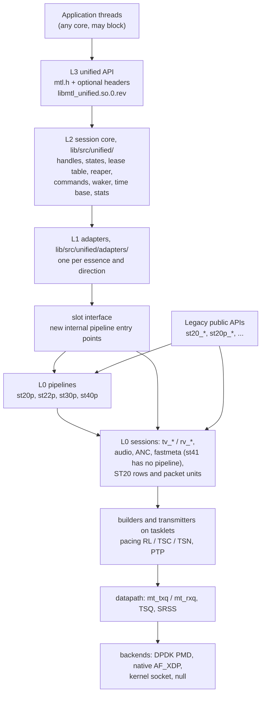
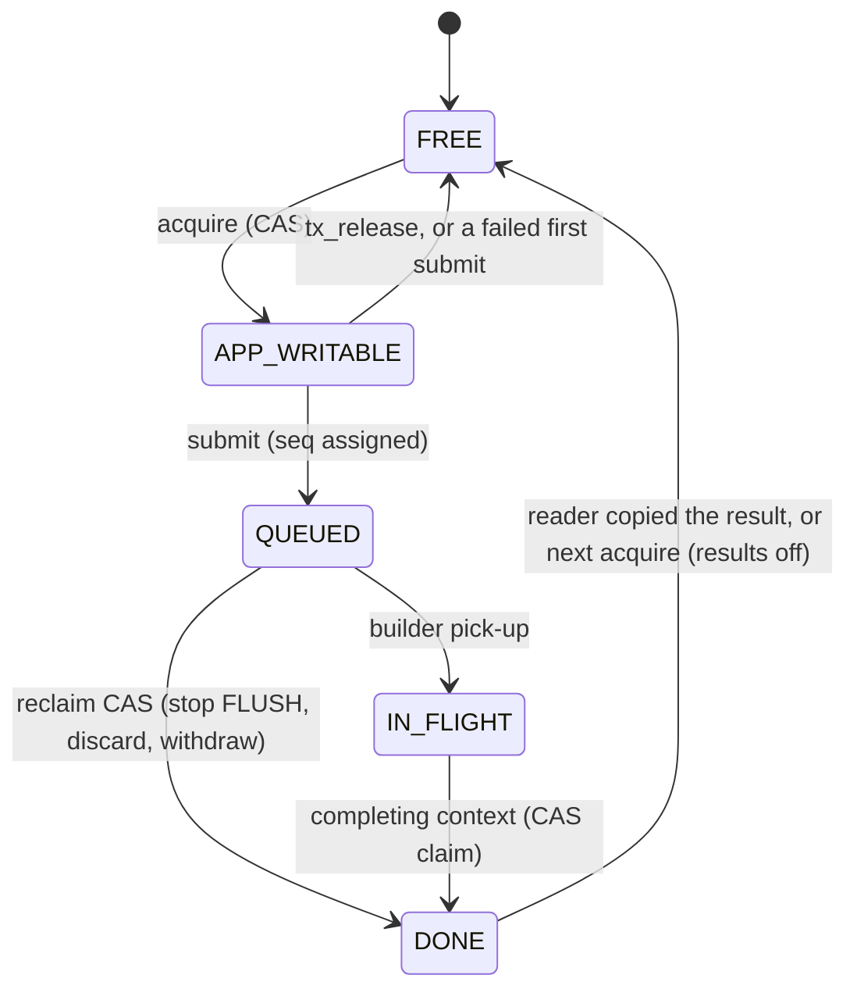
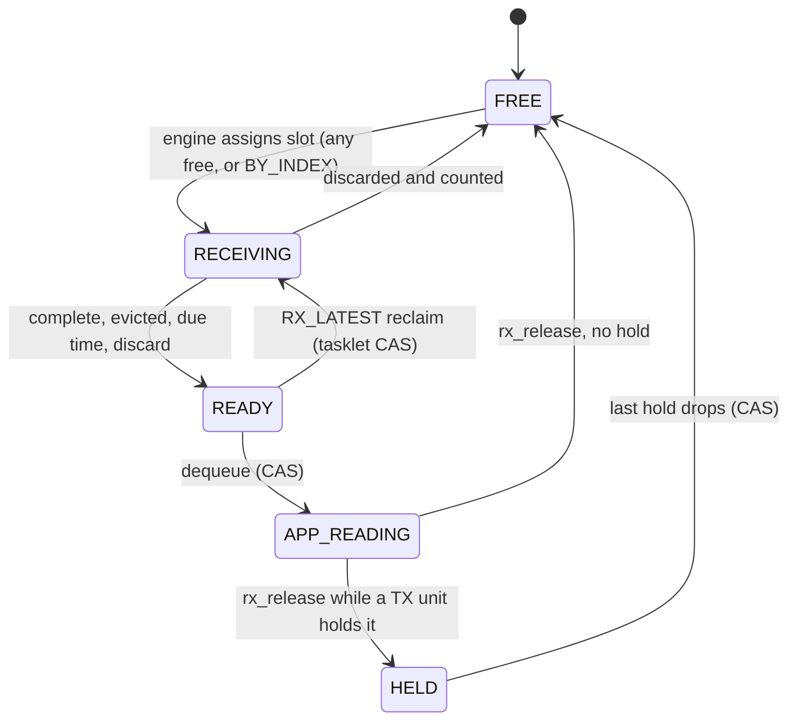

# Engine: how the unified API sits on today's engines

| | |
|---|---|
| Status | Maintained. The implementer's map of `lib/` for the unified API. Nothing here is implemented yet |
| Date | 2026-10-02 |
| Sources | [archive/02](archive/02-architecture.md), [archive/03 §2](archive/03-object-model-and-lifecycle.md), [archive/04](archive/04-threading-and-execution.md), [archive/05 §3, §11](archive/05-memory-and-buffers.md), [archive/07 §3](archive/07-completions-events-and-errors.md), [archive/08 §2](archive/08-observability.md), [archive/09 §5, §7](archive/09-media-modes-and-backends.md), [archive/06 §14](archive/06-timing-pacing-and-sync.md), [archive/14 §2](archive/14-implementation-roadmap.md), [archive/16 §11](archive/16-kubernetes-and-crash-safety.md), [archive/side-findings.md](archive/side-findings.md), [archive/research/](archive/research/) (notes 01, 03, 04, 05, 07, 13), [archive/simplification/S8](archive/simplification/S8-rtp-passthrough.md), [archive/kubernetes/K2](archive/kubernetes/K2-mtl-code-audit.md) |

This document says where each part of the unified API lives in `lib/`, which existing
function it calls or replaces, and what has to change in today's engines first. Public names
are those of the headers in `sketch/include/mtl/experimental/`, which are normative. Internal
names (the slot interface, `lib/src/unified/`) are indicative: the slot interface's exact list
is an output of spike S3.

**Citations.** Every `path:line` is at `main` @ `545a266a`, which is HEAD on 2026-10-02. Paths
without a directory are under `lib/src/`; session files are in `lib/src/st2110/`, pipeline files
in `lib/src/st2110/pipeline/`. Citations marked **[verified at HEAD]** were re-read for this
document. **[inferred]** means the effect follows from the code but was not run.

## 1. The layer picture



| Layer | What | Where | Phase |
|---|---|---|---|
| L3 | the 17 headers: `mtl.h` (32 functions) plus optional ones; 125 functions, 14 more under `MTL_LATER` | `include/mtl/experimental/` (today `doc/unified-api/sketch/include/mtl/experimental/`); DSO `libmtl_unified.so.0.<rev>`, version node `MTL_UNIFIED_EXPERIMENTAL` until the ABI freeze | 1 |
| L2 | handle table (process-wide, chunked, random generations, never freed: R4, §5.7), states, lease table, reaper, results ring, queues, waker, commands, exact timing math, time base, admission, per-writer stats | `lib/src/unified/`; math in `mt_time_math.[ch]`, shared with the Phase 0.5 `st_timeline_*` helper | 1 |
| L1 | adapters: video, cvideo, audio, anc, fastmeta × TX, RX; packet units (phase 2P) | `lib/src/unified/adapters/{video,cvideo,audio,anc,fastmeta}_{tx,rx}.c` | 1 (video), 2 |
| slot interface | held slots, submit with `seq`, once-only done hook, reclaim, RX hold/force-complete (§3) | new entry points inside each `st*p` pipeline | 1 (st20p), 2 |
| L0 | today's engines, extended with the slot interface, the hooks of §4 and the changes of §11 | `lib/src/st2110/`, `datapath/`, `dev/`, `mt_sch.c`, `mt_ptp.c` | engines track |
| backends | DPDK PMD, native AF_XDP, kernel socket; **null** (`null:<n>` ports, no NIC, completes at the scheduled instant on the instance clock, loopback RX) | `dev/`, `datapath/`; the null backend is new, location chosen in Phase 1 | 1 (null: experimental) |

Rules of the picture:

- **Legacy APIs stay on L0** and get every engine fix (§11). In Phase 6 the legacy pipeline
  functions are re-based on the slot interface as thin wrappers (`st20p_tx_get_frame` becomes
  hold plus the `st_frame` adapter; `put_frame` becomes submit). The re-base is committed; its
  go/no-go is at the Phase 2 exit, from S3 and the Phase 1–2 measurements.
- **L1 calls only slot-interface entry points.** It never writes another layer's private state.
  "Wrap the pipelines" and "extract a common core" are the same code because of this.
- **Why L2 and not a facade.** PR #1610 put a facade on the session layer and lost the
  application's timing: `frame->tv_meta = meta` overwrites what the facade wrote, so USER_PACING,
  USER_TIMESTAMP and user meta were ignored for every frame (`st_tx_video_session.c:1945`
  **[verified at HEAD]**; [archive/research/01 R7](archive/research/01-pr1610-analysis.md)).
  Exactly-once results, stale-handle safety and media-time RTP are properties of no existing
  layer, so one new component owns them.
- **Two libraries.** libmtl gets a soname, a version script with hidden default visibility and a
  private node `MTL_INTERNAL` that `libmtl_unified` links against. Today `lib/meson.build:151`
  builds `shared_library` with no `version`, `soversion` or version script **[verified at HEAD]**.
- Rejected: wrapping the session layer for every essence (PR #1610's shape), because it needs the
  same hooks in `tv_*`/`rv_*` and duplicates hardened pipeline logic (sequence FIFO, handle
  guard, `DROPPED`, ext-frame release).
- **Adapter pitfalls PR #1610 hit** (the L1 video adapter sets transport ops the same way):
  set the enabling flag together with its field (`ST20_RX_FLAG_ENABLE_VSYNC` with
  `notify_event`, `*_FLAG_FORCE_NUMA` with `socket_id`; PR #1610 set only the field, so RX VSYNC
  never fired and RX NUMA was ignored, D6, D7); never write the transport `refcnt` (D9 zeroed it
  in `get_next_frame`, which defeats the transport's own busy check); reject a second submit of
  a slot (D4 re-queued a frame in flight); never copy or convert in `notify_frame_ready` (D2: a
  4K copy on the tasklet). Details: [archive/research/01 §4](archive/research/01-pr1610-analysis.md).

## 2. The pinned-core rules

The maintainer's rule: MTL runs tasklets on pinned cores; everything called from the API runs
outside them and never blocks them. The header states it as R6: no application code ever runs on
an MTL tasklet.

### 2.1 What today's code does

| # | Today | Evidence |
|---|---|---|
| H1 | almost every user callback (`get_next_frame`, `notify_*`, `query_ext_frame`, `uframe_pg_callback`, `notify_detected`) runs on the tasklet with the session spinlock held; `get_next_frame` is polled every iteration while idle | `st_tx_video_session.c:2682`, `st_rx_video_session.c:3516` **[verified at HEAD]**; `st_video_transmitter.c:674` |
| H2 | a same-session stats getter called from a callback spins forever on the non-recursive spinlock | `st_tx_video_session.c:4760`, `st20_pipeline_tx.c:1311` (SF-13) |
| H3 | BLOCK_GET: the tasklet does `pthread_mutex_lock` + `pthread_cond_signal` on every frame event; the application holds that mutex while scanning, so the pinned core can sleep in `FUTEX_WAIT` | `st20_pipeline_tx.c:29-34` called at `:41-43` **[verified at HEAD]**; `:774-789`; same in every `st*p` (SF-15) |
| H4 | TX-hang recovery runs on the transmitter: queue re-acquire under a pthread mutex, mempool re-create, busy flush, INFO logs | `st_video_transmitter.c:681` → `st_tx_video_session.c:4231-4332` **[verified at HEAD]**; audio `st_tx_audio_session.c:2742-2753` |
| H5 | RX auto-detect allocates on the tasklet | `rv_init_sw` `st_rx_video_session.c:2564`, `rx_st20p_notify_detected` `st20_pipeline_rx.c:341-393` |
| H6 | `update_destination` holds the session spinlock across an ARP wait of up to 60 s; `update_source` across flow and IGMP work | `st_tx_video_session.c:3848-3855` **[verified at HEAD]**, `mt_arp.c:171-199`, `st_rx_video_session.c:3932-3990` (SF-14) |
| H7 | `ptp_get_time_fn`, PHC reads and the log printer (`localtime_r`) run on the hot path | `dev/mt_dev.c:1603-1608`, `mt_ptp.c:393-403`, `mt_log.h:24-39` |
| H8 | TX `notify_frame_done` fires on the transmitter, the builder, the application thread or a plugin thread; migration moves sessions between lcores | [archive/research/03 §2](archive/research/03-scheduler-threading.md) |
| H9 | the admin CPU-busy scan takes the blocking session spinlock of every video session each cycle, so tasklets skip that session; TSQ `tx_mutex` and the SRSS list lock spin inside tasklets | `mt_admin.c:29-33` **[verified at HEAD]**; `datapath/mt_shared_queue.c:642`, `datapath/mt_shared_rss.c:66-71` |
| H10 | `USE_MULTI_THREADS` RX: with the packet ring full the tasklet and the packet lcore process one session at once | `st_rx_video_session.c:2901-2907` (SP-03, **[inferred]** race) |

The scheduler itself is sound and stays as it is: one loop per scheduler that sums handler
returns and may sleep (`sch_tasklet_func`, `mt_sch.c:155-242`); register and unregister run under
a pthread mutex with an ack handshake (`mt_sch.c:873-966`).

### 2.2 Execution contexts

| Context | Pinned | May run | Must never |
|---|---|---|---|
| **TK** tasklet (lcore, or a thread-mode scheduler) | yes | packet build, pacing, RX reassembly, mempool get/put, lock-free ring ops, release stores, fences, one RMW on a line the application rarely writes | block, sleep, take a lock an application thread can hold, allocate, log, run application code, make a syscall (except §2.3 backend I/O and, if M6 accepts it, the W2 wake) |
| **WK** library workers | no | recovery rebuilds, auto-detect re-init, ARP/flow/IGMP for updates, stalled-queue stop/start, deferred-close retire, pcap writes, conversion when not in the caller | spin on tasklet-owned state |
| **WA** waker (one per instance) | housekeeping CPU | wake syscalls for armed waiters | anything else |
| **AD** admin, stat, CNI, EAL alarm threads | no | periodic work, PTP servo, time-base publication, NIC counters, link monitor | take a lock a tasklet takes |
| **APP** application threads | application's choice | every public call; DPC work (conversion, zero-fill, copies) | — |

"Never allocate" is precise: no `malloc`/`calloc`/`rte_malloc*` and no mempool, ring or heap
creation or destruction on a tasklet. Mempool get/put and ring enqueue/dequeue are allowed:
tasklets already take one mbuf per packet and one per frame at TX start
(`st_tx_video_session.c:4350`).

### 2.3 Syscalls on tasklets, per backend

| Backend | Syscalls on the tasklet | Status |
|---|---|---|
| DPDK PMD | none on the data path | promise (G-39), lcore mode with the waker; W2 adds one `write()` per wake, reported |
| kernel socket | `sendto`/`sendmsg` in `mt_tx_socket_burst` (`datapath/mt_dp_socket.c:421-445`) | reported per backend; G-39 scoped out |
| native AF_XDP | `send()` kick (`dev/mt_af_xdp.c:522-526`) | same |
| built-in PTP time reads | `rte_eth_timesync_read_time` per `mt_get_ptp_time` | replaced by the published time base (§8) |

### 2.4 How the new core keeps the rules

| Rule | Mechanism | Section |
|---|---|---|
| arrows into the tasklet world are lock-free hand-offs | commands on a per-session command word, acknowledged; the CP applies them itself on a detached session | §6 |
| arrows out of the tasklet world are wait-free stores | a completion is a release store of DONE into the lease table plus a fence; an event updates pending state; a waiter is woken by the waker, not the tasklet | §5, §7 |
| heavy per-unit work never runs on a tasklet | conversion, RX copies into application memory, zero-fill of missing data run in the caller (DPC) or on a worker. One exception, library code only: `rx.convert_per_packet` (`MTL_OPT_RX_CONVERT_PER_PACKET`) converts each packet on the RX tasklet as it lands, as `ST20P_RX_FLAG_PKT_CONVERT` does today (§4.4) | §3, §4 |
| results cannot be lost or overflow | results are materialised by the reader from the lease table; the tasklet writes no queue | §5 |
| no user code or driver read for time | one published, slewed time base per CPU socket | §8 |
| no formatting on tasklets | release builds write fixed binary records into a per-scheduler log ring, rate-limited per (code, session); a library thread formats and calls the sink | §2.8 |
| no lock shared with tasklets on read paths | per-writer counter blocks summed by the reader; gauges by scan; seqlocked groups; the admin scan reads tasklet-written busy counters | §2.8 |
| events never block their producer | per-source pending state for tasklets, small rings per producer class for library threads | §7.5 |

**Call classes in the engine.** Each public function carries one of `MTL_API_CP`, `MTL_API_DP`,
`MTL_API_DPC`, `MTL_API_WT`, `MTL_API_AS` (the contract is in [contract.md](contract.md)). For the
engine this means: DP and DPC calls never wait for a tasklet and return `-MTL_EAGAIN` instead; a
tasklet never waits for an application thread (an empty submission means idle, a full results
ring cannot happen, §5). The one syscall a DP call may make is the non-blocking `read()` that
drains a signalled wait handle (R6, §7.3). Seqlock readers (`mtl_time_now`, `mtl_time_convert`,
`mtl_stat_read`, health) are DP, not AS: a signal handler that interrupts the writer's own
thread mid-update would retry forever.

**Inline notify** (`mtl_session_set_inline_notify`, `MTL_LATER`, only if maintainer decision M5
chooses it). The function runs on the completing context without any session lock held (so it
cannot self-deadlock, H2), must be wait-free and bounded, may call only the inline-safe DP
subset, has a measured budget with counters, and is disabled with `MTL_EVENT_OVERFLOW` when it
overruns repeatedly. v1 ships without it: first measure whether W0 busy polling closes the
latency gap for slice producers, zero-hop forwarders and the MXL bridge. Details:
[archive/04 §6](archive/04-threading-and-execution.md).

**Busy-loop threads.** Every library busy loop (the scheduler loop, the RX packet lcore of
`USE_MULTI_THREADS`, the TAP lcore) sets a thread-local `mt_in_busy_loop`. From such a thread,
DP calls with timeout 0 take an inline-safe path: the reaper lock is only trylocked (contended →
`-MTL_EAGAIN`), no eventfd drain or write, no log, no allocation. WT calls with a timeout, DPC
work and CP calls return `-MTL_EDEADLK` (reason `BUSY_LOOP_THREAD`). AS calls are allowed. This
also turns H2 and the 1 s sleep of a self-unregistering tasklet (`mt_sch.c:885-901`) into clear
errors. In v1 only library threads are busy loops: user tasklets are an M12 removal candidate and
would come back only through a later advanced header (R6).

**Debug enforcement.** Every entry point sets a thread-local "current class". `mt_rte_zmalloc*`,
`mt_pthread_mutex_lock`, `mt_sleep_ms`, `info()` and `warn()` assert that the class is not DP,
DPC or AS and that the thread is not a busy loop. A WT call with timeout 0 runs as DP. A
signal-safety test raises a signal inside every CP call with `malloc` and `pthread_mutex_lock`
interposers armed, and calls every AS function from the handler.

### 2.5 Thread mode and sleep

- `MTL_INSTANCE_TASKLET_THREAD`: today `sch_start` creates a plain pthread
  (`mt_sch.c:285-287`, `sch_tasklet_thread` at `:252-257`) that is never registered with EAL;
  `rte_thread_register` appears nowhere in `lib/src` **[verified at HEAD]** (SF-49). Such a
  thread has `LCORE_ID_ANY` and no mempool cache. The new core calls `rte_thread_register` at
  scheduler start and pins each scheduler thread to one CPU. W2 is the default wake in this mode.
- **Threads that are not schedulers** run on `instance.main_lcore` (`MTL_OPT_MAIN_LCORE`, D-92).
  Today every one inherits the affinity of the thread that called `mtl_init`; each is pinned at
  its creation site: admin (`mt_admin.c:384`), stat (`mt_stat.c:156`), CNI (`mt_cni.c:415`),
  kernel-socket TX and RX (`datapath/mt_dp_socket.c:288`, `:627`) and TSC calibration
  (`mt_main.c:200`) **[verified at HEAD]**; the waker and the workers are new and are created
  pinned (part of EK7).
- `MTL_INSTANCE_TASKLET_SLEEP`: the idle path already enters the kernel
  (`rte_eal_alarm_set` + `cond_timedwait` with a 1 s safety net, `mt_sch.c:86-96`
  **[verified at HEAD]**). It performs its own pending wakes before it sleeps (§7.2), and posting
  a command calls `sch_sleep_wakeup` (`mt_sch.c:52-56` **[verified at HEAD]**) from the CP
  thread.

### 2.6 Mempools and application threads

| Case | Rule |
|---|---|
| frame pools (all essences) | keep today's atomic release: RX release is an atomic decrement (`rv_put_frame`, `st_rx_video_session.c:222-232` **[verified at HEAD]**), not a mempool operation |
| application threads and MP/MC mempools | an application thread never gets from or puts to a mempool a tasklet also uses: a preempted thread mid-dequeue makes the tasklet spin in the ring tail update (`mt_util.c:516-545`, default `ring_mp_mc`, **[inferred]** from DPDK). `st20_tx_get_mbuf` (`st_tx_video_session.c:4628`) is such a path and stays legacy-only |
| packet units (`MTL_UNIT_PACKETS`) | a tasklet-refilled allocation ring per consumer plus a return ring the tasklet drains |
| non-EAL threads | have no mempool cache; one more reason for the rules above |

Other hazards on the way: the handle guard's `lc_refcnt` RMW shares a cache line with
tasklet-read fields (`st20_pipeline_tx.h:35-42`), so the new in-flight counter sits on its own
line; lease tables live on the scheduler's NUMA node and `mtl_session_info.sched_index` names the
scheduler. An application thread that polls from the other socket pays cross-socket latency on
every call, so polling threads should run on the scheduler's node: the `sched.lcore` and
`info.numa` stats keys give it.

### 2.7 Backends and what they grant

The capability keys (`caps.backend`, `caps.pacing_classes`, `caps.tx_multi_seg`,
`caps.hw_rx_timestamp`, …), `tx.path`, the per-backend scope of G-39 and the expected pacing class
per test come from this table. Driver table: `dev/mt_dev.c:14-107` **[verified at HEAD]**.

| Backend (`enum mtl_backend`) | Pacing classes | Path and steering | Notes |
|---|---|---|---|
| `MTL_BACKEND_DPDK_PMD` (E810/E830 PF or VF) | `HW_RATE` (TM shaper: ice PF, iavf VF), `HW_LAUNCH` (E830 PF, built-in PTP), `SW`, `SW_NARROW`, `BEST_EFFORT` | zero copy when the NIC has multi-segment TX; flow director, else shared RSS (ixgbe: `MT_FLOW_NONE`) | CNI inside MTL; the only backend with TX hang recovery; no secondary processes (`--in-memory`, `dev/mt_dev.c:344`) |
| `MTL_BACKEND_AF_XDP` (native) | `HW_RATE` through sysfs `tx_maxrate` on ice (`dev/mt_af_xdp.c:96`), else `SW` | always copies into UMEM; XDP program and per-queue XSK from MtlManager, or from a node daemon's XSK map (EK19) | — |
| `MTL_BACKEND_KERNEL_SOCKET` | `SW` only | single segment; a socket per flow, no flow steering | still needs hugepages; the destination is fixed at queue creation, so an update swaps the queue (§6) |
| `MTL_BACKEND_NULL` | none | no NIC; units complete at their launch instant on the instance clock; loopback RX | new, experimental (§1) |
| Windows | DPDK PMD only | — | no MtlManager, AF_XDP or kernel socket |

The TX header today is IPv4 only, TTL 64, TOS 0, DF set (`st_tx_video_session.c:944-947`
**[verified at HEAD]**): that is where `flows[].dscp` and `flows[].ttl` must reach.

Constraints the capability model must make visible, all silent today:

- a shared TX queue forces software pacing for the whole port (§4.9);
- ST 2110-22 downgrades a rate-limited port to software pacing for its sessions (§4.9);
- `mtl_dma_map` needs IOVA-VA mode;
- HW RX timestamps need the PMD's RX timestamp offload (`dev/mt_dev.c:2422-2440`), with the iavf
  descriptor-count workaround of `99b96c16` (`dev/mt_dev.c:1018-1027`); `include/mtl_api.h:371`
  still says "PF on E810" (to confirm);
- legacy `ALLOW_DOWN_PORTS` prunes a 2022-7 session to one leg at create (`tv_ops_prune_down_ports`
  `st_tx_video_session.c:4006`, audio `st_tx_audio_session.c:2599`, RX `rv_ops_prune_down_ports`
  `st_rx_video_session.c:4199`).

Details: [archive/09 §5](archive/09-media-modes-and-backends.md),
[archive/research/07 §5](archive/research/07-modes-matrix.md).

### 2.8 Stats, traces and logs

| Part | Construction |
|---|---|
| counters | one block per writer context (tasklet, application or pipeline thread, completing context, admin), each on its own cache line, relaxed stores, summed by the reader; the library never resets them (deltas are taken by the reader) |
| gauges | not sums of writer blocks, which are no consistent cut: the reader scans the slot state words once, which also gives `queue.queued_media_ns`; per-writer `entries{state}` and `exits{state}` counters make G-43 an identity |
| seqlocks | only for grouped values of one writer: histogram buckets, window buckets, the PTP offset and path-delay pair |
| windowed maxima (`{window=1s\|60s}`) | a ring of 60 one-second buckets written by the value's single writer; the reader takes the current bucket or the maximum of the valid ones |
| port counters | polled by a library thread and cached (`MTL_STAT_CACHED`, `port.sampled_tai_ns`): `rte_eth_stats_get` on a VF can be a PF mailbox round trip |
| USDT probes | keep today's providers; add probes for admission decisions (unit, margin, policy), late and drop, recovery begin and end, time state, link, back-pressure, migration, command posted and acked, each with the session handle ID, unit `seq`, media index and RTP |
| logs | tasklets write fixed binary records (code and arguments) into a lock-free per-scheduler ring, rate-limited per (code, session); a library thread formats them, prefixes the session name and calls the sink. Today tasklets log at every level (`st20_pipeline_tx.c:197`, `st_tx_video_session.c:129`, `st_video_transmitter.c:38`, `st_rx_video_session.c:941`) |

This is L0 work in `tv_*`/`rv_*` and in every pipeline: L2's own counters follow it from Phase 1,
the engine counters are converted in Phase 2. Details:
[archive/08 §2, §5, §6](archive/08-observability.md).

## 3. The slot interface

The hooks L2 needs are one internal interface: new entry points in each pipeline that L1 calls.
TX is shown for st20p; st22p, st30p and st40p get twins.

| Entry point (indicative) | Replaces | Contract |
|---|---|---|
| `st20p_tx_hold_slot(ctx, &idx)` / `st20p_tx_release_slot(ctx, idx)` | `st20p_tx_get_frame`; L2 writing slot state | a finished slot stays HELD until L2 releases it |
| `st20p_tx_submit_slot(ctx, idx, const struct st20p_slot_submit*)` | `put_frame` / `put_ext_frame` + `frame->tv_meta = meta` | media time, launch, cookie and `seq` travel in the call; `seq` is assigned here, so transmit order is submit order |
| `st20p_tx_set_done_hook(ctx, hook, arg)` | `notify_frame_done` + `frame_done_cb_called` | once only, at transport done, with status and meta, for every path (converting, copy, chain) |
| `st20p_tx_reclaim_queued(ctx, mask)` | `put_frame_abort` (IN_USER only, `st20_pipeline_tx.c:902-927`) | CAS CONVERTED/READY → FLUSHED for stop, discard and `mtl_tx_withdraw` |
| rejected-at-pick-up callback | nothing (the slot stays IN_TRANSMITTING, SF-38) | the builder reports a claimed unit it did not build (`DROPPED/REJECTED_AT_PICKUP`) |
| `st20p_tx_set_linesize(ctx, …)` (MF9) | linesize fixed at create | set the transport linesize after create, before start |
| RX `st20p_rx_hold_ready` / `st20p_rx_release_slot` | `st20p_rx_get_frame` / `put_frame` | lend a READY slot; release with the hold count (MF10) |
| RX `st20p_rx_force_complete(ctx, deadline)` | nothing (no RX deadline today) | complete the unit being received at its due time, on DRAIN and on discard |
| RX `st20p_rx_set_ext_frames(ctx, …)` (MF9) | `ext_frames[]` fixed at create | hand an attached pool to the engine at attach |

UB tests target this interface, not file-local statics, so they survive internal refactors.

### 3.1 Per essence

| Essence × dir | v1 adapter wraps | Further L0 work |
|---|---|---|
| video TX | `st20p_tx` | "last packet handed" hook for no-chain; rejected-at-pick-up; idle descriptor cleanup; media time and launch carried separately into `tv_*` (E1) |
| video TX rows (`MTL_UNIT_ROWS`) | the **st20 session layer** (st20p has no line mode); the only adapter that bypasses a pipeline | slice mode `query_frame_lines_ready` (`st_tx_video_session.c:2021`) driven by resubmits with a larger `used`; Phase 6 |
| video RX | `st20p_rx` | stop silent recycle of ext frames (MF4); deadline force-complete; per-leg arrival times; `MTL_SESSION_RX_BY_INDEX` lookup; DMA-busy drop counted (SF-46) |
| cvideo TX/RX | `st22p` | per-unit status; stats; `rate_mode` CBR / VBR_MAX (E10); ST22 TX state change as a CAS (SF-42) |
| audio TX/RX | `st30p` | "last packet handed" (done fires at build today, `st_tx_audio_session.c:923-930`); media time from the sample index; carry buffer (E6) |
| anc TX/RX | `st40p` | ANC RTP from media time (E7); keep-alive on underrun |
| fastmeta TX/RX | `st41` session (no pipeline) | the adapter owns a small frame pool; frame-level RX (RTP-only today); keep-alive |
| packet units, every essence (phase 2P) | the session layer's RTP mode | today the TX `packet_ring` is SP/SC (`st_tx_video_session.c:3011`, enqueue `:4705`) and the RX `rtps_ring` too (`st_rx_video_session.c:532`, `:4761`); user pacing is ignored on RTP level (`tv_sync_pacing(impl, s, 0, …)` at `:1410`, `:1484`) |

### 3.2 Slot states

The L2 lease table is the state of record. Today's pipeline states map onto it:

| Lease table (L2) | st20p TX today (`st20_pipeline_tx.h:11-20`) | Who moves it |
|---|---|---|
| FREE | FREE | — |
| APP_WRITABLE | IN_USER | `mtl_tx_acquire` / `mtl_tx_acquire_slot` (CAS, MP-safe) |
| QUEUED | READY (converting) or CONVERTED | `mtl_tx_submit` |
| IN_FLIGHT | IN_CONVERTING, IN_TRANSMITTING | builder pick-up (admission decision here) |
| DONE | **new HELD**: finished, not yet FREE | the completing context (§5.2) |
| — | DROPPED | becomes DONE with `MTL_TX_DROPPED` |





The lease generation increments on every transition out of FREE and is written by the acquirer,
so a tasklet never writes it. RX holds come from `unit.hold` at a TX submit (and
`mtl_tx_send_slot`): +1 at that submit, −1 at that TX unit's terminal outcome. `mtl_tx_pin` keeps
a TX slot out of acquire after submit.

## 4. ST20 first: where to start in `lib/`

### 4.1 st20p TX, `st20_pipeline_tx.c`

| Function | Today | Change |
|---|---|---|
| `tx_st20p_frame_done` `:247-297` | stores FREE (`:270`) **before** `notify_frame_done` (`:286`) **[verified at HEAD]**, so `get_frame` can hand the slot out before its result exists | new HELD state; call the done hook once with status and meta; keep legacy `notify_frame_done` exactly once (R2) |
| `tx_st20p_convert_put_frame` `:347-391`; internal convert in `st20p_tx_put_ext_frame` `:992-1000` | converting paths fire `notify_frame_done` at conversion, never at transport done (`:380-385`, `:995-999`) | the done hook fires at transport done on every path; the early storage release is a later opt-in |
| `st20p_tx_get_frame` `:757-822` | numbers frames at `get_frame` (`:808` **[verified at HEAD]**); BLOCK_GET waits under `block_wake_mutex` (`:774-789`) | `hold_slot`; L2 does its own waiting; numbering moves to submit |
| `tx_st20p_newest_available` `:62-77` | returns the **oldest** CONVERTED by `seq_number` **[verified at HEAD]** (the intended FIFO, misnamed, SF-44): acquire A, B, submit B, A sends A, B | rename; order by the submit `seq` (G-08) |
| `tx_st20p_next_frame` `:181-245` | the transport's `get_next_frame`; copies the frame's time into the meta only with USER_PACING or USER_TIMESTAMP (`:231-234`) | carries media time and launch separately into `tv_*` (E1) |
| `st20p_tx_put_frame` `:825`, `st20p_tx_put_ext_frame` `:929` | state store, optional inline conversion in the caller | `submit_slot`; conversion stays in the caller when granted (DPC) |
| `st20p_tx_put_frame_abort` `:902-927` | IN_USER only | `reclaim_queued` CAS CONVERTED/READY → FLUSHED |
| `tx_st20p_if_frame_late` `:115-179` | DROP_WHEN_LATE needs USER_PACING; one-frame grace | admission at pick-up reports `MTL_TX_DROPPED`/`MTL_TX_LATE` with `margin_ns` (E3) |
| `tx_st20p_block_wake` `:29-34` | mutex + cond on the tasklet (H3) | not used by L2; replaced on the legacy API by the armed bit and a non-blocking wake (SF-15, Phase 0.5, salvaging PR #1610's `mt_session_event.c`) |
| `tx_st20p_framebuffs_flush` `:722-753` | sleeps up to ~1 s per held frame at free (H-K-15) | not on the close path; close uses §9 |
| `st20p_tx_get_session_stats` `:1300` | blocking spinlock (`:1311`, H2) | per-writer counters |

### 4.2 st20 TX session builder, `st_tx_video_session.c`

| Function | Today | Change |
|---|---|---|
| `tvs_tasklet_handler` `:2673-2711` | `try_get` of the session spinlock (`:2682`); `pending` overwritten per session (`:2693-2698`) **[verified at HEAD]** (SF-08) | load the command word once per visit and apply immediate commands (§6); sum `pending` |
| `tv_tasklet_frame` `:1863-2146` | calls `get_next_frame` every iteration while idle (`:1922`); claims a frame and returns without building it on `refcnt != 0` or oversize user meta (`:1936-1953`) **[verified at HEAD]** | pick-up through the pipeline; rejected-at-pick-up callback (SF-38) |
| `calc_frame_count_since_epoch` `:637-690` | "late" measured at the epoch boundary; a frame picked after its start goes out at once, counted nowhere | admission at pick-up: on time, late policy, `slots_skipped_before`, bounded SEND_LATE (E3) |
| `tv_sync_pacing` `:692-748` | reads PTP once per frame (`:695`), paces on TSC | media time and launch separate (E1); exact math (E2); published time base (E9) |
| `tv_update_rtp_time_stamp` `:762` | default video RTP is the scheduled time of packet 0, not the media time | RTP from media time only (E1; legacy opt-in) |
| `tv_pacing_required_tai` `:1774-1807` | EXACT silently falls back to default pacing (`:1796-1805`) | `MTL_SUBMIT_EXACT` result reports what happened |
| no-chain done `:2130-2134` | `tv_frame_free_cb` called right after build **[verified at HEAD]**: "done" before anything is sent; same for ST22 `:2655-2659` | "last packet handed to the NIC" hook in the transmitter |
| `tv_frame_free_cb` `:116-143` | checks `refcnt == 1`, calls `tv_notify_frame_done` (`:134`), then decrements (`:135`) and clears ext `addr/iova` (`:137-139`) **[verified at HEAD]** (SF-05) | claim with a CAS, release the slot, then complete (MF1) |
| `st20_tx_queue_fatal_error` `:4231-4332` | recovery on the transmitter; reports in-flight frames COMPLETE; zeroes `sh_info` (`:4290-4301`) **[verified at HEAD]** | recovery on a worker; `DROPPED/RECOVERY`; never touch `sh_info` (R1) |
| `tv_uinit_hw` `:2712-2740` | pad bursts through `mt_txq_flush` run `tv_frame_free_cb` on the destroying application thread (`:2722-2728`) | replaced by the bounded cleanup and queue reset of §9 |
| `tv_mgr_detach` `:3798-3816` | detach is the session spinlock, not a handshake **[verified at HEAD]** | stays as the ack-timeout fallback (§6) |
| `tv_init_hdr` `:903-931` | resolves the destination MAC at create (`:927`): `arp_get_result` sleeps in 500 ms steps up to the ARP timeout, 60 s by default (`mt_arp.c:171-199`) **[verified at HEAD]**; hence GStreamer's `async-session-create` | a worker resolves; the leg is `MTL_FLOW_WAITING_NEIGHBOUR` meanwhile (D-62, G-90); flow rules validated at create, installed at the first start |
| `tv_mgr_update_dst` `:3843-3862` | holds the spinlock across `tv_update_dst` and its ARP wait **[verified at HEAD]** | boundary command with double-buffered header templates; the builders copy the template into every packet (`:1062`, `:1107`, `:1213`) |
| `tv_pkts_capable_chain` `:2873-2895`; no-chain decision `:3413-3421` | silent copy mode when `total_pkts × (frames_cnt − 1) < nb_tx_desc` (`:2887`, a warn log); `nb_tx_desc` = 512 (`MT_DEV_TX_DESC`, `dev/mt_dev.c:1009`) **[verified at HEAD]** | report `MTL_TXR_COPIED`, `mtl_session_info.direct`; `MTL_SESSION_REQUIRE_DIRECT` fails create; `min_count_direct` in `mtl_buffer_requirements` |
| frame arrays `:4073`; linesize `:3333-3339`, copy-chain mempool `:2981-2995` | `ST20_FB_MAX_COUNT` = 8; linesize fixed at create | E11; MF9 |
| `st20_tx_get_session_stats` `:4760` | blocking spinlock (H2) | per-writer counters |

### 4.3 Transmitter, `st_video_transmitter.c`

| Function | Today | Change |
|---|---|---|
| `video_trs_tasklet_handler` `:665` | calls `st20_tx_queue_fatal_error` on the tasklet when `tx_queue_recovery_pending` (`:676-682` **[verified at HEAD]**) | raise a flag; the worker recovers (R1) |
| `video_trs_rl_target_reached` `:180-199` | accepts a target up to `NS_PER_S` ahead and returns to the scheduler while it waits (`:188-191`) | an immediate command is applied on that return, so stop does not wait up to 1 s |
| `video_trs_burst` `:66`; RL, TSC, launch-time tasklets `:354`, `:373`, `:480` | chain: done only when a later burst recycles descriptors (about `nb_tx_desc` packets later), never while idle | with frames in flight and the build ring empty, call `mt_txq_done_cleanup` (`datapath/mt_queue.c:216`), rate-limited, dedicated queues only; "last packet handed" hook; enqueue times (E4) |
| TSN | a launch time in the past is not checked (`:531-538`) | admission rejects it (E3) |
| RL queue rate set, `dev/mt_dev.c:759-763` (also `:693`) | each rate set commits the port's whole TM hierarchy under `inf->resetting` **[verified at HEAD]**; an external user reports that this disturbs other live sessions on the port (#1620) **[inferred]** | measure in S0: a create must not disturb its siblings; twins run next to their legacy originals on one VF |

### 4.4 st20p RX, `st20_pipeline_rx.c`

| Function | Today | Change |
|---|---|---|
| `rx_st20p_frame_ready` `:169-296` | the transport's `notify_frame_ready`, on the tasklet; may convert per frame there | mark READY in the lease table through the hook; conversion in the caller's `mtl_rx_dequeue` (DPC) |
| `st20p_rx_get_frame` `:841-935`, `st20p_rx_put_frame` `:937` | CAS claims; internal converter in the caller | `hold_ready` / `release_slot` with the hold count (MF10) |
| `rx_st20p_create_transport` `:490-630` | derive and `query_ext_frame` require `ST20_RX_FLAG_RECEIVE_INCOMPLETE_FRAME` (`:589-594`) | L2 sets the flag on every transport and applies `MTL_OPT_RX_INCOMPLETE` (DELIVER or DISCARD) itself |
| `rx_st20p_query_ext_frame` `:298-329` | user callback on the tasklet | replaced by attached pools and `MTL_SESSION_RX_BY_INDEX`; per-unit provide is `MTL_LATER` (`mtl_rx_provide`) |
| `rx_st20p_notify_detected` `:341-393` | logs and allocates on the tasklet (H5) | auto-detect re-init on a worker |
| `ST20P_RX_FLAG_PKT_CONVERT` `:523-536` | installs `uframe_pg_callback = rx_st20p_packet_convert` with `uframe_size`: library code per packet on the tasklet, 4:2:2 10-bit to four formats; it disables DMA (`st_rx_video_session.c:2572-2573`) **[verified at HEAD]** | the internal path of `rx.convert_per_packet`; removing the public `uframe_pg_callback` (M12) keeps it |
| `rx_st20p_block_wake` `:29-35` | mutex + cond on the tasklet (H3) | as TX |

### 4.5 RX slot reassembly, `st_rx_video_session.c`

| Function | Today | Change |
|---|---|---|
| `rvs_pkt_rx_tasklet_handler` `:3506-3535` | visits every session each iteration with `try_get` (`:3516` **[verified at HEAD]**) | command check and due-time check per visit, with or without packets |
| `rv_slot_by_tmstamp` `:1161-1305` | a newer timestamp evicts the older slot (`:1214-1221`); with DMA in flight the new frame's packets are dropped (`:1202-1208` **[verified at HEAD]**, SF-46); `query_ext_frame` at `:1273-1290` | count the DMA-busy drop as `rx.pkts_rejected{cause=dma_busy}` and in the unit's packet counts; record the first arrival per leg (due time) |
| `rv_get_frame` `:205-220` | scans for a free frame | `MTL_SESSION_RX_BY_INDEX`: slot = `media_index mod pool_count`, a lookup; a leased or held target slot drops the unit and counts it in the next unit's `missed_before` |
| `rv_put_frame` `:222-232` | atomic decrement **[verified at HEAD]** | HELD state and the last-reference CAS to FREE (MF10) |
| `rv_handle_frame_pkt` `:1567-1864`; `rv_slot_full_frame` `:1335-1342` (called at `:1858`) | a frame completes only when full (`:1850-1858` **[verified at HEAD]**) or evicted | RX deadline: force-complete at the due time (E8) |
| `rv_frame_notify` `:846-985` | a refused `notify_frame_ready` puts a counted frame back (`:938-944` **[verified at HEAD]**, SF-45); without the incomplete flag an incomplete frame is recycled silently (`:976-982` **[verified at HEAD]**, SF-18) | the L2 hook never fails: the unit becomes READY or is counted as rejected; every attached buffer stays in the pool and the loss is counted (M4) |
| `rv_dma_dequeue` `:1507-1528` | completes frames on the RX tasklet | a completing context with the scheduler wake word |
| `rv_pkt_lcore_func` `:2470-2482` | packet lcore fires callbacks; races the tasklet (`:2901-2907`, SP-03) | its own wake word, scanned by the waker; the race is fixed or the mode stays legacy-only |
| packet lcore choice `:2642-2668` | above 40 Gb/s without DMA, or with `USE_MULTI_THREADS`, a second lcore runs `rv_handle_frame_pkt` (not with header split); slices and `num_port > 1` are then `-EINVAL` **[verified at HEAD]**: UHD 2022-7 RX above 40 Gb/s without DMA fails create | `rx.threads` = 2 needs one leg and frame units, else `-MTL_ENOTSUP`; auto stays 1 for them (use `MTL_OPT_DMA`) |
| `rv_handle_detect_pkt` `:2728`, `rv_init_sw` `:2564` | auto-detect re-init allocates on the tasklet (H5) | worker |
| `rv_update_src` `:3932-3990` | holds the spinlock across flow and IGMP work (SF-14) | boundary command: add the new flow rule to the same queue before removing the old one; IGMP on a worker |
| recycled frames | not re-zeroed: lost packets show the previous frame | library pools zero-fill missing ranges in `mtl_rx_dequeue` (DPC) unless `MTL_SESSION_RX_NO_FILL`; needs the packet bitmap of the next row |
| packet bitmap `slot->frame_bitmap` | per reassembly slot (`ST_VIDEO_RX_REC_NUM_OFO` = 2, `st_header.h:39`, `:625`), cleared when the slot takes a new timestamp (`:1298-1299`); the frame is delivered with counts only (the miss loop is `#if 0`, `:966-972`) **[verified at HEAD]** | **Open** (below the table): no missing-range source survives slot reuse |
| validation `:439-450`, DMA gate `:2572-2575`, arrays `:4266` | `buf_len` unchecked; DMA offload not rejected for GPU frames (iova 0) | MF6, MF5, E11 |

**Open: RX missing ranges.** The header promises zero-filled gaps in library pools and declares
`mtl_rx_get_missing()` (with `mtl_rx_detail.missing_ranges`), but today no per-unit packet bitmap
survives slot reuse, so neither can be built over st20p as it is. Either L2 copies the slot bitmap
into the lease table at the RX hook (about 540 B at 1080p), or the whole frame is zero-filled
before reuse; milestone M2 decides. A stop-gap until then is `-MTL_ENOTSUP` from
`mtl_rx_get_missing()`.

### 4.6 Scheduler, admin, device, time

| File | Today | Change |
|---|---|---|
| `mt_sch.c` `sch_tasklet_func` `:155-242` | sums handler returns; no heartbeat | set `mt_in_busy_loop`; per-scheduler `loop_seq` and `last_loop`, also advanced on wake-ups (EK11) |
| `mt_sch.c` unregister `:873-923` | polls 1 ms × 1000, returns `-EIO` with the tasklet still registered (`:884-901` **[verified at HEAD]**); callers free anyway (SF-56) | on timeout, never free; quarantine; health `DEVICE_FAULT` (EK2) |
| `mt_sch.c` `sch_stop` `:316-321` | waits forever for `stopped` | bounded (EK1) |
| `mt_sch.c` lcore table `:505-620`, `:685-699` | SysV shm, `flock(/tmp/kahawai_lcore.lock)`, `kill(pid, 0)` | affinity only, or OFD locks keyed by CPU (EK6) |
| `mt_admin.c` `:29-33`, migration `:101-141` | blocking spinlock scan (H9); migration rewrites `s->sch` under both manager mutexes | tasklet-written busy counters; the lease table and completion protocol do not depend on the lcore, so migration needs only the command handshake |
| `dev/mt_dev.c` time function `:1597-1614` | default `CLOCK_REALTIME`; a user callback or PHC read per pacing computation | published time base (E9, §8) |
| `dev/mt_dev.c` `:1760-1799`, `:1840-1869` | pad flush with a 1 ms busy retry per pad; a fatal queue is only marked **[verified at HEAD]** | stalled-queue path (§9) |
| `mt_ptp.c` | `locked`/`connected` never cleared (`:540-552`, SF-20); UTC → PHC switch mid-run (`:1062-1067`, SF-21); phc2sys steers the node clock (`:163-240`, SF-58) | E9, EK10 |

### 4.7 Order of work for ST20

1. **Phase 0 side fixes** that the new core relies on: SF-05/MF1, SF-08, SF-12/SF-41 (R1), SF-38,
   SF-39, SF-14, SF-45, SP-01 (to confirm), SF-56 (EK2), SF-69 with PE6 (the RX counters M3a maps). Most of SF-05, SF-08, SF-16 and SF-36
   are in open PR #1770.
2. **Spikes** S0 (baseline), S3 (slot interface over st20p), S6 (idle cleanup), S7 (time base),
   S8 (queue stop/start) before the code they gate (§11.1).
3. **Engines track**: E2 → E4, E8, E9 → E1, E3 (needed for ST20 results at Phase 1 exit); EK1,
   EK2, EK6, EK7 first among the pod fixes.
4. **Slot interface in st20p TX and RX** (§3), with UB tests against the real pipeline code.
5. **L2**: handles, states, command channel, lease table and reaper, waker; the null backend and
   test clock as the U-tier substrate.
6. **ST20 adapter** over st20p with library pools and AUTO media mode; results ON_TIME, DROPPED,
   FLUSHED; then attached pools (MF2, MF3, MF9), then rows (session layer) and packet units.

### 4.8 Placement and quota today

`MTL_QUERY_CHECK_CAPACITY` runs this placement without reserving (G-89); `CAPACITY_SCHED_QUOTA`,
`sched.quota_used_1080p_x100`, `mtl_session_info.sched_index` and the ported migration (Q-THR-6)
all sit on it. **[verified at HEAD]** unless marked.

| Rule | Today | Evidence |
|---|---|---|
| quota per scheduler | `ST_QUOTA_TX1080P_PER_SCH` (12) × the bandwidth of one 1080p59 4:2:2 10-bit stream, unless the user sets `data_quota_mbs_per_sch`; per-type limits: RTP TX 8, RX 12, RX without DMA 8 | `dev/mt_dev.c:1938-1944`, `st_header.h:23-31` |
| placement | `mt_sch_get_by_socket` takes the first active, not busy scheduler of the type on the NIC's socket with free quota, else requests a new one, started at once if the instance is started | `mt_sch.c:1139-1199` (start `:1185-1193`) |
| types | DEFAULT, RX_VIDEO_ONLY, APP (created by the user), SYSTEM | `mt_main.h:483-490` |
| quota 0 | ANC, fastmeta and `main_sch` ask for no quota and fit any scheduler, so CNI and PTP share a video scheduler unless `MTL_OPT_SYS_LCORE` = `MTL_SYS_DEDICATED` | `mt_sch.c:430-433`; `dev/mt_dev.c:1951-1954` |
| one manager per scheduler | one manager per essence and direction; a video TX session's builder and transmitter run on one scheduler, which is why the SP/SC `packet_ring` is safe | [archive/research/03 §4](archive/research/03-scheduler-threading.md) |
| sleep | with `TASKLET_SLEEP` a scheduler sleeps for the smallest `advice_sleep_us` of its tasklets (video: `trs × 128`); below 200 µs it calls `nanosleep(0)` instead | `mt_sch.c:70-96`, `st_tx_video_session.c:3481-3482`, `mt_main.c:489` |
| busy | a scheduler is busy when it may not sleep or its sleep-ratio score exceeds 70 | `mt_sch.h:40-45` |
| migration | the admin thread runs every 6 s and moves at most one session per period; locks: target manager mutex, source manager mutex, then the session | `mt_admin.c:379`, `:341`, `:101-139` |

### 4.9 Pacing ways today and every downgrade

Today the pacing way is chosen per port at `mtl_init` and copied into each session at create
(`st_tx_video_session.c:3427-3435`); a session cannot ask for one. Unified names:
RL = `MTL_PACING_HW_RATE`, TSN = `MTL_PACING_HW_LAUNCH`, TSC = `MTL_PACING_SW` (bulk 4),
TSC_NARROW = `MTL_PACING_SW_NARROW` (bulk 1), PTP = `MTL_PACING_PTP`, BE = `MTL_PACING_BEST_EFFORT`
(only packet 0 of a frame is timed). Every downgrade below raises `MTL_STATUS_PACING_DOWNGRADED`
and `MTL_EVENT_PACING_CHANGED` in the unified core, and fails create with `PACING_UNAVAILABLE`
when `MTL_OPT_PACING_REQUIRED` is set. **[verified at HEAD]**

| Site | Today | Log |
|---|---|---|
| AUTO at init | RL if the driver's `rl_type` is `MT_RL_TYPE_TM`, else TSC (`dev/mt_dev.c:1467-1478`) | info |
| AUTO, RL init fails | TSC (`dev/mt_dev.c:1495-1499`, `:1511-1517`) | warn |
| explicit RL on a port without TM | `-EINVAL` at init (`dev/mt_dev.c:1480-1483`) | err |
| shared TX queue | TSC for the whole port, even over an explicit RL or TSN (`dev/mt_dev.c:1461-1465`) | info only |
| TSN | needs the launch-time offload and the built-in PTP disciplining the PHC; `-EINVAL` at init otherwise (`dev/mt_dev.c:1519-1533`) | err |
| per-session RL training fails | that leg goes TSC (`st_tx_video_session.c:535-543`) | none |
| the two legs differ | both legs TSC (`st_tx_video_session.c:545-552`) | warn |
| ST 2110-22 | TSC (`st_tx_video_session.c:3431-3434`) | none |
| a queue rate set fails at runtime | the whole port flips to TSC while running sessions keep "RL" (`dev/mt_dev.c:1649-1654`) | err |
| audio (per session) | TSC unless RL is possible: AUTO tries RL only for packet times below 0.5 ms, an explicit RL only below 2 ms, and only when every port of the session paces with RL (`st_tx_audio_session.c:2079-2100`) | info, or none |

Details: [archive/research/05 §1](archive/research/05-timing-pacing.md); the timing rules are in
[timing.md](timing.md).

### 4.10 Instance lifecycle today

`mtl_instance_open` and `mtl_instance_close` are built over these facts **[verified at HEAD]**:

- Ports start inside `mtl_init` (`mt_dev_create`, `dev/mt_dev.c:1979-2001`); `mtl_start` and
  `mtl_stop` only start and stop the schedulers (`mt_dev_start` → `mt_sch_start_all`,
  `:2113-2129`). Sessions may be created before start; a scheduler created later starts on
  demand (`mt_sch.c:1185-1193`).
- `static bool eal_initted` rejects a second EAL init with `-EIO` (`dev/mt_dev.c:324`, `:499-502`),
  and `mtl_uninit` ends in `rte_eal_cleanup()` (`:2172`). So the new core keeps EAL alive across
  the last close and never runs that cleanup before process exit; this is what makes re-open
  after close (contract.md) and the 1000 open/close cycles on `null:1` possible.
- Today's uninit order is in §9.

## 5. Lease table and result materialisation

### 5.1 Layout

One lease table per session, in hugepage memory on the scheduler's NUMA node. Each slot is split
by writer so the completing context and the application never write one cache line:

| Half | Own cache line | Fields | Writer |
|---|---|---|---|
| tasklet half | yes | state (atomic); result record (status, reason, times, packet counts); RX hold count (atomic) | completing context; application only at hand-over points |
| application half | yes | lease generation, submission `seq`, cookie, the held RX lease, control | application (acquire, submit, release); the tasklet reads cookie and `seq` at pick-up |

The application writes the state word only at hand-over (acquire, submit, free): one line
transfer per hand-over, which is inherent.

### 5.2 The completing-context protocol

```text
COMPLETING CONTEXT                                   READER (application thread; reaper lock
                                                     unless MTL_SESSION_SINGLE_READER)
1. claim completion: CAS 1 -> 0                      scan tasklet halves: DONE/READY ->
2. write the result record into the tasklet half       copy the result into the results ring
3. store state = DONE (release)                        (or to the caller) -> FREE
4. atomic_thread_fence(seq_cst)
5. load the target's armed word (relaxed)
6. if armed: tasklet -> set this session's bit in its scheduler's wake word
             (or the queue's ready summary); other context -> wake directly
```

- **Single producer per slot.** The CAS claim makes exactly one context complete a unit. It also
  closes the double-completion window between `tv_frame_free_cb` and recovery
  (`st_tx_video_session.c:127-135` vs `:4295-4300`, SF-39).
- **No queue on the tasklet side.** Results are materialised by the reader, so nothing the
  tasklet writes can overflow, and no L2 tasklet is needed (the pipelines have no tasklet of
  their own; the builder enters the pipeline only while it waits for a frame).
- **Migration-proof.** No state depends on which lcore produced the completion.
- **Tasklet cost per unit:** one CAS, one release store, one seq_cst fence, one relaxed load; the
  bit-set only when a waiter is armed. The fence runs inside the PMD free callback inside
  `rte_eth_tx_burst`; its cost is an S3 output, never measured so far.

### 5.3 Every completing context

| Context | Where today | Wake path |
|---|---|---|
| PMD free callback inside `rte_eth_tx_burst` on the transmitter (chain mode) | `tv_frame_free_cb` `st_tx_video_session.c:116-143` via `sh_info` (`:235-237`, `:1295-1298`) | scheduler wake word |
| builder, no-chain ST20 and ST22 (done at end of build) | `:2130-2134`, `:2655-2659` | scheduler wake word; moves to the "last packet handed" hook |
| TX recovery (on a worker after R1) | `:4293-4301` | worker: direct |
| the transmitter state cleanup, which frees in-flight chain mbufs: at teardown and in recovery | `st_tx_video_transmitter_state_cleanup` `:3073` (per port `:3056`), called at `:3293` and `:4256` **[verified at HEAD]** | the calling context: direct |
| another session's tasklet, on another scheduler, freeing the last mbuf in a shared TX queue | TSQ **[inferred]** | scheduler wake word of that tasklet |
| native AF_XDP TX copy: every segment is copied into UMEM and the original freed at once, so "transport done" there is the copy, before the wire | `dev/mt_af_xdp.c:555-597` **[verified at HEAD]** | scheduler wake word |
| queue stop/start after a stall, on a worker (new, §9) | — | direct |
| the application thread in `put_frame` / `put_ext_frame` with internal conversion | `st20_pipeline_tx.c:991-1000` | direct |
| a plugin converter or encoder thread | `st20_pipeline_tx.c:380-385` | direct |
| RX tasklet, session spinlock held | `st_rx_video_session.c:3516` → `rv_slot_full_frame` (`:1850-1858`) | scheduler wake word |
| the RX packet lcore (`USE_MULTI_THREADS`) | `rv_pkt_lcore_func` `:2470-2482` | its own wake word (none today) |
| the RX DMA completion drain | `rv_dma_dequeue` | scheduler wake word |
| the last reference to a HELD RX slot: a TX completing context or `mtl_rx_release` | CAS to FREE over `rv_put_frame` (`:222-232`) | none for the slot; in a deferred close the last drop posts the retire to a worker |

Removed: the destroying application thread as a completing context (`tv_uinit_hw` →
`mt_txq_flush` → `tv_frame_free_cb`, `:2722-2728`, `dev/mt_dev.c:1782-1799`).

**Recovery never touches `sh_info`.** Today recovery does `rte_atomic32_dec(&frame->refcnt);
rte_mbuf_ext_refcnt_set(&frame->sh_info, 0)` (`st_tx_video_session.c:4299-4300` **[verified at
HEAD]**) while chain mbufs of the frame may still sit in descriptors (the other leg, which
recovery only pads, `:4284-4288`). The next PMD free then decrements a zeroed count, so the
callback never fires or fires for a reused frame **[inferred]** (SF-41). The rule: recovery claims
completion with the CAS, drops only the references it owns, and lets the PMD free the rest;
`sh_info` is written only at frame setup.

### 5.4 Results, the reaper and order

- **When results exist.** A session over application memory always produces results; a library
  pool produces them only with `MTL_SESSION_RESULTS` (D-77). `MTL_SESSION_EXPORT_POOL` implies
  results.
- **Results off.** `mtl_tx_acquire` takes a DONE slot directly, in any order.
- **Results on.** The reader copies each DONE result into the per-session results ring and frees
  the slot at once. The ring holds `pool_count` entries and acquire reserves one, so producing a
  result never waits; when unread results fill it, acquire fails and `status.blocked_on` is
  `MTL_BLOCKED_RESULTS`.
- **Order.** The engine picks up in submission order (FIFO by `seq`, never by slot index; PR
  #1610 could send `A B D C`). The ring publishes in submission order: a result whose
  predecessors are not done waits in the ring, its slot already FREE, so an early completion never
  holds a slot (G-08, G-09). Units complete out of order only on withdraw, a late drop of a
  converted unit while an older one is in flight (`tx_st20p_if_frame_late`), and recovery. Two
  legs in chain mode do not: `sh_info` counts the mbufs of both queues, so a frame completes once.
- **Records.** `mtl_tx_reap` returns the 96-byte `struct mtl_tx_result`; passing the size of the
  full timing record (`mtl_observe.h`) fills it further.
- **The reaper lock** serialises application readers (`mtl_tx_reap`, `mtl_rx_dequeue`,
  `mtl_queue_reap`). Tasklets and busy-loop threads only trylock it. `mtl_tx_acquire`,
  `mtl_tx_release` and `mtl_rx_release` never take it. `MTL_SESSION_SINGLE_READER` elides it.
- **RMW budget per unit.** About 7 atomic RMWs per frame today (`get_frame` + `put_frame`). The new
  path adds the acquire CAS, the submit CAS (with `MTL_SESSION_MT_SUBMIT` only), the free store,
  the in-flight counter (2 per call) and the reaper lock (2 per read). With
  `MTL_SESSION_SINGLE_READER` and without `MTL_SESSION_MT_SUBMIT` only the acquire CAS and the
  completion CAS remain. The count at 8 kHz × 512 audio sessions per scheduler is an S3 output.
- **Progressive RX** (`mtl_rx_wait_rows`) keeps at most one pending row-progress entry per unit,
  updated in place.

### 5.5 Concurrency contracts

| Verb | Default | Option |
|---|---|---|
| `mtl_tx_acquire`, `mtl_tx_acquire_slot` | MP-safe (CAS on the slot) | — |
| `mtl_tx_release`, `mtl_rx_release` | MP-safe (CAS, or hold-count decrement), any thread, any order | — |
| `mtl_tx_submit`, `mtl_tx_write`, `mtl_tx_send_slot`, `mtl_tx_withdraw` | one submitting context at a time | `MTL_SESSION_MT_SUBMIT`: CAS on the submission tail. A framework pool over `MTL_SESSION_EXPORT_POOL` usually submits from several threads; the header makes `EXPORT_POOL` imply only `MTL_SESSION_RESULTS` (Open: whether it also implies `MT_SUBMIT`, [decisions.md](decisions.md)) |
| `mtl_tx_reap`, `mtl_rx_dequeue`, `mtl_queue_reap` | MP-safe under the reaper lock | `MTL_SESSION_SINGLE_READER` |
| waits | several waiters per target | — |

Debug builds detect violations by overlap, not by thread identity: each externally serialised
entry point sets an owner flag with a CAS for its duration. A framework pool whose acquire and
submit never overlap must not trip it.

### 5.6 Shared queues (`mtl_queue.h`)

A queue bound to many sessions is a poll set over their lease tables, not a ring the tasklets
write. With up to 1024 RX audio sessions per scheduler (`ST_SCH_MAX_RX_AUDIO_SESSIONS`,
`st_header.h:50`) a walk of every member per read is too slow, so:

- **Ready summary:** one word per scheduler (and per RX packet lcore) on its own line, one bit per
  member on that scheduler (a second level above 64). The completing context sets its bit with one
  atomic OR after step 3 of §5.2; the reader exchanges non-zero words with 0 and visits only
  flagged members, a bounded batch each, round-robin.
- **One armed word:** members point their armed-word pointer at the queue's, so arming a wait on a
  1000-member queue is one store and one fence.
- Results stay lossless and in submission order per session; events coalesce and may overflow
  (`MTL_EVENT_OVERFLOW`).

### 5.7 Handle table

Every public handle is a 64-bit `{ uint64_t id; }` of its own C type (the handle typedefs of `mtl.h`), 0 the null
handle (R4).

```text
object handle = | type:8 | reserved:8 | index:16 | generation:32 |   instance, session, region, timeline, queue, plugin
lease handle  = | session index:16 | slot:16 | generation:32 |         mtl_lease_h (the C type is the type)
```

| Property | Rule |
|---|---|
| tables | process-wide, one per type, never per instance (R4, EK20): grow-only chunked arrays of 256 chunk pointers × 256 entries = 65 536 objects per type. A chunk is allocated on the control plane when the previous one is full and is never freed, so a stale handle always indexes valid memory and fails the generation compare. Nothing is preallocated at 65 536 |
| size check | the largest session count the engine allows today, 18 schedulers × (60 + 60 video + 512 + 1024 audio) = 29 808 (`st_header.h:33-34`, `:48`, `:50`), fits 16 bits |
| generations | start from a random seed per table slot (per session for leases), skip 0, advance on every reuse. A lease of another session fails deterministically on the index (`-MTL_EBADF`); an old lease of the right session fails on the generation (`-MTL_ESTALE`), so a double submit or a double release cannot corrupt another lease (PR #1610 D4) |
| reuse | free slots are reused FIFO, as late as possible. Until reuse the slot is a tombstone: `mtl_session_get_state()` answers `MTL_STATE_RETIRED`; an object its instance closed keeps its slot in a CLOSED_BY_INSTANCE state, where data calls return `-MTL_ESHUTDOWN` and close returns 0 (R4, [deployment.md](deployment.md)) |
| lookup | a chunk index, an array index and a 32-bit compare |
| destroy protection | a per-object in-flight counter on its own cache line, never written by a tasklet; close waits for it to drain (§9). Rejected: QSBR or epochs per thread, because arbitrary application threads would pay a fence per call |
| elision | with `MTL_SESSION_SINGLE_READER` and without `MTL_SESSION_MT_SUBMIT` the counter and the reaper lock are elided for acquire, submit, reap and dequeue; `mtl_tx_release` and `mtl_rx_release` keep the counter, because they are legal from any thread during a deferred close |

Today's guard cannot give this: it reads `impl->type` through the raw pointer
(`mt_handle_guard.h:75-95`), and its `lc_refcnt` shares a line with tasklet-read fields (§2.6).
The per-call cost of the counter is an S3 output. Details:
[archive/03 §2.2–§2.3](archive/03-object-model-and-lifecycle.md).

### 5.8 Regions and DMA today

How import works (contract.md has the rules `MIXED_BACKING`, `REGION_BUDGET`, `UNALIGNED`):

- **Backing detection** (CP, at import): find the VMA of `[va, va + length)` in `/proc/self/maps`;
  for a file-backed VMA `statfs` on the path gives `HUGETLBFS_MAGIC` → `MTL_BACKING_HUGETLBFS`,
  `TMPFS_MAGIC` (memfd included) → `MTL_BACKING_SHMEM`, anything else → `MTL_BACKING_FILE` (copy
  only). EAL hugepage memory is recognised with `rte_mem_virt2memseg` and needs no mapping; other
  memory is `rte_extmem_register` plus `rte_dev_dma_map` per device. NUMA of imported pages comes
  from a `move_pages` query, one page per huge page.
- **The budget.** Each extmem registration takes one of `RTE_MAX_MEMSEG_LISTS` = 128 memseg lists,
  shared with EAL's own (DPDK `lib/eal/common/malloc_heap.c:1188-1197` returns `ENOSPC`), and MTL's
  map table has `MT_MAP_MAX_ITEMS` = 256 entries (`mt_main.h:62`); the `caps.max_regions` key is
  the lower of the two. The MXL POC hit the limit at about 116 regions and had to coalesce grains
  (`ecosystem/MTL_with_MXL/poc/src/sender/mxl_bridge.c:213-218`). Per-buffer imports also cost one
  VFIO `MAP_DMA` ioctl per device (milliseconds, CP). So "one region per pool arena" is a rule,
  not advice.
- **Open (Q-MEM-12):** the IOVA of an imported non-hugepage region: MTL's invented range from
  `0x10000` (`mt_dma.c:21`) or IOVA = VA.

Today's memory and DMA facts that Phase 4 and `MTL_OPT_DMA` build on:

| Fact | Evidence |
|---|---|
| `mtl_dma_map` invents IOVAs from `0x10000` (the comment says 1M, SF-06), keeps at most `MT_MAP_MAX_ITEMS` = 256 entries, and maps port P only; port R and the DMA engines work only because DPDK's VFIO default container is shared (SF-07, MF2) | `mt_dma.c:21`, `mt_main.h:62`, `mt_main.c:864-865`; DPDK `drivers/bus/pci/pci_common.c:478-493` |
| RX DMA copies a payload only above `ST_RX_VIDEO_DMA_MIN_SIZE` = 1024 B, with the DMA ring not full and the payload not crossing a page; otherwise the CPU copies | `st_rx_video_session.h:10`, `st_rx_video_session.c:1804-1827` **[verified at HEAD]** |
| PA mode: internal frames get page tables (`tv_frame_create_page_table`, RX `rv_frame_create_page_table`), external frames never | `st_tx_video_session.c:162`, `st_rx_video_session.c:350` |
| st20p derive TX ignores the ext frame `linesize` and passes `addr[0]`, `iova[0]`, `size` | `st20_pipeline_tx.c:958-970` **[verified at HEAD]** |
| st20p derive RX maps `addr[0]`, `iova[0]`, `size` and drops `opaque` | `st20_pipeline_rx.c:582-586` **[verified at HEAD]** |
| plugins get transport frames with IOVA 0 | [archive/research/04 §3](archive/research/04-memory-buffers.md) |

Details: [archive/05 §3](archive/05-memory-and-buffers.md),
[archive/research/04](archive/research/04-memory-buffers.md).

## 6. Commands and acknowledgements

Control operations that change tasklet-owned state are commands, posted to the session's command
word and acknowledged by the tasklet.

| Class | Commands | Applied |
|---|---|---|
| **immediate** | `mtl_session_stop` (DRAIN begin, FLUSH), `mtl_session_discard`, detach (close, ERROR entry), `mtl_instance_abort` (stop at the next packet) | on the tasklet's next visit of the session, outside a packet burst, every iteration, whether or not a unit is in progress |
| **boundary** | `mtl_session_update` with `MTL_UPDATE_FLOWS` or `MTL_UPDATE_LEGS` (a leg never switches mid-unit), the media fields allowed while running, `mtl_session_discard` with `MTL_DISCARD_REBASE` | at the first unit boundary at or after the activation (`struct mtl_when`: `MTL_NOW` = next boundary, `MTL_AT_TAI`, `MTL_AT_INDEX`) |

- **Where the check runs.** Each visit loads the command sequence once (relaxed) and compares it
  with the last acknowledged one. The per-session loops already run every iteration: RX in
  `rvs_pkt_rx_tasklet_handler` (`st_rx_video_session.c:3506-3535`), TX in `tvs_tasklet_handler`
  and in the transmitter, which returns to the scheduler while it waits for a launch
  (`st_video_transmitter.c:188-191`).
- **A TX unit waiting for its launch.** Stop(FLUSH) and discard are immediate: the waiting unit
  (packets in the session ring, none handed to the NIC) is flushed as recovery cleans the ring
  today (`mt_ring_dequeue_clean`, `st_tx_video_session.c:4250-4253`); its outcome is
  `MTL_TX_FLUSHED` with `STOP_FLUSH` or `DISCARD`.
- **A sleeping scheduler.** Posting calls `sch_sleep_wakeup` when the scheduler sleeps; the mutex
  and condvar are taken by the posting CP thread, never by the tasklet.
- **A detached session** (CREATED, STOPPED, ERROR after detach): no tasklet walks it, so the CP
  applies the command itself.
- **The ack.** The tasklet stores the acknowledged sequence (release) and a result (boundary
  commands: the first media index on the new state, which `status.update_applied_tai_ns` and
  `MTL_EVENT_FLOW_STATE` report). The CP polls with a back-off from 50 µs to 1 ms; the tasklet
  makes no syscall.
- **Ack timeout.** `MTL_OPT_CMD_ACK_TIMEOUT_NS` ("instance.cmd_ack_timeout_ns", 100 ms). On
  expiry the session enters ERROR with `MTL_REASON_CMD_TIMEOUT`, and the CP falls back to
  today's lock-based detach (`tv_mgr_detach`): the tasklet only `try_get`s the spinlock, so the
  detach succeeds once the tasklet is outside the session. If that also fails within a second
  timeout, the session is quarantined: its memory is never freed. There is no infinite wait.

Flow updates keep all blocking work off the tasklet:

```text
APP (CP)                          WK / AD                              TK
build new header templates for    ARP resolve, flow create, IGMP
every leg off to the side         join, RTCP header update, socket-
                                  backend queue re-create; all or
                                  nothing across legs
                                  publish {templates, gen, activation} --command--> at the first unit
                                                                                    boundary >= activation:
                                                                                    swap every leg at once
wait for ack (bounded) <------------------------------------------------------------ ack {gen, first index}
old resources released by WK after the ack
```

- Packets already in rings and descriptors carry the old header, so the ack reports the first
  media index sent to the new destination (this matches IS-05 scheduled activation).
- The kernel-socket backend sends GSO to `t->send_addr`, fixed at queue creation
  (`datapath/mt_dp_socket.c:236`, SF-36): a worker creates a new queue and it is swapped at the
  boundary. The RTCP TX header copied from `s_hdr` at init (`st_tx_video_session.c:1023-1025`)
  is updated too (SF-37).
- RX: the new flow rule joins the same queue before the old one is removed. With `MTL_AT_TAI t`
  the old rules accept only units whose media time is before t and the new ones only units at or
  after t; a worker removes the old rules and leaves the old groups after the first unit at or
  after t completes, or at t + `rx.flush_offset_ns` + `rx.skew_budget_ns` if none does. RX
  `MTL_NOW` switches at once; the unit being assembled from the old flow completes by its flush
  deadline and is counted.

`MTL_UPDATE_MEDIA` and `MTL_UPDATE_POOL` (CREATED or STOPPED only) change what today's engines fix
at create. L2 runs the new configuration as a dry run, then re-creates the underlying pipeline and
transport session while keeping the handle, the name, the counters (carried as L2 offsets) and
the SSRC (pinned through `ops.ssrc`). The RTP sequence continues when the slot interface can seed
the engine counter; otherwise it restarts at 0 and the `info.seq_restarted` key says so. RX keeps
its flow rules and memberships. This turns a GStreamer caps change, a detected RX format change
or an MXL grain-count change into stop, update, start instead of close and create. Details:
[archive/09 §7](archive/09-media-modes-and-backends.md).

## 7. Waking

### 7.1 Wait targets and the armed-waiter protocol

A session has one armed word per target. The word counts waiters, so several threads may wait on
one target and the wake is a broadcast.

| Target (`mtl_session_wait` mask) | Armed by | Signalled when |
|---|---|---|
| `MTL_WAIT_ACQUIRE` | `mtl_tx_acquire` with a timeout | a TX slot becomes acquirable |
| `MTL_WAIT_RESULTS` | `mtl_tx_reap` with a timeout | a result becomes readable |
| `MTL_WAIT_DEQUEUE` | `mtl_rx_dequeue` with a timeout | an RX unit becomes READY |
| `MTL_WAIT_EVENTS` | event reads with a timeout | an event is posted |

```text
APP (WT call, target T)                          COMPLETING CONTEXT
1. DP attempt -> got something? return it        a. write result, store DONE (release)
2. fetch_add(armed[T], 1)        (seq_cst)       b. atomic_thread_fence(seq_cst)
3. atomic_thread_fence(seq_cst)                  c. load armed[T] (relaxed)
4. DP attempt again -> got it?                   d. if armed[T] > 0: tasklet -> set wake bit;
      fetch_sub(armed[T], 1); return it             other context -> wake directly
5. sleep on T's wait object, remaining timeout
6. woken -> fetch_sub(armed[T], 1); goto 1
```

Both fences are required: either the application sees DONE in step 4, or the completing context
sees the waiter in step c. A release store followed by a seq_cst load is not enough;
`mt_handle_guard.h:48-53` notes the same for its Dekker pair **[verified at HEAD]**. A litmus test
with forced interleavings is part of G-52. Any data call that returns `-MTL_EAGAIN` also arms
(D-88), and `mtl_session_wait` returning `-MTL_EAGAIN` means "armed, block on the handle".

### 7.2 The waker

A tasklet that completes a unit for an armed waiter only sets a bit; the waker makes the syscall.
A fixed 20–50 µs poll is both slow (timer slack turns 20 µs into ~70 µs) and costly (5–15 % of a
core), so the waker is deadline-driven:

| Measure | Effect |
|---|---|
| the tasklet writes a per-session `next_due_tsc` (TX: launch + completion latency; RX: the due time of §7.4); the waker sleeps until the earliest, then polls briefly; with nothing due its sleep is at most 1 ms | near-zero CPU at frame rate; bounded wake latency |
| one wake word per scheduler and per RX packet lcore, each on its own line; at most 18 schedulers (`MT_MAX_SCH_NUM`) plus the packet lcores to scan | no line bouncing between pinned cores |
| idle-path piggyback: a scheduler about to sleep performs its own pending wakes first | no added latency in sleep mode |
| `PR_SET_TIMERSLACK = 1`, optional `SCHED_FIFO` (`instance.waker_priority`, `MTL_OPT_WAKER_PRIORITY`, 1–99, needs `CAP_SYS_NICE`; default `SCHED_OTHER`), explicit housekeeping affinity (not inherited from the main lcore), `rte_power_monitor` where available | predictable latency |

| Option | Cost on the tasklet | Added latency | Use |
|---|---|---|---|
| W0 application busy-polls with timeout 0 | 0 | 0 | lowest latency; one application core per polling thread; the option to document for 125 µs audio packet times and for `MTL_UNIT_ROWS` (line mode) if M6 refuses W2 |
| W1 application spins then sleeps with back-off | 0 | up to the back-off | fallback |
| W3 waker thread (`MTL_WAKER_THREAD`) | fence + load; bit-set when armed | 10–70 µs p99 (spike S1) | default in lcore mode for unit periods ≥ 1 ms |
| W2 direct eventfd write by the completing context (`MTL_WAKER_DIRECT`) | one non-blocking `write()` per wake, only when armed; ≈ 1–6 µs (unverified, S1) | lowest with a sleeping waiter | default in thread mode; below 1 ms in lcore mode if maintainer decision M6 accepts a syscall on a pinned core |

`MTL_OPT_WAKER` ("session.waker") picks per session; absent, it is chosen by unit period. M6 is
open: the recommendation is W3 by default, W2 below 1 ms and in thread mode; the alternatives are
W0 for sub-millisecond sessions, or W3 everywhere with its latency stated (the
`info.expected_wake_latency_ns` key, from S1). Why W2 below 1 ms: at a 125 µs packet time W3's
10–70 µs is 10–50 % of the period, and W0 costs an application core per low-latency user where
today's callbacks cost none; W2 is bounded by one write per unit per armed target (at most
8000/s per session at 125 µs), 1–2 µs with the waiter's core awake, 3–6 µs from a deep C-state
(unverified, S1).

### 7.3 Wait handles and interrupts

- `mtl_session_get_wait_handle` returns a Linux eventfd (counter mode) or a Windows auto-reset
  event. The first call per target creates it (CP). Data calls on an application thread drain the
  counter only when it was signalled (one non-blocking `read()`), so level-triggered epoll does
  not spin; busy-loop threads never drain. That read is the only syscall R6 allows in a DP call.
- `mtl_session_interrupt(s, 1)` (AS) sets a sticky flag and signals the waker once; the waker
  wakes every waiter of the session. While set, every data wait with a timeout returns
  `-MTL_ECANCELED` at once. `mtl_queue_interrupt` does the same for one queue;
  `mtl_instance_interrupt(mt, 1)` sets one instance-wide flag that every wait checks with one
  relaxed load, and writes the waker's eventfd once. A waiter's state is session flag or queue
  flag or instance flag.
- Close wins over interrupt; a waiter woken by both returns `-MTL_ESHUTDOWN`.
- The AS path increments an in-flight counter, checks a `closed` flag, writes and decrements;
  close waits for the counter before it closes the eventfd, so a late signal never writes into a
  recycled descriptor (EK20).
- Today `*_wake_block()` does not make `get_frame` return early: the predicate loop sleeps again
  until the deadline (`st20_pipeline_tx.c:781-788`, SF-16), so shutdown takes up to the 1 s block
  timeout.

### 7.4 The RX due time

The RX due time is the first-packet arrival (earliest leg) + unit period + the flush offset
(`MTL_OPT_RX_FLUSH_OFFSET_NS`; 0 means `MTL_OPT_RX_SKEW_BUDGET_NS` with two legs, 1 ms with one),
capped at the presentation time when a link offset is set. The RX tasklet checks it every
iteration and force-completes the unit (E8). Without it an RX unit completes only when full or
evicted, the waker has no RX due time, and DRAIN cannot deliver a partial unit.

### 7.5 Events

Events are produced without blocking any producer (contract.md has the reader's rules:
coalescing, `coalesced`, `seq` gaps, `MTL_EVENT_OVERFLOW`). A reader is a session
(`mtl_session_read_events`) or a queue bound with `MTL_BIND_EVENTS` (`mtl_queue_read_events`).

| Producer | Mechanism | Why |
|---|---|---|
| tasklets (session events) | not a ring: per source a pending-type bitmask, a seqlocked latest payload and a count per type, written wait-free by the one producing tasklet, plus a per-scheduler event counter bumped for each newly pending source | coalescing is free, nothing overflows, and the tasklet's cost does not depend on the number of readers |
| library threads (admin, PTP servo, waker, workers) | one small ring per producer class per reader, filled at post time | a preempted producer delays only its own class, never a tasklet |
| application threads (`MTL_EVENT_BACKPRESSURE` from acquire) | their own ring per reader, with a lock between application threads | application threads never share a structure with tasklets |

The reader materialises records from the pending state (the first and last state of a
transition are kept), visits only the schedulers whose event counter moved since its last read,
then drains the rings. A full ring increments its `lost` count; the next read returns
`MTL_EVENT_OVERFLOW` first (`value[0]` = events lost) and `seq` jumps. Library-class events are
copied into each bound reader's ring at post time, so a reader whose ring is full overflows
alone. Details: [archive/07 §3.3–§3.4](archive/07-completions-events-and-errors.md).

## 8. The published time base

Today `tv_sync_pacing` reads PTP once per frame and paces the frame on TSC
(`st_tx_video_session.c:692-748`, read at `:695` **[verified at HEAD]**); with built-in PTP the
read is a PHC register (`ptp_from_eth`, `mt_ptp.c:401-403`), and a user `ptp_get_time_fn` runs on
every internal read (`dev/mt_dev.c:1603-1608`). The replacement, per instance and per CPU socket:

```text
{ seq, tsc_base, tai_base_ns, ratio (TAI ns per TSC tick, 32.32 fixed point),
  monotonic_base_ns, realtime_base_ns, state, accuracy_ns }      seqlocked, one writer
```

| Property | Rule |
|---|---|
| refresh | every ≤ 100 ms by the PTP servo context or the admin thread (the application for a user time source, `mtl_time_user_update`), never on a tasklet |
| ratio | a servo: least-squares fit over the last 16 PHC/TSC cross-timestamps, each a PHC read bracketed by two TSC reads, rejected when the bracket is too wide. Today `impl->tsc_hz` is a one-shot calibration (`mt_main.c:116`, `:578`); 1 ppm is 1 µs per second |
| publication | slewed, never stepped: a new record starts on the previous line at the switch instant and meets the new estimate within one refresh; the only steps are declared ones (`MTL_EVENT_TIME_STEP`) |
| per socket | TSC is not guaranteed synchronous across sockets; one record per socket from cross-timestamps taken on that socket; each tasklet reads its own |
| reader | wait-free: `tai = tai_base_ns + (tsc − tsc_base) × ratio`; a seqlock retry only while the writer updates |
| conversions | the monotonic and realtime bases serve `mtl_time_convert` and `mtl_time_cross` |

Spike S7 bounds the frame-start error of this base against a direct PHC read, under RL and TSC
pacing and across a refresh; the bound becomes a performance gate. Time source rules (AUTO, PTP,
free run, R5) are in [timing.md](timing.md). Two of them shape the engine: AUTO chooses once at
open (a disciplined NIC PHC, else `CLOCK_TAI`, else `SYSTEM_TAI`); `MTL_TIME_SOURCE_PTP_BUILTIN`
on a VF disciplines this software time base, as today, and never steers the VF's PHC (EK10).

`mtl_time_now` must not wrap today's `mtl_ptp_read_time`: that calls `mt_wait_tsc_stable`
(`mt_main.c:1109`, `mt_main.h:1840-1842`), which joins the TSC calibration thread, about 1 s
after init **[verified at HEAD]**, and it keeps a 10 ms cache updated without synchronisation
(SF-29).

## 9. Close and ERROR on a stalled queue

`rte_eth_tx_done_cleanup` frees only descriptors the NIC has completed. With the link down or an
RL queue stalled nothing completes. Today `mt_dpdk_flush_tx_queue` pushes pads to force
completion (`dev/mt_dev.c:1782-1799`, each pad a 1 ms busy retry, `:1760-1780`) and
`mt_dev_tx_queue_fatal_error` only sets `fatal_error` (`:1840-1869` **[verified at HEAD]**); there
is no `rte_eth_dev_tx_queue_stop` anywhere in `lib/` **[verified at HEAD]** (SF-50). So after a
bounded wait, application memory could still be referenced by live descriptors.

The stalled-queue path, used by close, ERROR entry, link loss and shutdown:

1. Bounded idle cleanup (`rte_eth_tx_done_cleanup`, rate-limited) for up to
   `max(2 × completion latency, 10 ms)`.
2. **Dedicated queue** (every RL queue, the video default): a worker calls
   `rte_eth_dev_tx_queue_stop` then `rte_eth_dev_tx_queue_start`. The PMD releases every mbuf in
   the ring; their external-buffer free callbacks run on the worker, which claims each unit with
   the §5.2 CAS, so a unit is reported once, as `MTL_TX_FAILED` or `MTL_TX_FLUSHED/CLOSE`.
   Whether iavf and ice release chained external mbufs on queue stop is spike S8 **[inferred]**.
3. **Shared queue** (TSQ): the session's frames are marked; the queue resets only when its last
   user is gone; until then the session stays CLOSING and its memory referenced
   (`mtl_mem_close` retires the region only at its last reference).
4. If the queue cannot be stopped or restarted, the port escalates to port-reset handling, which
   resets every queue of the port. If that fails the queue is **quarantined**: nothing it can
   reach is freed, the instance close returns `-MTL_EIO` with `MTL_REASON_QUEUE_QUARANTINED`, and a
   later open of that port in the process returns `-MTL_EBUSY`.
5. `MTL_EVENT_SESSION_RETIRED` is posted only after the device references are gone.

`mtl_session_close(s, timeout)` runs, in order:

```text
close(s):   (always consumes s)
  state -> CLOSING; new data calls return -MTL_ESHUTDOWN; release keeps working
  stop: DRAIN until the deadline, then FLUSH (STOP_TIMEOUT)      immediate command
  wake waiters (-MTL_ESHUTDOWN)
  detach from the scheduler (command + ack; the lock fallback on ack timeout)
  wait for data callers to leave (per-session in-flight counter on its own line)
  wait for the last NIC and DMA reference: the stalled-queue path above
  leases or holds outstanding: return 1; the last mtl_tx_release / mtl_rx_release posts the
      retire to a worker (a DP call cannot free); MTL_WAIT_RETIRED and SESSION_RETIRED report it
  retire: drop region and timeline references, unbind from queues, discard unread results,
      tombstone the process-wide handle slot (never freed, R4), drop the instance reference
```

Instance close and `mtl_instance_shutdown` run the network-first order: refuse new data calls and
wait for those inside one; TX finishes the unit on the wire and flushes the rest; RX leaves every
group; pending results are delivered to dispatch threads, which are joined (EK21); schedulers,
queues and ports stop (the stalled-queue path, a reset only if the budget remains); MtlManager
grants are returned after the devices stopped (a grant returned while in use is the double
booking K2 found); memory not under a lease is freed. Outcomes: 0 retired, 1 quiesced, `-MTL_EIO`
quarantined. Details: [deployment.md](deployment.md).

Today's stop path has unbounded waits that this replaces (K2 §5.2): `sch_stop` (`mt_sch.c:316-319`),
`rte_eal_wait_lcore` (`:321`), `mt_handle_drain` (`mt_handle_guard.h:130`), the lcore `flock`
(`mt_sch.c:517`), the manager `recv` (`mt_instance.c:24`), and the st20p frame flush of about 1 s
per held frame (`st20_pipeline_tx.c:722-753`). `mtl_uninit` with live sessions may self-deadlock
(SP-01).

Today's `mtl_uninit` order is `_mt_stop` → `mt_main_free` → `mt_dev_if_uinit` → `mt_stat_uinit` →
`mt_instance_uinit` → `mt_rte_free` → `mt_dev_uinit`, which ends in `rte_eal_cleanup`
(`mt_main.c:628-664`, `dev/mt_dev.c:2172`) **[verified at HEAD]**. `_mt_stop` skips application
schedulers (`mt_sch.c:1231-1232`), and `mt_sch_mrg_uinit` releases the lcores before it frees the
active schedulers (`mt_sch.c:1022-1030`), so an application scheduler's lcore is marked free
while it still polls (effect **[inferred]**). The unified close order above replaces it. Open: whether the legacy `mtl_uninit`
order is fixed too, as a bugfix (OI-3 in [decisions.md](decisions.md), recommended).

## 10. Recovery

| Trigger | Today | New |
|---|---|---|
| TX video queue hang (no good burst for 1 s) | `st20_tx_queue_fatal_error` on the transmitter: drain rings, swap the queue, complete held frames as COMPLETE, re-create mempools; one `ST_EVENT_RECOVERY_ERROR` without frame IDs | a flag; a worker quiesces the session (the tasklet skips it, the worker locks, swaps, releases); in-flight units `DROPPED/RECOVERY` by CAS; `MTL_EVENT_RECOVERY` (R1) |
| TX audio queue hang | per manager, every session's mempool re-created, no event (`st_tx_audio_session.c:2718-2776`); blocking spinlocks on the tasklet (`:2742`) | same worker path |
| TX ANC / fastmeta hang | no detection (no `fatal_error` in those files) | not planned yet: an open item for Phase 5 (fault matrix) |
| AF_XDP, kernel socket TX hang | `ST_EVENT_FATAL_ERROR`, session stays "active" (`st_tx_video_session.c:4167-4171`) | ERROR with a reason |
| link down at runtime | not detected (no `rte_eth_dev_callback_register`, no LSC poll); TX loops in recovery, RX goes silent | link monitor (Phase 2): LSC interrupt or `rte_eth_link_get_nowait` every 100 ms on the admin thread; netlink on socket and AF_XDP backends; a down leg is skipped (`pkts_skipped`), its queue reset through §9; `MTL_EVENT_LEG_STATE`, `MTL_EVENT_RX_SIGNAL` |
| VF reset, device removal | not handled; `inf->resetting` only brackets `rte_tm_hierarchy_commit` (`dev/mt_dev.c:759-763`) | RMV, RESET and RECOVERY ethdev callbacks posted to the admin worker (EK14); `MTL_EVENT_PORT_RESET`, `MTL_EVENT_PORT_REMOVED`; a removed port fails calls with `-MTL_ENODEV` and still lets close succeed |
| PTP loss | `locked`/`connected` never cleared (SF-20); `instance_in_reset` never set (SF-19) | lock state that clears, `MTL_EVENT_TIME_STATE` (E9) |
| MtlManager death | no reconnect; `send()` may raise SIGPIPE (`mt_instance.c:15-32`) | `MSG_NOSIGNAL`, timeouts, `MTL_EVENT_MANAGER_LOST`, reconnect with re-registration (EK4, EK5) |
| RX auto-detect | `rv_init_sw` on the tasklet | worker, with the same quiesce handshake |

Recovery runs the hang threshold of 1 s, so the worker hop adds nothing that matters (Q-THR-9).

## 11. The engine change list

Bugfixes are on by default for legacy users. Wire-visible changes are off on the legacy API
behind a new opt-in flag (names indicative) and on in the unified API. Every E-change carries a
G-99 test: flag off, wire identical to the baseline; flag on, the oracle passes. Every phase and
every E-change passes the **legacy gate**: legacy KahawaiTest (mandatory level, `--pacing_way`
default and `tsc`) and the acceptance smoke suite, plus a pcap diff for wire-visible changes.

The memory fixes MF1–MF10 (M1–M10 in the archive) come from [archive/05 §11](archive/05-memory-and-buffers.md); they are
not the maintainer decisions M1–M17 of [decisions.md](decisions.md).

| ID | Change | Why | Files | Legacy default |
|---|---|---|---|---|
| E1 | media time and launch carried separately into `tv_*`; RTP from media time | metadata loss (PR #1610); ST 2110-10 RTP | `st_tx_video_session.c` `tv_sync_pacing` `:692`, `tv_update_rtp_time_stamp` `:762`; `st20_pipeline_tx.c:231-234` | plumbing on; RTP off (`ST20_TX_FLAG_RTP_FROM_MEDIA_TIME`) |
| E2 | exact rational epoch math, `floor` for RTP; the T0 formula; shared with `st_timeline_*` | double `frame_time` and round-to-nearest: ±1 tick at 1001 rates | `st_fmt.c:943-993`, epoch helpers | off (`*_TX_FLAG_EXACT_RTP`) |
| E3 | admission at pick-up: `DROPPED`/`LATE`, reasons, `margin_ns`, skipped slots; bounded SEND_LATE; source kinds; NEAREST hysteresis, LOCKED_PHASE relock, `DUPLICATE_INDEX`, REBASE | "late" measured at the epoch boundary; silent fallback | `calc_frame_count_since_epoch` `:637-690`; `tx_st20p_if_frame_late` | reporting on (fields added to `st_frame`); bound off (`*_TX_FLAG_BOUNDED_LATE`) |
| E4 | enqueue and HW observed times per unit and leg; TX self-check counters | results carry `sent_tai_ns` | transmitters | on |
| E5 | linear read schedule for W/NL; TLINE/2 for the second field and PsF; pre-fill cap | ST 2110-21:2022 §7.1.4 (SF-34) | `tv_init_pacing` `:494`; `st_rx_timing_parser.c` | off (`ST20_TX_FLAG_LINEAR_SCHEDULE`) |
| E6 | audio RTP from the sample index; integer `samples_per_packet`; launch offset; carry buffer; gap fill and overlap trim | RTP contiguity; SF-35 | `st_tx_audio_session.c` | off (`ST30_TX_FLAG_RTP_FROM_SAMPLE_INDEX`) |
| E7 | ANC RTP from media time; target inside the CTM/LLTM window; empty keep-alive on underrun; count checks | ANC spread over the frame period (`:1108`) | `st_tx_ancillary_session.c:942-946`, `:1108` | off (`ST40_TX_FLAG_RTP_FROM_MEDIA_TIME`, `ST40_TX_FLAG_KEEPALIVE`) |
| E8 | RX per-leg arrival times; exact `media_index` inverse; due time and force-complete; stale/relock per unit; RTP offset and SENDER mode | RX stalls at stop; per-leg skew | `st_rx_*` | on |
| E9 | explicit time sources, `CLOCK_TAI` validation, lock state that clears, step events, published time base | H7; SF-20, SF-21 | `mt_ptp.c`, `dev/mt_dev.c:1597-1614` | on (publication gated by S7) |
| E10 | ST22 `rate_mode`: CBR (constant bytes and packets per frame) or VBR_MAX; synchronous oversize check (`-MTL_ENOSPC`) | ST 2110-22 requires CBR | `st_tx_video_session.c:2467-2485`, `:750-757` | VBR_MAX unchanged (`ST22_TX_FLAG_CBR`); unified CBR |
| E11 | dynamic ST20/ST22 frame arrays | `ST20_FB_MAX_COUNT` = 8 | `include/st20_api.h:24`, `:29`; `st_tx_video_session.c:4073`; `st_rx_video_session.c:4266` | legacy ops keep the limit (ABI constant); Phase 2 |
| E12 | ST40 RX meta array beyond `ST40_MAX_META` = 20 | 255 ANC packets per unit | `include/st40_api.h:308` | legacy keeps the limit; Phase 2 |
| E13 | fastmeta rate from the video or explicit, launch offset, index parity | RTP from media time | `st_tx_fastmetadata_session.c:206-234` | off (`ST41_TX_FLAG_RTP_FROM_MEDIA_TIME`) |
| R1 | recovery on a worker; in-flight units `DROPPED/RECOVERY`, not COMPLETE; `sh_info` never touched | H4; SF-12, SF-41 | `st_tx_video_session.c:4231-4332`, `st_video_transmitter.c:681`, `st_tx_audio_session.c:2718-2776` | on |
| R2 | the slot interface gives legacy callbacks exactly-once `notify_frame_done` | SF-05, SF-38, SF-39 | `st20_pipeline_tx.c`, `st_tx_video_session.c` | on |
| MF1 | `tv_frame_free_cb`: CAS claim, decrement `refcnt` and clear `addr/iova` before any completion | re-arming from the callback fails or loses its address; double report with recovery | `st_tx_video_session.c:116-141`; `st20_pipeline_tx.c:264-276` | on |
| MF2 | map regions into every device they are used with | `mtl_dma_map` maps port P only (SF-07) | `mt_main.c:864-865` | on (replaced by regions) |
| MF3 | `mt_map_add` overlap check | misses an enclosing range (SF-06) | `mt_dma.c:32-41` | on |
| MF4 | stop silent recycle of RX ext frames; report | SF-18 | `st_rx_video_session.c:977-981` | on |
| MF5 | reject DMA offload for regions not mapped into the DMA engine | DMA to IOVA 0 (SP-05) | `st_rx_video_session.c:2572-2575` | on |
| MF6 | validate `buf_len` of RX dedicated ext frames | unchecked (SF-17) | `st_rx_video_session.c:439-450` | on |
| MF7 | a builder-held reference per frame so the extbuf count cannot reach 0 mid-frame in slice mode | unknown whether it can today | `st_tx_video_session.c` chain build | on |
| MF8 | held slot state, once-only completion hook, flush reclaim in the pipelines | §3 | `st*_pipeline_tx.c` | on (via R2) |
| MF9 | entry points to set the transport linesize and RX `ext_frames[]` after create, before start | both fixed at create; copy-chain mempool sized from the linesize | `st_tx_video_session.c:3333-3339`, `:2981-2995`; `st_rx_video_session.c:3343-3351`, `:439-450` | internal |
| MF10 | RX hold count and HELD state, last-reference CAS to FREE | `unit.hold` | `rv_put_frame` `st_rx_video_session.c:222-231` | internal |
| EK1 | bound every stop-path wait; on timeout report, quarantine, skip the free | H-K-13, H-K-15 | `mt_sch.c:316-321`, `:517`; `mt_handle_guard.h:130`; `mt_instance.c:24`; `st20_pipeline_tx.c:722-753` | on (first) |
| EK2 | an unregister timeout is never followed by a free: `-EIO`, quarantine, health `DEVICE_FAULT` | H-K-14, SF-56 | `mt_sch.c:885-901` and callers (`st_tx_video_session.c:3902-3914`) | on (first) |
| EK3 | kernel-socket ARP: check abort and timeout before the `continue` | H-K-22, SF-64 | `mt_socket.c:323-328` | on |
| EK4 | manager I/O: `MSG_NOSIGNAL`, `SO_RCVTIMEO`, short reads, manager-lost detection | H-K-8 | `mt_instance.c:15-32` | on |
| EK5 | MtlManager: SIGTERM, SIGPIPE, `SO_PEERCRED`, `0660`, single-instance lock, own-rule deletion, per-client filters, attached XDP mode, `tx_maxrate` reset, netns-independent port names, reconcile on restart | H-K-4…7, H-K-19, H-K-24, H-K-25 | `manager/mtl_manager.cpp`, `manager/mtl_interface.hpp`, `manager/mtl_instance.hpp` | on |
| EK6 | replace the SysV lcore table and `kill(pid, 0)` with affinity-only or OFD locks keyed by CPU | H-K-9, H-K-10, H-K-26, SF-57 | `mt_sch.c:505-620`, `:685-699`, `:744-760`, `:1308-1333` | on (first) |
| EK7 | validate CPUs against `sched_getaffinity` before EAL; no injected `main_lcore = 0`; never `rte_panic` on configuration; pin every thread that is not a scheduler to `instance.main_lcore` at its creation (§2.5) | H-K-11, SF-61; D-92 | `dev/mt_dev.c:430-441`; the creation sites of §2.5 | on (first) |
| EK8 | detect no-IOMMU and PA mode; require the opt-in; log the modes | H-K-1, SF-67 | `dev/mt_dev.c` | warns only; unified refuses unless `instance.allow_noiommu` |
| EK9 | leave groups in `mt_mcast_uinit` before the ports close; gratuitous ARP and an unsolicited report at port up | H-K-17, SF-63 | `mt_mcast.c:527-559` | on |
| EK10 | restore PHC and system-clock frequency at PTP and phc2sys uninit; phc2sys only by option; no discipline of a clock MTL does not own | H-K-2, H-K-3, SF-58 | `mt_ptp.c:163-240`, `:358-390` | on |
| EK11 | per-scheduler heartbeat; worker heartbeat; the stat thread stops resetting counters others read | H-K-21 | `mt_sch.c`, `mt_stat.c` | on |
| EK12 | `--no-telemetry` by default; per-instance file prefix; no implicit config file; no writes outside `runtime_dir` | H-K-23, H-K-26, H-K-27, SF-65 | `dev/mt_dev.c:336-345`, `mt_config.c:52-61`, `mt_sch.c:505-514` | on |
| EK13 | no `numa_bind` of the caller's thread | H-K-12, SF-62 | `mt_main.c:448-461` | on |
| EK14 | RMV, RESET, RECOVERY ethdev callbacks posted to the admin worker | device loss as a state | `dev/mt_dev.c` | on |
| EK15 | close-on-exec on every descriptor (also DPDK's VFIO and memfds); `MADV_DONTFORK`; `pthread_atfork` child handler | R8 | every site that opens a descriptor; `dev/mt_dev.c` after EAL init and heap growth | on |
| EK16 | flush VF flows and TM at open; reset the VF and verify | H-K-18 | `dev/mt_dev.c` | on |
| EK17 | detect a CFS quota below the mask's CPUs in lcore mode | H-K-28 | open checks | on |
| EK18 | non-blocking open: links, ARP and PTP lock move to health phases; open retryable | H-K-20 | `dev/mt_dev.c:815-850`, `mt_arp.c:171-203`, `st_tx_video_session.c:374-376` | unified only (legacy `mtl_init` returns with links up) |
| EK19 | native AF_XDP without MtlManager, from an XSK map handed over by a node-level daemon | pods | `dev/mt_af_xdp.c` | new path |
| EK20 | process-wide, never-freed handle slots with a CLOSED_BY_INSTANCE state; the AS in-flight counter for interrupt and abort | R4, use after close | `lib/src/unified/` | unified only |
| EK21 | shutdown step 3: deliver pending results to dispatch threads before joining them; `results_discarded` | lossless shutdown | `lib/src/unified/` | unified only |
| PE1 | chunk ingest in the five TX engines: a ring of chunk descriptors, extbuf attach per slot, per-chunk `shinfo` completion | packet units (§12.4) | `st_tx_video_session.c:1295`, `:1706` (the frame chain pattern) | phase 2P |
| PE2 | explicit unit end; per-unit packet accounting; field parity from the unit index | §12.4 #3 | `st_tx_video_session.c:1392-1410` | phase 2P |
| PE3 | media time and launch into the RTP-mode pacing sync (shared with E1) | §12.4 #2 | `st_tx_video_session.c:1410`; `st_tx_audio_session.c:992` | phase 2P |
| PE4 | ST40/ST41 RTP TX: sync before the gate | §12.4 #4 | `st_tx_ancillary_session.c:1208-1221`, `:752`, `:816`; `st_tx_fastmetadata_session.c:956` | phase 2P |
| PE5 | ST40 chain pointer and byte-order paths | §12.4 #5 | `st_tx_ancillary_session.c:805-807`, `:739-741` | phase 2P |
| PE6 | RX: reference before enqueue, dedup bit after enqueue, `last_pkt_idx` reset (SF-69), a past-timestamp guard; the same order in ST30/40/41 | §12.4 #7–#9 | `st_rx_video_session.c:1924`, `:1962-1969` | on (Phase 0 side fix, D-24) |
| PE7 | per-session packet size limit from the MTU (2022-6 needs 1396 B) | §12.4 #1 | `include/mtl_api.h:89`, `mt_util.h:19-24` | phase 2P |
| PE8 | ST41 RX: dedup threshold counter, duplicates not errors, DIT and K filters | §12.4 #14 | `st_rx_fastmetadata_session.c:159-168`, `:228-229` | phase 2P |
| PE9 | legacy only: validate power-of-two ring sizes and ST22 `rtp_frame_total_pkts`; fix the `notify_rtp_done` doc; TX RTCP chain offset | §12.4 #6, #10, #11 | `st_tx_video_session.c:3012-3015`, `:4208-4221`; `mt_rtcp.c:41-43` | on (Phase 0 side fix) |

PE1–PE9 are the packet-unit fixes of [archive/simplification/S8 §8.5](archive/simplification/S8-rtp-passthrough.md);
PE6 and PE9 are legacy bugfixes and go with the Phase 0 side fixes, the rest with phase 2P (which
maintainer decision M14 may pull into the branch).

Order: E2 first (Phase 0.5 needs its math), then E4, E8, E9, then E1 and E3 (Phase 1 exit), E11 and
E12 in Phase 2, E5, E6, E7, E10, E13 before the Phase 3 exit. EK1, EK2, EK6, EK7 first among the
pod fixes: they remove a use-after-free, CPU theft between pods and a crash loop on a valid
configuration.

### 11.1 Spikes that gate engine work

| Spike | Question | Gates |
|---|---|---|
| S0 | today's tasklet iteration p99.99/max, call costs, completion latency, sessions per scheduler (`MTL_FLAG_TASKLET_TIME_MEASURE`) | the performance budgets |
| S1 | wake latency and CPU for W0, W2, W3 at 125 µs and 1 ms, waiter awake and in C6 | M6, the W2 threshold |
| S2 | wire diff of RTP between today's code and exact `floor` math at 1001 rates | E2's legacy flag |
| S3 | cost of hold/submit/done-hook/reclaim/rejected-at-pick-up over st20p; RMWs per unit; fence cost in `tx_burst`; reaper scan cost; re-base cost; the in-flight counter; the 208-B `struct mtl_unit` write per acquire and dequeue (`MTL_SIZE_CHECK(mtl_unit, 208)`; 0.5 M units/s at 512 audio sessions per scheduler; a pointer form only if it shows) | the slot interface list; the Phase 6 re-base |
| S4 | explicit `rte_dev_dma_map` per device on E810 VF/PF with VFIO; PA mode; memfd pinning | MF2, regions |
| S5 | TSC-at-`tx_burst` vs HW TX timestamp | E4 |
| S6 | rate and cost of `rte_eth_tx_done_cleanup` while idle; effect on pacing; iavf/ice `tx_rs_thresh`/`tx_free_thresh` | idle cleanup; `completion_latency_ns` |
| S7 | frame-start error of the published time base vs a direct PHC read | E9 publication |
| S8 | do `rte_eth_dev_tx_queue_stop`/`start` on iavf and ice release chained external mbufs and run their callbacks | §9 |
| SP-PKT | per-packet tasklet cost of extbuf attach plus a header mbuf against today's RTP level at 1080p59.94 and 2160p59.94, two legs; RX copy cost on the application thread; chunk size 8–128 against pacing jitter | PE1, phase 2P |
| SF-K3-6 | in no-IOMMU mode with anonymous hugepages, can the VF still DMA into pages freed after SIGKILL | the no-IOMMU refusal rationale (EK8, [deployment.md](deployment.md)) |
| Q-K8S-8 bound | the agreement bound between the PHC and `CLOCK_TAI` at start | `time.phc_trust` absent (detect) ([deployment.md](deployment.md)) |

## 12. Known defects

Found by the research at `545a266a`. Status legend: **#1770** = fixed in open PR #1770
(`fix/side-findings`, not merged; SF-05 and SF-08 are still present at HEAD **[verified at
HEAD]**); **#1770 part** = partly; **open** with the change that fixes it. Full rows with notes:
[archive/side-findings.md](archive/side-findings.md). PR #1770 also fixes two defects not listed
here: `tv_update_dst` overwrote the destination UDP port with the source port, and a misleading
`st20_tx_set_ext_frame` warning.

The **Test** column is the cheapest tier that can catch the defect, which a fixer picks first
(the repository's gate is a failing test first): unit, UB (unit test at the engine boundary,
against the slot interface or the real pipeline code), UB stress, integration (KahawaiTest on
VFs), measurement, review, build. Rows marked "—" have no suggestion yet: name the tier when the
row is taken. **SP-xx rows are probable**: the effect follows from the code but was not executed,
so each needs a reproducing test before a fix; the same holds for any row whose evidence says
**[inferred]**.

### 12.1 Library (SF, SP)

| ID | Defect | Evidence | Status | Test |
|---|---|---|---|---|
| SF-01 | `st30p_tx_create` tests the RX FORCE_NUMA bit on TX ops | `st30_pipeline_tx.c:671` | #1770 | unit |
| SF-02 | pipeline `notify_frame_late` gets the pipeline context as `priv` on the transport-late path; ST22p never forwards it | `st20_pipeline_tx.c:421`, `:462`; `st30_pipeline_tx.c:256`, `:283`; `st40_pipeline_tx.c:281`, `:316` | #1770 | UB |
| SF-03 | ST41 USER_TIMESTAMP reads the audio union member `ta_meta.tfmt` | `st_tx_fastmetadata_session.c:769-772` | #1770 | unit |
| SF-04 | ST41 USER_PACING with MEDIA_CLK converts zero-based (1970) | `st_tx_fastmetadata_session.c:252` | #1770 | unit |
| SF-05 | TX extbuf free callback notifies before decrementing `refcnt` and clearing `addr/iova` | `st_tx_video_session.c:134-139` **[verified at HEAD]** | #1770 (MF1) | UB stress |
| SF-06 | `mt_map_add` misses an enclosing range; "1M" comment, 64 KiB value | `mt_dma.c:32-41`, `:21` | #1770 (MF3) | unit |
| SF-07 | `mtl_dma_map` maps only port P | `mt_main.c:864-865` | open (regions, MF2) | integration |
| SF-08 | builder overwrites `pending` per session | `st_tx_video_session.c:2693-2698` **[verified at HEAD]** | #1770 | unit |
| SF-09 | pacing train search gets the session port index for the physical port | `st_tx_video_session.c:2758` | #1770 | unit |
| SF-10 | ST30 `sync_pacing` RTP computed then overwritten (dead code) | `st_tx_audio_session.c:334-354` vs `:395` | open | review |
| SF-11 | ST22 invalid codestream size fires `notify_frame_done` as if sent | `st_tx_video_session.c:2468-2474` | open (E10) | unit |
| SF-12 | TX recovery reports in-flight frames COMPLETE and runs on the tasklet | `st_tx_video_session.c:4231-4332` | open (R1) | UB |
| SF-13 | same-session stats getter from a callback spins forever | `st_tx_video_session.c:2682` + `:4760`; `st20_pipeline_tx.c:1311` | #1770 part (docs only) | UB |
| SF-14 | `update_destination` / `update_source` hold the spinlock across ARP (up to 60 s) or flow/IGMP work | `st_tx_video_session.c:3848-3855`; `mt_arp.c:171-199`; `st_rx_video_session.c:3932-3990` | open (§6) | integration |
| SF-15 | BLOCK_GET mutex + cond on the tasklet | `st20_pipeline_tx.c:29-45`, `:774-789` | open (Phase 0.5) | review, perf |
| SF-16 | `*_wake_block()` does not end a blocked `get_frame` early | `st20_pipeline_tx.c:781-788` | #1770 | unit |
| SF-17 | RX `query_ext_frame` `addr`/`iova` and dedicated `buf_len` unchecked | `st_rx_video_session.c:1279`, `:439-450` | #1770 (MF6) | unit |
| SF-18 | dropped RX ext frames recycled silently | `st_rx_video_session.c:977-981` | #1770 part (MF4) | UB |
| SF-19 | `instance_in_reset` never set | `mt_main.c:534`, `mt_stat.c:49` | open | review |
| SF-20 | PTP `locked`/`connected` never cleared | `mt_ptp.c:540-552`, `:1317` | open (E9) | unit |
| SF-21 | built-in PTP switches UTC → PHC mid-run (~37 s step) | `mt_ptp.c:1062-1067`; `dev/mt_dev.c:1597-1601` | open (E9) | integration |
| SF-22 | port stats copied and reset outside the lock; HW counters reset on read; iavf `tx_err` 0 | `dev/mt_dev.c:2635-2669`, `:210-212`, `:168` | #1770 part | unit |
| SF-23 | pipeline stats getters return 0 on a stale handle | `st20_pipeline_tx.c:1309`, `:1333` | #1770 | unit |
| SF-24 | `mtl_get_log_level()` returns `-EIO` as an enum | `mt_log.c:119-125` | open | unit |
| SF-25 | several declared stats are never written | grep | open | review |
| SF-26 | `ST_PLUGIN_MAGIC` shifts by 16 instead of 8 (harmless) | `include/st_pipeline_api.h:71` | open | review |
| SF-27 | `st_frame_fmt_is_codestream` counts the `_END` sentinel | `include/st_pipeline_api.h:2309` | #1770 | unit |
| SF-28 | `st_frame_is_late()` always false on RX | `include/st_pipeline_api.h:2470-2474` | open | unit |
| SF-29 | `mtl_ptp_read_time` cache updated without synchronisation | `mt_main.c:1100-1127` | open | review |
| SF-30 | `mtl_init()` mutates the caller's params | `mt_main.c:404` | open (Phase 0 params) | unit |
| SF-31 | instance calls without a NULL check | `mt_main.c:700-758` | open | unit |
| SF-32 | unregister from a tasklet sleeps 1 s and fails; plain `bool` handshake | `mt_sch.c:873-923`, `mt_main.h:476-477` | open | unit |
| SF-33 | header split cannot be built on DPDK 26.07 | `versions.env:1`, `patches/dpdk/` | open (M12) | build |
| SF-34 | `ST21_PACING_WIDE` and the RX parser use the gapped schedule | `tv_init_pacing`; `st_rx_timing_parser.c` | open (E5) | measurement |
| SF-35 | `ST31_PTIME_80US` drifts +4.17 % | `st_fmt.c:1111-1113`; `st_tx_audio_session.c:207-211` | #1770 | unit |
| SF-36 | kernel-socket `update_destination` does not redirect GSO | `datapath/mt_dp_socket.c:236`, `:148` | #1770 | integration |
| SF-37 | `update_destination` leaves the RTCP TX header stale | `st_tx_video_session.c:1023-1025` | open (§6) | unit |
| SF-38 | builder claims a frame and returns without building it | `st20_pipeline_tx.c:210-213`; `st_tx_video_session.c:1936-1953` **[verified at HEAD]** | open (R2) | UB |
| SF-39 | double completion window, free callback vs recovery | `st_tx_video_session.c:127-135` vs `:4295-4300` | #1770 part (R1) | UB stress |
| SF-40 | `mtl_is_manager_alive()` logs `err` without a manager; new connection per call | `mt_instance.c:255-271` | open | — |
| SF-41 | TX recovery zeroes `sh_info` while mbufs are in descriptors | `st_tx_video_session.c:4290-4301` **[verified at HEAD]** | open (R1) | — |
| SF-42 | `tx_st22p_frame_done` leaves IN_TRANSMITTING by load then store | `st22_pipeline_tx.c:263-265` | open (slot interface) | — |
| SF-43 | OBS output labels a monotonic timestamp MEDIA_CLK | `ecosystem/obs_mtl/linux-mtl/mtl-output.c:224-225` | open | — |
| SF-44 | `tx_st20p_newest_available` returns the oldest; `seq` at `get_frame` | `st20_pipeline_tx.c:62-77`, `:808` **[verified at HEAD]** | open (seq at submit) | — |
| SF-45 | refused `notify_frame_ready` drops a frame counted as received | `st_rx_video_session.c:938-944` **[verified at HEAD]**; ST22 `:1043-1048` | open | — |
| SF-46 | RX DMA busy drops a new frame's packets silently | `st_rx_video_session.c:1202-1208` **[verified at HEAD]**, `:3577-3583` | open (`dma_busy` cause) | — |
| SF-47 | MtlManager socket world-accessible; identity self-reported | `manager/mtl_manager.cpp:95-96`; `manager/mtl_instance.hpp:192-193`, `:244-269` | open (EK5) | — |
| SF-48 | MtlManager can die of SIGPIPE | `manager/mtl_instance.hpp:58`, `:269`; `manager/mtl_manager.cpp:57-61` | open (EK5) | — |
| SF-49 | thread-mode schedulers never registered with EAL | `mt_sch.c:252-257`, `:285-287` **[verified at HEAD]** | open (§2.5) | — |
| SF-50 | no TX queue stop or reset path | `dev/mt_dev.c:1840-1869`, `:1782-1799` **[verified at HEAD]** | open (§9, S8) | — |
| SF-51 | `udp_port = 0` defaults differ between TX create, TX update and RX: audio TX create 10100 + 2i, TX update and RX 20000 + 2i; ANC and fastmeta TX create 10200 + 2i, TX update and RX 30000 + 2i | `st_tx_audio_session.c:2127`, `:2262`; `st_rx_audio_session.c:997`; `st_tx_ancillary_session.c:1697`, `:1872` **[verified at HEAD]** | open (`udp_port` required) | — |
| SF-52 | deterministic default SSRCs `idx` + base: video 0x123450, audio 0x223450, ANC and fastmeta both 0x323450 | `st_tx_video_session.c:966`, `st_tx_audio_session.c:188`, `st_tx_ancillary_session.c:246`, `st_tx_fastmetadata_session.c:189` **[verified at HEAD]** | open | — |
| SF-53 | TX audio sessions named `"RX_AUDIO_M%dS%d"` | `st_tx_audio_session.c:2117` | open | — |
| SF-54 | split-forward sample sets `ops_rx.interlaced` in the TX loop | `app/sample/fwd/rx_st20_tx_st20_split_fwd.c:266` | open | — |
| SF-55 | GStreamer st20p sink copies the whole GstMemory into a smaller frame | `ecosystem/gstreamer_plugin/gst_mtl_st20p_tx.c:704-722` | open | — |
| SF-56 | unregister timeout followed by the session free | `mt_sch.c:885-901` **[verified at HEAD]** | open (EK2) | — |
| SF-57 | SysV lcore table with `kill(pid, 0)` across PID namespaces | `mt_sch.c:685-699`, `:1308-1333` | open (EK6) | — |
| SF-58 | phc2sys steers `CLOCK_REALTIME` and leaves it set; PTP leaves a PF PHC offset | `mt_ptp.c:163-240`, `:358-390` | open (EK10) | — |
| SF-59 | MtlManager resolves a pod's ifindex in its own namespace | `mt_instance.c:228`; `mt_socket.c:397-421`; `dev/mt_af_xdp.c:390`, `:742` | open (EK5) | — |
| SF-60 | MtlManager wipes flow rules on first use; a restart loses grants | `manager/mtl_interface.hpp:75`, `:97` | open (EK5) | — |
| SF-61 | `lcores` without `main_lcore` injects CPU 0; a CPU outside the cpuset aborts in EAL | `dev/mt_dev.c:430-441` | open (EK7) | — |
| SF-62 | `numa_bind` rewrites the caller's affinity and memory policy | `mt_main.c:448-461` | open (EK13) | — |
| SF-63 | groups not left before the ports close; no gratuitous ARP | `mt_mcast.c:527-559` | open (EK9) | — |
| SF-64 | kernel-socket ARP spins forever when `sendto` fails | `mt_socket.c:323-328` | open (EK3) | — |
| SF-65 | `kahawai.json` in the working directory read implicitly; can `dlopen` | `mt_config.c:52-61` | open (EK12) | — |
| SF-66 | a second MtlManager unlinks the live socket; SKB-mode XDP never detached | `manager/mtl_manager.cpp:85`; `manager/mtl_interface.hpp:420-430` | open (EK5) | — |
| SF-67 | vfio no-IOMMU not detected | no check in `dev/mt_dev.c` | open (EK8) | — |
| SF-68 | RX parsers ignore the RTP X and CC bits | RX parsers; TX writes X = CC = 0 at `st_tx_video_session.c:959-960` | open (Phase 7) | — |
| SF-69 | frame-mode RX reorder counter inflated: `slot->last_pkt_idx[]` is reset at init, not when `rv_slot_by_tmstamp` reuses a slot, and only rises: from the third frame on nearly every packet counts as reordered (M3a: `leg.pkts_reordered`) | `st_rx_video_session.c:3254-3255` vs `:1226-1236`; `:1770`, `:1731` **[verified at HEAD]**; effect **[inferred]** | open (Phase 0, PE6) | unit |
| SF-70 | RX source filter (#1239) not enforced on the DPDK PMD path: the multicast flow rule matches the group only and no RX handler checks the source (kernel socket: `IP_ADD_SOURCE_MEMBERSHIP`; native AF_XDP not checked) | `mt_flow.c:127-136`; `st_rx_video_session.c:3035`, `:3098`; `mt_socket.c:441-446` **[verified at HEAD]** | open: software check | integration |
| SP-01 | `mtl_uninit` with live sessions self-deadlocks (`tv_mgr_uinit` holds the lock `tv_mgr_detach` takes) | `st_tx_video_session.c:3803`, `:3907-3914`; `st_tx_audio_session.c:2538` | open (to confirm) | repro first |
| SP-02 | `DATA_PATH_ONLY` on non-socket backends dereferences a NULL flow | `st_rx_video_session.c:3053-3056`; `datapath/mt_queue.c:56`, `:76` | #1770 | repro first |
| SP-03 | `USE_MULTI_THREADS`: tasklet and packet lcore on one session | `st_rx_video_session.c:2901-2907`, `:2479` | open | repro first |
| SP-04 | `st20_tx_free` reads `s_impl->sch` while migration may rewrite it | `st_tx_video_session.c:4802`; `mt_admin.c:101-141` | open | repro first |
| SP-05 | DMA offload with GPU frames (iova 0) not rejected | `st_rx_video_session.c:2572-2575` | #1770 (MF5) | repro first |
| SP-06 | DMA teardown does not drain in-flight copies of a shared device | `mt_dma.c:438-460` | open | repro first |
| SP-07a | st40p TX leaks UDW buffers; double free on create failure | `st40_pipeline_tx.c` | #1770 | repro first |
| SP-07b | st40p RX `meta_num` not clamped | `st40_pipeline_rx.c` | open | repro first |
| SP-07c | st20p RX PKT_CONVERT + EXT_FRAME writes through NULL; `st20p_rx_get_fb_addr` returns the plane array | `st20_pipeline_rx.c` | #1770 part | repro first |
| SP-07d | st22p create leaks `ctx`; `frame_done` flag order can suppress a callback | `st22/st30/st40_pipeline_tx.c` | #1770 | repro first |
| SP-08 | MtlManager death: no reconnect; `send()` may raise SIGPIPE | `mt_instance.c:15-32` | #1770 part (EK4) | repro first |
| SP-10 | USER_PACING has no onward/duplicate check: two frames can take one epoch | `st_tx_video_session.c:644-656` | open (E3) | repro first |

SF-69 also breaks the RTP path's gap count (`:1931-1938`) and the same pattern sits in the ST22 and
header-split handlers (`:2155`, `:2342`). The fix resets both entries when a slot is reused; the
unit test needs at least three frames of at least eight packets, because
`tests/unit/session/st20/reorder_test.cpp` uses 2–4-packet frames, where the stale mark never
shows. SF-70: the source goes only into the IGMPv3 report, which a switch may or may not honour, yet `flows[].source_filter` promises that RX checks the sender (the `struct mtl_flow` comment in `mtl.h`), so
the unified RX checks the source address in software wherever the rule cannot.

Consumer findings SC-01…SC-08 (Rust bindings, FFmpeg, GStreamer, OBS, samples) are in
[archive/side-findings.md §4](archive/side-findings.md).

### 12.2 Documentation drift (DD)

| ID | Drift | Evidence | Status |
|---|---|---|---|
| DD-01 | the top-level repository guide calls `ld_preload/` a UDP shim; only a no-op `meson.build` remains | removed in `2b182cd87` | #1770 |
| DD-02 | KB §7 claims secondary-process stats; the library always passes `--in-memory` | `dev/mt_dev.c:344` | #1770 |
| DD-03 | KB §5 names `stat_frame_late` (absent) and video `stat_epoch_mismatch` (never written) | R05 F29 | #1770 |
| DD-04 | KB lists pipeline prefixes without `st40p_` | R02 §7 | #1770 |
| DD-05 | `doc/design.md:390` names `ST40P_TX_FLAG_EXT_FRAME`, which does not exist | R07 §8 | #1770 |
| DD-06 | `doc/design.md` §6.11 repeats USER_TIMESTAMP and never describes USER_PACING | R02 §7 | #1770 |
| DD-07 | `doc/design.md` §6.13 update list misses st41, st30p, st40p | R02 §7 | #1770 |
| DD-08 | `doc/design.md:618` says ST40 RX is RTP-only | R07 §8 | #1770 |
| DD-09 | `doc/design.md` §8.2 says video RTP reflects the wire time | R05 §4 | #1770 |
| DD-10 | `doc/experimental/af_xdp.md:54` uses `af_xdp:`; code knows `dpdk_af_xdp:` | `mt_util.c:962` | #1770 |
| DD-11 | `doc/stats_guide.md`: late-drop "post-send", all counters "thread-safe", audio overflow counter | R06 F4 | #1770 |
| DD-12 | "C99 only in `lib/`"; 13 files use C11 `_Atomic`, meson sets no `c_std` | R13 §1.3 | #1770 (text; Q-ABI-7 decides) |
| DD-13a | `MTL_FLAG_TX_VIDEO_MIGRATE` doc describes RX | `mtl_api.h:345-350` | #1770 |
| DD-13b | `rl_offset_ns` documented as µs | `st30_api.h:465-466` | #1770 |
| DD-13c | stats getters document a nonexistent `@param port` | `st20_api.h:1985-1986`, `st30_api.h:611-612` | #1770 |
| DD-13d | DATA_PATH_ONLY docs name the wrong ops / a session-layer function | `st40_api.h:111`, `st41_api.h:64`, `st30_pipeline_api.h:243` | #1770 |
| DD-13e | `mtl_sch_unregister_tasklet` comment: only before start | `mtl_sch_api.h:131-133` | #1770 |
| DD-13f | `st20_combined_api.h:22` says ST 2110-22; `timestamp_last_pkt` doc says "first pkt" | `st20_combined_api.h:22`, `st20_api.h:576-577` | #1770 |
| DD-14 | st30p/st40p headers: `notify_frame_done` only when not late; code calls both | `st30_pipeline_api.h:143-145`, `st40_pipeline_api.h:166-168` | #1770 |
| DD-15 | `*_DROP_WHEN_LATE` silently needs USER_PACING + TAI | `st_pipeline_api.h:461-466` vs `st20_pipeline_tx.c:124-139` | #1770 |
| DD-16 | ST40P FORCE_NUMA "not supported" but used; `rtp_ring_size` documented mandatory but unused | R07 §8 | #1770 part |
| DD-17 | public leftovers `MTL_TRANSPORT_UDP`, `MTL_FLAG_UDP_LCORE` | `mtl_api.h:295-302`, `:381` | #1770 |
| DD-18 | ST30/40/41 `ENABLE_RTCP` flags never read | R07 §3.1 | #1770 |
| DD-19 | `README.md:46` claims "ST2022-6 by RTP passthrough interface"; the RTP API rejects packets above 1352 B (§12.4 #1) | `include/mtl_api.h:89` | open |
| DD-20 | the RTP section of the programmer's guide describes today's RTP-level semantics, not what the code does (§12.4) | `doc/doxygen/programmers_guide.md:93-180` | open |

### 12.3 Pod hazards (H-K)

From the code audit [archive/kubernetes/K2](archive/kubernetes/K2-mtl-code-audit.md) §8; each is
fixed by the EK row named.

| ID | Hazard | Evidence | Fix |
|---|---|---|---|
| H-K-1 | orphaned DMA in vfio no-IOMMU mode after SIGKILL | no detection | EK8 |
| H-K-2 | phc2sys steers the node clock and leaves it set | `mt_ptp.c:163-240` | EK10 |
| H-K-3 | PTP client leaves a shared PF PHC's frequency offset | `mt_ptp.c:358-390` | EK10 |
| H-K-4 | DaemonSet manager resolves pod ifindexes in its own namespace | `mt_instance.c:228` | EK5 |
| H-K-5 | manager restart loses grants and wipes live rules | `manager/mtl_interface.hpp:75`, `:97` | EK5 |
| H-K-6 | manager dies on SIGTERM or SIGPIPE without cleanup | only SIGINT handled | EK5 |
| H-K-7 | manager socket world-writable, identity self-reported | SF-47 | EK5 |
| H-K-8 | library raises SIGPIPE or blocks forever on manager loss | `mt_instance.c:17-31` | EK4 |
| H-K-9 | lcore allocators keyed by remapped lcore ID, not CPU | `mt_sch.c:744-760` | EK6 |
| H-K-10 | SysV lcore table wrong across namespaces; clean tool does nothing | `mt_sch.c:1308-1333` | EK6 |
| H-K-11 | CPU 0 injected; a CPU outside the cpuset aborts in EAL | `dev/mt_dev.c:430-441` | EK7 |
| H-K-12 | `numa_bind` rewrites the caller's thread | `mt_main.c:448-461` | EK13 |
| H-K-13 | unbounded stop waits | `mt_sch.c:316-321`; `mt_handle_guard.h:130` | EK1 |
| H-K-14 | unregister timeout then free | `mt_sch.c:885-901` | EK2 |
| H-K-15 | additive teardown (about 1 s per held frame) exceeds the grace period | `st20_pipeline_tx.c:722-753` | EK1 |
| H-K-16 | no SIGTERM path; PID 1 ignores SIGTERM | samples catch SIGINT only | R8, `mtl_instance_abort` |
| H-K-17 | IGMP not left, no gratuitous ARP | `mt_mcast.c:527-559` | EK9 |
| H-K-18 | VF state in the PF survives until VF reset | vfio FLR | EK16 |
| H-K-19 | AF_XDP `tx_maxrate` left set; manager filter refcount leak | `dev/mt_af_xdp.c:867-892` | EK5 |
| H-K-20 | startup blocks up to 30 s (link), 60 s (ARP), 180 s (PTP); `mtl_init` not retryable | `dev/mt_dev.c:500-503`, `:815-850` | EK18 |
| H-K-21 | no heartbeat; the stats reader resets and races | — | EK11 |
| H-K-22 | kernel-socket ARP spins forever | `mt_socket.c:323-328` | EK3 |
| H-K-23 | `kahawai.json` can `dlopen` plugins | `mt_config.c:52-61` | EK12 |
| H-K-24 | two managers split-brain | `manager/mtl_manager.cpp:85` | EK5 |
| H-K-25 | SKB-mode XDP never detached | `manager/mtl_interface.hpp:420-430` | EK5 |
| H-K-26 | `/tmp` lock required without the manager; read-only rootfs breaks init | `mt_sch.c:505-514` | EK6, EK12 |
| H-K-27 | DPDK telemetry socket on by default; shared prefix | `dev/mt_dev.c:336-345` | EK12 |
| H-K-28 | busy-polling lcores under a CFS quota | not detected | EK17 |

### 12.4 RTP level (packet path) today

From [archive/simplification/S8 §1.7](archive/simplification/S8-rtp-passthrough.md). TX =
`st_tx_video_session.c`, RX = `st_rx_video_session.c`. They are fixed on the legacy RTP level as
bugfixes (PE rows of §11); the unified packet units (phase 2P) avoid them by design. Mark as in
S8; rows 7, 8, 9 and 12 re-read at HEAD.

| # | Defect | Evidence | Mark | Fix |
|---|---|---|---|---|
| 1 | ST 2022-6 cannot be sent: a packet is 12 B RTP + 8 B HBRMT + 1376 B = 1396 B, and `put_mbuf` rejects anything above `MTL_PKT_MAX_RTP_BYTES` = 1352 B | `include/mtl_api.h:89`, `mt_util.h:19-24`, TX `:4672-4676` | inferred (2022-6 sizes from the standard) | PE7 |
| 2 | `USER_PACING` and `EXACT_USER_PACING` silently ignored in RTP mode on every essence | TX `:1410`; `st_tx_audio_session.c:992`; ANC and fastmeta `sync_pacing(impl, s, 0)` | verified | PE3 |
| 3 | a frame boundary only by a timestamp change; marker and packet count unchecked | TX `:1392`; ANC `:730`, `:797` | verified | PE2 |
| 4 | ST40 and ST41 TX: the first packet of a frame goes one epoch early | S8 §1.5–§1.6 | inferred | PE4 |
| 5 | ST40 chain path: out-of-bounds pointer; inconsistent RFC 8331 byte order | `st_tx_ancillary_session.c:805-807`, `:739-741`, `:821` | verified | PE5 |
| 6 | `notify_rtp_done` before transmit; for ST30/40/41 before the header mbuf is allocated, so an allocation failure drops a packet already reported done | TX `:2261`; `st_tx_audio_session.c:1021-1040` | verified | PE9 (doc) |
| 7 | RX: the mbuf is enqueued to the application ring before `rte_mbuf_refcnt_update(+1)` | RX `:1962` vs `:1969` | order verified at HEAD, race inferred | PE6 |
| 8 | RX ring full defeats ST 2022-7: the bitmap bit is set before the enqueue, so a ring-full drop on one leg also discards the other leg's copy as a duplicate (all essences) | RX `:1924` vs `:1962`; audio `:584-624`; ANC `:546-668` | order verified at HEAD | PE6 |
| 9 | RX `last_pkt_idx[]` not reset on slot reuse | SF-69 | code verified at HEAD, effect inferred | PE6 |
| 10 | ST22 TX: `rtp_frame_total_pkts` = 0 unchecked (divides `trs`, empties `ring_count`) | TX `:4208-4221`, `:519`, `:3410` | inferred | PE9 |
| 11 | chain-mode TX RTCP reads sequence and timestamp at offset 42 of segment 0, which is only 42 B | `mt_rtcp.c:41-43`, `:59-61`; TX `:2916` | inferred | PE9 |
| 12 | no-chain redundant TX error path frees uninitialised `pkts_r[]` slots | TX `:2300-2305` | inferred | — |
| 13 | RX hold budget unchecked: a slow application holds up to `rtp_ring_size` mbufs of a queue pool sized `nb_rx_desc + 1024` (`MT_DEV_RX_DESC` = 2048), shared by every session on a shared queue | `dev/mt_dev.c:1353`, `dev/mt_dev.h:11` | inferred | packet units (bounded holds) |
| 14 | ST41 RX: `redundant_error_cnt[]` never incremented, so the dedup threshold never recovers and every 2022-7 duplicate counts as `err_packets`; the documented `fmd_dit`/`k_bit` filters are missing | `st_rx_fastmetadata_session.c:159-168`, `:228-229` | verified | PE8 |
| 15 | the ST40 RTP fuzz target no longer reaches the RTP path (zeroed ops select frame level) | `tests/fuzz/st40/st40_rx_rtp_fuzz.c:120`, `:168` | inferred | — |
| 16 | stale documentation of the RTP level | DD-08, DD-19, DD-20 | verified | docs |

## 13. Where the detail is

| Topic | Archive |
|---|---|
| execution contexts, call classes, commands, waker, time base, thread-safety table per function | [archive/04](archive/04-threading-and-execution.md) |
| layers, slot interface, incremental alternative costed (≈ 6–9 EM, of which 4–6 shared) | [archive/02 §2](archive/02-architecture.md) |
| memory mapping onto internals; the five "done" points today | [archive/05 §7, §11](archive/05-memory-and-buffers.md) |
| E-changes and the legacy `st_timeline_*` helper | [archive/06 §14, §15](archive/06-timing-pacing-and-sync.md) |
| engines track and legacy defaults; spikes | [archive/14 §1.4, §2](archive/14-implementation-roadmap.md) |
| pod fixes, shutdown order and budget | [archive/16 §2, §11](archive/16-kubernetes-and-crash-safety.md) |
| callback → context map, locks per public call, scheduler internals | [archive/research/03](archive/research/03-scheduler-threading.md) |
| memory modes per media and layer, copies, DMA mapping | [archive/research/04](archive/research/04-memory-buffers.md) |
| pacing modes, epoch selection, lateness today | [archive/research/05](archive/research/05-timing-pacing.md) |
| lifecycle, recovery and error model today | [archive/research/13](archive/research/13-lifecycle-errors-abi.md) |
| PR #1610 defects and what to salvage | [archive/research/01](archive/research/01-pr1610-analysis.md) |
| what MTL leaves behind when a pod stops | [archive/kubernetes/K2](archive/kubernetes/K2-mtl-code-audit.md) |
| handle encoding and destroy protection | [archive/03 §2](archive/03-object-model-and-lifecycle.md) |
| event producers, stats and trace constructions | [archive/07 §3](archive/07-completions-events-and-errors.md), [archive/08 §2, §5, §6](archive/08-observability.md) |
| backends, update over the pipelines | [archive/09 §5, §7](archive/09-media-modes-and-backends.md) |
| modes, backends and NIC capabilities today | [archive/research/07](archive/research/07-modes-matrix.md) |
| the RTP level today and the packet-unit fixes | [archive/simplification/S8 §1.7, §8.5](archive/simplification/S8-rtp-passthrough.md) |
