# Examples

| | |
|---|---|
| Status | Generated by `sketch/gen_api_doc.py` from `sketch/examples.md.in`: do not edit this page, edit the template or the examples. Nothing is implemented; the examples compile against the normative headers |
| Rule | every example below is a file in [`sketch/examples/`](sketch/examples/), copied here verbatim; [`sketch/check.sh`](sketch/check.sh) compiles all of them with every header as C99 (`-Wpadded -Werror`) and C++17, with gcc and clang. **If this page and a header disagree, the header wins** |
| Milestone | each example's header comment ends with **Needs: MSn**, the milestone from which every function and value it uses is exported; what works when: [concepts.md §1.5](concepts.md#15-what-works-when) |
| Pictures | each example's section opens with a picture of it; how to read them: [concepts.md](concepts.md#how-to-read-the-pictures) |
| Learn first | [concepts.md](concepts.md); exact behaviour in [contract.md](contract.md) and [timing.md](timing.md) |

## The examples at a glance

**Every example compiles.** The files in [sketch/examples/](sketch/examples/) are built
warning-free as C99 and C++17, with gcc and clang, against the headers, by
[sketch/check.sh](sketch/check.sh) (`doc/unified-api/sketch/check.sh` compiles every header and
example). They are never linked: application hooks such as `render()` are declared, not defined.
Every function in the pictures exists in the headers. Every configuration is typed (enums and
defines, no strings). Return codes are always negative `MTL_E*` constants with the Linux errno
values; `0` is success, and reads that return a count return at least 1.

**One responsibility each, read in order.** The basics come first (ex01, ex02), then each feature
alone (ex03–ex20), then the combinations real products use (ex21–ex23), which reuse the patterns of
the feature examples as they are; ex24 is for a program that comes from the legacy API, and a
newcomer skips it. Together the examples call every function libmtl exports (G-114, checked by
`check.sh`), `mtl_debug.h`'s through the C++ test bench. A feature that is one field is a line in
the comment or the section of the example where it belongs, not an example of its own. Examples
that need a session config take a `base` the application filled as in ex01 and ex02, and set only
what their feature changes.

| Example | What it teaches | Headers | Milestone | Section |
|---|---|---|---|---|
| [ex01_tx_video.c](sketch/examples/ex01_tx_video.c) | the smallest sender: ports from `MTL_PORTS`, a typed config, `mtl_session_open`, acquire → draw → submit, close | `mtl.h` | MS1 | [§3](#3-send-video-smallest-program) |
| [ex02_rx_video.c](sketch/examples/ex02_rx_video.c) | a receiver on two ST 2022-7 legs: dequeue → read → release | `mtl.h` | MS1 | [§4](#4-receive-video-on-two-st-2022-7-legs) |
| [ex03_event_loop.c](sketch/examples/ex03_event_loop.c) | many sessions on one thread, one queue: woken by MTL and by the source's posts | `mtl.h` | MS2a | [§5](#5-many-sessions-on-one-thread) |
| [ex04_timed_start.c](sketch/examples/ex04_timed_start.c) | buffer ahead, then start at an instant: pre-roll, back-pressure, catching up, one grid instant for separate processes | `mtl_sync.h` | MS3 | [§6](#6-buffer-ahead-then-start-at-an-instant) |
| [ex05_exact_launch.c](sketch/examples/ex05_exact_launch.c) | send at the instant you choose: the launch apart from the media time, and whether it made it | `mtl_observe.h` | MS3 | [§7](#7-send-at-the-instant-you-choose) |
| [ex06_live_tx.c](sketch/examples/ex06_live_tx.c) | a live sender (camera, capture card) that survives late and missing frames | `mtl_events.h` | MS3 | [§8](#8-a-live-sender-that-survives-late-and-missing-frames) |
| [ex07_live_rx.c](sketch/examples/ex07_live_rx.c) | a receiver that knows what it got: loss, gaps, legs, signal, latency; a slow consumer | `mtl_observe.h` | MS3 | [§9](#9-a-receiver-that-knows-what-it-got) |
| [ex08_rows.c](sketch/examples/ex08_rows.c) | rows: send before the frame is finished, read before it is complete | `mtl_sync.h` | MS3 | [§10](#10-rows-before-the-frame-is-finished) |
| [ex09_rtp_packets.c](sketch/examples/ex09_rtp_packets.c) | packet units both ways: your own RTP, and a forwarder that keeps its timestamps | `mtl_packet.h` | MS5 | [§11](#11-packet-units-your-own-rtp-forwarded-with-its-timing) |
| [ex10_zero_copy_tx.c](sketch/examples/ex10_zero_copy_tx.c) | send from your memory without a copy: surfaces as slots, a buffer per acquire | `mtl_mem.h` | MS2b | [§12](#12-send-from-your-memory-without-a-copy) |
| [ex11_rx_into_memory.c](sketch/examples/ex11_rx_into_memory.c) | receive into your memory: an MXL ring by frame number, a recorder's arena | `mtl_mem.h` | MS2b | [§13](#13-receive-into-your-memory-an-mxl-ring-a-recorder) |
| [ex12_split_forwarder.c](sketch/examples/ex12_split_forwarder.c) | one 4K frame in, four HD streams out, no copy: holds | `mtl_util.h` | MS2b | [§14](#14-one-4k-frame-in-four-hd-streams-out-no-copy) |
| [ex13_audio.c](sketch/examples/ex13_audio.c) | audio as host PCM, both ways; the sample under a picture; fast metadata on the same copy path | `mtl_util.h` | MS4a1 | [§15](#15-audio-as-host-pcm) |
| [ex14_anc.c](sketch/examples/ex14_anc.c) | ANC both ways: captions, timecode in both fields, a monitor, the RFC 8331 codec | `mtl_util.h`, `mtl_packet.h` | MS4a2 | [§16](#16-anc-both-ways) |
| [ex15_cvideo.c](sketch/examples/ex15_cvideo.c) | compressed video (ST 2110-22): your codec or a codec plugin | `mtl_plugin.h` | MS4b | [§17](#17-compressed-video-st-2110-22) |
| [ex16_pod_service.c](sketch/examples/ex16_pod_service.c) | a service in a Kubernetes pod: SIGTERM, probes, a bounded shutdown | `mtl_observe.h` | MS3 | [§18](#18-a-service-in-a-kubernetes-pod-signals-probes-bounded-shutdown) |
| [ex17_telemetry.c](sketch/examples/ex17_telemetry.c) | observe a running instance: logs, every stat, events | `mtl_observe.h` | MS3 (stats MS2) | [§19](#19-telemetry-logs-stats-events) |
| [ex18_nmos_node.c](sketch/examples/ex18_nmos_node.c) | an NMOS node: its IS-04 interfaces, one IS-05 PATCH as one update at one instant | `mtl.h`, `mtl_observe.h` | MS5 | [§20](#20-an-nmos-node-is-04-interfaces-is-05-activation) |
| [ex19_framework_setup.c](sketch/examples/ex19_framework_setup.c) | a framework element's setup: options as properties, caps as formats, the shared instance, the latency | `mtl_options.h`, `mtl_format.h` | MS2 | [§21](#21-a-framework-elements-setup) |
| [ex20_rx_to_framework.c](sketch/examples/ex20_rx_to_framework.c) | received frames lent to a framework, released on any thread | `mtl_util.h` | MS1 | [§22](#22-received-frames-lent-to-a-framework) |
| [ex21_live_sink.c](sketch/examples/ex21_live_sink.c) | a live framework sink: presentation time to media time, one latency and phase per programme | `mtl_sync.h` | MS2 | [§23](#23-a-live-sink-presentation-time-to-media-time) |
| [ex22_av_playout.c](sketch/examples/ex22_av_playout.c) | video, audio and captions from one file, started together, exact RTP | `mtl_util.h` | MS6 | [§24](#24-video-audio-and-captions-from-one-file) |
| [ex23_processor.c](sketch/examples/ex23_processor.c) | a processor (a down-converter) that keeps the input's media time and RTP | `mtl_util.h`, `mtl_format.h` | MS6 | [§25](#25-a-processor-that-keeps-the-inputs-timing) |
| [ex24_from_legacy.c](sketch/examples/ex24_from_legacy.c) | from the legacy API: an `st20p_tx_ops` converted, a legacy instance wrapped; MS1's way onto a VF | `mtl_legacy.h`, the legacy `mtl_api.h` | MS1 | [§26](#26-from-the-legacy-api) |
| [examples_cpp.cpp](sketch/examples/examples_cpp.cpp) | the API from C++17, and a test bench on the null backend: a dry run, a timed start, the test clock, a capture, the node's time reference, an injected fault | `mtl.h`, `mtl_debug.h` | MS5 | [§27](#27-the-same-api-from-c) |
| [ex_common.h](sketch/examples/ex_common.h) | `ex_fail()`: the code, reason, field and detail of a failure | `mtl.h` | MS1 | [§2](#2-shared-by-the-examples) |

### Timing, case by case

| You want to | Read | Why that one |
|---|---|---|
| start sessions of different essences in sync, in one process | ex22 | one start array with `MTL_WHEN_ORIGIN`: the file's counts are the media indices (MS6) |
| start them in separate processes, one per essence | ex04 (`start_at`) | `mtl_epoch_index_at` and one agreed `t_start` on the common grid: nothing shared but the epoch (MS3) |
| keep live sinks of one programme in phase | ex21 | TAI mode, one latency and one `mtl_grid_offset` phase per programme |
| buffer frames before they are sent | ex04 | the pool is the depth, `preroll_ns` or a start at an instant, `-MTL_EAGAIN` and `blocked_on`, `margin_ns`, `mtl_tx_get_next`, catching up after a stall |
| forward frames with the correct timestamp | ex23 | TAI mode with the input's media time, a budget from the input's own delay |
| forward packets with the correct timestamp | ex09 (`forward_chunk`) | `MTL_PKT_TIME_FROM_RTP`: every byte verbatim, timed from its own RTP |
| send at an exact instant | ex05 | `MTL_SUBMIT_EXACT` on an `MTL_SESSION_EXACT_LAUNCH` session, or `MTL_SUBMIT_NOT_BEFORE`; the result's launch fields |
| send live media and survive late and missing frames | ex06 | capture into the slot, the late and underrun policies, a result per frame, the events, a longer delay and a restart on the same handle |
| receive live media and survive loss and a slow consumer | ex07 | `missed_before`, `units_missing_before`, `MTL_RX_INCOMPLETE`, the legs, `MTL_STATUS_RX_SIGNAL`, `mtl_rx_get_detail` |

### Find your use case

| You build | Read, in order |
|---|---|
| a test generator or player | ex01, ex02, ex04 |
| broadcast playout, master control | ex01, ex04, ex06, ex22, ex18 |
| a production switcher or multiviewer | ex02, ex03, ex07, ex13 (`audio_under_picture`), ex23 |
| a camera or capture card | ex01, ex06, ex08, ex10, ex13 |
| an SDI-to-IP gateway, or IP to SDI | ex08, ex09 (ST 2022-6 is `MTL_RTP`), ex13, ex14 |
| an ST 2110-22 encoder or decoder | ex15, ex06, ex23 |
| an FFmpeg, GStreamer or OBS plugin | ex19, ex20, ex21, ex03, ex10 |
| an MXL bridge | ex11, ex10 |
| an AES67 or ST 2110-30 product (bridge, mixer, monitor) | ex13, ex03, ex23 (`pass_audio`) |
| captions, subtitles, SCTE-104 or timecode | ex14, ex23 (`pass_anc`), ex09 (timed text is `MTL_RTP`) |
| a recorder or replay server | ex07, ex11, ex04 |
| test and measurement, compliance | ex07 (the timing parser), ex05 (launch records), examples_cpp.cpp (the test bench, a capture) |
| a cloud or Kubernetes service | ex16, ex17, ex19 (`join_instance`) |
| an NMOS or IPMX device | ex18, examples_cpp.cpp (`set_time_reference`), ex17 |
| a forwarder, splitter or merger | ex12, ex23, ex09 |
| a GPU or AI pipeline | ex23, ex10, ex11 |
| a libfabric- or Rivermax-style packet application | ex09, ex03, ex05 |
| one process per essence | ex04, ex21 |
| a port of a legacy application | ex24, then the example of your feature; [§28](#28-an-st20p-program-side-by-side) |

## 1. The headers

A program includes `mtl.h`. Every other header is optional and includes `mtl.h` (`mtl_util.h`
through `mtl_mem.h` and `mtl_sync.h`, whose calls its helpers make); the table gives each one's
jobs. `mtl.h` holds the frame-unit layout of every essence, the ANC packet table included;
`mtl_packet.h` holds the packet-unit tables. `mtl_observe.h` is what a service's operations side
needs: stats, full results and RX detail, enumeration and ports, logs, capture, health and
shutdown. `mtl_sdp.h` belongs to the companion library libmtl_sdp, not to libmtl.

| Header | Job |
|---|---|
| [`mtl.h`](sketch/include/mtl/experimental/mtl.h) | instance, session config and lifecycle, the unit and the frame-unit layout of every essence (the ANC packet table too), TX and RX verbs, results, waiting, errors; the object verbs (close, interrupt, wait, reap) and the lease release; queues for event loops (MS2) |
| [`mtl_mem.h`](sketch/include/mtl/experimental/mtl_mem.h) | regions, attached pools, named slots; the requirements struct |
| [`mtl_sync.h`](sketch/include/mtl/experimental/mtl_sync.h) | epoch index arithmetic, media clock ticks, the next-unit record, row deadlines and RX row waits, A/V alignment, clocks, the time reference |
| [`mtl_events.h`](sketch/include/mtl/experimental/mtl_events.h) | the events of a session and of an instance (the inline notify: `MTL_LATER`) |
| [`mtl_packet.h`](sketch/include/mtl/experimental/mtl_packet.h) | packet tables, RTP and payload header layouts and the RFC 8331 codec for `MTL_UNIT_PACKETS` |
| [`mtl_observe.h`](sketch/include/mtl/experimental/mtl_observe.h) | a service's operations side: stats registry, full results, RX detail and timing, enumeration, ports, logging, capture, health, shutdown |
| [`mtl_options.h`](sketch/include/mtl/experimental/mtl_options.h) | option keys and their value enums; set, reset, get, list, find |
| [`mtl_reasons.h`](sketch/include/mtl/experimental/mtl_reasons.h) | the reason codes |
| [`mtl_format.h`](sketch/include/mtl/experimental/mtl_format.h) | application formats, colorimetry, format descriptions; standalone colour and audio conversion |
| [`mtl_util.h`](sketch/include/mtl/experimental/mtl_util.h) | inline helpers (it includes `mtl_mem.h` and `mtl_sync.h`): copy path, one-call slot send, unit and plane copies, meta records, ANC tables and words, the RX reserve |
| [`mtl_plugin.h`](sketch/include/mtl/experimental/mtl_plugin.h) | codec and converter plugin ABI v2 |
| [`mtl_legacy.h`](sketch/include/mtl/experimental/mtl_legacy.h) | bridge from a legacy `mtl_handle`; legacy enum values as unified ones |
| [`mtl_debug.h`](sketch/include/mtl/experimental/mtl_debug.h) | fault injection and the test clock (debug builds) |
| [`mtl_ipmx.h`](sketch/include/mtl/experimental/mtl_ipmx.h) | RTCP sender reports and the Info Block, payload encryption (Phase 7, under `MTL_LATER`) |
| [`mtl_sdp.h`](sketch/include/mtl/experimental/mtl_sdp.h) | SDP render and parse, in the companion library libmtl_sdp (Phase 7, under `MTL_LATER`) |

[`sketch/check.sh`](sketch/check.sh) prints the exported functions per header, per call class and per milestone, and the number of frozen names.

### 1.1 The rules every call follows

- **Returns.** 0 or a count or mask on success, a negative `MTL_E*` (Linux errno values on every OS) on failure. `mtl_last_error()` adds the reason and the name of the field or option at fault; a call that succeeds never overwrites it.
  A function exists from the milestone that implements it (the tag at the end of its comment); a known flag, enum value or option key not implemented yet is `-MTL_ENOTSUP` with reason `NOT_IMPLEMENTED`.
- **Timeouts** are the last argument in ns: 0 = do not wait, `MTL_FOREVER` = no limit. A data call that finds nothing, now or by its timeout, returns `-MTL_EAGAIN`; with timeout 0 it tries once and changes no wait state,
  and a framework's own loop sleeps on a queue's descriptor only after `mtl_queue_wait` returned
  `-MTL_EAGAIN` ([§5](#5-many-sessions-on-one-thread)). `-MTL_ETIMEDOUT` is only for a DRAIN stop
  that missed its deadline; closes return 0 or 1 (`mtl_instance_close` also `-MTL_EIO` when a port
  could not be stopped).
- **Submit** hands the unit over; on failure the slot goes back to the pool without a result (except `-MTL_EBADF` and `-MTL_ESTALE`, which change nothing), so no loop needs a release on the failure path. **Close** drains, destroys and waits for retirement in one call; it returns 1 while the object still retires, calling it again polls, and it accepts a null handle.
- **Structs.** Input structs start with `struct_size`; `MTL_INIT(&s)` zero-fills them and sets it, and zero in every other field is the default (`struct_size` 0 is `-MTL_EINVAL`). Output structs are filled up to the size the caller passes.
- **Handles** are typed 64-bit values, 0 is null; a buffer is named by its slot index, access to it by a lease. Verbs several objects share (close, interrupt, wait, reap, read events) are one exported function over `struct mtl_object` each, called through typed inline wrappers such as `mtl_session_close` and `mtl_tx_reap`.
- **Times** are `int64_t` TAI nanoseconds, valid only when their flag says so.
- **Call classes.** CP may block; DP is O(1) and never takes a lock a pinned core takes; DPC does work in the caller (copy, conversion); WT waits; AS is async-signal-safe. No application code runs on a pinned core; only the log-sink thread (and codec plugins) call your functions.
- **Options.** Every tuning knob is a key in `mtl_options.h`: absent means the default, present is literal.

### 1.2 The three structs a program uses

`struct mtl_session_config` describes a stream: direction, essence, flows, a few timing and pool fields, and one member per essence. `struct mtl_unit` is what acquire and dequeue lend and submit reads. `struct mtl_tx_result` says what happened to a submitted unit. Their full definitions are in [`mtl.h`](sketch/include/mtl/experimental/mtl.h); the fields a program sets:

| Struct | Fields most programs touch |
|---|---|
| `mtl_session_config` | `direction`, `essence`, `flows[0]` (and `flows[1]` for ST 2022-7), the essence member (`video.raster`, `video.format`, `audio.format`, ...), sometimes `flags`, `pool_count`, `media_mode`, `min_tx_delay_ns`, `ssrc`, `payload_type` |
| `mtl_unit` | out: `lease`, `slot`, `plane[]`, `meta`; TX in: `used`, `flags`, `media_index` or `media_tai_ns`, `cookie`, `hold`; RX out: `status`, `used`, `media_index`, `media_tai_ns`, `rtp` |
| `mtl_tx_result` | `status`, `reason`, `cookie`, `media_index`, `margin_ns`, `sent_tai_ns`, `rtp` |

Every field is typed: enums and defines, no strings. Where a legacy enum exists the new one
keeps its order, with `+ 1` where 0 must mean "not set" (`MTL_FPS_59_94`, the input of `mtl_fps_rational()`, is `ST_FPS_P59_94 +
1`, `MTL_YUV422_10` is `ST20_FMT_YUV_422_10BIT + 1`) and the same values where 0 is a real
default (`enum mtl_sender_type` is `enum st21_pacing`, `enum mtl_packing` is `enum
st20_packing`), so porting a legacy `ops` struct is a field-by-field copy ([migration.md](migration.md))
through the inline converters of `mtl_legacy.h` (`mtl_video_format_from_legacy()`,
`mtl_packing_from_legacy()`, …), never by hand: a value copied by the wrong rule is still valid
and changes the wire.
`mtl_flow_ipv4()` fills a flow from four address bytes and a UDP port.

## 2. Shared by the examples

[ex_common.h](sketch/examples/ex_common.h): `ex_fail()` prints the code, reason, field and detail
of a failure, with `mtl_error_name()`, `mtl_reason_name()` and the field from `mtl_last_error()`.
What each code means and what to do about it: [concepts.md §6.4](concepts.md#64-errors). The
application's SIGINT and SIGTERM handler (`ex_install_interrupt`, declared; ex16 writes one) calls
`mtl_instance_interrupt(mt, 1)`: every wait returns `-MTL_ECANCELED`, so the examples wait with
`MTL_FOREVER` wherever a timeout is not itself the lesson, and a loop ends on that code. A finite
timeout stays where `-MTL_EAGAIN` means something: no signal on a receiver (ex02, ex07), a slot
that did not come within a frame (ex06). With results on, every example reads the ready results
before an acquire that may block, so the acquire never waits on unread results (ex05, ex10, ex21,
the C++ sender; [contract.md §5.5](contract.md#55-back-pressure)).

```c
/* SPDX-License-Identifier: BSD-3-Clause
 * Shared by the examples (doc/unified-api/examples.md). They only have to compile:
 * application hooks are declared, never defined.
 */
#ifndef EX_COMMON_H
#define EX_COMMON_H

#include <mtl/experimental/mtl.h>
#include <stdio.h>
#include <string.h>

/* The application's SIGINT and SIGTERM handler calls mtl_instance_interrupt(mt, 1) (ex16
   shows one): every wait then returns -MTL_ECANCELED, so a loop waits with MTL_FOREVER
   and ends on that code. */
void ex_install_interrupt(mtl_instance_h mt);

/* Prints a failure and returns ret. The reason and the field at fault are printed only
   when the last error is this failure: a helper that detects a failure itself
   (mtl_util.h) returns its code without setting mtl_last_error(). */
static inline int ex_fail(const char* what, int ret) {
  struct mtl_error_info e;
  memset(&e, 0, sizeof(e));
  if (mtl_last_error(&e, sizeof(e)) >= 0 && e.code == ret)
    fprintf(stderr, "%s: %s %s %s %s\n", what, mtl_error_name(ret),
            mtl_reason_name(e.reason), e.field, e.detail);
  else
    fprintf(stderr, "%s: %s\n", what, mtl_error_name(ret));
  return ret;
}

#endif
```

## 3. Send video (smallest program)

[ex01_tx_video.c](sketch/examples/ex01_tx_video.c) is a complete program, and the picture below is
its loop. It opens an instance: `mtl_instance_open(NULL, &mt)` takes the ports from `MTL_PORTS`
when the program names none, and with `MTL_PORTS=null:1` it runs without a NIC, root or
hugepages. It fills one typed config (`MTL_INIT(&sc)`, then `direction`, `essence`, `flows[0]` with
`mtl_flow_ipv4()`, `video.raster` and `video.format`) and opens the session: `mtl_session_open`
creates and starts it. Then it acquires, draws and submits until the interrupt, and closes.

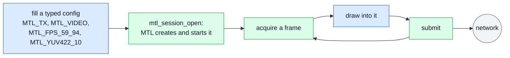

The defaults do the rest. MTL owns the buffers (a library pool); each submitted frame goes out at
the next feasible index (media mode AUTO on the SMPTE epoch, `min_tx_delay_ns` 0); results are off,
so nothing has to be read back. One `mtl_session_close` at the end sends what is queued and retires
the session. What happens to one frame between acquire and the wire:
[concepts.md §5.1](concepts.md#51-tx); the same loop one frame at a time:
[concepts.md §3](concepts.md#3-the-first-sender).

```c
/* ex01 — the smallest video sender: describe the stream, open it, then acquire, draw and
   submit one frame at a time. Needs: MS1. */
#include "ex_common.h"

void render(void* addr, uint32_t stride, int64_t frame);

int main(void) {
  mtl_instance_h mt = MTL_NULL(mtl_instance_h);
  mtl_session_h s = MTL_NULL(mtl_session_h);
  struct mtl_session_config sc;
  struct mtl_unit u;
  MTL_INIT(&sc);
  MTL_INIT(&u);

  sc.direction = MTL_TX;
  sc.essence = MTL_VIDEO;
  mtl_flow_ipv4(&sc.flows[0], 239, 168, 85, 20, 20000);
  sc.video.raster.width = 1920;
  sc.video.raster.height = 1080;
  sc.video.raster.fps = mtl_fps_rational(MTL_FPS_59_94);
  sc.video.format = MTL_YUV422_10;

  int ret = mtl_instance_open(NULL, &mt); /* ports from MTL_PORTS, e.g. "null:1" */
  if (ret < 0) {
    ex_fail("instance", ret);
    return 1;
  }
  ex_install_interrupt(mt);
  ret = mtl_session_open(mt, &sc, &s); /* create and start */

  for (int64_t k = 0; ret >= 0; k++) {
    ret = mtl_tx_acquire(s, &u, MTL_FOREVER); /* waits while every frame is queued */
    if (ret == 0) {
      render(u.plane[0].addr, u.plane[0].stride, k);
      ret = mtl_tx_submit(s, &u); /* sent at the next frame time */
    }
  }

  if (ret != -MTL_ECANCELED) ex_fail("mtl", ret); /* -MTL_ECANCELED: the interrupt */
  mtl_session_close(s, MTL_SEC(1));               /* sends what is queued, then retires */
  mtl_instance_close(mt, MTL_SEC(1));             /* leaves groups, stops the devices */
  return ret != -MTL_ECANCELED;
}
```

## 4. Receive video on two ST 2022-7 legs

[ex02_rx_video.c](sketch/examples/ex02_rx_video.c): two flows in the config (`sc.flows[0]` and
`sc.flows[1]`) are two ST 2022-7 legs on instance ports 0 and 1. In the picture MTL merges the
packets of both legs by sequence number, and the application dequeues, reads and releases each
frame.

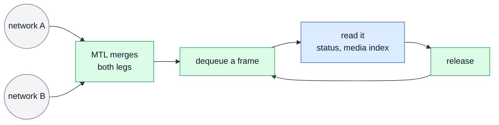

A frame with lost packets is still delivered, with `u.status == MTL_RX_INCOMPLETE` and the gaps
read as zero (library pools, from MS2). `u.media_index` says which frame it is, valid when
`MTL_UNITF_INDEX_VALID` is set. `-MTL_EAGAIN` with no signal means `status.flags` lacks
`MTL_STATUS_RX_SIGNAL`. What a receiver does with each of these, live: [§9](#9-a-receiver-that-knows-what-it-got).

```c
/* ex02 — a video receiver on two ST 2022-7 legs: dequeue, read, release. Needs: MS1. */
#include "ex_common.h"

void show(const void* addr, uint32_t stride, int complete, int64_t media_index);

int rx_video(mtl_instance_h mt) {
  mtl_session_h s = MTL_NULL(mtl_session_h);
  struct mtl_session_config sc;
  struct mtl_unit u;
  MTL_INIT(&sc);
  MTL_INIT(&u);

  sc.direction = MTL_RX;
  sc.essence = MTL_VIDEO;
  /* two flows = two legs on instance ports 0 and 1 (two ports, e.g.
     MTL_PORTS=null:1,null:2); packets merge by sequence */
  mtl_flow_ipv4(&sc.flows[0], 239, 168, 85, 20, 20000);
  mtl_flow_ipv4(&sc.flows[1], 239, 168, 86, 20, 20000);
  sc.video.raster.width = 1920;
  sc.video.raster.height = 1080;
  sc.video.raster.fps = mtl_fps_rational(MTL_FPS_59_94);
  sc.video.format = MTL_YUV422_10;
  int ret = mtl_session_open(mt, &sc, &s);

  while (ret >= 0) {
    ret = mtl_rx_dequeue(s, &u, MTL_MS(100));
    if (ret == -MTL_EAGAIN) { /* no frame for 100 ms: no signal (status.flags) */
      ret = 0;
      continue;
    }
    if (ret < 0) break;                         /* -MTL_ECANCELED: the interrupt */
    int complete = u.status == MTL_RX_COMPLETE; /* else lost packets read as zero */
    int64_t index = (u.flags & MTL_UNITF_INDEX_VALID) ? u.media_index : -1;
    show(u.plane[0].addr, u.plane[0].stride, complete, index);
    ret = mtl_rx_release(s, u.lease);
  }

  if (ret != -MTL_ECANCELED) ex_fail("rx", ret);
  mtl_session_close(s, 0); /* 1 while a frame is still out: it finishes by itself */
  return ret == -MTL_ECANCELED ? 0 : ret;
}
```

## 5. Many sessions on one thread

[ex03_event_loop.c](sketch/examples/ex03_event_loop.c) (MS2a: queues) serves a set of senders from
one thread. Each session is started with `MTL_SESSION_RESULTS`. `mtl_queue_create(mt, 0, &q, NULL)`
gives one queue for all of them, and the loop sleeps in `mtl_queue_wait(..., MTL_FOREVER)`. Two
things wake it, as in the picture: MTL, when an armed session has a result or a free slot, and the
source of the frames (decoder threads), which calls `mtl_queue_post(q, 1)` after it queued a frame.

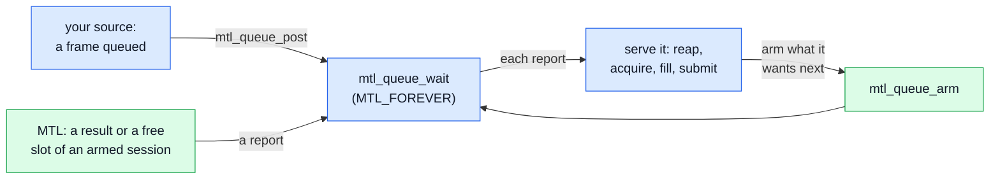

`mtl_queue_arm(q, s, targets, user)` arms what the loop wants to hear about. The first change of an
armed target reports the session once, with its `user` (here the session's index), and the report
disarms it. So the loop serves a reported session with timeout-0 calls (it reaps the results, then
acquires and submits while a source frame waits) and arms it again: `MTL_WAIT_RESULTS` always,
`MTL_WAIT_ACQUIRE` only while a frame waits for a free slot, so a sender whose source is dry never
spins on free slots. An arm that finds a target ready reports the session at once, so nothing is
missed and nothing needs draining.

A post needs no arm. Posts coalesce into one report, `o.kind` `MTL_OBJ_NONE` with `user` the OR
of the bits posted, and the source publishes its frame before it posts, so the loop sees the frame. The loop
then serves only the sessions that got frames (`source_next_ready`). The source has one consumer,
this thread, so the slot is acquired before the frame is popped, and no frame is taken without a
place to go. Results come back in submission order, each with the `u.cookie` of its unit. The
signal handler of `ex_common.h` interrupts the instance (`mtl_instance_interrupt(mt, 1)`), which
ends the queue's wait too with `-MTL_ECANCELED`; a thread that holds `q` may interrupt the queue
alone with `mtl_queue_interrupt(q, 1)`. A framework that runs its own loop (GLib, libuv) passes `&fd` to
`mtl_queue_create`, puts the descriptor in its loop (`POLLIN`), and calls
`mtl_queue_wait(..., 0)` until `-MTL_EAGAIN` before it sleeps on it. What happens inside MTL
before the queue reports: [concepts.md §2.2](concepts.md#22-the-app-pushes-mtl-never-calls-back);
the rules: [contract.md §7.2](contract.md#72-queues-ms2).

```c
/* ex03 — many senders served by one thread, woken by MTL and by the frame source. Each
   session is created with MTL_SESSION_RESULTS. Needs: MS2 (MS2a: queues). */
#include "ex_common.h"

/* The source: decoder threads queue frames per session; only this thread takes them. */
void source_start(mtl_queue_h q);             /* its threads call frame_queued(q) */
int source_next_ready(void);                  /* a session with new frames, -1: none */
const void* source_peek(int i, uint64_t* id); /* s[i]'s oldest frame, NULL: none */
void source_pop(int i);
void source_frame_done(uint64_t id, uint32_t status);
void fill(struct mtl_unit* u, const void* data);

/* On a decoder thread, after it queued a frame: wakes the loop. */
void frame_queued(mtl_queue_h q) {
  mtl_queue_post(q, 1); /* -MTL_EBADF once the loop closed q */
}

/* Sends the frames waiting for s[i]. 1: a frame waits for a free slot. */
static int send_waiting(mtl_session_h s, int i) {
  const void* frame;
  uint64_t id;
  struct mtl_unit u;
  MTL_INIT(&u);
  while ((frame = source_peek(i, &id)) != NULL) {
    int ret = mtl_tx_acquire(s, &u, 0);
    if (ret == -MTL_EAGAIN) return 1;
    if (ret < 0) return ret;
    fill(&u, frame);
    u.cookie = id; /* comes back in the result */
    source_pop(i);
    ret = mtl_tx_submit(s, &u);
    if (ret < 0) return ret;
  }
  return 0;
}

/* A report disarms the session. Serve it without waiting, then arm what you want next:
   results always, a free slot only while a frame waits for one. */
static int serve(mtl_queue_h q, mtl_session_h s, int i) {
  struct mtl_tx_result r[16];
  int n;
  while ((n = mtl_tx_reap(s, r, 16, 0)) > 0)
    for (int k = 0; k < n; k++) source_frame_done(r[k].cookie, r[k].status);
  if (n != -MTL_EAGAIN) return n;
  int need_slot = send_waiting(s, i);
  if (need_slot < 0) return need_slot;
  uint64_t want = MTL_WAIT_RESULTS | (need_slot ? MTL_WAIT_ACQUIRE : 0);
  int ret = mtl_queue_arm(q, MTL_OBJ_OF_SESSION(s), want, (uint64_t)i);
  return ret < 0 ? ret : 0; /* 1: a report is already on its way */
}

/* Returns when the instance is interrupted (ex_common.h), which ends the queue's wait. */
int event_loop(mtl_instance_h mt, mtl_session_h* s, int n) {
  struct mtl_ready r[16];
  mtl_queue_h q;
  int ret = mtl_queue_create(mt, 0, &q, NULL); /* own loop (GLib, libuv): pass &fd */
  if (ret < 0) return ex_fail("queue", ret);
  source_start(q);
  for (int i = 0; ret >= 0 && i < n; i++) ret = serve(q, s[i], i);
  while (ret >= 0) {
    int k = mtl_queue_wait(q, r, sizeof(r[0]), 16, MTL_FOREVER);
    for (int j = 0; j < k && ret >= 0; j++) {
      int i = (int)r[j].user;
      if (r[j].o.kind == MTL_OBJ_NONE) /* the source posted: serve who got frames */
        while (ret >= 0 && (i = source_next_ready()) >= 0) ret = serve(q, s[i], i);
      else if (r[j].o.kind == MTL_OBJ_SESSION)
        ret = serve(q, s[i], i);
    }
    if (k < 0) ret = k;
  }
  mtl_queue_close(q);
  return ret == -MTL_ECANCELED ? 0 : ex_fail("loop", ret);
}
```

## 6. Buffer ahead, then start at an instant

[ex04_timed_start.c](sketch/examples/ex04_timed_start.c) (MS3) queues frames before the first one
is due and keeps the queue full while it runs. The session (`open_timed`) is in `MTL_MEDIA_INDEX`
mode, so each frame names its index on the epoch, has results on, and its pool is the buffer. A
program calls `open_timed`, then `start_now` or `start_at`, then `run`; `fill` only queues frames,
`catch_up` only skips the ones whose time has passed, and `run` reaps. The picture is one
session's start and steady state.

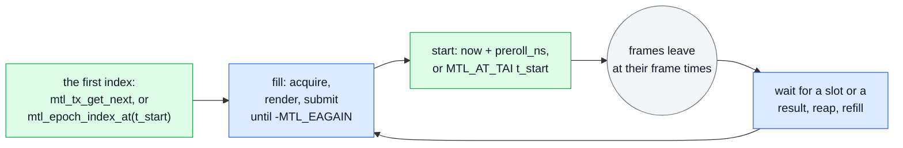

- **How deep.** `sc.pool_count` frames can be queued ahead, 8 here (133 ms at 59.94). A frame
  further ahead than the horizon (option `tx.horizon_ns`, 1 s from the start by default) is refused
  at submit with `-MTL_ERANGE` (`BEYOND_HORIZON`), so a deeper pre-roll raises that option too
  ([timing.md §6.4](timing.md#64-early-too-far-ahead-and-preroll)).
- **Back-pressure** is `-MTL_EAGAIN` from acquire, and `status.blocked_on` says on what:
  `MTL_BLOCKED_BUFFERS`, the pool is queued ahead, the normal state of a producer that is ahead, or
  `MTL_BLOCKED_RESULTS`, unread results fill the ring, which `run` reaps with
  `mtl_tx_reap_each` before it fills again.
- **How far ahead.** Each result's `margin_ns` is how long before its deadline the frame was
  submitted; `mtl_tx_get_next` gives the next frame's media time, so `next_media_tai_ns − now` is
  the media queued ahead of the wire. `mtl_session_wait(s, MTL_WAIT_ACQUIRE | MTL_WAIT_RESULTS,
  MTL_FOREVER)` sleeps until either is ready and consumes neither; the interrupt ends it.
- **A producer that falls behind** (a decoder stall longer than the pool) catches up at once: before
  each fill `catch_up` compares `next_media_index` with its own next index and skips the content of
  the frames whose time has passed, instead of rendering frames that would only be `DROPPED`
  (`TOO_LATE`). An index already sent is `DROPPED` (`DUPLICATE_INDEX`, `BEHIND`).
- **Start now** with `kind = MTL_NOW` and `preroll_ns`: T0 is the first frame time at or after
  now + the session's lead + `preroll_ns`, so the grid instant comes after all three; `preroll_ns` is
  the time the producer needs to queue its first frames. The session waits ARMED until T0, and
  while it does, `next_media_index` is T0's index.
- **Start at an agreed instant** with `MTL_AT_TAI` `t_start`: the frames are queued while the session
  is CREATED, and `mtl_epoch_index_at(t_start, unit_rate, &k0)` gives the first index with no
  instance. A source that ends while they are queued still starts, so what is queued is sent, and
  `start_at` returns `SOURCE_ENDED`. This is how **separate processes**, one per essence (FFmpeg muxers, one playout process
  per output), start in sync: each is given the same `t_start` on a grid every essence lands on
  exactly. A whole number of 1.001 s is such an instant for every 1001-rate frame and for 48 and
  96 kHz samples (whole seconds for integer rates); an audio process passes its sample rate and
  gets the index of its first sample. Every RTP timestamp then equals that of a start in one
  process (ex22), and nothing is shared but the epoch
  ([timing.md §10.4](timing.md#104-separate-processes)). The start at an instant lives here, not in
  ex05, because a scheduled start needs its frames queued before it; ex05 sets the launch of a unit.
- **Interlaced.** The index counts fields (even = first field): `unit_rate` is the field rate,
  while `raster.fps` and `mtl_grid_offset` take the frame rate.

```c
/* ex04 — buffer ahead, then start at an instant: frames are queued before the first is
   due, and the pool bounds how far ahead the producer runs. Call open_timed(), then
   start_now() or start_at(), then run(). Needs: MS3. */
#include <mtl/experimental/mtl_sync.h>
#include <mtl/experimental/mtl_util.h>

#include "ex_common.h"

#define DEPTH 8                /* frames queued ahead: 133 ms at 59.94 */
#define SUBMIT_TIME MTL_MS(10) /* the time to submit the first DEPTH frames */
#define SOURCE_ENDED 1

int render(void* addr, uint32_t stride, int64_t index); /* 1 = the source ended */
void skip_source(int64_t frames);                       /* frames that can no longer go */
void report(const char* what, int64_t value);

/* INDEX mode: each frame names its index on the epoch; the pool is the buffer. Beyond 1 s
   of media also raise MTL_OPT_HORIZON_NS (a frame past it is -MTL_ERANGE). */
int open_timed(mtl_instance_h mt, const struct mtl_session_config* base,
               mtl_session_h* s) {
  struct mtl_session_config sc = *base;
  sc.media_mode = MTL_MEDIA_INDEX;
  sc.flags |= MTL_SESSION_RESULTS;
  sc.pool_count = DEPTH;
  return mtl_session_create(mt, &sc, s);
}

/* Queues frames from *next while a slot is free: 0 once DEPTH frames are queued (or
   results wait unread: run() reaps them), SOURCE_ENDED, or an error. Interlaced: indices
   count fields, even = first field. */
static int fill(mtl_session_h s, int64_t* next) {
  struct mtl_unit u;
  int ret;
  MTL_INIT(&u);
  while ((ret = mtl_tx_acquire(s, &u, 0)) == 0) {
    if (render(u.plane[0].addr, u.plane[0].stride, *next) != 0) {
      mtl_tx_release(s, u.lease);
      return SOURCE_ENDED;
    }
    u.media_index = (*next)++;
    if ((ret = mtl_tx_submit(s, &u)) < 0) return ret;
  }
  return ret == -MTL_EAGAIN ? 0 : ret;
}

/* Now: T0 is the first frame time at or after now + MTL's lead + preroll_ns, so the
   first DEPTH frames are queued before it; the session is ARMED until T0. unit_ns: a
   frame (mtl_frame_ns), or a field when interlaced. */
int start_now(mtl_session_h s, int64_t unit_ns, int64_t* next) {
  struct mtl_when when = {.kind = MTL_NOW, .preroll_ns = DEPTH * unit_ns + SUBMIT_TIME};
  struct mtl_tx_next nx;
  int ret = mtl_session_start(&s, 1, &when, NULL);
  if (ret >= 0) ret = mtl_tx_get_next(s, &nx, sizeof(nx)); /* ARMED: T0's index */
  if (ret < 0) return ret;
  *next = nx.next_media_index;
  return fill(s, next);
}

/* At an instant every process of the programme was given (one per essence). Give them
   the same t_start, a multiple of 1.001 s (1 s for integer rates): it then falls exactly
   on a frame and on a sample. unit_rate: the index rate (fields when interlaced;
   {48000, 1} for audio). The frames are queued while the session is CREATED. */
int start_at(mtl_session_h s, int64_t t_start, struct mtl_rational unit_rate,
             int64_t* next) {
  struct mtl_when when = {.kind = MTL_AT_TAI, .value = t_start};
  int ret = mtl_epoch_index_at(t_start, unit_rate, next); /* exact on such a t_start */
  int filled = ret < 0 ? ret : fill(s, next);             /* or SOURCE_ENDED */
  if (filled < 0) return filled;
  ret = mtl_session_start(&s, 1, &when, NULL); /* START_IN_PAST: t_start has gone */
  return ret < 0 ? ret : filled;
}

/* margin_ns: the head start each frame had */
static void on_result(void* priv, const struct mtl_tx_result* r) {
  (void)priv;
  if (r->flags & MTL_TXR_MARGIN_VALID) report(mtl_reason_name(r->reason), r->margin_ns);
}

/* A producer that fell behind skips to the first index that can still go. */
static int catch_up(mtl_session_h s, int64_t* next) {
  struct mtl_tx_next nx;
  int ret = mtl_tx_get_next(s, &nx, sizeof(nx));
  if (ret >= 0 && nx.next_media_index > *next) {
    skip_source(nx.next_media_index - *next);
    *next = nx.next_media_index;
  }
  return ret;
}

/* Keeps DEPTH frames ahead until the source ends, and says how much media is queued
   ahead of now. */
int run(mtl_instance_h mt, mtl_session_h s, int64_t next) {
  int ret = 0;
  while (ret == 0) {
    struct mtl_tx_next nx;
    int64_t now;
    ret = mtl_session_wait(s, MTL_WAIT_ACQUIRE | MTL_WAIT_RESULTS, MTL_FOREVER);
    if (ret >= 0)
      ret = mtl_tx_reap_each(s, on_result, NULL); /* unread, they hold slots */
    if (ret >= 0) ret = catch_up(s, &next);
    if (ret >= 0) ret = fill(s, &next);
    if (ret == 0 && mtl_tx_get_next(s, &nx, sizeof(nx)) >= 0 &&
        mtl_time_now(mt, &now, NULL, NULL) >= 0)
      report("queued ahead ns", nx.next_media_tai_ns - now);
  }
  if (ret < 0 && ret != -MTL_ECANCELED) ex_fail("timed", ret);
  mtl_session_close(s, MTL_SEC(1)); /* sends what is queued, then retires */
  return ret < 0 && ret != -MTL_ECANCELED ? ret : 0;
}
```

## 7. Send at the instant you choose

[ex05_exact_launch.c](sketch/examples/ex05_exact_launch.c) (MS3: `MTL_SUBMIT_EXACT` MS2a,
`MTL_SUBMIT_NOT_BEFORE` MS1) sends a frame at a launch time the application chooses and reads back
whether it left then. The media time is the content's own: here `media_index` in INDEX mode, which
fixes the RTP timestamp. The launch is a separate field, `launch_tai_ns`, read with one of two
flags.

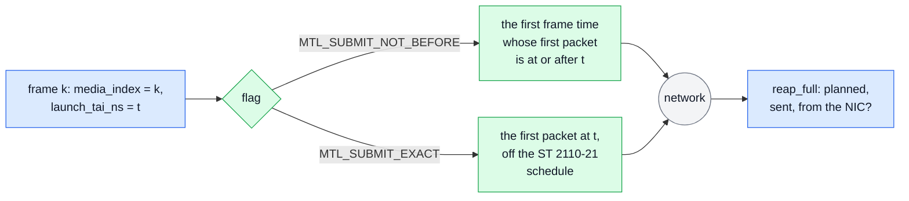

- `MTL_SUBMIT_NOT_BEFORE` keeps the stream compliant: the frame takes the first frame time whose
  first packet is at or after `launch_tai_ns`, and no packet leaves before it (G-59).
- `MTL_SUBMIT_EXACT` puts the first packet at `launch_tai_ns`; the rest follow the read schedule from
  there. It needs `launch_tai_ns` at or after the frame's media time, since no packet may leave
  before it (timing.md §5.6, T7). Exact launch is a session property: only a session created with
  `MTL_SESSION_EXACT_LAUNCH` admits it, its other units keep their frame times, and
  `MTL_INFO_NON_COMPLIANT` in `mtl_session_info.flags` says the stream may leave ST 2110-21. On an
  E830 the option `caps.pacing = MTL_PACING_HW_LAUNCH` gives the launch to the NIC.
- **Did it make it?** The result is `ON_TIME` with `sent_tai_ns`, the first packet
  (`MTL_TXR_SENT_HW` when the NIC stamped it), and `rtp`, the timestamp that left; `margin_ns`
  (valid with `MTL_TXR_MARGIN_VALID`) is how early the frame was handed over. The full record
  (`mtl_tx_reap_full`) adds `scheduled_tai_ns`, the launch MTL planned, and with NIC timestamps (the
  instance's `MTL_INSTANCE_HW_TIMESTAMP`, the option `caps.hw_timestamps`) `observed_first_tai_ns`
  per leg. A launch in the past or inside the minimum lead is `-MTL_ERANGE` at submit
  (`LAUNCH_IN_PAST`) when MTL can tell then, else `DROPPED` (`TOO_LATE`); one beyond the horizon is
  `BEYOND_HORIZON`. An invalid launch never falls back to another pacing
  ([timing.md §5.4](timing.md#54-launch-overrides)).
- A start at an instant is ex04's; packet units have their own launch pacing,
  `MTL_PKT_PACE_LAUNCH` (a chunk at `launch_tai_ns`, then the session rate).

```c
/* ex05 — send at the instant you choose: a unit's launch time is set apart from its media
   time, and its result says when it left. Needs: MS3. */
#include <mtl/experimental/mtl_observe.h>
#include <mtl/experimental/mtl_options.h>

#include "ex_common.h"

void draw(struct mtl_unit* u, int64_t frame);
/* r: the outcome (status, reason, cookie, rtp; margin_ns with MTL_TXR_MARGIN_VALID);
   planned: the launch MTL scheduled; sent: the first packet (INT64_MIN: never sent), a
   NIC timestamp when from_nic */
void launch_report(const struct mtl_tx_result* r, int64_t planned, int64_t sent,
                   int from_nic);

/* base: a video TX config. INDEX mode: the media time comes from the content. exact = 1:
   MTL_SESSION_EXACT_LAUNCH, outside ST 2110-21 (MTL_INFO_NON_COMPLIANT). The NIC's own
   send times need MTL_INSTANCE_HW_TIMESTAMP and the option below. A launch in hardware
   needs an E830 (caps.pacing MTL_PACING_HW_LAUNCH); elsewhere MTL paces it. */
int open_launcher(mtl_instance_h mt, const struct mtl_session_config* base, int exact,
                  mtl_session_h* s) {
  const struct mtl_option hw = {.key = MTL_OPT_HW_TIMESTAMPS, .value = MTL_REQ_PREFER};
  struct mtl_session_config sc = *base;
  sc.media_mode = MTL_MEDIA_INDEX;
  sc.flags |= MTL_SESSION_RESULTS | (exact ? MTL_SESSION_EXACT_LAUNCH : 0);
  sc.options = &hw;
  sc.option_count = 1;
  return mtl_session_open(mt, &sc, s);
}

/* Did each frame leave when asked? The full record adds the planned launch. */
int check_launches(mtl_session_h s) {
  struct mtl_tx_result_full f[8];
  int n;
  while ((n = mtl_tx_reap_full(s, f, 8, 0)) > 0)
    for (int i = 0; i < n; i++) {
      const struct mtl_tx_result* r = &f[i].r;
      int64_t sent = INT64_MIN; /* DROPPED, FLUSHED: never sent */
      if (r->flags & MTL_TXR_SENT_VALID) sent = r->sent_tai_ns;
      launch_report(r, f[i].scheduled_tai_ns, sent, (r->flags & MTL_TXR_SENT_HW) != 0);
    }
  return n == -MTL_EAGAIN ? 0 : n;
}

/* Frame k with its first packet at t. MTL_SUBMIT_EXACT: exactly at t, which is at or
   after the frame's media time. MTL_SUBMIT_NOT_BEFORE: at the first frame time whose
   first packet is at or after t. */
int send_at(mtl_session_h s, int64_t k, int64_t t, uint64_t mode, uint64_t id) {
  struct mtl_unit u;
  MTL_INIT(&u);
  int ret = check_launches(s); /* read first: then acquire never waits on results */
  if (ret >= 0) ret = mtl_tx_acquire(s, &u, MTL_FOREVER);
  if (ret < 0) return ret;
  draw(&u, k);
  u.media_index = k;
  u.launch_tai_ns = t;
  u.flags |= mode;
  u.cookie = id;
  ret = mtl_tx_submit(s, &u); /* -MTL_ERANGE: LAUNCH_IN_PAST, BEYOND_HORIZON */
  return ret < 0 ? ex_fail("launch", ret) : 0;
}
```

## 8. A live sender that survives late and missing frames

[ex06_live_tx.c](sketch/examples/ex06_live_tx.c) (MS3: events and the update; the rest MS1) is a
camera or a capture card. The driver writes each frame into an acquired slot, its DMA target, and
returns when the frame's readout ends, with its sampling instant. The picture is what happens to one
frame, and how the program learns it.

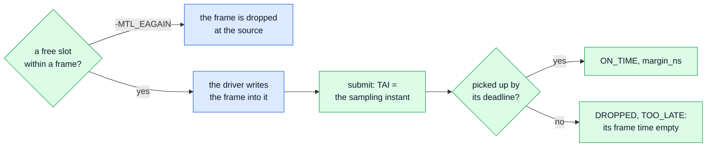

- **The session says what the source is** (`live_open`): `MTL_MEDIA_TAI` with the sampling
  instant, snapped to the nearest frame time; `min_tx_delay_ns` one unit period (a frame, a field
  when interlaced: `mtl_frame_ns`) plus the pick-up lead, since the frame exists only after its readout, so it leaves one frame time
  later (a launch delay of 1). MTL reports the lead, the stat `info.pickup_lead_ns` of the created
  session (about 0.5 ms with rate-limit pacing), so the program creates the session, reads it, sets
  the delay with `MTL_UPDATE_MEDIA` and starts; `tsmode` SAMP, because the RTP is the sampling instant
  ([timing.md §5.2](timing.md#52-min_tx_delay_ns-and-the-launch-rule)). Capturing into the slot
  costs no copy, which is what makes that delay feasible: a frame handed over at the end of its
  readout has about 150 µs before its pick-up deadline. A driver that must own its buffers copies
  in submit (`MTL_SUBMIT_SRC_PLANES`, ex21), and its delay must also cover `info.convert_ns`.
- **The camera never waits for MTL.** Acquire waits at most one frame period; with no free slot by
  then the driver has nowhere to write, and that frame is dropped at the source. The wait paces the
  loop, so it never spins, and the interrupt ends it.
- **Nothing slides.** INDEX and TAI drop a late frame (`MTL_LATE_DROP`): its frame time stays empty
  and the next frame keeps its own. AUTO (ex01) defers it to a later frame time instead
  (`MTL_LATE_DEFER`, `ON_TIME` with `MTL_TXR_DEFERRED`). A source that stalls leaves its frame times
  empty: video's underrun policy sends nothing, ANC sends its empty packet, fast metadata a
  keep-alive, audio silence with `MTL_UNDERRUN_SILENCE`
  ([timing.md §6](timing.md#6-admission-and-lateness)).
- **Each result** names its outcome: `ON_TIME` with `margin_ns`, or `DROPPED` with `TOO_LATE` (the
  source missed its deadline), `SNAP_COLLISION` (a source faster than the session's rate),
  `WAITING_NEIGHBOUR` or `LINK_DOWN` (no leg could send), `RECOVERY` (a TX queue was reset
  meanwhile). With one ST 2022-7 leg down the frame is still `ON_TIME` on the other.
- **Each incident** is an event, once (MS3), counted by its type, and each has a getter:
  `MTL_EVENT_LEG_STATE`, `MTL_EVENT_TX_UNDERRUN`, `MTL_EVENT_RECOVERY`,
  `MTL_EVENT_TIMING_INFEASIBLE`. After the last, the status names the `min_tx_delay_ns` that would
  do (`status.suggested_min_tx_delay_ns`), and the program takes it on the same handle: a stop, `mtl_session_update` with `MTL_UPDATE_MEDIA`, a start. The SSRC stays and
  the RTP continues the epoch grid.
- **Each result** goes through `mtl_tx_reap_each` (`mtl_util.h`), which reads every result ready
  now and calls the program's function for each; `margin_ns` counts only with
  `MTL_TXR_MARGIN_VALID`.
- **ERROR** is `-MTL_EIO` from a data call; `status.error_reason` says why. A stop and a start on
  the same handle re-reserve what the fault took, or the start fails `-MTL_ENODEV` when the port is
  gone.

```c
/* ex06 — a live sender that survives late and missing frames: a camera or capture card
   writes each frame into an acquired slot, and the program reads what happened from the
   results and the events. Needs: MS3. */
#include <mtl/experimental/mtl_events.h>
#include <mtl/experimental/mtl_observe.h>
#include <mtl/experimental/mtl_util.h>

#include "ex_common.h"

/* The capture driver writes the next frame into u's planes (its DMA target) and returns 0
   when its readout ends, with its sampling instant on TAI; 1: no frame in time. */
int capture_into(struct mtl_unit* u, int64_t* tai_ns, int64_t timeout_ns);
void capture_drop(void); /* no slot: the driver drops the frame it reads out */
void count(const char* what, int64_t n);
void count_event(uint32_t type, uint32_t reason); /* by type, then by reason */

/* One unit of raster r: a frame, or a field when interlaced. */
static int64_t unit_ns(const struct mtl_raster* r) {
  return mtl_frame_ns(r->fps) / (r->scan == MTL_INTERLACED ? 2 : 1);
}

/* base: flows (two legs), raster, format. TAI mode with the sampling instant, tsmode
   SAMP, and a launch delay of one frame (the readout) plus the pick-up lead MTL reports.
   A late frame is DROPPED (TAI: MTL_LATE_DROP); a frame time with none stays empty. */
int live_open(mtl_instance_h mt, struct mtl_session_config* sc, mtl_session_h* s) {
  int64_t lead = 0;
  sc->media_mode = MTL_MEDIA_TAI;
  sc->tsmode = MTL_TSMODE_SAMP;
  sc->flags |= MTL_SESSION_RESULTS;
  sc->pool_count = 3; /* live: slack for a frame or two, never a deep queue */
  int ret = mtl_session_create(mt, sc, s);
  if (ret >= 0) ret = mtl_stat_get(MTL_OBJ_OF_SESSION(*s), "info.pickup_lead_ns", &lead);
  sc->min_tx_delay_ns =
      unit_ns(&sc->video.raster) + lead; /* the readout, then the lead */
  if (ret >= 0) ret = mtl_session_update(*s, sc, MTL_UPDATE_MEDIA, NULL, NULL);
  if (ret >= 0) ret = mtl_session_start(s, 1, NULL, NULL);
  return ret;
}

/* Each frame's outcome: ON_TIME with its margin, or DROPPED with TOO_LATE,
   SNAP_COLLISION, WAITING_NEIGHBOUR, LINK_DOWN or RECOVERY. */
static void on_result(void* priv, const struct mtl_tx_result* r) {
  (void)priv;
  if (r->status != MTL_TX_ON_TIME)
    count(mtl_reason_name(r->reason), 1);
  else if (r->flags & MTL_TXR_MARGIN_VALID)
    count("margin ns", r->margin_ns);
}

/* Each incident once (LEG_STATE, TX_UNDERRUN, RECOVERY, ...); each also has a getter. A
   delay too short is lengthened on the same handle: stop, update, start. */
static int incidents(mtl_session_h s, struct mtl_session_config* sc) {
  struct mtl_event ev[8];
  struct mtl_session_status st;
  int n, ret = 0;
  while (ret >= 0 && (n = mtl_session_read_events(s, ev, 8, 0)) > 0)
    for (int i = 0; ret >= 0 && i < n; i++) {
      count_event(ev[i].type, ev[i].reason);
      if (ev[i].type != MTL_EVENT_TIMING_INFEASIBLE) continue;
      ret = mtl_session_get_status(s, &st, sizeof(st));
      if (ret >= 0) sc->min_tx_delay_ns = st.suggested_min_tx_delay_ns;
      if (ret >= 0) ret = mtl_session_stop(&s, 1, MTL_STOP_DRAIN, MTL_SEC(1));
      if (ret >= 0) ret = mtl_session_update(s, sc, MTL_UPDATE_MEDIA, NULL, NULL);
      if (ret >= 0) ret = mtl_session_start(&s, 1, NULL, NULL);
    }
  return ret;
}

int live_tx(mtl_instance_h mt, struct mtl_session_config* sc) {
  mtl_session_h s = MTL_NULL(mtl_session_h);
  struct mtl_unit u;
  MTL_INIT(&u);
  int ret = live_open(mt, sc, &s);
  const int64_t unit = unit_ns(&sc->video.raster);
  while (ret >= 0) {
    int64_t tai;
    ret = mtl_tx_reap_each(s, on_result, NULL);
    if (ret >= 0) ret = incidents(s, sc);
    /* a slot within one unit, else that frame is dropped: the camera never waits */
    if (ret >= 0) ret = mtl_tx_acquire(s, &u, unit);
    if (ret == -MTL_EAGAIN) {
      capture_drop();
      ret = 0;
    } else if (ret == 0 && capture_into(&u, &tai, 2 * unit) != 0) {
      ret = mtl_tx_release(s, u.lease); /* the source stalled: its time stays empty */
    } else if (ret == 0) {
      u.media_tai_ns = tai;
      ret = mtl_tx_submit(s, &u);
    }
    if (ret == -MTL_EIO) { /* ERROR: status.error_reason; restart on the same handle */
      ret = mtl_session_stop(&s, 1, MTL_STOP_FLUSH, 0);
      if (ret >= 0) ret = mtl_session_start(&s, 1, NULL, NULL); /* -MTL_ENODEV: no port */
    }
  }
  if (ret != -MTL_ECANCELED) ex_fail("live", ret);
  mtl_session_close(s, MTL_SEC(1));
  return ret == -MTL_ECANCELED ? 0 : ret;
}
```

## 9. A receiver that knows what it got

[ex07_live_rx.c](sketch/examples/ex07_live_rx.c) (MS3: `media_index`; the detail and
`MTL_SESSION_RX_LATEST` MS2) receives a live stream on two legs and logs, unit by unit, what the
stream did. The picture is what one dequeue can say.

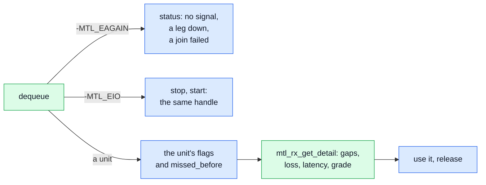

| Read | It means |
|---|---|
| `u.missed_before` > 0 | the pool was full: the consumer was slow, and that many units were dropped |
| the detail's `units_missing_before` | units that never arrived before this one, by index difference (fields when interlaced) |
| `MTL_UNITF_DISCONTINUITY` | the sender re-anchored; with `MTL_UNITF_RELOCKED` it restarted, and the index may go back |
| `MTL_RX_INCOMPLETE` | packets lost on both legs, by its due time; the gaps read as zero in library pools; the detail's `missing_ranges` |
| `MTL_UNITF_USED_REDUNDANCY` | one leg lost packets, the other had them |
| the detail's `arrival_first_tai_ns` | the latency: first packet minus media time |

- **No unit** is `-MTL_EAGAIN`, never an end of stream. The status, a published snapshot, says why:
  `flags` without `MTL_STATUS_RX_SIGNAL` (nothing arrives), or a leg with `oper` 0 (link down,
  still joining, or `MTL_FLOW_JOIN_FAILED`).
- **A slow consumer chooses.** A monitor sets `MTL_SESSION_RX_LATEST` with a small pool: a full pool
  gives up its oldest unread frame, so the next dequeue is the newest (`rx.units_reclaimed`). A
  recorder keeps the default with a deeper pool: the newest frame is dropped and counted in the next
  unit's `missed_before`. A framework source copies instead of lending when downstream holds too
  much (ex20).
- **ERROR** (`-MTL_EIO`) is left by a stop and a start on the same handle; the start re-reserves
  what the fault took, or fails `-MTL_ENODEV` when the port is gone.
- **One option or field each:** with `rx.timing_parser` on, the detail's `timing[leg]` grades each
  leg against ST 2110-21 (`compliance`, `failed_cause`); with `video.detect` ON the raster is the
  largest accepted, and the first unit of each detected format carries `MTL_UNITF_FORMAT_CHANGED`
  with the format in the detail's `raster` (MS3); with `rx.link_offset_ns` each unit has a
  presentation time, one for all the receivers of a programme
  ([timing.md §11.3](timing.md#113-presentation-and-link-offset)), and those receivers start
  together with one start array of RX sessions whose `when` is the first media time they deliver
  ([timing.md §11.4](timing.md#114-starting-receivers-together)). Leg i is on instance port i;
  `mtl_flow_on_port` names another (`MTL_INFO_LEGS_SHARE_PORT` when both share one).

```c
/* ex07 — a receiver that knows what it got: each unit, the status and the unit's detail
   say what the stream did, and what the program does about it. Needs: MS3. */
#include <mtl/experimental/mtl_observe.h>

#include "ex_common.h"

void use_frame(const struct mtl_unit* u);
void note(const char* what, int64_t media_index, int64_t n); /* the application's log */

/* base: a video RX config on two legs. A monitor wants the newest frame (RX_LATEST, a
   small pool: a full pool gives up its oldest unread frame); a recorder wants every frame
   (the default, a deeper pool: a full pool drops the newest, and counts it). */
int open_rx(mtl_instance_h mt, const struct mtl_session_config* base, int monitor,
            mtl_session_h* s) {
  struct mtl_session_config sc = *base;
  sc.flags |= monitor ? MTL_SESSION_RX_LATEST : 0;
  sc.pool_count = monitor ? 3 : 8;
  return mtl_session_open(mt, &sc, s);
}

/* No unit: why. The status is a published snapshot: reading it costs nothing. */
static void no_unit(mtl_session_h s) {
  struct mtl_session_status st;
  if (mtl_session_get_status(s, &st, sizeof(st)) < 0) return;
  if (!(st.flags & MTL_STATUS_RX_SIGNAL)) note("no signal", -1, 0);
  for (uint32_t i = 0; i < st.leg_count; i++)
    if (!st.leg[i].oper) note("leg down, or its join failed", -1, st.leg[i].flow_state);
}

/* What one unit says. Indices count fields when interlaced. */
static void check_unit(mtl_session_h s, const struct mtl_unit* u) {
  struct mtl_rx_detail d;
  int64_t k = (u->flags & MTL_UNITF_INDEX_VALID) ? u->media_index : -1;
  if (mtl_rx_get_detail(s, u->lease, &d, sizeof(d)) < 0) return;
  if (u->missed_before) note("we were slow: our full pool dropped", k, u->missed_before);
  if (d.units_missing_before)
    note("never arrived from the network", k, d.units_missing_before);
  /* RELOCKED: the sender restarted, and k may go back */
  if (u->flags & MTL_UNITF_DISCONTINUITY)
    note(u->flags & MTL_UNITF_RELOCKED ? "sender restarted" : "sender jumped", k, 0);
  if (u->flags & MTL_UNITF_USED_REDUNDANCY) note("one leg lost packets", k, 0);
  if (u->status == MTL_RX_INCOMPLETE)
    note("lost on both legs, runs", k, d.missing_ranges);
  if ((d.flags & MTL_RXF_ARRIVAL_LEG0) && (u->flags & MTL_UNITF_TAI_VALID))
    note("latency ns", k, d.arrival_first_tai_ns[0] - u->media_tai_ns);
  if ((d.flags & MTL_RXF_TIMING_LEG0) && d.timing[0].compliance == MTL_NOT_COMPLIANT)
    note(mtl_reason_name(d.timing[0].failed_cause), k, 0); /* with rx.timing_parser */
}

int receive(mtl_session_h s) {
  struct mtl_unit u;
  int ret = 0;
  MTL_INIT(&u);
  while (ret >= 0) {
    ret = mtl_rx_dequeue(s, &u, MTL_MS(100));
    if (ret == -MTL_EAGAIN) { /* nothing for 100 ms */
      no_unit(s);
      ret = 0;
    } else if (ret == -MTL_EIO) { /* ERROR, status.error_reason: restart the handle */
      ret = mtl_session_stop(&s, 1, MTL_STOP_FLUSH, 0);
      if (ret >= 0) ret = mtl_session_start(&s, 1, NULL, NULL); /* -MTL_ENODEV: no port */
    } else if (ret == 0) {
      check_unit(s, &u);
      use_frame(&u);
      ret = mtl_rx_release(s, u.lease);
    }
  }
  if (ret != -MTL_ECANCELED) ex_fail("rx", ret);
  mtl_session_close(s, 0);
  return ret == -MTL_ECANCELED ? 0 : ret;
}
```

## 10. Rows: before the frame is finished

[ex08_rows.c](sketch/examples/ex08_rows.c) (MS3; rows MS2a, INDEX and `mtl_tx_get_next` MS3) is an
SDI-to-IP gateway on TX, and a low-latency reader on RX: `unit = MTL_UNIT_ROWS` on both. TX uses
`media_mode = MTL_MEDIA_INDEX`, `sc.video.troffset_us` and `min_tx_delay_ns` 0, so the frame leaves
in the frame period it is captured in. In the picture `mtl_tx_get_next` says which frame is being
filled, and each submit of the same lease with a larger `used` publishes more rows; `used == rows`
ends the frame.

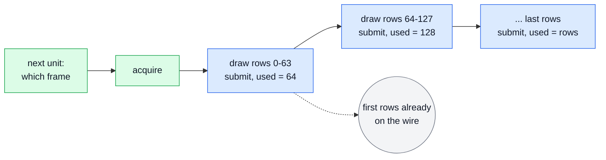

The first rows are on the wire while the rest are still being drawn. The index is the next frame
that can still go, so a gateway that runs late stamps a later frame and declares `tsmode` NEW; one
that keeps the SDI frame's instant derives the index from its input instead. Each row has a deadline,
`mtl_tx_row_deadline(s, k, row, &t)`; rows that come after theirs end the unit where its rows
stopped (option `tx.rows_late`, TRUNCATE by default), and its one result follows. On RX a unit
dequeued with `MTL_UNITF_PARTIAL` grows while it is held: `mtl_rx_wait_rows(s, lease, min_rows,
&rows, timeout)` returns once `min_rows` rows are complete or the unit ends, whatever
`rx.rows_step` is; a unit that ended short returns fewer rows, and its final status is
`mtl_rx_get_detail`'s on the held lease.

```c
/* ex08 — rows: a frame's first rows leave while the rest is still arriving (an SDI-to-IP
   gateway), and a receiver reads rows before the frame is complete. Needs: MS3. */
#include <mtl/experimental/mtl_sync.h>

#include "ex_common.h"

#define STEP 64u
void render_rows(struct mtl_unit* u, uint32_t first, uint32_t end); /* the SDI input */
void consume_rows(const struct mtl_unit* u, uint32_t first, uint32_t end);
void report(const char* what, int64_t value);

/* Rows after their deadline end the frame there (tx.rows_late), and the result says so;
   this says by how much. */
static void report_if_late(mtl_instance_h mt, mtl_session_h s, int64_t k, uint32_t row) {
  int64_t due, now;
  if (mtl_tx_row_deadline(s, k, row, &due) >= 0 &&
      mtl_time_now(mt, &now, NULL, NULL) >= 0 && now > due)
    report("row late ns", now - due);
}

/* TX: unit MTL_UNIT_ROWS, media_mode INDEX, video.troffset_us. The index is the next
   frame that can still go: a gateway that runs late stamps a later frame, so it declares
   tsmode NEW; one that keeps the SDI frame's instant derives the index from its input. */
int send_one_frame(mtl_instance_h mt, mtl_session_h s) {
  struct mtl_unit u;
  struct mtl_tx_next nx;
  MTL_INIT(&u);
  int ret = mtl_tx_acquire(s, &u, MTL_FOREVER); /* results off */
  if (ret < 0) return ret;
  ret = mtl_tx_get_next(s, &nx, sizeof(nx)); /* after the wait: the frame being filled */
  if (ret < 0) {
    mtl_tx_release(s, u.lease);
    return ret;
  }

  u.media_index = nx.next_media_index;
  for (uint32_t done = 0; done < u.plane[0].rows;) {
    uint32_t next = done + STEP;
    if (next > u.plane[0].rows) next = u.plane[0].rows;
    render_rows(&u, done, next);
    report_if_late(mt, s, u.media_index, next - 1);
    u.used = next; /* rows [0, next) are final; used == rows ends the frame */
    ret = mtl_tx_submit(s, &u);
    if (ret < 0) return ex_fail("submit", ret);
    done = next;
  }
  return 0;
}

/* RX: rows as they complete, STEP at a time. A unit that ends short (lost packets, its
   due time) returns fewer rows than asked; its final status is mtl_rx_get_detail's. */
int receive_one_frame(mtl_session_h s) {
  struct mtl_unit u;
  uint32_t have = 0;
  MTL_INIT(&u);
  int ret = mtl_rx_dequeue(s, &u, MTL_FOREVER);
  if (ret < 0) return ret;
  uint32_t rows_done = u.used; /* rows units: used counts the rows complete */
  while (ret >= 0 && rows_done > have) {
    consume_rows(&u, have, rows_done);
    have = rows_done;
    if (have == u.plane[0].rows || !(u.flags & MTL_UNITF_PARTIAL)) break;
    uint32_t want = have + STEP;
    if (want > u.plane[0].rows) want = u.plane[0].rows;
    ret = mtl_rx_wait_rows(s, u.lease, want, &rows_done, MTL_FOREVER);
  }
  int r = mtl_rx_release(s, u.lease);
  return ret < 0 ? ret : r;
}
```

## 11. Packet units: your own RTP, forwarded with its timing

[ex09_rtp_packets.c](sketch/examples/ex09_rtp_packets.c) (MS5): with `sc.unit = MTL_UNIT_PACKETS`
a unit is a chunk of packet slots (`mtl_packet.h`), moved with the same verbs as frames, one result
per chunk. The file holds two programs, marked in it: the first builds its own packets; the second
forwards received ones byte for byte, timed from their own timestamps.

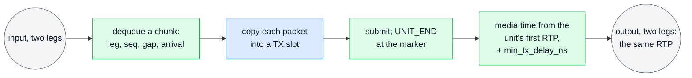

- **Send.** The packet table is `mtl_pkt_tx_table(&u)` and slot n is `mtl_pkt_slot(&u, n)`; the
  chunk that ends a frame carries `MTL_SUBMIT_UNIT_END`. `sc.packet.set_fields` names the RTP fields
  MTL writes, here the sequence numbers only; the application writes the rest with `mtl_rtp_set`.
  Its timestamp is `next_rtp` of `mtl_tx_get_next`, `floor(M × 90 kHz)` of the frame the first
  chunk names (INDEX mode), exact; the payload starts after the 12-byte header (`RTP_HDR`); `mtl_media_ticks` of the floored `next_media_tai_ns` would be
  one tick low on one frame in three at 59.94. With `MTL_PKT_SET_TIMESTAMP` MTL writes it instead.
  MTL writes UDP, IP and Ethernet, paces the packets on the ST 2110-21 schedule of the declared
  count, and sends each on both legs.
- **Forward.** RX is a video packet session on two legs whose chunks never span two frames
  (`MTL_PKT_RX_UNIT_ALIGNED`), the two legs' duplicates already removed; each packet carries its
  leg, sequence, gap and arrival. TX (`open_forward_tx`) is the generic RTP essence `MTL_RTP` with
  `set_fields` 0, every byte verbatim, and `MTL_PKT_TIME_FROM_RTP`: each unit's media time is read
  from its first packet's RTP timestamp, taken as given, and the unit leaves `min_tx_delay_ns` after
  it, the processor of ex23 at the packet level
  ([contract.md §13.5](contract.md#135-pacing-and-unit-time)). A unit that misses that is `DROPPED`
  (`TOO_LATE`); `MTL_LATE_DEFER` is refused with FROM_RTP.
- **The delay comes from the input.** An input's RTP time is its sender's media time, not its
  launch: a camera or an MTL capture sender (ex06) has a launch delay of one frame, and its last
  packet arrives about two frames after the media time. So `min_tx_delay_ns` is the input's last
  packet minus its media time, measured over a few units (`input_delay`, with `mtl_media_tai`) or
  taken from its SDP's TSDELAY plus a frame, plus the pick-up lead and a margin (`MARGIN`). A
  later increase is an update in STOPPED (`MTL_UPDATE_MEDIA` takes `min_tx_delay_ns`).
- **The pool covers the delay.** Every chunk waits in the TX pool from its arrival until it
  leaves, so `pool_count` is the chunks of the delay's frames plus one frame:
  (ceil(`min_tx_delay_ns` / TFRAME) + 1) × `CHUNKS`, checked against `info.max_count` of a dry
  run (`mtl_session_query`). A smaller pool fails acquire, and nearly every frame is lost.
- **A lost marker** leaves the TX unit open, and the next frame's chunks would take it past
  `packets_per_unit`. So when a chunk starts a unit while one is open, `end_unit` submits an empty
  chunk with `MTL_SUBMIT_UNIT_END`: the old unit ends short (`MTL_TXR_PKT_SHORT`), and the new one
  starts clean. With the pool full that end waits as `end_pending` and is tried again before each
  later chunk, which is dropped until it succeeds, and `open` changes only after a submit
  succeeded. `mtl_media_ticks` of the
  arrival minus the RTP timestamp is the RTP offset an analyser such as EBU LIST reports.
- Both sides set the same `packet.packets_per_chunk`, so a received chunk always fits a TX chunk.
- The generic RTP essence also carries ST 2022-6 (`rtp.encoding` `"SMPTE2022-6"`, 27 MHz, the
  application writing every packet's timestamp) and ST 2110-43 timed text (no unit rate, TAI mode,
  `MTL_PKT_PACE_LAUNCH`) ([contract.md §13.6](contract.md#136-essence-rules)). An analyser that wants
  both legs' copies sets `MTL_PKT_RX_NO_DEDUP`: the second copy is flagged `MTL_PKTE_REDUNDANT`.

```c
/* ex09 — packet units, both ways: build your own RTP packets, and forward received
   packets byte for byte, timed by their own timestamps. Needs: MS5. */
#include <mtl/experimental/mtl_packet.h>
#include <mtl/experimental/mtl_sync.h>
#include <mtl/experimental/mtl_util.h>

#include "ex_common.h"

#define PKTS 4320 /* per frame: 1080p 4:2:2 10-bit, 1200-byte payloads */
#define CHUNK 32  /* packets per chunk, on both sides of the forwarder */
#define CHUNKS ((PKTS + CHUNK - 1) / CHUNK) /* chunks per frame */
/* the RTP header: 12 bytes, no CSRC, no extension */
#define RTP_HDR ((uint32_t)sizeof(struct mtl_rtp_hdr))
#define PT 96

/* ---- 1. Your own RTP packets ------------------------------------------------------- */

uint16_t payload(uint8_t* at, int64_t frame, uint32_t pkt); /* RFC 4175: its bytes */

/* s: a video TX session (two legs), MTL_UNIT_PACKETS, INDEX mode; set_fields
   MTL_PKT_SET_SEQ: MTL numbers the packets, the application writes the rest. */
int send_frame(mtl_session_h s, uint32_t ssrc) {
  struct mtl_unit u;
  struct mtl_tx_next nx;
  MTL_INIT(&u);
  int ret = 0;
  for (uint32_t pkt = 0; ret >= 0 && pkt < PKTS;) {
    int first_chunk = pkt == 0;
    ret = mtl_tx_acquire(s, &u, MTL_FOREVER); /* a chunk of slots; results off */
    if (ret < 0) break;
    /* after the wait: the next frame that can still go */
    if (first_chunk && (ret = mtl_tx_get_next(s, &nx, sizeof(nx))) < 0) {
      mtl_tx_release(s, u.lease);
      break;
    }
    uint32_t n = 0;
    for (; n < u.plane[0].rows && pkt < PKTS; n++, pkt++) {
      uint8_t* p = mtl_pkt_slot(&u, n); /* next_rtp: floor((M + rtp_trim) x 90 kHz) */
      mtl_rtp_set((struct mtl_rtp_hdr*)p, PT, pkt + 1 == PKTS, 0, nx.next_rtp, ssrc);
      uint16_t len = payload(p + RTP_HDR, nx.next_media_index, pkt);
      mtl_pkt_tx_table(&u)[n].len = (uint16_t)(RTP_HDR + len);
    }
    u.used = n;
    if (first_chunk) u.media_index = nx.next_media_index;
    if (pkt == PKTS) u.flags |= MTL_SUBMIT_UNIT_END;
    ret = mtl_tx_submit(s, &u); /* a late frame is DROPPED whole */
  }
  return ret < 0 ? ex_fail("send", ret) : 0;
}

/* ---- 2. A forwarder that keeps the input's timing ---------------------------------- */

#define MARGIN MTL_MS(1) /* MTL's pick-up lead and the input's jitter */
void input_gap(uint8_t leg, uint32_t seq, uint16_t gap); /* what the network lost */
void input_offset(int32_t ticks); /* first packet arrival - RTP: LIST's RTP offset */

/* How late the input arrives after its media time: a marker packet's arrival minus its
   RTP as a TAI instant. Measure it over a few units, or take its SDP's TSDELAY plus one
   frame. */
int64_t input_delay(const struct mtl_pkt_rx* marker) {
  uint32_t ts = mtl_rtp_get_ts((const struct mtl_rtp_hdr*)marker->data);
  return marker->arrival_tai_ns - mtl_media_tai(marker->arrival_tai_ns, ts, 90000);
}

/* The forwarder's TX: generic RTP at the input's rate, every byte verbatim (set_fields
   0), each unit sent min_tx_delay_ns after its first packet's RTP time. Its pool holds
   every chunk until it leaves: the frames of the delay, plus one. */
int open_forward_tx(mtl_instance_h mt, int64_t input_delay_ns, mtl_session_h* tx) {
  struct mtl_session_config sc;
  struct mtl_session_info info;
  MTL_INIT(&sc);
  sc.direction = MTL_TX;
  sc.essence = MTL_RTP;
  sc.unit = MTL_UNIT_PACKETS;
  mtl_flow_ipv4(&sc.flows[0], 239, 168, 87, 50, 20000);
  mtl_flow_ipv4(&sc.flows[1], 239, 168, 88, 50, 20000);
  snprintf(sc.rtp.encoding, sizeof(sc.rtp.encoding), "raw");
  sc.rtp.clock_rate = 90000;
  sc.rtp.unit.fps = mtl_fps_rational(MTL_FPS_59_94);
  sc.packet.packets_per_unit = PKTS;
  sc.packet.packets_per_chunk = CHUNK;
  sc.packet.unit_time = MTL_PKT_TIME_FROM_RTP;
  sc.min_tx_delay_ns = input_delay_ns + MARGIN;
  const int64_t frame_ns = mtl_frame_ns(sc.rtp.unit.fps);
  int64_t frames = (sc.min_tx_delay_ns + frame_ns - 1) / frame_ns + 1;
  int ret = mtl_session_query(mt, &sc, 0, &info, sizeof(info), NULL, 0); /* the limit */
  sc.pool_count = (uint32_t)frames * CHUNKS;
  if (ret >= 0 && sc.pool_count > info.max_count) ret = -MTL_ERANGE; /* delay too long */
  if (ret >= 0) ret = mtl_session_open(mt, &sc, tx);
  return ret < 0 ? ex_fail("forward tx", ret) : 0;
}

/* What the input did: its losses per leg, and its RTP offset. */
static void measure(const struct mtl_pkt_rx* p) {
  if (p->flags & MTL_PKTE_GAP_BEFORE) input_gap(p->leg, p->seq, p->gap);
  if ((p->flags & MTL_PKTE_UNIT_START) && (p->flags & MTL_PKTE_ARRIVAL_VALID)) {
    uint32_t ts = mtl_rtp_get_ts((const struct mtl_rtp_hdr*)p->data);
    input_offset((int32_t)(mtl_media_ticks(p->arrival_tai_ns, 90000) - ts));
  }
}

/* A lost marker leaves a TX unit open: end it short (MTL_TXR_PKT_SHORT) with an empty
   chunk before the next unit starts. */
static int end_unit(mtl_session_h tx) {
  struct mtl_unit u;
  MTL_INIT(&u);
  int ret = mtl_tx_acquire(tx, &u, 0);
  if (ret < 0) return ret;
  u.flags |= MTL_SUBMIT_UNIT_END; /* used 0 */
  return mtl_tx_submit(tx, &u);
}

/* The forwarder's TX unit between chunks. */
struct fwd_tx {
  mtl_session_h s;
  int open;        /* chunks submitted, no UNIT_END yet */
  int end_pending; /* the open unit lost its marker: end it before the next chunk */
};

/* rx: the input as video packet units, packet.packets_per_chunk = CHUNK and
   MTL_PKT_RX_UNIT_ALIGNED; the two legs' duplicates are already removed. -MTL_EAGAIN:
   the TX pool was full, and the chunk is lost. */
int forward_chunk(mtl_session_h rx, struct fwd_tx* tx) {
  struct mtl_unit in, out;
  MTL_INIT(&in);
  MTL_INIT(&out);
  int ret = mtl_rx_dequeue(rx, &in, MTL_FOREVER);
  if (ret < 0) return ret;
  const struct mtl_pkt_rx* p = mtl_pkt_rx_table(&in);
  for (uint32_t i = 0; i < in.used; i++) measure(&p[i]);
  if (tx->open && (p[0].flags & MTL_PKTE_UNIT_START)) tx->end_pending = 1;
  if (tx->end_pending && (ret = end_unit(tx->s)) == 0) /* retried on every chunk */
    tx->open = tx->end_pending = 0;
  if (ret == 0) ret = mtl_tx_acquire(tx->s, &out, 0);
  for (uint32_t i = 0; ret == 0 && i < in.used; i++) {
    memcpy(mtl_pkt_slot(&out, i), p[i].data, p[i].len);
    mtl_pkt_tx_table(&out)[i].len = p[i].len;
    if (p[i].flags & MTL_PKTE_MARKER) out.flags |= MTL_SUBMIT_UNIT_END;
  }
  if (ret == 0) {
    out.used = in.used;
    ret =
        mtl_tx_submit(tx->s, &out); /* past its deadline: DROPPED, TOO_LATE, as a frame */
    if (ret == 0) tx->open = !(out.flags & MTL_SUBMIT_UNIT_END);
  }
  int r = mtl_rx_release(rx, in.lease);
  return ret < 0 ? ret : r;
}
```

## 12. Send from your memory without a copy

[ex10_zero_copy_tx.c](sketch/examples/ex10_zero_copy_tx.c) (MS2b) sends a framework's surfaces
without a copy: surface i is slot i, as in the picture. The config sets
`MTL_SESSION_POOL_ATTACHED | MTL_SESSION_REQUIRE_DIRECT` and `pool_count`, and one
`mtl_session_attach` (`mtl_mem.h`) imports the arena (`a.va`, `a.length`, `a.count`) as the
session's slots; it fails with a reason if the arena is too small.


`mtl_tx_acquire_slot(s, i, ...)` leases exactly surface i, or returns `-MTL_EAGAIN` while it is
still in flight. Application memory always produces results (rule MEM3), so a surface goes back to
the framework only when its result says the network is done with it; `mtl_tx_reap_each` reads
the results. The loop waits up to 20 ms for the framework's next frame, so it never spins. At the
end it stops with `MTL_STOP_DRAIN`, reaps, then closes with `MTL_FOREVER`: `mtl_session_close`
returns once nothing references the arena any more, and then the arena may be freed. The session's path through
create, attach, start, stop and close: [concepts.md §5.3](concepts.md#53-a-sessions-life).

**A buffer per acquire.** A framework that hands over another buffer each frame (a GStreamer
upstream pool, an FFmpeg frame, a cursor through one arena) cannot name a fixed surface.
`import_arena` imports the arena once as a region (`mtl_mem_import`, `MTL_MEM_MAP_ALL`: a
per-acquire layout must lie in memory already mapped into every port, because mapping never runs in
a data call), and `mtl_mem_get_info` says whether the memory can be sent directly (page-cache
memory is copy only, and `import_arena` fails on it). Then `mtl_tx_acquire_layout(s, &buf, &u,
timeout)` binds a slot to the buffer's layout (`buf.region`, `buf.offset`, `buf.cookie`) for that
one unit; the cookie comes back in the result, which frees the buffer. The session has
`MTL_SESSION_POOL_ATTACHED` and no slot attached at its start, which makes it a layout session:
`pool_count` bounds the buffers in flight. After the session's close,
`mtl_mem_close` returns 0 once the arena may be unmapped, or 1 while a device may still read it
(`MTL_EVENT_REGION_RELEASED` ends it). GPU memory is the region flag `MTL_MEM_DEVICE` (MS6).

```c
/* ex10 — send from your memory without a copy: a framework's surfaces attached as the
   session's slots, or a buffer per frame bound to a slot at acquire. A buffer goes back
   to the framework only when its result says the NIC is done with it. Needs: MS2b. */
#include <mtl/experimental/mtl_mem.h>
#include <mtl/experimental/mtl_util.h>

#include "ex_common.h"

#define N 4
extern void* arena; /* the framework's pool: N surfaces, page aligned */
extern uint64_t arena_len;
/* 0 = a frame is ready within timeout_ns (the thread sleeps meanwhile); 1 = none yet;
   -MTL_ECANCELED: the framework stopped */
int next_framework_frame(uint32_t* surface, uint64_t* id, int64_t timeout_ns);
void framework_frame_done(uint64_t id);

/* A result: the NIC is done with the surface, which goes back to the framework. */
static void on_result(void* priv, const struct mtl_tx_result* r) {
  (void)priv;
  framework_frame_done(r->cookie);
}

/* base: a video TX config. Surface i is slot i, in its natural layout. */
int zero_copy_tx(mtl_instance_h mt, const struct mtl_session_config* base) {
  mtl_session_h s = MTL_NULL(mtl_session_h);
  struct mtl_session_config sc = *base;
  struct mtl_attach a;
  struct mtl_unit u;
  MTL_INIT(&a);
  MTL_INIT(&u);
  sc.flags |=
      MTL_SESSION_POOL_ATTACHED | MTL_SESSION_REQUIRE_DIRECT; /* fail, never copy */
  sc.pool_count = N;
  a.va = arena; /* imported for this session */
  a.length = arena_len;
  a.count = N;
  int ret = mtl_session_create(mt, &sc, &s);
  if (ret >= 0) ret = mtl_session_attach(s, &a); /* fails here, with a reason */
  if (ret >= 0) ret = mtl_session_start(&s, 1, NULL, NULL);

  while (ret >= 0) {
    uint32_t i;
    uint64_t id;
    if ((ret = mtl_tx_reap_each(s, on_result, NULL)) < 0) break;
    if ((ret = next_framework_frame(&i, &id, MTL_MS(20))) != 0)
      continue;                                      /* 1: none yet */
    ret = mtl_tx_acquire_slot(s, i, &u, MTL_MS(20)); /* exactly surface i */
    if (ret == 0) {
      u.cookie = id;
      ret = mtl_tx_submit(s, &u);
    } else if (ret == -MTL_EAGAIN) { /* surface i still in flight: skip this frame */
      framework_frame_done(id);
      ret = 0;
    }
  }

  if (ret != -MTL_ECANCELED) ex_fail("zero copy", ret);
  mtl_session_stop(&s, 1, MTL_STOP_DRAIN, MTL_SEC(1)); /* a result for every unit */
  mtl_tx_reap_each(s, on_result, NULL);
  mtl_session_close(s, MTL_FOREVER); /* returns once the NIC no longer reads the arena */
  return ret == -MTL_ECANCELED ? 0 : ret;
}

/* A buffer per frame (a GStreamer upstream pool, an FFmpeg frame): the arena imported
   once and mapped into every port now; it fails on copy-only memory (mi.direct 0: the
   NIC cannot read it). The session: MTL_SESSION_POOL_ATTACHED and no slot attached, a
   layout session whose pool_count bounds the buffers in flight. */
int import_arena(mtl_instance_h mt, void* va, uint64_t len, mtl_region_h* r) {
  struct mtl_mem_desc d;
  struct mtl_mem_info mi;
  MTL_INIT(&d);
  d.va = va;
  d.length = len;
  d.flags = MTL_MEM_READ | MTL_MEM_MAP_ALL;
  int ret = mtl_mem_import(mt, &d, r);
  if (ret >= 0) ret = mtl_mem_get_info(*r, &mi, sizeof(mi));
  if (ret >= 0 && !mi.direct) ret = -MTL_ENOTSUP;
  return ret;
}

/* The buffer at offset, sent as it is; its result (on_result) names it by id. */
int send_buffer(mtl_session_h s, mtl_region_h r, uint64_t offset, uint64_t id) {
  struct mtl_attach buf;
  struct mtl_unit u;
  MTL_INIT(&buf);
  MTL_INIT(&u);
  buf.count = 1;
  buf.region = r;
  buf.offset = offset;
  buf.cookie = id;                                /* u.cookie starts as id */
  int ret = mtl_tx_reap_each(s, on_result, NULL); /* then it never waits on results */
  if (ret >= 0) ret = mtl_tx_acquire_layout(s, &buf, &u, MTL_FOREVER);
  return ret < 0 ? ret : mtl_tx_submit(s, &u);
}
```

## 13. Receive into your memory: an MXL ring, a recorder

[ex11_rx_into_memory.c](sketch/examples/ex11_rx_into_memory.c) (MS2b) receives into an MXL ring. The ring is the
session's pool (`MTL_SESSION_POOL_ATTACHED | MTL_SESSION_RX_BY_INDEX | MTL_SESSION_RX_LATEST`,
`a.pitch = grain_size`), and frame k lands in grain k mod 8, as in the picture.

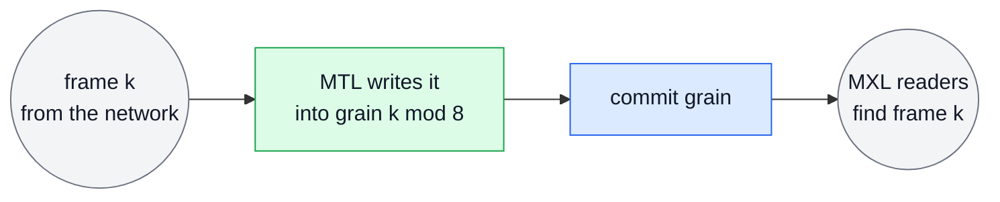

With `MTL_SESSION_RX_BY_INDEX` the slot is the media index mod `pool_count`, so
`u.slot == media_index mod 8`. Every session runs on the SMPTE epoch, so every process computes the
same k for the same frame, and the MXL readers find frame k in the grain MTL wrote it to.

**A recorder** chooses each frame's place while it runs: the write cursor of an arena that its
disk writer drains. The arena is library hugepages from `mtl_mem_alloc`, mapped into every port at
once, as a destination must be. The session is created with `MTL_SESSION_POOL_ATTACHED` and no slot
attached; `mtl_rx_provide(s, &dest)` hands one destination over (`dest.region`, `dest.offset`,
and a cookie if the recorder wants one), at most `pool_count` at a time (`-MTL_ENOSPC`,
`PROVIDE_FULL`, beyond). The recorder provides the first ones, then starts. A unit takes the oldest
destination held when its first packet lands (`u.slot` is `UINT32_MAX`), so its plane address minus
the arena's start is the destination's offset; its release makes the destination the recorder's
again, and the recorder hands over the next one. A unit that finds no destination is missed and counted in the next unit's `missed_before`.
Attached memory and provided destinations are never zero-filled: a unit with lost packets is
`MTL_RX_INCOMPLETE` with the loss counts of `mtl_rx_get_detail` (ex07). The close hands every
destination not dequeued back. A framework source wraps library slots instead (ex20).

```c
/* ex11 — receive into your memory: an MXL ring where frame k lands in grain k mod GRAINS,
   or a recorder that names each frame's place as it goes. Needs: MS2b. */
#include <mtl/experimental/mtl_mem.h>

#include "ex_common.h"

#define GRAINS 8
extern void* ring;          /* GRAINS grains in shared memory, page aligned */
extern uint64_t grain_size; /* bytes between grains */
void mxl_commit_grain(uint32_t grain, int64_t media_index, int complete);
/* the disk writer: takes the frame at offset; 0 once the bytes are its own */
int disk_write(uint64_t offset, int64_t media_index, int complete);

int mxl_bridge(mtl_instance_h mt) {
  mtl_session_h s = MTL_NULL(mtl_session_h);
  struct mtl_session_config sc;
  struct mtl_attach a;
  struct mtl_unit u;
  MTL_INIT(&sc);
  MTL_INIT(&a);
  MTL_INIT(&u);

  sc.direction = MTL_RX;
  sc.essence = MTL_VIDEO;
  mtl_flow_ipv4(&sc.flows[0], 239, 168, 85, 20, 20000);
  sc.video.raster.width = 1920;
  sc.video.raster.height = 1080;
  sc.video.raster.fps = mtl_fps_rational(MTL_FPS_59_94);
  sc.video.format = MTL_YUV422_10;
  sc.flags = MTL_SESSION_POOL_ATTACHED | MTL_SESSION_RX_BY_INDEX | MTL_SESSION_RX_LATEST;
  sc.pool_count = GRAINS;
  a.va = ring;
  a.length = (uint64_t)GRAINS * grain_size;
  a.count = GRAINS;
  a.pitch = grain_size;
  int ret = mtl_session_create(mt, &sc, &s);
  if (ret >= 0) ret = mtl_session_attach(s, &a);
  if (ret >= 0) ret = mtl_session_start(&s, 1, NULL, NULL);

  while (ret >= 0 && (ret = mtl_rx_dequeue(s, &u, MTL_FOREVER)) == 0) {
    if (u.flags & MTL_UNITF_INDEX_VALID) /* u.slot == media_index mod GRAINS */
      mxl_commit_grain(u.slot, u.media_index, u.status == MTL_RX_COMPLETE);
    ret = mtl_rx_release(s, u.lease);
  }

  if (ret != -MTL_ECANCELED) ex_fail("mxl", ret);
  mtl_session_close(s, MTL_FOREVER); /* once it returns, MXL may reuse the ring */
  return ret == -MTL_ECANCELED ? 0 : ret;
}

#define FRAMES 64 /* the recorder's arena, about 1 s at 59.94 */
#define AHEAD 4   /* destinations MTL holds: the session's pool_count */

/* A recorder: s is created with MTL_SESSION_POOL_ATTACHED, pool_count AHEAD and no slot.
   Each unit lands in a destination the recorder handed over, and its address says which.
   Lost packets are never zero-filled here: the unit is MTL_RX_INCOMPLETE. */
int record(mtl_instance_h mt, mtl_session_h s, uint64_t frame_bytes) {
  struct mtl_mem_desc d;
  struct mtl_attach dest;
  struct mtl_unit u;
  void* va = NULL;
  uint64_t next = 0; /* the offset of the next destination */
  MTL_INIT(&d);
  MTL_INIT(&dest);
  MTL_INIT(&u);
  d.length = FRAMES * frame_bytes;
  d.flags = MTL_MEM_WRITE | MTL_MEM_MAP_ALL; /* a destination must be mapped already */
  int ret = mtl_mem_alloc(mt, &d, &dest.region, &va);
  dest.count = 1;
  for (int i = 0; ret >= 0 && i < AHEAD; i++) {
    dest.offset = next;
    ret = mtl_rx_provide(s, &dest);
    next = (next + frame_bytes) % d.length;
  }
  if (ret >= 0) ret = mtl_session_start(&s, 1, NULL, NULL);

  while (ret >= 0 && (ret = mtl_rx_dequeue(s, &u, MTL_FOREVER)) == 0) {
    uint64_t off = (uint64_t)((uint8_t*)u.plane[0].addr - (uint8_t*)va);
    ret = disk_write(off, u.media_index, u.status == MTL_RX_COMPLETE);
    int r = mtl_rx_release(s, u.lease);
    if (ret >= 0) ret = r;
    dest.offset = next; /* one came back: hand over the next */
    if (ret >= 0) ret = mtl_rx_provide(s, &dest);
    next = (next + frame_bytes) % d.length;
  }

  if (ret != -MTL_ECANCELED) ex_fail("record", ret);
  mtl_session_close(s, MTL_FOREVER); /* hands every destination back */
  if (mtl_mem_close(dest.region) == MTL_RETIRING) ex_fail("arena", -MTL_EBUSY);
  return ret == -MTL_ECANCELED ? 0 : ret;
}
```

## 14. One 4K frame in, four HD streams out, no copy

[ex12_split_forwarder.c](sketch/examples/ex12_split_forwarder.c) (MS2b) cuts each received 4K frame
into four HD streams without a copy: the four views in the picture are four TX pools that lie over
the one RX pool, each offset to its quadrant, with the RX stride.

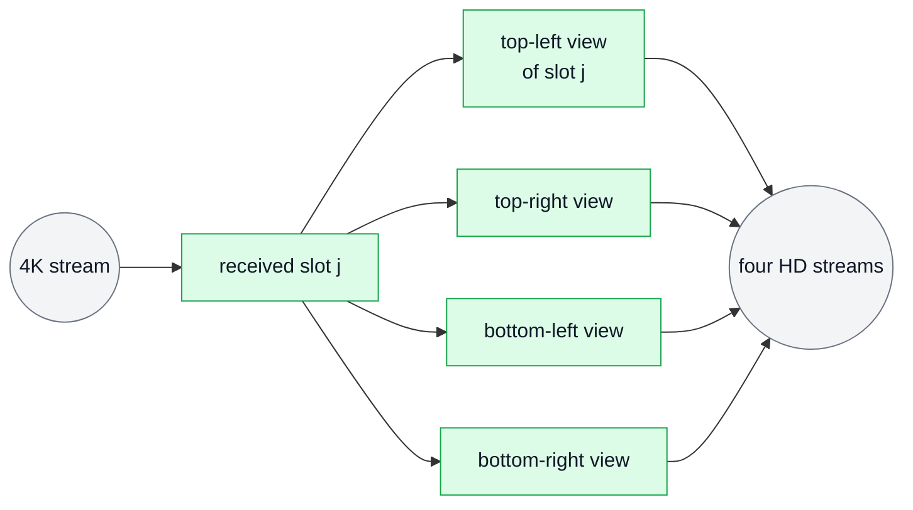

`mtl_session_get_pool_region(rx, &pool)` lends the receiver's library pool; each HD sender attaches
over it (`a.region`, `a.pitch = info.pool_slot_pitch`, `a.offset` = its quadrant, `a.stride[0]` =
the 4K stride), so TX slot j lies over RX slot j. `mtl_tx_send_slot(tx[q], in.slot, &tmpl, 0)`
with `tmpl.hold = in.lease` holds the received frame until that send has left, so a library pool needs
no results to stay safe; the RX slot is free once it is released and every hold has completed
([contract.md §9.6](contract.md#96-holds-and-forwarding)). Nothing is copied and nothing is freed
early. A quadrant still in flight (`-MTL_EAGAIN`) is skipped; any other send error ends the loop.
An input without a TAI time cannot be retimed, so it is released unsent.
A merger (four HD streams into one 4K) runs the other way and copies: each received HD frame
goes into its quadrant of one acquired 4K unit, row by row with the 4K stride
(`mtl_unit_copy_plane_in`, `mtl_util.h`), and the 4K unit is submitted with the media time the four
share.

```c
/* ex12 — zero-copy 1 -> 4 forwarder: each 2160p frame received feeds four 1080p senders,
   one per quadrant. Every TX pool lies over the RX pool (any stride >= row_bytes is
   direct), and each TX unit holds the RX unit it reads until its own result. Needs:
   MS2b. */
#include <mtl/experimental/mtl_util.h>

#include "ex_common.h"

#define QUADS 4

/* rx: a created 2160p RX session (library pool). tx[q]: created 1080p TX sessions with
   MTL_SESSION_POOL_ATTACHED, media_mode TAI and min_tx_delay_ns = the input's delay plus
   a margin (ex23 shows how to derive it). */
static int attach_quadrants(mtl_session_h rx, const mtl_session_h* tx) {
  struct mtl_session_info ri;
  struct mtl_unit slot0;
  mtl_region_h pool;
  MTL_INIT(&slot0);
  int ret = mtl_session_get_info(rx, &ri, sizeof(ri));
  if (ret >= 0) ret = mtl_session_get_slot(rx, 0, &slot0);
  if (ret >= 0) ret = mtl_session_get_pool_region(rx, &pool);
  const uint32_t stride = slot0.plane[0].stride, half_row = slot0.plane[0].row_bytes / 2;
  for (uint32_t q = 0; ret >= 0 && q < QUADS; q++) {
    /* q: 0 top-left, 1 top-right, 2 bottom-left, 3 bottom-right */
    uint64_t top = (uint64_t)(q / 2) * (slot0.plane[0].rows / 2);
    uint64_t left_bytes = (q % 2) * half_row;
    struct mtl_attach a;
    MTL_INIT(&a);
    a.region = pool; /* library memory: holds, not results, keep it safe */
    a.count = ri.pool_count;
    a.pitch = ri.pool_slot_pitch; /* TX slot j lies over RX slot j */
    a.offset = top * stride + left_bytes;
    a.stride[0] = stride;
    ret = mtl_session_attach(tx[q], &a);
  }
  return ret;
}

int split_forward(mtl_session_h rx, mtl_session_h* tx) {
  struct mtl_unit in, tmpl;
  MTL_INIT(&in);
  MTL_INIT(&tmpl);
  int ret = attach_quadrants(rx, tx);
  for (uint32_t q = 0; ret >= 0 && q < QUADS; q++)
    ret = mtl_session_start(&tx[q], 1, NULL, NULL); /* one each: start arrays are MS6 */
  if (ret >= 0) ret = mtl_session_start(&rx, 1, NULL, NULL);

  while (ret >= 0 && (ret = mtl_rx_dequeue(rx, &in, MTL_FOREVER)) == 0) {
    if (!(in.flags & MTL_UNITF_TAI_VALID)) { /* no TAI time: it cannot be retimed */
      ret = mtl_rx_release(rx, in.lease);
      continue;
    }
    tmpl.media_tai_ns = in.media_tai_ns; /* derived RTP = input RTP if it was compliant */
    tmpl.hold = in.lease; /* the RX slot stays until each TX unit is sent */
    for (uint32_t q = 0; ret >= 0 && q < QUADS; q++) {
      int r = mtl_tx_send_slot(tx[q], in.slot, &tmpl, 0);
      if (r < 0 && r != -MTL_EAGAIN) ret = r; /* -MTL_EAGAIN: still in flight, drop it */
    }
    int r = mtl_rx_release(rx, in.lease); /* the slot is free once every hold completed */
    if (ret >= 0) ret = r;
  }

  if (ret != -MTL_ECANCELED) ex_fail("forward", ret);
  mtl_session_stop(&rx, 1, MTL_STOP_FLUSH, 0);
  mtl_session_stop(tx, QUADS, MTL_STOP_DRAIN, MTL_MS(100)); /* holds end with the sends */
  return ret == -MTL_ECANCELED ? 0 : ret;
}
```

## 15. Audio as host PCM

[ex13_audio.c](sketch/examples/ex13_audio.c) (MS4; audio MS4a1, `media_index` from MS3) moves
audio the way an AES67 or ST 2110-30 bridge, a sound card or a framework's audio element needs it:
as samples in the host's byte order, with the index of the first one. The picture is one received
unit.

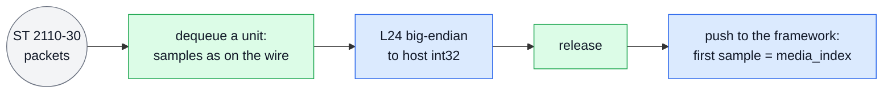

Plane 0 has one row per sample time (`row_bytes` = channels × bytes per sample), the channels
interleaved and each sample big-endian, as on the wire; MTL never swaps them. `u.used` counts the
bytes, so the unit holds `u.used / row_bytes` sample times (`sc.audio.unit_samples` at most).
`u.media_index`, valid with `MTL_UNITF_INDEX_VALID`, is the unit's first sample on the epoch at
the sample rate, so the next unit starts at `media_index` + those sample times. A jump in it is
lost time: `u.missed_before` counts the units a full pool could not take, and packets lost inside
a unit read as zero, silence, with `u.status == MTL_RX_INCOMPLETE`. The samples are converted out
(`mtl_pcm24_to_s32`, `mtl_util.h`, a row at a time) before the release, so the lease goes back at
once.

On TX the host samples are swapped into wire order (`mtl_s32_to_pcm24`) and handed to the copy
path, `mtl_tx_write`, which splits any number of bytes into units, submits them all and keeps the
samples contiguous: in media mode AUTO each unit starts at the sample after the last one. From MS6 a live source sets media mode TAI
and the first sample's capture instant, and MTL absorbs up to a packet of jitter
(`audio.absorb_samples`, [timing.md §8](timing.md#8-audio)). A monitor that shows meters under a
picture finds the sample at which a video frame starts with `mtl_rx_align` (`mtl_sync.h`), from
the two media indices and the exact rates, never from floored times
([timing.md §11.6](timing.md#116-av-alignment-on-receive)). Fast metadata (ST 2110-41, essence
`MTL_FASTMETA` and `fastmeta.data_item_type`) takes the same copy path: one data item group per write, `used`
0 the keep-alive, and like ANC it follows the video of its start.

```c
/* ex13 — audio as host PCM, both ways: the wire's sample layout and byte order, the index
   of the first sample, and the copy path. Sessions: MTL_AUDIO with MTL_PCM24. Needs:
   MS4. */
#include <mtl/experimental/mtl_util.h>

#include "ex_common.h"

/* The framework's push: frames of interleaved int32 samples; first = the epoch index of
   the first sample (-1 = unknown); discont = 1 after lost time (GStreamer DISCONT). */
int push_pcm(const int32_t* pcm, uint32_t frames, int64_t first, int discont);

/* pcm: room for info.unit_samples sample frames of every channel. */
int rx_audio(mtl_session_h s, int32_t* pcm) {
  struct mtl_unit u;
  int64_t next = -1; /* the sample expected next */
  int ret;
  MTL_INIT(&u);
  while ((ret = mtl_rx_dequeue(s, &u, MTL_FOREVER)) == 0) {
    const struct mtl_plane* p = &u.plane[0]; /* a row per sample frame */
    uint32_t channels = p->row_bytes / 3, frames = u.used / p->row_bytes;
    for (uint32_t f = 0; f < frames; f++)
      mtl_pcm24_to_s32(pcm + (size_t)f * channels,
                       (const uint8_t*)p->addr + (size_t)f * p->stride, channels);
    int64_t first = (u.flags & MTL_UNITF_INDEX_VALID) ? u.media_index : -1;
    int discont = u.missed_before > 0 || (u.flags & MTL_UNITF_DISCONTINUITY) ||
                  (first >= 0 && next >= 0 && first != next);
    next = first >= 0 ? first + frames : -1;
    ret = mtl_rx_release(s, u.lease); /* copied: release before the push */
    if (ret >= 0) ret = push_pcm(pcm, frames, first, discont);
    if (ret < 0) break;
  }
  return ret == -MTL_ECANCELED ? 0 : ex_fail("audio rx", ret);
}

/* Host samples (a sound card's int32) to L24 in wire, then written: in media mode AUTO,
   MTL stamps each unit at the sample after the last. wire: room for samples x 3 bytes.
   Fast metadata (ST 2110-41: essence MTL_FASTMETA, fastmeta.data_item_type) takes the
   same copy path, one data item group per write. */
int tx_audio(mtl_session_h s, const int32_t* pcm, uint32_t samples, uint8_t* wire) {
  mtl_s32_to_pcm24(wire, pcm, samples);
  int n = mtl_tx_write(s, wire, (size_t)samples * 3, NULL, MTL_FOREVER);
  return n < 0 ? n : 0; /* fewer bytes only after an error, which the next call returns */
}

/* A monitor's meter under a picture: the sample of `audio` at which video unit `video`
   starts, from the two media indices and the exact rates, never from floored times.
   raster: the video session's. 0 = found (*offset), 1 = in a later audio unit, < 0 an
   error (-MTL_ERANGE: the picture starts before this audio unit). */
int audio_under_picture(const struct mtl_unit* video, const struct mtl_raster* raster,
                        const struct mtl_unit* audio, uint32_t sample_rate,
                        uint32_t* offset) {
  int64_t off;
  int ret = mtl_rx_align(video, raster, audio, sample_rate, &off);
  if (ret < 0) return ret;
  if (off >= (int64_t)(audio->used / audio->plane[0].row_bytes)) return 1;
  *offset = (uint32_t)off;
  return 0;
}
```

## 16. ANC both ways

[ex14_anc.c](sketch/examples/ex14_anc.c) (MS4a2) sends and receives ANC. An ANC unit is the ANC
packets of one frame or field: the packet table in plane 0, one `struct mtl_anc_packet` per entry,
and the words in plane 1; `used` counts the entries. The picture shows where the entries of a TX
unit come from and where a received unit's go.

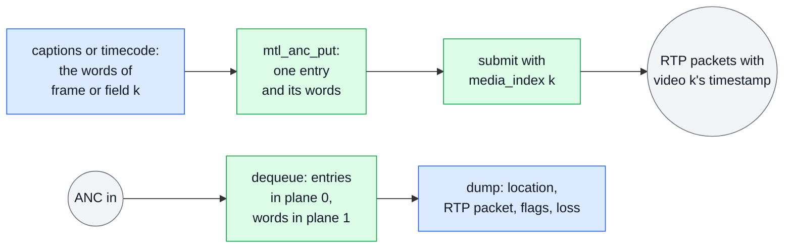

With the default 8-bit words MTL writes the parity, Data_Count and checksum; with
`MTL_ANC_WORDS_RAW` a relay carries every word as received. MTL packs the entries into RTP packets
of at most 1432 bytes and 255 ANC packets, a new one where an entry carries `MTL_ANCF_NEW_RTP`,
which RX sets on the first entry of each packet it received. A unit follows its video by index:
unit k carries video frame k's RTP timestamp and leaves in the window of the frame in which video
k leaves. On an interlaced session a unit is a field (index 2n and 2n + 1), and a line of the other
field is refused unless the entry says `MTL_ANCF_AS_IS`. A unit with no entries sends the empty
packet that keeps the stream alive, and so does a frame with no unit. `send_anc` is the one TX path of
captions and timecode. The monitor (`dump_anc`) reads the same table on RX and prints each entry with its location, its RTP packet and its flags; an entry after lost or
skipped packets carries `MTL_ANCF_GAP_BEFORE`. An application that builds ANC RTP packets itself
(packet units, ex09) uses the codec the library uses: `mtl_anc_rfc8331_decode` turns the ANC data
of one RTP packet into entries and words, and `mtl_anc_rfc8331_encode` turns them back. Relays that
keep the sender's boundaries copy entries frame by frame: ex23's `pass_anc`.

```c
/* ex14 — ANC both ways: an ANC unit is the ANC packets of one frame or field (the table
   in plane 0, the words in plane 1), sent with its video's RTP timestamp. Here: captions,
   timecode in both fields, a monitor, and the RFC 8331 codec. Needs: MS4. */
#include <inttypes.h>
#include <mtl/experimental/mtl_observe.h>
#include <mtl/experimental/mtl_packet.h>
#include <mtl/experimental/mtl_util.h>

#include "ex_common.h"

#define DID_CDP 0x61           /* with SDID 01h: CEA-708 captions (ST 334-1) */
#define DID_ATC 0x60           /* with SDID 60h: ST 12-2 ancillary time code */
#define ANC_LINE 9             /* the line of the captions and of field 1's time code */
#define F2_LINE(l) ((l) + 562) /* 1080i: field 2 begins at line 564 */
uint8_t cdp_for_frame(int64_t frame, uint8_t cdp[255]); /* a CEA-708 CDP: its length */
void atc_vitc_words(int64_t field, uint8_t udw[16]);    /* ST 12-2 ATC_VITC of a field */

/* One ANC packet on `line` (no horizontal position) as unit `index` (INDEX mode). MTL
   writes the parity, Data_Count and checksum of the 8-bit words, and the RTP packets. */
static int send_anc(mtl_session_h s, int64_t index, uint8_t did, uint8_t sdid,
                    uint16_t line, const uint8_t* words, uint8_t n) {
  struct mtl_anc_packet p; /* a table entry: no size header, so memset, not MTL_INIT */
  struct mtl_unit u;
  memset(&p, 0, sizeof(p));
  MTL_INIT(&u);
  p.did = did;
  p.sdid = sdid;
  p.line = line;
  p.hoffset = MTL_ANC_HOFFSET_ANY;
  p.udw_count = n;
  int ret = mtl_tx_acquire(s, &u, MTL_FOREVER); /* results off */
  if (ret < 0) return ret;
  ret = mtl_anc_put(&u, &p, words, n, NULL);
  if (ret < 0) {
    mtl_tx_release(s, u.lease);
    return ex_fail("anc", ret);
  }
  u.media_index = index;
  return mtl_tx_submit(s, &u);
}

/* Captions: a CDP per frame. A frame without one still sends the empty packet that
   keeps the stream alive. */
int insert_captions(mtl_session_h s, int64_t frame) {
  uint8_t cdp[255];
  uint8_t n = cdp_for_frame(frame, cdp);
  return send_anc(s, frame, DID_CDP, 0x01, ANC_LINE, cdp, n);
}

/* Timecode in every field of 1080i29.97: on an interlaced session a unit is a field,
   index 2n the first (lines 1-563), 2n + 1 the second (564-1125). */
int send_timecode(mtl_session_h s, int64_t field) {
  uint8_t udw[16];
  uint16_t line = (field & 1) ? F2_LINE(ANC_LINE) : ANC_LINE;
  atc_vitc_words(field, udw);
  return send_anc(s, field, DID_ATC, 0x60, line, udw, 16);
}

/* A monitor: every ANC packet of a received unit, its RTP packet and what was lost. */
int dump_anc(mtl_session_h rx) {
  struct mtl_unit u;
  struct mtl_rx_detail d;
  MTL_INIT(&u);
  int ret = mtl_rx_dequeue(rx, &u, MTL_FOREVER);
  if (ret < 0) return ret;
  const struct mtl_anc_packet* t = mtl_anc_table(&u);
  printf("index %" PRId64 " %s%s\n", u.media_index,
         (u.flags & MTL_UNITF_SECOND_FIELD) ? "field 2" : "field 1 or frame",
         u.status == MTL_RX_INCOMPLETE ? ", incomplete" : "");
  for (uint32_t i = 0; i < u.used; i++)
    printf("  rtp %u did %02x sdid %02x line %u words %u%s%s\n", t[i].rtp_index, t[i].did,
           t[i].sdid, t[i].line, t[i].udw_count,
           t[i].flags & MTL_ANCF_NEW_RTP ? " new-rtp" : "",
           t[i].flags & MTL_ANCF_GAP_BEFORE ? " gap-before" : "");
  if (u.status == MTL_RX_INCOMPLETE && mtl_rx_get_detail(rx, u.lease, &d, sizeof(d)) >= 0)
    printf("  corrupt %" PRIu32 ", beyond capacity %" PRIu32 "\n", d.anc_skipped,
           d.anc_truncated);
  return mtl_rx_release(rx, u.lease);
}

/* The codec, for ANC in the application's own RTP packets (packet units): an RTP packet's
   ANC data without its SCTE-104 messages (DID 41h, SDID 07h). The caller writes the new
   Length (*out_len) and ANC_Count (*count) into the RFC 8331 header. */
int strip_scte104(const uint8_t* in, uint32_t len, uint32_t* count, uint8_t* out,
                  uint32_t cap, uint32_t* out_len) {
  struct mtl_anc_packet t[32];
  uint8_t words[32 * 255];
  struct mtl_anc_decode_info info;
  uint32_t n = 0;
  int ret =
      mtl_anc_rfc8331_decode(/* in */ in, len, *count, /* mode */ MTL_ANC_WORDS_8BIT, 0,
                             /* out */ t, 32, words, sizeof(words), NULL, &info);
  for (uint32_t i = 0; ret == 0 && i < info.pkts; i++)
    if (t[i].did != 0x41 || t[i].sdid != 0x07) t[n++] = t[i];
  *count = n;
  return ret < 0
             ? ret
             : mtl_anc_rfc8331_encode(/* in */ t, n, MTL_ANC_WORDS_8BIT, words,
                                      info.udw_words, NULL, /* out */ out, cap, out_len);
}
```

## 17. Compressed video (ST 2110-22)

[ex15_cvideo.c](sketch/examples/ex15_cvideo.c) (MS4b) sends and receives JPEG XS. A unit is one
codestream per frame (per field when interlaced), and `used` counts its bytes.

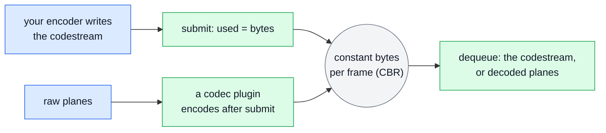

ST 2110-22 sends the same number of bytes every frame (`MTL_CVIDEO_CBR`, the default):
`cvideo.codestream_bytes` is the ceiling, the box header MTL prepends included, a shorter
codestream is padded, and a longer one fails at submit (`-MTL_ENOSPC`, `CODESTREAM_OVERSIZE`) with
the slot back in the pool. With `cvideo.app_format` 0 the application gives and takes the
codestream; with an application format the session takes and gives raw frames like a video one,
and a codec plugin loaded into the instance (`mtl_plugin_open`, the `.so` of the codec, or an
in-process device) encodes or decodes them off the pinned cores. A plugin cannot be unloaded while
a session uses it (`mtl_plugin_unload` is then `-MTL_EBUSY`).

```c
/* ex15 — compressed video (ST 2110-22): your encoder writes the slot, or a codec plugin
   does. A unit is one codestream per frame (per field when interlaced), and `used` counts
   its bytes. Needs: MS4. */
#include <mtl/experimental/mtl_format.h>
#include <mtl/experimental/mtl_plugin.h>

#include "ex_common.h"

size_t encode_frame(int64_t frame, void* dst, size_t cap); /* bytes, 0 = error */
void decode_frame(const void* codestream, size_t bytes, int complete);
void draw(struct mtl_unit* u);

/* 1080p59.94 JPEG XS at 6:1. ST 2110-22 sends the same bytes every frame (MTL_CVIDEO_CBR,
   the default): codestream_bytes is the ceiling, MTL prepends its box header and pads a
   shorter codestream, and a longer one fails at submit (-MTL_ENOSPC,
   CODESTREAM_OVERSIZE). app_format 0: the application gives or takes the codestream;
   MTL_APP_*: raw frames, and a plugin loaded into the instance does the codec off the
   pinned cores. */
static void jpegxs(struct mtl_session_config* sc, uint32_t dir, uint32_t app_format) {
  MTL_INIT(sc);
  sc->direction = dir;
  sc->essence = MTL_CVIDEO;
  mtl_flow_ipv4(&sc->flows[0], 239, 168, 85, 60, 20000);
  sc->cvideo.raster.width = 1920;
  sc->cvideo.raster.height = 1080;
  sc->cvideo.raster.fps = mtl_fps_rational(MTL_FPS_59_94);
  sc->cvideo.codec = MTL_CODEC_JPEGXS;
  sc->cvideo.codestream_bytes = 1920 * 1080 * 20 / 8 / 6; /* 4:2:2 10-bit at 6:1 */
  sc->cvideo.app_format = app_format;
}

/* 1. Your encoder writes into the slot. */
int open_encoded_tx(mtl_instance_h mt, mtl_session_h* s) {
  struct mtl_session_config sc;
  jpegxs(&sc, MTL_TX, 0);
  return mtl_session_open(mt, &sc, s);
}
int send_encoded(mtl_session_h s, int64_t frame) {
  struct mtl_unit u;
  MTL_INIT(&u);
  int ret = mtl_tx_acquire(s, &u, MTL_FOREVER); /* results off */
  if (ret < 0) return ret;
  /* cvideo: plane 0 is one row of codestream_bytes */
  u.used = (uint32_t)encode_frame(frame, u.plane[0].addr, u.plane[0].row_bytes);
  if (u.used == 0) {
    mtl_tx_release(s, u.lease);
    return -MTL_EINVAL;
  }
  return mtl_tx_submit(s, &u); /* the slot goes back on a failure, without a result */
}

/* 2. A plugin encodes: the session takes 4:2:2 10-bit planar frames, like a video one.
   The plugin stays loaded while a session uses it; unload it after the close. */
int open_plugin_tx(mtl_instance_h mt, const char* so, mtl_plugin_h* p, mtl_session_h* s) {
  struct mtl_session_config sc;
  jpegxs(&sc, MTL_TX, MTL_APP_YUV422P10LE);
  int ret = mtl_plugin_open(mt, so, NULL, p); /* the codec's .so, e.g. SVT JPEG XS */
  if (ret < 0) return ex_fail("plugin", ret);
  ret = mtl_session_open(mt, &sc, s);
  if (ret < 0) {
    ex_fail("plugin tx", ret);
    mtl_plugin_unload(*p);
  }
  return ret < 0 ? ret : 0;
}
int send_raw(mtl_session_h s) {
  struct mtl_unit u;
  MTL_INIT(&u);
  int ret = mtl_tx_acquire(s, &u, MTL_FOREVER); /* results off */
  if (ret < 0) return ret;
  draw(&u); /* the raw planes; the plugin encodes after submit */
  return mtl_tx_submit(s, &u);
}

/* 3. RX: the codestream as received; a frame with lost packets is MTL_RX_INCOMPLETE and
   its gaps read as zero, which a decoder may conceal. With app_format and a plugin,
   dequeue gives decoded frames instead. */
int receive_encoded(mtl_session_h s) {
  struct mtl_unit u;
  MTL_INIT(&u);
  int ret = mtl_rx_dequeue(s, &u, MTL_FOREVER);
  if (ret < 0) return ret;
  decode_frame(u.plane[0].addr, u.used, u.status == MTL_RX_COMPLETE);
  return mtl_rx_release(s, u.lease);
}
```

## 18. A service in a Kubernetes pod: signals, probes, bounded shutdown

[ex16_pod_service.c](sketch/examples/ex16_pod_service.c) (MS3: health, shutdown with a report) is a service in
a Kubernetes pod. The picture follows a SIGTERM from the kubelet to the termination log; the probes
run beside it.

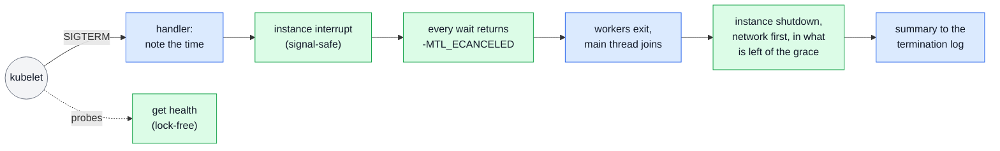

The signals are blocked before open and unblocked once the handler has the handle, so none is
lost; the library installs no handler of its own (R8). `mtl_instance_interrupt(mt, 1)` is
async-signal-safe and sticky: every data wait returns `-MTL_ECANCELED` until it is cleared, so a
worker cannot miss it between two waits. The budget counts from the signal: once the workers have
joined, the main thread calls
`mtl_instance_shutdown(mt, MTL_SHUTDOWN_ALL_REFERENCES, budget, &r, sizeof(r))` with the grace
period minus a margin. Network first, it finishes the unit on the wire, leaves the groups, stops
the devices and returns 0 (retired), 1 (quiesced: exit is safe) or `-MTL_EIO` (a port could not be
stopped: exit now); the report's summary goes to the termination message. A second signal calls
`mtl_instance_abort`, which cuts the shutdown short. The probes read the lock-free
`mtl_instance_get_health`: liveness fails only on what a restart can fix (`MTL_HEALTH_LIVENESS`),
readiness also on no link, no time lock and shutdown (`MTL_HEALTH_READINESS`); after the shutdown
began (`-MTL_ESHUTDOWN`) liveness stays 200 while readiness answers 503. The whole order is in
[deployment.md §4.2](deployment.md#42-shutdown), the probes in
[deployment.md §4.10](deployment.md#410-health-and-probes).

In a pod the node's PTP daemon disciplines the clock MTL reads, and tells MTL about the grandmaster
with `mtl_time_set_reference` (§27 shows the call). A pod without CPUs to pin opens the instance
with `MTL_INSTANCE_TASKLET_THREAD`.

```c
/* ex16 — a service in a Kubernetes pod: SIGTERM ends every wait, the instance shuts down
   network first within the grace period and leaves a report, and the probes read one
   lock-free call. Needs: MS3. */
#define _POSIX_C_SOURCE 200809L
#include <mtl/experimental/mtl_observe.h>
#include <signal.h>
#include <string.h>
#include <time.h>

#include "ex_common.h"

static mtl_instance_h g_mt; /* set before the signals are unblocked */
static volatile sig_atomic_t g_signals;
static struct timespec g_term; /* when the first signal came */

static void on_term(int sig) {
  (void)sig;
  if (g_signals) {
    mtl_instance_abort(g_mt); /* the second signal: stop at the next packet */
    return;
  }
  g_signals = 1;
  clock_gettime(CLOCK_MONOTONIC, &g_term); /* async-signal-safe */
  mtl_instance_interrupt(g_mt, 1);         /* every wait returns -MTL_ECANCELED, sticky */
}

/* Called first in main(), before open and before any thread: the signals stay blocked
   (pending, never lost, even as PID 1) until the handle exists. The library installs no
   handler (mtl.h R8). */
int block_signals(sigset_t* set) {
  sigemptyset(set);
  sigaddset(set, SIGTERM);
  sigaddset(set, SIGINT);
  return sigprocmask(SIG_BLOCK, set, NULL);
}
/* After open, on the main thread; workers created before keep the signals blocked. In a
   pod without CPUs to pin, open the instance with MTL_INSTANCE_TASKLET_THREAD. */
int install_handlers(mtl_instance_h mt, const sigset_t* set) {
  struct sigaction sa;
  g_mt = mt;
  memset(&sa, 0, sizeof(sa));
  sa.sa_handler = on_term;
  sa.sa_mask = *set;
  if (sigaction(SIGTERM, &sa, NULL) < 0 || sigaction(SIGINT, &sa, NULL) < 0) return -1;
  return sigprocmask(SIG_UNBLOCK, set, NULL);
}

/* A worker leaves on -MTL_ECANCELED: sticky, so it cannot miss the signal. */
int worker(mtl_session_h s) {
  struct mtl_unit u;
  int ret;
  MTL_INIT(&u);
  while ((ret = mtl_tx_acquire(s, &u, MTL_FOREVER)) == 0) /* results off */
    if ((ret = mtl_tx_submit(s, &u)) < 0) break;
  return ret == -MTL_ECANCELED ? 0 : ex_fail("worker", ret);
}

/* The HTTP probe handlers. Before open returns, answer 503 for all three. Startup and
   liveness fail only on what a restart can fix; readiness also on no link, no time and
   shutdown. After the shutdown began, liveness stays 200 until the process exits. */
enum probe { PROBE_STARTUP, PROBE_LIVENESS, PROBE_READINESS };
int probe_status(mtl_instance_h mt, enum probe p) {
  int flags = mtl_instance_get_health(mt, NULL, 0);
  if (flags == -MTL_ESHUTDOWN) return p == PROBE_READINESS ? 503 : 200;
  if (flags < 0) return 503;
  int bad = p == PROBE_READINESS ? MTL_HEALTH_READINESS : MTL_HEALTH_LIVENESS;
  return (flags & bad) ? 503 : 200;
}

#define EXIT_RESERVE MTL_SEC(2) /* our own exit, after MTL's shutdown */

static int64_t ts_ns(const struct timespec* t) {
  return (int64_t)t->tv_sec * MTL_SEC(1) + t->tv_nsec;
}

/* The main thread, after joining the workers. grace_ns: terminationGracePeriodSeconds
   minus any preStop time; the budget counts from the signal, not from now. */
int shutdown_all(mtl_instance_h mt, int64_t grace_ns) {
  struct mtl_shutdown_report r;
  struct timespec now;
  clock_gettime(CLOCK_MONOTONIC, &now);
  int64_t budget = grace_ns - EXIT_RESERVE - (ts_ns(&now) - ts_ns(&g_term));
  if (budget < MTL_MS(100)) budget = MTL_MS(100);
  memset(&r, 0, sizeof(r));
  /* this application owns main(): shut down for every component of the process */
  int ret = mtl_instance_shutdown(mt, MTL_SHUTDOWN_ALL_REFERENCES, budget, &r, sizeof(r));
  FILE* f = fopen("/dev/termination-log", "w"); /* the pod's terminationMessagePath */
  if (f) {
    fprintf(f, "%s\n", r.summary);
    fclose(f);
  }
  return ret < 0 ? ret : 0; /* 1: devices stopped; held memory goes at exit */
}
```

## 19. Telemetry: logs, stats, events

[ex17_telemetry.c](sketch/examples/ex17_telemetry.c) (MS3: events; the rest MS2) observes
a running instance: what an exporter or a console reads, on threads of its own, never a media
thread.

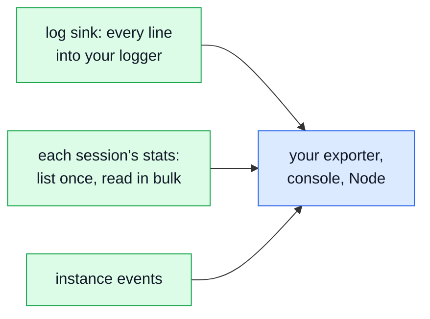

- **Logs.** `mtl_log_add_sink` sends every line, with its severity and origin, to the
  application's function, on the library's one log thread, one call at a time; lines a full ring
  dropped are counted in the next record. Added before the first open, it also gets EAL's lines.
- **Stats.** Every number is a named, cumulative `int64_t` in one registry (the keys:
  [contract.md §11.3](contract.md#113-key-catalogue)). `mtl_instance_list_sessions` lists the
  sessions, `mtl_stat_list` a session's schema with its generation, and `mtl_stat_read` all its
  values in one snapshot; a schema that grew fails the read with `-MTL_ESTALE`, and the reader
  lists again. The values are laid out in schema order, so the last descriptor ends the array. `mtl_stat_get` reads one value by name, for an alert rule. A histogram is
  `4 + MTL_HIST_BUCKETS` values: its count first.
- **Events.** `mtl_instance_read_events` with `MTL_FOREVER` waits for the instance's own events
  (ports, time, schedulers, health, MtlManager) until the interrupt; a session's are read with
  `mtl_session_read_events` (ex06). `MTL_EVENT_OVERFLOW` means some were lost: read the getters.
- **Capture.** `mtl_session_capture` writes a session's packets on every leg to a pcapng file;
  the test bench of §27 calls it.

```c
/* ex17 — observe a running instance: its log lines, every session's stats and its
   events, read on threads of its own. Needs: MS3. */
#include <mtl/experimental/mtl_events.h>
#include <mtl/experimental/mtl_observe.h>

#include "ex_common.h"

#define DESCS 256
#define VALUES 2048
#define MAX_SESSIONS 64
void app_log(uint32_t severity, const char* origin, const char* text, uint32_t dropped);
void prom(const char* session, const char* name, const char* label, int64_t value);
void export_event(const struct mtl_event* e);

/* On the library's one log thread, one line at a time; it may call MTL, but not open,
   close or shut down an instance. */
static void log_line(void* priv, const struct mtl_log_record* r, size_t r_size) {
  (void)priv;
  (void)r_size;
  app_log(r->severity, r->origin_name, r->text, r->dropped);
}
int route_logs(mtl_log_sink_h* sink) { /* before open: EAL's lines come too */
  struct mtl_log_sink_params p;
  MTL_INIT(&p);
  p.min_severity = MTL_SEV_INFO;
  p.fn = log_line;
  return mtl_log_add_sink(&p, sink); /* mtl_log_remove_sink() before priv is freed */
}

/* One scrape: the schema, then every value in one snapshot. A histogram exports its
   count (values[first]); its buckets follow. */
static int scrape_one(mtl_session_h s, const char* name) {
  static struct mtl_stat_desc d[DESCS];
  static int64_t v[VALUES];
  struct mtl_object o = MTL_OBJ_OF_SESSION(s);
  uint32_t n = 0;
  int ret;
  for (int tries = 0; tries < 3; tries++) {
    uint32_t count = 0;
    uint64_t gen = 0;
    ret = mtl_stat_list(o, d, sizeof(d[0]), DESCS, &n, &gen);
    if (ret < 0) return ret;
    if (n > DESCS) n = DESCS;
    /* values are laid out in schema order: the last descriptor ends the array */
    if (n) count = d[n - 1].first + d[n - 1].width;
    if (count > VALUES) return -MTL_ENOSPC;
    ret = mtl_stat_read(o, gen, 0, count, v, NULL);
    if (ret != -MTL_ESTALE) break; /* the schema grew (a leg, a reason seen first) */
  }
  for (uint32_t i = 0; ret >= 0 && i < n; i++)
    prom(name, d[i].name, d[i].label, v[d[i].first]);
  return ret < 0 ? ret : 0;
}
int scrape(mtl_instance_h mt) {
  mtl_session_h s[MAX_SESSIONS];
  struct mtl_session_info info;
  uint32_t n = 0;
  int ret = mtl_instance_list_sessions(mt, s, MAX_SESSIONS, &n); /* closing ones too */
  for (uint32_t i = 0; ret >= 0 && i < n && i < MAX_SESSIONS; i++) {
    if (mtl_session_get_info(s[i], &info, sizeof(info)) < 0)
      continue; /* closed meanwhile */
    ret = scrape_one(s[i], info.name);
  }
  return ret < 0 ? ex_fail("scrape", ret) : 0;
}

/* One value by name, for an alert rule. */
int frames_too_late(mtl_session_h s, int64_t* n) {
  return mtl_stat_get(MTL_OBJ_OF_SESSION(s), "tx.units_dropped{reason=too_late}", n);
}

/* The instance's own events (ports, time, schedulers, health, MtlManager), on a thread of
   its own; MTL_EVENT_OVERFLOW: some were lost, read the getters again. */
int watch(mtl_instance_h mt) {
  struct mtl_event ev[8];
  int n;
  while ((n = mtl_instance_read_events(mt, ev, 8, MTL_FOREVER)) > 0)
    for (int i = 0; i < n; i++) export_event(&ev[i]);
  return n == -MTL_ECANCELED || n == -MTL_ESHUTDOWN ? 0 : n;
}
```

## 20. An NMOS node: IS-04 interfaces, IS-05 activation

[ex18_nmos_node.c](sketch/examples/ex18_nmos_node.c) (MS5: the update with its planned and
applied instants and per-leg enable; mute and `MTL_UPDATE_REAPPLY` are Phase 7). One IS-05 PATCH is
one `mtl_session_update`: destinations and leg enables (`rtp_enabled`) switch together on every leg
at one instant, at a frame boundary on the wire. The picture is one activation, from the
controller's PATCH to `/active`.

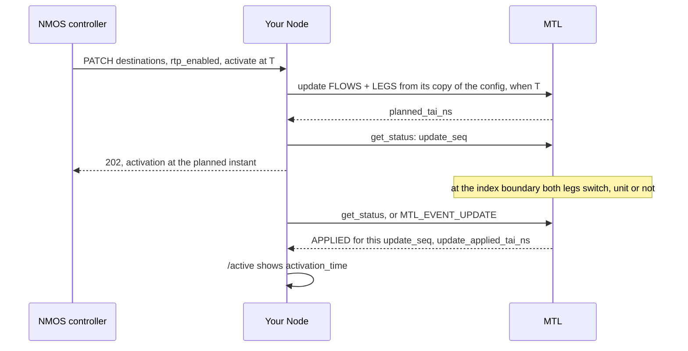

**IS-04.** `inventory` lists the instance's ports as granted (`mtl_port_get_spec`: name, MAC,
address, a DHCP lease included), which the Node publishes as its interfaces.

The update is all or nothing: if a leg cannot be prepared, the stream keeps its old configuration.
The switch is by the clock, so it happens whether media flows or not, and an idle sender activates
too. The Node keeps its own copy of the session's configuration and copies into it only what IS-05
changed (`ip`, `source_filter`, `udp_port`); the update reads only the members its `parts` name, so
the session's SSRC and payload type (`sc.ssrc`, `sc.payload_type`) and each leg's DSCP stay. The
call returns the instant it will switch on (the planned instant of the 202 response), or
`-MTL_EBUSY` while an earlier activation is pending; `status.update_*` and `MTL_EVENT_UPDATE` say
when it did (the applied instant, shown in `/active`). A status whose `update_seq` moved on, or
whose `update_state` is `MTL_UPDATE_STATE_FAILED`, means this activation did not apply. With
`master_enable` false the Node sets every leg in `legs_disabled`: the session is muted
(`MTL_STATUS_MUTED`) but stays RUNNING. Muting is Phase 7; until then `master_enable` false is a
stop. The update states are in [contract.md §4.7](contract.md#47-update); the contract
in [nmos-ipmx.md §11](nmos-ipmx.md#11-is-05-the-activation-contract).

```c
/* ex18 — an NMOS node: its IS-04 interfaces from the ports as granted, and one IS-05
   PATCH as one update: destinations and rtp_enabled per leg switch together at one
   instant, all or nothing. master_enable stays the Node's own state. Needs: MS5. */
#include <mtl/experimental/mtl_observe.h>
#include <string.h>

#include "ex_common.h"

void nmos_interface(uint32_t port, const char* name, const uint8_t mac[6],
                    const uint8_t ip[16]);

/* IS-04: the ports as granted (name, MAC, address, a DHCP lease included). */
int inventory(mtl_instance_h mt) {
  for (uint32_t p = 0;; p++) {
    struct mtl_port_spec spec;
    int ret = mtl_port_get_spec(mt, p, &spec, sizeof(spec));
    if (ret == -MTL_EINVAL) return 0; /* no port p: the end of the list */
    if (ret < 0) return ret;
    nmos_interface(p, spec.name, spec.mac, spec.sip);
  }
}

/* IS-05, the parameters:
   - sc: the Node's copy of the session's config (the update reads the members it names);
   - dest[i]: leg i's destination (ip, source_filter and udp_port are read), NULL keeps
   it;
   - legs_disabled: a bit per leg whose rtp_enabled is false;
   - when: the activation time, NULL for activate_immediate;
   - planned_tai_ns and seq: out, the activation_time and the update's number. */
int activate(mtl_session_h s, struct mtl_session_config* sc,
             const struct mtl_flow* const dest[MTL_MAX_LEGS], uint32_t legs_disabled,
             const struct mtl_when* when, int64_t* planned_tai_ns, uint64_t* seq) {
  struct mtl_session_status st;
  for (int i = 0; i < MTL_MAX_LEGS; i++) {
    if (!dest[i]) continue; /* copy only what IS-05 changed: dscp and ttl stay */
    memcpy(sc->flows[i].ip, dest[i]->ip, sizeof(dest[i]->ip));
    memcpy(sc->flows[i].source_filter, dest[i]->source_filter,
           sizeof(dest[i]->source_filter));
    sc->flows[i].udp_port = dest[i]->udp_port;
  }
  sc->legs_disabled = legs_disabled;
  /* -MTL_EBUSY while an earlier activation is pending: the Node answers 423 */
  int ret =
      mtl_session_update(s, sc, MTL_UPDATE_FLOWS | MTL_UPDATE_LEGS, when, planned_tai_ns);
  if (ret >= 0) ret = mtl_session_get_status(s, &st, sizeof(st));
  if (ret >= 0) *seq = st.update_seq; /* the Node serialises the updates of a session */
  return ret < 0 ? ex_fail("activate", ret) : 0;
}

/* 1: switched at *tai_ns (activation_time); 0: still pending; -MTL_EIO: failed
   (status.update_reason says why). */
int applied_at(mtl_session_h s, uint64_t seq, int64_t* tai_ns) {
  struct mtl_session_status st;
  int ret = mtl_session_get_status(s, &st, sizeof(st));
  if (ret < 0) return ret;
  if (st.update_seq != seq) return -MTL_EINVAL; /* not the last activation */
  if (st.update_state == MTL_UPDATE_STATE_FAILED) return -MTL_EIO;
  if (st.update_state != MTL_UPDATE_STATE_APPLIED) return 0;
  *tai_ns = st.update_applied_tai_ns;
  return 1;
}
```

## 21. A framework element's setup

[ex19_framework_setup.c](sketch/examples/ex19_framework_setup.c) (MS2; the shared instance MS2a)
is what a GStreamer element, an FFmpeg device or an OBS output does before media flows: the calls
of class init, of `set_property` (`remember_for_create`, then `apply_now` on a running session)
and `get_property`, of start, of caps negotiation and of the latency query.

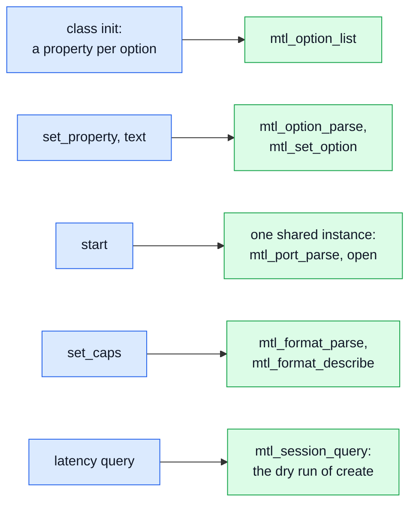

- **Properties.** Every tuning knob is an option with a name (`"rx.skew_budget_ns"`), a type, a
  range, a default and, for enums, its value names: `mtl_option_list` lists those the running
  library implements, so an element exposes all of them without code per knob.
  `mtl_option_parse` turns a property's text into an option (`"5ms"`, `"on"`, a key `/N` for the
  port, leg or scheduler N) and says which object it belongs to. It joins the array of the next
  create (`remember_for_create`); on a running session `mtl_set_option` (`apply_now`) changes it
  now when its key allows (R keys, at the next unit boundary), else `-MTL_EBUSY`
  (`OPTION_STATE`), which the element reports. `mtl_option_find` and `mtl_get_option`
  read the effective value, the derived default included.
- **One instance.** Every element of the process gets its own reference to one instance
  (`MTL_INSTANCE_SHARED`): the first open creates it, a later one joins it and names a subset of
  its ports or none; a different setting is `-MTL_EEXIST` (`INSTANCE_MISMATCH`). `mtl_port_parse`
  reads a property in the `MTL_PORTS` grammar. `mtl_library_version_num` against
  `MTL_API_VERSION` catches an older library at run time.
- **Caps.** `mtl_format_parse` maps a GStreamer, FFmpeg or SDP format name to an application or a
  transport format, and `mtl_format_describe` gives the frame size the framework's buffers must
  have. An application format makes MTL convert in the caller.
- **Latency.** `mtl_session_query` is the dry run of create: it grants and reports what create
  would, `latency_min_ns` and `latency_max_ns` included, before the session exists. A sink adds
  the copy inside its own submit (`convert_ns`, measured once the session exists; ex21).

```c
/* ex19 — a framework element's setup, before media flows: options as properties, one
   shared instance, caps as formats, and the latency before the session exists. Needs:
   MS2. */
#include <mtl/experimental/mtl_format.h>
#include <mtl/experimental/mtl_options.h>

#include "ex_common.h"

#define KEYS 512
void install_property(const struct mtl_option_desc* d); /* GObject, AVOption */

/* class_init: a property per session key: type, range, default, enum names. */
int install_properties(void) {
  static struct mtl_option_desc d[KEYS];
  uint32_t n = 0;
  int ret = mtl_option_list(d, sizeof(d[0]), KEYS, &n);
  for (uint32_t i = 0; ret >= 0 && i < n && i < KEYS; i++)
    if (d[i].object_kind == MTL_OBJ_SESSION) install_property(&d[i]);
  return ret < 0 ? ret : 0;
}

/* set_property("rx.skew_budget_ns", "5ms"), "tx.index_offset" = "-2" (a lip-sync trim),
   "port.dhcp/1" = "on": parsed now and kept for the next create (a string value points
   into `value`); instance and port keys go to mtl_instance_params.options. Returns the
   key's object kind. */
int remember_for_create(const char* name, const char* value, struct mtl_option* opts,
                        uint32_t* n) {
  int kind = mtl_option_parse(name, value, &opts[*n]); /* -MTL_EINVAL names the key */
  if (kind >= 0) (*n)++;
  return kind;
}
/* A session key on a running session: keys marked R change at once, the others are
   -MTL_EBUSY (OPTION_STATE) until the next create. */
int apply_now(mtl_session_h s, const struct mtl_option* o) {
  return mtl_set_option(MTL_OBJ_OF_SESSION(s), o);
}
/* get_property: the effective value, the derived default included. */
int get_property(mtl_session_h s, const char* name, int64_t* value) {
  struct mtl_option_desc d;
  int ret = mtl_option_find(name, &d, sizeof(d));
  return ret < 0 ? ret : mtl_get_option(MTL_OBJ_OF_SESSION(s), d.key, 0, value, NULL, 0);
}

/* start: every element of the process joins one instance (the first open creates it). */
#define MAX_PORTS 4
int join_instance(const char* ports, mtl_instance_h* mt) {
  struct mtl_port_spec spec[MAX_PORTS];
  struct mtl_instance_params p;
  uint32_t n = 0;
  /* built against these headers, run on an older libmtl: refuse */
  if (mtl_library_version_num() < MTL_API_VERSION) return -MTL_ENOTSUP;
  int ret = mtl_port_parse(ports, spec, MAX_PORTS, &n);
  if (ret < 0) return ret;
  MTL_INIT(&p);
  p.ports = spec;
  p.port_count = n < MAX_PORTS ? n : MAX_PORTS; /* n counts every port, also those cut */
  p.flags = MTL_INSTANCE_SHARED;
  ret = mtl_instance_open(&p, mt); /* -MTL_EEXIST: the process opened it otherwise */
  return ret < 0 ? ex_fail("instance", ret) : 0;
}

/* set_caps: "v210", "yuv422p10le" or "YCbCr-4:2:2/10" to the config, and the size of a
   frame the framework's buffers must hold. */
int caps_to_config(const char* format, uint32_t w, uint32_t h,
                   struct mtl_session_config* sc, uint64_t* frame_bytes) {
  struct mtl_format_desc d;
  uint32_t f = 0, kind = 0;
  int ret = mtl_format_parse(format, &f, &kind);
  if (ret >= 0) ret = mtl_format_describe(f, kind, w, h, &d, sizeof(d));
  if (ret < 0) return ret;
  /* an application format: MTL converts in dequeue or submit (rx.convert_per_packet:
     per packet, on the RX tasklet) */
  if (kind == MTL_FORMAT_APP)
    sc->video.app_format = f;
  else if (kind == MTL_FORMAT_TRANSPORT)
    sc->video.format = f;
  else
    return -MTL_EINVAL;
  sc->video.raster.width = w;
  sc->video.raster.height = h;
  *frame_bytes = 0; /* the planes of one frame */
  for (uint32_t i = 0; i < d.plane_count && i < MTL_MAX_PLANES; i++)
    *frame_bytes += d.plane_bytes[i];
  return 0;
}

/* GST_QUERY_LATENCY in READY: the dry run of create (also wire_bps, for admission); a
   sink adds the copy in its submit, info.convert_ns once the session exists. */
int query_latency(mtl_instance_h mt, const struct mtl_session_config* sc, int64_t* min_ns,
                  int64_t* max_ns) {
  struct mtl_session_info info;
  int ret = mtl_session_query(mt, sc, 0, &info, sizeof(info), NULL, 0);
  if (ret < 0) return ret;
  *min_ns = info.latency_min_ns;
  *max_ns = info.latency_max_ns;
  return 0;
}
```

## 22. Received frames lent to a framework

[ex20_rx_to_framework.c](sketch/examples/ex20_rx_to_framework.c): a received frame stays valid until
it is released, on whatever thread drops it. In the picture the streaming thread dequeues and wraps
the frame as a framework buffer, and any thread releases it, in any order, when downstream is done;
the dashed arrow is GStreamer's `unlock`.


GStreamer's `unlock` and `unlock_stop` run on another thread and are `mtl_session_interrupt(s, 1)`
and `(s, 0)`: the interrupted dequeue returns `-MTL_ECANCELED` at once, `create` returns FLUSHING
without waiting for `unlock_stop`, and the framework calls it again after `unlock_stop`; the
streaming thread never waits for it. `-MTL_ESHUTDOWN` means the element stopped or closed the
session. `mtl_session_close(s, 0)` returns 1 while downstream still holds frames, which is not a
failure; the session retires on the last release, and a later close returns 0. The source keeps R
slots for MTL, so that downstream never holds the whole pool: `mtl_rx_reserve(&info, NULL,
latency, copy_ns)` (`mtl_util.h`) gives R = ceil((L + c) / U) + 1 from the session's
`latency_min_ns`, `convert_ns` and unit period, the framework's latency and the source's copy time
([migration.md §12.8](migration.md#128-rx-sources-zero-copy-pool-size-and-latency)). Once
`pool_count` − R units are lent out, the next one is copied; a `pool_count` of R + H, H the units
held downstream at once, never copies.

```c
/* ex20 — received frames lent to a framework (GstBuffer, AVBufferRef) without a copy, and
   released on any thread. Needs: MS1. */
#include <mtl/experimental/mtl_util.h>
#include <stdlib.h>

#include "ex_common.h"

#define EX_FLUSHING 1 /* the framework's "flushing" return (GST_FLOW_FLUSHING) */

/* What one framework buffer keeps until its free callback runs: the handles by value,
   never a pointer into the element, since a sink, a queue or an appsink application may
   hold the buffer after the element is gone. */
struct rx_ref {
  mtl_session_h s;
  mtl_lease_h lease;
};
/* The framework's wrap: gst_buffer_new_wrapped_full(0, data, size + MTL_RX_TAIL_BYTES, 0,
   size, ref, cb) or av_buffer_create(data, size, cb, ref, 0) (cb takes a second argument
   there). Library slots are packed (FFmpeg av_image_fill_arrays with align 1) and end in
   MTL_RX_TAIL_BYTES zero bytes (AV_INPUT_BUFFER_PADDING_SIZE). Then its copy into a
   buffer of its own, and its count of wrapped buffers still out (an atomic the callback
   decrements). */
typedef void (*release_fn)(void* ref);
int wrap_as_framework_buffer(void* data, uint64_t size, release_fn cb, void* ref);
int copy_to_framework_buffer(const void* data, uint64_t size);
uint32_t framework_wrapped_out(void);

static void release_cb(void* p) { /* any thread, any order, also after close */
  struct rx_ref* ref = (struct rx_ref*)p;
  mtl_rx_release(ref->s, ref->lease); /* 0 also once the session or instance closed */
  free(ref);
}

/* At start and at each GST_EVENT_LATENCY: the slots to keep for MTL, the units not yet
   handed on. Once downstream holds the rest, the next unit is copied, so a slow consumer
   costs a copy, never a lost unit. latency_ns: the pipeline's configured latency;
   copy_ns: the measured copy of one unit (about 1 ms at 1080p). A pool_count below this +
   the units held downstream (a sink's last sample, an aggregator pad) makes the copy path
   run: log the pool_count it needs once. */
int rx_reserve(mtl_session_h s, int64_t latency_ns, int64_t copy_ns) {
  struct mtl_session_info info;
  int ret = mtl_session_get_info(s, &info, sizeof(info));
  return ret < 0 ? ret : mtl_rx_reserve(&info, NULL, latency_ns, copy_ns);
}

/* GstBaseSrc::create on the streaming thread: 0 = one buffer handed on; EX_FLUSHING after
   unlock() or a stop, without waiting for unlock_stop(): the framework calls create again
   once it has run; a negative code on an error. unit_bytes: mtl_session_info.unit_bytes
   (with detection, the sum of stride x rows over the unit's planes); reserve: the last
   rx_reserve(). */
int rx_create(mtl_session_h s, uint64_t unit_bytes, uint32_t pool_count,
              uint32_t reserve) {
  struct mtl_unit u;
  MTL_INIT(&u);
  int ret = mtl_rx_dequeue(s, &u, MTL_FOREVER);
  if (ret == -MTL_ECANCELED || ret == -MTL_ESHUTDOWN) return EX_FLUSHING;
  if (ret < 0) return ex_fail("dequeue", ret); /* -MTL_EIO: status.error_reason */
  if (framework_wrapped_out() + reserve >= pool_count) { /* copy into its own buffer */
    ret = copy_to_framework_buffer(u.plane[0].addr, unit_bytes);
    mtl_rx_release(s, u.lease);
    return ret < 0 ? -MTL_ENOMEM : 0;
  }
  struct rx_ref* ref = (struct rx_ref*)malloc(sizeof(*ref));
  if (ref) {
    ref->s = s; /* by value */
    ref->lease = u.lease;
    if (wrap_as_framework_buffer(u.plane[0].addr, unit_bytes, release_cb, ref) == 0)
      return 0;
    free(ref);
  }
  mtl_rx_release(s, u.lease);
  return -MTL_ENOMEM;
}

/* GstBaseSrc::unlock and ::unlock_stop, on the application thread that flushes:
   mtl_session_interrupt(s, 1) and (s, 0). */
int rx_unlock(mtl_session_h s) {
  return mtl_session_interrupt(s, 1); /* the dequeue in rx_create returns at once */
}
int rx_unlock_stop(mtl_session_h s) {
  return mtl_session_interrupt(s, 0);
}

/* GstBaseSrc::stop: never waits for downstream. Close returns MTL_RETIRING while buffers
   are still out, which is not a failure: the last release retires the session, with no
   further call. */
int rx_stop(mtl_session_h s) {
  int ret = mtl_session_close(s, 0);
  return ret < 0 ? ret : 0;
}
```

## 23. A live sink: presentation time to media time

[ex21_live_sink.c](sketch/examples/ex21_live_sink.c) (MS2; TAI mode and the copy MS1; discard
MS2) is the TX side of a framework (a GStreamer sink without basesink sync, `ffmpeg -re`, an OBS
output) or of a playout engine on a wall clock. Each buffer comes with a presentation time on
`CLOCK_MONOTONIC`; the picture follows one buffer from the framework to the wire and back to its
report.

```mermaid
flowchart LR
    B["framework buffer,<br/>pts on CLOCK_MONOTONIC"]:::app --> T["mtl_time_convert to TAI,<br/>+ the programme's<br/>latency and phase"]:::mtl
    T --> S["acquire, submit with<br/>MTL_SUBMIT_SRC_PLANES:<br/>the planes are copied"]:::mtl
    S --> W(("sent at the frame time<br/>of that media time")):::net
    S --> R["reap: the buffer's<br/>result, by cookie"]:::mtl
    R --> Q["QoS"]:::app
    classDef app fill:#dbeafe,stroke:#2563eb,color:#111827
    classDef mtl fill:#dcfce7,stroke:#16a34a,color:#111827
    classDef net fill:#f3f4f6,stroke:#6b7280,color:#111827
```

- **One latency and one phase per programme.** The sinks of a pipeline (its video, audio and ANC)
  share a `struct programme`. Each sink reports its minimum latency to the framework's latency
  query: `latency_min_ns` (how long before its frame time MTL takes a unit) plus `convert_ns` (the
  copy inside submit) plus a margin, from `mtl_session_get_info`, plus one frame for the phase,
  which adds less than one. The framework answers with one
  pipeline latency, at least the largest minimum (GStreamer's LATENCY event, FFmpeg's `-muxdelay`),
  and every sink adds that same latency and the same phase to each buffer's TAI. The phase, from
  `mtl_grid_offset` of the first buffer of any sink, puts the buffers on frame times, so units of
  one instant snap to the same index with an error of at most 1 ns
  ([timing.md §10.5](timing.md#105-recipes)). A sink alone could declare its latency as
  `sc.media_time_offset_ns`, which MTL adds the same way before snapping; sinks that each declared
  their own would drift apart by the difference.
- **The presentation time is the latency-free one**: GStreamer's base_time + running time, FFmpeg's
  `start_time_realtime` + pts (on `CLOCK_REALTIME`: convert from `MTL_CLOCK_REALTIME`). A sink with basesink sync, which hands each buffer over its latency
  early and already includes it, adds no latency of its own.
- **The outcome of each buffer** comes back by its `cookie`: `ON_TIME`, or `DROPPED` with
  `SNAP_COLLISION` (two buffers on one frame time: the producer runs fast) or `TOO_LATE` (the
  latency did not cover it). The reap is ex06's (`mtl_tx_reap_each`), reported to the
  framework's QoS, with a margin only under `MTL_TXR_MARGIN_VALID`.
- `MTL_SUBMIT_SRC_PLANES` copies the framework's planes during submit, so the buffer is the
  framework's again when render returns, and the slot stays the back-pressure token.
- **EOS** is a DRAIN stop; a **seek** is a discard (the next submission is an implicit
  `MTL_SUBMIT_DISCONTINUITY`; an INDEX sink re-bases with `MTL_DISCARD_REBASE`). `unlock` is the
  interrupt; a sink whose reaper waits on another thread interrupts acquire alone
  (`mtl_interrupt` with `MTL_WAIT_ACQUIRE`). The GStreamer render-delay variant:
  [migration.md §12.1](migration.md#121-live-sinks-gstreamer-synctrue-ffmpeg--re-obs-output).

```c
/* ex21 — a live framework sink (GStreamer without basesink sync, ffmpeg -re, an OBS
   output): each buffer's presentation time becomes its TAI media time, and the sinks of a
   programme share one latency and one phase, so they stay on the same frame times.
   Needs: MS2. */
#include <mtl/experimental/mtl_sync.h>
#include <mtl/experimental/mtl_util.h>

#include "ex_common.h"

#define MARGIN MTL_MS(1) /* for the producer's jitter */

/* A buffer: planes in the framework's memory, its presentation time on CLOCK_MONOTONIC
   (GStreamer's system clock: base_time + running time) and its id. A framework on another
   clock passes that one to mtl_time_convert. */
struct fw_buffer {
  uint64_t id;
  int64_t pts_monotonic_ns;
  const void* plane[MTL_MAX_PLANES];
  uint32_t stride[MTL_MAX_PLANES];
};
/* The framework's QoS for one buffer: ON_TIME, or DROPPED with SNAP_COLLISION (two
   buffers for one frame time) or TOO_LATE (the latency did not cover the producer);
   margin_ns INT64_MIN when not valid. */
void fw_report(uint64_t id, uint32_t status, uint32_t reason, int64_t margin_ns);

/* One per pipeline or process; every sink adds both to its media times. latency_ns: the
   pipeline latency (GStreamer's LATENCY event), at least the largest minimum its sinks
   reported. phase_ns: set by the first sink to render; -1 before. */
struct programme {
  struct mtl_rational fps; /* the video's raster.fps */
  int64_t latency_ns;
  int64_t phase_ns;
};
struct live_sink {
  mtl_instance_h mt;
  mtl_session_h s;
  struct programme* prog;
};

/* set_caps: base has the flows, raster and formats of the caps. *min_ns: this sink's
   minimum latency, for the latency query. */
int sink_open(struct live_sink* k, const struct mtl_session_config* base,
              int64_t* min_ns) {
  struct mtl_session_config sc = *base;
  struct mtl_session_info info;
  sc.media_mode = MTL_MEDIA_TAI;   /* snapped to the nearest frame time */
  sc.flags |= MTL_SESSION_RESULTS; /* a result per buffer, by cookie */
  int ret = mtl_session_open(k->mt, &sc, &k->s);
  if (ret >= 0) ret = mtl_session_get_info(k->s, &info, sizeof(info));
  if (ret < 0) return ex_fail("sink", ret);
  *min_ns = info.latency_min_ns                     /* MTL's lead */
            + info.convert_ns                       /* the copy inside submit */
            + MARGIN                                /* the producer's jitter */
            + mtl_frame_ns(base->video.raster.fps); /* the phase: less than a frame */
  return 0;
}

/* Each buffer's report, by cookie (ex06's results). */
static void on_result(void* priv, const struct mtl_tx_result* r) {
  (void)priv;
  int64_t margin = (r->flags & MTL_TXR_MARGIN_VALID) ? r->margin_ns : INT64_MIN;
  fw_report(r->cookie, r->status, r->reason, margin);
}

/* render: 0 = handed over (its report follows); -MTL_ECANCELED after unlock. */
int sink_render(struct live_sink* k, const struct fw_buffer* buf) {
  struct programme* p = k->prog;
  struct mtl_unit u;
  int64_t tai = 0;
  int ret;
  MTL_INIT(&u);
  ret = mtl_tx_reap_each(k->s, on_result, NULL); /* then it never waits on results */
  if (ret >= 0) ret = mtl_tx_acquire(k->s, &u, MTL_FOREVER); /* a full pool waits */
  if (ret < 0) return ret;
  ret = mtl_time_convert(k->mt, buf->pts_monotonic_ns, MTL_CLOCK_MONOTONIC, MTL_CLOCK_TAI,
                         &tai);
  /* the first sink to render sets the phase (a plugin holds the programme's lock) */
  if (ret >= 0 && p->phase_ns < 0)
    ret = mtl_grid_offset(tai + p->latency_ns, p->fps, &p->phase_ns);
  if (ret < 0) {
    mtl_tx_release(k->s, u.lease);
    return ret;
  }
  u.media_tai_ns = tai + p->latency_ns + p->phase_ns;
  u.flags = MTL_SUBMIT_SRC_PLANES; /* submit copies the framework's planes */
  u.cookie = buf->id;
  for (uint32_t i = 0; i < u.plane_count; i++) {
    u.plane[i].addr = (void*)buf->plane[i];
    u.plane[i].stride = buf->stride[i];
  }
  return mtl_tx_submit(k->s, &u); /* on a failure the slot goes back, without a result */
}

/* EOS drains and reports every buffer; a seek (FLUSH_STOP) discards them: FLUSHED,
   DISCARD, and TAI needs no rebase. */
int sink_eos(struct live_sink* k, int seek) {
  int ret = seek ? mtl_session_discard(k->s, 0, 0)
                 : mtl_session_stop(&k->s, 1, MTL_STOP_DRAIN, MTL_SEC(2));
  int r = mtl_tx_reap_each(k->s, on_result, NULL);
  return ret < 0 ? ret : r;
}

/* unlock and unlock_stop, from another thread: an acquire in sink_render returns at once.
   A sink whose reaper waits on another thread interrupts acquire alone:
   mtl_interrupt(MTL_OBJ_OF_SESSION(s), MTL_INTR_ON, MTL_WAIT_ACQUIRE). */
int sink_unlock(struct live_sink* k, int on) {
  return mtl_session_interrupt(k->s, on);
}

/* stop: sends what is queued, then retires (MTL_RETIRING: it retires on its own). */
int sink_stop(struct live_sink* k) {
  return mtl_session_close(k->s, MTL_SEC(1)) < 0 ? -MTL_EIO : 0;
}
```

## 24. Video, audio and captions from one file

[ex22_av_playout.c](sketch/examples/ex22_av_playout.c) (MS6) plays video, audio and captions
from one file. The three TX sessions use `MTL_MEDIA_INDEX`, so each unit says which frame (video,
ANC) or first sample (audio) it is (`u.media_index`), and one start begins all three, as in the
picture.

```mermaid
flowchart LR
    F["file<br/>demuxer"]:::app --> V["video: frame k"]:::app
    F --> A["audio: sample n"]:::app
    F --> C["captions: frame k"]:::app
    V --> T["one start of three,<br/>MTL_WHEN_ORIGIN"]:::mtl
    A --> T
    C --> T
    T --> W(("exact RTP for all three;<br/>captions k = video k")):::net
    classDef app fill:#dbeafe,stroke:#2563eb,color:#111827
    classDef mtl fill:#dcfce7,stroke:#16a34a,color:#111827
    classDef net fill:#f3f4f6,stroke:#6b7280,color:#111827
```

`mtl_session_start(s, 3, &origin, NULL)` with `origin.flags = MTL_WHEN_ORIGIN` starts all three or
none and resolves T0 once on the common grid: media index 0 of each session is T0, so the file's
frame and sample counts are media indices as they are. MTL turns the indices into RTP timestamps
that agree exactly, and captions for frame k carry video frame k's timestamp. The ANC session takes
its raster and launch delay from the first video of its start, and a frame without captions still
gets the empty ANC packet. Audio uses the copy path, `mtl_tx_write`. `preroll_ns` puts T0 far
enough ahead that the first unit of each session is queued before it. Acquire waits with
`MTL_FOREVER` while a pool is full, so the file is read ahead of the wire, and the interrupt ends
the wait. `mtl_tx_write` submits every byte of an audio packet, each unit at the packet's first
sample plus the samples before it, so the audio never slides to a later sample. One video essence sent as several ST 2110-20 streams (RP 2110-23: UHD as four HD sub-images) is
the same pattern: one start array, and every sub-image of a source frame submitted with the same
`media_index`, so all the streams carry equal RTP timestamps
([timing.md §10.5](timing.md#105-recipes)). It is ex04's start with a pre-roll, for three sessions at once; separate processes, one per
essence, start the same programme with ex04's `start_at` instead (MS3), and live sinks keep it in
phase with ex21's shared phase. On an interlaced session the
video index counts fields, two per frame of the file. How a media index becomes an RTP timestamp and a launch time:
[concepts.md §7.1](concepts.md#71-two-times-not-one); the arithmetic:
[timing.md §10](timing.md#10-avanc-synchronisation).

```c
/* ex22 — video, audio and captions from one file, in sync by construction: three sessions
   started together with MTL_WHEN_ORIGIN, so the file's frame 0 and sample 0 are at the
   start's T0; each unit says which frame or sample it is, so every RTP timestamp is exact
   and ANC frame k carries video frame k's timestamp. Needs: MS6. */
#include <mtl/experimental/mtl_util.h>

#include "ex_common.h"

#define FILE_FPS MTL_FPS_59_94

enum { VIDEO, AUDIO, CAPTIONS };
/* the demuxer: video pts in frames, audio pts in samples, both from 0; 0 = a packet */
int demux_next(int* stream, int64_t* pts, const void** data, size_t* size);
void decode_into(struct mtl_unit* u, const void* data, size_t size);
/* appends the caption ANC packets of frame pts to u (mtl_anc_put, 8-bit words, in raster
   order): 0, or an MTL_E* code */
int captions_for(int64_t pts, struct mtl_unit* u);

/* One TX session of the file; port: the UDP port of its flow. */
static int open_tx(mtl_instance_h mt, uint32_t essence, uint16_t port, mtl_session_h* s) {
  struct mtl_session_config sc;
  MTL_INIT(&sc);
  sc.direction = MTL_TX;
  sc.essence = essence;
  mtl_flow_ipv4(&sc.flows[0], 239, 168, 85, 20, port);
  sc.media_mode = MTL_MEDIA_INDEX; /* unit.media_index = frame or first sample */
  if (essence == MTL_VIDEO) {
    sc.video.raster.width = 1920;
    sc.video.raster.height = 1080;
    sc.video.raster.fps = mtl_fps_rational(FILE_FPS);
    sc.video.format = MTL_YUV422_10;
  } else if (essence == MTL_AUDIO) {
    sc.audio.format = MTL_PCM24;
    sc.audio.sample_rate = 48000;
    sc.audio.channels = 2;
  } /* ANC: raster and launch delay come from the first video of its start */
  return mtl_session_create(mt, &sc, s);
}

/* Every frame gets an ANC unit, empty when it has no captions: it keeps the stream
   alive. The pool is the read-ahead: acquire waits while it is full. */
static int send_captions(mtl_session_h s, int64_t pts) {
  struct mtl_unit u;
  MTL_INIT(&u);
  int ret = mtl_tx_acquire(s, &u, MTL_FOREVER);
  if (ret < 0) return ret;
  ret = captions_for(pts, &u);
  if (ret < 0) {
    mtl_tx_release(s, u.lease);
    return ret;
  }
  u.media_index = pts;
  return mtl_tx_submit(s, &u);
}

static int send_video(mtl_session_h s, int64_t pts, const void* data, size_t size) {
  struct mtl_unit u;
  MTL_INIT(&u);
  int ret = mtl_tx_acquire(s, &u, MTL_FOREVER);
  if (ret < 0) return ret;
  decode_into(&u, data, size);
  u.media_index = pts;
  return mtl_tx_submit(s, &u);
}

/* The copy path: the sample count follows from the bytes, and every unit continues at
   the sample after the last, so the audio stays exact. */
static int send_audio(mtl_session_h s, int64_t first, const void* data, size_t size) {
  struct mtl_unit tmpl;
  MTL_INIT(&tmpl);
  tmpl.media_index = first;
  int n = mtl_tx_write(s, data, size, &tmpl, MTL_FOREVER);
  return n < 0 ? n : 0; /* fewer bytes only after an error, which the next call returns */
}

int av_anc_playout(mtl_instance_h mt) {
  mtl_session_h s[3] = {MTL_NULL(mtl_session_h), MTL_NULL(mtl_session_h),
                        MTL_NULL(mtl_session_h)};
  /* T0: the first feasible instant plus a preroll, so the first units of all three are
     submitted before it; media index 0 of all three is T0 */
  const struct mtl_when origin = {
      .kind = MTL_NOW, .flags = MTL_WHEN_ORIGIN, .preroll_ns = MTL_MS(100)};

  int ret = open_tx(mt, MTL_VIDEO, 20000, &s[VIDEO]);
  if (ret >= 0) ret = open_tx(mt, MTL_AUDIO, 30000, &s[AUDIO]);
  if (ret >= 0) ret = open_tx(mt, MTL_ANC, 40000, &s[CAPTIONS]);
  if (ret >= 0) ret = mtl_session_start(s, 3, &origin, NULL); /* all three or none */

  int st;
  int64_t pts;
  const void* data;
  size_t size;
  while (ret >= 0 && demux_next(&st, &pts, &data, &size) == 0) {
    if (st == AUDIO) {
      ret = send_audio(s[AUDIO], pts, data, size);
    } else {
      ret = send_captions(s[CAPTIONS], pts); /* ANC frame k before video frame k */
      if (ret >= 0) ret = send_video(s[VIDEO], pts, data, size);
    }
  }

  if (ret < 0 && ret != -MTL_ECANCELED) ex_fail("playout", ret);
  mtl_session_stop(s, 3, MTL_STOP_DRAIN, MTL_SEC(2)); /* all three finish together */
  for (int i = 0; i < 3; i++) mtl_session_close(s[i], 0);
  return ret == -MTL_ECANCELED ? 0 : ret;
}
```

## 25. A processor that keeps the input's timing

[ex23_processor.c](sketch/examples/ex23_processor.c) (MS6: audio in TAI mode; `process_video`:
MS4, `pass_anc`: MS4a2) keeps the input's timing: each output unit is submitted with the media time
of the input unit it came from, as in the picture. Its video stage is a UHD-to-HD down-converter,
`mtl_convert` with `MTL_CONVERT_HALF_SCALE` from the received unit's planes into the acquired
unit's, in the calling thread; a GPU or AI stage takes its place.

```mermaid
flowchart LR
    I(("input<br/>media time M")):::net --> D["dequeue"]:::mtl
    D --> P["process: here<br/>mtl_convert, half scale"]:::app
    P --> S["submit with<br/>the input's M"]:::mtl
    S --> O(("output at M + a fixed<br/>delay, the same RTP")):::net
    S --> R["reap: ex06's"]:::app
    classDef app fill:#dbeafe,stroke:#2563eb,color:#111827
    classDef mtl fill:#dcfce7,stroke:#16a34a,color:#111827
    classDef net fill:#f3f4f6,stroke:#6b7280,color:#111827
```

- **The output's budget** (`open_output`) is everything between the input's media time and the
  output's pick-up, one term per line in the code:
  - the input's delivery: `latency_min_ns` of the RX session, which counts from a sender that
    launches at its media time;
  - the input's own launch delay in whole frames: zero for a playout source, one for a camera or
    another processor; its SDP's TSDELAY less its TROFFSET, or measured as ex07 measures latency
    (the first packet's arrival minus the media time), rounded down to whole frames;
  - the processing (`process_ns`, measured);
  - the pick-up lead, which MTL reports as the stat `info.pickup_lead_ns` of the created output,
    so `open_output` creates it, reads the lead, sets the delay with `MTL_UPDATE_MEDIA` and
    starts; a failure on the way closes it.
- **A fixed delay.** With `MTL_MEDIA_TAI` and that `min_tx_delay_ns` the delay is fixed and, for a
  compliant input, every output RTP equals the input's. `tsmode` is SAMP when the input's SDP says
  SAMP, else PRES; an input off the frame grid is re-stamped to it, or keeps its phase with
  `MTL_SUBMIT_RTP_TS` and `out.rtp = in.rtp` (MS3).
- **A unit over budget** is `DROPPED` (`TOO_LATE`) and the next keeps its own frame time; the
  processor reads it with ex06's results, unchanged, through `mtl_tx_reap_each` at the end of every
  path, since unread results would block the output's acquire. An input unit without a TAI time
  (a `mediaclk:sender` input) cannot be retimed and is released; one that finds no output slot
  in time is counted as lost.
- **A received unit is a valid template** (`mtl_unit_from_template`): it carries the media time and
  the meta records (`MTL_META_USER`), and its RX-only flags are ignored. Audio passes through
  `mtl_tx_write` with the received unit as the template (`tmpl`). A TAI template writes one unit per
  call, so `pass_audio` continues at the input's media time plus the samples written × 1 s / the
  sample rate: exact, never the next feasible sample. ANC entries pass one by one: every
  entry RX delivers is a valid TX entry, the first of each RTP packet marked `MTL_ANCF_NEW_RTP`, so
  the sender's packet boundaries stay, in every word mode, the raw one included.
- The packet-level twin, which forwards bytes rather than content, is ex09's `forward_chunk`;
  zero-copy forwarding of unchanged frames is ex12.

```c
/* ex23 — a processor that keeps the input's timing: video, audio and ANC in, processed,
   out, each with the input's media time and a fixed delay. Needs: MS6. */
#include <mtl/experimental/mtl_format.h>
#include <mtl/experimental/mtl_observe.h>
#include <mtl/experimental/mtl_util.h>

#include "ex_common.h"

void count(const char* what, int64_t n);

/* The output of one input: TAI mode, min_tx_delay_ns = the pipeline budget (examples.md
   derives it), the pick-up lead read from MTL. input_launch_ns: the input's own launch
   delay, whole frames. tsmode: SAMP when the input's SDP says SAMP, else PRES. */
int open_output(mtl_instance_h mt, mtl_session_h rx, int64_t input_launch_ns,
                int64_t process_ns, struct mtl_session_config* sc, mtl_session_h* tx) {
  struct mtl_session_info info;
  int64_t lead = 0;
  int ret = mtl_session_get_info(rx, &info, sizeof(info));
  if (ret < 0) return ret;
  sc->media_mode = MTL_MEDIA_TAI;
  if (!sc->tsmode) sc->tsmode = MTL_TSMODE_PRES;
  sc->flags |= MTL_SESSION_RESULTS;
  ret = mtl_session_create(mt, sc, tx);
  if (ret < 0) return ex_fail("output", ret);
  ret = mtl_stat_get(MTL_OBJ_OF_SESSION(*tx), "info.pickup_lead_ns", &lead);
  sc->min_tx_delay_ns = info.latency_min_ns /* the input arrives this late */
                        + input_launch_ns   /* its sender's launch delay */
                        + process_ns        /* our work */
                        + lead;             /* MTL takes the unit this early */
  if (ret >= 0) ret = mtl_session_update(*tx, sc, MTL_UPDATE_MEDIA, NULL, NULL);
  if (ret >= 0) ret = mtl_session_start(tx, 1, NULL, NULL);
  if (ret < 0) {
    ex_fail("output", ret);
    mtl_session_close(*tx, 0); /* not left CREATED */
    *tx = MTL_NULL(mtl_session_h);
  }
  return ret < 0 ? ret : 0;
}

/* Each frame's outcome: ON_TIME with its margin, or DROPPED with TOO_LATE,
   SNAP_COLLISION, WAITING_NEIGHBOUR, LINK_DOWN or RECOVERY (ex06's results). */
static void on_result(void* priv, const struct mtl_tx_result* r) {
  (void)priv;
  if (r->status != MTL_TX_ON_TIME)
    count(mtl_reason_name(r->reason), 1);
  else if (r->flags & MTL_TXR_MARGIN_VALID)
    count("margin ns", r->margin_ns);
}

/* Video: here a UHD-to-HD down-converter (mtl_convert, half scale, in this thread: its
   time is in the budget); a GPU or AI stage takes its place. rx: 2160p, tx: 1080p. A
   unit with no output slot in time is lost; one over budget is DROPPED (TOO_LATE), never
   slid. */
int process_video(mtl_session_h rx, mtl_session_h tx) {
  struct mtl_unit in, out;
  struct mtl_convert_desc d;
  MTL_INIT(&in);
  MTL_INIT(&out);
  MTL_INIT(&d);
  int ret = mtl_rx_dequeue(rx, &in, MTL_FOREVER);
  if (ret < 0) return ret;
  if (!(in.flags & MTL_UNITF_TAI_VALID)) { /* a mediaclk:sender input: no TAI relation */
    mtl_rx_release(rx, in.lease);
    return -MTL_EINVAL;
  }
  ret = mtl_tx_acquire(tx, &out, MTL_MS(10));
  if (ret == 0) {
    d.width = 3840; /* the source's */
    d.height = 2160;
    d.src.format = d.dst.format = MTL_YUV422_10;
    d.src.kind = d.dst.kind = MTL_FORMAT_TRANSPORT;
    d.src.plane_count = in.plane_count;
    d.dst.plane_count = out.plane_count;
    memcpy(d.src.plane, in.plane, sizeof(d.src.plane));
    memcpy(d.dst.plane, out.plane, sizeof(d.dst.plane));
    d.flags = MTL_CONVERT_HALF_SCALE;
    ret = mtl_convert(&d);
    /* the input's media time and its meta records (MTL_META_USER, mtl_meta_find) */
    mtl_unit_from_template(&out, &in);
    if (ret == 0)
      ret = mtl_tx_submit(tx, &out);
    else
      mtl_tx_release(tx, out.lease);
  }
  mtl_rx_release(rx, in.lease);
  if (ret == -MTL_EAGAIN) count("output full: unit lost", 1);
  if (ret < 0 && ret != -MTL_EAGAIN) return ret;
  return mtl_tx_reap_each(tx, on_result, NULL); /* unread, results hold slots */
}

/* Audio: the copy path with the received unit as the template (its media time). A TAI
   template writes one unit per call, so the rest continues at the input's media time plus
   the samples written: exact, never the next feasible sample. rate: the sample rate. */
int pass_audio(mtl_session_h rx, mtl_session_h tx, uint32_t rate) {
  struct mtl_unit in, tmpl;
  MTL_INIT(&in);
  int ret = mtl_rx_dequeue(rx, &in, MTL_FOREVER);
  if (ret < 0) return ret;
  if (!(in.flags & MTL_UNITF_TAI_VALID)) { /* a mediaclk:sender input: no TAI relation */
    mtl_rx_release(rx, in.lease);
    return -MTL_EINVAL;
  }
  const uint8_t* pcm = (const uint8_t*)in.plane[0].addr;
  tmpl = in;
  for (uint32_t off = 0; ret >= 0 && off < in.used;) {
    int n = mtl_tx_write(tx, pcm + off, in.used - off, &tmpl, MTL_MS(10));
    if (n < 0) {
      ret = n == -MTL_EAGAIN ? mtl_tx_reap_each(tx, on_result, NULL) : n; /* pool full */
      continue;
    }
    off += (uint32_t)n;
    int64_t samples = off / in.plane[0].row_bytes;
    tmpl.media_tai_ns = in.media_tai_ns + samples * MTL_SEC(1) / rate;
  }
  mtl_rx_release(rx, in.lease);
  return ret < 0 ? ret : mtl_tx_reap_each(tx, on_result, NULL);
}

/* ANC: every received entry is a valid TX entry (RX marks the first entry of each RTP
   packet MTL_ANCF_NEW_RTP, so the boundaries stay as they arrived). Both sessions have
   the same word mode, MTL_ANC_WORDS_RAW included (a relay that changes no bit); with
   8-bit words RX has already skipped what the mode cannot carry. A relay that must not
   forward a damaged message (SCTE-104 split over RTP packets) skips the entries from one
   with MTL_ANCF_GAP_BEFORE on. */
int pass_anc(mtl_session_h rx, mtl_session_h tx) {
  struct mtl_unit in, out;
  MTL_INIT(&in);
  MTL_INIT(&out);
  int ret = mtl_rx_dequeue(rx, &in, MTL_FOREVER);
  if (ret < 0) return ret;
  ret = mtl_tx_acquire(tx, &out, MTL_MS(10));
  if (ret == 0) {
    const struct mtl_anc_packet* t = mtl_anc_table(&in);
    for (uint32_t i = 0; i < in.used && ret == 0; i++)
      ret = mtl_anc_put(&out, &t[i], mtl_anc_words(&in, &t[i]),
                        (size_t)t[i].udw_count * in.plane[1].stride,
                        mtl_anc_raw_hdr(&in, i));
    mtl_unit_from_template(&out, &in); /* the input's media time */
    if (ret == 0)
      ret = mtl_tx_submit(tx, &out);
    else
      mtl_tx_release(tx, out.lease);
  }
  mtl_rx_release(rx, in.lease);
  if (ret == -MTL_EAGAIN) count("output full: unit lost", 1);
  if (ret < 0 && ret != -MTL_EAGAIN) return ret;
  return mtl_tx_reap_each(tx, on_result, NULL);
}
```

## 26. From the legacy API

[ex24_from_legacy.c](sketch/examples/ex24_from_legacy.c) is a legacy program's first step to the
unified API: its `struct st20p_tx_ops`, the one it passes to `st20p_tx_create` today, becomes a
`struct mtl_session_config` field by field, its instance from `mtl_init` is wrapped by
`mtl_instance_from_legacy`, and ex01's loop runs unchanged on the wrapper, as the picture shows. A
newcomer skips it.

```mermaid
sequenceDiagram
    participant App
    participant L as legacy API
    participant U as unified API
    App->>App: st20p_tx_ops to a config (mtl_legacy.h)
    App->>L: mtl_init, ptp_get_time_fn on CLOCK_TAI
    App->>L: mtl_start
    App->>U: mtl_instance_from_legacy
    App->>U: mtl_session_open, then ex01's loop
    App->>U: mtl_session_close, mtl_instance_close
    App->>L: mtl_uninit
```

- **The field map.** Every legacy enum goes through its inline converter of `mtl_legacy.h`
  (`mtl_raster_from_legacy`, `mtl_video_format_from_legacy`, `mtl_app_format_from_legacy`,
  `mtl_packing_from_legacy`, `mtl_sender_type_from_legacy`), never by hand: a unified enum is legacy
  + 1 where 0 must mean "not set" and the legacy value where 0 is a real default, so a value copied
  by the wrong rule is still valid and changes the wire. For interlaced video legacy `fps` counts
  fields and `raster.fps` frames. The callbacks become results, the flags options and media modes:
  [migration.md §4](migration.md#4-field-maps) has every field, [§28](#28-an-st20p-program-side-by-side)
  the calls.
- **MS1 on a NIC.** Until MS2a `mtl_instance_open` opens `null:` and `kernel:` ports only; a VF is
  opened with `mtl_init` and wrapped. The `from_legacy` sample
  ([implementation-plan.md §4.2](implementation-plan.md#42-samples)) is this program. From MS2a,
  ex01 with `MTL_PORTS=0000:af:01.0=192.168.1.10/24` does the same without the legacy headers.
- **The clock.** The wrapper runs on the legacy clock of port P, whose default is `CLOCK_REALTIME`,
  UTC read as TAI (`MTL_TIMEF_UTC`), about 37 s off a PTP receiver. ex24 installs `ptp_get_time_fn`
  on `CLOCK_TAI`, as the FFmpeg plugin does; it runs on MTL's tasklets, the one exception to "no
  application code on the pinned cores", so it must not block. With it `mtl_time_now` is
  `-MTL_ENOTSUP` until MS2a ([contract.md §2.8](contract.md#28-legacy-bridge)).
- **The order.** `mtl_start` comes before the first unified start; at the end the wrapper closes
  first, then `mtl_uninit`, which returns `-EBUSY` while a wrapper is open. The program includes the
  legacy `mtl_api.h` and `st_pipeline_api.h` next to the unified headers
  ([migration.md §6.1](migration.md#61-both-header-sets-in-one-file)).

```c
/* ex24 — from the legacy API: a legacy program's st20p_tx_ops become a unified config,
   and its instance from mtl_init() is wrapped, so ex01's loop runs on it. The wrapper
   runs on the legacy clock, here CLOCK_TAI. Run: ex24 0000:af:01.0 192.168.1.10.
   Needs: MS1 and the legacy headers (mtl_api.h, st_pipeline_api.h). */
#define _POSIX_C_SOURCE 200809L
#include <arpa/inet.h>
#include <mtl/experimental/mtl_legacy.h>
#include <mtl_api.h>
#include <st_pipeline_api.h>
#include <time.h>

#include "ex_common.h"

void render(void* addr, uint32_t stride, int64_t frame);
void legacy_ops(struct st20p_tx_ops* ops); /* the ops it passes to st20p_tx_create */

/* Called on MTL's tasklets (a vDSO read, no lock). The legacy default reads UTC as TAI,
   37 s off PTP time: give it CLOCK_TAI. */
static uint64_t tai_now(void* priv) {
  struct timespec ts;
  (void)priv;
  if (clock_gettime(CLOCK_TAI, &ts) < 0) return 0;
  return (uint64_t)ts.tv_sec * 1000000000u + (uint64_t)ts.tv_nsec;
}

/* The ops field by field, every enum through its converter (copied by the wrong rule, a
   value is still valid and changes the wire); rtp_timestamp_delta_us: tx.rtp_trim_ns. */
static int config_from_legacy(const struct st20p_tx_ops* ops,
                              struct mtl_session_config* sc) {
  MTL_INIT(sc);
  sc->direction = MTL_TX;
  sc->essence = MTL_VIDEO;
  for (uint32_t i = 0; i < ops->port.num_port && i < MTL_MAX_LEGS; i++) {
    const uint8_t* ip = ops->port.dip_addr[i]; /* leg i on instance port i, P first */
    mtl_flow_ipv4(&sc->flows[i], ip[0], ip[1], ip[2], ip[3], ops->port.udp_port[i]);
    sc->flows[i].udp_src_port = ops->port.udp_src_port[i];
  }
  sc->payload_type = ops->port.payload_type;
  sc->ssrc = ops->port.ssrc;
  sc->pool_count = ops->framebuff_cnt;
  sc->video.raster.width = ops->width;
  sc->video.raster.height = ops->height;
  int ret = mtl_raster_from_legacy(ops->fps, ops->interlaced, &sc->video.raster);
  if (ret >= 0) ret = mtl_video_format_from_legacy(ops->transport_fmt, &sc->video.format);
  if (ret >= 0) ret = mtl_app_format_from_legacy(ops->input_fmt, &sc->video.app_format);
  if (ret >= 0) ret = mtl_packing_from_legacy(ops->transport_packing, &sc->video.packing);
  if (ret >= 0)
    ret = mtl_sender_type_from_legacy(ops->transport_pacing, &sc->video.sender_type);
  return ret;
}

int main(int argc, char** argv) {
  struct mtl_init_params p;
  struct st20p_tx_ops ops;
  mtl_handle legacy = NULL;
  mtl_instance_h mt = MTL_NULL(mtl_instance_h);
  mtl_session_h s = MTL_NULL(mtl_session_h);
  struct mtl_session_config sc;
  struct mtl_unit u;
  MTL_INIT(&u);
  memset(&p, 0, sizeof(p));
  memset(&ops, 0, sizeof(ops));
  if (argc < 3) return 2;

  snprintf(p.port[MTL_PORT_P], sizeof(p.port[MTL_PORT_P]), "%s", argv[1]);
  p.pmd[MTL_PORT_P] = mtl_pmd_by_port_name(argv[1]);
  if (inet_pton(AF_INET, argv[2], p.sip_addr[MTL_PORT_P]) != 1) return 2;
  p.num_ports = 1;
  p.tx_queues_cnt[MTL_PORT_P] = 1;
  p.log_level = MTL_LOG_LEVEL_INFO;
  p.ptp_get_time_fn = tai_now; /* without it: UTC read as TAI (MTL_TIMEF_UTC) */
  legacy_ops(&ops);

  int ret = config_from_legacy(&ops, &sc);
  if (ret < 0) {
    ex_fail("ops", ret);
    return 1;
  }
  legacy = mtl_init(&p);
  if (!legacy ||
      mtl_start(legacy) != 0) { /* mtl_start() before the first unified start */
    if (legacy) mtl_uninit(legacy);
    return 1;
  }
  ret = mtl_instance_from_legacy(legacy, &mt); /* returns after the TSC calibration */
  if (ret >= 0) ex_install_interrupt(mt);
  if (ret >= 0) ret = mtl_session_open(mt, &sc, &s);

  for (int64_t k = 0; ret >= 0; k++) { /* ex01's loop */
    ret = mtl_tx_acquire(s, &u, MTL_FOREVER);
    if (ret == 0) {
      render(u.plane[0].addr, u.plane[0].stride, k);
      ret = mtl_tx_submit(s, &u);
    }
  }

  if (ret != -MTL_ECANCELED) ex_fail("mtl", ret);
  /* the wrapper first (it never stops the legacy devices): mtl_uninit() before, -EBUSY */
  mtl_session_close(s, MTL_SEC(1));
  mtl_instance_close(mt, MTL_SEC(1));
  mtl_uninit(legacy);
  return ret != -MTL_ECANCELED;
}
```

## 27. The same API from C++

[examples_cpp.cpp](sketch/examples/examples_cpp.cpp) (MS5; `cpp_sender`: MS1): `MTL_INIT`, typed
handles and options work unchanged from C++17. Options are an array in the config
(`MTL_OPT_LATE_POLICY` = `MTL_LATE_DROP`); absent means the default. An RAII guard, `TxLease`,
releases a lease that was not submitted; the picture shows what it holds after each call. It
mirrors the lease rule of `mtl_tx_submit`: on failure of a first submit the slot goes back to the
pool without a result, so after a submit, successful or not, nothing is held.

```mermaid
flowchart TB
    G["TxLease guard created:<br/>nothing held"]:::app --> A{"acquire"}:::mtl
    A -->|"0"| H["held"]:::app
    A -->|"an error"| N["nothing held"]:::app
    H --> S{"submit"}:::mtl
    S -->|"0, or an error"| N
    H -->|"guard destroyed"| R["destructor calls<br/>mtl_tx_release"]:::mtl
    N -->|"guard destroyed"| X["destructor does nothing"]:::app
    classDef app fill:#dbeafe,stroke:#2563eb,color:#111827
    classDef mtl fill:#dcfce7,stroke:#16a34a,color:#111827
```

The sender reads its results with `mtl_tx_reap_each` (`mtl_util.h`), which passes each record to a
function of the program, and ends on the interrupt (`-MTL_ECANCELED`).

The second function is a test bench that needs no NIC, one function per topic, called in order:

- an instance on `null:1` with the test clock (the faults `MTL_FAULT_TEST_CLOCK` and
  `MTL_FAULT_CLOCK_ADVANCE` of `mtl_debug_inject`; each advance completes the units that fell due,
  on the caller's thread);
- the node's time reference (`set_time_reference`, `mtl_time_set_reference`, `mtl_sync.h`): what a
  node's PTP daemon reports, its grandmaster and clock class, with `locked` 0 once the node has lost
  it, so readiness (`MTL_HEALTH_TIME_UNLOCKED`), the `time.*` stats and `MTL_EVENT_GRANDMASTER`
  follow ([timing.md §2.3](timing.md#23-time-state-events-and-the-reference));
- a capacity dry run (`check_capacity`: `mtl_session_query` with `MTL_QUERY_CHECK_CAPACITY`,
  `-MTL_ENOSPC` with a `CAPACITY_*` reason);
- a start at a TAI instant (`start_in_100ms`: `struct mtl_when` with `MTL_AT_TAI`);
- a capture (`capture`: `mtl_session_capture` writes the session's packets on every leg to a
  pcapng file from a library worker, until `max_pkts`, and posts `MTL_EVENT_CAPTURE_DONE`);
- full timing records (`print_launches`, `mtl_tx_reap_full`; the NIC launch time only when
  `MTL_TXF_OBSERVED_LEG0` is set);
- an injected loss of the time source (`inject_time_loss`, debug builds), and the instance's
  events (`mtl_instance_read_events`).

```cpp
// examples_cpp.cpp — the core API from C++17 (MTL_INIT, typed handles, options, an RAII
// lease guard, a typed result read), then a test bench on the null backend, one function
// per topic. Bindings follow the same pattern. Needs: MS5.
#include <mtl/experimental/mtl.h>
#include <mtl/experimental/mtl_debug.h>
#include <mtl/experimental/mtl_events.h>
#include <mtl/experimental/mtl_observe.h>
#include <mtl/experimental/mtl_options.h>
#include <mtl/experimental/mtl_sync.h>
#include <mtl/experimental/mtl_util.h>

#include <array>
#include <cstdio>
#include <cstring>

namespace {

// Releases an acquired TX lease unless it was handed to submit (which consumes it, also
// on failure).
class TxLease {
 public:
  explicit TxLease(mtl_session_h s) : s_(s) {
    MTL_INIT(&u_);
  }
  ~TxLease() {
    if (held_) mtl_tx_release(s_, u_.lease);
  }
  TxLease(const TxLease&) = delete;
  TxLease& operator=(const TxLease&) = delete;
  int acquire(int64_t timeout_ns) {
    int ret = mtl_tx_acquire(s_, &u_, timeout_ns);
    held_ = ret == 0;
    return ret;
  }
  int submit() {
    held_ = false;
    return mtl_tx_submit(s_, &u_);
  }
  mtl_unit& unit() {
    return u_;
  }

 private:
  mtl_session_h s_;
  mtl_unit u_;
  bool held_ = false;
};

void video_tx_config(mtl_session_config* sc) {
  MTL_INIT(sc);
  sc->direction = MTL_TX;
  sc->essence = MTL_VIDEO;
  sc->flags = MTL_SESSION_RESULTS;
  sc->video.raster.width = 1920;
  sc->video.raster.height = 1080;
  sc->video.raster.fps = mtl_fps_rational(MTL_FPS_59_94);
  sc->video.format = MTL_YUV422_10;
  mtl_flow_ipv4(&sc->flows[0], 239, 168, 85, 20, 20000);
}

// Moves the test clock (mtl_debug.h) by ns: each advance completes, on this thread, every
// unit that fell due.
int advance(mtl_instance_h mt, int64_t ns) {
  mtl_fault_params f;
  MTL_INIT(&f);
  f.step_ns = ns;
  return mtl_debug_inject(MTL_OBJ_OF_INSTANCE(mt), MTL_FAULT_CLOCK_ADVANCE, &f);
}

// The dry run of create: grants, and with CHECK_CAPACITY also the free capacity.
int check_capacity(mtl_instance_h mt, const mtl_session_config& sc) {
  mtl_session_info info{};
  int ret = mtl_session_query(mt, &sc, MTL_QUERY_CHECK_CAPACITY, &info, sizeof(info),
                              nullptr, 0);
  if (ret == -MTL_ENOSPC) {
    mtl_error_info e{};
    mtl_last_error(&e, sizeof(e));
    std::printf("no room: %s\n", mtl_reason_name(e.reason));  // a CAPACITY_* reason
  }
  return ret;
}

// A start at an instant: 100 ms from now on the instance clock.
int start_in_100ms(mtl_instance_h mt, mtl_session_h s) {
  int64_t now = 0;
  int ret = mtl_time_now(mt, &now, nullptr, nullptr);
  mtl_when when{};
  when.kind = MTL_AT_TAI;
  when.value = now + MTL_MS(100);
  return ret < 0 ? ret : mtl_session_start(&s, 1, &when, nullptr);
}

int run_three_frames(mtl_instance_h mt, mtl_session_h s) {
  int ret = 0;
  for (int i = 0; ret >= 0 && i < 3; i++) {
    TxLease lease(s);
    ret = lease.acquire(0);
    if (ret == 0) ret = lease.submit();
    if (ret >= 0) ret = advance(mt, MTL_MS(50));
  }
  return ret;
}

// The full timing record; the NIC launch time is valid only when flagged.
void print_launches(mtl_session_h s) {
  std::array<mtl_tx_result_full, 4> full{};
  int n = mtl_tx_reap_full(s, full.data(), static_cast<uint32_t>(full.size()), 0);
  for (int i = 0; i < n; i++)
    if (full[i].detail_flags & MTL_TXF_OBSERVED_LEG0)
      std::printf("launch error %lld ns\n",
                  static_cast<long long>(full[i].observed_first_tai_ns[0] -
                                         full[i].scheduled_tai_ns));
}

// The session's packets on every leg to a pcapng file, written by a library worker;
// MTL_EVENT_CAPTURE_DONE on the session when max_pkts are in.
int capture(mtl_session_h s, const char* path) {
  mtl_capture_params p;
  MTL_INIT(&p);
  p.max_pkts = 100000;  // about 23 frames of 1080p
  p.path = path;
  return mtl_session_capture(s, &p);
}

// What a node's PTP daemon (ptp4l, read with pmc) tells MTL when it disciplines the clock
// MTL reads: the grandmaster, and locked = 0 when the node lost it, so readiness and the
// time.* stats follow. clock_class 220 or 228 is an ARB timescale
// (MTL_TIMEF_ARB_TIMESCALE).
int set_time_reference(mtl_instance_h mt, const uint8_t gmid[8], uint8_t clock_class,
                       bool locked) {
  mtl_time_reference ref;
  MTL_INIT(&ref);
  std::memcpy(ref.gmid, gmid, sizeof(ref.gmid));
  ref.clock_class = clock_class;
  ref.locked = locked ? 1u : 0u;
  return mtl_time_set_reference(mt, 0, &ref);  // port 0: every port
}

// The instance's pending events (ports, time, schedulers, health), without waiting; the
// same loop reads a session's with mtl_session_read_events.
void print_instance_events(mtl_instance_h mt) {
  std::array<mtl_event, 8> ev{};
  int n;
  while ((n = mtl_instance_read_events(mt, ev.data(), static_cast<uint32_t>(ev.size()),
                                       0)) > 0)
    for (int i = 0; i < n; i++)
      std::printf("%s: event %u, %s\n", ev[i].origin_name, ev[i].type,
                  mtl_reason_name(ev[i].reason));
}

// The time source is lost on purpose: the instance posts MTL_EVENT_TIME_STATE.
int inject_time_loss(mtl_instance_h mt) {
  mtl_fault_params f;
  MTL_INIT(&f);
  int ret = mtl_debug_inject(MTL_OBJ_OF_INSTANCE(mt), MTL_FAULT_TIME_LOST, &f);
  if (ret >= 0) ret = advance(mt, MTL_SEC(1));
  if (ret >= 0) print_instance_events(mt);
  return ret;
}

void print_result(void* priv, const mtl_tx_result* r) {
  (void)priv;
  if (r->status != MTL_TX_ON_TIME)
    std::printf("unit %llu: %s\n", static_cast<unsigned long long>(r->seq),
                mtl_reason_name(r->reason));
}

}  // namespace

int cpp_sender(mtl_instance_h mt) {
  mtl_session_config sc;
  video_tx_config(&sc);
  // a tuning knob: options are absent unless set, and absent means the default
  mtl_option late{};
  late.key = MTL_OPT_LATE_POLICY;
  late.value = MTL_LATE_DROP;
  sc.options = &late;
  sc.option_count = 1;

  mtl_session_h s = MTL_NULL(mtl_session_h);
  int ret = mtl_session_open(mt, &sc, &s);
  while (ret >= 0) {
    TxLease lease(s);
    ret = mtl_tx_reap_each(s, print_result,
                           nullptr);  // then acquire never waits on results
    if (ret >= 0) ret = lease.acquire(MTL_FOREVER);  // -MTL_ECANCELED: the interrupt
    if (ret == 0) ret = lease.submit();
  }
  mtl_session_close(s, MTL_SEC(1));
  return ret == -MTL_ECANCELED ? 0 : ret;
}

// No NIC, no root, no hugepages: a null port, and a clock that moves only when told
// (mtl_debug.h: a debug build of the library, else -MTL_ENOTSUP).
int cpp_test_bench(const uint8_t gmid[8]) {
  mtl_port_spec port{};
  std::snprintf(port.name, sizeof(port.name), "null:1");
  mtl_instance_params p;
  MTL_INIT(&p);
  p.port_count = 1;
  p.ports = &port;
  mtl_instance_h mt = MTL_NULL(mtl_instance_h);
  int ret = mtl_instance_open(&p, &mt);
  if (ret < 0) return ret;
  mtl_fault_params clock;  // rate {0, 0}: the clock moves only by CLOCK_ADVANCE
  MTL_INIT(&clock);
  ret = mtl_debug_inject(MTL_OBJ_OF_INSTANCE(mt), MTL_FAULT_TEST_CLOCK, &clock);
  if (ret >= 0) ret = set_time_reference(mt, gmid, 6, true);

  mtl_session_config sc;
  video_tx_config(&sc);
  mtl_session_h s = MTL_NULL(mtl_session_h);
  if (ret >= 0) ret = check_capacity(mt, sc);
  if (ret >= 0) ret = mtl_session_create(mt, &sc, &s);
  if (ret >= 0) ret = start_in_100ms(mt, s);
  if (ret >= 0) ret = capture(s, "/tmp/bench.pcapng");
  if (ret >= 0) ret = run_three_frames(mt, s);
  if (ret >= 0) print_launches(s);
  if (ret >= 0) ret = inject_time_loss(mt);

  mtl_session_close(s, MTL_SEC(1));
  mtl_instance_close(mt, MTL_SEC(1));
  return ret;
}
```

## 28. An st20p program side by side

| st20p today | Unified API |
|---|---|
| `mtl_init(&mtl_init_params)` | `mtl_instance_open(&params, &mt)`; `MTL_INSTANCE_SHARED` for plugins sharing one instance |
| `st20p_tx_create(mt, &ops)` returns a handle or NULL | `mtl_session_open(mt, &sc, &s)` (or `create` + `start`) returns an `MTL_E*` code; `mtl_last_error()` names the field |
| live immediately | `mtl_session_start` (now, at a TAI instant, or at a media index), several sessions at once |
| `st20p_tx_get_frame` → NULL for timeout, stop or destroy | `mtl_tx_acquire` → `-MTL_EAGAIN` (nothing yet), `-MTL_ESHUTDOWN` (you, or the process's owner, stopped or closed it), `-MTL_EIO` (it failed) |
| `frame->addr[]`, `frame->linesize[]` | `u.plane[i].addr`, `u.plane[i].stride` |
| `frame->timestamp`, `tfmt`, `USER_PACING`, `USER_TIMESTAMP` | `sc.media_mode` + `u.media_index` or `u.media_tai_ns`; `MTL_SUBMIT_NOT_BEFORE`/`EXACT` + `u.launch_tai_ns`; `MTL_SUBMIT_RTP_TS` + `u.rtp` |
| `st20p_tx_put_frame`, `st20p_tx_put_frame_abort` | `mtl_tx_submit`, `mtl_tx_release` |
| `st20p_tx_put_ext_frame` | an attached pool (`mtl_session_attach`) + `mtl_tx_acquire_slot` |
| `notify_frame_done` on a library thread or tasklet | `mtl_tx_reap` on the application's thread (results on), or nothing |
| `notify_frame_late` | result `status`, `reason`, `margin_ns` |
| `st20p_tx_wake_block` | `mtl_session_interrupt` (sticky, returns at once) |
| `st20p_tx_free` | `mtl_session_close(s, timeout)`: drain, destroy, wait for retirement |
| `st20p_tx_get_session_stats` | `mtl_stat_read` / `mtl_stat_get` (`mtl_observe.h`), cumulative, by name |
| `st*_update_destination` / `update_source` | `mtl_session_update(s, &sc, MTL_UPDATE_FLOWS, &when, NULL)`, atomic across legs |
| `ST20_TYPE_RTP_LEVEL` + `st20_tx_get_mbuf`/`put_mbuf` | `unit = MTL_UNIT_PACKETS` + `mtl_tx_acquire`/`mtl_tx_submit` ([§11](#11-packet-units-your-own-rtp-forwarded-with-its-timing), ex09) |
| `ST20_TYPE_SLICE_LEVEL` | `unit = MTL_UNIT_ROWS` ([§10](#10-rows-before-the-frame-is-finished), ex08) |
| `ST_EVENT_VSYNC` | `MTL_EVENT_EPOCH_TICK` with the option `session.epoch_tick` |
| `ST20P_TX_FLAG_*` tuning bits, `mtl_init_params` tuning fields | option keys `MTL_OPT_*` (`mtl_options.h`) in the config's `options` array |
| `ops.fps`, `ops.interlaced` | `mtl_raster_from_legacy(ops.fps, ops.interlaced, &raster)`: a rational frame rate; interlaced, legacy `ops.fps` counts fields and the helper halves it |
| `ops.transport_fmt`, `input_fmt`, `transport_packing`, `transport_pacing` | `mtl_video_format_from_legacy`, `mtl_app_format_from_legacy`, `mtl_packing_from_legacy`, `mtl_sender_type_from_legacy` (`mtl_legacy.h`, inline): +1 for the formats, the same values for packing and sender type ([§26](#26-from-the-legacy-api), ex24) |
