# Examples

| | |
|---|---|
| Status | Generated by `sketch/gen_api_doc.py` from `sketch/examples.md.in`: do not edit this page, edit the template or the examples. Nothing is implemented; the examples compile against the normative headers |
| Rule | every example below is a file in [`sketch/examples/`](sketch/examples/), copied here verbatim; [`sketch/check.sh`](sketch/check.sh) compiles all of them with every header as C99 (`-Wpadded -Werror`) and C++17, with gcc and clang. **If this page and a header disagree, the header wins** |
| Milestone | each example's header comment ends with **Needs: MSn**, the milestone from which every function and value it uses is exported; what works when: [concepts.md §1.5](concepts.md#15-what-works-when) |
| Pictures | each example's section opens with a picture of it; how to read them: [concepts.md](concepts.md#how-to-read-the-pictures) |
| Learn first | [concepts.md](concepts.md); exact behaviour in [contract.md](contract.md) and [timing.md](timing.md) |

## The examples at a glance

**Every example compiles.** The files in [sketch/examples/](sketch/examples/) are built
warning-free as C99 and C++17, with gcc and clang, against the headers, by
[sketch/check.sh](sketch/check.sh) (`doc/unified-api/sketch/check.sh` compiles every header and
example). They are never linked: application hooks such as `render()` are declared, not defined.
Every function in the pictures exists in the headers. Every configuration is typed (enums and
defines, no strings). Return codes are always negative `MTL_E*` constants with the Linux errno
values; `0` is success, and reads that return a count return at least 1.

Personas ([requirements.md §2.3](requirements.md#23-personas-and-the-quality-bar)): P1 simple
generator or player, P2 framework integrator, P3 broadcast playout, P4 live capture or gateway, P5
zero-copy forwarder or processor, P7 libfabric- or Rivermax-familiar developer, P9 operator or NMOS
integrator. The section of each example opens with its picture; a few examples are also drawn in
[concepts.md](concepts.md), where the mechanism they show is explained.

| Example | Persona | What it shows | Headers | Milestone | Section and pictures |
|---|---|---|---|---|---|
| [ex01_tx_video.c](sketch/examples/ex01_tx_video.c) | P1 | the smallest sender: ports from `MTL_PORTS`, a typed config, `mtl_session_open`, acquire → draw → submit, close | `mtl.h` | MS1 | [§3](#3-send-video-smallest-program); one frame's life: [concepts.md §5.1](concepts.md#51-tx) |
| [ex02_rx_video.c](sketch/examples/ex02_rx_video.c) | P1 | a receiver on two ST 2022-7 legs; lost packets read as zero (library pools, from MS2) | `mtl.h` | MS1 | [§4](#4-receive-video-on-two-st-2022-7-legs) |
| [ex03_event_loop.c](sketch/examples/ex03_event_loop.c) | P2, P7 | senders in the application's own epoll loop on one queue, beside their source's descriptor, a result per frame | `mtl.h` | MS2a | [§5](#5-senders-in-the-applications-epoll-loop) |
| [ex04_zero_copy_tx.c](sketch/examples/ex04_zero_copy_tx.c) | P2, P5 | a framework's pool attached in one call; surface i = slot i; close returns 0 when the memory is free | `mtl_mem.h` | MS2b | [§6](#6-zero-copy-from-a-frameworks-pool); a session's life: [concepts.md §5.3](concepts.md#53-a-sessions-life) |
| [ex05_rx_to_framework.c](sketch/examples/ex05_rx_to_framework.c) | P2 | received frames lent to a framework, released on any thread; the slots kept for MTL (`mtl_rx_reserve`); GStreamer `unlock` | `mtl_util.h` | MS1 | [§7](#7-received-frames-lent-to-a-framework) |
| [ex06_mxl_ring.c](sketch/examples/ex06_mxl_ring.c) | P5 | frame k lands in MXL grain k mod 8 | `mtl_mem.h` | MS2b | [§8](#8-receive-into-an-mxl-ring-by-frame-number) |
| [ex07_av_anc_playout.c](sketch/examples/ex07_av_anc_playout.c) | P3 | video, audio and captions from one file, started together with `MTL_WHEN_ORIGIN`, exact RTP | `mtl_util.h` | MS6 | [§9](#9-video-audio-and-captions-from-one-file); media time and launch time: [concepts.md §7.1](concepts.md#71-two-times-not-one) |
| [ex08_progressive_rows.c](sketch/examples/ex08_progressive_rows.c) | P4 | rows leave before the frame is finished (SDI-to-IP gateway) | `mtl_sync.h` | MS3 (rows MS2a, INDEX and `mtl_tx_get_next` MS3) | [§10](#10-rows-that-leave-before-the-frame-is-finished) |
| [ex09_split_forwarder.c](sketch/examples/ex09_split_forwarder.c) | P5 | one 4K frame in, four HD streams out, no copy | `mtl_util.h` (includes `mtl_mem.h`) | MS2b | [§11](#11-one-4k-frame-in-four-hd-streams-out-no-copy) |
| [ex10_processor.c](sketch/examples/ex10_processor.c) | P5 | a processor that keeps the input's media time and RTP | `mtl_util.h` | MS6 (`process_video`: MS1; `pass_anc`: MS4a2) | [§12](#12-a-processor-that-keeps-the-inputs-timing); media time and launch time: [concepts.md §7.1](concepts.md#71-two-times-not-one) |
| [ex11_signal.c](sketch/examples/ex11_signal.c) | P9, any service | a service in a Kubernetes pod: SIGTERM, probes from health, a bounded network-first shutdown with a report | `mtl_observe.h` | MS3 | [§13](#13-a-service-in-a-kubernetes-pod-signals-probes-bounded-shutdown) |
| [ex12_rtp_packets.c](sketch/examples/ex12_rtp_packets.c) | P5, P7 | RTP passthrough: app-built packets, library pacing, both legs; RX packet chunks | `mtl_packet.h` | MS5 | [§14](#14-rtp-passthrough-the-application-builds-the-packets) |
| [ex13_nmos_switch.c](sketch/examples/ex13_nmos_switch.c) | P9 | one IS-05 PATCH as one update: destinations and `rtp_enabled` on both legs at one instant; the planned instant (the 202 response) and the applied one (in `/active`) | `mtl.h` | MS5; mute (every leg disabled) is Phase 7 | [§15](#15-nmos-is-05-switch-destinations-at-one-instant) |
| [ex14_anc.c](sketch/examples/ex14_anc.c) | P3, P5 | ANC units: a caption inserter, an SCTE-104 relay, a raw relay, timecode in both fields, a dump | `mtl_observe.h`, `mtl_util.h` | MS4a2 (the dump's detail: MS2) | [§17](#17-anc-captions-an-scte-104-relay-a-raw-relay-timecode-and-a-dump) |
| [ex15_live_sink.c](sketch/examples/ex15_live_sink.c) | P2, P3 | a live framework sink in TAI mode: presentation time to TAI, the declared latency, a copy from the framework's buffer, a report per buffer, EOS and seek | `mtl_sync.h`, `mtl_reasons.h` | MS3 (TAI and the copy: MS1; discard: MS2) | [§18](#18-a-live-sink-presentation-time-to-media-time) |
| [ex16_legacy_bridge.c](sketch/examples/ex16_legacy_bridge.c) | P1, P4 | MS1 on a VF: ex01's sender on a legacy `mtl_init`, wrapped; the clock the wrapper needs | `mtl_legacy.h`, with the legacy `mtl_api.h` | MS1 | [§3.1](#31-ms1-on-a-nic-the-legacy-bridge) |
| [ex17_audio_rx.c](sketch/examples/ex17_audio_rx.c) | P2, P4 | audio received as host PCM: the wire's sample layout and byte order, the first sample's index, lost time | `mtl.h` | MS4 (audio MS4a1) | [§19](#19-audio-received-as-host-pcm) |
| [examples_cpp.cpp](sketch/examples/examples_cpp.cpp) | P2 (bindings) | the same API from C++17: `MTL_INIT`, an option, an RAII lease guard, a stride-safe result read | `mtl.h`, `mtl_options.h` | MS5 (`cpp_sender`: MS1) | [§16](#16-the-same-api-from-c) |
| [ex_common.h](sketch/examples/ex_common.h) | all | `ex_fail()`: the code, reason, field and detail of a failure | `mtl.h` | MS1 | [§2](#2-shared-by-the-examples); what a return code tells you: [concepts.md §6.4](concepts.md#64-errors) |
| (no file) | P1, P2 | an st20p program side by side with the unified calls | — | — | [§20](#20-an-st20p-program-side-by-side) |

## 1. The headers

A program includes `mtl.h`. Every other header is optional and includes `mtl.h` (`mtl_util.h`
through `mtl_mem.h` and `mtl_sync.h`, whose calls its helpers make); the table gives each one's
jobs. `mtl.h` holds the frame-unit layout of every essence, the ANC packet table included;
`mtl_packet.h` holds the packet-unit tables. `mtl_observe.h` is what a service's operations side
needs: stats, full results and RX detail, enumeration and ports, logs, capture, health and
shutdown. `mtl_sdp.h` belongs to the companion library libmtl_sdp, not to libmtl.

| Header | Job |
|---|---|
| [`mtl.h`](sketch/include/mtl/experimental/mtl.h) | instance, session config and lifecycle, the unit and the frame-unit layout of every essence (the ANC packet table too), TX and RX verbs, results, waiting, errors; the object verbs (close, interrupt, wait, reap) and the lease release; queues for event loops (MS2) |
| [`mtl_mem.h`](sketch/include/mtl/experimental/mtl_mem.h) | regions, attached pools, named slots; the requirements struct |
| [`mtl_sync.h`](sketch/include/mtl/experimental/mtl_sync.h) | epoch index arithmetic, media clock ticks, the next-unit record, row deadlines and RX row waits, A/V alignment, clocks, the time reference |
| [`mtl_events.h`](sketch/include/mtl/experimental/mtl_events.h) | the events of a session and of an instance (the inline notify: `MTL_LATER`) |
| [`mtl_packet.h`](sketch/include/mtl/experimental/mtl_packet.h) | packet tables, RTP and payload header layouts and the RFC 8331 codec for `MTL_UNIT_PACKETS` |
| [`mtl_observe.h`](sketch/include/mtl/experimental/mtl_observe.h) | a service's operations side: stats registry, full results, RX detail and timing, enumeration, ports, logging, capture, health, shutdown |
| [`mtl_options.h`](sketch/include/mtl/experimental/mtl_options.h) | option keys and their value enums; set, reset, get, list, find |
| [`mtl_reasons.h`](sketch/include/mtl/experimental/mtl_reasons.h) | the reason codes |
| [`mtl_format.h`](sketch/include/mtl/experimental/mtl_format.h) | application formats, colorimetry, format descriptions; standalone colour and audio conversion |
| [`mtl_util.h`](sketch/include/mtl/experimental/mtl_util.h) | inline helpers (it includes `mtl_mem.h` and `mtl_sync.h`): copy path, one-call slot send, unit and plane copies, meta records, ANC tables and words, the RX reserve |
| [`mtl_plugin.h`](sketch/include/mtl/experimental/mtl_plugin.h) | codec and converter plugin ABI v2 |
| [`mtl_legacy.h`](sketch/include/mtl/experimental/mtl_legacy.h) | bridge from a legacy `mtl_handle`; legacy enum values as unified ones |
| [`mtl_debug.h`](sketch/include/mtl/experimental/mtl_debug.h) | fault injection and the test clock (debug builds) |
| [`mtl_ipmx.h`](sketch/include/mtl/experimental/mtl_ipmx.h) | RTCP sender reports and the Info Block, payload encryption (Phase 7, under `MTL_LATER`) |
| [`mtl_sdp.h`](sketch/include/mtl/experimental/mtl_sdp.h) | SDP render and parse, in the companion library libmtl_sdp (Phase 7, under `MTL_LATER`) |

[`sketch/check.sh`](sketch/check.sh) prints the exported functions per header, per call class and per milestone, and the number of frozen names.

### 1.1 The rules every call follows

- **Returns.** 0 or a count or mask on success, a negative `MTL_E*` (Linux errno values on every OS) on failure. `mtl_last_error()` adds the reason and the name of the field or option at fault; a call that succeeds never overwrites it.
  A function exists from the milestone that implements it (the tag at the end of its comment); a known flag, enum value or option key not implemented yet is `-MTL_ENOTSUP` with reason `NOT_IMPLEMENTED`.
- **Timeouts** are the last argument in ns: 0 = do not wait, `MTL_FOREVER` = no limit. A data call that finds nothing, now or by its timeout, returns `-MTL_EAGAIN`; with timeout 0 it tries once and changes no wait state,
  and an event loop sleeps on a queue's descriptor only after `mtl_queue_wait` returned
  `-MTL_EAGAIN` ([§5](#5-senders-in-the-applications-epoll-loop)). `-MTL_ETIMEDOUT` is only for a DRAIN stop
  that missed its deadline; closes return 0 or 1 (`mtl_instance_close` also `-MTL_EIO` when a port
  could not be stopped).
- **Submit** hands the unit over; on failure the slot goes back to the pool without a result (except `-MTL_EBADF` and `-MTL_ESTALE`, which change nothing), so no loop needs a release on the failure path. **Close** drains, destroys and waits for retirement in one call; it returns 1 while the object still retires, calling it again polls, and it accepts a null handle.
- **Structs.** Input structs start with `struct_size`; `MTL_INIT(&s)` zero-fills them and sets it, and zero in every other field is the default (`struct_size` 0 is `-MTL_EINVAL`). Output structs are filled up to the size the caller passes.
- **Handles** are typed 64-bit values, 0 is null; a buffer is named by its slot index, access to it by a lease. Verbs several objects share (close, interrupt, wait, reap, read events) are one exported function over `struct mtl_object` each, called through typed inline wrappers such as `mtl_session_close` and `mtl_tx_reap`.
- **Times** are `int64_t` TAI nanoseconds, valid only when their flag says so.
- **Call classes.** CP may block; DP is O(1) and never takes a lock a pinned core takes; DPC does work in the caller (copy, conversion); WT waits; AS is async-signal-safe. No application code runs on a pinned core; only the log-sink thread (and codec plugins) call your functions.
- **Options.** Every tuning knob is a key in `mtl_options.h`: absent means the default, present is literal.

### 1.2 The three structs a program uses

`struct mtl_session_config` describes a stream: direction, essence, flows, a few timing and pool fields, and one member per essence. `struct mtl_unit` is what acquire and dequeue lend and submit reads. `struct mtl_tx_result` says what happened to a submitted unit. Their full definitions are in [`mtl.h`](sketch/include/mtl/experimental/mtl.h); the fields a program sets:

| Struct | Fields most programs touch |
|---|---|
| `mtl_session_config` | `direction`, `essence`, `flows[0]` (and `flows[1]` for ST 2022-7), the essence member (`video.raster`, `video.format`, `audio.format`, ...), sometimes `flags`, `pool_count`, `media_mode`, `min_tx_delay_ns`, `ssrc`, `payload_type` |
| `mtl_unit` | out: `lease`, `slot`, `plane[]`, `meta`; TX in: `used`, `flags`, `media_index` or `media_tai_ns`, `cookie`, `hold`; RX out: `status`, `used`, `media_index`, `media_tai_ns`, `rtp` |
| `mtl_tx_result` | `status`, `reason`, `cookie`, `media_index`, `margin_ns`, `sent_tai_ns`, `rtp` |

Every field is typed: enums and defines, no strings. Where a legacy enum exists the new one
keeps its order, with `+ 1` where 0 must mean "not set" (`MTL_FPS_59_94`, the input of `mtl_fps_rational()`, is `ST_FPS_P59_94 +
1`, `MTL_YUV422_10` is `ST20_FMT_YUV_422_10BIT + 1`) and the same values where 0 is a real
default (`enum mtl_sender_type` is `enum st21_pacing`, `enum mtl_packing` is `enum
st20_packing`), so porting a legacy `ops` struct is a field-by-field copy ([migration.md](migration.md))
through the inline converters of `mtl_legacy.h` (`mtl_video_format_from_legacy()`,
`mtl_packing_from_legacy()`, …), never by hand: a value copied by the wrong rule is still valid
and changes the wire.
`mtl_flow_ipv4()` fills a flow from four address bytes and a UDP port.

## 2. Shared by the examples

[ex_common.h](sketch/examples/ex_common.h): `ex_fail()` prints the code, reason, field and detail
of a failure, with `mtl_error_name()`, `mtl_reason_name()` and the field from `mtl_last_error()`.
What each code means and what to do about it: [concepts.md §6.4](concepts.md#64-errors).

```c
/* SPDX-License-Identifier: BSD-3-Clause
 * Shared by the examples (doc/unified-api/examples.md). They only have to compile:
 * application hooks are declared, never defined.
 */
#ifndef EX_COMMON_H
#define EX_COMMON_H

#include <mtl/experimental/mtl.h>
#include <stdio.h>
#include <string.h>

extern volatile int g_running; /* cleared by the application's shutdown path */

/* Prints a failure and returns ret. The reason and the field at fault are printed only
   when the last error is this failure: a helper that detects a failure itself
   (mtl_util.h) returns its code without setting mtl_last_error(). */
static inline int ex_fail(const char* what, int ret) {
  struct mtl_error_info e;
  memset(&e, 0, sizeof(e));
  if (mtl_last_error(&e, sizeof(e)) >= 0 && e.code == ret)
    fprintf(stderr, "%s: %s %s %s %s\n", what, mtl_error_name(ret),
            mtl_reason_name(e.reason), e.field, e.detail);
  else
    fprintf(stderr, "%s: %s\n", what, mtl_error_name(ret));
  return ret;
}

#endif
```

## 3. Send video (smallest program)

[ex01_tx_video.c](sketch/examples/ex01_tx_video.c) is a complete program, and the picture below is
its loop. It opens an instance: `mtl_instance_open(NULL, &mt)` takes the ports from `MTL_PORTS`
when the program names none, and with `MTL_PORTS=null:1` it runs without a NIC, root or
hugepages. It fills one typed config (`MTL_INIT(&sc)`, then `direction`, `essence`, `flows[0]` with
`mtl_flow_ipv4()`, `video.raster` and `video.format`) and opens the session: `mtl_session_open`
creates and starts it. Then it acquires, draws and submits until done, and closes.

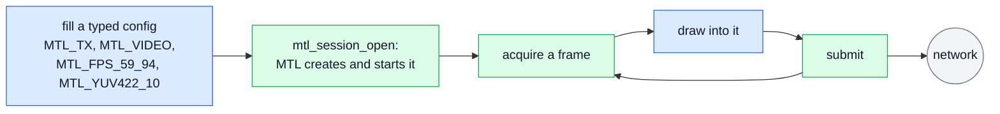

The defaults do the rest. MTL owns the buffers (a library pool); each submitted frame goes out at
the next feasible index (media mode AUTO on the SMPTE epoch, `min_tx_delay_ns` 0); results are off,
so nothing has to be read back. One `mtl_session_close` at the end sends what is queued and retires
the session. What happens to one frame between acquire and the wire:
[concepts.md §5.1](concepts.md#51-tx); the same loop one frame at a time:
[concepts.md §3](concepts.md#3-the-first-sender).

```c
/* ex01 — the smallest video sender: one config, a library pool, no results to read.
   Defaults it relies on: media mode AUTO (the next frame time of the SMPTE epoch),
   results off. Needs: MS1 (null: and kernel: ports; a VF from MS2a, or in MS1 through
   the legacy bridge, ex16).
 */
#include "ex_common.h"

void render(void* addr, uint32_t stride, int64_t frame);

int main(void) {
  mtl_instance_h mt = MTL_NULL(mtl_instance_h);
  mtl_session_h s = MTL_NULL(mtl_session_h);
  struct mtl_session_config sc;
  struct mtl_unit u;
  MTL_INIT(&sc);
  MTL_INIT(&u);

  sc.direction = MTL_TX;
  sc.essence = MTL_VIDEO;
  mtl_flow_ipv4(&sc.flows[0], 239, 168, 85, 20, 20000);
  sc.video.raster.width = 1920;
  sc.video.raster.height = 1080;
  sc.video.raster.fps = mtl_fps_rational(MTL_FPS_59_94);
  sc.video.format = MTL_YUV422_10;

  int ret = mtl_instance_open(NULL, &mt); /* ports from MTL_PORTS, e.g. "null:1" */
  if (ret >= 0) ret = mtl_session_open(mt, &sc, &s); /* create and start */

  for (int64_t k = 0; ret >= 0 && g_running;) {
    ret = mtl_tx_acquire(s, &u, MTL_MS(100));
    if (ret == -MTL_EAGAIN) { /* back-pressure: status.blocked_on says on what */
      ret = 0;
      continue;
    }
    if (ret == 0) {
      render(u.plane[0].addr, u.plane[0].stride, k++);
      ret = mtl_tx_submit(s, &u); /* sent at the next frame time */
    }
  }

  if (ret < 0) ex_fail("mtl", ret);
  mtl_session_close(s, MTL_SEC(1));   /* sends what is queued, then retires */
  mtl_instance_close(mt, MTL_SEC(1)); /* leaves groups, stops the devices */
  return ret < 0;
}
```

### 3.1 MS1 on a NIC: the legacy bridge

In MS1 `mtl_instance_open` opens `null:` and `kernel:` ports. A PCI port (a VF) or a
`native_af_xdp:` port is `-MTL_ENOTSUP` (`NOT_IMPLEMENTED`) until MS2a, and the failure's detail
names the way out: [ex16_legacy_bridge.c](sketch/examples/ex16_legacy_bridge.c). The legacy
`mtl_init` opens the VF, `mtl_start` starts it, `mtl_instance_from_legacy` wraps it, and ex01's loop
runs unchanged on the wrapper, as the picture below shows. The `legacy_bridge` sample
([implementation-plan.md §4.2](implementation-plan.md#42-samples)) is this program. From MS2a, ex01
with `MTL_PORTS=0000:af:01.0=192.168.1.10/24` does the same without the legacy headers.

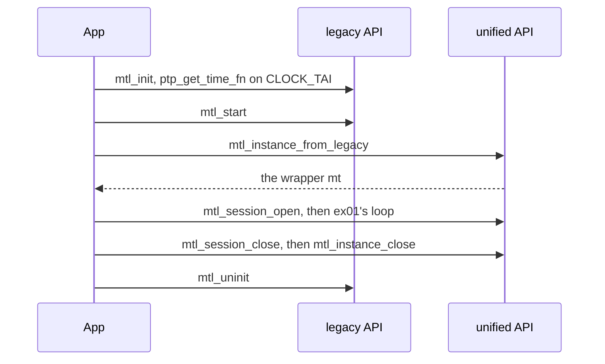

The wrapper differs from an instance that `mtl_instance_open` made in three ways
([contract.md §2.8](contract.md#28-legacy-bridge)):

- **The clock.** The wrapper runs on the legacy clock of port P. The legacy default is
  `CLOCK_REALTIME`, UTC read as TAI (`MTL_TIMEF_UTC`), so its RTP is about 37 s off a PTP
  receiver. ex16 installs `ptp_get_time_fn` on `CLOCK_TAI`, as the FFmpeg plugin does (ptp4l and
  phc2sys keep `CLOCK_TAI` on the host); the legacy PTP client (`MTL_FLAG_PTP_ENABLE`) is the other
  choice. The function runs on MTL's tasklets, the one exception to "no application code on the
  pinned cores" (R6), so it must not block.
- **"Now".** With either clock, `mtl_time_now` is `-MTL_ENOTSUP` until MS2a. A sender in AUTO
  mode does not need it; a TAI-mode program on ex16's clock reads `CLOCK_TAI`, the clock the
  wrapper runs on.
- **The order.** `mtl_start` comes before the first unified start (`-MTL_EBUSY`, `WRONG_STATE`
  before it). At the end the wrapper closes first, then `mtl_uninit` stops the devices; it returns
  `-EBUSY` while a wrapper is open.

The program includes the legacy `mtl_api.h` next to the unified headers, which is allowed
([migration.md §6.1](migration.md#61-both-header-sets-in-one-file)).

```c
/* ex16 — MS1 on a NIC: ex01's sender on a VF that the legacy mtl_init() opened.
   Until MS2a mtl_instance_open() opens null: and kernel: ports only, so a VF is opened
   with mtl_init() and wrapped (mtl_legacy.h). The wrapper runs on the legacy clock: the
   legacy default is UTC read as TAI, 37 s off a PTP receiver, so this program installs
   ptp_get_time_fn on CLOCK_TAI, as the FFmpeg plugin does (the host needs ptp4l and
   phc2sys). That function runs on MTL's tasklets. With it mtl_time_now() is -MTL_ENOTSUP
   until MS2a; read CLOCK_TAI, the same clock. Run: ex16 0000:af:01.0 192.168.1.10.
   Needs: MS1 and the legacy headers (mtl_api.h).
 */
#define _POSIX_C_SOURCE 200809L
#include <arpa/inet.h>
#include <mtl/experimental/mtl_legacy.h>
#include <mtl_api.h>
#include <time.h>

#include "ex_common.h"

void render(void* addr, uint32_t stride, int64_t frame);

/* Called on MTL's tasklets: a vDSO read, no lock, no allocation. */
static uint64_t tai_now(void* priv) {
  struct timespec ts;
  (void)priv;
  if (clock_gettime(CLOCK_TAI, &ts) < 0) return 0;
  return (uint64_t)ts.tv_sec * 1000000000u + (uint64_t)ts.tv_nsec;
}

int main(int argc, char** argv) {
  struct mtl_init_params p;
  mtl_handle legacy = NULL;
  mtl_instance_h mt = MTL_NULL(mtl_instance_h);
  mtl_session_h s = MTL_NULL(mtl_session_h);
  struct mtl_session_config sc;
  struct mtl_unit u;
  MTL_INIT(&sc);
  MTL_INIT(&u);
  memset(&p, 0, sizeof(p));
  if (argc < 3) return 2;

  snprintf(p.port[MTL_PORT_P], sizeof(p.port[MTL_PORT_P]), "%s", argv[1]);
  p.pmd[MTL_PORT_P] = mtl_pmd_by_port_name(argv[1]);
  if (inet_pton(AF_INET, argv[2], p.sip_addr[MTL_PORT_P]) != 1) return 2;
  p.num_ports = 1;
  p.tx_queues_cnt[MTL_PORT_P] = 1;
  p.log_level = MTL_LOG_LEVEL_INFO;
  p.ptp_get_time_fn = tai_now; /* without it: UTC read as TAI (MTL_TIMEF_UTC) */

  sc.direction = MTL_TX;
  sc.essence = MTL_VIDEO;
  /* flows[0] is on instance port 0, which is the legacy MTL_PORT_P */
  mtl_flow_ipv4(&sc.flows[0], 239, 168, 85, 20, 20000);
  sc.video.raster.width = 1920;
  sc.video.raster.height = 1080;
  sc.video.raster.fps = mtl_fps_rational(MTL_FPS_59_94);
  sc.video.format = MTL_YUV422_10;

  /* mtl_init() returns NULL on failure (its log says why); mtl_start() comes before the
     first unified start; the wrap returns after the TSC calibration. */
  int ret = -MTL_EIO;
  legacy = mtl_init(&p);
  if (legacy && mtl_start(legacy) == 0) ret = mtl_instance_from_legacy(legacy, &mt);
  if (ret >= 0) ret = mtl_session_open(mt, &sc, &s);

  for (int64_t k = 0; ret >= 0 && g_running;) { /* ex01's loop */
    ret = mtl_tx_acquire(s, &u, MTL_MS(100));
    if (ret == -MTL_EAGAIN) {
      ret = 0;
      continue;
    }
    if (ret == 0) {
      render(u.plane[0].addr, u.plane[0].stride, k++);
      ret = mtl_tx_submit(s, &u);
    }
  }

  if (ret < 0) ex_fail("mtl", ret);
  /* The wrapper first (it never stops the legacy devices), then the legacy instance:
     mtl_uninit() is -EBUSY while a wrapper lives. */
  mtl_session_close(s, MTL_SEC(1));
  mtl_instance_close(mt, MTL_SEC(1));
  if (legacy) mtl_uninit(legacy);
  return ret < 0;
}
```

## 4. Receive video on two ST 2022-7 legs

[ex02_rx_video.c](sketch/examples/ex02_rx_video.c): two flows in the config (`sc.flows[0]` and
`sc.flows[1]`) are two ST 2022-7 legs on instance ports 0 and 1. In the picture MTL merges the
packets of both legs by sequence number, and the application dequeues, reads and releases each
frame.

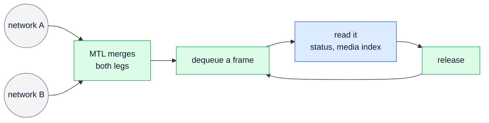

A frame with lost packets is still delivered, with `u.status == MTL_RX_INCOMPLETE` and the gaps
read as zero (library pools, from MS2). `u.media_index` says which frame it is, valid when
`MTL_UNITF_INDEX_VALID` is set. `-MTL_EAGAIN` with no signal means `status.flags` lacks
`MTL_STATUS_RX_SIGNAL`.

```c
/* ex02 — a video receiver on two ST 2022-7 legs: dequeue, read, release. Needs: MS1
   (media_index is valid from MS3). */
#include "ex_common.h"

void show(const void* addr, uint32_t stride, int complete, int64_t media_index);

int rx_video(mtl_instance_h mt) {
  mtl_session_h s = MTL_NULL(mtl_session_h);
  struct mtl_session_config sc;
  struct mtl_unit u;
  MTL_INIT(&sc);
  MTL_INIT(&u);

  sc.direction = MTL_RX;
  sc.essence = MTL_VIDEO;
  /* two flows = two legs on instance ports 0 and 1 (two ports, e.g.
     MTL_PORTS=null:1,null:2); packets merge by sequence */
  mtl_flow_ipv4(&sc.flows[0], 239, 168, 85, 20, 20000);
  mtl_flow_ipv4(&sc.flows[1], 239, 168, 86, 20, 20000);
  sc.video.raster.width = 1920;
  sc.video.raster.height = 1080;
  sc.video.raster.fps = mtl_fps_rational(MTL_FPS_59_94);
  sc.video.format = MTL_YUV422_10;
  int ret = mtl_session_open(mt, &sc, &s);

  while (ret >= 0 && g_running) {
    ret = mtl_rx_dequeue(s, &u, MTL_MS(100));
    if (ret == -MTL_EAGAIN) { /* no signal: status.flags lacks MTL_STATUS_RX_SIGNAL */
      ret = 0;
      continue;
    }
    if (ret < 0) break;
    show(
        u.plane[0].addr, u.plane[0].stride, u.status == MTL_RX_COMPLETE,
        (u.flags & MTL_UNITF_INDEX_VALID) ? u.media_index : -1); /* lost packets read 0 */
    ret = mtl_rx_release(s, u.lease);
  }

  if (ret < 0) ex_fail("rx", ret);
  mtl_session_close(s, 0); /* MTL_RETIRING is not a failure: it ends on its own */
  return ret;
}
```

## 5. Senders in the application's epoll loop

[ex03_event_loop.c](sketch/examples/ex03_event_loop.c) (MS2a: queues) is a set of senders in the
application's own `epoll` loop. Each session is created with `MTL_SESSION_RESULTS`.
`mtl_queue_create(mt, 0, &q, &fd)` gives one queue and its descriptor for all of them. The source
of the frames (a decoder thread, a socket reader) has a descriptor of its own, an eventfd it writes
after it queues a frame, and both descriptors are in one `epoll` set, as in the picture: every
source of work the loop serves is in the set.

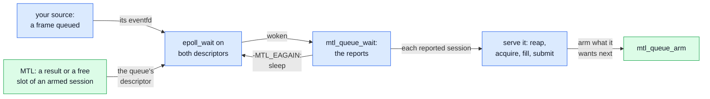

`mtl_queue_arm(q, s, targets, user)` arms what the loop wants to hear about. The first change of an
armed target reports the session once, with its `user` (here the session's index), and the report
disarms it. So the loop serves a reported session with timeout-0 calls (it reaps the results, then
acquires and submits while a source frame waits) and arms it again: `MTL_WAIT_RESULTS` always,
`MTL_WAIT_ACQUIRE` only while a frame waits for a free slot, so a sender whose source is dry never
spins on free slots. An arm that finds a target ready reports the session at once, so nothing is
missed and nothing needs draining. The loop sleeps in `epoll` only after `mtl_queue_wait` returned
`-MTL_EAGAIN`, which arms the queue's descriptor, and it leaves on `-MTL_ECANCELED`
(`mtl_queue_interrupt`) or `-MTL_ESHUTDOWN`. The source's eventfd is read before the sessions are
served, so a frame queued meanwhile wakes the loop, and the slot is acquired before the frame is
taken, so no frame is taken without a place to go. The 100 ms timeout only polls `g_running`.
Results come back in submission order, each with the `u.cookie` of its unit. The descriptor leaves
the `epoll` set before the queue closes. What happens inside MTL before the descriptor fires:
[concepts.md §2.2](concepts.md#22-the-app-pushes-mtl-never-calls-back); the rules:
[contract.md §7.2](contract.md#72-queues-ms2).

```c
/* ex03 — senders in the application's own epoll loop, reading a result per frame. One
   queue tells the loop which of its sessions changed, through one descriptor for all of
   them, and the source's eventfd says a frame is ready: every source of work is in one
   epoll set. s[i]: started TX sessions created with MTL_SESSION_RESULTS in sc.flags. A
   report disarms its session: the loop serves it with timeout-0 calls, then arms it again
   with what it wants next, its results always and a free slot only while a source frame
   waits for one, so a sender limited by its source never spins on free slots. The loop
   sleeps in epoll only after mtl_queue_wait() returned -MTL_EAGAIN, and leaves on a code:
   -MTL_ECANCELED after mtl_queue_interrupt(), -MTL_ESHUTDOWN when the queue closes.
   Needs: MS2 (MS2a: queues). */
#include <errno.h>
#include <sys/epoll.h>
#include <unistd.h>

#include "ex_common.h"

/* The source (decoder threads, socket readers): one eventfd (EFD_NONBLOCK) it writes
   after it queues a frame for any session, and a queue of frames per session. */
int source_eventfd(void);
int source_frame_waiting(int i);                               /* 1: a frame for s[i] */
int next_source_frame(int i, uint64_t* id, const void** data); /* 0 = one taken */
void fill(struct mtl_unit* u, const void* data);
void source_frame_done(int i, uint64_t id, uint32_t status, int64_t margin_ns);

/* Why drain() stopped: the example's own values, not library names. */
enum { EX_DRAINED_NO_FRAME = 0, EX_DRAINED_NO_SLOT = 1 };

/* Results, then a slot for each frame that waits: the slot first, so no frame is taken
   without a place to go. */
static int drain(mtl_session_h s, int i) {
  struct mtl_tx_result r[16];
  struct mtl_unit u;
  int n;
  MTL_INIT(&u);
  while ((n = mtl_tx_reap(s, r, 16, 0)) > 0) /* in submission order */
    for (int k = 0; k < n; k++)
      source_frame_done(i, r[k].cookie, r[k].status, r[k].margin_ns);
  if (n != -MTL_EAGAIN) return n;
  while (source_frame_waiting(i)) {
    uint64_t id;
    const void* data;
    int ret = mtl_tx_acquire(s, &u, 0);
    if (ret == -MTL_EAGAIN) return EX_DRAINED_NO_SLOT;
    if (ret < 0) return ret;
    if (next_source_frame(i, &id, &data) != 0) { /* taken meanwhile: the slot goes back */
      ret = mtl_tx_release(s, u.lease);
      return ret < 0 ? ret : EX_DRAINED_NO_FRAME;
    }
    fill(&u, data);
    u.cookie = id; /* comes back in the result */
    ret = mtl_tx_submit(s, &u);
    if (ret < 0) return ret;
  }
  return EX_DRAINED_NO_FRAME;
}

/* Serves s[i], then arms what it wants next. */
static int serve(mtl_queue_h q, mtl_session_h* s, int i) {
  int d = drain(s[i], i);
  if (d < 0) return d;
  uint64_t want = MTL_WAIT_RESULTS | (d == EX_DRAINED_NO_SLOT ? MTL_WAIT_ACQUIRE : 0);
  int ret = mtl_queue_arm(q, MTL_OBJ_OF_SESSION(s[i]), want, (uint64_t)i);
  return ret > 0 ? 0 : ret; /* 1: a report of s[i] is on its way, with this user */
}

int event_loop(mtl_instance_h mt, mtl_session_h* s, int n) {
  struct mtl_ready r[16];
  struct epoll_event ev = {.events = EPOLLIN}, ready[2];
  intptr_t qfd = -1;
  mtl_queue_h q = MTL_NULL(mtl_queue_h);
  int src = source_eventfd();
  int ep = epoll_create1(0);
  int ret = ep < 0 ? -MTL_ENOMEM : mtl_queue_create(mt, 0, &q, &qfd);
  if (ret >= 0 && (epoll_ctl(ep, EPOLL_CTL_ADD, (int)qfd, &ev) < 0 ||
                   epoll_ctl(ep, EPOLL_CTL_ADD, src, &ev) < 0))
    ret = -MTL_EINVAL;
  for (int i = 0; ret >= 0 && i < n; i++) ret = serve(q, s, i);
  while (ret >= 0 && g_running) {
    int k = mtl_queue_wait(q, r, sizeof(r[0]), 16, 0);
    if (k == -MTL_EAGAIN) {          /* the descriptor is armed: sleep now */
      epoll_wait(ep, ready, 2, 100); /* the 100 ms only poll g_running */
      k = 0;
    }
    if (k < 0) {
      ret = k; /* -MTL_ECANCELED, -MTL_ESHUTDOWN: leave */
      break;
    }
    uint64_t frames; /* read before serving, so a frame queued meanwhile wakes the loop */
    if (read(src, &frames, sizeof(frames)) < 0 && errno != EAGAIN) ret = -MTL_EIO;
    for (int j = 0; ret >= 0 && j < k; j++) ret = serve(q, s, (int)r[j].user);
    for (int i = 0; ret >= 0 && i < n; i++) /* armed for results only, a frame came */
      if (source_frame_waiting(i)) ret = serve(q, s, i);
  }
  if (ep >= 0)
    close(ep); /* the descriptor out of the epoll set before the queue closes */
  mtl_queue_close(q);
  return ret < 0 ? ex_fail("loop", ret) : 0;
}
```

## 6. Zero copy from a framework's pool

[ex04_zero_copy_tx.c](sketch/examples/ex04_zero_copy_tx.c) (MS2b) sends a framework's surfaces
without a copy: surface i is slot i, as in the picture. The config sets
`MTL_SESSION_POOL_ATTACHED | MTL_SESSION_REQUIRE_DIRECT` and `pool_count`, and one
`mtl_session_attach` (`mtl_mem.h`) imports the arena (`a.va`, `a.length`, `a.count`) as the
session's slots; it fails with a reason if the arena is too small.


`mtl_tx_acquire_slot(s, i, ...)` leases exactly surface i, or returns `-MTL_EAGAIN` while it is
still in flight. Application memory always produces results (rule MEM3), so a surface goes back to
the framework only when its result says the network is done with it. The loop waits up to 20 ms
for the framework's next frame, so it never spins. At the end it stops with `MTL_STOP_DRAIN`,
reaps, then closes: `mtl_session_close` returns 0 once nothing references the arena any more, and
the example calls it again until it does; then the arena may be freed. The session's path through
create, attach, start, stop and close: [concepts.md §5.3](concepts.md#53-a-sessions-life).

```c
/* ex04 — zero-copy TX from a framework's pool: N surfaces in one page-aligned arena are
   the session's slots. App memory always produces results, so a surface goes back to the
   framework only when its result says the NIC is done with it. Needs: MS2b. */
#include <mtl/experimental/mtl_mem.h>

#include "ex_common.h"

#define N 4
extern void* arena; /* the framework's pool: N surfaces, page aligned */
extern uint64_t arena_len;
/* 0 = a frame is ready within timeout_ns; the thread sleeps meanwhile */
int next_framework_frame(uint32_t* surface, uint64_t* id, int64_t timeout_ns);
void framework_frame_done(uint64_t id);

/* Gives the surfaces whose frames have left back to the framework; 0 or an error. */
static int reap(mtl_session_h s) {
  struct mtl_tx_result r[8];
  int n;
  while ((n = mtl_tx_reap(s, r, 8, 0)) > 0)
    for (int i = 0; i < n; i++) framework_frame_done(r[i].cookie);
  return n == -MTL_EAGAIN ? 0 : n;
}

int zero_copy_tx(mtl_instance_h mt) {
  mtl_session_h s = MTL_NULL(mtl_session_h);
  struct mtl_session_config sc;
  struct mtl_attach a;
  struct mtl_unit u;
  MTL_INIT(&sc);
  MTL_INIT(&a);
  MTL_INIT(&u);

  int ret = 0;
  sc.direction = MTL_TX;
  sc.essence = MTL_VIDEO;
  mtl_flow_ipv4(&sc.flows[0], 239, 168, 85, 21, 20000);
  sc.video.raster.width = 1920;
  sc.video.raster.height = 1080;
  sc.video.raster.fps = mtl_fps_rational(MTL_FPS_59_94);
  sc.video.format = MTL_YUV422_10;
  sc.flags = MTL_SESSION_POOL_ATTACHED | MTL_SESSION_REQUIRE_DIRECT; /* never a copy */
  sc.pool_count = N;
  a.va = arena; /* imported for this session; surface i = slot i, natural layout */
  a.length = arena_len;
  a.count = N;
  if (ret >= 0) ret = mtl_session_create(mt, &sc, &s);
  if (ret >= 0)
    ret = mtl_session_attach(s, &a); /* fails here, with a reason, if too small */
  if (ret >= 0) ret = mtl_session_start(&s, 1, NULL, NULL);

  while (ret >= 0 && g_running) {
    uint32_t i;
    uint64_t id;
    ret = reap(s);
    if (ret < 0 || next_framework_frame(&i, &id, MTL_MS(20)) != 0) continue;
    ret = mtl_tx_acquire_slot(s, i, &u, MTL_MS(20)); /* exactly surface i */
    if (ret == 0) {
      u.cookie = id;
      ret = mtl_tx_submit(s, &u);
    } else if (ret == -MTL_EAGAIN) { /* surface i still in flight: skip this frame */
      framework_frame_done(id);
      ret = 0;
    }
  }

  if (ret < 0) ex_fail("zero copy", ret);
  mtl_session_stop(&s, 1, MTL_STOP_DRAIN,
                   MTL_SEC(1)); /* every accepted unit gets a result */
  reap(s);
  /* MTL_RETIRING: the NIC may still read a surface; poll until 0, then the arena may be
     freed */
  while (mtl_session_close(s, MTL_SEC(1)) == MTL_RETIRING) {
  }
  return ret;
}
```

## 7. Received frames lent to a framework

[ex05_rx_to_framework.c](sketch/examples/ex05_rx_to_framework.c): a received frame stays valid until
it is released, on whatever thread drops it. In the picture the streaming thread dequeues and wraps
the frame as a framework buffer, and any thread releases it, in any order, when downstream is done;
the dashed arrow is GStreamer's `unlock`.


GStreamer's `unlock` and `unlock_stop` run on another thread and are `mtl_session_interrupt(s, 1)`
and `(s, 0)`: the interrupted dequeue returns `-MTL_ECANCELED` at once, `create` returns FLUSHING
without waiting for `unlock_stop`, and the framework calls it again after `unlock_stop`; the
streaming thread never waits for it. `-MTL_ESHUTDOWN` means the element stopped or closed the
session. `mtl_session_close(s, 0)` returns 1 while downstream still holds frames, which is not a
failure; the session retires on the last release, and a later close returns 0. The source keeps R
slots for MTL, so that downstream never holds the whole pool: `mtl_rx_reserve(&info, NULL,
latency, copy_ns)` (`mtl_util.h`) gives R = ceil((L + c) / U) + 1 from the session's
`latency_min_ns`, `convert_ns` and unit period, the framework's latency and the source's copy time
([migration.md §12.8](migration.md#128-rx-sources-zero-copy-pool-size-and-latency)). Once
`pool_count` − R units are lent out, the next one is copied; a `pool_count` of R + H, H the units
held downstream at once, never copies.

```c
/* ex05 — RX frames lent to a framework (GstBuffer, AVBufferRef) with no copy: dequeue on
   the streaming thread, wrap the library slot, release on whatever thread drops the
   buffer. The wrapper keeps the handles by value, never a pointer into the element: a
   sink, a queue or an appsink application may hold the buffer after the element is gone.
   Library slots are packed (FFmpeg av_image_fill_arrays with align 1) and end in
   MTL_RX_TAIL_BYTES zero bytes (AV_INPUT_BUFFER_PADDING_SIZE). The slots MTL needs for
   units not yet handed on are reserved (mtl_rx_reserve, migration.md §12.8); once
   downstream holds the rest, the next unit is copied, so a slow consumer costs a copy,
   never a lost unit. GStreamer unlock() and unlock_stop() run on another thread and map
   to mtl_session_interrupt(s, 1) and (s, 0). Needs: MS1. */
#include <mtl/experimental/mtl_util.h>
#include <stdlib.h>

#include "ex_common.h"

#define EX_FLUSHING 1 /* the framework's "flushing" return (GST_FLOW_FLUSHING) */

/* What one framework buffer keeps until its free callback runs. */
struct rx_ref {
  mtl_session_h s;
  mtl_lease_h lease;
};
/* The framework's wrap: gst_buffer_new_wrapped_full(0, data, size + MTL_RX_TAIL_BYTES, 0,
   size, ref, cb) or av_buffer_create(data, size, cb, ref, 0) (cb takes a second argument
   there); its copy into a buffer of its own; and its count of wrapped buffers still out
   (an atomic the callback decrements). */
typedef void (*release_fn)(void* ref);
int wrap_as_framework_buffer(void* data, uint64_t size, release_fn cb, void* ref);
int copy_to_framework_buffer(const void* data, uint64_t size);
uint32_t framework_wrapped_out(void);

static void release_cb(void* p) { /* any thread, any order, also after close */
  struct rx_ref* ref = (struct rx_ref*)p;
  mtl_rx_release(ref->s, ref->lease); /* 0 also once the session or instance closed */
  free(ref);
}

/* At start and at each GST_EVENT_LATENCY: the slots to keep for MTL. latency_ns: the
   pipeline's configured latency; copy_ns: the measured copy of one unit (about 1 ms at
   1080p). A pool_count below this + the units held downstream (a sink's last sample, an
   aggregator pad) makes the copy path run: log the pool_count it needs once. */
int rx_reserve(mtl_session_h s, int64_t latency_ns, int64_t copy_ns) {
  struct mtl_session_info info;
  int ret = mtl_session_get_info(s, &info, sizeof(info));
  return ret < 0 ? ret : mtl_rx_reserve(&info, NULL, latency_ns, copy_ns);
}

/* GstBaseSrc::create on the streaming thread: 0 = one buffer handed on; EX_FLUSHING after
   unlock() or a stop, without waiting for unlock_stop(): the framework calls create again
   once it has run; a negative code on an error. unit_bytes: mtl_session_info.unit_bytes
   (with detection, the sum of stride x rows over the unit's planes); reserve: the last
   rx_reserve(). */
int rx_create(mtl_session_h s, uint64_t unit_bytes, uint32_t pool_count,
              uint32_t reserve) {
  struct mtl_unit u;
  MTL_INIT(&u);
  for (;;) {
    int ret = mtl_rx_dequeue(s, &u, MTL_MS(200));
    if (ret == -MTL_EAGAIN) continue;
    if (ret == -MTL_ECANCELED || ret == -MTL_ESHUTDOWN) return EX_FLUSHING;
    if (ret < 0) return ex_fail("dequeue", ret); /* -MTL_EIO: status.error_reason */
    if (framework_wrapped_out() + reserve >=
        pool_count) { /* into a framework pool buffer */
      ret = copy_to_framework_buffer(u.plane[0].addr, unit_bytes);
      mtl_rx_release(s, u.lease);
      return ret < 0 ? -MTL_ENOMEM : 0;
    }
    struct rx_ref* ref = (struct rx_ref*)malloc(sizeof(*ref));
    if (ref) {
      ref->s = s; /* by value */
      ref->lease = u.lease;
    }
    if (!ref ||
        wrap_as_framework_buffer(u.plane[0].addr, unit_bytes, release_cb, ref) < 0) {
      free(ref);
      mtl_rx_release(s, u.lease);
      return -MTL_ENOMEM;
    }
    return 0;
  }
}

/* GstBaseSrc::unlock and ::unlock_stop, on the application thread that flushes. */
int rx_unlock(mtl_session_h s) {
  return mtl_session_interrupt(s, 1); /* the dequeue in rx_create returns at once */
}
int rx_unlock_stop(mtl_session_h s) {
  return mtl_session_interrupt(s, 0);
}

/* GstBaseSrc::stop: never waits for downstream. Close returns MTL_RETIRING while buffers
   are still out, which is not a failure: the last release retires the session, with no
   further call. */
int rx_stop(mtl_session_h s) {
  int ret = mtl_session_close(s, 0);
  return ret < 0 ? ret : 0;
}
```

## 8. Receive into an MXL ring by frame number

[ex06_mxl_ring.c](sketch/examples/ex06_mxl_ring.c) (MS2b) receives into an MXL ring. The ring is the
session's pool (`MTL_SESSION_POOL_ATTACHED | MTL_SESSION_RX_BY_INDEX | MTL_SESSION_RX_LATEST`,
`a.pitch = grain_size`), and frame k lands in grain k mod 8, as in the picture.

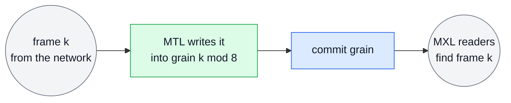

With `MTL_SESSION_RX_BY_INDEX` the slot is the media index mod `pool_count`, so
`u.slot == media_index mod 8`. Every session runs on the SMPTE epoch, so every process computes the
same k for the same frame, and the MXL readers find frame k in the grain MTL wrote it to.

```c
/* ex06 — receive into an MXL ring: unit k lands in grain k mod GRAINS, so the reader
   finds frame k at a known place. The ring is the session's pool (app memory). Every
   session runs on the SMPTE epoch: k counts frames since 1970 TAI, the same in every
   process. Needs: MS2b. */
#include <mtl/experimental/mtl_mem.h>

#include "ex_common.h"

#define GRAINS 8
extern void* ring;          /* GRAINS grains in shared memory, page aligned */
extern uint64_t grain_size; /* bytes between grains */
void mxl_commit_grain(uint32_t grain, int64_t media_index, int complete);

int mxl_bridge(mtl_instance_h mt) {
  mtl_session_h s = MTL_NULL(mtl_session_h);
  struct mtl_session_config sc;
  struct mtl_attach a;
  struct mtl_unit u;
  MTL_INIT(&sc);
  MTL_INIT(&a);
  MTL_INIT(&u);

  int ret = 0;
  sc.direction = MTL_RX;
  sc.essence = MTL_VIDEO;
  mtl_flow_ipv4(&sc.flows[0], 239, 168, 85, 20, 20000);
  sc.video.raster.width = 1920;
  sc.video.raster.height = 1080;
  sc.video.raster.fps = mtl_fps_rational(MTL_FPS_59_94);
  sc.video.format = MTL_YUV422_10;
  sc.flags = MTL_SESSION_POOL_ATTACHED | MTL_SESSION_RX_BY_INDEX | MTL_SESSION_RX_LATEST;
  sc.pool_count = GRAINS;
  a.va = ring;
  a.length = (uint64_t)GRAINS * grain_size;
  a.count = GRAINS;
  a.pitch = grain_size;
  if (ret >= 0) ret = mtl_session_create(mt, &sc, &s);
  if (ret >= 0) ret = mtl_session_attach(s, &a);
  if (ret >= 0) ret = mtl_session_start(&s, 1, NULL, NULL);

  while (ret >= 0 && g_running) {
    ret = mtl_rx_dequeue(s, &u, MTL_MS(100));
    if (ret == 0) {
      if (u.flags & MTL_UNITF_INDEX_VALID) /* u.slot == media_index mod GRAINS */
        mxl_commit_grain(u.slot, u.media_index, u.status == MTL_RX_COMPLETE);
      ret = mtl_rx_release(s, u.lease);
    } else if (ret == -MTL_EAGAIN) {
      ret = 0;
    }
  }

  if (ret < 0) ex_fail("mxl", ret);
  /* MTL_RETIRING: poll until 0, then MXL may reuse the ring */
  while (mtl_session_close(s, MTL_SEC(1)) == MTL_RETIRING) {
  }
  return ret;
}
```

## 9. Video, audio and captions from one file

[ex07_av_anc_playout.c](sketch/examples/ex07_av_anc_playout.c) (MS6) plays video, audio and captions
from one file. The three TX sessions use `MTL_MEDIA_INDEX`, so each unit says which frame (video,
ANC) or first sample (audio) it is (`u.media_index`), and one start begins all three, as in the
picture.

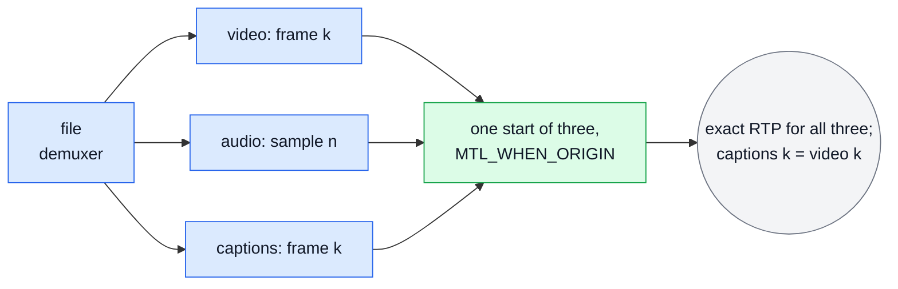

`mtl_session_start(s, 3, &origin, NULL)` with `origin.flags = MTL_WHEN_ORIGIN` starts all three or
none and resolves T0 once on the common grid: media index 0 of each session is T0, so the file's
frame and sample counts are media indices as they are. MTL turns the indices into RTP timestamps
that agree exactly, and captions for frame k carry video frame k's timestamp. The ANC session takes
its raster and launch delay from the first video of its start, and a frame without captions still
gets the empty ANC packet. Audio uses the copy path, `mtl_tx_write`. `preroll_ns` puts T0 far
enough ahead that the first unit of each session is queued before it. A full pool is waited out
(`-MTL_EAGAIN` is retried), and an audio write that takes only part of its bytes continues at the
next index of `mtl_tx_get_next`. How a media index becomes an RTP timestamp and a launch time:
[concepts.md §7.1](concepts.md#71-two-times-not-one); the arithmetic:
[timing.md §10](timing.md#10-avanc-synchronisation).

```c
/* ex07 — video, audio and captions from one file, in sync by construction: three sessions
   started together with MTL_WHEN_ORIGIN, so the file's frame 0 and sample 0 are at the
   start's T0; each unit says which frame or sample it is, so every RTP timestamp is exact
   and ANC frame k carries video frame k's timestamp. Needs: MS6. */
#include <mtl/experimental/mtl_util.h>

#include "ex_common.h"

#define FILE_FPS MTL_FPS_59_94

enum { VIDEO, AUDIO, CAPTIONS };
/* the demuxer: video pts in frames, audio pts in samples, both from 0; 0 = a packet */
int demux_next(int* stream, int64_t* pts, const void** data, size_t* size);
void decode_into(struct mtl_unit* u, const void* data, size_t size);
/* appends the caption ANC packets of frame pts to u (mtl_anc_put, 8-bit words, in raster
   order): 0, or an MTL_E* code */
int captions_for(int64_t pts, struct mtl_unit* u);

/* One TX session of the file; port: the UDP port of its flow. */
static int open_tx(mtl_instance_h mt, uint32_t essence, uint16_t port, mtl_session_h* s) {
  struct mtl_session_config sc;
  MTL_INIT(&sc);
  sc.direction = MTL_TX;
  sc.essence = essence;
  mtl_flow_ipv4(&sc.flows[0], 239, 168, 85, 20, port);
  sc.media_mode = MTL_MEDIA_INDEX; /* unit.media_index = frame or first sample */
  if (essence == MTL_VIDEO) {
    sc.video.raster.width = 1920;
    sc.video.raster.height = 1080;
    sc.video.raster.fps = mtl_fps_rational(FILE_FPS);
    sc.video.format = MTL_YUV422_10;
  } else if (essence == MTL_AUDIO) {
    sc.audio.format = MTL_PCM24;
    sc.audio.sample_rate = 48000;
    sc.audio.channels = 2;
  } /* ANC: raster and launch delay come from the first video of its start */
  return mtl_session_create(mt, &sc, s);
}

/* Acquires a unit, waiting while the pool is full: the file is read ahead of the wire. */
static int acquire(mtl_session_h s, struct mtl_unit* u) {
  int ret;
  do {
    ret = mtl_tx_acquire(s, u, MTL_MS(20));
  } while (ret == -MTL_EAGAIN && g_running);
  return ret;
}

/* The copy path: the sample count follows from the bytes. A full pool (-MTL_EAGAIN) is
   waited out; a partial write continues at the next index (mtl_tx_get_next). */
static int write_audio(mtl_session_h s, int64_t first, const void* data, size_t size) {
  const uint8_t* p = (const uint8_t*)data;
  struct mtl_unit how;
  MTL_INIT(&how);
  how.media_index = first;
  while (size > 0 && g_running) {
    int n = mtl_tx_write(s, p, size, &how, MTL_MS(20));
    if (n == -MTL_EAGAIN) continue;
    if (n < 0) return n;
    p += n;
    size -= (size_t)n;
    if (size > 0) {
      struct mtl_tx_next c;
      int ret = mtl_tx_get_next(s, &c, sizeof(c));
      if (ret < 0) return ret;
      how.media_index = c.next_media_index;
    }
  }
  return 0;
}

int av_anc_playout(mtl_instance_h mt) {
  mtl_session_h s[3] = {MTL_NULL(mtl_session_h), MTL_NULL(mtl_session_h),
                        MTL_NULL(mtl_session_h)};
  /* T0: the first feasible instant plus a preroll, so the first units of all three are
     submitted before it; media index 0 of all three is T0 */
  const struct mtl_when origin = {
      .kind = MTL_NOW, .flags = MTL_WHEN_ORIGIN, .preroll_ns = MTL_MS(100)};
  struct mtl_unit u;
  MTL_INIT(&u);

  int ret = open_tx(mt, MTL_VIDEO, 20000, &s[VIDEO]);
  if (ret >= 0) ret = open_tx(mt, MTL_AUDIO, 30000, &s[AUDIO]);
  if (ret >= 0) ret = open_tx(mt, MTL_ANC, 40000, &s[CAPTIONS]);
  if (ret >= 0) ret = mtl_session_start(s, 3, &origin, NULL); /* all three or none */

  int st;
  int64_t pts;
  const void* data;
  size_t size;
  while (ret >= 0 && g_running && demux_next(&st, &pts, &data, &size) == 0) {
    if (st == AUDIO) {
      ret = write_audio(s[AUDIO], pts, data, size);
      continue;
    }
    ret =
        acquire(s[CAPTIONS], &u); /* a unit without captions sends the empty ANC packet */
    if (ret < 0) break;
    ret = captions_for(pts, &u);
    if (ret < 0) {
      mtl_tx_release(s[CAPTIONS], u.lease);
      break;
    }
    u.media_index = pts;
    ret = mtl_tx_submit(s[CAPTIONS], &u);
    if (ret < 0) break;

    ret = acquire(s[VIDEO], &u);
    if (ret < 0) break;
    decode_into(&u, data, size);
    u.media_index = pts;
    ret = mtl_tx_submit(s[VIDEO], &u);
  }

  if (ret < 0 && ret != -MTL_EAGAIN) ex_fail("playout", ret); /* -MTL_EAGAIN: stopped */
  mtl_session_stop(s, 3, MTL_STOP_DRAIN, MTL_SEC(2)); /* all three finish together */
  for (int i = 0; i < 3; i++) mtl_session_close(s[i], 0);
  return ret;
}
```

## 10. Rows that leave before the frame is finished

[ex08_progressive_rows.c](sketch/examples/ex08_progressive_rows.c) (MS3; rows MS2a, INDEX and
`mtl_tx_get_next` MS3) is an SDI-to-IP gateway: `unit = MTL_UNIT_ROWS`,
`media_mode = MTL_MEDIA_INDEX`, `sc.video.troffset_us`, `min_tx_delay_ns` 0. In the picture
`mtl_tx_get_next` says which frame is being filled, and each submit of the same lease with a larger
`used` publishes more rows; `used == rows` ends the frame.

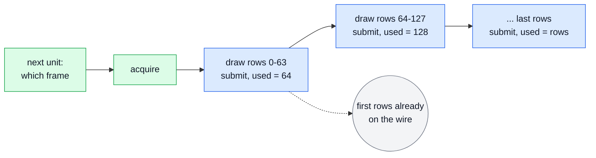

The first rows are on the wire while the rest are still being drawn. A failing later submit ends
the unit where its rows stopped (option `tx.rows_late`), and its one result follows.

```c
/* ex08 — low-latency progressive TX (SDI-to-IP gateway): the first rows leave while the
   rest of the frame is still arriving. Session: a video TX config with sc.unit =
   MTL_UNIT_ROWS, sc.media_mode = MTL_MEDIA_INDEX and sc.video.troffset_us, so the frame
   leaves in the frame period it is captured in. Each submit of the same lease
   publishes rows. Needs: MS3 (rows units MS2a; INDEX and mtl_tx_get_next MS3). */
#include <mtl/experimental/mtl_sync.h>

#include "ex_common.h"

#define STEP 64u
void render_rows(struct mtl_unit* u, uint32_t first, uint32_t end);

int send_one_frame(mtl_session_h s) {
  struct mtl_unit u;
  struct mtl_tx_next cur;
  MTL_INIT(&u);
  int ret = mtl_tx_get_next(s, &cur, sizeof(cur)); /* which frame is being filled */
  if (ret >= 0) ret = mtl_tx_acquire(s, &u, MTL_MS(20));
  if (ret < 0) return ex_fail("acquire", ret);

  u.media_index = cur.next_media_index;
  for (uint32_t done = 0; done < u.plane[0].rows;) {
    uint32_t next = done + STEP < u.plane[0].rows ? done + STEP : u.plane[0].rows;
    render_rows(&u, done, next);
    u.used = next; /* rows [0, next) are final; used == rows ends the frame */
    /* a failed first submit returns the slot; a later failure ends the frame where its
       rows stopped (tx.rows_late) */
    ret = mtl_tx_submit(s, &u);
    if (ret < 0) return ex_fail("submit", ret);
    done = next;
  }
  return 0;
}
```

## 11. One 4K frame in, four HD streams out, no copy

[ex09_split_forwarder.c](sketch/examples/ex09_split_forwarder.c) (MS2b) cuts each received 4K frame
into four HD streams without a copy: the four views in the picture are four TX pools that lie over
the one RX pool, each offset to its quadrant, with the RX stride.

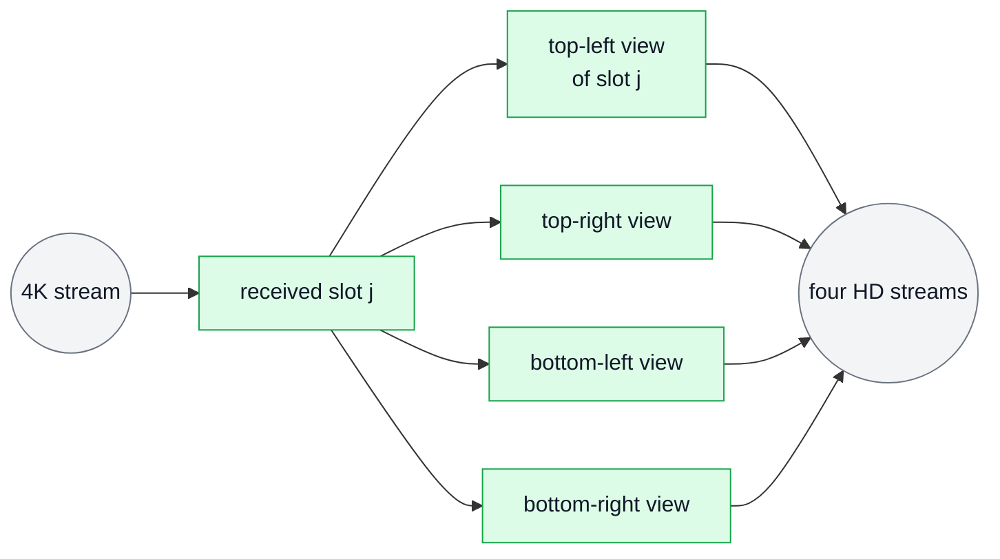

`mtl_session_get_pool_region(rx, &pool)` lends the receiver's library pool; each HD sender attaches
over it (`a.region`, `a.pitch = info.pool_slot_pitch`, `a.offset` = its quadrant, `a.stride[0]` =
the 4K stride), so TX slot j lies over RX slot j. `mtl_tx_send_slot(tx[q], in.slot, &how, 0)` with
`how.hold = in.lease` holds the received frame until that send has left, so a library pool needs
no results to stay safe; the RX slot is free once it is released and every hold has completed
([contract.md §9.6](contract.md#96-holds-and-forwarding)). Nothing is copied and nothing is freed
early. A quadrant still in flight (`-MTL_EAGAIN`) is skipped; any other send error ends the loop.

```c
/* ex09 — zero-copy 1 -> 4 forwarder: each 2160p frame received feeds four 1080p senders,
   one per quadrant. Every TX pool lies over the RX pool (any stride >= row_bytes is
   direct), and each TX unit holds the RX unit it reads until its own result. Needs:
   MS2b. */
#include <mtl/experimental/mtl_util.h>

#include "ex_common.h"

#define QUADS 4

/* rx: a created 2160p RX session (library pool). tx[q]: created 1080p TX sessions with
   MTL_SESSION_POOL_ATTACHED, media_mode TAI and min_tx_delay_ns = one frame period plus
   the pick-up lead (a frame exists only once it is received). */
static int attach_quadrants(mtl_session_h rx, const mtl_session_h* tx) {
  struct mtl_session_info ri;
  struct mtl_unit slot0;
  mtl_region_h pool;
  MTL_INIT(&slot0);
  int ret = mtl_session_get_info(rx, &ri, sizeof(ri));
  if (ret >= 0) ret = mtl_session_get_slot(rx, 0, &slot0);
  if (ret >= 0) ret = mtl_session_get_pool_region(rx, &pool);
  const uint32_t stride = slot0.plane[0].stride, half_row = slot0.plane[0].row_bytes / 2;
  for (uint32_t q = 0; ret >= 0 && q < QUADS; q++) {
    struct mtl_attach a;
    MTL_INIT(&a);
    a.region = pool; /* library memory: holds, not results, keep it safe */
    a.count = ri.pool_count;
    a.pitch = ri.pool_slot_pitch; /* TX slot j lies over RX slot j */
    a.offset =
        (uint64_t)(q / 2) * (slot0.plane[0].rows / 2) * stride + (q % 2) * half_row;
    a.stride[0] = stride;
    ret = mtl_session_attach(tx[q], &a);
  }
  return ret;
}

int split_forward(mtl_session_h rx, mtl_session_h* tx) {
  struct mtl_unit in, how;
  MTL_INIT(&in);
  MTL_INIT(&how);
  int ret = attach_quadrants(rx, tx);
  for (uint32_t q = 0; ret >= 0 && q < QUADS; q++)
    ret = mtl_session_start(&tx[q], 1, NULL, NULL); /* one each: start arrays are MS6 */
  if (ret >= 0) ret = mtl_session_start(&rx, 1, NULL, NULL);

  while (ret >= 0 && g_running) {
    ret = mtl_rx_dequeue(rx, &in, MTL_MS(50));
    if (ret == -MTL_EAGAIN) {
      ret = 0;
      continue;
    }
    if (ret < 0) break;
    how.media_tai_ns = in.media_tai_ns; /* derived RTP = input RTP if it was compliant */
    how.hold = in.lease;                /* the RX slot stays until each TX unit is sent */
    for (uint32_t q = 0; ret >= 0 && (in.flags & MTL_UNITF_TAI_VALID) && q < QUADS; q++) {
      int r = mtl_tx_send_slot(tx[q], in.slot, &how, 0);
      if (r < 0 && r != -MTL_EAGAIN) ret = r; /* -MTL_EAGAIN: still in flight, drop it */
    }
    int r = mtl_rx_release(rx, in.lease); /* the slot is free once every hold completed */
    if (ret >= 0) ret = r;
  }

  if (ret < 0) ex_fail("forward", ret);
  mtl_session_stop(&rx, 1, MTL_STOP_FLUSH, 0);
  mtl_session_stop(tx, QUADS, MTL_STOP_DRAIN, MTL_MS(100)); /* holds end with the sends */
  return ret;
}
```

## 12. A processor that keeps the input's timing

[ex10_processor.c](sketch/examples/ex10_processor.c) (MS6: audio in TAI mode; `process_video`: MS1;
`pass_anc`: MS4a2) keeps the input's
timing: each output unit is submitted with the media time M of the input unit it came from, as in
the picture.

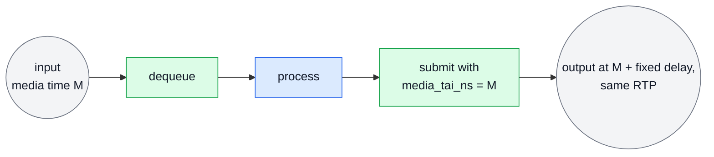

The output sessions use `MTL_MEDIA_TAI`, and `min_tx_delay_ns` is the pipeline budget: one frame
period (RX completion) + processing + the pick-up lead. The output carries the input's media time
only when the input has `MTL_UNITF_TAI_VALID`; then a compliant input keeps its RTP timestamps and
the delay through the processor is the fixed `min_tx_delay_ns`. A received unit is a valid template
for the copy path: audio and ANC pass through `mtl_tx_write` with the received unit as the
template.

```c
/* ex10 — a time-preserving processor: video, audio and ANC in, transformed, out, each
   with the input's media time. Output sessions use media_mode TAI with min_tx_delay_ns =
   the pipeline budget: one frame period (RX completion) + processing + the pick-up lead,
   so the delay is fixed and, for a compliant input, every output RTP equals the input
   RTP. A received unit is a valid send template: its RX-only flags are ignored. Needs:
   MS6 (audio TAI; process_video alone: MS1, pass_anc: MS4a2). */
#include <mtl/experimental/mtl_util.h>

#include "ex_common.h"

void transform(const struct mtl_unit* in, struct mtl_unit* out);

int process_video(mtl_session_h rx, mtl_session_h tx) {
  struct mtl_unit in, out;
  MTL_INIT(&in);
  MTL_INIT(&out);
  int ret = mtl_rx_dequeue(rx, &in, MTL_MS(50));
  if (ret < 0) return ret;
  if (!(in.flags &
        MTL_UNITF_TAI_VALID)) { /* a mediaclk:sender input has no TAI relation */
    mtl_rx_release(rx, in.lease);
    return -MTL_EINVAL;
  }
  ret = mtl_tx_acquire(tx, &out, MTL_MS(10));
  if (ret == 0) {
    transform(&in, &out);
    out.media_tai_ns = in.media_tai_ns; /* the input's media time, not "now" */
    ret = mtl_tx_submit(tx, &out);
  }
  int r = mtl_rx_release(rx, in.lease);
  return ret < 0 ? ret : r;
}

/* Audio: the copy path takes the received unit as the template (its media time). */
int pass_audio(mtl_session_h rx, mtl_session_h tx) {
  struct mtl_unit in;
  MTL_INIT(&in);
  int ret = mtl_rx_dequeue(rx, &in, MTL_MS(20));
  if (ret < 0) return ret;
  ret = mtl_tx_write(tx, in.plane[0].addr, in.used, &in, MTL_MS(10));
  int r = mtl_rx_release(rx, in.lease);
  return ret < 0 ? ret : r;
}

/* ANC: every received entry is a valid TX entry (RX marks the first entry of each RTP
   packet MTL_ANCF_NEW_RTP, so the boundaries stay as they arrived). Both sessions have
   the same word mode; with 8-bit words RX has already skipped what the mode cannot carry.
 */
int pass_anc(mtl_session_h rx, mtl_session_h tx) {
  struct mtl_unit in, out;
  MTL_INIT(&in);
  MTL_INIT(&out);
  int ret = mtl_rx_dequeue(rx, &in, MTL_MS(20));
  if (ret < 0) return ret;
  ret = mtl_tx_acquire(tx, &out, MTL_MS(10));
  if (ret == 0) {
    const struct mtl_anc_packet* t = mtl_anc_table(&in);
    for (uint32_t i = 0; i < in.used && ret == 0; i++)
      ret = mtl_anc_put(&out, &t[i], mtl_anc_words(&in, &t[i]),
                        (size_t)t[i].udw_count * in.plane[1].stride,
                        mtl_anc_raw_hdr(&in, i));
    mtl_unit_from_template(&out, &in); /* the input's media time */
    if (ret == 0)
      ret = mtl_tx_submit(tx, &out);
    else
      mtl_tx_release(tx, out.lease);
  }
  int r = mtl_rx_release(rx, in.lease);
  return ret < 0 ? ret : r;
}
```

## 13. A service in a Kubernetes pod: signals, probes, bounded shutdown

[ex11_signal.c](sketch/examples/ex11_signal.c) (MS3: health, shutdown with a report) is a service in
a Kubernetes pod. The picture follows a SIGTERM from the kubelet to the termination log; the probes
run beside it.

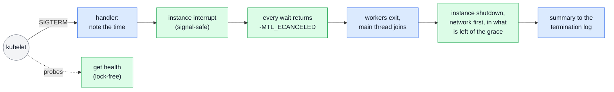

The signals are blocked before open and unblocked once the handler has the handle, so none is
lost; the library installs no handler of its own (R8). `mtl_instance_interrupt(mt, 1)` is
async-signal-safe and sticky: every data wait returns `-MTL_ECANCELED` until it is cleared, so a
worker cannot miss it between two waits. The budget counts from the signal: once the workers have
joined, the main thread calls
`mtl_instance_shutdown(mt, MTL_SHUTDOWN_ALL_REFERENCES, budget, &r, sizeof(r))` with the grace
period minus a margin. Network first, it finishes the unit on the wire, leaves the groups, stops
the devices and returns 0 (retired), 1 (quiesced: exit is safe) or `-MTL_EIO` (a port could not be
stopped: exit now); the report's summary goes to the termination message. A second signal calls
`mtl_instance_abort`, which cuts the shutdown short. The probes read the lock-free
`mtl_instance_get_health`: liveness fails only on what a restart can fix (`MTL_HEALTH_LIVENESS`),
readiness also on no link, no time lock and shutdown (`MTL_HEALTH_READINESS`); after the shutdown
began (`-MTL_ESHUTDOWN`) liveness stays 200 while readiness answers 503. The whole order is in
[deployment.md §4.2](deployment.md#42-shutdown), the probes in
[deployment.md §4.10](deployment.md#410-health-and-probes).

```c
/* ex11 — a service in a Kubernetes pod. SIGTERM interrupts every data wait (async-signal
   safe); the main thread then shuts the instance down within what is left of the grace
   period, network first, and leaves a one-line report for `kubectl describe`. A second
   signal cuts the shutdown short. Probes read one lock-free call. Needs: MS3. */
#define _POSIX_C_SOURCE 200809L
#include <mtl/experimental/mtl_observe.h>
#include <signal.h>
#include <string.h>
#include <time.h>

#include "ex_common.h"

static mtl_instance_h g_mt; /* set before the signals are unblocked */
static volatile sig_atomic_t g_signals;
static struct timespec g_term; /* when the first signal came */

static void on_term(int sig) {
  (void)sig;
  if (g_signals) {
    mtl_instance_abort(g_mt); /* the second signal: stop at the next packet */
    return;
  }
  g_signals = 1;
  clock_gettime(CLOCK_MONOTONIC, &g_term); /* async-signal-safe */
  mtl_instance_interrupt(g_mt, 1);         /* every wait returns -MTL_ECANCELED, sticky */
}

/* Called first in main(), before open and before any thread: the signals stay blocked
   (pending, never lost, even as PID 1) until the handle exists. The library installs no
   handler (mtl.h R8). */
int block_signals(sigset_t* set) {
  sigemptyset(set);
  sigaddset(set, SIGTERM);
  sigaddset(set, SIGINT);
  return sigprocmask(SIG_BLOCK, set, NULL);
}
/* After open, on the main thread; workers created before keep the signals blocked. */
int install_handlers(mtl_instance_h mt, const sigset_t* set) {
  struct sigaction sa;
  g_mt = mt;
  memset(&sa, 0, sizeof(sa));
  sa.sa_handler = on_term;
  sa.sa_mask = *set;
  if (sigaction(SIGTERM, &sa, NULL) < 0 || sigaction(SIGINT, &sa, NULL) < 0) return -1;
  return sigprocmask(SIG_UNBLOCK, set, NULL);
}

/* A worker leaves its loop on -MTL_ECANCELED: sticky, so it cannot miss the signal. */
int worker(mtl_session_h s) {
  struct mtl_unit u;
  MTL_INIT(&u);
  for (;;) {
    int ret = mtl_tx_acquire(s, &u, MTL_SEC(1));
    if (ret == -MTL_ECANCELED) return 0;
    if (ret == -MTL_EAGAIN) continue;
    if (ret < 0) return ex_fail("acquire", ret);
    ret = mtl_tx_submit(s, &u);
    if (ret < 0) return ex_fail("submit", ret);
  }
}

/* The HTTP probe handlers. Before open returns, answer 503 for all three. Startup and
   liveness fail only on what a restart can fix; readiness also on no link, no time and
   shutdown. After the shutdown began, liveness stays 200 until the process exits. */
enum probe { PROBE_STARTUP, PROBE_LIVENESS, PROBE_READINESS };
int probe_status(mtl_instance_h mt, enum probe p) {
  int flags = mtl_instance_get_health(mt, NULL, 0);
  if (flags == -MTL_ESHUTDOWN) return p == PROBE_READINESS ? 503 : 200;
  if (flags < 0) return 503;
  return (flags & (p == PROBE_READINESS ? MTL_HEALTH_READINESS : MTL_HEALTH_LIVENESS))
             ? 503
             : 200;
}

/* The main thread, after joining the workers. grace_ns: terminationGracePeriodSeconds
   minus any preStop time; the budget counts from the signal, not from now. */
int shutdown_all(mtl_instance_h mt, int64_t grace_ns) {
  struct mtl_shutdown_report r;
  struct timespec now;
  clock_gettime(CLOCK_MONOTONIC, &now);
  int64_t spent =
      (int64_t)(now.tv_sec - g_term.tv_sec) * MTL_SEC(1) + (now.tv_nsec - g_term.tv_nsec);
  int64_t budget = grace_ns - MTL_SEC(2) - spent; /* 2 s for our own exit */
  if (budget < MTL_MS(100)) budget = MTL_MS(100);
  memset(&r, 0, sizeof(r));
  /* this application owns main(): shut down for every component of the process */
  int ret = mtl_instance_shutdown(mt, MTL_SHUTDOWN_ALL_REFERENCES, budget, &r, sizeof(r));
  FILE* f = fopen("/dev/termination-log", "w"); /* the pod's terminationMessagePath */
  if (f) {
    fprintf(f, "%s\n", r.summary);
    fclose(f);
  }
  return ret < 0 ? ret : 0; /* 1: devices stopped; held memory goes at exit */
}
```

## 14. RTP passthrough: the application builds the packets

[ex12_rtp_packets.c](sketch/examples/ex12_rtp_packets.c) (MS5): with `sc.unit = MTL_UNIT_PACKETS` a
unit is a chunk of packet slots (`mtl_packet.h`), moved with the same verbs as frames. In the
picture the application writes the RTP packets and MTL does the rest.

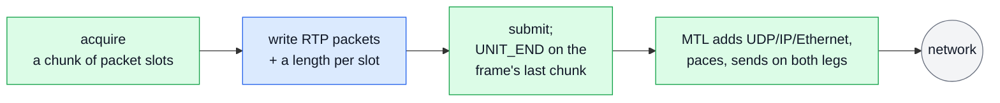

The config sets `sc.packet.packets_per_unit` and
`sc.packet.set_fields = MTL_PKT_SET_TIMESTAMP | MTL_PKT_SET_SSRC_PT`. The packet table is
`mtl_pkt_tx_table(&u)`, a slot is `mtl_pkt_slot(&u, n)`, and `MTL_SUBMIT_UNIT_END` marks the
frame's last chunk. MTL writes UDP, IP and Ethernet, and of the RTP header only the fields
`packet.set_fields` names (none by default); it paces the packets on the ST 2110-21 schedule of the
declared packet count and sends each on both legs. Receiving works the same way in reverse: chunks
of received packets with their leg, sequence number, gap and arrival time (`mtl_pkt_rx_table(&u)`),
duplicates of the two legs already removed.

```c
/* ex12 — RTP passthrough: the application builds the RTP packets, MTL adds
   UDP/IP/Ethernet, paces them on the ST 2110-21 schedule, and sends every packet on both
   ST 2022-7 legs. The same verbs as frames; a unit is a chunk of packet slots. Needs:
   MS5. */
#include <mtl/experimental/mtl_packet.h>

#include "ex_common.h"

#define PKTS_PER_FRAME 4320 /* 1080p 4:2:2 10-bit, 1200-byte payloads */
uint16_t packetise(uint8_t* slot, int64_t frame, uint32_t pkt); /* returns the length */
void inspect(const uint8_t* rtp, uint16_t len, uint8_t leg, uint32_t seq, uint16_t gap);

int open_packet_tx(mtl_instance_h mt, mtl_session_h* s) {
  struct mtl_session_config sc;
  MTL_INIT(&sc);
  sc.direction = MTL_TX;
  sc.essence = MTL_VIDEO;
  sc.unit = MTL_UNIT_PACKETS;
  mtl_flow_ipv4(&sc.flows[0], 239, 168, 85, 20, 20000);
  mtl_flow_ipv4(&sc.flows[1], 239, 168, 86, 20, 20000);
  sc.video.raster.width = 1920;
  sc.video.raster.height = 1080;
  sc.video.raster.fps = mtl_fps_rational(MTL_FPS_59_94);
  sc.video.format = MTL_YUV422_10;
  sc.packet.packets_per_unit = PKTS_PER_FRAME;
  sc.packet.set_fields =
      MTL_PKT_SET_TIMESTAMP | MTL_PKT_SET_SSRC_PT; /* the rest is ours */
  return mtl_session_create(mt, &sc, s);
}

int send_frame(mtl_session_h s, int64_t frame) {
  struct mtl_unit u;
  MTL_INIT(&u);
  for (uint32_t pkt = 0; pkt < PKTS_PER_FRAME;) {
    int ret = mtl_tx_acquire(s, &u, MTL_MS(20)); /* a chunk of packet slots */
    if (ret < 0) return ret;
    struct mtl_pkt_tx* len = mtl_pkt_tx_table(&u);
    uint32_t n = 0;
    for (; n < u.plane[0].rows && pkt < PKTS_PER_FRAME; n++, pkt++)
      len[n].len = packetise(mtl_pkt_slot(&u, n), frame, pkt);
    u.used = n;
    if (pkt == PKTS_PER_FRAME) u.flags |= MTL_SUBMIT_UNIT_END; /* the frame ends here */
    ret = mtl_tx_submit(s, &u); /* one result per chunk, if results are on */
    if (ret < 0) return ret;
  }
  return 0;
}

/* RX of a session with unit = MTL_UNIT_PACKETS: chunks of received packets, duplicates of
   the two legs already removed by RTP timestamp and sequence number. */
int receive_packets(mtl_session_h s) {
  struct mtl_unit u;
  MTL_INIT(&u);
  int ret = mtl_rx_dequeue(s, &u, MTL_MS(10));
  if (ret < 0) return ret;
  const struct mtl_pkt_rx* p = mtl_pkt_rx_table(&u);
  for (uint32_t i = 0; i < u.used; i++)
    inspect(p[i].data, p[i].len, p[i].leg, p[i].seq, p[i].gap);
  return mtl_rx_release(s, u.lease);
}
```

## 15. NMOS IS-05: switch destinations at one instant

[ex13_nmos_switch.c](sketch/examples/ex13_nmos_switch.c) (MS5: the update with its planned and
applied instants and per-leg enable; mute and `MTL_UPDATE_REAPPLY` are Phase 7). One IS-05 PATCH is
one `mtl_session_update`: destinations and leg enables (`rtp_enabled`) switch together on every leg
at one instant, at a frame boundary on the wire. The picture is one activation, from the
controller's PATCH to `/active`.

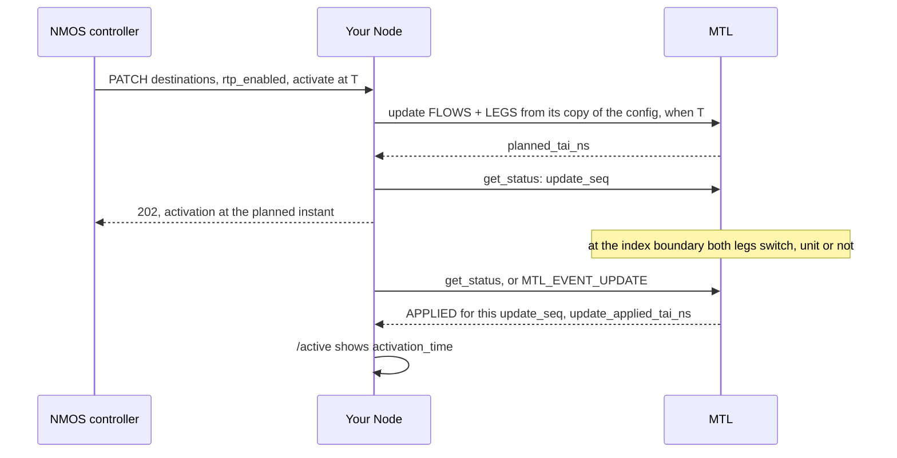

The update is all or nothing: if a leg cannot be prepared, the stream keeps its old configuration.
The switch is by the clock, so it happens whether media flows or not, and an idle sender activates
too. The Node keeps its own copy of the session's configuration and copies into it only what IS-05
changed (`ip`, `source_filter`, `udp_port`); the update reads only the members its `parts` name, so
the session's SSRC and payload type (`sc.ssrc`, `sc.payload_type`) and each leg's DSCP stay. The
call returns the instant it will switch on (the planned instant of the 202 response), or
`-MTL_EBUSY` while an earlier activation is pending; `status.update_*` and `MTL_EVENT_UPDATE` say
when it did (the applied instant, shown in `/active`). A status whose `update_seq` moved on, or
whose `update_state` is `MTL_UPDATE_STATE_FAILED`, means this activation did not apply. With
`master_enable` false the Node sets every leg in `legs_disabled`: the session is muted
(`MTL_STATUS_MUTED`) but stays RUNNING. Muting is Phase 7; until then `master_enable` false is a
stop. The update states are in [contract.md §4.7](contract.md#47-update); the contract
in [nmos-ipmx.md §11](nmos-ipmx.md#11-is-05-the-activation-contract).

```c
/* ex13 — NMOS IS-05 on one session. One PATCH is one update: new destinations and
   rtp_enabled per leg switch together at one instant, all or nothing. The call says which
   instant it switches on (the 202 response of a scheduled activation); the status says
   when it did (the 200 response of an immediate one, or /active of a scheduled one).
   master_enable stays the Node's own state: with every leg disabled the session is muted
   but RUNNING, so a disable can be scheduled too (muting is Phase 7; until then
   master_enable false is a stop). Needs: MS5. */
#include <string.h>

#include "ex_common.h"

/* sc: the Node's copy of the session's configuration (the update reads only the members
   its parts name). dest[i]: the IS-05 destination of leg i (only ip, source_filter and
   udp_port are read), or NULL to keep it; legs_disabled: the rtp_enabled bits (and every
   existing leg's bit when master_enable is false); when NULL: activate_immediate. */
int activate(mtl_session_h s, struct mtl_session_config* sc,
             const struct mtl_flow* const dest[MTL_MAX_LEGS], uint32_t legs_disabled,
             const struct mtl_when* when, int64_t* planned_tai_ns, uint64_t* seq) {
  struct mtl_session_status st;
  for (int i = 0; i < MTL_MAX_LEGS; i++) {
    if (!dest[i]) continue; /* copy only what IS-05 changed: dscp and ttl stay */
    memcpy(sc->flows[i].ip, dest[i]->ip, sizeof(dest[i]->ip));
    memcpy(sc->flows[i].source_filter, dest[i]->source_filter,
           sizeof(dest[i]->source_filter));
    sc->flows[i].udp_port = dest[i]->udp_port;
  }
  sc->legs_disabled = legs_disabled;
  /* -MTL_EBUSY while an earlier activation is pending: the Node answers 423 */
  int ret =
      mtl_session_update(s, sc, MTL_UPDATE_FLOWS | MTL_UPDATE_LEGS, when, planned_tai_ns);
  if (ret >= 0) ret = mtl_session_get_status(s, &st, sizeof(st));
  if (ret >= 0) *seq = st.update_seq; /* the Node serialises the updates of a session */
  return ret < 0 ? ex_fail("activate", ret) : 0;
}

/* 1: switched at *tai_ns (activation_time); 0: still pending; -MTL_EIO: failed
   (status.update_reason says why). */
int applied_at(mtl_session_h s, uint64_t seq, int64_t* tai_ns) {
  struct mtl_session_status st;
  int ret = mtl_session_get_status(s, &st, sizeof(st));
  if (ret < 0) return ret;
  if (st.update_seq != seq) return -MTL_EINVAL; /* not the last activation */
  if (st.update_state == MTL_UPDATE_STATE_FAILED) return -MTL_EIO;
  if (st.update_state != MTL_UPDATE_STATE_APPLIED) return 0;
  *tai_ns = st.update_applied_tai_ns;
  return 1;
}
```

## 16. The same API from C++

[examples_cpp.cpp](sketch/examples/examples_cpp.cpp) (MS5; `cpp_sender`: MS1): `MTL_INIT`, typed
handles and options work unchanged from C++17. Options are an array in the config
(`MTL_OPT_LATE_POLICY` = `MTL_LATE_DROP`); absent means the default. An RAII guard, `TxLease`,
releases a lease that was not submitted; the picture shows what it holds after each call. It
mirrors the lease rule of `mtl_tx_submit`: on failure of a first submit the slot goes back to the
pool without a result, so after a submit, successful or not, nothing is held.

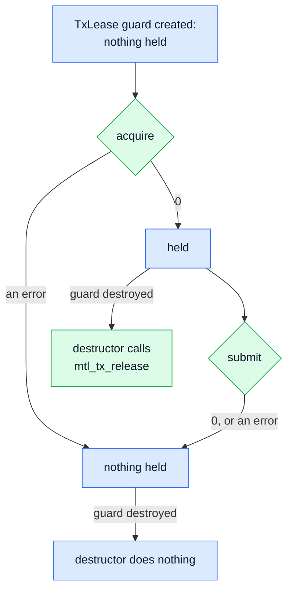

Results are read with `sizeof(r[0])` as the record size, so a larger record type stays safe.

The second function is a test bench that needs no NIC: an instance on `null:1` with the test clock (the faults `MTL_FAULT_TEST_CLOCK` and `MTL_FAULT_CLOCK_ADVANCE` of `mtl_debug_inject`; each advance completes the units that fell due, on the caller's thread), a capacity dry
run (`mtl_session_query` with `MTL_QUERY_CHECK_CAPACITY`, `-MTL_ENOSPC` with a `CAPACITY_*` reason), a start at a TAI instant (`struct mtl_when` with `MTL_AT_TAI`),
full timing records (`mtl_tx_reap_full`; the NIC launch time only when `MTL_TXF_OBSERVED_LEG0` is set), an injected loss of the time source (`mtl_debug_inject`, debug builds), and the instance's events (`mtl_instance_read_events`).

```cpp
// examples_cpp.cpp — the core API from C++17: MTL_INIT, typed handles, options, an RAII
// lease guard and a typed result read; then a test bench on the null backend: a capacity
// dry run, a start at a TAI instant, the full timing record, the test clock, an injected
// fault and the instance's events. Bindings follow the same pattern. Needs: MS5 (the
// capacity check; cpp_sender alone: MS1).
#include <mtl/experimental/mtl.h>
#include <mtl/experimental/mtl_debug.h>
#include <mtl/experimental/mtl_events.h>
#include <mtl/experimental/mtl_observe.h>
#include <mtl/experimental/mtl_options.h>

#include <array>
#include <cstdio>

extern volatile int g_running;

namespace {

// Releases an acquired TX lease unless it was handed to submit (which consumes it, also
// on failure).
class TxLease {
 public:
  explicit TxLease(mtl_session_h s) : s_(s) {
    MTL_INIT(&u_);
  }
  ~TxLease() {
    if (held_) mtl_tx_release(s_, u_.lease);
  }
  TxLease(const TxLease&) = delete;
  TxLease& operator=(const TxLease&) = delete;
  int acquire(int64_t timeout_ns) {
    int ret = mtl_tx_acquire(s_, &u_, timeout_ns);
    held_ = ret == 0;
    return ret;
  }
  int submit() {
    held_ = false;
    return mtl_tx_submit(s_, &u_);
  }
  mtl_unit& unit() {
    return u_;
  }

 private:
  mtl_session_h s_;
  mtl_unit u_;
  bool held_ = false;
};

void video_tx_config(mtl_session_config* sc) {
  MTL_INIT(sc);
  sc->direction = MTL_TX;
  sc->essence = MTL_VIDEO;
  sc->flags = MTL_SESSION_RESULTS;
  sc->video.raster.width = 1920;
  sc->video.raster.height = 1080;
  sc->video.raster.fps = mtl_fps_rational(MTL_FPS_59_94);
  sc->video.format = MTL_YUV422_10;
  sc->flows[0].ip[0] = 239;
  sc->flows[0].ip[1] = 168;
  sc->flows[0].ip[2] = 85;
  sc->flows[0].ip[3] = 20;
  sc->flows[0].udp_port = 20000;
}

// Prints the pending events of the instance (ports, time, schedulers, health) without
// waiting; the same loop reads a session's with mtl_session_read_events.
void print_instance_events(mtl_instance_h mt) {
  std::array<mtl_event, 8> ev{};
  int n;
  while ((n = mtl_instance_read_events(mt, ev.data(), static_cast<uint32_t>(ev.size()),
                                       0)) > 0)
    for (int i = 0; i < n; i++)
      std::printf("%s: event %u, %s\n", ev[i].origin_name, ev[i].type,
                  mtl_reason_name(ev[i].reason));
}

// Moves the test clock (mtl_debug.h) by ns.
int advance(mtl_instance_h mt, int64_t ns) {
  mtl_fault_params f;
  MTL_INIT(&f);
  f.step_ns = ns;
  return mtl_debug_inject(MTL_OBJ_OF_INSTANCE(mt), MTL_FAULT_CLOCK_ADVANCE, &f);
}

}  // namespace

int cpp_sender(mtl_instance_h mt) {
  mtl_session_config sc;
  video_tx_config(&sc);
  // a tuning knob: options are absent unless set, and absent means the default
  const std::array<mtl_option, 1> opts{
      {{MTL_OPT_LATE_POLICY, 0, MTL_LATE_DROP, nullptr}}};
  sc.options = opts.data();
  sc.option_count = static_cast<uint32_t>(opts.size());

  mtl_session_h s = MTL_NULL(mtl_session_h);
  int ret = mtl_session_create(mt, &sc, &s);
  if (ret >= 0) ret = mtl_session_start(&s, 1, nullptr, nullptr);
  while (ret >= 0 && g_running) {
    TxLease lease(s);
    ret = lease.acquire(MTL_MS(100));
    if (ret == -MTL_EAGAIN) {
      ret = 0;
      continue;
    }
    if (ret == 0) ret = lease.submit();
    std::array<mtl_tx_result, 8> r{};
    int n = mtl_tx_reap(s, r.data(), static_cast<uint32_t>(r.size()), 0);
    for (int i = 0; i < n; i++)
      if (r[i].status != MTL_TX_ON_TIME)
        std::printf("unit %llu: %s\n", static_cast<unsigned long long>(r[i].seq),
                    mtl_reason_name(r[i].reason));
  }
  mtl_session_close(s, MTL_SEC(1));
  return ret;
}

// No NIC, no root, no hugepages: a null port, and a clock that moves only when told
// (mtl_debug.h: a debug build of the library, else -MTL_ENOTSUP).
int cpp_test_bench() {
  mtl_port_spec port{};
  std::snprintf(port.name, sizeof(port.name), "null:1");
  mtl_instance_params p;
  MTL_INIT(&p);
  p.port_count = 1;
  p.ports = &port;
  mtl_instance_h mt = MTL_NULL(mtl_instance_h);
  int ret = mtl_instance_open(&p, &mt);
  if (ret < 0) return ret;
  mtl_fault_params clock;  // rate {0, 0}: the clock moves only by CLOCK_ADVANCE
  MTL_INIT(&clock);
  ret = mtl_debug_inject(MTL_OBJ_OF_INSTANCE(mt), MTL_FAULT_TEST_CLOCK, &clock);

  // the dry run of create: grants, and with CHECK_CAPACITY also the free capacity
  mtl_session_config sc;
  video_tx_config(&sc);
  mtl_session_info info{};
  if (ret >= 0)
    ret = mtl_session_query(mt, &sc, MTL_QUERY_CHECK_CAPACITY, &info, sizeof(info),
                            nullptr, 0);
  if (ret == -MTL_ENOSPC) {
    mtl_error_info e{};
    mtl_last_error(&e, sizeof(e));
    std::printf("no room: %s\n", mtl_reason_name(e.reason));  // a CAPACITY_* reason
  }

  mtl_session_h s = MTL_NULL(mtl_session_h);
  if (ret >= 0) ret = mtl_session_create(mt, &sc, &s);

  // start at an instant: 100 ms from now on the instance clock
  int64_t now = 0;
  if (ret >= 0) ret = mtl_time_now(mt, &now, nullptr, nullptr);
  mtl_when when{};
  when.kind = MTL_AT_TAI;
  when.value = now + MTL_MS(100);
  if (ret >= 0) ret = mtl_session_start(&s, 1, &when, nullptr);
  // each advance completes, on this thread, every unit that fell due (mtl_debug.h)
  for (int i = 0; ret >= 0 && i < 3; i++) {
    TxLease lease(s);
    ret = lease.acquire(0);
    if (ret == 0) ret = lease.submit();
    if (ret >= 0) ret = advance(mt, MTL_MS(50));
  }

  // the full timing record; the NIC launch time is valid only when flagged
  std::array<mtl_tx_result_full, 4> full{};
  int n = ret < 0
              ? 0
              : mtl_tx_reap_full(s, full.data(), static_cast<uint32_t>(full.size()), 0);
  for (int i = 0; i < n; i++)
    if (full[i].detail_flags & MTL_TXF_OBSERVED_LEG0)
      std::printf("launch error %lld ns\n",
                  static_cast<long long>(full[i].observed_first_tai_ns[0] -
                                         full[i].scheduled_tai_ns));

  // the time source is lost on purpose: the instance posts MTL_EVENT_TIME_STATE
  mtl_fault_params f;
  MTL_INIT(&f);
  if (ret >= 0) ret = mtl_debug_inject(MTL_OBJ_OF_INSTANCE(mt), MTL_FAULT_TIME_LOST, &f);
  if (ret >= 0) ret = advance(mt, MTL_SEC(1));
  if (ret >= 0) print_instance_events(mt);

  mtl_session_close(s, MTL_SEC(1));
  mtl_instance_close(mt, MTL_SEC(1));
  return ret;
}
```

## 17. ANC: captions, an SCTE-104 relay, a raw relay, timecode and a dump

[ex14_anc.c](sketch/examples/ex14_anc.c) (MS4a2; the dump's detail: MS2). An ANC unit is the ANC
packets of one frame or field: the packet table in plane 0, one `struct mtl_anc_packet` per entry,
and the words in plane 1; `used` counts the entries. The picture shows where the entries of a TX
unit come from: words the application makes (the caption inserter, the timecode), or entries
copied from a received unit (the two relays). Either way `mtl_anc_put` appends one packet with its
words.

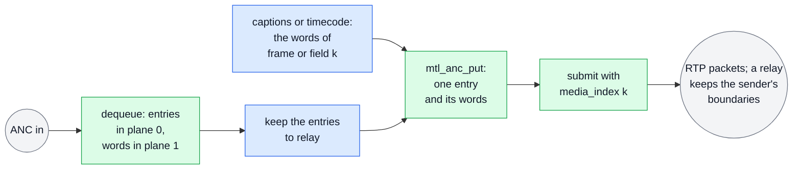

With the default 8-bit words MTL writes the parity, Data_Count and checksum; with
`MTL_ANC_WORDS_RAW` a relay carries every word as received. MTL packs the entries into RTP packets
of at most 1432 bytes and 255 ANC packets, a new one where an entry carries `MTL_ANCF_NEW_RTP`,
which RX sets on the first entry of each packet it received, so a relay keeps the sender's
boundaries by copying entries. Every entry RX delivers is a valid TX entry. The SCTE-104 relay
keeps the input's media index, so its RTP equals the input's, and forwards no damaged message
whole: from an entry marked `MTL_ANCF_GAP_BEFORE` on, its entries are dropped. A unit with no entries sends the empty packet that keeps the
stream alive, and so does a frame with no unit. The dump reads the same table on RX and prints
each entry with its location, its RTP packet and its flags.

```c
/* ex14 — ANC units (ST 2110-40): a caption inserter, an SCTE-104 relay that keeps the
   sender's RTP packet boundaries and drops damaged messages, a raw relay that changes no
   bit, timecode in both fields of an interlaced stream, and a receiver that dumps what
   arrives. A unit is the ANC packets of one frame or field: the table in plane 0, the
   words in plane 1. MTL writes the RTP packets and, outside the raw mode, every parity
   bit and checksum. DIDs and SDIDs are the SMPTE registry's. Needs: MS4a2 (the dump's
   detail: MS2). */
#include <inttypes.h>
#include <mtl/experimental/mtl_observe.h>
#include <mtl/experimental/mtl_util.h>

#include "ex_common.h"

uint8_t cdp_for_frame(int64_t frame, uint8_t cdp[255]); /* a CEA-708 CDP: its length */
void atc_vitc_words(int64_t field, uint8_t udw[16]);    /* ST 12-2 ATC_VITC of a field */

#define FRAME_NS_59_94 ((int64_t)1001 * 1000000000 / 60000) /* 16 683 333 ns */

/* A located ANC packet without a horizontal position. */
static struct mtl_anc_packet anc_at(uint8_t did, uint8_t sdid, uint16_t line, uint8_t n) {
  struct mtl_anc_packet p;
  memset(&p, 0, sizeof(p));
  p.did = did;
  p.sdid = sdid;
  p.line = line;
  p.hoffset = MTL_ANC_HOFFSET_ANY;
  p.udw_count = n;
  return p;
}

/* 1. Captions on a progressive session: one CDP per frame on line 9 (DID 61h, SDID 01h).
   A frame the producer misses still gets its empty keep-alive packet. (On an interlaced
   session the index counts fields: 2 x frame, and 2 x frame + 1 for the second field.) */
int insert_captions(mtl_session_h s, int64_t frame) {
  struct mtl_unit u;
  MTL_INIT(&u);
  int ret = mtl_tx_acquire(s, &u, MTL_MS(20));
  if (ret < 0) return ret;
  uint8_t cdp[255];
  struct mtl_anc_packet p = anc_at(0x61, 0x01, 9, cdp_for_frame(frame, cdp));
  ret = mtl_anc_put(&u, &p, cdp, sizeof(cdp), NULL);
  if (ret < 0) {
    mtl_tx_release(s, u.lease);
    return ret;
  }
  u.media_index = frame; /* MTL_MEDIA_INDEX: the RTP timestamp of video frame `frame` */
  return mtl_tx_submit(s, &u);
}

/* 2. An SCTE-104 relay (DID 41h, SDID 07h), 8-bit sessions. The TX session keeps the
   input's index (MTL_MEDIA_INDEX), so RTP equals the input RTP, and goes out one frame
   later than its own window (the live-ANC rule: an RX unit completes after its window),
   so its launch delay is one frame period plus the pick-up lead. */
int open_relay_tx(mtl_instance_h mt, mtl_session_h* s) {
  struct mtl_session_config sc;
  MTL_INIT(&sc);
  sc.direction = MTL_TX;
  sc.essence = MTL_ANC;
  mtl_flow_ipv4(&sc.flows[0], 239, 168, 85, 42, 40004);
  sc.media_mode = MTL_MEDIA_INDEX;
  sc.min_tx_delay_ns = FRAME_NS_59_94 + MTL_MS(1); /* one frame + the pick-up lead */
  sc.anc.video.width = 1920;
  sc.anc.video.height = 1080;
  sc.anc.video.fps = mtl_fps_rational(MTL_FPS_59_94);
  return mtl_session_open(mt, &sc, s);
}
/* Entries are copied unchanged: RX marked the first entry of each RTP packet
   MTL_ANCF_NEW_RTP, so the boundaries stay. A message with a gap (a packet skipped as
   corrupt, or lost) is not forwarded whole: its entries from the gap on are dropped, and
   an input unit with nothing left still gives an empty output unit. */
int relay_scte104(mtl_session_h rx, mtl_session_h tx) {
  struct mtl_unit in, out;
  MTL_INIT(&in);
  MTL_INIT(&out);
  int ret = mtl_rx_dequeue(rx, &in, MTL_MS(50));
  if (ret < 0) return ret;
  if (in.flags & MTL_UNITF_INDEX_VALID)
    ret = mtl_tx_acquire(tx, &out, MTL_MS(10));
  else
    ret = -MTL_EAGAIN; /* no index to keep: skip the unit */
  if (ret == 0) {
    const struct mtl_anc_packet* t = mtl_anc_table(&in);
    int damaged = in.status == MTL_RX_INCOMPLETE;
    for (uint32_t i = 0; i < in.used && ret == 0; i++) {
      if (t[i].flags & MTL_ANCF_GAP_BEFORE) damaged = 1;
      if (t[i].did != 0x41 || t[i].sdid != 0x07 || damaged) continue;
      ret = mtl_anc_put(&out, &t[i], mtl_anc_words(&in, &t[i]), t[i].udw_count, NULL);
    }
    out.media_index = in.media_index;
    if (ret == 0)
      ret = mtl_tx_submit(tx, &out);
    else
      mtl_tx_release(tx, out.lease);
  }
  int r = mtl_rx_release(rx, in.lease);
  return ret < 0 ? ret : r;
}

/* 3. A raw relay: both sessions MTL_ANC_WORDS_RAW. Every entry, with its DID, SDID,
   Data_Count, words and checksum as received (a wrong parity or checksum included), goes
   out bit for bit; TX accepts every entry RX delivers. The relay could also be a TX
   session attached over the RX pool, sending each slot with mtl_tx_send_slot and a hold.
 */
int relay_raw(mtl_session_h rx, mtl_session_h tx) {
  struct mtl_unit in, out;
  MTL_INIT(&in);
  MTL_INIT(&out);
  int ret = mtl_rx_dequeue(rx, &in, MTL_MS(50));
  if (ret < 0) return ret;
  ret = mtl_tx_acquire(tx, &out, MTL_MS(10));
  if (ret == 0) {
    const struct mtl_anc_packet* t = mtl_anc_table(&in);
    for (uint32_t i = 0; i < in.used && ret == 0; i++)
      ret = mtl_anc_put(&out, &t[i], mtl_anc_words(&in, &t[i]),
                        (size_t)t[i].udw_count * 2, mtl_anc_raw_hdr(&in, i));
    out.media_index = in.media_index;
    if (ret == 0)
      ret = mtl_tx_submit(tx, &out);
    else
      mtl_tx_release(tx, out.lease);
  }
  int r = mtl_rx_release(rx, in.lease);
  return ret < 0 ? ret : r;
}

/* 4. Timecode in every field of 1080i29.97 (59.94 fields/s): ATC_VITC (DID 60h, SDID 60h,
   16 words). The session is interlaced, so a unit is a field: media index 2n is the first
   field of frame n (F = 0b10, lines 1-563), 2n + 1 the second (F = 0b11, lines 564-1125);
   a line of the other field is refused unless the entry says MTL_ANCF_AS_IS. */
int open_timecode(mtl_instance_h mt, mtl_session_h* s) {
  struct mtl_session_config sc;
  MTL_INIT(&sc);
  sc.direction = MTL_TX;
  sc.essence = MTL_ANC;
  mtl_flow_ipv4(&sc.flows[0], 239, 168, 85, 41, 40002);
  sc.media_mode = MTL_MEDIA_INDEX;
  sc.anc.video.width = 1920;
  sc.anc.video.height = 1080;
  sc.anc.video.scan = MTL_INTERLACED;
  sc.anc.video.fps = mtl_fps_rational(MTL_FPS_29_97); /* frames, not fields */
  sc.anc.max_packets = 2; /* small slots: 2 entries, 255 words */
  return mtl_session_open(mt, &sc, s);
}
int send_timecode(mtl_session_h s, int64_t field) {
  struct mtl_unit u;
  MTL_INIT(&u);
  int ret = mtl_tx_acquire(s, &u, MTL_MS(20));
  if (ret < 0) return ret;
  uint8_t udw[16];
  atc_vitc_words(field, udw);
  struct mtl_anc_packet p = anc_at(0x60, 0x60, (field & 1) ? 571 : 9, 16);
  ret = mtl_anc_put(&u, &p, udw, sizeof(udw), NULL);
  if (ret < 0) {
    mtl_tx_release(s, u.lease);
    return ret;
  }
  u.media_index = field;
  return mtl_tx_submit(s, &u);
}

/* 5. A dump of one received unit (an 8-bit session): every ANC packet with its location,
   its RTP packet, its flags, and what was lost. */
int dump_anc(mtl_session_h rx) {
  struct mtl_unit u;
  MTL_INIT(&u);
  int ret = mtl_rx_dequeue(rx, &u, MTL_MS(100));
  if (ret < 0) return ret;
  const struct mtl_anc_packet* t = mtl_anc_table(&u);
  printf("index %" PRId64 " rtp %" PRIu32 " %s: %" PRIu32 " packets%s\n", u.media_index,
         u.rtp, (u.flags & MTL_UNITF_SECOND_FIELD) ? "field 2" : "field 1 or frame",
         u.used, u.status == MTL_RX_INCOMPLETE ? ", incomplete" : "");
  for (uint32_t i = 0; i < u.used; i++) {
    const uint8_t* w = (const uint8_t*)mtl_anc_words(&u, &t[i]);
    printf("  rtp %u did %02x sdid %02x line %u hoffset %u c %u stream %d words %u%s%s%s",
           t[i].rtp_index, t[i].did, t[i].sdid, t[i].line, t[i].hoffset,
           t[i].flags & MTL_ANCF_C ? 1u : 0u, t[i].flags & MTL_ANCF_S ? t[i].stream : -1,
           t[i].udw_count, t[i].flags & MTL_ANCF_NEW_RTP ? " new-rtp" : "",
           t[i].flags & MTL_ANCF_GAP_BEFORE ? " gap-before" : "",
           t[i].flags & MTL_ANCF_AS_IS ? " as-is" : "");
    if (t[i].udw_count) printf(" first %02x", w[0]);
    printf("\n");
  }
  struct mtl_rx_detail d;
  if (u.status == MTL_RX_INCOMPLETE && mtl_rx_get_detail(rx, u.lease, &d, sizeof(d)) >= 0)
    printf("  lost runs %" PRIu32 ", corrupt %" PRIu32 ", beyond capacity %" PRIu32 "\n",
           d.missing_ranges, d.anc_skipped, d.anc_truncated);
  return mtl_rx_release(rx, u.lease);
}
```

## 18. A live sink: presentation time to media time

[ex15_live_sink.c](sketch/examples/ex15_live_sink.c) (MS3: `media_time_offset_ns`; TAI mode and
the copy: MS1; discard: MS2) is the TX side of a framework (a GStreamer sink with `sync=TRUE`, `ffmpeg -re`, an
OBS output) or of a playout engine on a wall clock. Each buffer comes with a presentation time on
`CLOCK_MONOTONIC`; the picture follows one buffer from the framework to the wire and back to its
report.

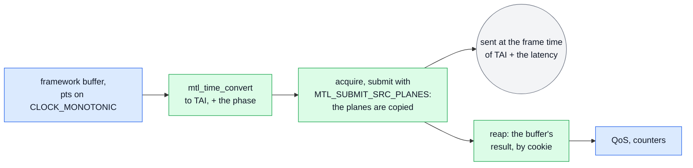

The session is `MTL_MEDIA_TAI` with snap NEAREST, the default, and `MTL_SESSION_RESULTS`. Its
`media_time_offset_ns` declares the producer's latency D: a buffer handed over just in time,
about at its presentation time, still meets the frame time D later, and the RTP stays that frame
time's. D must cover `latency_min_ns` (how long before its frame time MTL takes a unit) plus
`convert_ns` (the copy inside submit) plus a margin: `sink_start` reads both from
`mtl_session_get_info`, and when the framework's latency is short of them, it closes the CREATED
session, which retires at once, and creates it again with enough; the sink reports D as its
latency. The phase from `mtl_grid_offset`, computed once at the first buffer, puts the buffers on
frame times, so that two of them land on one frame time only when the producer runs fast: the
second is `DROPPED` with `SNAP_COLLISION`, and one that came after its frame time's pick-up with
`TOO_LATE`; the sink counts both and reports each buffer by its `cookie`. `MTL_SUBMIT_SRC_PLANES`
copies the framework's planes during submit, so the buffer is the framework's again when render
returns, and the slot stays the back-pressure token. EOS is a DRAIN stop, a seek a discard;
`unlock` is the interrupt. The numbers and the GStreamer render-delay variant:
[migration.md §12.1](migration.md#121-live-sinks-gstreamer-synctrue-ffmpeg--re-obs-output),
[timing.md §10.5](timing.md#105-recipes).

```c
/* ex15 — a live sink (GStreamer sync=TRUE, ffmpeg -re, an OBS output, a playout engine on
   a wall clock): each buffer's presentation time on CLOCK_MONOTONIC becomes its TAI media
   time, and the session declares the producer's latency (media_time_offset_ns), so a
   buffer handed over just in time still makes its frame time. Submit copies the
   framework's planes (MTL_SUBMIT_SRC_PLANES), so the buffer is the framework's again when
   render returns; the result, by cookie, is that buffer's report (QoS). EOS drains; a
   seek discards. Needs: MS3 (media_time_offset_ns; TAI mode and the copy: MS1; discard:
   MS2). */
#include <mtl/experimental/mtl_reasons.h>
#include <mtl/experimental/mtl_sync.h>

#include "ex_common.h"

/* The framework's buffer: planes in its own memory, a presentation time on
   CLOCK_MONOTONIC (GStreamer: base_time + running time + latency; FFmpeg:
   start_time_realtime + pts), and the id its report names. */
struct fw_buffer {
  uint64_t id;
  int64_t pts_monotonic_ns;
  const void* plane[MTL_MAX_PLANES];
  uint32_t stride[MTL_MAX_PLANES];
};
/* The framework's QoS for one buffer (GStreamer: a QoS event when it was dropped). */
void fw_report(uint64_t id, uint32_t status, uint32_t reason, int64_t margin_ns);

struct live_sink {
  mtl_instance_h mt;
  mtl_session_h s;
  struct mtl_rational fps; /* the session's raster.fps */
  int64_t offset_ns;       /* the declared latency, media_time_offset_ns */
  int64_t phase_ns;        /* mtl_grid_offset at the first buffer; -1 before it */
  uint64_t collisions;     /* DROPPED, SNAP_COLLISION: two buffers for one frame time */
  uint64_t late;           /* DROPPED, TOO_LATE: the latency did not cover the producer */
};

/* base: flows, raster, format and app_format from the framework's caps. */
static int sink_create(struct live_sink* k, const struct mtl_session_config* base) {
  struct mtl_session_config sc = *base;
  sc.media_mode = MTL_MEDIA_TAI;   /* snapped to the nearest frame time, the default */
  sc.flags |= MTL_SESSION_RESULTS; /* a result per buffer, by cookie */
  sc.media_time_offset_ns = k->offset_ns;
  return mtl_session_create(k->mt, &sc, &k->s);
}

/* set_caps or write_header. upstream_ns: the latency the framework allows (GStreamer: its
   pipeline latency; FFmpeg: -muxdelay). The declared latency must cover what MTL needs
   before a frame time (latency_min_ns) and the copy inside submit (convert_ns, calibrated
   at create); when upstream_ns is short of it, the CREATED session, which retires at
   once, is created again with enough. *latency_ns: the latency the sink reports. */
int sink_start(struct live_sink* k, mtl_instance_h mt,
               const struct mtl_session_config* base, int64_t upstream_ns,
               int64_t* latency_ns) {
  struct mtl_session_info info;
  k->mt = mt;
  k->fps = base->video.raster.fps;
  k->offset_ns = upstream_ns;
  k->phase_ns = -1;
  k->collisions = k->late = 0;
  int ret = sink_create(k, base);
  if (ret >= 0) ret = mtl_session_get_info(k->s, &info, sizeof(info));
  if (ret >= 0 && info.latency_min_ns + info.convert_ns + MTL_MS(1) > k->offset_ns) {
    mtl_session_close(k->s, 0);
    k->offset_ns = info.latency_min_ns + info.convert_ns + MTL_MS(1);
    ret = sink_create(k, base);
  }
  if (ret >= 0) ret = mtl_session_start(&k->s, 1, NULL, NULL);
  *latency_ns = k->offset_ns;
  return ret < 0 ? ex_fail("sink start", ret) : 0;
}

static int sink_reap(struct live_sink* k) {
  struct mtl_tx_result r[8];
  int n;
  while ((n = mtl_tx_reap(k->s, r, 8, 0)) > 0)
    for (int i = 0; i < n; i++) {
      if (r[i].status == MTL_TX_DROPPED && r[i].reason == MTL_REASON_SNAP_COLLISION)
        k->collisions++;
      if (r[i].status == MTL_TX_DROPPED && r[i].reason == MTL_REASON_TOO_LATE) k->late++;
      fw_report(r[i].cookie, r[i].status, r[i].reason, r[i].margin_ns);
    }
  return n == -MTL_EAGAIN ? 0 : n;
}

/* render, show_frame or write_packet: 0 = handed over (its report follows);
   -MTL_ECANCELED after unlock (the framework's FLUSHING); another negative code on an
   error. */
int sink_render(struct live_sink* k, const struct fw_buffer* buf) {
  struct mtl_unit u;
  int64_t tai = 0;
  int ret;
  MTL_INIT(&u);
  do { /* a full pool waits; unread results would block acquire, so reap in between */
    ret = sink_reap(k);
    if (ret >= 0) ret = mtl_tx_acquire(k->s, &u, MTL_MS(20));
  } while (ret == -MTL_EAGAIN && g_running);
  if (ret < 0) return ret;
  ret = mtl_time_convert(k->mt, buf->pts_monotonic_ns, MTL_CLOCK_MONOTONIC, MTL_CLOCK_TAI,
                         &tai);
  /* once: the phase that puts the first buffer, after the declared latency, on a frame
     time, so buffers that follow at the frame rate snap to their own frame times
     (timing.md §10.5) */
  if (ret >= 0 && k->phase_ns < 0)
    ret = mtl_grid_offset(tai + k->offset_ns, k->fps, &k->phase_ns);
  if (ret < 0) {
    mtl_tx_release(k->s, u.lease);
    return ret;
  }
  u.media_tai_ns = tai + k->phase_ns; /* MTL adds media_time_offset_ns, then snaps */
  u.flags = MTL_SUBMIT_SRC_PLANES;    /* the framework's planes: submit copies them */
  u.cookie = buf->id;
  for (uint32_t i = 0; i < u.plane_count; i++) {
    u.plane[i].addr = (void*)buf->plane[i];
    u.plane[i].stride = buf->stride[i];
  }
  return mtl_tx_submit(k->s, &u); /* on a failure the slot goes back, without a result */
}

/* EOS: every queued buffer is sent and reported, then the framework posts EOS. A seek
   after it finds the session STOPPED: start it again with the next buffer. */
int sink_eos(struct live_sink* k) {
  int ret = mtl_session_stop(&k->s, 1, MTL_STOP_DRAIN, MTL_SEC(2));
  int r = sink_reap(k);
  return ret < 0 ? ret : r;
}

/* FLUSH_STOP (a seek): queued buffers are FLUSHED (DISCARD) and reported; TAI needs no
   rebase, and the phase stays. */
int sink_flush(struct live_sink* k) {
  int ret = mtl_session_discard(k->s, 0, 0);
  int r = sink_reap(k);
  return ret < 0 ? ret : r;
}

/* unlock (on = 1) and unlock_stop (on = 0), from another thread: an acquire waiting in
   sink_render returns -MTL_ECANCELED at once. */
int sink_unlock(struct live_sink* k, int on) {
  return mtl_session_interrupt(k->s, on);
}

/* stop: sends what is queued, then retires. */
int sink_stop(struct live_sink* k) {
  if (k->collisions || k->late)
    fprintf(stderr, "sink: %llu buffers shared a frame time, %llu came too late\n",
            (unsigned long long)k->collisions, (unsigned long long)k->late);
  int ret = mtl_session_close(k->s, MTL_SEC(1));
  return ret < 0 ? ret : 0; /* MTL_RETIRING: it retires on its own */
}
```

## 19. Audio received as host PCM

[ex17_audio_rx.c](sketch/examples/ex17_audio_rx.c) (MS4; `media_index` from MS3) reads audio
units the way an AES67 or ST 2110-30 bridge, or a framework's audio source, needs them: as
samples in the host's byte order, with the index of the first one. The picture is one unit.

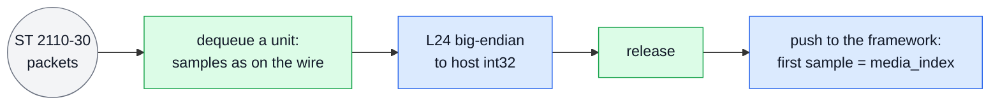

Plane 0 has one row per sample time (`row_bytes` = channels × bytes per sample), the channels
interleaved and each sample big-endian, as on the wire; MTL never swaps them. `u.used` counts the
bytes, so the unit holds `u.used / row_bytes` sample times (`sc.audio.unit_samples` at most).
`u.media_index`, valid with `MTL_UNITF_INDEX_VALID`, is the unit's first sample on the epoch at
the sample rate, so the next unit starts at `media_index` + those sample times. A jump in it is
lost time: `u.missed_before` counts the units a full pool could not take, and packets lost inside
a unit read as zero, silence, with `u.status == MTL_RX_INCOMPLETE`. The samples are copied out
before the release, so the lease goes back at once.

```c
/* ex17 — audio received as host PCM (an AES67 or ST 2110-30 bridge, a framework audio
   source). Plane 0 holds the samples as on the wire: one row per sample time, the
   channels interleaved, each sample big-endian (L24: three bytes); MTL never swaps them,
   so the reader does. media_index is the unit's first sample, counted on the epoch at the
   sample rate, so a jump in it is lost time: missed_before counts the units a full pool
   could not take, and the packets lost inside a unit read as zero, silence, with status
   MTL_RX_INCOMPLETE. s: a started RX session, MTL_AUDIO with MTL_PCM24. Needs: MS4 (audio
   MS4a1; media_index valid from MS3). */
#include "ex_common.h"

/* The framework's push: frames of interleaved int32 samples; first = the epoch index of
   the first sample (-1 = unknown); discont = 1 after lost time (GStreamer DISCONT). */
int push_pcm(const int32_t* pcm, uint32_t frames, int64_t first, int discont);

/* pcm: room for cap samples (frames x channels). */
int rx_audio(mtl_session_h s, int32_t* pcm, uint32_t cap) {
  struct mtl_unit u;
  int64_t next = -1; /* the sample expected next */
  int ret = 0;
  MTL_INIT(&u);
  while (ret >= 0 && g_running) {
    ret = mtl_rx_dequeue(s, &u, MTL_MS(100));
    if (ret == -MTL_EAGAIN) { /* no signal */
      ret = 0;
      continue;
    }
    if (ret < 0) break;
    const struct mtl_plane* p = &u.plane[0];
    uint32_t channels = p->row_bytes / 3, got = u.used / p->row_bytes; /* sample times */
    uint32_t frames = got * channels > cap ? cap / channels : got;
    for (uint32_t f = 0; f < frames; f++) {
      const uint8_t* b = (const uint8_t*)p->addr + (size_t)f * p->stride;
      for (uint32_t c = 0; c < channels; c++, b += 3) /* L24 big-endian, left-justified */
        pcm[f * channels + c] =
            (int32_t)((uint32_t)b[0] << 24 | (uint32_t)b[1] << 16 | (uint32_t)b[2] << 8);
    }
    int valid = (u.flags & MTL_UNITF_INDEX_VALID) != 0;
    int discont = u.missed_before > 0 || (u.flags & MTL_UNITF_DISCONTINUITY) ||
                  (valid && next >= 0 && u.media_index != next);
    int64_t first = valid ? u.media_index : -1;
    next = valid ? first + got : -1;
    ret = mtl_rx_release(s, u.lease); /* copied: release before the push */
    if (ret >= 0) ret = push_pcm(pcm, frames, first, discont);
  }
  return ret < 0 ? ex_fail("audio rx", ret) : 0;
}
```

## 20. An st20p program side by side

| st20p today | Unified API |
|---|---|
| `mtl_init(&mtl_init_params)` | `mtl_instance_open(&params, &mt)`; `MTL_INSTANCE_SHARED` for plugins sharing one instance |
| `st20p_tx_create(mt, &ops)` returns a handle or NULL | `mtl_session_open(mt, &sc, &s)` (or `create` + `start`) returns an `MTL_E*` code; `mtl_last_error()` names the field |
| live immediately | `mtl_session_start` (now, at a TAI instant, or at a media index), several sessions at once |
| `st20p_tx_get_frame` → NULL for timeout, stop or destroy | `mtl_tx_acquire` → `-MTL_EAGAIN` (nothing yet), `-MTL_ESHUTDOWN` (you, or the process's owner, stopped or closed it), `-MTL_EIO` (it failed) |
| `frame->addr[]`, `frame->linesize[]` | `u.plane[i].addr`, `u.plane[i].stride` |
| `frame->timestamp`, `tfmt`, `USER_PACING`, `USER_TIMESTAMP` | `sc.media_mode` + `u.media_index` or `u.media_tai_ns`; `MTL_SUBMIT_NOT_BEFORE`/`EXACT` + `u.launch_tai_ns`; `MTL_SUBMIT_RTP_TS` + `u.rtp` |
| `st20p_tx_put_frame`, `st20p_tx_put_frame_abort` | `mtl_tx_submit`, `mtl_tx_release` |
| `st20p_tx_put_ext_frame` | an attached pool (`mtl_session_attach`) + `mtl_tx_acquire_slot` |
| `notify_frame_done` on a library thread or tasklet | `mtl_tx_reap` on the application's thread (results on), or nothing |
| `notify_frame_late` | result `status`, `reason`, `margin_ns` |
| `st20p_tx_wake_block` | `mtl_session_interrupt` (sticky, returns at once) |
| `st20p_tx_free` | `mtl_session_close(s, timeout)`: drain, destroy, wait for retirement |
| `st20p_tx_get_session_stats` | `mtl_stat_read` / `mtl_stat_get` (`mtl_observe.h`), cumulative, by name |
| `st*_update_destination` / `update_source` | `mtl_session_update(s, &sc, MTL_UPDATE_FLOWS, &when, NULL)`, atomic across legs |
| `ST20_TYPE_RTP_LEVEL` + `st20_tx_get_mbuf`/`put_mbuf` | `unit = MTL_UNIT_PACKETS` + `mtl_tx_acquire`/`mtl_tx_submit` ([§14](#14-rtp-passthrough-the-application-builds-the-packets), ex12) |
| `ST20_TYPE_SLICE_LEVEL` | `unit = MTL_UNIT_ROWS` ([§10](#10-rows-that-leave-before-the-frame-is-finished), ex08) |
| `ST_EVENT_VSYNC` | `MTL_EVENT_EPOCH_TICK` with the option `session.epoch_tick` |
| `ST20P_TX_FLAG_*` tuning bits, `mtl_init_params` tuning fields | option keys `MTL_OPT_*` (`mtl_options.h`) in the config's `options` array |
| `ops.fps`, `ops.interlaced` | `mtl_raster_from_legacy(ops.fps, ops.interlaced, &raster)`: a rational frame rate; interlaced, legacy `ops.fps` counts fields and the helper halves it |
| `ops.transport_fmt`, `input_fmt`, `transport_packing`, `transport_pacing` | `mtl_video_format_from_legacy`, `mtl_app_format_from_legacy`, `mtl_packing_from_legacy`, `mtl_sender_type_from_legacy` (`mtl_legacy.h`, inline): +1 for the formats, the same values for packing and sender type |
