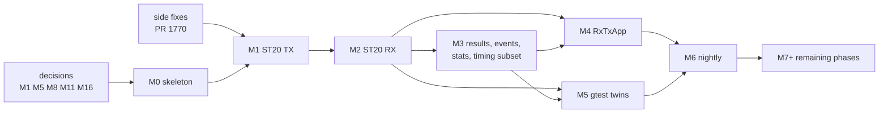

# Implementation plan: ST 2110-20 first

| | |
|---|---|
| Status | Plan for the implementation branch. Nothing is implemented. The maintainer decisions M1–M17 are open ([decisions.md](decisions.md)); this plan names the ones each step needs |
| Date | 2026-10-02 |
| Folded from | the earlier design files 14 (roadmap), 13 (guarantees and tests), 01 §5–§7, 00-summary, 11, 16 §11; REVISION-4.md, DECISIONS.md, OPEN-QUESTIONS.md, side-findings.md; research notes 05 §4–§5 and 07; studies S1, S8 §8 and the R4 coverage check §8; the Kubernetes study K1 §10; reviews C1 (risks) and C5 (response) |
| Baseline | `main` @ `545a266a`; the headers in [sketch/include/mtl/experimental/](sketch/include/mtl/experimental/) (17 headers, 125 functions plus 14 under `MTL_LATER`, `mtl.h` 32) |

The headers are normative. Every name in this plan is a header name; where a name of the
engine is new (the slot interface), it is marked indicative.

Names: M0–M6 (with M3a, M3b) and M7+ are the milestones of this branch (§5); the maintainer
decisions M1–M17 (§3.1) are written "decision Mn" wherever both could be meant.

## 1. Goal and non-goals

The branch has three goals, in this order:

1. implement the unified API for ST 2110-20 video (`sc.essence = MTL_VIDEO`, `sc.unit =
   MTL_UNIT_FRAME`), TX and RX, over today's st20p pipeline;
2. move RxTxApp (`tests/tools/RxTxApp/`) and the ST20 gtests (`tests/integration_tests/`) to it;
3. run the nightly (`.github/workflows/nightly-gtest.yml`, and the st20p part of
   `nightly-pytest.yml`) on it, and compare every result with the legacy run of the same night.

Non-goals for the branch:

- no other essence: cvideo, audio, ANC, fastmeta and generic RTP stay on the legacy API (M7+);
- no packet units (`MTL_UNIT_PACKETS`, phase 2P after Phase 2, M14) and no row units
  (`MTL_UNIT_ROWS`, Phase 6 progressive);
- no imported memory or attached pools (`mtl_mem.h`, Phase 4), unless the maintainer pulls the
  ST20 part forward (§5.6);
- no timelines, start arrays across sessions, or A/V/ANC alignment (Phase 3), beyond the ST20
  timing subset of §5.4;
- no flow updates or leg control (`mtl_session_update`, Phase 2);
- nothing of Phase 7: NMOS contract extras, `mtl_sdp.h`, `mtl_rtcp.h`, `mtl_crypto.h`, IPMX
  (D-98). Their declarations stay under `MTL_LATER`;
- the legacy API does not change for its users. Engine fixes reach it (bugfixes on, wire changes
  opt-in, D-24), and the legacy gate (§8.5) passes at every milestone;
- "replace the API" in the gtests means a twin per legacy case, not a deletion: the legacy
  suites keep testing the legacy API until the legacy headers are hidden (F+2, M15).

No ported feature regresses. In particular the built-in PTP client on a VF works today with a
software time base, and keeps working (§2.2).

## 2. Where the branch sits in the phases

The roadmap has Phases 0–7 (§6). The branch is a vertical slice through them for one essence:

| Roadmap item | In the branch | Where |
|---|---|---|
| Phase 0: soname and version script for libmtl, `check.sh` in CI, substrate design | yes | M0 |
| Phase 0: spikes S0, S1, S3, S6, S8 | yes; S2, S4, S5, S7 no | §3.3 |
| Phase 0: external design review | recommended before M1 code, not a branch gate | §3.1 (decision M10) |
| Phase 0.5: `st_timeline_*` helper, ST30P/ST40P flags, SF-15 on legacy | no; independent of the branch | M7+ |
| Engines track: R2, the reporting part of E3, the plumbing of E1, E2, the RX deadline of E8, idle cleanup | yes, for ST20 only | §7 |
| Phase 1: core, substrate, ST20 over st20p | yes, video only; Python wrapper and GStreamer prototype later | M0–M3 |
| Phase 3: media modes, launch, late policy | the ST20 subset only | M3b |
| Phases 2, 4, 5, 6, 7 | no | M7+ |

Port first (D-98): Phases 1–6 port what MTL does today, plus the Kubernetes lifecycle. The
branch follows it: every item is something RxTxApp, KahawaiTest or the nightly uses today.

### 2.1 Scope map: what must be ported, and when

Port first needs a list of what "today" is. Three inventories made it: the operating-mode
catalogue ([research.md](research.md) §3), the use-case inventory of every public header, 290
classed rows U-001…U-418 ([coverage.md](coverage.md) §2), and its re-check against the
revision-4 headers ([coverage.md](coverage.md) §3.1). The row-by-row tables are there; this
section is the scope map an implementer works from.
The coverage gate D-87 holds: every legacy capability has a revision-4 home, a later phase, or
an approved cut (decision M12).

**Counts after the revision-4 re-check** (S1 rows): 212 covered, 44 changed (covered with
another model or default), 5 partial, 5 later (`MTL_LATER`), 0 not covered, 24 cut candidates
awaiting decision M12. Still open: U-006 a device abort from a signal handler (now
`mtl_instance_abort`, AS), U-115 a general fast copy (`mtl_memcpy`, decision M12), U-348 the
bit layouts of the pixel groups (`mtl_format_pgroup` gives bytes and pixels only), U-402 about
27 `st20_rx_user_stats` fields without a key, R-7 a session-level cookie (today `unit.cookie`
only).

**Today's surfaces** ([research.md](research.md) §3.1): five
media families × two directions × up to three units of work × two layers, plus `st20rc`, 20
session and 8 pipeline create functions:

| Today | Unified home | When |
|---|---|---|
| `st20p_tx_*`, `st20p_rx_*` (frame) | `MTL_VIDEO`, `MTL_UNIT_FRAME`, conversion by `v.app_format` | the branch: M1, M2 |
| `st20_tx_*`, `st20_rx_*` `ST20_TYPE_FRAME_LEVEL` (callbacks, ext frames) | the same session, push model; derive mode `v.app_format = 0`; app memory through `mtl_mem.h` | the branch for library pools (M1, M2); ext frames Phase 4 |
| `ST20_TYPE_SLICE_LEVEL` | `MTL_UNIT_ROWS` | Phase 6 |
| `*_TYPE_RTP_LEVEL` (every family), ST 2022-6 through RTP level | `MTL_UNIT_PACKETS` (`mtl_packet.h`); `MTL_RTP` for ST 2022-6 and custom payloads | phase 2P (decision M14) |
| `st22_*`, `st22p_*` | `MTL_CVIDEO` | Phase 2 |
| `st30_*`, `st30p_*` | `MTL_AUDIO` | Phase 2; sample-accurate submission Phase 3 |
| `st40_*`, `st40p_*` | `MTL_ANC` | Phase 2; ANC windows Phase 3 |
| `st41_*` (RX RTP level only today) | `MTL_FASTMETA`, frame RX added | Phase 2 |
| `st20rc_rx_*` | two legs on one session | decision M12 removal candidate |
| `st22_encoder_register`, `st20_converter_register`, `st_plugin_register` | plugin ABI v2 (`mtl_plugin.h`) | Phase 2 |
| `st_convert_api.h` (per-pair converters) | `mtl_convert()` (`mtl_convert.h`) | Phase 2; the public per-pair converters are a decision M12 candidate |
| `mtl_sch_*` user schedulers and tasklets | none; `mtl_sched_run_once` reserved (`MTL_LATER`) | decision M12 removal candidate |
| `mtl_hp_*`, `mtl_dma_*`, `mtl_udma_*` | `mtl_mem.h` regions; user DMA a decision M12 candidate | Phase 4 |

**ST 2110-20 use cases** (S1 §2.8, §2.10, §2.11; the branch scope):

| Use case today | Unified home | When |
|---|---|---|
| pipeline loops `st20p_tx_get_frame`/`put_frame`, `st20p_rx_get_frame`/`put_frame` (U-180, U-200) | `mtl_tx_acquire` + `mtl_tx_submit`; `mtl_rx_dequeue` + `mtl_rx_release` | M1, M2 |
| session pull model `get_next_frame`, push `notify_frame_ready` + `st20_rx_put_framebuff` (U-181, U-201) | push: acquire and submit; dequeue and release from any thread, in any order | M1, M2 |
| framebuffers by index (U-182, U-183, U-224) | `info.unit_bytes`, `pool_count`; `mtl_session_get_slot` (`mtl_mem.h`) | M1, M2; by index Phase 4 |
| ext frames: session per index, pipeline per frame, two-phase release, dedicated and dynamic RX (U-184…U-186, U-208, U-209) | `MTL_SESSION_POOL_ATTACHED`, `mtl_session_attach`, `mtl_tx_acquire_slot`, `MTL_SESSION_RX_BY_INDEX`; results as the release; `mtl_tx_acquire_layout`, `mtl_rx_provide` (`MTL_LATER`) | Phase 4, or an optional M5b |
| interlaced, field as unit (U-187) | `v.raster.scan = MTL_INTERLACED`; parity from the media index | M1, M2 (1080i twins) |
| linesize and padding (U-188) | `v.linesize` of library pools | M2 (wave 2c) |
| split-forward of RX tiles (U-189) | `mtl_session_get_pool_region`, `mtl_session_attach`, `unit.hold`, `mtl_tx_send_slot` (ex09) | Phase 4 |
| user meta (U-190, U-221) | an `MTL_META_USER` record in the meta area | M1, M2 |
| packing, transport formats incl. the non-RFC 4175 ones (U-192…U-194) | `v.packing`; `v.format`, `MTL_YUV422P10LE_NONSTD`, `MTL_V210_NONSTD` (`MTL_INFO_NON_COMPLIANT`) | M1 (twin `transport_yuv422p10le`) |
| library-paced TX on the epoch, epoch RTP (U-150, U-154) | `MTL_MEDIA_AUTO`, the default | M1 |
| legacy default RTP from the TX cursor (U-155) | not the default (decision M13); `sc.media_time_offset_ns` approximates it | M1, compared in M6 (G-99) |
| RTP delta and TR offset (U-156) | `sc.media_time_offset_ns`, `v.troffset_ns` | M1 |
| user pacing, exact user pacing, user RTP (U-151…U-153) | `MTL_MEDIA_TAI` + `MTL_SUBMIT_NOT_BEFORE`; `MTL_SUBMIT_EXACT` + `unit.launch_tai_ns`; `MTL_SUBMIT_RTP_TS` | M3b |
| drop when late, late notification (U-157, U-158) | `MTL_OPT_LATE_POLICY = MTL_LATE_DROP`; results with status, reason and margin | M3a, M3b |
| VSYNC (U-159) | `MTL_OPT_EPOCH_TICK`, `MTL_EVENT_EPOCH_TICK` | M3a |
| sender type, RL tuning knobs (U-160, U-162) | `v.sender_type`; `MTL_OPT_VIDEO_START_VRX`, `_PAD_INTERVAL`, `_STATIC_PAD_P`, `_DISABLE_BULK` | M1 |
| TR offset, TRS, VRX, scheduler index (U-161) | `mtl_session_get_info` | M3a |
| next frame due, frame late (U-163) | `mtl_tx_next_slot`, `mtl_index_at`, `mtl_epoch_index_at` | M3b |
| incomplete frames, frame status (U-202, U-203) | delivered by default (decision M13), `unit.status`; `MTL_OPT_RX_INCOMPLETE = MTL_RX_DISCARD` | M2 |
| packets per leg, arrival times, bytes per frame (U-204, U-205, U-207) | `mtl_rx_get_detail` | M2 (the `frame_meta_*` twins read them) |
| RX RTP and media time (U-206) | `unit.rtp`, `unit.media_tai_ns`, `unit.media_index` | M2; `media_index` M3b |
| RX DMA offload (U-211) | `MTL_OPT_DMA`, `MTL_OPT_DMA_DEVICES`, `MTL_PATH_DIRECT_DMA` | M2 |
| auto-detect (U-212) | `v.detect = MTL_DETECT_ON`, `MTL_EVENT_RX_FORMAT` | M3a |
| timing parser in stats and per frame (U-214…U-216) | `MTL_OPT_RX_TIMING_PARSER`, keys `tp.*`, `mtl_rx_get_timing` | M2 (stats); per unit M3a or later |
| two RX threads (U-217) | `MTL_OPT_RX_THREADS`; today's engine rejects 2 with two legs or rows units | M2 |
| per-packet conversion in st20p (U-220) | `MTL_OPT_RX_CONVERT_PER_PACKET`, on the RX tasklet (library code: the one exception to "no conversion on a tasklet") | M2 (twin `digest_1080p_packet_convert_s2`) |
| `uframe_pg_callback`, header split (U-219, U-213) | none: app code on the tasklet; a DPDK patch absent for the pinned 26.07 | decision M12 removal candidates |
| simulated RX loss (U-223) | `mtl_debug_inject(MTL_FAULT_DROP_PKTS)`, `MTL_FAULT_DROP_RANDOM` | M2 |
| pcapng dump | `mtl_session_capture` | later |

**Easily forgotten modes** ([research.md](research.md) §3.6):

| # | Mode | Unified home | When |
|---|---|---|---|
| 1 | slice-level TX and RX | `MTL_UNIT_ROWS`, `mtl_tx_row_deadline`, `mtl_rx_wait_rows`, `MTL_OPT_RX_ROWS_STEP`, `MTL_OPT_ROWS_LATE` | Phase 6 |
| 2 | RTP-level app-built packets, the only route to ST 2022-6 | `MTL_UNIT_PACKETS`, `MTL_RTP` | phase 2P |
| 3 | RX per-pixel-group callback on the tasklet | none | decision M12 (if kept: per-packet conversion) |
| 4 | st20p per-packet conversion (three output formats, DMA off) | `MTL_OPT_RX_CONVERT_PER_PACKET` | M2 |
| 5 | derive pipelines (no conversion or codec) | `v.app_format = 0`; cvideo codec bypass | M1, M2; cvideo Phase 2 |
| 6 | ext frames in both TX flavours, two-phase release | attached pools, `mtl_tx_acquire_slot`, results; `mtl_tx_acquire_layout` (`MTL_LATER`) | Phase 4 |
| 7 | split-forward (4K → 4 × 1080p tiles) | pool region + attach + `unit.hold` (ex09) | Phase 4 |
| 8 | RX dedicated and dynamic ext frames | `MTL_SESSION_POOL_ATTACHED`, `MTL_SESSION_RX_BY_INDEX`; `mtl_rx_provide` (`MTL_LATER`) | Phase 4 |
| 9 | GPU VRAM RX frames | `mtl_mem_import_device` (`MTL_LATER`) | Phases 4–6 |
| 10 | `DATA_PATH_ONLY`, queue meta (suspected NULL dereference, SP-02) | `mtl_open_ext` reserved (`MTL_LATER`) | decision M12 |
| 11 | exact user pacing, user pacing, normal | `MTL_SUBMIT_EXACT`, `MTL_MEDIA_TAI` + `MTL_SUBMIT_NOT_BEFORE`, `MTL_MEDIA_AUTO` | M3b (video); ST40 Phase 3 |
| 12 | epoch RTP and `rtp_timestamp_delta_us` | the default; `sc.media_time_offset_ns` | M1 |
| 13 | `DISABLE_BULK`, `TSC_NARROW`, `STATIC_PAD_P`, `start_vrx`, `pad_interval` | `MTL_OPT_VIDEO_*`, `MTL_OPT_PACING` | M1 |
| 14 | two RX threads above 40 Gb/s | `MTL_OPT_RX_THREADS` | M2 |
| 15 | header split | none | decision M12 |
| 16 | field-as-frame interlace | `MTL_INTERLACED` units | M1, M2; packet units 2P |
| 17 | ST40 split by packet, interlace auto-detect | `MTL_OPT_ANC_SPLIT_BY_PACKET`, `MTL_OPT_ANC_RX_DETECT` | Phase 2 |
| 18 | ST30 build pacing, FIFO, RL warm-up | `MTL_OPT_AUDIO_BUILD_PACING`, `MTL_OPT_AUDIO_FIFO_MS`, `MTL_OPT_AUDIO_RL_ACCURACY_NS`, `MTL_OPT_AUDIO_RL_OFFSET_NS` | Phase 2 |
| 19 | st22p codec threads | `MTL_OPT_CVIDEO_THREADS` | Phase 2 |
| 20 | callback-driven vs polled completion | one push model: results, events, the wait handle; no app code on tasklets (decision M5) | M1–M3a |
| 21 | non-RFC 4175 transport and `CUSTOM8` formats | `MTL_*_NONSTD`, `MTL_APP_YUV422_CUSTOM8` | M1 |
| 22 | debug knobs in public ops (`SIMULATE_PKT_LOSS`, `st40_tx_test_config`) | `mtl_debug_inject` (`DROP_PKTS`, `DROP_RANDOM`, `TX_MUTATE`) | M0 entry point; faults per milestone (§8.3) |

**Backends** ([research.md](research.md) §3.5, [engine.md](engine.md) §2.7; `caps.backend`,
`enum mtl_backend` in `mtl_observe.h`). L2 and the video adapters sit on st20p, which runs on
every backend, so no adapter is backend-specific; the table says which backend a unified job
exercises.

| Backend | Today | Unified jobs |
|---|---|---|
| DPDK PMD (PCI BDF), VF and PF | RL (ice PF, iavf VF), TSC, TSC_NARROW, TSN (E830 PF), PTP; zero copy if the NIC has multi-seg; flow director or shared RSS; queue-hang recovery only here | the branch: KahawaiTest twins and pytest `st20p` (M4–M6) |
| kernel socket (`kernel:`) | TSC only, single segment, no flow steering, still needs hugepages | the branch: `unified_st20p_kernel_loopback` on `kernel:lo` (M6) |
| native AF_XDP (`native_af_xdp:`) | RL through `tx_maxrate` on ice, else TSC; copies every segment into UMEM | no unified job in the branch; the pytest `xdp` group stays legacy until the matrix gets `api: unified` beyond `st20p` |
| DPDK AF_XDP, DPDK AF_PACKET | experimental | decision M12 removal candidates (U-095) |
| null (`null:<n>`) | none | new in M0: the U tier |
| Windows (NetUIO) | no MtlManager, no kernel socket, no AF_XDP | a compile-only CI job for the headers (G-74) |

**The rest of the inventory, by area** (S1 §2):

| Area | Branch | Later |
|---|---|---|
| instance lifecycle and init parameters (§2.1) | `mtl_instance_open` over `mtl_init`, options the ST20 consumers set, the bridge (M0) | runtime `mtl_port_open` (Phase 6) |
| time source and PTP (§2.2) | `time_source` at open, AUTO once; built-in PTP as today (§2.2 below) | time status and events, clock steps (Phase 3); `mtl_time_set_reference` (Phases 1–2); FREERUN and AUTO re-evaluation (Phase 7) |
| schedulers, lcores, threads (§2.3) | `MTL_INSTANCE_TASKLET_THREAD`, `MTL_INSTANCE_TASKLET_SLEEP`, scheduler options (M0, M1) | lcore borrowing, user tasklets: decision M12 |
| port tuning (§2.4) and ports and backends (§2.5) | the port options RxTxApp and KahawaiTest set (M0) | capacity queries (Phase 2) |
| memory, DMA, zero copy (§2.6) | library pools; RX DMA through `MTL_OPT_DMA` (M2) | `mtl_mem.h` (Phase 4) |
| session plumbing (§2.7) | flows and two legs, MAC, NUMA, SSRC, payload type, source filter (M1, M2) | `mtl_session_update` (Phase 2) |
| TX timing (§2.8) | video: AUTO (M1), the rest (M3b) | other essences (Phase 3) |
| completion, notification, blocking (§2.9) | results, events, the wait handle (M1–M3a) | shared queues (Phase 2) |
| ST 2110-22, -30, -40, -41 (§2.12–§2.15) | — | Phase 2, Phase 3 |
| RTP passthrough (§2.16, COMMON by owner requirement) | — | phase 2P |
| conversion, formats, helpers (§2.17, §2.19) | st20p conversion by `v.app_format` (M1, M2) | `mtl_convert.h` (Phase 2) |
| plugins (§2.18) | — | plugin ABI v2 (Phase 2) |
| stats and observability (§2.20) | ST20 keys (M3a) | the remaining ~27 `st20_rx_user_stats` fields (U-402) |
| experimental and legacy remnants (§2.21) | — | decision M12 |

### 2.2 Time sources in the branch

- A bridged instance (RxTxApp, KahawaiTest) keeps the legacy time base: `MTL_FLAG_PTP_ENABLE`,
  `ptp_get_time_fn`, or the default. Unified sessions on it read that time.
- `mtl_instance_open` takes `time_source`. `MTL_TIME_SOURCE_AUTO` chooses once, at open: a
  disciplined NIC PHC, else `CLOCK_TAI`, else `SYSTEM_TAI` (FREERUN only from Phase 7;
  re-evaluation while running is Phase 7).
- `MTL_TIME_SOURCE_PTP_BUILTIN` on a VF runs as today: the port has no timesync, so the client
  disciplines MTL's own software time base (`ptp->no_timesync`, `mt_ptp.c:1390-1393`) and never
  the VF's PHC. `MTL_REASON_CLOCK_NOT_OWNED` is only for a request to steer a PHC MTL does not
  own.
- So RxTxApp `--ptp`, the NoCtx PTP cases and the nightly-pytest `ptp` group
  (`.github/workflows/nightly-pytest.yml:40`, `tests/acceptance/tests/single/ptp/`) keep
  passing, before and after the RxTxApp default switches to the unified path (M6). The legacy
  gate runs the `tests/unit/ptp/` suite, which pins the software time base (§8.5).
- `ptp_get_time_fn` maps to `MTL_TIME_SOURCE_USER` + `mtl_time_user_update` ([migration.md](migration.md)).

## 3. Prerequisites

### 3.1 Maintainer decisions

Each decision has a recommendation and an answer line in [decisions.md](decisions.md), whose
§2.1 table of what each decision blocks is the reference: where this summary and that table
differ, the table wins. The branch can start on the recommendations; the column "if answered
otherwise" is the rework.

| # | Decision | Blocks | If answered otherwise |
|---|---|---|---|
| M1 | core direction: push model, results and events, no app code on tasklets, one lease contract, a new L2 over the engines | M1 onward | the branch has no basis; stop |
| M2 | wrap the pipelines through one internal slot interface | M1 (TX), M2 (RX) | wrapping the session layer instead (as PR #1610 did) redoes M1–M2 |
| M3 | media time primary, launch derived; source kinds | M1 (the timing fields of `struct mtl_unit` and the RTP rule), M3b | the timing subset changes; the unit's fields may change in M1 |
| M4 | the ST 2110-40 window of live ANC | nothing in the branch | — |
| M5 | no user code on tasklets in v1 | M0 (no callback types in the installed headers), M1–M2 design | an inline-hook path is added later; no rework |
| M6 | W2 (an eventfd write from a pinned tasklet when a waiter is armed) below 1 ms and in `MTL_INSTANCE_TASKLET_THREAD` mode | M1 waker | W3 only: higher wake latency below 1 ms, no rework of the API |
| M7 | the legacy wire-change policy (opt-in on legacy, default in unified); `floor` rounding | M1 RTP default, E2 | if legacy flips too, the G-99 pcap diffs change meaning |
| M8 | the ABI promise: libmtl soname and version script; `libmtl_unified.so.0.<rev>` until the freeze | M0 | build and packaging of M0 change |
| M9 | PR #1610 kept as a reference, then closed with credit | nothing; `mt_session_event.c` may seed the waker | — |
| M10 | sequencing and staffing, the external review | the branch itself: it re-sequences Phase 1 before Phase 0.5 | the branch waits for Phase 0.5 |
| M11 | the revision-4 shape as one package | M0 (the headers that get installed) | the header set changes before M0 |
| M12 | legacy capabilities to remove | which legacy cases get no twin (§5.6): `uframe_pg_callback`, header split, `st20rc` | kept capabilities need a unified home later |
| M13 | unified wire defaults: video RTP from the frame epoch, incomplete RX frames delivered | M1 (RTP), M2 (RX delivery), M6 comparison | legacy-equal defaults: simpler comparison, other defaults in the docs |
| M14 | RTP passthrough defaults and phase 2P | which cases stay legacy (RTP level) | packet units pulled into the branch |
| M15 | hiding the legacy headers in three tiers | scope only: stage 0 version nodes in M0; which legacy calls RxTxApp and the gtests keep in M4, M5 | — |
| M16 | the Kubernetes package: `mtl_instance_close(mt, timeout)`, R8, health, fail-fast open, no-IOMMU refused | M0 instance close, EK fixes of §7 | close semantics of M0 change |
| M17 | NMOS and IPMX | nothing (Phase 7) | — |

The proposed defaults that the branch relies on most: D-05 (call classes enforced in debug
builds), D-07/D-76 (typed handles, slots by index), D-08 (session states), D-21 (one error
vocabulary), D-36 (close with leases out defers), D-45 (`check.sh` in CI), D-48 (commands and
acks), D-49 (stalled-queue destroy), D-62 (no wait for ARP or IGMP), D-64 (test substrate),
D-74 (`MTL_INIT`), D-77 (results on or off), D-88 (submit consumes the lease on failure), D-97
(typed configuration).

### 3.2 Code that must land first

- **PR #1770** (open, not merged; 38 commits, +3208/−371 lines): it fixes or partly fixes about forty side findings. The ST20
  rows the branch depends on: SF-02 (pipeline `notify_frame_late` gets the wrong `priv`), SF-05
  (extbuf done before `refcnt`), SF-08 (builder `pending` overwritten), SF-09 (pacing train
  port index), SF-16 (`wake_block`), SF-23 (stats getters on a stale handle). Merge it, or
  cherry-pick these rows, before M1. It also fixes two defects not in the SF list:
  `tv_update_dst` overwrote the destination UDP port with the source port, and a misleading
  `st20_tx_set_ext_frame` warning.
- Everything else on the critical path is a branch item (§7).

### 3.3 Spikes

Each spike is a throw-away branch with a measurement note; the full list with what each
measures is [engine.md](engine.md) §11.1.

| Spike | Question | Needed by |
|---|---|---|
| S0 baseline | today's tasklet iteration p99.99/max, `st20p_tx_get_frame`/`put_frame` cost, completion latency, sessions per scheduler, with `MTL_FLAG_TASKLET_TIME_MEASURE`; whether an RL session create (`rte_tm_hierarchy_commit`) disturbs live sessions on the port | M1 (the §8.4 budgets) |
| S1 waker | CPU % and p50/p99/p99.9 wake latency for W0, W2, fixed and deadline-driven W3 at 125 µs and 1 ms unit periods, with the waiter's core idle and busy; the result also fills the stats key `info.expected_wake_latency_ns` | M1 (decision M6) |
| S3 slot interface over st20p | cost and intrusiveness of hold, submit with `seq`, done hook, reclaim, rejected-at-pick-up; atomics per unit; reaper cost | M1 go/no-go |
| S6 idle descriptor cleanup | rate and cost of `rte_eth_tx_done_cleanup` on an idle session; effect on pacing | M1 (G-03, close drains) |
| S8 queue stop/start | do iavf and ice release chained external mbufs on `rte_eth_dev_tx_queue_stop`/`start` | M3 (stalled-queue destroy, G-81) |

## 4. Where the code goes

| Item | Path | Notes |
|---|---|---|
| public headers | `include/mtl/experimental/*.h`, installed to `${includedir}/mtl/experimental/` | moved from `doc/unified-api/sketch/include/mtl/experimental/` in M0, one copy; included as `<mtl/experimental/mtl.h>`. `include/experimental/st20_combined_api.h` already installs to the same directory (`include/meson.build:11-15`); there is no name clash |
| header build rule | `include/meson.build`: a new `mtl_unified_header_files` list, `install_headers(..., subdir: 'mtl/experimental')` | in-tree code finds `<mtl/experimental/...>` through the existing `include_directories('.', 'include')` (`meson.build:57`) |
| experimental library | `libmtl_unified.so.0.<rev>`, from `lib/src/unified/meson.build` in the same meson project | links `libmtl`; version node `MTL_UNIFIED_EXPERIMENTAL`; soname bumped on every incompatible change (D-23) |
| libmtl ABI hygiene | `lib/meson.build:151` (`shared_library('mtl', ...)` today has no `soversion`, `version` or version script) | a soname and a version script; node `MTL_INTERNAL` for the entry points `libmtl_unified` imports (the slot interface); hidden default visibility as a later step (§9) |
| L2 core | `lib/src/unified/` (not PR #1610's `new_api/`) | instance, handles, sessions, leases, waker, options, errors, stats registry |
| L1 adapters | `lib/src/unified/adapters/video_tx.c`, `video_rx.c` | the only adapters in the branch |
| null backend | `lib/src/unified/adapters/null.c` (proposal) | units complete at their scheduled time on the instance clock, TX→RX loopback on the same port, no NIC, root or hugepages. Revision 3 placed a null device in `lib/src/dev/`; an L1 null adapter is enough for the U tier and needs no engine change. Decide in M0 (OI-46 in [decisions.md](decisions.md) §5) |
| exact time math | `lib/src/unified/mt_time_math.[ch]` | 128-bit rational arithmetic (E2); shared later with the Phase 0.5 helper |
| slot interface | `lib/src/st2110/pipeline/st20_pipeline_tx.c`, `st20_pipeline_rx.c` and their `.h` | new internal entry points (§5.2) |
| meson options | `enable_unified` (boolean; builds the DSO and installs the headers), `enable_debug_api` (boolean, default false; `mtl_debug.h` returns `-MTL_ENOTSUP` without it, G-93) | in `meson_options.txt` next to `enable_unit_tests` |
| pkg-config | `mtl_unified.pc` (name indicative), `Requires: mtl` | RxTxApp and `tests/` find it like `mtl` (`dependency('mtl')` in `tests/meson.build`, `tests/tools/RxTxApp/meson.build:21`) |
| unit tests | `tests/unit/unified/` (U, UB) | built by `./build.sh unit` with `-Denable_unit_tests=true` |
| integration twins | `tests/integration_tests/unified/` | `subdir('unified')` in `tests/integration_tests/meson.build`; part of `KahawaiTest` |
| RxTxApp | `tests/tools/RxTxApp/src/unified/` | `subdir('unified')` in `src/meson.build`, like `legacy/` and `experimental/` |
| doc test | `doc/unified-api/sketch/check.sh`; moves to `tests/unit/unified/doc_examples.{c,cpp}` once the examples run | `check.sh` reads the headers from `include/` after the move |

`build.sh` needs no new step: the DSO is built and installed by the library step (`build/`),
before `tests/` and RxTxApp, which find it through pkg-config.

## 5. Milestones

Each milestone ends with its exit criteria green, the legacy gate (§8.5) green, and the review
gate of the repository: failing test first, green build, review of the saved diff, hardware
gate for data-plane changes. PRs stay under about
1.5 k lines.

### 5.1 M0: skeleton

Scope:

- the 17 headers move into `include/mtl/experimental/`; `MTL_LATER` declarations stay compiled
  out;
- `libmtl_unified.so.0.2` (revision 0.2 of the headers) exports every non-`MTL_LATER`
  function of the headers; a function not yet implemented returns `-MTL_ENOTSUP` with a reason,
  so the export list is stable from M0 (G-51);
- the libmtl soname and version script with the `MTL_INTERNAL` node (decision M8); stage 0 of
  the hiding plan adds the nodes `MTL_LEGACY_SESSION`, `MTL_LEGACY_PIPELINE`, `MTL_LEGACY_CORE`
  (decision M15);
- L2 basics: process-wide, never-freed handle slots (R4, EK20), ID 0 the null handle, `MTL_INIT`
  and `struct_size` rules (R3), `mtl_last_error` with the errno contract (D-84),
  `mtl_error_name`, `mtl_reason_name`, `mtl_version_num`, `mtl_version_string`, call-class
  enforcement in debug builds (D-05), the fork rule of R8 (`FORKED`);
- instance: `mtl_instance_open` over `mtl_init` (the field map is in [migration.md](migration.md)),
  `MTL_PORTS`, `MTL_INSTANCE_SHARED`, `mtl_instance_close(mt, timeout)` (sessions first, then
  the devices, decision M16; it returns 0, 1 or `-MTL_EIO` with `QUEUE_QUARANTINED`),
  `mtl_instance_interrupt`, `mtl_instance_abort`;
- re-open in one process: today ports start in `mtl_init` (`mt_dev_create`,
  `dev/mt_dev.c:1979-2001`), `static bool eal_initted` rejects a second EAL init with `-EIO`
  (`dev/mt_dev.c:324`, `:499-502`), and `mtl_uninit` calls `rte_eal_cleanup()`
  (`mt_dev_uinit`, `:2172`). The unified close keeps EAL alive and never calls that cleanup
  before process exit, so `mtl_instance_open` works again after a close (Q-LIFE-2, G-112);
- the legacy bridge `mtl_instance_from_legacy` / `mtl_instance_to_legacy` (`mtl_legacy.h`):
  RxTxApp and KahawaiTest keep their one `mtl_init` and wrap it (M4, M5). Close the wrapper
  (`mtl_instance_close`) before `mtl_uninit()`. Today `mtl_uninit` with live sessions
  self-deadlocks (SP-01); with unified sessions, queues or timelines made through a wrapper
  still open, it returns `-EBUSY` and stops nothing (Q-LIFE-3);
- the bridge before the legacy `mtl_start()`: today `mtl_start`/`mtl_stop` only start and stop
  the schedulers (`mt_dev_start` → `mt_sch_start_all`, `dev/mt_dev.c:2113-2129`); sessions may
  be created before start, and a scheduler created on a started instance starts at once
  (`mt_sch.c:1186`). Open, proposed: unified create works on a bridged instance at any time;
  `mtl_session_start` before the legacy `mtl_start()` returns `-MTL_EBUSY` (`WRONG_STATE`);
  RxTxApp and KahawaiTest start the legacy instance (or set `MTL_FLAG_DEV_AUTO_START_STOP`)
  before they create sessions;
- the null backend (`null:<n>`), the test clock (`mtl_test_clock`, `mtl_test_clock_advance`) and
  the `mtl_debug_inject` entry point with `-Denable_debug_api=true`; faults are added with the
  milestone that needs them (§8.3);
- CI: `check.sh` as a job on pull requests that touch `include/mtl/experimental/**`,
  `doc/unified-api/sketch/**` or `lib/src/unified/**` (a new filter in
  `.github/path_filters.yml`). No workflow runs it today. The U tier runs inside the existing
  `unit_tests.yml` job (`./build.sh unit`, ubuntu-22.04).

Files: `include/meson.build`, `include/mtl/experimental/*`, `meson_options.txt`, `meson.build`
(pkg-config), `lib/meson.build`, `lib/src/unified/**`, `lib/*.map` (version scripts),
`tests/unit/meson.build`, `tests/unit/unified/**`, `.github/path_filters.yml`, a workflow job.

Exit: `readelf -d` shows both sonames; `nm -D --defined-only` lists exactly the 125 functions
in `MTL_UNIFIED_EXPERIMENTAL` (G-51); `check.sh` green in CI (G-74); U tests on `null:1` for
G-33, G-70 (codes and `mtl_last_error`), G-71, G-73, G-77, G-92 (determinism of the test
clock), G-93, G-107 (close), G-111; an instance opened and closed 1000 times on `null:1`
without a leak (ASan, G-112); nothing changes for legacy consumers.

### 5.2 M1: ST20 TX frames over st20p, through the slot interface

Scope:

- the **slot interface in st20p TX** (names indicative; the exact list is S3's output):
  `st20p_tx_hold_slot` / `st20p_tx_release_slot` (a finished slot stays held until L2 releases
  it), `st20p_tx_submit_slot` (media time, launch, cookie and `seq` travel in the call; `seq` is
  assigned at submit), `st20p_tx_set_done_hook` (once, at transport done, for every path:
  converting, copy, chain), `st20p_tx_reclaim_queued` (CAS of queued slots to FLUSHED), the
  rejected-at-pick-up callback of the builder, and idle descriptor cleanup through
  `mt_txq_done_cleanup` when frames are in flight and the build ring is empty;
- L2 for TX: lease table, `mtl_session_create`, `mtl_session_open`, `mtl_session_query` (video TX
  validation, `max_count` 8 until E11), `mtl_session_start` and `mtl_session_stop` (`n = 1`,
  DRAIN and FLUSH; only a DRAIN stop that missed its deadline returns `-MTL_ETIMEDOUT`),
  `mtl_session_close` (0 or 1), `mtl_session_get_state`, `mtl_session_get_config`,
  `mtl_tx_acquire`, `mtl_tx_submit`, `mtl_tx_release`, `mtl_session_wait`,
  `mtl_session_get_wait_handle`, `mtl_session_interrupt`; the command channel (immediate
  commands, ack timeout, `CMD_TIMEOUT`); the waker (W3, and W2 if decision M6 is accepted;
  `MTL_OPT_WAKER_PRIORITY`, SCHED_FIFO 1–99 with CAP_SYS_NICE);
- library pools only, `sc.pool_count` 0 = by essence; conversion (`v.app_format`) runs where the
  pipeline runs it today (the caller or a plugin thread), never on the tasklet;
- the options the ST20 TX consumers set: `MTL_OPT_PACING`, `MTL_OPT_NUMA`, `MTL_OPT_RTX`,
  `MTL_OPT_TX_QUEUE`, `MTL_OPT_VIDEO_START_VRX`, `MTL_OPT_VIDEO_PAD_INTERVAL`,
  `MTL_OPT_VIDEO_STATIC_PAD_P`, `MTL_OPT_VIDEO_DISABLE_BULK`, `MTL_OPT_TROFFSET_NS`,
  `MTL_OPT_TX_HANG_DETECT_NS`, `MTL_OPT_VIDEO_CONVERT_DEVICE`; user meta as an `MTL_META_USER`
  record in the slot's meta area, validated and copied at submit (D-86);
- the default RTP from the frame epoch (D-10, decision M13): the adapter sets the legacy epoch
  path (`ST20_TX_FLAG_RTP_TIMESTAMP_EPOCH`) until E1 carries media time; `floor` with exact math
  (E2) if decision M7 is accepted;
- media mode `MTL_MEDIA_AUTO` only (the next slot).

Files: `lib/src/st2110/pipeline/st20_pipeline_tx.{c,h}`, `lib/src/st2110/st_tx_video_session.c`
(rejected-at-pick-up hook, idle cleanup), `lib/src/unified/{instance,session,lease,waker,command,options}.c`,
`lib/src/unified/adapters/video_tx.c`, `tests/unit/unified/`, `tests/unit/pipeline/` (UB harness).

Exit:

- U on `null:1`: G-01 (outcomes counted, results off), G-02, G-07, G-29, G-30, G-31, G-32, G-46,
  G-49 (TX rows of the state × call table), G-52, G-64, G-65, G-80, G-95, G-103;
- UB through the slot interface: G-03, G-05, G-06, G-08, and the legacy side of R2: legacy st20p
  `notify_frame_done` exactly once (SF-05, SF-38, SF-39 fixed for legacy users too);
- I: unified TX → legacy `st20p` RX on the second VF, frames compared by SHA-256 (a cross-API
  wire check), at 1080p59.94 and 1080i59.94;
- `sketch/examples/ex01_tx_video.c` links and runs on `null:1` and on a VF;
- the §8.4 budgets for DP calls and tasklet iteration met against S0; the compliance row of
  §8.4 measured.

### 5.3 M2: ST20 RX

Scope:

- the **slot interface in st20p RX** (indicative): `st20p_rx_hold_ready`,
  `st20p_rx_release_slot`, `st20p_rx_force_complete(ctx, deadline)`;
- L2 for RX: `mtl_rx_dequeue`, `mtl_rx_release` (any thread, any order), `unit.status`
  `MTL_RX_COMPLETE` / `MTL_RX_INCOMPLETE`; missing packets read as zero unless
  `MTL_SESSION_RX_NO_FILL`; `MTL_SESSION_RX_LATEST`; `unit.missed_before`; `mtl_rx_get_detail`
  (packets per leg, arrival times, `bytes_received`: the `frame_meta_*` twins read them);
- incomplete frames delivered by default (decision M13); `MTL_OPT_RX_INCOMPLETE =
  MTL_RX_DISCARD` gives the legacy behaviour. L2 sets `ST20_RX_FLAG_RECEIVE_INCOMPLETE_FRAME`
  on every transport it creates and applies the policy itself;
- zero fill needs to know which ranges were lost, but today's engine keeps no per-unit packet
  bitmap once the slot is reused. Open: M2 chooses between copying the slot's bitmap into the
  lease table at delivery (which `mtl_rx_get_missing` also needs) and zero-filling the whole
  frame before reuse;
- the RX due time: first-packet arrival on the earliest leg + unit period +
  `MTL_OPT_RX_FLUSH_OFFSET_NS`; force-complete when due, on DRAIN and on discard (the deadline part of
  E8; G-82);
- the RX hook never refuses a frame, so a refused delivery is never counted as received (SF-45);
- the RX options of the consumers: `MTL_OPT_RX_BURST`, `MTL_OPT_DMA = MTL_REQ_PREFER`,
  `MTL_OPT_RX_THREADS`, `MTL_OPT_RX_TIMING_PARSER`, `MTL_OPT_RX_CONVERT_PER_PACKET`,
  `MTL_OPT_RTX`, `MTL_OPT_NUMA`; two legs (ST 2022-7) with `sc.flows[1]`;
- two constraints of today's engine stay visible: `MTL_OPT_RX_THREADS` = 2 is rejected with two
  legs or with rows units (`st_rx_video_session.c:2642-2668`), so a UHD two-leg session above
  40 Gb/s needs DMA or one RX thread; `MTL_OPT_RX_CONVERT_PER_PACKET` converts each packet on
  the RX tasklet (`st20_pipeline_rx.c:523-536`) and turns DMA off, the one exception to "no
  conversion on a tasklet" (library code only, never application code).

Files: `lib/src/st2110/pipeline/st20_pipeline_rx.{c,h}`, `lib/src/st2110/st_rx_video_session.c`,
`lib/src/unified/adapters/video_rx.c`, tests as M1.

Exit: U: G-30 and G-49 for RX, G-56, G-70 (dequeue in CREATED, ARMED or STOPPED with nothing
ready returns `-MTL_EAGAIN`); UB: G-05 (RX), G-82; I: legacy `st20p` TX → unified RX and
unified TX → unified RX, SHA-256 compared, one and two legs; `ex02_rx_video.c` runs on `null:1`
and on a VF.

### 5.4 M3: results, events, stats; the ST20 timing subset

**M3a — results, events and stats.**

- `MTL_SESSION_RESULTS` for library pools; a results ring of `pool_count` entries, acquire
  reserves one (G-04); `mtl_tx_reap` with the caller's record size (the 96-byte
  `struct mtl_tx_result`, or `struct mtl_tx_result_full` from `mtl_observe.h`, G-72); results in
  submission order with `seq` (G-09); cookie verbatim, a non-zero cookie without results fails
  with `COOKIE_WITHOUT_RESULTS` (G-47);
- statuses and reasons the engine can give today, plus the reporting part of E3: `MTL_TX_ON_TIME`,
  `MTL_TX_LATE`, `MTL_TX_DROPPED`, `MTL_TX_FLUSHED`, `MTL_TX_FAILED`; frames in flight at a TX
  recovery are `MTL_TX_DROPPED` with `MTL_REASON_RECOVERY`, never ON_TIME, and recovery no longer
  zeroes `sh_info` (the status half of R1; SF-12, SF-41);
- `mtl_session_get_status` (`blocked_on`, flags, legs) and `mtl_session_get_info` (granted values,
  `latency_min_ns`, `min_submit_lead_ns`, `pkts_per_unit`, `sched_index`);
- per-session events through `mtl_session_read_events` (`mtl_queue.h`): `MTL_EVENT_SESSION_STATE`,
  `MTL_EVENT_SESSION_RETIRED`, `MTL_EVENT_RECOVERY`, `MTL_EVENT_RX_FORMAT` (with `v.detect =
  MTL_DETECT_ON`), `MTL_EVENT_BACKPRESSURE`, `MTL_EVENT_EPOCH_TICK` (`MTL_OPT_EPOCH_TICK`),
  `MTL_EVENT_OVERFLOW`; state getters reflect the truth after an overflow (G-41);
- the stats registry for ST20 (`mtl_stat_list`, `mtl_stat_find`, `mtl_stat_read`,
  `mtl_stat_get`) with the legacy ST20 stats mapped to keys; per-writer counters, cumulative,
  no reset (G-40, G-42, G-43); session names unique and listed (`mtl_instance_list_sessions`,
  G-88);
- `mtl_instance_get_health` (liveness, readiness, phase; lock-free) and `mtl_instance_shutdown`
  (close with flags and a report), the Phase 1 part of the Kubernetes lifecycle (decision
  M16); the instance events `MTL_EVENT_MANAGER_LOST` and `MTL_EVENT_HEALTH` (G-108…G-110);
- the stalled-queue path of close after S8: bounded idle cleanup, then a queue stop and start
  on a worker, else quarantine (G-81 at UB with `MTL_FAULT_TX_QUEUE_HANG`).

**M3b — the ST20 timing subset (pulled forward from Phase 3).** RxTxApp's `user_pacing`,
`user_timestamp`, `exact_user_pacing` and `drop_when_late`, the pytest `test_drop_when_late`,
`St20_tx.tx_user_pacing` and the NoCtx user-pacing cases need it.

- `sc.media_mode` `MTL_MEDIA_INDEX` and `MTL_MEDIA_TAI` (snapped to the grid, `MTL_OPT_SNAP_MODE`)
  on the epoch timeline; `sc.media_time_offset_ns` (legacy `rtp_timestamp_delta_us` × 1000);
- per unit `MTL_SUBMIT_NOT_BEFORE`, `MTL_SUBMIT_EXACT` with `unit.launch_tai_ns`,
  `MTL_SUBMIT_RTP_TS` with `unit.rtp`, `MTL_SUBMIT_DISCONTINUITY`;
- `MTL_OPT_LATE_POLICY` (`MTL_LATE_DROP`, `MTL_LATE_RESLOT`; the media mode sets the default) and
  admission at pick-up with margins (E3);
- `mtl_session_start` with `MTL_AT_TAI` / `MTL_AT_INDEX`; `mtl_tx_next_slot`, `mtl_index_at`,
  `mtl_epoch_index_at`, `mtl_media_ticks`; RX `unit.media_index` with `MTL_UNITF_INDEX_VALID`
  as the exact inverse of the TX rule on the epoch timeline. `mtl_index_at` and
  `mtl_epoch_index_at` round down (the unit that contains t); the first unit at or after t is
  k, or k + 1 when t is past its start;
- engine: media time and launch carried separately into `tv_*` (E1, ST20 only), exact `floor`
  math (E2).

Not in M3b: created timelines, start arrays of several sessions, other essences, clock-step
policies, the published time base (E9, S7).

Files: `lib/src/unified/{results,events,stats,timing}.c`, `mt_time_math.[ch]`,
`lib/src/st2110/st_tx_video_session.c` (E1, E3), `st_rx_video_session.c`, `tests/unit/unified/`.

Exit: M3a: G-04, G-09, G-40, G-41, G-42, G-43, G-47, G-57 (every status, reason and code in
scope), G-58, G-72, G-81 (UB), G-88, G-107 (shutdown report), G-108, G-109, G-110. M3b: G-19,
G-20, G-22, G-26, G-28, G-53, G-59 (UB), G-76 (video RX on the epoch timeline), G-85, G-94,
each for video; the oracle of §8.6 on every packet of a capture for 1080p59.94, 1080i59.94 and
2160p50.

### 5.5 M4: RxTxApp on the unified API

**Shape: a switch, then the default.** RxTxApp keeps one `mtl_init(&ctx->para)`
(`src/rxtx_app.c:451`) and wraps it with `mtl_instance_from_legacy` into a new `ctx->mt`, so
the essences that stay legacy keep running in the same process. The ported session kinds:

- the JSON `"st20p"` arrays (`parse_json.c:2865` TX, `:3310` RX);
- the JSON `"video"` arrays with `"type": "frame"` (`parse_video_type`, `parse_json.c:560`).
  `"type": "rtp"` and `"slice"` stay on `legacy/tx_video_app.c` and `legacy/rx_video_app.c`
  (packet units, phase 2P; row units, Phase 6).

Selection: an optional top-level JSON key `"api": "legacy" | "unified"` and a CLI flag
`--api` (`args.c`), the flag winning. The default stays `legacy` until M6 exit, then becomes
`unified` for the ported kinds; `legacy` stays available until the legacy headers are hidden.
The JSON schema is otherwise unchanged.

Code: `src/unified/tx_video_unified.c` and `rx_video_unified.c` serve both JSON kinds;
`src/unified/unified_app.h` holds the session structs (`mtl_session_h`, thread, stats). The
dispatch is at the `st_app_tx_st20p_sessions_init` / `st_app_rx_st20p_sessions_init` calls
(`rxtx_app.c:534`, `:597`) and at the video calls (`:492`, `:555`); teardown closes `ctx->mt`
before `mtl_uninit` in `st_app_ctx_free` (`:317`). `meson.build` adds the `mtl_unified`
dependency.

Signals: today RxTxApp handles SIGINT only (`src/rxtx_app.c:462`), so SIGTERM kills it by
default action. M4 adds a SIGTERM handler on the ex11 pattern: `mtl_instance_interrupt` in the
handler, then `mtl_instance_shutdown` with `MTL_SHUTDOWN_ALL_REFERENCES` in the main thread.

The output must not change: the acceptance engine parses `app_rx_st20p_result(<n>), OK|FAILED,
fps <x>` (`tests/acceptance/mtl_engine/RxTxApp.py:1200`), so the unified path prints the same
lines from `app_rx_st20p_result` (`rx_st20p_app.c:356`).

**JSON and CLI mapping** (field details: [migration.md](migration.md) §4.4–§4.7):

| RxTxApp input | Today (st20p ops) | Unified |
|---|---|---|
| `interface[i]`, `ip`/`dip[i]`, `start_port` | `port.port[i]`, `dip_addr[i]`, `udp_port[i]` | `mtl_flow_ipv4(&sc.flows[i], ...)`; `flows[i].port` = `mtl_port_find(mt, inf->name, &p)`, then `p + 1` |
| `mcast_src_ip`, `payload_type` | `mcast_sip_addr[i]`, `payload_type` | `flows[i].source_filter`, `flows[i].payload_type` |
| `width`, `height`, `fps`, `interlaced` | same ops fields | `v.raster.width`, `.height`, `.rate` (`st_fps` + 1), `.scan` |
| `transport_format` / `video_format`, `pg_format` | `transport_fmt` / `fmt` | `v.format` (`st20_fmt` + 1) |
| `input_format` / `output_format` | `input_fmt` / `output_fmt` | `v.app_format` (+ 1; 0 when it is the transport layout) |
| `pacing`, `packing` | `transport_pacing`, `transport_packing` | `v.sender_type`, `v.packing` (same values) |
| `tr_offset` (`"video"` only) | session default or none | `v.troffset_ns` 0 (default), or `MTL_OPT_TROFFSET_NS` = 0 for "none" |
| `device` | `device` | `MTL_OPT_VIDEO_CONVERT_DEVICE` |
| `enable_rtcp` | `*_FLAG_ENABLE_RTCP` | `MTL_OPT_RTX = 1` |
| `user_pacing` | `USER_PACING` + `frame->timestamp` | `sc.media_mode = MTL_MEDIA_TAI`, `unit.media_tai_ns` from `st_app_user_time()` (M3b) |
| `exact_user_pacing` | `EXACT_USER_PACING` | `MTL_SUBMIT_EXACT` + `unit.launch_tai_ns` |
| `user_timestamp` | `USER_TIMESTAMP` | `unit.media_tai_ns` (TAI); RTP = `floor(M × 90000)` |
| `drop_when_late` | `DROP_WHEN_LATE` | `MTL_OPT_LATE_POLICY = MTL_LATE_DROP` |
| `display`, `measure_latency`, URLs, `user_time_offset` | application side | unchanged |
| `--pacing_way` | `mtl_init_params.pacing` | `MTL_OPT_PACING` on each session (values in [migration.md](migration.md)) |
| `--ptp` | `MTL_FLAG_PTP_ENABLE` on the legacy instance | unchanged: the bridged instance keeps its time base (§2.2) |
| `--tx_ts_epoch` | `RTP_TIMESTAMP_EPOCH` | nothing: the unified default |
| `--tx_ts_delta_us` | `rtp_timestamp_delta_us` | `sc.media_time_offset_ns` (× 1000) |
| `--tx_start_vrx`, `--pad_interval`, `--tx_static_pad`, `--tx_no_bulk` | ops fields and flags | `MTL_OPT_VIDEO_START_VRX`, `MTL_OPT_VIDEO_PAD_INTERVAL`, `MTL_OPT_VIDEO_STATIC_PAD_P`, `MTL_OPT_VIDEO_DISABLE_BULK` |
| TX destination MAC | `tx_dst_mac`, `USER_P_MAC`/`USER_R_MAC` | `flows[i].dst_mac`, `MTL_FLOWF_USER_MAC` |
| `framebuff_cnt = 2` | ops | `sc.pool_count = 2` |
| SHA-256 check | `frame->user_meta` | an `MTL_META_USER` record in the meta area |
| `BLOCK_GET` | flag + block timeout | the `timeout_ns` of `mtl_tx_acquire` / `mtl_rx_dequeue` |
| `notify_event` | callback | `mtl_session_read_events` in the session thread |
| RX stats in the result line | `st20p_rx_get_session_stats` | `mtl_stat_get` keys (M3a) |
| RX DMA, multi-thread, timing parser | RX flags | `MTL_OPT_DMA`, `MTL_OPT_RX_THREADS = 2` (one leg only), `MTL_OPT_RX_TIMING_PARSER` |
| `--hdr_split` | `HDR_SPLIT` | stays legacy (decision M12 removal candidate) |

Steps: M4.1 after M2 (frame TX/RX without user timing), M4.2 after M3b (user pacing and
timestamps, drop when late).

Pytest: the acceptance engine needs one reviewed change, a `test_config.yaml` key that makes
`rxtxapp_config.py` emit `"api": "unified"`. This is a feature change of the engine, not a fix
to make a test pass, and is reviewed as such.

Exit: `tests/acceptance/tests/single/st20p/` passes with `"api": "unified"` on one NIC and pacing
class, with the same pass list as the legacy run; the legacy run is unchanged; the `ptp` group
passes unchanged.

### 5.6 M5: gtest twins

**Fixture.** `struct st_tests_context` (`tests/integration_tests/tests.hpp:97`) gains
`mtl_instance_h mt`; `run_all_test` wraps `ctx->handle` after the one global `mtl_init`
(`tests.cpp:805`) and `test_ctx_uinit` closes it before `mtl_uninit` (`tests.cpp:421`). The
twins reuse the legacy test parameters, the `--level` gate (`if (level < ctx->level) return;`)
and the SHA-256 digest helpers, moved to `test_util` where both use them. `--pacing_way` becomes
`MTL_OPT_PACING` on each twin session.

**Names.** Twin suites `UnifiedSt20p`, `UnifiedSt20_tx`, `UnifiedSt20_rx`, keeping the legacy
case name, so `St20p.digest_1080p_s1` pairs with `UnifiedSt20p.digest_1080p_s1`. The legacy
filters `St20p*`, `St20_tx*` and `St20_rx*` do not match them. The nightly filter
`*digest_1080p_timeout_interval*` does; that is accepted (the twin runs in that case too).

**Order.** Legacy counts: `st20p_test.cpp` 46 cases (St20p 44, St20s 2); `st20/*.cpp` about 28
St20_tx and 72 St20_rx.

| Wave | After | Legacy cases that get a twin | Unified feature they check |
|---|---|---|---|
| 1 | M2 | `St20p.{tx,rx}_create_free_{single,multi,mix,max}`, `{tx,rx}_create_expect_fail`, `{tx,rx}_create_expect_fail_fb_cnt`; `St20_tx`/`St20_rx` `create_free_*`, `create_expect_fail`, `create_expect_fail_fb_cnt` | create, query, close; `POOL_COUNT_MAX` (G-103); G-32 |
| 2a | M2 | `St20p.digest_1080p_s1`, `digest_1080i_s2`, `digest_s2`, `digest_1080p_internal_s1`, `_internal_s2`, `_no_convert_s2`, `_packet_convert_s2`, `transport_yuv422p10le`, `digest_user_meta_s2`, `digest_rtcp_s1` | the pipeline data path, conversion (per packet on the RX tasklet for `_packet_convert_s2`), user meta, RTX |
| 2b | M2 | `St20_tx.frame_*`, `mix_*` (frame level); `St20_rx.frame_*`, `mix_*`, `digest_frame_*`, `digest20_field_*` (frame level), `after_start_*`, `frame_meta_*`, `digest_rtcp_s1`, `_s3` | derive mode (`v.app_format = 0`), 2022-7, `mtl_rx_get_detail` |
| 2c | M2 | `St20_rx.linesize_digest_s3`, `linesize_digest_crosslines_s3` | `v.linesize` of library pools |
| 3a | M3a | `St20p.tx_put_frame_abort` (`mtl_tx_release`), `rx_put_frame_abort`, `redundant_stats` (stats keys, 4 ports), `digest_1080p_fail_interval`, `digest_1080p_timeout_interval` (unit status on plugin failure) | results, stats |
| 3b | M3a | `St20s.rx_get_stats_concurrent_free_no_uaf` (read during close; the reset variant becomes a second reader, G-42); `St20_rx.detect_1080p_fps59_94_s1`, `detect_mix_frame_s3` (`MTL_EVENT_RX_FORMAT`) | stats, events |
| 3c | M3b | `St20p.tx_no_epoch_drop`, `tx_user_pacing_no_epoch_drop`; `St20_tx.tx_user_pacing` | the timing subset; stats keys as below |
| 4 | M3 | NoCtx (`tests/integration_tests/noctx/testcases/`): `st20p_user_pacing` (4), `st20p_ptp_epoch_recovery` (3), `st20p_interlaced_pacing` (1), `st20p_redundant` (1), `st20p_stability` (1); a new kill-and-re-open case (G-112) | `mtl_instance_open` and `mtl_instance_close` on real VFs, one process per case (`noctx/run.sh`) |

Stats keys and clocks of the twins, where the legacy case asserts on a legacy field:

- wave 3c: `St20p.tx_no_epoch_drop` asserts `stat_epoch_drop == 0` (`st20p_test.cpp:2419`); the
  twin asserts `tx.slots_empty` = 0 and no result with `MTL_TXR_RESLOTTED`;
- wave 4: `st20p_redundant` asserts `stat_frames_incomplete == 0` and `stat_pkts_unrecovered ==
  0` (`noctx/testcases/st20p_redundant_tests.cpp:175-177`); the twin asserts
  `rx.units_incomplete_delivered` + `rx.units_incomplete_discarded` = 0 and `rx.pkts_lost_est`
  = 0;
- wave 4: `st20p_ptp_epoch_recovery` steps a `ptp_get_time_fn` clock; the twin uses
  `MTL_TIME_SOURCE_USER` with `mtl_time_user_update`.

No twin in the branch:

| Legacy cases | Why | When |
|---|---|---|
| `St20_tx.rtp_*`, `St20_rx.rtp_*`, `digest_rtp_*`, `digest_frame_rtp_s3`, `digest_ooo_*`, `create_expect_fail_ring_sz`, `rtp_pkt_size` | packet units (the ooo cases send RTP-level packets) | phase 2P (decision M14) |
| `digest_*slice*`, `digest_tx_slice_s3`, `detect_mix_slice_s3` | row units | Phase 6 |
| `St20p.*ext*`, `tx_ext_frame_manual_release_two_phase`, `St20_rx.ext_frame_*`, `dynamic_ext_frame_s3`, `linesize_digest_ext_s3`, `St20_tx.ext_frame_*`, `get_framebuffer*` | attached pools and `mtl_session_get_slot` (`mtl_mem.h`); `mtl_rx_provide` is `MTL_LATER` | Phase 4, or an optional M5b if the maintainer pulls `mtl_session_attach` for video forward |
| `St20_tx.update_dest_*`, `St20_rx.update_source_*` | `mtl_session_update` with `MTL_UPDATE_FLOWS` | Phase 2 |
| `St20_rx.uframe_*`, `detect_uframe_mix_s2`, `digest_hdr_split` | removal candidates (decision M12) | if kept, a later home |
| `St20_rx.pcap_dump` | `mtl_session_capture` | later |
| `St20p.plugin_register_*` | plugin ABI v2 (`mtl_plugin.h`) | Phase 2 |
| `St20p.frame_is_late` | tests the legacy helper `st_frame_is_late()`; unified results carry margins instead | none |

Exit: every wave-1 to wave-4 twin passes on e810 at mandatory level with the default pacing and
with `--pacing_way tsc`, next to its legacy original in the same binary run.

### 5.7 M6: the nightly on the unified API

**gtest nightly** (`.github/scripts/gtest.sh`, `generate_test_cases()`):

- new cases next to the legacy ones, same ports and options: `unified_st2110_20_tx`
  (`UnifiedSt20_tx*`), `unified_st2110_20_rx` (`UnifiedSt20_rx*`, two shards like the legacy
  one), `unified_st2110_20p` (`UnifiedSt20p*`); in the nightly block the pacing variants
  `unified_st20p_auto_pacing_pa`, `_va`, `unified_st20p_tsc_pacing` (`UnifiedSt20p*:-*ext*`),
  `unified_st20p_kernel_loopback` (`kernel:lo`) and the unified NoCtx cases through `noctx/run.sh`;
- the baseline block (pull requests) gets only `unified_st2110_20p`, so the PR gate grows by one
  case; the rest is nightly only;
- `nightly-gtest.yml` uploads `${TMP_FOLDER}/gtest_*.xml` with `gtest.log`; today only
  `gtest.log` is uploaded, although `gtest.sh` writes the XML.

**Comparison with the legacy run.** A compare step after `task ci:gtest-nightly` pairs each
`Unified<Suite>.<case>` with `<Suite>.<case>` from the JUnit XML of the same runner and night:

| Legacy | Unified | Verdict |
|---|---|---|
| pass | pass | OK |
| pass | fail | regression of the unified API: fails the job after burn-in |
| fail | pass or fail | legacy problem: reported, not counted against the unified API |
| — | skipped by `--level` | reported as skipped, never as passed |

Burn-in: the compare step is non-blocking (`continue-on-error`) until ten consecutive nightlies
on e810, e830 and e835 are free of "regression" rows; then it blocks. The summary also lists,
per pair, the fps and frame counts the cases print, so a pass with lower throughput is seen.

**Wire comparison.** The unified defaults differ from the legacy ones by design: video RTP from
the frame epoch, and incomplete frames delivered (decision M13). A pcap comparison therefore
runs the legacy side with `ST20P_TX_FLAG_RTP_TIMESTAMP_EPOCH` and
`ST20P_RX_FLAG_RECEIVE_INCOMPLETE_FRAME`, and compares headers and payload hashes per packet;
with E2 on, RTP may differ by one tick at 1001 rates and is checked against the oracle instead
(G-99).

**pytest nightly** (`nightly-pytest.yml`): the `st20p` directory of the matrix gains an
`api: unified` variant through the `test_config.yaml` key of M4; reports are combined as today,
and the same pair rule applies per test ID. The `ptp` directory runs RxTxApp `--ptp` on VFs; it
keeps passing when the RxTxApp default switches (§2.2).

Exit: two weeks of nightlies with the compare step blocking and green; the compliance gate of
§8.4 green; the RxTxApp default switched to `unified` for the ported kinds; the legacy cases and
the `ptp` group unchanged and green.

## 6. M7+: the remaining phases

The roadmap phases continue after the branch, still port first. The success criteria in user
terms follow the table.

| Step | Scope | Exit (summary) |
|---|---|---|
| Phase 0 (the branch covers part of it) | the blocking decisions; the libmtl soname and versioned instance parameters; the headers in CI; spikes S0…S8; the test-substrate design; the external design review; the pacing contract document (`doc/user-pacing-timestamp-contract.md`, untracked today) committed with this design's selection rules ([timing.md](timing.md) §16.2) | the blocking decisions answered; spikes written up, §8.4 budgets confirmed; instance parameters and soname merged; headers in CI; the external review answered; the legacy gate green |
| Phase 0.5 (independent) | legacy `st_timeline_*` helper (exact anchor math; replaces RxTxApp's `double` version, `src/rxtx_app.c:673-703`); `ST30P_TX_FLAG_USER_TIMESTAMP`; ST40P `USER_TIMESTAMP` without `USER_PACING`; the audio start rule; SF-15 | the A/V/ANC example on the legacy API with exact RTP (G-106); no mutex on the tasklet in the `BLOCK_GET` pipelines, latency no worse |
| Engines track (rest) | E1–E13, R1, R2 beyond the ST20 parts of §7; bugfixes on for legacy users, wire changes behind legacy opt-in flags | G-99 per change |
| Phase 1 (rest) | the reference Python wrapper (with the GIL test of §8.1); a GStreamer st20 sink prototype | the examples and the wrapper on `null:1` |
| Phase 2 | the slot interface in st22p, st30p, st40p; adapters for cvideo, audio, anc and the st41 session; one stats schema; shared queues (`mtl_queue.h`); plugin ABI v2 (`mtl_plugin.h`) and `mtl_convert.h`; E11, E12 | G-45 for every essence; G-27 measured; go/no-go on the Phase 6 re-base |
| Phase 2, operators | the link monitor; legs; `mtl_session_update` (FLOWS, LEGS, MEDIA, POOL) with its planned instant; capacity queries; MtlManager reconnect and pod safety (EK5); device removal and reset as states (EK14); `nicctl.sh vf_link` | G-75, G-89, G-90, G-91, G-98 |
| Phase 2P | packet units on every essence and the generic RTP essence (decision M14), in the three steps 2P-a, 2P-b, 2P-c below | the RTP-level twins of §5.6; G-PKT-1…8 ([requirements.md](requirements.md) §4.5); the pcap replay test (`tests/tools/RxTxApp/script/loop_json/st22p_pcap.json`); the out-of-order case (`st20_digest.cpp:567`) at the U tier; the ST40 RTP fuzz target re-pointed |
| Phase 3 | the rest of the timing core: created and named timelines, start arrays (one timeline, one direction, all or none), ANC and fastmeta rasters from the start, audio sample-accurate submission, ANC windows, cvideo `rate_mode` | the A/V/ANC example through a start array |
| Phase 3, clocks and engines | time sources and the published time base (E9, S7), clock steps, RX alignment (`mtl_rx_align`); E5, E6, E7, E10, E13 | EBU LIST narrow on one NIC × pacing class |
| Phase 4 | `mtl_mem.h`: regions, imports, attached pools, `mtl_tx_acquire_slot`, pins, holds, `MTL_SESSION_RX_BY_INDEX`, export pools; the engine fixes of the memory design; `mtl_tx_acquire_layout`, `mtl_rx_provide`, `mtl_mem_import_device` (today's features, declared under `MTL_LATER`) | FFmpeg RX zero-copy and GStreamer export-pool prototypes; the MXL POC on imported memory; ext-frame twins |
| Phase 5 | VF reset, recovery and auto-detect re-init on library workers with the quiesce handshake (R1 remainder; [engine.md](engine.md) §2.2 WK, §10), stalled-queue destroy on real VFs, the tasklet log ring, new USDT probes, RX link offset and presentation (the rest of E8), the fault matrix at the I tier with `nicctl.sh vf_link` and `vf_reset` | §8.3 rows marked P at I |
| Phase 6 | row units (progressive), `REPEAT_LAST`, runtime `mtl_port_open` and a capacity reservation object, FFmpeg and GStreamer plugin rewrites, the legacy pipeline functions re-based on L2, the ABI freeze (`MTL_1.0`), the hiding stages F, F+1, F+2 (decision M15) | G-51 for `MTL_1.0`; plugins on the new API pass the acceptance smoke suite |
| Kubernetes items | EK1–EK21 in the engines track; `mtl_instance_close` in Phase 1 (the branch); `mtl_time_set_reference` in Phases 1–2 (a pod tells MTL that the node lost its grandmaster); CPU arbitration without SysV, `runtime_dir`, pinned threads, read-only time (EK6, EK7, EK10, EK12, EK13); health for probes (`mtl_instance_get_health`) | [deployment.md](deployment.md) |
| Phase 7, later | the NMOS contract extras and `mtl_sdp.h`; IPMX timing (`MTL_TIME_SOURCE_FREERUN`, `MTL_MEDIA_SENDER`) and `mtl_rtcp.h`; the IPMX profile; PEP (`mtl_crypto.h`) after a cost spike | [nmos-ipmx.md](nmos-ipmx.md) |

Phase 2P steps:

| Step | Scope | Exit |
|---|---|---|
| 2P-a (after Phase 2) | video, ANC, fastmeta and generic RTP packet units; `MTL_MEDIA_AUTO`; `MTL_PKT_PACE_UNIT` and `MTL_PKT_PACE_ASAP`; chain TX and copy RX; stamping (`packet.set_fields`) and `MTL_PKT_TX_VALIDATE`; ST 2022-7; the engine fixes PE1–PE8 ([engine.md](engine.md) §11) | RxTxApp `"type": "rtp"` and the two low-level samples ported; the ST41 acceptance tests pass on the unified path; G-PKT-1…8 at the U tier |
| 2P-b (with Phase 3) | `MTL_MEDIA_INDEX` and `MTL_MEDIA_TAI` with `MTL_PKT_TIME_FROM_RTP`, `MTL_PKT_PACE_LAUNCH`, audio and cvideo packet units, start arrays | the pcap replay test at the I tier; a 2022-6 stream accepted by a third-party receiver or analyser |
| 2P-c (with Phase 4) | `MTL_PKT_RX_LEND`, holds between packet sessions, `MTL_PKT_SPLIT`, imported regions | a zero-copy 1:1 gateway whose path counters show no copies |

Why 2P and not Phase 6: hiding the session headers needs it before the ABI freeze, and it reuses
the Phase 1–2 machinery (lease table, legs, flows). Most of its 4–7 EM is chunk ingest in five TX
engines and one RX ring discipline, not new pacing. `*_TYPE_RTP_LEVEL` and
`*_get_mbuf`/`*_put_mbuf` are deprecated under the usual policy once 2P-a ships.

Phase 0.5 is the first user-visible result: one engineer can ship it 6–10 weeks after decision
M3 is answered, independent of the branch and in parallel with Phase 0. It also validates the
timing model with real users before [timing.md](timing.md) is frozen, and is small on purpose, so
the first artefact does not wait for the plan's size to be accepted. Its SF-15 item salvages
PR #1610's `lib/src/new_api/mt_session_event.c` (106 lines: a value-backed ring plus an eventfd): an
armed bit and a non-blocking wake written only when a waiter is armed replace the pipelines'
tasklet mutex and condition variable, merged with credit to the PR #1610 authors.

Each phase is done when a user can do something they recognise:

| Step | Done when a user can |
|---|---|
| Phase 0 | read a header that compiles, and see the objections of the FFmpeg and GStreamer plugin owners, the MXL team and the external engine team answered in the design |
| Phase 0.5 | send video, audio and ANC from one file with RxTxApp on the legacy API, with exact RTP on every packet (oracle-verified) |
| engines track | turn each engine fix on with one flag, and see no wire change with the flag off |
| Phase 1 | run a sample and a GStreamer st20 sink prototype with latency no worse than today; run the examples and the Python wrapper on `null:1`, with no NIC |
| Phase 2 | send and receive all five essences; switch both 2022-7 legs to new flows at one TAI instant; disable and re-enable a leg; ask "can this host take 12 more 1080p59 streams?" (`MTL_QUERY_CHECK_CAPACITY`) and have create confirm it |
| Phase 3 | send the A/V/ANC example through one start array on the new API with exact RTP, and pass EBU LIST narrow on at least one NIC × pacing class |
| Phase 4 | receive with FFmpeg zero-copy and send from a GStreamer export pool with zero copies, shown by the path counters |
| Phase 5 | pull a link, reset a VF, step PTP and kill MtlManager in CI, and see the documented outcome from events and getters, not logs |
| Phase 6 | use the FFmpeg and GStreamer plugins on the new API in the acceptance smoke suite, built against a frozen ABI |

### 6.1 The programmer's guide

The design documents are not a guide. A user guide under `doc/` grows with the phases and is
built from the compiled examples of `sketch/examples/`. Chapters: (1) a first session with
`mtl_session_open` on `null:1`, then on a VF; (2) sessions, leases and results: acquire, submit,
reap; dequeue, release; results on and off; (3) errors, states and shutdown: the `MTL_E*`
table, interrupt, stop, close; (4) timing: media time and launch, the epoch timeline, start
arrays, live capture (TAI + CAPTURE), playout (INDEX), receivers; (5) memory: regions, attach,
zero copy, holds and forwarding; (6) framework recipes: GStreamer, FFmpeg, OBS; (7) operations:
names, stats, events, capacity, NMOS activation, legs; (8) testing your application: the null
backend, the test clock, fault injection; (9) migration from st20p, st30p and st40p; (10)
deployment and security. Proposal for the branch: chapters 1–3, 8 and the ST20 part of 9 by
milestone M6, because RxTxApp and KahawaiTest users move then.

Other deliverables of the plan: the defaults table with its CI check, the reference Python
wrapper, [deployment.md](deployment.md), and a compile-only Windows CI job for the new headers.

## 7. Engine fixes on the critical path

Bugfixes are on by default for legacy users too; wire-visible changes are opt-in on the legacy
API and on in the unified API (decision M7). The full lists (E1–E13, R1, R2, EK1–EK21, SF-xx)
with their `path:line` are in [engine.md](engine.md).

| Fix | Kind | Needed by | Source |
|---|---|---|---|
| R2: the slot interface gives legacy callbacks exactly-once `notify_frame_done` | fix | M1 | SF-05, SF-38, SF-39 |
| `seq` assigned at submit; `tx_st20p_newest_available` returns the oldest frame and is renamed | fix | M1 (G-08) | SF-44 |
| idle descriptor cleanup (`mt_txq_done_cleanup`, rate-limited, dedicated queues) | fix | M1 (G-03, close drains) | S6 |
| EK2: a tasklet unregister timeout is not followed by a free (use-after-free) | fix | M1 (close) | SF-56 |
| EK1: bound every stop-path wait; quarantine on timeout | fix | M0/M1 (`mtl_instance_close`, `mtl_session_close` deadlines) | — |
| SP-01: `mtl_uninit` self-deadlock with live sessions | fix, or ordering in the bridge | M0 | SP-01 |
| RX hook never refuses a frame | fix | M2 | SF-45 |
| RX due-time force-complete (E8, deadline part) | fix | M2 (G-82) | — |
| incomplete delivery always enabled internally | internal | M2 | — |
| R1, status part: frames in flight at recovery are DROPPED/RECOVERY; `sh_info` untouched | fix | M3a | SF-12, SF-41 |
| DMA-busy drop counted | fix | M3a (stats) | SF-46 |
| E3, reporting part: per-frame status, reason and margins at pick-up | fix | M3a/M3b | — |
| E1 for ST20: media time and launch carried separately into `tv_*` | wire-visible (legacy opt-in `ST20_TX_FLAG_RTP_FROM_MEDIA_TIME`, name indicative) | M3b | — |
| E2: exact rational math, `floor` for RTP | wire-visible (±1 tick at 1001 rates; legacy opt-in) | milestone M1 if decision M7 accepts it, else M3b | S2 |
| stalled-queue destroy (queue stop and start on a worker, else quarantine) | fix | M3a (G-81 at UB) | SF-50, S8 |
| EK18: non-blocking open (unified only) | behaviour | `mtl_instance_open` without the bridge (NoCtx twins, M5 wave 4) | — |
| EK8: no-IOMMU refused by the unified open unless `MTL_OPT_ALLOW_NOIOMMU` | behaviour (unified only) | M5 wave 4 on CI hosts | SF-67 |

Not on the critical path, because the unified adapter avoids them by design: SF-13 (stats getter
from a callback), SF-15 and SF-16 (the pipeline's `BLOCK_GET` mutex and `wake_block`; L2 waits on
its own wait targets), SF-14 (`update_destination` under the spinlock; Phase 2).

## 8. Test plan and guarantees

### 8.0 Requirements and the guarantees that close them

The requirements of the first revision in revision-4 wording (their sources and the
cross-check against the first wording: [requirements.md](requirements.md) §3). Levels: MUST is a v1 blocker; SHOULD is v1 unless it costs a phase; MAY
reserves the shape. IDs are stable. "When" names the milestone of this branch, or the phase that
closes the requirement. The rule text of each requirement lives in [contract.md](contract.md),
[timing.md](timing.md) or [engine.md](engine.md).

| ID | Level | Requirement (revision 4) | Guarantees | When |
|---|---|---|---|---|
| R-OBJ-1 | MUST | one opaque session type (`mtl_session_h`) for every essence and direction; essence fields in the one typed config | G-45 | video M1–M2; G-45 Phase 2 |
| R-OBJ-2 | MUST | direction verbs: TX `mtl_tx_acquire`, `mtl_tx_submit`, `mtl_tx_release` (`mtl_tx_withdraw` in `mtl_mem.h`); RX `mtl_rx_dequeue`, `mtl_rx_release` | G-46 | M1, M2 |
| R-OBJ-3 | MUST | a buffer is a pool slot with a fixed layout; per-use fields live in `struct mtl_unit` | G-12, G-48 | Phase 4 |
| R-OBJ-4 | MUST | every unit carries a 64-bit cookie returned verbatim in its result | G-47 | M3a |
| R-OBJ-5 | MUST | typed handles are validated without touching freed memory; stale and foreign handles fail; ID 0 is the null handle; a lease has its own type (`mtl_lease_h`) | G-07, G-29, G-71 | M0, M1 |
| R-OBJ-6 | SHOULD | one queue type (`mtl_queue.h`) shared by many sessions, with a subscription mask | G-52, G-95 | per-session waits M1; shared queues Phase 2 |
| R-MEM-1 | MUST | the library pool is the default and needs no memory knowledge | G-15 | library pools M1; G-15 Phase 4 |
| R-MEM-2 | MUST | application memory is imported once as a region (page-aligned); slots reference the region, never raw IOVA | G-10, G-11, G-96, G-101, G-102 | Phase 4 |
| R-MEM-3 | MUST | a region outlives every reference; `mtl_mem_close` returns 1 while referenced | G-10, G-11, G-96, G-101, G-102 | Phase 4 |
| R-MEM-4 | MUST | an import maps into every device on the session's path (both legs, the DMA engine) or fails | G-16 | Phase 4 |
| R-MEM-5 | MUST | the data-path policy is independent of the allocation origin; the path is reported per session and per unit | G-13, G-14, G-84 | Phase 4 |
| R-MEM-6 | MUST | fixed pools, attached before start | G-35, G-36, G-103 | G-103 M1; the rest Phase 4 |
| R-MEM-7 | SHOULD | imported memory for every essence | G-15 | Phase 4 |
| R-MEM-8 | SHOULD | RX leases held across threads and released in any order; holds by TX units; an explicit exhaustion policy | G-56, G-60, G-83 | G-56 M2; holds Phase 4 |
| R-MEM-9 | MAY | mixed-origin pools, device memory, per-acquire layouts (`mtl_tx_acquire_layout`, `MTL_LATER`) | — | Phases 4–6 |
| R-TIME-1 | MUST | every time field names its clock, unit and epoch; validity by flags, never by zero | G-17 | Phase 3 (the ST20 fields in M3b) |
| R-TIME-2 | MUST | media time and launch are separate inputs; launch derives from media time and the source kind unless overridden | G-18, G-59 | G-59 M3b; G-18 Phase 3 |
| R-TIME-3 | MUST | RTP = `floor(M × R) mod 2^32`, exact, one rule for every essence and both fields | G-19, G-21, G-22 | video M3b; G-21 Phase 3 |
| R-TIME-4 | MUST | default video media time is the frame epoch | G-20 | M1, M3b |
| R-TIME-5 | MUST | late and underrun policies with per-unit outcomes; no silent pacing change; ST40/ST41 keep-alive by default | G-26, G-28, G-61, G-66, G-85, G-86 | G-26, G-28, G-85 M3b; the rest Phase 3 |
| R-TIME-6 | MUST | the instance exposes its time source, lock state and offset, with events on lock change and step | G-54, G-62 | Phase 3 (G-62), Phase 5 (G-54) |
| R-TIME-7 | SHOULD | a timeline with an exact rational anchor shared by sessions; an all-or-none start array; T0 on the common grid | G-23, G-24, G-63, G-68, G-94, G-104 | G-94 M3b; the rest Phase 3 |
| R-TIME-8 | SHOULD | sample-accurate audio submission | G-21 | Phase 3 |
| R-TIME-9 | SHOULD | `mtl_tx_next_slot` gives the next slot and the latest submit time that meets it | G-53 | M3b |
| R-TIME-10 | SHOULD | RX reports media time, per-leg arrival and an optional link offset | G-25, G-67, G-82 | G-82 M2; the rest Phases 3, 5 |
| R-TIME-11 | MAY | progressive rows (`MTL_UNIT_ROWS`) | — | Phase 6 |
| R-TIME-12 | SHOULD | RX on a timeline reports `media_index`; video, audio and ANC align without app arithmetic (`mtl_rx_align`) | G-76, G-105 | video G-76 M3b; the rest Phase 3 |
| R-TIME-13 | SHOULD | processes share a timeline without IPC: the epoch and `mtl_epoch_index_at` | G-76, G-105 | Phase 3 (G-105) |
| R-CMP-1 | MUST | every accepted submission has exactly one terminal outcome (a result, or a counter with results off); a rejected submit produces none; a failed first submit returns the slot to the pool (D-88) | G-01, G-02 | M1 |
| R-CMP-2 | MUST | results are never lost: read from the lease table, bounded by the pool size | G-04, G-05 | M1, M3a |
| R-CMP-3 | MUST | TX statuses ON_TIME, LATE, DROPPED (with reason), FLUSHED, FAILED; 0 is never terminal | G-28, G-57 | M3a, M3b |
| R-CMP-4 | MUST | "reusable" means nothing (converter, packet, DMA, NIC) can still reach the storage | G-06, G-100 | G-06 M1; G-100 Phase 4 |
| R-CMP-5 | MUST | events in a separate bounded queue, coalesced, overflow counted, a getter per state event | G-41, G-58 | M3a |
| R-CMP-6 | MUST | one error vocabulary: `MTL_E*` with fixed values, one meaning each; `mtl_last_error` | G-30, G-38, G-57, G-70 | M0–M3a; G-38 Phase 2 |
| R-CMP-7 | SHOULD | a portable wait handle (`mtl_session_get_wait_handle`); a data call that returns `-MTL_EAGAIN` arms it (the try-wait of revision 3 is retired) | G-52 (G-69 retired) | M1 |
| R-OBS-1 | MUST | one stats schema: cumulative counters, no reset, separate gauges; reads take no lock a tasklet takes | G-40, G-42 | M3a (ST20) |
| R-OBS-2 | MUST | queue gauges per slot state, from one scan | G-43, G-55 | G-43 M3a; G-55 Phase 5 |
| R-OBS-3 | MUST | time, link, leg and scheduler status getters, each with a change event | G-41, G-54, G-91 | G-41 M3a; Phases 2–5 |
| R-OBS-4 | SHOULD | lateness histograms; windowed maxima | G-43, G-55 | Phase 5 |
| R-OBS-5 | SHOULD | logs carry the instance, session and name; tasklets never format a log line in release builds (the log ring) | G-44, G-88 | G-88 M3a; G-44 Phase 5 |
| R-THR-1 | MUST | no public function runs on a tasklet; no application code on tasklets (decision M5); a busy-loop thread gets the inline-safe subset, else `-MTL_EDEADLK` | G-38, G-79 | measured M1; P with Phase 2 |
| R-THR-2 | MUST | the tasklet ↔ application hand-off is lock-free; no tasklet waits on anything an application thread can delay | G-39 | measured M1; P with Phase 2 |
| R-THR-3 | MUST | every function has one call class, enforced in debug builds | G-50 | M0 |
| R-THR-4 | MUST | heavy per-unit work never runs on a tasklet, and where it runs is reported; the one exception is `MTL_OPT_RX_CONVERT_PER_PACKET` (library code) | G-14, G-39 | M1, M2; G-14 Phase 4 |
| R-THR-5 | SHOULD | waking a sleeping thread costs a tasklet at most one non-blocking signal per sleep, and can move off the pinned core | G-39, the waker budgets of §8.4 | M1 (S1) |
| R-LIFE-1 | MUST | states CREATED, ARMED, RUNNING, DRAINING, FLUSHING, STOPPED, ERROR, CLOSING, RETIRED; start and stop reversible; discard without stop; close from any state | G-35, G-49, G-80 | M1, M2 |
| R-LIFE-2 | MUST | stop DRAIN and FLUSH leave every accepted unit with a terminal outcome | G-31 | M1 |
| R-LIFE-3 | MUST | interrupt and stop wake blocked callers at once, with a distinct code | G-30, G-64 | M1 |
| R-LIFE-4 | MUST | once a close retires: no application code is called, no imported memory touched, the handle reads `MTL_STATE_RETIRED` | G-29, G-37, G-65, G-77, G-81 | M0–M3a; G-37 Phase 4 |
| R-LIFE-5 | SHOULD | instance re-open within one process (#1341, Q-LIFE-2) | G-112 | M0 (U), M5 wave 4 (I) |
| R-CAP-1 | MUST | capability query per port and backend; REQUIRE, PREFER or OFF at create; granted values reported | G-13, G-14, G-34 | granted values M3a; G-34 Phase 2 |
| R-ABI-1 | MUST | input structs start with `struct_size` (input only); opaque handles; unknown flags rejected | G-33, G-51, G-72 | M0, M3a |
| R-ABI-2 | MUST | its own soname and version script; an experimental DSO whose soname changes on every incompatible change; a soname for libmtl | G-33, G-51, G-72 | M0 |
| R-ABI-3 | SHOULD | an experimental tier | G-51 | M0 |
| R-ABI-4 | MUST | versioned `struct mtl_instance_params`; a shared instance opened again with a differing setting fails with `-MTL_EEXIST` (`INSTANCE_MISMATCH`) | G-77 | M0 |
| R-ABI-5 | MUST | C99 and C++17 with `-Wpadded -Werror`; a size check per struct (`MTL_SIZE_CHECK`); zero defaults; `MTL_INIT` | G-73, G-74 | M0 |
| R-OPS-1 | MUST | flow changes on every leg commit at one activation; on failure nothing changes | G-75 | Phase 2 |
| R-OPS-2 | MUST | resources reserved for every configured leg regardless of link; admin and oper state per leg | G-91 | Phase 2 |
| R-OPS-3 | MUST | a stable, unique session name, copied at create; sessions can be listed | G-88 | M3a |
| R-OPS-4 | SHOULD | remaining capacity and a dry-run create (`MTL_QUERY_CHECK_CAPACITY`) | G-89 | Phase 2 |
| R-OPS-5 | SHOULD | a STOPPED session reconfigured, keeping handle, name, flows, SSRC and stats | G-87 | Phase 2 |
| R-OPS-6 | MUST | MtlManager loss never stalls running sessions; creates that need it fail with a reason | G-98, G-110 | G-110 M3a; G-98 Phase 2 |
| R-OPS-7 | MUST | create and start never block on ARP or IGMP; per-leg flow state with an event and a getter | G-90 | Phase 2 |
| R-TEST-1 | MUST | the null backend `null:<n>` | G-92 | M0 |
| R-TEST-2 | MUST | the test clock `mtl_test_clock`, `mtl_test_clock_advance` | G-92 | M0 |
| R-TEST-3 | MUST | fault injection `mtl_debug_inject`, built only with `-Denable_debug_api=true` | G-93, §8.3 | M0; faults per milestone |
| R-TEST-4 | SHOULD | the I tier pulls a link and resets a VF (`nicctl.sh vf_link`, `vf_reset`) | §8.3 | Phases 2, 5 |
| R-USE-1 | SHOULD | `mtl_session_open` with a library pool and results off: `ex01_tx_video.c` (the simple layer is retired) | G-97 | M1 |
| R-USE-2 | SHOULD | bindings get stride-explicit reads, copy helpers (`mtl_unit_copy_in`, `mtl_unit_copy_out`) and a reference Python wrapper | G-72, G-97, the GIL test (§8.1) | Phase 1 (rest) |
| R-MIG-1 | MUST | every engine fix reaches legacy users: bugfixes on, wire changes opt-in; the legacy gate in every phase | G-99, G-106 | every milestone (§8.5) |
| R-PERF-1 | MUST | numeric budgets before Phase 1 code, confirmed by S0 | §8.4 | M1 |
| R-SEC-1 | MUST | the security properties of the new surfaces are stated and tested: import alignment, access, debug-API gating, wait-handle ownership ([deployment.md](deployment.md)) | G-93, G-96 | G-93 M0; G-96 Phase 4 |

The Kubernetes requirements K-REQ-1…20 are mapped in [deployment.md](deployment.md); the
lifecycle part the branch builds is G-107…G-112.

### 8.1 Tiers and evidence

| Tier | Where | Needs |
|---|---|---|
| B build | CI | headers, `check.sh`, `readelf`, `nm` |
| U unit | `tests/unit/unified/` | nothing: L2 over the null backend and the test clock, one long-lived instance per binary |
| UB unit at the engine boundary | `tests/unit/unified/`, `tests/unit/pipeline/` | the real engine driven through the slot interface, without a NIC |
| I integration | `KahawaiTest` twins, NoCtx | VFs, hugepages, root |
| A acceptance | `tests/acceptance/` | RxTxApp end-to-end |
| M measurement | lab with HW timestamps, EBU LIST | accuracy claims per NIC × pacing class |

A guarantee is **P** (promised: evidence exists or is funded in the named phase; a red P test
blocks its milestone) or **BE** (best effort until the named evidence exists). A behaviour
without a test is not promised. A milestone or phase is done only when every MUST requirement
in its scope (§8.0) has a contract test at the cheapest tier that can observe it. A red P test
blocks the exit; a BE guarantee never does, and its row says what evidence would make it P.
Why U over the null backend: review C5 found 37 of 67 guarantees resting on UB, the most
brittle tier; at `545a266a` 24 unit-test files `#include` production `.c` files and 60 commits
touched them in 2026 (C5 counted 20 and 43). So guarantees that are properties of the unified
core alone (G-04, G-30, G-49, G-57, G-64 and most later ones) are U over `null:1` and need no
engine internals. Properties of the engine boundary stay UB, because that is where PR #1610
failed (its lost timing metadata, R7 in [research.md](research.md) §12.3), but UB targets the slot
interface, a stable internal API, so harness churn follows interface changes, not every
refactor.

Test isolation: the U tier initialises EAL once (`--no-huge --no-pci`, as
`tests/unit/common/ut_common.c:25-31` does) and keeps one long-lived null-backend instance;
NoCtx cases stay one process each; debug-API fault state is per object and the fixture clears it
after each case, so a case that leaves a debug fault set fails.

Bindings: when the Python wrapper lands (Phase 1, after the branch), its suite includes a GIL
check on `null:1`: a WT call blocked in one Python thread (`mtl_rx_dequeue` with a 1 s timeout)
must not stop a second Python thread, because the binding releases the GIL around every WT
call.

### 8.2 Guarantees in the branch

Revision-4 wording; the notes behind each method, and the text of the later-phase guarantees,
are in [requirements.md](requirements.md) §4.2–§4.4 and [timing.md](timing.md) §16.1. "M" is the
milestone whose exit needs it.

| ID | Guarantee | Tier | M | How |
|---|---|---|---|---|
| G-01 | every accepted TX submission has exactly one terminal outcome: a result when results are on, else a counter | U, UB, I | M1, M3a | count outcomes against accepted submits over randomised submit, release, discard, stop and close sequences on `null:1`, also under the §8.3 faults |
| G-02 | a failed submit gives no result and returns the slot to the pool, except `-MTL_EAGAIN`, where the lease stays the application's (D-88) | U | M1 | submit with each invalid-argument class: no result, and the slot is free again |
| G-03 | an accepted unit progresses without another call, the last one before idle included | UB | M1 | submit one unit, call nothing else, observe its result (or `tx.units_on_time`) |
| G-04 | results are never lost: unread results make acquire return `-MTL_EAGAIN` with `blocked_on = MTL_BLOCKED_RESULTS` | U | M3a | `MTL_SESSION_RESULTS` and no reap: acquire ends with `-MTL_EAGAIN` and `MTL_BLOCKED_RESULTS`; then every result is readable |
| G-05 | a slot is not re-acquirable before its outcome is recorded | U, UB | M1, M2 | race acquire against completion in a stress loop, through the slot interface over the real st20p |
| G-06 | "reusable" means no reader or writer remains (poisoned after the result, never on the wire) | UB, I | M1 | poison the slot right after its result; a capture shows no poisoned packet |
| G-07 | foreign or stale handles fail with `-MTL_EBADF`, returned leases with `-MTL_ESTALE`, without changing state | U | M1 | fuzz handle values; double submit and release; release a lease on another session |
| G-08 | transmit order is submit order | UB | M1 | acquire A and B, submit B then A before pick-up: B is sent first |
| G-09 | results are in submission order, each with its `seq` | UB | M3a | completions forced from another thread and out of order: results still in `seq` order |
| G-19 | RTP = `floor(M × R) mod 2^32`, exact, no drift, across the 2^32 wrap | U, UB | M3b | the oracle method of [timing.md §16.1](timing.md) |
| G-20 | default video media time is the frame epoch | UB | M1, M3b | the RTP of frame N equals the oracle `floor(N × TFRAME × 90 kHz)`, with no TR offset term; the ST40 half (equal RTP for ST20 and ST40 of one frame) comes with Phase 2 |
| G-22 | interlaced: each field is a unit with its own media time, `M2 = M1 + TFIELD`, RTP by G-19 | UB | M3b | [timing.md §16.1](timing.md) |
| G-26 | invalid exact launch requests fail and never fall back | UB | M3b | exact launches in the past, closer than the lead and beyond the horizon: `-MTL_ERANGE` with the reason, never another pacing mode |
| G-28 | a late unit gets its policy's outcome and a result with margins | UB | M3b | delay a submission across its deadline for each late policy and media mode |
| G-29 | close cannot race an active call or a completion into freed memory (ASan, TSan) | U, UB | M1 | N threads in DP and WT calls while another thread closes |
| G-30 | stop and close wake blocked calls with `-MTL_ESHUTDOWN`, interrupt with `-MTL_ECANCELED`, ERROR with `-MTL_EIO` | U | M1, M2 | blocked acquire, dequeue, reap and event reads return within a bound with the documented code on stop, interrupt, close and ERROR |
| G-31 | discard, DRAIN and FLUSH leave every accepted unit with a terminal outcome | U, UB | M1 | discard, DRAIN and FLUSH with units at every stage |
| G-32 | a failed create leaves no session, flow, quota or handle | U, I | M1 | inject a failure at each create step: `capacity.*` and `port.free_*` return to baseline |
| G-33 | the library reads `min(struct_size, known)` and rejects unknown non-zero bytes (`NONZERO_TAIL`) | U | M0 | compile against an older and a newer header copy; a non-zero tail or reserved field is `NONZERO_TAIL` |
| G-40 | reading stats never blocks or delays a tasklet | UB | M3a | lock instrumentation: no stats read takes a lock a tasklet takes |
| G-41 | every state event has a getter that is right after an event overflow | U | M3a | overflow a session's events, then compare every getter with the true state |
| G-42 | every counter is monotonic for the life of the session; no call resets it | U | M3a | two readers with different periods over a randomised session life |
| G-43 | gauges satisfy entries − exits = gauge at quiescent points | U, UB | M3a | exact at ≥ 10^4 quiescent points (test clock paused, application threads parked); between them `abs(entries − exits − gauge)` ≤ the number of completing contexts |
| G-46 | a TX verb on an RX session (and the reverse) is `-MTL_EINVAL` and changes nothing | U | M1 | every TX verb on an RX session and the reverse |
| G-47 | the cookie comes back verbatim; a cookie without results is `COOKIE_WITHOUT_RESULTS` | U | M3a | random cookies, and a cookie on a session without results |
| G-49 | every call returns the documented code in every state; a closed handle reads `MTL_STATE_RETIRED` | U | M1, M2 | the state × call table, table-driven on `null:1`; ERROR reached with `MTL_FAULT_FORCE_ERROR` |
| G-50 | every function has one call class, enforced in debug builds | B, U | M0 | header lint; the debug asserts under the U suite; a signal raised inside every CP call under `malloc` and `pthread_mutex_lock` interposers |
| G-51 | `libmtl_unified.so.0.<rev>` exports exactly the header's functions in `MTL_UNIFIED_EXPERIMENTAL`; libmtl has a soname and a version script | B | M0 | `readelf -d`, `nm -D --defined-only` and the version-node listing |
| G-52 | "drain until `-MTL_EAGAIN`, then sleep on the wait handle" never misses a wake-up (R2) | U | M1 | a two-thread litmus test with forced interleavings of the arming protocol ([engine.md](engine.md) §7.1) |
| G-53 | submitting before the hint's deadline is ON_TIME in the hinted slot | U, UB | M3b | submit just before `submit_deadline_tai_ns` of `mtl_tx_next_slot`: `ON_TIME` in the hinted slot |
| G-56 | RX leases released out of order or from other threads return to the pool | U | M2 | release RX leases out of order and from other threads |
| G-57 | each status, reason and code is produced by its documented trigger | U, UB | M3a | a table of triggers on `null:1`, through `mtl_debug_inject` where no natural trigger exists |
| G-64 | interrupt is sticky until `mtl_session_interrupt(s, 0)` and never wakes another session | U | M1 | the GStreamer `unlock`/`unlock_stop` sequence; session and instance interrupts combined |
| G-65 | close with leases out returns 1; releases still work; `MTL_EVENT_SESSION_RETIRED` and `MTL_WAIT_RETIRED` report the end | U | M1 | close with leases out, release them later, observe `MTL_WAIT_RETIRED` and `MTL_EVENT_SESSION_RETIRED` |
| G-70 | each `MTL_E*` code has one meaning; RX dequeue with nothing ready returns `-MTL_EAGAIN` in CREATED, ARMED, RUNNING and STOPPED, never `-MTL_ESHUTDOWN` | U | M0, M2 | each code from its triggering call and state, including dequeue on a session never started |
| G-71 | the null handle fails with `-MTL_EBADF`, except every close, which returns 0 | U | M0 | the null handle to every function, table-driven over the headers |
| G-72 | `mtl_tx_reap` writes `min(rec_size, native)` per record at pitch `rec_size` | U | M3a | record sizes larger and smaller than the library's, with `MTL_INIT` hoisted out of the loop |
| G-73 | a zero-filled input struct (`MTL_INIT`) is the default configuration | B, U | M0 | a zero-filled struct opens with the documented defaults; a lint lists every field whose zero means something else |
| G-74 | headers and examples compile (`check.sh`) | B | M0 | `check.sh` in CI, also with `-pedantic` and clang, plus a compile-only Windows job; proposed: add `-Wconversion -Wsign-conversion -Wcast-qual` (every header was clean with them once; `-Wcast-qual` caught `mtl_pkt_tx_table()` returning a writable table from a `const struct mtl_unit*`, RV-44) |
| G-76 | RX `media_index` is the exact inverse of the TX rule (video, epoch timeline) | U, UB | M3b | a sender on the grid at every video rate (1001 families, fields) across the 2^32 wrap, and a sender with a phase below one period, which maps to the slot it falls in; checked against the oracle |
| G-77 | closing a shared instance's reference that is not the last only drops it (returns 0); the last one shuts down; a CLOSING session keeps its handle readable and its `MTL_EVENT_SESSION_RETIRED` deliverable | U | M0, M1 | open `MTL_INSTANCE_SHARED` twice, close in both orders with a session in CLOSING, read events until RETIRED; a differing second open is `-MTL_EEXIST` (`INSTANCE_MISMATCH`) |
| G-80 | every command is acked; a missing ack puts the session in ERROR with `CMD_TIMEOUT` | U, UB | M1 | a TX unit waiting 1 s for its launch: stop is immediate and the unit `FLUSHED`; RX with no packets; with `MTL_INSTANCE_TASKLET_SLEEP`; a stalled scheduler |
| G-81 | close on a stalled queue completes (reset or quarantine) | UB (P), I (BE) | M3a | `MTL_FAULT_TX_QUEUE_HANG`, then close: after retirement no descriptor references the session's memory |
| G-82 | an RX unit past its due time is force-completed within one scheduler iteration | UB | M2 | feed half a frame, then stop sending |
| G-85 | TAI snapping NEAREST: collisions give `DUPLICATE_SLOT`, never a permanent drop | U, UB | M3b | [timing.md §16.1](timing.md) |
| G-88 | names are copied, unique per instance, and listed exactly once | U | M3a | create and close churn with a concurrent `mtl_instance_list_sessions`; free the config's name buffer right after create |
| G-92 | the null backend is deterministic with the test clock | U | M0 | run the suites twice on the test clock and diff the result records byte by byte |
| G-93 | the debug API exists only with `-Denable_debug_api=true`; otherwise `-MTL_ENOTSUP` | U, B | M0 | every fault reaches its outcome; in a release build the stubs return `-MTL_ENOTSUP` and `nm` shows no fault code |
| G-94 | a start that would strand queued units beyond the horizon fails atomically (`BEYOND_HORIZON`) | U | M3b | [timing.md §16.1](timing.md) |
| G-95 | waiters are per target and never steal each other's wake-up | U | M1 | one thread in `mtl_tx_acquire` and one in `mtl_tx_reap` on one session |
| G-99 | with legacy opt-in flags off, legacy wire output is identical to the baseline; on, it matches the oracle | UB, I | every engine change | per engine change, a pcap diff against the baseline inside the legacy gate |
| G-103 | `pool_count` above `max_count` fails at query and create with `-MTL_ERANGE`, `POOL_COUNT_MAX` | U | M1 | `max_count` and `max_count + 1`, at query and at create |
| G-107 | `mtl_instance_close(mt, timeout_ns)` returns within `timeout_ns` and only 0, 1 or `-MTL_EIO` (`QUEUE_QUARANTINED`); `mtl_session_close` returns 0 or 1; only a DRAIN stop that missed its deadline returns `-MTL_ETIMEDOUT` | U, UB, I | M0, M1, M3a | close with RUNNING sessions, leases out and `MTL_FAULT_TX_QUEUE_HANG` at timeouts 0, 10 ms, 1 s; check elapsed time and return set |
| G-108 | network first: TX stops at a unit boundary and RX leaves its groups before any port stops; `mtl_shutdown_report.groups_left` counts the leaves | U, I | M3a | `mtl_instance_shutdown` with a report on `null:1`, the step order from the trace; at I a capture shows the IGMP leave before the device stops |
| G-109 | liveness never depends on packets or time lock: `MTL_FAULT_LEG_DOWN` and `MTL_FAULT_TIME_LOST` never clear `MTL_HEALTH_LIVENESS`; readiness reports the time loss (`MTL_HEALTH_TIME_UNLOCKED`); `mtl_instance_get_health` takes no lock | U | M3a | inject each fault while another thread polls health in a tight loop under lock instrumentation |
| G-110 | `MTL_FAULT_MANAGER_LOST` posts `MTL_EVENT_MANAGER_LOST` and sets `MTL_HEALTH_MANAGER_LOST`; running sessions continue and no call blocks (the create half is G-98, Phase 2) | U | M3a | inject the fault with sessions RUNNING; results keep arriving ON_TIME; every call returns within its bound |
| G-111 | the AS calls (`mtl_instance_interrupt`, `mtl_instance_abort`) are safe at any time, during and after close, and never write a recycled descriptor; in a forked child every call but close fails with `-MTL_EBADF` (`FORKED`) | U | M0 | a signal storm of the AS calls across open, close and re-open; `fork()`, then each function in the child |
| G-112 | re-open: after a close, `mtl_instance_open` works again in the same process (EAL stays initialised); after a SIGKILL mid-stream, a new process opens the same VF without manual cleanup | U, I | M0 (U), M5 (I) | 1000 open and close cycles on `null:1` under ASan; a NoCtx case kills its child mid-stream and re-opens the VF |

G-45 (the same verb sequence for every essence × direction) holds for video only in the branch.
G-39 (no syscall, no app-holdable lock and no allocation on the tasklet side of the PMD
backend, the W2 write excepted; on the application side, a data call makes no syscall except
the non-blocking read that drains an armed wait handle, R6) and G-79 (the inline-safe DP
subset) are measured in M1 but become P with Phase 2, when user busy-loop threads exist. G-97
changes meaning in revision 4: the simple layer is retired, so it is "every example compiles,
and the ST20 ones run on `null:1`" (ex01 from M1; ex02 and ex05 from M2; ex03 and ex11 from
M3a).

Later phases: G-10…G-16, G-35…G-37, G-60, G-78, G-83, G-84, G-96, G-100…G-102 (Phase 4);
G-17, G-18, G-21, G-23…G-25, G-53, G-59 (M), G-61, G-62, G-63, G-66…G-68, G-86, G-104, G-105
(Phase 3); G-27, G-34, G-75, G-87, G-89…G-91, G-98 (Phase 2); G-44, G-54, G-55, G-58 at I
(Phase 5); G-106 (Phase 0.5). Two of them are defined nowhere else in the maintained set:

- G-34 (Phase 2, I, BE until the per-NIC capability job runs): every advertised capability
  (`caps.*`) passes its conformance test.
- G-54 (Phase 5, UB with `MTL_FAULT_TIME_LOST`): the time state leaves LOCKED on sync loss and
  `MTL_EVENT_TIME_STATE` is posted (pins SF-20).

G-69 is retired: revision 4 has no try-wait call; its rule is now G-52 (arming).

### 8.3 Fault injection

Faults are injected with `mtl_debug_inject(obj, fault, &p)` in builds with
`-Denable_debug_api=true`, at the U and UB tiers. The I-tier steps run from
`.github/scripts/gtest.sh`. Today `script/nicctl.sh` offers `bind_kernel`, `create_vf`,
`create_kvf`, `create_tvf`, `disable_vf`, `bind_pmd` and `list`; `vf_link` (Phase 2) and
`vf_reset` (Phase 5) are new. Every G-01 and G-31 test runs under these faults.

| Fault | U/UB injection | I-tier step | Expected | Tested in |
|---|---|---|---|---|
| forced ERROR | `MTL_FAULT_FORCE_ERROR` (`p.reason`) | — | queued units FLUSHED (`SESSION_ERROR`), in flight FAILED once the device let go, waiters `-MTL_EIO` | M1 (U) |
| TX queue hang, recovery | `MTL_FAULT_TX_QUEUE_HANG`: the transmitter's burst returns 0 until cleared | none: a real hang cannot be forced | `MTL_EVENT_RECOVERY` begin and end; in-flight units DROPPED (`RECOVERY`), never ON_TIME; `sh_info` untouched; close completes (G-81) | M3a (UB); G-81 at I in Phase 5 |
| packet loss | `MTL_FAULT_DROP_PKTS` (pattern), `MTL_FAULT_DROP_RANDOM` (`drop_ppm`), per leg | — | `MTL_RX_INCOMPLETE`, zero fill, 2022-7 repair counted (`rx.units_used_redundancy`) | M2 (UB) |
| TX mutation | `MTL_FAULT_TX_MUTATE` (`MTL_TX_MUTATE_NO_MARKER`, `_SEQ_GAP`, `_BAD_PARITY`, `_PACED`) | — | the receiver counts and reports what it was fed; the legacy `st40_tx_test_config` cases | Phase 2 (ANC) |
| the application stops reading results | none | — | `MTL_BLOCKED_RESULTS`, `MTL_EVENT_BACKPRESSURE`, no loss | M3a (U) |
| the application holds every RX slot | none | — | `rx.units_missed_pool_full`, `missed_before`, backpressure; `MTL_SESSION_RX_LATEST` reclaims unread units only | M2 (U) |
| close mid-unit, with leases out, completions on another thread | none | — | G-01, G-65 (G-37 in Phase 4) | M1 (U, UB) |
| time step | `MTL_FAULT_TIME_STEP` (`p.step_ns`), `mtl_test_clock_advance` | `phc_ctl <if> adj Δ` on the lab host | the late policy applies; no permanent drop; the timeline step policy (G-62) from Phase 3 | M3b (U); I BE, Phase 5 |
| time source lost | `MTL_FAULT_TIME_LOST` | stop `ptp4l` on the lab host | liveness unchanged, readiness `MTL_HEALTH_TIME_UNLOCKED` (G-109); `MTL_EVENT_TIME_STATE` to HOLDOVER (G-54) | M3a (U, health); G-54 Phase 5 (UB); I BE |
| link down on one 2022-7 leg | `MTL_FAULT_LEG_DOWN` (`p.leg`); `MTL_FAULT_LEG_UP` restores | new `nicctl.sh vf_link <vf_bdf> down\|up` (PF side: `ip link set <pf> vf <n> state disable\|enable`) | `MTL_EVENT_LEG_STATE` (oper down); units flow on the other leg, results `ON_TIME` | M3a (U, liveness only, G-109); Phase 2 (U, UB, I) |
| link down on the only leg | `MTL_FAULT_LEG_DOWN` | as above | `MTL_TX_DROPPED` with `LINK_DOWN`; the session stays RUNNING (Q-LIFE-7) | Phase 2 (U, UB, I) |
| VF reset | `MTL_FAULT_PORT_RESET` on `MTL_OBJ_OF_PORT(mt, p)` | new `nicctl.sh vf_reset <vf_bdf>` (`/sys/bus/pci/devices/<bdf>/reset`) | `MTL_EVENT_PORT_RESET`, sessions `MTL_EVENT_RECOVERY`; gap units `MTL_TX_FAILED` with `PORT_RESET` (Q-LIFE-10; the gap-unit status is open, OI-13 in [decisions.md](decisions.md) §5) | Phase 2 (UB, EK14); I BE until Phase 5 |
| device gone | `MTL_FAULT_PORT_RESET` with `p.unrecoverable = 1` | `nicctl.sh disable_vf` | `MTL_EVENT_PORT_REMOVED`; ERROR with `DEVICE_GONE` (or a degraded leg); `-MTL_ENODEV`; start fails until resources can be re-reserved | Phase 2 (U) |
| MtlManager dies | `MTL_FAULT_MANAGER_LOST` | `gtest.sh` kills MtlManager, runs creates, restarts it | `MTL_EVENT_MANAGER_LOST`, health `MTL_HEALTH_MANAGER_LOST`; running sessions continue (G-110); a create that needs an lcore gets `-MTL_EAGAIN` with `MANAGER_LOST` (G-98) | M3a (U, G-110); Phase 2 (G-98, U and I) |
| process killed | none | a NoCtx case kills its child with SIGKILL mid-stream, then re-opens the VF | open succeeds without manual cleanup (G-112) | M5 wave 4 (I) |
| scheduler overload | not injectable | a load test | `MTL_EVENT_SCHED_OVERLOAD` | BE, Phase 5 |

### 8.4 Performance budgets

Budgets are on tails, not means, because tails damage pacing (review C1 #9). Revision 2 set
every gate "by measurement in Phase 1", so Phase 1 could not fail its own gate; hence initial
numbers now. S0 measures today's baseline with `MTL_FLAG_TASKLET_TIME_MEASURE`
(`include/mtl_api.h:449`) on the reference machine and confirms or revises them before M1; a
revision is recorded in [decisions.md](decisions.md).

| Metric | Budget | Measured by |
|---|---|---|
| tasklet iteration per scheduler, same load as legacy | p99.99 ≤ legacy + 2 %, max ≤ legacy + 5 % | `MTL_FLAG_TASKLET_TIME_MEASURE`, I, 10 min |
| DP call cost without conversion (acquire, submit, reap, dequeue) | p50 ≤ 150 ns, p99 ≤ 1 µs | U micro-benchmark on `null:1`, plus an I spot check; DPC calls reported separately |
| completion latency (last packet handed, or last mbuf freed, until the result is visible) | ≤ the reported `completion_latency_ns` (`mtl_buffer_requirements`, key `info.completion_latency_ns`) + 10 % | UB, I |
| waker CPU | ≤ 2 % of one core at 100 armed sessions | S1, then I |
| W2 wake latency | p99 ≤ 10 µs | S1 |
| W3 wake latency | p99 ≤ unit period / 10 for units ≥ 1 ms; below 1 ms W2 is recommended (decision M6) | S1 |
| sessions per scheduler at 1080p59.94 | unchanged versus legacy | I |
| `mtl_queue_reap` on a shared queue (Phase 2) | cost proportional to the members with work, not to the member count ([contract.md](contract.md) §10.3) | U micro-benchmark on `null:1` |
| ST 2110-21 narrow compliance under stress | no regression versus legacy, for TSC and RL pacing, with a stats reader in a tight loop and 64 armed waiters (timing parser with NIC timestamps) | I; measured in M1, gating M6 |

### 8.5 The legacy gate

Every milestone and every engine change passes:

- the legacy KahawaiTest suite (mandatory level, default pacing and `--pacing_way tsc`, as
  `gtest.sh` runs it) and the acceptance smoke suite with legacy defaults;
- `./build.sh unit`, including the unit tests that pin today's wire behaviour. E1, E2 and E3
  change the code they pin; with the legacy opt-in flags off they stay green unchanged, and
  flag-on behaviour gets new tests:

  | Test | Pins |
  |---|---|
  | `tests/unit/session/st20_tx/rtp_timestamp_rounding_test.cpp` | today's RTP rounding (`st10_tai_to_media_clk`, round to nearest, ties down; `floor` is opt-in, E2) |
  | `tests/unit/session/st20_tx/epoch_test.cpp` | the epoch and onward-resync math of `calc_frame_count_since_epoch()`, the late-frame drop path |
  | `tests/unit/session/st20_tx/interlaced_field_epoch_test.cpp` | the field grid of interlaced TX: even slots first fields, odd slots second fields |
  | `tests/unit/session/st20_tx/pacing_test.cpp` | the cursor math of `tv_sync_pacing()` and the RTP of `tv_update_rtp_time_stamp()` across USER_TIMESTAMP, RTP_TIMESTAMP_EPOCH and `rtp_timestamp_delta_us` |
  | `tests/unit/session/st20_tx/rtp_gate_snap_test.cpp` | RTP quantisation and the exact-user-pacing gate |
  | `tests/unit/session/st20_tx/rl_warm_up_test.cpp` | the RL warm-up |
  | `tests/unit/session/st30_tx/pacing_test.cpp` | the ST30 RTP under USER_TIMESTAMP and USER_PACING |
  | `tests/unit/session/multi_essence_sync_test.cpp` | ST20, ST30 and ST40 resolve one USER_TIMESTAMP to one TAI instant |
  | `tests/unit/ptp/` | the built-in PTP client, including the software time base of a port without timesync (`no_timesync`) |

- a pcap diff against the pre-change baseline for wire-visible changes (G-99);
- the nightly-pytest `ptp` group, which runs built-in PTP on VFs (§2.2).

### 8.6 The timing oracle

Expected values are computed from the anchor with exact arithmetic, every packet is checked
(not only packet 0), and anchors are never inferred from the capture. The method comes from
`doc/user-pacing-timestamp-contract.md` (a separate draft, not part of this baseline), whose selection rules this design
replaces in places; the contract needs that update before an engine change alters the wire.
The comparison table, with the question behind each difference, is in [timing.md](timing.md)
§16.2.

## 9. Risks

| Risk | Milestone | Mitigation |
|---|---|---|
| the slot interface is more than an adapter (held slot, once-only completion, reclaim, rejected-at-pick-up, RX force-complete) | M1–M2 | S3 before code; UB tests through the interface; budgeted in §10 |
| TX completion latency is about `nb_tx_desc` packets on the chain path and unbounded while idle | M1 | idle descriptor cleanup (S6); latency reported in `get_info` |
| lost wake-ups from wrong fences | M1 | seq_cst fences; the two-thread litmus test (G-52) |
| waker CPU, timer slack, inherited affinity | M1 | deadline-driven waker, explicit affinity, `MTL_OPT_WAKER_PRIORITY`; W2 below 1 ms (decision M6); S1 |
| tasklets `trylock` the session spinlock, so any app, admin or stats holder makes them skip | M1–M3a | per-writer counters, gauges by scan, no spinlock on read paths |
| an RL session create commits the port's TM hierarchy (`rte_tm_hierarchy_commit`) and may disturb live sessions on the port; twins run next to their originals and `create_free_max` creates many RL sessions | M1, M5 | measure in S0; serialise creates; G-32 checks the neighbours |
| a UHD two-leg RX session needs DMA or one RX thread (`MTL_OPT_RX_THREADS` = 2 is rejected with two legs) | M2 | the mapping row of §5.5; create fails with a reason, never silently |
| per-packet conversion is tasklet work | M2 | the stated exception (library code only); the `_packet_convert_s2` twin checks it |
| one instance, two APIs: teardown order, `mtl_uninit` with live unified sessions (SP-01), behaviour before `mtl_start()` | M0, M4, M5 | close the wrapper first; bridge tests in U and I; the open point of §5.1 |
| a ported feature regresses: built-in PTP on a VF | M0, M4, M6 | `PTP_BUILTIN` on a VF uses the software time base, as today (§2.2); `tests/unit/ptp/` and the `ptp` group in the legacy gate |
| hidden default visibility breaks consumers that use leaked internal symbols | M0 | list them with `nm` first; soname and version script first, hidden visibility as a separate change |
| the twins lengthen the nightly (the St20 suites are already the longest, split in shards; 300 min job timeout) | M6 | twins in their own shards; only one twin case in the PR gate |
| the legacy/unified fork multiplies the pacing matrix ({RL, TSC, TSN} × {N, NL, W} × {legacy, unified} × essence) | every milestone | exhaustive at U and UB against the oracle; the I tier runs only the two default columns (legacy default, unified default) per pacing class |
| legacy and unified defaults differ on the wire by design (epoch RTP, incomplete delivery) | M6 | the comparison sets the equivalent legacy flags; differences explained in the report |
| no-IOMMU hosts: the unified open refuses them (EK8) | M5 wave 4 | `MTL_OPT_ALLOW_NOIOMMU` on such runners, recorded in the job |
| the pytest engine change for the API key touches `mtl_engine/` | M4 | a reviewed feature change, never a fix to make a test pass |
| decisions answered differently from the recommendations | all | §3.1 lists the rework per decision; decisions M1, M2, M11 are the expensive ones |
| reviewer load: most `lib/` and `include/` changes of the last six months come from one author | all | CODEOWNERS with a second reviewer for `lib/src/unified/` and the slot interface; PRs ≤ 1.5 k lines |
| CI runner capacity: the I tier needs NIC runners; fault steps (link down, VF reset, manager kill) disrupt other jobs on a shared NIC runner; the M tier is lab-only | M5–M6, Phase 2 on | the null-backend tiers run on ordinary runners; NIC jobs nightly; a dedicated or serialised runner for fault steps from Phase 2; M-tier runs per phase exit, not per PR |
| the plan is not staffed at its size | all | Phase 0.5 and the engines track pay legacy users on their own; "stop after Phase 2" is a coherent product |
| scope creep (other essences, memory, NMOS) | all | the non-goals of §1; port first |
| syscalls on tasklets on the kernel-socket and AF_XDP backends, and a PHC read per time read with built-in PTP | M1 (Phases 1–5) | G-39 scoped per backend ([engine.md](engine.md) §2.3); the published time base for every source (S7) |
| event producers include tasklets and preemptible threads; one multi-producer ring would make a tasklet spin behind a preempted thread | M3a | per-source pending state for tasklets, one ring per non-pinned producer class ([engine.md](engine.md) §7.5) |
| destination updates do not reach the kernel-socket GSO address or the RTCP header (SF-36, SF-37) | Phase 2 | a queue swap at the boundary; the RTCP header updated with the template ([engine.md](engine.md) §6) |
| live-capture users hit infeasible timing (L, JT-NM windows) | Phase 3 | source kinds; `MTL_EVENT_TIMING_INFEASIBLE` with the shortfall and a suggested delay (`shortfall_ns`, `suggested_min_tx_delay_ns` in `mtl_session_get_status`, keys `tx.shortfall_ns`, `tx.suggested_min_tx_delay_ns`); the `mtl_session_get_info` values |
| two APIs to maintain during the transition | Phases 1–6 | engines first (fixes land once); legacy frozen at the freeze; the committed Phase 6 re-base; the deprecation policy ([deployment.md](deployment.md) §7) |
| private downstream users depend on behaviour not visible in-tree | Phase 0 | the external review and questionnaire (Q-MIG-1, decision M10) before the headers freeze |

## 10. Effort

One engineer-month (EM) is about 1.0–1.5 kLOC of library code landed with unit tests in this
codebase (review C5's unit, accepted as order of magnitude). The branch figures are
**estimates, not reviewed**.

| Milestone | EM |
|---|---|
| M0 skeleton | 1.5–2.5 |
| M1 ST20 TX | 2.5–4 |
| M2 ST20 RX | 1.5–2.5 |
| M3a results, events, stats | 1.5–2.5 |
| M3b ST20 timing subset | 1–1.5 |
| M4 RxTxApp | 1–1.5 |
| M5 gtest twins | 1.5–2.5 |
| M6 nightly | 0.5–1 |
| engine fixes of §7 | 2–3.5 |
| **branch total** | **≈ 13–21.5** |

At 3 FTE the branch takes about 4–7 months; at 1.5 FTE about 9–14 months.

The whole plan, for context (revision 3 figures): Phase 0 3–5 EM, Phase 0.5 1.5–2.5, the
engines track 6–10, Phase 1 11–16, Phase 2 7–10, Phase 2P (packet units, three steps) 4–7,
Phase 3 4–6, Phase 4 6–10, Phase 5 4–7, Phase 6 11–18: ≈ 59–92 EM with packet mode (≈ 55–85
without it), that is 3.3–5.1 years at 1.5 FTE or 20–31 months at 3 FTE, plus EK1–EK21 (4–6) and
MtlManager pod safety (1–2). The branch covers most of Phase 1 for video, part of Phase 0, of
the engines track and of Phase 3. Phase 7 is outside the total: NMOS contract and `mtl_sdp.h`
2–3 EM, IPMX timing and RTCP 4–6, PEP 2–4. The release and deprecation policy is in
[deployment.md](deployment.md) §7.

The velocity behind the EM figures, re-checked at `545a266a`: 610 commits in 2026; 133 commits
touching `lib/` + `include/` in the last six months (≈ 22 a month, +8.5 k/−10.2 k lines by
`git log --shortstat`; C5 had +7.3 k/−9.2 k over a slightly different window); one author wrote
74 of the 133. Per phase against C5's ≈ 50–75 EM for revision 2:

| Phase | C5 EM | Revision 3 EM | Why |
|---|---|---|---|
| 0 | 2–3 | 3–5 | + instance parameters, libmtl soname, S0, S7, substrate design, external review |
| 0.5 | — | 1.5–2.5 | new |
| engines track | inside 3 | 6–10 | E1–E10 moved out of Phase 3; legacy flags and the legacy gate; E11, E12 from Phase 2 |
| 1 | 8–12 | 11–16 | + null backend, test clock, debug inject, RX deadline hook, W2, Python wrapper, stalled-queue close |
| 2 | 6–9 | 7–10 | + link monitor, legs, atomic update, capacity, reconfigure, manager reconnect |
| 3 | 9–14 | 4–6 | timing core only; engine work moved to the engines track |
| 4 | 5–8 | 6–10 | + per-acquire layouts, hold counts |
| 5 | 5–8 | 4–7 | − link monitor |
| 6 | 12–20 | 11–18 | the re-base is committed |

Staffing, without packet mode:

| Staffing | Whole plan | Phase 0.5 | Legacy users served (Phases 0, 0.5, engines) | "Stop after Phase 2" |
|---|---|---|---|---|
| 1.5 FTE (about today's library throughput) | 3.1–4.7 years | 6–10 weeks after decision M3, one engineer, parallel to Phase 0 | 7–12 months | 1.6–2.4 years |
| 3 FTE dedicated | 18–28 months | the same | 4–6 months | 10–15 months |

## 11. Where the detail lives

- what each spike measures: [engine.md](engine.md) §11.1;
- the goals, non-goals and personas of the first revision, and each requirement's sources:
  [requirements.md](requirements.md) §2–§3;
- the notes behind every guarantee's test method: [requirements.md](requirements.md) §4.2–§4.4,
  [timing.md](timing.md) §16.1; the oracle compared with the contract document: [timing.md](timing.md)
  §16.2;
- the row-by-row inventory (290 rows), its revision-4 re-check and the session-only features
  behind the "no twin" table: [coverage.md](coverage.md) §2, §3, §4.2; the feature × media matrix
  of today: [research.md](research.md) §3.3;
- the open items Phase 7 inherits from the IPMX verification: [nmos-ipmx.md](nmos-ipmx.md) §16,
  [history.md](history.md) §6.11;
- why the plan was re-sequenced (review C5): [history.md](history.md) §6.5.
