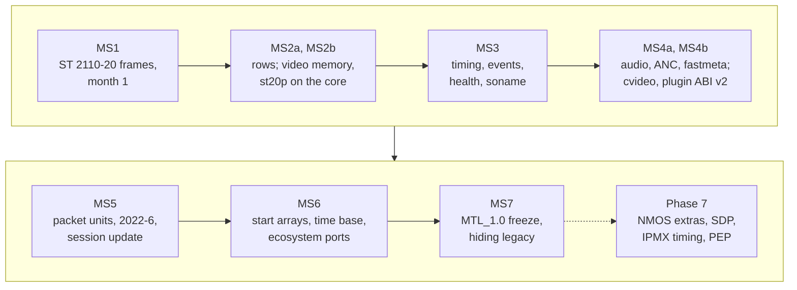
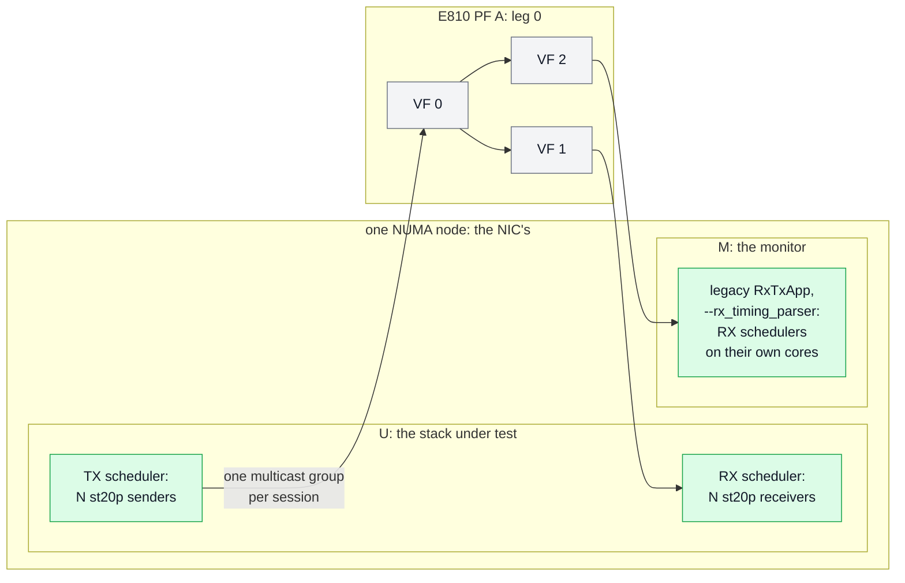

# Implementation plan

| | |
|---|---|
| Status | Plan of record. Nothing is implemented. The decisions it rests on are in [decisions.md](decisions.md) (D-99…D-112 shape it) |
| Date | 2026-10-02 |
| Baseline | `main` @ `545a266a`; the headers in [sketch/include/mtl/experimental/](sketch/include/mtl/experimental/) |

The headers are normative. Every API name in this plan is a header name; names inside the
library (the core, the bindings) are indicative.

The milestones are **MS1…MS7** (§1.2, §5, §6), MS2 in two parts and MS4 in three (MS4a1, MS4a2,
MS4b), followed by Phase 7. The Kubernetes fixes run as a parallel track (§6.10).

## 1. Assumptions, goal and milestones

### 1.1 The assumptions

Set by the maintainer; every choice below follows from them.

| # | Assumption | Consequence |
|---|---|---|
| A1 | AI agents (Claude Opus 5.5) write the code and the tests | effort is no longer the limit; the maintainer's review is (§10) |
| A2 | something works within one month | MS1 is a usable vertical slice: ST 2110-20 frames TX and RX on the new API, a test pool, a new-API RxTxApp and acceptance on it (§5) |
| A3 | every feature of today's API stays, except the capabilities D-112 removes ([coverage.md](coverage.md)) | no other cut (D-112) |
| A4 | slice mode is required (users exist) | rows units are in MS2a (D-101) |
| A5 | the decisions of [decisions.md](decisions.md) and the accepted resolutions of the open issues hold | their end states hold; where MS1 ships an interim (no command acks; libmtl without a soname, an `MTL_LEGACY` node or hidden internals) the milestone that reaches the end state is named (D-103, D-108) |
| A6 | elegant means small | one core under every API (D-99), one library with version nodes (D-23), the export list that `sketch/check.sh` prints (D-104), no layer that exists only for the transition |
| A7 | the current API keeps its validation while the new one gets its own, side by side | the legacy integration gtests (`KahawaiTest`, NoCtx) and RxTxApp are **frozen**; copies rewritten on the new API build to `UnifiedKahawaiTest` and `UnifiedRxTxApp`; the scripts run either or both (§4.1, D-109, D-110) |
| A8 | the FFmpeg and GStreamer plugins are rewritten completely on the new API | rewritten in place, path by path, with no legacy copy; from a path's rewrite its acceptance tests validate the new API (§4.1) |
| A9 | the double validation is temporary | at hiding stage F+2 (D-83) task F2-1 moves the session-level cases of `KahawaiTest` (the engine's internal test on `mtl_internal_dep`, the D-24 gate) into the unified harness and deletes the old harness, the pipeline-level cases, the legacy RxTxApp and their script options; the unified binary and app take the legacy names (§4.1) |
| A10 | the samples show the new API only, and all of it | the legacy samples are not kept: new samples in `app/sample/` replace them and together call every exported function (§4.2, D-138, G-114) |

### 1.2 The milestones

Port first (D-98): every milestone up to MS7 ports what MTL does today, plus the Kubernetes
lifecycle. The picture below is the order of the milestones and the headline of each; the table
after it has their full scope and calendar, and §5 and §6 their tasks.

| Milestone | Scope | Calendar [I] |
|---|---|---|
| **MS1** ST 2110-20 frames | the core, the video and null bindings, the API shell inside libmtl for ST20 frames TX and RX, a test pool at four tiers, `UnifiedKahawaiTest` and `UnifiedRxTxApp` for `st20p` beside the frozen legacy ones, the acceptance smoke set on both apps (§5) | weeks 1–4 |
| **MS2a** ST 2110-20 rows and completeness | the nightly comparison (§6.9); the wake checks S1a and S1b; queues for event loops (ex03); the `tick`, command acks, discard; **rows (slice)**; RX zero fill of library pools, due time and `RX_LATEST`; the direct open of PCI and `native_af_xdp:` ports; `mtl_log_add_sink`; C-FPS, C-GRANT, C-BRIDGE; the MS1 stretch tasks (§6.1) | month 2 |
| **MS2b** video memory and the st20p re-base | attach, by index, per-acquire layouts, holds, split-forward, converter plugins; then, last, st20p re-based on the core once the nightly comparison has burned in (§6.1) | month 3 |
| **MS3** timing and observability | the ST20 timing subset (INDEX, start at TAI or index, `mtl_tx_get_next`, RX `media_index`, E1–E3); events, per-scheduler stats blocks, health; `mtl_session_update` on a stopped session; the libmtl soname, the `MTL_LEGACY` node and hidden internals; debug call-class checks; the FFmpeg plugin's st20p path on the new API (§6.2) | month 4 |
| **MS4a1** audio, fastmeta and A/V sync | audio (st30p re-based), fastmeta (st41 frames), A/V on one epoch timeline (media mode AUTO; audio TAI and INDEX MS6); fastmeta at any frame rate; DSCP on their bindings; their `UnifiedRxTxApp` kinds and `UnifiedKahawaiTest` cases (§6.3) | month 5 |
| **MS4a2** ANC | ANC (st40p re-based) at any frame rate, DSCP on its binding, its `UnifiedRxTxApp` kinds and `UnifiedKahawaiTest` cases, EBU LIST (tasks N1–N8, §6.3); its files are disjoint from MS4a1's, so it runs beside MS4a1 | month 5 (run after MS4a1, it moves MS4b and later by about 4 weeks) |
| **MS4b** compressed video and plugins | cvideo (st22p re-based; codec plugins on the transform state) and its rates (JPEG XS n and n·1000/1001), plugin ABI v2, `mtl_convert` (§6.3) | month 6 |
| **MS5** packets and operators | packet units on every essence over today's RTP paths (one shared chunk expander, PE1–PE8), the generic `MTL_RTP` essence and ST 2022-6 (PE7); E5a (linear NL and W, D-143); `mtl_session_update` while running, at a boundary; RTCP sender reports on TX (their names leave `MTL_LATER`); the link monitor, capacity query, manager reconnect (§6.4) | month 7 |
| **MS6** synchronisation and the ecosystem | start arrays, ANC and fastmeta following their video, sample-accurate audio, E5b–E13, the published time base with FREERUN (E9; its name leaves `MTL_LATER`); recovery on library workers; the GStreamer, OBS, Python and Rust ports and the rest of the FFmpeg plugin (§6.5) | months 8–9 |
| **MS7** freeze and hide | the external review with the named consumers; the `MTL_1.0` freeze; the hiding stages F, F+1, F+2 (D-83) (§6.6) | month 10, then the deprecation releases at the targets of deployment.md §7 |
| Phase 7 | NMOS extras, SDP, IPMX timing and the RTCP MIB, encryption, PEP ([nmos-ipmx.md](nmos-ipmx.md)), declared under `MTL_LATER` until then (D-98); a Phase 7 name leaves `MTL_LATER` in the milestone that implements it (RTCP sender reports MS5, FREERUN MS6) | after MS7 |

"MS4a" alone means MS4a1 and MS4a2 together. Created timelines are not in v1: they stay under
`MTL_LATER` in the headers.
Every session runs on the epoch timeline, and `mtl_wait`, `mtl_queue_arm` and `mtl_read_events`
take an instance as well as a session.

The calendar assumes about three to four reviewed tasks a week (D-107). It is an estimate; the
exit criteria, not the dates, end a milestone.

### 1.3 Non-goals of MS1

Each is in a named later milestone. A function of a later milestone is declared in the installed
header but not exported until that milestone, so a call to it fails to compile, naming the milestone (at link time on compilers without the `error` attribute); a later value of an exported call (a
flag, an enum value, an option key, a port prefix, a `when` kind, a wait mask, an update part)
returns `-MTL_ENOTSUP` with `MTL_REASON_NOT_IMPLEMENTED` until then (D-106).

- other essences (MS4a, MS4b); packet units (MS5); rows units (MS2a);
- attached or imported memory, holds, per-acquire layouts (MS2b for video);
- `mtl_session_update` (MS3 in CREATED and STOPPED, MS5 while running), `mtl_session_discard`
  (MS2a);
- queues for event loops (`mtl_queue_*`, ex03; MS2a);
- media mode INDEX, start at a TAI or an index, `mtl_tx_get_next`, `MTL_SUBMIT_RTP_TS` (MS3);
  start arrays (MS6);
- events, health, shutdown report (MS3);
- command acks, RX due-time force-complete, zero fill of lost ranges in library pools (MS2a);
- the direct open of PCI ports and `native_af_xdp:` (they reach unified sessions through the
  legacy bridge in MS1), `mtl_log_add_sink` (MS2a);
- video rates outside the legacy `enum st_fps`; sender-type grants and their reports;
  `mtl_time_now` on a wrapper with a user or built-in PTP clock (all MS2a);
- the samples `event_loop`, `rx_to_framework`, `pod_service` (MS2a);
- RX DMA, two RX threads, the RX timing parser, per-packet conversion and `MTL_SUBMIT_EXACT`:
  MS2a (the stretch task B3);
- the legacy pipelines re-based on the core (MS2b for st20p).

No ported feature regresses for legacy users: the legacy API is untouched in MS1 except for
bugfixes, and the legacy gate (§8.5) passes at every milestone. The built-in PTP client on a VF
keeps working with its software time base (§2.4).

## 2. The architecture

### 2.1 One core, bindings, an API shell

The picture, the parts and their rules are in [core.md](core.md) §1; in short:

- **The core** (`lib/src/st2110/core/`, in libmtl) is the unit session: a slot table with one
  64-bit slot word per slot (state, claim, holds, generation), an order ring of 64-byte submission
  descriptors that is the pick-up, result and reap order, the nine session states (D-08), one
  event word per object with one `mt_wake()` (D-158), the handle table (R4) and the transform state for conversion and codecs
  (D-100). It reaches its environment (allocation on a socket, the clock, the wake flush, the
  scheduler ID) through an instance-context interface, never through `struct mtl_main_impl*`.
- **A binding** per essence and direction (plus `packet` and `null`) implements the callbacks the
  engines already call (`get_next_frame`, `notify_frame_done`, `query_frame_lines_ready`,
  `query_ext_frame`, `notify_frame_ready`, `notify_slice_ready`, `notify_detected`) and the binding
  ops of [core.md](core.md) §2.1, and is the only code that builds engine `ops`. It runs on the
  tasklet under the session spinlock and is wait-free: a CAS, a release store of PUBLISHED, one RMW
  of the event word, and no syscall (the queue push of MS2a is lock-free). The few other engine
  entry points it uses are listed in one engine accessor header, `st_engine_core.h`.
- **The API shell** (`lib/src/unified/`, compiled into libmtl, exported in the nodes
  `MTL_UNIFIED_EXPERIMENTAL_<rev>_MSn`) validates the typed config and the options against the
  option table and stores them (the bindings build the engine `ops`, [core.md](core.md) §2.1),
  maps reasons and enforces call classes. It holds no data-path state.
- **The legacy pipelines** `st*p_*` become wrappers on the core as soon as their essence is on it
  (st20p MS2b, the others MS4a and MS4b); the legacy session API stays as the engines' interface.
- The core has the lease-table shape from MS1, so packet units, attached pools and holds add
  bindings and slot fields, never a second core. The module list is [core.md](core.md) §8; the
  seams are core.md §2 and engine.md §2.11.

### 2.2 Frames, rows and packets in one slot model

| Unit | `progress` | Binding |
|---|---|---|
| frame TX | all rows, set at submit | `get_next_frame` takes the descriptor at the pick cursor whose slot word is QUEUED with the descriptor's generation, makes the launch decision and fills the engine meta from the descriptor |
| rows TX (MS2a) | raised by each re-submit | the session is created `ST20_TYPE_SLICE_LEVEL`; `query_frame_lines_ready` returns `progress` |
| frame RX | — | `query_ext_frame` hands the engine a core-allocated slot; `notify_frame_ready` publishes it in `pub_seq` order |
| rows RX (MS2a) | rows received | `notify_slice_ready` stores `progress` and wakes `mtl_rx_wait_rows` |
| packets TX (MS5) | packets in the chunk | the same FIFO; one shared chunk expander attaches the chunk's buffers and feeds the engine's RTP ring; one completion per chunk |
| packets RX (MS5) | packets copied | the chunk is formed at dequeue from the engine's RTP ring |

### 2.3 Scope map

The inventories of today's surface are the operating-mode catalogue
([legacy-internals.md](legacy-internals.md)) and the use-case inventory of every public header,
rows U-001…U-418 ([coverage.md](coverage.md)). The home of a feature's milestone is its U-row
in coverage.md; this section is the index an implementer works from, and where the two
disagree, coverage.md is right. The coverage gate D-87 holds: every legacy capability has a
unified home and a milestone, or is removed (D-112). The rows that still need a home (U-348,
U-402; OI-40, OI-42) are in [coverage.md](coverage.md).

**Today's surfaces** ([legacy-internals.md](legacy-internals.md)): five media families × two
directions × up to three units of work × two layers, plus `st20rc`:

| Today | Unified home | When |
|---|---|---|
| `st20p_tx_*`, `st20p_rx_*` (frame) | `MTL_VIDEO`, `MTL_UNIT_FRAME`, conversion by `v.app_format` | MS1 |
| `st20_tx_*`, `st20_rx_*` `ST20_TYPE_FRAME_LEVEL` (callbacks, ext frames) | the same session, push model; derive mode `v.app_format = 0`; app memory through `mtl_mem.h` | MS1 for library pools; ext frames MS2b |
| `ST20_TYPE_SLICE_LEVEL` | `MTL_UNIT_ROWS` | MS2a |
| `*_TYPE_RTP_LEVEL` (every family), ST 2022-6 through RTP level | `MTL_UNIT_PACKETS` (`mtl_packet.h`); `MTL_RTP` for ST 2022-6 and custom payloads | MS5 (D-82) |
| `st22_*`, `st22p_*` | `MTL_CVIDEO` | MS4b |
| `st30_*`, `st30p_*` | `MTL_AUDIO` | MS4a; sample-accurate submission MS6 |
| `st40_*`, `st40p_*` | `MTL_ANC` | MS4a2; ANC following its video in a start array MS6 |
| `st41_*` (RX RTP level only today) | `MTL_FASTMETA`, frame RX added | MS4a |
| `st20rc_rx_*` | none: removed (D-112); two legs on one session do the same | — |
| `st22_encoder_register`, `st20_converter_register`, `st_plugin_register` | plugin ABI v2 (`mtl_plugin.h`) | MS4b; converter plugins on the transform state MS2b |
| `st_convert_api.h` (per-pair converters) | `mtl_convert()` (`mtl_format.h`); the public per-pair converters are removed (D-112) | MS4b |
| `mtl_sch_*` user schedulers and tasklets | none: removed (D-112) | — |
| `mtl_hp_*`, `mtl_dma_*`, `mtl_udma_*` | `mtl_mem.h` regions; user DMA removed (D-112) | MS2b (video); every other essence with its binding (MS4a, MS4b) |

**ST 2110-20 use cases** ([coverage.md](coverage.md)):

| Use case today | Unified home | When |
|---|---|---|
| pipeline loops `st20p_tx_get_frame`/`put_frame`, `st20p_rx_get_frame`/`put_frame` (U-180, U-200) | `mtl_tx_acquire` + `mtl_tx_submit`; `mtl_rx_dequeue` + `mtl_rx_release` | MS1 |
| session pull model `get_next_frame`, push `notify_frame_ready` + `st20_rx_put_framebuff` (U-181, U-201) | push: acquire and submit; dequeue and release from any thread, in any order | MS1 |
| TX from the caller's memory without a slot copy beforehand | `MTL_SUBMIT_SRC_PLANES` (a copy or the conversion into the slot during submit; any session but `MTL_SESSION_REQUIRE_DIRECT`) | MS1 |
| framebuffers by index (U-182, U-183, U-224) | `info.unit_bytes`, `pool_count`; `mtl_session_get_slot` (`mtl_mem.h`) | MS1; by index MS2b |
| ext frames: session per index, pipeline per frame, two-phase release, dedicated and dynamic RX (U-184…U-186, U-208, U-209) | `MTL_SESSION_POOL_ATTACHED`, `mtl_session_attach`, `mtl_tx_acquire_slot`, `MTL_SESSION_RX_BY_INDEX`; results as the release; `mtl_tx_acquire_layout`, `mtl_rx_provide` | MS2b |
| interlaced, field as unit (U-187) | `v.raster.scan = MTL_INTERLACED`; parity from the media index | MS1 (1080i ports) |
| linesize and padding (U-188) | `v.linesize` of library pools | MS2b (wave 2c) |
| split-forward of RX tiles (U-189) | `mtl_session_get_pool_region`, `mtl_session_attach`, `unit.hold`, `mtl_tx_send_slot` (ex12) | MS2b |
| user meta (U-190, U-221) | an `MTL_META_USER` record in the meta area (`mtl_meta_put`, `mtl_meta_find`) | MS1 |
| packing, transport formats incl. the non-RFC 4175 ones (U-192…U-194) | `v.packing`; `v.format`, `MTL_YUV422P10LE_NONSTD`, `MTL_V210_NONSTD` (`MTL_INFO_NON_COMPLIANT`) | MS1 (port `transport_yuv422p10le`) |
| library-paced TX on the epoch, epoch RTP (U-150, U-154) | `MTL_MEDIA_AUTO`, the default | MS1 |
| legacy default RTP from the TX cursor (U-155) | not the default (D-10) | MS1; compared in the nightly (MS2a, G-99) |
| RTP delta and TR offset (U-156) | `tx.rtp_trim_ns` (the RTP trimmed, the launch fixed); `sc.video.troffset_us` | TR offset default MS1, other values MS2a; `tx.rtp_trim_ns` MS3 |
| user pacing, exact user pacing, user RTP (U-151…U-153) | `MTL_MEDIA_TAI` + `MTL_SUBMIT_NOT_BEFORE`; `MTL_SUBMIT_EXACT` + `unit.launch_tai_ns`; `MTL_SUBMIT_RTP_TS` | TAI and NOT_BEFORE MS1; EXACT B3 (else MS2a); RTP_TS and a launch in another slot than the media time MS3 (E1) |
| drop when late, late notification (U-157, U-158) | `MTL_OPT_LATE_POLICY`; results with status, reason and margin | MS1; margins MS3 (E3) |
| VSYNC (U-159) | `MTL_OPT_EPOCH_TICK`, `MTL_EVENT_EPOCH_TICK` | MS3 |
| sender type, RL tuning knobs (U-160, U-162) | `v.sender_type`; `MTL_OPT_VIDEO_START_VRX`, `_PAD_INTERVAL`, `_STATIC_PAD_P`, `_DISABLE_BULK` | MS1 |
| TR offset, TRS, VRX, scheduler index (U-161) | `mtl_session_get_info` | MS1 |
| next frame due, frame late (U-163) | `mtl_tx_get_next`, `mtl_epoch_index_at` | MS3 |
| incomplete frames, frame status (U-202, U-203) | delivered by default (`rx.incomplete = MTL_RX_DELIVER`), `unit.status`; `MTL_OPT_RX_INCOMPLETE = MTL_RX_DISCARD` | MS1 |
| packets per leg, arrival times, bytes per frame (U-204, U-205, U-207) | `mtl_rx_get_detail` | A2b (else MS2a); the `frame_meta_*` ports in MS2a read them |
| RX RTP and media time (U-206) | `unit.rtp`, `unit.media_tai_ns`, `unit.media_index` | MS1; `media_index` MS3 |
| RX DMA offload (U-211) | `MTL_OPT_DMA`, `MTL_OPT_DMA_DEVICES`, `MTL_PATH_DIRECT_DMA` | B3 (else MS2a) |
| auto-detect (U-212) | `v.detect = MTL_DETECT_ON`, `MTL_EVENT_RX_FORMAT` | MS3 |
| timing parser in stats and per frame (U-214…U-216) | `MTL_OPT_RX_TIMING_PARSER`, keys `tp.*`, `mtl_rx_get_detail` (`timing[]`) | B3 (else MS2a) for the stats; per unit (`timing[]`) MS2a with RX detail |
| two RX threads (U-217) | `MTL_OPT_RX_THREADS`; today's engine rejects 2 with two legs or rows units | B3 (else MS2a) |
| per-packet conversion in st20p (U-220) | `MTL_OPT_RX_CONVERT_PER_PACKET`, on the RX tasklet (library code: the one exception to "no conversion on a tasklet") | B3 (else MS2a; port `digest_1080p_packet_convert_s2`) |
| `uframe_pg_callback`, header split (U-219, U-213) | none: removed (D-112) | — |
| simulated RX loss (U-223) | `mtl_debug_inject(MTL_FAULT_DROP_PKTS)`, `MTL_FAULT_DROP_RANDOM` | MS1 (`DROP_PKTS`); `DROP_RANDOM` MS2a |
| pcapng dump | `mtl_session_capture` | MS4 |

**Easily forgotten modes** ([legacy-internals.md](legacy-internals.md)):

| # | Mode | Unified home | When |
|---|---|---|---|
| 1 | slice-level TX and RX | `MTL_UNIT_ROWS`, `mtl_tx_row_deadline`, `mtl_rx_wait_rows`, `MTL_OPT_RX_ROWS_STEP`, `MTL_OPT_ROWS_LATE` | MS2a |
| 2 | RTP-level app-built packets, the only route to ST 2022-6 | `MTL_UNIT_PACKETS`, `MTL_RTP` | MS5 |
| 3 | RX per-pixel-group callback on the tasklet | none: removed (D-112); per-packet conversion covers the conversion use | — |
| 4 | st20p per-packet conversion (three output formats, DMA off) | `MTL_OPT_RX_CONVERT_PER_PACKET` | B3 (else MS2a) |
| 5 | derive pipelines (no conversion or codec) | `v.app_format = 0`; cvideo codec bypass | MS1; cvideo MS4b |
| 6 | ext frames in both TX flavours, two-phase release | attached pools, `mtl_tx_acquire_slot`, results; `mtl_tx_acquire_layout` | MS2b |
| 7 | split-forward (4K → 4 × 1080p tiles) | pool region + attach + `unit.hold` (ex12) | MS2b |
| 8 | RX dedicated and dynamic ext frames | `MTL_SESSION_POOL_ATTACHED`, `MTL_SESSION_RX_BY_INDEX`; `mtl_rx_provide` | MS2b |
| 9 | GPU VRAM RX frames | `mtl_mem_open` with `MTL_MEM_DEVICE` (`-MTL_ENOTSUP` until then) | MS6 |
| 10 | `DATA_PATH_ONLY`, queue meta (suspected NULL dereference, SP-02) | none: removed (D-112) | — |
| 11 | exact user pacing, user pacing, normal | `MTL_SUBMIT_EXACT`, `MTL_MEDIA_TAI` + `MTL_SUBMIT_NOT_BEFORE`, `MTL_MEDIA_AUTO` | video: user pacing and normal MS1, exact B3 (else MS2a); ST40 MS6 |
| 12 | epoch RTP and `rtp_timestamp_delta_us` | the default; `tx.rtp_trim_ns` | MS1; `tx.rtp_trim_ns` MS3 |
| 13 | `DISABLE_BULK`, `TSC_NARROW`, `STATIC_PAD_P`, `start_vrx`, `pad_interval` | `MTL_OPT_VIDEO_*`, `MTL_OPT_PACING` | MS1 |
| 14 | two RX threads above 40 Gb/s | `MTL_OPT_RX_THREADS` | B3 (else MS2a) |
| 15 | header split | none: removed (D-112) | — |
| 16 | field-as-frame interlace | `MTL_INTERLACED` units | MS1; packet units MS5 |
| 17 | ST40 split by packet, interlace auto-detect | `MTL_ANCF_NEW_RTP` per entry, `sc.anc.detect` | MS4a2 |
| 18 | ST30 build pacing, FIFO, RL warm-up | `MTL_OPT_AUDIO_BUILD_PACING`, `MTL_OPT_AUDIO_FIFO_MS`, `MTL_OPT_AUDIO_RL_ACCURACY_NS`, `MTL_OPT_AUDIO_RL_OFFSET_NS` | MS4a |
| 19 | st22p codec threads | `MTL_OPT_CVIDEO_THREADS` | MS4b |
| 20 | callback-driven vs polled completion | one push model: results, events, calls with a timeout and queues; no app code on tasklets (D-04) | MS1 (results, calls with a timeout); MS2a (queues); MS3 (events) |
| 21 | non-RFC 4175 transport and `CUSTOM8` formats | `MTL_*_NONSTD`, `MTL_APP_YUV422_CUSTOM8` | MS1 |
| 22 | debug knobs in public ops (`SIMULATE_PKT_LOSS`, `st40_tx_test_config`) | `mtl_debug_inject` (`DROP_PKTS`, `DROP_RANDOM`, `TX_MUTATE`) | MS1 entry point; faults per milestone (§8.3) |

**Backends** ([legacy-internals.md](legacy-internals.md), [engine.md](engine.md) §1.7;
`caps.backend`, `enum mtl_backend` in `mtl_observe.h`). The core and the video bindings sit on
the video engine, which runs on every backend, so no binding is backend-specific; the table says
which backend a unified job exercises.

| Backend | Today | Unified jobs |
|---|---|---|
| DPDK PMD (PCI BDF), VF and PF | RL (ice PF, iavf VF), TSC, TSC_NARROW, TSN (E830 PF), PTP; zero copy if the NIC has multi-seg; flow director or shared RSS; queue-hang recovery only here | MS1 through the bridge: `UnifiedKahawaiTest` `St20p*` and the pytest `st20p` smoke set on `UnifiedRxTxApp`; MS2a: the direct open, the other ST20 ports and the nightly |
| kernel socket (`kernel:`) | TSC only, single segment, no flow steering, still needs hugepages | MS1: `UnifiedKahawaiTest` `St20p*` on `kernel:lo` (§5.3); MS2a: the nightly `unified_st20p_kernel_loopback` |
| native AF_XDP (`native_af_xdp:`) | RL through `tx_maxrate` on ice, else TSC; copies every segment into UMEM | direct open from MS2a; no unified job in MS1–MS2b; the pytest `xdp` group runs on `UnifiedRxTxApp` once its kinds are ported |
| DPDK AF_XDP, DPDK AF_PACKET | experimental | removed (D-112, U-095) |
| null (`null:<n>`) | none | new in MS1: the U tier |
| Windows (NetUIO) | no MtlManager, no kernel socket, no AF_XDP | a compile-only CI job for the headers (G-74) |

**The rest of the inventory, by area** ([coverage.md](coverage.md)):

| Area | ST20 milestones | Later |
|---|---|---|
| instance lifecycle and init parameters | `mtl_instance_open` over `mtl_init` for `null:<n>` and `kernel:`, options the ST20 consumers set, the bridge (MS1); PCI BDFs and `native_af_xdp:` (MS2a) | runtime `mtl_port_open` (NG8; no header symbol; after MS7, on request) |
| time source and PTP | `time_source` at open, AUTO once (`CLOCK_TAI` if valid, else `SYSTEM_TAI`); built-in PTP as today through the bridge (MS1), on a direct open (MS2a) (§2.4) | time events (MS3); a lock state that clears, clock steps, PHC and FREERUN with E9 (MS6); `mtl_time_set_reference` (MS2a); AUTO re-evaluation (Phase 7) |
| schedulers, lcores, threads | `MTL_INSTANCE_TASKLET_THREAD`, `MTL_INSTANCE_TASKLET_SLEEP`, scheduler options (MS1) | lcore borrowing, user tasklets: removed (D-112) |
| port tuning, ports and backends | the port options RxTxApp and KahawaiTest set (MS1); `mtl_port_get_spec` (A2b, else MS2a) | capacity queries (MS5) |
| memory, DMA, zero copy | library pools (MS1); RX DMA through `MTL_OPT_DMA` (B3, else MS2a) | `mtl_mem.h` (MS2b for video) |
| session plumbing | flows and two legs, MAC, NUMA, `sc.ssrc` and `sc.payload_type` (one identity for both legs), `mtl_flow.dscp`, source filter (MS1) | `mtl_session_update` (MS5) |
| TX timing | video: AUTO, TAI with `NOT_BEFORE` (MS1); `EXACT` (B3, else MS2a); `RTP_TS`, INDEX, start at a TAI or an index, `mtl_tx_get_next` (MS3) | other essences (MS4a, MS6) |
| completion, notification, blocking | results, calls with a timeout (MS1); queues for event loops (MS2a); events on sessions and on the instance (MS3) | — |
| ST 2110-22, -30, -40, -41 | — | -30, -40, -41 MS4a; -22 MS4b; start arrays and sample-accurate audio MS6 |
| RTP passthrough (common to every essence) | — | MS5 |
| conversion, formats, helpers | st20p conversion by `v.app_format`, `MTL_SUBMIT_SRC_PLANES` (MS1); converter plugins (MS2b) | `mtl_convert` (MS4b) |
| plugins | — | plugin ABI v2 (MS4b) |
| stats and observability | ST20 counters (A2b, else MS2a); the stats registry's per-scheduler blocks (MS3) | the `st20_rx_user_stats` fields without a key (U-402) |
| experimental and legacy remnants | — | removed (D-112) |

### 2.4 Time sources

- A bridged instance (`UnifiedKahawaiTest` and `UnifiedRxTxApp` on VFs until MS2a, §4.1) keeps the
  legacy time base: `MTL_FLAG_PTP_ENABLE`, `ptp_get_time_fn`, or the default. Unified sessions on
  it read that time. MS1: `mtl_time_now` on it reads the default and TSC clocks (flagged UTC) and
  is `-MTL_ENOTSUP` for the others until MS2a.
- `mtl_instance_open` takes `time_source`. In MS1 `MTL_TIME_SOURCE_AUTO` chooses once, at open:
  `CLOCK_TAI` if it is valid, else `SYSTEM_TAI` (a vDSO read). A NIC PHC (one syscall per read)
  joins AUTO in MS6 with the published time base (E9), and so does FREERUN; re-evaluation while
  running is Phase 7.
- `MTL_TIME_SOURCE_PTP_BUILTIN` on a VF runs as today: the port has no timesync, so the client
  disciplines MTL's own software time base (`ptp->no_timesync`, `mt_ptp.c:1390-1393`) and never the
  VF's PHC. `MTL_REASON_CLOCK_NOT_OWNED` is only for a request to steer a PHC MTL does not own
  (OI-7). On a direct open it needs the PCI open of MS2a; in MS1 it is reached through the bridge.
- So `--ptp`, the NoCtx PTP cases and the nightly-pytest `ptp` group
  (`.github/workflows/nightly-pytest.yml:40`, `tests/acceptance/tests/single/ptp/`) pass on both
  apps and both binaries. The legacy gate
  runs the `tests/unit/ptp/` suite, which pins the software time base (§8.5).
- `ptp_get_time_fn` maps to `MTL_TIME_SOURCE_USER` + `mtl_time_set_reference` with `MTL_TIMEREF_USER_PAIR` ([migration.md](migration.md)).

## 3. Prerequisites

### 3.1 Decisions

The implementation starts from these rules ([decisions.md](decisions.md) carries their
rationale):

- **One core:** the core with bindings under every API; the legacy `st*p_*` become wrappers on it
  (D-99).
- **One library:** libmtl carries the unified API, with `lib/src/unified/` compiled in, in one
  version node per milestone, `MTL_UNIFIED_EXPERIMENTAL_0_2_MSn` (the headers' revision 0.2); the
  version script, the frozen node lists, the soname and the `MTL_LEGACY` node are in
  [migration.md](migration.md) §7.2 (D-23, D-108).
- **Deferred wake (W2):** a completing context never makes a syscall: `mt_wake()` marks the
  object (`fired` lanes, a bit in the loop's bitmap), and the scheduler loop (`sch_tasklet_func`,
  after the handler loop) wakes a bounded number of marked objects and queues per iteration, one
  futex wake or one `write()` each, the rest round robin (D-142); an application thread that
  completes wakes directly. D-170's dense patterns, a slack gate, then the notifier thread (D-165)
  are built only by D-142's rules, which spikes S1a and S1b check in MS2a (D-68, D-102).
- **Export what is implemented:** a function is exported in the milestone that implements it, in
  that milestone's version node; its comment ends with the milestone tag, for example `(MS1)`, and
  its call-class macro carries the same number (`MTL_API_DP(1)`). The installed header declares the
  whole design (the `MTL_LATER` blocks for design checks only); a call to a function above
  `MTL_LEVEL` fails to compile naming its milestone with GCC and Clang 14 or later, else at link
  time; experimental headers carry no promise before MS7. `MTL_LEVEL` changes at the exits of
  MS1, MS2b (2), MS3, MS4b (4), MS5, MS6 and MS7 only. Every version node a release carries is
  sealed: a release cut while a milestone is open seals that milestone's node, which continues in
  a new part `_MSn.k` ([migration.md](migration.md) §7.2, D-191). A later value of an exported call returns `-MTL_ENOTSUP` with `MTL_REASON_NOT_IMPLEMENTED`.
  No stub generator and no header filter (D-106).
- **Tooling first:** task P0 (§5.2) is the first change of MS1.
- **Git authority:** the implementing session commits each task after its gates pass, signed off
  through the `mtl-commit` skill and without AI attribution, on a work branch; it never pushes and
  never opens a pull request; the maintainer reviews and pushes ([ms1-status.md](ms1-status.md) §0).

Two open items of this plan are settled as MS1 rules ([decisions.md](decisions.md), OI-59 and
OI-60):

- **OI-59, frame memory under the video bindings.** TX library pools use the engine's own
  framebuffers in MS1; from MS2b every TX slot is an ext frame that carries its page table (PA mode
  builds page tables only for engine-allocated frames, `st_tx_video_session.c:245-266`), so library
  and attached pools are one code path. RX uses `query_ext_frame` with core-allocated slots from
  MS1, so RX has one path from the start.
- **OI-60, where conversion runs in MS1.** In the caller (submit converts, dequeue converts) for
  the formats st20p converts internally today; with `MTL_SUBMIT_SRC_PLANES` submit reads the
  caller's planes during the call. Converter plugins join in MS2b with the transform claim and done
  (D-100).

### 3.2 Code that must land first

- **PR #1770** (open, 38 commits): of its rows MS1 needs SF-05/MF1 (an ext buffer is reported done
  before its `refcnt` is decremented, `tv_frame_free_cb`, `st_tx_video_session.c:134-135`), SF-08,
  SF-09 and SF-23. If it is not merged by the end of week 1, the MF1 hunk is taken into task E1. The
  PR also fixes the video `update_destination` that writes the source UDP port into the destination
  port (`st_tx_video_session.c:3829-3830`).
- **PR #1610's legacy st20p parity tests**, folded into main's harness
  (`tests/unit/pipeline/st20p_tx_harness.c`, `st20p_harness.c`) before any engine change of MS1, so
  they pin today's behaviour (task T1). Its eventfd and poll loop in `mt_session_event.c` and
  `mt_session_video_common.c` seed `mt_wake` and `mtl_wait`, with credit (D-27); its event ring
  does not. What else of the PR each task can take, and what not, is in
  [legacy-internals.md](legacy-internals.md) §12.1 and §12.2.

### 3.3 Spikes

| Spike | Question | Needed by |
|---|---|---|
| S0 baseline | the legacy stack at the S0 loads (§5.2): the session visit cost, the iteration percentiles of P0's histogram, the lost frames and the monitor's compliance class, the legacy capacity per scheduler, and the A/A spread of each (§8.4) | MS1 week 1 (the §8.4 budgets; the capacity by MS2a's exit); E1 before it merges |
| S1 waker | S1a: a futex wake, an eventfd `write` and `read`, the flush under the count bound, wake latency, the instance walk, a queue burst of 1–512 objects, the armed completion by line; S1b: pacing (ST4) under a synthetic wake load, TSC and RL; both aligned and staggered. Pass: ST1–ST9 (§8.4), else D-170's patterns, the slack gate, then the notifier (D-165) | MS2a |
| S6 idle cleanup | rate and cost of `rte_eth_tx_done_cleanup` on an idle session | MS1 task E1 |
| S8 queue stop and start | do iavf and ice release chained external mbufs on `rte_eth_dev_tx_queue_stop`/`start` | MS3 (the stalled-queue close, attached memory after recovery) |

## 4. Where the code goes

| Item | Path | Notes |
|---|---|---|
| public headers | `include/mtl/experimental/*.h`, installed to `${includedir}/mtl/experimental/` | moved from the sketch in task H1b, one copy holding the full design, each function tagged with its milestone; a call above `MTL_LEVEL` fails to compile naming it, or to link without the `error` attribute (D-106); the `MTL_LATER` blocks are installed, for design checks only |
| the core | `lib/src/st2110/core/` (`st_core.h`, `st_core_slot.c`, `st_core_session.c`, `st_core_wait.c`, `st_core_handle.c`, `st_core_xform.c`; names indicative) | in libmtl, because the legacy wrappers use it too (MS2b); `st_core.h` is task C0 |
| engine accessor header | `lib/src/st2110/st_engine_core.h` | every engine entry point a binding uses besides the callbacks ([core.md](core.md) §3) |
| bindings | `lib/src/st2110/core/bind_{video_tx,video_rx,null}.c` in MS1; the other essences and `packet` later | each implements the binding ops ([core.md](core.md) §2.1) and its engine's callbacks |
| API shell | `lib/src/unified/`, compiled into libmtl; the data tables of README §4 (`reasons.def`, `mtl_options.def`, `availability.def`, `codes_per_call.def`; X-macro rows, below) | exported in the nodes `MTL_UNIFIED_EXPERIMENTAL_<rev>_MSn` (`lib/src/unified/libmtl.map`; a sealed node's names in `exports.<suffix>.list`); pkg-config stays `mtl` (D-23) |
| libmtl ABI | `lib/meson.build:151`: no soname or version script today | H1b: `libmtl.map` with nodes per milestone part (MS1, `_BRIDGE`), sealed at each exit and release, every other symbol exported as today; MS3: the soname, `MTL_LEGACY` and `local: *` after an `nm` audit; MS7 deprecates the legacy symbols, which leave `MTL_LEGACY` from F+2 ([migration.md](migration.md) §7.2; D-83, D-108) |
| meson | `enable_unified` (default **true**, so CI catches breakage; there is no ABI promise before the freeze), `enable_debug_api` (default false; `./build.sh unit` sets it true) | in `meson_options.txt` |
| in-tree level | libmtl and `mtl_internal_dep` (H1b); one `add_project_arguments('-DMTL_TARGET_LEVEL=(MTL_LEVEL+1)', …)` line in `tests/meson.build` and `app/meson.build` (H1b) and in `tests/tools/UnifiedRxTxApp/meson.build` (R1's rewrite; the copy stays verbatim) | the in-tree consumers build against the milestone under way; never in `mtl.pc` (below) |
| unit tests | U: `tests/unit/unified/` → `UnifiedUnitTest`, which links libmtl and runs on `null:1`. UB: they `#include` production `.c` files, so they build into `UnitTest` (`mtl_internal_dep`) next to the harness they use (`tests/unit/session/`, `tests/unit/pipeline/`) | built and run by `./build.sh unit` |
| integration tests | `tests/unified_integration_tests/` → the `UnifiedKahawaiTest` binary | the harness and the ported suites of `tests/integration_tests/`, copied and rewritten on the new API (§4.1); `tests/integration_tests/` stays frozen as `KahawaiTest` |
| RxTxApp | `tests/tools/UnifiedRxTxApp/` → `UnifiedRxTxApp`, installed beside `RxTxApp` | the framework and the ported kinds of `tests/tools/RxTxApp/`, copied and rewritten on the new API, with the same CLI and JSON; `tests/tools/RxTxApp/` stays frozen (§4.1, D-110) |
| samples | `app/sample/`, on the new API only | §4.2: they replace the legacy samples and together call every exported function (G-114) |
| acceptance | `tests/acceptance/mtl_engine/`: a `UnifiedRxTxApp` adapter beside `RxTxApp`; the `application` fixture (`conftest.py:1404`) gains `rxtxapp_unified` | `--app rxtxapp\|rxtxapp_unified\|all` (default `all`) selects (§4.1) |
| doc test | `doc/unified-api/sketch/check.sh` reads the headers from `include/` after task H1b | in CI through `.github/path_filters.yml`; it prints the function counts per header, per call class and per milestone tag, which no document repeats, and runs `gen_api_doc.py --check` (the marked tables), the availability lint and the number lint (README §1) |
| status ledger | `doc/unified-api/ms1-status.md` | §5.8 |

A row of `mtl_options.def` holds the key's number, name, type, range, default, when, scope, tier,
applicability and owner, its milestone and the task that built it. The in-tree level is never set
in `mtl.pc`, so an external build keeps the default `MTL_LEVEL`; its line names the languages
`['c', 'cpp']` (`tests/`: `'cpp'`); a plugin rewritten on the new API sets it in its own build in
its rewrite (FFmpeg MS3, GStreamer MS6), and a call to a function of the open milestone not yet
exported then fails at link.

### 4.1 Two validation stacks

Until the legacy API is removed, each API is validated by its own suites (A7–A9).

| | Legacy API (frozen) | New API |
|---|---|---|
| integration gtests | `tests/integration_tests/` → `KahawaiTest`, its NoCtx cases | `tests/unified_integration_tests/` → `UnifiedKahawaiTest`, its NoCtx cases |
| RxTxApp | `tests/tools/RxTxApp/` → `RxTxApp` | `tests/tools/UnifiedRxTxApp/` → `UnifiedRxTxApp` |
| acceptance | the application `rxtxapp` | the application `rxtxapp_unified`; FFmpeg and GStreamer from their rewrite |
| unit | `UnitTest` | `UnifiedUnitTest`; the UB cases stay in `UnitTest` (§8.1) |

**Frozen** means that the legacy test cases and the legacy RxTxApp's code get no new case, no
rewrite and no deletion. The changes allowed are the run option of the table below, what keeps
them building against libmtl, what a legacy bugfix needs (D-24), a harness bugfix (a crash, hang
or flake in the gtest harness, `test_util.*`, or RxTxApp's framework: arguments, JSON parser, app
core, never what a case asserts), and the agent rules of P0
(the `tests/integration_tests/CLAUDE.md` change and a new `tests/tools/RxTxApp/CLAUDE.md`), each
approved by the maintainer; `mtl-reviewer` treats any other diff in `tests/integration_tests/`
and `tests/tools/RxTxApp/` as a BLOCKER (P0). So the frozen suites check the legacy API as users
see it, also after the pipelines become wrappers on the core (st20p MS2b, the others MS4).

**The copies.** Each new tree starts as a copy, in one mechanical commit: `UnifiedKahawaiTest`
copies the harness (`tests.cpp`, `tests.hpp`, `test_util.*`, meson) and the st20p files,
`UnifiedRxTxApp` the RxTxApp framework (args, JSON parser, app core) and the st20p files. Other
suites and kinds enter when they are ported, rewritten on the new API in the milestone that ports
them:

- `UnifiedKahawaiTest` keeps the suite and case names of the cases it ports
  (`St20p.digest_1080p_s1` in both binaries), so one `--gtest_filter` selects the twins in both
  and the nightly pairs them by name (§6.9). A suite not yet ported is not in the binary. Its own
  cases have new names: `St20p.tx_idle_last_result`, `St20p.close_while_streaming`, the suite
  `Cross`.
- `UnifiedRxTxApp` keeps RxTxApp's CLI, JSON schema and output lines, so the pytest configs and
  parsers serve both (D-110). A JSON kind not yet ported is refused at start ("kind <x> is not on
  the unified API yet"), and the `rxtxapp_unified` adapter skips those tests with that reason.
  Every key it adds beyond the legacy schema (rows, attach, update, …) is marked unified-only in
  its parser's key table; a config that uses one must carry `"api": "unified"` at the top level,
  else `UnifiedRxTxApp` exits with a JSON error naming the key. The `rxtxapp` adapter skips a
  config with `"api": "unified"` ("unified-only config"), so the legacy app never runs a config
  whose keys it would ignore (R1; the adapter: P1).
- Both use the new API only, with two exceptions. On VFs before MS2a they bring the instance up
  through the bridge (one legacy `mtl_init` wrapped by `mtl_instance_from_legacy`;
  [contract.md §2.8](contract.md#28-legacy-bridge),
  [examples.md §26](examples.md#26-from-the-legacy-api)), because
  `mtl_instance_open` opens PCI ports from MS2a. The suite `Cross` uses the legacy API on purpose,
  as the peer of a unified session in the same process, so it keeps the bridge after MS2a, as the
  `from_legacy` sample does (§4.2).

**Running either or both.** One option in each place that starts them:

| Where | Option | Default |
|---|---|---|
| `build.sh` | builds and installs both binaries and both apps (the new ones with `enable_unified`) | both |
| `.github/scripts/gtest.sh` | `--api legacy\|unified\|both` (env `MTL_TEST_API`); `UNIFIED_TEST_BINARY` beside `KAHAWAI_TEST_BINARY` | `both` |
| `tests/integration_tests/noctx/run.sh`, `run_pf.sh` | `--api legacy\|unified` selects the binary | `legacy` |
| MCP `run_gtest`, `run_noctx_tests`, `run_noctx_pf_tests` | `binary`: `legacy` or `unified` (P0) | `legacy` |
| pytest | `--app rxtxapp\|rxtxapp_unified\|all`, a filter on the params of the `application` fixture | `all` |

**FFmpeg and GStreamer** are rewritten in place (A8): a path's rewrite replaces its legacy code,
its acceptance tests then run the new API, and the legacy pipelines are validated by the frozen
suites alone. The FFmpeg plugin's st20p path is rewritten in MS3, the rest of FFmpeg and
GStreamer in MS6 (§6.2, §6.5). From then the cross-app tests (`tests/single/cross_app/`) pair a
new-API plugin with either RxTxApp.

**Removal** (A9). At hiding stage F+2 task F2-1 (§6.6) leaves one harness with one name: the
session-level suites of `KahawaiTest` (`St20_tx`, `St20_rx` and the other suites over the session
API, the engine's internal test and the D-24 gate) move into the unified harness, which then
builds where `mtl_internal_dep` is available, as `UnitTest` does; the pipeline-level cases, the old
harness (`tests.cpp`, `tests.hpp`), its NoCtx cases, the legacy RxTxApp, the `rxtxapp` application
and the `--api` and `binary` options are deleted, and so is `lib/src/unified/compat_log.c`; and the
unified binary, app and application take the names `KahawaiTest`, `RxTxApp` and `rxtxapp`
([migration.md](migration.md) §8.3, §11.2; [coverage.md](coverage.md)).

**Cost.** While both exist, the integration tests and RxTxApp are kept twice [I: about 7 k lines
of RxTxApp framework and 1.8 k of gtest harness copied in MS1, with the st20p files, then every
ported suite and kind]. The copies are mechanical commits, outside the commit cap (D-107); the
rewrites are ordinary tasks.

### 4.2 Samples

`app/sample/` holds samples on the new API only (A10). Each is a complete program that expands
one example of [examples.md](examples.md), the one it is named after; one program, `fastmeta`,
has none, and the C++ file is the `cpp` program. A program adds what a runnable program needs:
arguments, `common.c`'s ports and test pattern, a run time, and the options of the last column,
into which the planned programs of the same pattern fold. It replaces the legacy samples of its
row. In MS1 the samples `tx_video` and `rx_video` run on `null:1` in CI, `from_legacy` and the
TX → RX pair (`tx_video` to `rx_video`) on `kernel:lo`; they run on VFs from MS2a, when
`mtl_instance_open` opens PCI ports. `from_legacy` calls the legacy `mtl_init`, so it runs on
`kernel:lo`, not on `null:1`, and it keeps the bridge after MS2a. A
legacy sample is deleted in the commit that adds its replacement, and the links to it
(`doc/design.md`, `doc/dma.md`, `doc/gpu.md`, `doc/doxygen/programmers_guide.md`,
`app/sample/README.md`) move to the new sample in the same commit. Legacy samples whose feature
is cut (D-112), `ext_frame/rx_st20p_hdr_split_gpu_direct.c` (CUT-1), go in MS1, and so do
`sample_test.sh` and `redundant_sample_test.sh`, which CI's sample run replaces.

**Coverage** (G-114). Together the samples call every unified function libmtl exports, except the
functions of `mtl_debug.h`, and every essence and direction has a TX and an RX program (`fastmeta`
is the one program without an example, so that fast metadata has both). The samples call the
typed inline wrappers (`mtl_session_close`, `mtl_tx_reap`), not the exported verbs by name, so the
check in CI reads the undefined symbols of the sample objects (`nm -u`) and compares them with the
unified symbols libmtl exports (`nm -D --with-symbol-versions`, the `MTL_UNIFIED_EXPERIMENTAL_`
nodes): a function exported without a calling sample fails the build. The examples call every
function too, and `sketch/check.sh` checks it the same way, with `nm -u` of the compiled examples
against `check.sh --tags`, so an example set that drops a function fails before a program does.
So the long-term `app/sample/g114_exempt.txt` is empty; until a function's first calling program
ships, its line names the function and the milestone by which a program calls it (P1), and the
check fails on a stale or expired line.
A sample enters `app/sample/meson.build` in the milestone that exports its functions. CI runs
every built sample for 10 s on `null:1` (`from_legacy` on `kernel:lo`); from MS2a the nightly
runs the TX and RX pairs on VFs. In MS1 ex01, ex02 and ex20 on `null:1` complement the three
samples. `from_legacy` expands ex24 with `--clock tai|legacy` (default `tai`, ex24's
`ptp_get_time_fn`) and prints the flags of `mtl_time_now` every second. CI runs it once with each
value for 10 s on `kernel:lo`, so the MS1 direct-clock rows of G-126 (`legacy`) and the
`-MTL_ENOTSUP` of a user clock (`tai`) are both exercised.

**Shared code.** One small `app/sample/common.c` with `common.h`, written anew: ports and
addresses from program arguments or `MTL_PORTS`, SIGINT and SIGTERM to `mtl_interrupt`, a test
pattern and a file source. The legacy `sample_util.*` is deleted with the last legacy sample.

| Sample | Example | Milestone | Replaces | Options |
|---|---|---|---|---|
| `tx_video` | ex01 | MS1 | `tx_st20_pipeline_sample.c`, `legacy/tx_video_sample.c` | results on, DSCP, an application format |
| `rx_video` | ex02 | MS1 | `rx_st20_pipeline_sample.c`, `legacy/rx_video_sample.c`, `experimental/rx_st20_redundant_combined_sample.c` | one or two legs, an application format |
| `event_loop` | ex03 | MS2a | — | interrupt targets; events from MS3 |
| `timed_start` | ex04 | MS3 | — | `--now` or `--at <t_start>`, `--depth`; media modes INDEX and TAI |
| `exact_launch` | ex05 | MS3 (EXACT MS2a) | — | `--exact` or `--not-before` |
| `live_tx` | ex06 | MS3 | — | a test source that runs late or stalls on demand |
| `live_rx` | ex07 | MS2a (`--timing-parser`, B3), MS3 | `rx_st20p_timing_parser_sample.c`, `rx_st20p_auto_detect_sample.c`, `dma/dma_sample.c` (its user DMA engine is cut, CUT-5) | `--monitor` (RX_LATEST, format detection; on a format above the maximum a stop, `MTL_UPDATE_MEDIA` and a start), `--timing-parser`, `--dma` (`MTL_OPT_DMA`) |
| `rows` | ex08 | MS2a, MS3 (INDEX and `mtl_tx_get_next`) | `low_level/tx_slice_video_sample.c`, `low_level/rx_slice_video_sample.c` | `--tx` or `--rx` |
| `rtp_packets` | ex09 | MS5 | `low_level/tx_rtp_video_sample.c`, `low_level/rx_rtp_video_sample.c` | `--send` or `--forward`, `--st2022-6` |
| `zero_copy_tx` | ex10 | MS2b | `ext_frame/tx_st20_pipeline_ext_frame_sample.c`, `ext_frame/tx_video_split_sample.c`, `gpu_direct/tx_st20_pipeline_gpu_direct.c` | `--layout` (a buffer per acquire), `--device` (`MTL_MEM_DEVICE`, MS6) |
| `rx_into_memory` | ex11 | MS2b | `ext_frame/rx_st20_pipeline_dyn_ext_frame_sample.c`, `gpu_direct/rx_st20_pipeline_gpu_direct.c` | `--mxl` or `--record` (`mtl_rx_provide`), `--device` (MS6) |
| `split_forwarder` | ex12 | MS2b | `fwd/rx_st20_tx_st20_split_fwd.c`, `fwd/rx_st20p_tx_st20p_split_fwd.c`, `fwd/rx_st20p_tx_st20p_merge_fwd.c`, `legacy/rx_st20_tx_st20_fwd.c` | `--merge` (four HD into one 4K, by copy) |
| `audio` | ex13 | MS4a1 | `tx_st30_pipeline_sample.c`, `rx_st30_pipeline_sample.c` | `--tx` or `--rx` |
| `fastmeta` | — | MS4a1 | — | `--tx` or `--rx` (ex13's `fastmeta_config`) |
| `anc` | ex14 | MS4a2 | `tx_st40_pipeline_sample.c`, `rx_st40_pipeline_sample.c` | `--tx` or `--rx` |
| `cvideo` | ex15 | MS4b | `tx_st22_pipeline_sample.c`, `rx_st22_pipeline_sample.c`, `legacy/tx_st22_video_sample.c`, `legacy/rx_st22_video_sample.c` | `--plugin <so>` |
| `pod_service` | ex16 | MS2a (health and the shutdown report MS3) | — | |
| `telemetry` | ex17 | MS2a (A2b; events MS3, `mtl_session_capture` MS4b) | — | `--capture <path>` |
| `nmos_node` | ex18 | MS3 (stop, update, start), MS5 | — | |
| `framework_setup` | ex19 | MS2a | — | |
| `rx_to_framework` | ex20 | MS2a | — | |
| `live_sink` | ex21 | MS3 | — | |
| `av_playout` | ex22 | MS6 | — | |
| `processor` | ex23 | MS2b (video by copy), MS4b (`mtl_convert`, to ST 2110-22), MS6 | `fwd/rx_st20p_tx_st20p_fwd.c`, `fwd/rx_st20p_tx_st20p_downsample_fwd.c`, `fwd/rx_st20p_tx_st20p_downsample_merge_fwd.c`, `fwd/rx_st20p_tx_st22p_fwd.c` | `--to-cvideo` (ex15's plugin), a converter plugin |
| `from_legacy` | ex24 | MS1 | — | `--clock tai\|legacy` |
| `cpp` | `examples_cpp.cpp` | MS2a | — | |

Beside `app/sample/`: the MSVC project `app/sample/msvc/` builds `tx_video` and `rx_video` from
MS2a, with the compile-only Windows CI (U-103); `app/v4l2_to_ip` moves to video TX over an
attached pool (MS2b, [migration.md](migration.md) §11.6); `app/perf` and `app/tools/convert_app`
time and drive `mtl_convert` instead of the per-pair converters (MS4b); `app/tools/lcore_shmem_mgr`
is a MtlManager tool and stays.

## 5. MS1: ST 2110-20 frames in a month

### 5.1 Scope

**In:**

- **Headers and build:** the headers in `include/mtl/experimental/`; libmtl exports the MS1
  functions in `MTL_UNIFIED_EXPERIMENTAL_<rev>_MS1` and nothing else of the unified API; later
  values of those calls return `-MTL_ENOTSUP` with `MTL_REASON_NOT_IMPLEMENTED`; at the exit the
  node equals the functions tagged MS1, after any retag of a slipped function, and the exit
  commit seals the open MS1 part and `_BRIDGE` (`check_exports.sh --seal`) and sets `MTL_LEVEL`
  to 1 (G-51).
- **Core:** handles (process-wide, never freed, generations, R4); `mtl_last_error` (written only
  by failing calls), reasons, `MTL_INIT` and `struct_size` (R3); the slot table (one 64-bit word per
  slot), the descriptor ring, the result reservation; stop against submit (exactly one wins); the
  nine-state table (ARMED only through a start `when`, which MS1 rejects); the event word and the
  calls with a timeout (D-158), `mtl_wait`, with the count-bounded flush (D-142); no descriptor
  (queues are MS2a, D-159); sticky interrupts with a wait-target mask; deferred, idempotent close.
- **Instance:** `mtl_instance_open` over `mtl_init` for `kernel:` and `null:<n>` (a null-only
  instance does not call `mtl_init`: it initialises EAL itself with
  `--no-huge --no-pci --in-memory`, or accepts an initialised EAL, and runs a library thread as its
  loop); `MTL_PORTS`, `MTL_INSTANCE_TASKLET_THREAD`/`_SLEEP`, time source AUTO; the bridge
  `mtl_instance_from_legacy`, through which PCI BDFs and `native_af_xdp:` reach unified sessions;
  `mtl_close` on an instance (0, 1 or `-MTL_EIO`); re-open after close on `null:`; the wrapper's
  direct clocks and the `mtl_uninit` guard (OI-72).
- **Session:** `create`, `query`, `get_info` (with `wire_bps`), `start` (n = 1, `when` NULL or
  NOW), `stop` (DRAIN, FLUSH, arrays), `close` (1 while retiring, 0 once retired; a repeated close
  polls), `get_status` (state, `blocked_on`, legs).
- **Data path:** `mtl_tx_acquire`, `mtl_tx_submit` (with `MTL_SUBMIT_SRC_PLANES`), `mtl_release`,
  `mtl_rx_dequeue`, `mtl_reap` with the typed `mtl_tx_reap` and `mtl_tx_reap_full`, `mtl_wait`;
  the `used` rules of video frame units; the meta area with its terminator,
  `mtl_meta_put`, `mtl_meta_find`; the 64 B tail after each RX library slot, zeroed at dequeue
  (D-151).
- **Results:** `MTL_SESSION_RESULTS` with the records in `seq` order; ON_TIME (`MTL_TXR_DEFERRED`
  when AUTO moved the unit), DROPPED (the launch decision's `SNAP_COLLISION`, `BEHIND`, `TOO_LATE`;
  the recovery verdict), FLUSHED; cookie verbatim; reservation at acquire. In copy mode (no chain:
  kernel socket, AF_XDP, NICs without multi-segment) a result means built, not sent, until MS2a.
- **Video:** `MTL_VIDEO`, `MTL_UNIT_FRAME`, TX and RX, one or two legs (ST 2022-7, one `sc.ssrc`
  and `sc.payload_type` for both), progressive and interlaced (a field per unit), library pools
  (OI-59), `app_format` conversions in the caller (OI-60), `MTL_META_USER`, packing, sender type,
  `mtl_flow.dscp` into the TX builders' TOS, the options RxTxApp and KahawaiTest set; rates of the
  legacy `enum st_fps` (interlaced: frame rates whose field rate is one), `FIELD_RATE` above 30,
  interlaced TAI parity; sender types passed as legacy does, with NL, off-format N and interlaced or
  PsF N flagged `MTL_INFO_NON_COMPLIANT` (D-143).
- **TX timing:** the launch decision, the core's `st_core_admit` called by the video TX binding at
  `get_next_frame` with its grid, with exact math: AUTO
  takes the next feasible index (a late unit is ON_TIME with `MTL_TXR_DEFERRED`; interlaced fields
  alternate in submission order and a defer skips whole frames), AUTO + `NOT_BEFORE` the first index
  whose first-packet time is ≥ t, TAI the nearest index (`SNAP_COLLISION`, `BEHIND`, `TOO_LATE` as
  DROPPED); it drives the engine with `USER_PACING | RTP_TIMESTAMP_EPOCH` and `required_tai = N·T`,
  so RTP comes from the frame epoch (D-10) with today's rounding. `notify_frame_late` never fires
  for core sessions. `RTP_TS`, and a TAI unit whose `NOT_BEFORE` or `EXACT` launch lands in another
  slot than its media time, are `-MTL_ENOTSUP` until E1 (MS3). The pick-up lead is max(RL warm-up
  lead, one bulk build time + the S0 scheduler iteration bound) + any conversion stage
  ([timing.md](timing.md) §6.1). The default `min_tx_delay_ns` 0 is
  playback; a capture producer sets `min_tx_delay_ns` = one frame period + the pick-up lead and gets
  a launch delay of one frame.
- **RX:** incomplete units delivered with their status (the default
  `rx.incomplete = MTL_RX_DELIVER`; the bytes of lost ranges are unspecified until zero fill of
  library pools lands in MS2a, and the result says so with `MTL_RX_INCOMPLETE`),
  `MTL_OPT_RX_INCOMPLETE = MTL_RX_DISCARD`; delivery in the completer's `pub_seq` order; two legs
  with the out-of-order window of `rx.skew_budget_ns`.
- **Observe:** the D-110 log lines from `compat_log.c`; the latency fields and `convert_ns` (D-156).
- **Options:** the option table: every key known, the ST20 ones implemented.
- **Test substrate:** the null binding with null loopback (an RX session receives the TX units
  whose destination IP and port it matches), the test clock (completions run synchronously inside
  `MTL_FAULT_CLOCK_ADVANCE`), `mtl_debug_inject` (`FORCE_ERROR`, `DROP_PKTS`) with
  `-Denable_debug_api=true`.

**Stretch:** A2b (stats, RX detail, port spec, session list), B3 (RX DMA, two RX threads, the
RX timing parser, per-packet conversion, `MTL_SUBMIT_EXACT`), X (E2, exact `floor` RTP). They are
written in week 4 only if the gates allow, and committed in MS2a (§5.2); what is not written moves
to MS2a (A2b, B3) or MS3 (X, with E2).

**Out:** the non-goals of §1.3.

### 5.2 Tasks

Each task is one review unit on the work branch (§5.8): one commit, or a short series of commits,
each under the commit cap of [D-107](decisions.md) with its tests (mechanical copies, moves and
deletions exempt), owned by `mtl-developer` for Gates 0–4 (P0 and S0: the main session), reviewed
by `mtl-reviewer` (Gate 5), and run on VFs by `mtl-system-admin` where marked (Gate 6). Sizes are
estimates [I].

| # | Task | Depends on | Size | Gate 6 | Exit |
|---|---|---|---|---|---|
| P0 | tooling, main session (below): `run_gtest` options and `binary`, frozen-tree rules, `CLAUDE.md` files, acceptance rules for `UnifiedRxTxApp`; the iteration histogram (`mtl-developer`) and the S0 scripts | — | 300 + 150 + 300 | `run_gtest`, `St20p*`, TSC, also on `kernel:lo` | both runs green; each config diff approved; `mt_hist_test` green; the session restarted |
| M0 | docs, main session, no review slot (below): `wait_flush.py` with a queue entry and `wake_k` 1 and 4, `final_model.py`'s joint and epoll-mode cases, `check_labels.py`, `run_models.py`, `stress.c`'s mutants | — (before week 2) | ≈ 350 | — | `run_models.py` gives every expected result; `check_labels.py` passes on core.md §6 and `final_model.py` |
| S0 | baseline measurement, owned by the main session (detail below): the S0 loads, RL and TSC, through `.github/scripts/perf/` | P0 | — | — | the medians and A/A spreads of the §8.4 metrics per load in ms1-status §4, every A/A rule met or a revision asked for as a D-row; legacy's capacity C per load by MS2a's exit |
| T1 | PR #1610's legacy st20p parity tests on main's harness: the 9 TX cases of `a693810c` and the 4 RX cases of `f23158c1` (legacy-internals.md §12.1) | — | 600 test | — | they pin today's behaviour and pass; Gate 2: each test fails with the line it pins reverted locally |
| H1b | series of four (below): 0 the tables; 1 the headers moved, with the inline-helper U tests; 2 the API shell, nodes `_MS1` and `_BRIDGE`, the seal checks, `st_avail_check`, `st_api_ret`; 3 the run options | P0 | 1.4 k (1.0 k data); 3.6 k moved + 0.2 k; 1.05 k + 450; 150 | — | the four parts' exits (below) |
| E1a | engine fixes, TX completion: MF1 (unless PR #1770 landed), MF7, the TX recovery verdict with the two alternating `sh_info` and the use generation in `fcb_opaque` (engine.md §5); the verdict part of `st_engine_core.h` | T1; S0's at-quota data before its commit | 230 + UB | yes | the legacy gate on a VF, TSC and RL; UB for MF1, MF7, the verdict |
| E1b | idle descriptor cleanup, only in `WAIT_FRAME`, dedicated queues | E1a | 80 | yes | the legacy gate; UB `idle_cleanup_wait_frame_only` |
| E1c | RX: incomplete delivery always on, SF-45 (the hook never refuses); the RX put and per-leg arrival time of `st_engine_core.h` | T1 | 90 + UB | yes | the legacy gate; UB `rx_incomplete_status` |
| E1d | SF-49, the ST30P and ST40P user timestamps, OI-3 teardown order, the wrapper count and the `mtl_uninit` guard | T1 | 130 | yes | the legacy gate; `tests/unit/session/st30_tx/pacing_test.cpp`, `multi_essence_sync_test.cpp` unchanged |
| C0 | `st_core.h`: the slot word, the descriptor ring, line A and the in-flight line's `intr` (`alink`, line C reserved), the loop bitmap, the binding ops and core calls (core.md §2, §2.1), grant and grid (core.md §3.2), the instance context; the register | — | 640 + 60 | — | a TU with `st_core.h` builds; `check_register.sh` passes; `pahole` in the commit; checkpoint 1 (below) |
| C1a | series of two: handles (line A, the in-flight line, `owner`, `hw`, per-node chunks), the state table and `st_core_states.def`, deferred and idempotent close, closed-by-instance, the orphan list, RETIRE per D-168, the lint `core_no_essence` | C0, H1b | 1.0 k + 0.5 k | — | U: G-07, G-29, G-49 (from the `.def`), G-65, G-71 (core part); `CoreClose.orphan_freed_at_next_cp` |
| C1w | the object path of core.md §6.1–§6.3 (D-158, D-167, D-168): EVENT, M1, K1, FLUSH with `wake_k`, WT T1–T9, DP, WAIT0, INTERRUPT, WALK, CLOSE, Y1, raw syscalls, hooks, USDT, `st_core_dump()` of line A; the model copied | C0, C1a, M0 | 350 + 480 | yes (legacy gate: flush line) | the model job; its hook tests (below); G-52, G-95, G-142; core parts of G-30, G-39, G-64, G-111 |
| C1b | series of two: the slot table, the descriptor ring, results, the reservation, `st_core_tx_pick`, readiness predicates (loads before the reaper lock) and attempts, completions through EVENT, three stats blocks, the slot dump | C0, C1a, C1w | 1.03 k + 0.54 k | yes (legacy gate) | U: G-01, G-02, G-04, G-05, G-09, G-72 (core part), `Core.stats_blocks_at_create`; `UnifiedPerf.dp_calls` (§8.4) |
| A1 | series of two: the instance (null-only EAL, the port table of core.md §2.4, the bridge in its node with OI-72, the MS1 port detail, the second-wrap `-MTL_ENOTSUP`, `log_level`, the clocksource check); errors, reasons, options with `NOT_APPLICABLE`; OI-2, OI-7, OI-49 | H1b, C1a, C1w, E1 | 1.0 k + 0.57 k | — | U: G-33, G-70, G-73, G-77 (MS1), G-111, G-112, G-141; the four tests below |
| C2 | the null binding with loopback and its grid, the test clock and the loop's flush, `DROP_PKTS`, `FORCE_ERROR`, `DUMP_STATE`; `st_rate.h` rows A and B, `st_core_raster_check`; `st_core_admit` in `st_core_tx_pick`; the wrapper's U tests | C1b, A1 | 800 + 650 | — | U: G-92, G-93, G-123, `Admit.table`, `Tai.interlaced_parity`, `Rx.loopback_frame`, `Fault.*` with `dump_state`, G-49 on `null:1` |
| B1 | the video TX binding: frames, legs, interlace, the video grid, the frame for the core's N, `st_rate_to_st_fps`, the §6.3.1 predicate, DSCP, conversion, `SRC_PLANES`, `info.*`, the MS1 flag, `LEGS_SHARE_PORT`; two C2 tests | C1b, E1, C2 | 0.9 k + 0.5 k UB | legacy `St20*` (TOS) | UB: G-08, G-20, `submit_carries_meta`, `slot_decision`, G-125, `internal_bytes_counts_pools`, `SharePortFlag` |
| B2 | the video RX binding: `query_ext_frame` slots, one allocation per slot with the tail, the incomplete policy, legs and the two-leg default pool, the V210 check, `convert_ns`, `info.raster`, TSC arrival per burst | C1b, E1, C2 | 760 + 280 UB | — | UB: `rx_hold_release`, `rx_order_pub_seq`, `rx_incomplete_status`, two legs, `arrival_tsc_per_burst` |
| A2a | the API shell, part 2: session calls, data path, reap, `mtl_wait`, `mtl_interrupt`, every return through `st_api_ret` | A1, C2, B1, B2 | 1.0 k + 0.5 k | — | U: G-31, G-46, G-47, G-88, G-103, G-107, G-70 (dequeue), the public forms of G-01, G-49, G-71 and of the wait tests; ex01, ex02 and ex20 run on `null:1` |
| A2c | the API shell, part 3: `get_info`, `get_status` with the latency fields, `convert_ns`, `internal_bytes`, `format_reason`, `provide_gen`, `mtl_format_describe`, `mtl_session_get_slot`; the RX tail; the `MTL_PORTS` grammar; `compat_log.c` | A2a | 0.8 k + 0.7 k | — | U: G-130–G-132, G-136, `Compat.log_lines`, `PoolDefaultTwoLegs`, `DequeueWorksOutsideLock`; ex20 under ASan |
| I1 | `UnifiedKahawaiTest` (§4.1): the copy of §4.1 (week 2, no dependency), its instance through the bridge (`tests.cpp:805`), the `St20p` cases of §5.3, the suite `Cross`, `kernel:lo`; the rewrite after A2a | A2a | 4.2 k copied + 1.3 k | yes | `St20p*` green through `run_gtest` with `binary=legacy` and `=unified` (Gate 6), and through `gtest.sh --api both` in CI once P1 lands |
| R1 | `UnifiedRxTxApp` (§4.1, §5.4): the copy of §4.1 (week 2, no dependency), then `st20p` TX and RX on the new API, the other kinds refused, SIGTERM → `mtl_interrupt`; unified-only JSON keys need `"api": "unified"`; the in-tree level line; the rewrite after A2a | A2a, A2c | 8 k copied + 1.03 k | — | the local loopback JSON runs on `UnifiedRxTxApp` with the output lines of `RxTxApp` |
| P1 | acceptance: the `rxtxapp_unified` adapter, `--app`, its skip of unified-only configs, the smoke set on both apps; the baseline CI; the samples `tx_video`, `rx_video`, `from_legacy` (ex24) with `Needs:` lines, `g114_exempt.txt`, D-138 | I1, R1, A2c | 0.45 k + 0.55 k | main session runs pytest | the same pass list on both apps; the CI jobs; the samples in CI; G-114 green |
| A2b | stretch: stats, `mtl_rx_get_detail`, `mtl_port_get_spec`, `mtl_instance_list_sessions`, `stats_keys.def`; committed in MS2a, so these six keep `MTL_API_*(2)` in the MS2 node | A2a | 0.75 k + 0.45 k | — | U: G-42, the G-88 listing, `Stats.catalogue`; RxTxApp's stats lines |
| B3 | stretch: RX DMA, two RX threads, the RX timing parser, per-packet conversion, `MTL_SUBMIT_EXACT`; the RX packet lcore wakes its one session | B1, B2 | 815 + 300 UB | yes | G-26 (the binding's checks); `digest_1080p_packet_convert_s2` ported |
| X | stretch: E2, exact `floor` RTP, for core sessions only | — | 400 | yes | the oracle unit tests; legacy rounding tests unchanged |

Pre-decided splits (each keeps its review unit, so no review slot is added):

- **H1b**: if part 0 is over the cap at Gate 4, `availability.def` becomes its own commit of the
  series; if part 2 is, the seal probe and the tag rule of `check_frozen_lists.sh` (about 90)
  move into part 3; if the series' review cannot finish by day 5, part 3 (the run options) moves
  into I1, its first user, with its exit.
- **C1a, C1b, A1**: decided now as series of two, because their sizes reach the cap.
- **A2a, A2c**: if A2a is over the cap at Gate 4, `UnifiedRx.DequeueWorksOutsideLock` (two
  threads on one converting session: with thread A paused by a pause hook inside its conversion,
  thread B's dequeue of the next unit returns) is already A2c's; if A2c is, `Compat.log_lines`' regex table moves into R1 (its first user).
- If B1 or A1 still exceeds the cap at Gate 4, the tests that neither its exit nor §5.6 names
  move to MS2a, as today; then stop and ask (ms1-status §3).

C0's checkpoint 1: the maintainer approves `st_core.h` against core.md §2, §2.1 (every op and
core call with its context, milestone and optional mark; the grant and the grid; no essence read by
the core) and the register, on the answer line of ms1-status §3; the commit waits for it. In C0's
commit `numbers.txt` makes `st_core.h` the slot word's home (no document states the layout), and
D-118 links it. A1's
tests besides its G-ids: `Bridge.tai_refresh_step_bound`, `Bridge.second_wrap_enotsup`,
`UnifiedInstance.pci_port_ms1_detail`, `Instance.clocksource_check`. C1w's hook tests: WH2, WH3,
WH10–WH12, WH14b–WH16, WH21, WC1–WC3, WC5 ([design/wait-tests.md](design/wait-tests.md) §6).

**P0, S0, M0, T1 and H1b in detail.**

- **P0** (the main session, not `mtl-developer`). Each config diff (agent definitions, the MCP
  server, skills, instructions) needs the maintainer's approval before it is committed, and the
  Claude Code session restarts after P0 so the new MCP parameters and agent prompts load. The parts:
  - `.github/claude/agents/*.md` together with their Copilot mirrors `.github/agents/*.agent.md`,
    and `.github/instructions/mtl-system-setup.instructions.md` (the tool inventory);
  - `run_gtest` in `.github/mcp/mtl_mcp_server.py`: `pacing_way`; the whitelisted extra arguments
    `--pacing_way`, `--level`, `--rss_mode`, `--iova_mode`, `--multi_src_port`, `--p_sip`;
    `kernel:lo` ports, which need `--p_sip` (`.github/scripts/gtest.sh:376`) and a `kernel:<if>`
    branch in `_validate_bdf`;
  - `mtl-developer` may edit `tests/tools/UnifiedRxTxApp/`, `tests/unified_integration_tests/`,
    `tests/acceptance/mtl_engine/` and `tests/acceptance/conftest.py` (the new application only,
    P1), `.github/`, `build.sh`, `meson_options.txt`, `doc/unified-api/`;
  - the frozen trees of §4.1 in the agent rules, `tests/integration_tests/CLAUDE.md` and a new
    `tests/tools/RxTxApp/CLAUDE.md`: `mtl-reviewer` treats a diff there as a BLOCKER unless it is
    the run option, a build fix, or a legacy or harness bugfix the maintainer approved. These two
    `CLAUDE.md` edits are themselves allowed edits to the frozen trees (§4.1);
  - a new `tests/unified_integration_tests/CLAUDE.md`, which imports
    `.github/instructions/mtl-gtest.instructions.md` as `tests/integration_tests/CLAUDE.md` does
    and names `UnifiedKahawaiTest` and `binary=unified`;
  - the rule "never edit `conftest.py`, `common/` or `mtl_engine/`"
    (`.github/instructions/mtl-acceptance-tests.instructions.md:44`) is lifted for P1's new
    application only: the `rxtxapp_unified` adapter and its entry in the `application` fixture;
  - the `.local_install` checks report `UnifiedRxTxApp` beside `MtlManager` and `RxTxApp`
    (`.github/scripts/acceptance_setup_base.sh:117-121`,
    `.github/scripts/lib/mtl_acceptance_discover.sh:153`, `:161`), and require it once R1 installs
    it;
  - `run_gtest`, `run_noctx_tests` and `run_noctx_pf_tests` gain `binary` (`legacy` or `unified`,
    §4.1);
  - the `mtl-build` skill item of [legacy-internals.md](legacy-internals.md) §12.1;
  - a KB routing row for the reviewer: `lib/src/st2110/core/`, `lib/src/unified/` and
    `include/mtl/experimental/` → core.md, engine.md §1 and contract.md §1, in
    `.github/instructions/mtl-kb-routing.instructions.md` or wherever the reviewer's Gate C reads
    routing;
  - reviewer rules for MS1 core and binding code: RX gaps are unspecified until MS2a (§5.1), so
    "RX frame buffers must be zero-initialized" does not apply to them yet; per-milestone exports
    and `-MTL_ENOTSUP` for later values are required, not dead code; the prefixes `st_core_` and
    `bind_`, and `mtl_` only for exported symbols; the core reads no essence (lint
    `core_no_essence`) and only `bind_*.c` builds engine `ops` (core.md §2.1); a
    `ST_CORE_LEGACY_*` mode or a legacy branch in `lib/src/st2110/core/` without a row in
    migration.md §6.5 is a BLOCKER;
  - the stale claims of the repository `CLAUDE.md`: `.clang-format` is a real file, not a link to
    `.github/linters/`, and pre-commit pins mirrors-clang-format v22.1.8, not clang-format-14; the
    same claim is in `.github/skills/mtl-build/SKILL.md:30` and
    `.github/instructions/mtl-c-coding.instructions.md:97`;
  - **the scheduler iteration histogram**, P0's one library change, written by `mtl-developer`
    and reviewed like a code task (about 70 lines and an 80-line test,
    `tests/unit/sch/mt_hist_test.cpp`): `struct mt_hist` and `mt_hist_add()` in
    `lib/src/mt_util.h` beside `mt_stat_u64`, 896 log-linear buckets of ns (exact below 64 ns,
    then 32 per power of two, so a bucket is at most 3.1 % wide; 2^32 ns and more in the last);
    two per scheduler (current and base), allocated by `mt_sch_mrg_init` on the scheduler's node
    only when `MTL_FLAG_TASKLET_TIME_MEASURE` is set; fed in `sch_tasklet_func` with the
    iteration's `delta_ns` that the flag already computes (`mt_sch.c:224-227`), about 2 ns per
    iteration; the base taken at the first `sch_stat` 30 s after the scheduler started; every later
    `sch_stat` (`mt_sch.c:452-470`) prints `SCH(%d): time p50 %.2fus p99 %.2fus p99.9 %.2fus
    p99.99 %.2fus, %" PRIu64 " loops` after the `time avg` line, each percentile its bucket's upper
    edge. Without the flag nothing changes; with it legacy users see one more line;
  - **the perf scripts** of S0 in `.github/scripts/perf/`: `s0_load.py` writes the JSON of U and
    of the monitor M for a load, a session count and the legs (one multicast group per session;
    the interface names as `tests/tools/RxTxApp/script/loop_json/change_port.sh` writes them; no
    file in the frozen tree), `s0.sh` runs a configuration with the runs of §8.4 for one or both
    stacks, `s0_report.py` turns the logs into the medians and spreads of every §8.4 metric and
    checks the placement from the `mt_sch_add_quota` lines (the expected count of sessions on each
    scheduler).
- **S0** (the main session). A release `./build.sh` (not `debugonly`) that includes P0's
  histogram, on the host of §8.4 "Topology". `.github/scripts/perf/s0.sh` runs each load below
  once per pacing class (`--pacing_way auto`, which grants RL on the E810, then `tsc`) with
  `--tasklet_time --test_time 640`, the monitor M beside it, and the runs of §8.4 "Runs and
  noise":

  | Load (st20p, 4:2:2 10-bit, no conversion) | Legs | Sessions on one TX and one RX scheduler | Why this count |
  |---|---|---|---|
  | 1080p59.94 | 1 | 12 | the default quota, `ST_QUOTA_TX1080P_PER_SCH` (`st_header.h:23`) |
  | 1080p59.94 | 2 | 6 | the quota counts every leg (`st_tx_video_session.c:4434`) |
  | 2160p59.94 | 1 | 3 | the quota |
  | 2160p59.94 | 2 | 1 | a second session exceeds the quota |
  | 4320p59.94 | 1 | 1 | above the quota: a scheduler of its own (`mt_sch_add_quota` admits a first session of any size) |
  | 4320p59.94 | 2 | 1 | the same |
  | audio, 1 ms units (from MS4a1) | 1 | 512 TX and 512 RX | the per-scheduler limit (`st_header.h:48-50`): the dense-audio reference load |

  In week 1 S0 runs the legacy stack only: the 12 video configurations, 3 runs each, about 6.6 h,
  unattended at night. It records in ms1-status §4 the medians and the A/A spread of every §8.4
  metric, and the largest p99.99 of the TSC loads for the pick-up lead (D-130). The legacy
  capacity search of §8.4 runs on the next nights; MS2a's exit needs it. From R1 on, every gate run
  measures both stacks the same night. E1 merges after the at-quota data. A budget revision is a
  D-row, so ask first.
- **M0** (the main session, docs on the design branch, before week 2; no review slot).
  `design/models/final_model.py` exists already, with its `NOT_MODELLED` list. M0 adds
  `wait_flush.py`'s queue entry and its `wake_k` 1 and 4 cases; to `final_model.py` a joint case
  (a call with a timeout and a queue attachment on one object) and ONESHOT and ET variants of q5
  and q9 ([design/wait-tests.md](design/wait-tests.md) §1); `check_labels.py` (the label sets of
  core.md §6.1 and §6.6, the model and, once it exists, `st_core_wait.c`, minus the model's
  `NOT_MODELLED` list); `run_models.py` (the one entry point of the model job) and `stress.c`'s
  mutants. C1w copies the result.
- **T1.** If `pr1610` is missing: `git fetch origin pull/1610/head:pr1610`; the line numbers are
  pinned to `14a1f80c`, so if the PR has moved, `git branch -f pr1610 14a1f80c` (keep the fetched
  head under another name).
- **H1b** is a series of four commits reviewed as one unit (§5.8), in this order, each with its own
  Gate 2:
  0. *The tables*: `gen_api_doc.py` gains the marked regions, the cross-checks and `--check`
     (README §1); `lib/src/unified/reasons.def`, `mtl_options.def`, `availability.def` and
     `codes_per_call.def`, imported once from the headers and the marked tables (a one-off
     script quoted in the commit message; a disagreement is a stop-and-ask); the regenerated
     `reason-enum` and `option-enum` blocks of the sketch headers and the `reasons`,
     `codes-per-call` and `options` regions of contract.md; `check.sh` runs `gen_api_doc.py
     --check` and the availability lint, and drops the temporary reasons lint. Exit:
     `check.sh` green; a hand edit of a generated region and a duplicate value each make it fail.
  1. *The headers* (was H1a): moved verbatim to `include/mtl/experimental/` (`./format-coding.sh`
     leaves them unchanged), with a CI job and path filters. The same commit updates every path that
     names the headers: `sketch/gen_api_doc.py` (`HDR` at `:18`, the links at `:77`), the `inc=`
     line of `check.sh`, the 29 `sketch/include` links of the documents, the README "Normative" row
     and sketch/README; and it removes `doc/unified-api/sketch/include`. The headers keep
     `/* clang-format off */`: formatting would move the milestone tags off the comment's last line
     (check.sh lint 5). There is no header filter: the installed header declares the whole design,
     `MTL_LATER` blocks included (§3.1, D-106). The CI job runs `check.sh` with gcc and a
     clang ≥ 14, so the availability probes run. The G-73 field lint is a header lint in `check.sh`.
     The headers carry every design decided before MS1, ANC included, so H1b ships no name MS4a
     would change. The part also carries the U tests of the inline helpers: the legacy enum
     converters of `mtl_legacy.h`, each checked against the legacy headers by a table-driven test
     in `UnitTest`, which includes both sets (R1 uses them for the JSON's legacy enum fields), and
     `Util.rx_reserve_table` for `mtl_rx_reserve` in `UnifiedUnitTest`.
  2. *The API shell* (was H1b): it exports exactly the MS1 functions it implements:
     `mtl_last_error`, `mtl_reason_name`, `mtl_library_version`, `mtl_option_list`,
     `mtl_option_find`, in the node `MTL_UNIFIED_EXPERIMENTAL_0_2_MS1` of the version script
     `lib/src/unified/libmtl.map`, which each later task extends in the node of the function's
     milestone (A1 adds `mtl_instance_from_legacy` to `MTL_UNIFIED_EXPERIMENTAL_0_2_BRIDGE`).
     The meson test `unified_exports` (`lib/src/unified/check_exports.sh`, no git) proves the
     version script `lib/src/unified/libmtl.map` against `check.sh --tags`, `MTL_LEVEL`,
     `VERSION` and the sealed lists `lib/src/unified/exports.<suffix>.list`:
     (a) each unified function libmtl exports is in exactly one node: one of its milestone's
     parts (`_MSn`, `_MSn.k`), or `_BRIDGE` for the functions of `mtl_legacy.h`; none is
     unversioned, none is above `MTL_LEVEL` + 1;
     (b) every function of a milestone ≤ `MTL_LEVEL` is exported;
     (c) a node with a list exports exactly its list;
     (d) a node without a list is the last part of milestone `MTL_LEVEL` + 1, or `_BRIDGE`
     before the MS1 exit; in a tree whose `VERSION` ends in `.REL` no node is without a list
     ("seal the open node: check_exports.sh --seal").
     `check_exports.sh --seal` writes the list of every node without one and is run by the
     release commit and by each exit commit. `lib/src/unified/check_frozen_lists.sh` (git; in
     CI with the tags fetched, `fetch-depth: 0`, and in every exit command) proves:
     (e) a list never changes after the commit that added it, unless its revision line
     changed in the same commit;
     (f) for every tag `v*` whose `lib/src/unified/libmtl.map` has HEAD's revision, every
     node of that map is at HEAD a node with a list holding exactly the tag's names, so a
     node a release carried is continued only in a new part, also when the release forgot
     its seal or sealed it on a release branch (G-51); without the tags (f) passes vacuously,
     so the check prints the number of tags it read;
     the legacy exported symbol set is unchanged (an
     `nm -D --defined-only` diff against the baseline). The meson test `unified_seal_probe`
     builds a tiny probe DSO twice, from version scripts with nodes {N1, N2} and {N1}, and links a
     binary against the first; run against the second, the binary must fail at load, with lazy
     binding, naming N2: the evidence for "at load, never at a call". libmtl (`mtl_c_args`) and
     `mtl_internal_dep` (`compile_args`, so `UnitTest`, `UnifiedUnitTest` and the fuzz harnesses
     inherit it) compile with `-DMTL_TARGET_LEVEL=(MTL_LEVEL+1)`. So do the in-tree consumer
     projects `tests/` and `app/`, by one line each in their `meson.build` (§4, the row "in-tree
     level"); R1 adds the line to `UnifiedRxTxApp`. H1b also owns `enable_unified` in
     `meson_options.txt` and `--reconfigure` for `build_unit` at `build.sh:93`, so
     `-Denable_debug_api` applies to an existing build directory. It builds the option table (with
     every key's three applicability masks and its owner), `mtl_reason_name()`, `st_avail_check()`
     and the debug return check `st_api_ret()` from the tables of part 0, and sets `by` = `H1b` on
     the five functions' values; `UnifiedOptions.EnumNamesPairs` (G-135's MS1 part) checks every
     `enum_names`; key 401 is present and keys 2210, 704 and 705 are retired rows.
  3. *The run options* (was CI1a): `build.sh`, `gtest.sh --api`, `noctx/run.sh`, `run_pf.sh` (§4.1).

  Exit: the four parts' exits together. The tables: part 0's exit. The headers: `check.sh` green
  over `include/` locally; `actionlint` and `.github/scripts/ci/check-path-filters.py` pass; CI is
  confirmed on the maintainer's pull request. The shell: the node exports exactly the five
  functions above, `unified_exports` and `unified_seal_probe` pass; `check_frozen_lists.sh` read
  at least 1 tag once a tag of the revision exists; `./build.sh unit` runs
  `UnifiedUnitTest`. The run options: each option selects its binary or app; without
  `UnifiedKahawaiTest`, `gtest.sh --api both` runs the legacy entries unchanged. Its pre-decided
  splits are above.

- **C1w**: the WaitHook tests of its row on `TestBinding`; the model files of
  `doc/unified-api/design/models/` copied into `tests/unit/core/wait_model/` (exempt); the job
  `wait_model` (§8.2, "The wait evidence"). No pre-decided split: C1w is about 0.83 k, and MS1
  builds no descriptor (D-159).
- **A1** carries two conditions of the wrapper's MS1 clock (conditions 1 and 3; contract.md §2.8):
  the C0 clock member on a wrapper is `mt_get_ptp_time(impl, MTL_PORT_P)`, and the wrapper's U tests
  run over a fake `struct mtl_main_impl`, in C2. It also carries `mtl_instance_params.log_level`
  (process-wide, the mismatch rule, written to the legacy global level). **I1 and R1** carry
  condition 2: a case that needs "now" uses `mtl_ptp_read_time` or its own clock, never
  `mtl_time_now` on a wrapper, until MS2a; and G-126's note (condition 4): the MS1 direct-clock rows
  are exercised by U tests and the `from_legacy` sample only, because both harnesses install user
  functions.
- **C2** takes the rate rules (`st_rate.h` rows A and B, `st_core_raster_check` with
  `FIELD_RATE`), `st_core_admit` and its table test, `Fault.dump_state` (every register field name
  appears once), and the wrapper U tests
  (`Bridge.time_direct_clocks`, `Bridge.uninit_with_open_wrapper`, `Bridge.c_key_ebusy`,
  `Bridge.tai_refresh_step_bound`), the null-loop flush, loop parking and ADVANCE's FLUSH (WH11
  ERROR, WH17, WH19, WH20), and `RateRules.*` (G-123). `st_rate_to_st_fps` and the §6.3.1
  predicate go with B1, their one MS1 user, and so do the tests of two inline header helpers,
  `Sync.grid_offset` and `Legacy.raster_from_legacy` (G-124, G-128 helper; about 120 lines), which
  B1's exit adds to its own.
- **E1**: E1a–E1d are written in order and reviewed together as one unit, the series E1 (§5.8);
  "E1" elsewhere means the series: B1 and B2 depend on E1a and E1c, A1 on E1d.
- **E1d** gains the wrapper's lifetime (contract.md §2.8): the `impl->wrappers` count
  under `impl->wrapper_mutex`; `mtl_uninit` `-EBUSY` while it is non-zero; about 10 + 20 lines; A1
  calls the increment and the decrement.
- **B1, B2**: the `convert_ns` calibration (one conversion, or one unit copy) about 30 lines each;
  B2's one allocation per slot, `round_up(unit_bytes + MTL_RX_TAIL_BYTES, 64)`, and the V210 width
  check; B1's `sc.tsmode` and its grid's TAI parity (1 ns tolerance); `MTL_TXR_DEFERRED` and
  `SNAP_COLLISION` are `st_core_admit`'s (C2). B1's `info.internal_bytes` includes the TX
  mempools and the core's allocations (`internal_bytes_counts_pools`: the reported value equals
  the pools the harness created plus the core's allocations, and the query is within 1 % of it).
- **A2a**: `-MTL_ENOTSUP` for later wait bits; the public wait and interrupt (the public forms of
  the wait tests: the SIGTERM shape of ex16); every return through `st_api_ret`.
- **A2c**: the tail at dequeue; the latency fields, `convert_ns`, `MTL_INFO_LATENCY_INFEASIBLE`;
  `status.format_reason` = 0 and `provide_gen` = 1; the `MTL_PORTS` grammar of contract.md §2.2 in
  an internal `mt_port_parse` (exported in MS2a); G-130, G-131, G-132, G-136 (through open);
  `compat_log.c` and `Compat.log_lines`.
- **P1** is three parts in one commit: the acceptance adapter and `--app` (§4.1); the baseline CI
  entries `St20p*` on `UnifiedKahawaiTest` with a `kernel:lo` case and the debug + ASan unit job
  (was CI1b; its exit: the jobs run on a pull request of the maintainer's, and `gtest.sh --api both`
  runs `St20p*` in both binaries); the samples `tx_video`, `rx_video`, `from_legacy` (with
  `--clock`, §4.2), `common.c`/`.h`, README and the G-114 CI check (§4.2's rules for the three); per
  D-138 it deletes the legacy samples `tx_video` and `rx_video` replace, and those of cut features,
  with their doc links. Each sample's first comment carries `Needs: MSn`, as the examples do, and
  `check.sh` compiles `app/sample/*.c` at that level (the example loop, plus `-I app/sample`).

**What each task reads.** Give the agent of a task only these sections, plus the repository's
own rules it loads anyway (`CLAUDE.md`, `lib/CLAUDE.md` with the C rules, `tests/*/CLAUDE.md`).
Every task also reads §1 and §2 of this plan, the header it implements, its row above, and the
§8.2 rows of the G-ids in its exit. For C0, C1a, C1w and C1b there is no public header: the header is
`st_core.h` and the contract sections listed; for A1 it is the `---- Instance` section of
`mtl.h` and `mtl_legacy.h`. Section numbers are those of the documents in this
directory. Where PR #1610 has code for a task (P0, T1, C1a, C1w, C1b, B1, B2, A2a, R1, P1, A2b, B3), the
agent also reads that task's row of [legacy-internals.md](legacy-internals.md) §12.1 and the rules
of §12.2, and opens the PR's code with `git show pr1610:<path>`: about 1.1 kLOC is worth adapting,
the rest is a checklist or a trap.

| Task | Design to read | Code to open first |
|---|---|---|
| P0 | §3.1, §5.8; README.md §1; legacy-internals.md §12.1 (row P0) | `.github/mcp/mtl_mcp_server.py` (`run_gtest`, `_validate_bdf`), `.github/scripts/gtest.sh:376`, `tests/integration_tests/tests.cpp:61-86`, the agents of `.github/claude/agents/` and `.github/agents/`, `mtl-system-setup.instructions.md`; for the histogram `mt_sch.c:155-242`, `:452-470`, `mt_util.h:330-342`, `tests/unit/sch/` |
| S0 | §3.3, §8.4; engine.md §6.1 | `tests/tools/RxTxApp/src/args.c` (`--tasklet_time`, `--sch_session_quota`, `--rx_timing_parser`, `--lcores`); `lib/src/mt_sch.c:155-242`, `:452-470`; `st_rx_timing_parser.c:234`; `.github/scripts/perf/` |
| M0 | §8.2 "The wait evidence"; core.md §6.1, §6.6; [design/wait-tests.md](design/wait-tests.md) | `doc/unified-api/design/models/` |
| T1 | §3.2, §5.3; legacy-internals.md §12, §12.1 (row T1), §12.2 rule 9 | `tests/unit/pipeline/st20p_tx_harness.c`, `st20p_harness.c`; `git show pr1610:tests/unit/pipeline/st20p_tx_test.cpp` |
| H1b | §4, §4.1, §5.1; README.md §4; sketch/README.md; contract.md §1, §8, §12; migration.md §7.2; D-23, D-104, D-106, D-108, D-154; G-51, G-74; the gtest instructions | `check.sh`, `gen_api_doc.py`, `include/`, `path_filters.yml`, the workflows, `check-path-filters.py`; `lib/meson.build`, `meson_options.txt`, `build.sh`, `tests/unit/meson.build`; `gtest.sh`, `noctx/run.sh`, `run_pf.sh` |
| C0 | core.md §1–§3, §4.1–§4.5, §6.1, §6.2, §8 (the files); engine.md §1.4; contract.md §4.1, §5.4, §6.2; decisions.md D-118, D-121, D-124, D-126, D-171–D-174, D-180 | `mtl.h`; `lib/src/mt_handle_guard.h` (the counter-pattern; not reused) |
| C1a | core.md §2.1, §4.7, §6.3, §7; contract.md §1 (R4, R6), §4, §7.3, §7.4 | the core header of C0; `lib/src/mt_handle_guard.h` (the counter-pattern; not reused) |
| C1w | engine.md §1.2–§1.5, core.md §2, §4.2, §4.3, §4.7, §6.1–§6.3; contract.md §1 (R2, R6), §4.2, §5.6, §7.1, §7.3–§7.5; decisions.md D-68, D-102, D-142, D-158–D-163, D-167–D-169; §8.2 "The wait evidence" | `lib/src/mt_sch.c:155-242`; `lib/src/mt_handle_guard.h:48-53` (the comment); `tests/unit/sch/mt_sch_harness.c`; the model files |
| C1b | core.md §3.1, §2.1, §8 (the files), §4, §6.1, §6.2; contract.md §5, §6, §7.1 | the core header of C0; `lib/src/mt_sch.c:155-242` |
| A1 | contract.md §1, §2, §8, §12; core.md §2.1 (options), engine.md §2.10, core.md §2.4; migration.md §4.2, §4.3, §6.2; decisions.md OI-2, OI-7, OI-49, D-153; contract.md §2.8; the A1, I1 and R1 bullets above (the four conditions) | `mtl.h`, `mtl_options.h`, `mtl_reasons.h`, `mtl_legacy.h`; `lib/src/mt_main.c`, `lib/src/dev/mt_dev.c` (init), `lib/src/mt_util.c` (port-name parsing, `:964-967`) |
| C2 | core.md §1 (null backend), engine.md §1.7, core.md §2.1, §3.2, §2.4; contract.md §2.1, §2.2; `mtl_debug.h`; contract.md §3.3; timing.md §3.5, §6.8 | the core header of C0; the null port parsing of A1 |
| E1 | engine.md §2, §5, §6, §7.1 (MF1, MF7, SF-45, SF-49); §7 of this plan; the E1 bullet above | `st_tx_video_session.c`, `st_video_transmitter.c`, `st_rx_video_session.c`, `datapath/mt_queue.c`, `mt_sch.c`, `st30_pipeline_tx.c`, `st40_pipeline_tx.c`, `mt_main.c` (`mtl_uninit`) |
| B1 | §5.7; core.md §2.3, §2.1, §3.2, engine.md §2.1–§2.3, §2.12; contract.md §3, §5.2, §6, §9.9; timing.md §3.5, §4.1–§4.3, §5, §6.1, §6.2, §6.8; migration.md §4.4, §4.6; legacy-internals.md §12; D-143, D-156 | `st20_pipeline_tx.c` (the template to port, `tx_st20p_if_frame_late` at `:115-179`), `st_tx_video_session.c` (`get_next_frame` and `notify_frame_done` call sites), `st20_tx_harness.c` |
| B2 | §5.7; core.md §2.3, §2.1, §2.2, engine.md §2.4, §2.5; contract.md §5.3, §6.5, §9.8; timing.md §11.5, §11.7; migration.md §4.5, §4.7; contract.md §9.1; decisions.md D-151, D-156 (`convert_ns`) | `st20_pipeline_rx.c` (template), `st_rx_video_session.c` (`notify_frame_ready`, `query_ext_frame`) |
| A2a | contract.md §3.5, §4, §5, §6, §7 | the core header of C0; `examples/ex01_tx_video.c`, `ex02_rx_video.c` and the other examples of its exit |
| A2c | contract.md §2.2, §3.5, §4.10, §5.3, §9.1; core.md §1 (the log-line rule); decisions.md D-154, D-156 | the shell of A2a; `lib/src/mt_util.c` (port-name parsing); `examples/ex20_rx_to_framework.c` |
| A2b | contract.md §11; engine.md §1.8; `mtl_observe.h` | `lib/src/mt_stat.c`; the stats calls of `tests/tools/RxTxApp/src/rx_st20p_app.c` |
| B3 | engine.md §2.5; contract.md §9.7, §9.8; timing.md §5.4, §6.1; migration.md §4.5, §4.7; legacy-internals.md §3.6 | `st_rx_video_session.c` (DMA, threads), `st_rx_timing_parser.c`, `st20_pipeline_rx.c` (per-packet conversion) |
| I1 | §4.1, §5.3; `.github/instructions/mtl-gtest.instructions.md` | `tests/integration_tests/st20p_test.cpp`, `tests.hpp`, `tests.cpp`, `meson.build`; `tests/meson.build` |
| R1 | §4.1, §5.4; migration.md §4.4, §4.5, §11.1 | `tests/tools/RxTxApp/src/tx_st20p_app.c`, `rx_st20p_app.c`, `rxtx_app.c`, `args.c`, `parse_json.c`, `meson.build` |
| P1 | §4.1, §4.2, §5.3, §5.5, §6.9; examples.md (ex01, ex02, ex24); concepts.md; the acceptance and gtest instructions | `conftest.py:1404`, `mtl_engine/RxTxApp.py`, `rxtxapp.py` (`validate_results`), `const.py:30-31`; `gtest.sh` (`generate_test_cases()`), `.github/workflows/`; `app/sample/meson.build`, `app/meson.build`, `sample_util.c`, `app/sample/README.md`, the documents that link samples |
| X | timing.md §3.5, §4.2, §16; §8.6 of this plan | `tests/unit/session/st20_tx/rtp_timestamp_rounding_test.cpp` |

**Order and calendar** [I]:

| Week | Written | Committed and approved | Checkpoint |
|---|---|---|---|
| 1 (days 1–5) | P0 (days 1–2, with the histogram), S0 (nights from day 2), T1, H1b (series), E1 (series, after T1, with S0's at-quota data), C0; M0 | P0, T1, H1b, E1 | day 5: C0 approved (checkpoint 1), H1b approved, E1 committed |
| 2 (days 6–10) | C1a, C1w, C1b, A1; the I1 and R1 copies; I1 drafted | C0 (approved at checkpoint 1; not counted, below), C1a, C1w, C1b, A1; the I1 and R1 copies (verbatim; not counted, below) | day 10: C1a, C1w, C1b and A1 committed and approved |
| 3 (days 11–15) | C2, B1, B2, A2a, A2c; R1 drafted | C2, B1, B2, A2a | day 15: first unified frame on a VF (I1's cross TX case) |
| 4 (days 16–20) | I1, R1, P1, fixes; A2b, B3, X written if the gates allow, committed in MS2a (week 4 holds four reviews) | A2c, I1, R1, P1 | day 17: feature freeze; the exit run (§5.6) on days 18–20 |

Review units awaiting the maintainer: **4, 4, 4, 4**, 16 in all, as before; the commits behind
them are 26 (H1b 4, E1 4, C1a, C1b and A1 2 each, the others 1). Not counted: C0, approved before
it is committed (checkpoint 1), the I1 and R1 copies of week 2, which the reviewer checks only as
verbatim copies (`diff -r` against the frozen trees, §4.1), and M0, a docs commit on the design
branch. If the maintainer counts the copies, they land inside their rewrite commits, I1 or R1 in
week 4 (the copy is exempt from the cap), and the count stays 4, 4, 4, 4. The stretch tasks A2b,
B3 and X are written in week 4 only if the gates allow and are committed in MS2a.

The lines a review unit carries grow: week 1 about 5.1 k (P0 0.75 k, T1 0.6 k, H1b 3.25 k of
which 1.0 k is imported data, E1 0.53 k + UB; plus 3.6 k moved), week 2 about 5.5 k, week 3 about
5.4 k, week 4 about 4.8 k (copies excluded). Week 1 grows the most (about +2.2 k: the tables and
the histogram), which is the calendar's risk (§5.7).

Critical path: P0 → H1b → C1a → C1w → A1 → C2 → B1/B2 → A2a → A2c → R1 and I1 → P1, with C0 →
C1a, M0 → C1w → C1b → C2, P0 → S0 → E1 → B1/B2 beside it; A2c before R1 (its log lines) and P1
(its samples call `get_info`).

**Gates.** Each is checked on its day by the main session against the ledger:

| Day | Gate | If missed |
|---|---|---|
| 5 | C0 approved against core.md §2, §2.1 and the register; H1b committed and approved; E1 committed | stop core coding and resolve the blocker; if E1 is not approved by day 5 it takes week 2's first review slot and every later task moves one slot: the cap holds, and the day-10 and day-15 rules apply |
| 10 | C1a, C1w, C1b and A1 committed and approved | cut B3, A2b and X; I1's non-cross cases move to MS2a |
| 15 | first unified frame on a VF (I1's cross TX case) | P1's smoke set shrinks to `kernel_lo_st20p` plus `test_fps` p29; its CI entries and the samples `tx_video`, `rx_video`, `from_legacy` stay |
| 17 | feature freeze | after it, only fixes for the exit criteria land |

### 5.3 The test pool

Four tiers. The U tier runs on every change on ordinary runners; the I and A tiers run on NIC
runners.

**U, `tests/unit/unified/` (`UnifiedUnitTest`) on `null:1` with the test clock:**

| Case | Proves |
|---|---|
| `Instance.open_close_reopen` | 200 cycles, no leak (ASan): G-112 |
| `Instance.close_timeout` | close returns within its timeout and only 0, 1 or `-MTL_EIO`, with sessions RUNNING and leases out: G-107 |
| `Api.null_handle_table` | every function with handle 0 gives `-MTL_EBADF`, every close 0: G-71 |
| `Api.struct_size_tail` | `MTL_INIT` defaults; a non-zero tail is `NONZERO_TAIL`: G-33, G-73 |
| `Api.error_codes`, `Api.not_implemented` | one meaning per code; every row of `availability.def` and `mtl_options.def` without `by` is `-MTL_ENOTSUP` with `NOT_IMPLEMENTED` naming it, every row with `by` is accepted, an undeclared value is `-MTL_EINVAL`; every return of every test is checked against `codes_per_call.def` (debug builds): G-70, D-106 |
| `Api.option_table` | `mtl_option_list` returns exactly the rows of `mtl_options.def` with `by` set, with their type, range, default, when, scope, tier and applicability; a non-applicable key on a session is `NOT_APPLICABLE` |
| `Api.reap_rec_size` | records smaller and larger than the library's, at pitch `rec_size`; the typed wrappers pass `sizeof(*r)`: G-72 |
| `CoreClose.orphan_freed_at_next_cp` (C1a) | a release after the instance's close pushes one orphan; the next control-plane entry frees it through its free function, counted on the test binding: G-131 |
| `Tx.state_call_table`, `Rx.state_call_table` | every state and the closed-by-instance column × every verb, from `st_core_states.def`; every transition of the file, faults in DRAINING and FLUSHING included: G-49 |
| `Tx.roundtrip`, `Tx.exactly_once_random` | exactly one outcome per accepted submit over random submit, release, stop and close: G-01, G-31 |
| `Tx.invalid_submit_returns_slot`, `Tx.stale_foreign_lease`, `Tx.verb_on_rx_session`, `Tx.pool_count_max` | G-02, G-07, G-46, G-103 |
| `Tx.stop_drain_flush`, `Tx.stop_submit_race` | DRAIN completes, FLUSH gives `FLUSHED`; of a racing stop and submit exactly one wins: G-31 |
| `Session.interrupt_sticky`, `Session.interrupt_targets`, `Session.stop_close_wake`, `Session.close_leases_out`, `Session.close_idempotent`, `Session.close_race` | G-30, G-64, G-65, G-29 |
| `Session.names` | names copied and unique per instance (the listing: MS2a, A2b): G-88 |
| `Wait.no_lost_wakeup`, `Wait.per_target` | the arming litmus test; waiters never steal: G-52, G-95 |
| `Rx.loopback_frame`, `Rx.release_any_order`, `Rx.dequeue_nothing_ready` | TX to RX on `null:1`; G-56; G-70 |
| `Results.order_cookie`, `Results.backpressure` | `seq` order, cookie verbatim; unread results block acquire with `BLOCKED_RESULTS`, nothing lost: G-09, G-47, G-04 |
| `Determinism.replay` | the suite twice on the test clock, result records equal byte for byte: G-92 |
| `Debug.inject_gated` | every MS1 fault reaches its outcome; the release-configured B job sees `-MTL_ENOTSUP`: G-93 |
| `Fault.force_error` | queued units FLUSHED and waiters `-MTL_EIO` |
| `Stats.counters` (A2b) | counters equal outcomes and never fall: G-42 |
| `WaitHook.*` (C1w, C2) | the pause-hook tests WH2, WH3, WH10–WH12, WH14b, WH15, WH17, WH19–WH21, WC1–WC3 and WC5 on `TestBinding` and `NullBinding` ([design/wait-tests.md](design/wait-tests.md) §6), each failing with the step it pins reverted: G-52, G-95 and parts of G-30, G-64, G-92, G-111 |
| `WaitFlush.*` (`UnitTest`, `mt_sch_harness.c`) | WH16 `WaitFlush.count_bound`: one iteration's flush wakes at most `wake_k` entries whose wake makes a syscall (D-142): G-142 |
| the `wait_model` job | the model cases of §8.2 ("The wait evidence"), each with its expected result, every mutant killed: G-52, G-95, G-142 |
| `RateRules.*` | one validation order for a raster rate; `info.raster` reduced: G-123 |
| `Admit.table` | every row of timing.md §6.8 through `st_core_admit` with the video, audio and null grids; `Tai.interlaced_parity`: interlaced first fields on even indices (G-128) |
| `Compat.log_lines` | the create and stat lines of `compat_log.c` match the regexes of `RxTxApp.py:973-976`, `rxtxapp.py:349`, `:401` and `application_base.py:424-426` (D-110) |
| `Legacy.raster_from_legacy` | every legacy (fps, interlaced) pair: G-124 |
| `Sync.grid_offset` | `mtl_grid_offset` exact and in [0, TFRAME): G-128 (the helper) |
| `Bridge.*` (the MS1 cases) | `time_direct_clocks`, `time_enotsup_user_ptp`, `tai_refresh_step_bound`, `uninit_with_open_wrapper`, `c_key_ebusy` over a fake `struct mtl_main_impl`: G-126, G-127 (MS1 parts) |
| `UnifiedRx.*` (the MS1 cases) | RX library slot layout and the zero tail at dequeue; a release after close retires: G-130, G-131 |
| `UnifiedInfo.*` | the latency fields and `MTL_INFO_LATENCY_INFEASIBLE`: G-132 |
| `UnifiedLog.InstanceLogLevel`, `.BridgedLevelKept` | `mtl_instance_params.log_level`: G-141 (MS1 part) |
| `UnifiedPorts.*` | the `MTL_PORTS` grammar through open: G-136 (MS1 part) |
| `UnifiedOptions.EnumNamesPairs` | every `enum_names` as `name=value` pairs: G-135 (MS1 part) |

**UB, the real engine through the bindings, without a NIC (plus T1's parity tests), in `UnitTest` next to their harness (`tests/unit/session/`, `tests/unit/pipeline/`):**
`done_once_{derive,convert,copy}`, `submit_carries_meta` (media time, user meta and `seq`
reach the engine frame: the boundary where PR #1610 lost user pacing,
[legacy-internals.md](legacy-internals.md) §12), `order_is_submit_order` (G-08),
`flush_reclaims_queued` (G-31), `no_reacquire_before_done` (G-05), `slot_decision` (the engine
sends at the N `st_core_admit` chose: AUTO, AUTO + `NOT_BEFORE`, TAI), `recovery_verdict`,
`rx_hold_release`, `rx_order_pub_seq`, `rx_incomplete_status`, `rtp_epoch_default` (G-20 with
today's rounding), `RateMath.split_vs_oracle` (the split formulas of timing.md §3.5),
`Grant.ms1_non_compliant_flag` (G-125, MS1 part).

**I, `UnifiedKahawaiTest`, the `St20p` cases rewritten from `KahawaiTest` with the same names (§4.1):**
`tx_create_free_single`, `rx_create_free_single`, `tx_create_expect_fail`,
`rx_create_expect_fail`, `tx_create_expect_fail_fb_cnt`, `rx_create_expect_fail_fb_cnt`,
`digest_1080p_s1`, `digest_1080i_s2`, `digest_user_meta_s2`, `tx_put_frame_abort`; the new
cases `tx_idle_last_result` (G-03) and `close_while_streaming` (G-107 on the real engine); and
the suite `Cross` of three cross-API cases, `tx_unified_rx_legacy_1080p`,
`tx_legacy_rx_unified_1080p` and the two-leg `redundant_tx_unified_rx_legacy_1080p`. In the two cases with a legacy
receiver the legacy RX timing parser is on and asserts an RTP offset in [−1, 59] ticks and a
latency in [0, 1 ms]. The digest helper also checks the RTP: consecutive deltas equal the frame
period (1501 and 1502 alternating at 59.94), sequence numbers continuous, no packet lost. The
same filter runs on `kernel:lo` through the existing `st20p_kernel_loopback` case of
`.github/scripts/gtest.sh` and the case P1 adds. If the day-10 gate is missed, only the cross
cases and the `_single` create cases stay in MS1.

**A, the acceptance smoke set (§5.5).**

Nothing legacy changes in MS1: `KahawaiTest` and RxTxApp are frozen and keep running (§4.1), and
the legacy pipelines are still what FFmpeg and GStreamer use. Legacy validation ends with the
legacy API (D-109).

### 5.4 RxTxApp on the new API

`UnifiedRxTxApp` is a copy of RxTxApp (§4.1). Until MS2a it keeps the one `mtl_init` of the copy
(`src/rxtx_app.c:451`) and wraps it with `mtl_instance_from_legacy`; from MS2a it opens the
instance with `mtl_instance_open`. Every session it creates is on the new API, and a kind not yet
ported is refused. MS1 ports
the JSON `"st20p"` arrays (`parse_json.c:2865` TX, `:3310` RX); MS2a ports `"video"` with
`"type": "frame"` and `"slice"`; `"rtp"` waits for packet units (MS5).

- In the copy, `tx_st20p_app.c` and `rx_st20p_app.c` are rewritten on the new API behind the same
  public functions; the dispatch stays at `st_app_tx_st20p_sessions_init` /
  `st_app_rx_st20p_sessions_init` (`rxtx_app.c:534`, `:597`), with the stat, result and completion
  calls; the wrapper closes before `mtl_uninit`. The other kinds' files are not in the copy; they
  enter, rewritten, in their milestones.
- Selection: the executable. The pytest framework runs it as the application `rxtxapp_unified`
  (P1, D-110).
- **The output must not change.** The acceptance engine counts `app_rx_st20p_result(<n>), OK`
  lines (`rx_st20p_app.c:356-371`), and it greps lines that **libmtl** prints:
  `st20p_tx_create(<n>), transport fmt …, input fmt: …` (`st20_pipeline_tx.c:1175`) and the RX twin
  (`st20_pipeline_rx.c:1104`); `TX_st20p(<n>), frame get try X succ Y, put Z, drop D`
  (`st20_pipeline_tx.c:680`, parsed by `tests/acceptance/mtl_engine/application_base.py:424-426`);
  performance mode greps `TX_VIDEO_SESSION(...:app_tx_st20p_N): fps`. The API shell prints the
  same libmtl lines from `compat_log.c` ([core.md](core.md) §1), and the unified app names its
  sessions `app_tx_st20p_%d`. This is an exit criterion of A2c and R1.
- SIGTERM: today RxTxApp handles SIGINT only (`src/rxtx_app.c:462`); R1 adds SIGTERM with
  `mtl_interrupt` in the handler (the ex16 pattern).

The JSON and CLI mapping (field details: [migration.md](migration.md) §4.4–§4.7):

| RxTxApp input | Today (st20p ops) | Unified |
|---|---|---|
| `interface[i]`, `ip`/`dip[i]`, `start_port` | `port.port[i]`, `dip_addr[i]`, `udp_port[i]` | `mtl_flow_ipv4(&sc.flows[i], ...)`; `flows[i].port` = `mtl_port_find(mt, inf->name, &p)`, then `MTL_INDEX(p)` |
| `mcast_src_ip`, `payload_type` | `mcast_sip_addr[i]`, `payload_type` | `flows[i].source_filter`, `sc.payload_type` |
| `width`, `height`, `fps`, `interlaced` | same ops fields | `v.raster.width`, `.height`, `.fps` (`mtl_fps_rational(st_fps + 1)`), `.scan` |
| `transport_format` / `video_format`, `pg_format` | `transport_fmt` / `fmt` | `v.format` (`st20_fmt` + 1) |
| `input_format` / `output_format` | `input_fmt` / `output_fmt` | `v.app_format` (+ 1; 0 when it is the transport layout) |
| `pacing`, `packing` | `transport_pacing`, `transport_packing` | `v.sender_type`, `v.packing` (same values) |
| `tr_offset` (`"video"` only) | session default or none | `sc.video.troffset_us` 0 for both `"default"` and `"none"`: legacy RxTxApp parses the value and never uses it, and TROFFSET 0 cannot be signalled (ST 2110-21 §8.2); any other value is a JSON error |
| `device` | `device` | `MTL_OPT_VIDEO_CONVERT_DEVICE` |
| `enable_rtcp` | `*_FLAG_ENABLE_RTCP` | `MTL_OPT_RTX = 1` |
| `user_pacing` | `USER_PACING` + `frame->timestamp` | `sc.media_mode = MTL_MEDIA_TAI`, `unit.media_tai_ns` from `st_app_user_time()` (MS1) |
| `exact_user_pacing` | `EXACT_USER_PACING` | `MTL_SESSION_EXACT_LAUNCH` at create, `MTL_SUBMIT_EXACT` + `unit.launch_tai_ns` per unit (B3, else MS2a) |
| `user_timestamp` | `USER_TIMESTAMP` | `MTL_SUBMIT_RTP_TS` + `unit.rtp` = the user's TAI in ticks, rounded to nearest, with TAI media mode (MS3): byte-identical legacy RTP; until then `unit.media_tai_ns` (TAI), the snapped RTP of the nearest frame time |
| `drop_when_late` | `DROP_WHEN_LATE` | `MTL_OPT_LATE_POLICY = MTL_LATE_DROP` |
| `display`, `measure_latency`, URLs, `user_time_offset` | application side | unchanged |
| `--pacing_way` | `mtl_init_params.pacing` | `MTL_OPT_PACING` on each session (values in [migration.md](migration.md)) |
| `--ptp` | `MTL_FLAG_PTP_ENABLE` on the legacy instance | unchanged: the bridged instance keeps its time base (§2.4) |
| `--tx_ts_epoch` | `RTP_TIMESTAMP_EPOCH` | nothing: the unified default |
| `--tx_ts_delta_us` | `rtp_timestamp_delta_us` | `tx.rtp_trim_ns` (× 1000; MS3) |
| `--tx_start_vrx`, `--pad_interval`, `--tx_static_pad`, `--tx_no_bulk` | ops fields and flags | `MTL_OPT_VIDEO_START_VRX`, `MTL_OPT_VIDEO_PAD_INTERVAL`, `MTL_OPT_VIDEO_STATIC_PAD_P`, `MTL_OPT_VIDEO_DISABLE_BULK` |
| TX destination MAC | `tx_dst_mac`, `USER_P_MAC`/`USER_R_MAC` | `flows[i].dst_mac`, `MTL_FLOWF_USER_MAC` |
| `framebuff_cnt = 2` | ops | `sc.pool_count = 2` |
| SHA-256 check | `frame->user_meta` | an `MTL_META_USER` record in the meta area |
| `BLOCK_GET` | flag + block timeout | the `timeout_ns` of `mtl_tx_acquire` / `mtl_rx_dequeue` |
| `notify_event` | callback | `mtl_session_read_events` in the session thread (MS3; VSYNC as `MTL_EVENT_EPOCH_TICK`) |
| RX wire counters after the result line | `st20p_rx_get_session_stats` (`rx_st20p_app.c:379`) | `mtl_stat_get` keys (A2b, else MS2a; until then the unified app skips these diagnostic lines) |
| RX DMA, multi-thread, timing parser | RX flags | `MTL_OPT_DMA`, `MTL_OPT_RX_THREADS = 2` (one leg only), `MTL_OPT_RX_TIMING_PARSER` (B3, else MS2a) |
| `--hdr_split` | `HDR_SPLIT` | removed (D-112); not in `UnifiedRxTxApp` |

### 5.5 The acceptance smoke set

The RxTxApp parameterisations, run on both applications (`--app all`): `rxtxapp_unified` must pass
what `rxtxapp` passes. The FFmpeg and GStreamer variants keep running on the legacy API until
their rewrite (§4.1).

| Test | Why |
|---|---|
| `tests/single/st20p/test_resolutions.py::test_st20p_resolutions[Penguin_1080p-…rxtxapp…]` | carries the `smoke` marker |
| `tests/single/st20p/test_fps.py::test_st20p_fps` (p29, rxtxapp) | carries `smoke` |
| `tests/single/kernel_socket/kernel_lo_st20p/test_kernel_lo_st20p_refactored.py` (replicas 1 and 4) | needs no VF |
| `tests/single/st20p/test_integrity.py` | frame integrity |
| `tests/single/st20p/test_interlace.py` | the field path |
| `tests/single/st20p/test_multisession.py` | several sessions on one instance |

Stretch for MS1: all of `tests/single/st20p/` with the same pass list as on `rxtxapp`.
`test_drop_when_late.py` belongs to MS1 only if the drop-when-late mapping holds (B1); the `ptp`
subcase of `test_pacing_way.py` and `test_redundant.py` follow the time-source and two-leg work
of B1 and B2 and may slip to MS2a.

### 5.6 Exit criteria

1. **Build:** `./build.sh` builds libmtl with the unified API in `MTL_UNIFIED_EXPERIMENTAL_<rev>_MS1`;
   the exit commit sets `MTL_LEVEL` 1, seals the open nodes with `check_exports.sh --seal`, and
   `unified_exports` and `check_frozen_lists.sh` pass (G-51);
   `check.sh` runs in CI.
2. **Unit:** `./build.sh unit` green, with the U cases and the UB cases of §5.3 and T1's parity
   tests, also in the debug + ASan job.
3. **Integration:** `St20p*` green in `UnifiedKahawaiTest` on E810 at mandatory level, with default
   pacing and with `--pacing_way tsc`, in the same `gtest.sh --api both` run as `KahawaiTest`; cross-API SHA-256 in both directions at
   1080p59.94 and 1080i59.94, and with two legs; the same filter on `kernel:lo`.
4. **Acceptance:** the smoke set passes on `rxtxapp_unified` with the same list as on `rxtxapp`.
5. **Legacy gate** (§8.5): unchanged, and the frozen trees have no diff but the run options.
6. **Performance:** the §8.4 rows measured for both stacks at the S0 loads, the same night, and
   recorded in ms1-status §4: the session visit cost, the iteration tail, the outcome and the DP
   calls (best effort in MS1, a gate from MS2a, as the capacity row is).
7. **Process:** every task has an `mtl-reviewer` APPROVE, its Gate 6 run where marked, and its
   row in the ledger.
8. **Examples and samples:** ex01, ex02 and ex20 run on `null:1`; the samples `tx_video`,
   `rx_video` and `from_legacy` run in CI on `null:1` (`from_legacy` on `kernel:lo`) and
   `tx_video` to `rx_video` on `kernel:lo`; ex24 is the `from_legacy` sample; every function of
   the MS1 node but those of `mtl_debug.h` is called by one of them or by ex01, ex02 or ex20 on
   `null:1`, and the rest is listed in `app/sample/g114_exempt.txt` (G-114).

### 5.7 Risks of MS1

| Risk | Mitigation |
|---|---|
| the core's slot layout is wrong for a later unit kind | C0 is reviewed at checkpoint 1 against rows, packets and holds (§2.2); the fields exist from C1b |
| the deferred wake costs a pinned core more than expected | S1 measures it in MS2a against ST1–ST9; the count bound is on from MS1 (D-142); D-170's patterns, the slack gate, then the notifier (D-165) |
| the acceptance engine's log greps break | D-110 is an exit criterion of B1, B2 and R1 |
| ext frames in PA mode | MS1 uses the engine's own framebuffers for TX library pools (OI-59) |
| a stop waits up to 1 s for a unit's launch (`st_video_transmitter.c:188-191`) | accepted in MS1; the `tick` and command acks of MS2a bound it (D-103) |
| two APIs in one process: teardown order | the wrapper closes before `mtl_uninit` (SP-01); U and I tests of the bridge |
| review capacity | tasks under the commit cap (D-107), `mtl-reviewer` first, the WIP limits of §5.8; the gates of §5.2 cut stretch work first |
| MS1 has 16 review units in 16 slots (4 a week) | C0, M0 and the two copies are not counted (else the copies land inside I1 and R1); I1's non-cross cases are the first to move to MS2a |
| week 1 carries about 5.1 k lines for review, and checkpoint 1 approves the binding ops and the register with C0 | the valves of §5.2: H1b part 3 moves into I1, `availability.def` becomes its own commit, M0 is outside the review budget, and S0's capacity search runs on later nights (only MS2a's exit needs it) |
| the wrapper's lifetime | `mtl_uninit` returns `-EBUSY` while it is open (MS1); the time thread arrives in MS2a and is joined by the wrapper's close |
| A2a, C2 and H1b near the cap | A2a is already split (A2c); H1b, E1, C1a, C1b and A1 are series; the pre-decided splits of §5.2 |

### 5.8 How MS1 runs

- **Git.** One work branch; one signed-off commit per commit of a task after its gates pass (a
  series has several; the `mtl-commit` skill, no AI attribution); never push, never open a pull request; the maintainer reviews and
  pushes (§3.1). The standing permission is [ms1-status.md](ms1-status.md) §0.
- **Ledger.** `doc/unified-api/ms1-status.md` holds one row per task: task, branch, commit, gate
  evidence (test names, Gate 6 output), open questions; it exists, and the session keeps it
  current. A resumed session starts from README.md §1, the ledger and `git log --oneline -20`.
- **Task card.** Each `mtl-developer` call gets: goal, files, dependencies, the sections to read
  (§5.2's reading list, plus the §8.2 rows of its G-ids), the test names, the exit command, the
  commit cap, the Gate 6 filter and the documents to update. From H1b on, every exit command
  includes `meson test -C build unified_exports` and `lib/src/unified/check_frozen_lists.sh`, so
  the export invariants hold at every commit, not only at the push head CI sees; a milestone's
  exit command also fails while a row of the data tables with `ms` ≤ the new `MTL_LEVEL` has no
  `by` (`check_exports.sh`).
- **WIP limits.** The WIP limit counts tasks committed but not yet approved: at most three (week 1
  may have up to four). At most two developer tasks are in flight. A task that gets two
  `mtl-reviewer` BLOCKER rounds is split.
- **Review units.** A task is reviewed once, as a unit: one commit, or a series of at most four
  commits that are independent fixes or steps (E1a–E1d, H1b parts 0–3). Each commit of a series
  builds, passes `./build.sh unit` and, for an engine change, its Gate 6 legacy gate on a VF, so it
  can be bisected and reverted alone; `mtl-reviewer` gives one verdict over the series
  (`git log -p base..head`), and the maintainer reviews it in one slot. A series never grows a
  task: its total stays the task's size in §5.2, and each commit stays under the cap (D-107). The
  WIP limits count review units.
- **One tree.** Code tasks run one at a time in the main tree; a second one runs in a worktree
  only with its own `build_unit/`, and never runs `ninja install`.
- **Headers.** Changes to the public headers are batched once a week.
- **Stop and ask** the maintainer before a public header change, a new D-row, an engine diff above
  1 k lines, or a red legacy gate. The exit commit's header change (`MTL_LEVEL`, the retags of
  slipped functions) is approved with the exit review and needs no separate stop. Stop-and-ask items go to ms1-status §3, and the session
  continues with the next task that does not depend on them.

## 6. MS2–MS7

Each milestone ends with its exit criteria, the legacy gate green, its samples of §4.2 in
`app/sample/` with G-114 green, and the review gates of the repository. The detail of each item is in §2.3, §8 and the design documents; the engine items
are in [engine.md](engine.md) §6.

### 6.1 MS2: ST 2110-20 complete

**MS2a: rows, completeness and the nightly.**

- **The nightly:** both binaries and both applications with the comparison of twins (§6.9);
  `UnifiedKahawaiTest` and `UnifiedRxTxApp` switch from the bridge to `mtl_instance_open` on PCI
  ports; the suite `Cross` and the `from_legacy` sample keep the bridge. The samples' TX and RX
  pairs run on VFs.
- **Waking:** spikes S1a and S1b on the deferred wake against ST1–ST9, with the decision rules
  SR1–SR3 and SR6 (D-142); D-170's dense patterns, the slack gate, then the notifier thread
  (D-165), only by those rules; queues for event loops (D-159–D-162, D-169, D-170; tasks C1q1 and
  C1q2 below), with ex03 and the `event_loop` sample on them; weak memory: herd7 (`aarch64.cat`)
  on the store-buffering shape of the queue interrupts, or GenMC on the pause-hook schedules, else
  `WaitHook.*`, `QueueHook.*` and `design/models/stress.c` on an Arm runner; the `stress.c` smoke
  test; the gauges and counters `wait.*`, `wq.*` and `sched.wake_k`/`marked`, and
  `queue.gauge{state}` moved from MS3 (one scan of the slot words).
- **Windows waits:** the shim (`WaitOnAddress` with a QPC loop, a manual-reset event,
  `-lsynchronization`, `#ifndef WINDOWSENV` around the signal mask, the documented limits), built
  in the Windows job; the Windows build and its shim land together, else a queue with a
  descriptor is `-MTL_ENOTSUP` (`NOT_IMPLEMENTED`) there; a queue's Windows descriptor (a
  manual-reset event) is task C1q2's. G-74's compile-only Windows job excludes ex03, which
  includes `<sys/epoll.h>`.
- **Commands:** the `tick` hook in each video tasklet handler with `ctl`/`ack` (D-103): TX in
  `tvs_tasklet_handler` (the builder; the transmitter calls nothing), RX in
  `rvs_pkt_rx_tasklet_handler`; `CMD_TIMEOUT`; `mtl_session_discard`; the "last packet handed" hook
  for copy mode (`st_tx_video_session.c:2130-2134`, `:2655-2659`).
- **Rows (slice):** `MTL_UNIT_ROWS` TX (re-submit raises `progress`, `used` counts rows and 0 is
  legal) and RX (`mtl_rx_wait_rows`, `MTL_OPT_RX_ROWS_STEP`); the unit deadline is
  `mtl_tx_row_deadline(k, 0)`; an engine return code from `query_frame_lines_ready` that ends a
  frame early for TRUNCATE; interlaced rows kept; `sc.video.troffset_us` beyond today's default, with
  the cap VRX0 ≤ floor(TROFFSET / TRS) for every sender type; `MTL_OPT_ROWS_LATE`; the slice gtests
  (`st20_digest.cpp:584-695`, `st20_detect.cpp:289`) ported; RxTxApp `"video"` with `"slice"`;
  row waits gate on `progress.want` (RW1–RW2, D-163; WC4). Gateway latency needs MS3's INDEX and
  TAI and `mtl_tx_get_next`.
- **RX completeness:** zero fill of lost ranges in library pools, in the caller's dequeue outside
  the reaper lock, the bitmap copied only for incomplete units with the fill on (contract.md §9.8;
  tests `UnifiedRx.FillOnlyMissingRanges`, `UnifiedRx.FillOutsideLock`,
  `bind_video_rx.bitmap_only_incomplete`) (OI-26: the engine's packet
  bitmap reaches the binding; attached RX pools are never zero-filled: the unit is
  `MTL_RX_INCOMPLETE` with the loss counts of `mtl_rx_get_detail`), the RX due time and
  force-complete (E8 deadline part, G-82), `missed_before`, `MTL_SESSION_RX_LATEST`, the per-unit
  timing in `mtl_rx_get_detail`.
- **Instance:** `mtl_instance_open` on PCI BDFs (with `PTP_BUILTIN`) and on `native_af_xdp:`, with
  asynchronous signals blocked around `rte_eal_init` and in MTL's threads; `MTL_INSTANCE_SHARED`
  (U-004, G-77) with the join rule of contract.md §2.3 (port subsets with the instance's indices)
  and the wrapper as the shared instance (a second wrap is a reference; about 150 + 250 lines),
  landing with `mtl_port_get_spec` (A2b), so a joining component finds its ports; the log sinks
  (D-153: `mtl_log_add_sink`, removal by `mtl_close`, one log thread, CP lines synchronous without
  sinks; on a bridged instance the sinks set the legacy level) over the per-scheduler rings,
  checked (threshold, per-site token bucket, ring entry) before formatting.
- **Helpers:** `mtl_media_ticks`, `mtl_media_tai`, `mtl_format_parse`, `mtl_time_set_reference`.
- **Capacity:** the capacity gate of §8.4, against S0's capacity C per load (§6.9's exit).
- **TX memory:** `MTL_SESSION_TX_SRC_PLANES`, a converting TX library pool without its
  app-format planes (`UnifiedTx.SrcPlanesNoAppPlanes`: no app planes in `req`, null plane
  addresses at acquire, `-MTL_EINVAL` without the submit flag).
- **Text helpers and conversions:** `mtl_option_parse` and `mtl_port_parse` exported (D-154);
  `instance.identity`; `convert_ns` measured; E15 (row-wise V210); the samples call the new exports
  (G-114); G-133, G-134, G-135, G-136.
- **Rates, grants and the bridge:** the three tasks below.
- **Samples:** `event_loop`, `rx_to_framework` (ex20: handles by value, copy fallback, no wait in
  stop) and `pod_service`, moved from MS1 (§4.2).
- **RX parsing fixes** (legacy bugfixes too): RTP header extensions and CSRCs on video RX (RXHDR,
  SF-68; the other essences in MS4a); the timing parser against RP 2110-25 (TPARSER, SF-81) if B3
  did not land; the third-SRD and second-SRD placement fix (SF-76). Details in engine.md §6, §7.
- **MS1 stretch:** A2b and B3, written in MS1's week 4 if its gates allowed, are committed here;
  X with them if written, else it goes to MS3 with E2.
- **Tests:** waves 2a (rest) and 2b of §6.8.

| # | Task | Depends on | Size | Gate 6 | Exit |
|---|---|---|---|---|---|
| C-FPS | the internal rate entry for video TX and RX (engine.md §2.15) | B1, B2 | 200 + 200 | yes | UB `Fps.any_rate_engine`; G-99 legacy wire identical |
| C-GRANT | the sender grants (D-143) with their reports, OI-76 and OI-77 included | B1, A2b (stats) | 220 + 260 | yes | U `Grant.table`; UB `Grant.w_bound_vrx_model`, `Grant.n_model_interlaced` (G-125) |
| C-BRIDGE | the wrapper's time thread and snapshot, `time_kind`, `master_results`, `classify()`, option mapping and legacy-derived defaults | A1 | 330 + 280 | yes (legacy gate: `tests/unit/ptp/`, the `ptp` group) | U G-126, G-127; I `Bridge.time_on_vf` |
| C1q1 | the queue path of core.md §6.6, part 1: the queue table entry, `mtl_queue_create` (both kinds), `qword`, PUSH, U1–U2, QWAIT A1–A11 with the generation check of A3, `owed` and K2 in the flush, the loop registration of M1, E4, QCLOSE, Y2 | C1w, A2a | 380 + 520 | yes (legacy gate: flush line) | `QueueHook` QW1–QW5, QW7, QW10–QW12, QW14, QW18; the model job |
| C1q2 | the queue path, part 2: `mtl_queue_arm`, STATE reports, the delivery count, the kept descriptors, the Windows descriptor, ex03 (below) | C1q1 | 330 + 420 | — | `QueueHook` QW6, QW8, QW9, QW13, QW15–QW17, QW19, WH14; the queue parts of WH15 and WH21; ex03 on `null:1`; G-52 (queues) |

C1q2 in detail: `mtl_queue_arm` (J1–J10 with J2's generation check, the slots, `want`, the return
1); STATE reports and A5's state check; the delivery count (DV1–DV3); X3 and Y1's slots; V2's and
N6's queue branches; the descriptors kept for the process's life; the Windows descriptor
(`SetEvent`, `ResetEvent`, `WaitForSingleObject`); ex03's public form, with a test source's
eventfd, two threads on one queue and a one-off poller. The generation checks, the delivery count and the kept descriptors add
about 60 + 120 lines to C1q1 and C1q2 together.

**MS2b: video memory, then the st20p re-base.**

- **Video memory:** `mtl_session_attach`, `mtl_tx_acquire_slot`, `MTL_SESSION_RX_BY_INDEX` (MXL),
  `mtl_tx_acquire_layout` (cookie pre-filled) and `mtl_rx_provide` (GStreamer per-frame ext
  frames; D-152, with the binding's DMA drain at hand-back; G-137, with `design/models/provide_model.py` copied
  into `tests/unit/core/`), holds and
  `mtl_tx_send_slot` (split-forward, ex12), ext frames with their page table (OI-59), the pool cap
  of 8 lifted (E11).
- **Converter plugins:** on the transform claim and done (D-100).
- **The st20p re-base on the core:** last, after the nightly comparison has burned in: `get_frame`
  = acquire seen as `st_frame`; `put_frame`/`put_ext_frame` = submit; `put_frame_abort` = release;
  `BLOCK_GET` = the core's wait (fixes SF-15, SF-16); one notifier thread of the instance, on an
  internal queue, calls the legacy notifier once per published unit (`pub_seq`), exactly once (R2).
  Auto-detect, user meta, timing-parser meta and drop-when-late live in the video bindings. Safety
  net: the 44 `St20p` cases, the pipeline unit tests and T1's parity tests. Its tasks are below,
  with the ledger (migration.md §6.5) as their input.
- **Tests:** waves 2c and 3a of §6.8; WC6 (`WaitHook.slot_beside_acquire`, design/wait-tests.md).

| # | Task | Depends on | Size | Gate 6 | Exit |
|---|---|---|---|---|---|
| RB0 | the st20p ledger: every st20p row of migration.md §6.5 decided (keep or change; a change is a D-24 bugfix or a D-row; the open rows are OI-81), each kept row with its mechanism and a pinning test written and green on today's st20p | the MS2a nightly burn-in | 300 test + doc | — | the maintainer's approval of the ledger (a checkpoint); the new UB tests green on legacy st20p |
| RB1 | st20p TX re-based on the core: `get_frame` = acquire, `put_frame`/`put_ext_frame` = submit, `put_frame_abort` = release, `BLOCK_GET` = the core's wait, one notifier (R2); the `ST_CORE_LEGACY_*` modes of the ledger, no other | RB0 | ≤ the cap | yes | the frozen `St20p` TX cases, T1, the RB0 tests green; `check.sh` lint 8 green |
| RB2 | st20p RX re-based on the core | RB0, RB1 | ≤ the cap | yes | the frozen `St20p` RX cases, T1 RX, the RB0 tests green |

Exit: every ST20 legacy capability of §2.3 has a unified path except packet units (MS5) and the
timing subset of MS3; the legacy st20p suites green on the core; ex10, ex11, ex12 run (ex08
needs `MTL_MEDIA_INDEX`, MS3); the `ptp` group green on both applications.

### 6.2 MS3: timing and observability

- **The ST20 timing subset:** media modes INDEX and TAI with snapping (`MTL_OPT_SNAP_MODE`),
  `MTL_SUBMIT_DISCONTINUITY`, `MTL_SUBMIT_RTP_TS`, `sc.media_time_offset_ns` (in TAI mode the
  producer's latency), `tx.rtp_trim_ns`, start `MTL_AT_TAI` and `MTL_AT_INDEX` (ARMED),
  `mtl_tx_get_next`, RX `unit.media_index`; E1 (media time and launch carried apart, so a launch
  may land at another index), E2 (exact `floor`), E3 reporting (margins at pick-up).
- **Format detection:** E14 with the RX rate detector of timing.md §11.9, within the joint rule of
  D-155; G-129, G-138.
- **Events, stats, health:** `mtl_read_events` with the session and instance events
  (`mtl_events.h`), the stats registry's per-scheduler blocks, `mtl_instance_get_health`,
  `mtl_instance_shutdown` with its report, the stalled-queue close after S8
  (attached memory completes only after the queue stop and start).
- **Update in CREATED and STOPPED** (D-193): `mtl_session_update` exported; every part
  applies during the call through the binding's re-create of its engine session (core.md §5):
  the core keeps the handle, name, counters and SSRC, and the RTP sequence restarts at 0 with
  `info.seq_restarted` unless OI-62's seed lands; all or nothing across legs (re-create
  failure restores the old engine session); `status.update_*` NONE and APPLIED; ARMED and
  RUNNING `-MTL_ENOTSUP` until MS5; video bindings here, each later essence's binding with its
  milestone (MS4); the `live_rx` sample calls it (`--monitor`); G-87; about 600 + 500 lines.
- **ABI hygiene:** after an `nm` audit of the users of leaked symbols: the libmtl soname, the
  `MTL_LEGACY` node for the legacy headers' functions, then `local: *` (hidden internals) as a
  separate step; call-class enforcement in debug builds (D-05); the fork rule of R8.
- **FFmpeg:** the plugin's st20p path rewritten on the new API, replacing its legacy path (A8):
  wrapped library slots with the copy fallback (migration.md §12.8), both rates, `fb_cnt` 5,
  PARAM_CHANGE (§12.9), `latency_*_us` exports, `mtl_opts`, the log sink in `mtl_common.c`
  (§12.10); `mtl_common.c` holds both paths on one legacy instance: its `mtl_init` as today, and
  one `mtl_instance_from_legacy` reference per st20p context (migration.md §11.4); a test with an
  st20p and an st30p context in one `ffmpeg` process (`-f mtl_st20p -i … -f mtl_st30p -i …` on
  `kernel:lo`), both receiving for 10 s and exiting with `mtl_uninit` returning 0, in the
  plugin's acceptance tests on both applications; G-139. Its acceptance tests then run the new
  API. With the stats registry the stat dump also prints each session's `tx.units_dropped`
  (contract.md §11); a main-session task, approved by the maintainer as P1's adapter was, moves
  the drop count of `application_base.py` to it for `rxtxapp_unified` and the rewritten plugins,
  so `compat_log.c` can leave at F+2.
- **Tests:** gtest waves 3b, 3c and 4 (NoCtx) of §6.8; ex04, ex05, ex06, ex07, ex08, ex16 and
  ex21 run.
- **Maintainer action (OI-75):** in the MS3 release notes, publish the no-earlier-than target
  releases of MS7 (F), F+1 and F+2 and the end of the LTS branch on F+1, under the policy of
  [deployment.md](deployment.md) §7 (D-69, D-83). The implementing session asks for them at the
  MS3 exit and records the answer in decisions.md OI-75.

### 6.3 MS4: every essence

**MS4a1**: audio (st30p re-based (its ledger rows decided first, as RB0); E6 carry buffer; E17,
the uncached TX pools), RX header extensions on these essences (RXHDR), fastmeta (a frame binding
over the st41 session; RX frames on core slots through `st41_rx_set_unit_sink`, E16, as ANC's);
A/V sync on the epoch timeline; fastmeta at any rate, through the rate entry of C-FPS
(until then a rational outside the legacy table is `-MTL_ENOTSUP`); DSCP on these bindings; the
essence members of `mtl_session_config`; RxTxApp kinds `st30p` and `"fastmetadata"` with
`"type": "frame"` in `UnifiedRxTxApp`; their suites copied into `UnifiedKahawaiTest` (D-109);
their acceptance directories on both applications; ex13 runs (ex14 at the exit of MS4a2, ex15
and ex17 at that of MS4b). The dense-audio reference load is
measured in the three shapes of D-170 (OI-80); D-164 and D-166 are built only if a budget of §8.4
fails.

**MS4a2**: ANC (st40p re-based; E7 RTP from media time; E17 for the ANC TX pools; the ST 2110-40 window and keep-alive; UDW,
SF-78/SF-79: 10-bit user words and per-packet error skipping), RXHDR on ANC, ANC at any rate
through the same rate entry, DSCP on its binding; RxTxApp kinds `st40p` and `"ancillary"` in
`UnifiedRxTxApp`, the `St40*` suites copied into `UnifiedKahawaiTest`, the ANC acceptance
directories on both applications. Its files (the ANC bindings, the st40 engine,
`st40_pipeline_*`) are disjoint from MS4a1's, so it runs beside MS4a1; run after it, MS4b and
later move by about 4 weeks. Until MS4a2 lands, st40p runs on its legacy path with only SF-87 and
SF-88. Each task is one review unit (§5.8), each commit under the commit cap (D-107) with its
tests, through `mtl-reviewer`; N6a and N6b split the st40p rewrite (1 570 lines, deletions counted) under the cap:

| Task | Content | Depends | Lines (lib + tests) | Exit |
|---|---|---|---|---|
| N1 | the planner, the launch rule with the link term, the system table and the raster map, as pure functions (`st_ancillary.c`); the `st_engine_core.h` declarations | — | 350 + 450 | UB: planner and schedule parts of G-116, G-117 |
| N2 | engine TX: the unit source (wire records, header and payload copy, burst 16), the carrier, RTP from the meta, the transmitter drain, SF-87 and SF-88 for legacy, no per-frame `st40_frame` | N1 | 400 + 350 | UB: G-115 (wire), G-121; legacy gate with G-99 and G-122 |
| N3 | engine RX: the unit sink, payload copy and records in sequence order, the sized bitmap, the gap wait, drops, the PsF end rule, no `udw_buf` | N1 | 350 + 350 | UB: G-118 (wire part) |
| N4 | the TX binding and API shell: config and create checks (the window check), the slot layouts and wire areas, submit (check and encode in one pass, launch offsets), pick-up and the late policy, the keep-alive cursor, results, info and requirements; `anc.max_packets` (below) | N2, core MS1–MS3 | 750 + 550 | U: G-119, G-120, `UnifiedAnc.*` (below); UB: G-61, G-116, G-117 |
| N5 | the RX binding: the sink over core slots, publication, dequeue decode, flags and status on the finished unit, `mtl_rx_detail` counts; the fuzz harness `tests/fuzz/unified/anc_rfc8331_fuzz.c` and its corpus replayed by a `UnifiedUnitTest` case | N3, N4 | 500 + 550 | U and UB: G-118 at the API; the fuzz corpus replay green |
| N6a | st40p TX re-based on the core with the legacy codec (encode at `put_frame`) | N4, the st40p ledger rows (migration.md §6.5) | about 750 | the frozen `St40p*` TX cases green; G-122 |
| N6b | st40p RX re-based (decode at `get_frame`) | N6a, N5 | about 750 | the frozen `St40p*` RX cases green; G-122 |
| N7 | `UnifiedRxTxApp` kinds, the `St40*` copies in `UnifiedKahawaiTest`, ANC acceptance on the unified app | N5 | copies + 400 | I and A green |
| N8 | EBU LIST on CTM and LLTM per pacing class; PsF against a third-party receiver | N7 | — | G-117 BE → P |

N4's `anc.max_packets` is 1–65 535 (OI-78), default 32, with the word sum check
(`UnifiedAnc.DefaultCapacity`: P 32, W 1 024, 2 240 B per slot in `req.internal_bytes`;
`UnifiedAnc.WordSumLimit`: Σ `udw_count` > W is `-MTL_EINVAL`, field `"used"`). N4 encodes with
the exported `mtl_anc_rfc8331_encode` and N5 decodes with `mtl_anc_rfc8331_decode`
(`mtl_packet.h`), both in one file, `lib/src/unified/mt_anc_rfc8331.c`, with no DPDK include. The
reference body of both functions is the inline code they replaced:
`git show e945bf4b:doc/unified-api/sketch/include/mtl/experimental/mtl_util.h`, lines 298–482
(checked by `check.sh` at that commit), plus decode's two new argument checks (a `word_mode`
above `MTL_ANC_WORDS_RAW`, or RAW without `raw_hdr`: `-MTL_EINVAL`, `info` zeroed). N5's fuzz
harness decodes arbitrary bytes, then encodes every decoded entry and decodes it again, which must
give the same table, under ASan; the `UnifiedUnitTest` replay of its corpus runs in CI while the
libFuzzer build is off. N5's commit also adds the target `anc_rfc8331_fuzz` to the list in
`doc/fuzzing.md` ("the exported RFC 8331 decode and encode of the unified API, a pure function: no
EAL").

**MS4b**: cvideo (st22p re-based; its ledger rows first; ST 2110-22 codec plugins on the transform state, the
`video.*` keys apply; E10: ST22 CBR and the synchronous oversize check), plugin ABI v2 with `mtl_plugin_open`, `mtl_convert`, `mtl_session_capture`
(pcapng); `UnifiedRxTxApp` `st22p`; cvideo rates, JPEG XS n/1 and n·1000/1001.
Exit: G-45 (one verb sequence for every essence × direction).

### 6.4 MS5: packets and operators

Packet units on every essence over today's RTP paths: one shared chunk expander on the TX
tasklet (header mbufs plus extbuf attaches, one completion per chunk; PE1), copy RX at dequeue
from the engine's RTP ring, PE2–PE8; the generic `MTL_RTP` essence and ST 2022-6 with the packet
size from the MTU (PE7; 2022-6 cannot be sent today, its 1396–1456 B packets exceed
`MTL_PKT_MAX_RTP_BYTES` = 1352, `include/mtl_api.h:89`, SF-77) and E5a: the linear TRS for
2022-6 (ST 2022-8 §6) and for NL and W on the frame path, one implementation; the sender grants
switch to NL off-format (D-143). `mtl_session_update` in ARMED and RUNNING: FLOWS and LEGS at a
boundary (the prepared header swap of D-103; the RTP sequence seed of OI-62),
RTCP sender reports on TX (driven by options, the library builds the Info Block; their names leave `MTL_LATER`), the link
monitor, leg admin state, `MTL_QUERY_CHECK_CAPACITY`, MtlManager reconnect. `UnifiedRxTxApp`
`"type": "rtp"`, the 61 RTP-level gtest sites, the st41 acceptance tests and pcap replay on the
unified path. Exit: G-PKT-1…7, the update gtests ported, a 2022-6 stream accepted by a
third-party receiver.

### 6.5 MS6: synchronisation and the ecosystem

Start arrays (`mtl_session_start` over n sessions with `MTL_WHEN_ORIGIN`: media index 0 of every
started session is the start's T0), ANC and fastmeta following the first video of their start
array (its raster and launch delay), sample-accurate audio, E5b, E9 (the published time base, a PHC
as time source, FREERUN, whose name leaves `MTL_LATER`), E13, clock steps (media times are kept); recovery and auto-detect
re-init on library workers; GStreamer and the rest of the FFmpeg plugin rewritten on the new
API in place (A8), GStreamer with the basesink render rebase (migration.md §12.1), live sources
with LATENCY, the `GST_EVENT_LATENCY` pool check, the copy fallback and `pool-count` 5 (§12.8),
caps renegotiation (§12.9), one log sink in `gst_mtl_common` and the `options` structure
(§12.10), G-140; the OBS, Python (with the GIL test) and Rust ports, and the plugin owners'
review of them. Exit: the A/V/ANC example
through one start array with exact RTP; the plugins on the new API pass the acceptance smoke
suite.

### 6.6 MS7: freeze and hide

The external review with at least three named consumers (the FFmpeg and GStreamer plugin
owners, the MXL team, the external engine team) and the private-user questionnaire, before the
header freezes; the `MTL_1.0` freeze (G-51 for `MTL_1.0`); the hiding stages F, F+1 and F+2
(D-83) with the targets, slip rule, LTS branch and backport scope of [deployment.md](deployment.md)
§7; F ships only when the pre-hide gate, the legacy-coverage check and the external review are
green; at F the headers move to `include/mtl/` with the forwarding stubs (D-194). Exit: the
legacy headers carry the deprecation warning, and every in-tree consumer builds without
`MTL_LEGACY_API`, except the frozen trees, on `mtl_legacy_dep`. The frozen suites and the legacy
RxTxApp run until stage F+2 removes the legacy API; then task F2-1 makes one harness of the two:
the session-level suites move into the unified harness, everything else of the frozen trees is
deleted, and the unified binary and app take the legacy names (§4.1, A9). It is the test-side
half of the engine's F+2 end state ([core.md](core.md) §1.1).

### 6.7 Phase 7

NMOS extras, the rest of `mtl_ipmx.h` (the RTCP MIB, encryption, PEP), SDP (`mtl_sdp.h`,
libmtl_sdp, unless NX-4 came earlier) and IPMX timing
without PTP ([nmos-ipmx.md](nmos-ipmx.md)), after MS7 (D-98); every name of it is under
`MTL_LATER` until then. Engine items that IPMX products need on any API and that have no
milestone yet (IGMPv2, the `update_destination` fixes) are bugfixes and may be pulled into an
earlier milestone when a user asks; DSCP (MS1, MS4a, MS4b), any frame rate (video MS2a, fastmeta
MS4a1, ANC MS4a2, cvideo MS4b) and RTCP sender reports (MS5) have theirs.

### 6.8 The ST20 gtest port waves

A port is a **copy** of its legacy case, rewritten in `UnifiedKahawaiTest` with the same name;
the legacy case stays, frozen: a pipeline-level case until the legacy API is removed, a
session-level case for good, as the engine's internal test (D-109, §4.1). Wave 1 and the
`St20p` part of wave 2a are MS1 (§5.3); waves 2a (rest) and 2b are MS2a, 2c and 3a MS2b; 3b,
3c and 4 are MS3.

| Wave | Milestone | Legacy cases ported | Unified feature they check |
|---|---|---|---|
| 1 | MS1 (the `_single` `St20p` cases of §5.3), MS2a (the rest) | `St20p.{tx,rx}_create_free_{single,multi,mix,max}`, `{tx,rx}_create_expect_fail`, `{tx,rx}_create_expect_fail_fb_cnt`; `St20_tx`/`St20_rx` `create_free_*`, `create_expect_fail`, `create_expect_fail_fb_cnt` | create, query, close; `POOL_COUNT_MAX` (G-103); G-32 |
| 2a | MS1 (part, §5.3), MS2a | `St20p.digest_1080p_s1`, `digest_1080i_s2`, `digest_s2`, `digest_1080p_internal_s1`, `_internal_s2`, `_no_convert_s2`, `_packet_convert_s2`, `transport_yuv422p10le`, `digest_user_meta_s2`, `digest_rtcp_s1` | the pipeline data path, conversion (per packet on the RX tasklet for `_packet_convert_s2`), user meta, RTX |
| 2b | MS2a | `St20_tx.frame_*`, `mix_*` (frame level); `St20_rx.frame_*`, `mix_*`, `digest_frame_*`, `digest20_field_*` (frame level), `after_start_*`, `frame_meta_*`, `digest_rtcp_s1`, `_s3` | derive mode (`v.app_format = 0`), 2022-7, `mtl_rx_get_detail` |
| 2c | MS2b | `St20_rx.linesize_digest_s3`, `linesize_digest_crosslines_s3` | `v.linesize` of library pools |
| 3a | MS2b | `St20p.rx_put_frame_abort` (`tx_put_frame_abort` is ported in MS1, §5.3), `redundant_stats` (stats keys, 4 ports), `digest_1080p_fail_interval`, `digest_1080p_timeout_interval` (unit status on plugin failure) | results, stats |
| 3b | MS3 | `St20s.rx_get_stats_concurrent_free_no_uaf` (read during close; the reset variant becomes a second reader, G-42); `St20_rx.detect_1080p_fps59_94_s1`, `detect_mix_frame_s3` (`MTL_EVENT_RX_FORMAT`) | stats, events |
| 3c | MS3 | `St20p.tx_no_epoch_drop`, `tx_user_pacing_no_epoch_drop`; `St20_tx.tx_user_pacing` | the timing subset; stats keys as below |
| 4 | MS3 | NoCtx (`tests/integration_tests/noctx/testcases/`): `st20p_user_pacing` (4), `st20p_ptp_epoch_recovery` (3), `st20p_interlaced_pacing` (1), `st20p_redundant` (1), `st20p_stability` (1); a new kill-and-re-open case (G-112) | `mtl_instance_open` and `mtl_instance_close` on real VFs, one process per case (`noctx/run.sh`) |

Cases with a later milestone:

| Legacy cases | Why | When |
|---|---|---|
| `St20_tx.rtp_*`, `St20_rx.rtp_*`, `digest_rtp_*`, `digest_frame_rtp_s3`, `digest_ooo_*`, `create_expect_fail_ring_sz`, `rtp_pkt_size` | packet units (the ooo cases send RTP-level packets) | MS5 |
| `digest_*slice*`, `digest_tx_slice_s3`, `detect_mix_slice_s3` | row units | MS2a |
| `St20p.*ext*`, `tx_ext_frame_manual_release_two_phase`, `St20_rx.ext_frame_*`, `dynamic_ext_frame_s3`, `linesize_digest_ext_s3`, `St20_tx.ext_frame_*`, `get_framebuffer*` | attached pools and `mtl_session_get_slot` (`mtl_mem.h`); `mtl_rx_provide` | MS2b |
| `St20_tx.update_dest_*`, `St20_rx.update_source_*` | `mtl_session_update` with `MTL_UPDATE_FLOWS` | MS5 |
| `St20_rx.uframe_*`, `detect_uframe_mix_s2`, `digest_hdr_split` | removed (D-112) | deleted with the legacy API |
| `St20_rx.pcap_dump` | `mtl_session_capture` | MS4 |
| `St20p.plugin_register_*` | converter plugins on the transform state; plugin ABI v2 (`mtl_plugin.h`) | MS2b (converters), MS4b (ABI v2) |
| `St20p.frame_is_late` | tests the legacy helper `st_frame_is_late()`; unified results carry margins instead | none |

### 6.9 The nightly (MS2a)

The comparison runs as long as both APIs exist (D-109).

**gtest nightly** (`.github/scripts/gtest.sh`, `generate_test_cases()`):

- every entry of `generate_test_cases()` runs in each binary that `--api` selects (§4.1), with
  the same filter, ports and options; the unified runs are named with a `unified_` prefix:
  `unified_st2110_20_tx` (`St20_tx*`), `unified_st2110_20_rx` (`St20_rx*`, two shards like the
  legacy one), `unified_st2110_20p` (`St20p*`); in the nightly block the pacing variants
  `unified_st20p_auto_pacing_pa`, `_va`, `unified_st20p_tsc_pacing` (`St20p*:-*ext*`),
  `unified_st20p_kernel_loopback` (`kernel:lo`) and the unified NoCtx cases through
  `noctx/run.sh --api unified`; a suite not yet ported is skipped in `UnifiedKahawaiTest`;
- the baseline block (pull requests) has only `unified_st2110_20p` and the `kernel:lo` case that
  P1 adds in MS1; the rest is nightly only;
- `nightly-gtest.yml` uploads `${TMP_FOLDER}/gtest_*.xml` with `gtest.log`; today only `gtest.log`
  is uploaded, although `gtest.sh` writes the XML.

**Comparison with the legacy run.** A compare step after `task ci:gtest-nightly` pairs each
`<Suite>.<case>` of `UnifiedKahawaiTest` with the same name in `KahawaiTest`, from the JUnit XML of
the same runner and night:

| Legacy | Unified | Verdict |
|---|---|---|
| pass | pass | OK |
| pass | fail | regression of the unified API: fails the job after burn-in |
| fail | pass or fail | legacy problem: reported, not counted against the unified API |
| — | skipped by `--level` | reported as skipped, never as passed |

Burn-in: the compare step is non-blocking (`continue-on-error`) until ten consecutive nightlies
on e810, e830 and e835 are free of "regression" rows; then it blocks. The summary also lists,
per pair, the fps and frame counts the cases print, so a pass with lower throughput is seen.
The st20p re-base of MS2b starts only after the burn-in.

**Wire comparison.** The unified defaults differ from the legacy ones by design: video RTP from
the frame epoch (D-10), and incomplete frames delivered (`rx.incomplete = MTL_RX_DELIVER`). A pcap comparison therefore
runs the legacy side with `ST20P_TX_FLAG_RTP_TIMESTAMP_EPOCH` and
`ST20P_RX_FLAG_RECEIVE_INCOMPLETE_FRAME`, and compares headers and payload hashes per packet;
with E2 on, RTP may differ by one tick at 1001 rates and is checked against the oracle instead
(G-99).

**pytest nightly** (`nightly-pytest.yml`): every directory runs with `--app all`, so each test ID
exists once per application (`application = rxtxapp` and `= rxtxapp_unified`); reports are
combined as today and grouped by application, and the same pair rule applies per test ID. Tests
of a kind `UnifiedRxTxApp` does not have yet are skipped there with their reason. The `ptp`
directory runs `--ptp` on VFs on both applications (§2.4).

Exit: two weeks of nightlies with the compare step blocking and green; the compliance gate and
the capacity gate of §8.4 green (at legacy's capacity C, the unified stack loses no frame); both applications in every nightly directory with their ported kinds; the frozen
cases and the `ptp` group unchanged and green.

### 6.10 The Kubernetes track

The pod fixes EK1–EK19 ([engine.md](engine.md) §6; the rules D-89…D-92 and
[deployment.md](deployment.md)) are legacy bugfixes on by default, so they run as a parallel
track beside the milestones: one task in review at a time, never on a milestone's critical
path, targeted to finish by the MS3 exit. EK1, EK2, EK6 and EK7 come first: they remove a
use-after-free, CPU theft between pods and a crash loop on a valid configuration. The items that
need the unified API stay with their milestone: EK20 (the handle table) in task C1a, EK18 (the
non-blocking open) with the NoCtx ports of wave 4 and EK21 (lossless shutdown) in MS3.

## 7. Engine fixes on the critical path

Bugfixes are on by default for legacy users too; wire-visible changes are opt-in on the legacy
API and on in the unified API (D-24). This table lists the MS1 rows; the full list (E1–E17,
R1, R2, MF1–MF10, EK1–EK21, PE1–PE9) with its `path:line` and milestones is
[engine.md](engine.md) §6, and the defects are in engine.md §7.

| Fix | Kind | Task | Source |
|---|---|---|---|
| R2: the core's completion CAS gives exactly-once completion for core sessions (legacy st20p in MS2b) | fix | C1b | SF-05, SF-38, SF-39 |
| `seq` assigned at submit (the descriptor ring) | fix | C1b (G-08) | SF-44 |
| MF1: `tv_frame_free_cb` claims, decrements `refcnt` and clears the address before any completion | fix | E1a, unless PR #1770 landed | SF-05 |
| MF7: the builder takes a reference on `sh_info` at frame start and drops it after the last attach | fix | E1a | — |
| R1, the TX recovery verdict: in-flight units DROPPED (`RECOVERY`) in the slot, only software-held references dropped, publication by the last PMD reference; two alternating `sh_info` per engine frame with a use generation in `fcb_opaque` | fix | E1a | SF-12, SF-41 |
| idle descriptor cleanup (`mt_txq_done_cleanup`, rate-limited, dedicated queues), only with the frame state `WAIT_FRAME` | fix | E1b (G-03, close drains) | S6 |
| RX hook never refuses a frame | fix | E1c | SF-45 |
| incomplete delivery always enabled internally | internal | E1c | — |
| `rte_thread_register` for thread-mode schedulers | fix | E1d | SF-49 |
| ST30P gets `ST30P_TX_FLAG_USER_TIMESTAMP`; ST40P honours `USER_TIMESTAMP` without `USER_PACING` (`st40_pipeline_tx.c:199`) | fix for legacy users (about 40 lines) | E1d | — |
| the legacy teardown order: `mt_sch_mrg_uinit` releases lcores before it frees active schedulers | fix | E1d | OI-3, SP-01 |
| the wrapper count: `impl->wrappers` under a new `impl->wrapper_mutex` counts the wrappers not yet retired, and `mtl_uninit` returns `-EBUSY` while it is non-zero (about 10 + 20 lines; A1 calls the increment and the decrement) | fix (legacy `mt_main.c`) | E1d | OI-72, SP-01 |
| SP-01: `mtl_uninit` self-deadlock with live sessions | ordering in the bridge (the fix in MS3) | A1 | SP-01 |
| `st_engine_core.h`: an RX frame put callable from the tasklet, the recovery verdict, per-leg arrival time (E8's arrival part) | internal | E1a (verdict), E1c (RX put, arrival), used by B1 and B2 | — |
| DSCP: `mtl_flow.dscp` into the TX builders' TOS | engine change | B1 | — |
| DMA-busy drop counted | fix | B3 | SF-46 |
| E2: exact rational math, `floor` for RTP | wire-visible (±1 tick at 1001 rates; legacy opt-in) | X, else MS3 | — |

Not on the MS1 path, because the core avoids them by design: SF-13 (stats getter from a
callback), SF-15 and SF-16 (the pipeline's `BLOCK_GET` mutex and `wake_block`; the core waits on
its own wait targets, and the legacy pipelines get the fix when they are re-based), SF-14
(`update_destination` under the spinlock; MS5).

## 8. Test plan and guarantees

A behaviour without a test is not promised. §5.3 lists what MS1 tests; the legacy suites stay
frozen beside their copies on the new API, and §6.9 compares the twins (D-109, §4.1).

### 8.0 Requirements and the guarantees that close them

The text, level definitions and sources of each requirement are in
[requirements.md](requirements.md); the rule text lives in [contract.md](contract.md),
[timing.md](timing.md), [core.md](core.md) or [engine.md](engine.md). This table maps each requirement to the
guarantees that close it and the milestone that closes them ("When").

| ID | Level | Requirement (label) | Guarantees | When |
|---|---|---|---|---|
| R-OBJ-1 | MUST | one opaque session type for every essence and direction | G-45 | video MS1; G-45 MS4b |
| R-OBJ-2 | MUST | direction verbs: TX acquire, submit, release; RX dequeue, release | G-46 | MS1 |
| R-OBJ-3 | MUST | a buffer is a pool slot; per-use fields in `struct mtl_unit` | G-12, G-48 | MS2b (video), MS4a and MS4b (other essences) |
| R-OBJ-4 | MUST | a 64-bit cookie returned verbatim in the result | G-47 | MS1 |
| R-OBJ-5 | MUST | typed handles validated safely; stale, foreign and null handles fail | G-07, G-29, G-71 | MS1 |
| R-OBJ-6 | SHOULD | many sessions waited on together (one queue and one descriptor for many sessions, epoll) | G-52, G-95 | per-session waits MS1; queues MS2a; instance-wide events MS3 |
| R-MEM-1 | MUST | the library pool is the default | G-15 | library pools MS1; G-15 MS2b (video) |
| R-MEM-2 | MUST | application memory imported once as a region | G-10, G-11, G-96, G-101, G-102 | MS2b (video), MS4a and MS4b (other essences) |
| R-MEM-3 | MUST | a region outlives every reference | G-10, G-11 | MS2b (video), MS4a and MS4b (other essences) |
| R-MEM-4 | MUST | an import maps into every device on the path, or fails | G-16 | MS2b (video), MS4a and MS4b (other essences) |
| R-MEM-5 | MUST | data-path policy independent of allocation origin; path reported | G-13, G-14, G-84 | MS2b (video), MS4a and MS4b (other essences) |
| R-MEM-6 | MUST | fixed pools, attached before start | G-35, G-36, G-103 | G-103 MS1; the rest MS2b |
| R-MEM-7 | SHOULD | imported memory for every essence | G-15 | MS2b (video); every other essence with its binding (MS4a, MS4b) |
| R-MEM-8 | SHOULD | RX leases released in any order; holds; exhaustion policy | G-56, G-60, G-83, G-137 | G-56 MS1; holds and G-137 MS2b |
| R-MEM-9 | MAY | mixed-origin pools, device memory, per-acquire layouts | G-137 | per-acquire layouts and G-137 MS2b; device memory and mixed-origin pools MS6 |
| R-TIME-1 | MUST | every time field names its clock, unit and epoch | G-17 | the ST20 fields MS1–MS3; the rest MS6 |
| R-TIME-2 | MUST | media time and launch are separate inputs | G-18, G-59 | G-59 MS1 (UB; M tier MS6); G-18 MS6 |
| R-TIME-3 | MUST | RTP = `floor(M × R) mod 2^32`, exact, one rule | G-19, G-21, G-22 | video MS3 (MS2a if task X is written in MS1); G-21, G-22 MS6 |
| R-TIME-4 | MUST | default video media time is the frame epoch | G-20 | MS1 (video), MS4a (the ST40 half) |
| R-TIME-5 | MUST | late and underrun policies with per-unit outcomes | G-26, G-28, G-61, G-66, G-85, G-86 | G-26 with EXACT (B3, else MS2a), the rest of G-26, G-28, G-85 MS3; G-61 MS4a; G-66 MS4b; G-86 MS6 |
| R-TIME-6 | MUST | time source, lock state and offset, with events | G-54, G-62 | events MS3; G-54, G-62 MS6 |
| R-TIME-7 | SHOULD | one exact epoch grid; all-or-none start arrays | G-23, G-24, G-63, G-68, G-94, G-104 | G-94 MS3; G-23, G-24, G-68, G-104 MS6 on the epoch timeline; G-63 with created timelines, not in v1 |
| R-TIME-8 | SHOULD | sample-accurate audio submission | G-21 | MS6 |
| R-TIME-9 | SHOULD | `mtl_tx_get_next`: next index and latest submit time | G-53 | MS3 |
| R-TIME-10 | SHOULD | RX media time, per-leg arrival, optional link offset | G-25, G-67, G-82 | G-82 MS2a; the rest MS6 |
| R-TIME-11 | MUST | progressive rows (`MTL_UNIT_ROWS`, slice mode) | G-113 | MS2a |
| R-TIME-12 | SHOULD | RX `media_index`; essences align without app arithmetic | G-76, G-105 | video G-76 MS3; the rest MS6 |
| R-TIME-13 | SHOULD | processes share the epoch grid without IPC | G-76, G-105 | MS6 (G-105) |
| R-CMP-1 | MUST | exactly one terminal outcome per accepted submission | G-01, G-02 | MS1 |
| R-CMP-2 | MUST | results are never lost | G-04, G-05 | MS1 |
| R-CMP-3 | MUST | TX statuses ON_TIME, DROPPED, FLUSHED, FAILED (LATE: Phase 7) | G-28, G-57 | the MS1 statuses MS1; G-28, G-57 MS3 |
| R-CMP-4 | MUST | "reusable" means nothing can still reach the storage | G-06, G-100 | MS2b |
| R-CMP-5 | MUST | events in a separate bounded, coalesced queue | G-41, G-58 | MS3 |
| R-CMP-6 | MUST | one error vocabulary; `mtl_last_error` | G-30, G-38, G-57, G-70 | G-30, G-70 MS1; G-57 MS3; G-38 MS4b |
| R-CMP-7 | SHOULD | a portable queue descriptor; probes arm nothing | G-52 | MS2a |
| R-OBS-1 | MUST | one stats schema; cumulative counters; lock-free reads | G-40, G-42 | G-42 MS2a (A2b); G-40 and per-scheduler stats blocks MS3 |
| R-OBS-2 | MUST | queue gauges per slot state, from one scan | G-43, G-55 | G-43 MS3; G-55 MS6 |
| R-OBS-3 | MUST | time, link, leg and scheduler status getters with events | G-41, G-54, G-91 | G-41 MS3; G-91 MS5; G-54 MS6 |
| R-OBS-4 | SHOULD | lateness histograms; windowed maxima | G-43, G-55 | MS6 |
| R-OBS-5 | SHOULD | logs carry instance, session and name; tasklets use the log ring | G-44, G-88, G-134, G-141 | G-88, G-141 MS1; G-134 MS2a; G-44 MS6 |
| R-THR-1 | MUST | no public function and no application code on a tasklet | G-38 | measured MS1; P in MS4b |
| R-THR-2 | MUST | lock-free tasklet ↔ application hand-off | G-39 | measured MS1; P in MS4b |
| R-THR-3 | MUST | one call class per function, enforced in debug builds | G-50 | MS3 |
| R-THR-4 | MUST | heavy per-unit work never on a tasklet; where it runs reported | G-14, G-39 | MS1; G-14 MS2b |
| R-THR-5 | SHOULD | waking a sleeper costs a tasklet at most one signal | G-39, the waker budgets of §8.4 | MS1 (no syscall in a completing context); S1 in MS2a decides the notifier |
| R-LIFE-1 | MUST | the nine session states; reversible start and stop; close anywhere | G-35, G-49, G-80 | G-49 MS1; G-80 and discard MS2a; G-35 MS2b |
| R-LIFE-2 | MUST | DRAIN and FLUSH leave every accepted unit terminal | G-31 | MS1 |
| R-LIFE-3 | MUST | interrupt and stop wake blocked callers with a distinct code | G-30, G-64 | MS1 |
| R-LIFE-4 | MUST | after retirement no application code runs, no memory touched | G-29, G-37, G-65, G-77, G-81 | G-29, G-65, G-77 (exclusive open) MS1; the shared instance MS2a; G-37 MS2b; G-81 MS3 |
| R-LIFE-5 | SHOULD | instance re-open within one process (#1341) | G-112 | MS1 (U); MS3 (I, wave 4) |
| R-CAP-1 | MUST | capability query; REQUIRE, PREFER or OFF; granted values reported | G-13, G-14, G-34 | granted values MS1; G-13, G-14 MS2b; G-34 MS4b |
| R-ABI-1 | MUST | `struct_size` inputs, opaque handles, unknown flags rejected | G-33, G-51, G-72 | MS1 |
| R-ABI-2 | MUST | a version script with an experimental node; libmtl soname | G-33, G-51, G-72 | MS1 (the experimental node); MS3 (soname, `MTL_LEGACY`, `local: *`) |
| R-ABI-3 | SHOULD | an experimental tier | G-51 | MS1 |
| R-ABI-4 | MUST | versioned instance parameters; mismatching shared open fails | G-77 | MS1 (versioned parameters); MS2a (the shared instance) |
| R-ABI-5 | MUST | C99 and C++17 with `-Wpadded -Werror`; size checks; `MTL_INIT` | G-73, G-74 | MS1 |
| R-OPS-1 | MUST | flow changes on every leg commit atomically | G-75 | MS5 |
| R-OPS-2 | MUST | resources reserved per configured leg; admin and oper state | G-91 | MS5 |
| R-OPS-3 | MUST | a stable, unique session name; sessions listable | G-88 | MS1 (the listing: MS2a, A2b) |
| R-OPS-4 | SHOULD | remaining capacity and a dry-run create | G-89 | MS5 |
| R-OPS-5 | SHOULD | a STOPPED session reconfigured, keeping its identity | G-87 | MS3 |
| R-OPS-6 | MUST | MtlManager loss never stalls running sessions | G-98, G-110 | G-110 MS3; G-98 MS5 |
| R-OPS-7 | MUST | create and start never block on ARP or IGMP | G-90 | MS5 |
| R-TEST-1 | MUST | the null backend `null:<n>` | G-92 | MS1 |
| R-TEST-2 | MUST | the test clock | G-92 | MS1 |
| R-TEST-3 | MUST | fault injection `mtl_debug_inject`, debug builds only | G-93, §8.3 | MS1; faults per milestone |
| R-TEST-4 | SHOULD | the I tier pulls a link and resets a VF | §8.3 | MS5 (`vf_link`); MS6 (`vf_reset`) |
| R-USE-1 | SHOULD | `mtl_session_open` with a library pool and results off | G-97 | MS1 |
| R-USE-2 | SHOULD | binding helpers: stride-explicit reads, copy helpers, Python wrapper | G-72, G-97, the GIL test (§8.1) | MS6 |
| R-FW-1 | MUST | framework buffers, latency and format changes without a re-create, and without loss when a consumer holds buffers | G-130–G-133, G-138–G-140 | G-130–G-132 MS1; G-133 MS2a; G-138, G-139 MS3; G-140 MS6 |
| R-MIG-1 | MUST | every engine fix reaches legacy users; wire changes opt-in | G-99, G-106 | every milestone (§8.5); G-106 (E2's legacy opt-in) MS3 |
| R-PERF-1 | MUST | numeric budgets before code, confirmed by S0 | §8.4 | MS1 |
| R-SEC-1 | MUST | security properties of the new surfaces stated and tested | G-93, G-96 | G-93 MS1; G-96 MS2b |

The Kubernetes requirements K-REQ-1…20 are mapped in [deployment.md](deployment.md); the
lifecycle part MS1 and MS3 build is G-107…G-112.

### 8.1 Tiers and evidence

| Tier | Where | Needs |
|---|---|---|
| B build | CI | headers, `check.sh`, `readelf`, `nm` |
| U unit | `tests/unit/unified/` (`UnifiedUnitTest`) | nothing: the core over the null backend and the test clock, one long-lived instance per binary |
| UB unit at the engine boundary | `tests/unit/session/`, `tests/unit/pipeline/` (`UnitTest`) | the real engine driven through the bindings, without a NIC |
| I integration | `UnifiedKahawaiTest` and its NoCtx cases; `KahawaiTest` frozen beside it (§4.1) | VFs, hugepages, root |
| A acceptance | `tests/acceptance/` | `UnifiedRxTxApp` beside the frozen RxTxApp; FFmpeg and GStreamer from their rewrite |
| M measurement | lab with HW timestamps, EBU LIST | accuracy claims per NIC × pacing class |

A guarantee is **P** (promised: evidence exists or is funded in the named milestone; a red P
test blocks its milestone) or **BE** (best effort until the named evidence exists). A behaviour
without a test is not promised. A milestone is done only when every MUST requirement in its
scope (§8.0) has a contract test at the cheapest tier that can observe it. A red P test blocks
the exit; a BE guarantee never does, and its row says what evidence would make it P.
Why U over the null backend: UB is the most brittle tier; at `545a266a` 24 unit-test files
`#include` production `.c` files, and 60 commits touched them in 2026. So guarantees that are
properties of the core alone (G-04, G-30, G-49, G-57, G-64 and most later ones) are U over
`null:1` and need no engine internals. Properties of the engine boundary stay UB, because that
is where PR #1610 failed (its lost timing metadata, [legacy-internals.md](legacy-internals.md) §12);
UB drives the engine through the bindings, which implement callbacks the engines already have,
so harness churn follows changes of those callbacks, not every refactor.

Test isolation: `UnifiedUnitTest` opens one long-lived null-only instance, which initialises
EAL once (`--no-huge --no-pci --in-memory`; today's unit binary passes `--no-huge --no-pci`,
`tests/unit/common/ut_common.c:25-31`) or accepts the EAL a fixture already initialised; NoCtx
cases stay one process each; debug-API fault state is per object and the fixture clears it after
each case, so a case that leaves a debug fault set fails.

Bindings: when the Python wrapper lands (MS6), its suite includes a GIL
check on `null:1`: a WT call blocked in one Python thread (`mtl_rx_dequeue` with a 1 s timeout)
must not stop a second Python thread, because the binding releases the GIL around every WT
call.

### 8.2 Guarantees of MS1–MS3

The notes behind each method, and the text of the later guarantees, are in
[requirements.md](requirements.md) and [timing.md](timing.md) §16.1. "M" is the milestone whose
exit needs it.

| ID | Guarantee | Tier | M | How |
|---|---|---|---|---|
| G-01 | every accepted TX submission has exactly one terminal outcome: a result when results are on, else a counter | U, UB, I | MS1 | count outcomes against accepted submits over randomised submit, release, stop and close sequences (discard from MS2a) on `null:1`, also under the §8.3 faults |
| G-02 | a failed first submit gives no result and returns the slot to the pool, except on `-MTL_EBADF` and `-MTL_ESTALE`, which change no state (D-88) | U | MS1 | submit with each invalid-argument class: no result, and the slot is free again |
| G-03 | an accepted unit progresses without another call, the last one before idle included | I | MS1 | submit one unit, call nothing else, observe its result (I1's `tx_idle_last_result` on a VF) |
| G-04 | results are never lost: unread results make acquire return `-MTL_EAGAIN` with `blocked_on = MTL_BLOCKED_RESULTS` | U | MS1 | `MTL_SESSION_RESULTS` and no reap: acquire ends with `-MTL_EAGAIN` and `MTL_BLOCKED_RESULTS`; then every result is readable |
| G-05 | a slot is not re-acquirable before its outcome is recorded | U, UB | MS1 | race acquire against completion in a stress loop, through the video binding over the real engine |
| G-06 | "reusable" means no reader or writer remains (poisoned after the result, never on the wire) | UB, I | MS2b | poison the slot right after its result; a capture shows no poisoned packet |
| G-07 | foreign or stale handles fail with `-MTL_EBADF`, returned leases with `-MTL_ESTALE`, without changing state | U | MS1 | fuzz handle values; double submit and release; release a lease on another session |
| G-08 | transmit order is submit order | UB | MS1 | acquire A and B, submit B then A before pick-up: B is sent first |
| G-09 | results are in submission order, each with its `seq` | UB | MS1 | completions forced from another thread and out of order: results still in `seq` order |
| G-19 | RTP = `floor(M × R) mod 2^32`, exact, no drift, across the 2^32 wrap | U, UB | MS3 | the oracle method of [timing.md §16.1](timing.md), with the split formulas of timing.md §3.5 at the domain edges |
| G-20 | default video media time is the frame epoch | UB | MS1 | the RTP of frame N equals the epoch RTP of index N with today's rounding (`st10_tai_to_media_clk`), with no TR offset term; `floor(N × TFRAME × 90 kHz)` from E2 (MS3, or MS2a with task X); the ST40 half (equal RTP for ST20 and ST40 of one frame) comes with MS4a |
| G-26 | invalid exact launch requests fail and never fall back | UB | with EXACT (B3, else MS2a); the checks beyond the binding's MS3 | exact launches in the past, closer than the lead and beyond the horizon: `-MTL_ERANGE` with the reason, never another pacing mode |
| G-28 | a late unit gets its policy's outcome and a result with margins | UB | MS3 | delay a submission across its deadline for each late policy and media mode |
| G-29 | close cannot race an active call or a completion into freed memory | U, UB | MS1 (ASan); TSan from MS2a | N threads in DP and WT calls while another thread closes |
| G-30 | stop and close wake blocked calls with `-MTL_ESHUTDOWN`, interrupt with `-MTL_ECANCELED`, ERROR with `-MTL_EIO` | U | MS1 | blocked acquire, dequeue and reap (event reads from MS3) return within a bound with the documented code on stop, interrupt, close and ERROR; WH11 |
| G-31 | discard, DRAIN and FLUSH leave every accepted unit with a terminal outcome | U, UB | MS1 (discard MS2a) | discard, DRAIN and FLUSH with units at every stage; stop racing submit |
| G-32 | a failed create leaves no session, flow, quota or handle | U, I | MS1 | inject a failure at each create step: `capacity.*` and `port.free_*` return to baseline |
| G-33 | the library reads `min(struct_size, known)` and rejects unknown non-zero bytes (`NONZERO_TAIL`) | U | MS1 | compile against an older and a newer header copy; a non-zero tail or reserved field is `NONZERO_TAIL` |
| G-40 | reading stats never blocks or delays a tasklet | UB | MS3 | lock instrumentation: no stats read takes a lock a tasklet takes |
| G-41 | every state event has a getter that is right after an event overflow | U | MS3 | overflow a session's events, then compare every getter with the true state |
| G-42 | every counter is monotonic for the life of the session; no call resets it | U | MS2a (A2b) | two readers with different periods over a randomised session life |
| G-43 | gauges satisfy entries − exits = gauge at quiescent points | U, UB | MS3 | exact at ≥ 10^4 quiescent points (test clock paused, application threads parked); between them `abs(entries − exits − gauge)` ≤ the number of completing contexts |
| G-46 | a TX verb on an RX session (and the reverse) is `-MTL_EINVAL` and changes nothing | U | MS1 | every TX verb on an RX session and the reverse |
| G-47 | the cookie comes back verbatim; a cookie without results is `COOKIE_WITHOUT_RESULTS`; RX units of a provide session carry the destination's cookie (G-137) | U | MS1 | random cookies, and a cookie on a session without results |
| G-49 | every call returns the documented code in every state; a closing handle accepts only close (which polls), `mtl_session_get_status`, the release of a lease taken before the close and interrupt (a no-op), and a retired one reads `MTL_STATE_RETIRED` | U | MS1 | the call table of `st_core_states.def` on `null:1`, the closed-by-instance column included; ERROR by `MTL_FAULT_FORCE_ERROR` |
| G-50 | every function has one call class, enforced in debug builds | B, U | MS3 | header lint; the debug asserts under the U suite; a signal raised inside every CP call under `malloc` and `pthread_mutex_lock` interposers |
| G-51 | one node per milestone part, `MTL_UNIFIED_EXPERIMENTAL_<rev>_MSn` and `_MSn.k`, the bridge in `_BRIDGE`; a sealed node never changes; a node the library lacks fails at load, never at a call; from MS3 a soname, `MTL_LEGACY`, `local: *` (below) | B | MS1, MS3, MS7 | `unified_exports`, `check_frozen_lists.sh`, `unified_seal_probe` and their mutations (§5.2 H1b; below) |
| G-52 | no lost wake-up and no busy loop, with any number of threads on one object and on one queue (below; R2) | U | MS1 (calls with a timeout), MS2a (queues) | the model job (`wait_model`, below) and the pause-hook tests WH2, WH3, WH10–WH12, WC1–WC3, WC5 (`WaitHook.*`, UnifiedUnitTest, TestBinding and NullBinding), from MS2a QW1–QW19 (`QueueHook.*`); no random test counts as evidence |
| G-53 | submitting before the cursor's deadline is ON_TIME at the cursor's index | U, UB | MS3 | submit just before `submit_deadline_tai_ns` of `mtl_tx_get_next`: `ON_TIME` at that index |
| G-56 | RX leases released out of order or from other threads return to the pool | U | MS1 | release RX leases out of order and from other threads |
| G-57 | each status, reason and code is produced by its documented trigger | U, UB | MS3 | the trigger list built from `reasons.def` (every row with `ms` ≤ `MTL_LEVEL`) on `null:1`, through `mtl_debug_inject` where no natural trigger exists |
| G-64 | interrupt is sticky until cleared (`mtl_interrupt(o, MTL_INTR_OFF, 0)`), never wakes another session, and with a target mask wakes only those targets | U | MS1 | the GStreamer `unlock`/`unlock_stop` sequence, the reaper not spinning; session and instance interrupts combined; the `EINVAL` and `ENOTSUP` cases of contract §7.3 without `mtl_last_error()`; WH10 and WC3 |
| G-65 | close with leases out returns 1; releases still work; a repeated close polls (0 or 1) and, with a timeout, waits for retirement | U | MS1 | close with leases out, close again with timeout 0 (1), release them later, close again (0) |
| G-70 | each `MTL_E*` code has one meaning; RX dequeue with nothing ready returns `-MTL_EAGAIN` in CREATED, ARMED, RUNNING and STOPPED, never `-MTL_ESHUTDOWN` | U | MS1 | each code from its triggering call and state, including dequeue on a session never started |
| G-71 | the null handle fails with `-MTL_EBADF`, except every close, which returns 0 | U | MS1 | the null handle to every function, table-driven over the headers |
| G-72 | `mtl_reap` writes `min(rec_size, native)` per record at pitch `rec_size`; the typed wrappers pass `sizeof(*r)` | U | MS1 | record sizes larger and smaller than the library's, with `MTL_INIT` hoisted out of the loop |
| G-73 | an input struct from `MTL_INIT` (zero in every field but `struct_size`) is the default configuration | B, U | MS1 | a zero-filled struct opens with the documented defaults; a lint lists every field whose zero means something else |
| G-74 | headers and examples compile (`check.sh`) | B | MS1 | `check.sh` in CI, with `-pedantic` and clang, plus a compile-only Windows job; the examples to object code at their `Needs:` level; the availability probes (OI-64); candidate flags `-Wconversion -Wsign-conversion -Wcast-qual` (`-Wcast-qual` catches `mtl_pkt_tx_table()` returning a writable table) |
| G-76 | RX `media_index` is the exact inverse of the TX rule (video, epoch timeline) | U, UB | MS3 | a sender on the grid at every video rate (1001 families, fields) across the 2^32 wrap, and a sender with a phase below one period, which maps to the slot it falls in; checked against the oracle |
| G-77 | closing a shared instance's reference that is not the last only drops it (returns 0); the last one shuts down; a CLOSING session stays readable through `mtl_session_get_status` | U | MS1 (exclusive open); MS2a (SHARED) | MS1: a second open without SHARED is `-MTL_EEXIST` (OI-49); close polls with a session in CLOSING. MS2a: two SHARED opens, closed in both orders; the joins (below) |
| G-80 | every command is acked; a missing ack puts the session in ERROR with `CMD_TIMEOUT` | U, UB | MS2a | a TX unit waiting 1 s for its launch: stop is immediate and the unit `FLUSHED`; RX with no packets; with `MTL_INSTANCE_TASKLET_SLEEP`; a stalled scheduler |
| G-81 | close on a stalled queue completes (reset or quarantine) | UB (P), I (BE) | MS3 | `MTL_FAULT_TX_QUEUE_HANG`, then close: after retirement no descriptor references the session's memory |
| G-82 | an RX unit past its due time is force-completed within one scheduler iteration | UB | MS2a | feed half a frame, then stop sending |
| G-85 | TAI snapping NEAREST: collisions give `SNAP_COLLISION`, never a permanent drop | U, UB | MS3 | [timing.md §16.1](timing.md) |
| G-88 | names are copied, unique per instance, and listed exactly once | U | MS1 (the listing: MS2a, A2b) | create and close churn with a concurrent `mtl_instance_list_sessions`; free the config's name buffer right after create |
| G-92 | the null backend is deterministic with the test clock | U | MS1 | completions run synchronously inside `MTL_FAULT_CLOCK_ADVANCE` on the caller's thread; run the suites twice and diff the result records byte by byte; WH17 (the wake order under ADVANCE) |
| G-93 | the debug API exists only with `-Denable_debug_api=true`; otherwise `-MTL_ENOTSUP` | U, B | MS1 | every fault reaches its outcome; in a release build `mtl_debug_inject` returns `-MTL_ENOTSUP` and `nm` shows no fault code |
| G-94 | a start that would strand queued units beyond the horizon fails atomically (`BEYOND_HORIZON`) | U | MS3 | [timing.md §16.1](timing.md) |
| G-95 | waiters are per target and never steal each other's wake-up: any number of threads may block on one session, on one target or on different ones, and a wake for one target never ends another target's wait | U | MS1 | WH3 (woken counts per lane), WC5 |
| G-99 | with legacy opt-in flags off, legacy wire output is identical to the baseline; on, it matches the oracle | UB, I | every engine change | per engine change, a pcap diff against the baseline inside the legacy gate |
| G-103 | `pool_count` above `max_count` fails at query and create with `-MTL_ERANGE`, `POOL_COUNT_MAX` | U | MS1 | `max_count` and `max_count + 1`, at query and at create |
| G-107 | `mtl_instance_close(mt, timeout_ns)` returns within `timeout_ns` and only 0, `MTL_RETIRING` or `-MTL_EIO` (`QUEUE_QUARANTINED`); `mtl_session_close` 0 or `MTL_RETIRING`; only a DRAIN stop past its deadline returns `-MTL_ETIMEDOUT` | U, UB, I | MS1, MS3 | close with RUNNING sessions and leases out at timeouts 0, 10 ms, 1 s (`MTL_FAULT_TX_QUEUE_HANG` from MS3); elapsed time, return set |
| G-108 | network first: TX stops at a unit boundary and RX leaves its groups before any port stops; `mtl_shutdown_report.groups_left` counts the leaves | U, I | MS3 | `mtl_instance_shutdown` with a report on `null:1`, the step order from the trace; at I a capture shows the IGMP leave before the device stops |
| G-109 | liveness never depends on packets or time lock: `MTL_FAULT_LEG_DOWN` and `MTL_FAULT_TIME_LOST` never clear `MTL_HEALTH_LIVENESS`; readiness reports the time loss (`MTL_HEALTH_TIME_UNLOCKED`); `mtl_instance_get_health` takes no lock | U | MS3 | inject each fault while another thread polls health in a tight loop under lock instrumentation |
| G-110 | `MTL_FAULT_MANAGER_LOST` posts `MTL_EVENT_MANAGER_LOST` and sets `MTL_HEALTH_MANAGER_LOST`; running sessions continue and no call blocks (the create half is G-98, MS5) | U | MS3 | inject the fault with sessions RUNNING; results keep arriving ON_TIME; every call returns within its bound |
| G-111 | the AS calls (`mtl_instance_interrupt`, `mtl_instance_abort`) are safe at any time, during and after close, and never write a recycled descriptor; in a forked child every call but close fails with `-MTL_EBADF` (`FORKED`) | U | MS1 (the AS calls), MS3 (the fork rule) | a signal storm of the AS calls across open, close and re-open; `fork()`, then each function in the child; below |
| G-112 | re-open: after a close, `mtl_instance_open` works again in the same process (EAL stays initialised); after a SIGKILL mid-stream, a new process opens the same VF without manual cleanup | U, I | MS1 (U), MS3 (I, wave 4) | 200 open and close cycles on `null:1` under ASan; a NoCtx case kills its child mid-stream and re-opens the VF |
| G-113 | rows: a TX rows unit re-submitted with a growing `used` sends each row once it is ready, never beyond `used`; RX reports rows in order through `mtl_rx_wait_rows`; a complete rows unit equals the frame unit | UB, I | MS2a | the slice cases of `st20_digest.cpp` ported: rows released in steps, SHA-256 of the received frame, no packet of a row before its submit |
| G-114 | the samples call every unified function libmtl exports (`mtl_debug.h` exempt), as do the examples; every essence and direction has a TX and an RX sample once it is on the new API | B | MS1, each later milestone | `nm -u` of the samples against libmtl's unified symbols, of the examples against `check.sh --tags` (§4.2); every sample runs 10 s on `null:1` (`from_legacy` on `kernel:lo`) |
| G-123 | a raster rate is validated in one order (contract.md §3.3); `info.raster` carries the reduced value | U | MS1 | `RateRules.zero_terms` (each use, also DETECT_MAX), `RateRules.reduce_then_limit`, `RateRules.field_rate_guard`, `RateRules.engine_range` (frame rate 1–120 every scan; interlaced 1000/1001 refused), `RateRules.info_reduced` |
| G-124 | `mtl_raster_from_legacy` maps every legacy pair as migration.md §5.1 | U | MS1 | `Legacy.raster_from_legacy`: 22 pairs, `ST_FPS_MAX`, 12 |
| G-125 | sender types are granted by D-143 and every grant passes its ST 2110-21 model | U, UB | MS1 (the flag), MS2a | MS1: `Grant.ms1_non_compliant_flag` (NL, a 1920×1200 N and a 1080i N set the flag; W and 1080p N do not). MS2a: `Grant.table`, `Grant.w_bound_vrx_model` and `Grant.n_model_interlaced` (below); SD rows flagged |
| G-126 | on a wrapper `mtl_time_now` is DP with the legacy clock's flags and state | U, I | MS1 (direct clocks), MS2a (snapshot) | MS1: `Bridge.time_direct_clocks`, `Bridge.time_enotsup_user_ptp`, `Bridge.tai_refresh_step_bound` (the step at a refresh within its bound against a fake legacy clock drifting at 500 ppm); MS2a: below; I with and without `--ptp` |
| G-127 | lifetime and options on a wrapper | U | MS1, MS2a | MS1: `Bridge.uninit_with_open_wrapper` (a close that returns 1, then 0, with `mtl_uninit` returning `-EBUSY`, then 0), `Bridge.c_key_ebusy`; MS2a: below |
| G-128 | `mtl_grid_offset` is in [0, TFRAME) and exact; one δ keeps two TAI sessions in phase; interlaced first fields land on even indices | U | MS1 (helper, parity), MS4a1 (A/V) | `Sync.grid_offset`, `Tai.interlaced_parity`, `Sync.av_phase_two_sinks` (snap error ≤ 1 ns, audio < 1 sample) |
| G-129 | RX rate detection | UB | MS3 | `Detect.candidates`, `Detect.skipped_frames` (15 % skips, and 30 % in bursts), `Detect.approx` (1199/20 with the flag over ≥ 32 frames; 2997/50 consistent with 60000/1001) |
| G-130 | RX library slots: planes packed at the stride, each slot 64 B aligned, `pool_slot_pitch` a multiple of 64 and ≥ `unit_bytes` + 64; the 64 B after every dequeued unit read zero, also after the application wrote them during an earlier lease; V210 rows of 128 B per 48 pixels; V210 at 1280, 2048 and 4096 wide `-MTL_ENOTSUP` until E15 | U | MS1 | below |
| G-131 | a wrapped unit released after its session's close, from another thread, retires the session with no further call; released after the instance's close it returns 0, `mtl_session_get_status` reads RETIRED, ASan clean | U | MS1 | `UnifiedRx.ReleaseAfterCloseRetires`; `UnifiedRx.ReleaseAfterInstanceClose`, `CoreClose.orphan_freed_at_next_cp`; ex20, the element freed before release (ASan) |
| G-132 | the latency fields equal the formulas exactly and are never negative; recomputed after an S option; `MTL_INFO_LATENCY_INFEASIBLE` if and only if max < min, and `ceil(min / U) + 1` clears it; `convert_ns` > 0 with conversion, > 0 on TX (the copy calibration), 0 on RX without conversion; query matches get_info except `convert_ns` | U | MS1 | below |
| G-133 | the RX max bound: a consumer that releases each unit just before media time + max misses none, with one leg, two legs and skew; one that holds a unit one period longer misses units; with `TIMEBASE_SUSPECT` the test only checks that the status is set | U, UB | MS2a | `UnifiedRx.LatencyMaxBound` on `null:1` with the test clock and skew injection; over the binding with `FAULT_DROP_PKTS` |
| G-134 | log sinks: each sink gets exactly its level and filter; `fn` never runs on a tasklet or two at once; remove and close from `fn` are safe; lines produced inside `fn` are dropped and counted; the last close hands its lines over first; without a sink, CP lines are written synchronously and are byte-identical to legacy; in a forked child add is `-MTL_EBADF` | U | MS2a | below |
| G-135 | option text: every key of `mtl_option_list` round-trips through `mtl_option_parse`; every `enum_names` matches `^[a-z0-9_]+=-?[0-9]+(,[a-z0-9_]+=-?[0-9]+)*$` with values in range; "/N" stores `MTL_INDEX(N)`; STR keeps ',', '=' and ':'; errors carry reason and field | U | MS1 (the `enum_names` format, in H1b's .def test), MS2a (parse) | below |
| G-136 | the `MTL_PORTS` grammar: gateway, IPv6 in brackets, no address, `null:` IDs, `env:`, whitespace, normalised duplicates (`null:1` with `null:01`; `AF:01.0` with `0000:af:01.0`), prefix 0 rejected, a trailing comma, a 64-byte name; `mtl_instance_open(NULL)` with `MTL_PORTS` gives the same specs as `mtl_port_parse` | U | MS1 (through open), MS2a (export) | below |
| G-137 | provide: oldest-first assignment; reception-order delivery with the right cookies; a dropped unit's destination taken first; none held → missed and counted, never library memory; after a hand-back every cookie with g < `provide_gen` not dequeued is never written again and the others are; a destination held by a TX unit comes back only after that unit's result | U, UB | MS2b | below |
| G-138 | publication: every format within the maximum is published, each format's first unit flagged with the right `raster` and `format_seq` (1 at each start); nothing before the first (`RX_DETECTING`) and nothing above the maximum until it fits again; a skipped frame, one stray packet, one lost unit or lost bottom rows never re-detect; two violating units do | U, UB | MS3 | below |
| G-139 | FFmpeg: a 720p → 1080p change within the maximum decodes through rawvideo and the CLI with frames of both sizes, zero-copy where the fallback allows | A | MS3 | `test_ffmpeg_rx_format_change`, plus a unit test of the PARAM_CHANGE packet |
| G-141 | `mtl_instance_params.log_level` DEBUG makes an unbridged MS1 instance print DEBUG lines; 0 leaves INFO; a second open with another non-zero level is `-MTL_EEXIST`; with a bridged instance open, an unbridged open with 0 leaves the legacy level and one with another level fails; from MS2a, removing the last sink restores the level | U | MS1 (MS2a part with G-134) | below |
| G-142 | the wake flush of one loop iteration wakes at most the bound of D-142 of marked objects and queues; those beyond it are woken in later iterations, round robin; a loop never sleeps while an entry is marked (D-142) | U, I | MS1 (U), MS2a (I, S1b) | WH16 `WaitFlush.count_bound` (UnitTest, `mt_sch_harness.c`); the flush model; S1b's ST2 and ST3 |

The methods marked "below":

- G-51 in full: milestones ≤ `MTL_LEVEL` are exported in their nodes, none above `MTL_LEVEL` + 1,
  none unversioned; a sealed node equals its list, which never changes; every node of a release tag
  of the revision is sealed at HEAD with the tag's names, and a `.REL` tree has no open node. Each
  mutation fails: a name added to a tagged node, an edited list, an open node in a `.REL` tree, an
  MS2 function in an MS1 part, the bridge in `_MS1`.
- G-52 in full: a thread asleep in a call with a timeout is woken once its target is ready, it is
  interrupted or its state ends it, whatever other threads do on the object. From MS2a a sleeper on
  a queue is woken once an armed object changes; sleep only after `-MTL_EAGAIN`; any thread may
  make one call.
- G-77, MS2a: `Instance.shared_subset_join` (`null:1,null:2`, then a SHARED open of `null:2`
  joins, and `mtl_port_find` gives index 1), `Instance.shared_missing_port_detail`.
- G-111 also: WH15 and WH21 (the latter in the non-ASan job).
- G-125, MS2a: `Grant.w_bound_vrx_model` runs the engine's TRS, VRX0 and TRO through the ST 2110-21
  §6.6.1 and §6.6.2 models at 1080p59.94, 1920×1200p60, 720p119.88, 2160p59.94, 4096×2160p59.94
  at ≥ 900 k pps with NL's CMAX, and 1080p 1 fps, plus the 9 000- and 9 718-packet floor cases;
  4320p12 is refused. `Grant.n_model_interlaced`: 1080i59.94, 1080i50 and 1080PsF23.98 on TSC and RL
  against §6.3.3 with TLINE/2: peak ≤ VRXFULL, no underflow.
- G-126, MS2a: `Bridge.time_flags_per_clock` (a fake legacy impl per row, a UTC user fn),
  `Bridge.holdover_threshold` (stop `master_results`; a 1 s result period gives 4 s),
  `Bridge.snapshot_two_records`, `Bridge.stale_estimated`, `Bridge.monotonic_never_backward`. The
  MS1 direct-clock rows are exercised by the U tests and the `from_legacy` sample only, because
  both harnesses install user functions.
- G-127, MS2a: `Bridge.option_classes` (a C key read back; `instance.sched_sleep_us` reaches the
  legacy schedulers; a session default from the legacy `pacing` and the typed `max_udp_payload`
  default), `Bridge.second_wrap_reference` (two references, `mtl_uninit` `-EBUSY` until the
  last closes), `Bridge.shared_open_joins_wrapper` (a SHARED open with a subset of the legacy
  ports joins; one naming a time source or another port is `INSTANCE_MISMATCH` with its detail).
- G-130: `UnifiedRx.LibraryPoolLayoutPacked` (UYVY 1920 and 1278, YUV422P10LE 1920 and 1282, V210
  720 and 1920; V210 1280, 2048 and 4096 → ENOTSUP); `UnifiedRx.TailZeroAtDequeue`: poison every
  slot's tail with 0xA5 after `mtl_session_get_slot`, run 100 units with each lease's tail rewritten
  before release, and assert zeros at each dequeue.
- G-132: `UnifiedInfo.LatencyFormulas` (one and two legs, flush offset, link offset set and absent,
  pools 2–8, `RX_LATEST`, TX RL and TSC, 59.94p and 119.88p); `UnifiedInfo.InfeasibleRemedy`.
- G-134 also requires: `dropped` is exact for an instance's rings; remove returns 0 and `fn` is
  never called again; remove from inside `fn` returns `MTL_RETIRING` without deadlock; instance
  close from `fn` is `-MTL_EDEADLK`; on a bridged instance a DEBUG sink makes legacy sessions' DEBUG
  lines reach it. Tests: `UnifiedLog.TwoSinksLevels`, `.InstanceFilterShared`, `.FloodDropsCounted`,
  `.RemoveRacesDispatch` (10^5 cycles, TSan), `.RemoveSelfInCallback`, `.CloseFromCallbackDeadlk`,
  `.CallbackLinesDropped`, `.CloseDrainsLines`, `.StderrLegacyFormat`, `.BridgeLegacyLevel`,
  `.ForkedChild`, `.RateLimitBeforeFormat` (10^5 lines a second from one tasklet site: at most
  about 10 formatted a second, the rest in `dropped`).
- G-135: `UnifiedOptions.EnumNamesPairs` (MS1), `.ParseRoundTrip`, `.ParseErrors`,
  `.ParseReturnsKind`. G-136: `UnifiedPorts.Grammar` (table-driven), `.Normalise`,
  `.OpenMatchesParse`.
- G-137 also requires: a provide session starts with no slot, and a session with neither slots nor
  provides fails `POOL_TOO_SMALL`. Tests: `UnifiedProvide.Order`; `.MissedWhenEmpty`; `.StartRules`;
  `.HandBackExact`: two threads, one providing in a loop, the other cycling through stop and start,
  discard in RUNNING, detach in STOPPED, and no-op stops, 10^4 times each, every returned
  destination poisoned (ASan on `null:1`; UB with DMA) and the ledger compared; `.GenerationWrap`
  (start at 2^31 − 3); `.HoldDelaysReturn`; `.TemplateCookie`.
- G-138 also requires: above the maximum nothing is published (`FORMAT_CHANGED`, `RASTER_MISMATCH`);
  a rate that fell to half and a smaller raster at the same rate re-detect; E14 measures width from
  SRD (4096 × 2160 → 4096); no allocation on the tasklet. **U** on `null:1`: the null binding
  reports the TX unit's raster as the detection, so `UnifiedDetect.Publication` tests the
  publication rules (send 1280 × 720p50, 1920 × 1080i29.97, 3840 × 2160p25 above a 1920 × 1080p59.94
  maximum, then back to 720p). **UB** over the binding with the engine's packets:
  `UnifiedDetect.Dci4096`, `.SkippedFrameNoChange`, `.StrayPacketNoChange`,
  `.TwoViolationsRedetect`, `.RateHalvedRedetects` (59.94 → 29.97 and 50 → 25),
  `.SmallerRasterRedetects` (1080p50 → 720p50), `.BottomLossNoChange`, `.NoTaskletAlloc` (G-38's
  malloc hook); the rate cases are G-129's.
- G-141: the mismatch is `INSTANCE_MISMATCH`, field `log_level`. Tests:
  `UnifiedLog.InstanceLogLevel`, `.BridgedLevelKept`, `.LastSinkRestores`.

G-45 (the same verb sequence for every essence × direction) holds for video only until MS4b.
G-39 (no syscall, no application-holdable lock and no allocation on the tasklet side of the PMD
backend; a library loop's deferred wakes run after its handler loop, outside every tasklet, a
bounded number per iteration (G-142); on the application side a data call makes only the
syscalls of R6) and G-38 (no public function on a tasklet or library
loop, by a debug-build assert) are measured in MS1 and become P in MS4b. G-97 is "every example
compiles, and the ST20 ones run on `null:1`" (ex01, ex02 and ex20 from MS1; ex03 and ex19 from
MS2a; ex10–ex12 from MS2b; ex04–ex08, ex16 and ex21 from MS3).

**The wait evidence.**

- The model job and the deterministic pause-hook tests carry G-52, G-95 and G-142.
- The model job `wait_model` runs `design/models/run_models.py` per pull request touching the
  wait code or core.md §6, over the files of [design/models/](design/models/): every case and
  mutant of `final_model.py`, `wait_flush.py` (with `wake_k` 1 and 4), and `check_labels.py`. Each
  case runs under 60 s, the job under 4 min on four cores, with a 10 min timeout; each case must
  give its expected result, each mutant must be killed, and the label sets must be equal.
- The pause-hook tests are WH2, WH3, WH10–WH12, WH14, WH14b, WH15–WH17, WH19–WH21, WC1–WC5 and
  QW1–QW19 ([design/wait-tests.md](design/wait-tests.md)), with the hook points, the schedules and
  the step each one pins (Gate 2: each fails with that step reverted).
- Random-yield stress ([design/models/stress.c](design/models/stress.c)) is a nightly smoke test,
  not evidence.
- ARM: the orderings are argued (core.md §6.1), not tested. MS2a runs herd7 or GenMC on the
  litmus shapes, or the hook tests on an Arm runner.

Later milestones: G-10…G-16, G-35…G-37, G-60, G-78, G-83, G-84, G-96, G-100…G-102 (MS2b for
video); G-27, G-34 (MS4a, MS4b); G-75, G-89…G-91, G-98 (MS5); G-17, G-18, G-21, G-22
(with TLINE/2), G-23…G-25, G-59 at M, G-61, G-62, G-66…G-68, G-86, G-104, G-105, and G-44,
G-54, G-55, G-58 at I (MS6); G-63 with created timelines (not in v1). Two of them are defined
nowhere else in the maintained set:

- G-34 (MS4b, I, BE until the per-NIC capability job runs): every advertised capability (`caps.*`)
  passes its conformance test.
- G-54 (MS6, UB with `MTL_FAULT_TIME_LOST`): the time state leaves LOCKED on sync loss and
  `MTL_EVENT_TIME_STATE` is posted (pins SF-20).

### 8.3 Fault injection

Faults are injected with `mtl_debug_inject(obj, fault, &p)` in builds with
`-Denable_debug_api=true`, at the U and UB tiers. The I-tier steps run from
`.github/scripts/gtest.sh`. Today `script/nicctl.sh` offers `bind_kernel`, `create_vf`,
`create_kvf`, `create_tvf`, `disable_vf`, `bind_pmd` and `list`; `vf_link` (MS5) and
`vf_reset` (MS6) are new. Every G-01 and G-31 test runs under these faults.

| Fault | U/UB injection | I-tier step | Expected | Tested in |
|---|---|---|---|---|
| forced ERROR | `MTL_FAULT_FORCE_ERROR` (`p.reason`) | — | queued units FLUSHED (`SESSION_ERROR`), in flight FAILED once the device let go, waiters `-MTL_EIO` | MS1 (U) |
| TX queue hang, recovery | `MTL_FAULT_TX_QUEUE_HANG`: the transmitter's burst returns 0 until cleared | none: a real hang cannot be forced | `MTL_EVENT_RECOVERY` begin and end; in-flight units DROPPED (`RECOVERY`), never ON_TIME (the verdict is in MS1, task E1); `sh_info` untouched; close completes (G-81) | MS3 (UB); G-81 at I in MS6 |
| packet loss | `MTL_FAULT_DROP_PKTS` (pattern), `MTL_FAULT_DROP_RANDOM` (`drop_ppm`), per leg | — | `MTL_RX_INCOMPLETE`, zero fill in library pools, 2022-7 repair counted (`rx.units_used_redundancy`) | MS1 (`DROP_PKTS`, unit status); MS2a (zero fill, `DROP_RANDOM`; UB) |
| TX mutation | `MTL_FAULT_TX_MUTATE` (`MTL_TX_MUTATE_NO_MARKER`, `_SEQ_GAP`, `_BAD_PARITY`, `_PACED`) | — | the receiver counts and reports what it was fed; the legacy `st40_tx_test_config` cases | MS4a (ANC) |
| the application stops reading results | none | — | `MTL_BLOCKED_RESULTS`, `MTL_EVENT_BACKPRESSURE`, no loss | MS1 (U; the event MS3) |
| the application holds every RX slot | none | — | `rx.units_missed_pool_full`, `missed_before`, backpressure; `MTL_SESSION_RX_LATEST` reclaims unread units only | MS2a (U) |
| close mid-unit, with leases out, completions on another thread | none | — | G-01, G-65 (G-37 in MS2b) | MS1 (U, UB) |
| time step | `MTL_FAULT_TIME_STEP` (`p.step_ns`), `MTL_FAULT_CLOCK_ADVANCE` | `phc_ctl <if> adj Δ` on the lab host | media times are kept; the late policy applies; no permanent drop; `TIME_STEP` posted (G-62) from MS6 | MS3 (U); I BE, MS6 |
| time source lost | `MTL_FAULT_TIME_LOST` | stop `ptp4l` on the lab host | liveness unchanged, readiness `MTL_HEALTH_TIME_UNLOCKED` (G-109); `MTL_EVENT_TIME_STATE` to HOLDOVER (G-54) | MS3 (U, health); G-54 MS6 (UB); I BE |
| link down on one 2022-7 leg | `MTL_FAULT_LEG_DOWN` (`p.leg`); `MTL_FAULT_LEG_UP` restores | new `nicctl.sh vf_link <vf_bdf> down\|up` (PF side: `ip link set <pf> vf <n> state disable\|enable`) | `MTL_EVENT_LEG_STATE` (oper down); units flow on the other leg, results `ON_TIME` | MS3 (U, liveness only, G-109); MS5 (U, UB, I) |
| link down on the only leg | `MTL_FAULT_LEG_DOWN` | as above | `MTL_TX_DROPPED` with `LINK_DOWN`; the session stays RUNNING | MS5 (U, UB, I) |
| VF reset | `MTL_FAULT_PORT_RESET` on `MTL_OBJ_OF_PORT(mt, p)` | new `nicctl.sh vf_reset <vf_bdf>` (`/sys/bus/pci/devices/<bdf>/reset`) | `MTL_EVENT_PORT_RESET`, sessions `MTL_EVENT_RECOVERY`; gap units `MTL_TX_FAILED` with `PORT_RESET` | MS3 (UB, EK14); I BE until MS6 |
| device gone | `MTL_FAULT_PORT_RESET` with `p.unrecoverable = 1` | `nicctl.sh disable_vf` | `MTL_EVENT_PORT_REMOVED`; ERROR with `DEVICE_GONE` (or a degraded leg); `-MTL_ENODEV`; start fails until resources can be re-reserved | MS3 (U, EK14) |
| MtlManager dies | `MTL_FAULT_MANAGER_LOST` | `gtest.sh` kills MtlManager, runs creates, restarts it | `MTL_EVENT_MANAGER_LOST`, health `MTL_HEALTH_MANAGER_LOST`; running sessions continue (G-110); a create that needs an lcore gets `-MTL_EBUSY` with `MANAGER_LOST` (G-98) | MS3 (U, G-110); MS5 (G-98, U and I) |
| process killed | none | a NoCtx case kills its child with SIGKILL mid-stream, then re-opens the VF | open succeeds without manual cleanup (G-112) | MS3, wave 4 (I) |
| scheduler overload | not injectable | a load test | `MTL_EVENT_SCHED_OVERLOAD` | BE, MS6 |

### 8.4 Performance budgets

Budgets are set before any code, so that no milestone sets its own gate. Each is a delta against
the legacy stack measured beside the unified one, on the same host and the same night, so a gate
never compares with an old number. S0 (§5.2) measures the legacy stack at the S0 loads in MS1
week 1 and checks that every budget can be measured on the reference host (the A/A rule below); a
budget it cannot measure is revised with a D-row in [decisions.md](decisions.md).

**The loads** are S0's (§5.2): st20p at the default scheduler quota for 1080p59.94, 2160p59.94 and
4320p59.94, one and two legs, each with RL (`--pacing_way auto`) and TSC pacing: 12
configurations; from MS4a1 also the dense-audio load.

**The instrument** is `MTL_FLAG_TASKLET_TIME_MEASURE` on both stacks (RxTxApp and `UnifiedRxTxApp`
`--tasklet_time`), so it costs both the same:

- the per-session lines `TX_VIDEO_SESSION(m,i): tasklet time avg` (`st_tx_video_session.c:3728`)
  and `RX_VIDEO_SESSION(m,i): tasklet time avg` (`st_rx_video_session.c:3885`): the average cost of
  one visit of one session by its tasklet, which is where a binding's callbacks run, whatever the
  other sessions and the idle loops do;
- P0's iteration histogram: the line `SCH(i): time p50 … p99 … p99.9 … p99.99 …` after the
  `time avg` line of `mt_sch.c`;
- the monitor M (below) for the TX timing.

| Metric | Budget | Measured by |
|---|---|---|
| session visit cost: the mean over a scheduler's sessions of their `tasklet time avg`, TX and RX apart | ≤ legacy + 50 ns on every scheduler (one cross-core line transfer, the most a visit may add) | the S0 loads, I |
| scheduler iteration tail | p99.9 ≤ legacy + 1 µs and p99.99 ≤ legacy + 2 µs on every scheduler; p50, avg and max reported, not gated | P0's SCH percentile line at the S0 loads, I |
| outcome | late or dropped TX frames (the `epoch drop`, `epoch onward` and `build timeout frames` lines) and incomplete or dropped RX frames (`incomplete frames`, `rtp dropped pkts`) each ≤ legacy's; the TX compliance class (below) ≥ legacy's | U's log and M at the S0 loads, I |
| capacity per scheduler | at C, legacy's capacity for the same load, pacing class and legs, the unified stack loses no frame and keeps legacy's at-quota compliance class | the capacity runs (below), I; measured in MS1, gating MS2a |
| DP call cost without conversion | p50: `mtl_tx_submit` ≤ 150 ns; `mtl_release` ≤ 150 ns + 1 L (it RMWs the event word); `mtl_tx_acquire` ≤ 150 ns + 2 L; `mtl_reap` ≤ 150 ns + 2 L, + 1 L when it advances `reap_seq`; `mtl_rx_dequeue` ≤ 150 ns + 3 L; an armed release adds the `qword` CAS (MS2a); every call p99 ≤ 1 µs, a call that wakes a sleeper reported apart | `UnifiedPerf.dp_calls` (below) |
| empty DP poll (dequeue or reap that returns `-MTL_EAGAIN`, `mtl_wait(o, m, 0)`) | p50 ≤ 30 ns, p99 ≤ 100 ns, the completer on another core; it touches only the in-flight line (D-183) | `UnifiedPerf.dp_calls` on `null:1` (C1b) |
| tasklet cost per completion (E1–E3, nothing armed) | ≤ 60 ns at the dense-audio reference load (D-184) | UB micro-benchmark on `null:1` (C1b); I at MS4a1 |
| tasklet cost per armed completion (E1–E4 and the push, MS2a) | ≤ 130 ns when the armed sessions complete in aligned bursts, ≤ 250 ns staggered (D-166 is built only if the aligned row fails, OI-80) | S1a (MS2a); MS4a1 at the reference load |
| completion latency (last packet handed, or last mbuf freed, until the result is visible) | ≤ the reported `completion_latency_ns` (`mtl_buffer_requirements`, key `info.completion_latency_ns`) + 10 % | UB, I |
| wake flush per iteration (ST2) | ≤ `wake_k` wakes (one futex wake per object, one `write()` per queue; D-142) + the bitmap scan | WH16 (count), S1a (time, MS2a) |
| tasklet iteration with wakes (ST3) | p99.9 ≤ W0's + 1 µs and p99.99 ≤ W0's + 2 µs (P0's histogram, medians of 3 runs); avg reported; max reported against W0's max + `wake_k` × ST1 max | S1b (I, MS2a) |
| pacing under wakes (ST4) | ST 2110-21 narrow compliance unchanged against W0; CMAX and VRX_FULL peaks ≤ W0; launch offset p99.99 ≤ W0 + 1 µs | S1b (I, timing parser) |
| W2 wake latency (ST5) | p99 ≤ 10 µs with `wake_k` marked entries per iteration and the waiter's CPU at ≤ C1E; with C6 allowed, reported as `info.expected_wake_latency_ns`; calls with a timeout on sessions completed in one iteration are woken `wake_k` per iteration; sessions armed on one queue cost one wake together | S1; S1b adds a genlocked burst of 32 and 64 sessions, aligned and staggered |
| notifier wake latency (ST5), only if the notifier is built (D-165) | p99 ≤ unit period / 10 for units ≥ 1 ms | S1b |
| scheduler preemption (ST6) | 0 involuntary context switches per scheduler thread over 10 min, overlapping affinity and thread mode included | S1b |
| wake rate (ST7) | flush time ≤ 2 % of a core per scheduler at the target load, a queue counting once per consumer cycle | S1b (synthetic, aligned and staggered arrivals), MS4a1 (the dense-audio load) |
| dense audio (the reference load, D-184; MS4a1) | per scheduler 512 TX + 512 RX audio sessions at 1 ms units, in the three shapes of OI-80: flush ≤ 2 % of a core; p99 dequeue latency ≤ 2 ms; application sweep or queue consumer ≤ 5 % of a core | UB on `null:1` (the completion cost); I on a VF with `UnifiedRxTxApp` |
| instance interrupt (ST8) | ≤ 2 ms at 65 536 entries + 3 µs per waiting object or armed queue | S1a |
| no waiter (ST9) | 0 futex and 0 eventfd syscalls over 10^6 units with no sleeper and no armed queue, also after 10^5 calls that timed out | WH19, S1a |
| ST 2110-21 narrow compliance under stress | no regression versus legacy, for TSC and RL pacing, with a stats reader in a tight loop and 64 armed objects or queues: M's compliance class ≥ legacy's | I with M; measured in MS1, gating MS2a (§6.9) |

**The DP-call benchmark** `UnifiedPerf.dp_calls` (U on `null:1`, skipped unless `MTL_PERF=1`)
pins the caller and the null loop to two physical cores of one socket, their SMT siblings idle; the
loop completes every unit between two calls of the caller (ping-pong); 1 and 512 sessions, visited
round robin; rdtsc around each call into P0's bucket layout; a cross-socket run reported, not gated;
DPC calls reported separately. L is the host's cross-core cache-line transfer, which the benchmark
measures first on the same two cores; the L terms are the lines the completer wrote that the call
must read (the slot word and the descriptor or RX ring entry, for dequeue also the unit's per-use
fields, for release and an advancing reap line A). The descriptor ring's gate is in C1b, then at
every milestone exit on the reference host.

**The compliance class** of a run is NARROW when M found at least 99.9 % of the frames it checked
narrow, WIDE when at least 99.9 % were narrow or wide, else FAILED, read from the
`COMPLIANT NARROW … WIDE … FAILED` lines (`st_rx_timing_parser.c:234`); 0.1 % of a 10-minute
59.94 Hz flow is 36 frames. M uses NIC RX timestamps where its VF has the offload
(`caps.hw_rx_timestamp`); without them the class is reported, not gated. M checks every TX flow
when its cores allow, else the first and the last session placed on each U scheduler.

**Capacity** C(load, pacing class, legs) is the largest N for which N TX and N RX sessions, forced
onto one TX and one RX scheduler (`--sch_session_quota 60`), lose no frame and keep legacy's
at-quota compliance class in 3 of 3 runs. N stops at N_link = floor(0.8 × link rate / one leg's
`wire_bps`) per PF (30 at 1080p59.94, 7 at 2160p59.94 and 1 at 4320p59.94 on 100 Gb/s), where C
is reported as "≥ N_link, link-bound". S0 searches legacy's C: from the quota count, N grows by one
with 2-minute screening runs until one fails, then the last passing N is confirmed with 3 full runs
(a failed confirmation steps down by one). A gate runs the unified stack at legacy's C, and reruns
legacy at C only when the unified stack fails there.

**Runs and noise.**

- A run is 30 s of warm-up (the histogram's base) and 600 s measured (`--test_time 640`); the
  per-session lines are averaged over the stat periods after the warm-up.
- Each configuration runs 3 times per stack, interleaved (legacy, unified, legacy, unified,
  legacy, unified) on one boot; each metric is the median of its 3 runs, and a budget compares
  the two medians.
- **The A/A rule.** The spread (max − min) of the 3 legacy runs of a metric is at most half of its
  budget delta: 25 ns for the visit cost, 0.5 µs for p99.9, 1 µs for p99.99. Otherwise the host is
  too noisy for that metric: fix the isolation below and rerun; S0 asks for a D-row only if the
  spread persists.
- A failed gate is rerun once with 3 fresh runs per stack and fails only when both rounds fail;
  the checkpoint then gets both rounds' numbers.
- Why these statistics: a 10-minute max is set by SMIs and interrupts, tens of µs and ±50 % from run
  to run, so it is reported only. p99.99 of the 10^8–10^9 iterations of a run lies above the few
  thousand iterations an SMI or interrupt hits, so it moves with the code, not with the host. The
  visit average is printed with 10 ns resolution and averages about 10^7 visits.

**Topology.** U is the stack under test (RxTxApp or `UnifiedRxTxApp`), M the monitor (the legacy
RxTxApp with `--rx_timing_parser` and an RX-only configuration that joins U's TX groups), both from
one release build. The picture shows one leg; with two legs leg 1 runs the same way on PF B.

| Item | Setting |
|---|---|
| NIC | E810 with the patched ICE driver (RL needs it); VF 0 (TX) and VF 1 (RX) of PF A for U's leg 0, the same on PF B for leg 1; VF 2 of PF A for M |
| flows | one multicast group per session, so U's receiver and M get the same TX flow |
| NUMA | U's and M's cores, their hugepages and both PFs on one node |
| cores | U's and M's lcores disjoint, given with `--lcores`, physical cores whose SMT siblings stay idle; `isolcpus`, `nohz_full` and `rcu_nocbs` on them; no IRQ affinity to them, irqbalance excluded |
| frequency | the performance governor, turbo off (one fixed frequency), C-states limited to C1 |
| host | THP `never`; MtlManager running; no other user during a run (Gate 6 waits) |
| recorded with each result | kernel, BIOS and microcode, NIC firmware, ICE and iavf, DPDK, the MTL commit; the SMI count per run (`turbostat`) |

The DP-call micro-benchmark has its own topology, in its paragraph above.

### 8.5 The legacy gate

Every milestone and every engine change passes:

- the frozen `KahawaiTest` suite (mandatory level, default pacing and `--pacing_way tsc`, as
  `gtest.sh --api legacy` runs it) and the acceptance smoke suite on `--app rxtxapp`;
- `./build.sh unit`, including the unit tests that pin today's wire behaviour. E1, E2 and E3
  change the code they pin; with the legacy opt-in flags off they stay green unchanged, and flag-on
  behaviour gets new tests:

  | Test | Pins |
  |---|---|
  | `tests/unit/session/st20_tx/rtp_timestamp_rounding_test.cpp` | today's RTP rounding (`st10_tai_to_media_clk`, round to nearest, ties down; `floor` is opt-in, E2) |
  | `tests/unit/session/st20_tx/epoch_test.cpp` | the epoch and onward-resync math of `calc_frame_count_since_epoch()`, the late-frame drop path |
  | `tests/unit/session/st20_tx/interlaced_field_epoch_test.cpp` | the field grid of interlaced TX: even slots first fields, odd slots second fields |
  | `tests/unit/session/st20_tx/pacing_test.cpp` | the cursor math of `tv_sync_pacing()` and the RTP of `tv_update_rtp_time_stamp()` across USER_TIMESTAMP, RTP_TIMESTAMP_EPOCH and `rtp_timestamp_delta_us` |
  | `tests/unit/session/st20_tx/rtp_gate_snap_test.cpp` | RTP quantisation and the exact-user-pacing gate |
  | `tests/unit/session/st20_tx/rl_warm_up_test.cpp` | the RL warm-up |
  | `tests/unit/session/st30_tx/pacing_test.cpp` | the ST30 RTP under USER_TIMESTAMP and USER_PACING |
  | `tests/unit/session/multi_essence_sync_test.cpp` | ST20, ST30 and ST40 resolve one USER_TIMESTAMP to one TAI instant |
  | `tests/unit/ptp/` | the built-in PTP client, including the software time base of a port without timesync (`no_timesync`) |

- a pcap diff against the pre-change baseline for wire-visible changes (G-99);
- at every milestone, the nightly-pytest `ptp` group on the application `rxtxapp`, which runs
  built-in PTP on VFs (§2.4);
- until each plugin's rewrite, the FFmpeg and GStreamer acceptance tests on the legacy plugin.

### 8.6 The timing oracle

Expected values are computed from the anchor with exact arithmetic, every packet is checked
(not only packet 0), and anchors are never inferred from the capture. The method comes from
`doc/user-pacing-timestamp-contract.md` (a separate draft, not part of this baseline), whose selection rules this design
replaces in places; the contract needs that update before an engine change alters the wire.
The comparison table, with the question behind each difference, is in [timing.md](timing.md)
§16.2.

## 9. Risks

| Risk | Milestone | Mitigation |
|---|---|---|
| the core's slot model misses a unit kind (rows, packets, holds) | MS1 checkpoint 1 | the slot word, generation, `seq`, `progress`, result and hold count are in C0 and reviewed against §2.2 |
| the bindings run on the tasklet under the session spinlock; a slow binding hurts every session on the scheduler | every milestone | wait-free rules for bindings (§2.1), the S0 budgets (§8.4), `mtl-reviewer` checks the binding diffs against the two-world rule |
| re-basing st20p changes legacy behaviour (FREE before `notify_frame_done`, `st20_pipeline_tx.c:265-286`; done-flag order differs between st20p and st30p) | MS2b, MS4a, MS4b | the re-base comes last in MS2b, after the nightly burn-in; the legacy suites and T1's parity tests stay green; each legacy-visible behaviour is a ledger row (migration.md §6.5), decided in RB0 (below the table) |
| the deferred wakes add jitter on isolated cores with many armed objects and queues | MS2a | the count bound from MS1 (D-142); S1a and S1b against ST1–ST9; D-170's patterns, the slack gate, then the notifier (D-165) |
| TX completion latency: on the chain path about `nb_tx_desc` packets, never while idle | MS1 | idle descriptor cleanup (task E1, S6) |
| lost wake-ups from wrong orderings | MS1 | publish and arm meet on one event word (D-158), the queue interrupts are the one seq_cst pair (D-162); the `wait_model` job and the `WaitHook.*` and `QueueHook.*` tests (G-52); herd7 or GenMC on Arm in MS2a |
| acceptance log greps | MS1 | D-110 as an exit criterion |
| one instance, two APIs: teardown order, SP-01, behaviour before `mtl_start()` | MS1 | the wrapper closes first; bridge tests at U and I; RxTxApp already calls `mtl_start` before it creates sessions (`rxtx_app.c:480`, `:534`); OI-2 |
| the `MTL_LEGACY` node and `local: *` break consumers of leaked internal symbols | MS3 | MS1 leaves every symbol libmtl exports today exported; an `nm` audit first, the soname and `MTL_LEGACY` next, `local: *` as its own change |
| header churn while tasks run against the headers | MS1–MS3 | header changes batched weekly, and each one only after the maintainer's yes (§5.8) |
| running both binaries and both applications lengthens the nightly | MS2a | ported cases in their own shards; the pull-request baseline grows by two cases (P1) |
| wire defaults differ between the APIs by design (epoch RTP, incomplete delivery) | MS1–MS2a | the comparison sets the equivalent legacy flags (§6.9) |
| a ported feature regresses: built-in PTP on a VF | MS1–MS2a | `PTP_BUILTIN` on a VF keeps the software time base (§2.4); `tests/unit/ptp/` in the legacy gate, the `ptp` group from MS2a |
| review load: one maintainer reviews AI-written code at a high rate | all | tasks under the commit cap (D-107), `mtl-reviewer` before the maintainer, the WIP limits and the gates of §5.2 and §5.8; CODEOWNERS with a second reviewer for `lib/src/st2110/core/` |
| CI capacity for NIC tiers and fault steps | MS2a on | U tier on ordinary runners; NIC jobs nightly; a serialised runner for fault steps |
| scope creep within a milestone | all | a milestone ends on its exit criteria; anything else moves to the next one |
| private users depend on behaviour not visible in-tree | MS7 | the private-user questionnaire and the external review before the freeze (MS7) |

In the st20p re-base row, a behaviour the core must keep is an `ST_CORE_LEGACY_*` mode citing its
ledger row (`check.sh` lint 8), and the ledger is the deletion list at F+2.

## 10. Calendar and effort

AI agents write the code (A1), so the pace is set by review and by the hardware gates, not by
writing. The calendar of §1.2 assumes:

- three to four review units a week through `mtl-reviewer` and the maintainer, each commit under
  the commit cap (D-107), within the WIP limits of §5.8;
- Gate 6 runs on one E810 host for the data-plane tasks, and on E830 and E835 for milestone exits;
- one milestone at a time on the critical path, with spikes, test work and the Kubernetes track in
  parallel.

| Milestone | Tasks [I] | Changed lines [I] | Weeks [I] |
|---|---|---|---|
| MS1 | 18, plus 3 stretch (M0, a main-session docs task, not counted) | about 21.5 k (about 10.5 k library; §5.2, copies excluded) | 4 |
| MS2a | about 11 (C1q1, C1q2 and the shared join added) | about 9 k | 4 |
| MS2b | about 8 (RB0–RB2) | about 6.3 k | 3–4 |
| MS3 | about 13 (the update moved in) | about 10 k | 4 |
| MS4a1 | about 6 (E16, E17, the dense measurement) | about 4.8 k | 3–4 |
| MS4a2 | 9 (N1–N8 with N6a and N6b), beside MS4a1 | about 7.2 k (the exported codec and its fuzz harness) | 4 |
| MS4b | about 10 | about 7 k | 4 |
| MS5 | about 13 | about 9 k | 4–5 |
| MS6 | about 16 | about 12 k | 6–8 |
| MS7 | about 6 | about 4 k (the stubs), then releases | 2–4, then the deprecation releases |
| Kubernetes track | about 15, beside MS1–MS3 | about 5 k | — |

What keeps the total small beyond the agents' speed: one core under every API with the
pipelines as wrappers on it and no re-base at the end (D-99), one library with version nodes
(D-23), and exports that grow with the code, so a later milestone adds functions in its own node
and never changes a sealed one (D-106, D-191). The two validation stacks (§4.1) cost the other way: the integration
tests and RxTxApp exist twice until the legacy API is removed. Their copies are mechanical, but
every fix to a ported test is made once, in the new tree, since the legacy one is frozen.

## 11. Where the detail lives

- the architecture picture and the parts of the design: [core.md](core.md) §1; the engine
  change list: [engine.md](engine.md) §6;
- what each spike measures: [engine.md](engine.md) §6.1;
- the goals, non-goals and personas, and the full text and sources of each requirement:
  [requirements.md](requirements.md);
- the notes behind every guarantee's test method: [requirements.md](requirements.md),
  [timing.md](timing.md) §16.1; the oracle compared with the contract document:
  [timing.md](timing.md) §16.2;
- the row-by-row inventory, each feature's milestone, and the features reachable only through the
  session headers: [coverage.md](coverage.md); the feature × media matrix of today:
  [legacy-internals.md](legacy-internals.md);
- the function counts per header, per call class and per milestone: `sketch/check.sh`;
- the open items Phase 7 inherits from the IPMX verification: [nmos-ipmx.md](nmos-ipmx.md) §23;
- the decisions this plan rests on (D-99…D-112): [decisions.md](decisions.md);
- the state of MS1: `doc/unified-api/ms1-status.md` (§5.8).
