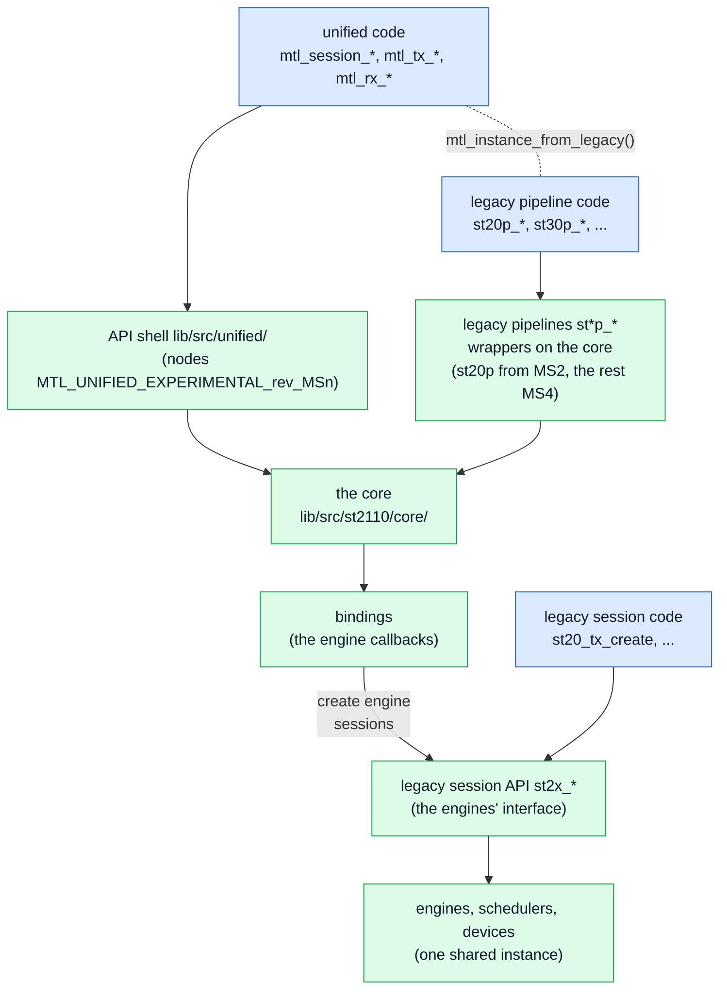
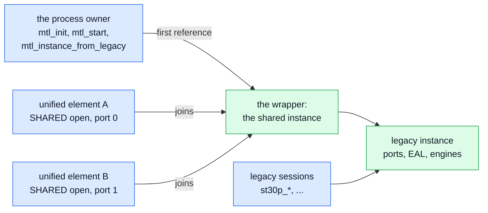
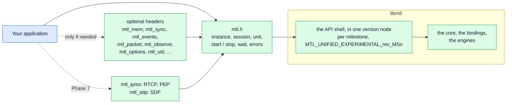
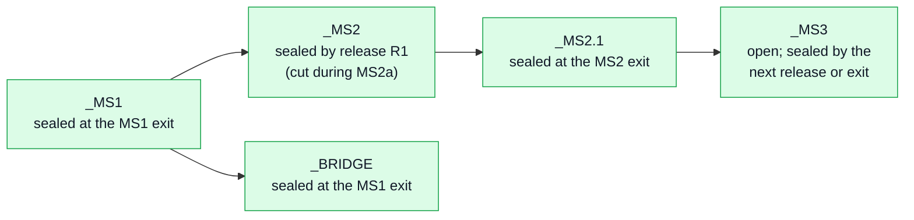
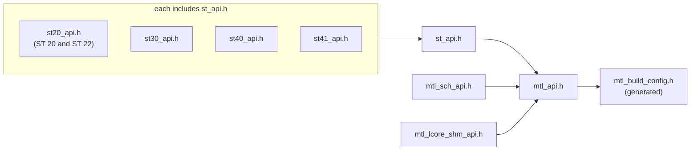
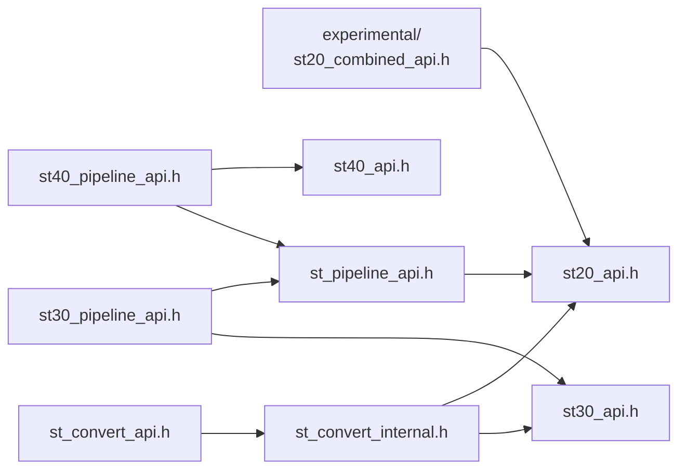
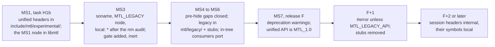
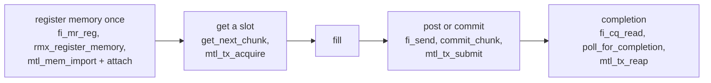

# Migration: legacy MTL API to the unified API

| | |
|---|---|
| Status | The porting guide, and the map the legacy wrappers on the core implement. The headers in [sketch/include/mtl/experimental/](sketch/include/mtl/experimental/) are normative: where this page and a header disagree, the header wins |
| Date | 2026-10-02 |
| Audience | application authors, framework and codec plugin authors, binding maintainers, implementers of the legacy pipeline wrappers |

What changes when code written against `mtl_api.h`, `st_pipeline_api.h` and the session headers
(`st20_api.h` … `st41_api.h`) moves to the unified API (`mtl.h` and its optional headers): the
call map, the field map of every legacy `ops` struct, the enum tables, coexistence, the library
and ABI plan, hiding the legacy headers, the codec plugin ABI v2, and notes and recipes per
consumer. The same maps are what the legacy `st*p_*` pipelines implement when they become
wrappers on the core (st20p in MS2, st22p, st30p and st40p in MS4; §6.3): a legacy `ops` struct
is translated field by field as §4 says. Read [concepts.md](concepts.md) for the model and
[contract.md](contract.md) for the normative behaviour;
[examples.md §28](examples.md#28-an-st20p-program-side-by-side) shows an st20p program side by side
with the unified one.

## 1. What changes for an application

### 1.1 Concepts

| Legacy | Unified |
|---|---|
| `mtl_handle` from `mtl_init()` | `mtl_instance_h` from `mtl_instance_open(&ip, &mt)` |
| one handle type per family (`st20p_tx_handle`, `st30_rx_handle`, …) | one `mtl_session_h` for every essence, direction and unit kind |
| one `ops` struct per family | one `struct mtl_session_config` (`sc`): `direction`, `essence`, `unit`, `flows[]`, a few timing and pool fields, one member per essence (`video`, `cvideo`, `audio`, `anc`, `fastmeta`, `rtp`) |
| pipeline, session and RTP-level APIs | one verb set; the unit kind says what moves: `MTL_UNIT_FRAME`, `MTL_UNIT_ROWS` (slice), `MTL_UNIT_PACKETS` (RTP level); pipeline conversion is `video.app_format` |
| session ports P and R | legs `sc.flows[0]`, `sc.flows[1]` (ST 2022-7) |
| `struct st_frame`, frame index | `struct mtl_unit`: lease (access), slot (stable buffer identity), planes, meta area, per-use fields |
| ext frames | an attached pool (`MTL_SESSION_POOL_ATTACHED`, `mtl_session_attach()`) over a region (`mtl_mem.h`) |
| create = live; `*_free()` | create (`CREATED`), then start, or `mtl_session_open()` for both; `mtl_session_close(s, timeout)` drains, destroys and waits for retirement, is null-safe, always consumes the handle, and polls when called again |
| `tfmt` + `timestamp` + flag bits | `sc.media_mode` + `unit.media_index` or `unit.media_tai_ns`; RTP is derived (`RTP = floor(M × rate)`); every time is TAI ns with a validity flag |
| flag bits and tuning fields | typed fields for what most programs set, `MTL_SESSION_*` flags, `MTL_OPT_*` options for the rest |
| callbacks (`notify_*`, `get_next_frame`, `query_*`) | calls on the application's thread: acquire, submit, reap, dequeue, release, wait |
| stats structs + reset; `notify_event` | one registry of named, cumulative values (`mtl_observe.h`); the events of a session and of an instance (`mtl_events.h`), waited on with a timeout (`mtl_wait`) or through a queue (`mtl_queue_arm`, MS2a) |
| sessions started one by one | `mtl_session_start(s, n, when, &t0)` starts an array, all or none; every session runs on the SMPTE epoch, and `MTL_WHEN_ORIGIN` puts media index 0 of each at the start's T0 |

### 1.2 Typed configuration

- Input structs start with `uint32_t struct_size`; `MTL_INIT(&s)` zero-fills and sets it, and
  zero in every other field is the default (`struct_size` 0 is `-MTL_EINVAL`). No per-struct init functions, no spec strings
  (D-97). Pointers in input structs are deep-copied during the call.
- Set `sc.direction`, `sc.essence`, `sc.flows[0]` (`mtl_flow_ipv4()`) and the essence's required
  fields; everything else defaults. The other essence members must stay zero.
- New enums keep the legacy order: value + 1 where 0 must mean "not set" (`mtl_fps`,
  `mtl_video_format`, `mtl_audio_format`, `mtl_ptime`, `mtl_app_format`, `mtl_cvideo_quality`),
  the same values where 0 is a real default (`mtl_packing`, `mtl_sender_type`). Porting an `ops`
  struct is mostly a field-by-field copy (§4); convert every legacy enum with the inline
  `mtl_*_from_legacy()` of `mtl_legacy.h` (§5), never by adding 1 by hand; the trap is the interlaced rate: legacy `fps` counts
  fields, `raster.fps` frames (§5.1).
- Tuning knobs are options: one `struct mtl_option {key, scope, value, str}` per knob in
  `sc.options` or `ip.options`. Absent means the documented default; present is literal (0 means
  0); `scope` 0 means every port, leg or scheduler, else `MTL_INDEX(i)` (i + 1). A session key set on the
  instance is the default for that instance's sessions, so a legacy instance-wide setting stays one
  setting. Every key has a name (`"rx.skew_budget_ns"`), listable with `mtl_option_list()`, so
  framework properties can expose every knob without code per knob.

### 1.3 Errors

| Legacy | Unified |
|---|---|
| create returns NULL | an `int` result; the out handle is null on failure; `mtl_last_error()` gives the reason and the field or option at fault |
| `get_frame` returns NULL for timeout, stop and destroy alike | `-MTL_EAGAIN` (nothing now, or by the timeout), `-MTL_ECANCELED` (interrupted), `-MTL_ESHUTDOWN` (you stopped or closed it), `-MTL_EIO` (the session is in `ERROR`) |
| POSIX errno, differing by OS | `MTL_E*` constants with the Linux errno values on every OS |
| a stale handle is undefined behaviour | `-MTL_EBADF`; a returned lease is `-MTL_ESTALE`; handles are never reissued |
| a failed `put_frame` keeps the frame with the caller | a failed first submit returns the slot to the pool, without a result (`-MTL_EBADF` and `-MTL_ESTALE` change no state) |
| `-ETIMEDOUT` from blocking gets | `-MTL_EAGAIN` for every data call; `-MTL_ETIMEDOUT` only from a DRAIN stop that missed its deadline (the rest became FLUSHED) |
| `*_free()`, `mtl_uninit()` return codes | `mtl_session_close()` returns 0 (retired) or 1 (still retiring: call it again, with a timeout, until it returns 0); `mtl_instance_close()` returns 0, 1 (quiesced, memory still referenced) or `-MTL_EIO` (`QUEUE_QUARANTINED`: a port could not be stopped; exit the process) |
| errno-style text | `mtl_last_error()` (kept until the thread's next failing call: a call that succeeds never writes it), `mtl_error_name()`, `mtl_reason_name()` |

### 1.4 Threads

- **No application code runs on an MTL tasklet.** Every legacy callback becomes a call on the
  application's thread. The library calls application code only from the one log thread that
  runs the log sinks (`mtl_log_add_sink()`, MS2a) and, for codec plugins, from their own threads; those threads may not open, close
  or shut down the instance (`-MTL_EDEADLK`).
- **Call classes**: CP (may allocate and block), DP (O(1), no allocation, no lock a tasklet takes,
  no logging, no syscall except one wake when it makes a target ready for a sleeper), DPC (copy or
  conversion in the caller), WT (waits; DP with timeout 0),
  AS (async-signal-safe). Debug builds enforce them (from MS3, D-05).
- **Blocking.** `*_FLAG_BLOCK_GET` and `*_set_block_timeout()` become the `timeout_ns` argument (0 =
  do not wait, `MTL_FOREVER`); `*_wake_block()` becomes `mtl_session_interrupt(s, 1)`, sticky until
  `(s, 0)`. Event loops use `mtl_queue_create` and `mtl_queue_arm` (MS2a): one queue and its
  descriptor (an eventfd, a `HANDLE` on Windows) for any number of sessions. A report names a
  session once and disarms it: serve it with timeout-0 calls, arm it again with what you want next,
  and sleep on the descriptor only after `mtl_queue_wait(q, …, 0)` returned `-MTL_EAGAIN`
  ([contract.md §7.2](contract.md#72-queues-ms2)).
- **Several threads.** `mtl_rx_release()` and `mtl_tx_acquire()` work from any thread. Set
  `MTL_SESSION_MT_SUBMIT` when several threads submit (§12.3).
- **Latency parity** with today's tasklet callbacks (MXL bridge, fwd samples, slice users) comes
  from busy polling with timeout 0; `mtl_session_set_inline_notify()` stays under `MTL_LATER` and
  is added only if a measurement shows busy polling misses the target (D-04). **Signals**: the library installs no
  handler; a handler may call only AS functions (`mtl_instance_interrupt(mt, 1)`,
  `mtl_instance_abort()`, `mtl_session_interrupt(s, 1)`).

### 1.5 Results

- **Exactly one result per accepted submit**, in submission order, from `mtl_tx_reap()`: `status`
  (`MTL_TX_ON_TIME`, `_DROPPED`, `_FLUSHED`, `_FAILED`), `reason`, `slot`, `cookie`,
  `media_index`, `media_tai_ns`, `margin_ns`, `sent_tai_ns`, `rtp`, `session`.
  `mtl_tx_reap_full()` (`mtl_observe.h`) reads the full timing record.
- **When.** A library pool produces results only with `MTL_SESSION_RESULTS` (lateness is still
  counted and raised as events). A pool of application memory always does: a slot is reused only
  after its result is reaped (`mtl_mem.h` rule MEM3). This replaces `notify_frame_done`,
  `notify_frame_late`, `EXT_FRAME_MANUAL_RELEASE` and `st20p_tx_notify_ext_frame_free()`.
- **Back-pressure.** The results ring holds `pool_count`; when unread results fill it, acquire
  returns `-MTL_EAGAIN` with `status.blocked_on = MTL_BLOCKED_RESULTS`.
- **RX.** `unit.status` is `MTL_RX_COMPLETE` or `MTL_RX_INCOMPLETE`; `unit.flags` carries
  `MTL_UNITF_*`; `unit.missed_before` counts units the pool could not take. Detail:
  `mtl_rx_get_detail()`; ST 2110-21 measures: its `timing[]` per leg.

### 1.6 Behaviour a migrating application notices

| Change | Legacy | Unified |
|---|---|---|
| default video RTP | TX cursor: media time plus the first-packet offset | the frame epoch (D-10); approximate the legacy value with a positive `tx.rtp_trim_ns` (TRO − VRX0 × TRS; `MTL_INFO_RTP_OFF_GRID`) |
| incomplete RX frames | dropped unless `RECEIVE_INCOMPLETE_FRAME` | delivered with `MTL_RX_INCOMPLETE`; `MTL_OPT_RX_INCOMPLETE = MTL_RX_DISCARD` restores the legacy behaviour. Attached RX pools are never zero-filled, so with the default `rx.incomplete` = DELIVER the lost ranges of an attached slot show the stale bytes of its last use: set `MTL_RX_DISCARD`, or read only complete units |
| ST 2110-22 rate | the size `get_next_frame` gives | CBR, padded to `codestream_bytes` (D-32); `MTL_CVIDEO_VBR_MAX` keeps the legacy wire |
| packet units | the session rewrites the RTP timestamp | verbatim (D-82); `sc.packet.set_fields` names what the library writes |
| UDP port | `udp_port = 0` derives a port from the session index, and TX and RX disagree (below) | `udp_port = 0` is `-MTL_EINVAL` unless the leg is reserved: pass the old value to keep the wire |
| TX SSRC | deterministic: `idx + 0x123450` video, `+ 0x223450` audio, `+ 0x323450` ANC and fastmeta (`st_tx_video_session.c:966`, `st_tx_audio_session.c:188`, `st_tx_ancillary_session.c:246`, `st_tx_fastmetadata_session.c:189`) | random (RFC 3550 §8): set `sc.ssrc` to keep one, or capture filters keyed on the SSRC break silently |
| time without PTP | any reader accepted | `ip.time_source` 0 is `MTL_TIME_SOURCE_AUTO`: `CLOCK_TAI` when its kernel offset is set, else `SYSTEM_TAI` (from MS6 a NIC PHC first, and FREERUN); AUTO chooses once at open (re-evaluation is Phase 7) and never starts the built-in PTP client. An estimated source is accepted, but times are flagged ESTIMATED with a timing warning (`TIME_ESTIMATED`) |
| interlaced rate | `ops.fps` is the field rate | `raster.fps` is the frame rate: `mtl_raster_from_legacy()` halves it; above 30 frames per second interlaced is `-MTL_EINVAL` (§5.1) |
| audio `ST31_PTIME_80US` | 4 samples at 48 kHz every 80 µs: a 50 kHz RTP rate (SF-35) | 4 samples every 83⅓ µs, as ST 2110-31 Table 1 defines; `info.ptime_ps` reports it ([timing.md](timing.md) §8) |
| user-paced video launch (`USER_PACING`) | paced from the epoch nearest the user's time | TAI media mode derives the launch from the media time, so TX moves by TROFFSET − VRX0 × TRS, about 604–619 µs at 1080p59.94 ([timing.md](timing.md) §14.1); `MTL_SUBMIT_NOT_BEFORE` keeps the "send at t" reading |
| late frames with `USER_TIMESTAMP` | slip: sent at the next epoch | dropped (`MTL_TX_DROPPED`, `TOO_LATE`): INDEX and TAI drop a late unit; only AUTO defers |
| unknown struct bytes or flag bits | ignored | `-MTL_EINVAL` (`NONZERO_TAIL`, `UNKNOWN_BITS`) |

The legacy derived ports: video 10000 + 2·idx on both sides (`st_tx_video_session.c:3390`,
`st_rx_video_session.c:3377`); audio TX 10100 + 2·idx against RX 20000 + 2·idx
(`st_tx_audio_session.c:2127`, `st_rx_audio_session.c:997`); ANC and fastmeta TX 10200 + 2·idx
against RX 30000 + 2·idx (`st_tx_ancillary_session.c:1697`, `st_rx_ancillary_session.c:1007`,
`st_tx_fastmetadata_session.c:1442`, `st_rx_fastmetadata_session.c:435`). A TX
`*_update_destination()` with port 0 derives the RX base instead (`st_tx_audio_session.c:2262`,
`st_tx_ancillary_session.c:1872`).

## 2. Call map per legacy family

### 2.1 Instance and core utilities (`mtl_api.h`, `mtl_sch_api.h`)

| Legacy | Unified |
|---|---|
| `mtl_init(&p)` | `mtl_instance_open(&ip, &mt)`; `MTL_INSTANCE_SHARED` for plugins sharing one instance (§11.7); `ip` NULL reads `MTL_PORTS` |
| `mtl_start()`, `mtl_stop()` | none: open starts the devices, close stops them |
| `mtl_uninit()`, `mtl_abort()` | `mtl_instance_close(mt, timeout)` (or `mtl_instance_shutdown()` with flags and a report); `mtl_instance_abort(mt)` (AS) |
| `mtl_ptp_read_time()`, `_raw()` | `mtl_time_now(mt, &tai, NULL, NULL)` (returns `MTL_TIMEF_*`; the last two take CLOCK_MONOTONIC and CLOCK_REALTIME of the same instant); `mtl_time_convert()` (`mtl_sync.h`) |
| `mtl_get_port_stats()`, `mtl_reset_port_stats()` | `mtl_stat_read()` / `mtl_stat_get()` on `MTL_OBJ_OF_PORT(mt, p)`, keys `port.*`; no reset |
| `mtl_port_ip_info()`, `mtl_p_sip_addr()`, `mtl_p_port()` and the R twins | `mtl_port_get_spec()` (the port as granted, DHCP included); `mtl_port_find()` |
| `mtl_pmd_by_port_name()`, `mtl_pmd_is_af_xdp()`, `mtl_get_simd_level()`, `mtl_get_fix_info()`, `mtl_get_var_info()` | stats: `caps.backend` (`enum mtl_backend`), `instance.simd_level` (`enum mtl_simd`), `caps.*`, `port.*`, `sched.*` |
| `mtl_set_log_level()` | `mtl_instance_params.log_level` at open, or the bridged legacy level (MS1); a sink's `min_severity` (MS2a) |
| `mtl_iova_mode_get()`, `mtl_rss_mode_get()` | `mtl_set_option()` / `mtl_get_option()` with `MTL_OPT_IOVA_MODE`, `MTL_OPT_RSS_MODE` |
| `mtl_set_log_printer()`, `mtl_openlog_stream()` | `mtl_log_add_sink(&p, &h)` (MS2a); one per component, removed with `mtl_log_remove_sink(h, timeout)` |
| `mtl_sch_enable_sleep()`, `mtl_sch_set_sleep_us()` | `MTL_INSTANCE_TASKLET_SLEEP`; `MTL_OPT_SCHED_SLEEP_US` (scope = scheduler + 1) |
| `mtl_is_manager_alive()` | `mtl_instance_get_health()` flag `MTL_HEALTH_MANAGER_LOST`; `MTL_EVENT_MANAGER_LOST` |
| `mtl_hp_malloc()`, `mtl_dma_mem_alloc()`; `mtl_dma_map()`; `*_free()`, `mtl_dma_unmap()`; `mtl_hp_virt2iova()`, `mtl_dma_mem_iova()` | `mtl_mem_alloc()`; `mtl_mem_import()`; `mtl_mem_close()` (retires at the last reference); no IOVA call: MTL maps a region into every port and DMA engine a session needs, and `mtl_session_attach()` takes regions; `mtl_mem_get_info()` |
| `mtl_version()`; `mtl_memcpy_action()` (Python) | `mtl_library_version()`, `mtl_library_version_num()`; `mtl_unit_copy_in()`, `mtl_unit_copy_out()`, `mtl_unit_copy_plane_in()`, `_out()` (stride-aware) |
| `mtl_para_*()`, `st_txp_para_*()`, `st_rxp_para_*()` | not needed: the structs bind cleanly (§10.1) |
| `mtl_get_lcore()`, `mtl_bind_to_lcore()`, `mtl_udma_*`, `mtl_memcpy()`, `mtl_sleep_us()`, `mtl_delay_us()`, `mtl_thread_setname()`, `mtl_get_if_ip()`, `mtl_size_page_align()` | removed; sessions request DMA with `MTL_OPT_DMA` |
| `mtl_sch_create()`, `mtl_sch_register_tasklet()` | removed |
| `mtl_lcore_shm_print()`, `_clean()` (`mtl_lcore_shm_api.h`, the `app/tools/lcore_shmem_mgr.c` tool) | an internal admin tool. With EK6 ([engine.md](engine.md); also for legacy users) the SysV lcore table is gone: these calls report nothing and leave at the freeze; `doc/shm_lcore.md` and `docker/README.md:121-134` are rewritten for `MTL_CPUARB_LOCKS` with a shared `MTL_OPT_RUNTIME_DIR` |

### 2.2 Video pipeline (`st20p_*`)

`sc.essence = MTL_VIDEO`, `sc.unit = MTL_UNIT_FRAME`, `sc.video.app_format` = `input_fmt` /
`output_fmt` + 1 (0 = no conversion). The other pipelines (`st22p`, `st30p`, `st40p`) map the same
way (§2.3).

| Legacy | Unified |
|---|---|
| `st20p_tx_create()`, `st20p_rx_create()` | `mtl_session_open(mt, &sc, &s)`, or `mtl_session_create()` + `mtl_session_start(&s, 1, when, &t0)` |
| `st20p_tx_get_frame()`, `put_frame()`, `put_frame_abort()` | `mtl_tx_acquire(s, &u, timeout)`, `mtl_tx_submit(s, &u)`, `mtl_tx_release(s, u.lease)` |
| `st20p_tx_put_ext_frame()`, `notify_ext_frame_free()` | an attached pool + `mtl_tx_acquire_slot(s, slot, &u, timeout)`; the result frees the slot; a new address per frame is `mtl_tx_acquire_layout()`; until a frame can be attached, `mtl_tx_acquire()` + submit with `MTL_SUBMIT_SRC_PLANES` and `u.plane[]` naming the frame (one copy, or the conversion, during the call) |
| `st20p_rx_get_frame()`, `put_frame()`, `put_frame_abort()` | `mtl_rx_dequeue(s, &u, timeout)`, `mtl_rx_release(s, u.lease)` |
| `*_get_fb_addr()`, `*_frame_size()` | `mtl_session_get_slot(s, slot, &u)`; `info.unit_bytes` (`mtl_session_get_info()` or `mtl_session_query()`) |
| `*_set_block_timeout()`, `*_wake_block()` | the timeout argument; `mtl_session_interrupt(s, 1)`, later `(s, 0)` |
| `*_get_sch_idx()`, `st20p_tx_get_pacing_params()` | `info.sched_index`; stat keys `info.*` (`info.trs_ps`, …) |
| `*_get_session_stats()`, `*_reset_session_stats()` | `mtl_stat_read()` / `mtl_stat_get()` on `MTL_OBJ_OF_SESSION(s)`; no reset (§4.14) |
| `st20p_tx_update_destination()`, `st20p_rx_update_source()` | `mtl_session_update(s, &sc, MTL_UPDATE_FLOWS, &when, &planned)`, atomic across legs |
| `st20p_rx_pcapng_dump()`; `st20p_rx_timing_parser_critical()` | `mtl_session_capture()`; `mtl_rx_get_detail(s, lease, &d, size)`, `d.timing[leg]` |
| `st20p_rx_get_queue_meta()` | removed |
| `st20p_tx_free()`, `st20p_rx_free()` | `mtl_session_close(s, timeout)` |

| `struct st_frame` | `struct mtl_unit` or call |
|---|---|
| `addr[]`, `linesize[]`; `iova[]` | `u.plane[i].addr`, `.stride` (with `row_bytes`, `rows`); no IOVA (MTL maps the region) |
| `fmt`, `width`, `height`, `interlaced`; `buffer_size` | the session config; `info.unit_bytes` |
| `data_size` | `u.used`: rows for video; bytes for cvideo, audio, fastmeta; table entries for ANC |
| `tfmt`, `timestamp`, `epoch` | `u.media_index`, `u.media_tai_ns` (TX by `sc.media_mode`; RX with `MTL_UNITF_INDEX_VALID` / `_TAI_VALID`); the legacy epoch is the index on the epoch |
| `rtp_timestamp`; `second_field` | `u.rtp` (TX only with `MTL_SUBMIT_RTP_TS`); `MTL_UNITF_SECOND_FIELD` |
| `status` | `COMPLETE` → `MTL_RX_COMPLETE`; `RECONSTRUCTED` → `MTL_RX_COMPLETE` + `MTL_UNITF_USED_REDUNDANCY`; `CORRUPTED` → `MTL_RX_INCOMPLETE`; `DROPPED` → not delivered, counted in the next unit's `missed_before` |
| `user_meta`, `user_meta_size` | a `MTL_META_USER` record in the meta area (`u.meta`; at most 1332 B for video) |
| `pkts_total`, `pkts_recv[]`, `receive_timestamp`, `tp[]` | `mtl_rx_get_detail()` (`pkts_expected`, `pkts_received[]`, `arrival_first_tai_ns[]`, `delivered_tai_ns`, `timing[]`) |
| `opaque` | TX: `u.cookie`, returned in the result; RX: the application's table indexed by `u.slot` |

### 2.3 Other families: what differs from st20p

| Family | Unified |
|---|---|
| all sessions (`st20_`, `st22_`, `st30_`, `st40_`, `st41_*_create`) | `mtl_session_open()`; `type` picks `sc.unit`: `FRAME_LEVEL` → `MTL_UNIT_FRAME`, `SLICE_LEVEL` → `MTL_UNIT_ROWS`, `RTP_LEVEL` → `MTL_UNIT_PACKETS` |
| `get_next_frame` + `notify_frame_done`; `notify_frame_ready` + `*_rx_put_framebuff()` | acquire + submit + reap; dequeue + release, on the application's thread |
| `*_tx_get_framebuffer(h, idx)`, `st22_*_get_fb_addr()`; `*_get_framebuffer_count()`, `_size()` | `mtl_session_get_slot()`; `info.pool_count`, `info.unit_bytes` |
| `st20_tx_set_ext_frame()` | attached pool + `mtl_tx_acquire_slot()` |
| `*_get_mbuf()` / `*_put_mbuf()` (TX) | `mtl_tx_acquire()` lends a chunk of packet slots; write the packets, the packet table and `u.used`; submit (`mtl_packet.h`) |
| `*_get_mbuf()` / `*_put_mbuf()` (RX) | `mtl_rx_dequeue()` returns a chunk of 1..N packets, one table entry each; release |
| `query_frame_lines_ready` (slice TX) | submit the same lease again with a larger `u.used`; deadlines from `mtl_tx_row_deadline()` |
| `notify_slice_ready` (slice RX) | the unit is dequeued with `MTL_UNITF_PARTIAL`; `mtl_rx_wait_rows()` waits for more rows |
| `st20_rx_dma_enabled()` | stat `rx.pkts_dma`; `mtl_rx_get_detail().path == MTL_PATH_DIRECT_DMA` |
| `uframe_pg_callback`; `st20rc_*` | removed; an `st20rc` receiver becomes one RX session with two legs |
| `st22p_*`, `st22_*` | `MTL_CVIDEO`; a codec plugin runs when `c.app_format` is not 0; `u.used` = codestream bytes |
| `st30p_tx_put_frame()` with re-framing in the caller | `mtl_tx_write(s, data, bytes, how, timeout)` splits arbitrary input at the unit capacity |
| `st30_calculate_framebuff_size()`, `st30_get_packet_size()` | `info.unit_bytes`; `mtl_audio_bytes(&sc.audio, samples, &bytes)` |
| `notify_timing_parser_result` (audio, every 200 ms per port) | `mtl_rx_detail.timing[]` per unit and leg (`dpvr_max_ns`, `ipt_max_ns`, `tsdf_ns`); stats `tp.*` |
| `st40p_*_get_udw_buff_addr()`, `*_max_udw_buff_size()`; `struct st40_frame_info`, `struct st40_meta`; `st40_tx_get_framebuffer()` | `u.plane[1].addr` and `u.plane[1].rows` (`sc.anc.max_udw_words`); the entries of `u.plane[0]` (`mtl_anc_table`), `u.used` = `meta_num`; `mtl_session_get_slot()` ([contract.md](contract.md) §5.7) |
| `st41_rx_*` (RTP level only today) | `MTL_UNIT_PACKETS` reproduces it; frame units on RX are new |
| `st22_encoder_register()`, `st_plugin_register()` | plugin ABI v2 (§9) |

### 2.4 Shared helpers (`st_api.h`, `st_pipeline_api.h`, `st_convert_api.h`, `st40_api.h`)

| Legacy | Unified |
|---|---|
| `st_frame_rate()`, `st_frame_rate_to_st_fps()`, `st_name_to_fps()` | `mtl_fps_rational()` (exact; no fps name parser) |
| `st10_tai_to_media_clk()`, `st10_media_clk_to_tai()`, `st10_get_tai()` | `mtl_media_ticks()`, `mtl_media_tai(near_tai, ticks, rate)` (exact, unwraps near a TAI); `mtl_time_now()` |
| `st_frame_fmt_name()`, `st_frame_name_to_fmt()`, `st20_fmt_name()`, `st_name_to_codec()` | `mtl_format_describe()` (names), `mtl_format_parse()`; codecs with `MTL_FORMAT_CODEC` |
| `st_frame_size()`, `st_frame_plane_size()`, `st_frame_least_linesize()`, `st20_frame_size()`, `st20_get_pgroup()`, `st20_get_bandwidth_bps()` | `mtl_format_describe()` (`plane_bytes[]`, `row_bytes[]`, `rows[]`, `pg_bytes`, `pg_pixels`); for a session, `mtl_session_query()` with `struct mtl_buffer_requirements`, and `info.wire_bps` (one leg, headers included) |
| `st_frame_fmt_to_transport()`, `st_frame_fmt_from_transport()` | `mtl_convert()` with `MTL_CONVERT_CHECK` (0 or `-MTL_ENOTSUP`) |
| `st_frame_convert()`, ≈ 105 per-pair converters; `st31_am824_to_aes3()` | `mtl_convert(&desc)` (the per-pair functions become internal); AM824 ↔ AES3 is `mtl_convert` with `MTL_AM824` and `MTL_AES3` (`MTL_FORMAT_AUDIO`) |
| `st40_get_udw()`, `st40_set_udw()`, parity, checksum, RFC 8331 helpers | `mtl_anc_udw_get()`, `_set()`, `mtl_anc_parity()`, `mtl_anc_parity_ok()`, `mtl_anc_checksum()` on `struct mtl_anc_packet`; the exported `mtl_anc_rfc8331_decode()` and `_encode()` (`mtl_packet.h`); `ST40_RFC8331_DECODE_*` results become `mtl_anc_decode_info.skipped` (below) |
| `st40_rfc8331_*` on the tasklet | nothing: submit encodes, dequeue decodes, in the caller's thread |
| `st40_tx_test_config` | `mtl_debug_inject(obj, MTL_FAULT_TX_MUTATE, &p)` (debug builds) |
| `st_draw_logo()` | removed |

`st40_rfc8331_decode_packet`'s `ST40_RFC8331_DECODE_*` results become
`struct mtl_anc_decode_info.skipped`: one total; per cause the stats key `anc.pkts_skipped{cause}`.

## 3. Field map conventions

§4 lists every field of every legacy `ops` struct. `sc` = `struct mtl_session_config`, `ip` =
`struct mtl_instance_params`; `v` = `sc.video`, `c` = `sc.cvideo`, `a` = `sc.audio`, `n` =
`sc.anc`, `f` = `sc.fastmeta`. `MTL_OPT_X = v` means one `struct mtl_option` in `sc.options` (or
`ip.options`); "(port i)" means scope i + 1. Leg i is legacy session port i
(`MTL_SESSION_PORT_P` = 0, `_R` = 1), `sc.flows[i]`. Conversion words: **same**, **+1**, **flag →
option**, **callback → call**, **removed** (D-87; no unified home, §8.4), **`MTL_LATER`**
(declared in the sketch only: Phase 7, created timelines), **not carried**. "§4.1"
means the row converts as in §4.1; each struct table starts by listing those fields, then gives the
rest.

## 4. Field maps

### 4.1 Fields and flags every session `ops` shares

| Legacy field | New field or option | Conversion |
|---|---|---|
| `dip_addr[i]` (TX), `ip_addr[i]` (RX) | `sc.flows[i].ip` | `mtl_flow_ipv4(&sc.flows[i], a, b, c, d, udp_port[i])`; RX: a group, or the port's own address (or zero) for unicast |
| `sip_addr[i]` (RX alias) | `sc.flows[i].ip` | removed (deprecated alias) |
| `udp_port[i]` | `sc.flows[i].udp_port` | same; 0 is `-MTL_EINVAL` unless the leg is reserved |
| `num_port` | which `sc.flows[]` exist | a leg exists when its `udp_port` is not 0; 2 = ST 2022-7 |
| `port[i]` (session port name) | `sc.flows[i].port` | 0 = instance port i (legacy P/R order); else `mtl_port_find(mt, port[i], &p)` and `mtl_flow_on_port(&sc.flows[i], p)` |
| `udp_src_port[i]` | `sc.flows[i].udp_src_port` | same (0 = `udp_port`) |
| `payload_type` | `sc.payload_type` | same; one value for every leg (ST 2022-7); TX 0 = essence default, RX 0 = no check |
| `ssrc` | `sc.ssrc` | same; one SSRC for every leg; TX 0 = random, RX 0 = no check |
| `mcast_sip_addr[i]` | `sc.flows[i].source_filter` | same bytes (IPv4 in 0..3) |
| `tx_dst_mac[i]`, `*_TX_FLAG_USER_P_MAC`, `_USER_R_MAC` | `sc.flows[i].dst_mac`, `flow_flags \|= MTL_FLOWF_USER_MAC` | flag → per-leg flag: P → leg 0, R → leg 1 |
| `name` | `sc.name` | copied into `char[MTL_NAME_MAX]`; NULL → "" (generated) |
| `priv` | — | removed: nothing calls back; `u.cookie` returns in the result, `mtl_tx_result.session` names the stream |
| `framebuff_cnt` | `sc.pool_count` | same (0 = by essence) |
| `socket_id`, `*_FLAG_FORCE_NUMA` | `MTL_OPT_NUMA = socket_id` | flag + field → option |
| `type` | `sc.unit` | `mtl_unit_kind_from_legacy()`: `FRAME_LEVEL` → `MTL_UNIT_FRAME`, `RTP_LEVEL` → `MTL_UNIT_PACKETS`, `SLICE_LEVEL` → `MTL_UNIT_ROWS` |
| `fps` | `raster.fps`, `raster.scan` | `mtl_raster_from_legacy(fps, interlaced, &raster)` (`mtl_legacy.h`): +1 and, interlaced, halved (§5.1) |
| `interlaced` | `raster.scan` | set by the same call |
| `get_next_frame` (TX session) | `mtl_tx_acquire` + `mtl_tx_submit` | callback → call; `u.slot` replaces `frame_idx` |
| `notify_frame_done` | `mtl_tx_reap` (library pools: `MTL_SESSION_RESULTS`) | callback → result; `slot` and `cookie` name the frame |
| `notify_frame_late(epoch_skipped)` | AUTO (`MTL_LATE_DEFER`): `MTL_TX_ON_TIME` with `MTL_TXR_DEFERRED` and `mtl_tx_result_full.indices_skipped_before` = `epoch_skipped` (`mtl_tx_reap_full()`); INDEX and TAI: `MTL_TX_DROPPED` + `reason` | callback → result; counters `tx.indices_empty` (AUTO defer; as `stat_epoch_drop`, §4.14), `tx.units_dropped{reason=too_late}` (INDEX and TAI) |
| `notify_frame_available` | `mtl_session_wait` with `MTL_WAIT_ACQUIRE` / `MTL_WAIT_DEQUEUE`, or a queue report (`mtl_queue_arm` of those targets, MS2a) | callback → a wait or a queue report |
| `notify_frame_ready` (RX session), `*_rx_put_framebuff` | `mtl_rx_dequeue`, `mtl_rx_release` | callback → call |
| `notify_event` | `mtl_session_read_events` | `ST_EVENT_VSYNC` → `MTL_EVENT_EPOCH_TICK`; `ST_EVENT_RECOVERY_ERROR` → `MTL_EVENT_RECOVERY`; `ST_EVENT_FATAL_ERROR` → `MTL_EVENT_SESSION_STATE` to `MTL_STATE_ERROR` |
| `rtp_ring_size` (TX / RX, RTP level) | `sc.pool_count` × `sc.packet.packets_per_chunk` / `sc.packet.rx_ring_packets` | TX: packets → chunks; RX: same (0 = 512) |
| `notify_rtp_done`, `notify_rtp_ready` | `mtl_tx_reap` (one result per chunk), `mtl_rx_dequeue` (a chunk of 1..N packets) | callback → call |
| `rtp_timestamp_delta_us` | `MTL_OPT_RTP_TRIM_NS` (`tx.rtp_trim_ns`) | × 1000: legacy adds the delta to the RTP instant, and so does the option (RTP = floor((M + trim) × rate)); AUTO and INDEX, the launch unchanged |
| `*_TX_FLAG_USER_PACING` | `sc.media_mode = MTL_MEDIA_TAI` + `u.media_tai_ns`, or per unit `MTL_SUBMIT_NOT_BEFORE` + `u.launch_tai_ns` | flag → mode; TAI media time snaps to the grid (`MTL_OPT_SNAP_MODE`) |
| `*_TX_FLAG_EXACT_USER_PACING` | `MTL_SESSION_EXACT_LAUNCH` in `sc.flags` at create, then per unit `MTL_SUBMIT_EXACT` + `u.launch_tai_ns` | flag → session flag + per-unit flag (without the session flag `MTL_SUBMIT_EXACT` is `-MTL_EINVAL`); reported with `MTL_INFO_NON_COMPLIANT` |
| `*_TX_FLAG_USER_TIMESTAMP` | `MTL_SUBMIT_RTP_TS` + `u.rtp`: `FMT_TAI`: the user's TAI in ticks, rounded to nearest (`st10_tai_to_media_clk`), with `MTL_MEDIA_TAI` and `u.media_tai_ns` = that TAI; `FMT_MEDIA_CLK`: the value | MS3; the legacy RTP bytes. TAI mode alone if the snapped, floored RTP is fine (MS1). Needs INDEX or TAI (`RTP_TS_AUTO`); a late unit drops, not slips (§1.6) |
| `*P_TX_FLAG_DROP_WHEN_LATE` | `MTL_OPT_LATE_POLICY = MTL_LATE_DROP` | the INDEX/TAI default; inert without USER_PACING, as today; the legacy slip has no INDEX/TAI equivalent (DEFER is AUTO only, [timing.md](timing.md) §6.2) |
| `*_FLAG_ENABLE_VSYNC` | `MTL_OPT_EPOCH_TICK = 1` | `MTL_EVENT_EPOCH_TICK` per unit period |
| `*P_*_FLAG_BLOCK_GET`, `*_set_block_timeout()` | the `timeout_ns` argument | no flag = 0; `*_wake_block()` → `mtl_session_interrupt(s, 1)` |
| `*_RX_FLAG_RECEIVE_INCOMPLETE_FRAME` | `MTL_OPT_RX_INCOMPLETE` | the unified default delivers incomplete units; without the legacy flag set `MTL_RX_DISCARD` |
| `*_RX_FLAG_DATA_PATH_ONLY` | — | removed (with queue meta) |
| `*_RX_FLAG_SIMULATE_PKT_LOSS` | `mtl_debug_inject(obj, MTL_FAULT_DROP_PKTS, &p)`: `leg`, `drop_every`, `drop_count`, `drop_offset` | debug builds; a pattern |
| `rtcp.sim_loss_rate`, `rtcp.burst_loss_max` | `mtl_debug_inject(obj, MTL_FAULT_DROP_RANDOM, &p)`: `drop_ppm`, `drop_count` (the burst) | debug builds; a random rate |
| `ST20*_`, `ST22*_FLAG_ENABLE_RTCP` | `MTL_OPT_RTX = 1` | MTL's NACK retransmission; the `rtcp` members in §4.4, §4.5 |
| `ST30*_`, `ST40*_`, `ST41*_FLAG_ENABLE_RTCP` | — | removed (no effect today) |
| `*_TX_FLAG_DEDICATE_QUEUE` | `MTL_OPT_TX_QUEUE = MTL_TXQ_DEDICATED` | flag → option |

### 4.2 `mtl_init_params`, `mtl_port_init_params`

`ip.ports` points at `ip.port_count` entries of `struct mtl_port_spec`, indexed by legacy port i.

| Legacy field | New field or option | Conversion |
|---|---|---|
| `port[i]`, `pmd[i]` | `ports[i].name` | same string; the backend is the prefix: a PCI BDF, `kernel:<if>`, `native_af_xdp:<if>`, `null:<n>`, `env:<VAR>[#n]` (§5.2) |
| `num_ports` | `ip.port_count` | same |
| `net_proto[i]` | DPDK: `MTL_OPT_DHCP = 1` (port i); kernel backends: `ports[i].sip` all zero | `MTL_PROTO_STATIC` = default |
| `sip_addr[i]`, `gateway[i]` | `ports[i].sip`, `ports[i].gateway` | same bytes 0..3 |
| `netmask[i]` | `ports[i].prefix_len` | mask → length (255.255.255.0 → 24; 0 = 24) |
| `tx_queues_cnt[i]`, `rx_queues_cnt[i]` | `ports[i].tx_queues`, `.rx_queues` | same (0 = auto) |
| `port_packet_loss[i]` (`tx_stream_loss_id`, `_divider`) | `MTL_FAULT_DROP_PKTS` on a session: `leg`, `drop_every`, `drop_offset` | debug; instance-wide → per session and leg |
| `flags` | `ip.flags` and options | §4.3 |
| `priv` | — | removed |
| `log_level` | `mtl_instance_params.log_level` | +1 (`MTL_LOG_LEVEL_DEBUG` 0 → `MTL_SEV_DEBUG` 1 … `CRIT` 5 → 6; process-wide, mismatch rule) |
| `lcores`, `main_lcore` | `ip.lcores`, `MTL_OPT_MAIN_LCORE` | same |
| `dma_dev_port[]`, `num_dma_dev_port` | `MTL_OPT_DMA_DEVICES` | array → comma-separated string |
| `rss_mode` | `MTL_OPT_RSS_MODE` | +1 |
| `iova_mode` | `MTL_OPT_IOVA_MODE` | `AUTO` = absent; `VA` 1, `PA` 2: same |
| `nb_tx_desc`, `nb_rx_desc` | `MTL_OPT_TX_DESC`, `MTL_OPT_RX_DESC` | same; scope 0 |
| `ptp_get_time_fn` | `ip.time_source = MTL_TIME_SOURCE_USER` + `mtl_time_set_reference(mt, 0, &ref)` with `MTL_TIMEREF_USER_PAIR` and `ref.user_tai_ns`, `ref.user_monotonic_ns` | pull → push; a `CLOCK_TAI` reader → `MTL_TIME_SOURCE_CLOCK_TAI` |
| `ptp_sync_notify` | stats `time.offset_ns`, `time.utc_offset_s`, `time.last_sync_age_ns`; `MTL_EVENT_TIME_STATE`, `_TIME_STEP` | callback → stats and events |
| `kp`, `ki` | `MTL_OPT_PTP_PI_KP`, `MTL_OPT_PTP_PI_KI` | double → integer × 1e9 |
| `dump_period_s`; `stat_dump_cb_fn` | `MTL_OPT_STAT_DUMP_S`; `mtl_stat_list` + `mtl_stat_read` | same; callback → the application's loop (§11.8) |
| `pacing`, `pkt_udp_suggest_max_size` | `MTL_OPT_PACING` (a session key set on the instance); `MTL_OPT_MAX_UDP_PAYLOAD` (`instance.max_udp_payload`, the default of every TX session's `max_udp_payload` field; RX takes the sender's SDP) | §5.2; same |
| `data_quota_mbs_per_sch`, `tasklets_nb_per_sch` | `MTL_OPT_SCHED_QUOTA_MBS`, `MTL_OPT_TASKLETS_PER_SCHED` | same |
| `tx_audio_sessions_max_per_sch`, `rx_…` | `MTL_OPT_SCHED_TX_AUDIO_MAX`, `MTL_OPT_SCHED_RX_AUDIO_MAX` | same |
| `rx_pool_data_size`, `memzone_max`, `arp_timeout_s` | `MTL_OPT_RX_POOL_DATA_SIZE`, `MTL_OPT_MEMZONE_MAX`, `MTL_OPT_ARP_TIMEOUT_S` | same |
| `rss_sch_nb[i]` | `MTL_OPT_RSS_SCHEDS` (port i) | same |
| `nb_rx_hdr_split_queues`, `tx_sessions_cnt_max`, `rx_sessions_cnt_max` | — | removed |
| `port_params[i].flags` `MTL_PORT_FLAG_FORCE_NUMA` (bit 0), `.socket_id` | `ports[i].numa` | `socket_id + 1` (0 = the device's socket) |
| `port_params[i].flags` `MTL_PORT_FLAG_ALLOW_DOWN_INITIALIZATION` (bit 1) | — | removed: the default; open never waits for links (`mtl_instance_get_health()`) |
| `port_params[i].rl_burst_size` | `MTL_OPT_RL_BURST` (port i) | same |

### 4.3 `enum mtl_init_flag`, bit by bit

| Legacy flag (bit) | New field or option |
|---|---|
| `BIND_NUMA` (0), `UDP_LCORE` (10) | removed |
| `PTP_ENABLE` (1) | `ip.time_source = MTL_TIME_SOURCE_PTP_BUILTIN`; on a VF it works as today (below). Without the flag and without `ptp_get_time_fn`: leave `time_source` 0 (AUTO, §1.6) |
| `RX_SEPARATE_VIDEO_LCORE` (2), `TX_VIDEO_MIGRATE` (3), `RX_VIDEO_MIGRATE` (4) | `MTL_OPT_RX_SEPARATE_VIDEO_LCORE = 1` (an instance key: every shared open must agree, §11.7); `MTL_OPT_MIGRATE = 1` (`session.migrate`) set on the instance, the default of its sessions, one key for TX and RX |
| `TASKLET_THREAD` (5), `TASKLET_SLEEP` (6), `ENABLE_HW_TIMESTAMP` (8) | `MTL_INSTANCE_TASKLET_THREAD` (0x4), `MTL_INSTANCE_TASKLET_SLEEP` (0x8), `MTL_INSTANCE_HW_TIMESTAMP` (0x10) |
| `RXTX_SIMD_512` (7), `PTP_PI` (9) | `MTL_OPT_SIMD_512 = 1`, `MTL_OPT_PTP_PI = 1` |
| `RANDOM_SRC_PORT` (11), `MULTI_SRC_PORT` (12) | `MTL_OPT_SRC_PORT_MODE` = `MTL_SRC_PORT_RANDOM` / `MTL_SRC_PORT_MULTI` (a session key) |
| `SHARED_TX_QUEUE` (13), `SHARED_RX_QUEUE` (14) | `MTL_OPT_TX_QUEUE = MTL_TXQ_SHARED` on the instance (the default of its sessions; a session's own wins), `MTL_OPT_SHARED_RX_QUEUE = 1` |
| `PHC2SYS_ENABLE` (15), `VIRTIO_USER` (16) | `MTL_OPT_PHC2SYS = 1`, `MTL_OPT_VIRTIO_USER = 1` |
| `DEV_AUTO_START_STOP` (17), `ALLOW_DOWN_PORTS` (48) | removed: the default; unified sessions never prune legs (`sc.legs_disabled` + `MTL_UPDATE_LEGS`) |
| `ALLOW_ACROSS_NUMA_CORE` (18), `NO_MULTICAST` (19) | `MTL_OPT_ACROSS_NUMA_CORES = 1`, `MTL_OPT_NO_MULTICAST = 1` |
| `DEDICATED_SYS_LCORE` (20), `NOT_BIND_NUMA` (21) | `MTL_OPT_SYS_LCORE = MTL_SYS_DEDICATED`, `MTL_OPT_NO_BIND_NUMA = 1` |
| `CNI_THREAD` (32), `CNI_TASKLET` (33) | `MTL_OPT_CNI` = `MTL_CNI_THREAD` / `MTL_CNI_TASKLET` |
| `NIC_RX_PROMISCUOUS` (34), `PTP_UNICAST_ADDR` (35) | `MTL_OPT_PROMISCUOUS = 1`, `MTL_OPT_PTP_UNICAST = 1` |
| `RX_MONO_POOL` (36), `TX_MONO_POOL` (40), `TASKLET_TIME_MEASURE` (38) | `MTL_OPT_RX_MONO_POOL`, `MTL_OPT_TX_MONO_POOL`, `MTL_OPT_TASKLET_TIME_MEASURE` = 1 |
| `AF_XDP_ZC_DISABLE` (39), `DISABLE_SYSTEM_RX_QUEUES` (41), `PTP_SOURCE_TSC` (42) | `MTL_OPT_AF_XDP_COPY`, `MTL_OPT_NO_SYSTEM_RX_QUEUES`, `MTL_OPT_PTP_SOURCE_TSC` = 1 |
| `TX_NO_CHAIN` (43) | `MTL_OPT_TX_COPY = 1` (a session key: payload copied into the packet) |
| `TX_NO_BURST_CHK` (44), `RX_USE_CNI` (45), `RX_UDP_PORT_ONLY` (46), `NOT_BIND_PROCESS_NUMA` (47) | `MTL_OPT_TX_NO_BURST_CHECK`, `MTL_OPT_RX_USE_CNI`, `MTL_OPT_RX_UDP_PORT_ONLY`, `MTL_OPT_NO_BIND_PROCESS_NUMA` = 1 |
| `REDUNDANT_SIMULATE_PACKET_LOSS` (63) | `mtl_debug_inject(…, MTL_FAULT_DROP_PKTS, …)` (debug builds) |

`PTP_BUILTIN` steers the port's PHC on a PF. On a port without timesync (a VF) it runs as today
in software mode (`ptp->no_timesync`, `lib/src/mt_ptp.c:1390-1393`): it disciplines MTL's own time
base only and never the VF's PHC, so RxTxApp `--ptp` and the nightly `ptp` group keep working on
VFs. `CLOCK_NOT_OWNED` is only for a request to steer a PHC MTL does not own.

### 4.4 `st20p_tx_ops`, `ST20P_TX_FLAG_*`

`sc.direction = MTL_TX`, `sc.essence = MTL_VIDEO`, `sc.unit = MTL_UNIT_FRAME`. As §4.1: `port`
(`struct st_tx_port`), `fps`, `interlaced`, `framebuff_cnt`, `name`, `priv`, `socket_id`,
`tx_dst_mac`, `rtp_timestamp_delta_us`, the four `notify_*` callbacks, and the flags `USER_P_MAC`
(0), `USER_R_MAC` (1), `USER_PACING` (3), `USER_TIMESTAMP` (4), `ENABLE_VSYNC` (5), `ENABLE_RTCP`
(7), `EXACT_USER_PACING` (8), `FORCE_NUMA` (11), `DROP_WHEN_LATE` (12), `BLOCK_GET` (15).

| Legacy field | New field or option | Conversion |
|---|---|---|
| `width`, `height` | `v.raster.width`, `.height` | same |
| `input_fmt` | `v.app_format` | `mtl_app_format_from_legacy()` (§5.1); 0 when it is the transport layout itself |
| `transport_fmt`, `transport_pacing`, `transport_packing` | `v.format`, `v.sender_type`, `v.packing` | `mtl_video_format_from_legacy()`, `mtl_sender_type_from_legacy()`, `mtl_packing_from_legacy()` |
| `transport_linesize` | library pools: `v.linesize[]` (0 = packed); attached pools: `mtl_attach.stride[]` | same |
| `device` | `MTL_OPT_VIDEO_CONVERT_DEVICE` | §5.2 (`st_plugin_device`) |
| `rtcp.buffer_size` | `MTL_OPT_RTX_BUFFER_PKTS` | same (with `MTL_OPT_RTX = 1`) |
| `start_vrx`, `pad_interval` | `MTL_OPT_VIDEO_START_VRX`, `MTL_OPT_VIDEO_PAD_INTERVAL` | same |
| `tx_hang_detect_ms` | `MTL_OPT_TX_HANG_DETECT_NS` | × 1000000 |
| `EXT_FRAME` (2), `st20p_tx_put_ext_frame()` | `MTL_SESSION_POOL_ATTACHED` + `mtl_session_attach()`, then `mtl_tx_acquire_slot()` | fixed app slots; a new address per frame: `mtl_tx_acquire_layout()`; a copy from the frame: `MTL_SUBMIT_SRC_PLANES` (§2.2) |
| `ENABLE_STATIC_PAD_P` (6), `DISABLE_BULK` (10) | `MTL_OPT_VIDEO_STATIC_PAD_P = 1`, `MTL_OPT_VIDEO_DISABLE_BULK = 1` | flag → option |
| `RTP_TIMESTAMP_EPOCH` (9) | — | removed: the unified default RTP is the epoch (D-10) |
| `EXT_FRAME_MANUAL_RELEASE` (13), `st20p_tx_notify_ext_frame_free()` | `mtl_tx_reap()`, `mtl_tx_acquire_slot()` | removed as a flag: app memory always produces results (rule MEM3); the result frees the slot, and `mtl_tx_acquire_slot()` takes it again |

### 4.5 `st20p_rx_ops`, `ST20P_RX_FLAG_*`

`sc.direction = MTL_RX`, `sc.essence = MTL_VIDEO`, `sc.unit = MTL_UNIT_FRAME`. As §4.1 or §4.4:
`port` (`struct st_rx_port`), `width`, `height`, `fps`, `interlaced`, `transport_linesize`,
`device`, `framebuff_cnt`, `name`, `priv`, `socket_id`, `notify_frame_available`, `notify_event`,
and the flags `ENABLE_VSYNC` (1), `ENABLE_RTCP` (4), `SIMULATE_PKT_LOSS` (5), `FORCE_NUMA` (6),
`BLOCK_GET` (15), `RECEIVE_INCOMPLETE_FRAME` (16, inverted default).

| Legacy field | New field or option | Conversion |
|---|---|---|
| `transport_fmt`, `output_fmt` | `v.format`, `v.app_format` | `mtl_video_format_from_legacy()`, `mtl_app_format_from_legacy()`; `app_format` 0 = no conversion |
| `rx_burst_size` | `MTL_OPT_RX_BURST` | same |
| `ext_frames` (`struct st_ext_frame[]`: `addr[]`, `iova[]`, `linesize[]`, `size`, `opaque`) | `mtl_session_attach()` with `count`, `slot_offset[]`, `plane_offset[]`, `stride[]` | one attach; `iova` dropped (MTL maps the region); `opaque` → the app's table by `u.slot` |
| `rtcp` (`nack_interval_us`, `seq_bitmap_size`, `seq_skip_window`; `burst_loss_max`, `sim_loss_rate`) | `MTL_OPT_RTX_NACK_INTERVAL_US`, `MTL_OPT_RTX_SEQ_BITMAP`, `MTL_OPT_RTX_SEQ_SKIP`; `MTL_FAULT_DROP_RANDOM` | same; loss: §4.1 |
| `query_ext_frame`; `EXT_FRAME` (2) with it | `mtl_rx_provide()` | callback → call; fixed frames: `MTL_SESSION_POOL_ATTACHED` + attach |
| `notify_detected` (meta `width`, `height`, `fps`, `packing`, `interlaced`; reply `slice_lines`, `uframe_size`) | `MTL_EVENT_RX_FORMAT` + stats `rx.detected.*` (`rx.detected.packing` included) | callback → event; `slice_lines` → `MTL_OPT_RX_ROWS_STEP`; `uframe_size` removed |
| `gpu_context`, `USE_GPU_DIRECT_FRAMEBUFFERS` (24) | `mtl_mem_open()` with `MTL_MEM_DEVICE` | MS6 (`NOT_IMPLEMENTED` until then) |
| `DATA_PATH_ONLY` (0), `HDR_SPLIT` (19) | — | removed |
| `PKT_CONVERT` (3) | `MTL_OPT_RX_CONVERT_PER_PACKET = 1` | flag → option; transport `MTL_YUV422_10` only, app formats `YUV422P10LE`, `Y210`, `UYVY`, `YUV422P16LE` (`lib/src/st2110/pipeline/st20_pipeline_rx.c:523-537`), no DMA offload; the library converts each packet on the RX tasklet as it lands, the one exception to "no conversion on a tasklet" (library code only, never application code) |
| `DMA_OFFLOAD` (17) | `MTL_OPT_DMA = MTL_REQ_PREFER` | falls back to the CPU, as today |
| `AUTO_DETECT` (18) | `v.detect = MTL_DETECT_ON` | flag → typed field |
| `DISABLE_MIGRATE` (20) | `MTL_OPT_MIGRATE = 0` | the default comes from `session.migrate` set on the instance |
| `TIMING_PARSER_STAT` (21), `TIMING_PARSER_META` (22) | `MTL_OPT_RX_TIMING_PARSER = 1`; META adds `mtl_rx_detail.timing[leg]` | stats `tp.*` |
| `USE_MULTI_THREADS` (23) | `MTL_OPT_RX_THREADS = 2` | flag → option (absent: 2 above 40 Gb/s); today's engine rejects 2 with two legs or with rows units |

### 4.6 `st20_tx_ops`, `ST20_TX_FLAG_*`

`sc.essence = MTL_VIDEO`, `v.app_format = 0`. As §4.1 or §4.4: the flow fields, `type`, `fps`,
`interlaced`, `name`, `priv`, `framebuff_cnt`, `socket_id`, `rtp_timestamp_delta_us`,
`rtcp.buffer_size`, `start_vrx`, `pad_interval`, `tx_hang_detect_ms`, `linesize` (as
`transport_linesize`), the callbacks, and the flags `USER_P_MAC` (0), `USER_R_MAC` (1), `EXT_FRAME`
(2), `USER_PACING` (3), `USER_TIMESTAMP` (4), `ENABLE_VSYNC` (5), `ENABLE_STATIC_PAD_P` (6),
`ENABLE_RTCP` (7), `EXACT_USER_PACING` (8), `RTP_TIMESTAMP_EPOCH` (9, removed), `DISABLE_BULK` (10),
`FORCE_NUMA` (11).

| Legacy field | New field or option | Conversion |
|---|---|---|
| `pacing`, `packing`, `fmt` | `v.sender_type`, `v.packing`, `v.format` | `mtl_sender_type_from_legacy()`, `mtl_packing_from_legacy()`, `mtl_video_format_from_legacy()` |
| `width`, `height` | `v.raster` | same |
| `query_frame_lines_ready` (slice) | `mtl_tx_submit()` of the same lease again with a larger `u.used` (rows) | deadlines `mtl_tx_row_deadline()`; late rows `MTL_OPT_ROWS_LATE` |
| `rtp_frame_total_pkts` | `sc.packet.packets_per_unit` | same; the chunk that ends a frame carries `MTL_SUBMIT_UNIT_END` |
| `rtp_pkt_size` | `sc.packet.slot_bytes` | same (bytes from the RTP header on) |
| RTP header rewrites at the RTP level (implicit) | `sc.packet.set_fields` | `MTL_PKT_SET_TIMESTAMP`; with `USER_TIMESTAMP`: 0 (verbatim). Two changes: the API writes `floor(M × rate)` of the unit's media time, where legacy rewrites from its TX cursor; a frame ends with `MTL_SUBMIT_UNIT_END` on its last chunk, where legacy sees the RTP timestamp change |

### 4.7 `st20_rx_ops`, `ST20_RX_FLAG_*`

As §4.1 or §4.5: the flow fields, `type`, `width`, `height`, `fps`, `interlaced`, `name`, `priv`,
`framebuff_cnt`, `socket_id`, `rx_burst_size`, `ext_frames` (`struct st20_ext_frame[]`:
`buf_addr`, `buf_iova`, `buf_len`, `opaque`), `rtcp`, `linesize`, `notify_detected`,
`query_ext_frame`, `gpu_context`, `gpu_direct_framebuffer_in_vram_device_address` (`MTL_MEM_DEVICE`, MS6),
`rtp_ring_size`, the callbacks, and every flag: `DATA_PATH_ONLY` (0), `ENABLE_VSYNC` (1),
`ENABLE_RTCP` (2), `SIMULATE_PKT_LOSS` (3), `FORCE_NUMA` (4), `RECEIVE_INCOMPLETE_FRAME` (16),
`DMA_OFFLOAD` (17), `AUTO_DETECT` (18), `HDR_SPLIT` (19), `DISABLE_MIGRATE` (20),
`TIMING_PARSER_STAT` (21), `TIMING_PARSER_META` (22), `USE_MULTI_THREADS` (23).

| Legacy field | New field or option | Conversion |
|---|---|---|
| `fmt` | `v.format` | +1 |
| `pacing`, `packing` | — | removed ("not in use now") |
| `uframe_size`, `uframe_pg_callback` | — | removed |
| `slice_lines` | `MTL_OPT_RX_ROWS_STEP` | same (rows between wake-ups) |
| `notify_slice_ready` | `mtl_rx_dequeue()` (unit with `MTL_UNITF_PARTIAL`), then `mtl_rx_wait_rows()` | callback → call |

### 4.8 `st22p_tx_ops`, `st22p_rx_ops`, `ST22P_*_FLAG_*`

`sc.essence = MTL_CVIDEO`, `sc.unit = MTL_UNIT_FRAME`; a codec plugin runs when `c.app_format` is
not 0. As §4.1, §4.4 or §4.5: `port`, `width`, `height`, `fps`, `interlaced` (into `c.raster`),
`framebuff_cnt`, `name`, `priv`, `socket_id`, `tx_dst_mac`, the callbacks, `rtcp`,
`query_ext_frame` (`mtl_rx_provide()`), and the flags TX `USER_P_MAC` (0), `USER_R_MAC` (1), `USER_PACING`
(3), `USER_TIMESTAMP` (4), `ENABLE_VSYNC` (5), `ENABLE_RTCP` (6), `EXT_FRAME` (8), `FORCE_NUMA` (9),
`DROP_WHEN_LATE` (12), `BLOCK_GET` (15); RX `DATA_PATH_ONLY` (0, removed), `ENABLE_VSYNC` (1),
`ENABLE_RTCP` (2), `SIMULATE_PKT_LOSS` (3), `EXT_FRAME` (4), `FORCE_NUMA` (5), `BLOCK_GET` (15),
`RECEIVE_INCOMPLETE_FRAME` (16).

| Legacy field | New field or option | Conversion |
|---|---|---|
| `input_fmt` (TX), `output_fmt` (RX) | `c.app_format` | +1 for a raw format (the plugin's input or output); a codestream format (56–60) → 0: the app gives or takes the codestream |
| `pack_type` | `MTL_OPT_CVIDEO_PACK` | +1 (`MTL_CVIDEO_PACK_CODESTREAM` 1; `SLICE` 2 reserved, `-MTL_ENOTSUP`) |
| `codec` | `c.codec`, `c.rate_mode` | §5.2 |
| `device` | `MTL_OPT_VIDEO_CONVERT_DEVICE` | §5.2; the `video.*` keys apply to cvideo, where it chooses the codec device |
| `quality` (TX) | `MTL_OPT_CVIDEO_QUALITY` | +1 (`MTL_CVIDEO_QUALITY_SPEED` 1, `_QUALITY` 2); passed to the plugin as `mtl_plugin_session_req.quality` |
| `codestream_size` (TX), `max_codestream_size` (RX) | `c.codestream_bytes` | same (per field when interlaced); RX 0 → now required |
| `codec_thread_cnt` | `MTL_OPT_CVIDEO_THREADS` | same |
| `ST22P_TX_FLAG_DISABLE_BOXES` (2), `ST22P_RX_FLAG_DISABLE_BOXES` (6) | — | removed |
| `ST22P_TX_FLAG_DISABLE_BULK` (7) | `MTL_OPT_VIDEO_DISABLE_BULK = 1` | flag → option (a `video.*` key, which applies to cvideo) |

### 4.9 `st22_tx_ops`, `st22_rx_ops`, `ST22_*_FLAG_*`

`sc.essence = MTL_CVIDEO`, `c.codec = MTL_CODEC_JPEGXS` (implied today: RFC 9134), `c.app_format =
0`. The legacy session sends what `get_next_frame` sizes; `c.rate_mode = MTL_CVIDEO_VBR_MAX` keeps
that on the wire, the unified default CBR pads each unit. As §4.1, §4.6 or §4.7: the flow
fields, `type`, `width`, `height`, `fps`, `interlaced`, `name`, `priv`, `framebuff_cnt`,
`socket_id`, `rtcp`, the callbacks, the RTP-level fields (`rtp_ring_size`, `rtp_frame_total_pkts`,
`rtp_pkt_size`, `notify_rtp_*`), and the flags TX `USER_P_MAC` (0), `USER_R_MAC` (1), `USER_PACING`
(3), `USER_TIMESTAMP` (4), `ENABLE_VSYNC` (5), `ENABLE_RTCP` (6), `FORCE_NUMA` (8); RX
`DATA_PATH_ONLY` (0, removed), `ENABLE_VSYNC` (1), `ENABLE_RTCP` (3), `SIMULATE_PKT_LOSS` (4),
`FORCE_NUMA` (5), `RECEIVE_INCOMPLETE_FRAME` (16).

| Legacy field | New field or option | Conversion |
|---|---|---|
| `pacing` (TX); `pacing` (RX) | `c.sender_type`; — | same; removed (not read) |
| `pack_type` | `MTL_OPT_CVIDEO_PACK` | +1 |
| `fmt` | — | removed: today's library overwrites it with `ST20_FMT_YUV_422_10BIT`, and `mtl_cvideo_config` has no sampling or depth |
| `framebuff_max_size` | `c.codestream_bytes` | same; per unit `u.used` = the real size |
| `ST22_TX_FLAG_DISABLE_BOXES` (2), `ST22_RX_FLAG_DISABLE_BOXES` (2) | — | removed |
| `ST22_TX_FLAG_DISABLE_BULK` (7) | `MTL_OPT_VIDEO_DISABLE_BULK = 1` | flag → option (a `video.*` key) |

### 4.10 `st30p_tx_ops`, `st30p_rx_ops`, `st30_tx_ops`, `st30_rx_ops`

`sc.essence = MTL_AUDIO`; pipeline and session map alike. As §4.1: the flow fields (or `port` of
the pipelines), `type`, `framebuff_cnt`, `name`, `priv`, `socket_id`, `rtp_timestamp_delta_us`, the
callbacks and RTP-level fields, and the flags `USER_P_MAC` (0), `USER_R_MAC` (1), `USER_PACING`
(3), `ST30_TX_FLAG_USER_TIMESTAMP` (4), `DEDICATE_QUEUE` (7), TX `FORCE_NUMA` (8), RX `FORCE_NUMA`
(2), `BLOCK_GET` (15), `ST30P_TX_FLAG_DROP_WHEN_LATE` (16), RX `DATA_PATH_ONLY` (0, removed),
`SIMULATE_PKT_LOSS` (3), `RECEIVE_INCOMPLETE_FRAME` (4), `ENABLE_RTCP` (TX 6, RX 1, removed). Audio
media indices count samples.

| Legacy field | New field or option | Conversion |
|---|---|---|
| `fmt`, `channel` | `a.format`, `a.channels` | `mtl_audio_format_from_legacy()`, same |
| `sampling` | `a.sample_rate` | `mtl_sample_rate_from_legacy()` |
| `ptime` | `a.ptime` | `mtl_ptime_from_legacy()`, the 44.1 kHz values included |
| `pacing_way` (TX) | `MTL_OPT_PACING` | `AUTO` = absent, `RL` → `MTL_PACING_HW_RATE`, `TSC` → `MTL_PACING_SW` |
| `framebuff_size` | `a.unit_samples` | bytes → samples per channel: `framebuff_size / (channels × bytes per sample)`; `mtl_audio_bytes()` converts back |
| `fifo_size` (TX) | `MTL_OPT_AUDIO_FIFO_MS` | packets → ms: `fifo_size × ptime` |
| `rl_accuracy_ns`, `rl_offset_ns` (TX) | `MTL_OPT_AUDIO_RL_ACCURACY_NS`, `MTL_OPT_AUDIO_RL_OFFSET_NS` | same |
| `notify_timing_parser_result` (session RX) | `mtl_rx_detail.timing[]` + stats `tp.*` | every 200 ms per port → per unit and leg |
| `sample_size`, `sample_num` (session) | — | removed (deprecated) |
| `ST30_TX_FLAG_BUILD_PACING` (5) | `MTL_OPT_AUDIO_BUILD_PACING = 1` | flag → option |
| `ST30_RX_FLAG_TIMING_PARSER_STAT` (16), `_META` (17) | `MTL_OPT_RX_TIMING_PARSER = 1` (+ `mtl_rx_detail.timing[]`) | flag → option |

### 4.11 `st40_tx_ops`, `st40_rx_ops`, `st40p_tx_ops`, `st40p_rx_ops`

`sc.essence = MTL_ANC`. Legacy RX has no `fps`; `n.video` is now required, or all zero to take the
raster and launch delay of the first video session of its start array (MS6). As §4.1: the flow
fields (or `port`), `type`, `name`, `priv`, the callbacks and RTP-level fields,
and the flags `USER_P_MAC` (0), `USER_R_MAC` (1), `USER_PACING` (3), `USER_TIMESTAMP` (4),
`DEDICATE_QUEUE` (6), `EXACT_USER_PACING` (ST40 7, ST40P 9), `ST40P_TX_FLAG_DROP_WHEN_LATE` (7),
`BLOCK_GET` (15), RX `DATA_PATH_ONLY` (0, removed), `ENABLE_RTCP` (TX 5, RX 1, removed).

| Legacy field | New field or option | Conversion |
|---|---|---|
| `fps` (TX), `interlaced` | `n.video.fps`, `n.video.scan` | +1, interlaced: halve (§5.1); RX scan is the initial value, detection per `n.detect` |
| `max_udw_buff_size` (pipelines), `framebuff_size` (session RX) | `n.max_udw_words` | the same number with 8-bit words; 0 = max(255, 32 × `max_packets`) |
| `ST40_MAX_META` (20) | `n.max_packets` | 20 keeps today's slot size; 0 = 32 |
| `framebuff_cnt` | `sc.pool_count` | same |
| `test` (`st40_tx_test_config`: `pattern`, `frame_count`, `paced_pkt_count`, `paced_gap_ns`) | `mtl_debug_inject(obj, MTL_FAULT_TX_MUTATE, &p)`: `mutation`, `unit_count`, `paced_pkts`, `paced_gap_ns` | debug; `pattern` same values (`NONE` = no call) |
| `rtp_ring_size` (`st40p_rx_ops`) | — | removed: documented as mandatory (`include/st40_pipeline_api.h:233-234`), read by no pipeline since `d74cd1e0`. Its readers go with it: the GStreamer `rtp-ring-size` property, the st40p sample, two acceptance tests of the check (`test_anc_format.py:1871`, `:1971`) ([engine.md](engine.md) §7.2, DD-16) |
| `SPLIT_ANC_BY_PKT` (ST40 8, ST40P 10) | `MTL_ANCF_NEW_RTP` in `flags` of every entry | flag → per-entry flag |
| `ST40P_TX_FLAG_FORCE_NUMA` (8), `ST40P_RX_FLAG_FORCE_NUMA` (2) | — | removed ("NOT SUPPORTED YET") |
| `DISABLE_AUTO_DETECT` (ST40_RX 2, ST40P_RX 3) | `n.detect = MTL_DETECT_OFF` | flag → field (0 = `MTL_DETECT_AUTO`, on for ANC) |

| `st40_meta` (`include/st40_api.h:284-303`) | `mtl_anc_packet` | Conversion |
|---|---|---|
| `c` | `flags & MTL_ANCF_C` | bit |
| `line_number` | `line` | same, literal (0 stays 0) |
| `hori_offset` | `hoffset` | same |
| `s`, `stream_num` | `MTL_ANCF_S` in `flags`, `stream` | bit; same |
| `did`, `sdid` (`uint16_t`, masked to 8 bits by `st40_add_parity_bits`) | `did`, `sdid` (`uint8_t`) | the 8-bit value; MTL adds the parity |
| `udw_size` | `udw_count` (`uint8_t`) | same (≤ 255 already) |
| `udw_offset` (`uint16_t`, bytes) | `udw_offset` (`uint32_t`, words) | same number with 8-bit words |
| `st40_frame.meta_num`, `st40_frame_info.meta_num` | `u.used` | same |
| `st40_frame.data`, `st40_frame_info.udw_buff_addr` | `u.plane[1].addr` | same bytes with 8-bit words |
| `udw_buffer_fill`, `data_size` | — | Σ `udw_count` |
| RX `st40_rx_frame_meta.second_field`, `interlaced`, `rtp_marker`, `seq_lost`, `seq_discont`, `pkts_total`, `pkts_recv[]`, `timestamp_first_pkt`, `status` | `MTL_UNITF_SECOND_FIELD`; `info`/detection; `mtl_rx_detail.marker_seen`, `missing_ranges`, `pkts_received[]`, `arrival_first_tai_ns[]`; `u.status` | as §2.2 |
| `st40_tx_frame_meta.second_field` | the index parity (`n.video.scan` interlaced) | — |

### 4.12 `st41_tx_ops`, `st41_rx_ops`

`sc.essence = MTL_FASTMETA`. As §4.1: the flow fields, `type` (TX), `interlaced` (`f.video.scan`),
`name`, `priv`, `framebuff_cnt` (TX), the callbacks and RTP-level fields, and the flags
`USER_P_MAC` (0), `USER_R_MAC` (1), `USER_PACING` (3), `USER_TIMESTAMP` (4), `DEDICATE_QUEUE` (6),
`ENABLE_RTCP` (TX 5, RX 1, removed), `ST41_RX_FLAG_DATA_PATH_ONLY` (0, removed).

| Legacy field | New field or option | Conversion |
|---|---|---|
| `fps` (TX) | `f.video.fps` | +1; interlaced: halve |
| `fmd_dit` | `f.data_item_type` | same; RX 0xffffffff (no check) → leave `MTL_FASTMETA_RX_MATCH_DIT` unset in `f.fastmeta_flags`, else set it |
| `fmd_k_bit` | `f.k_bit` | same; RX 0xff (no check) → leave `MTL_FASTMETA_RX_MATCH_K` unset, else set it |

### 4.13 `st_api.h` address structs and ST 2110-10 helpers

| Legacy | New | Conversion |
|---|---|---|
| `st_tx_dest_info` (`dip_addr[]`, `udp_port[]`) with `*_tx_update_destination()` | `sc.flows[i]` + `mtl_session_update(s, &sc, MTL_UPDATE_FLOWS, when, NULL)` | the application keeps its `sc`: edit the flows, update (update reads only the members its parts name) |
| `st_rx_source_info` (`ip_addr[]` / `sip_addr[]`, `udp_port[]`, `mcast_sip_addr[]`) with `*_rx_update_source()` | the same flow fields + `source_filter` | as above |
| `enum st10_timestamp_fmt` (`TAI` 0, `MEDIA_CLK` 1) | `u.media_tai_ns`, or `u.rtp` + `MTL_SUBMIT_RTP_TS` | the format picks the field |
| `st10_tai_to_media_clk()`, `st10_media_clk_to_tai()` | `mtl_media_ticks()`, `mtl_media_tai()` | exact |

### 4.14 Legacy stats fields

Stats are cumulative for the life of the object, with no reset; compute deltas from your own
previous snapshot. The key catalogue is [contract.md](contract.md) §11.3. The ported gtests and RxTxApp
read these counters, so each row below says what the legacy counter counts today: a key of a
different meaning would make a ported test pass or fail for the wrong reason.

**TX** (`st_tx_user_stats`, in every `st2x_tx_user_stats.common`):

| Legacy | What it counts today | Key |
|---|---|---|
| `port[i].packets`, `.bytes` | packets and bytes sent on port i | `leg.pkts{leg=i}`, `leg.bytes{leg=i}` |
| `port[i].frames` | frames sent on port i | no per-leg key; session-wide `tx.units_on_time` |
| `stat_epoch_drop` | epochs **skipped** because a frame came after its slot; the frame is still sent, in the current epoch (`st_tx_video_session.c:680`, `st_tx_ancillary_session.c:390`; audio and fastmeta beyond their late window) | `tx.indices_empty`; per unit (AUTO, `MTL_LATE_DEFER`) `MTL_TX_ON_TIME` with `MTL_TXR_DEFERRED` and `indices_skipped_before`. Not `tx.units_dropped` |
| `stat_epoch_onward` | epochs given up when the cursor ran over 1 s ahead (`max_onward_epochs`, `st_tx_video_session.c:670` and the ANC and audio twins) | **no key.** An AUTO cursor cannot run ahead of its queued units (beyond the horizon is `-MTL_ERANGE`); a time step keeps every media time ([timing.md](timing.md) §12, `time.step_count`) |
| `stat_epoch_mismatch` | units whose epoch start had passed when they were paced, sent at once (audio, ANC, fastmeta; never written for video) | `tx.units_dropped{reason=too_late}` (INDEX and TAI), `tx.indices_empty` (AUTO defer) |
| `stat_exceed_frame_time` | frames whose build ended after packet 0's target (`st_tx_video_session.c:2138`): a builder symptom, not wire lateness | `tx.build_overrun` |
| `stat_error_user_timestamp` | user times in the past, more than 1 s ahead, or a `MEDIA_CLK` time with user pacing (`st_tx_video_session.c:621-636`, `:1774-1801`) | **no key.** Refused at submit (`-MTL_ERANGE`: `BEYOND_HORIZON`, `LAUNCH_IN_PAST`) or at create (`-MTL_EINVAL`), or reported in the result (`MTL_TX_DROPPED` + reason) |
| `stat_recoverable_error`, `stat_unrecoverable_error` | TX queue recoveries that worked, that needed a restart | `tx.recoveries_ok`, `tx.recoveries_failed` |
| `stat_frames_sent` (pipelines) | frames whose last packet was committed; today frames in flight during a recovery count here too (SF-12; [legacy-internals.md](legacy-internals.md)) | `tx.units_on_time`; the recovery gap's units are `MTL_TX_DROPPED` with reason `RECOVERY`, never on time |
| `stat_frames_dropped` (pipelines) | frames dropped as late (`DROP_WHEN_LATE`, `pipeline/st20_pipeline_tx.c:148`) **and** frames returned by `put_frame_abort()` (`:921`) | late drops: `tx.units_dropped{reason=too_late}`; an aborted frame is `mtl_tx_release()` of an unsubmitted lease, which has no result and no counter |
| `st20_tx_user_stats.stat_epoch_troffset_mismatch` | nothing: never written | none |

**RX** (`st_rx_user_stats`, in every `st2x_rx_user_stats.common`):

| Legacy | What it counts today | Key |
|---|---|---|
| `port[i].packets`, `.bytes`, `.lost_packets`, `.reordered_packets`, `.duplicates_same_port` | per port, before redundancy | `leg.pkts`, `leg.bytes`, `leg.pkts_lost`, `leg.pkts_reordered`, `leg.pkts_duplicate_same_leg` (label `leg=i`) |
| `stat_pkts_received`, `stat_pkts_redundant` | accepted packets, filtered duplicates (after redundancy) | `rx.pkts_received`, `rx.pkts_redundant` |
| `stat_lost_packets` | **before** redundancy: the sum of `port[].lost_packets`, recovered packets included (`st_api.h:405-413`) | the sum over legs of `leg.pkts_lost{leg=i}`. Not `rx.pkts_lost_est` |
| `stat_pkts_unrecovered` | **after** redundancy: packets no leg delivered; video infers them from the bytes an incomplete frame lacks (`st_rx_video_session.c:958-961`) | `rx.pkts_lost_est` (flagged `MTL_STAT_ESTIMATE` where inexact) |
| `stat_pkts_wrong_pt_dropped`, `_wrong_ssrc_dropped` | packets rejected by the header checks | `rx.pkts_rejected{cause=pt}`, `{cause=ssrc}` |
| `stat_frames_received` (pipelines) | frames delivered, whatever their status | `rx.units_delivered` |
| `stat_frames_dropped` (pipelines) | frames lost because no user slot was free: back-pressure, not packet loss (`st_api.h:443-450`, `pipeline/st20_pipeline_rx.c:127`) | `rx.units_missed_pool_full`; per unit, the next unit's `unit.missed_before`. Not `rx.units_incomplete_discarded` |
| `stat_frames_corrupted` (pipelines) | frames delivered with `ST_FRAME_STATUS_CORRUPTED` | `rx.units_incomplete_delivered` |
| `st20_rx_user_stats.stat_frames_incomplete`, `st30_rx_user_stats.stat_frames_incomplete` | frames not fully assembled from the wire, delivered or not (`st_rx_video_session.c:956`) | `rx.units_incomplete_delivered` + `rx.units_incomplete_discarded` |
| `st20_rx_user_stats.stat_slot_get_frame_fail`, `st30_rx_user_stats.stat_slot_get_frame_fail` | session layer: no free frame for a new slot (`st_rx_video_session.c:1247`) | `rx.units_missed_pool_full` |
| `st20_rx_user_stats.frames_partial[i]` | frames port i could not complete alone | no per-leg key; session-wide `rx.units_used_redundancy` |
| `st20_rx_user_stats.stat_bytes_received`, `stat_pkts_no_slot`, `stat_pkts_dma` | | `leg.bytes` (summed), `rx.pkts_rejected{cause=no_slot}`, `rx.pkts_dma` |
| `st20_rx_user_stats.stat_pkts_wrong_len_dropped`, `_wrong_interlace_dropped`, `stat_pkts_offset_dropped`; `st30_rx_user_stats.stat_pkts_len_mismatch_dropped`; `st40_rx_user_stats.stat_pkts_wrong_interlace_dropped` | packets rejected by the payload checks | `rx.pkts_rejected{cause=len}`, `{cause=interlace}`, `{cause=offset}`; `{cause=len}`; `{cause=interlace}` |
| `st20_rx_user_stats.stat_pkts_rtp_ring_full` | RTP-level packets lost to a full ring | `pkt.rx_ring_full` (packet units) |

**Port** (`mtl_port_status`): `rx_packets`, `tx_packets`, `rx_bytes`, `tx_bytes`, `rx_err_packets`,
`rx_hw_dropped_packets`, `rx_nombuf_packets`, `tx_err_packets` → `port.rx_pkts`, `port.tx_pkts`,
`port.rx_bytes`, `port.tx_bytes`, `port.rx_errors`, `port.rx_missed`, `port.rx_nombuf`,
`port.tx_errors`.

Debug counters of the engine (`stat_pkts_slice_merged`, the burst and header-split counters) stay
internal.

**Counters without a key (U-402).** These legacy counters have no key yet: `stat_epoch_onward` and
`stat_error_user_timestamp` (above: reported another way); TX `port[i].build` and
`port[i].frames` per leg; RX `port[i].frames`, `port[i].err_packets` and `frames_partial[i]` per
leg; and the remaining family-specific fields of `st20_tx_user_stats`, `st20_rx_user_stats` (about
20, such as `stat_slices_received`, `stat_pkts_idx_dropped`, `stat_vsync_mismatch`,
`stat_slot_query_ext_fail`, `stat_pkts_retransmit`, `stat_pkts_user_meta_err`, the interlace field
counts), `st30_tx_user_stats` (`stat_epoch_late`, the burst and warm-up counters),
`st40_rx_user_stats` and `st41_rx_user_stats` (`stat_pkts_enqueue_fail`, the gauges
`stat_last_time` and `stat_max_notify_rtp_us`; `st30_rx` and `st40_rx` `stat_pkts_dropped` are
never written today). The rule (OI-40): a counter that RxTxApp or a gtest reads gets a key in
contract.md §11.3 when its reader is ported; a debug-only counter gets none and stays internal.

### 4.15 Fields whose home is easy to miss

Nine legacy fields have a home that a quick port overlooks; the tables above already use it (the
stats key is in the catalogue): the 44.1 kHz packet times (`MTL_PTIME_1_09MS` 7 … 9), a
per-session migrate opt-out (`MTL_OPT_MIGRATE`: migration is ported, not dropped), a padded stride
for library pools (`mtl_video_config.linesize[]`), named codec quality values
(`enum mtl_cvideo_quality`), the detected packing (`rx.detected.packing`), random loss injection
(`MTL_FAULT_DROP_RANDOM`), `MTL_CODEC_DEVICE_TEST_INTERNAL`, and the renamed tags `enum mtl_severity`
and `enum mtl_simd` (§6.1). `st22_*_ops.fmt` is not carried (today's library ignores it).

Per-frame TX addresses (`mtl_tx_acquire_layout`), `query_ext_frame` (`mtl_rx_provide`) and GPU frame
buffers (`MTL_MEM_DEVICE` of `mtl_mem_open`) exist today, so they belong to the port, not to Phase 7
(U-185, U-209, U-117 in [coverage.md](coverage.md)).

### 4.16 Coverage of today's modes

The field maps above go field by field; this table goes mode by mode, so a mode cannot fall
between two fields. The milestone of each mode is in its U-rows in [coverage.md](coverage.md) §2,
the one home of a feature's milestone (D-137). Details: [legacy-internals.md](legacy-internals.md).

| Today's mode | Unified home | U-rows |
|---|---|---|
| frame units, every essence, TX and RX; ST 2022-7 | `MTL_UNIT_FRAME`; legs `sc.flows[0..1]` | U-120, U-126 |
| pipeline layer (`st20p`, `st22p`, `st30p`, `st40p`) vs session layer | one session: `video.app_format` or `cvideo.app_format` not 0 is the pipeline (conversion, codec); 0 is the session layer | U-360, U-230, U-232 |
| derive pipelines (no conversion, no codec) | `app_format = 0` | U-363 |
| slice TX and RX | `MTL_UNIT_ROWS`: resubmit with a larger `u.used`, `mtl_rx_wait_rows()` | U-191, U-218 |
| RTP level, every essence; ST 2022-6 and custom payloads | `MTL_UNIT_PACKETS`; the generic RTP essence `MTL_RTP` (D-82) | U-340…U-346 |
| callback-driven completion (session layer) vs get/put with optional notify (pipelines) | acquire, submit, reap; dequeue, release; calls with a timeout, and queues for event loops (MS2a) | U-173, U-174, U-181, U-201 |
| TX ext frames: per index (`st20_tx_set_ext_frame`), per frame (`st20p_tx_put_ext_frame`, optional manual release) | attached pool + `mtl_tx_acquire_slot()`; a new address per frame `mtl_tx_acquire_layout()`; a copy from caller memory `MTL_SUBMIT_SRC_PLANES` | U-184, U-185, U-186 |
| split forward (TX ext frame inside another session's RX frame, `app/sample/fwd/rx_st20_tx_st20_split_fwd.c:127-131`) | `mtl_session_get_pool_region()` on the RX session, `mtl_session_attach()` of each TX session over it with its own sub-rectangle layout, submit with `hold` = the RX lease ([contract.md](contract.md) §9.6) | U-189 |
| RX ext frames: fixed `ext_frames[]` vs `query_ext_frame` per frame | attached pool; `mtl_rx_provide()` | U-208, U-209 |
| GPU VRAM RX frames | `mtl_mem_open()` with `MTL_MEM_DEVICE` (`NOT_IMPLEMENTED` until then) | U-117 |
| RX per-pixel-group callback (`uframe_pg_callback`); per-packet conversion (`PKT_CONVERT`) | removed; `MTL_OPT_RX_CONVERT_PER_PACKET` (§4.5) | U-219, U-220 |
| `DATA_PATH_ONLY` (application-owned flows, queue meta) | removed | U-139 |
| header split | removed | U-213 |
| normal, user and exact user pacing | `MTL_MEDIA_AUTO`; `MTL_MEDIA_TAI` or `MTL_SUBMIT_NOT_BEFORE`; `MTL_SESSION_EXACT_LAUNCH` + `MTL_SUBMIT_EXACT` (`MTL_INFO_NON_COMPLIANT`) | U-150…U-152; other essences U-252, U-270, U-284 |
| epoch RTP, `rtp_timestamp_delta_us` | the default (D-10); `tx.rtp_trim_ns` | U-154, U-156 |
| pacing tuning (`DISABLE_BULK`, `TSC_NARROW`, `STATIC_PAD_P`, `start_vrx`, `pad_interval`) | options `MTL_OPT_VIDEO_*`, `MTL_PACING_SW_NARROW` | U-088, U-162 |
| two RX threads (auto above 40 Gb/s) | `MTL_OPT_RX_THREADS` | U-217 |
| field-as-frame interlace with library field parity | `MTL_INTERLACED`: the unit is a field (§12.6) | U-187 |
| ST 2110-40 split by packet, interlace auto-detect | `MTL_ANCF_NEW_RTP` per entry, `sc.anc.detect` | U-263, U-264 |
| ST 2110-30 build pacing, FIFO, RL warm-up | `MTL_OPT_AUDIO_BUILD_PACING`, `MTL_OPT_AUDIO_FIFO_MS`, `MTL_OPT_AUDIO_RL_*` | U-248…U-250 |
| ST 2110-22 codec threads, plugin blocking get | `MTL_OPT_CVIDEO_THREADS`; plugin ABI v2 `host->get_work(…, timeout)` (§9) | U-230, U-381 |
| transport layouts outside RFC 4175 (`YUV_422_PLANAR10LE`, `V210`, `*CUSTOM8`) | `mtl_video_format_ext` (`*_NONSTD`), `MTL_INFO_NON_COMPLIANT` | U-194, U-362 |
| debug knobs in public `ops` (loss simulation, `st40_tx_test_config`, `port_packet_loss[]`) | `mtl_debug_inject()` (debug builds) | U-090, U-223, U-267 |
| backends: DPDK PMD, native AF_XDP, kernel socket; DPDK AF_XDP and AF_PACKET PMDs | the port name prefix (§4.2); the two DPDK PMDs removed | U-092…U-095 |
| RX timing parser, DMA offload; video auto-detect; VSYNC; pcap dump, NACK retransmission | §4.5; `MTL_OPT_EPOCH_TICK`; `mtl_session_capture()`, `MTL_OPT_RTX` | U-214, U-215, U-211, U-212, U-159, U-140, U-141 |

Every legacy use case has a home in the headers or is on the cut list (D-87; [coverage.md](coverage.md)
§2, §4.5). Abort from a signal handler (U-006) is `mtl_instance_abort()` (AS); the IOVA of a
library-pool plane (U-111) is no longer needed: `mtl_session_attach()` takes regions and MTL maps
them, and `mtl_mem_info.va` gives a plane's offset. The small helpers without a full home (OI-42):
U-115, a general fast copy, is removed (`mtl_unit_copy_in()` / `_out()` and the stride-aware
`mtl_unit_copy_plane_in()` / `_out()` copy into and out of units; a public `mtl_memcpy` is gone);
U-348, the bit layouts of the RFC 4175 pixel groups, gets a home in `mtl_format.h` (today
`mtl_format_describe()` gives only bytes and pixels per group); R-7, a session-level cookie, stays
a per-unit cookie (`u.cookie`; the application maps `mtl_tx_result.session` to its context).
U-402, the unmapped stats fields, follows §4.14.

## 5. Enum tables

Each value was checked against both header sets. The inline converters of `mtl_legacy.h` implement
these tables: `mtl_video_format_from_legacy`, `mtl_app_format_from_legacy`,
`mtl_packing_from_legacy`, `mtl_sender_type_from_legacy`, `mtl_audio_format_from_legacy`,
`mtl_sample_rate_from_legacy`, `mtl_ptime_from_legacy`, `mtl_unit_kind_from_legacy` (and
`mtl_raster_from_legacy` for `fps`).

### 5.1 Media enums

**`enum st_fps` → `enum mtl_fps`** (+1): `ST_FPS_P59_94`, `P50`, `P29_97`, `P25`, `P119_88`,
`P120`, `P100`, `P60`, `P30`, `P24`, `P23_98` (0–10) → `MTL_FPS_59_94`, `_50`, `_29_97`, `_25`,
`_119_88`, `_120`, `_100`, `_60`, `_30`, `_24`, `_23_98` (1–11); new: `MTL_FPS_47_95` 12,
`MTL_FPS_48` 13. A raster carries only the rational: `raster.fps = mtl_fps_rational(MTL_FPS_59_94)`
for a named rate, any other as an exact rational (num ≤ 4194303, den ≤ 1023).

**Interlaced.** Legacy `fps` is the field rate; `raster.fps` is the frame rate. Use
`mtl_raster_from_legacy()` (`mtl_legacy.h`), never a hand-made table:

- `P59_94` → 30000/1001, `P50` → 25, `P60` → 30.
- `P119_88`, `P120` and `P100` with `interlaced` have no unified equivalent (59.94, 60 and 50
  interlaced frames, `-MTL_EINVAL`, `FIELD_RATE`).
- `P29_97`, `P25`, `P30`, `P24` and `P23_98` with `interlaced` halve to 15000/1001, 25/2, 15,
  12 and 12000/1001: legal, the same wire as the legacy session (their field rates are rows of the
  legacy table, so MS1 takes them), but no format standard defines them; check that the legacy
  session really sent that field rate.

**`enum st20_fmt` → `enum mtl_video_format`** (+1): the order is kept, so `ST20_FMT_YUV_422_10BIT`,
`_8BIT`, `_12BIT`, `_16BIT` (0–3) → `MTL_YUV422_10`, `_8`, `_12`, `_16` (1–4); `YUV_420_*` (4–7) →
`MTL_YUV420_8`, `_10`, `_12`, `_16` (5–8); `RGB_*` (8–11) → `MTL_RGB_8` … `_16` (9–12);
`YUV_444_*` (12–15) → `MTL_YUV444_8` … `_16` (13–16). The two layouts outside RFC 4175 are `enum
mtl_video_format_ext` (`mtl_format.h`): `YUV_422_PLANAR10LE` 16 → `MTL_YUV422P10LE_NONSTD` 17,
`V210` 17 → `MTL_V210_NONSTD` 18, reported with `MTL_INFO_NON_COMPLIANT`.

**Same values:** `enum st20_packing` → `enum mtl_packing` (`BPM` 0, `GPM` 1, `GPM_SL` 2); `enum
st21_pacing` → `enum mtl_sender_type` (`NARROW` 0 → `MTL_SENDER_N`, `WIDE` 1 → `MTL_SENDER_W`,
`LINEAR` 2 → `MTL_SENDER_NL`).

**Audio.** `enum st30_fmt` → `enum mtl_audio_format` (+1): `PCM8` → `MTL_PCM8` 1, `PCM16` → 2,
`PCM24` → 3, `ST31_FMT_AM824` → `MTL_AM824` 4. `enum st30_sampling` → `sample_rate` in Hz: `48K`
→ 48000, `96K` → 96000, `ST31_SAMPLING_44K` → 44100. `enum st30_ptime` → `enum mtl_ptime` (+1;
0 = 1 ms): `ST30_PTIME_1MS`, `125US`, `250US`, `333US`, `4MS`, `ST31_PTIME_80US`, `ST31_PTIME_1_09MS`,
`_0_14MS`, `_0_09MS` (0–8) → `MTL_PTIME_1MS`, `_125US`, `_250US`, `_333US`, `_4MS`, `_80US`,
`_1_09MS`, `_0_14MS`, `_0_09MS` (1–9).

**`enum st_frame_fmt` → `enum mtl_app_format`** (+1; `mtl_format.h`):

| `ST_FRAME_FMT_*` | value | `MTL_APP_*` | value |
|---|---|---|---|
| `YUV422PLANAR10LE`, `V210`, `Y210`, `YUV422PLANAR8`, `UYVY` | 0–4 | `YUV422P10LE`, `V210`, `Y210`, `YUV422P8`, `UYVY` | 1–5 |
| `YUV422RFC4175PG2BE10`, `YUV422PLANAR12LE`, `YUV422RFC4175PG2BE12` | 5–7 | `YUV422_PG2_BE10`, `YUV422P12LE`, `YUV422_PG2_BE12` | 6–8 |
| `YUV444PLANAR10LE`, `YUV444RFC4175PG4BE10`, `YUV444PLANAR12LE`, `YUV444RFC4175PG2BE12` | 8–11 | `YUV444P10LE`, `YUV444_PG4_BE10`, `YUV444P12LE`, `YUV444_PG2_BE12` | 9–12 |
| `YUV420CUSTOM8`, `YUV422CUSTOM8`, `YUV420PLANAR8`, `YUV422PLANAR16LE` | 12–15 | `YUV420_CUSTOM8`, `YUV422_CUSTOM8`, `YUV420P8`, `YUV422P16LE` | 13–16 |
| — | — | `NV12` (new) | 17 |
| `ARGB`, `BGRA`, `RGB8` | 32–34 | `ARGB`, `BGRA`, `RGB8` | 33–35 |
| `GBRPLANAR10LE`, `RGBRFC4175PG4BE10`, `GBRPLANAR12LE`, `RGBRFC4175PG2BE12` | 35–38 | `GBRP10LE`, `RGB_PG4_BE10`, `GBRP12LE`, `RGB_PG2_BE12` | 36–39 |
| — | — | `RGBA` (new) | 40 |
| `JPEGXS_CODESTREAM`, `H264_CBR_CODESTREAM`, `H264_CODESTREAM`, `H265_CBR_CODESTREAM`, `H265_CODESTREAM` | 56–60 | no app format: `c.app_format = 0` and `c.codec` (§5.2) | — |

### 5.2 Other enums

| Legacy enum | New | Conversion |
|---|---|---|
| `enum st20_type` … `st41_type` | `enum mtl_unit_kind` | a table: `FRAME_LEVEL` 0 → `MTL_UNIT_FRAME` 0, `RTP_LEVEL` 1 → `MTL_UNIT_PACKETS` 2, `SLICE_LEVEL` 2 → `MTL_UNIT_ROWS` 1 |
| `enum st22_codec`: `JPEGXS` 0, `H264_CBR` 1, `H264` 2, `H265_CBR` 3, `H265` 4 | `c.codec`: `MTL_CODEC_JPEGXS` 1, `_H264` 2, `_H265` 3; `c.rate_mode` | `_CBR` → `MTL_CVIDEO_CBR`; H.264/H.265 without it → `MTL_CVIDEO_VBR_MAX`; JPEG XS → CBR |
| `enum st22_pack_type`, `enum st22_quality_mode` | `enum mtl_cvideo_pack`, `enum mtl_cvideo_quality` | +1 |
| `enum st_plugin_device`: `AUTO` 0, `CPU` 1, `GPU` 2, `FPGA` 3, `TEST` 4, `TEST_INTERNAL` 5 | `enum mtl_codec_device` | same values; `AUTO` = absent; `MTL_CODEC_DEVICE_TEST` is a device registered with `mtl_plugin_open(mt, NULL, &dev, &h)` |
| `enum st21_tx_pacing_way`: `AUTO` 0, `RL` 1, `TSC` 2, `TSN` 3, `PTP` 4, `BE` 5, `TSC_NARROW` 6 | `enum mtl_pacing` (`MTL_OPT_PACING`): absent, `MTL_PACING_HW_RATE` 2, `_SW` 4, `_HW_LAUNCH` 3, `_PTP` 6, `_BEST_EFFORT` 7, `_SW_NARROW` 5 | a table; `MTL_PACING_HW` 1 = any hardware class; `caps.pacing_req` = `MTL_REQ_REQUIRE` fails create instead of falling back |
| `enum st30_tx_pacing_way`: `AUTO`, `RL`, `TSC` | absent, `MTL_PACING_HW_RATE`, `MTL_PACING_SW` | a table |
| `enum mtl_log_level` (`mtl_api.h`): `DEBUG` 0 … `CRIT` 5 | `enum mtl_severity` (`mtl.h`): `MTL_SEV_DEBUG` 1 … `MTL_SEV_CRIT` 6, also the event severities | +1 |
| `enum mtl_rss_mode`: `NONE` 0, `L3` 1, `L3_L4` 2 | `enum mtl_rss`: `MTL_RSS_NONE` 1, `_L3` 2, `_L3_L4` 3 | +1 |
| `enum mtl_iova_mode`: `AUTO` 0, `VA` 1, `PA` 2 | `enum mtl_iova`: absent, `MTL_IOVA_VA` 1, `_PA` 2 | same |
| `enum mtl_pmd_type`: `DPDK_USER` 0, `NATIVE_AF_XDP` 4, `KERNEL_SOCKET` 17, `DPDK_AF_XDP` 19, `DPDK_AF_PACKET` 20 | `mtl_port_spec.name`: a BDF, `native_af_xdp:<if>`, `kernel:<if>` | enum → prefix; the two DPDK PMDs removed |
| `enum st40_tx_test_pattern`: `NONE` 0, `NO_MARKER` 1, `SEQ_GAP` 2, `BAD_PARITY` 3, `PACED` 4 | `enum mtl_tx_mutation`: `MTL_TX_MUTATE_NO_MARKER` 1 … `_PACED` 4 | same; `NONE` = no call |

## 6. Coexistence

One process may run legacy and unified sessions on one instance while the legacy headers are
installed (until F+2, §8.3), so a port can be gradual. Both APIs live in one library, libmtl, and
end in the same core and the same engines, as the picture below shows (blue: your code; green:
MTL):



Unified code reaches the engines through the core and its bindings, which create their engine
sessions through the legacy session API like any legacy session user. A legacy pipeline becomes a
wrapper on the core when its essence is on it; until then it runs on the legacy session API as it
does today. The legacy session API is never wrapped: it stays the engines' interface (§6.3), and
its headers are hidden from MS7 on (§8). The dotted line is the bridge of §6.2.

### 6.1 Both header sets in one file

The unified headers include no legacy header and redeclare nothing it declares: the clashing tags
were renamed (`enum mtl_severity`, `enum mtl_simd`, because `mtl_api.h` owns `enum mtl_log_level` and
`enum mtl_simd_level`), and `MTL_VERSION_NUM()` is defined identically in both. `sketch/check.sh`
proves it: when a configured build tree (`build/mtl_build_config.h`) exists, it compiles
`mtl_api.h`, `st_pipeline_api.h`, `st20_api.h`, `st30_api.h`, `st40_api.h`, `st41_api.h`,
`st30_pipeline_api.h`, `st40_pipeline_api.h` and every unified header in one translation unit.

### 6.2 The legacy bridge (`mtl_legacy.h`)

- `mtl_instance_from_legacy(legacy, &mt)` wraps a legacy instance; the legacy `mtl_handle` is named
  only as the opaque `struct mtl_main_impl*`, so no legacy header is needed. The wrapper's ports are
  the legacy ports in their order. `mtl_instance_close()` on the wrapper closes the unified sessions,
  queues and regions made through it but never stops the legacy devices or sessions; `mtl_uninit()`
  does that. The application keeps the legacy handle it wrapped for legacy calls on the same ports;
  there is no call back from the unified handle.



- **One shared instance** (MS2a). The wrapper is the process's shared instance, as the picture
  above shows. Another wrap of the same handle returns another reference. A unified component's
  `mtl_instance_open(MTL_INSTANCE_SHARED)` joins the wrapper and names only its own ports
  ([contract.md §2.3](contract.md#23-shared-instance)). So a product with legacy code can take a
  unified GStreamer element or FFmpeg device into its process, once it has wrapped its instance.
  The order is fixed: the legacy instance first. A legacy `mtl_init` after a unified instance fails,
  as a second `mtl_init` does today.
- The wrapper runs on the legacy clock (flagged `MTL_TIMEF_UTC` where it is UTC; the user and PTP
  clocks from MS2a); `mtl_uninit` returns `-EBUSY` while a reference to it is open; C instance keys
  are `-MTL_EBUSY`; from MS2a R keys act on the legacy sessions too and session defaults start from
  the legacy settings ([contract.md](contract.md) §2.8).
- On a wrapped instance whose legacy `mtl_start()` has not run yet, unified sessions may be created,
  but `mtl_session_start` is `-MTL_EBUSY` (`WRONG_STATE`) until it has; RxTxApp and KahawaiTest
  start the legacy instance first, or set `MTL_FLAG_DEV_AUTO_START_STOP` (OI-2).
- It is CP and ships in MS1 (KahawaiTest's unified cases run on its global legacy instance through
  it; ex24 is the MS1 way onto a VF, [examples.md §26](examples.md#26-from-the-legacy-api)).
  It is legacy tier, not part of `MTL_1.0`: its own version node (§7.2), the header in
  `mtl/legacy/` from F, and both leave the public set with `mtl_init` (§8.3, D-190).

### 6.3 Shared engines, separate wire defaults

- **Engines first** (D-24): engine bugfixes reach legacy users by default, and every milestone
  passes a legacy KahawaiTest and acceptance gate ([implementation-plan.md](implementation-plan.md)
  §8.5).
- **Stats on a shared engine.** The legacy `*_reset_session_stats()` keep working on the legacy
  API. They clear only the legacy counters; the unified counters of the same engine session stay
  cumulative.
- **Wire-visible changes** (the RTP ±1 fixes, the default video RTP, ANC RTP, ST 2110-22 CBR) are
  default only in the unified API; legacy sessions get them behind an opt-in legacy flag (D-10,
  D-24).
- **The legacy pipelines are wrappers on the core** (D-99): st20p from MS2, st22p, st30p and st40p
  from MS4, each with its essence. `get_frame` is an acquire seen as `st_frame`, `put_frame` and
  `put_ext_frame` a submit, `put_frame_abort` a release, `BLOCK_GET` the core's wait, and one legacy
  notifier thread of the instance, sleeping on an internal queue, serves `notify_frame_done` and
  `notify_frame_available` once per published unit ([core.md](core.md) §1). The `ops` fields
  translate as §4 says, with the legacy defaults of §1.6 kept, so a wrapped pipeline's wire does not
  change. What else a legacy user can observe, and whether it stays, is the ledger of §6.5. A fix
  lands once, and the legacy pipeline suites become tests of the core.
  st40p stays on its engine path until MS4a2, then runs on the core with the legacy codec (decode
  at `get_frame`, encode at `put_frame`), checks, timing and RX parse, so its wire and reports do
  not change (DID 00h, line 0, any order); only SF-87 and SF-88 reach it, as bugfixes.
- **The legacy session API is not wrapped.** It stays the engines' interface, which the core's
  bindings call too, so session callbacks, slice and RTP-level users keep their latency. It is
  bugfix only from release F; the unified API reaches the same capabilities natively
  (`MTL_UNIT_ROWS`, `MTL_UNIT_PACKETS`).

### 6.4 Mixed-API RTP hazard

A legacy ST 2110-20 session on its default TX-cursor RTP stamps the media time plus the
first-packet offset (TRO − VRX0 × TRS); every epoch-based session (unified, or legacy ANC and audio)
stamps the media time. At 1080p59.94 the difference is about 604–619 µs depending on the granted
VRX0, 54.4–55.7 ticks at 90 kHz. A legacy ST 2110-40 session next to a unified ST 2110-20 session
agrees within ±1 tick. So never mix a legacy video session on its default RTP with anything else.
There is no legacy timeline helper ([timing.md](timing.md) §14.2). Set
`ST20(P)_TX_FLAG_RTP_TIMESTAMP_EPOCH` on the legacy video session, whose RTP is then the frame
epoch as a unified session's; or set `USER_TIMESTAMP` on every legacy session with timestamps the
application computes from one anchor (as RxTxApp does, `tests/tools/RxTxApp/src/rxtx_app.c:673-703`);
or move the whole programme to one API.

### 6.5 The legacy behaviour ledger

When a legacy pipeline becomes a wrapper on the core (st20p MS2b, st30p and st40p MS4a, st22p
MS4b), each behaviour a legacy user can observe either stays or changes on purpose. This ledger
lists them before each re-base starts. A kept behaviour lives in the wrapper where it can; one the
core must keep is a named mode, `ST_CORE_LEGACY_<NAME>` in `st_core.h`, whose comment cites its
row, and `check.sh` fails on a mode without a row. A change is a bugfix under D-24 or needs a
D-row. Every row has a test that pins it. At F+2 the wrappers and every mode of this ledger are
deleted.

| ID | Family | Behaviour a legacy user sees | Today | Verdict | Kept by | Pinned by |
|---|---|---|---|---|---|---|
| LB-01 | st20p TX | the frame is FREE before `notify_frame_done` runs, so `get_frame` may return it inside or before the callback | `st20_pipeline_tx.c:270`, `:286` | keep | the legacy notifier thread of the instance, on an internal queue, calls the session's notifier once per published unit (`pub_seq`), never on a tasklet; exactly once | to add: UB `St20pLegacy.notify_after_free` |
| LB-02 | st20p TX | frames are numbered at `get_frame`, and pick-up takes the oldest by that number, so send order is get order | `:807-808`, `:62-77` (SF-44) | open: get order or submit order (G-08) | — | T1 TX cases; to add: UB `St20pLegacy.send_order` |
| LB-03 | st20p TX | a converting session fires `notify_frame_done` at conversion, so the application's (ext) frame returns before transport done | `:380-385`, `:995-999` | keep | `ST_CORE_LEGACY_EARLY_RELEASE`: the notifier thread fires at the transform's done (XFORM → QUEUED) | frozen `St20p` convert cases; to add: UB `St20pLegacy.notify_at_convert` |
| LB-04 | st20p TX | interlaced: `get_frame` presets `second_field`, alternating per call; the application may override it | `:812-814` | keep | wrapper | frozen `St20p.digest_1080i_s2` |
| LB-05 | st20p TX, RX | `user_meta` is reset at `get_frame` (TX) and delivered with the frame (RX) | TX `:816-817`; RX `st20_pipeline_rx.c:910-916` | keep | wrapper (the meta area's `MTL_META_USER` record) | frozen `St20p.digest_user_meta_s2` |
| LB-06 | st20p TX, RX | `BLOCK_GET` waits up to the block timeout (default 1 s, `st20p_*_set_block_timeout`) and returns NULL on timeout or teardown | TX `:774-789`, `:1134`; RX the same | keep | wrapper: the core's wait with that timeout (fixes SF-15, SF-16); `wake_block` is LB-14 | frozen `St20p.tx_put_frame_abort`; to add: UB `St20pLegacy.block_timeout` |
| LB-07 | st20p TX, RX | the stat dump prints `TX_st20p(n), frame get try … succ … put … drop …` and resets those counters each dump; the acceptance parser reads it | TX `:680-686`; RX `st20_pipeline_rx.c:799-801` | keep | the compatibility log lines of `compat_log.c` (from stats-registry deltas), not the core | `application_base.py:424-436` regexes in a U test |
| LB-08 | st20p TX | frame status names (`free`, `ready`, `in_converting`, …) in the dbg queue dump | `:11-18`, `:675` | change: the dump shows core states (a dbg line no parser reads) | — | none needed (dbg only) |
| LB-09 | st20p RX | `frame->status` COMPLETE, RECONSTRUCTED, CORRUPTED, and CORRUPTED counted in the RX stats | `st20_pipeline_rx.c:919-920` | keep | wrapper (§2.2 status map) | T1 RX cases |
| LB-10 | st20p RX | `get_frame` scans the ring from the consumer index, not in ready order | `st20_pipeline_rx.c:857-858`, `:906` | open: ring order or `pub_seq` order | — | to add: UB `St20pLegacy.rx_order` |
| LB-11 | st20p TX, RX | the USDT probes `st20p_tx_frame_get`, `st20p_rx_frame_get` and the RX frame dump fire per frame | TX `:819`; RX `:921-930` | keep | wrapper | to add: a USDT smoke check in the nightly |
| LB-12 | st30p, st40p | done-flag order differs from st20p's; st40p keeps the legacy codec, checks and RX parse (D-149) | `st30_pipeline_tx.c`, `st40_pipeline_tx.c` | rows added before MS4a's re-base | — | frozen `St30p*`, `St40p*` |
| LB-13 | st22p | to be listed before MS4b's re-base | `st22_pipeline_tx.c`, `_rx.c` | rows added before MS4b | — | frozen `St22p*` |
| LB-14 | st20p TX, RX | `wake_block` makes a blocked `get_frame` return NULL once | `st20_pipeline_tx.c:781-788` (SF-16) | keep | wrapper: `kick` and EVENT(s, ACQUIRE) | to add: UB `St20pLegacy.wake_block_once` |

"Open" rows are decided in task RB0 (implementation-plan.md §6.1) before the re-base code starts;
a re-base commit that touches an open row is rejected.

## 7. Library and ABI plan

### 7.1 Today

There is no ABI promise. `libmtl.so` has no soname version (`lib/meson.build:151-160`: no
`soversion`, `version`, `gnu_symbol_visibility` or version script) and exports everything: 757
dynamic function symbols, 235 of them internal (`mt_*`, `tv_*`, `rv_*`). `ops` structs are copied
with the library's `sizeof` and have no reserved fields, so silent breaks have shipped
(`rl_burst_size` added inside `port_params[]` moved every later field). There are about 30 exported
`_MAX` sentinels and a 64-bit `enum mtl_init_flag`; `mtl_version()` is a string only;
`include/experimental/` has no opt-in; deprecation (`include/mtl_api.h:141-147`) marks fields only.

### 7.2 The unified library

One library, libmtl, carries both APIs (D-23): the API shell (`lib/src/unified/`) and the core
(`lib/src/st2110/core/`) are compiled into it next to the engines and the legacy wrappers, so
there is no second DSO and no ABI between the core and its callers. pkg-config stays `mtl`.

The picture below is the shape an application sees: it includes `mtl.h`, adds optional headers only
for the jobs it needs, and links libmtl.



`mtl.h` holds the core calls; every optional header includes it (`mtl_util.h` through `mtl_mem.h`
and `mtl_sync.h`) and serves one kind of program ([examples.md §1](examples.md#1-the-headers)), and
no unified header includes a legacy one. The rest is `static inline`: the typed wrappers of the
object verbs `mtl_close`, `mtl_interrupt`, `mtl_wait`, `mtl_reap`, `mtl_read_events`, and of
`mtl_release(s, lease)`, and helpers on public calls. What the version nodes, the exports and the headers
promise is in the table; `sketch/check.sh` prints the functions per header and per milestone.

| Item | Experimental (MS1 to the ABI freeze at MS7) | After the freeze |
|---|---|---|
| library | `libmtl.so`, the API shell and the core inside | the same |
| companion library | `libmtl_sdp.so` (`mtl_sdp.h`), `MTL_SDP_EXPERIMENTAL_<rev>` | its own `MTL_SDP_1.0`, frozen on its own schedule |
| unified symbols | one version node per milestone, `MTL_UNIFIED_EXPERIMENTAL_<rev>_MSn` (MS1: `..._0_2_MS1`), inheriting the previous, continued in parts `_MSn.k`; every node a release carries is sealed; the bridge in `_BRIDGE` (§6.2); all renamed on every incompatible change ([Sealing](#sealing)) | `MTL_1.0`; then one `MTL_1.k` per release that adds functions; the bridge in `MTL_LEGACY_BRIDGE` |
| exports | a function is exported from the milestone its comment tag and call-class argument name, and the installed header declares the whole design, so a call above `MTL_LEVEL` fails to compile (GCC, Clang ≥ 14) or to link (D-106); a value of an exported call that is not built yet returns `-MTL_ENOTSUP` (`NOT_IMPLEMENTED`) | every function of the frozen set |
| other symbols | today `lib/meson.build:151` has no version script; MS1 (H1b): `lib/src/unified/libmtl.map` holds only the unified nodes, the rest exported as today (no `local: *`), with the export checks; MS3, after an `nm` audit of leaked-symbol users: the soname, the `MTL_LEGACY` node for the legacy headers' functions, then `local: *` (D-108) | `MTL_LEGACY` hidden in stages (§8.3) |
| headers | `include/mtl/experimental/` (`mtl.h` and its optional headers, moved verbatim from `doc/unified-api/sketch/` in MS1; the `MTL_LATER` blocks are installed for design checks only: a call into them fails to compile with GCC and Clang ≥ 14, else to link, and their names may change in any release) | `include/mtl/`; `include/mtl/experimental/<h>` a forwarding stub from F to F+2 (below) |
| debug API | `mtl_debug.h` exists only with `-Denable_debug_api=true`; otherwise `-MTL_ENOTSUP` | same |
| version | `MTL_API_VERSION` (compile time), `mtl_library_version_num()` (runtime), both `MTL_VERSION_NUM(a, b, c)`; today `MTL_VERSION_NUM(0, 2, 0)` | the release |

With the soname of MS3 every consumer relinks once; older binaries bind their unversioned
references to the default versions. Hiding the legacy symbols later removes names from `MTL_LEGACY`
only: a binary that needs one fails at load, and binaries that use only `MTL_1.0` are untouched
(the bridge is in `MTL_LEGACY_BRIDGE`, not `MTL_1.0`), so legacy removal never forces a unified application to relink. On Windows the `.def` is generated
from the exports (`lib/meson.build:122-123`), so hidden visibility shrinks it automatically; legacy
symbols stay exported until F+2. Distribution advice: `libmtl-dev` ships the public headers,
`libmtl-legacy-dev` the legacy headers until F+2 (the DPDK driver-SDK precedent,
`-Denable_driver_sdk`).

**Headers at F.** The unified headers move to `include/mtl/`. `include/mtl/experimental/<h>` stays
as a forwarding stub (`#include "../<h>"`) for every header, `mtl_legacy.h` forwarding to
`../legacy/mtl_legacy.h`, from F to F+2, with a `#warning` (MSVC `#pragma message`) from F+1, and
is removed at F+2; the include guards lose `EXPERIMENTAL_` at F and end in `_` (internal, so not
frozen names) (D-194). `include/meson.build` generates each stub, with the warning lines when
`legacy_stage` ≥ 2; at F itself the stub has none:

```c
/* mtl/experimental/mtl.h - forwarding stub, releases F to F+2: the unified API is
   <mtl/mtl.h> from release F; this path is removed at F+2. */
#if defined(_MSC_VER)
#pragma message("<mtl/experimental/mtl.h> is <mtl/mtl.h> from release F; removed at F+2")
#else
#warning "<mtl/experimental/mtl.h> is <mtl/mtl.h> from release F; removed at F+2"
#endif
#include "../mtl.h"
```

#### Sealing

Every node a release carries is sealed (`lib/src/unified/exports.<suffix>.list`:
`exports.MS2.list`, `exports.MS2.1.list`, `exports.BRIDGE.list`) and never changes in its
revision. A list's first line is `# <node> rev <rev> sealed <VERSION or "MSn exit">`, then one
name per line, sorted. A release cut while milestone n is open seals its node, and n continues in
`_MSn.1`, `_MSn.2`, …, each part inheriting the node before it (`_BRIDGE` inherits `_MS1`). At most
one part per milestone is open: the last part of milestone `MTL_LEVEL` + 1, where every task adds
its function, and `_BRIDGE` until the MS1 exit. If the last part has a list, the task opens the
next part `.k+1`. A revision change renames every node and merges each milestone's parts into `_MSn`.
`ld.so` checks every version a binary needs at load, also under lazy binding and for `dlopen`, so
it refuses, at load, another revision or a node the library lacks, and a released library never
fails a binary at a call (D-191).

The table below says when a node is sealed.

| Event | What happens |
|---|---|
| milestone exit | the exit commit runs `check_exports.sh --seal`: the open part gets its list; then `MTL_LEVEL` is bumped |
| release | the release commit (the one that sets `VERSION` to `….REL`) runs `check_exports.sh --seal`; `MTL_LEVEL` does not change. A tag also seals by itself: the export check compares HEAD with every tag of the revision |
| revision change | every node is renamed and every list gets the new rev line; the parts of each milestone merge into `_MSn` |
| release F | the `_MSn` nodes merge into `MTL_1.0`, `_BRIDGE` becomes `MTL_LEGACY_BRIDGE`; after F, a release that adds functions ships them in a new `MTL_1.k`, which that release seals (`MTL_LEVEL` 7 + k) |

The table below says what `ld.so` does with a binary.

| Binary linked against | Run on | Result |
|---|---|---|
| release R | R, or a later release of the same revision | loads and runs |
| release R2, using a function of the part `_MS2.1` | release R1, which carries only `_MS2` | refused at load: ``version `MTL_UNIFIED_EXPERIMENTAL_0_2_MS2.1' not found`` |
| any release | a library of another revision | refused at load |
| a `.DEV` build | another build | no guarantee: an open part may lack a function, which then aborts at its first call |

The picture below follows the nodes of one revision through MS1–MS3 with one release cut during
MS2a.



An example `libmtl.map` after release R1 (cut in MS2a), with MS2b work under way. MS1 holds only
the unified nodes, with no `local: *` (D-108):

```text
MTL_UNIFIED_EXPERIMENTAL_0_2_MS1 { global: mtl_last_error; mtl_reason_name; ...; };
MTL_UNIFIED_EXPERIMENTAL_0_2_BRIDGE { global: mtl_instance_from_legacy; } MTL_UNIFIED_EXPERIMENTAL_0_2_MS1;
MTL_UNIFIED_EXPERIMENTAL_0_2_MS2 { global: mtl_session_discard; mtl_log_add_sink; ...; } MTL_UNIFIED_EXPERIMENTAL_0_2_MS1;
MTL_UNIFIED_EXPERIMENTAL_0_2_MS2.1 { global: mtl_session_attach; } MTL_UNIFIED_EXPERIMENTAL_0_2_MS2;
```

No `-z now` is added to `mtl.pc`: sealing makes it unnecessary for releases, and it would impose
bind-now on every consumer's own object (D-191).

### 7.3 Struct compatibility: the strict rule

- The library reads `min(struct_size, known)` of an input struct; fields beyond the caller's size
  take their defaults, so an old program runs on a newer library.
- `struct_size` 0, or smaller than the first published size, and non-zero bytes beyond the size the
  library knows, are `-MTL_EINVAL` (`NONZERO_TAIL`). Stricter than Win32 `cbSize` on purpose: an
  ignored field the application believes honoured is a silent timing or memory bug. So set a field
  newer than the running library only after checking `mtl_library_version_num()`. An option name the
  running library does not know is `-MTL_EINVAL` (`OPTION_UNKNOWN`) from `mtl_option_find()`, and
  one it knows but does not implement yet is `-MTL_ENOTSUP` (`NOT_IMPLEMENTED`).
- Output structs carry no `struct_size`: the library fills them up to the size argument and zeroes
  what it does not know. Array reads (`mtl_reap`, `mtl_read_events`) take the record size per
  call; their typed wrappers (`mtl_tx_reap`, `mtl_tx_reap_full`, `mtl_session_read_events`) pass
  `sizeof(*r)`.
- Structs grow only at the end; every hole is a named reserved field (`-Wpadded -Werror`); every
  public struct has a C99 size check; enumerated fields are `uint32_t`; flags are plain literals; no
  `_MAX` sentinel is exported.

Why `MTL_INIT(&s)` and not an exported `mtl_<struct>_init(p)` per struct (D-74): an exported init
writes the library's `sizeof` into the caller's object, so on a newer library it zeroes past the
end of an older program's smaller struct (an out-of-bounds write), or, frozen at the old size,
silently ignores new fields. `MTL_INIT` passes the size from the caller's compilation, which is
right across versions. A generic `init(kind, ptr)` is rejected for the same reason: a kind cannot
tell the library the caller's `sizeof`. The zero-default rule leaves nothing to set but the size.
Also rejected: a process-global API-version call (two plugins in one process could not both be
honoured).

### 7.4 Windows

`MTL_E*` codes equal the Linux errno values (`ESHUTDOWN` and `ESTALE` do not exist in the UCRT);
a queue's descriptor is an `intptr_t` holding a manual-reset event `HANDLE` (from MS2a); `mtl_last_error()` copies
thread-local state into caller memory, so no `__declspec(thread)` pointer crosses a DLL boundary;
`MTL_API` is `__declspec(dllexport/dllimport)`. Windows is supported with the DPDK backend only,
checked by a compile-only CI job. The headers support 64-bit targets only.

## 8. Hiding the legacy headers

Requirement: `include/st20_api.h` and the other session-level headers stop being public, with no
loss of functionality beyond the removals of §8.4 (D-83). The deprecation stages run at MS7
(release F) and the two releases after it; the session headers then become internal headers of the
library, which the engines and the core's bindings keep using.

### 8.1 Why they cannot simply stop being installed

They are the vocabulary of every other installed header: `st_pipeline_api.h` includes
`st20_api.h` and uses its types (`st21_pacing`, `st20_fmt`, RTCP ops, detect and timing-parser
meta in `struct st_frame`); the st30 and st40 pipeline headers take `st_tx_port` from it; the plugin
ABI lives in it; GStreamer uses `st20_rx_frame_meta` (`ecosystem/gstreamer_plugin/gst_mtl_st20p_rx.c:140`).
Splitting them is churn on an API slated for deprecation, so the whole legacy set moves as one
tier. The session layer stays the internal engine: the pipelines call `st20_tx_create()`
(`lib/src/st2110/pipeline/st20_pipeline_tx.c:482`), and the core creates its engine sessions the
same way, with the binding's callbacks in the `ops`.

The two pictures below are today's include graph (from [coverage.md §4.1](coverage.md#41-todays-public-header-set),
checked against `include/` at `545a266a`); an arrow means "includes". The first shows the session
headers, which all reach `mtl_api.h`:



The second shows the headers above them, which all reach a session header, so every installed
legacy header reaches `st20_api.h` or `mtl_api.h`:



### 8.2 Three tiers

| Tier | Headers | Installed | Version nodes | Users |
|---|---|---|---|---|
| public | `mtl/experimental/mtl.h` and its optional headers (later `mtl/`) | always; pkg-config `mtl` | `MTL_UNIFIED_EXPERIMENTAL_<rev>_MSn`, then `MTL_1.0` | everyone |
| legacy | today's headers and `mtl_build_config.h`, moved unchanged to `mtl/legacy/` | until F+2; pkg-config `mtl-legacy` adds `-I` and `-DMTL_LEGACY_API=1` | `MTL_LEGACY` (from MS3): `mtl_api.h`, `mtl_sch_*`, the pipelines (`st2xp_*`, `st_frame_*`, plugin ABI v1) and the sessions (`st20_` … `st41_`, `st20rc_`, `st10_*`, per-pair converters) | migrating and in-tree legacy code |
| internal | `lib/include/mtl_internal/`: the session declarations from F+2 | never | none: `local: *`; an `error` attribute unless `MTL_ALLOW_INTERNAL_API` (as DPDK's `__rte_internal`) | the engines, the core's bindings, in-tree tests and tools |

The install layout during the transition puts each tier in its own directory:

| Path | Tier | Version node, or role |
|---|---|---|
| `include/mtl/experimental/mtl.h` and the optional headers | public | `MTL_UNIFIED_EXPERIMENTAL_<rev>_MSn`, then `MTL_1.0` (release F) |
| `include/mtl/legacy/mtl_api.h`, `st_api.h`, `st20_api.h`, … | legacy | `MTL_LEGACY` (from MS3) |
| `include/mtl/legacy/mtl_legacy_gate.h` | legacy | included first by every legacy header; reads `MTL_LEGACY_STAGE` |
| `include/mtl/st20_api.h`, … | stubs | `#include "legacy/st20_api.h"`; removed at F+1 |
| `include/mtl/experimental/mtl_legacy.h` (MS1 to F), `include/mtl/legacy/mtl_legacy.h` (from F) | legacy | `MTL_UNIFIED_EXPERIMENTAL_<rev>_BRIDGE`, `MTL_LEGACY_BRIDGE` from F |
| `include/mtl/experimental/*.h` (F to F+2) | stubs | `#include "../<h>"`; a `#warning` from F+1; removed at F+2 |
| `lib/include/mtl_internal/` | internal | session declarations from F+2; never installed; `local: *` |

One legacy node: `readelf -V` shows that a binary uses the legacy API and `nm -D` which symbols,
which the survey of private users before the freeze can ask for instead of source. The pipelines
may leave later than the session layer: hiding goes by symbol list, not by node.

### 8.3 Stages

The picture below is the order of the stages, from the unified headers of MS1 to the internal
session headers of F+2; the table after it says what each stage changes and what it asks of
consumers.



| Stage | When | Headers and symbols | Consumers |
|---|---|---|---|
| A | MS3 | the soname and the `MTL_LEGACY` node (D-108), then `local: *` after the `nm` audit; the gate and `MTL_LEGACY_DEPRECATED` added but inert; the convert `static inline` wrappers become exported, so `st_convert_internal.h` leaves the installed set | the FFmpeg flag fix (§11.4); gate: legacy KahawaiTest and acceptance pass, no `mt_*` in `nm -D` |
| B | before MS7 | legacy files in `mtl/legacy/` with forwarding stubs (`mtl/st20_api.h` includes `legacy/st20_api.h`) and an extra `-I` in `mtl.pc`; `mtl-legacy.pc`; an in-tree `mtl_legacy_dep` (the unified headers are installed from MS1) | no source change: `<mtl/st20_api.h>` and `<st20_api.h>` still resolve |
| — | MS2–MS6 | the pre-hide gaps closed (§8.4); the legacy pipelines become wrappers on the core (st20p MS2, the others MS4); plugin ABI v2 in MS4 | in-tree consumers port (§11; the framework plugins in MS6) |
| F | MS7 (release F) | `MTL_LEGACY_STAGE 1`: deprecation attributes on every legacy prototype; `#warning` (MSVC `#pragma message`) unless `MTL_LEGACY_API`; the unified API becomes `MTL_1.0`; the unified headers to `mtl/`, `mtl_legacy.h` to `mtl/legacy/` (below) | warnings; release notes map every legacy symbol; every in-tree consumer builds without `MTL_LEGACY_API` |
| F+1 | the next release (its LTS branch, deployment.md §7) | `MTL_LEGACY_STAGE 2`: `#error` unless `MTL_LEGACY_API`; stubs removed; the unified stubs warn; `mtl.pc` public only | legacy only via `mtl-legacy.pc` |
| ≥ F+2 | two releases and 12 months after F, or later (deployment.md §7) | `-Dlegacy_headers=false`; session headers to `lib/include/mtl_internal/`; their functions leave `MTL_LEGACY` for `local: *` (a binary needing one fails at load; no soname bump); plugin v1 loader removed; the pipeline headers then or later (set at the MS4 exit) | in-tree code on the internal dependency (libmtl's objects) |

The unified headers and the bridge go through the stages too. At F the unified headers move to
`mtl/`, with forwarding stubs at `mtl/experimental/` (§7.2, D-194), and `mtl_legacy.h` moves to
`mtl/legacy/` with the gate, its node renamed `MTL_LEGACY_BRIDGE`. From F+1 the unified stubs warn.
At ≥ F+2 the unified stubs are removed, and the bridge (`MTL_LEGACY_BRIDGE`, `mtl_legacy.h`) leaves
with `mtl_init` (D-190).

Removal comes no earlier than two `vYY.MM` releases after deprecation and 12 months after F (D-69, deployment.md §7). The legacy session
layer is bugfix only from F and is never deleted, only moved to the internal tier; no legacy
struct layout changes before F+2, and from F+2 it is the internal engine interface, free to
change ([core.md §1.1](core.md#11-the-end-state-after-f2), D-178). Stages A and B are not values of `MTL_LEGACY_STAGE`, which is 1 from F and 2 from F+1. The gate is `mtl/legacy/mtl_legacy_gate.h`, included first by
every legacy header: it reads `MTL_LEGACY_STAGE` from `mtl_build_config.h`, is silent inside the
library (`__MTL_LIB_BUILD__`) and for Python (`__MTL_PYTHON_BUILD__`), and is silenced by
`MTL_LEGACY_NO_DEPRECATION_WARNINGS`.

- Every legacy prototype gets `MTL_LEGACY_API_FN` = `MTL_LEGACY_DEPRECATED("…") MTL_API` (the
  export macro of stage A): about 370 prototypes, a scripted, reviewable diff; it and the gate
  include are the only edits inside the legacy headers. `MTL_LEGACY_DEPRECATED` expands to
  `__attribute__((deprecated(msg)))` from release F (`MTL_LEGACY_STAGE 1`), except inside the library, for Python, or with
  `MTL_LEGACY_NO_DEPRECATION_WARNINGS`; bindgen ignores it.
- During the transition `mtl.pc` emits `-I${includedir} -I${includedir}/mtl
  -I${includedir}/mtl/legacy`: the bare `<st20_api.h>` resolves through the legacy directory,
  `<mtl/st20_api.h>` through the forwarding stub. `mtl-legacy.pc` adds `-DMTL_LEGACY_API=1` and
  `Requires:` the engine library, so a consumer opts in once in its build file. The move is an API
  change only for consumers that hard-code `-I…/include/mtl` paths without pkg-config.
- The internal guard `__mtl_internal` is `__attribute__((error("MTL internal API")))` unless
  `MTL_ALLOW_INTERNAL_API`, exactly as DPDK's `rte_compat.h:35-53`; the in-tree internal dependency
  defines it.

**Build and CI.** Meson options `legacy_headers` (default `true` up to F+1) and `legacy_stage`.
CI compiles the public headers with only the public include directory, so no legacy type leaks
in; a legacy-coverage check blocks release F unless every symbol of the `MTL_LEGACY` node is mapped here or
is one of the removals of §8.4; an `MTL_LEGACY_STAGE 2` job builds every in-tree consumer without `MTL_LEGACY_API` before
F+1. In-tree legacy code (unit and fuzz tests, `app/perf`, `app/tools`, the frozen trees) uses
`mtl_legacy_dep`, later `mtl_internal_dep`; `lib/src` needs one include-path change.

### 8.4 Pre-hide gate

Every feature reachable only through the session headers needs a unified home, or is one of the
removals below, before F. Of the 19 such features, 16 have a home in the headers and a milestone,
1 has no milestone yet (H-15, under `MTL_LATER`), and 2 are removed; the milestones are in
[coverage.md](coverage.md) §4.4:

| Gap | Feature | Unified home |
|---|---|---|
| H-01 | RTP level, every essence; ST 2022-6 | `MTL_UNIT_PACKETS`, the generic RTP essence `MTL_RTP` (D-82) |
| H-02 | slice TX and RX | `MTL_UNIT_ROWS`, resubmit with a larger `used`, `mtl_rx_wait_rows()` |
| H-03, H-04 | format parity, format helpers | `mtl_video_format`, `mtl_video_format_ext`, `mtl_app_format`; `mtl_format_describe()`, `mtl_format_parse()`, `mtl_session_info.wire_bps` |
| H-05 | NACK retransmission | `MTL_OPT_RTX*` |
| H-06, H-07 | video auto-detect; per-unit ST 2110-21 results | `video.detect`, `MTL_EVENT_RX_FORMAT`; `mtl_rx_detail.timing[]` |
| H-08 | user tasklets | removed |
| H-09, H-10 | RX destination per unit; GPU VRAM | `mtl_rx_provide()`, `MTL_MEM_DEVICE` of `mtl_mem_open()` (`-MTL_ENOTSUP` until its milestone) |
| H-11, H-12, H-14 | pcapng capture; media-clock helpers; log sinks | `mtl_session_capture()`; `mtl_media_ticks()`, `mtl_media_tai()`; `mtl_log_add_sink()` |
| H-13 | standalone conversion, AM824, ANC helpers | `mtl_convert()` (`mtl_format.h`); `mtl_anc_*` (`mtl_util.h`, inline) |
| H-15 | latency parity for tasklet-callback users | busy polling; `mtl_session_set_inline_notify()` (`MTL_LATER`) only if it misses the target (D-04) |
| H-16, H-18 | per-packet RX conversion; scheduler sleep | `MTL_OPT_RX_CONVERT_PER_PACKET`; `MTL_OPT_SCHED_SLEEP_US` |
| H-17 | queue meta, `DATA_PATH_ONLY` | removed |
| H-19 | codec plugin ABI v2 | `mtl_plugin.h` (§9) |

**Removed** (D-87); no other legacy capability is removed (D-112):

- header-split RX (`HDR_SPLIT`, `nb_rx_hdr_split_queues`);
- `uframe_pg_callback` and `uframe_size` (application code per pixel group on the tasklet);
- `st20rc_*`, the redundant-combined RX (a two-leg session does the same);
- the public per-pair converters (≈ 105; `mtl_convert()` replaces them, they stay internal for tests);
- public user DMA (`mtl_udma_*`) and lcore borrowing (`mtl_get_lcore`, `mtl_bind_to_lcore`);
- user schedulers and tasklets (`mtl_sch_create`, `mtl_sch_register_tasklet`);
- `ST22_*_FLAG_DISABLE_BOXES`, `ST22P_*_FLAG_DISABLE_BOXES`, and the `ENABLE_RTCP` flags on audio,
  ANC and fastmeta (they do nothing today);
- queue meta (`st20p_rx_get_queue_meta`) and `DATA_PATH_ONLY`;
- thin wrappers: `st_draw_logo`, `mtl_memcpy`, `mtl_sleep_us`, `mtl_delay_us`,
  `mtl_thread_setname`, `mtl_get_if_ip`, `mtl_udma_fill`, `mtl_size_page_align`;
- dead fields: `tx_sessions_cnt_max`, `rx_sessions_cnt_max`, `sample_size`, `sample_num`, the RX
  `sip_addr` alias, RX `pacing` and `packing`, `MTL_FLAG_BIND_NUMA`, `MTL_FLAG_UDP_LCORE`, the ST40P
  `FORCE_NUMA` flags, `st40p_rx_ops.rtp_ring_size`;
- the DPDK AF_XDP and AF_PACKET PMD backends (`dpdk_af_xdp:`, `dpdk_af_packet:`; native AF_XDP and
  kernel sockets cover them): such a port name fails `mtl_instance_open` with `-MTL_ENOTSUP`
  (`BACKEND_REMOVED`), and the detail names the replacement (`native_af_xdp:` or `kernel:`);
- `st22_tx_ops.fmt`, `st22_rx_ops.fmt` (ignored by today's library).

RxTxApp's header-split, `st20r` and `uframe_pg_callback` paths and the user-scheduler gtest
(`sch_test.cpp`) are not ported; they go with the frozen trees.

Rejected: `#ifdef` guards in installed headers (anyone can `-D` them; the ABI promise does not
shrink); splitting `st20_api.h`; a separate `libmtl_legacy.so` (the engine calls the same functions
internally, so `lib/src` would need renames; version nodes give the same audit and removal); a
separate unified library (D-23: a second DSO needs an ABI between the core and its callers);
shimming session callbacks, slice and RTP modes (latency).

## 9. Codec plugin ABI v2 (`mtl_plugin.h`)

**Today.** Plugins are `.so` files listed in the JSON config (`KAHAWAI_CFG_PATH`) and loaded at
`mtl_init` (`lib/src/mt_config.c:45-56`); the library resolves `st_plugin_get_meta`,
`st_plugin_create(mtl_handle)` and `st_plugin_free` (`include/st_pipeline_api.h:85-95`). Devices
carry 64-bit capability masks over `enum st_frame_fmt`, `notify_frame_available` runs on the
tasklet, and plugins link libmtl, so the plugin ABI is the whole libmtl ABI. `ST_PLUGIN_MAGIC`
shifts by 16 where 8 was meant (`include/st_pipeline_api.h:71`).

**Version 2** (`MTL_PLUGIN_ABI_VERSION` 2):

- One exported symbol, `MTL_PLUGIN_ENTRY_SYMBOL` (`"mtl_plugin_entry_v2"`), of type
  `mtl_plugin_entry_fn(host_abi, &plugin_abi, &devs, &count)`, returning < 0 if it cannot serve
  `host_abi`. The plugin never links libmtl: the host passes `struct mtl_plugin_host`.
- No tasklet callbacks: plugin threads wait in `host->get_work(host_session, &in, &out, timeout)`
  and hand back with `host->put_work(…, result)`; `host->log()` for log lines.
- Every struct starts with `struct_size`. Formats are explicit `struct mtl_plugin_format_pair`
  lists; a plugin format carries its number space: a transport format of `mtl.h` (below 0x10000),
  `MTL_PLUGIN_APP(app format)` or `MTL_PLUGIN_CODESTREAM(MTL_CODEC_*)`, never a bare app value.
- Kinds: `MTL_PLUGIN_ENCODER`, `MTL_PLUGIN_DECODER`, `MTL_PLUGIN_CONVERTER` (raw formats MTL does
  not convert itself). `struct mtl_plugin_session_req` carries the formats, size, rational `fps`,
  `scan`, `frame_count`, `threads` (`MTL_OPT_CVIDEO_THREADS`), `quality`
  (`MTL_OPT_CVIDEO_QUALITY`), `numa` (node + 1) and `codestream_bytes` (the CBR target).
  `struct mtl_plugin_frame` carries planes (address, IOVA, bytes, stride), `data_bytes`,
  `second_field` and `media_tai_ns`, passed through unchanged.
- Host side: `mtl_plugin_open(mt, path, NULL, &p)` loads a `.so`, `mtl_plugin_open(mt, NULL, &dev,
  &p)` registers an in-process device (tests and embedded codecs), `mtl_plugin_unload(p)`
  (`mtl_close` on the plugin; `-MTL_EBUSY` while in use).
  In-process registration is used today by tests: `st22_decoder_register` and
  `st22_encoder_register` at `tests/integration_tests/st22p_test.cpp:356`, `:372`; these move to `mtl_plugin_open()` with a device.
  Plugin ABI v1 is frozen as a legacy interface, and v2 ships before release F; the v1 loader is
  removed at ≥ F+2 (§8.3). The v2 port of the in-tree plugins is mostly mechanical because the
  work loop keeps its shape. Converter plugins, codec plugins and the core's own conversion share
  one transform state on the slot (D-100).

| Plugin v1 | Plugin v2 |
|---|---|
| `st_plugin_get_meta`, `st_plugin_create`, `st_plugin_free`; JSON `plugins` array | `mtl_plugin_entry_v2`; `mtl_plugin_open()` with a path, per instance |
| `st22_encoder_register()`, `st22_decoder_register()`, `st20_converter_register()` | devices from the entry point; `mtl_plugin_open()` with a device, in-process |
| `st22_encoder_get_frame()` / `put_frame()`, `ST22_*_RESP_FLAG_BLOCK_GET`; `notify_frame_available` | `host->get_work(…, timeout)` / `host->put_work()` |
| caps masks over `st_frame_fmt`; `struct st_frame`; `st_plugin_device` | format pairs; `struct mtl_plugin_frame`; `MTL_CODEC_DEVICE_*` |

The loader accepts v1 and v2 until F+2; a v1 plugin needs the legacy headers to build, not to run.
The in-tree plugins (`plugins/sample/st22_plugin_sample.c`, `plugins/st22_avcodec/`,
`plugins/sample/convert_plugin_sample.c`, about 1.3 kLOC) port to v2 in MS4.

## 10. Language bindings

### 10.1 Rules the headers follow

Handles are `struct { uint64_t id; }`, 0 = null. `MTL_API_*` expand to nothing under `SWIG` and
`__bindgen`. `MTL_INIT` is a macro over the inline `mtl_struct_init(p, size)`: bindings zero-fill and set
`struct_size` themselves. The `static inline` functions (the typed wrappers of the object verbs,
`mtl_obj()`, `mtl_flow_ipv4()`, `mtl_fps_rational()`, the helpers of `mtl_util.h`) need bindgen's
`--wrap-static-fns` or a rewrite: a binding calls the exported object verb (`mtl_close`,
`mtl_wait`, `mtl_reap`, …) with a `struct mtl_object`. `MTL_ADDR(T)` is `uintptr_t` in bindings; `mtl_unit_copy_in()` / `_out()` copy
without touching the address. Result arrays take the record size per call (allocate `rec_size ×
max`, index by pitch). No unions, no anonymous members, no 2-D char arrays (ports are
`struct mtl_port_spec[]`), flags are plain literals. No callbacks into the binding language in the
core. Release the Python GIL around WT calls (SWIG `%thread`); for `asyncio`, `add_reader()` on a
queue's descriptor (MS2a): on each wake-up call `mtl_queue_wait(q, …, 0)`, serve each reported
session with timeout-0 calls and arm it again, until `mtl_queue_wait` returns `-MTL_EAGAIN`.

### 10.2 Python

`pymtl` binds six installed headers, an internal convert header included
(`python/swig/pymtl.i:27-32`), holds the GIL in a blocking `get_frame`, and fills frames with
`ctypes.cast` plus `mtl_memcpy_action` (`python/example/misc_util.py:446-454`); the C headers carry
Python-only helpers (`mtl_para_*_set`, `st_frame_addr_cpuva`). **Reference wrapper, an MS6
deliverable:** `pymtl.unified` over the SWIG module, tested on the null backend (`null:1`) in CI:
context managers for instance and session, a result iterator that owns the record buffer,
validity-flag decoding of times, `asyncio` through a queue's descriptor, `mtl_session_interrupt()` on
`KeyboardInterrupt`, buffers through `mtl_unit_copy_in()` / `_out()` or a `memoryview` over the
address for zero copy.

### 10.3 Rust

`imtl-rs` takes its `priv` pointer from a local inside a by-value `create(mut self)`, then the
`notify_frame_done` trampoline dereferences it (`rust/src/imtl/video.rs:427`, `:482-484`,
`:535-538`): undefined behaviour; `Mtl` derives `Clone` and implements `Drop` (a double
`mtl_uninit`). The rebind over `mtl.h` replaces the trampolines with reap and dequeue calls, which
removes the dangling pointer; the safe layer is rewritten in MS6.

## 11. Per-consumer notes

Legacy call sites in-tree (`git grep` at `545a266a`): RxTxApp 156 in 19 files (plus a 3.5 kLOC JSON
parser), KahawaiTest 752 in 31 files (about 306 distinct functions), `app/sample` 260 in 35 files,
FFmpeg 61 in 6, GStreamer 58 in 8, OBS 10 in 2, Python 48, Rust 36, MXL POC 52 in 8, `plugins/` 0
(plugin ABI), unit tests 78 in 30 files: about 1,500 in all, half in KahawaiTest. About ten private
downstream repositories were not inspected; they are surveyed before the header freeze (MS7).

Effort if the pipelines go with no shim: KahawaiTest very large (weeks; it is also the regression
net, so the legacy API stays alive meanwhile); `app/sample` medium, mostly mechanical, many samples
dropped or merged; RxTxApp medium to large (the acceptance suite depends on it); FFmpeg small
(about 3 kLOC; a rewrite gains zero copy; vendored by directview-led); GStreamer small to medium (a chance
to add clock, latency, unlock, buffer pool); OBS trivial (arguably unmaintained); MXL POC medium
(it stresses the buffer model, a good validation target); Python small (SWIG regenerates; carry the
Python-only helpers); Rust small (its safe layer has undefined behaviour and is rewritten anyway);
plugins none while the plugin ABI is separate (§9); external users unknown (pinned versions; for
bobistudio the cost is its patches, not the API; [legacy-internals.md](legacy-internals.md)).

### 11.1 RxTxApp (`tests/tools/RxTxApp/`)

The first port target. RxTxApp stays frozen; `UnifiedRxTxApp` (`tests/tools/UnifiedRxTxApp/`) is
its copy on the unified API, with the same CLI, JSON and output lines, and runs `st20p` TX and RX
in MS1 ([implementation-plan.md](implementation-plan.md) §4.1, §5.4). The notes below are what the
copy changes.

- **Shape today.** Pipeline apps (`*_st20p_app.c`, `*_st22p_app.c`, `*_st30p_app.c`,
  `*_st40p_app.c`); session apps for ANC (`*_ancillary_app.c`) and fast metadata
  (`*_fastmetadata_app.c`) in the main tree; `legacy/` (video, audio, st22 sessions);
  `experimental/rx_st20r_app.c` (`st20rc`, removed with it).
- **JSON.** Keep the schema; change only the code that builds the configuration. The acceptance
  suite uses the kinds `video`, `st20p`, `st22p`, `st30p`, `audio`, `ancillary`, `st40p`,
  `fastmetadata` (`tests/acceptance/mtl_engine/rxtxapp_config.py:16-44`) and the RxTxApp in
  `.local_install`.
- **Fields.** `rtp_timestamp_delta_us` → `tx.rtp_trim_ns` (§4.1); `exact_user_pacing` →
  `MTL_SESSION_EXACT_LAUNCH` at create, `MTL_SUBMIT_EXACT` and `u.launch_tai_ns` per unit; `ST_EVENT_VSYNC` →
  `MTL_EVENT_EPOCH_TICK` with `MTL_OPT_EPOCH_TICK`; slice and RTP-level video → `MTL_UNIT_ROWS`,
  `MTL_UNIT_PACKETS`.
- **User time.** `st_app_user_time()` (`tests/tools/RxTxApp/src/rxtx_app.c:673`) builds "TAI of
  frame n" by hand; INDEX media mode with `u.media_index` replaces it (`mtl_epoch_index_at()` for
  the arithmetic; it rounds down to the unit containing t, so the first unit at or after t is k,
  or k + 1 when t is past its start).
- **Port setup**, copied in about 16 files, becomes `mtl_flow_ipv4()` on `sc.flows[]`; **RX
  latency**, computed in 4 files from `mtl_ptp_read_time() - frame->timestamp`, becomes
  `mtl_rx_get_detail()` and the latency stats; **stats** (`stat_dump_cb_fn`, per-session get and
  reset, with gaps for st22p TX, st30p, st40p, ANC and fastmeta) become the registry (§11.8), the
  same keys for every session; lcore and log hooks become `ip.lcores` and `mtl_log_add_sink()`.

### 11.2 KahawaiTest (`tests/integration_tests/`)

The plan also moves the gtests and the nightly onto the unified API
([implementation-plan.md](implementation-plan.md)). Patterns to drop: callbacks guarded with `if
(!ctx->handle) return -EIO` because they could fire before `*_create()` returned (37 times in 11
files; nothing calls back now, and nothing is sent before start); about 110 `sleep` calls standing
in for "live" or "all frames done" (wait on `mtl_session_get_state()`, `MTL_EVENT_SESSION_STATE`
and the results); `*_ops_init()` repeating the port block for `MTL_SESSION_PORT_R`
(`sc.flows[1]`). Pipeline cases stay, frozen, beside their copies on the new API until the legacy API is
removed (D-109); the session-level suite stays as the internal test of the session
engine the bindings use, and as the D-24 gate.

### 11.3 GStreamer plugin (`ecosystem/gstreamer_plugin/`)

| Today | Unified |
|---|---|
| sources implement only `start`, `negotiate`, `create`: no `unlock`, so flushes wait out the timeout | `unlock()` → `mtl_interrupt(MTL_OBJ_OF_SESSION(s), MTL_INTR_ON, MTL_WAIT_ACQUIRE)` (a sink; a source names `MTL_WAIT_DEQUEUE`), so a reaper of the same session does not spin; `unlock_stop()` → `mtl_session_interrupt(s, 0)`; stop → `mtl_session_close()` |
| st40p RX polls with a 1 ms sleep ("blocking causes preroll timeout", `gst_mtl_st40p_rx.c:499`) | `mtl_rx_dequeue(s, &u, timeout)`, which sleeps until a unit is ready and which `unlock` interrupts |
| a global refcounted instance; the second element's device arguments silently ignored | `MTL_INSTANCE_SHARED` (§11.7); each element names its own port (§12.10) |
| RX `GST_BUFFER_PTS` = raw TAI; no clock, no LATENCY answer | reference timestamp meta from `u.media_tai_ns`; LATENCY from `info.latency_min_ns` / `_max_ns`; `mtl_time_convert()` / `mtl_time_now()` with the monotonic sample |
| TX `use-pts-for-pacing` mutates the PTS by `pts-pacing-offset` (`gst_mtl_st20p_tx.c:210-217`) | TAI media mode; `sc.media_time_offset_ns` = the offset |
| RX `query_ext_frame` allocates a `GstBuffer` per frame on the tasklet, never returned at stop (SF-85); `st_frame_fmt_planes(n_planes)` (SF-86) | RX zero copy from MS1: wrap the dequeued library slot (`gst_buffer_new_wrapped_full`) and release from its notify, with the copy fallback (§12.8); `mtl_rx_provide` is not the framework path |
| sources set neither live mode nor format and do not answer LATENCY | `gst_base_src_set_live(TRUE)`, `gst_base_src_set_format(GST_FORMAT_TIME)`, LATENCY from `info.latency_*` and `info.convert_ns` (§12.8); the st40p "blocking causes preroll timeout" comment (`gst_mtl_st40p_rx.c:499`) is that missing live flag |
| sinks install their own chain function (`gst_mtl_st20p_tx.c:263`, `st30p_tx.c:245`, `st40p_tx.c:327`), so basesink sync and render-delay never run | `render` (GstVideoSink `show_frame`); `render-delay` = `info.latency_min_ns` + `info.convert_ns` + margin (§12.1) |
| one log route per element `GST_PLUGIN_DEFINE` (six plugins linking `libgstmtl_common.so`) | one MTL log sink, added once in `gst_mtl_common` (§12.10) |
| TX ext frames with a parent/child refcount | TX: an exported pool (§12.4); an upstream buffer is the source of a submit with `MTL_SUBMIT_SRC_PLANES` (one copy, or the conversion, during the call; MS1), and from MS2 `mtl_tx_acquire_layout()` sends from it directly |
| `ST40P_RX_FLAG_DISABLE_AUTO_DETECT` (`gst_mtl_st40p_rx.c:515`); ST40 test knobs (`gst_mtl_st40p_tx_test.h`) | `sc.anc.detect = MTL_DETECT_OFF`; `mtl_debug_inject(…, MTL_FAULT_TX_MUTATE, …)` |
| st30p TX re-frames by hand; st40 UDW helpers from `st40_api.h` | `mtl_tx_write()`; `mtl_anc_*` |
| ANC UDW capacity: TX `max_udw_buff_size` = 20 × 255 = 5100 B (`DEFAULT_MAX_UDW_SIZE`, `gst_mtl_st40p_tx.h:50-55`), RX 128 KiB (`gst_mtl_st40p_rx.c:121`) | `sc.anc.max_udw_words` (0 = max(255, 32 × `max_packets`) words, 1 024 by default; the plugin sets both from its properties) |
| only `interleaved` interlace (`gst_mtl_st20p_tx.c:358-362`) | interleaved, alternate and PsF (§12.6) |
| a second CAPS event is ignored with a warning (`gst_mtl_st20p_tx.c:452-455`, `gst_mtl_st30p_tx.c:457-460`) | stop → `mtl_session_update(s, &sc, MTL_UPDATE_MEDIA, NULL, NULL)` → start, keeping the handle, name, SSRC and counters; a detected RX format change (`MTL_EVENT_RX_FORMAT`) and an MXL grain-count change (`MTL_UPDATE_POOL`) take the same path |

### 11.4 FFmpeg plugin (`ecosystem/ffmpeg_plugin/`)

| Today | Unified |
|---|---|
| a global instance; every context repeats identical device options (`mtl_dev_params_compatible()` compares the whole `mtl_init_params`) | `MTL_INSTANCE_SHARED` (§11.7), with one legacy instance from MS3 to MS6 (below) |
| a NULL frame → `AVERROR(EIO)`, which ends the run | `-MTL_EAGAIN` → `AVERROR(EAGAIN)`, `-MTL_ESHUTDOWN` → `AVERROR_EOF`, `-MTL_EIO` → error |
| copies both ways (five `/* todo: zero copy */` comments): RX | RX zero copy: `mtl_rx_dequeue()` and `av_buffer_create(addr, unit_bytes, free_cb, ref, 0)`, with `ref` = `{session, lease}` by value and the copy fallback (§12.8) |
| copies both ways: TX | TX video: `mtl_tx_acquire()` and a submit with `MTL_SUBMIT_SRC_PLANES` naming the `AVFrame` planes (one copy, or the conversion, in the call), until per-frame layouts (`mtl_tx_acquire_layout()`) send from them directly; TX audio: `mtl_tx_write()`; on a converting session set `MTL_SESSION_TX_SRC_PLANES` |
| `read_header` sets neither `avg_frame_rate` nor `r_frame_rate`; `fb_cnt` 3, at most 8 | set both rates; `fb_cnt` default 5 (at most `info.max_count`: 8 until E11 in MS2); wrap while w < `fb_cnt` − R, else copy into an `av_buffer_pool` (§12.8) |
| RX `pts` = a frame counter; TX ignores `pts` | RX `pts` from `u.media_tai_ns`; TX the PTS rescaled against `start_time_realtime`, TAI media mode |
| `AVFMT_FLAG_NONBLOCK` unused | `read_packet` uses timeout 0 when set, `ff_check_interrupt()` between short timeouts otherwise; `write_packet` may block |
| st30p TX re-frames to 10 ms, ignores `pkt->pts` | `mtl_tx_write()`; `pts` rescaled to the sample index (1/48000), gaps marked `MTL_SUBMIT_DISCONTINUITY` |
| `ptp_get_time_fn` reads `CLOCK_TAI` (`mtl_common.c:39-45`, installed at `:125`) | leave `ip.time_source` 0 (AUTO, chosen at open: `CLOCK_TAI` when its kernel offset is set, else `SYSTEM_TAI`). An explicit `MTL_TIME_SOURCE_CLOCK_TAI` is rejected when the kernel TAI offset is 0; AUTO then picks `SYSTEM_TAI`, ESTIMATED with a timing warning: a behaviour change for users without ptp4l |
| ST22 `pack_type` (`mtl_st22p_tx.c:81`) | `MTL_OPT_CVIDEO_PACK` (`SLICE` is `-MTL_ENOTSUP`) |
| `ST20_RX_FLAG_DMA_OFFLOAD` on `st20p_rx_ops` (`mtl_st20p_rx.c:176`, wrong namespace) | `MTL_OPT_DMA = MTL_REQ_PREFER`; fixed on the legacy plugin meanwhile (stage A, §8.3) |
| `GPU_DIRECT`, with `gpu_context` pointing at a stack local (`mtl_st20p_rx.c:207,217`) | `MTL_MEM_DEVICE` of `mtl_mem_open()` (U-117); GPU-pinned host memory works with `mtl_mem_import()` |

From MS3 to MS6, while legacy paths remain, `mtl_common.c` keeps its one legacy instance
(`mtl_init`, `mtl_start`, its clock and PTP flags as today). Each st20p context gets its own
reference from `mtl_instance_from_legacy` on it and closes that reference. The last legacy unref
calls `mtl_uninit` after every reference has closed. MS6 replaces both with
`mtl_instance_open(MTL_INSTANCE_SHARED)` (§6.2).

### 11.5 OBS (`ecosystem/obs_mtl/`)

Input (st20p RX through a callback and condition variable with a stray unlock,
`linux-mtl/mtl-input.c:86-125`; a per-source `mtl_init`, `:317-338`): `mtl_rx_dequeue(timeout)` on
the source thread, `mtl_time_convert(…, MTL_CLOCK_TAI, MTL_CLOCK_MONOTONIC, …)` for the OBS
timestamp, `MTL_INSTANCE_SHARED` across sources. Output (never finished, `#if TODO_OUTPUT`): the
live-sink recipe (§12.1). The draft's `tfmt = ST10_TIMESTAMP_FMT_MEDIA_CLK` with an OBS monotonic
timestamp (`linux-mtl/mtl-output.c:224-225`) is latent, not wrong on the wire: the output sets
neither USER_PACING nor USER_TIMESTAMP (`mtl-output.c:154-168`), so st20p discards the timestamp
(`st20_pipeline_tx.c:231-234`) and sends as AUTO. The port converts MONOTONIC → TAI. Per-source
`lcores` and queue counts: `mtl-input.c:330-332`, `mtl-output.c:139-141` (§11.7).

### 11.6 Other in-tree consumers

| Consumer | Port |
|---|---|
| MXL POC (`ecosystem/MTL_with_MXL/`) | `st20_rx` with `query_ext_frame` and an early `st20_rx_put_framebuff()` relying on an undocumented rule → an attached pool over the grains imported as one region, `MTL_SESSION_RX_BY_INDEX` (slot = media index mod pool), `MTL_ATTACH_META_IN_SLOT`; ST 2110-22 → `MTL_CVIDEO` |
| `app/v4l2_to_ip` | session TX with ext frames → video TX over an attached pool |
| `app/sample` | replaced by new samples on the new API that call every exported function (implementation-plan.md §4.2, D-138); each legacy sample goes in the commit that adds its replacement |
| `app/perf`, `app/tools`; unit and fuzz tests | the internal tier; unit and fuzz compile library sources directly |
| `manager/`, `ld_preload/` | no public-API use (`ld_preload/` has no sources since `2b182cd87`) |

### 11.7 The process-wide instance

FFmpeg, GStreamer and two external projects each re-implement a refcounted singleton, because
`mtl_init` could not be called again after `mtl_uninit` (#1341). `MTL_INSTANCE_SHARED` creates the
process-wide instance on the first open and joins it later; each open returns its own reference,
and the last close shuts it down. After a close, open works again in the process on the same
ports and a subset of the first open's CPUs.

A later open that names a port the live instance lacks, or lcores, time source or options that
differ from it, fails with `-MTL_EEXIST` (`INSTANCE_MISMATCH`), before any device is touched. So elements that share
an instance must agree on lcores, time source and options: keep those in one place. Ports need not
agree: an element may name only its own ports, which the instance must have (contract.md §2.3,
§12.10). Legacy instance flags that are now session keys
(`pacing`, the source-port modes, `TX_NO_CHAIN`, the migrate flags) need no agreement when each
element sets them on its own sessions; instance options such as `MTL_OPT_RX_SEPARATE_VIDEO_LCORE`
do. A field a later open leaves
zero is not a request, so it never conflicts.

Two in-tree consumers break this rule today, and a literal port fails:

- **OBS** opens one instance per source with that source's `lcores` and its own queue counts
  (input: TX 0, RX 1; output: TX 1, RX 0; `ecosystem/obs_mtl/linux-mtl/mtl-input.c:330-332`,
  `mtl-output.c:139-141`). Mapped to `ip.lcores` and `ports[i].tx_queues` / `.rx_queues`, the
  second MTL source of a scene with another CPU list fails open with `INSTANCE_MISMATCH`, and so
  can an output next to an input.
- **FFmpeg** sets `RX_SEPARATE_VIDEO_LCORE`, `TX_VIDEO_MIGRATE` and `RX_VIDEO_MIGRATE` on every
  context (`ecosystem/ffmpeg_plugin/mtl_common.c:112-114`). Mapped to instance options
  (`MTL_OPT_RX_SEPARATE_VIDEO_LCORE`, `MTL_OPT_MIGRATE` on the instance), an FFmpeg context in a
  process whose instance was opened without them (a GStreamer element, an application) fails open
  the same way, and the other way round.

Today the first `mtl_init` wins and the later contexts' settings are silently ignored (§11.3,
§11.4). The rule for the ports (OI-43, [contract.md §2.3](contract.md#23-shared-instance)):
elements that share an instance leave `lcores` and the port queue counts at 0 and put what is
theirs in session keys, `session.tx_queue` and `session.migrate`. There are no per-session
queue-count keys.

- `lcores` and the separate-lcore setting are instance settings: the plugins leave them zero (the
  pod's CPU mask), which changes behaviour for users who set an OBS CPU list.
- Migration is per session: the FFmpeg plugin sets `MTL_OPT_MIGRATE` on its sessions instead of on
  the instance.
- Queues are per session: each session takes its queue at create (`session.tx_queue` chooses a
  dedicated or a shared TX queue), so the plugins leave `ports[i].tx_queues` and `.rx_queues` zero and queue
  counts no longer take part in the agreement check; a create fails with `-MTL_ENOSPC`
  (`CAPACITY_*_QUEUES`) when queues run out.

### 11.8 Stats exporters

Telegraf or Prometheus: `mtl_instance_list_sessions()`, `mtl_session_get_info()` for the name,
`mtl_stat_list()` once and `mtl_stat_read()` per scrape (DP, lock-free; `-MTL_ESTALE` after a schema
change: list again). Rates come from the exporter's previous snapshot. This replaces
`stat_dump_cb_fn`.

## 12. Framework recipes

One distinction: **live sinks use TAI media mode; whole-timeline owners use INDEX.** A live sink in
INDEX mode turns jittery PTS into `DROPPED` results (`BEHIND`, `DUPLICATE_INDEX`) and a just-in-time producer into a late unit on
every frame. Normative rules: [timing.md](timing.md).

### 12.1 Live sinks (GStreamer `sync=TRUE`, `ffmpeg -re`, OBS output)

The recipe, with its numbers, is [timing.md §10.5](timing.md#105-recipes): TAI media mode with
snap `MTL_SNAP_NEAREST` (the default), `u.media_tai_ns` = the buffer's presentation time in TAI,
and a declared latency that covers `info.min_submit_lead_ns`. What a framework adds around it:

- **Clocks.** GStreamer: map the pipeline clock to TAI with `mtl_time_convert()` or samples of
  `mtl_time_now()`. FFmpeg: the PTS rescaled against `start_time_realtime`. OBS: MONOTONIC → TAI.
  The GStreamer st40p sink moves to TAI on the epoch, as its video does, so ANC keeps the video
  RTP.
- **Rate.** A collision is a `MTL_TX_DROPPED` result (`SNAP_COLLISION`); a frame time without a
  buffer follows `MTL_OPT_UNDERRUN_POLICY`. Frame-rate adaptation is by drop and repeat, never a
  permanent relock.
- **Seek or `FLUSH_STOP`:** `mtl_session_discard(s, 0, 0)`; TAI needs no rebase.
- **End of stream.** On EOS, stop with DRAIN (`mtl_session_stop(&s, 1, MTL_STOP_DRAIN, timeout)`),
  so every queued buffer is sent, and only then chain up to the base class, which posts EOS. A
  flush seek after EOS finds the session STOPPED: start it again (`mtl_session_start`) with the
  first buffer after `FLUSH_STOP`.
- **Pause and "repeat the last frame".** MTL never writes a TX buffer (contract.md §9.5), so the
  last frame's slot still holds its bytes after it has left: `mtl_tx_acquire_slot(s, last, &u,
  timeout)` leases it again, and a submit with the next media time sends it once more (MS2b). On a
  session with `v.app_format` conversion the slot holds the converted bytes, so the sink keeps its
  own copy of the last frame instead.
- **Audio.** `MTL_OPT_AUDIO_ABSORB_SAMPLES` defaults to one packet in TAI mode, so submissions
  within ± one packet are contiguous; larger deviations keep the packet grid (a gap is filled with
  silence, `samples_padded`; an overlap trimmed, `samples_dropped`); only `MTL_SUBMIT_DISCONTINUITY`
  re-phases ([timing.md](timing.md) §8).

[examples.md §23](examples.md#23-a-live-sink-presentation-time-to-media-time) (ex21) is this
recipe as a compiling sink, with the programme's one latency and phase added to each media time
instead of basesink's render delay.

**The basesink render rebase** (GStreamer sinks). Today's sinks install their own chain
function (`gst_mtl_st20p_tx.c:263`, `gst_mtl_st30p_tx.c:245`, `gst_mtl_st40p_tx.c:327`), so
basesink's sync and render-delay never run. The port:

- **Base class.** Video derives from `GstVideoSink` (`show_frame`); audio and ANC from
  `GstBaseSink` (`render`). The chain functions go.
- **At `set_caps`.** Create the TAI-mode session; `mtl_session_get_info`;
  `gst_base_sink_set_render_delay(sink, D)` with D = `latency_min_ns` + `convert_ns` + 1 ms.
  The setter posts the LATENCY message itself when the value changes. Keep `sync=TRUE`.
- **In `render`.**
  - ct = `gst_element_get_base_time(sink)` + `gst_segment_to_running_time(&segment,
    GST_FORMAT_TIME, GST_BUFFER_PTS(buf))` + `gst_base_sink_get_latency(sink)`.
  - Basesink calls `render` at ct − D, so ct is the presentation clock time.
  - Map it to TAI ([timing.md](timing.md) §10.5) and submit with `u.media_tai_ns = TAI(ct)`, by
    `MTL_SUBMIT_SRC_PLANES` or from the exported pool (§12.4).
- **When `convert_ns` grows.** Set the new render-delay, about once a second at most.
- **Other handlers.** `unlock` and `unlock_stop` map to the interrupt (§11.3); EOS to the DRAIN
  stop; `FLUSH_STOP` to discard.
- **Not consumed.** A sink's max is not consumed; `latency_max_ns` (the horizon) is information.

**FFmpeg muxer.**

- In `write_header`, create a TAI session with `sc.media_time_offset_ns` = max(`s->max_delay` ×
  1000, `latency_min_ns` + `convert_ns` + 1 ms).
- In `write_packet`, `u.media_tai_ns` = TAI(`s->start_time_realtime`, or `mtl_time_now` at
  `write_header`) + `av_rescale_q(pkt->pts − first_pts, st->time_base, {1, 1000000000})`.

### 12.2 Whole-timeline owners and processors

- File playout, RxTxApp, an A/V/ANC set: INDEX media mode on the epoch. One process starts its
  sessions as one array, `mtl_session_start(s, n, &when, &t0)` with `MTL_WHEN_ORIGIN` in
  `when.flags`: media index 0 of every session is the start's T0, so a file's frame and sample
  counts are media indices as they are (start arrays: U-121, [timing.md](timing.md) §7). Across
  processes, start without `MTL_WHEN_ORIGIN` and agree on epoch indices (`mtl_epoch_index_at()`).
  Seek: `mtl_session_discard(s, MTL_DISCARD_REBASE, first_index)` maps the new first index to the
  next feasible index.
- Processors and forwarders: TAI with the input's media time, and `sc.min_tx_delay_ns` = the
  pipeline budget (at least one frame period + the pick-up lead, as a capture producer).
  `MTL_SUBMIT_RTP_TS` with media mode AUTO is rejected (`RTP_TS_AUTO`). A forwarder sending from the received slot sets `u.hold` to the RX lease
  (`mtl_tx_send_slot()` with the received unit as template).

### 12.3 Thread rules

Set `MTL_SESSION_MT_SUBMIT` whenever two threads can submit (a queue element before the sink that
submits on its own thread, FFmpeg frame threading); acquire is MP-safe without it, so an exported
pool whose only submitter is `render` does not set it (§12.4). `mtl_rx_release()` is safe from any
thread.

Every session has its own results and events. A thread that serves one session waits on it
(`mtl_session_wait()`, or the WT calls with a timeout). A thread that serves many uses one queue
(`mtl_queue_create()`, MS2a): it arms each session on it (`mtl_queue_arm()`), and the instance
with `MTL_WAIT_EVENTS` for port, time, health and manager events (MS3), and puts the queue's
descriptor in its epoll set. `mtl_queue_wait(q, …, 0)` returns one report per changed object; the
thread serves that object with timeout-0 calls (reap, dequeue, `mtl_session_read_events()`;
`mtl_instance_read_events()` for the instance), arms it again with what it wants next, and sleeps
only after `mtl_queue_wait` returned `-MTL_EAGAIN` ([contract.md §7.2](contract.md#72-queues-ms2)).

### 12.4 Exporting a pool (GstBufferPool over MTL TX slots)

Acquire is MP-safe and `render` is the only submitter (contract.md §5.6), so the session needs
neither `MTL_SESSION_MT_SUBMIT` nor results: each wrapper is bound to one slot and leases it by name.

| GstBufferPool | Unified API |
|---|---|
| `alloc_buffer` | one wrapper per slot i, `i < info.pool_count`, over the planes of `mtl_session_get_slot(s, i, &u)` |
| `acquire_buffer` | take a wrapper i that came back to the pool, then `mtl_tx_acquire_slot(s, i, &u, timeout)`: `-MTL_EAGAIN` while slot i is still on its way out |
| `render` | `mtl_tx_submit()` |
| `release_buffer`, never submitted | `mtl_tx_release()` |
| `release_buffer`, submitted | nothing: the wrapper is free again, and MTL frees slot i once it has left |
| `set_active(FALSE)` | `mtl_session_stop(&s, 1, MTL_STOP_FLUSH, timeout)`; free the wrappers once `mtl_session_close()` returns 0 |

**The last-sample reference.** GstBaseSink keeps the last rendered buffer (`enable-last-sample`,
on by default), so a submitted wrapper comes back to the pool only when the next buffer renders.
Binding each wrapper to its own slot keeps the last sample's bytes intact while the sink holds it:
MTL never writes a TX buffer, and slot i is leased again only after wrapper i has come back. A
pool that took any free slot with `mtl_tx_acquire` would hand the last sample's slot to upstream
while the sink still shows it. The pool size counts that buffer: `pool_count` ≥ the upstream
minimum + 1 (the last sample) + the units in flight.

### 12.5 Importing the framework's pool

1. **Negotiation.** `mtl_session_query()` (no allocation) answers ALLOCATION: `size =
   info.unit_bytes`, `min_buffers = req.min_count_direct` (or `req.min_count` off the direct path)
   **plus** the upstream pool's own `min_buffers`, `max_buffers ≤ req.max_count`, a `GstVideoMeta`
   with `req.plane[i].stride` (any stride ≥ `row_bytes` is direct); LATENCY from
   `info.latency_min_ns` / `_max_ns`.
2. **Activation.** Import the upstream arena as **one** region (`mtl_mem_import()`,
   `MTL_MEM_READ`, page aligned; the region budget is small), attach one slot per surface
   (`mtl_session_attach()` with `slot_offset[]`), start.
3. **Teardown.** Stop with FLUSH, reap, `mtl_session_close()`; while it returns 1, call it again
   with a timeout; `mtl_mem_close()`; only then may the framework free the arena.

### 12.6 Interlaced

The unit is a field; a field layout has `rows = height / 2`. GStreamer `interleaved` is two field
slots over one surface (plane offset 0 or one row, `stride = 2 × row_bytes`); `alternate` is one
field per buffer; PsF is `MTL_PSF` (paced as interlaced, one RTP timestamp and one index per
frame). Halve the legacy `fps` (§5.1). Today `st_fmt.c:611` halves the frame size for
interlaced, and the GStreamer sink maps interleaved caps onto half-height field buffers
(`gst_mtl_st20p_tx.c:358-363`); an interleaved buffer becomes two submissions that both hold the
same GstBuffer, with no weave copy. RX works the same way: two field slots over one frame-sized
region deliver a woven frame directly.

### 12.7 What each producer gets

Whether zero copy is possible at all depends on who allocates the buffer. "Copies" counts
full-unit CPU copies by the application or MTL before the NIC, not the packet build of the
copy-only essences.

| Producer | Copies per unit | From |
|---|---|---|
| the application writes a library pool | 0 | MS1 |
| a framework that honours the exported pool (§12.4) | 0 | MS2 |
| an application that wants MTL-placed memory shared by several sessions (Rivermax "one registration for many streams") | 0: `mtl_mem_alloc()` once, attach every session over the region | MS2 |
| a GStreamer upstream pool that ignores `propose_allocation` (most decoders, `videotestsrc`) | 1: a submit with `MTL_SUBMIT_SRC_PLANES` copies (or converts) the buffer into the slot during the call; 0 once it can be imported (page-aligned host memory within the region budget; MS2); on a converting session set `MTL_SESSION_TX_SRC_PLANES` | MS1 |
| FFmpeg decoder frames (`av_buffer_pool`, 64 B aligned) | 1, through `MTL_SUBMIT_SRC_PLANES`; 0 only with an application `get_buffer2` that carves frames from one imported page-aligned arena (MS2) | MS1 |
| FFmpeg TX `AVPacket`s for ST 2110-22 | packet build only: the codestream is always copied into packets (ST22 forces `tx_no_chain`, `st_tx_video_session.c:3413-3416`); `mtl_tx_write()` or a library slot | MS4 |
| audio, ANC, fastmeta, any producer | packet build only; `mtl_tx_write()` needs no slot | MS4 |
| MXL grains, fixed grain count | 0: attached pool, `MTL_SESSION_RX_BY_INDEX` | MS2 |
| MXL flow re-created with another grain count | 0: stop, `mtl_session_update()` with `MTL_UPDATE_POOL`, detach, attach, start (one stop/start gap); or a per-acquire layout, which needs no re-attach | MS5 (update); MS2 (layout) |
| moving cursor over one arena (`app/sample/ext_frame/tx_st20_pipeline_ext_frame_sample.c:147-162`; the sample first copies its file into `mtl_dma_mem_alloc` memory, `:80-99`) | 0: one region and `mtl_tx_acquire_layout()`, or one attached slot per arena frame (`pool_count` = F ≤ `max_count`) | MS2 |
| playout server that mmaps media files | 0 from a hugetlbfs file (direct); a page-cache file (`MTL_BACKING_FILE`) is accepted copy only | MS2 |
| capture SDK without an allocator hook (driver-owned buffers) | 0 if its buffers are stable, page-aligned host memory (attached pool); otherwise 1 | MS2 |
| GPU-pinned host memory (`cudaHostAlloc`, `zeMemAllocHost`) | 0 on the NIC side: `mtl_mem_import()`, RX direct into it, then `cudaMemcpyAsync` host-to-device, the standard GPU ingest path | MS2 |
| VA-API surfaces, CUDA device pools, DMA-BUF | 1: a CPU mapping plus a copy by the application, until `MTL_MEM_DEVICE` of `mtl_mem_open()` (MS6, U-117) | MS1 |
| RX → TX forward over a library RX pool (`app/sample/fwd/rx_st20p_tx_st20p_fwd.c:161-165`); split forward 1 RX → 4 TX (`app/sample/fwd/rx_st20_tx_st20_split_fwd.c:263-265`, each TX slot a sub-rectangle) | 0: `mtl_session_get_pool_region()`, TX slots over it, `u.hold` (split forward: partial packet copies counted) | MS2 |

To be importable, a framework allocates its pool from one page-aligned arena
(`posix_memalign(4096)`, a GstAllocator with `align = 4095`, a custom `av_buffer_pool` allocator).
Per buffer at steady state: from the exported pool, submit; from an importable upstream pool with
`max_buffers` ≥ `req.min_count_direct` + 1, send from the imported arena (MS2,
`mtl_tx_acquire_layout()`); otherwise submit an acquired unit with `MTL_SUBMIT_SRC_PLANES` naming
the buffer's planes (the copy or the conversion happens during the call) and unref the buffer at
once.

### 12.8 RX sources: zero copy, pool size and LATENCY

The recipe for every framework source (D-150). MTL owns the pool; the framework borrows units.

**The buffer.**

- **GStreamer** (`create`): dequeue (the timeout of §12.3; `unlock` interrupts it). Then:
  - `ref = g_new(struct rx_ref, 1)`, with `ref->s = s` and `ref->lease = u.lease`;
  - `buf = gst_buffer_new_wrapped_full(0, u.plane[0].addr, unit_bytes + MTL_RX_TAIL_BYTES, 0,
    unit_bytes, ref, notify)`; `notify` calls `mtl_rx_release(ref->s, ref->lease)`, `g_free`s
    `ref` and decrements the wrapped-out count.
  - `unit_bytes` is `info.unit_bytes`, or with detection Σ `stride × rows` of the unit's planes.
  - Leave the memory writable: a leased slot is the application's.
  - Add `gst_buffer_add_video_meta_full()` when the layout differs from the `GstVideoInfo` default
    ([contract.md](contract.md) §9.1). In `decide_allocation`, without `GST_VIDEO_META_API_TYPE`
    downstream, copy.
  - Field units: `interlace-mode=alternate` with the `format:Interlaced` caps feature and the
    per-buffer `TOP_FIELD`/`BOTTOM_FIELD` flags.
- **FFmpeg** (`read_packet`): dequeue (timeout 0 with `AVFMT_FLAG_NONBLOCK`, else short timeouts
  between `ff_check_interrupt()` calls). Then:
  - `ref = av_malloc(sizeof(*ref))`;
  - `pkt->buf = av_buffer_create(u.plane[0].addr, unit_bytes, free_cb, ref, 0)`, `pkt->data =
    pkt->buf->data`, `pkt->size = unit_bytes`; `free_cb` releases, `av_free`s `ref` and
    decrements the count.
  - The tail meets `AV_INPUT_BUFFER_PADDING_SIZE`. rawvideo outputs without a copy
    (`rawdec.c:227`, `:248`) in the packed layout (`:353`). For `AV_CODEC_ID_BITPACKED` (RFC 4175
    4:2:2 10-bit, `codec_tag` UYVY, `bits_per_coded_sample` 20) give the transport format.
- **The copy fallback.** Count the wrapped buffers still out, w. Keep R = ceil((L + c) / U) + 1
  slots for MTL, with:
  - L = max(the configured pipeline latency from `GST_EVENT_LATENCY`, `latency_min_ns` +
    `convert_ns`);
  - c = the plugin's copy time of one unit (measured; about 1 ms at 1080p and 4 ms at 2160p
    10-bit);
  - U the unit period.

  `mtl_rx_reserve(&info, rate, L_cfg, c)` (`mtl_util.h`, inline) computes R from the session's
  info: `rate` NULL for a fixed format, the unit's `mtl_rx_detail.raster` with detection,
  `{sample_rate, unit_samples}` for audio.

  When w ≥ `pool_count` − R, copy the unit into a buffer of a framework buffer pool
  (GstBufferPool with `min-buffers` = R, `av_buffer_pool_init`) and release at once. Otherwise
  wrap.
  - Holders downstream cost a copy, never a lost unit: a sink's last sample, an aggregator pad's
    current buffer (`GstVideoAggregatorPad` keeps it until a newer one arrives), a `queue`, the
    ffmpeg CLI's thread queues (8 + 8, `fftools/ffmpeg_sched.h:241,246`), decoder frame threads.
  - Count copies: the plugin exposes them as a property or option (`copies`), so a pool that is
    too small shows.
- **Lifetime.** Never keep a pointer to the element or the `AVFormatContext` in `ref`. Stop and
  `read_close` call `mtl_session_close(s, 0)` and return; 0 and `MTL_RETIRING` are both success.

**Timestamps and live mode.**

- GStreamer: in `start`, `gst_base_src_set_live(src, TRUE)` and `gst_base_src_set_format(src,
  GST_FORMAT_TIME)`.
  - `GST_BUFFER_PTS` = `mtl_time_convert(TAI → the pipeline clock, u.media_tai_ns)` −
    `base_time`; `GST_BUFFER_DURATION` = the unit period.
  - On PAUSED → PLAYING, call `mtl_session_discard(s, 0, 0)` (MS2a): a live basesrc does not
    produce in PAUSED.
- FFmpeg: `pts = dts` = `u.media_tai_ns` (time base 1/1 000 000 000); `avg_frame_rate` =
  `r_frame_rate` = `raster.fps`, set in `read_header`.
  - With both rates, probing stops after the first packet (`demux.c:2632-2660`).
  - Without them, the default `probesize` (5 000 000 B) still stops after one 1080p 10-bit frame
    (5.18 MB, `demux.c:2665-2681`). At 720p it reads up to 3 frames, which the copy fallback covers.

**Pool size: one formula.** With H wrapped units out at once at steady state, no copy is needed
when

`pool_count` ≥ R + H = ceil((L + c) / U) + 1 + H (`pool_count` ≥ `mtl_rx_reserve(...)` + H).

- H is 1 for the buffer being rendered or aggregated, plus 1 per element on the path that keeps
  it after use: a sink's last sample, an aggregator pad's current buffer. One sink or one
  aggregator gives H = 2; a tee to both gives 3.
- The library's own bound is the case H = 0, c = 0, L = `latency_min_ns`: the
  `MTL_INFO_LATENCY_INFEASIBLE` remedy ceil(`latency_min_ns` / U) + 1 ([contract.md](contract.md)
  §3.5).
- The source checks the formula at each `GST_EVENT_LATENCY`. When it fails, it logs one warning
  with the needed `pool_count`; the fallback then copies.
- Defaults, from the formula (L = the source's min, c measured):

  | Case | L | R | H | `pool_count` |
  |---|---|---|---|---|
  | 1080p and 2160p59.94, one leg | 18.33 ms | 3 | 2 | **5** |
  | the same, two legs (F 10 ms) | 27.33 ms | 3 | 2 | **5** |
  | 119.88p, two legs | 18.67 ms (U 8.34) | 4 | 2 | 6 |
  | 59.94p, class B skew (F 50 ms) | 67.33 ms | 6 | 2 | 8 (= `max_count` until E11) |

- GStreamer `pool-count` defaults to 5, and the source raises it to the formula's value at
  create when `info.max_count` allows.
- FFmpeg `fb_cnt` defaults to 5. The ffmpeg CLI's queues (H up to 16) mostly take the fallback:
  size to 8 to copy less.

**LATENCY** (GStreamer `query` for `GST_QUERY_LATENCY`, [contract.md](contract.md) §3.5):

- `live` = TRUE;
- `min` = `info.latency_min_ns` + `info.convert_ns` (+ c when the plugin copies);
- `max` = (`pool_count` − 1 − H)·U − c when wrapping (H as above), `info.latency_max_ns` in copy
  mode, and `GST_CLOCK_TIME_NONE` for `INT64_MAX` (`RX_LATEST`).

Any latency L that GStreamer accepts (L ≤ max) then gives R ≤ `pool_count` − H, so the fallback
stays idle in steady state.

Post `gst_message_new_latency()` when either value changes:

- after `mtl_set_options` of an S key;
- at a format change (§12.9);
- when `convert_ns` or c grows.

**Redundant inputs.** With two legs `latency_min_ns` includes `rx.skew_budget_ns` (10 ms by
default), the time a unit waits for the late leg. A plugin exposes it as a property
(`skew-budget`, ns) and sets `rx.skew_budget_ns` from it at create: a red/blue pair inside one
facility with sub-millisecond skew sets 1 ms and saves 9 ms per hop. `leg.observed_skew_ns{window=60s}`
shows the skew the receiver sees; the plugin never derives `min` from it, so the latency it
announces holds through a failover of the leading leg.

`MTL_INFO_LATENCY_INFEASIBLE` means max < min for the library itself: raise `pool_count`.

FFmpeg has no latency negotiation. The demuxer exports `latency_min_us` and `latency_max_us` as
`AV_OPT_FLAG_EXPORT | AV_OPT_FLAG_READONLY` options, set in `read_header` and at each format
change.

### 12.9 Format changes

With `video.detect` ON every format within the maximum arrives in-band. The first unit of each
carries `MTL_UNITF_FORMAT_CHANGED`, and `mtl_rx_get_detail` gives its `raster`, `packing`,
`fps_approx` ([timing.md](timing.md) §11.9) and `format_seq`. `format_seq` restarts at 1 at every
start. Reconfigure on that unit, never from stats.

- **Waiting for the first format.** GStreamer `negotiate` (or the first `create`), and FFmpeg
  `read_header`, dequeue with short timeouts until the first unit:
  - GStreamer through `unlock` → `mtl_interrupt`;
  - FFmpeg between `ff_check_interrupt()` calls, bounded by the plugin's `timeout_s`.

  `MTL_STATUS_RX_DETECTING` means measuring; `MTL_STATUS_FORMAT_CHANGED` means the stream does
  not fit. FFmpeg keeps the first unit as the first packet. Colorimetry comes from the
  configuration.
- **FFmpeg.**
  - Fill `codecpar` from the first unit: width, height, `avg_frame_rate` = `r_frame_rate` =
    `raster.fps`; field units as half-height frames at the field rate.
  - On a later first unit, when width or height changed and the codec is rawvideo (an
    `app_format` that is a pix_fmt, or `MTL_YUV422_8` as UYVY):
    - `sd = av_packet_new_side_data(pkt, AV_PKT_DATA_PARAM_CHANGE, 12)`;
    - `bytestream_put_le32(&sd, AV_SIDE_DATA_PARAM_CHANGE_DIMENSIONS)`, then the width and the
      height.

    rawvideo has `AV_CODEC_CAP_PARAM_CHANGE` (`rawdec.c:499`; `decode.c:82-130` applies it; the
    CLI re-initialises filters with `-reinit_filter`).
  - A rate change needs nothing in-band: update the `latency_*_us` export options.
  - `AV_CODEC_ID_BITPACKED` and `V210` lack the capability, so with them a size change ends the
    input with `AVERROR_INPUT_CHANGED`. Use rawvideo output when sources change size.
- **GStreamer.** On the first unit of a new `format_seq`, before returning its buffer:
  1. build caps from `raster`: width, height, `framerate` = fps num/den, `interlace-mode` =
     progressive (PsF frames too), or alternate for field units with the `format:Interlaced`
     feature, plus the configured colorimetry;
  2. `gst_base_src_set_caps(src, caps)`;
  3. `gst_base_src_negotiate(src)` (GStreamer ≥ 1.18), so ALLOCATION and the `GstVideoMeta`
     decision rerun;
  4. `gst_message_new_latency()`: the period changed;
  5. push the buffer.
- **Above the maximum.** No units arrive. Raise the maximum with stop,
  `mtl_session_update(..., MTL_UPDATE_MEDIA, ...)` and start (MS3; until then close and create),
  or wait.

### 12.10 Logs, options and ports

- **Log.** One sink per process, not per element or plugin.
  - GStreamer: in `libgstmtl_common.so` (`gst_mtl_common.c`), added under a once guard by the
    first element that opens the instance. The six `GST_PLUGIN_DEFINE`s all link it, so a
    `plugin_init` sink would print every line six times.
  - FFmpeg: in the plugin's process-wide module (`mtl_common.c`).
  - Route by `r->origin`. Session origins go to the element that owns the session: a map from
    session ID to a `GWeakRef` (GStreamer; `g_weak_ref_get`, then
    `GST_CAT_LEVEL_LOG_OBJECT(cat, level, obj, ...)`), or to the `AVFormatContext` under a mutex
    that `read_close` also takes before freeing the context (FFmpeg). Other origins go to the
    plugin's category, or `av_log(NULL, ...)`.
  - Prefix each line with `r->origin_name`. Map severities with this table:

    | `enum mtl_severity` | GStreamer | FFmpeg |
    |---|---|---|
    | CRIT | `GST_LEVEL_ERROR` | `AV_LOG_FATAL` (8) |
    | ERR | `GST_LEVEL_ERROR` | `AV_LOG_ERROR` (16) |
    | WARNING | `GST_LEVEL_WARNING` | `AV_LOG_WARNING` (24) |
    | NOTICE | `GST_LEVEL_INFO` | `AV_LOG_INFO` (32) |
    | INFO | `GST_LEVEL_INFO` | `AV_LOG_INFO` (32) |
    | DEBUG | `GST_LEVEL_DEBUG` | `AV_LOG_DEBUG` (48) |

- **Severities.** At add, set `min_severity` from the category threshold
  (`gst_debug_category_get_threshold`) or `av_log_get_level()`. When that changes, add the new
  sink first, then remove the old one.
- **Options.** GStreamer `options` (`GST_TYPE_STRUCTURE`) and FFmpeg `mtl_opts`
  (`AV_OPT_TYPE_DICT`), each entry through `mtl_option_parse()`, routed by its return
  ([contract.md](contract.md) §12.5). Instance keys must agree across the elements of a process
  (§11.7); keep them in one place.
- **Ports.** The element recipe, three rules:
  1. the instance's ports come from one place: `MTL_PORTS`, or the first open of the process (the
     application's, or the first element's), listing every port the process uses;
  2. an element's `ports` property (GStreamer) or `-mtl_ports` option (FFmpeg) names only its own
     ports, in the `MTL_PORTS` grammar, through `mtl_port_parse()` into
     `mtl_instance_params.ports` of a shared open, which joins when they are a subset of the live
     instance's ([contract.md §2.3](contract.md#23-shared-instance)); a port the instance lacks is
     `INSTANCE_MISMATCH`, and its detail names the port;
  3. for each of its ports, `mtl_port_find(mt, spec.name, &p)` gives the instance's index, and the
     element sets `flows[i].port = MTL_INDEX(p)`.

  Without a property, the open reads `MTL_PORTS`.

## 13. If you know libfabric or Rivermax

The shared shape is: register memory, get a slot, fill, submit, read a completion. What only MTL
has is **time**: libfabric has no scheduled transmit, deadline or late completion; Rivermax has a
send time per chunk but no media time, RTP derivation, lateness or A/V alignment, so its
applications add TR_OFFSET and detect lateness themselves. Some Rivermax semantics are unknown
from public sources.

The picture below is that shared shape, with the call of each API at every step; the table after it
maps the rest.



| libfabric / Rivermax | Unified MTL |
|---|---|
| `fi_getinfo(hints)` | `mtl_session_query()`: requested against granted, before allocation; no provider list, no mode bits |
| fabric, domain, endpoint | instance, port, session (a stream with a clock, possibly on two ports) |
| `fi_mr_reg`; Rivermax managed / app-allocated / registered memory | library pool; `mtl_mem_alloc()` or `mtl_mem_import()` + `mtl_session_attach()`; one region for many sessions (`mtl_session_get_pool_region()`) |
| `context`; `mark_chunk_for_tracking` | `u.cookie`, returned in the result (`MTL_SESSION_RESULTS`; always for app memory): a plain 64-bit value returned verbatim; MTL never writes into application scratch memory (the `FI_CONTEXT` trap) |
| `fi_send`, `FI_INJECT`; `get_next_chunk` → `commit_chunk` | `mtl_tx_acquire()` → fill → `mtl_tx_submit()` (media time, optional launch time); `mtl_tx_write()` copies; commit sends the lease you committed |
| `FI_TRANSMIT_COMPLETE`; HW completion time | the TX result: slot reusable, with `sent_tai_ns`; `mtl_tx_result_full.observed_first_tai_ns[]` |
| `-FI_EAGAIN`; `RMX_NO_FREE_CHUNK`, `RMX_BUSY` | `-MTL_EAGAIN` (nothing now, or by the timeout) + `status.blocked_on` (`MTL_BLOCKED_APP_LEASES` names the leak) |
| `fi_cq_read`, `fi_cq_readerr`; CQ overrun fatal | `mtl_tx_reap()` (`mtl_reap()` with the record size per call), status inline; the ring holds `pool_count`, acquire reports `MTL_BLOCKED_RESULTS` |
| `FI_WAIT_FD` + `fi_trywait`; event channel fd | a queue's descriptor (`mtl_queue_create()`, `mtl_queue_arm()`, MS2a); `fi_trywait` ↔ `mtl_queue_wait(q, …, 0)` returned `-MTL_EAGAIN` |
| `fid_eq`; `fid_cntr` | `mtl_session_read_events()`, `mtl_instance_read_events()` (coalescing, every event has a getter); the stats registry |
| `rmx_stats_*` read from another process | none in v1: the registry is read in-process (`mtl_stat_read()`); an out-of-process reader is later, possibly through MtlManager shared memory |
| `FI_PROGRESS_AUTO` / `_MANUAL`; `FI_THREAD_*` | library schedulers (no manual progress: user schedulers are removed); `MTL_SESSION_MT_SUBMIT` |
| `fi_cancel`; `cancel_unsent_chunks` + `destroy_stream` retried while busy | `mtl_session_stop(…, MTL_STOP_FLUSH, …)`, `mtl_session_discard()` (queued units FLUSHED, the session keeps running), `mtl_session_interrupt()`; `mtl_session_close(s, timeout)`, 1 while leases are out, called again to poll |
| `fi_open_ops`; `FI_VERSION` | options (no extension tables); `MTL_API_VERSION`, `mtl_library_version_num()`, `struct_size` |
| `rmx_init`, CPU affinity; device by local IP | `mtl_instance_open()` (ports, `lcores`, time source); `mtl_port_find(mt, "192.168.1.10", &port)` |
| stream from SDP | the typed config; SDP parsing is `mtl_sdp_parse` in `mtl_sdp.h`, the companion library libmtl_sdp (Phase 7, or with NX-4) |
| chunks of lines | `MTL_UNIT_ROWS`, or app-built packets `MTL_UNIT_PACKETS` |
| commit time 0; commit time = first packet, app adds TRO | `MTL_MEDIA_AUTO`; the media time, MTL derives the launch; exact time: `MTL_SUBMIT_EXACT` + `u.launch_tai_ns` (`MTL_INFO_NON_COMPLIANT`) |
| commit fails near the deadline; `skip_chunks` | late policy (`MTL_OPT_LATE_POLICY`) with a per-unit result and margin; underrun policy, `mtl_tx_release()` |
| RX ring chunks valid until wrap; IPO leg merge | `mtl_rx_dequeue()` / `mtl_rx_release()` (packet units: `MTL_PKT_RX_LEND`); 2022-7 merged inside MTL (`MTL_OPT_RX_SKEW_BUDGET_NS`) |
| clock: system, user callback, NIC PTP | `ip.time_source`; every time is TAI |

A Rivermax sender loop computes `t0 + k × frame_period + TRO` and commits chunks; the unified loop
sets `sc.media_mode = MTL_MEDIA_INDEX` and only writes `u.media_index = k` between acquire and
submit, because packetisation, RTP headers, TRO and pacing are the library's job.

## 14. Where the code goes, and PR #1610

The paths are [implementation-plan.md](implementation-plan.md) §4: the core and its bindings in
`lib/src/st2110/core/` inside libmtl (the legacy wrappers use it too), the null backend as one more
binding (D-111), the API shell in `lib/src/unified/`, compiled into libmtl (a function is exported
in the milestone that implements it; no stub generator), the headers in `include/mtl/experimental/`, unit tests in `tests/unit/unified/`, and
the doc test `sketch/check.sh` reading the headers from `include/`. `lib/` formalises C11 atomics
while the public headers stay C99 and C++ clean ([engine.md](engine.md) §7.2, DD-12).

**PR #1610**, the earlier session-API attempt, stays open as a reference until the unified headers
land in `include/`, then is closed with credit to its authors (D-27). The work takes concepts and
tests from it, not commits: its parity tests of legacy st20p, ported to main's harness, pin today's
behaviour in MS1 (task T1), and its allocation-free event ring with an eventfd
(`lib/src/new_api/mt_session_event.c`) seeds the per-session events and the queues' descriptors. Its
`doc/new_API/` is replaced by this directory. Baselines: `main` @ `545a266a`, PR #1610 @
`14a1f80c`, PR #1770 @ `74b9991d`.

## Appendix A. Where the detail lives

| Topic | Where |
|---|---|
| the 74 session-only features with consumer citations, the removal evidence | [coverage.md](coverage.md) §4.2, §4.5; the gate: §8.3–§8.4 above |
| the ABI rules | §7 and §10 above; the rationale per decision: [decisions.md](decisions.md) |
| consumer research: repeated boilerplate, GitHub issues by theme, downstream patches | [legacy-internals.md](legacy-internals.md) |
| the full libfabric and Rivermax comparison | [standards.md](standards.md) |
| the row-by-row coverage of every legacy capability against the headers, and the milestone of each, behind §4.16 | [coverage.md](coverage.md) §2–§3; today's modes: [legacy-internals.md](legacy-internals.md) |
