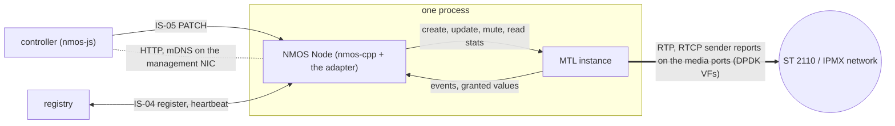
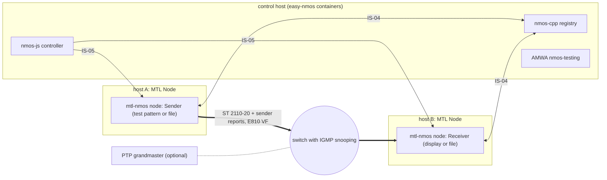

# NMOS and IPMX

| | |
|---|---|
| Status | §1–§7: NMOS and IPMX explained, every feature MTL provides with its API and milestone, the open-source NMOS stacks, the integration and a demo plan. §8–§23: the design of **Phase 7** (after MS7, D-98), declared under `MTL_LATER` until its milestone (D-134). Earlier: `mtl_session_update` in **MS3** (running: MS5), TX sender reports in **MS5**, `MTL_TIME_SOURCE_FREERUN` in **MS6** (§8) |
| Date | 2026-10-05 |
| Headers | `mtl.h` (update contract, legs, status), [mtl_ipmx.h](sketch/include/mtl/experimental/mtl_ipmx.h) (RTCP sender reports, PEP), [mtl_sdp.h](sketch/include/mtl/experimental/mtl_sdp.h) (SDP, libmtl_sdp), `mtl_options.h` (113, 201–213, 1000–1039), `mtl_sync.h`, `mtl_format.h`, `mtl_events.h` (events 26–30), `mtl_packet.h` |
| Reads with | [requirements.md](requirements.md) §6 (N-REQ) and §7 (I-REQ); [standards.md](standards.md) (specification URLs) |

NMOS (the AMWA Networked Media Open Specifications) is how an ST 2110 device is found, connected
and monitored. IPMX (VSF TR-10) is ST 2110 plus NMOS for ProAV: it works without PTP, carries
async sources such as HDMI inputs, adds RTCP sender reports, and adds optional encryption. An
NMOS stack is a control plane only; it needs a transport underneath. This document says what
MTL provides as that transport, how an open-source NMOS stack plugs in, and how to build an IPMX
demo on the two.

## 1. NMOS and IPMX in brief

### 1.1 The data model

NMOS describes a media network as REST resources. Each resource has a UUID and a `version`, a
TAI timestamp that changes whenever the resource changes (IS-04, Common Keys).

- **Node**: one host or process that runs the NMOS APIs. One MTL instance serves one Node.
- **Device**: a group of functions inside a Node, such as "camera" or "decoder".
- **Source**: the origin of content, such as one camera's picture. It names the Node clock that
  times it.
- **Flow**: one representation of a Source, such as 1080p59.94 YCbCr 4:2:2 10-bit. Its
  attributes are the media format.
- **Sender**: a virtual output that puts one Flow on the network. Its attributes are the
  transport: interfaces, the SDP link, whether it is active.
- **Receiver**: a virtual input that takes a stream from the network.

In MTL terms a Sender or a Receiver is one session, a Flow is that session's essence
configuration, and an ST 2022-7 Sender is one session with two legs.

### 1.2 Registry, controller and discovery

- A **registry** stores the resources of every Node. Nodes POST their resources to its
  Registration API; controllers read them through its Query API, with WebSocket updates.
- A **controller** is the operator's software. It finds Senders and Receivers in the registry
  and connects them through each Node's Connection API (IS-05).
- **Discovery** uses DNS-SD over unicast DNS or multicast DNS (mDNS): a Node browses for
  `_nmos-register._tcp` to find a registry. Without a registry, Nodes advertise themselves over
  mDNS (peer-to-peer mode).
- **Heartbeats** keep a Node registered: a POST every 5 s by default; the registry drops a Node
  after 12 s without one.

None of this touches the transport. NMOS traffic is HTTP and mDNS on a management interface
(a kernel NIC), not on an MTL port.

### 1.3 Connecting senders and receivers: IS-05

Each Sender and Receiver has these IS-05 resources:

- `/staged`: the parameters a controller is preparing. Writing them changes nothing yet.
- `/active`: the parameters in use now.
- `/constraints`: the values each parameter may take, such as the interface addresses.
- `/transportfile`: for a Sender, the SDP of the stream.
- `/transporttype`: the transport, for ST 2110 RTP.

The transport parameters are per leg: source and destination IP, UDP ports and `rtp_enabled`,
and for a Receiver the multicast group and the source for source-specific multicast (SSM: join a
group from one sender only). One more parameter, `master_enable`,
turns the whole Sender or Receiver on or off.

An **activation** moves `/staged` into `/active`: immediately, at an absolute TAI time, or after
a relative delay. An immediate activation is answered (200) once the new parameters are applied;
a scheduled one is answered at once (202). Both answers carry `activation_time`, the TAI instant
of the switch. Scheduled activations let many devices switch at the same instant, a **salvo**.
While one is pending the resource is locked (423) until it fires or is cancelled.

### 1.4 The SDP transport file

An SDP file describes one RTP stream: addresses, ports, payload type, media format (`a=fmtp`),
reference clock (`ts-refclk`), media clock (`mediaclk`) and ST 2110-21 timing (`TP`, `TROFF`,
`CMAX`). A Sender publishes it; a controller passes it to a Receiver in the PATCH. So the SDP
must always describe what is on the wire, and a Sender's IS-04 `version` changes when its SDP
changes. Most SDP values are the Node's (it chose them), but some only the transport knows: the
granted UDP source port, SSRC, `TROFF`, `CMAX`, the sender type.

### 1.5 What IPMX adds

IPMX changes the transport in these ways (TR-10-1, -9, -13, -5):

- **No PTP needed.** Without a grandmaster a Sender runs a free-running internal clock and
  signals `ts-refclk:localmac=`; with one it locks to it, choosing the best master with PTP's
Best Master Clock Algorithm (BMCA), and acts as a follower only by default.
- **Async sources.** An HDMI input runs at its own rate: its RTP clock follows the source, not
  the network clock, and the SDP says `mediaclk:sender`.
- **RTCP sender reports with an Info Block.** Every Sender sends an RFC 3550 sender report on
  port + 1, once per video frame or field and about every 10 ms for audio. A report pairs an RTP
  timestamp with the internal clock, so a receiver can follow a sender without PTP. Its Info
  Block repeats `ts-refclk`, `mediaclk` and a Media Info Block (MIB) that describes the format.
- **Its own traffic shape.** An IPMX CMAX ceiling and a small receiver buffer (IPMX VRX).
- **Device rules.** DHCP by default, DSCP marking, IGMPv2 and IGMPv3, default multicast
  addresses, at most 2 ms of frame-to-frame jitter.
- **Optional**: privacy encryption (PEP, AES-CTR over the payload with pre-shared keys), HDCP,
  HDMI InfoFrames as an ST 2110-41 stream, FEC.

IPMX conformance is run by AIMS (the Alliance for IP Media Solutions) against its Product
Qualification and Compliance Requirements (PQCR): the baseline is TR-10-1 (timing), TR-10-8
(NMOS) and TR-10-9 (device behaviour), and the other parts are tested when a product declares
them [I: from AIMS's summaries, not the PQCR text]. The test plan is TR-10 TP-1.

### 1.6 Which specifications a product needs

| Specification | What it is | ST 2110 Node | IPMX (TR-10-8 §7, §8) | Asks MTL for |
|---|---|---|---|---|
| IS-04 | discovery and registration | yes | yes | values only the transport knows (§3.3) |
| IS-05 | connection management | yes | yes, with `ext_link_offset_delay` | activations, legs, mute (§3.4) |
| IS-08 | audio channel mapping | if offered | if offered | a channel remap (§3.5) |
| IS-09 | system parameters (PTP domain) | optional | not required | PTP settings (§3.5) |
| IS-11 | stream compatibility | optional | yes | reconfigure, mute, detect (§3.6) |
| BCP-004-01, -02 | receiver and sender capabilities | optional | yes | a capacity check, no silent change (§3.6) |
| BCP-006-01 | JPEG XS | for JPEG XS | for JPEG XS | rates and packing (§3.6) |
| IS-12 with BCP-008 | status monitoring | optional | not required | counters and events (§3.7) |
| BCP-002, -005-01, IS-07, IS-10, IS-13 | tags, EDID, events, security, labels | optional | BCP-002, -005-01 yes | nothing (§3.12) |
| TR-10-1, -2, -3, -4, -9 | IPMX timing, essences, device rules | — | yes | §3.8–§3.10 |
| TR-10-5, -10, -13 | HDCP, InfoFrames, PEP | — | when declared | §3.11 |

## 2. Who does what

| The Node: the NMOS stack and its adapter | MTL |
|---|---|
| REST and WebSocket APIs, JSON, UUIDs, mDNS, the registry client | sessions on the media ports |
| `/staged`, `/active`, `master_enable`, which activation to accept, 423 | applying an activation on every leg at one boundary, and reporting the instant |
| resolving `auto`, building the SDP from its own values and MTL's granted ones | the granted values: UDP source port, SSRC, MACs, TROFF, CMAX, bit rates |
| BCP-008 statuses, hysteresis, messages, counter baselines | counters and events |
| PTP management (ptp4l), key derivation, HKEP (the HDCP key exchange) | the time reference, the per-packet cipher, sender reports and Info Blocks on the wire |

The detailed split is §9.

## 3. The features MTL provides

### 3.1 Reading the catalogue

Each feature has a short stable name: `NM-<area>-<feature>` for NMOS, `IX-<area>-<feature>` for
IPMX. Each entry says what the feature is, why NMOS or IPMX needs it, what the Node does itself,
and the MTL API that serves it with its milestone. Milestones: MS1…MS7; **P7** = Phase 7 (the
name is under `MTL_LATER` or tagged Phase 7); **v1** = in the frozen API with its essence
(video MS1–MS3, the other essences MS4); **Node** = MTL has no part; **missing** = the design
has nothing. Before a feature's milestone, the entry gives the fallback a Node uses meanwhile.

Priority:

- **must**: a basic NMOS demo needs it, natively or through the fallback the entry gives. The demo is one Node with a video Sender and a
  video Receiver, registered, connected by a controller with immediate and scheduled
  activations and `master_enable`.
- **should**: improves that demo. **later**: not needed for it.
- **IPMX**: the PQCR baseline (TR-10-1, -8, -9) needs it. **IPMX-opt**: an optional IPMX part
  needs it.

Names in backticks belong to three namespaces. `sc.name`, `video.raster` and
`mtl_session_info.leg[i].port` are C struct members; dotted names in quotes in `mtl_options.h`
(such as `video.vtotal`, `rx.link_offset_ns`) are option keys, set in a session's `options`;
`info.*`, `tx.*`, `rx.*`, `leg.*`, `port.*` and `time.*` names read with `mtl_stat_read()` are
stats keys ([contract.md](contract.md) §11.3). An **R** option may change while the session runs,
in an update. IDs such as SF-20 (a known defect), E9 (an engine change), G-N14 (a gap
disposition, §21) and D-98 (a decision) point into the other documents ([README.md](README.md)
§3). [I] marks an estimate or an inference.

The requirement rows each entry covers are listed in §22.

### 3.2 Index

| Name | Feature | Main MTL API | When | Priority |
|---|---|---|---|---|
| NM-REG-ID | stable UUID per Sender or Receiver | `sc.name` | MS1 | must |
| NM-REG-FLOW | Flow format attributes | `video.raster`, `video.format`, `mtl_format_describe()` | MS1 | must |
| NM-REG-COLOR | colorspace, transfer characteristic, range | `video.colorimetry`, `tcs`, `range` | P7 | should |
| NM-REG-AUDIO | audio Flow attributes | `audio.*` | MS4 | later |
| NM-REG-ANC | ANC Flow `DID_SDID` | `anc.did_sdid_seen` | P7 | later |
| NM-REG-SENDER | Sender transport, interface bindings, SDP link | `mtl_session_get_info()`, `info.leg[].port` | MS1 | must |
| NM-REG-BITRATE | Sender and Flow `bit_rate` | `wire_bps`, `info.wire_kbps`, `info.payload_kbps` | MS1; P7 | should |
| NM-REG-CLOCK | Node `clocks[]` | `time.grandmaster_id`, `time.state`, `mtl_time_set_reference()` | v1; MS2; MS6 | must |
| NM-REG-IFACE | Node `interfaces[]` with the port MAC | `mtl_port_get_spec()`, `mtl_port_spec.mac` | MS2; P7 | must |
| NM-REG-ARP | ARP on media ports | built-in ARP | v1 | must |
| NM-REG-LLDP | LLDP chassis and switch port | none | later | later |
| NM-REG-VERSION | `version` bump on every change | `mtl_time_now()`, events | MS1; MS3 | must |
| NM-CONN-PARAMS | per-leg transport parameters | `mtl_flow`, `mtl_session_info.leg[]` | MS1 | must |
| NM-CONN-AUTO | resolving `auto` | granted values | MS1 | must |
| NM-CONN-SSM | multicast and SSM receive | `flows[i].ip`, `source_filter` | v1 | must |
| NM-CONN-UCAST | unicast receive and send | the `mtl_flow` rule | MS1 | must |
| NM-CONN-2022-7 | two legs | `flows[1]`, `legs_disabled` | MS1; MS5; P7 | should |
| NM-CONN-SDP-TX | the Sender's transport file | the Node's SDP code, or `mtl_sdp_render()` | Node; P7 | must |
| NM-CONN-SDP-RX | a Receiver takes a transport file | the Node's SDP code, or `mtl_sdp_parse()` | Node; P7 | must |
| NM-CONN-IFACE | change interface while running | `MTL_UPDATE_FLOWS` port change | P7 | later |
| NM-CONN-TIME | TAI clock for versions and relative times | `mtl_time_now()` | MS1 | must |
| NM-ACT-NOW | immediate activation | `mtl_session_update()`, `MTL_EVENT_UPDATE` | MS5 | must |
| NM-ACT-SCHED | scheduled activation | `MTL_AT_TAI`, `planned_tai_ns` | MS5 | must |
| NM-ACT-ATOMIC | all legs or none | `mtl_session_update()` | MS5 | must |
| NM-ACT-CANCEL | cancel a scheduled activation | `mtl_session_update(s, NULL, 0, NULL, NULL)` | P7 | must |
| NM-ACT-REAPPLY | re-activation of the same values | `MTL_UPDATE_REAPPLY` | P7 | should |
| NM-ACT-LEG | `rtp_enabled` per leg | `legs_disabled`, `MTL_UPDATE_LEGS` | MS5 | should |
| NM-ACT-MASTER | `master_enable` | mute: every leg disabled | P7 | must |
| NM-ACT-IDLE | exist before any connection | reserved legs | P7 | must |
| NM-ACT-DRYRUN | validate staged values | `MTL_UPDATE_DRY_RUN` | P7 | should |
| NM-ACT-MEDIA | new format at an activation | `MTL_UPDATE_MEDIA`, the A/B swap | MS5 | should |
| NM-ACT-OFFSETS | per-activation SDP values | R options in the update | P7 | later |
| NM-ACT-JOINLEAD | bound double bandwidth | `rx.join_lead_ns` | P7 | later |
| NM-MAP-AUDIO | IS-08 channel map | `mtl_convert_desc.channel_map` | MS4 | later |
| NM-SYS-PTP | IS-09 PTP domain and announce timeout | `time.ptp_domain`, `time.ptp_announce_timeout` | v1; MS6 | later |
| NM-COMPAT-RECONF | IS-11 Sender reconfiguration | `MTL_UPDATE_MEDIA` in STOPPED | MS5 | IPMX |
| NM-COMPAT-MUTE | IS-11 inactive on a violation | mute, or stop | P7; MS1 | IPMX |
| NM-COMPAT-ESSENCE | IS-11 `no_essence` | `MTL_EVENT_TX_UNDERRUN` | v1 | IPMX |
| NM-COMPAT-DETECT | receive without an SDP | `video.detect`, `MTL_EVENT_RX_FORMAT` | MS3 | later |
| NM-CAP-CHECK | capability sets and a capacity check | `mtl_session_query()`, `MTL_QUERY_CHECK_CAPACITY` | MS1; MS5 | IPMX |
| NM-CAP-HONOUR | never send outside the advertised caps | `caps.pacing` with `caps.pacing_req` = `MTL_REQ_REQUIRE` | v1 | IPMX |
| NM-CODEC-JXS | BCP-006-01 JPEG XS attributes | `cvideo.*`, `info.*` | v1; P7 | later |
| NM-MON-LINK | `linkStatus` | `port.link_up`, `MTL_EVENT_PORT_LINK` | MS5 | later |
| NM-MON-RX | `connectionStatus`, lost and late packets | `leg.pkts_lost`, `rx.*` | v1; P7 | later |
| NM-MON-STREAM | `streamStatus` | `rx.pkts_rejected`, `rx.detected.*` | v1 | later |
| NM-MON-TX | `transmissionStatus`, error counters | `tx.*`, `port.tx_errors` | v1 | later |
| NM-MON-ESSENCE | `essenceStatus` | `MTL_EVENT_TX_UNDERRUN` | v1 | later |
| NM-MON-SYNC | `externalSynchronizationStatus` | `time.state`, `MTL_EVENT_GRANDMASTER` | v1; MS3; MS6 | later |
| NM-MON-RESET | counters reset on activation | baselines over `mtl_stat_read()` | MS2 | later |
| IX-TIME-FREERUN | free-running internal clock | `MTL_TIME_SOURCE_FREERUN` | MS6 | IPMX |
| IX-TIME-PTP | PTP with BMCA, follower only | ptp4l, `CLOCK_TAI`; `MTL_TIME_SOURCE_PHC` | v1; MS6 | IPMX |
| IX-TIME-SWITCH | PTP comes and goes at runtime | AUTO at runtime, `time.fallback` | P7 | should |
| IX-TIME-SHAPE | IPMX CMAX and VRX | `session.profile`, `video.vtotal` | P7 | IPMX |
| IX-TIME-RTP | RTP from the internal clock | the sync media modes | v1 | IPMX |
| IX-TIME-ASYNC | async source, `mediaclk:sender` | `MTL_MEDIA_SENDER` | P7 | IPMX-opt |
| IX-TIME-INLINE | inline processor keeps the input's timing | `MTL_SUBMIT_SENDER_TIME` | P7 | IPMX-opt |
| IX-SR-TX | sender reports on port + 1 | `rtcp.sr`, `rtcp.cname`, `rtcp.dst_port` | MS5 | IPMX |
| IX-SR-INFO | the Info Block and MIBs | library-built; `mtl_rtcp_set_info()` | MS5; P7 | IPMX |
| IX-SR-RX | receive reports, follow `mediaclk:sender` | `rtcp.rx`, `rx.mediaclk`, `mtl_rtcp_read()` | P7 | IPMX |
| IX-SDP | the IPMX SDP lines | the Node, or `mtl_sdp_render()` under the profile | Node; P7 | IPMX |
| IX-LINKOFS | `ext_link_offset_delay` | `rx.link_offset_ns`, `MTL_LINK_OFFSET_AUTO` | MS6; P7 | IPMX |
| IX-VID | TR-10-2 video subset | `MTL_YUV422_10`, `MTL_RGB_8` | v1 | IPMX |
| IX-VID-RASTER | any raster and rate | rational `mtl_raster.fps` | MS2a | IPMX |
| IX-VID-UDP | the Standard UDP size, even ports | `sc.max_udp_payload` | v1 | IPMX |
| IX-AUD | TR-10-3 audio subset | `MTL_PCM16`, `MTL_PCM24` | MS4 | IPMX |
| IX-ANC | TR-10-4 ANC with reports | `MTL_ANC` | MS4; MS5 | IPMX-opt |
| IX-NMOS | the TR-10-8 NMOS set | the NM entries | — | IPMX |
| IX-NET-DHCP | DHCP by default | `port.dhcp`, zero `sip` | v1 | IPMX |
| IX-NET-DSCP | DSCP marking | `mtl_flow.dscp` | MS1; MS4; 7 | IPMX |
| IX-NET-IGMP | IGMPv3 SSM and IGMPv2 | `port.igmp_version` | P7 | IPMX |
| IX-NET-MCAST | address ranges, default group | none | Node | IPMX |
| IX-NET-F2F | frame-to-frame jitter ≤ 2 ms | pacing, `tx.f2f_pp_ns` | v1; P7 | IPMX |
| IX-NET-INBAND | NMOS on the media port | `port.virtio_user`, kernel ports | v1 | IPMX-opt |
| IX-IF | TR-10-10 InfoFrames | `MTL_FASTMETA`, `tx.precede` | v1; P7 | IPMX-opt |
| IX-PEP | TR-10-13 privacy encryption | `crypto.*`, `mtl_crypto_set_key()` | P7 | IPMX-opt |
| IX-HDCP | TR-10-5 HDCP | packet units | MS5 | IPMX-opt |

### 3.3 IS-04: discovery and registration

- **NM-REG-ID Stable identity** (MS1, must). Every Sender and Receiver has a UUID that never
  changes, across reboots, upgrades and format changes. Controllers keep routes by UUID and
  BCP-008 monitors bind to it; IPMX makes it a shall for the life of the product (TR-10-8 §7).
  The Node generates and stores the UUIDs. MTL keeps the name across reconfiguration, so stats,
  events and logs carry it: `mtl_session_config.name` (64 B, unique per instance), kept by
  `MTL_UPDATE_MEDIA`.
- **NM-REG-FLOW Flow format attributes** (MS1, must). The Flow states the format:
  `media_type` (`video/raw`), `frame_width`, `frame_height`, `interlace_mode`, `grain_rate`
  (the frame rate) and, for raw video, `components[]` (name, size and bit depth per
  component); controllers compare them with Receiver capabilities. The Node builds the JSON
  from its copy of the session configuration; MTL describes each format:
  `mtl_video_config.raster` (`mtl_raster`, rational `fps`), `video.format`,
  `mtl_format_describe()` (`sdp`, `pg_bytes`, `pg_pixels`).
- **NM-REG-COLOR Colorimetry, transfer characteristic, range** (P7, should). Flow `colorspace`
  and `transfer_characteristic`; SDP `colorimetry`, `TCS`, `RANGE`. `colorspace` is required in
  the Flow and `colorimetry` in an ST 2110-20 SDP, but none of them reaches the RTP packets, so
  a Node can publish them from its own configuration. MTL stores them only to write them into
  the SDP helper and the video MIB: `video.colorimetry`, `tcs`, `range` (declared now).
- **NM-REG-AUDIO Audio Flow attributes** (MS4, later; must for an audio demo). `media_type`
  (`audio/L24`, `audio/L16`), `sample_rate`, `bit_depth`, channels: `mtl_audio_config`.
- **NM-REG-ANC ANC `DID_SDID`** (P7, later). An optional list of the ANC packet types a data Flow
  carries. On TX the application knows them; on RX MTL reports the observed set:
  `anc.did_sdid_seen` (up to 16 pairs).
- **NM-REG-SENDER Sender transport attributes** (MS1, must). `transport`
  (`urn:x-nmos:transport:rtp.mcast` and so on), `interface_bindings` (one per leg, the same
  interface twice when both legs share it), `manifest_href` (the SDP URL) and
  `subscription.active`, which must be true exactly when the Sender is configured to send. The
  Node owns `subscription.active` (it is its own `master_enable`) and the URL; MTL says which
  port each leg uses: `mtl_session_info.leg[i].port`, and the port name from
  `mtl_port_get_spec()` (MS2).
- **NM-REG-BITRATE Bit rates** (MS1; P7, should; must for compressed video). Sender `bit_rate`
  is kbit/s of the IP packets (RTP, UDP and IP headers included), rounded up; Flow `bit_rate` is the codestream rate.
  JPEG XS requires both (BCP-006-01). MTL computes them: `mtl_session_info.wire_bps` (one leg,
  MS1); the keys `info.wire_kbps{leg}`, `info.payload_kbps` (P7).
- **NM-REG-CLOCK Node clocks** (v1; MS2; MS6, must). The Node lists its clocks. A PTP entry needs
  `name`, `ref_type`, `traceable`, `version` (`IEEE1588-2008`), `gmid` (the grandmaster EUI-64)
  and `locked`; without PTP the entry is `internal`. Each Source names its clock. With the
  built-in PTP client MTL knows the values: `time.grandmaster_id`, `time.state`,
  `time.ptp_domain`; `time.gm_traceable`, `time.gm_clock_accuracy` (P7); `MTL_EVENT_GRANDMASTER`
  (MS3). With ptp4l (the usual case) the application reads them with `pmc` and tells MTL:
  `mtl_time_set_reference()` (MS2). The built-in client never clears `locked` today (SF-20); a
  lock state that clears comes with E9 in MS6.
- **NM-REG-IFACE Node interfaces** (MS2; P7, must). `interfaces[]` with `name`, `port_id` (must
  be a MAC address) and `chassis_id` (null where LLDP is not used); Sender and Receiver
  `interface_bindings` refer to these names. A VF bound to DPDK has no kernel netdev, so only
  MTL knows its MAC: `mtl_port_get_spec()` (MS2) with `mtl_port_spec.mac` (filled in Phase 7;
  proposal NX-3 moves it to MS2), `instance.port_count`.
- **NM-REG-ARP ARP on media ports** (v1, must). IS-04 asks interfaces to answer ARP "at a
  minimum", so topology tools can map `port_id`. MTL answers ARP on its ports; no call.
- **NM-REG-LLDP LLDP** (later). Fills `chassis_id` and `attached_network_device`; optional
  (`chassis_id = null` is allowed). Deferred (G-N14).
- **NM-REG-VERSION Version bumps** (MS1; MS3, must). Any change to a resource sets its
  `version` to the TAI time of the change; every IS-05 activation bumps it, also with the same
  parameters. Controllers watch `version` instead of polling. The Node bumps and re-registers;
  MTL gives the clock and an event for every change it makes by itself (a new grandmaster, a
  DHCP address, a pacing fallback): `mtl_time_now()`, `MTL_EVENT_UPDATE` (MS5),
  `MTL_EVENT_GRANDMASTER` (MS3), `MTL_EVENT_PORT_ADDRESS` (P7), `MTL_EVENT_PACING_CHANGED`, read
  with `mtl_read_events()` (MS3).

The attribute-by-attribute table is §10.

### 3.4 IS-05: connection management

- **NM-CONN-PARAMS Per-leg transport parameters** (MS1, must). One parameter object per leg.
  Sender core set: `source_ip`, `destination_ip`, `source_port`, `destination_port`,
  `rtp_enabled`; Receiver core set: `source_ip`, `interface_ip`, `destination_port`,
  `rtp_enabled`, plus `multicast_ip` for multicast. Every endpoint must support the core set.
  The Node maps addresses to ports (an interface address is a port's `sip`); MTL takes the
  values and reports what it granted: `mtl_flow` (`port`, `ip`, `source_filter`, `udp_port`,
  `udp_src_port`) in `flows[]`, `mtl_session_info.leg[]`, `mtl_port_find()`.
- **NM-CONN-AUTO Resolving `auto`** (MS1, must). Many parameters may be staged as `auto`, and
  the device picks the value (`destination_port` 5004, `source_ip` an interface). On activation
  every `auto` must be resolved and `/active` shows the real value. The Node resolves them
  before it calls MTL, and always sets the source port; MTL reports the granted
  `udp_src_port`, `src_mac`, `dst_mac` in `mtl_session_info.leg[i]`.
- **NM-CONN-SSM Multicast and source-specific multicast** (v1, must). A Receiver joins a group,
  optionally from one source only: `mtl_flow.ip` (the group) and `source_filter`. MTL joins with
  IGMPv3; the source filter on the DPDK path is an engine fix (SF-70).
- **NM-CONN-UCAST Unicast** (MS1, must). A Receiver with `multicast_ip = null` receives on its
  `interface_ip`; a Sender sends to a unicast address. The AMWA test suite activates senders to
  192.0.2.1, an address that is normally off-subnet and never answers, so a Sender must not wait
  for the neighbour: RX `ip` is
  the port's own address or zero, `source_filter` checks the sender, and a TX leg without a
  neighbour waits in `MTL_FLOW_WAITING_NEIGHBOUR` while the update still applies.
- **NM-CONN-2022-7 Two legs** (MS1; MS5, should; must for a redundancy demo). With ST 2022-7
  the parameter arrays have two entries, path 1 first; an unchanged leg is `{}`. A two-leg
  Receiver given a one-leg SDP should disable leg 2. MTL: `flows[1]`; `legs_disabled` with
  `MTL_UPDATE_LEGS` (MS5); both legs on one port with an explicit `flows[1].port` (P7).
- **NM-CONN-SDP-TX The Sender's transport file** (Node; P7, must). The SDP of the active stream,
  served at `/transportfile` and `manifest_href`; IPMX makes it a shall (TR-10-8 §7). An
  unconfigured Sender should answer 404 until something is active. The Node serves it. nmos-cpp
  builds it (`nmos::make_session_description`, §4.2) and then needs MTL's granted values:
  `mtl_session_info.leg[]` and the keys `info.sender_type`, `info.troffset_ns`, `info.cmax`,
  `info.tsmode`, `info.tsdelay_ns` (v1), `info.troffset_default`, `info.max_udp_bytes` (P7).
  A C application can use `mtl_sdp_render()` (P7) instead.
- **NM-CONN-SDP-RX A Receiver takes a transport file** (Node; P7, must). A Receiver PATCH can
  carry an SDP; its media information should be used, and where it disagrees with the
  `transport_params` of the same PATCH, the parameters win. nmos-cpp parses it
  (`nmos::parse_session_description`); the Node fills `mtl_session_config` from the result.
  `mtl_sdp_parse()` (P7) does the same for C applications.
- **NM-CONN-IFACE Interface change while running** (P7, later). A new `source_ip` or
  `interface_ip` moves a leg to another port. MTL reserves the new queue and rule before it
  releases the old ones (`MTL_UPDATE_FLOWS` with a changed `flows[i].port`); until then, and on
  backends that cannot, `-MTL_EBUSY` (`PORT_CHANGE_NEEDS_STOP`), so the Node advertises one
  interface per leg.
- **NM-CONN-TIME TAI clock** (MS1, must). NMOS times are TAI `<seconds>:<nanoseconds>`; relative
  activations count from receipt on the device's clock. `mtl_time_now()`, `mtl_time_convert()`.
- **NM-ACT-NOW Immediate activation** (MS5, must). Apply the staged parameters now and answer
  with the instant it happened. The 200 reply comes once the parameters are applied, with
  `activation_time` the actual instant. MTL switches every leg at the next index boundary, also
  when no unit is in flight, and reports it: `mtl_session_update(s, &sc, MTL_UPDATE_FLOWS |
  MTL_UPDATE_LEGS, NULL, NULL)`, `status.update_state`, `update_seq`, `update_applied_tai_ns`,
  `MTL_EVENT_UPDATE`. Before MS5: stop, close and re-create the session; on the legacy API the
  `update_*` calls change it in place (§5.1).
- **NM-ACT-SCHED Scheduled activation** (MS5, must). Apply at an absolute TAI time or after a
  delay, for salvos. The 202 reply carries the instant the switch will actually happen, which
  may be a later frame boundary. MTL plans the boundary and reports it at once; a time in the
  past means now: `struct mtl_when` with `MTL_AT_TAI`, `planned_tai_ns`. Before MS5: create
  early and `mtl_session_start()` with `MTL_AT_TAI` (MS3), or call MTL from the Node's own timer
  at the instant (milliseconds late, not on a frame boundary).
- **NM-ACT-ATOMIC All legs or none** (MS5, must). One PATCH changes one Sender or Receiver,
  every leg, at one instant; if any `auto` cannot be resolved, `/active` must not change. MTL
  reserves everything before it commits; `MTL_UPDATE_STATE_FAILED` keeps the old configuration.
- **NM-ACT-CANCEL Cancel a scheduled activation** (P7, must). A PATCH with `activation.mode =
  null` cancels a pending activation and unlocks the resource. MTL drops the pending update or
  says it is too late: `mtl_session_update(s, NULL, 0, NULL, NULL)` returns 0 (cancelled), 1 (none
  pending) or `-MTL_EBUSY` (`UPDATE_COMMITTING`). Before 7 the Node holds scheduled activations
  in its own timer, which loses the exact boundary; proposal NX-3 moves cancel to MS5.
- **NM-ACT-REAPPLY Re-activation** (P7, should). An activation with unchanged parameters still
  re-applies them, and IS-05 suggests a leave and join for multicast. MTL re-sends the IGMP
  reports and re-arms its rules without a leave (a leave on both 2022-7 legs at once is a
  certain hit); TX resolves the neighbour again: `MTL_UPDATE_REAPPLY`. Proposal NX-3 moves it to
  MS5.
- **NM-ACT-LEG Per-leg enable** (MS5, should). `rtp_enabled` per leg turns one ST 2022-7 path
  on or off: bit i of `legs_disabled` = !(`master_enable` && `rtp_enabled[i]`), with
  `MTL_UPDATE_LEGS`.
- **NM-ACT-MASTER `master_enable`** (P7, must). Turns the whole Sender or Receiver on or off,
  immediately or scheduled; IS-04 `subscription.active` follows it. MTL stops sending (TX) or
  leaves the groups (RX) at the boundary without tearing the session down: every leg's bit in
  `legs_disabled` = muted, `MTL_STATUS_MUTED`, `tx.units_muted`. Before 7: `mtl_session_stop()`
  and `mtl_session_start()` (MS1). Proposal NX-3 moves mute to MS5.
- **NM-ACT-IDLE Exist before any connection** (P7, must). Senders and Receivers are published at
  boot, before any address is known. MTL holds a running session with no address yet: a
  **reserved leg** (its `legs_disabled` bit set, its `mtl_flow` all zero), enabled later with
  `MTL_UPDATE_FLOWS | MTL_UPDATE_LEGS`. Before 7: create the session at the first activation and
  close it on `master_enable = false`. Proposal NX-3 moves reserved legs to MS5.
- **NM-ACT-DRYRUN Validate staged parameters** (P7, should). A PATCH that does not activate
  should still be rejected (400) if the values cannot work: `MTL_UPDATE_DRY_RUN`;
  `mtl_session_query()` (MS1) checks a whole configuration meanwhile.
- **NM-ACT-MEDIA New format at an activation** (MS5, should). A new SDP with another format, or
  an IS-11 constraint on a Sender. `MTL_UPDATE_MEDIA` in CREATED or STOPPED; colorimetry, TCS and
  range also while running (P7); a scheduled RX format change is the A/B swap of two sessions
  (§11.5).
- **NM-ACT-OFFSETS Per-activation SDP values** (P7, later). Values that come with a new SDP and
  switch with the flows: `mediaclk:direct=<offset>`, `mediaclk:sender`, the link offset,
  encryption parameters. R options in the update: `rx.rtp_offset`, `rx.mediaclk`,
  `rx.link_offset_ns`, `crypto.*`.
- **NM-ACT-JOINLEAD Double bandwidth on scheduled receiver switches** (P7, later). A Receiver
  scheduled far ahead would receive the old and the new group meanwhile: `rx.join_lead_ns` joins
  at max(call, t − lead).

How the Node answers each PATCH, step by step, is §11.

### 3.5 IS-08 and IS-09

- **NM-MAP-AUDIO Channel map** (MS4, later). A controller routes input channels to output
  channels, immediately or scheduled; an unmapped output is silence. Needed only by Nodes that
  offer channel mapping. The Node keeps the map and applies it at the media index of the
  activation; MTL remaps in one copy: `mtl_convert()` with `mtl_convert_desc.channel_map` and
  `MTL_AUDIO_SILENT`, `mtl_epoch_index_at()`.
- **NM-SYS-PTP PTP domain and announce timeout** (v1; MS6, later). The IS-09 System API gives
  `ptp.domain_number` and `ptp.announce_receipt_timeout`, read at Node start. The Node applies
  them to ptp4l, or opens the instance with `time.ptp_domain` and `time.ptp_announce_timeout`
  for the built-in client, which honours them from MS6 (E9). Not required by IPMX.

### 3.6 IS-11, BCP-004 and BCP-006

IS-11 lets a controller constrain a Sender to an operating point and reports whether a stream
fits a Receiver or a display; IPMX requires it (TR-10-8 §7).

- **NM-COMPAT-RECONF Sender reconfiguration** (MS5, IPMX). When a controller sets Active
  Constraints, the Sender changes its Flow to fit them. The Node picks the format; MTL changes it
  and keeps the identity: `MTL_UPDATE_MEDIA` in CREATED or STOPPED, `sc.name` kept.
- **NM-COMPAT-MUTE Inactive on a constraint violation** (P7; MS1, IPMX). A Sender whose
  constraints are violated must become inactive and refuse activations. The Node decides and
  mutes (P7) or stops (MS1) the session.
- **NM-COMPAT-ESSENCE Sender essence state** (v1, IPMX). States `no_essence` and
  `awaiting_essence` when the source gives nothing stable. Mostly the Node's input (an HDMI
  signal); MTL reports when units stop coming: `MTL_EVENT_TX_UNDERRUN`, `tx.indices_empty`.
- **NM-COMPAT-DETECT Receiving without an SDP** (MS3, later). A Receiver activated with
  transport parameters only can still detect what arrives: `video.detect = MTL_DETECT_ON`,
  `MTL_EVENT_RX_FORMAT`, `rx.detected.*`.
- **NM-CAP-CHECK Capability sets** (MS1; MS5, IPMX; should for a demo). A Receiver or Sender
  lists `constraint_sets` (frame size, rate, `packet_time`, `st2110_21_sender_type`, …); any one
  satisfied set means compatible, and the caps have their own `version`. IPMX requires both
  BCP-004-01 and -02. The Node builds the sets; MTL answers "can this instance carry this
  configuration now": `mtl_session_query()` (MS1) with `MTL_QUERY_CHECK_CAPACITY` (MS5), and
  `mtl_format_describe()` to enumerate formats.
- **NM-CAP-HONOUR Never send outside the advertised caps** (v1, IPMX). A Sender must not
  produce a stream its caps do not allow, so MTL must not change the stream silently, for
  example by falling back to a weaker pacing class: `caps.pacing` with `caps.pacing_req` =
  `MTL_REQ_REQUIRE`, `MTL_EVENT_PACING_CHANGED`, `info.sender_type`.
- **NM-CODEC-JXS JPEG XS** (v1; P7, later). For `video/jxsv` the Flow carries `profile`,
  `level`, `sublevel` and the codestream `bit_rate`; the Sender carries `bit_rate` with RTP
  overhead, `packet_transmission_mode` and `st2110_21_sender_type`; the SDP follows RFC 9134.
  Profile, level and sublevel come from the codec; MTL gives rates and packing:
  `mtl_cvideo_config`, `cvideo.pack`, `mtl_session_info.codestream_bytes`, `info.payload_kbps`,
  `info.wire_kbps`. H.264 and H.265 (BCP-006-02, -03) use packet units until MTL packetises them.

### 3.7 IS-12 and BCP-008: status monitoring

IS-12 is a WebSocket protocol over an MS-05-02 device model. BCP-008-01 (receivers) and -02
(senders) add monitor objects to it. The Node owns the objects, the 3 s
`statusReportingDelay`, the hysteresis and the messages (nmos-cpp implements them, §4.2); MTL
gives raw counters and events. IPMX does not require BCP-008, but a demo that shows stream
health uses it.

- **NM-MON-LINK `linkStatus`** (MS5, later). AllUp, SomeDown or AllDown over the interfaces of
  a Sender or Receiver: `port.link_up`, `MTL_EVENT_PORT_LINK` (the link monitor is MS5).
- **NM-MON-RX Receiver `connectionStatus` and packet counters** (v1; P7, later). Healthy (every
  packet), PartiallyHealthy (loss recovered, for example by the other 2022-7 leg), Unhealthy (no
  packets, or loss that hurts the picture); lost and late packet counters: `leg.pkts_lost{leg}`,
  `rx.pkts_lost_est`, `rx.units_used_redundancy`, `rx.units_incomplete_*`, `rx.pkts_stale`;
  `leg.pkts_late{leg}` and `rx.units_late_presentation` (P7).
- **NM-MON-STREAM Receiver `streamStatus`** (v1, later). Whether the stream decodes and matches
  what was expected: `rx.pkts_rejected{cause}`, `rx.detected.*`, `MTL_EVENT_RX_FORMAT`.
- **NM-MON-TX Sender `transmissionStatus` and error counters** (v1, later). Recoverable and
  unrecoverable transmit errors: `tx.indices_empty`, `tx.units_dropped{reason}`,
  `tx.units_failed`, `port.tx_errors`, `MTL_STATUS_PACING_DOWNGRADED`; `tx.units_muted` is not an
  error.
- **NM-MON-ESSENCE Sender `essenceStatus`** (v1, later). Unhealthy when there is nothing to send:
  `MTL_EVENT_TX_UNDERRUN`, `tx.indices_empty`.
- **NM-MON-SYNC `externalSynchronizationStatus`** (v1; MS3; MS6, later). Whether the device is locked
  to its reference on every interface, and which one; a change of grandmaster must show a
  temporary PartiallyHealthy: `time.state`, `time.grandmaster_id`, `MTL_EVENT_TIME_STATE`,
  `MTL_EVENT_GRANDMASTER` (MS3); a lock state that clears comes in MS6 (E9).
- **NM-MON-RESET Counter baselines** (MS2, later). BCP-008 counters reset on each activation; MTL
  counters never reset, so the Node reads them on `MTL_EVENT_UPDATE` and subtracts:
  `mtl_stat_list()`, `mtl_stat_read()` (one snapshot).

The property-by-property mapping is §14.

### 3.8 IPMX timing and sender reports (TR-10-1)

- **IX-TIME-FREERUN Free-running internal clock** (MS6, IPMX). Without a grandmaster a Sender
  keeps a clock that never steps and stamps RTP and reports from it; the test plan runs every
  sender test with and without a grandmaster. `MTL_TIME_SOURCE_FREERUN`; `time.freerun_slew_ppm`
  (P7). The system clock follows NTP steps and does not qualify.
- **IX-TIME-PTP PTP with BMCA, follower only** (v1; MS6, IPMX). With a grandmaster the clock locks to
  it; devices run the ST 2059-2 BMCA and default to follower only. ptp4l does this;
  MTL reads `CLOCK_TAI`, which phc2sys keeps, and from MS6 the PHC directly
  (`MTL_TIME_SOURCE_PHC`); `mtl_time_set_reference()` (MS2) passes ptp4l's state. MTL's built-in
  client keeps the first master it hears and does not qualify (§19).
- **IX-TIME-SWITCH PTP appearing and disappearing** (P7, should). The clock description follows
  the real state, and the SDP, NMOS and reports agree again: AUTO re-evaluated at runtime,
  `time.fallback`, `MTL_EVENT_TIME_STATE`, `MTL_EVENT_TIME_STEP`.
- **IX-TIME-SHAPE The IPMX traffic shape** (P7, IPMX). Video senders keep their bursts within the
  IPMX CMAX ceiling (the ST 2110-21 Type W value) and pass the IPMX VRX model: N keeps its Type N
  CMAX, which is within the IPMX ceiling, and adds the IPMX VRX check. `session.profile =
  MTL_PROFILE_IPMX`, `video.vtotal`, `video.htotal`, `info.cmax`, `info.sender_type` (§16).
- **IX-TIME-RTP RTP from the internal clock** (v1, IPMX, met). RTP follows ST 2110-10 and the
  first value comes from the internal clock; sync sources (playout, test patterns) say
  `mediaclk:direct=0`. The sync media modes `MTL_MEDIA_AUTO`, `_INDEX`, `_TAI`.
- **IX-TIME-ASYNC Async sources** (P7, IPMX-opt; IPMX for a capture product). A Sender that
  converts a baseband input takes async sources: its media clock follows the source, RTP and
  the report's time are sampled at VSYNC, the SDP says `mediaclk:sender`. `MTL_MEDIA_SENDER`,
  `MTL_INFO_MEDIACLK_SENDER`.
- **IX-TIME-INLINE Inline processors** (P7, IPMX-opt). A device that receives an IPMX stream and
  sends it on keeps the input's timing: `MTL_SUBMIT_SENDER_TIME`, `MTL_UNITF_SENDER_TIME`.
- **IX-SR-TX Sender reports** (MS5, IPMX). An RFC 3550 sender report with SDES CNAME, to the
  media's destination at port + 1, with the media's SSRC and DSCP; NTP holds the internal
  clock. One per video frame or field before its first packet, one per new ANC timestamp, audio
  every int(10 ms / ptime) packets. Options `rtcp.sr`, `rtcp.cname`, `rtcp.dst_port`; today's
  NACK retransmission becomes `rtx.*` and shares the port (§17).
- **IX-SR-INFO The Info Block** (MS5; P7, IPMX). Inside each report: a block version, `ts-refclk`,
  `mediaclk`, then Media Info Blocks that describe the format; the version changes with the
  content, and the test plan checks that the block matches the SDP and the stream. MTL builds
  the block and the essence MIB (0x0001 video, 0x0002 PCM, 0x0004 AES3) in MS5, and 0x0011 with
  PEP (P7); the
  application adds the MIBs MTL cannot build (compressed video, HDR) and measured values with
  `mtl_rtcp_set_info()`, `MTL_META_RTCP_MIB` (P7).
- **IX-SR-RX Receiving reports** (P7, IPMX). Receivers shall take streams that signal
  `mediaclk:direct=0` and `mediaclk:sender` (TR-10-9 §11), and should use the reports to follow
  a sender on `localmac=` or on a PTP clock they do not share: `rtcp.rx`, `rx.mediaclk`
  (`MTL_MEDIACLK_SENDER`), `mtl_rtcp_read()`, `rx.sender_rate_ppb`. Until Phase 7 an MTL
  receiver misses this shall.
- **IX-SDP The IPMX SDP lines** (Node; P7, IPMX). The `IPMX` keyword in `a=fmtp`; `ts-refclk`
  (`localmac=` without PTP); `mediaclk`; for video `measuredpixclk`, `htotal`, `vtotal`; for
  audio `measuredsamplerate`. A Sender without a baseband input reports the nominal values
  (htotal = width, vtotal = height, TR-10-9 §10). The Node writes them (nmos-cpp lacks them
  today, §4.2), or `mtl_sdp_render()` under the IPMX profile (P7).
- **IX-LINKOFS Link offset delay** (MS6; P7 to change it in an update, IPMX). A Receiver's playout delay, set through the IS-05
  Receiver parameter `ext_link_offset_delay` (µs, or `auto` for the minimum), with min and max
  constraints while active. `rx.link_offset_ns` (R), `MTL_LINK_OFFSET_AUTO`,
  `rx.link_offset_min_ns`, `rx.link_offset_max_ns`.

### 3.9 IPMX essences (TR-10-2, -3, -4)

- **IX-VID Uncompressed video subset** (v1, IPMX, met). Receivers take YCbCr 4:2:2 10-bit and
  RGB 4:4:4 8-bit: `MTL_YUV422_10`, `MTL_RGB_8`, `video.packing`, `MTL_INTERLACED`, `MTL_PSF`.
- **IX-VID-RASTER Any raster and rate** (video MS2a; fastmeta MS4a1, ANC MS4a2; IPMX: the IPMX
  shaping of non-§6.3.1 rasters needs E5a (MS5) and the IPMX VRX (Phase 7). Until then such rasters
  are sent as ST 2110-21 type W, which an IPMX receiver with its 2 × CMAX buffer need not take.)
  Sizes up to the MIB's 16-bit fields, rates as rationals: `mtl_raster.fps`.
- **IX-VID-UDP Packet size and ports** (v1, IPMX). Each packet within the Standard UDP size
  limit; destination ports even, above 1024, default 5004. The Node constrains the ports in
  IS-05; MTL sizes the payload: `sc.max_udp_payload` (default 1452).
- **IX-AUD PCM audio subset** (MS4, IPMX for audio). 48 kHz with L16 and L24 (44.1 kHz and
  96 kHz should), AES67 timing: `MTL_PCM16`, `MTL_PCM24`, `audio.sample_rate`, `MTL_PTIME_125US`.
- **IX-ANC Ancillary data** (MS4; MS5, IPMX-opt). ST 2110-40 with sender reports whose Info
  Block carries no MIB: `MTL_ANC`, `rtcp.sr`.

### 3.10 IPMX NMOS and device rules (TR-10-8, -9)

- **IX-NMOS The NMOS set** (IPMX). IS-04 with unicast DNS-SD and mDNS, IS-05 with the transport
  file and `master_enable`, BCP-002, BCP-004-01 and -02, BCP-005-01 for EDID, IS-11, IS-08 when
  channel mapping is offered, and the link offset. For MTL this is the NM entries above.
- **IX-NET-DHCP DHCP by default** (v1, IPMX). Every interface uses DHCP by default:
  `port.dhcp` on DPDK ports, a zero `sip` on kernel ports, `MTL_EVENT_PORT_ADDRESS` (P7).
- **IX-NET-DSCP DSCP marking** (MS1; MS4; P7, IPMX). AF42 (36) for video and ANC, AF41 (34) for
  audio, the stream's value for its reports, EF for PTP (ptp4l's setting): `mtl_flow.dscp`
  (video MS1, the rest MS4); the profile's defaults (P7). Today every packet has DSCP 0.
- **IX-NET-IGMP IGMPv3 SSM and IGMPv2** (P7, IPMX). Both, with a user setting:
  `port.igmp_version`. Today IGMPv3 only.
- **IX-NET-MCAST Address ranges and defaults** (Node, IPMX). Which groups senders and receivers
  use, and the default group 239.S.C.D: the Node's constraints.
- **IX-NET-F2F Frame-to-frame interval** (v1; P7, IPMX, met by pacing). The first packet of each
  frame leaves at regular intervals, within 2 ms over 2 s: pacing; the gauge `tx.f2f_pp_ns` (P7).
- **IX-NET-INBAND In-band control** (v1, IPMX-opt). NMOS over the media port:
  `port.virtio_user` on DPDK ports, or a kernel backend (to be verified, §23).

### 3.11 IPMX optional parts (TR-10-5, -10, -13)

- **IX-IF InfoFrames** (v1; P7, IPMX-opt). HDMI InfoFrames as an ST 2110-41 stream on the video's
  address and port + 3, with the video's RTP timestamps, sent before each frame's first video
  packet: `MTL_FASTMETA` (v1), `tx.precede` (P7).
- **IX-PEP Privacy encryption** (P7, IPMX-opt). AES-128-CTR over the payload, headers in clear,
  the counter in an RTP header extension, the same parameters on both legs, keys derived by the
  Node from pre-shared keys; the parameters change only while inactive (TR-10-13 §13).
  `crypto.*`, `mtl_crypto_set_key()`, `MTL_EVENT_KEY_NEEDED` (§20).
- **IX-HDCP HDCP** (MS5, IPMX-opt). HDCP 2.3 with its key exchange over TCP; the vendor's code
  encrypts and MTL carries the packets: packet units, `MTL_PKTE_HDR_EXT` on RX.

### 3.12 What needs nothing from MTL

| Feature | Spec | Why MTL is not involved |
|---|---|---|
| registry, Query API, WebSocket subscriptions | IS-04 | HTTP on the management interface |
| DNS-SD, mDNS, heartbeats | IS-04, TR-10-9 | control plane; mDNS on a media port only for in-band control |
| `/staged`, `/constraints`, the 423 lock, bulk salvos | IS-05 | Node state; MTL gets one call per session |
| labels, tags, groups | BCP-002, IS-13 | metadata |
| events and tally | IS-07 | WebSocket or MQTT messages |
| authorisation, TLS | IS-10, BCP-003 | control-plane security |
| EDID to Receiver caps | BCP-005-01, IS-11 | Node logic |
| HKEP, PEP key derivation | TR-10-5, TR-10-13 | Node or vendor code; MTL takes derived keys only |
| the IS-12 protocol and device model | IS-12, MS-05-02 | WebSocket; MTL feeds counters (§3.7) |
| NDI, USB over IP | BCP-007-01, TR-10-14 | not RTP media |
| the ST 2022-5 FEC parameter set | IS-05, TR-10-6 | not adopted; the Node omits it |

## 4. Open-source NMOS stacks

### 4.1 The candidates

Checked on 2026-10-05; the repositories are on GitHub unless noted.

| Project | Language, licence | State | What it is |
|---|---|---|---|
| **sony/nmos-cpp** | C++, Apache-2.0 | active (last commit 2026-10-02); vendors ship JT-NM Tested products on it; its CI runs the AMWA test suite | the reference Node and registry library: IS-04, -05, -07, -08, -09, -10, -12, -13, -14, BCP-002, -003, -004-01, -006-01, -008-01, -02; IS-11 is an open pull request (#474) |
| **sony/nmos-js** | JavaScript, Apache-2.0 | active | the usual open-source controller (IS-04 query, IS-05, IS-08) |
| **NVIDIA/nvnmos** | C API over nmos-cpp; Rust daemon and GStreamer elements; Apache-2.0 | active, used with Rivermax and DeepStream | an SDP-in, SDP-out C wrapper of nmos-cpp (§4.3) |
| **rhastie/easy-nmos** | docker compose, Apache-2.0 | active | registry, controller and the AMWA test suite in containers, ready to run |
| **AMWA-TV/nmos-testing** | Python, Apache-2.0 | active | the AMWA conformance tool; no IPMX suite |
| **dektec-com/dtnmos** | C11, BSD-3-Clause | new (v0.5.2, 2026-10-03) | IS-04 Node, IS-05 1.1, an SDP codec for -20/-22/-30/-40; activations carry the target time and arrive early by a set lead; single-leg activations (its SDP codec reads and writes 2022-7 pairs), no IS-12 |
| **alabou/NMOS-Reference** | Python, Apache-2.0 | active, reference quality | IS-04, -05, -11, BCP-004, BCP-005-03 PEP; no DNS-SD, an emulated data plane |
| **AMWA-TV/nmos-sender-receiver-framework** | C++ on nmos-cpp, Apache-2.0 | stalled (2025) | GStreamer senders and receivers with NMOS |
| Intel Tiber Broadcast Suite 25.04 | C++ on nmos-cpp, BSD-3 | removed from GitHub; kept by Software Heritage and the Docker Hub image `intel/intel-tiber-broadcast-suite-nmos-node:25.04-nmos` | an earlier MTL plus NMOS combination (§4.3) |
| BBC nmos-joint-ri, Rust crates (`crate-nmos`, `nmos-rs`) | Python, Rust | dormant or early | not usable as a product Node |

**IPMX in open source.** No open-source stack implements IPMX end-to-end. nmos-cpp has the
`hkep` SDP attribute, the TR-10-9 DNS-SD browse mode and the IS-05 RTCP parameters, but not
`ext_link_offset_delay`, `ext_privacy_*` or the IPMX SDP fields (its issue #456 lists them).
Nobody provides sender reports with Info Blocks; the Wireshark dissector
`rpkh/ipmx-rtcp-info-dissector` (GPL-3.0, a tool only) checks them on the wire.

**The choice: nmos-cpp.** It has the widest coverage, product use and conformance testing, and
almost every other candidate is built on it. One risk: its HTTP library, Microsoft cpprestsdk,
is archived (last release 2023-12-05).

### 4.2 nmos-cpp: how a transport plugs in

A device registers callbacks on `nmos::experimental::node_implementation`
(`Development/nmos/node_server.h:72-105`). Four are required; the transport-file parser has a
default (`nmos::parse_rtp_transport_file`, `node_server.h:69`), so an adapter writes three:

| Callback | When | What the MTL adapter does |
|---|---|---|
| `on_resolve_auto` | first step of an activation | pick ports and interfaces (MTL ports are the interfaces), check the result with `mtl_session_query()`, and refuse here: only this callback may throw to leave `/active` unchanged (`connection_activation.cpp:146-151`) |
| `on_set_transportfile` | next, for a Sender | build the SDP with `nmos::make_session_description`, with MTL's granted values |
| `on_connection_activated` | last, after `/active` is committed | apply it to the MTL session: update, mute or create |
| `on_parse_transport_file` | a Receiver PATCH carries an SDP | keep the default |

`on_set_transportfile` and `on_connection_activated` "should not throw", and nothing they do is
rolled back (`connection_activation.cpp:163`, `:181`). So a failure that MTL reports after
`on_resolve_auto` cannot refuse the activation: the Node can only show it as a status
(BCP-008, or `master_enable` false in `/active`). NM-ACT-ATOMIC holds inside MTL, and the adapter
must catch what it can before the commit.

Optional callbacks matter too: `on_validate_connection_resource_patch` sees every PATCH with the
staged activation mode and time, so a scheduled activation can be prepared there; and
`on_get_lost_packet_counters`, `on_get_late_packet_counters` and the `set_*_monitor_*_status`
setters connect BCP-008 monitors to MTL's counters.

Three more facts shape the adapter:

- **The activation thread holds the model's write lock** while it runs the three callbacks
  (`connection_activation.cpp:14`, `:151`, `:166`, `:183`). A call that blocks there stalls
  every Node API, heartbeat and IS-12 message, and the activations of a salvo run one after
  another in that loop. The adapter's MTL calls must return in microseconds; the unified update
  does, and for a salvo MTL needs the `AT_TAI` instant before the thread wakes.
- **Scheduled activations fire on nmos-cpp's own clock**, `tai_clock`: the system clock plus a
  fixed leap offset (`nmos/tai.h:50`, `:77`), not PTP, and `activation_time` is stamped when the
  thread wakes (`connection_activation.cpp:90`). The host clock must follow the same PTP as MTL
  (phc2sys), and the instant MTL reports is not what nmos-cpp answers unless the adapter feeds it
  back.
- **DPDK ports are invisible to the kernel**, so the adapter lists them itself as
  `web::hosts::experimental::host_interface` entries (name, MAC, addresses) for
  `interfaces[]`.

**Gaps that matter for IPMX.** nmos-cpp has no IS-11 (pull request #474 is open) and no
BCP-004-02 sender capabilities, both required by TR-10-8 §7 (NX-9), and none of the IPMX IS-05
`ext_*` parameters or SDP fields (NX-7).

A minimal Node with one video Sender and one Receiver is about 650 C++ lines, plus about 150
for BCP-008 monitors and 50 for BCP-004-01 receiver caps [I]; nmos-cpp's own
`nmos-cpp-node/node_implementation.cpp` is the template.

### 4.3 What earlier integrations teach

- **NVIDIA NvNmos** wraps nmos-cpp in a C API (`src/nvnmos.h`): a Sender or Receiver is
  configured with an SDP string, and the activation callback receives the effective SDP
  (`master_enable = false` arrives as a NULL SDP, a disabled leg as `a=inactive`). It shows the
  shape a C adapter can take. It also shows what such a shape loses: the application must parse
  SDP itself, the callback carries no activation time, the clock entry is taken from the
  SDP's `ts-refclk` and always reported as locked, and there is no monitoring. Its
  `a=x-nvnmos-iface` attribute advertises NICs the process cannot see, the same problem as DPDK
  ports. DeepStream's first integration answered every activation as a success; its replacement
  rebuilds the GStreamer transport element on every activation.
- **Intel Tiber Broadcast Suite 25.04** combined nmos-cpp with MTL: on each activation the Node
  sent the parameters over gRPC to a pipeline container, which started `ffmpeg -f mtl_st20p`
  with `popen()`. Every connection restarted FFmpeg (EAL init included), only leg 0 was used,
  `master_enable` was ignored and there was no timing. Lesson: the Node must own long-lived
  sessions and change them in place.
- **dtnmos** delivers each activation with its target time, a set lead before it: the shape of
  a scheduled MTL update. Its SDP codec is C and BSD-3, the licence of MTL.

## 5. How hard the integration is

### 5.1 On today's MTL

A basic NMOS-controlled ST 2110 Node works on the legacy API today, with no change to MTL and
with care [verified in `lib/`; effort I]:

| Need | Today | How a Node copes |
|---|---|---|
| connect, change | `st20p_tx_update_destination`, `st20p_rx_update_source` (every essence has a pair) change IP and port per leg | use them; they switch mid-frame, not at a boundary, and cannot be scheduled |
| unicast sender | an on-subnet destination is resolved by ARP under the session lock, up to `arp_timeout_s` (60 s by default); an off-subnet one (the AMWA suite's 192.0.2.1) ARPs the gateway, or fails at once without one (`mt_main.c:38-56`) | declare Senders `rtp.mcast`, as IPMX does (TR-10-8 §7), and record the suite's unicast tests as expected failures |
| the clock | the default time source is `CLOCK_REALTIME`, UTC, 37 s off TAI (`dev/mt_dev.c:2280-2290`) | set `ptp_get_time_fn` to read `CLOCK_TAI`, as RxTxApp does (`rxtx_app.c:150-168`), with ptp4l and phc2sys |
| `master_enable` | no mute and no per-session stop | TX: stop handing frames over (nothing is sent); RX: free the session; one leg: send it to an unused group |
| exist before a connection | an RX session cannot have a zero address | create the Receiver at its first activation |
| SDP | none in MTL | nmos-cpp builds and parses it |
| `clocks[]` | no grandmaster, lock or domain getter | read ptp4l with `pmc`, or report `internal` |
| `interfaces[]` MAC | no MAC getter | set the VF MAC from the PF (`ip link set <pf> vf <n> mac …`) and publish it |
| BCP-008 | per-session lost-packet and incomplete-frame counters; no link status, no late counter, no ST 2110-22 stats | map the counters; take the link from the PF |
| DSCP | 0 on every packet, no field | none (IPMX needs it) |
| video update bug | the video TX update writes the source port into the destination port when `udp_src_port` is set (`st_tx_video_session.c:3829-3830`) | leave `udp_src_port` 0, or take PR #1770 |

### 5.2 On the unified API

Before MS3 the unified API is a step back for an NMOS Node: every activation is a stop, close
and create (close the old session and wait until its close returns 0, since a create with a
live name is `-MTL_EEXIST`; or create the new one first under another name, `<uuid>.b`), where
the legacy `update_*` calls change a running session. From MS3 an activation is stop,
`mtl_session_update` and start (§11.5): the session keeps its handle, name, SSRC and counters,
and a scheduled one starts at `MTL_AT_TAI`; the stream pauses from the stop to the start until
MS5 updates a running session at the index boundary. A Node that must switch without a pause
before MS5 stays on the legacy API.

| Milestone | What a Node gains |
|---|---|
| MS1 | sessions with `sc.name`, granted values in `mtl_session_info`, DSCP for video, stop and start: a Node works with create-on-activation and the name rule above |
| MS2 | `mtl_port_get_spec()` (the MAC with NX-3), `mtl_time_set_reference()` for ptp4l, stats for BCP-008 |
| MS3 | events, `MTL_AT_TAI` starts, format detection; `mtl_session_update` in CREATED and STOPPED: stop, update, start keeps the session |
| MS4 | audio, ANC, JPEG XS, any raster |
| MS5 | `mtl_session_update()` while running: exact immediate and scheduled activations, per-leg enable, no ARP wait; sender reports with the library's Info Block; the link monitor; with NX-3 also mute, reserved legs, cancel and re-apply, which leaves only dry runs and port changes for Phase 7 |
| MS6 | the free-running clock, the PHC time source and a PTP lock state that clears (E9), the link offset |
| Phase 7 | the rest of IPMX: profile, IGMPv2, `mediaclk:sender` on RX, the application's Info Block entries, PEP, SDP helpers |

### 5.3 Effort

| Route | On today's MTL | On the unified API |
|---|---|---|
| nmos-cpp with an MTL adapter, in one process | medium: about 650–900 C++ lines, with the workarounds of §5.1 | low: one activation is one `mtl_session_update()` (§11) |
| an NvNmos-style C wrapper | medium: the activation SDP must be parsed in C | low once a C SDP parser exists |
| NVIDIA's `nvnmosd` and GStreamer elements with MTL's GStreamer plugin | medium: the plugin rebuilds its element per activation, and the last element closing the MTL instance ends the process's DPDK | the same |
| a Python Node | high: a second process with IPC, and no DNS-SD in NMOS-Reference | medium |

The recommended route is the first: one process, nmos-cpp, a small adapter between its
callbacks and MTL sessions.

### 5.4 Process, network and clock

- **One process.** MTL runs `rte_eal_init` on its own thread (`dev/mt_dev.c:301-307`), so
  nmos-cpp's threads are not pinned to MTL's cores; keep them apart with `taskset` or cgroups.
  On multi-socket hosts `mtl_init` binds the caller to its NUMA node (`mt_main.c:448-461`); set
  `MTL_FLAG_NOT_BIND_PROCESS_NUMA` or call `mtl_init` from a thread whose affinity does not
  matter. Ignore `SIGPIPE`.
- **Two networks.** HTTP and mDNS run on a kernel NIC (or the PF); media runs on DPDK VFs with
  their own addresses. This is MTL's usual deployment.
- **One clock.** ptp4l on the PF disciplines the NIC clock; phc2sys copies it to the system
  clock, which nmos-cpp schedules by; MTL reads `CLOCK_TAI` (the legacy `ptp_get_time_fn`, or
  the unified default), and from MS6 the PHC directly (`MTL_TIME_SOURCE_PHC`). Without phc2sys
  nmos-cpp and MTL disagree about every scheduled instant.
- **Licences.** nmos-cpp, nmos-js, NvNmos, easy-nmos and nmos-testing are Apache-2.0; dtnmos is
  BSD-3. A BSD-3 adapter that links nmos-cpp ships nmos-cpp's NOTICE. The FFmpeg route inherits
  FFmpeg's LGPL or GPL.

## 6. Making the integration easier

The items below are proposals, not yet in [implementation-plan.md](implementation-plan.md). NX-1,
NX-2 and NX-6 add code outside `lib/` (an `ecosystem/` component and a CI job); NX-3 and NX-5 move
items between milestones and need the maintainer's decision; NX-4 changes how the SDP helper is
built; NX-7 and NX-9 are upstream work in nmos-cpp; NX-8 is documentation. Costs are estimates.

- **NX-1 A demo Node on today's API** (now). `ecosystem/nmos/`: nmos-cpp with an MTL adapter, one
  ST 2110-20 Sender and Receiver (2022-7 optional), multicast Senders, `CLOCK_TAI` time.
  - Why: a working demo now, and the adapter's shape for later.
  - Cost: about 1 k lines of C++ with build files.
- **NX-2 `mtl-nmos`, a reusable adapter** (after MS5). The NX-1 adapter over the unified API: a
  Sender or Receiver per session; validation and granted values in `on_resolve_auto`;
  activations to `mtl_session_update()`; scheduled activations prepared from
  `on_validate_connection_resource_patch`; `interfaces[]` from `mtl_port_get_spec()`; `clocks[]`
  from `time.*`; BCP-008 monitors from `mtl_stat_read()`.
  - Why: every MTL user gets NMOS with a few calls; the hard parts (the lock, the clock, legs)
    are solved once.
  - Cost: about 1.5 k lines.
- **NX-3 Pull the NMOS essentials forward** (MS2, MS5). `mtl_port_spec.mac` and
  `instance.port_count` with `mtl_port_get_spec()` in MS2; mute, reserved legs, cancel and
  `MTL_UPDATE_REAPPLY` with `mtl_session_update()` in MS5.
  - Why: IS-04 requires the MAC, and so does an IPMX Sender without PTP (`ts-refclk:localmac=`);
    without mute, reserved legs and cancel a Node needs stop, re-create and its own timers, and
    a scheduled activation prepared early cannot be withdrawn when the PATCH is re-staged; all
    four sit on the MS5 update machinery.
  - Cost: small: the MAC is a field fill; the four are states of an update that MS5 builds
    anyway.
- **NX-4 SDP from one source of values** (keys with the essence; the helper Phase 7). In C++, use
  nmos-cpp's SDP code and expose MTL's values as `info.*` keys. For C users, base
  `mtl_sdp_render()` and `mtl_sdp_parse()` on the BSD-3 dtnmos codec, in the companion library
  libmtl_sdp (§12), so it can ship after MS5 with NX-2 without waiting for Phase 7 (it reads and writes
  ST 2110-20, -22, -30, -40 and 2022-7 pairs, but lacks `mediaclk:sender` and the IPMX fmtp
  lines) rather than writing one, and render `measuredpixclk`, `htotal`, `vtotal` from the
  values the MIB uses.
  - Why: nmos-cpp already builds and parses every ST 2110 SDP; one source of values keeps the
    SDP and the Info Block equal, which the test plan checks.
  - Cost: small for the keys; medium for the C helper.
- **NX-5 An IPMX transport block in MS6** (MS6). Beside `MTL_TIME_SOURCE_FREERUN` and the link
  offset, which MS6 has already: `session.profile` with its DSCP defaults and checks, IGMPv2, and
  `rx.mediaclk` with `MTL_MEDIACLK_SENDER` on RX.
  - Why: with MS5's sender reports this is the transport part of the IPMX baseline; without it
    IPMX waits for Phase 7.
  - Cost: medium, about 3 k lines with tests.
- **NX-6 The AMWA test suite in CI** (after NX-2). The `mtl-nmos` example on `kernel:lo` ports,
  suites IS-04-01, -02, IS-05-01, -02, BCP-008-01, -02.
  - Why: catches NMOS regressions without a NIC.
  - Cost: small.
- **NX-7 IPMX in nmos-cpp** (with NX-5). Contribute the IS-05 `ext_link_offset_delay` and
  `ext_privacy_*` parameters and the IPMX SDP fields (nmos-cpp issue #456), and a hook in the
  shape of dtnmos's activation lead: the target instant delivered ahead of time, and the
  device's actual instant reported back.
  - Why: IPMX needs them in the Node, and every nmos-cpp user benefits.
  - Cost: medium, with upstream review.
- **NX-8 The clock setup** (with NX-1). Document ptp4l, phc2sys and the MTL time source in the
  demo.
  - Why: nmos-cpp schedules on the system clock, and legacy MTL defaults to UTC.
  - Cost: none.
- **NX-9 IS-11 and BCP-004-02 in nmos-cpp** (before D3). Help land IS-11 (pull request #474)
  and add BCP-004-02 sender capabilities.
  - Why: TR-10-8 §7 requires both, and no open-source stack has both on nmos-cpp.
  - Cost: medium, upstream.

## 7. An IPMX demo on MTL

### 7.1 What it is made of

Two MTL Nodes, one Sender and one Receiver, on E810 VFs behind a switch with IGMP snooping; the
registry, controller and test suite from easy-nmos, unchanged; an optional grandmaster, so the
demo can show operation with and without PTP. A third-party IPMX Receiver, if one is available,
shows interoperability.

### 7.2 Stages

| Stage | Shows | Needs | Ready |
|---|---|---|---|
| D1 NMOS-controlled ST 2110 | discovery in nmos-js; connect, disconnect and re-route; a scheduled salvo of two Receivers (milliseconds apart, not frame-exact); the IS-04 and IS-05 test suites | NX-1 and NX-8 on today's API, multicast Senders | now: about two weeks of agent work [I] |
| D1+ with monitoring | BCP-008 health in nmos-js while a link is pulled or 2022-7 recovers a leg | D1 plus monitors from legacy stats, the link from the PF | now |
| D2 IPMX preview | a Sender without PTP, sender reports with an Info Block (checked with the Wireshark dissector), IPMX SDP lines, DSCP 36 | D1 plus a demo branch, not for merging: sender reports and the video MIB on the legacy video TX (about 400–700 lines), a TOS field | weeks, on a branch |
| D3 IPMX baseline on the unified API | frame-exact switches, mute, sender reports, free run, IGMPv2, link offset, IS-11 | MS5 with NX-3, MS6 with NX-5, NX-2, NX-7, NX-9 | after MS6 |
| D4 full IPMX | async HDMI sources, receivers following `mediaclk:sender`, PEP | Phase 7 | after Phase 7 |

### 7.3 What each stage may claim

D1 is NMOS over ST 2110, not IPMX. D2 shows IPMX's timing model but is not conformant: no free
run that never steps, no IGMPv2, no IS-11, no link offset. D3 meets the transport part of the
IPMX baseline (TR-10-1, -9) with the Node's TR-10-8 part, and can enter AIMS testing; D4 adds
the optional parts.

### 7.4 The work for D1

1. Build nmos-cpp (Conan) and run easy-nmos on the control host.
2. Set up the clock: ptp4l on the PF, phc2sys to the system clock, and MTL's `ptp_get_time_fn`
   reading `CLOCK_TAI`.
3. Write the adapter (NX-1): Node, Device, Source, Flow, Sender and Receiver from a JSON file;
   `interfaces[]` from the MTL ports and their VF MACs; `clocks[]` from ptp4l; validation in
   `on_resolve_auto`; activation → `st20p_tx_update_destination` or `st20p_rx_update_source`;
   `master_enable` → stop feeding frames (TX) or free the Receiver (RX); SDP from nmos-cpp with
   TROFF and the sender type from the session's configuration.
4. Keep every MTL call short inside the activation thread: multicast Senders only, so no update
   waits for ARP.
5. Run nmos-testing IS-04-01, IS-04-02, IS-05-01 and IS-05-02 against the Node; record the
   results and the expected failures (unicast, scheduled timing accuracy).
6. Package the Node as a container next to MtlManager, as `ecosystem/nmos/README.md` documents.

## 8. What is built when

| Item | When | Notes |
|---|---|---|
| atomic `mtl_session_update` (today's `update_destination` / `update_source`), `planned_tai_ns`, `status.update_*`, `MTL_EVENT_UPDATE`, the switch at the index boundary by the clock, a past instant means now | **MS5** (CREATED and STOPPED: **MS3**) | it replaces an existing call; the contract costs nothing extra once the update is atomic |
| per-leg enable and disable (`legs_disabled`, `MTL_UPDATE_LEGS`) | **MS5** | today's redundancy legs |
| the rest of the NMOS contract: `MTL_UPDATE_REAPPLY`, `MTL_UPDATE_DRY_RUN`, cancel, mute (every leg disabled), reserved legs, port changes while running, R options at the boundary, `rx.join_lead_ns` | 7 | an NMOS Node can be built on MS3 with stop, update and start, and on MS5 without the stop (§11.5) |
| `mtl_flow.dscp` into the IP TOS of every leg | **MS1** video, **MS4** the other essences | with the bindings; the IPMX profile's DSCP defaults and `MTL_FLOWF_DSCP_LITERAL` are 7 |
| any raster and frame rate (the engine's rate table becomes rationals) | **MS2a** video, **MS4** the other essences | until then a rate outside the legacy table is `-MTL_ENOTSUP` (GI-7) |
| `mtl_time_set_reference()` and `time.phc_trust` | **MS2** | the pod time rules need them: the application tells MTL the node lost its grandmaster ([deployment.md](deployment.md)) |
| the other IS-04 values: colorimetry fields, the port MAC, the `info.*`, `time.gm_*` and BCP-008 keys; the IS-04 use of events 27 (`MTL_EVENT_GRANDMASTER`, posted from MS3 with `mtl_time_set_reference`) and 28 (`MTL_EVENT_PORT_ADDRESS`, posted with `port.dhcp`, a ported feature) | 7 | declared outside `MTL_LATER` already; not scheduled before Phase 7 unless pulled forward |
| SDP render and parse (`mtl_sdp_render`, `mtl_sdp_parse`, `mtl_sdp.h`, the companion library libmtl_sdp) | 7, or with NX-4 | outside libmtl; first in Phase 7 unless NX-4 pulls it forward |
| RTCP sender reports on TX: `rtcp.sr`, `rtcp.cname`, `rtcp.dst_port`, the Info Block the library builds (§17) | **MS5** | their names leave `MTL_LATER` there |
| `MTL_TIME_SOURCE_FREERUN`, with the published time base (E9) | **MS6** | its name leaves `MTL_LATER` there |
| IPMX timing: AUTO at runtime, `MTL_MEDIA_SENDER`, `MTL_SUBMIT_SENDER_TIME`; the application's Info Block entries and received reports (`mtl_rtcp_set_info`, `mtl_rtcp_read`, `rtcp.rx`, `mtl_ipmx.h`) | 7 | second |
| IPMX profile and wire: `session.profile`, IGMPv2, `tx.precede`, `video.vtotal`/`htotal`, `cvideo.max_bitrate_bps` (RX header extensions, SF-68: an engine fix in MS2 for video and MS4 for the rest, engine.md §6 RXHDR) | 7 | third |
| PEP (`mtl_crypto_set_key`, `mtl_ipmx.h`) | 7 | last, after its cost spike |

Phase 7 starts after the ABI freeze (MS7). Its functions, values, option keys, enums and events
are declared under `MTL_LATER` now, with their reserved fields outside it, so the design is fixed
and the freeze does not block them ([implementation-plan.md](implementation-plan.md) §6.7).

## 9. The split between the Node and MTL

| The Node (the application, or a library such as nmos-cpp) | MTL |
|---|---|
| registry, mDNS, REST and WebSocket APIs, JSON, UUIDs | the granted values: ports, SSRC, MACs, TP, TROFF, CMAX, bit rate |
| staged and active parameters, `master_enable` | the instant an activation took effect, and the boundary it will use |
| policy: which activation to accept, 423 while one is scheduled, when to report a status change | the time reference and its metadata |
| resolving `auto` transport parameters | the wire format, including sender reports and encryption |
| BCP-008 hysteresis, reporting delay, messages, counter baselines | counters and events |
| key derivation (PSK, KDF, ECDH), HDCP, HKEP | per-packet cipher, extensions, counters |

One Node is one MTL instance; the NMOS APIs use a management interface, not an MTL port. Each
Sender or Receiver is one session named by its UUID (`sc.name`, 64 B, kept across
`MTL_UPDATE_MEDIA`), created at boot with every leg reserved and disabled, started, and so muted
(Phase 7). Activations are then boundary updates: nothing is allocated, and scheduled timing is exact.
Node `clocks[0]` is the one instance timescale: each leg's PHC is compensated into it, and the
per-port `time.*` keys feed sync health. Node `interfaces[i]` is MTL port i (`mtl_port_get_spec()`,
`mac`).

### 9.1 Which specifications need MTL

| Specification | What it needs from MTL |
|---|---|
| IS-04 Discovery and Registration 1.3 | Flow, Sender, Receiver and Node attributes only the transport knows; change notifications to bump `version` (§10) |
| IS-05 Connection Management 1.1 | per-leg RTP transport parameters, `master_enable`, immediate and scheduled activation, `activation_time`, SDP (§11, §12) |
| IS-08 Audio Channel Mapping | units per media index; the map is the Node's (§13) |
| IS-09 System Parameters | `global.json` requires `ptp.domain_number` (0–127) and `ptp.announce_receipt_timeout` (2–10), at Node start: `time.ptp_domain` and `time.ptp_announce_timeout` (2209) for the built-in client (today it uses neither, [standards.md §13.3](standards.md#133-mtls-built-in-ptp-client-against-st-2059-2)); with ptp4l (`MTL_TIME_SOURCE_PHC`) both are ptp4l's configuration |
| IS-11 Stream Compatibility | reconfigure (`MTL_UPDATE_MEDIA` in STOPPED), mute, detect what a receiver gets (`MTL_DETECT_ON`, `MTL_EVENT_RX_FORMAT`) |
| IS-12 / MS-05-02 monitoring | the device model is the Node's: `NcStatusMonitor` (`overallStatus`, `statusReportingDelay`, default 3 s), `NcReceiverMonitor` and `NcSenderMonitor` (Control Feature Sets `monitoring/models`) are Node objects whose values come from MTL through BCP-008 (§14); the delay is Node policy |
| BCP-004-01 / -02 capabilities | `mtl_session_query` for "can MTL receive or send X"; never a stream outside the advertised caps |
| BCP-006-01 JPEG XS | profile, level, sublevel, colour, bit rate with and without RTP overhead, packetisation mode, TP (§10) |
| BCP-008-01 / -02 status monitoring | link, connection, synchronisation and stream status; lost, late and error counters (§14) |
| IS-07, IS-10 and BCP-003-01, IS-13, BCP-002, BCP-005-01, BCP-007-01 | nothing: control-plane, security, labels, grouping, EDID and NDI are outside the transport |

IPMX requires IS-04, IS-05 with the link offset parameter, IS-11, BCP-002, BCP-004-01 and -02,
BCP-005-01 for EDID outputs, and IS-08 when channel mapping is offered (TR-10-8 §7, §8); IS-09,
IS-12 and BCP-008 are not IPMX requirements. The TR-10 parts that ask something of the transport:

| TR-10 part | Edition (VSF list, 2026-10-01) | Needs from the transport |
|---|---|---|
| -0 Overview | 2026-07-07 Final, informative | the Media Info Block (MIB) registry (§17): 0x0001 video, 0x0002 PCM, 0x0003 CBR compressed, 0x0004 AES3, 0x0005 VBR compressed, 0x0006 HDR (defined in TR-10-16, not yet in the TR-10-0 table), 0x0008 JPEG XS, 0x0009 H.265, 0x000A H.264, 0x0010 HKEP, 0x0011 PEP |
| -1 System Timing | 2024-02-23 Final | with and without PTP, free-running internal clock, BMCA, IPMX CMAX and VRX, async and sync sources, sender reports with the Info Block on port + 1, inline processors, receiver timing and link offset |
| -2 Uncompressed Video | 2024-02-23 Final | ST 2110-20 subset; receivers take YCbCr 4:2:2/10 and RGB 4:4:4/8. MIB 0x0001: sampling, depth, packing, interlace, PAR, range, colorimetry, TCS, size, rate (22/10-bit rational), measured pixel clock, htotal, vtotal |
| -3 PCM, -4 ANC, -12 AES3 | -3 2024-02-23 Final; -4 2023-04-14 Draft; -12 2023-08-30 Draft | ST 2110-30/-40/-31 subsets. Audio: 48 kHz L16/L24 MUST, 44.1 kHz (L16) and 96 kHz (L24) SHOULD. ANC reports carry the Info Block, no MIB |
| -5 HDCP, -13 PEP | 2026-02-17 v2 Final (both) | an IV-counter RTP header extension in every packet, the payload encrypted, RTP header and payload header in clear; the HDCP extension comes first; ANC is not encrypted. PEP keys are derived from pre-shared keys plus parameters in SDP and IS-05 (TR-10-13 §3, §13; BCP-005-03), not exchanged through IS-10 |
| -6 FEC | 2023-08-07 Draft | optional ST 2022-5 Profile A on ports + 2 and + 4 (not adopted): column FEC L = 2, D = 16 above 32 packets/ms, 1 × 1 below, partial matrices at frame end and on timeout |
| -7 VBR compressed, -11 CBR compressed | -7 2024-11-22 Draft; -11 2024-02-23 Final | ST 2110-22 payload; CMAX from the maximum rate; no VRX for VBR; MIB 0x0003 has the 0x0001 layout |
| -15 codecs | Part 1 (JPEG XS) 2026-09-22 Final; Parts 2, 3 (H.265, H.264) 2026-06-04 Draft | JPEG XS High444.12, sublevels above 4 bpp allowed, MIB 0x0008 (T, P, Ppih, Plev) after 0x0003; H.265 and H.264: BCP-006-03 / -02 limits, no PACI, `TP=2110TPW` (no gapped mode), HRD and SEI rules |
| -8 NMOS | 2026-01-06 Final | the table above, plus `ext_link_offset_delay` |
| -9 Device Behaviour | 2025-05-13 v2 Draft (the PQCR baseline) | sender report + SDES CNAME; frame interval ≤ 2 ms peak to peak over 2 s; DHCP, DSCP AF42/AF41/EF, IGMPv3 SSM and IGMPv2, in-band control |
| -10 InfoFrames | 2024-10-07 Draft | ST 2110-41 on port + 3 with the video's RTP, sent before the video's first packet |
| -14 USB, -16 HDR | -14 2026-04-07 Draft; -16 2025-11-18 Draft | USB is outside MTL (-14 also uses PEP's CMAC-AAD modes on TCP messages); MIB 0x0006 follows the colorimetry MIB, may change per field, and its N bit says "for the next field" |

Compliance is AIMS PQCR v1.1 (August 2026): baseline TR-10-1, -8 and -9, with HDCP, InfoFrames, PEP, USB and HDR
optional and tested when declared; SDP, NMOS and RTCP must describe the same stream. The test plan
is TR-10 TP-1: §13.3 checks the sender reports (port, DSCP, RTP/NTP pairing, Info Block, schedule,
order) and §13.5 checks CMAX, VRX and the 2 ms frame interval. The AIMS profiles: uncompressed
(senders RGB 8-bit 4:4:4 or YCbCr 10-bit 4:2:2, receivers both; resolution and frame rate "Undefined /
Any"), PCM, JPEG XS, HEVC. Specification URLs: [standards.md](standards.md).

## 10. IS-04: values only the transport knows

| IS-04 attribute | From |
|---|---|
| Flow `media_type` (registered: `video/raw`, `video/jxsv`, `video/H264`, `audio/L24`, `audio/L16`, `video/smpte291`) | `essence` and the format |
| Flow `frame_width`, `frame_height`, `interlace_mode`, `grain_rate` | the Node's copy of the session's configuration: `video.raster` (rate, size, scan) |
| Flow (video/raw) `components[]` (name, width, height, bit_depth; required by `flow_video_raw.json`) | `video.format` and the raster: `mtl_format_describe()` (`sdp`, `pg_bytes`, `pg_pixels`) |
| Flow (coded) `profile`, `level`, `sublevel`, `bit_rate` (BCP-006-01 MUST) | profile, level and sublevel from the application or the codec plugin; codestream rate from the granted `codestream_bytes` (`mtl_session_get_info()`) × rate, or `info.payload_kbps` |
| Flow (data) `DID_SDID[]` (optional) | the application's on TX; RX: the observed set `anc.did_sdid_seen` |
| Flow `colorspace`, `transfer_characteristic`; SDP `colorimetry`, `TCS`, `RANGE` | `video.colorimetry`, `tcs`, `range` (also in `mtl_cvideo_config`). 0 is UNSPECIFIED, SDR, NARROW. UNSPECIFIED is still rendered, because ST 2110-20 §7.2 requires the parameter. FULLPROTECT with BT2100 is `-MTL_EINVAL` |
| Flow audio `sample_rate`, `bit_depth`, channels | `audio.*` |
| Sender `transport`, per-leg addresses and ports, `source_port` | `mtl_session_info.leg[]` (granted values) |
| Sender and Receiver `interface_bindings` (one per leg; the same interface twice when both legs use it) | the Node's name of port `info.leg[i].port` |
| Sender and Receiver `subscription.active` (MUST be true exactly when configured to send or receive) | the Node's `master_enable` (§11.2) |
| Sender `manifest_href` (SHOULD serve the SDP; MAY be 404 while inactive) | `mtl_sdp_render()` (§12); the Sender `version` MUST change when the SDP does |
| Sender `privacy` (BCP-005-03, true when the stream is encrypted) | the Node, from the presence of `crypto.scheme` |
| Sender `bit_rate` (BCP-004-02, kbps rounded up) | `mtl_session_info.wire_bps` (one leg, headers included); the keys `info.wire_kbps{leg}`, `info.payload_kbps` (7) |
| Node `clocks[]`: `ptp` {`name`, `ref_type`, `traceable`, `version` = `IEEE1588-2008`, `gmid`, `locked`}, all required (`clock_ptp.json`), or `internal` | `time.*` stats: gauges, since a grandmaster can change. The built-in PTP client fills them; its `locked` never clears today (SF-20, E9) and it never changes master (§19) |
| the same with ptp4l (PHC, CLOCK_TAI and USER sources) | the application calls `mtl_time_set_reference()`: `struct mtl_time_reference` (56 B) with `gmid[8]`, `domain`, `traceable`, `clock_class`, `clock_accuracy`, `locked` (and, for a `USER` source, a (TAI, monotonic) pair with `MTL_TIMEREF_USER_PAIR`). With `time.phc_trust` detect, `locked` tells MTL the node lost its grandmaster |
| Node `interfaces[]`: `name`, `port_id` (MUST be a MAC), `chassis_id`, `attached_network_device`; `node.json` asks for ARP at a minimum, "and ideally LLDP" | `mtl_port_get_spec()`: `mac` (output only, ignored on input), `name`; `instance.port_count`; built-in ARP. LLDP is deferred: `chassis_id = null` is allowed |
| BCP-006-01 (ST 2110-22 JPEG XS) Sender `bit_rate`, `packet_transmission_mode`, `st2110_21_sender_type` | `info.wire_kbps` (RTP overhead included), the ST 2110-22 packing, `cvideo.sender_type` |
| every resource's `version`: a TAI `<s>:<ns>` updated on every change; IS-05: incremented on every activation, also of the same parameters | `mtl_time_now()`; the bump of a Device or Sender on `MTL_EVENT_GRANDMASTER`, `MTL_EVENT_PORT_ADDRESS`, `MTL_EVENT_PACING_CHANGED`, `MTL_EVENT_RTCP_INFO`, `MTL_EVENT_UPDATE` |

BCP-004-02 forbids a stream that does not match the advertised caps: a Node sets
`caps.pacing` with `caps.pacing_req` = `MTL_REQ_REQUIRE`, or re-publishes on `MTL_EVENT_PACING_CHANGED` (C-N14). IS-11 and
BCP-004-01 constraint sets use `mtl_session_query(MTL_QUERY_CHECK_CAPACITY)` before a format is
advertised. A BCP-004-01 receiver lists `constraint_sets` (any one satisfied means compatible) over
the Capabilities register: `media_type`, `grain_rate`, `frame_width`, `frame_height`,
`interlace_mode`, `colorspace`, `transfer_characteristic`, `color_sampling`, `component_depth`,
`channel_count`, `sample_rate`, `sample_depth`, `bit_rate`, `profile`, `level`, `sublevel`,
`event_type`, and the transport caps `packet_time`, `max_packet_time`, `st2110_21_sender_type`,
`packet_transmission_mode`, `bit_rate`, `hkep`, `privacy`, `usb_class`. It MUST bump its IS-04 `caps.version`
when its capabilities change, capacity included. The transport's answer is one dry run per candidate
set; no enumeration call is needed, since the formats are a closed enum that `mtl_format_describe()`
iterates.

BCP-006-01 (JPEG XS): the Flow MUST carry `video/jxsv`, `components`, `profile`, `level`, `sublevel`
and the codestream `bit_rate`; the Sender MUST carry `bit_rate` "including the RTP transport
overhead", `packet_transmission_mode` for slice mode, and `st2110_21_sender_type` if ST 2110-22
compliant; the SDP follows RFC 9134 (§12).

## 11. IS-05: the activation contract

### 11.1 One PATCH is one update

IS-05 PATCHes one resource (one session), every leg, all or nothing: one PATCH is one
`mtl_session_update(s, sc, parts, when, &planned_tai_ns)` (CP), typically with `MTL_UPDATE_FLOWS |
MTL_UPDATE_LEGS`, and `MTL_UPDATE_REAPPLY` from Phase 7 (C-N1). [ex13](sketch/examples/ex13_nmos_switch.c)
keeps the Node's own copy of the session's configuration, copies only what IS-05 changed, updates,
and reads `status.update_seq` to match the later event; the picture of one PATCH as one update, with
its planned and applied instants, is in
[examples.md §15](examples.md#15-nmos-is-05-switch-destinations-at-one-instant). The `mtl.h`
comment is normative:

- **All or nothing.** Resources are reserved before commit. The update reads only the members its
  `parts` name, and `sc->options`; the rest of `sc` is ignored. `direction`, `essence` and `unit`
  never change.
- **Options in the update.** Keys in `sc->options` that may change while running (R) apply at the
  same boundary (Phase 7). Any other key there must equal its current value (`-MTL_EBUSY`,
  `OPTION_STATE`).
- **Neighbours are not awaited.** Resolution starts at commit; a leg without one waits in
  `MTL_FLOW_WAITING_NEIGHBOUR` and the update still applies (the IS-05 suite activates to 192.0.2.1).
- **The switch is by the clock.** It happens at the index boundary whether a unit is there or not. TX
  switches at the first index at or after `when`. RX switches for units whose media time is at or
  after it. For SENDER or unlocked clocks RX classifies packets by local arrival time. Audio
  switches at a packet boundary, so a salvo lands within one packet time. An idle or muted session
  still reaches APPLIED.
- **Times.** NULL `when` is now. An `AT_TAI` or `AT_INDEX` already past means now (G-N25). In ARMED,
  a `when` before T0 means T0. In CREATED and STOPPED the update applies during the call, and
  planned = applied = now.
- **Result.** The call returns once posted; `planned_tai_ns` gets the media time of the boundary.
  `status.update_state`, `update_reason`, `update_seq`, `update_applied_tai_ns` (INT64_MIN until
  then) and `MTL_EVENT_UPDATE` (new = state, value[0] = applied TAI, value[1] = seq) report it.
- **States.** `MTL_UPDATE_STATE_` NONE, PENDING, APPLIED, FAILED (the old configuration stays);
  REPLACED and CANCELLED are Phase 7 (`MTL_LATER`). `update_seq` counts posted updates, not dry
  runs or cancels; the Node serialises the updates of one session and reads the seq after the
  call. A pending update fails
  with `TIME_STEP` if the time base steps, and the Node re-schedules it.

What IS-05 itself requires, and how the contract meets it:

- A PATCH with no activation, or one cancelling a scheduled activation, returns 200.
  `activate_immediate` returns 200 "only once the new transport parameters have been applied", with
  `activation_time` the actual TAI instant; a scheduled one returns 202 with the instant it "will
  actually transition", which may differ (frame boundary, end of GOP): `planned_tai_ns`.
- "On activation all instances of `auto` must be resolved ... If ... `auto` cannot be resolved, the
  active transport parameters must not change": the all-or-nothing rule.
- Scheduled activations exist to synchronise salvos and are "not intended ... for scheduling
  activations far in the future". On an error between scheduling and activation, `/active` SHOULD
  reflect reality (`master_enable = false` if the sender stopped).
- Packet loss MUST NOT be reported through `/active`: that is BCP-008's job (§14).
- ST 2022-7: a request carries as many legs as the constraints, an unchanged leg as `{}`. A two-leg
  receiver given a one-leg SDP SHOULD set leg 2 `rtp_enabled = false`; a one-leg receiver given a
  2022-7 SDP SHOULD join the first leg. The first SDP stream is path 1 (leg 0). Of the RFC 7104 forms
  (separate destinations: two m-lines, `a=group:DUP`; separate sources: one m-line, two sources,
  `a=ssrc-group:DUP`; temporal redundancy: same source and destination, `duplication-delay`),
  ST 2110-10 §8.5 forbids the third, so a Node constrains it out.
- A receiver PATCH with an SDP SHOULD use its media information; where the SDP and the
  `transport_params` of the same PATCH disagree, the parameters win.
- Constraints are per leg; `auto` must be supported where the schema allows it, and senders and
  receivers SHOULD offer an enum of interface addresses. Constraints MTL implies: interfaces are
  ports (one IPv4 address each, IPv6 reserved), legs on distinct ports by default, no FEC, RTCP only
  under IPMX.

### 11.2 IS-05 to MTL

Endpoints MUST support the core parameter set and MAY support the multicast, FEC and RTCP sets, each
all or nothing. Sender core: `source_ip`, `destination_ip`, `source_port`, `destination_port`,
`rtp_enabled`. Receiver core: `source_ip`, `interface_ip`, `destination_port`, `rtp_enabled`, plus
`multicast_ip` if it can do multicast. There is one parameter object per leg (two with ST 2022-7).

| IS-05, per leg | `auto` in the schema | MTL |
|---|---|---|
| TX `source_ip` | the sender picks its interface | `flows[i].port`; a port owns one address (`mtl_port_get_spec()`, `sip`) |
| TX `destination_ip` | the sender picks a group (MADCAP, ZMAAP, ...) | `flows[i].ip`; allocating it is the Node's job |
| TX `source_port` | 5004 | `flows[i].udp_src_port`; granted in `info.leg[i].udp_src_port` |
| TX and RX `destination_port` | 5004 | `flows[i].udp_port` |
| RX `multicast_ip` (null = unicast) | — | `flows[i].ip` = the group; unicast: the `mtl_flow` rule (G-N23) |
| RX `source_ip` (unicast source or SSM filter; null = any) | — | `flows[i].source_filter` |
| RX `interface_ip` | multicast: the receiver chooses; unicast: the controller supplies it | `flows[i].port`; the Node maps the address to a port by `sip` (`mtl_port_find()` looks up by name) |
| `fec_*`, `rtcp_*` | — | FEC omitted (G-N21). `rtcp_*` only under IPMX, constrained to the fixed ports (+1 reports, +2 and +4 FEC, +3 InfoFrames) and the values in use (§11.4); only `rtcp_destination_port` maps, to `rtcp.dst_port` (default `udp_port` + 1; another value is accepted, with a warning under the IPMX profile) |
| `ext_*` | — | `ext_link_offset_delay`, `ext_privacy_*`, `ext_infoframe_enabled` (rows below) |

| IS-05 | MTL | When |
|---|---|---|
| `activate_immediate` | `when` NULL. Answer 200 once `status.update_state` is APPLIED for the call's `update_seq`, or on `MTL_EVENT_UPDATE`, with `activation_time = update_applied_tai_ns` | MS5 |
| `activate_scheduled_absolute` / `_relative` | `MTL_AT_TAI` (relative: `mtl_time_now()` plus the offset). The 202 carries the returned `planned_tai_ns`. A time in the past means now | MS5 |
| `rtp_enabled = false` on one leg | its bit in `legs_disabled`, with `MTL_UPDATE_LEGS` | MS5 |
| re-activation with identical parameters | `MTL_UPDATE_REAPPLY`. RX re-sends its membership reports and re-arms its rules **without a leave**, a deliberate departure from IS-05's suggested leave and join: a leave and join of one group on both ST 2022-7 legs at once is a certain hit. TX resolves the neighbour again and rebuilds its headers (C-N5) | 7 |
| a new activation while one is scheduled | IS-05 answers 423; the Node does so without calling MTL. MTL's REPLACED is for callers that are not NMOS Nodes | Node |
| `activation.mode = null` cancelling a scheduled one | `mtl_session_update(s, NULL, 0, NULL, NULL)`: 0 cancelled, 1 none pending, `-MTL_EBUSY` (`UPDATE_COMMITTING`) when it will still apply, which the Node must then report | 7 |
| validating staged parameters | `MTL_UPDATE_DRY_RUN`: validates and plans (`planned_tai_ns` filled), reserves and posts nothing, leaves the status untouched. A later update can still fail with `-MTL_ENOSPC` | 7 |
| `master_enable = false` | every existing leg's bit in `legs_disabled`: **muted**. The session stays RUNNING. TX units retire at their indices, counted in `tx.units_muted`, not `tx.units_dropped` (which BCP-008 reads as unhealthy). No sender reports. RX leaves its groups. `MTL_STATUS_MUTED` is set. A scheduled disable is an ordinary scheduled update | 7 |
| a receiver created before any connection; a two-leg receiver given a one-leg SDP | a **reserved leg**: its `legs_disabled` bit set and its flow all zero. Enabling it needs an address in the same update (`FLOWS \| LEGS`). The set of existing legs is fixed at create and changes only in STOPPED (G-N4, C-N4). `mtl_sdp_parse()` reserves the legs an SDP lacks | 7 |
| IPMX `ext_link_offset_delay` (µs, or `auto`) | `rx.link_offset_ns` = value × 1000 in the update's options; `auto` = `MTL_LINK_OFFSET_AUTO`; the min/max constraints from `rx.link_offset_min_ns` / `_max_ns`, reported only while active; the value reads 0 while inactive | 7 |
| IPMX `ext_privacy_*` | `crypto.*` options in the update; the key through `mtl_crypto_set_key()` before `when`. The values are fixed at an activation with `master_enable` true. A receiver with an unknown `key_id` fails the activation (BCP-005-03) | 7 |
| IPMX `ext_infoframe_enabled` | the legs of the `tx.precede` session (the ST 2110-41 InfoFrame stream, port + 3) | 7 |
| IPMX `hkep` Sender attribute (BCP-005-02); FEC on ports + 2 and + 4 | outside MTL (HKEP over TCP); FEC is not adopted | — |
| a new `interface_ip` (another port) | port change while RUNNING, made before break: the new queue and rule are reserved first; `-MTL_ENOSPC` if they cannot be, `-MTL_EBUSY` (`PORT_CHANGE_NEEDS_STOP`) on a backend that cannot (G-N5, C-N3). On such a backend the Node advertises one `interface_ip` per leg, so a controller never asks for it **[inferred]** | 7 |
| both legs on one interface | allowed with an explicit `flows[1].port = 1` (port index 0 + 1). ST 2110-10's rule that source and destination differ still holds | 7 |
| a new SDP with colorimetry, TCS or range changed | `MTL_UPDATE_MEDIA` while running, at the same `when`, when no conversion uses them | 7 |
| a new SDP with any other format change, at a time | two sessions swap at the instant (§11.5). An RX `MTL_UPDATE_MEDIA` at a unit boundary is later (G-N6) | later |
| `mediaclk:direct=<offset>` and other per-activation values of the new SDP | `rx.rtp_offset`, `rx.mediaclk`, `rx.link_offset_ns` or `crypto.*` in the update's options (`mtl_sdp_parse()` returns them in `meta.options`). They apply at the flows' boundary (C-N10) | 7 |

**`master_enable` stays the Node's.** IS-04 `subscription.active` and BCP-008's Inactive come from
the Node's own `master_enable`, not from `MTL_STATUS_MUTED`, which is only a transport state. Stop
stays for format changes.

### 11.3 Answering the controller

The PATCH handler, on parameters already merged into the staged set:

1. Start from the Node's copy of the session's configuration; if a transport file came,
   `mtl_sdp_parse()` it (the parameters win over the SDP). Per leg, resolve `auto` (Node policy)
   into `flows[i]` and set bit i of `legs_disabled` to !(`master_enable` && `rtp_enabled[i]`).
   Pass the R options in `sc.options`.
2. If the media differs, take the format-change path (§11.5); else `parts = MTL_UPDATE_FLOWS |
   MTL_UPDATE_LEGS`.
3. No activation (staging only): 200, after an optional `MTL_UPDATE_DRY_RUN` whose failure answers
   400. A null activation cancelling a scheduled one: `mtl_session_update(s, NULL, 0, NULL, NULL)`,
   then 200; `-MTL_EBUSY` means it will still apply, which the Node reports.
4. `when`: NULL (immediate), `{.kind = MTL_AT_TAI, .value = tai}` (absolute), or `mtl_time_now()`
   plus the offset (relative). `mtl_session_update(s, &sc, parts, when, &planned)`, with
   `MTL_UPDATE_REAPPLY` in `parts` from Phase 7; a failure answers 500 with `/active` unchanged.
   Read `status.update_seq`.
5. Scheduled: answer 202 with `planned`. Immediate: wait for `MTL_EVENT_UPDATE` of that seq (or poll
   the status; timeout 1 s), then answer 200 with `update_applied_tai_ns`. An immediate activation
   applies within one unit period plus the command acknowledgement, which the fixed ack timeout bounds (D-48).
6. On APPLIED (both cases): commit `/active` with the granted values (`info.leg[i].udp_src_port`,
   the port's `sip`, the group), regenerate the SDP, bump the IS-04 `version`, take the BCP-008
   baseline. On FAILED `/active` keeps the old values; if the session went to ERROR,
   `active.master_enable = false`.

**Timing.** TX `planned_tai_ns` is t rounded up to the next frame or field boundary (≤ 16.7 ms at
59.94p), and every leg switches on the same unit; RX switches by the media time derived from RTP,
exact to the unit. IS-05 sets no accuracy figure; a controller compares `activation_time` across
devices, which is why the boundary actually used is reported. Joins and ARP for the new flows start
at the call, so a Node calls `mtl_session_update()` as soon as the PATCH arrives, and bounds the
double bandwidth with `rx.join_lead_ns` (§11.4).

**How the AMWA suite checks it.** The nmos-testing suite (`IS05Utils._check_perform_activation`,
`Config.py`) reads `/active` once (`maxTries = 1`) right after an immediate activation, and up to
three times, `API_PROCESSING_TIMEOUT` (1 s) apart, after a scheduled one. It runs against Nodes that
usually send and receive no essence, so the update must reach APPLIED with no unit in flight.
Unicast activations go to `UNICAST_STREAM_TARGET` 192.0.2.1, and absolute activations must land
within `MAX_TIME_SYNC_OFFSET` (0.1 s).

### 11.4 Details that make a salvo land together

- **Double bandwidth.** A receiver scheduled far ahead receives old and new groups meanwhile.
  `rx.join_lead_ns` (213, R) sends the new joins at `max(call, t − lead)` (C-N13); `JOIN_FAILED` then
  arrives after the 202, which IS-05 allows.
- **Counters are never reset.** For BCP-008's reset on activation, the Node takes a baseline on
  `MTL_EVENT_UPDATE` and subtracts it (C-N8).
- **The UDP source port.** IS-05 `source_port` is one value (`auto` = 5004; MTL's default is
  `udp_port`): the Node always sets it and never uses `session.src_port_mode` MULTI (C-N11).
- **RTCP transport parameters.** `rtcp.sr` is fixed at create and `rtcp.dst_port` changes only in
  STOPPED. The Node constrains IS-05's `rtcp_*` parameters to the values in use.

### 11.5 A Node before Phase 7

Without the Phase 7 extras a Node still works:

- From MS3 to MS5 (the update only in CREATED and STOPPED), an immediate activation is
  `mtl_session_stop(&s, 1, MTL_STOP_FLUSH, MTL_MS(100))`,
  `mtl_session_update(s, &sc, MTL_UPDATE_FLOWS | MTL_UPDATE_LEGS, NULL, NULL)`,
  `mtl_session_start(&s, 1, NULL, NULL)`, answered 200; a scheduled one runs the same three calls
  from a Node timer before t with the start at `MTL_AT_TAI` t, or uses the A/B swap below for no
  pause. From MS5 one update while running replaces the three calls.
- `master_enable = false`: stop the session; re-enable starts it, with `AT_TAI` when scheduled.
- Re-activation: an update with the same flows; IGMP is not re-sent (while running: MS5).
- Format change (IS-11, new SDP), immediate, from MS3: `mtl_session_stop(&s, 1, MTL_STOP_FLUSH, MTL_MS(100))`,
  `mtl_session_update(s, &sc, MTL_UPDATE_MEDIA | MTL_UPDATE_FLOWS | MTL_UPDATE_LEGS, NULL, NULL)`,
  `mtl_session_start(&s, 1, NULL, NULL)`; identity, stats and the monitor survive; answer 200. A TX
  format change at a time is the same, started at the activation time.
- Scheduled RX format change at t, the **A/B swap**: name the new configuration `<uuid>.b` and
  `mtl_session_create()` it (a `-MTL_ENOSPC` with its reason answers 500: both sessions need capacity
  until t); `mtl_session_start(&nb, 1, &(struct mtl_when){.kind = MTL_AT_TAI, .value = t}, NULL)` (RX
  delivers units with media time ≥ t); answer 202 with `activation_time` = t; at t (a Node timer:
  `mtl_session_stop` has no `when`) mute or stop the old session, swap the handles, and
  `mtl_session_close(old, MTL_MS(200))`.
- Without reserved legs, a Node can also create the session at the first activation and close it on
  `master_enable = false`. It works, but every activation then costs a create (allocations, rules,
  queues), and a scheduled one must create early and start with `when`.

### 11.6 Boot (Phase 7 form)

1. `mtl_instance_open()`; read `instance.port_count`; per port, `mtl_port_get_spec()` gives
   `interfaces[p]` (`name`, `port_id` = `mac`, `chassis_id` = null); `clocks[0]` from
   `time.grandmaster_id`, `time.state` and `time.gm_traceable`. Create the Node's queue
   (`mtl_queue_create`) with its descriptor in the Node's event loop, and arm the instance with
   `MTL_WAIT_EVENTS` on the Node's queue (`mtl_queue_arm`) for port and time events.
2. Per Sender or Receiver: `MTL_INIT(&sc)`, direction, essence, the essence member with
   `colorimetry`, `tcs`, `range`; `sc.name` = the UUID; every leg reserved and disabled (`flows[i]`
   all zero, `legs_disabled` = 0x1 or 0x3); option `caps.pacing` with
   `caps.pacing_req` = `MTL_REQ_REQUIRE` (BCP-004-02). `mtl_session_create()`, arm it on the Node's queue,
   `mtl_session_start(&s, 1, NULL, NULL)`: RUNNING and muted, nothing on the wire. A report
   disarms: the loop serves the reported object with timeout-0 calls and arms it again. An
   activation (a stop, an update and a start) keeps the session armed: arming succeeds in every
   state but CLOSING and RETIRED, and a state change reports once (D-169).
3. Publish the IS-04 resources with `subscription.active = false` and `version` = now. Flow:
   `grain_rate` = the raster rate, `frame_*` = the raster, `interlace_mode` = the scan, `colorspace`
   = the colorimetry, `components` from `mtl_format_describe()` (`sdp`), `bit_rate` =
   `info.payload_kbps`. Sender: `interface_bindings[i]` = the name of port `info.leg[i].port`,
   `bit_rate` = `info.wire_kbps`, `st2110_21_sender_type` = `info.sender_type`, `manifest_href` →
   `mtl_sdp_render()`.

## 12. SDP helper (`mtl_sdp.h`, libmtl_sdp, `MTL_LATER`)

Every NMOS sender publishes an SDP on every activation and grandmaster change, and every receiver
reads one. Without a helper each Node repeats the same mistakes (a missing `TROFF`, an unreduced
`exactframerate`, `traceable` claimed without the accuracy check).
The helper is its own library, `libmtl_sdp` (`ecosystem/sdp/`, pkg-config `mtl-sdp`, header
`mtl_sdp.h`), built only on libmtl's public calls (`mtl_session_get_info`, the `info.*` and
`time.*` stats keys, `mtl_get_option`), and it allocates nothing. libmtl exports none of it, so
non-goal NG3 (no SDP parsing inside `lib/`; the library itself never needs SDP) holds, and an SDP
rule (a new fmtp parameter, a TR-10 revision) changes in a libmtl_sdp release, outside libmtl's
frozen set (D-94). Its functions are exported, never inline, because parse reads text from the
network. It is built with NX-4 (§6), which bases it on the dtnmos codec, when the maintainer
schedules NX-4; otherwise in Phase 7. A companion library cannot write libmtl's
`mtl_last_error()`: parse names the attribute at fault in `meta.error`.

**`mtl_sdp_render(s, meta, buf, cap)`** (CP) writes what a created session is now:

- the granted values and every existing leg. A muted session renders its legs as configured, since
  IS-05 still needs a transport file. ST 2022-7 is always two m-lines under `a=group:DUP` (ST
  2110-10 §8.5); the one-m-line form is parsed but never rendered;
- the time reference (`ts-refclk`, `mediaclk`) and colorimetry, always;
- under the IPMX profile, the `IPMX` keyword and `TP=2110TPN`;
- `a=rtcp`, and the `a=privacy` and `a=extmap` lines of the `crypto.*` options;
- `a=source-filter`, unless `MTL_SDP_NO_SOURCE_FILTER` (not allowed under IPMX).

It returns the length written (without the NUL), `-MTL_ENOSPC` if `cap` is short, or `-MTL_EBUSY`
while a value it needs is unknown (an ANC raster before start). The `o=` version
changes on every activation, grandmaster change and Info Block change; a sender re-renders on
`MTL_EVENT_GRANDMASTER` and `MTL_EVENT_RTCP_INFO`, so a change of clock source changes SDP, NMOS
and the reports together (TR-10-9 §12).

What it writes, and where each value comes from (the render specification; parse reads the same
lines):

| SDP element | Rule | Value |
|---|---|---|
| `c=`, `m=<media> <port> RTP/AVP <pt>` per leg; `a=source-filter: incl` | RFC 4566, RFC 4570; ST 2110-10 §8.4 SHOULD | `flows[i].ip`, `udp_port`, `info.leg[i].payload_type`; the source is the port's `sip` |
| `a=group:DUP <mid1> <mid2>`, `a=mid:` | ST 2110-10 §8.5; RFC 7104 | two legs, two m-lines |
| `a=ts-refclk:ptp=IEEE1588-2008:<gmid>:<domain>`, or `:traceable`, or `localmac=<mac>` | ST 2110-10 §8.2 MUST; `traceable` only when the grandmaster's `timeTraceable` is set and `clockAccuracy` ≤ 250 ns (0x22) | `info.ts_refclk.*`, `time.grandmaster_id`, `time.ptp_domain`, `time.gm_traceable`, `time.gm_clock_accuracy`; localmac: `info.leg[i].src_mac` |
| `a=mediaclk:direct=0`, or `sender` | ST 2110-10 §8.3 MUST, offset zero | TX: implied by RTP = floor(M × rate), `sender` for `MTL_MEDIA_SENDER`; RX: `rx.mediaclk`, `rx.rtp_offset` |
| `TSMODE`, `TSDELAY` | ST 2110-10 §8.7 SHOULD | `info.tsmode`, `info.tsdelay_ns` |
| `MAXUDP` | ST 2110-10 §8.6, required above the standard UDP size | `info.max_udp_bytes` |
| video `raw/90000`; fmtp `sampling`, `depth`, `width`, `height`, `exactframerate`, `colorimetry`, `PM`, `SSN` | ST 2110-20 §7.1–7.2, required | `video.format` → `mtl_format_describe()` `sdp`; the raster; packing GPM and GPM_SL → `2110GPM`, BPM → `2110BPM`; colorimetry; SSN from colorimetry and TCS |
| fmtp `interlace`, `segmented`, `TCS`, `RANGE`, `PAR` | ST 2110-20 §7.3, when not the default | `video.raster.scan`, `video.tcs`, `video.range`; PAR in `fmtp_extra` |
| fmtp `TP`, `TROFF`, `CMAX` | ST 2110-21 §8.1: TP required; TROFF required when not TRODEFAULT (§6.2); CMAX optional | `info.sender_type`, `info.troffset_ns`, `info.troffset_default`, `info.cmax` |
| ST 2110-22 `jxsv/90000`, `packetmode`, `transmode`, `profile`, `level`, `sublevel`, `b=AS` | RFC 9134, BCP-006-01; `interlace`, `segmented` as appropriate | `cvideo.*`, the packing; profile, level, sublevel in `fmtp_extra`; `b=AS` from `info.wire_kbps` |
| audio `L24/48000/<ch>`, `L16`, `AM824`; `a=ptime`; `channel-order=SMPTE2110.(...)` | ST 2110-30, -31 | `audio.format`, `sample_rate`, `channels`, `ptime`; `meta.channel_order` |
| ANC `smpte291/90000`; `DID_SDID`, `VPID_Code`, `exactframerate`, `TM`, `SSN` | ST 2110-40:2023 | `anc.video.fps` (0 until start when taken from a start, so render is `-MTL_EBUSY` until then), `info.anc_tm`; DID_SDID and VPID in `fmtp_extra` |
| fast metadata (ST 2110-41) | rate and DIT in the SDP | `fastmeta.*`; no NMOS media type (§23) |
| ST 2022-6 `SMPTE2022-6/27000000` | — | the RTP essence's encoding and clock rate |

IPMX Nodes also write lines the helper does not produce: `measuredpixclk`, `htotal`, `vtotal`,
`measuredsamplerate` (only as `fmtp_extra` text, §23), `a=hkep`, `FECPROFILE=profile-a` and `b=AS`
for TR-10-7 VBR. `a=privacy` and `a=infoframe` are open (§23).

**`mtl_sdp_parse(sdp, len, &sc, &meta)`** (CP) fills a configuration for a receiver:

- flows (a leg per m-line, or per source of an `a=ssrc-group:DUP`), payload types and their check,
  source filters and the essence member;
- legs from `a=group:DUP`, as two m-lines or one m-line with two source filters. Legs beyond those
  parsed are zeroed and reserved, so a one-leg SDP never leaves a stale second leg;
- `rx.rtp_offset`, `rx.mediaclk` and the `crypto.*` options into `meta.options` (at most 8), for the
  caller to pass in `sc->options`;
- into `meta`: `MTL_SDP_IPMX`, the sender's `ts_refclk`, `rtcp_port`, and the remaining fmtp text in
  `fmtp_extra` (profile, level, sublevel, PAR, DID_SDID, measured values).

It returns the leg count. Unknown attributes are ignored; a malformed required one is `-MTL_EINVAL`
with its name in `meta.error`. `struct mtl_sdp_meta` is 608 B with fixed string arrays, copied and NUL-terminated
(`-MTL_ENOSPC` names a field that does not fit). NMOS JSON stays outside MTL.

## 13. IS-08 and IS-11

IS-08 channel maps (capability flags `reordering` and `block_size`; activations may be scheduled)
are applied by the Node in its own code, at the media index of the activation instant
(`mtl_epoch_index_at()`). MTL keeps no map state; the remap in one copy is the `channel_map` of
`struct mtl_convert_desc` (`mtl_convert`, `mtl_format.h`, MS4); a remap inside a session's copy
path, which would save one copy in RX to TX gateways, is later (G-N22).

IS-11 and BCP-004-01 (sink capabilities, EDID) are Node logic over `mtl_session_query()`. A
Sender's active constraints start empty; when they are violated "the Sender MUST become inactive. An
inactive Sender in this state MUST NOT allow activations": the Node mutes the sender. Sender states
are `unconstrained`, `constrained`, `active_constraints_violation`, `no_essence`, `awaiting_essence`;
receiver states `compliant_stream`, `non_compliant_stream` (SHOULD become inactive) and `unknown`
(no transport file). EDID is the Node's.

## 14. BCP-008 monitoring

BCP-008-01 (receiver) and -02 (sender) both require IS-12 and MS-05-02. Their domains and states:
`linkStatus` (AllUp, SomeDown, AllDown); receiver `connectionStatus` and sender `transmissionStatus`
(Inactive, Healthy, PartiallyHealthy, Unhealthy); `externalSynchronizationStatus` (NotUsed, Healthy,
PartiallyHealthy, Unhealthy) with `synchronizationSourceId`; receiver `streamStatus`, sender
`essenceStatus`; transition counters. Methods: `GetLostPacketCounters`, `GetLatePacketCounters`
(receiver), `GetTransmissionErrorCounters` (sender). Counters and messages reset on every activation
by default (`autoResetCountersAndMessages`). A 3 s `statusReportingDelay` holds back moves to a
healthier state, never to a worse one; deactivation goes straight to Inactive. "Late packets are
packets that arrived but arrived too late to be usable by presentation time"; an implementation that
cannot count them one by one "MUST at the very least increment every time the presentation is
affected". A change of synchronisation source MUST cause a temporary PartiallyHealthy.

The Node lists the schema once (`mtl_stat_list`), reads every value each 100–250 ms with
`mtl_stat_read()` (DP, one snapshot), and reacts to events. Hysteresis, reporting delay and status
messages are Node policy: MTL gives counters and events, and counts no status transitions.

| BCP-008 property | Computed from |
|---|---|
| `linkStatus` | `port.link_up` of each enabled leg's port; `MTL_EVENT_PORT_LINK`, `MTL_EVENT_LEG_STATE`; the message names the interfaces of the legs that are down |
| `connectionStatus` (RX) | Healthy: `MTL_STATUS_RX_SIGNAL` and no new incomplete or redundancy-used units. PartiallyHealthy: Δ`rx.units_used_redundancy` or Δ`leg.pkts_lost{leg}` with complete units. Unhealthy: no signal, `JOIN_FAILED`, Δ`rx.units_incomplete_*`, Δ`rx.pkts_lost_est`, late packets |
| `GetLostPacketCounters` | `leg.pkts_lost{leg}`, `rx.pkts_lost_est`, minus the baseline |
| `GetLatePacketCounters` | `rx.pkts_stale`, `rx.units_stale`, `leg.pkts_late{leg}`, `rx.units_late_presentation` |
| `streamStatus` | Δ`rx.pkts_rejected{cause}`, `MTL_STATUS_FORMAT_CHANGED`, `rx.detected.*`; optional `tp.*` with `rx.timing_parser` |
| `transmissionStatus` | PartiallyHealthy: Δ`tx.indices_empty` (late AUTO units deferred), `MTL_STATUS_PACING_DOWNGRADED`, `MTL_STATUS_TIMING_WARNING`, one leg `WAITING_NEIGHBOUR`, Δ`leg.pkts_skipped`. Unhealthy: Δ`tx.units_dropped{reason}`, Δ`tx.units_failed`, every leg waiting, ERROR, Δ`port.tx_errors`. `tx.units_muted` is not an error |
| `GetTransmissionErrorCounters` | `tx.units_dropped{reason}`, `tx.indices_empty`, `tx.units_failed`, `leg.pkts_skipped{leg}`, `port.tx_errors`, `tx.build_overrun`, minus the baseline |
| `essenceStatus` | `MTL_EVENT_TX_UNDERRUN`, Δ`tx.indices_empty`; content checks are the application's |
| `externalSynchronizationStatus`, `synchronizationSourceId` | per port `time.state`, `time.grandmaster_id`, `MTL_EVENT_TIME_STATE`, `MTL_EVENT_GRANDMASTER`; NotUsed when `rx.mediaclk` follows the sender |
| `overallStatus` | the least healthy domain; Inactive from the Node's `master_enable` |

**The monitor**, one per session. On `MTL_EVENT_UPDATE` APPLIED, with auto-reset: read every value
as the baseline, clear messages and transition counters, set every domain Healthy and hold it until
t + `statusReportingDelay`. Each tick (100–250 ms, and on every event): while the Node's
`master_enable` is false, `overallStatus`, the connection or transmission status and the stream or
essence status are Inactive at once; link and synchronisation keep reporting (`NcLinkStatus` has no
Inactive value). Link: the count of existing legs, enabled or not, whose port has `port.link_up` 0
gives AllUp, SomeDown or AllDown. Sync: per leg port, `time.state`
LOCKED on all is Healthy, on some PartiallyHealthy, on none Unhealthy, an internal clock NotUsed;
`MTL_EVENT_GRANDMASTER` gives PartiallyHealthy for one reporting delay. Then delta = current − last;
worse states apply at once, better ones after the delay has held.

**The keys NMOS adds** (Phase 7; the registry is [contract.md](contract.md) §11.3):

- `leg.pkts_late{leg}`, `rx.units_late_presentation`: late packets and late units (G-N16);
- `info.wire_kbps{leg}`, `info.payload_kbps` (kbps rounded up), `info.max_udp_bytes` (its input is
  `sc.max_udp_payload`), `info.troffset_default` (G-N15);
- `anc.did_sdid_seen`: up to 16 DID/SDID pairs (G-N19);
- `time.gm_traceable`, `time.gm_clock_class`, `time.gm_clock_accuracy`, `time.gm_priority1`, and
  `info.ts_refclk.*{leg}`, all gauges because a grandmaster can change at runtime (G-N11, C-N9);
- `instance.port_count` (G-N13);
- `tx.units_muted`, so a muted sender does not look unhealthy (it is not `tx.units_dropped`).

## 15. NMOS in a pod

REST and mDNS use the pod's primary network; media uses the SR-IOV VFs. IS-04 unregistration goes in
the preStop hook, before SIGTERM; MTL's shutdown follows in the rest of the grace period
([deployment.md](deployment.md)). `MTL_HEALTH_READINESS` gates registration and fails only when the
instance cannot carry media; one stream in ERROR is `MTL_HEALTH_DEGRADED`, information only.

## 16. The IPMX profile

`session.profile` (1030, C; set on the instance it is the default of its sessions, contract.md §12.4) is
`MTL_PROFILE_ST2110` or `MTL_PROFILE_IPMX`. A profile changes only what zero means in some fields,
and the compliance labels (`MTL_INFO_NON_COMPLIANT` is judged against it, C-I4). It never changes
what an explicit field asks for. Where 0 is also a real value, there is a way to ask for it
literally.

| Default | `ST2110` | `IPMX` |
|---|---|---|
| `rtcp.sr`, `rtcp.rx` | off | on |
| video schedule | from `sender_type` (N, NL, W) | N keeps its Type N CMAX, which is within the IPMX ceiling max(16, int(Npkts / (21600 · TFRAME))) (the Type W value, TR-10-1 §8.1), and adds the IPMX VRX check; SDP `TP=2110TPN`. A sender that uses the ceiling is W and signals `TP=2110TPW` |
| DSCP (`mtl_flow.dscp` 0) | CS0 | AF42 for video, ANC and compressed video; AF41 for audio. InfoFrame, FEC and HDCP streams take their associated stream's (TR-10-9 §16). `MTL_FLOWF_DSCP_LITERAL` asks for CS0. The value itself reaches the IP TOS with the bindings (video MS1, the other essences MS4) |
| `rx.mediaclk` | DIRECT | AUTO (from the reports' Info Block and the grandmaster) |
| `MTL_CVIDEO_VBR_MAX`, a free launch (`MTL_MEDIA_SENDER`) | non-compliant | compliant (TR-10-7, TR-10-1) |
| checks | none | a source filter on every RX leg and in the SDP; DHCP by default (`port.dhcp` on DPDK ports, a zero `sip` on kernel ports); packets within the Standard UDP size limit, so a `sc.max_udp_payload` above 1452 B, less any PEP or HDCP extension, sets `MTL_INFO_NON_COMPLIANT` (TR-10-2, -3, -4 §7) |

No separate IPMX sender type: TR-10-1 allows a Type N CMAX and signals `TP=2110TPN`, so
`MTL_SENDER_N = 0` means N under both profiles. RACTIVE comes from `video.vtotal` (505, C; the ST
2110-21 value for its rasters, else the height); `video.htotal` (506) defaults to the width.

## 17. RTCP sender reports

TX sender reports driven by the options below, with the Info Block the library builds, come in
MS5, when their names leave `MTL_LATER` (D-134). The application's Info Block entries
(`mtl_rtcp_set_info`, `MTL_META_RTCP_MIB`) and received reports (`rtcp.rx`, `mtl_rtcp_read`,
`mtl_ipmx.h`) are Phase 7.

**Two uses of port +1.** Today's `rtcp.*` options are MTL's own NACK retransmission (application
packets, PT 204, named "IMTL"). They are renamed `rtx.*` (1000–1004); the legacy names stay in the
legacy bridge. `rtcp.*` (1010–1013) now means RFC 3550 sender reports (C-I8). Both use port +1 and
are told apart by payload type. A plain RFC 3550 mode without the Info Block is not offered: neither
NMOS nor IPMX requires it. Keys: `rtcp.sr` (1010, bool, C), `rtcp.cname` (1011, C; the session
name @ the port IP), `rtcp.dst_port` (1012, S; `udp_port` + 1), `rtcp.rx` (1013, bool, C); the
profile sets the two bools.

**TX.** Each leg sends a compound packet (sender report, Info Block, SDES CNAME) to its own address
at `rtcp.dst_port`, with the leg's DSCP and TTL, on the TR-10-1 schedule:

- video and compressed video: one per frame, or per field when interlaced, queued just before the
  unit's first packet;
- ANC and fast metadata: one per new RTP timestamp, before its first packet (TR-10-1 §8.9.2);
- audio: one before the first packet, then every int(10 ms / ptime) packets;
- none while the session is muted.

A control thread prepares the compound packet into one of two template buffers and publishes it
with a release store. When the tasklet takes unit k it copies the template into an mbuf, stamps NTP
(from M), RTP and the packet and octet counts, and enqueues it ahead of the unit's first packet on
the same queue, so the TR-10-1 order holds by queue order: about 100 ns per frame **[inferred]**.
Under rate-limit pacing the report takes one packet slot (≈ 1 µs at 1080p) in the shaped queue and
is not a media packet for VRX. Each ST 2022-7 leg sends its own copy. The library checks only the
32-bit alignment of application blocks and that report, Info Block and SDES fit one datagram; it
never interprets blocks it did not build. A TX session does not listen on port +1 for reports (only
the NACK retransmission does).

**The Info Block.** The library writes its own fields: ts-refclk from the time state and mediaclk
from the media mode, unless the application sets them (`MTL_RTCP_REFCLK_APP`,
`MTL_RTCP_MEDIACLK_APP`). It writes the Media Info Block of the essence from the config and
`struct mtl_rtcp_info` (144 B: PAR, `measured_rate_milli`, `channel_order`): video 0x0001, PCM 0x0002, AES3
0x0004, privacy 0x0011 from the `crypto.*` options. It then appends the application's blocks unread
(JPEG XS 0x0008, HDR 0x0006, the compressed-video blocks); `MTL_RTCP_MIB_APP_ONLY` sends only
those. The SDP stays outside the library: NG3 holds (C-I11).

- `mtl_rtcp_set_info()` (CP, Phase 7) applies from the next report. When the bytes change, the block version
  increments (`tx.rtcp_info_version`) and `MTL_EVENT_RTCP_INFO` tells the application to re-render
  SDP and re-publish to NMOS. `-MTL_ENOSPC` if report, Info Block and SDES do not fit one datagram;
  `-MTL_EINVAL` beyond the wire field sizes (ts-refclk 64, mediaclk 12 characters).
- A unit's meta record `MTL_META_RTCP_MIB` appends blocks to that unit's report only, for HDR
  metadata that changes per field (TR-10-16), and never changes the version. The meta area holds
  records back to back, at most one per (kind, tag) (C-I10).

**RX** (Phase 7). With `rtcp.rx` the session receives reports on port +1 (on the system queue by default; on
a session queue, with its own flow rule, when NIC arrival times of reports are needed), keeps the
latest per leg, and maps each unit's RTP onto the sender's clock
(`unit.media_tai_ns` flagged `MTL_UNITF_SENDER_TIME`).

- `mtl_rtcp_read()` (WT) gives the oldest unread `struct mtl_rtcp_report` (56 B) and copies its Info
  Block. It returns 1, or `-MTL_EAGAIN`; an event loop arms `MTL_WAIT_RTCP` (in `mtl.h`) on a queue
  (`mtl_queue_arm`). A full ring drops
  the oldest (`rx.rtcp_sr_dropped`).
- `mtl_rtcp_mib_next()` (inline) iterates the Media Info Blocks, from the report's `mib_offset`.
- An HDMI-out receiver recovers the source clock from the reports and `rx.sender_rate_ppb`
  (I-REQ-26); locking the output clock is the application's job.

## 18. IPMX wire details

- **Any raster.** Width and height up to 32767, any rate with num ≤ 4194303 and den ≤ 1023 (the MIB
  fields). The engine replaces its fixed frame-rate table with rationals in MS2a for video and in
  MS4 for the other essences; until then a rate outside the table is `-MTL_ENOTSUP` (GI-7).
- **VBR compressed video.** `cvideo.max_bitrate_bps` (515, C) is the ceiling, and CMAX comes from
  it. Library packetisation of H.264 and H.265 is later; until then the application uses packet
  units (GI-8).
- **RTP header extensions and CSRCs on RX.** The RX parsers read fixed offsets and ignore X and CC
  (SF-68 **[verified]**; TX writes X = CC = 0 at `st_tx_video_session.c:959-960`), so an HDCP or PEP stream is mis-parsed. The engine fix skips them before
  the payload header; packet units keep `data` at the RTP header and flag `MTL_PKTE_HDR_EXT` (GI-9).
- **IGMPv2.** `port.igmp_version` (2124, C): v3 by default, falling back to v2 after a v2 querier
  (RFC 3376). With V2, SSM is lost and `source_filter` is checked in software (GI-12).
- **InfoFrames before video.** `tx.precede` (113, C) on an ST 2110-41 session (port +3) names a
  video session of the same start. Its unit k shares the video's TX queue, takes the video unit k's
  RTP and media time (TR-10-10 §6, §9), and goes out just before it, so the order survives
  rate-limit shaping. A Node activates both with the same `when` (GI-14).
- **Link offset while active.** `rx.link_offset_ns` (203, R) changes at the next unit, or at an
  update's boundary. `MTL_LINK_OFFSET_AUTO` takes the measured minimum. The gauges
  `rx.link_offset_min_ns` (a high percentile of unit complete − media time, plus delivery) and
  `rx.link_offset_max_ns` (pool depth × unit period − one unit) give IS-05's constraints (GI-13,
  C-I7). Without a shared clock, sender time maps to local time by the minimum (arrival − sender
  time) observed, and `MTL_LINK_OFFSET_AUTO` is sampled at activation and held, so presentation
  latency does not wander.
- **Measured rates.** `tx.f2f_pp_ns` is max − min of the first-packet intervals over 2 s (TR-10-9
  §11.2); `rx.sender_rate_ppb` compares RTP with arrival time over a window (GI-17).
- **In-band control** (TR-10-9 §18–19): DHCP is `port.dhcp`; on a DPDK port TCP and mDNS need
  `port.virtio_user` with 224.0.0.251 forwarded (to be verified, §23); in a pod the primary network
  carries them.

## 19. Timing without PTP and SENDER mode

IPMX has four clocks: the common reference (PTP, when present), each device's internal clock (free
running without a grandmaster), a stream's media clock, and its RTP clock. An **async** source (an
HDMI input at its own rate) has an RTP clock that follows the source, the SDP says
`mediaclk:sender`, and the reports carry (internal clock, RTP) pairs for receivers to follow.

R5 says what a time is: ns on the instance clock, TAI while the time base is locked,
`MTL_TIMEF_ESTIMATED` when not, `MTL_UNITF_SENDER_TIME` for an RX value on another device's clock
(C-I1). Time sources in general: [timing.md](timing.md); which time source, media mode and
`min_tx_delay_ns` each IPMX case uses (playout with or without PTP, genlocked capture, HDMI capture, inline
processor), and why SENDER mode exists: [timing.md](timing.md) §13.

| Piece | Design |
|---|---|
| a clock that runs free without stepping | `MTL_TIME_SOURCE_FREERUN` (MS6, with the published time base, E9): seeded once from `CLOCK_REALTIME` plus the UTC offset, then runs on the TSC or an undisciplined PHC, never stepped, ESTIMATED. Its time state is `MTL_TIME_FREERUN`, which health counts as ready. `SYSTEM_TAI` follows NTP steps and stays for other uses |
| staying close to the controller's clock | `time.freerun_slew_ppm` (2230, R): FREERUN follows `CLOCK_TAI` by frequency only, bounded, never stepping; 0 = never. A 10 ppm crystal drifts about 0.86 s a day **[inferred]**, past the 0.1 s the IS-05 test suite allows for absolute activations. A Node can also convert IS-05 times with `mtl_time_convert()` |
| switching between free run and PTP while running | AUTO re-evaluated while running (below); `time.fallback` (2208: HOLDOVER or FREERUN, default FREERUN) |
| async sources | `MTL_MEDIA_SENDER`: RTP follows the source, the one exception to D-09's RTP = floor(M × rate) (C-I2) |
| inline processors keeping the input's timing (TR-10-1 §9, a MUST) | `MTL_SUBMIT_SENDER_TIME`: RTP and the report's NTP come from the received unit (`unit.rtp`, `unit.media_tai_ns` with SENDER_TIME); launch = submit + `min_tx_delay_ns` on the instance clock, so the upstream clock never sets a launch time |

**AUTO at runtime.** AUTO picks a disciplined NIC PHC, else `CLOCK_TAI`, else FREERUN, and moves to
a better source when one appears. The step posts `MTL_EVENT_TIME_STATE` and `MTL_EVENT_TIME_STEP`,
and the Info Block's ts-refclk changes from `localmac=` to `ptp=`. When the source is lost, AUTO
holds over and then, by `time.fallback`, runs free without a step. A step keeps every media time
(`mtl_sync.h`); pending updates fail with `TIME_STEP`. When AUTO locks to a new
grandmaster the internal clock steps: SENDER sessions keep their RTP (it follows the source) and
their report NTP values jump; INDEX and AUTO sessions on the epoch move their RTP to the PTP grid, which receivers see as a discontinuity. The Info Block version increments and
`MTL_EVENT_RTCP_INFO` tells the application to update SDP and NMOS (TR-10-9 §12, PQCR §4.1.1). In a pod AUTO's order ends in
FREERUN, so a pod without PTP is an IPMX sender with `localmac=`, not an error.

**SENDER mode** (`mtl.h`, `enum mtl_media_mode`). `unit.media_tai_ns` is the source's own sampling
instant, read on the instance clock and never snapped:

- RTP = RTP0 + floor(k × period × rate). RTP0 = floor(M0 × rate) at the first unit, or after
  `MTL_SUBMIT_DISCONTINUITY`, which re-anchors it.
- k advances by max(1, round((M − M_prev) / period)) per unit. A missed VSYNC skips one period, and
  drift does not build up as it would with round((M − M0) / period). A result's `media_index` is k.
- Launch = M + `min_tx_delay_ns` on the nominal-period schedule. A unit that would overlap the
  previous one is DROPPED (`WOULD_OVERLAP`).
- The sender report carries M. `MTL_INFO_MEDIACLK_SENDER` is set in the session info.
- `MTL_AT_INDEX`, `RX_BY_INDEX` and `tx.precede` targets are `-MTL_EINVAL` on such a session,
  because its indices are not on a grid.
- An inline processor (`MTL_SUBMIT_SENDER_TIME`) also copies the input's ts-refclk and mediaclk into
  its own Info Block with `MTL_RTCP_REFCLK_APP` and `MTL_RTCP_MEDIACLK_APP`, so the output report keeps
  the input's time domain (TR-10-1 §9).
- Late policy: SEND_LATE within `tx.late_tolerance_ns` by default, then DROP (`WOULD_OVERLAP`)
  (key 100, `tx.late_policy`).

Without this mode, an async source at +50 ppm on a 59.94 session would drop a frame every 5.6
minutes under NEAREST snapping. NEAREST stays the default for sync sources (C-I3).

**Worked example: async HDMI, no PTP.** 1080p59.94 video and 48 kHz audio from one HDMI input, no
grandmaster, `MTL_TIME_SOURCE_FREERUN`, `MTL_MEDIA_SENDER`, `min_tx_delay_ns` = one frame period plus
the pick-up lead (a capture); the video source is 50 ppm fast, the audio clock measures 47 952 Hz (TR-10-3 §12's example).

1. First VSYNC on the internal clock: M0 = 1 700 000 000.123 456 789 s; RTP0 = floor(M0 × 90 000)
   mod 2^32 = 153 000 000 011 111 mod 2^32 = 380 025 703.
2. Frame k: RTP = RTP0 + floor(k × 1501.5) = 380 025 703, 380 027 204, 380 028 706, 380 030 207
   (TP-1 §13.3 expects increments of 1501.5), whatever the VSYNC timing.
3. VSYNCs come every 16.683 333 ms / (1 + 50 ppm) = 16 682 499.2 ns: M1 = …140 139 288 ns, M2 =
   …156 821 787 ns; the application submits `media_tai_ns` = Mk.
4. The report for frame 1, before its first packet: NTP MSW 1 700 000 000 (seconds, low 32 bits),
   LSW 140 139 288 (ns, the PTP truncated format, not an NTP fraction), RTP 380 027 204, the counts;
   Info Block ts-refclk `localmac=<port MAC>`, mediaclk `sender`; MIB 0x0001 with `measuredpixclk`
   148 359 066 Hz (148.5 MHz × 1000/1001 × (1 + 50 ppm)), htotal 2200, vtotal 1125; SDES CNAME.
5. The first packet leaves at Mk + `min_tx_delay_ns`, then the IPMX gapped schedule at TRS = TFRAME ×
   (1080/1125) / Npkts.
6. Report 600: RTP 380 926 603, NTP 1 700 000 010.132 956 314. A receiver computes ΔRTP / ΔNTP =
   900 900 / 10.009 499 525 s = 90 004.5 Hz: +50 ppm against the sender's internal clock.
7. Audio, 125 µs ptime (6 samples): first sample at M0 + 2 ms, RTP0 = floor(that × 48 000) mod 2^32 =
   4 211 316 613; a report every 80 packets, RTP +480, NTP +480 / 47 952 s = +10 010 010 ns
   (…125 456 789, …135 466 799, …145 476 809); the MIB says 48 000 Hz nominal, `measuredsamplerate`
   47 952.

A PTP-locked sync sender at that instant stamps floor(N × TFRAME × 90 000) = 380 024 949 at grid
frame N = 101 898 101 905: the async sender is 754 ticks (8.4 ms) off the grid, which
`mediaclk:sender` makes legal.

**Receivers.** The IPMX VRX is 2 × CMAX packets (32 for HD, TR-10-1 Appendix A) and starts half
full, so a receiver needs no grid and no TAI; MTL's slot reassembly already works on arrival. The
method (TR-10-9 §11.1): the reports when ts-refclk is `localmac=` or a PTP clock the receiver is not
locked to; PTP plus the reports when both share the grandmaster. Units of one sender align through its clock even without PTP: `mtl_rx_align()` works
on the media indices of one sender's sessions. Units of different senders need a
common clock. `rx.mediaclk = MTL_MEDIACLK_AUTO` compares the Info Block's ts-refclk with the
instance's own grandmaster and uses the reports when they differ (I-REQ-68).

**BMCA** (TR-10-1 §7.2): the built-in client takes the first Announce as its master for the life
of the instance (`mt_ptp.c:1036-1047` **[verified]**), and it has no announce timeout, no domain
filter and no one-step support, also runs PTP over Ethernet layer 2 (outside the profile), and
freezes the UTC offset at the first Announce
([standards.md §13.3](standards.md#133-mtls-built-in-ptp-client-against-st-2059-2)).
So the IPMX recipe is `MTL_TIME_SOURCE_PHC` with ptp4l. `MTL_TIME_SOURCE_PTP_BUILTIN` is labelled
non-compliant (`MTL_INFO_NON_COMPLIANT`) under the IPMX profile until it runs BMCA.

## 20. PEP encryption and HDCP (`mtl_ipmx.h`, `MTL_LATER`)

IPMX PEP (TR-10-13) encrypts payloads with AES-CTR in 16-byte slices; RTP header, extensions and
payload header stay clear, and the counter rides in an RFC 8285 extension (Full on the first packet
of a frame, field, slice or audio packet and on every non-A/V packet, Short otherwise). The library
writes and parses the extensions, keeps the counters, sizes packets for them (8 B, 20 B on the
first, 8 B more with MAC modes: about 0.7 % more packets at 1200 B), and sends one ciphertext on
both ST 2022-7 legs; RTCP stays clear. Key provisioning (PSK, KDF, ECDH, a fresh key generator per
boot, the IS-05 parameters) stays with the application, which uses its own crypto library (such as
OpenSSL); MTL takes derived keys only. The table below is where PEP sits in a packet, in wire
order:

| Part | Bytes | Under PEP |
|---|---|---|
| Ethernet | 14 | clear |
| IPv4 | 20 | clear |
| UDP | 8 | clear |
| RTP header, X=1 | 12 | clear |
| RFC 8285 extension: `0xBEDE` and length | 4 | clear |
| CTR extension: Short or Full | 4 or 16 | clear |
| payload header | per format (next paragraph); audio has none | clear |
| payload | the rest | AES-CTR in 16-byte slices; the last may be partial |
| MAC | 8, MAC modes only | after the payload |

**Counters and sizing.** The payload header stays clear: RFC 4175's extended sequence number and
SRDs, RFC 9134's 4 bytes, RFC 8331's header; audio has none. Packet i of a unit gets ctr_i = the
counter of its first slice, and ctr_(i+1) = ctr_i + ceil(len_i / 16) (TR-10-13 §20: the counter
advances once per slice encrypted, and a payload may end in a partial slice, which is one slice). The Full extension carries key_version and the 64-bit
ctr; the Short one the low 24 bits (a gap below 2^24). Sizing subtracts the extension (8 B, 20 B on
the first packet), and 8 B more with MAC modes, from the 1460 B Standard UDP Size Limit. HDCP
(TR-10-5 §14) uses the same structure with its own Full and Short IV counters (frz, streamCtr,
inputCtr); PEP can encrypt an HDCP stream in place, reusing inputCtr (TR-10-13 §20.4).

| Function | Library | Application or NMOS layer |
|---|---|---|
| PSK storage and provisioning, key_id, KDF (CMAC, HMAC-SHA-512/256), ECDH, iv and key_generator choice | no | yes (TR-10-13 §12, §17; BCP-005-03) |
| `a=privacy`, `a=extmap`, IS-05 `ext_privacy_*` | values from the `crypto.*` options, rendered by `mtl_sdp_render` | writes the NMOS side |
| PEP MIB 0x0011 | built from the `crypto.*` options | — |
| install keys at an activation, rotate at a boundary | `mtl_crypto_set_key(..., when)` | decides when (IS-05 activation, RTP_KV schedule) |
| write and parse the CTR extensions, counters, payload sizing | yes | no |
| AES-CTR (and CMAC) over payloads | yes, off the tasklet | or the application encrypts itself with packet units |
| HDCP: AKE, HKEP over TCP, session key, lc128 | no (licensed secrets) | vendor code; a cipher plugin later, or packet units |

**Configuration** is options, none of them secret, and the SDP helper renders and parses them.
TR-10-13 §13 forbids changing protocol, mode, iv or key_id while a Sender or Receiver is active, so
the Node changes the `crypto.*` values only in an update that follows a deactivation; only
key_version changes while active (`MTL_CRYPTO_PEP_RTP_KV`). The keys:

- R: `crypto.scheme` (1021: `MTL_CRYPTO_PEP_RTP`, one key per activation, or `MTL_CRYPTO_PEP_RTP_KV`,
  key versions at unit boundaries; absent = none), `crypto.mode` (1022: `MTL_CRYPTO_AES128_CTR`,
  mandatory and the default, AES256 and the CMAC64 and CMAC64_AAD variants), `crypto.ext_id_full`
  and `crypto.ext_id_short` (1023, 1024: RFC 8285 IDs 1–14, required), `crypto.clear_bytes` (1025,
  the payload header), `crypto.iv` (1026, the 64-bit base IV, required), `crypto.substream` (1027,
  0..1023);
- C: `crypto.workers` (1020, cipher threads; 0 = in the caller), `crypto.in_place` (1028, TX may
  overwrite attached memory with ciphertext).

**Where the cipher runs:** never on a tasklet (AES over a 5 MB frame is milliseconds of one core);
in the caller at submit and dequeue (both become DPC) or on `crypto.workers` threads. The time it
adds moves `min_submit_lead_ns` (in `mtl_session_info`).

| Path | TX | RX |
|---|---|---|
| frame and row units, library pool | in the caller during `mtl_tx_submit` (DPC), in place, per packet region; rows per submitted range | the tasklet lands ciphertext and stores each packet's ctr in the slot's packet table (8 B per packet); `mtl_rx_dequeue` decrypts in place in the caller (DPC), then zero-fills gaps; rows in `mtl_rx_wait_rows` |
| cvideo (codec on the transform state) and video with a converter plugin | the last transform stage ([core.md](core.md) §3.1), after the encoder's or converter's done, on the codec or `crypto.workers` thread; never in submit, where the codestream does not exist yet | the first RX stage, before decode or conversion, on the same threads |
| attached application memory | a copy to a library shadow slot while encrypting, unless `crypto.in_place`; `MTL_SESSION_REQUIRE_DIRECT` without it fails at create | as library pools: ciphertext sits in the application's slot until dequeue |
| `unit.hold` (RX to TX zero copy) | the copy path (in place would corrupt the shared RX slot) | — |
| packet units | per packet at submit (DPC); or the application encrypts and writes its own extension with `packet.set_fields` verbatim | `MTL_PKT_RX_LEND` and the application decrypts, or the library decrypts at dequeue |
| MAC modes | a MAC per packet, so payload regions no longer match the frame: always the copy path | the 8 MAC bytes interleave with pixels: packets go through a staging copy; a failed MAC counts in `rx.crypto_auth_fail` and the packet is lost |
| offload | `crypto.workers` threads encrypt between submit and pick-up, adding their time to `min_submit_lead_ns` | the same for decrypt before delivery |

**Cost** **[inferred unless noted]**; the spike measures cycles per byte with DPDK's ipsec-mb or
OpenSSL on the target CPUs before defaults are fixed:

| Item | Cost |
|---|---|
| AES-128-CTR with AES-NI / VAES | ≈ 1 / ≈ 0.3 cycle per byte per core |
| 1080p59.94 YCbCr 4:2:2 10-bit (5.18 MB per frame, 311 MB/s) **[computed]** | 0.03–0.10 of a 3 GHz core, TX or RX |
| 2160p60 YCbCr 4:2:2 10-bit (1.24 GB/s) / RGB 8-bit (1.49 GB/s) **[computed]** | 0.12–0.50 of a core |
| CMAC-64 modes | about the same again, serial within a packet (multi-buffer across packets) |
| tasklet, TX | the extension write per packet (2 stores into the header mbuf); sizing at create |
| tasklet, RX | the extension parse (+1 branch) and an 8 B ctr store per packet |
| wire | +8 B per packet (≈ 0.7 % at 1200 B), +20 B once per frame |

**Keys** are never options, because options are readable (C-I9). The one call is
`mtl_crypto_set_key(s, key_version, key, key_bytes, when)` (CP; 16 or 32 bytes, copied):

- TX uses the key from the first unit at or after `when` (NULL = the next unit). RX applies it to
  units whose media time is at or after `when` (the update rule), keeps it beside the current key,
  and picks per packet by the `dynamic_key_version` of the Full extension (RTP_KV).
- RTP_KV: `key_version` may increase by one at a frame, field or GOP boundary (audio: a packet), and
  the counter restarts at 0 (TR-10-13 §20.3). `mtl_crypto_set_key(s, v + 1, key, 16, &when)` with
  `MTL_AT_INDEX` gives an exact unit boundary: the tasklet switches with the unit and the caller-side
  cipher picks the key by unit index, so no lock is shared.
- The counter restarts at 0 only for key bytes this session never used. Re-installing a used key
  continues its counter, so no IV and counter pair repeats under one key (TR-10-13 §15).
- An RX packet with an unknown key version counts in `rx.crypto_unknown_key{version}` and posts
  `MTL_EVENT_KEY_NEEDED` (30).
- `key` NULL zeroises every key. Keys live in locked, non-dumpable memory (`mlock`,
  `MADV_DONTDUMP`), are zeroised on replace and close, are never readable back, and never reach logs,
  stats or captures (captures record ciphertext).
- A TX unit without a key is DROPPED (`NO_KEY`, counted in `tx.units_no_key`), never sent in clear.
  An RX packet that fails authentication is a lost packet (`rx.crypto_auth_fail`).

**HDCP** keys are licensed secrets that an open-source library should not hold: HDCP 2.3's cipher is
AES-128 in counter mode too, so the data path would fit it **[inferred]**, but its session key and
lc128 fall under the DCP licence robustness rules. HDCP streams use
packet units, with the vendor's code encrypting and writing the HDCP extension. An HDCP receiver
also uses packet units, because frame units deliver ciphertext pixels and no extension values
(streamCtr). A vendor cipher plugin is later (GI-11).

## 21. Gap dispositions

### 21.1 NMOS gaps

| Gap | Disposition | Where | When |
|---|---|---|---|
| G-N1 activation instant | adopted, reduced: planned instant from the call, state and applied instant in the status, `MTL_EVENT_UPDATE`; the switch by the clock. Rejected: a separate getter and first-index/first-RTP fields, because the status and event carry what IS-05 needs | `mtl.h` | MS5 |
| G-N2 re-apply | adopted; RX re-sends reports without a leave | `MTL_UPDATE_REAPPLY` | 7 |
| G-N3 mute | adopted; muted units are not "dropped" | `legs_disabled`, `MTL_STATUS_MUTED`, `tx.units_muted` | 7 |
| G-N4 reserved legs | adopted, simpler: a set bit on an unaddressed leg reserves it; no extra field | `mtl_flow` rule | 7 |
| G-N5 port change while running | adopted, make before break | `MTL_UPDATE_FLOWS` | 7 |
| G-N6 RX format change at an instant | **later**; the A/B swap until then; colorimetry, TCS and range may change while running | — | later |
| G-N7 dry run | adopted | `MTL_UPDATE_DRY_RUN` | 7 |
| G-N8 cancel | adopted as `parts` 0, results 0 / 1 / `-MTL_EBUSY` | `mtl_session_update` | 7 |
| G-N9 join lead | adopted | `rx.join_lead_ns` | 7 |
| G-N10 colorimetry, TCS, range | adopted; zero is the standard's default; colorimetry always rendered | `mtl.h`, `mtl_format.h` | 7 |
| G-N11 time metadata | adopted | `mtl_time_set_reference()` (MS2, for pods), `time.gm_*` | MS2; 7 |
| G-N12 grandmaster change | adopted | `MTL_EVENT_GRANDMASTER` (27) | 7 |
| G-N13 MAC, port count | adopted | `mtl_port_spec.mac`, `instance.port_count` | 7 |
| G-N14 LLDP | **deferred**: `chassis_id = null` is allowed; topology tools read the switch | — | later |
| G-N15 bit rate, sizes | adopted | `info.*` keys | 7 |
| G-N16 late counters | adopted | `leg.pkts_late`, `rx.units_late_presentation` | 7 |
| G-N17 SDP | adopted as an optional helper | `mtl_sdp_render`, `mtl_sdp_parse` (`mtl_sdp.h`, libmtl_sdp) | 7 |
| G-N18 offsets at an activation, announce timeout | adopted: R options in the update's config apply at its boundary | `mtl_session_update`, `time.ptp_announce_timeout` (2209) | 7 |
| G-N19 DID/SDID seen | adopted | `anc.did_sdid_seen` | 7 |
| G-N20 RTCP | adopted through GI-1…3, IPMX reports only | `mtl_rtcp_set_info`, `mtl_rtcp_read` (`mtl_ipmx.h`) | 7 |
| G-N21 ST 2022-5 FEC | **not adopted**: the Node omits the FEC parameter set | — | — |
| G-N22 audio remap | adopted in `mtl_convert`; inside a session's copy path **later**; the Node remaps in its own code | `mtl_convert_desc.channel_map` | MS4; later |
| G-N23 RX unicast | adopted as a rule: RX `ip` is the port's own address or all zero; `source_filter` checks the sender | `mtl_flow` comment | MS1 |
| G-N24 address change | adopted | `MTL_EVENT_PORT_ADDRESS` (28) | 7 |
| G-N25 past instant | adopted: a past instant means now; no horizon limit for updates | `mtl_session_update` comment | MS5 |

### 21.2 IPMX gaps

| Gap | Disposition | Where | When |
|---|---|---|---|
| GI-1 sender reports | adopted, IPMX mode only, scheduled per essence | `rtcp.sr`, `rtcp.cname`, `rtcp.dst_port` | MS5 |
| GI-2 Info Block | adopted, reduced: the library builds the essence block; no builder function, no getter; per-unit blocks append without a version change | `mtl_rtcp_set_info()`, `MTL_META_RTCP_MIB`, `MTL_EVENT_RTCP_INFO` (29) | 7 |
| GI-3 RX reports, sender time | adopted, plus `mtl_rtcp_mib_next()` | `mtl_rtcp_read()`, `MTL_WAIT_RTCP`, `MTL_UNITF_SENDER_TIME`, `MTL_MEDIACLK_AUTO`, `rtcp.rx` | 7 |
| GI-4 async media mode | adopted, with the k rule and inline processors | `MTL_MEDIA_SENDER`, `MTL_SUBMIT_SENDER_TIME`, `MTL_INFO_MEDIACLK_SENDER` | 7 |
| GI-5 free run, AUTO at runtime | adopted, with a bounded slew | `MTL_TIME_SOURCE_FREERUN` (MS6), `time.fallback`, `time.freerun_slew_ppm` | MS6; 7 |
| GI-6 IPMX sender type | **replaced**: N keeps its CMAX and the profile adds the IPMX VRX check | `session.profile`, `video.vtotal`, `video.htotal` | 7 |
| GI-7 any raster | adopted (contract and engine fix) | `mtl_raster` comment | MS2a, MS4 |
| GI-8 VBR | adopted as an option; H.26x packetisation **later** | `cvideo.max_bitrate_bps` | 7 |
| GI-9 header extensions on RX | adopted (engine fix SF-68, RXHDR: MS2 video, MS4 others) | `MTL_PKTE_HDR_EXT` | MS2, MS4 |
| GI-10 PEP | adopted, parameters as options | `mtl_crypto_set_key` (`mtl_ipmx.h`), `crypto.*`, `NO_KEY`, `MTL_EVENT_KEY_NEEDED` | 7, after the spike |
| GI-11 HDCP cipher plugin | **later**; packet units until then | — | later |
| GI-12 IGMPv2 | adopted, merged with K-REQ-20 | `port.igmp_version` | 7 |
| GI-13 link offset while active | adopted | `rx.link_offset_ns` R, `MTL_LINK_OFFSET_AUTO` | 7 |
| GI-14 InfoFrames first | adopted: shared TX queue, the video's RTP and media time | `tx.precede` | 7 |
| GI-15 FEC Profile A | **later** | — | later |
| GI-16 profile | adopted | `session.profile` (on the instance: its default) | 7 |
| GI-17 keys | adopted | `tx.f2f_pp_ns`, `rx.sender_rate_ppb`, `rx.rtcp_info_version`, `rx.crypto_auth_fail` | 7 |

Data-path cost per gap: GI-1 O(1) from a template, ≈ 100 ns per frame; GI-2 none (a template swap);
GI-3 none on the system queue, ≈ 50 ns per report on a session queue; GI-4, GI-5, GI-6 (computed at
create), GI-7, GI-8, GI-12 and GI-16 none; GI-9 one branch per packet; GI-10 8 or 20 B of extension
per packet written on the tasklet; GI-13 gauges from existing per-unit times; GI-14 one enqueue per
frame on the video tasklet; GI-15 XOR into two accumulators per packet, ≈ 1 % of a core at 1080p60
**[inferred]**; GI-17 counters on existing paths. None changes a pinned-core rule.

### 21.3 Conflicts

Every conflict between the NMOS and IPMX requirements (C-N for NMOS, C-I for IPMX) and the rest of
the design is resolved:

- C-N1 none (the resource is the session); C-N2 G-N3; C-N3 G-N5; C-N4 G-N4 and G-N6; C-N5 G-N2; C-N6
  G-N1; C-N7 mute keeps sessions RUNNING, so `when` is honoured; C-N8 the Node's baseline; C-N9
  G-N11; C-N10 G-N18; C-N11 the Node sets the source port, never MULTI; C-N12 an explicit
  `flows[1].port`; C-N13 G-N9; C-N14 `caps.pacing` with
  `caps.pacing_req` = `MTL_REQ_REQUIRE`.
- C-I1 R5; C-I2 SENDER mode; C-I5 GI-5; C-I6 the profile; C-I7 GI-13; C-I8 the `rtx.*` rename; C-I9
  keys through `mtl_crypto_set_key()`; C-I10 meta records back to back; C-I11 NG3 holds; C-I13 the
  profile; C-I3 (the TX grid snaps NEAREST) SENDER mode never snaps, NEAREST stays the default for
  sync sources; C-I4 compliance is judged against `session.profile`; C-I12 the GI-9 engine fix.
- C-I14 (an HDMI source changing format mid-stream): stop, update, start, then
  `mtl_rtcp_set_info()`; the short gap is accepted, and G-N6 later removes it for RX.

## 22. Requirement index

Each feature of §3 and the requirement rows it covers. The rows themselves are in
[requirements.md](requirements.md) §6 (N-REQ) and §7 (I-REQ).

| Feature (§3) | Requirement rows |
|---|---|
| NM-REG-ID | N-49 |
| NM-REG-FLOW | N-1, N-3, N-5 |
| NM-REG-COLOR | N-2 |
| NM-REG-AUDIO | N-4 |
| NM-REG-ANC | N-57 |
| NM-REG-SENDER | N-17 |
| NM-REG-BITRATE | N-9 |
| NM-REG-CLOCK | N-10, N-11, N-12, N-13 |
| NM-REG-IFACE | N-14 |
| NM-REG-ARP | N-16 |
| NM-REG-LLDP | N-15 |
| NM-REG-VERSION | N-37, N-13, N-60 |
| NM-CONN-PARAMS | N-6, N-36 |
| NM-CONN-AUTO | N-36 |
| NM-CONN-SSM | N-28 |
| NM-CONN-UCAST | N-27 |
| NM-CONN-2022-7 | N-24, N-29, N-30 |
| NM-CONN-SDP-TX | N-7, N-8, N-39 |
| NM-CONN-SDP-RX | N-40 |
| NM-CONN-IFACE | N-31 |
| NM-CONN-TIME | N-37 |
| NM-ACT-NOW | N-18, N-19, N-20 |
| NM-ACT-SCHED | N-18, N-19, N-35 |
| NM-ACT-ATOMIC | N-18 |
| NM-ACT-CANCEL | N-22, N-23 |
| NM-ACT-REAPPLY | N-21 |
| NM-ACT-LEG | N-24, N-30 |
| NM-ACT-MASTER | N-25 |
| NM-ACT-IDLE | N-26, N-30 |
| NM-ACT-DRYRUN | N-33 |
| NM-ACT-MEDIA | N-32, N-52 |
| NM-ACT-OFFSETS | N-38 |
| NM-ACT-JOINLEAD | N-34 |
| NM-MAP-AUDIO | N-56 |
| NM-SYS-PTP | N-55 |
| NM-COMPAT-RECONF | N-52 |
| NM-COMPAT-MUTE | N-53 |
| NM-COMPAT-ESSENCE | N-46 |
| NM-COMPAT-DETECT | N-54 |
| NM-CAP-CHECK | N-50 |
| NM-CAP-HONOUR | N-51 |
| NM-CODEC-JXS | N-9 |
| NM-MON-LINK | N-41 |
| NM-MON-RX | N-42, N-43 |
| NM-MON-STREAM | N-44 |
| NM-MON-TX | N-45 |
| NM-MON-ESSENCE | N-46 |
| NM-MON-SYNC | N-47, N-13 |
| NM-MON-RESET | N-48 |
| IX-TIME-FREERUN | I-1, I-2 |
| IX-TIME-PTP | I-3, I-4, I-5 |
| IX-TIME-SWITCH | I-1, I-3, I-70 |
| IX-TIME-SHAPE | I-6, I-7 |
| IX-TIME-RTP | I-11, I-13 |
| IX-TIME-ASYNC | I-9, I-10, I-12 |
| IX-TIME-INLINE | I-24 |
| IX-SR-TX | I-14, I-16 to I-21, I-23, I-72 |
| IX-SR-INFO | I-15, I-33, I-35, I-39, I-40, I-45, I-49, I-76 |
| IX-SR-RX | I-22, I-26, I-68, I-69 |
| IX-SDP | I-25, I-34, I-35 |
| IX-LINKOFS | I-27 |
| IX-VID | I-30, I-31, I-36 |
| IX-VID-RASTER | I-32 |
| IX-VID-UDP | I-28, I-29 |
| IX-AUD | I-8, I-37, I-38 |
| IX-ANC | I-18, I-41 |
| IX-NET-DHCP | I-63, I-74, N-60 |
| IX-NET-DSCP | I-21, I-64 |
| IX-NET-IGMP | I-65 |
| IX-NET-MCAST | I-66 |
| IX-NET-F2F | I-67 |
| IX-NET-INBAND | I-71 |
| IX-IF | I-42, I-43 |
| IX-PEP | I-52 to I-59 |
| IX-HDCP | I-60, I-61, I-62 |

Rows no feature covers:

- N-REQ-58 (IPv6 media): outside MTL; the Node constrains interfaces to IPv4.
- N-REQ-59 (the IS-05 FEC and RTCP parameter sets): optional sets; FEC is not adopted (G-N21), and IPMX needs sender reports on the wire (IX-SR-TX), not the IS-05 RTCP set.
- I-REQ-44 (CBR compressed video with NCM) and I-REQ-46 (JPEG XS per RFC 9134): `MTL_CVIDEO_CBR` and the codec plugin, with NM-CODEC-JXS.
- I-REQ-47, I-REQ-48 (VBR compressed video; H.264 and H.265 packetisation): `cvideo.max_bitrate_bps` (7); H.26x later, packet units meanwhile (GI-8).
- I-REQ-50, I-REQ-51 (FEC Profile A; tolerate FEC streams): later (GI-15); flows filter by UDP port, so FEC streams are ignored.
- I-REQ-73 (one network): `flows[1]` is optional.
- I-REQ-75 (USB over IP): outside MTL.

## 23. Open items for Phase 7

The design above is decided (D-93–D-96). These points of it are still open and are settled when
Phase 7 starts, against the headers of that day:

| Item | What is missing |
|---|---|
| SDP privacy and InfoFrames | `a=privacy` needs key_generator, key_version and key_id: no render input, no parse output. `a=infoframe` is not rendered. Measured values, profile, level, PAR and DID_SDID exist only as `fmtp_extra` text |
| audio sender reports in SENDER mode | a report every int(10 ms / ptime) packets falls mid-unit for SENDER audio; the NTP of the packet it precedes is undefined, and there is no `unit_samples` alignment rule |
| the privacy block | MIB 0x0011 needs privacy_version; no option carries it or the key identity |
| IPMX SDP values | `mtl_sdp_render()` leaves `measuredpixclk`, `htotal`, `vtotal` and `measuredsamplerate` to `fmtp_extra`, though MTL writes the same values into MIB 0x0001 and the test plan checks that the two agree: render them from the MIB's values |
| link offset on a new stream | TR-10-8 §8 keeps the current value unless it falls outside the new stream's constraints, but `rx.link_offset_min_ns` and `_max_ns` are known only after the stream arrives: say how the Node clamps (apply, read the gauges after the first units, update the R key) |
| a Sender with no address | IS-05 wants 404 on the transport file until something is active; `mtl_sdp_render()` on a session whose legs are all reserved is undefined: return `-MTL_EBUSY` |
| `time.ptp_announce_timeout` | key 2209 has no milestone tag; N-REQ-55 and G-N18 disagree (v1 or 7) |
| `wire_bps` and BCP-006-01 | the Sender `bit_rate` counts IP packets (RTP, UDP and IP headers); `mtl_session_info.wire_bps` says "on the wire, headers included": say whether Ethernet framing is in it |
| time steps | units in flight across an AUTO time step are not addressed |
| InfoFrames | the video and InfoFrame updates are two calls with one `when`, not atomic. A SENDER video cannot be a `tx.precede` target, so an async HDMI source cannot carry InfoFrames: allow it, or state it unsupported |
| ts-refclk | `mtl_rtcp_info.ts_refclk[64]` holds the 64-byte wire field with no room for the NUL: say NUL-padded, or limit it to 63 |
| the profile table (§16) | EF for PTP, and DHCP DNS and domain for in-band discovery, are missing |
| ST 2110-22 SDP | `sampling` and `depth` have no source when `cvideo.app_format` is 0 (the application gives the codestream); they come only through `fmtp_extra` |
| SDP parse of `TP=` | parse does not map `TP=` to `video.sender_type`, so an RX cannot check the sender type it receives **[inferred]** |
| ST 2110-40 SDP | `DID_SDID` and `VPID_Code` render and parse only as `fmtp_extra` text; the interlace field order (`interlaced_tff` / `_bff`) has no field in `mtl_raster`, so RX detection cannot report it |

**Measurements and actions:**

- The PEP cost spike: cycles per byte (ipsec-mb or OpenSSL) on the target CPUs, before the
  `crypto.*` defaults are fixed.
- Ask the VSF whether InfoFrame and FEC streams need their own sender reports (TR-10-1 §8.7 says
  "IPMX Senders", TR-10-10 is silent; the default meanwhile: none for FEC, which is not adopted, and
  a report without a block for InfoFrames under the profile).
- Verify in-band control (TCP, mDNS, DHCP) through `port.virtio_user` with an IPMX controller; mDNS
  needs 224.0.0.251 forwarded to the kernel.
- Validate a reserved leg's port when it is enabled, not at create (a one-port instance).
- ST 2110-41 has no NMOS media type: publish `urn:x-nmos:format:data` with a vendor value and flag
  it to AMWA (still unregistered on 2026-09-25). `interlace_mode` field order is the application's.
