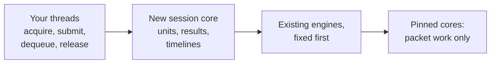
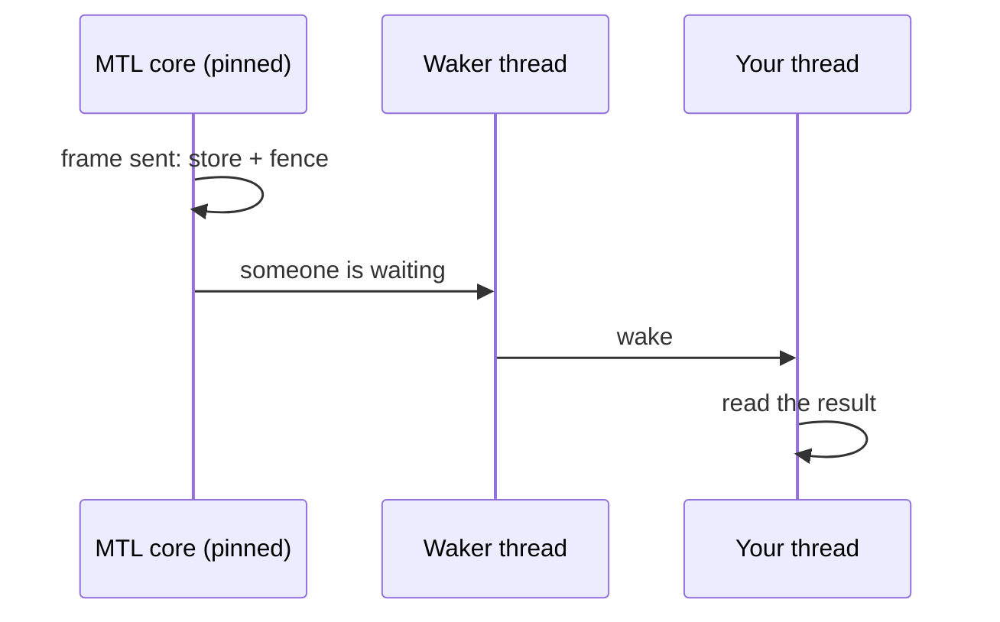
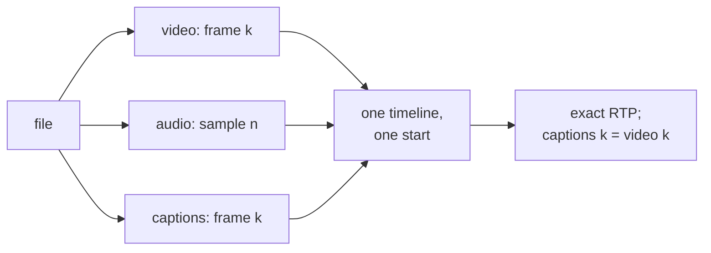
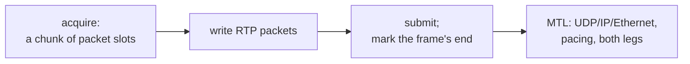
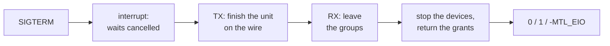
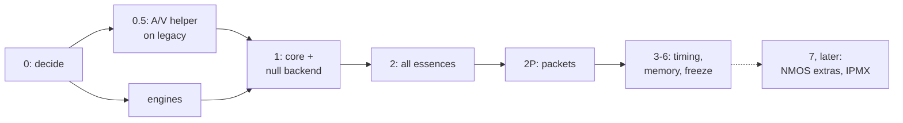

<!--
Slide deck for presenting the unified API proposal, revision 4. It renders as Markdown on GitHub
and in VS Code (mermaid diagrams included), and as slides with Marp (marp-cli with the mermaid
plugin, or replace the diagrams with exports from ../diagrams.md). Speaker notes are the
HTML comments under each slide.
-->

# A unified MTL API

**Proposal — revision 4: simpler, with the same reach**

One small header for every ST 2110 essence ·
results you can trust · exact A/V/ANC timing ·
RTP passthrough without mbufs · nothing on the pinned cores

`doc/unified-api/` · 2026-10-02 · nothing implemented yet

<!-- Say up front: this is a design for review, not code. Seventeen points need the maintainer's decision. -->

---

## Why: what users cannot do today

- **Know whether a frame went out on time** — "done" means an mbuf was freed
- **Get consistent RTP for audio, video and ANC** from one file — up to half a frame off
- **Trust that nothing blocks the pinned cores** — callbacks, mutexes, a 60 s ARP wait run there
- **Share memory safely** — `mtl_dma_map` maps one port, keeps no reference
- **Send their own RTP packets cleanly** — mbufs, tasklet callbacks, no ST 2022-6
- **Tell errors apart** — `NULL` for timeout, stop and destroy alike

<!-- Each point is verified in code, with path:line, in the research notes and S8. -->

---

## The first program

```c
MTL_INIT(&sc);
sc.direction = MTL_TX;
sc.essence = MTL_VIDEO;
mtl_flow_ipv4(&sc.flows[0], 239, 168, 85, 20, 20000);
sc.video.raster.width = 1920;
sc.video.raster.height = 1080;
sc.video.raster.rate = MTL_FPS_59_94;
sc.video.format = MTL_YUV422_10;
mtl_instance_open(NULL, &mt);                  /* ports from MTL_PORTS */
mtl_session_open(mt, &sc, &s);                 /* create + start */
while (running) {
  if (mtl_tx_acquire(s, &u, MTL_MS(100)) != 0) continue;   /* nothing free yet */
  render(u.plane[0].addr, u.plane[0].stride);
  mtl_tx_submit(s, &u);                        /* the next slot on the wire */
}
mtl_session_close(s, MTL_SEC(1));              /* drain, clean up */
mtl_instance_close(mt, MTL_SEC(1));            /* network first, bounded */
```

One header (`mtl.h`), one struct per frame, typed fields to describe the stream: enums and defines, no strings.

Migration: the enums follow the legacy order; every legacy field is mapped in migration.md §4.

<!-- MTL_PORTS=null:1 runs this without a NIC, root or hugepages. The maintainer asked for enums or defines instead of a spec string (D-97): legacy + 1 where 0 means "not set" (MTL_FPS_59_94 is ST_FPS_P59_94 + 1), the same values where 0 is a real default (mtl_packing, mtl_sender_type). Option names stay for GStreamer, FFmpeg and bindings; programs use MTL_OPT_* constants. -->

---

## The idea in one picture



The packet builders and pacing engines stay. The contract around them changes.

---

## One model for everything

| | TX | RX |
|---|---|---|
| open | `sc.direction = MTL_TX`, `mtl_session_open(mt, &sc, &s)` | `sc.direction = MTL_RX` |
| move a unit | `mtl_tx_acquire` → fill → `mtl_tx_submit` | `mtl_rx_dequeue` → read → `mtl_rx_release` |
| outcome | `mtl_tx_reap`: one result per unit | the unit's status and frame index |
| end | `mtl_session_close` | the same |

Five essences + generic RTP · frames, rows or packets · one struct, `mtl_unit`.

---

## A lean include file

| | Revision 3 | Revision 4 |
|---|---|---|
| What a program includes | 3029 lines, 203 functions | `mtl.h`: 32 functions |
| All headers | 217 functions | 125, in 17 headers with one job each (+14 later) |
| Init functions | 37 | 0: `MTL_INIT(&s)` |
| Minimal sender | 63 lines | 42 lines |
| Zero-copy sender | 139 lines | 67 lines |

Rare knobs became **named options**: absent unless set, listable by name.

<!-- Nine studies plus two reviews; archive/REVISION-4.md has the numbers and the trade-offs. Typed configuration (D-97) removed the spec-string parsers; mtl.h has 32 functions. 14 more are declared under MTL_LATER for later phases: SDP, RTCP and PEP (Phase 7), and a few advanced helpers. -->

---

## Every unit gets exactly one result

- `ON_TIME`, `LATE`, `DROPPED` (with a reason), `FLUSHED`, `FAILED`, plus a signed margin
- results **cannot be lost**: built by the reader from the lease table
- published in **submission order**
- **off by default** for MTL's buffers, **always on** for your memory
- `blocked_on` says why acquire waits: buffers, unread results, or leases you leaked

<!-- DeckLink's four outcomes plus FAILED. Today recovery reports lost frames as COMPLETE. -->

---

## Nothing on the pinned cores



- no mutex, allocation, log formatting or app code on a pinned core
- recovery, ARP, flows, IGMP on worker threads
- any call that finds nothing arms your wait handle: drain, then `epoll`

<!-- Open decision M6: a direct wake-up write from the core for sub-millisecond audio. -->

---

## Two times, not one

- **Media time M**: what the unit represents → `RTP = floor(M × rate)`, exact, every essence
- **Launch time**: when it leaves → from ST 2110-21 and the **source kind**
  - playback — content exists before its time
  - capture — exists only after its sampling instant
  - gateway — SDI → IP, same frame, line by line
- late units are dropped, or sent late only if they fit — nothing ever slides

---

## A/V/ANC in sync by construction



`mtl_session_start(s, 3, NULL, NULL)` — all three or none. The maintainer's question, "can we make it automatic?": **yes**, and on RX too.

---

## RTP passthrough, coherently



- `sc.unit = MTL_UNIT_PACKETS` on any essence; the same verbs as frames
- MTL rewrites only the RTP fields you name (none by default)
- RX: chunks with leg, sequence, gap and arrival time per packet
- a generic RTP essence carries ST 2022-6 (impossible today: 1396 B vs a 1352 B limit)

---

## Memory: zero-copy by policy

- `mtl_session_attach`: a framework's arena becomes the session's slots in one call
- regions mapped into every device, refcounted, never freed while referenced
- `MTL_SESSION_REQUIRE_DIRECT` — never a silent copy
- strided layouts stay direct: sub-rectangles, woven interlaced frames
- **one RX frame → N TX sessions**, zero-copy (`u.hold`)
- MXL rings: frame *k* lands in slot *k mod N*

---

## Errors you can program against

| Code | Meaning |
|---|---|
| `-MTL_EAGAIN` | nothing yet (your wait handle is armed) |
| `-MTL_ECANCELED` | interrupted (GStreamer `unlock`) |
| `-MTL_ESHUTDOWN` | **you** stopped or closed it |
| `-MTL_EIO` | it failed — the reason is in the status |
| `-MTL_EINVAL` | wrong argument — `mtl_last_error()` names the field |

---

## Only the high-level API is public

| Stage | What applications see |
|---|---|
| Phase 0–1 | nothing changes; legacy headers move to `mtl/legacy/` with stubs |
| freeze F | legacy calls deprecated |
| F+1 | legacy only with `MTL_LEGACY_API` |
| ≥ F+2 | legacy headers not installed; the session engine is internal |

Every capability only `st20_api.h` offers gets a home first — or an explicit removal you approve.

---

## Built for frameworks and operators

- **GStreamer**: interrupt = `unlock`, exported pools, LATENCY from a dry run, options as properties
- **FFmpeg**: zero-copy RX with `av_buffer_create`; real timestamps
- **NMOS IS-05**: `mtl_session_update` — every leg at one instant, all or nothing
- **Kubernetes**: bounded shutdown, health for probes, CPUs and VFs from the pod
- **2022-7**: legs never pruned, admin state per leg
- **Exporters**: one registry of named stats, stable session names
- **No NIC needed to test**: null backend, test clock, fault injection

---

## Running in a Kubernetes pod



- `mtl_instance_close(mt, timeout)`, or `mtl_instance_shutdown` with flags and a report for `kubectl describe`
- **R8**: no signal handler, no `atexit` in the library; correct under SIGKILL by construction
- `mtl_instance_get_health`: lock-free; liveness never depends on links or PTP lock
- CPUs from the affinity mask, VFs from `env:` ports, no-IOMMU refused unless `instance.allow_noiommu`

<!-- A pod ends on a timer: 30 s grace by default, then SIGKILL. Every step is bounded, and no step starts that the rest of the budget cannot finish. Quiesced means no device can reach any memory, so exit is safe. A grandmaster outage must not restart every pod on the network, which is why liveness ignores time lock. ex11 is the pod example. Decision M16; deployment.md. -->

---

## NMOS and IPMX: port first, the rest in Phase 7

- **Phase 2: one IS-05 PATCH = one `mtl_session_update`**: flows and legs, all or nothing
  - the call returns the planned instant (202); `status.update_*` says when it applied (200)
  - the switch is at the slot boundary by the clock, unit or not
- **Phase 7, later** (declared under `MTL_LATER`, the design kept):
  - `REAPPLY`, `DRY_RUN`, cancel as `parts` 0; every leg disabled = muted, still RUNNING
  - IPMX: `session.profile`, `MTL_TIME_SOURCE_FREERUN`, `MTL_MEDIA_SENDER`
  - three optional headers, only for NMOS and IPMX programs:

| Header | Does |
|---|---|
| `mtl_sdp.h` | render and parse SDP, both 2022-7 legs |
| `mtl_rtcp.h` | IPMX sender reports with the Info Block, TX and RX |
| `mtl_crypto.h` | IPMX PEP encryption; parameters as `crypto.*` options, keys by `mtl_crypto_set_key` |

<!-- MTL is the transport, not the Node: the registry, REST and master_enable stay with the application or nmos-cpp.
Port first (D-98): Phases 1-6 port today's functionality, so an NMOS Node is built on Phase 2 with stop, update and start; the extras land in Phase 7 (implementation-plan.md §6).
IPMX is session.profile = IPMX, which changes zero defaults and labels only. Without PTP, MTL_TIME_SOURCE_FREERUN never steps; async sources use MTL_MEDIA_SENDER. The old rtcp.* NACK options are renamed rtx.*. ex13 is one update per PATCH. Decision M17; nmos-ipmx.md. -->

---

## Engines first: legacy users benefit too

| Engine fix | Legacy API | Unified API |
|---|---|---|
| exact RTP math, default video RTP from the epoch | opt-in | default |
| per-frame status, reason, margins | on | on |
| ANC keep-alive, ANC RTP from media time | opt-in | default |
| ST 2110-22 CBR | opt-in | default |
| RTP-level defects (pacing, 2022-7 drops, ST40 pointer bug) | on | on |

---

## Delivery



≈ 55–85 engineer-months + 4–7 for packet mode · first user result 6–10 weeks after the timing model is confirmed · Phases 1–6 port today's functionality; Phase 7 is outside the total

---

## Decisions we need

| # | Decision | Recommendation |
|---|---|---|
| M1–M5 | core direction, slot interface, media time, ANC window, no user code on tasklets | confirm |
| M6–M10 | wake-up write, legacy wire policy, ABI, PR #1610, review and staffing | as recommended |
| M11 | the revision-4 shape | accept as one package |
| M12 | legacy features to remove | remove unless a user appears |
| M13–M15 | unified defaults, RTP passthrough defaults, hiding schedule | accept |
| M16 | Kubernetes: bounded network-first shutdown, R8, health, CPUs and time from the pod, no-IOMMU refused | accept as one package |
| M17 | NMOS and IPMX: the IS-05 contract, `mtl_sdp.h`, `mtl_rtcp.h`, `mtl_crypto.h`, the IPMX profile | accept as the design; implement in Phase 7, crypto after its cost spike |

---

## Learn more

- `concepts.md` — the model in one sitting
- `diagrams.md` — a picture per example, and the architecture, lifecycle and timing pictures
- `examples.md` and `sketch/` — the headers and the examples that compile
- `contract.md`, `timing.md` — the exact behaviour
- `engine.md`, `implementation-plan.md` — how it is built, ST20 first
- `migration.md` — from today's API, field by field
- `deployment.md`, `nmos-ipmx.md` — Kubernetes pods; NMOS and IPMX (later)
- `decisions.md` — the decisions you are asked for

**Questions?**
