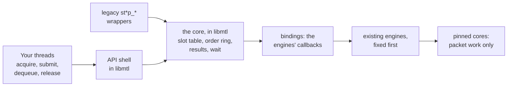
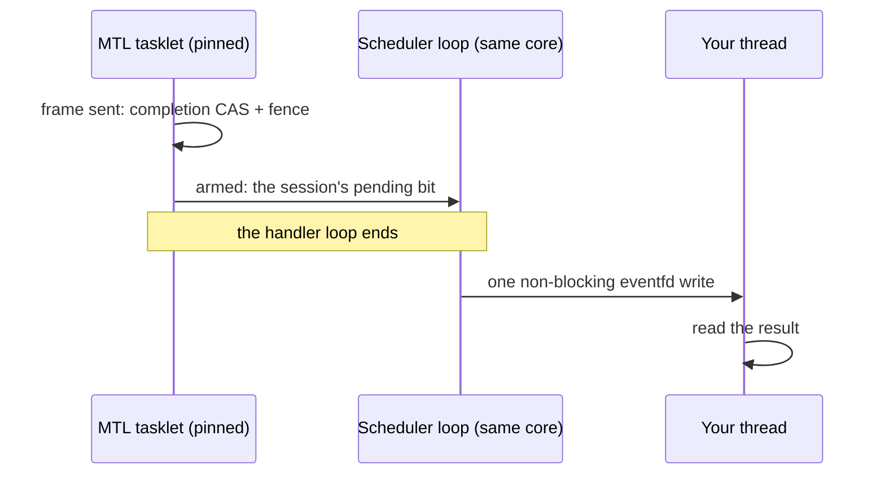
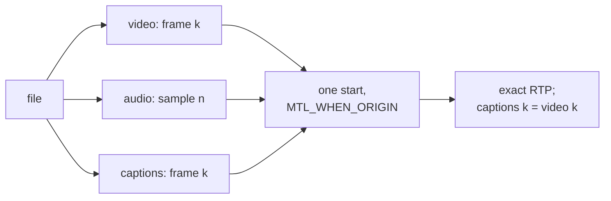
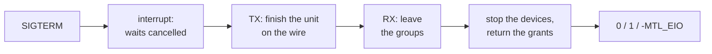
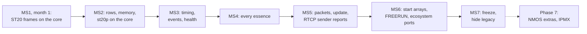

<!--
Slide deck for maintainers and users of MTL: the unified API, how it is built on today's
engines, and the plan. It renders as Markdown on GitHub and in VS Code (mermaid diagrams
included), and as slides with Marp (marp-cli with the mermaid plugin, or replace the diagrams
with exports of the mermaid blocks). Speaker notes are the HTML comments under each slide.
-->

# A unified MTL API

**The design and the plan**

One small header for every ST 2110 essence ·
results you can trust · exact A/V/ANC timing ·
RTP passthrough without mbufs · nothing on the pinned cores

`doc/unified-api/` · 2026-10-02 · nothing implemented yet

<!-- The design is settled; its history is in git. This talk is what will be built, on what, and in what order. -->

---

## Why: what users cannot do today

- **Know whether a frame went out on time**: "done" means an mbuf was freed
- **Get consistent RTP for audio, video and ANC** from one file: up to half a frame off
- **Trust that nothing blocks the pinned cores**: callbacks, mutexes, a 60 s ARP wait run there
- **Share memory safely**: `mtl_dma_map` maps one port, keeps no reference
- **Send their own RTP packets cleanly**: mbufs, tasklet callbacks, no ST 2022-6
- **Tell errors apart**: `NULL` for timeout, stop and destroy alike

<!-- Each point is verified in code, with path:line: legacy-internals.md and the known defects of engine.md §12. -->

---

## The first program

```c
MTL_INIT(&sc);
sc.direction = MTL_TX;
sc.essence = MTL_VIDEO;
mtl_flow_ipv4(&sc.flows[0], 239, 168, 85, 20, 20000);
sc.video.raster.width = 1920;
sc.video.raster.height = 1080;
sc.video.raster.fps = mtl_fps_rational(MTL_FPS_59_94);
sc.video.format = MTL_YUV422_10;
mtl_instance_open(NULL, &mt);                  /* ports from MTL_PORTS */
mtl_session_open(mt, &sc, &s);                 /* create + start */
while (running) {
  int r = mtl_tx_acquire(s, &u, MTL_MS(100));
  if (r == -MTL_EAGAIN) continue;              /* nothing free yet */
  if (r < 0) break;                            /* stopped, closed or failed */
  render(u.plane[0].addr, u.plane[0].stride);
  mtl_tx_submit(s, &u);                        /* sent at the next frame time */
}
mtl_session_close(s, MTL_SEC(1));              /* drain, clean up */
mtl_instance_close(mt, MTL_SEC(1));            /* network first, bounded */
```

One header (`mtl.h`), one struct per frame, typed fields to describe the stream: enums and defines, no strings.

Migration: the enums follow the legacy order; every legacy field is mapped in migration.md §4.

<!--
MTL_PORTS=null:1 runs this without a NIC, root or hugepages. Enums or defines instead of a spec
string (D-97): legacy + 1 where 0 means "not set" (MTL_FPS_59_94 is ST_FPS_P59_94 + 1), the same
values where 0 is a real default (mtl_packing, mtl_sender_type). The frame rate is a rational
only; interlaced, it is the frame rate, not the field rate. Option names stay for GStreamer,
FFmpeg and bindings; programs use MTL_OPT_* constants.
-->

---

## The idea in one picture



The packet builders and pacing engines stay. The contract around them changes, and the legacy
pipelines run on the same core.

---

## The core and its bindings

- **One core** in libmtl (`lib/src/st2110/core/`): per session a slot table
  - seven states for TX and RX: FREE, APP, QUEUED, XFORM, ENGINE, PUBLISHED, HELD
  - an order ring: pick-up, result and reap order are one sequence
  - the completion CAS is the claim, so a unit completes exactly once
  - the armed wait and one deferred `mt_wake()`
- **Bindings**, one per essence and direction (+ packet, null), implement the callbacks the
  engines already call: `get_next_frame`, `notify_frame_done`, `query_ext_frame`,
  `notify_frame_ready`, `notify_slice_ready`, …
  - no new engine entry point for frames and rows
- **API shell** `lib/src/unified/`, compiled into libmtl with one version node per milestone,
  `MTL_UNIFIED_EXPERIMENTAL_<rev>_MSn`: config → `ops` through the option table, reasons,
  call classes; no data-path state
- **Legacy**: `st*p_*` become wrappers on the core (st20p MS2, the others MS4); the session API
  stays as the engines' interface

<!-- The binding *is* get_next_frame, so the meta it writes is the meta the engine keeps: a facade over the session layer cannot lose the application's timing. Details: engine.md §1 and §3. -->

---

## One model for everything

| | TX | RX |
|---|---|---|
| open | `sc.direction = MTL_TX`, `mtl_session_open(mt, &sc, &s)` | `sc.direction = MTL_RX` |
| move a unit | `mtl_tx_acquire` → fill → `mtl_tx_submit` | `mtl_rx_dequeue` → read → `mtl_rx_release` |
| outcome | `mtl_tx_reap`: one result per unit | the unit's status and frame index |
| end | `mtl_session_close` | the same |

Five essences + generic RTP · frames, rows or packets · one struct, `mtl_unit`.

---

## A lean include file

| | |
|---|---|
| What a program includes | `mtl.h` |
| All headers | `mtl.h` and optional headers, one job each; `sketch/check.sh` prints the functions per header and per milestone |
| Today's public surface | four frame-exchange models, per-essence verbs and structs |
| Init functions | none: `MTL_INIT(&s)` |
| Shared verbs | `mtl_close`, `mtl_interrupt`, `mtl_wait`, `mtl_get_wait_handle`, `mtl_reap`, `mtl_read_events`, `mtl_release`, with typed inline wrappers (`mtl_session_close`, `mtl_tx_reap`, …) |
| Exports | a function is exported in the milestone that builds it; a known value not built yet is `-MTL_ENOTSUP` with `MTL_REASON_NOT_IMPLEMENTED` |

Rare knobs are **named options**: absent unless set, listable by name.

<!-- Phase 7 and later names are declared only under MTL_LATER: SDP, the RTCP MIB calls and PEP of mtl_ipmx.h, shared queues, created timelines. Per-acquire layouts and per-unit RX destinations come in MS2. -->

---

## Every unit gets exactly one result

- `ON_TIME`, `DROPPED` (with a reason), `FLUSHED`, `FAILED`, plus a signed margin
- results **cannot be lost**: the completer writes them into the unit's submission descriptor, and
  nothing the tasklet writes can overflow
- published in **submission order**
- **off by default** for MTL's buffers, **always on** for your memory
- `blocked_on` says why acquire waits: buffers, unread results, or leases you leaked

<!-- DeckLink's four outcomes plus FAILED. Today recovery reports lost frames as COMPLETE. -->

---

## Nothing on the pinned cores



- no mutex, allocation, log formatting or app code on a pinned core
- recovery, ARP, flows, IGMP on worker threads
- a call that finds nothing arms its target (with timeout 0 only if it is in your wait handle's mask): drain, then `epoll`

<!-- D-68: W2-deferred. A completing context never makes a syscall inside a tasklet handler; the scheduler loop writes each flagged session's eventfd once per iteration, after its handlers. A waker thread draining the same bitmap (W3) is built only if spike S1 shows the writes harm pacing (D-102). -->

---

## Two times, not one

- **Media time M**: what the unit represents → `RTP = floor(M × rate)`, exact, every essence
- **Launch time**: when it leaves → from ST 2110-21 and `min_tx_delay_ns`
  - 0 (playback): content exists before its time, sent at the index of M
  - one frame + the pick-up lead (capture): exists only after its sampling instant, the next index
  - rows units (gateway): SDI → IP, same frame, line by line
- late units are dropped (INDEX, TAI) or moved to the next index (AUTO): nothing ever slides

---

## A/V/ANC in sync by construction



`mtl_session_start(s, 3, &origin, NULL)` with `MTL_WHEN_ORIGIN`: all three or none, frame and sample 0 at
T0 (MS6). Every session is on the SMPTE epoch, so RX aligns too.

---

## RTP passthrough, coherently


- `sc.unit = MTL_UNIT_PACKETS` on any essence; the same verbs as frames (MS5)
- MTL rewrites only the RTP fields you name (none by default)
- RX: chunks with leg, sequence, gap and arrival time per packet
- a generic RTP essence carries ST 2022-6 (impossible today: 1396 B vs a 1352 B limit)

---

## Memory: zero-copy by policy

- `mtl_session_attach`: a framework's arena becomes the session's slots in one call
- regions mapped into every device, refcounted, never freed while referenced
- `MTL_SESSION_REQUIRE_DIRECT`: never a silent copy
- strided layouts stay direct: sub-rectangles, woven interlaced frames
- **one RX frame → N TX sessions**, zero-copy (`u.hold`)
- MXL rings: frame *k* lands in slot *k mod N*
- video memory in MS2, the other essences in MS4

---

## Errors you can program against

| Code | Meaning |
|---|---|
| `-MTL_EAGAIN` | nothing yet; the target is armed (with timeout 0 only if it is in your wait handle's mask) |
| `-MTL_ECANCELED` | interrupted (GStreamer `unlock`) |
| `-MTL_ESHUTDOWN` | **you** stopped or closed it |
| `-MTL_EIO` | it failed: the reason is in the status |
| `-MTL_EINVAL` | wrong argument: `mtl_last_error()` names the field |
| `-MTL_ENOTSUP` | known, not built yet (`NOT_IMPLEMENTED`) |

---

## Only the high-level API is public

| Stage | What applications see |
|---|---|
| MS1 | unified headers in `include/mtl/experimental/`, their functions in libmtl's node `MTL_UNIFIED_EXPERIMENTAL_<rev>_MS1`; the legacy API untouched |
| MS3 | libmtl gets a soname, the `MTL_LEGACY` node and hidden internals |
| MS4–MS6 | legacy headers move to `mtl/legacy/` with stubs; in-tree consumers port |
| MS7, release F | legacy calls deprecated; the unified API is `MTL_1.0` |
| F+1 | legacy only with `MTL_LEGACY_API` |
| ≥ F+2 | legacy headers not installed; the session engine is internal |

Every capability only `st20_api.h` offers gets a home first, or an explicit removal.

---

## Built for frameworks and operators

- **GStreamer**: interrupt = `unlock`, exported pools, LATENCY from a dry run, options as properties
- **FFmpeg**: zero-copy RX with `av_buffer_create`; real timestamps
- **NMOS IS-05**: `mtl_session_update`, every leg at one instant, all or nothing
- **Kubernetes**: bounded shutdown, health for probes, CPUs and VFs from the pod
- **2022-7**: legs never pruned, admin state per leg
- **Exporters**: one registry of named stats, stable session names
- **No NIC needed to test**: null backend, test clock, fault injection (MS1)

<!-- The FFmpeg, GStreamer, OBS, Python and Rust ports are MS6. -->

---

## Running in a Kubernetes pod



- `mtl_instance_close(mt, timeout)`, or `mtl_instance_shutdown` with flags and a report for `kubectl describe`
- **R8**: no signal handler, no `atexit` in the library; correct under SIGKILL by construction
- `mtl_instance_get_health`: lock-free; liveness never depends on links or PTP lock
- CPUs from the affinity mask, VFs from `env:` ports, no-IOMMU refused unless `instance.allow_noiommu`

<!--
A pod ends on a timer: 30 s grace by default, then SIGKILL. Every step is bounded, and no step
starts that the rest of the budget cannot finish. Quiesced means no device can reach any memory,
so exit is safe. A grandmaster outage must not restart every pod on the network, which is why
liveness ignores time lock. ex11 is the pod example; health and the shutdown report are MS3.
deployment.md has the rules.
-->

---

## NMOS and IPMX: port first, the rest in Phase 7

- **MS5: one IS-05 PATCH = one `mtl_session_update`**: flows and legs, all or nothing
  - the call returns the planned instant (202); `status.update_*` says when it applied (200)
  - the switch is at the index boundary by the clock, unit or not
- **MS5: RTCP sender reports on TX**, driven by the `rtcp.*` options, Info Block built by MTL
- **MS6: `MTL_TIME_SOURCE_FREERUN`**, with the published time base
- **Phase 7, after MS7** (declared under `MTL_LATER`, the design kept):
  - `REAPPLY`, `DRY_RUN`, cancel; every leg disabled = muted, still RUNNING
  - IPMX: `session.profile`, `MTL_MEDIA_SENDER`
  - one optional header, `mtl_ipmx.h`, only for NMOS and IPMX programs:

| Part | Does |
|---|---|
| SDP | render and parse SDP, both 2022-7 legs |
| RTCP | the application's Info Block entries; receiving sender reports |
| PEP | IPMX encryption; parameters as `crypto.*` options, keys by `mtl_crypto_set_key` |

<!--
MTL is the transport, not the Node: the registry, REST and master_enable stay with the application
or nmos-cpp. Port first (D-98): MS1-MS7 port today's functionality, so an NMOS Node is built on
MS5 with stop, update and start; the extras land in Phase 7. A Phase 7 name leaves MTL_LATER in
the milestone that builds it (D-134). IPMX is session.profile = IPMX, which changes zero defaults
and labels only. Without PTP, MTL_TIME_SOURCE_FREERUN never steps; async sources use
MTL_MEDIA_SENDER. ex13 is one update per PATCH; nmos-ipmx.md has the rest.
-->

---

## Engines first: legacy users benefit too

| Engine fix | Legacy API | Unified API |
|---|---|---|
| exact RTP math, default video RTP from the epoch | opt-in | default |
| per-frame status, reason, margins | on | on |
| ANC keep-alive, ANC RTP from media time | opt-in | default |
| ST 2110-22 CBR | opt-in | default |
| RTP-level defects (pacing, 2022-7 drops, ST40 pointer bug) | on | on |

---

## Delivery



About ten months to MS7 at three to four reviewed tasks a week · AI agents write the code and
the tests, review and the hardware gates set the pace · the exit criteria, not the dates, end a
milestone · MS1–MS7 port today's functionality; Phase 7 comes after

---

## MS1: ST 2110-20 frames in a month

| Week | Tasks |
|---|---|
| 1 | P0 tooling, S0 baseline, T1 legacy parity tests, H1b headers to `include/mtl/experimental/`, the API shell in libmtl and the run options, E1 engine fixes, C0 the core's header |
| 2 | C1a handles, states, close; C1w the wait protocol; C1b slot table, descriptor ring, results; A1 instance; the gtest and RxTxApp copies |
| 3 | C2 null binding, test clock and rate rules, B1 video TX binding, B2 video RX binding, A2a session, data and wait calls, A2c info, status and latency fields |
| 4 | I1 `St20p` cases in `UnifiedKahawaiTest`, R1 `UnifiedRxTxApp`, P1 acceptance smoke set, baseline CI entries and the samples `tx_video`, `rx_video`, `legacy_bridge`; stretch A2b, B3, X written if the gates allow, committed in MS2a |

- one signed-off commit per task, at most 1.5 k changed lines with its tests; the maintainer
  reviews and pushes
- exit: SHA-256 equal across the two APIs in both directions, one and two legs; `St20p*` green in
  `UnifiedKahawaiTest` next to `KahawaiTest`; the acceptance smoke set passes on `rxtxapp` and
  `rxtxapp_unified`; the legacy gate unchanged; ex01, ex02, ex03 and ex05 run on `null:1`; with
  them the samples `tx_video`, `rx_video` and `legacy_bridge` call every function of the MS1 node,
  the rest listed in ms1-status

<!-- Critical path: P0 → H1b → C1a → C1w → A1 → C2 → B1/B2 → A2a → R1 and I1 → P1, with C0 → C1a, C1w → C1b → C2 and E1 → B1/B2 beside it; A2c after A2a, before P1. Four reviewed commits a week (C0 and the two copies not counted). Gates on days 5, 10, 15 and 17 cut stretch work first. implementation-plan.md §5. -->

---

## How each change lands

| Gate | Who | What |
|---|---|---|
| 0–4 | `mtl-developer` | read the design, write the failing test, implement, build green |
| 5 | `mtl-reviewer` | adversarial review of the saved diff |
| 6 | `mtl-system-admin` | `KahawaiTest` and `UnifiedKahawaiTest` on real VFs (`run_gtest` `binary`), for data-plane changes |
| every milestone | the legacy gate | legacy KahawaiTest and acceptance unchanged |

One commit per task, at most 1.5 k changed lines with its tests; the headers in `sketch/` are
normative, and `check.sh` stays green.

---

## Learn more

- `concepts.md`: the model in one sitting
- `examples.md` and `sketch/`: the headers and the examples that compile
- `contract.md`, `timing.md`: the exact behaviour
- `engine.md`, `implementation-plan.md`: how it is built, ST20 first
- `legacy-internals.md`, `standards.md`: today's code and the standards it must meet
- `migration.md`, `coverage.md`: from today's API, field by field and capability by capability
- `deployment.md`, `nmos-ipmx.md`: Kubernetes pods; NMOS and IPMX (later)
- `decisions.md`: one line of rationale per decision

**Questions?**
