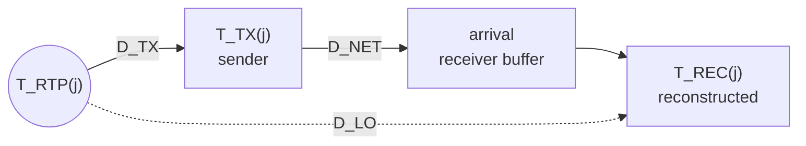

# Standards: the facts the code must meet

| | |
|---|---|
| Status | Maintained reference. Nothing here is a decision; the headers in [sketch/include/mtl/experimental/](sketch/include/mtl/experimental/) win over this text |
| Date | 2026-10-02 |
| Reads with | [timing.md](timing.md), [nmos-ipmx.md](nmos-ipmx.md) |

This file holds what the SMPTE, AES, IETF, VSF and AMWA texts require of an ST 2110 sender and receiver, with the
clause each fact comes from, what the compliance tools measure, where MTL today disagrees with the texts, and the
bibliography. Implementers check their code against it; testers write their oracles from it. The rules the unified API
builds on these facts are in [timing.md](timing.md) (media time, launch, sync), [contract.md](contract.md) (calls) and
[nmos-ipmx.md](nmos-ipmx.md) (NMOS and IPMX); this file points to them instead of repeating them. Facts were read in the
cited source unless marked *(inferred)* (reasoning or a secondary source) or *(unknown)* (not determinable from what was
available). Code facts about MTL are at `545a266a`.

## 1. Contents

| § | Area |
|---|---|
| 2 | Sources read |
| 3 | ST 2110-10: epoch, media clock and RTP clock |
| 4 | RTP timestamp rules per essence |
| 5 | TSMODE, TSDELAY, derived signals and SDP |
| 6 | ST 2110-21, receivers and what compliance tools measure; §6.6 RP 2110-23 and RP 2110-24 |
| 7 | ST 2110-22 and RFC 9134 |
| 8 | ST 2110-30 and AES67; §8.1 ST 2110-31 (AES3 transparent transport) |
| 9 | ST 2110-40 and RFC 8331, with ST 291-1 and RP 291-2 |
| 10 | ST 2110-41; §10.1 ST 2110-43 (timed text) |
| 11 | ST 2022-6; §11.1 ST 2022-8; §11.2 what a ST 2022-6 sender on packet units must meet |
| 12 | ST 2022-7 seamless protection |
| 13 | Synchronisation, latency and lip-sync; §13.1 ST 2059-1; §13.2 ST 2059-2; §13.3 MTL's PTP client against ST 2059-2 |
| 14 | VSF TR-10 (IPMX) and AMWA NMOS |
| 15 | Where MTL today disagrees with the standards |
| 16 | Arithmetic reference, clock facts, broadcast features users look for |
| 17 | Bibliography |

## 2. Sources read

- **Primary texts read** (free on `pub.smpte.org`): ST 2110-30:2025 (§8's sender column), ST 2059-1:2021, ST 2022-7:2019; VSF TR-03 (2015-11-12) and TR-10-1 (2024-02-23); RFC 3550, 4175, 7273,
  8331, 9134; AMWA IS-05 v1.2.0 Behaviour and MS-04 v1.0.0 timing; the EBU LIST documentation and source
  (`video_timing_analysis.md`, `audio_timing_analysis.md`, `a2v_sync.md`, `ST_2022-7.md`;
  `cpp/libs/st2110/lib/src/ebu/list/st2110/d21/{settings,vrx_calculator,c_calculator}.cpp`,
  `cpp/libs/analysis/lib/src/ebu/list/analysis/utils/rtp_utils.cpp`, `apps/listwebserver/src/{analyzers/rtp.ts,enums/profiles/profiles.ts}`).
  Every number derived from them was recomputed with exact fractions.
- **SMPTE texts read in full** (licensed copies, kept outside the repository; facts are paraphrased and cited by clause):
  ST 2110-10:2022, ST 2110-20:2022, ST 2110-21:2022, RP 2110-23:2019, RP 2110-24:2023, RP 2110-25:2023, ST 2022-6:2012,
  ST 2022-8:2019, ST 2059-2:2015 (the 2021 edition was not available). Formulas whose text extraction was garbled (-21
  Table 1, ST 2022-8 §5.3 and §6) were checked on the rendered page.
- **Essence texts read in full** (licensed copies, same rule): ST 2110-22:2022, ST 2110-30:2017, ST 2110-31:2022,
  ST 2110-40:2023, ST 2110-41:2024, ST 2110-43:2021, ST 291-1:2011, RP 291-2:2013, and RFC 8331. §7–§10 are checked
  against these editions; the later -30 and -41 editions of §17 differ at least in the SSN value and, for -30, in
  sender-side level rules (§8).
- **Not read:** AES67 (paywalled; taken from a secondary summary, so marked *(inferred)*), IEEE 1588-2008 (its rules
  enter only through ST 2059-2), the JT-NM Tested test plan PDFs (their criteria come from the EBU LIST docs and source that quote them),
  EBU R37 and ITU-R BT.1359 (secondary sources), RFC 8759 (TTML over RTP), W3C TTML2 and IMSC 1.2, ST 352 (VPID),
  RP 168 (switching point; its line numbers are RP 291-2's).
- **In-repository references:** `doc/compliance.md`, `doc/design.md` §6.11 and §8.2, `doc/user-pacing-timestamp-contract.md`
  (the legacy pacing contract draft), `lib/src/st2110/st_rx_timing_parser.c`, `st_tx_video_session.c`, `st_tx_audio_session.c`,
  `st_tx_ancillary_session.c`, `st_fmt.c`, and `.github/copilot-docs/mtl-knowledge-base.md` §5.

## 3. ST 2110-10: epoch, media clock and RTP clock

| Fact | Reference |
|---|---|
| The SMPTE Epoch is 1970-01-01 00:00:00 TAI, the PTP epoch of IEEE 1588-2008; it lies 63 072 010 s before 1972-01-01T00:00:00Z (UTC). `t` is the time in seconds that has run without interruption since the SMPTE Epoch; a note equates it with PTP time in PTP-based implementations | ST 2059-1:2021 §6.1 note 2, §5.2.1 |
| TAI has no leap seconds; UTC = TAI − 37 s since 2017, carried in PTP announce `currentUtcOffset` (the value *(inferred)*); `doc/design.md` §5.4.3 documents the 37 s confusion with third-party tools | ST 2059-1; MTL docs |
| Every periodic signal is aligned as if an alignment point occurred at the epoch: `AlignmentTime = n × AlignmentPeriod`, `NextAlignmentTime = floor(t / AlignmentPeriod + 1) × AlignmentPeriod`. HD/UHD SDI: `AlignmentPeriod = (H × V)/SR = 1/R`, one frame (two frames in ST 2051 two-frame mode) | ST 2059-1 §6.2, §7.4, §7.4.1 |
| AES3 audio: the alignment point is the start of the Z preamble, `AlignmentPeriod = 192 × Tsamp` | ST 2059-1 §8.1 |
| 1001-rate audio cadence: at 30/1.001 fps, every five video frames together carry 8008 audio samples, aligned on every 5th alignment point under the ST 318 ten-field sequence | ST 2059-1 §8.2 |
| `floor` is defined, with a caution that the arithmetic must keep enough precision for no rounding or truncation step to corrupt the final values: the basis for exact arithmetic (timing.md T4) | ST 2059-1 §5.1 |
| Media Clock: the timebase tied to the sampling (video: frame) rate, named by `mediaclk`, that advances the RTP timestamps. RTP Clock: the counter the Media Clock advances and that is sampled for each timestamp. Timestamp Reference Clock: the `ts-refclk` timebase, also used in RTCP sender reports. Image Sampling Instant: the instant representative of scene capture | ST 2110-10:2022 §4.10–§4.15 |
| With `mediaclk:direct` the SDP offset is the RTP Clock value at the epoch of the Timestamp Reference Clock, and the standard requires that offset to be zero. Note 1: this overrides RFC 3550's random initial timestamp; receivers that work with other RTP systems may meet a non-zero offset. Note 2: a receiver can use a restarted sender's stream at once, without a new SDP | ST 2110-10:2022 §7.3 |
| RTP Clock and Media Clock shall advance at uniform rates, at the rate the payload format sets | ST 2110-10:2022 §7.4 |
| SDP: every stream description has a `ts-refclk` (RFC 7273 §4) and a media-level `mediaclk`. Media clock derived from the reference: `a=mediaclk:direct=0` (the offset is always written); not locked to it: `a=mediaclk:sender` | ST 2110-10:2022 §8.2, §8.3 |
| PTP-referenced devices write `ts-refclk:ptp=IEEE1588-2008:<gm clockIdentity, EUI-64>:<domain>` or `ptp=IEEE1588-2008:traceable`; traceable is mandatory when the PTP timescale is in use, the grandmaster's `timeTraceable` is set and its `clockAccuracy` is 250 ns or better | ST 2110-10:2022 §8.2 |
| Non-PTP devices write an RFC 7273 form or `localmac=<sender MAC>` (equal `localmac` = same clock); receivers may accept the 2017 traceable form that lacks `IEEE1588-2008` | ST 2110-10:2022 §8.2 notes |
| `a=mediaclk:direct[=<offset>] [rate=<num>/<den>]`; "The offset indicates the RTP timestamp value at the epoch (time of origin) of the reference clock". Worked example: 1970 → 2013-01-01 is 1 356 998 400 TAI s, × 90 kHz mod 2^32 = 2 460 938 240. `rate=` "is not advised for video streams". `localmac` is ST 2110-10's extension, not RFC 7273 | RFC 7273 §5.2 |
| TR-03 allowed a constant non-zero offset in SDP (example `a=mediaclk:direct=2216659908`); ST 2110 requires zero; AES67 still allows an offset and ST 2110-30:2025 warns implementers about it, so receivers meet non-zero offsets (`rx.rtp_offset`, timing.md §11.1) | TR-03 §9; ST 2110-30 §6.1 note 1 |
| `rtp(t, R) = floor(t × R) mod 2^32`: zero offset (§7.3) plus truncation (§7.6.1); the closed form is *(inferred)*, the text states the two rules. The wrap and the nearest-wrap unwrap are in [timing.md §2.5, §11.2](timing.md#112-media-time-and-media-index-from-rtp). MTL's `st10_media_clk_to_tai()` unwraps to the nearest cycle today | ST 2110-10:2022 §7.3, §7.6.1; code |

The network and SDP rules of ST 2110-10 that every session and its tests must meet:

| Rule | Reference |
|---|---|
| RTP per RFC 3550 and the RFC 3551 profile, over UDP; dynamic payload types 96–127; no RTP session multiplexing on one group and port; multi-octet fields big-endian. Receivers shall tolerate RTCP and RTP header extensions (RFC 8285), and should cope with occasional lost, late or reordered packets | ST 2110-10:2022 §6.2 |
| Standard UDP Size Limit 1460 octets with the 8-octet UDP header, so an RTP packet, header extensions included, is at most 1452 B; every receiver accepts it. The sender's egress never fragments; receivers need not reassemble | ST 2110-10:2022 §6.3 |
| Larger datagrams only under the Extended UDP Size Limit (8960) and with `MAXUDP=<octets>` in `fmtp`; without `MAXUDP` receivers assume 1460 | ST 2110-10:2022 §6.4, §8.6 |
| IPv4 multicast with IGMPv3 (RFC 3376) and IPv4 unicast are mandatory, IPv6 recommended; no media on the Local Network Control Block or the Internetwork Control Block (RFC 5771) | ST 2110-10:2022 §6.5 |
| Devices shall accept a PTP Common Reference Clock (IEEE 1588-2008) at any message rate of the ST 2059-2 profile; a device whose Ordinary Clock can become leader shall offer a control that forces `defaultDS.slaveOnly` TRUE (MTL's built-in client never leads *(inferred)*) | ST 2110-10:2022 §7.2 |
| One SDP per stream, or per redundant pair, offered through a management API; receivers accept and act on such an SDP. MTL renders none today (§5), so the application is the device that must | ST 2110-10:2022 §8.1 |
| Source filter `a=source-filter: incl …` (RFC 4570) recommended. Duplicated streams (ST 2022-7) with separate source or destination addresses shall be grouped by `a=group:DUP` (RFC 5888, RFC 7104); two legs that share both source and destination addresses are not allowed, because SDP cannot describe them | ST 2110-10:2022 §8.4, §8.5 |

## 4. RTP timestamp rules per essence

| Essence | Rule | Clause |
|---|---|---|
| all | the timestamp shall reflect the "sampling instant" of the samples the packet carries, as refined per essence | ST 2110-10:2022 §7.5 |
| video, general | successive frames advance by regular increments of the frame rate, truncated to integers where needed; this wins over every case below. At 60/1.001 the increments alternate 1501 and 1502 ticks (note 1); the rule holds per stream, so switching between streams may jump (note 2) | ST 2110-10:2022 §7.6.1 |
| video, interlaced | first fields advance by regular increments of the frame rate; the second field is the first field's timestamp plus half the frame period, truncated. So `RTP(second) = RTP(first) + floor(TFRAME × 90000 / 2)`, whatever the first field's phase *(inferred from the wording)* | ST 2110-10:2022 §7.6.1 |
| video, PsF | both segments carry the same timestamp; from SDI the two segments are one progressive image | ST 2110-10:2022 §7.6.1, §7.6.4 |
| video, camera | progressive: should be the Image Sampling Instant, also when sent segmented; interlaced: the first field should be its sampling instant, the second field follows §7.6.1 (shall). No ±TFRAME bound | ST 2110-10:2022 §7.6.2 |
| video, playback or synthetic | with `mediaclk:direct`: should be `N × TFRAME` unless production intent places it elsewhere, and shall stay within ±TFRAME of the most recent `N × TFRAME`; subject to §7.6.1; second field per §7.6.1. TFRAME is not defined in -10 (it is -21's) | ST 2110-10:2022 §7.6.3 |
| video from SDI | progressive frame or first field: the video RTP clock sampled at the SDI Alignment Point (ST 2059-1); second field per §7.6.1; PsF second segment = first | ST 2110-10:2022 §7.6.4 |
| video, per packet | RTP clock 90 kHz; every packet of one progressive frame, or of one field, carries the same timestamp; a packet never carries samples of two frames, two fields or two segments; fields go first field first | ST 2110-20:2022 §6.1.3, §6.1.5 |
| video, sequence | the 16-bit RTP sequence number is the low half of a 32-bit counter whose high half is the payload header's Extended Sequence Number | ST 2110-20:2022 §6.1.2, §6.1.4 |
| audio, general | successive packets advance by regular increments of the audio RTP clock and the packet time (AES67:2018 §7.2); this wins over the cases below | -10 §7.7.1 |
| audio, capture | should be the sampling instant of the packet's first sample | -10 §7.7.2 |
| audio, playback or synthetic | should be the instant at which the audio has its intended time relation to the other essences | -10 §7.7.3 |
| audio from SDI (ST 299-1/-2, ST 272) | the first sample of each channel for a frame is contemporaneous with the video frame's RTP (-10 §7.6.4), offset as de-embedding determines; later samples increase monotonically; each packet's RTP is its first sample's effective instant | -10 §7.7.4 |
| audio from AES3 | the RTP clock sampled at the X or Z preamble of the packet's first sample | -10 §7.7.5 |
| PCM audio | media and RTP clock = the sampling rate; timestamps per -10 §7.5 | -30:2017 §6.1 |
| AM824 (AES3 transparent) | the RTP clock when the X or Z preamble of the packet's first AES3 subframe reaches the encapsulator; clock = the sampling rate | -31:2022 §5.3, §5.5 |
| ANC | 90 kHz, offset per -10; stamped by the video procedure of -10 so that it is contemporaneous with the related field or frame | -40 §5.3, §5.4 |
| ANC, per packet | the frame's (progressive) or field's (interlaced) sampling instant; every RTP packet of one frame or field carries the same value; non-integer instants truncated | RFC 8331 §2 |
| fast metadata | clock rate and timestamp meaning are set by the Data Item's defining document; the rate is signalled in SDP; the timestamp may carry the association with video or audio; one timestamp per RTP packet | -41:2024 §5.3 |
| compressed video | 90 kHz; timing model per -10, so the -10 §7.6 video rules apply | -22:2022 §5.1, §5.2 |
| JPEG XS | the "sampling instant of the first octet of the video frame"; 90 kHz; non-integer instants truncated | RFC 9134 §4.2 |
| timed text (TTML) | 90 kHz; a document becomes active at its packets' RTP timestamp, and its time expressions are relative to it | -43:2021 §4.2, §5.1 |
| ST 2022-6 | 27 MHz RTP clock (`SMPTE2022-6/27000000`), §11 | ST 2022-6 *(not read)* |

Marker bit and keep-alive per essence (what `MTL_PKT_SET_MARKER` and `MTL_PKT_TX_VALIDATE` must follow):

| Essence | Marker | Keep-alive | Clause |
|---|---|---|---|
| video | 1 on the last packet of a frame (progressive) or of a field (interlaced), 0 elsewhere; PsF is not named, so whether each segment ends with a marker is *(unknown)* | – | ST 2110-20:2022 §6.1.2 |
| PCM audio | not set by -30; AES67's RTP profile (RFC 3551) *(not read)* | – | -30 §6.2.1 |
| AM824 | **0 on every packet** | – | -31 §5.3 |
| ANC | 1 on the last RTP packet of a frame or field, also on the empty keep-alive | one packet per frame, field or segment, `ANC_Count` = 0 when empty | RFC 8331 §2; -40 §5.5 |
| fast metadata | **0 on every packet** | a packet at least every 500 ms | -41 §5.1, §5.2 |
| JPEG XS | 1 on the last packet of a frame or field | – | RFC 9134 §4.2 |
| TTML | 1 on the last packet of a document *(inferred: RFC 8759)*; 1 on the optional empty keep-alive | optional, Length = 0 | -43 §4.3 |

## 5. TSMODE, TSDELAY, derived signals and SDP

- **TSMODE and TSDELAY** (ST 2110-10:2022 §8.7): `TSMODE=SAMP` (the timestamp is the effective sampling instant, or an
  equivalent, fit for alignment across essences), `NEW` (created at egress from the sender's RTP clock; receivers presume
  it when TSMODE is absent), `PRES` (preserved from an input that was not marked SAMP). `TSDELAY` is the transmission
  delay `D_TX` (§7.8: the typical delay from a packet's RTP time to its transmission, for the first packet with that
  timestamp) as a positive decimal integer of µs; without it the receiver acts as it chooses.
- **Who signals what** (ST 2110-10:2022 §8.7, §7.9, Annex C):

  | Sender | TSMODE | TSDELAY |
  |---|---|---|
  | capture, playback, SDI or AES3 encapsulation (§7.6.2–§7.6.4, §7.7.2–§7.7.5) whose RTP really is the sampling instant | SAMP (should), and only then | should |
  | time-preserving processor, input marked SAMP | SAMP (**shall**) | inclusive `D_TX` = its `D_LO` + `D_PROC` + its own sending delay (**shall**) |
  | time-preserving processor, input not marked SAMP | PRES (**shall**) | shall |
  | time-resetting processor: stamps as if sampled now; §7.9 requires this (shall) when `D_LO` or `D_PROC` is impractically long, the inputs cannot be aligned or arrive after `D_LO`, or an input is not marked SAMP | NEW (should) | should |

  The clauses overlap: §7.9 makes a non-SAMP input a reason to re-stamp, while §8.7 still defines PRES for a sender
  that preserves such an input. Annex C (informative): playback devices may mark SAMP; encapsulators of SDI or AES3 often mark NEW and may mark SAMP
  when they compensate the upstream delay; PRES belongs to processors only. Devices should let a management API or UI
  override an input's TSMODE or TSDELAY (§7.9). A file playout that follows §7.6.3 and §7.7.3 is a SAMP sender; MTL's
  TX-cursor video RTP today is closer to NEW *(inferred)*. The unified rule (declared, not inferred) is
  [timing.md §5.6](timing.md#56-invariants-and-signalling).
- **Derived signals** (ST 2110-10:2022 §7.9): a time-preserving sender keeps the input timestamp (`T_NEWRTP(j) = T_RTP(j)`),
  a time-resetting one stamps the current time (`T_NEWRTP(j) = T_NOW`); in all cases the regular-increment rules (§7.6.1,
  §7.7.1) take precedence. The processor recipe is [timing.md §10.5](timing.md#105-recipes).
- **SDP attributes that carry timing:** `mediaclk`, `ts-refclk` (§3), `TSMODE`, `TSDELAY` (-10 §8.7), `TP=` sender type,
  optional `TROFF` and `CMAX` (-21, §6), `exactframerate` and `SSN`/`TM` for ANC (§9), `rate=` for fast metadata (§10).
- **ST 2110-20 SDP** (ST 2110-20:2022 §7, ST 2110-21:2022 §8, ST 2110-10:2022 §8.6):

  | Item | Rule |
  |---|---|
  | media line | `m=video`, `a=rtpmap:<pt> raw/90000`; `fmtp` entries `name=value` or bare `name`, separated by `;` and a space, none after the last |
  | required | `sampling`, `depth`, `width` and `height` (1–32767), `exactframerate`, `colorimetry`, `PM` (`2110GPM` or `2110BPM`), `SSN`, and from -21 `TP` (`2110TPN`, `2110TPNL`, `2110TPW`) |
  | `exactframerate`, `SSN` | the frame rate, also for interlaced: an integer as `25`, else the ratio with the smallest numerator, `30000/1001`. `SSN=ST2110-20:2017`, or `ST2110-20:2022` when `colorimetry=ALPHA` or `TCS=ST2115LOGS3` |
  | when not the default | `interlace` (absent = progressive), `segmented` (PsF, only with `interlace`), `TCS` (absent = SDR; never for KEY), `RANGE` (absent = NARROW; recommended with BT2100), `MAXUDP` (absent = 1460), `PAR` (absent = 1:1, reduced) |
  | ST 2110-21 | `TROFF` in whole µs, mandatory when TROFFSET ≠ TRODEFAULT (-21 §6.2), else optional; `CMAX` an integer, absent = the sender type's CMAX |
  | ST 2110-10 | `TSMODE`, `TSDELAY` as above; `MAXUDP` mandatory above the Standard UDP Size Limit |

  Every value applies to the whole stream (every sample, row, field and frame).
- **SDP today.** MTL's `lib/`, `include/`, `app/` and `ecosystem/` contain no `TSMODE`, `TROFF`, `TP=` or `mediaclk`
  string (grep): the library generates no SDP, so every timing promise must be expressible in the SDP the application
  writes. The values are `info.*` stats in the unified API; SDP rendering is Phase 7 (`mtl_sdp_render` in `mtl_ipmx.h`,
  `MTL_LATER`).

## 6. ST 2110-21, receivers and what compliance tools measure

### 6.1 The model

The formulas (TVD, TRS, TPRj for gapped, linear, interlaced and PsF), the sender types N, NL, W with their read schedule,
VRX_FULL, CMAX and `TP=` value, and the worked numbers for 1080p59.94 and 1080p50 are in
[timing.md §5.1](timing.md#51-the-st-2110-21-model), which applies them; this table is their clause-by-clause source:

| Item | Fact | Clause |
|---|---|---|
| scope | a timing model for ST 2110-20 and ST 2110-22 streams as they leave the sender, and the SDP that signals it; receiver design is out of scope | ST 2110-21:2022 §1, §6.1 |
| which models apply | every -20 sender passes the network compatibility model as type N, NL or W; the VRX model applies in addition only where the Media Clock is locked to the timestamping reference clock | ST 2110-20:2022 §6.1.1 |
| network compatibility model | measured on the sender's egress before any network effect, at all times and in every configuration: packets enter a bucket of infinite size at emission; it drains one packet, if one is present, at each instant `k × TDRAIN` since the SMPTE epoch; `RNOMINAL = NPACKETS / TFRAME`, `TDRAIN = (TFRAME/NPACKETS) / β`; `CINST ≤ CMAX` always | ST 2110-21:2022 §6.6.1 |
| virtual receiver buffer (VRX) | measured the same way: packets enter a bucket of capacity VRX_FULL at emission and leave at TPRj, both instantaneously; the sender never overflows it and emits packet j no later than TPRj (no underflow); evaluated on the RTP clock timebase of the sender's SDP | ST 2110-21:2022 §6.6.2 |
| TVD, TROFFSET | `TVD = N × TFRAME + TROFFSET`, N an integer, time from the SMPTE epoch; TROFFSET is zero or positive, measured from the most recent multiple of TFRAME (so below TFRAME) and the same for each frame; `TPR0 = TVD` | ST 2110-21:2022 §6.2 |
| TROFF | an uncompressed-video sender whose TROFFSET ≠ TRODEFAULT shall signal `TROFF`; receivers assume TRODEFAULT when it is absent; the value is a positive integer of µs, so a TROFFSET that is not a whole µs cannot be signalled exactly | ST 2110-21:2022 §6.2, §8.2 |
| gapped PRS, where it applies | only to -20 streams whose dimensions and frame rates derive from BT.656-5, BT.1543-1, BT.1847-1, BT.709-6 or BT.2020-2; any other raster (1920×1200, 2048×1080, an odd rate) has only the linear PRS, so only types NL and W | ST 2110-21:2022 §6.3.1 |
| gapped progressive | `RACTIVE = 1080/1125` for every progressive format (720p to 4320p); `TRS = TFRAME × RACTIVE / NPACKETS`; `TPRj = TVD + j × TRS`; TRODEFAULT `43/1125 × TFRAME` for height ≥ 1080, `28/750 × TFRAME` below | ST 2110-21:2022 §6.3.2 |
| gapped interlaced and PsF | TFRAME is the frame and NPACKETS counts the frame; `RACTIVE = HEIGHT/525`, `/625` or `/1125` and `TLINE = TFRAME/525`, `/625` or `/1125` by system; packets `j < NPACKETS/2` at `TVD + j × TRS`, the rest at `TVD + TFRAME/2 + TLINE/2 + (j − NPACKETS/2) × TRS` | ST 2110-21:2022 §6.3.3 |
| TRODEFAULT, 1125-line interlaced and PsF | `INT((1125 − HEIGHT)/2)/1125 × TFRAME`: 22/1125 at 1080i **and at 1080PsF**, not the progressive 43/1125 | ST 2110-21:2022 Table 1 |
| linear PRS | `TRS = TFRAME / NPACKETS`, `TPRj = TVD + j × TRS`, TRODEFAULT as for gapped. With the same TROFFSET and enough VRX, a receiver that reads linearly also accepts a gapped stream (informative) | ST 2110-21:2022 §6.4, §6.5 |
| sender types | a sender conforms to one or more of: N (gapped PRS), NL (linear), W (linear); β = 1.10 for all three; VRX_FULL and CMAX as in timing.md §5.1; `TP=2110TPN`, `2110TPNL`, `2110TPW` (shall) | ST 2110-21:2022 §7.1 |
| MAXUDP in VRX_FULL | 1500 under the Standard UDP Size Limit (although that limit is 1460), else the signalled MAXUDP | ST 2110-21:2022 §7.1.2–§7.1.4 |
| type W CMAX range | `MAX(16, INT(NPACKETS/(21600 × TFRAME)))` holds only below 900 000 packets/s; 2160p59.94 at 17 280 packets per frame (1 035 764 packets/s) is above it, so W has no defined CMAX there; the expression is still under study (note 1) | ST 2110-21:2022 §7.1.4 |
| packet count | NPACKETS is the packets per frame, which depends on the mapping; -21 does not state that it is constant for -20 *(inferred: a per-frame read schedule needs it)*; -22 requires a constant count | ST 2110-21:2022 §6.2; ST 2110-22:2022 §4 |
| SDP | `TP` required; `TROFF` and `CMAX` optional (§5 table) | ST 2110-21:2022 §8 |

-21 measures emission at the sender's egress port to the network (§6.6.1, §6.6.2) and names no bit within the packet. The
unified `launch_tai_ns` and TPRj comparisons take the first bit of the packet, the Ethernet start-of-frame delimiter, as
the instant, as the legacy pacing contract draft does (timing.md §5.1) *(inferred: a convention, not a clause)*.

**A defect in the 2022 text.** The 525- and 625-line TRODEFAULT cells of Table 1 end in a `+` with no following term, in
the rendered page as well as in its text. MTL and EBU LIST use the 2017 fixed values 20/525 and 26/625; these equal
`INT((525 − 486)/2) + 1` and `INT((625 − 576)/2) + 2`, which would fit missing terms of 1 and 2 *(inferred)*; the 2022
intent is *(unknown)*.

### 6.2 Receivers

A receiver conforms to one or more types (ST 2110-21:2022 §7.2.2), and an ST 2110-20 receiver shall be one of them
(ST 2110-20:2022 §6.1.1):

| Type | Shall receive | Conditions | Should |
|---|---|---|---|
| N (narrow, synchronous) | type N senders | same clock as the sender's `ts-refclk`; `mediaclk:direct`; TROFF absent or the default | other TROFF values; NL senders under the same conditions |
| W (wide, synchronous) | N, NL and W senders, any signalled TROFF | same clock; `mediaclk:direct` | – |
| A (asynchronous) | N, NL and W senders | none: any `ts-refclk`, `mediaclk` or TROFF | – |

Practical receivers ought to absorb network jitter and delay beyond the sender model (ST 2110-21:2022 §7.2.1,
informative). What else every ST 2110-20 receiver must accept:

- both packing modes, so one to three Sample Row Data headers per packet with the Continuation bit, an SRD length that
  is a multiple of the pgroup, the zero-length single-SRD case, and padding at the end of a field or frame (ST 2110-20:2022
  §6.1.4, §6.2.1, §6.3.1);
- RTCP and RTP header extensions (CSRC list, RFC 8285 extension) in front of the payload header, UDP datagrams up to
  1460 octets, and occasional loss, lateness and reordering (ST 2110-10:2022 §6.2, §6.3; ST 2110-20:2022 §6.1.2);
- interlaced and PsF reconstruction: rows count from 0 in each field or segment, the second field's rows lie below the
  like-numbered rows of the first, and an odd height puts the extra row in the first field (ST 2110-20:2022 §6.1.4,
  §6.1.5); 4:2:0 occurs only in progressive streams, one SRD row number per row pair (§6.1.5, §6.2.5);
- a last pgroup of a row padded with zero samples, which the receiver ignores (§6.2.1).

**Packing modes** (ST 2110-20:2022 §6.3): GPM packs freely with the C bit, should avoid datagrams below 1000 octets except
at the end of a field or frame and should fill packets close to the UDP limit; BPM puts 7 × 180 = 1260 octets of SRD
data in every packet (the last one may be shorter or zero-padded to the same size), uses the C bit to keep the block
count, and never uses the Extended UDP Size Limit. Senders signal `PM`; pgroups are never split across packets
(§6.2.2).

### 6.3 What EBU LIST and JT-NM Tested measure

| Metric | Definition | Source |
|---|---|---|
| N | `floor(t_first_packet / TFRAME)` | LIST `rtp_utils.cpp::calculate_n` |
| FPT | first captured packet time − `N × TFRAME`, "a measured TRoffset" | `video_timing_analysis.md` |
| VRX | `vrx_prev + 1 − drained_delta`, `drained = floor((t − TVD + TRS)/TRS)`, reset to 0 per frame; ideal TVD = `N·TFRAME + TRO_default` (SDP TROFF optional) | `vrx_calculator.cpp` |
| CINST | leaky bucket with `TDRAIN = TFRAME/NPACKETS/1.1`, started at the first packet of the capture | `c_calculator.cpp` |
| latency | `TP_A_0 − RTPTimestamp`; JT-NM Tested 4.4: RTP "not in the future, not more than 1 ms in the past (unless justified)"; `rtp.ts` limit `[0, 1 000 000] ns` | LIST doc, `rtp.ts` |
| RTP offset | `RTP − N × TFRAME` in ticks; profile `use_troffset`: `[−1, ceil(TRO_default × 90000) + 1]` ([−1, 59] at 1080p59.94) | `rtp.ts` |
| RTP ts delta | between consecutive frames or fields | LIST |
| schedule | gapped if the last-to-first gap is ≥ 10 × the inter-packet spacing | LIST doc |

LIST's `calculate_rtp_timestamp()` uses `round()`, not truncation, so tools tolerate ±1 tick where a strict reading
(truncate) does not; the unified oracle does not tolerate it ([timing.md §16.3](timing.md#163-substrate-and-budgets)).
Both video windows say "unless justified": a capture source with a launch delay L ≥ 1 reports an RTP offset of about
−L·TFRAME and a latency of about L·TFRAME, which is the justified case (worked numbers in timing.md §5.2).

**RP 2110-25:2023** gives the names and formulas test equipment reports; the unified stats, the RX timing parser and
the test oracles use them (all clauses RP 2110-25:2023):

| Measure | Definition | § |
|---|---|---|
| prerequisites | the instrument is a receiver on the same common reference clock and epoch as the device under test; sender and receiver locked; an SDI encapsulator's input locked and aligned per ST 2059-1; capture close to the sender | 4.1 |
| window | report minimum, maximum and average over 1 s (should); 90 kHz quantises latencies to ≈ 11 µs | 4.2 |
| `round`, `int`, `trunc` | round: halves away from zero; int: largest integer not above; trunc: toward zero | 4.3 |
| TCF | `N × TFRAME` with `N = round(TPA0 / TFRAME)`: **rounded**, where LIST and MTL's parser take the floor | 4.4 |
| RTP time | `RTPTimestamp_encoded = (wraps × 2^32 + RTPTimestamp) / RTPClockrate`, `wraps = int(arrival × rate / 2^32)`: the wrap count comes from the arrival time, so a packet stamped before a wrap and received after it is misread (note) | 4.5 |
| FPT | `TPA0 − TCF`, µs, within ±½ frame; FPT trails `V = 0` SDI timing by the vertical blanking | 4.8.3 |
| RTPOFFSET | `RTPTimestamp_encoded − TCF` | 4.8.4 |
| video latency VL | `TPA0 − RTPTimestamp_encoded` | 4.8.5 |
| margin | `TROFFSET − FPT`, µs, inherently within −0.5 … +1.5 frame | 4.8.6 |
| GAP | first packet of this field or frame minus last packet of the previous one, µs, typically 0–4 % of a frame; negative = reordering | 4.8.7 |
| CPEAK | peak CINST, shown with the applicable CMAX | 4.9.1 |
| VRX | VRX_PEAK (with VRX_FULL and NPACKETS), VRX_OVERFLOW, VRX_UNDERFLOW (a read finds the buffer empty), VRX_PACKET_MISSING (the expected packet is absent at its read time), VRX_MIN-SS (from TPR0 to the last packet's arrival), VRX_MIN-GAP, VRX_AVG (sampled before each read; default window 1 s, shall), VRX_AVG-SS | 4.9.2 |
| TROFFSET for VRX | the SDP's TROFF, else TRODEFAULT (shall) | 4.9.2 |
| ST 2110-22 | CINST as for -20; the VRX model does not apply | 4.10 |
| audio | Audio Delay Variance by TS-DF of EBU Tech 3337 (shall), 1 s period; packet interval time; audio latency `TPA − RTPTimestamp_encoded`, normally at least one packet time; `AVDL = AL − VL` (negative when video is later; the sign is the opposite of BT.1359) | 4.11 |
| ANC | FPT and RTPOFFSET as video; ANC latency averaged over 1 s; `ANC VDL = ANCL − VL`; `RRTPOFFSET = RTP(video) − RTP(ANC)`, expected near 0 and static; metadata margin `(VL − ANCL) − TVBK + TEPO` | 4.12 |
| methods | event-history and residence-time VRX methods report different minima (a gapped stream reads 0 in a full event-history window); the Python examples are informative (the CPEAK example starts its bucket at the first captured packet and rounds up) | Annex A, B |

### 6.4 MTL's RX timing parser

`st_rx_timing_parser.c` mirrors LIST: the same FPT, latency, RTP offset, VRX and CINST definitions and the same pass
windows (`latency ∈ [0, 1 ms]`, `rtp_offset ∈ [−1, ceil(TRO·90k)+1]`, `rtp_ts_delta ∈ [s, s+1]`). Its deviations from
the standard text:

| # | Deviation | Also in LIST |
|---|---|---|
| 1 | TRS always uses the gapped RACTIVE, so a type W or NL (linear) stream is checked against the wrong read schedule (ST 2110-21:2022 §7.1.3, §7.1.4 require NL and W to be linear); the verdict knows only narrow and wide | — |
| 2 | the frame-level CINST bucket restarts at each frame's first packet instead of draining at `k × TDRAIN` since the epoch (ST 2110-21:2022 §6.6.1) | yes |
| 3 | TVD uses TRO_default only; a signalled TROFF is ignored, against RP 2110-25:2023 §4.9.2 (shall) | yes |
| 4 | absolute TAI ns in `double`: at 1.79e18 ns the ULP is 256 ns, so FPT and latency carry up to ≈ 0.3 µs quantisation *(inferred)*; fine for µs metrics, not for an exact oracle | — |
| 5 | the frame is `floor(t / TFRAME)` (`st_rx_timing_parser.c:21`), where RP 2110-25:2023 §4.4 rounds: a first packet slightly before `N × TFRAME` reads as an FPT of almost a frame instead of a small negative one | yes |
| 6 | interlaced RACTIVE and TRODEFAULT come from a height switch (`st_rx_timing_parser.c:317-332`): 480 lines → RACTIVE 487/525 and 20/525, 576 → 576/625 and 26/625, anything else → the 1125-line values. ST 2110-21:2022 Table 1 uses HEIGHT/525 (480/525 at 480i), and RP 2110-24:2023 §4.3 allows 480–486 lines at 525, so a 486-line stream is checked with 625- and 1125-line constants | — |

### 6.5 MTL's TX today against the model

From `tv_init_pacing()`, `transmission_start_time()` and `tv_sync_pacing()` in `st_tx_video_session.c`;
the picture of this timeline is in
[legacy-internals.md §7.3](legacy-internals.md#73-how-tx-picks-the-epoch):

| Term | Today's formula | Note |
|---|---|---|
| `frame_time` | `1e9 × den / mul` | double ns; the FIELD period for interlaced |
| `tr_offset` | TRODEFAULT (43/1125, 28/750; interlaced 20/525·2, 26/625·2, 22/1125·2 of the field period) | |
| `trs` | `frame_time × RACTIVE / NPACKETS` | gapped RACTIVE even for `ST21_PACING_WIDE` |
| start(N) | `N × frame_time + tr_offset − vrx × trs` | vrx narrow: VRX_FULL − compensations; wide: `min(0.8·VRXW, 0.8·TRO/TRS)` |
| packet j | `start(N) + j × trs` | |
| RTP default | `tai_to_media_clk(round_to_media_clk(start(N)))` | TX-derived: `E(N) + TRO − VRX0·TRS` |
| RTP EPOCH | `tai_to_media_clk(N × frame_time)` | `ST20_TX_FLAG_RTP_TIMESTAMP_EPOCH` |

- The default video RTP sits after the frame epoch by `TRO − VRX0·TRS` (+54.4…+55.7 ticks at 1080p59.94 for VRX0 9…5).
  It passes JT-NM and the -10 §7.6.3 *shall*, not its *should*. ANC and audio TX stamp their epoch (`N × frame_time`,
  `p × ptime`), so MTL's own video and ANC for one frame disagree, against -40 §5.4. `doc/design.md` §8.2 says the RTP
  "reflects the actual wire time".
- Interlaced: each field is its own epoch slot (even slot = first field) and the second field omits `TLINE/2`, because TX
  and RTP are coupled (knowledge base §5: "Do not add 6.3.3's T_LINE/2 — it reaches the RTP timestamp"). In the standard
  `TLINE/2` touches only the read schedule. At 1080i50 it is ≈ 2 packets of VRX headroom *(inferred)*.
- `ST21_PACING_WIDE` keeps the gapped TRS, although ST 2110-21:2022 §7.1.4 requires type W to use the linear PRS; a
  receiver checking W against a linear schedule sees the stream run ahead during the active period *(inferred)*.
  `ST21_PACING_LINEAR` (type NL) is read nowhere in `lib/` (grep), so an NL session is sent exactly as type N.
- The interlaced constants come from the same height switch as the parser (`st_tx_video_session.c:507-516`): 480i uses
  RACTIVE 487/525 where ST 2110-21:2022 Table 1 gives HEIGHT/525, and a 486-line 525 stream gets RACTIVE 576/625 and the
  1125-line TRODEFAULT. The gapped schedule is applied to every raster, also those outside ST 2110-21:2022 §6.3.1.
- `double frame_time` for 1001 rates is ≈ 6.2e-10 ns per frame too long; at today's N ≈ 1.07e11 (59.94) the epoch is
  ≈ 66 ns late. Harmless for pacing, but with round-to-nearest (`st10_tai_to_media_clk`) it gives `floor + 1` on odd
  frames at 59.94 and on 2 of 4 frames at 23.976 and 119.88 in EPOCH mode *(inferred: a Python emulation of
  `tai_from_frame_count` and `st10_tai_to_media_clk`)*.

### 6.6 RP 2110-23 and RP 2110-24

**RP 2110-23:2019, one video essence over several -20 streams** (its normative references are the 2017 editions of
-10, -20 and -21). Neither MTL nor the unified design has a group object for it today; with one start array and one
grid the unified API can emit the streams, but not their group SDP *(inferred)*.

| Rule | § |
|---|---|
| every constituent stream is itself a valid ST 2110-20/-21 stream | 5.1, 5.5 |
| phased: a high-rate signal split on frame boundaries into N streams of equal rate and sampling, numbered 1…N (e.g. 720p300 as six 720p50 phases) | 5.2.2 |
| 2SI: 3840×2160 into four streams per ST 425-5; 4320 lines into four 2160-line streams, or into sixteen 1080-line streams in two 2SI steps; numbered 1–4 or 1–16 | 5.2.3 |
| square division: deprecated, not for new designs; receivers still accept it with the same SDP | 5.2.4 |
| SDP: one ST 2110-10 SDP per stream, plus one SDP of all of them with a session-level `a=group:PHASED`, `MULTI-2SI` or `MULTI-SD` listing the identifiers before the first `m=`, and `a=mid:<id>` per stream | 5.3 |
| with ST 2022-7: one primary and one secondary group (`1P 2P …`, `1S 2S …`), an `a=group:DUP <nP> <nS>` per stream; all or none of the streams protected; primary and duplicate never with different time offsets | 5.4 |
| RTP: 2SI and square-division streams carry equal RTP timestamps and equal TROFFSET (shall); phases should carry RTP timestamps that follow their temporal offset, with equal TROFFSET (should) | 5.5 |
| multicast: a different destination address per stream; the UDP port may repeat | 5.6 |

**RP 2110-24:2023, standard definition over ST 2110-20** (SMPTE ST 125 SDTV). It matters to MTL wherever 480i and 576i
are offered (TX, RX, the RX timing parser).

| Rule | § |
|---|---|
| 4:2:2 sampling at 13.5 MHz only, `width = 720` | 4.2, 5.1 |
| Standard Mode (mandatory): 525-line `height` 480–486 (SDI lines 23–262/286–525 up to 20–262/283–525), receivers accept every value in range; 625-line `height` exactly 576 (lines 23–310/336–623) | 4.2–4.4 |
| Extended Window Mode (optional): 525 up to 512 rows (from line 7), 625 up to 608 rows; a receiver claiming it accepts the whole range | 4.3, 4.4 |
| reconstruction to SDI: the last row of the second field on line 525 (625: 623); the first field ends on line 262 or 263 (625: 310 or 311) for an even or odd height; with no other requirement the RP 202 coded lines should set the height | 4.2–4.4 |
| PAR (should): 525 lines 10:11 (4:3) or 40:33 (16:9); 625 lines 12:11 (4:3) or 16:11 (16:9), also when extra rows are sent | 5.2, 5.3 |

## 7. ST 2110-22 and RFC 9134

| Fact | Clause |
|---|---|
| compression or packetisation gives a constant number of bytes per frame; packetisation gives a constant number of RTP packets per frame; padding bytes may make up the size | ST 2110-22:2022 §4 |
| network interface and timing model per ST 2110-10 (so -10 §7.6 RTP rules and the -10 §6.3/§6.4 UDP size limits apply) | -22 §5.1 |
| RTP clock 90 kHz; the media type's `rate` parameter is 90000 | -22 §5.2, §6.3 |
| shaping: the ST 2110-21 **network compatibility model** for type N, NL or W; `TP=2110TPN`, `2110TPNL` or `2110TPW` is mandatory in `a=fmtp` | -22 §5.3, §7.2 Table 1 |
| the -21 virtual receiver buffer (VRX) does not apply, so there is no gapped or linear requirement; N and NL differ only in CMAX, scaled by RACTIVE for N | -22 §5.3 note 1 |
| receiver buffering is left to each codec's transport standard | -22 §5.3 note 2 |
| SDP: one SDP object per stream; media `video`, subtype = the registered payload name (`jxsv` for JPEG XS, RFC 9134); `a=fmtp` must carry `width` and `height` (1–32767) and `TP`; optional `CMAX` and `SSN` (`ST2110-22:2019` or `ST2110-22:2022`) | -22 §6.2, §7.1, §7.2 Tables 1–2 |
| `b=AS:<kbit/s>` mandatory at media level: the bits of one coded frame × frame rate, whole IP packets included (IP headers and payload, nothing below IP), in units of 1000 bit/s, rounded up | -22 §7.3 Table 3 |
| frame rate signalled as `a=framerate` or `exactframerate` (integer, or the reduced ratio such as `30000/1001`) | -22 §7.4 Table 4 |

- **"VBR" is not a -22 mode**: a stream whose byte or packet count varies per frame is not ST 2110-22 compliant (§4);
  IPMX TR-10-7 defines VBR compressed separately ([nmos-ipmx.md §9.1](nmos-ipmx.md#91-which-specifications-need-mtl)).
  -22 says nothing about fields: constant per frame is the rule, and constant per field (MTL's CBR) satisfies it.
- MTL sets `vrx = 0` and `warm_pkts = 0` for ST22 and recomputes `trs` from each frame's packet count. The CBR and VBR_MAX
  rate modes are [timing.md §5.3](timing.md#53-derived-launch-per-essence).
- `b=AS` worked example *(inferred)*: a CBR stream of P packets per frame, each with an L-byte RTP payload (payload header included), has
  `ceil(P × (L + 12 + 8 + 20) × 8 × fps / 1000)` kbit/s (RTP, UDP and IPv4 headers; `info.*` keys must give P and L).
- **RFC 9134** (JPEG XS): the timestamp truncated as in §4; marker on the last packet of a frame or field (§4.2); the
  `F` counter is the frame number mod 32 and the `I` bits mark progressive, first or second segment; `T=1` is sequential
  transmission (§4.3); shaping per ST 2110-21 is RECOMMENDED and `TP` must be signalled (§5); slice mode and VBR need
  padding or empty packets to keep the packet count constant. Whether RFC 9134 alone gives a second field its own
  timestamp is *(unknown)* from the fetched text; -10 §7.6.1 applies anyway through -22 §5.1.

## 8. ST 2110-30 and AES67

| Level | A receiver of the level supports (-30:2017 §7 Table 2) | A sender of the level (-30:2025 §7) *(not in the 2017 text)* |
|---|---|---|
| A | 48 kHz, 1–8 channels, 1 ms | 48 kHz / 1 ms / 1–8 |
| AX | A, and 96 kHz 1–4 channels at 1 ms | 96 kHz / 1 ms / 1–4 |
| B | A, and 48 kHz 1–8 channels at 125 µs | 48 kHz / 125 µs / 1–8 |
| BX | B, and 96 kHz 1–4 channels at 1 ms or 1–8 at 125 µs | 96 kHz / 125 µs / 1–8 |
| C | A, and 48 kHz 1–64 channels at 125 µs | 48 kHz / 125 µs / 9–64 |
| CX | C, and 96 kHz 1–4 channels at 1 ms or 1–32 at 125 µs | 96 kHz / 125 µs / 9–32 |

- Every receiver implements Level A and should state the levels it supports (-30:2017 §7). Senders and receivers of a
  level above A support the rates, packet times and channel counts of that level (§6.1). Vendor notes that list BX as
  1–4 channels quote its 96 kHz 1 ms row. SDI carries at least 16 channels; a Level-A sender splits them over several
  streams, ideally along the §6.2.2 groupings (§7 note).
- Media clock and RTP clock = the sampling rate; 48 kHz shall, 44.1 kHz and/or 96 kHz should, other rates out of scope;
  timestamps per -10 §7.5 (-30 §6.1). The RTP offset is zero (§6.1 note 1); AES67 devices may use an offset, so
  receivers meet one (§6.1 note 2; `rx.rtp_offset`, timing.md §11.1).
- AES67 applies with its SDP (RFC 4566), its §7.1 payload formats and sampling rates and its §7.5 sender timing and
  receiver buffering; SIP is not required; the Standard UDP Size Limit (1460 B including the UDP header, -10 §6.3)
  applies (-30 §6.2.1).
- **PCM depth.** -30 defines none itself: the formats are AES67 §7.1's, L16 and L24 *(inferred, secondary)*. MTL's
  `MTL_PCM8` (L8) is outside AES67 *(inferred)*; `MTL_AM824` is ST 2110-31 (§8.1).
- **Channel order** (-30 §6.2.2, Table 1): `a=fmtp:<pt> channel-order=SMPTE2110.(<groups>)` in RFC 3190 syntax; groups
  `M` (1), `DM` (2), `ST` (2), `LtRt` (2), `51` (6: L, R, C, LFE, Ls, Rs), `71` (8), `222` (24, ST 2036-2 order), `SGRP`
  (4, one SDI audio group), `U01`…`U64` (undefined, the digits are the channel count). Without the parameter every
  channel is undefined; channels beyond the declared groups are undefined.
- **Samples per packet** S = ptime × sampling rate, an integer so that the RTP clock equals the sampling rate:
  48 at 1 ms / 48 kHz, 96 at 1 ms / 96 kHz, 6 at 125 µs / 48 kHz, 12 at 125 µs / 96 kHz, 16 at 333⅓ µs / 48 kHz.
  Every level's channel cap keeps an L24 payload at 1152 B (48 × 8 × 3, 6 × 64 × 3, 96 × 4 × 3, 12 × 32 × 3), a
  1172 B UDP datagram *(inferred)*. MTL's table and its 44.1 kHz and 80 µs cases are
  [timing.md §8](timing.md#8-audio); the 80 µs case is a defect (§15).
- AES67 §7.5 *(inferred, secondary)*: receivers buffer at least 3 × ptime, recommended 20 × ptime (or 20 ms if smaller);
  sender jitter below 17 packet times (or 17 ms), recommended ≤ 1 packet time. AES67 ptimes: 125 µs, 250 µs, 333⅓ µs,
  1 ms (required), 4 ms. -10 §7.7.1 takes the RTP increment per packet from AES67 §7.2.
- "Tsm" is not a term of -10, -30 or -31; audio latency is AES67's link offset, which -10 §7.8 defines as the Link
  Offset Delay (-10 §7.8 note).

What tools measure for audio (LIST `profiles.ts`, `audio_timing_analysis.md`):

| Metric | Limit |
|---|---|
| delta packet vs RTP (latency) | JT-NM 2020: min ≥ 0, max ≤ 1 ms. JT-NM 2022: min ≥ 0 ("expected not to be in the future"), max ≤ 20 × ptime, average ≤ 2.5 ms. LIST narrow/wide rule: packetisation (1 packet) + transit (1 packet) + jitter (1 or 17 packets), so at 1 ms ptime < 3 ms / < 20 ms |
| TS-DF (EBU Tech 3337) | 200 ms windows; tolerance 1, limit 17 × ptime |
| inter-packet time | average 0.99–1.01 ptime, maximum 17 ptime (JT-NM 2022) |

MTL's `ra_tp_*` uses DPVR narrow 3 × ptime, wide 19 × ptime, and TSDF 1 / 17 × ptime. MTL audio TX launches packet p at
`p × ptime` and stamps the same instant, so the delta is ≈ 0 and any early wire error makes it negative ("RTP in the
future"). A launch offset of one ptime would break the JT-NM 2020 1 ms maximum at Level A, so the offset `D_a` stays
≤ ptime/2 ([timing.md §5.3](timing.md#53-derived-launch-per-essence)).

### 8.1 ST 2110-31: AES3 transparent transport (AM824)

| Fact | Clause |
|---|---|
| carries whole AES3 signals (V, U, C, P bits and channel status), so non-PCM data (ST 337) passes; RTP per RFC 3550 and -10 | -31:2022 §5.1, §5.2 |
| header: dynamic PT (RFC 3551), CC = 0, **M = 0**, X only with an RFC 8285 extension | §5.3 |
| timestamp: the RTP clock sampled when the X or Z preamble of the packet's first AES3 subframe reaches the encapsulator (or the equivalent for AES3 embedded in SDI) | §5.3 |
| payload: 32-bit AM824 subframes, big endian: `0 0 B F P C U V` then DATA24 (AES3 time slots 4–27); B = first subframe of an AES3 block (Z preamble, with F = 1), F = first subframe of a frame | §5.4, Figure 2, note 1 |
| subframes 1 and 2 of each AES3 frame, and the subframes of several AES3 signals, are interleaved in order; every packet carries the same number of AES3 signals and the same number of sample periods | §5.4 |
| 44.1, 48 or 96 kHz; 48 kHz shall, the others may; media and RTP clock = the sampling rate; zero RTP offset | §5.5 |
| timing per AES67-2018 §7.5, as -30 | §5.6 |
| SDP `audio`, `a=rtpmap:<pt> AM824/<rate>/<nchan>`: nchan = subframe sequences (two per AES3 signal), **always even**; `a=ptime` mandatory from Table 1; `channel-order` with the extra group `AES3` (2) | §6.1, §6.2 Table 2, §8.2 |
| receivers implement Level A; levels A, AX, B, BX, C, CX, D, DX in Table 3 | §7 |

Permitted packet times (-31 §6.1 Table 1). The signalled value is rounded to two decimals, a midway 0.125 down to
0.12 (Table 3 note), and only approximates the packet's duration (Table 1 note 1); the exact period is S/Fs:

| `a=ptime` | 48 kHz: S, period | 96 kHz: S, period | 44.1 kHz | MTL enum |
|---|---|---|---|---|
| 1 / 1.09 | 48, 1 ms | 96, 1 ms | `1.09`: 48, 1.0884 ms | `MTL_PTIME_1MS`, `MTL_PTIME_1_09MS` |
| 0.12 / 0.14 | 6, 125 µs | 12, 125 µs | `0.14`: 6, 136.05 µs | `MTL_PTIME_125US`, `MTL_PTIME_0_14MS` |
| 0.08 / 0.09 | 4, 83⅓ µs | 8, 83⅓ µs | `0.09`: 4, 90.70 µs | `MTL_PTIME_80US`, `MTL_PTIME_0_09MS` |

Receiver capacity per level (-31 §7 Table 3), as AES3 subframe sequences (AES3 signals) per packet:

| Level | 48 kHz 1 ms | 48 kHz 0.12 | 48 kHz 0.08 | 44.1 kHz 1.09 / 0.14 / 0.09 | 96 kHz 1 / 0.12 / 0.08 |
|---|---|---|---|---|---|
| A | 6 (3) | – | – | – | – |
| AX | 6 (3) | – | – | 6 (3) / – / – | 2 (1) / – / – |
| B | 6 (3) | 8 (4) | – | – | – |
| BX | 6 (3) | 8 (4) | – | 6 (3) / 8 (4) / – | 2 (1) / 4 (2) / – |
| C | 6 (3) | 60 (30) | – | – | – |
| CX | 6 (3) | 60 (30) | – | 6 (3) / 60 (30) / – | 2 (1) / 30 (15) / – |
| D | 6 (3) | 60 (30) | 80 (40) | – | – |
| DX | 6 (3) | 60 (30) | 80 (40) | 6 (3) / 60 (30) / 80 (40) | 2 (1) / 30 (15) / 40 (20) |

- Every Table 3 maximum fits the Standard UDP Size Limit with 4-byte subframes: 6 × 60 × 4 = 1440 B (+ 12 B RTP + 8 B
  UDP = 1460 B, the limit exactly), 4 × 80 × 4 = 1280 B, 48 × 6 × 4 = 1152 B, 96 × 2 × 4 = 768 B (4 sequences would be
  1536 B) *(inferred)*.
- The 0.08 ms packet carries 4 (48 kHz) or 8 (96 kHz) samples; the 80 µs packet period MTL uses today is the §15 defect,
  not a -31 value. A -31 SDP writes the Table 1 string (`0.12`), not `0.125`.
- AM824 is 32 bits per subframe whatever the PCM depth, so `channels` × 4 B × S is the payload; with nchan odd the
  stream is not -31.
- Annex A (informative): from AES10 (MADI) sources, B may occur with F = 0 and F has the reverse sense; a resilient
  receiver tolerates B with F = 0.

## 9. ST 2110-40 and RFC 8331

| Fact | Clause |
|---|---|
| ANC packets map into RTP as RFC 8331 specifies; each RTP packet's UDP size ≤ the Standard UDP Size Limit (1460 B with the UDP header, -10 §6.3); no Extended UDP | ST 2110-40:2023 §5.2.1 |
| embedded audio (and audio control) packets and EDH packets should not be sent this way | -40 §5.2.1 |
| the ADF is not carried; DID, SDID or DBN, DC, UDW and CS are; an RTP packet holds zero or more ANC packets | -40 §5.2.1 note; RFC 8331 §1 |
| RTP clock 90 kHz, offset per -10; timestamps by the video procedure of -10, contemporaneous with the related field or frame | -40 §5.3, §5.4 |
| progressive: the timestamp is the frame's sampling instant, interlaced: the field's; no RTP packet mixes frames or fields; every RTP packet of one frame or field has the same timestamp; a non-integer instant is truncated | RFC 8331 §2 |
| marker = 1 on the last ANC RTP packet of the frame (progressive) or field (interlaced) | RFC 8331 §2 |
| **keep-alive**: at least one RTP packet per video frame, field or PsF segment; without ANC it is a packet with `ANC_Count` = 0 **and the marker set** | -40 §5.5 |
| payload header: Extended Sequence Number (high 16 bits, as RFC 4175), Length (bytes from the first ANC packet's C bit, word_align included; 0 when `ANC_Count` = 0), `ANC_Count` (8 bits), F (2 bits), 22 reserved zero bits | RFC 8331 §2.1 |
| more than 255 ANC packets in one frame or field go in further RTP packets with the same timestamp and new sequence numbers | RFC 8331 §2.1 |
| F: `0b00` progressive or no field, `0b10` first field, `0b11` second; `0b01` invalid: receivers should ignore that ANC packet and process the others | RFC 8331 §2.1 |
| per ANC packet: C (1), Line_Number (11), Horizontal_Offset (12), S (1), StreamNum (7), then the 10-bit DID, SDID, Data_Count, UDW…, Checksum_Word, then word_align zero bits to 32 bits (also after the last packet, never with zero packets) | RFC 8331 §2.1 |
| Line_Number codes: `0x7FF` no specific line; `0x7FE` any line from the second after the RP 168 switching line to the last before active video; `0x7FD` a line above 11 bits. Line 0x7FF with Horizontal_Offset 0xFFF = no location | RFC 8331 §2.1 |
| Horizontal_Offset: in 10-bit words from SAV, 0 = the ADF right after SAV; codes `0xFFF` none, `0xFFE` HANC, `0xFFD` between SAV and EAV, `0xFFC` above 12 bits | RFC 8331 §2.1 |
| StreamNum (S = 1): data stream number − 1; link A = 0, B = 1; left eye 0, right 1 | RFC 8331 §2.1 |
| C = 1: colour-difference channel; 0: luma, SD, or no channel | RFC 8331 §2.1 |
| a sender proposing exact lines or streams (not `0x7FE`/`0x7FF`) signals `VPID_Code` (ST 352 byte 1, e.g. 132 for 720-line ST 292-1); proposed locations increase within each frame; located packets should go in raster order, in the payload and in time | -40 §5.2.2; RFC 8331 §2.1, §3.1 |
| a receiver building SDI follows ST 291-1; without an exact location it places ANC in VANC from two lines after the RP 168 switching point | -40 §5.2.3 |
| Line_Number and StreamNum are SDI interface numbers, not ST 2110-20 SRD rows (which count active rows from 0) | -40 §5.2.3 note |
| senders should send ANC as soon as practical; 1 ms from availability to emission is a reasonable upper bound | RFC 8331 §2.1 |
| SDP: `video`, `a=rtpmap:<pt> smpte291/90000`; optional `DID_SDID={0x61,0x02}` (hex with `0x`, repeatable; Type 1 with SDID 0x00) and `VPID_Code` (once) | RFC 8331 §3.1, §4 |
| SDP: `exactframerate` mandatory (-20 §7.2 syntax); `SSN=ST2110-40:2018`, or `ST2110-40:2023` when `TM` is signalled (receivers read `ST2110-40:2021` as 2023); `TM=LLTM` mandatory for LLTM, `TM=CTM` optional, CTM assumed without `TM`; `TROFF` when TROFFSET_ANC ≠ TRODEFAULT; no FID grouping (RFC 8331 §4.1) | -40 §7 |

**ST 291-1:2011, the ANC packet** (what the RFC 8331 words contain):

| Item | Rule | Clause |
|---|---|---|
| types | Type 1: DID (b7 = 1) + DBN + DC; Type 2: DID (b7 = 0) + SDID + DC | §5.1, §6.1 |
| DID, SDID, DBN, DC | 10 bits: b7–b0 the value, b8 even parity of b7–b0, b9 = NOT b8 | §6.1, §6.2, §6.4, §6.5 |
| SDID | 01h–FFh; 00h reserved | §6.2 |
| DBN | 1–255 then 1 again per consecutive Type 1 packet of one DID; 0 = inactive | §6.4 |
| DC | 0–255 user data words | §6.5 |
| UDW | at most 255; in 10-bit applications all ten bits b9–b0 are data (parity on UDWs is the application document's rule, not ST 291-1's); in 8-bit applications b9–b2 | §6.6 |
| CS | b8–b0 = the low 9 bits of the sum of the low 9 bits of DID, SDID/DBN, DC and every UDW, preset 0, carry dropped; b9 = NOT b8 | §6.7 |
| protected values | 000h–003h and 3FCh–3FFh never occur in a packet after the ADF | §9.1 |
| DID 80h | marked for deletion (any equipment may delete it; the space stays contiguous) | §6.3, §7.3 |
| placement | packets contiguous from the start of their space; a receiver identifies a packet only by DID (Type 1) or DID/SDID (Type 2); avoid the space after the RP 168 switching point | §7.1, §7.3 |

An 8-bit value with b8/b9 parity can never form a protected value (b9 ≠ b8), so the 8-bit UDW convention is
protected-code-safe by construction; raw 10-bit UDWs need the §9.1 check *(inferred)*.

**SDI lines** (RP 291-2:2013 Tables 3a and 4a; the switching line and the line after it carry no VANC, §5.3):

| System | Switching line (RP 168) | First line two after it (-40 §6.2.1, `0x7FE` start) | Last VANC line (TEPO of an empty packet) |
|---|---|---|---|
| 1125-line progressive (1080p, 2160p sub-images) | 7 | 9 | 41 |
| 1125-line interlaced or PsF | 7 / 569 | 9 / 571 | 20 / 583 |
| 750-line (720p) | 7 | 9 | 25 |
| 525-line interlaced | 10 / 273 | 12 / 275 | 19 / 282 |
| 625-line interlaced | 6 / 319 | 8 / 321 | 22 / 335 |

**Transmit timing** (-40 §6; the formulas and the live-ANC rule are
[timing.md §9.2](timing.md#92-the-anc-transmit-window-and-live-anc)):

- -40 takes TFRAME, TLINE, TROFFSET and TRODEFAULT from -21 (§6.1). TLBO is the time of the packet's SDI location after
  the most recent ST 2059-1 alignment point; with a line and no horizontal position, the first sample of that line's
  VANC (or HANC if signalled); without a line, the location two lines after the RP 168 switching point; second field or
  segment: minus `TSFO = TFRAME/2 + TLINE/2` (§6.2.1). TEPO(j) = the smallest TLBO in RTP packet j; an empty packet
  uses the start of the last VANC line (§6.2.2).
- `TFST = TAD − TRODEFAULT`, `TAD = N × TFRAME + TROFFSET_ANC`, so TFST = N × TFRAME when TROFFSET_ANC = TRODEFAULT;
  `TSST = TFST + TSFO` (§6.3). N is not defined in -40; the §6.3 note says ANC streams often have no video and RTP
  carries the time alignment.
- LLTM: `T_TRANSMIT(j) ≤ TFST (or TSST) + TEPO(j) + TD`, `TD = 8 / (FrameRate × TotalLines)` with FrameRate and
  TotalLines of ST 2059-1 §7.2/§7.4, i.e. eight SDI lines; senders signal `TM=LLTM` (§6.4, §7). CTM: the same with
  TD = 1 ms (§6.5). Both: never earlier than one frame period before the bound; every receiver accepts both.
- TotalLines is the SDI container's V: 1125 for 1080-line formats, **also for 2160p and 4320p**, which ST 2059-1 §7.4
  carries as four or sixteen 1080-line sub-images in 1125-line containers, and for high-frame-rate 1080p (half-width
  1125-line container); 750 for 720p; 525 and 625 for SD (ST 2059-1 Tables 2–4).
- On 1080 and 2160 containers the alignment point is 192 samples before the first active sample of line 1 (ST 2059-1
  §7.4), so VANC on line n starts at `(n − 1) × TLINE + 192/SR`; 750-line: 260 samples; 525-line interlaced: the
  alignment line is 4, not 1 (ST 2059-1 §7.2 Table 2) *(the line-time formula is inferred)*.

## 10. ST 2110-41

| Fact | Clause |
|---|---|
| a stream is a sequence of Data Item Packages; each names its Data Item Type; content syntax and meaning come from the type's defining document (public registry) | ST 2110-41:2024 §5.1 |
| one stream may mix types only when their RTP clock rate, source and timestamp meaning are compatible | §5.1 |
| each RTP packet holds zero or more packages; **at least one RTP packet every 500 ms**, empty packets allowed | §5.1 |
| PT dynamic in 96–127 and signalled in SDP; **marker = 0 on every packet**; RFC 8285 header extensions only | §5.2 |
| RTP clock rate and timestamp rules come from the item's defining document; the rate is always in the SDP `rtpmap`; timestamps may carry the association with video or audio | §5.3, §9.2.2 |
| all packages in one RTP packet share its clock rate and timestamp | §5.3 note |
| package: Data Item Type (22 bits), K (1 bit), Data Item Length (9 bits, the 32-bit content words that follow, never 0), then the contents; wholly inside one RTP packet, a multiple of 32 bits (padding is the item's), no gap between packages | §5.4 |
| each packet's UDP size ≤ the Standard UDP Size Limit (1460 B with the UDP header) | §5.4 |
| SDP per RFC 4566 and -10; `SSN=ST2110-41:2024` mandatory; `DIT=<hex,hex,…>` should list the types (uppercase hex, no `0x`, no spaces; neither complete nor a promise); item documents may add `a=fmtp` parameters | §6, §9.2.3 |
| network compatibility model at the sender's egress: a leaky bucket draining one packet at `k × TDRAIN` since the SMPTE epoch, `β = 1.1`, `TDRAIN = 1 / MAX(800, RNOMINAL × β)`, `CINST ≤ CMAX = MAX(4, INT(RNOMINAL / 43200))`, RNOMINAL averaged over ≥ 10 s | §7 |
| type ranges: 0x000000–0x0FFFFF SMPTE; 0x100000–0x1FFFFF other organisations; 0x200000–0x2FFFFF private; 0x300000–0x3FEFFF reserved; 0x3FF000–0x3FFFFF experimental (no registration) | §8.2–§8.6 |
| media type `application/ST2110-41`, required `rate` and `SSN` | §9.2.1, §9.2.2 |
| Annex A segmentation (only when the item's document invokes it): a 32-bit Segment Data Offset (in words) starts each package, K = 1 on the last segment, the object is zero-padded to 32 bits | Annex A |

- **Size.** The 9-bit length allows 511 content words, but a package must fit one packet: at the Standard UDP Size Limit
  one package carries at most (1460 − 8 − 12 − 4) / 4 = **359 words (1436 B)**, which is what MTL's legacy TX allows
  (`max_pkt_len`, `st_tx_fastmetadata_session.c:1464`). Bigger objects need several packages (Annex A or the item's own
  method) *(inferred)*.
- **Bursts.** With RNOMINAL below 172 800 packets/s, CMAX = 4, and below 727 packets/s the drain is 800/s: a sender may
  put at most about 4 packets back to back, then one per 1.25 ms *(inferred)*. There is no frame-relative window as in
  -40, so -41 is the one essence where a sender cannot assume a video grid *(inferred)*; the unified API keeps 90 kHz and
  leaves item-defined clocks for later ([timing.md §9.3](timing.md#93-fastmeta-st-2110-41)).
- **Text defects.** §9.2.2 writes the SSN as `SMPTE2110-41:2024`, §6 as `ST2110-41:2024`; §6 is the SDP rule and matches
  the other parts' form. Annex A takes the segment's words as the length minus 2, while §5.4's length counts only the
  words after the header word, which gives the length minus 1; which is meant is *(unknown)*. A later edition is listed
  in §17; the SSN value follows the edition implemented.

### 10.1 ST 2110-43: timed text (TTML)

| Fact | Clause |
|---|---|
| captions and subtitles as W3C TTML2 documents conforming to an IMSC 1.2 profile | ST 2110-43:2021 §4.1, §4.2 |
| RTP payload format and SDP of RFC 8759; stream and SDP conform to -10 | §4.1 |
| RTP clock 90 kHz | §4.2 |
| keep-alive: packets with Length = 0 and the marker set **may** be sent between documents | §4.3 |
| RFC 8759 requires `timeBase="media"` and `#rtp-relative-media-time`: time expressions in a document are relative to its RTP timestamp, and the document becomes active at that point of the RTP clock | §5.1 (informative) |
| with `mediaclk:direct=0` and a common reference, packets of related streams are synchronous when their RTP timestamps are equal | §5.2 (informative) |

- RFC 8759 itself was not read. Its payload is, *(inferred)*: a 16-bit reserved field and a 16-bit Length, then the
  UTF-8 TTML document, fragmented over several packets of one timestamp with the marker on the last fragment; SDP
  `a=rtpmap:<pt> ttml+xml/90000`.
- There is no -43 pacing model and no fixed unit rate: a document is sent when it exists, ahead of its activation time.
  Its RTP timestamp is therefore normally in the future at launch, which is correct for -43 and not a JT-NM-style
  "RTP in the future" error *(inferred)*.
- **MTL's generic RTP packet units serve -43** with the application building the payload: `MTL_RTP`, `clock_rate`
  90000, `encoding` `ttml+xml`, one unit = one document (its fragments are the unit's packets, `MTL_SUBMIT_UNIT_END` on
  the last), `MTL_PKT_SET_TIMESTAMP` from the unit's media time (the activation instant), `MTL_PKT_SET_MARKER` (last
  packet of the unit = last fragment), `MTL_PKT_PACE_LAUNCH` with `unit.launch_tai_ns` before the activation. For
  this the generic RTP essence must accept a unit with no unit rate (TAI media mode, no snapping), a launch before the
  media time, and LAUNCH pacing without the non-compliant flag when the essence has no wire model *(inferred)*.

## 11. ST 2022-6

ST 2022-6:2012 (HBRMT) carries the whole SDI signal, TRS, HANC and VANC included, as one RTP stream (§1, §6.5). SDP
and RTCP are not required by it (Introduction); ST 2022-8 adds the ST 2110 timing and the SDP (§11.1).

| Fact | Value | Clause |
|---|---|---|
| datagram | RTP header (12 B, V = 2, X = 0, CC = 0) + payload header + 1376 B media payload; a media datagram is at most 1500 octets and the IP don't-fragment bit is set | §6.2, §6.3 |
| payload header | 8 B, because F = 1 is mandatory and the video source format word is always present; + 4 B Video Timestamp when CF ≠ 0; + Ext × 4 B (Ext 0–15) of TLVs | §6.4 |
| packet size | RTP packet **1396 B** (CF = 0, Ext = 0), 1400 B (CF ≠ 0), at most 1456 B; IPv4 UDP datagram 1424 B / 1428 B | §6.2, §6.4 (sums) |
| header word 1 | Ext 4 bits; F 1; VSID 3 (000 primary, 001 protect); FRCount 8 (+1 on the packet after the marker, wraps at 256); R 2 (00 not locked, 10 locked to UTC, 11 private reference); S 2 (00, scrambling out of scope); FEC 3 (000 none, 001 column, 010 column and row); CF 4; 5 reserved bits, sent as 0 | §6.4 |
| header word 2 | MAP 4 bits (0 direct ST 292-1/425-1 level A, 1 and 2 ST 425-1 level B-DL/B-DS); FRAME 8 (e.g. 0x20 1080i, 0x21 1080p, 0x22 1080PsF, 0x30 720p, 0x10 525i, 0x11 625i); FRATE 8 (0x10 60 … 0x1B 24/1.001; 0x00–0x04 rate unknown by interface bit rate); SAMPLE 4 (0x1 4:2:2 10-bit … 0x8 4:2:2:4 12-bit); FMT-RESERVE 8 | §6.4 |
| Video Timestamp (CF) | CF 0 none, 1 27 MHz, 2 148.5 MHz, 3 148.5/1.001, 4 297, 5 297/1.001: a free-running counter at the SDI word clock giving the first pixel wholly in the packet; receivers handle both CF = 0 and CF ≠ 0 | §6.4 |
| media payload | 1376 B of 10- or 12-bit samples MSB-first in SDI word order, without NRZI or scrambling; a frame's first packet starts with the EAV before line 1 (line 4 in 525-line systems) and directly follows the previous frame's last packet; the last packet is filled with zero octets to 1376 B, which is not RTP padding (P = 0) | §6.2, §6.5 |
| marker | 1 on the last packet of the video frame (the SDI frame: once per frame for interlace), 0 otherwise | §6.3 |
| payload type | dynamic; 98 (media) and 99 (FEC), both 27 MHz, recommended | §6.3 |
| RTP timestamp | 27 MHz; the sampling instant of **the first octet of that packet**, so every packet of a frame has its own timestamp; derived from a monotonic, linear clock | §6.3; ST 2022-8 §5.1 |
| sequence | 16 bits, +1 per packet; sequence and timestamp together identify a packet across wraps (note) | §6.3 |
| packets per frame | `OL = PL × BS × 2/8` (4:2:2) or `× 4/8` (4:4:4, 4:4:4:4), `OF = OL × LF`, `DPF = int(OF/1376) + 1`, last payload `LPO = OF − 1376 × (DPF − 1)`; PL and LF are the total samples per line and total lines | §6.5 |
| FEC | ST 2022-5; column FEC on the media UDP port + 2, row FEC on + 4; L 1–1020 (column only) or 4–1020, D 4–255, L × D ≤ 1500 (SD), 3000 (HD), 6000 (3G) | §6.3, §7.1 |

Worked values (exact, from §6.5 with the line totals of ST 2059-1 Tables 2 and 4; 4:2:2 10-bit, CF = 0):

| Format | PL × LF | Packets per frame (last payload) | Packets/s | 27 MHz ticks per packet | Sequence wrap |
|---|---|---|---|---|---|
| 525i29.97 / 625i25 (270 Mb/s) | 858 × 525 / 864 × 625 | 819 (557 B) / 982 (144 B) | 24 545 / 24 550 | 1100 | 2.67 s |
| 720p59.94 / 720p50 | 1650 × 750 / 1980 × 750 | 2249 (502 B) / 2699 (52 B) | 134 805 / 134 950 | 200.3 | 486 ms |
| 1080i29.97 / 1080i25 (1.485 Gb/s) | 2200 × 1125 / 2640 × 1125 | **4497** (1004 B) / **5397** (104 B) | 134 775 / 134 925 | 200.3 | 486 ms |
| 1080p59.94 / 1080p50 (3G level A) | 2200 × 1125 / 2640 × 1125 | 4497 / 5397, per half-length frame | 269 550 / 269 850 | 100.2 | 243 ms |
| 1080p23.98 | 2750 × 1125 | 5621 (1255 B) | 134 769 | 200.3 | 486 ms |

The 27 MHz RTP clock wraps every 2^32 / 27 MHz = 159.07 s (ST 2022-7 Annex A). MTL cannot send ST 2022-6 today: its
RTP-level API rejects packets above `MTL_PKT_MAX_RTP_BYTES` = 1352 B (§15 row 18). The unified API carries it as the
generic RTP essence `MTL_RTP` with packet units ([contract.md](contract.md) §13.6); what such a sender must meet is §11.2.

### 11.1 ST 2022-8: timing of ST 2022-6 streams

ST 2022-8:2019 constrains ST 2022-6 so that its timestamps relate to the ST 2110-10 timing model (§1, §5.1). Its
normative references are the 2017 editions of ST 2110-10 and -21, ST 2022-7:2013 and ST 2059-1:2015 (§3).

| Fact | Rule | Clause |
|---|---|---|
| RTP provisions | the stream complies with ST 2022-6 and with the RTP provisions of ST 2110-10: zero offset, `mediaclk:direct=0`, clocks advancing at uniform rates locked to the reference | §5.2, §5.3 |
| clocks | Media Clock and RTP Clock 27.0 MHz; the encapsulated SDI signal is synchronised to the Media Clock (ST 2022-6 alone does not require it, note 2) | §5.3 |
| first packet | the packet after the previous frame's marker packet; it carries the EAV at the start of the frame's first line | §5.3 |
| Synchronizing Timestamp | frame, or first field: `RTP(first packet) + INT(((P − HA)/SR) × 27 000 000)`, P, HA, SR from ST 2059-1 Table 2 or 4 (the alignment point lies (P − HA)/SR after the EAV, Annex A) | §4.1, §5.3 |
| second field, sharing | the mid-point of the surrounding first fields' values, rounded down; every sample of the frame or field shares the value; the receiver computes it, it is never sent (note 1) | §5.3 |
| use | the Synchronizing Timestamp is the frame's or field's time when aligning with other ST 2110 essences, converting between media clock rates; embedded audio takes its sampling instants as ST 2110-10:2017 §7.5.4 says (§7.7.4 in the 2022 edition, §4 here *(inferred)*) | §5.3 |
| "frame" | the SDI interface frame, also where the interface frame rate differs from the source rate (note 3) | §5.3 |
| well-formed SDI | every line has the exact sample count of its SDI standard; an encapsulator corrects lines damaged by an upstream RP 168 switch | §5.4 |
| traffic shape | the ST 2110-21 network compatibility model and virtual receiver buffer, with NPACKETS = the ST 2022-6 packets per frame; sender type **NL or W only** (linear read schedule; type N gapped is not allowed) | §6 |
| TRODEFAULT | `MAX(INT(1500 × 8 / MAXIP), INT(NPACKETS / (27000 × TFRAME))) × TFRAME / NPACKETS` s, the type NL VRX_FULL in packet times; MAXIP is not defined in -8 (1500 gives 8 for the first term) *(inferred)* | §6 |
| signalling | senders signal `TP` and `TROFF` as ST 2110-21 specifies; a TROFFSET other than TRODEFAULT is `TROFF=<µs>` (integer, rounded), receivers assume TRODEFAULT when it is absent | §6, §7.1 |
| SDP | the ST 2110-10 rules; media type `video/SMPTE2022-6`, no required parameters, optional `TROFF`; the rtpmap clock is 27000000; `MAXUDP` is not used | §7.1, §8.1 |
| FEC SDP | RFC 6364: `a=group:FEC-FR <vidtag> <fectag>`, `a=mid:` on both media sections, FEC flow `a=rtpmap:<pt> SMPTE2022-5-FEC/27000000` and `a=fec-repair-flow: encoding-id=10`; the one exception to one SDP object per RTP stream | §7.1, §7.2, §8.2, §8.3 |
| ST 2022-7 SDP | as ST 2110-10, adapted for -6 and -5 streams | §7.3 |

Values, exact (P − HA from ST 2059-1 Tables 2 and 4; VRX_FULL and CMAX of type NL from ST 2110-21 §7.1.3):

| Format | Sync offset (ticks, µs) | TRS = TFRAME/NPACKETS | VRX_FULL (NL) | TRODEFAULT | CMAX (NL) |
|---|---|---|---|---|---|
| 1080i29.97 | 88 samples: 32, 1.186 | 7.4198 µs | 8 | 59.36 µs | 4 |
| 1080i25 | 528 samples: 192, 7.111 | 7.4115 µs | 8 | 59.29 µs | 4 |
| 1080p59.94 (3G) | 88 samples: 16, 0.593 | 3.7099 µs | 9 | 33.39 µs | 6 |
| 1080p50 (3G) | 528 samples: 96, 3.556 | 3.7058 µs | 9 | 33.35 µs | 6 |
| 720p59.94 / 720p50 | 110 / 440 samples: 40 / 160 | 7.4181 / 7.4102 µs | 8 | 59.34 / 59.28 µs | 4 |
| 525i29.97 / 625i25 | 16 / 12 samples: 32 / 24 | 40.74 / 40.73 µs | 8 | 325.9 µs | 4 |

TRODEFAULT for -6 is eight or nine packet times (33–60 µs at HD and 3G, 326 µs at SD), not ST 2110-20's 43/1125 of
TFRAME: an SDI encapsulator sends each packet as it fills, blanking included, so the read schedule starts almost at the
alignment point.

### 11.2 What a ST 2022-6 sender on MTL packet units must meet

For an epoch-aligned SDI source (ST 2059-1 §6.2, §7.4) and a stream under ST 2022-8:

- **Per-packet RTP.** Packet k of frame N carries `floor(27e6 × t_k) mod 2^32`, `t_0 = N × TFRAME − (P − HA)/SR` (the
  EAV of line 1), `t_k = t_0 + k × 1376 × TFRAME / OF` (200.35 ticks per packet at 1080i29.97); so the timestamps of one
  frame span the whole frame period (ST 2022-6 §6.3; ST 2022-8 §5.3). A rule of one timestamp per unit does not hold.
- **Unit.** One unit = one SDI frame (marker on its last packet, FRCount + 1), interlaced too (ST 2022-6 §6.3, §6.4;
  ST 2022-8 §5.3 note 3); the Synchronizing Timestamp, not the first packet's RTP, is the unit's media time.
- **Launch.** Linear: the VRX drains packet j at `N × TFRAME + TROFFSET + j × TRS`, the sender never lets it overflow
  VRX_FULL (8 or 9 packets) and never lets CINST exceed CMAX (ST 2022-8 §6; ST 2110-21 §6.6, §7.1.3); a gapped schedule
  is non-compliant. Packet j's RTP precedes its launch by at most about `(P − HA)/SR + TROFFSET` (launch no later than
  the drain), never "in the future".
- **Size and SDP.** 1396–1456 B RTP packets, DF set (MTL sets DF: `st_tx_video_session.c:947`); `TP=2110TPNL` (or
  `2110TPW`) and `TROFF` in the SDP the application writes (§5).
- **Redundancy.** Both legs carry identical RTP bytes, VSID included (ST 2022-7 §6 note); §12.

## 12. ST 2022-7 seamless protection

ST 2022-7:2019 ("Seamless Protection Switching of RTP Datagrams", a revision of the 2013 edition) applies to any RTP
stream: ST 2022-6, ST 2110-20/-30/-40, AES67, FEC (§4.5).

| Class | Use case (Table 1) | Definition | PD limit SBR (< 270 Mb/s) | PD limit HBR (≥ 270 Mb/s) |
|---|---|---|---|---|
| A low-skew | intra-facility links | a modest number of hops and a short distance; jitter plus path differential below 10 ms by design (§4.6) | ≤ 10 ms | ≤ 10 ms |
| B moderate-skew | short-haul links | a moderate number of hops, any length, within a region; below 50 ms (§4.7) | ≤ 50 ms | ≤ 50 ms |
| C high-skew | long-haul or special links | alternative routes between facilities; can exceed 50 ms (§4.4) | ≤ 450 ms | ≤ 150 ms |
| D ultra low-skew | physical-layer LAN redundancy | a few LAN switch hops within a facility; below 150 µs (§4.11) | ≤ 150 µs | ≤ 150 µs |

SBR and HBR are by **payload** bit rate (§4.1, §4.2), so uncompressed video is HBR and audio and ANC are SBR; only
class C differs between them.

| Fact | Rule | Clause |
|---|---|---|
| sender | transmits at least two streams, each with a copy of every RTP datagram; the RTP header and payload are identical in every copy; nothing is assumed about the Ethernet and IP headers (addresses and ports may differ) | §4.3, §6 |
| ST 2022-6 copies | the VSID field is payload, so it is identical in every copy | §6 note |
| timing points | Pn: instantaneous latency on path n, jitter included; PT: latency to the reconstructed output, and the latest arrival still used; EA: the earliest arrival that keeps reconstruction seamless; `MD = PT − EA`; `PD = max over i, j of abs(Pi − Pj)` | §7 |
| start-up | the receiver establishes PT at start-up; later the Pn may move, but only as far as PD stays inside the class limit | §7 |
| receiver | a class A, B, C or D receiver reconstructs seamlessly every stream pair whose PD stays within its Table 1 limit; only paths with EA < Pi < PT feed the output; two such paths recover a loss on either; the method is the implementer's; a path may use temporal-offset redundancy | §7 |
| seamless | the reconstructed stream's RTP headers and payloads are identical to the input streams' | §4.10 |
| correlation | by RTP sequence number; at HBR the 16-bit sequence wraps too often, so the timestamps, identical by §6, are added to match packets and measure the skew (informative) | Annex A |
| class C start-up | HBR: `PT = earlier stream + 150 ms`, `EA = PT − 300 ms`; SBR: `PT = earlier stream + 450 ms`, `EA = PT − 900 ms` (informative); a 300 ms window holds about 81 000 packets of 1080p60 ST 2022-6 | Annex A |
| monitoring | per-stream received and lost counts, an observable and adjustable matching buffer, and protected / unprotected state notifications (informative) | Annex B |
| SDP | not in ST 2022-7; `a=group:DUP` per ST 2110-10 §8.5 (§3 here), for ST 2022-6 adapted by ST 2022-8 §7.3 | — |

What MTL must meet:

- **TX.** One header set builds every leg, so the RTP bytes are equal on both legs by construction
  ([contract.md](contract.md) §13.3, §14.3); any per-port RTP difference (a per-port launch compensation leaking into RTP)
  breaks §6, one more reason RTP comes from media time only.
- **RX window, frame units.** A class X receiver keeps a unit open, and a duplicate recognisable, for at least the class PD
  after the earlier leg. Legacy video RX has two slots on a redundant session (`ST_RX_VIDEO_REDUNDANT_SLOT_NUM` = 2,
  `st_rx_video_session.h:16`, set at `st_rx_video_session.c:700`) and evicts the older slot at a new timestamp
  (`:1214-1221`): a lagging leg's packet of frame N is lost once the leading leg starts N + 2, so it tolerates
  `PD < (2 − RACTIVE) × TFRAME` ≈ 17.4 ms at 59.94p and 20.8 ms at 50p but only 8.7 ms at 119.88p, below class A
  *(inferred from the code)*. Slots needed: `ceil(PD / TFRAME + RACTIVE)`: class A 2 at ≤ 60 fps, 3 at 119.88; class B 4
  at 59.94; class C HBR 10 at 59.94.
- **RX window, packet units.** Deduplication by the 16-bit sequence needs a window of PD × packet rate on each side, and
  the two-sided window must stay below 2^16: ST 2022-6 at 3G (269 550 packets/s) needs 2 696 packets for class A and
  13 478 for B, but 2 × 40 433 = 80 866 for class C HBR, beyond the sequence space, so the key there must include the
  timestamp (Annex A). ST 2110-20 has the RFC 4175 extended sequence.
- **Due time.** The unified default `rx.skew_budget_ns` = 10 ms is the class A limit ([timing.md
  §11.7](timing.md#117-due-time-completion-and-2022-7-skew)); red/blue fabrics are normally specified against class A
  *(inferred)*. The due time follows each unit's earliest-leg arrival, while §7 fixes PT at start-up: when the leading
  leg fails the output moves later by up to PD; `rx.link_offset_ns` gives the fixed PT *(inferred)*.
- **Observability.** Per-unit metadata names the leg that delivered packet 0, timing metrics are per leg, and the leg
  counters and `MTL_EVENT_LEG_STATE` cover Annex B.

## 13. Synchronisation, latency and lip-sync

- **Alignment is by RTP only.** Inter-stream synchronisation at a common destination compares RTP timestamp values (-10 §7.1); "Synchronization at the receiving device is achieved by the comparison of RTP timestamps with the
  common reference clock" (TR-03 §7). No ST 2110 field pairs essences: aligned means equal TAI instants after each RTP is
  unwrapped at its own rate. Audio packet boundaries almost never coincide with frame boundaries.
- **Latency terms** (-10 §7.8, §8.7). The picture shows the three instants of packet j and the
  delays between them; the table defines each.

| Term | Definition | Note |
|---|---|---|
| T_RTP(j) | the time equivalent of packet j's RTP timestamp | the first packet with that timestamp |
| T_TX(j) | the transmission instant | |
| T_REC(j) | the instant the media is reconstructed and available for further use | |
| D_TX | `T_TX(j) − T_RTP(j)` | the sender's transmission delay, signalled as `TSDELAY=<µs>` |
| D_NET | the network delay | may be very small |
| D_LO | `T_REC(j) − T_RTP(j)` | the receiver's Link Offset Delay: should be constant, designed or configured into the receiver, which should document it and let it be configured |

At T_NOW a receiver reconstructs the packet whose RTP time is T_NOW − D_LO. A packet may arrive as
early as T_RTP(j), so the buffer holds every packet arriving during D_LO.

- TR-03 §10: the link offset "is determined by the receiver … Some receivers may support a configurable link offset such
  that inter-stream synchronization (e.g. lip sync) can be achieved". The IPMX form is §14.
- **Budget** *(inferred)*: `D_LO ≥ D_TX(max) + D_NET(max) + D_2022-7(PD class) + D_RX processing + reassembly of the last
  packet`. A video unit completes at about `TPR(NP−1) ≈ E(N) + TROFFSET + RACTIVE·TFRAME`, ≈ 16.6 ms after E(N) at
  1080p59.94; an audio packet at `T_RTP + ptime` (capture) or at launch (playout). Glass-to-glass is exposure and readout +
  D_TX + D_NET + D_LO + display; ST 2110 standardises only the middle terms. The unified RX fields are
  [timing.md §11.3](timing.md#113-presentation-and-link-offset).
- **Lip-sync tolerances** *(inferred, secondary sources)*: ITU-R BT.1359-1 detectability +45 ms (sound early) / −125 ms
  (late); EBU R37 per stage +5/−15 ms, end-to-end +40/−60 ms; ATSC IS-191 +15/−45 ms. MTL's default ≈ 0.6 ms video-vs-audio
  RTP skew is far below these, so it is a correctness and interop issue (exact-equality checks, ANC-to-video matching,
  TSMODE=SAMP claims, 2022-7 identity), not an audible one.
- EBU LIST's A/V tool (`a2v_sync.md`) measures the delay in the "network domain (packet capture timestamps) and media
  domain (RTP timestamps)"; users will report both, so the documentation says which one MTL guarantees (the media domain).
- **File timestamps.** A container gives `pts × time_base` (`1/90000`, `1/48000`, `1001/60000`, `1/1000` in Matroska).
  MS-04 (timing explanation, example 5) snaps to the "closest media rate tick" and puts priming (pre-charge) samples
  before the zero point; audio priming therefore becomes negative sample indices (timing.md §4.4). A rate labelled
  "29.97" is 30000/1001, never derived from a float fps *(inferred)*.

### 13.1 ST 2059-1: alignment points and local time

The epoch and the alignment formulas are §3. ST 2059-1:2021 also gives:

| Fact | Rule | Clause |
|---|---|---|
| identical results | generators need not use the formulas, but every implementation produces identical results | §7, §8 |
| next alignment | at a `t` exactly on an alignment time, `NextAlignmentTime` returns the following one (one frame later) | §6.2 note |
| SD digital | alignment point = Y sample P of line L: 525i P = 736, L = 4, H = 858, HA = 720, SR = 13.5 MHz; 625i P = 732, L = 1, H = 864, HA = 720 | §7.2 Table 2 |
| HD and UHD SDI | alignment point on line 1 of the container, 260 (750-line), 192 (1125-line, 1920 active), 96 (960 active, high frame rate), 64 (2048 active) or 32 (1024 active) samples before the first active sample; P = H − that count (2008 at H 2200, 2448 at 2640, 2558 at 2750; 1390, 1720 for 720p59.94, 720p50) | §7.4 Table 4 |
| UHD, multi-link | 2160- and 4320-line images are 4 or 16 sub-images in 1125-line containers; on multi-link interfaces the formulas apply to link A (link 1) | §7.4 |
| counters | `SampleWordNumber = (floor(t × SR) + P) % H`; `LineNumber = ((floor((t × SR + P − HA) / H) + (L − 1)) % V) + 1`; lines increment at the first word of the EAV | §7.2, §7.4 |
| LTC | alignment point = the first transition of bit 0, `AlignmentPeriod = 1/Ff`, `BitNumber = floor(t × 80 × Ff) % 80`; codewords counted from the epoch with `ceiling(t × Ff)` | §9.2, §9.3.2 |
| time address | from Local Time = PTP time + `currentLocalOffset` (ST 2059-2); `currentLocalOffsetActive = currentLocalOffset + jumpSeconds` once `t ≥ timeOfNextJump` (when not 0); discontinuities reach the time address at the Daily Jam when one is scheduled, else when the operator applies them | §9.1, §9.3.1, §9.3.2.3 |
| SM TLV latency | the SM TLV arrives once per second and late by transit and processing; devices allow for it (informative) | §9.1 |

### 13.2 ST 2059-2: the PTP profile

ST 2059-2:2015 (read; ST 2059-1:2021 §3 and ST 2110-10:2022 cite the 2021 edition, which was not available). A device
accepts **any message rate the profile allows** (ST 2110-10 §7.2, §3 here). Attributes the profile does not set keep the
IEEE 1588-2008 defaults (§5.5).

| Attribute | Default | Range or rule | Clause |
|---|---|---|---|
| profile identifier | 68-97-E8-00-01-00, version 1.0 | — | §5.1 |
| BMCA | the IEEE 1588-2008 default BMCA (its §9.3.2–9.3.4) | shall | §5.2 |
| management | IEEE 1588-2008 §15.2 management messages | shall | §5.3 |
| delay mechanism | delay request-response (E2E) | peer delay may also be implemented | §5.4 |
| `priority1`, `priority2` | 128, 128 | 0–255 | §5.5.1 |
| `domainNumber` | **127** | 0–127 | §5.5.1 |
| `slaveOnly` | TRUE for an ordinary clock that cannot or should not be master, else FALSE | — | §5.5.1 |
| `logAnnounceInterval` | −2 (0.25 s) | −3 to +1, uniform in the domain | §5.5.1 |
| `announceReceiptTimeout` | 3 intervals (0.75 s at the default rate) | 2–10 | §5.5.1 |
| `logSyncInterval` | −3 (0.125 s, 8/s) | −7 to −1 (128/s to 2/s) | §5.5.1 |
| `logMinDelayReqInterval` | = `logSyncInterval`, set and advertised by the master | `logSyncInterval` to `logSyncInterval + 5` | §5.5.2 |
| `logMinPdelayReqInterval` | = `logSyncInterval` | `logSyncInterval` to `logSyncInterval + 5`; above 2 the 5 s target may be missed | §5.5.1 |
| τ (variance sample period) | 1.0 s | — | §5.5.3 |
| `timeSource` | IEEE 1588 values, plus F0h (time from a sync signal's periodicity, ARB timescale) and F1h (from a sync signal, initially set from a local time source) | — | §5.5.4 |
| `clockClass` | adds 150 and 158 (±1 ppm and ±10 ppm reference, previously synchronised, PTP timescale), 220 and 228 (the same, never synchronised, ARB timescale) | — | §5.5.4 Table 1 |
| slaves | support one-step **and** two-step masters | shall | §5.6 |
| frequency | a plant grandmaster within 5 ppm of the SI second; every slave can follow such a master | shall | §5.7 |
| node types | ordinary clocks required; boundary, E2E and P2P transparent clocks and management nodes permitted | — | §5.8 |
| transport | UDP over IPv4 or IPv6 (IEEE 1588 Annex D, E), at least one; Ethernet layer 2 is not a profile transport | shall | §5.9 |
| communication | Announce, Sync, Follow_Up multicast required (unicast permitted), one mode per domain; Delay_Req multicast or unicast, a unicast Delay_Req answered by a unicast Delay_Resp; Pdelay responses unicast; IGMPv2 required, v3 should; MLDv2 for IPv6 | — | §5.10 |
| options | none required; alternate master, path trace, unicast negotiation, alternate timescales, acceptable master table permitted; grandmaster clusters and unicast discovery prohibited; an alternate master answers Delay_Req and does not use the Alternate Master TLV | — | §5.11, §5.12 |
| targets | a slave synchronised within 5 s of joining; any two slaves within 1 µs of each other (informative) | — | Introduction |

**Synchronization Metadata (SM) TLV** (§5.13): every grandmaster port in MASTER state sends, once per second and at each
change of `masterLockingStatus`, a management message (COMMAND, `targetPortIdentity` all ones) carrying the SM TLV;
slaves should not acknowledge it. The TLV is ORGANIZATION_EXTENSION (0x0003), organizationId 68-97-E8, subtype 00-00-01,
big-endian, bit 0 the LSB:

| Field (offset, size) | Meaning |
|---|---|
| `defaultSystemFrameRate` (10, 2 × uint32) | the plant's default frame rate as numerator and denominator in lowest terms (30000/1001 for 29.97) |
| `masterLockingStatus` (18, 1) | 0 not in use, 1 free run, 2 cold locking (re-locking fast: a time step can come), 3 warm locking (re-locking by frequency, no phase step), 4 locked |
| `timeAddressFlags` (19, 1) | bit 0 drop frame, bit 1 color frame identification |
| `currentLocalOffset` (20, int32) | Local Time − PTP time in s: time zone, DST and the leap seconds together (−18035 for UTC−5 when TAI − UTC was 35 s) |
| `jumpSeconds` (24, int32) | size of the next Local Time discontinuity; 0 = none known |
| `timeOfNextJump` (28, uint48) | PTP seconds of the next discontinuity, applied at the start of that second |
| `timeOfNextJam` (34, uint48) | PTP seconds of the next Daily Jam; 0 = none |
| `timeOfPreviousJam` (40, uint48), `previousJamLocalOffset` (46, int32) | the previous jam and the offset that applied to it |
| `daylightSaving` (50, 1) | bit 0 now, bit 1 after the next jump, bit 2 at the previous jam |
| `leapSecondJump` (51, 1) | bit 0: the next jump is a change in leap seconds |

- Local Time = PTP time + `currentLocalOffset` (§5.13). A leap second is announced at least a day ahead (should):
  `jumpSeconds` = −1 for an inserted second, +1 for a deleted one, `timeOfNextJump` = the second that follows it; once
  passed, the grandmaster updates `currentLocalOffset` and clears the jump fields (§5.14.1).
- Daily Jam: `timeOfNextJam + currentLocalOffset = timeOfPreviousJam + previousJamLocalOffset + 86400` (§5.14.2); the
  jam time is a multiple of 600 s after the hour in Local Time (Annex A).
- PTP time (TAI) never jumps for a leap second or DST: only Local Time does. Media time is untouched; only time code and
  UTC display follow the SM TLV. `masterLockingStatus` 2 is the only standard warning of a coming grandmaster step.

### 13.3 MTL's built-in PTP client against ST 2059-2

Code at `545a266a`. It works with one two-step grandmaster sending multicast UDP/IPv4 on the network; it does not meet
the profile's slave requirements:

| Item | ST 2059-2 | Today | Evidence |
|---|---|---|---|
| BMCA | default BMCA (§5.2) | the first Announce heard is the master for the life of the instance; messages from any other port identity are dropped | `mt_ptp.c:1036-1047`, `:1446-1461`; reset only at init `:1300` |
| announce timeout | 3 announce intervals (§5.5.1) | none; a sync timeout only counts errors | `mt_ptp.c:611-617`, `:955-969` |
| domain | 127, configurable 0–127 (§5.5.1) | no domain filter and no option; Delay_Req takes the domain of the last Follow_Up | `mt_ptp.c:1017`, `:893`; `include/mtl_api.h` has no domain field |
| one-step masters | supported (§5.6) | t1 comes only from Follow_Up; `flag_field` (twoStepFlag) and the Sync origin timestamp are never read, so a one-step master never synchronises MTL *(effect inferred)* | `mt_ptp.c:948-1006`, `:1008-1019` |
| message rates | any allowed rate (ST 2110-10 §7.2) | the PI servo scales its gain for a fixed 0.25 s Sync interval on UDP; `logMessageInterval` is never read *(effect inferred)* | `mt_ptp.c:449` |
| delay mechanism | E2E default (§5.4) | E2E: one Delay_Req (`logMessageInterval` 0x7F) per Follow_Up, not paced by the master's `logMinDelayReqInterval`; no peer delay (permitted) | `mt_ptp.c:1022-1027`, `:894` |
| transport | UDP over IPv4 or IPv6 (§5.9) | UDP/IPv4 multicast 224.0.1.129, also Ethernet layer 2 (01-1B-19-00-00-00, outside the profile); no IPv6 | `mt_ptp.c:420-424`, `:1344` |
| UTC offset | (IEEE 1588 Announce `currentUtcOffset`) | read once from the first Announce, never updated, validity flag unchecked: a leap second is not followed | `mt_ptp.c:1038` |
| SM TLV | sent every second (§5.13) | not parsed; management (13) and signalling (12) messages from the master fall to `err("unknown message_type")`, one error line per SM TLV *(inferred: general messages reach the parser through `mt_ptp.c:1245`, `:1256` and `mt_cni.c:247-255`)* | `mt_ptp.c:1479-1481` |
| correction | (IEEE 1588-2008: t1 includes the Sync and Follow_Up `correctionField`s) | only the Follow_Up correction, shifted as unsigned so a negative value is wrong *(inferred, IEEE 1588 not read)* | `mt_ptp.c:1015-1016 (Follow_Up) and :1091-1092 (Delay_Resp)` |

The unified options that carry the profile are `time.ptp_domain` and `time.ptp_announce_timeout` (`mtl_options.h`); a
grandmaster's `clockClass` 220/228 or `timeSource` F0h means an ARB timescale, on which "TAI" times are only common
times, not TAI (§5.5.4).

## 14. VSF TR-10 (IPMX) and AMWA NMOS

What each NMOS specification and each TR-10 part asks of the transport, with editions as listed on 2026-10-01, is
[nmos-ipmx.md §9.1](nmos-ipmx.md#91-which-specifications-need-mtl); the IPMX timing without PTP, CMAX, VRX and sender
reports are nmos-ipmx.md §16–§19. The facts the timing model takes from them:

| Fact | Reference |
|---|---|
| the receiver link offset is a controllable attribute through the management API, used to give several receivers one playout time | TR-10-1 §11.2 |
| the NMOS attribute that carries it is `ext_link_offset_delay` | TR-10-8 |
| IPMX has no separate sender type: a Type N sender keeps its Type N CMAX, which is within the IPMX ceiling (the Type W value), adds the IPMX VRX check and signals `TP=2110TPN` | TR-10-1 §8.1 (nmos-ipmx.md §16) |
| inline processors keep the input's timing (a MUST) | TR-10-1 §9 |
| IS-05 activation: immediate and scheduled (`activation_time`) on the clock, `master_enable`, per-leg RTP transport parameters | IS-05 v1.2.0 Behaviour (nmos-ipmx.md §11) |
| a file timestamp snaps to the closest media rate tick; priming samples sit before the zero point | MS-04 v1.0.0, timing explanation, example 5 |

The source URLs are §16.

## 15. Where MTL today disagrees with the standards

| # | Item | Standard | Today | Fix |
|---|---|---|---|---|
| 1 | default video RTP | sampling instant; playback `N × TFRAME` (ST 2110-10:2022 §7.5; §7.6.3 should) | TX cursor; `design.md` §8.2 "actual wire time"; epoch only with `ST20_TX_FLAG_RTP_TIMESTAMP_EPOCH` | epoch (D-10, timing.md T2) |
| 2 | video vs ANC RTP of one frame | contemporaneous (-40 §5.4) | ANC on the epoch, video on the cursor | one rule (T6, G-20) |
| 3 | rounding | truncate (ST 2110-10:2022 §7.6.1; RFC 4175, 8331, 9134) | round-to-nearest, ties down (`st10_tai_to_media_clk`); LIST `round()`; the contract draft says floor | floor (G-19) |
| 4 | epoch arithmetic | exact (2059-1 §5.1) | `double frame_time` (+66 ns), EPOCH-mode RTP `floor + 1` on some frames *(emulated)* | exact rationals (D-11, E2) |
| 5 | RTP clock offset | zero (ST 2110-10:2022 §7.3) | `rtp_timestamp_delta_us` shifts every RTP; the contract draft matches ST20/ST40 only "with the same RTP clock offset" | `media_time_offset_ns`, `tx.index_offset` (timing.md §4.5) |
| 6 | grid anchor | TVD on the SMPTE epoch (ST 2110-21:2022 §6.2) | the contract draft's `normal_grid_anchor` is any fixed TAI value: compliant only when ≡ 0 mod TFRAME | T0 on the common grid (timing.md §3.3) |
| 7 | interlaced second field TX | `TVD + TFRAME/2 + TLINE/2 + …` (ST 2110-21:2022 §6.3.3) | TLINE/2 omitted (coupled TX and RTP) | added once decoupled (E5, G-22) |
| 8 | type NL and W schedule | linear (ST 2110-21:2022 §7.1.3, §7.1.4) | gapped on TX and in the RX parser; `ST21_PACING_LINEAR` is never read, so NL is sent as N | linear for NL and W (E5) |
| 9 | exact user pacing | constant TROFFSET (ST 2110-21:2022 §6.2) | any per-unit target | `MTL_SUBMIT_EXACT`, counted non-compliant (timing.md §5.4) |
| 10 | audio RTP vs launch | first-sample instant; JT-NM "not in the future" | launch exactly at the RTP instant; the contract draft anchors audio RTP at the first TX request | `D_a` (timing.md §5.3); RTP from the sample index |
| 11 | ns rounding ties | — | contract draft: ties to the later ns; code `st_muldiv_u64_round_closest` (`st_fmt.c:951`): ties down | open ([timing.md §16.2](timing.md#162-oracle-and-contract)) |
| 12 | RX parser | ST 2110-21:2022 §6.6 VRX and CINST; RP 2110-25:2023 §4.4, §4.9.2 | per-frame CINST reset, TROFF ignored, floor frame index, `double` (as LIST); height-switched SD constants | §6.4 table; the parser is kept |
| 13 | SDP | `ts-refclk`, `mediaclk` and TP required, TROFF when not the default, TSMODE and TSDELAY recommended (ST 2110-10:2022 §8.2, §8.3, §8.7; ST 2110-21:2022 §6.2, §8.1) | none emitted; apps can query little beyond `st20_tx_get_pacing_params()` | `info.*` stats; `mtl_sdp_render` (`mtl_ipmx.h`) Phase 7 |
| 14 | ANC keep-alive | one RTP packet per frame, field or PsF segment; without ANC, `ANC_Count` = 0 with the marker set (-40:2023 §5.5) | nothing sent when the app has no ANC frame (`st_tx_ancillary_session.c:942-946`) | E7, G-61 |
| 15 | ANC transmit window | no later than TFST + TEPO + TD (1 ms CTM, 8 lines LLTM) and no earlier than one frame before (-40:2023 §6.4, §6.5) | packets spread over the whole frame period (`st_tx_ancillary_session.c:1108`) | E7 (timing.md §9.2) |
| 16 | ST22 packet count | constant bytes and packets per frame (-22:2022 §4); `b=AS` from the constant frame size (§7.3) | packets follow the codestream (`st_tx_video_session.c:2481-2485`), TRS recomputed per frame (`:750-757`) | `MTL_CVIDEO_CBR` default (timing.md §5.3) |
| 17 | audio 80 µs ptime | `a=ptime:0.08` is 4 samples at 48 kHz (8 at 96 kHz), a packet every 83⅓ µs; RTP clock = sampling rate (-31:2022 §5.5, §6.1 Table 1 and note 1) | 4 (8) samples (`st_fmt.c:1172-1174`, `:1197-1199`) every 80 000 ns (`st_fmt.c:1111-1113`): a 50 kHz (100 kHz) sample rate, +4.17 %, ≈ 41.7 ms per second against PTP | SF-35 (timing.md §8) |
| 18 | ST 2022-6 | 1396–1456 B RTP packets, a 27 MHz timestamp per packet, NL or W linear shaping (ST 2022-6 §6.2–§6.4; ST 2022-8 §6; §11) | rejected above `MTL_PKT_MAX_RTP_BYTES` = 1352 B (`include/mtl_api.h:89`); `README.md:46` claims support | PE7, DD-19; per-packet timestamps (§11.2) |
| 19 | ST 2022-7 RX skew | class A reconstructs at PD ≤ 10 ms (ST 2022-7 §7 Table 1) | two frame slots on a redundant video session: PD < (2 − RACTIVE)·TFRAME, 8.7 ms at 119.88p (`st_rx_video_session.h:16`, `st_rx_video_session.c:1214-1221`) | slots from `rx.skew_budget_ns` (§12) |
| 20 | PTP master selection | default BMCA, `announceReceiptTimeout` 3, domain 127 (ST 2059-2 §5.2, §5.5.1) | the first Announce is the master forever, no timeout, any domain (`mt_ptp.c:1036-1047`, `:1017`) | `time.ptp_domain`, `time.ptp_announce_timeout` and a BMCA in the built-in client, or ptp4l (`MTL_TIME_SOURCE_PHC`) (§13.3) |
| 21 | PTP slave behaviour | one- and two-step masters (§5.6), any profile message rate (ST 2110-10 §7.2), SM TLV management messages (§5.13) | two-step only; servo gain fixed for 0.25 s Sync; UTC offset frozen at the first Announce; an `err()` line per management message (`mt_ptp.c:449`, `:1038`, `:1479-1481`) | §13.3 |
| 22 | ANC user data words | 10-bit UDWs; parity binds only DID, SDID/DBN and DC, UDW coding is the application's (ST 291-1:2011 §6.1–§6.6) | TX writes each UDW as 8 bits plus parity (`st_ancillary.c:234`); RX drops the ANC packet on a UDW parity miss and keeps 8 bits (`:270-271`) | 8-bit stays the default; a 10-bit UDW mode (§9) |
| 23 | video RX RTP header | receivers tolerate CSRCs and header extensions (ST 2110-10:2022 §6.2; ST 2110-20:2022 §6.1.2) | the payload header is read at a fixed offset behind a 12-byte RTP header; CC and X are not looked at, so such a packet is misparsed (`st_rx_video_session.c:1570-1574`) | parse CC and X in the video RX path (SF-68, MS2) |
| 24 | video RX SRDs | up to three SRD headers; every packing mode (ST 2110-20:2022 §6.2.1, §6.3.1) | two SRDs parsed; a packet with a third fails the length check and is dropped (`st_rx_video_session.c:1694-1703`); the second SRD's row and offset never place data (`:1799-1803`, `:1825-1826`), only the callback reads them (`:1789-1793`) | three SRDs, each at its own row and offset (SF-76, MS2) |
| 25 | SD interlaced constants | RACTIVE `HEIGHT/525`, TRODEFAULT by Table 1 (ST 2110-21:2022 §6.3.3); 525-line heights 480–486 (RP 2110-24:2023 §4.3) | 487/525 at 480i; a 486-line stream gets 576/625 and the 1125-line TRODEFAULT (`st_tx_video_session.c:507-516`, `st_rx_timing_parser.c:317-332`) | constants from HEIGHT (SF-74, with E5) |
| 26 | gapped schedule scope | gapped PRS only for BT.656/BT.1543/BT.1847/BT.709/BT.2020 formats (ST 2110-21:2022 §6.3.1) | type N gapped pacing for any raster (`st_tx_video_session.c:502-519`) (legacy); unified: from MS2a granted W off the §6.3.1 formats until E5a (MS5), then NL (D-143) | type N refused, or NL granted, outside those formats (timing.md §5.1; SF-73, with E5) |
| 27 | HANC on the vertical alignment line before the alignment point | its TLBO is from the most recent alignment point, a frame earlier (ST 2110-40 §6.2.1) | MTL times it from its own frame's alignment point | D-148 (no producer means the literal reading) |

The legacy pacing contract draft agrees with the standards where it says "RTP describes the content, pacing chooses
TX"; the full comparison is [timing.md §16.2](timing.md#162-oracle-and-contract).

## 16. Arithmetic reference

Exact values the timing rules and tests rely on ([timing.md](timing.md) §3–§6 and §16 give the
rules; these are the numbers to check them against).

| Item | Exact value |
|---|---|
| common grid | 24p with 48 kHz: 1/24 s; 60p alone: 1/60 s; 24p + 30p: 1/6 s; 1001 family + 48 kHz: G = 1001/6000 s |
| 1001 family + 44.1 kHz | 1001/300 s = 3.337 s (147147 samples, 300300 ticks; 735.735 samples per frame at 59.94); above the 1 s cap of the common grid |
| mixed video families | 25p + 59.94p: 1001/25 s = 40.04 s (1001 and 2400 frames); 50p + 59.94p: 20.02 s; above the cap |
| TAI ns range | `int64_t` holds TAI ns to 2^63 ns (year 2262); 2^61 ns would end in 2043 |
| audio RTP | `floor(T0·Fs) + p·S`, p absolute (counted from the anchor) |
| 1001 rates | ticks per frame 3003 (29.97), 1501.5 (59.94), 3753.75 (23.98), 750.75 (119.88); samples per frame at 48 kHz 1601.6, 800.8, 2002, 400.4; `floor(1501.5·k)` = 0, 1501, 3003, 4504, … |
| TRODEFAULT 1080p59.94 | 637.674 µs = 57.39 ticks; TRS 3.7074 µs (gapped), 3.8619 µs (linear), at 4320 packets per frame (4:2:2 10-bit, 1200 B per packet) |
| ST 2110-21, 1080i (4:2:2 10-bit, 1200 B packets, 4320 per frame) | 1080i59.94: TRODEFAULT 22/1125 = 652.504 µs (58.73 ticks), TRS 7.4148 / 7.7238 µs (gapped / linear), VRX_FULL N 8, W 720, CMAX N 4, NL 4, W 16. 1080i50: 782.222 µs, TRS 8.8889 / 9.2593 µs, the same VRX and CMAX |
| ST 2110-21, 720p59.94 (1920 packets) | TRODEFAULT 28/750 = 622.844 µs, TRS 8.3417 / 8.6892 µs, VRX_FULL 8 / 720, CMAX 4 / 4 / 16 |
| ST 2110-21, 2160p (17280 packets) | 2160p59.94: 637.674 µs, TRS 0.9269 / 0.9655 µs, VRX_FULL 38 / 3452, CMAX N 24, NL 23, W undefined (1 035 764 packets/s ≥ 900 000; the formula would give 47). 2160p50: 764.444 µs, TRS 1.1111 / 1.1574 µs, VRX_FULL 32 / 2880, CMAX 20 / 20 / 40 (864 000 packets/s) |
| video RTP increments | 59.94p: 1501 and 1502 ticks alternately (ST 2110-10:2022 §7.6.1 note 1); 1080i59.94 second field +1501, next first field +1502 |
| UDP sizes | Standard UDP Size Limit 1460 B including the 8 B UDP header, so RTP ≤ 1452 B; Extended 8960 B (a 9000 B jumbo payload minus 40 B of IPv6 header); 1480 B IPv4 datagrams on 10GbE with a VLAN tag: 821 287.8 frames/s, 9.724 Gb/s of IP (ST 2110-10:2022 §6.3, §6.4, Annex A) |
| BPM packets | 7 × 180 = 1260 B of SRD data per packet: 504 pixels at 4:2:2 10-bit, 420 at 4:2:2 12-bit, 672 at 4:2:0 10-bit (ST 2110-20:2022 §6.3.3, Table A.1) |
| SD (RP 2110-24) | 525 lines: height 480–486 (Standard), ≤ 512 (Extended), PAR 10:11 or 40:33; 625 lines: height 576 (Standard), ≤ 608 (Extended), PAR 12:11 or 16:11; width 720 |
| TLINE/2 | 17.78 µs at 1080i50, 14.83 µs at 1080i59.94 (TLINE = TFRAME/1125, ST 2110-21:2022 Table 1) |
| LLTM TD = 8/(FrameRate × TotalLines), eight lines (-40 §6.4) | 118.637 µs at 1080p59.94 and 2160p59.94 (TotalLines 1125, ST 2059-1 §7.4); 142.222 µs 1080p50; 237.274 µs 1080i59.94 (FrameRate 30000/1001); 284.444 µs 1080i50; 177.956 µs 720p59.94; 213.333 µs 720p50; 59.319 µs 1080p119.88; 508.444 µs 525i; 512 µs 625i |
| ANC window bounds, 1080p59.94, TROFFSET_ANC = TRODEFAULT | TLINE 14.8296 µs; TLBO of line 9 VANC = 8·TLINE + 192/SR = 119.931 µs, so the last send time is TFST + 1.119931 ms (CTM) or TFST + 238.568 µs (LLTM); an empty packet (TEPO = line 41 start ≈ 40·TLINE = 593.185 µs *(inferred)*) TFST + 1.593185 ms (CTM) or TFST + 711.822 µs (LLTM); the earliest is one TFRAME (16.683 ms) before each |
| ANC packet sizes (RFC 8331) | one ANC packet = 4 + round-up-to-4 of ⌈(n + 4) × 10 / 8⌉ bytes: 12 B at n = 0 UDW, 328 B at n = 255; payload room per RTP packet at the Standard UDP Size Limit 1460 − 8 − 12 − 8 = 1432 B: at most 119 ANC packets (`ANC_Count` 255 is unreachable) or 4 of 255 UDW |
| RTP unwrap window | ±6.628 h at 90 kHz, ±12.43 h at 48 kHz, ±6.21 h at 96 kHz, ±13.53 h at 44.1 kHz |
| second field, 29.97i, frames 0–3 | RTP 1501, 4504, 7507, 10510 on the epoch grid (both formulas agree there; they diverge for an off-grid T0) |
| launch delay L = 1 at 1080p59.94, type N | first packet ≈ M + 17.30 ms (RL, VRX0 = 5); EBU LIST then reports an RTP offset of −1501/−1502 ticks against a `[−1, 59]` window and a latency of 17.3 ms against `[0, 1 ms]`: legal for a camera ("unless justified"), not for playback with L ≥ 2 |
| ST 2110-31 `ptime` 0.08 | 4 samples at 48 kHz (8 at 96 kHz) = 83⅓ µs, 12 000 packets/s; MTL's 80 µs period sends 4 samples per 80 µs, a 50 kHz rate (+4.17 %, about 41.7 ms per second against PTP; SF-35) |
| audio payload at the level limits | L24: 48 × 8 × 3 = 6 × 64 × 3 = 96 × 4 × 3 = 12 × 32 × 3 = 1152 B (1172 B UDP); AM824: 6 × 60 × 4 = 12 × 30 × 4 = 1440 B (1460 B UDP, the limit), 4 × 80 × 4 = 1280 B, 96 × 2 × 4 = 768 B |
| fastmeta package size | at most 359 content words (1436 B) per package at the Standard UDP Size Limit, although the 9-bit length allows 511; CMAX = 4 and TDRAIN = 1.25 ms for any stream below 727 packets/s |
| ST 2022-6 packets per frame | 4497 at 1080i29.97 and 1080p59.94, 5397 at 1080i25 and 1080p50, 2249 / 2699 at 720p59.94 / 720p50, 5621 at 1080p23.98, 819 / 982 at 525i / 625i (§11) |
| 27 MHz RTP | wraps every 159.07 s (half wrap 79.5 s); 200.35 ticks per ST 2022-6 packet at 1080i29.97, 100.17 at 1080p59.94 |
| ST 2022-8, 1080i29.97 / 1080p59.94 | Synchronizing Timestamp offset 32 / 16 ticks; TRODEFAULT 59.36 / 33.39 µs (VRX_FULL 8 / 9 × TRS 7.4198 / 3.7099 µs) (§11.1) |
| ST 2022-7 windows | class A 10 ms = 2 696 packets of 3G ST 2022-6 and 0.6 frames at 59.94p; class C HBR ±150 ms = 80 866 packets, beyond 2^16 sequence numbers (§12) |
| ST 2059-2 defaults | Announce 4/s, timeout 3 intervals = 0.75 s; Sync 8/s (profile range 2/s–128/s); domain 127 (§13.2) |

Clock and protocol facts: `CLOCK_TAI` is `CLOCK_REALTIME + adjtimex().tai`, and the kernel offset
is 0 unless a daemon sets it; `clock_gettime` on `/dev/ptpN` has no vDSO (a syscall plus a PCIe
read); an NTP leap smear is ±11.6 ppm for 24 h; RFC 3550 receivers may treat a backward RTP or
sequence jump as a new source only after probation, so a sender restart should keep SSRC rules in
mind.

Broadcast features users look for, not in the API today (candidates after MS7): ST 12-1 timecode
from media time via the SM TLV `currentLocalOffset` (ST 2059-1 §9.3; the Announce `currentUtcOffset` gives UTC only);
ST 2059-2 SM TLVs for local offset and daily jam (§13.2);
drop-frame at 1001 rates; RP 188 / ST 12-2 timecode into ST 2110-40; a 1001 audio-cadence helper
(Dolby E over -31 needs frame-aligned audio); a TX-side ST 2110-21 self-check; sender-restart
semantics; per-leg observed times; an RX common link offset per group.

## 17. Bibliography

### 17.1 Standards and specifications

| Source | Edition and location | Cited in |
|---|---|---|
| SMPTE ST 2110-10, *Professional Media over Managed IP Networks: System Timing and Definitions* | 2022 (approved 2022-03-28, revises 2017; read in full), <https://pub.smpte.org/latest/st2110-10/st2110-10-2022.pdf>; clauses 4, 6.2–6.5, 7.2–7.9, 8.1–8.7, Annexes A–C | §3–§6, §13, §15, §16; timing.md |
| SMPTE ST 2110-20, *Professional Media Over Managed IP Networks: Uncompressed Active Video* | 2022 (approved 2022-12-14, replacing a 2022-03-28 printing with wrong reference dates; revises 2017; read in full), <https://pub.smpte.org/pub/st2110-20/st2110-20-20221214-pub.ZIP>; clauses 6.1–6.3, 7.1–7.6, Annex A | §4–§6, §15, §16 |
| SMPTE ST 2110-21, *Professional Media Over Managed IP Networks: Traffic Shaping and Delivery Timing for Video* | 2022 (approved 2022-12-14, revises 2017; read in full), <https://pub.smpte.org/pub/st2110-21/st2110-21-20221214-pub.ZIP>; clauses 6.2–6.6, 7.1, 7.2, 8, Table 1, Annex A | §5, §6, §15, §16; timing.md §5 |
| SMPTE RP 2110-23, *Single Video Essence Transport over Multiple ST 2110-20 Streams* | 2019 (approved 2019-12-13; licensed copy, read in full); clauses 5.1–5.6 | §6.6 |
| SMPTE RP 2110-24, *Special Considerations for Standard Definition Video Using SMPTE ST 2110-20* | 2023 (approved 2022-09-28; licensed copy, read in full); clauses 4.2–4.4, 5.1–5.3 | §6.4, §6.6, §15, §16 |
| SMPTE RP 2110-25, *Professional Media over Managed IP Networks: Measurement Practices* | 2023 (approved 2023-04-13; licensed copy, read in full); clauses 4.1–4.12, Annexes A, B | §6.3, §6.4, §15 |
| SMPTE ST 2110-22 | 2022 (read in full), <https://pub.smpte.org/pub/st2110-22/st2110-22-20220331-pub.ZIP> | §4, §7, §15 |
| SMPTE ST 2110-30 | 2017 (read in full); 2025, <https://pub.smpte.org/pub/st2110-30/st2110-30-20251001-pub.ZIP> (§8 sender column) | §4, §8 |
| SMPTE ST 2110-31 (AES3 transparent, AM824) | 2022 (read in full) | §4, §8.1, §15, §16 |
| SMPTE ST 2110-43 (timed text) | 2021 (read in full) | §4, §10.1 |
| SMPTE ST 2110-40 | 2023 (read in full), <https://pub.smpte.org/pub/st2110-40/st2110-40-20231231-pub.ZIP> | §4, §9, §15, §16; timing.md §9 |
| SMPTE ST 2110-41 | 2024 (read in full); 2026-06, <https://pub.smpte.org/pub/st2110-41/st2110-41-20260629-pub.ZIP> | §4, §10, §16 |
| SMPTE ST 2059-1 | 2021, <https://pub.smpte.org/pub/st2059-1/st2059-1-20201209-pub.ZIP> | §3, §11.1, §13.1 |
| SMPTE ST 2059-2 | 2015 (licensed copy; the current edition is 2021, cited by ST 2059-1:2021 and ST 2110-10:2022, not read): PTP profile, SM TLV | §13.2, §13.3; timing.md §2 |
| SMPTE ST 2022-7 | 2019, <https://pub.smpte.org/pub/st2022-7/st2022-7-20181226-pub.ZIP> | §12; timing.md §11.7 |
| SMPTE ST 2022-6 | 2012 (licensed copy): HBRMT, SDI over RTP | §11; contract.md §13.6 |
| SMPTE ST 2022-8 | 2019 (licensed copy): timing of ST 2022-6 streams in ST 2110-10 systems | §11.1, §11.2 |
| SMPTE ST 2022-5 (FEC) | not read; via ST 2022-6 §6.3, §7 and ST 2022-8 §7.2; TR-10-6 FEC profile | §11; nmos-ipmx.md |
| RFC 6364 (SDP for the FEC framework) | via ST 2022-8 §7.2; not read | §11.1 |
| SMPTE ST 12-1, ST 12-2, RP 188 | timecode and its ANC carriage; not read | timing.md §17 |
| SMPTE ST 291-1 | 2011 (read in full): ANC packet and space formatting | §9, §15 |
| SMPTE RP 291-2 | 2013 (read in full): ANC space use, VANC lines per format | §9 |
| SMPTE RP 168, ST 352, ST 272, ST 299, ST 318, ST 2051 | switching point, VPID, audio embedding, ten-field sequence, two-frame mode; via the texts above | §3, §9; timing.md §8, §9 |
| IEEE 1588-2008 (PTP) | via ST 2059-1, ST 2059-2 and `ts-refclk`; not read | §3, §13.2, §13.3 |
| AES67 | 2018 (the edition -10 and -31 cite); paywalled; secondary summary <https://en.wikipedia.org/wiki/AES67> | §8, §8.1 |
| AES3 | AES3-3 via -31 §4, §5.4; ST 2059-1 §8.1, -10 §7.7.5 | §3, §4, §8.1 |
| RFC 3550 (RTP) | <https://www.rfc-editor.org/rfc/rfc3550> | §3; timing.md §4.4 |
| RFC 4175 (uncompressed video), RFC 8331 (ANC, read in full), RFC 9134 (JPEG XS) | `https://www.rfc-editor.org/rfc/rfcNNNN` | §4, §7, §9 |
| RFC 8759 (TTML over RTP), RFC 3190 (`channel-order`), W3C TTML2 and IMSC 1.2 | not read; <https://www.rfc-editor.org/rfc/rfc8759>, <https://www.w3.org/TR/ttml2/>, <https://www.w3.org/TR/ttml-imsc1.2/> | §8, §10.1 |
| RFC 7273 (`mediaclk`, `ts-refclk`) | `https://www.rfc-editor.org/rfc/rfc7273` | §3 |
| RFC 3376 (IGMPv3) | <https://www.rfc-editor.org/rfc/rfc3376> | deployment.md §4.5 |
| RFC 4566 (SDP), RFC 4570 (source filters), RFC 7104 (duplication grouping), RFC 3605 (`a=rtcp`) | not read | nmos-ipmx.md, `mtl_ipmx.h` |
| RFC 8285 (header extensions), RFC 6184 (H.264), RFC 7798 (H.265), RFC 3640 (MPEG-4 audio) | not read | nmos-ipmx.md, packet units |
| VSF TR-03 | 2015-11-12, <https://static.vsf.tv/download/technical_recommendations/VSF_TR-03_2015-11-12.pdf> | §3, §13 |
| VSF TR-10-1 (IPMX system timing) | 2024-02-23, <https://static.vsf.tv/download/technical_recommendations/VSF_TR-10-1_2024-02-23.pdf> | §14; nmos-ipmx.md |
| VSF TR-10-0, -2 … -16 (IPMX parts) | editions and status of every part as listed 2026-10-01 in [nmos-ipmx.md §9.1](nmos-ipmx.md#91-which-specifications-need-mtl) (-9 v2 Draft 2025-05-13 is the PQCR baseline), at <https://vsf.tv/technical-recommendations/> (texts `static.vsf.tv/download/technical_recommendations/VSF_TR-10-*.pdf`); TR-10 TP-1 (2026-07-31) | nmos-ipmx.md |
| AIMS IPMX PQCR v1.1 and profiles | <https://ipmx.io/technical-information/> | nmos-ipmx.md |
| HDCP 2.3 | via TR-10-5; not read | nmos-ipmx.md |
| AMWA IS-04 | v1.3.3, <https://specs.amwa.tv/is-04/releases/v1.3.3/> (schemas `…/APIs/schemas/`, `…/docs/Behaviour_-_Nodes.html`) | nmos-ipmx.md |
| AMWA IS-05 | v1.2.0, <https://specs.amwa.tv/is-05/releases/v1.2.0/> (`docs/Behaviour.html`, `Behaviour_-_RTP_Transport_Type.html`, `Interoperability_-_IS-04.html`) | §14; nmos-ipmx.md; timing.md §13 |
| AMWA IS-07, IS-08 (v1.0.1 Behaviour), IS-09 (v1.0.0), IS-10, IS-11 (v1.0.0 server-side), IS-12, IS-13 | `https://specs.amwa.tv/is-NN/…` | nmos-ipmx.md |
| AMWA MS-04 | v1.0.0, <https://specs.amwa.tv/ms-04/releases/v1.0.0/docs/2.5._Explanation_-_Timing.html> | §13, §14 |
| AMWA MS-05-02, NMOS Parameter Registers | <https://specs.amwa.tv/ms-05-02/>, <https://specs.amwa.tv/nmos-parameter-registers/> | nmos-ipmx.md |
| AMWA BCP-002-01/02, BCP-003-01, BCP-004-01/02 (v1.0.0), BCP-005-01/02/03, BCP-006-01 (v1.0.0), -02, -03, -04, BCP-007-01, BCP-008-01/02 (v1.0.0) | `https://specs.amwa.tv/bcp-NNN-NN/…`; BCP-007-01 at <https://github.com/AMWA-TV/bcp-007-01> | nmos-ipmx.md |

### 17.2 Compliance tools and test criteria

| Source | Edition and location | Cited in |
|---|---|---|
| JT-NM Tested criteria | via EBU LIST (2020 and 2022 profiles); the test plan PDFs not read | §6.3, §8 |
| EBU LIST | <https://github.com/ebu/pi-list/tree/master/docs> and source (master) | §6.3, §8, §13 |
| EBU Tech 3337 (TS-DF), EBU R37, ITU-R BT.1359-1, ATSC IS-191 | via LIST and secondary sources | §8, §13 |
| Vendor app notes on ST 2110-30 levels | DirectOut (secondary) | §8 |

### 17.3 Other sources the documents cite

| Source | Location | Cited in |
|---|---|---|
| DPDK | <https://github.com/DPDK/dpdk> (`rte_mbuf_dyn.h`, `rte_ethdev.h`, `rte_mbuf_core.h`, `eal_common_options.c`, `eal_memalloc.c`, `eal_vfio.c`, `telemetry.c`, iavf `iavf_ethdev.c`), 26.07 headers; guides `linux_gsg/linux_drivers.html`, `linux_eal_parameters.html`, `enable_func.html`, `prog_guide/env_abstraction_layer.html`, `multi_proc_support.html` at doc.dpdk.org | deployment.md |
| Linux kernel | vfio (`drivers/vfio/pci/vfio_pci_core.c`, `vfio_iommu_type1.c`, `group.c`; <https://docs.kernel.org/driver-api/vfio.html>), uverbs (`drivers/infiniband/core`, `ib_verbs.h`), ice (`ice_vf_lib.c`, `virtchnl.c`, `virtchnl.h`), iavf `iavf_ptp.c`, `net/xdp/xsk.c`, `kernel/time/namespace.c` at <https://github.com/torvalds/linux> | deployment.md |
| Linux man pages | man7 `ibv_fork_init(3)`, `ibv_get_async_event(3)`, `pthread_mutexattr_setrobust(3)`, `fcntl(2)` | deployment.md |
| linuxptp | <https://github.com/richardcochran/linuxptp> (`phc2sys.c`, `clockadj.c`) | deployment.md §4.1 |
| libxdp, xdp-tools | <https://github.com/xdp-project/xdp-tools/tree/main/lib/libxdp> (`xsk.c`, `libxdp.c`, `README.org`) | deployment.md |
| AF_XDP plugins for Kubernetes | <https://github.com/intel/afxdp-plugins-for-kubernetes> (unmaintained; fork `redhat-et/afxdp-plugins-for-kubernetes`) | deployment.md |
| VPP, OVS | <https://github.com/FDio/vpp/blob/master/src/vlib/threads.c>; <https://github.com/openvswitch/ovs/blob/main/lib/ovs-rcu.c> | deployment.md §4.17 |
| Kubernetes documentation | <https://kubernetes.io/docs/>: pod lifecycle, container lifecycle hooks, sidecar containers, process namespace sharing, node-pressure eviction, node shutdown, probes, volumes, pods, hugepages, CPU management policies, topology manager, pod security standards, user namespaces, feature gates, pod failure reasons | deployment.md §4 |
| Kubernetes KEPs and issues | KEP-753 sidecars <https://github.com/kubernetes/enhancements/tree/master/keps/sig-node/753-sidecar-containers>; KEP-2238 probe grace period; kubernetes/kubernetes#56374 (capabilities of non-root containers, open), #92211 (device ownership from security context) | deployment.md §4.14 |
| SR-IOV | <https://github.com/k8snetworkplumbingwg/sriov-network-device-plugin>, <https://github.com/k8snetworkplumbingwg/sriov-cni>, <https://github.com/k8snetworkplumbingwg/sriov-network-operator> | deployment.md §4.1 |
| OpenShift 4.16 | <https://docs.redhat.com/en/documentation/openshift_container_platform/4.16/HTML-single/scalability_and_performance/index>; <https://docs.redhat.com/en/documentation/openshift_container_platform/4.16/HTML/networking/using-ptp-hardware> | deployment.md |
| NVIDIA Holoscan for Media | <https://docs.nvidia.com/holoscan-for-media/latest/user-guide/app-development/index.html> | deployment.md |
| Media Communications Mesh | <https://github.com/OpenVisualCloud/Media-Communications-Mesh/tree/main/deployment> | deployment.md §4.1 |
| libfabric | v2.7, man pages <https://ofiwg.github.io/libfabric/main/man/>, headers in <https://github.com/ofiwg/libfabric> | migration.md §13; decisions.md §3 |
| NVIDIA Rivermax | <https://github.com/NVIDIA/rivermax-examples>, <https://github.com/NVIDIA/rivermax-dev-kit>, DOCA Rivermax guide <https://docs.nvidia.com/doca/sdk/doca-rivermax/index.html>, <https://developer.nvidia.com/networking/rivermax> | migration.md §13; decisions.md §3 |
| Blackmagic DeckLink, AJA libajantv2 | DeckLink SDK Manual <https://documents.blackmagicdesign.com/UserManuals/DeckLinkSDKManual.pdf>; <https://github.com/aja-video/libajantv2> | decisions.md §3 |
| GStreamer | design docs `qos.html`, `latency.html`, `synchronisation.html`, `bufferpool.html` under <https://gstreamer.freedesktop.org/documentation/additional/design/>; `gstbasesink` | decisions.md §3 |
| io_uring, Vulkan, OpenXR | Linux `include/uapi/linux/io_uring.h`; Vulkan-Headers `vulkan_core.h`; <https://registry.khronos.org/OpenXR/specs/1.1/> | decisions.md §3 |
| ALSA, JACK, PipeWire, CoreAudio | <https://www.alsa-project.org/alsa-doc/alsa-lib/pcm.html>; <https://github.com/jackaudio/headers>; PipeWire `src/pipewire/stream.h`; MacOSX SDK headers | decisions.md §3 |
| NDI, SRT, WebRTC, OpenTelemetry | <https://docs.ndi.video/>; <https://github.com/Haivision/srt/blob/master/docs/API/statistics.md>; <https://www.w3.org/TR/webrtc-stats/>; <https://opentelemetry.io/docs/specs/otel/metrics/data-model/> | decisions.md §3 |
| External MTL consumers | <https://github.com/bob-integration/bobistudio-plugin-2110_io>, <https://github.com/NUDA9A/ST2110-OBS-PLUGIN>, <https://github.com/CorangesS/GPT_mtl_encode_sdk>, <https://github.com/OpenVisualCloud/directview-led-software-toolkit> | legacy-internals.md |
| MTL issues | issues #657, #687, #870, #948, #1139, #1147, #1157, #1170, #1176, #1179, #1185, #1208, #1211, #1222, #1239, #1242, #1276, #1305, #1318, #1321, #1325, #1337, #1341, #1357, #1370, #1378, #1424, #1517, #1560, #1620, #1678 at <https://github.com/OpenVisualCloud/Media-Transport-Library/issues> | legacy-internals.md |
| MTL PR #1610 | <https://github.com/OpenVisualCloud/Media-Transport-Library/pull/1610> | legacy-internals.md |
