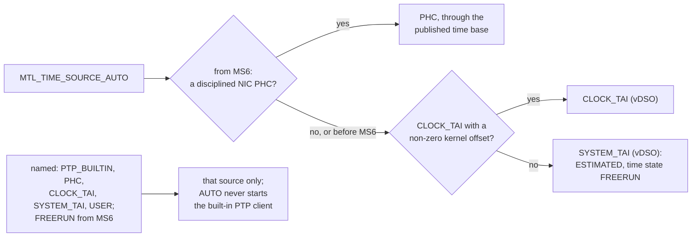
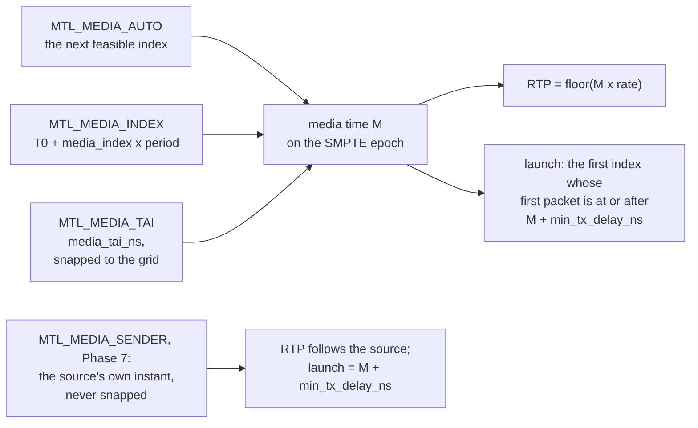
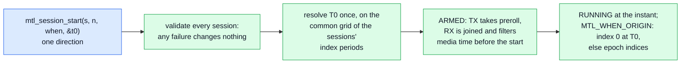
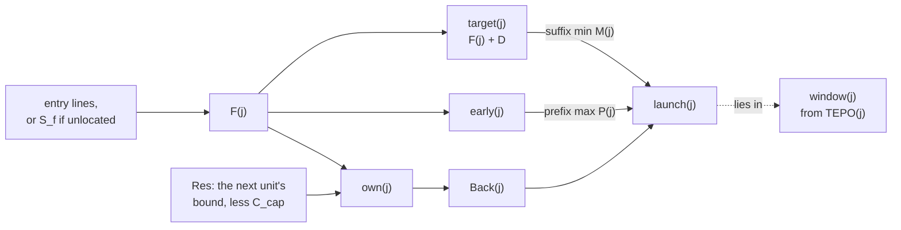
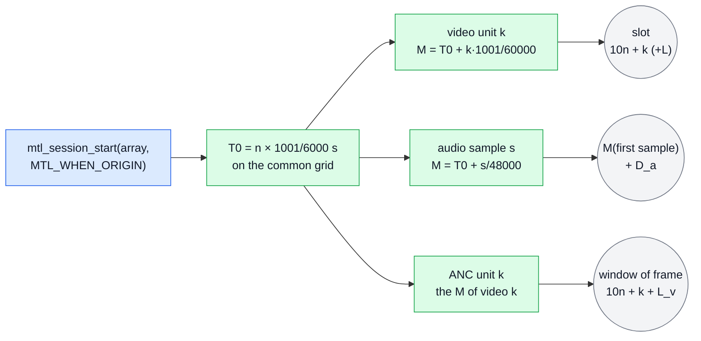

# Timing: media time, launch, sync and clocks

| | |
|---|---|
| Status | Normative. Nothing is implemented. The headers in [sketch/include/mtl/experimental/](sketch/include/mtl/experimental/) win over this text |
| Date | 2026-10-02 |

This document is the timing contract of the unified API: what a time is, how a unit's media time and RTP timestamp are fixed, when its packets leave, how several essences stay in sync, and what a receiver can rely on. Names are those of `mtl.h`, `mtl_sync.h`, `mtl_options.h`, `mtl_observe.h` and `mtl_reasons.h`.
The standards facts behind the rules are in [standards.md](standards.md), today's code in
[legacy-internals.md](legacy-internals.md).
`sc.*` and essence members (`video.sender_type` = `sc.video.sender_type`) are typed config fields; other knobs are option keys (`tx.late_policy` = `MTL_OPT_LATE_POLICY`), absent meaning the default given here; `info.*`,
`time.*`, `tx.*` counters and `rx.*` counters are stats (`mtl_observe.h`). Three sentences carry the design:

> **RTP describes the content. Pacing chooses when packets leave. Receive time is transmit time plus the network.**

Three questions this document answers: two times per unit (media time and launch time, §4–§5); A/V from one file without half-frame error (§10); automatic sync of several streams (§7, §10).

## 1. Principles

Every unit has two times: its media time, which fixes its RTP timestamp, and its launch time, when
its packets leave (§4, §5). The user's picture of the two is
[concepts.md §7.1](concepts.md#71-two-times-not-one); the principles below are the rules behind it.

| # | Principle | Standards anchor | Today in MTL |
|---|---|---|---|
| T1 | One epoch, 1970-01-01 00:00:00 TAI; RTP clock offset zero: `rtp = floor(t × rate) mod 2^32` | ST 2059-1 §6.1, ST 2110-10 §7.3 | default time source is `CLOCK_REALTIME` (UTC) labelled TAI (`dev/mt_dev.c:2288`) |
| T2 | The RTP timestamp is the unit's sampling (or intended) instant; for playback video `N × TFRAME` | ST 2110-10 §7.5, §7.6.3 | default video RTP is the packet-0 TX cursor `E(N) + TRO − VRX0·TRS`, +54.4…+55.7 ticks after `N × TFRAME` at 1080p59.94 (VRX0 9…5; note 1) |
| T3 | The transmit grid is on the PTP timescale: `TVD = N × TFRAME + TROFFSET`, TROFFSET constant | ST 2110-21 §6.2 | EXACT user pacing accepts any per-frame target |
| T4 | Exact arithmetic; truncate | ST 2059-1 §5.1, ST 2110-10 §7.6.1 | `double frame_time` (≈ +66 ns at today's TAI for 1001 rates) and round-to-nearest (`st_fmt.c:986-993`) |
| T5 | Regular increments win: a late unit is dropped (a gap), repeated, or explicitly re-anchored, never silently slid | ST 2110-10 §7.6.1, §7.7.1 | a late frame goes out in the current epoch with no counter |
| T6 | Essences of one programme agree by TAI instant, not by buffer boundaries | ST 2110-10 §7.1, ST 2110-40 §5.4 | default ST20 and ST40 RTP differ for the same frame |
| T7 | No packet of a unit leaves before the unit's media time | video latency VL = first packet − RTP time (RP 2110-25 §4.8.5) ≥ 0, JT-NM Tested's "not in the future" | not guaranteed for wide senders with large pre-fill |

Note 1: start time `st_tx_video_session.c:63-70`, cursor `:724-730`, RTP from the cursor `:793`; VRX0 per pacing `:566-579`, VRX_FULL = 9 from `:3365`. 619.1 µs ≈ 55.7 ticks is the RL point (VRX0 = 5); TRO alone (57.39 ticks) is not the offset.

Decisions behind them: D-09 (media time and launch separate, one RTP rule), D-39 (no source kinds: `min_tx_delay_ns` is the one knob; the launch delay is reported, not configured), D-10 (default video media time is the frame epoch), D-11 (exact rationals), D-24 (wire-visible engine changes are opt-in on the legacy API and on in the unified API). See [decisions.md](decisions.md).

## 2. Clocks and the time base

### 2.1 What a time is

`mtl.h` rule R5: every time is `int64_t` ns since 1970-01-01 TAI on the **instance clock**, valid only when its flag says so.

- TAI while the time base is locked; flagged ESTIMATED when it is not (a free-running clock, the system clock). An RX value on a sender's own clock is flagged `MTL_UNITF_SENDER_TIME` (Phase 7, later).
- `mtl_time_now(mt, &tai_ns, NULL, NULL)` is DP and wait-free (the last two, when not NULL, receive CLOCK_MONOTONIC and CLOCK_REALTIME of the same instant); it returns `MTL_TIMEF_VALID`, `MTL_TIMEF_ESTIMATED`, `MTL_TIMEF_HOLDOVER`, `MTL_TIMEF_ARB_TIMESCALE` and `MTL_TIMEF_UTC` as a mask (≥ 0).
- Zero is never a sentinel. Validity is a flag: `MTL_UNITF_INDEX_VALID`, `MTL_UNITF_TAI_VALID` on units; `MTL_TXR_MEDIA_VALID`, `MTL_TXR_MARGIN_VALID`, `MTL_TXR_SENT_VALID`, `MTL_TXR_SENT_HW`, `MTL_TXR_ESTIMATED` on results; `MTL_TXF_*` and `MTL_RXF_*` in the full records.
- There is no TSC clock in the API. TSC is an internal detail of the published time base and differs between sockets.

### 2.2 Time sources

`mtl_instance_params.time_source`, enum `mtl_time_source`. The picture shows how AUTO picks its
source at open and that a named source is used alone; the table below gives each source.



| Source | What it reads | Lock state | Notes |
|---|---|---|---|
| `AUTO` (0) | `CLOCK_TAI` when the kernel TAI offset is set, else `SYSTEM_TAI` (ESTIMATED), both vDSO reads; from MS6 a disciplined NIC PHC first, through the published time base (§2.4) | from the source | never starts the built-in PTP client (D-85). AUTO chooses **once, at open**. Phase 7: `FREERUN` replaces `SYSTEM_TAI` as the last step, and AUTO is re-evaluated while running (§13) |
| `PTP_BUILTIN` | MTL's own PTP client | MTL's servo | only when named. On a PF MTL owns: that port's PHC. On a VF (no timesync): software mode as today (`ptp->no_timesync`, `mt_ptp.c:1390-1394`), MTL's own time base only, never the VF's PHC. `CLOCK_NOT_OWNED` only for a request to steer a PHC MTL does not own. Fix the sticky `locked` (`mt_ptp.c:540-552`). **Not an ST 2059-2 slave** (below) |
| `PHC` | the NIC PHC, disciplined by `ptp4l`/`phc2sys` | `time.phc_trust`, or the app via `mtl_time_set_reference` | how Rivermax works; read only, off the tasklet. A PHC read is one syscall, so it comes in MS6 with the published time base (E9) |
| `CLOCK_TAI` | the kernel TAI clock | from the daemon | **validated**: `CLOCK_TAI = CLOCK_REALTIME + adjtimex().tai`, and the kernel offset is 0 unless a daemon sets it. Rejected when the offset is 0 (otherwise it is UTC, and the 37 s error returns) |
| `SYSTEM_TAI` | `CLOCK_REALTIME` + UTC offset | none: state FREERUN, ESTIMATED | the offset from PTP announce `currentUtcOffset` when known, else configured; follows NTP steps; a leap second posts `TIME_STEP`; an NTP leap smear (±11.6 ppm for 24 h) is a rate error. A stale offset after a leap second: below |
| `USER` | `mtl_time_set_reference(mt, 0, &ref)` with `MTL_TIMEREF_USER_PAIR`: one (`user_tai_ns`, `user_monotonic_ns`) pair per call, from an app thread | app-declared | no per-read callback on the tasklet |
| `FREERUN` | seeded once from the system clock, never stepped | FREERUN (ESTIMATED) | IPMX internal clock without PTP: MS6 with E9, when its name leaves `MTL_LATER` (§13) |
| test clock | `mtl_debug_inject(MTL_OBJ_OF_INSTANCE(mt), MTL_FAULT_TEST_CLOCK, &p)` (`p.base_tai_ns`, `p.rate`; rate {0, 0}: only `MTL_FAULT_CLOCK_ADVANCE` by `p.step_ns` moves it) (`mtl_debug.h`) | locked | debug builds only; the null backend and unit tests (§16) |

- **`PTP_BUILTIN` is not an ST 2059-2 slave**
  ([standards.md §13.3](standards.md#133-mtls-built-in-ptp-client-against-st-2059-2)): no BMCA
  (the first Announce heard is the master for the life of the instance), no announce timeout, no
  domain filter, no one-step masters, Ethernet layer 2 besides UDP/IPv4 (outside the profile), the
  UTC offset frozen at the first Announce. A plant that needs the profile uses `PHC` with ptp4l.
- **`SYSTEM_TAI` after a leap second.** At a leap second `CLOCK_REALTIME` steps and the UTC offset
  changes by one: an offset that is not re-read from a later Announce (today's client reads it once,
  `mt_ptp.c:1038`) or reconfigured leaves SYSTEM_TAI 1 s off TAI from then on.

**The clock in MS1.** An instance the unified API opens installs its clock as the engine's time
function (`ptp_get_time_fn`), so the launch decision's index math (§6.8) and the engine's pacing read
one clock; today's default is `CLOCK_REALTIME`, 37 s behind TAI ([engine.md](engine.md) §2.12).
With AUTO that clock is `CLOCK_TAI` when it is valid, else `SYSTEM_TAI`; `PTP_BUILTIN` keeps
today's PTP time function. A wrapper keeps the legacy time function; `mtl_time_now` reads its
default and TSC clocks directly in MS1 and the others through a snapshot from MS2a
([contract.md](contract.md) §2.8).

MTL adjusts a clock only with `PTP_BUILTIN`: the PHC of a port it owns (a PF), or, on a VF, its own software time base; never `CLOCK_REALTIME`, never a clock a node daemon disciplines. The built-in phc2sys (`time.phc2sys`) steers the host's `CLOCK_REALTIME`; it is never used in a pod and restores the frequency at close. Instance time options: `time.ptp_domain`, `time.ptp_pi`, `time.ptp_unicast`,
`time.ptp_source_tsc`, `time.ptp_pi_kp`, `time.ptp_pi_ki`, `time.ptp_announce_timeout`, `time.phc_trust` (keys 2200–2230); `time.fallback` and `time.freerun_slew_ppm` are Phase 7, under `MTL_LATER`.

### 2.3 Time state, events and the reference

- `enum mtl_time_state`: `FREERUN`, `ACQUIRING`, `LOCKED`, `HOLDOVER`, `LOST`. LOCKED exists only for `PTP_BUILTIN`, `PHC`, `CLOCK_TAI` and `USER`; FREERUN is the state of the `SYSTEM_TAI` source, of the `FREERUN` source (MS6), and of AUTO after a fall back to free run (Phase 7).
- Events (MS3, the instance's, read with `mtl_instance_read_events`, `mtl_events.h`):
  `MTL_EVENT_TIME_STATE` (port, state, offset), `MTL_EVENT_TIME_STEP` (step ns),
  `MTL_EVENT_GRANDMASTER` (new and old ID). Stats, port scope: `time.source`, `time.state`,
  `time.offset_ns`, `time.path_delay_ns`, `time.last_sync_age_ns`, `time.grandmaster_id`,
  `time.utc_offset_s`, `time.step_count`, `time.disciplined_by`, `time.error_ns`, `time.gm_*`.
- Health: `mtl_health.time_state` and `time_error_ns`; `MTL_HEALTH_TIME_UNLOCKED` is set for ACQUIRING and LOST only, so FREERUN and HOLDOVER count as ready.
- `mtl_time_set_reference(mt, port, &ref)`: what the instance cannot see when a node daemon disciplines its clock (grandmaster ID, domain, traceable, clock class and accuracy, `locked`). The app reads it with `pmc` or from the PTP operator. With `time.phc_trust` detect, `locked = 0` is the only way MTL learns the node lost its grandmaster, so pods need the call; it ships in MS2,
  not with IPMX in Phase 7.
- **ARB timescale.** A grandmaster with `clockClass` 220 or 228 or `timeSource` F0h runs an ARB
  timescale (ST 2059-2 §5.5.4 Table 1): its times are common to the grandmaster's PTP domain but are
  not TAI. The instance learns it from the grandmaster's clock class and time source (the built-in
  client from the Announce, a node daemon's grandmaster through `mtl_time_set_reference`,
  `clock_class` and `time_source`) and then returns `MTL_TIMEF_ARB_TIMESCALE` with its times
  (`mtl.h` R5) and reads 1 in `time.arb_timescale`: media times and RTP align with every device
  locked to that grandmaster, not with TAI or another domain.
- **Coming steps.** `masterLockingStatus` 2 (cold locking) in the grandmaster's SM TLV (ST 2059-2
  §5.13) is the only standard warning that a step of the grandmaster's time can follow; PTP time
  itself never steps for a leap second or daylight saving. The built-in client does not parse the
  SM TLV; with a node daemon the application passes the value as `locking_status` of
  `mtl_time_set_reference`, reported as `time.gm_locking_status`.

### 2.4 The published time base

The published time base is engine change E9 (MS6). Tasklets never read a clock. Every source feeds one seqlocked record per instance and **per CPU socket**, refreshed off the tasklet (PTP servo, admin thread, or the app for `USER`). The record has one
writer:

| Field | Meaning |
|---|---|
| `seq` | the seqlock sequence |
| `tsc_base` | the TSC value the record is based on |
| `tai_base_ns` | TAI at `tsc_base` |
| `ratio` | TAI ns per TSC tick, 32.32 fixed point |
| `monotonic_base_ns`, `realtime_base_ns` | CLOCK_MONOTONIC and CLOCK_REALTIME at `tsc_base` |
| `state` | the time state (§2.3) |
| `accuracy_ns` | the accuracy of the record |

A reader is wait-free: `tai = tai_base_ns + (tsc − tsc_base) × ratio`.

| Property | Rule |
|---|---|
| Refresh | at least every 100 ms, never on a tasklet |
| Ratio | least-squares servo over the last N (default 16) PHC/TSC cross-timestamps, each a PHC read bracketed by two TSC reads, rejected when the bracket is too wide. Today `impl->tsc_hz` is a one-shot calibration; 1 ppm is 1 µs per second |
| Publication | **slewed, never stepped**: a new record starts on the previous line at the switch instant, with a ratio that meets the new estimate within one refresh period. The only steps are declared ones (`TIME_STEP`, §12) |
| Per socket | TSC is not guaranteed synchronised across sockets; each record is built from cross-timestamps taken on that socket |
| Two NICs | each leg's PHC offset is compensated into the one instance timescale; media time and every leg's launch use it. Today pacing reads port P for every leg (`st_tx_video_session.c:695`, `st_tx_audio_session.c:265-266`) |

The timing rules rely on two properties of the record: every tasklet on every socket computes the same TAI for the same instant, within the servo error; and a refresh never moves a scheduled launch backwards by more than the slew bound.

This removes from the hot path the user `ptp_get_time_fn` callback, the `rte_eth_timesync_read_time` PMD reads, and `clock_gettime` on `/dev/ptpN` (no vDSO: a syscall plus a PCIe read). The accuracy against a direct PHC read is not assumed: spike S7 measures it, and its bound becomes a performance gate (§16).

### 2.5 Clock conversion

- `mtl_time_convert(mt, in_ns, from_clock, to_clock, &out_ns)` (`mtl_sync.h`) is a `static inline` over one `mtl_time_now` sample of the three clocks: `out = in − now(from) + now(to)`. It maps `MTL_CLOCK_TAI`, `MTL_CLOCK_MONOTONIC`, `MTL_CLOCK_REALTIME` and returns the `MTL_TIMEF_*` flags of that sample; exact for clocks that run at one rate, and good to the drift between them over `in − now`.
- `mtl_time_now(mt, &tai, &mono, &real)` returns one coherent triple (the last two may be NULL). A framework with its own clock (GStreamer audio ring buffer, `GstNetClientClock`, an app media clock) samples that clock just before and after the call and fits `X ↔ TAI` over a few samples.
- `mtl_media_ticks(tai_ns, clock_rate)` = `floor(M × rate) mod 2^32`; `mtl_media_tai(near_tai_ns, ticks, clock_rate)` unwraps ticks to the instant nearest `near_tai_ns`. Both AS and exact.

### 2.6 Time in a pod

In a pod, `AUTO` reads `CLOCK_TAI` when the kernel TAI offset is set, else `SYSTEM_TAI`, ESTIMATED;
from MS6 it reads the VF's PHC first (read only) when a node daemon disciplines it, and from Phase 7
its last step is `FREERUN`. It chooses once at open. `PHC`, `CLOCK_TAI` and `USER` are read only.
`PTP_BUILTIN` on a VF runs MTL's client in software mode, as today, and disciplines only MTL's own
time base, never the VF's PHC;
RxTxApp `--ptp` and the `ptp` group of the nightly pytest run this way on VFs. "Disciplined" needs a
signal the pod can see, `time.phc_trust`: absent or detect = the PHC agrees with `CLOCK_TAI` within a bound at start (the bound is a spike; agreement cannot tell a locked PHC from a node in holdover); `YES` = trust the node; `NO` = never use the PHC. No source needs `CAP_SYS_TIME` or write access to `/dev/ptp*`. Details: [deployment.md](deployment.md).

## 3. The epoch and T0

### 3.1 The epoch timeline

Every session runs on the SMPTE epoch. A unit index of any stream maps to an exact TAI instant:

| Symbol | Formula | Meaning |
|---|---|---|
| M(k) | `T0 + k × P` | the media time of index k |
| P | — | the session's index period (exact rational seconds, §3.2) |
| T0 | 0 (1970-01-01 TAI), or the start's T0 | the start's T0 only for the sessions of a start with `MTL_WHEN_ORIGIN` |

- On the epoch a video index is the frame (or field) number since 1970, an audio index the sample number. Two processes compute the same index for the same instant, so sessions in different processes align without sharing anything (§10.4).
- `MTL_WHEN_ORIGIN` in `struct mtl_when.flags` (TX starts only; `-MTL_EINVAL` on RX and with `MTL_AT_INDEX`) makes media index 0 of every session of that start the start's T0, so a file's frame and sample counts are media indices as they are. It renumbers the indices only: T0 is on the epoch grid of every member (§3.3), so every media time and RTP timestamp is the one the epoch gives.
- A step of the time base keeps every media time: T0 never moves (§12).
- Created timelines (an anchor object with its own T0, shared by name, with a step policy) are reserved for later (`MTL_LATER`); they are not in v1.

### 3.2 Index periods

| Essence | Unit | `media_index` counts | P |
|---|---|---|---|
| video, cvideo progressive | frame | frames | TFRAME |
| video, cvideo interlaced | field | fields; even = first field | TFIELD = TFRAME/2 |
| video PsF (`MTL_PSF`) | frame (two segments) | frames | TFRAME |
| audio | the samples of a submission | its **first sample** | 1/Fs |
| ANC, grid fastmeta | the ANC (or item group) for one video frame or field | the associated video index | the video's |
| free-running fastmeta | one unit | own units | 1/`fastmeta.video.fps` |
| generic RTP | unit of `rtp.unit` | units | 1/unit rate |

The rate rules (zero terms, reduction, the TR-10-2 §10 limits, `FIELD_RATE`, the engine range of
1–120 frames per second and which milestone takes which rate) are in [contract.md](contract.md)
§3.3.

### 3.3 The start formula

`mtl_session_start(s, n, when, &t0)` resolves T0 once for the whole array:

| Symbol | Formula | Meaning |
|---|---|---|
| lead | max over the started sessions of `max(0, min_submit_lead_ns)` | the submit lead (§6.1) |
| A | `now + lead + preroll_ns` | the earliest feasible start |
| W | −∞ (`MTL_NOW`), t (`MTL_AT_TAI t`), k·P_0 (`MTL_AT_INDEX k`) | the requested start; for `MTL_AT_INDEX`, k is an epoch index of s[0], period P_0 |
| G | — | the common grid of the started sessions (§3.4) |
| T0 | `ceil( max(A, W) / G ) · G` | the resolved start |

- An `MTL_AT_TAI` or `MTL_AT_INDEX` instant W below A is `-MTL_ERANGE`, `START_IN_PAST`; it never silently drops the start.
- **T0 is on the grid by construction**, so `T0·R` is an integer for every rate kept in G (§3.4)
  and T0 is a whole number of frames for every video, ANC and grid fastmeta member. Each session's
  first unit is the one at T0: index T0/P on the epoch, or 0 with `MTL_WHEN_ORIGIN`. The core keeps
  T0 as each member's epoch index, never as ns; `t0` receives it floored to ns. P_0 is the index
  period of the first video, ANC or grid-fastmeta member, else of the first kept audio member; only
  kept members have an integer T0 index.
- **Interlaced members contribute TFRAME to G**, so T0 is always a first-field instant: even indices are first fields and parity never flips.
- `t0` (may be NULL) receives T0. A single start (n = 1) uses the same formula with the session's own grid.
- Milestones: n = 1 with `MTL_NOW` in MS1; `MTL_AT_TAI` and `MTL_AT_INDEX` in MS3; start arrays and `MTL_WHEN_ORIGIN` in MS6 ([contract.md](contract.md) §4.4).

### 3.4 The common grid

G is formed in this order: the frame grids of every video, ANC and grid-fastmeta member (an
integer number of **frames**; interlaced: frames, not fields); then the 90 kHz clock, kept only
if G stays at or below the 1 s cap; then each audio rate in the order of `s[]`, kept only if G
stays at or below the cap. Excluded audio rates are floor-aligned (`floor(T0 × Fs)`) and their
sub-sample phase is reported (< 1 sample, 22.7 µs at 44.1 kHz). An excluded 90 kHz clock changes
no RTP value: every unit's RTP is `floor(E × P × 90000)` of its epoch index E, as for any start
(§4.2). Free-running fastmeta is excluded. If the frame grids alone exceed 1 s, the start fails
with `-MTL_EINVAL` (`INVALID_ARGUMENT`, `detail` naming the rates); a single session's frame grid
never does, because its frame rate is at least 1 per second ([contract.md](contract.md) §3.3).

| Members | G | Frames per G | Note |
|---|---|---|---|
| 25p or 50p (+ 48/96 kHz) | 1/25 s, 1/50 s | 1 | 3600 / 1800 ticks; 1920 / 960 samples at 48 kHz. 1080i50 + 48 kHz: 1/25 s |
| 24p (+ 48 kHz) | 1/24 s | 1 | 3750 ticks; 2000 samples |
| 30p, 60p (+ 48 kHz) | 1/30 s, 1/60 s | 1 | 3000 / 1500 ticks; 1600 / 800 samples |
| 24p + 30p | 1/6 s | 4 / 5 | 15000 ticks |
| 29.97, 59.94, 23.976, 119.88 (+ 48/96 kHz); 1080i59.94 | **1001/6000 s = 166.83 ms** | 5, 10, 4, 20 | 15015 ticks; 8008 samples (16016 at 96 kHz) |
| 1001 family + 44.1 kHz only | 44.1 kHz would need 1001/300 s = 3.337 s: excluded; G = 1001/30000 s (29.97/59.94/119.88p), 1001/6000 s (23.976p) | 1, 2, 4 (23.976p: 4) | 3003 ticks (15015 at 23.976p); 735.735 samples per frame at 59.94 |
| 1001 family + 48 + 44.1 kHz | 1001/6000 s (set by 48 kHz); 44.1 kHz excluded | 5, 10, 4, 20 | 7357.35 samples per G at 44.1 kHz |
| 24p + 44.1 kHz | 1/12 s | 2 | 7500 ticks; 3675 samples |
| 1199/20 (59.95, an IPMX approximation) | 20/1199 s: 90 kHz would need 20 s, excluded | 1 | `floor(E × 1800000/1199)` per frame |
| audio only (48 kHz) | 1/6000 s | — | k counts samples |
| 25p + 59.94p | 1001/25 s = 40.04 s: above the cap, `-MTL_EINVAL` | — | |
| 50p + 59.94p | 1001/50 s = 20.02 s: above the cap | — | |

Per-frame numbers at 1001 rates: 59.94 = 1501.5 ticks, 800.8 samples; 29.97 = 3003 ticks, 1601.6 samples; 23.976 = 3753.75 ticks, 2002 samples; 119.88 = 750.75 ticks, 400.4 samples. Ticks and samples are both integers after 10 (59.94), 5 (29.97), 4 (23.976) and 20 (119.88) frames, which is the G row above. Other exact values: at 1080p59.94 the read of an L = 0 unit ends at ≈ M + 16.654 ms;
TROFFSET − VRX0·TRS = 604.31 µs at VRX0 = 9 (the low end of 604–619 µs, §6.1); TAI ns passes 2^61 in 2043.1 and 2^63 in 2262.3 (§3.5).

### 3.5 Exact arithmetic

- Integers only, 64-bit. Every product is split by quotient and remainder so that every
  intermediate stays below 2^63 for index rates whose reduced num × den ≤ 2^33 and which do not
  exceed 2^29 per second (every raster rate, doubled for fields; every sample rate), media clocks
  up to 2^29 Hz (27 MHz included) and times in [0, 2^63) ns (until 2262). No 128-bit type is
  needed. One implementation, `lib/src/st2110/core/st_rate.h`.

  Index rate N/D in lowest terms, media clock R, Q = D × 10^9 (< 2^40); "split" means k = q·N + r
  (0 ≤ r < N) or t = q·Q + r:

  | # | Quantity | Formula with split | Largest intermediate |
  |---|---|---|---|
  | A | unit containing t: floor(t·N/Q) | q·N + floor(r·N/Q); ceil: q·N + ceil(r·N/Q) | r·N < 10^9·N·D ≤ 10^9·2^33 < 2^63; result k < 2^63·2^29/10^9 = 2^62.103, so < 2^63 |
  | B | ns of unit k: floor(k·D·10^9/N) | q·D·10^9 + floor(r·D·10^9/N) | r·D·10^9 < N·D·10^9 < 2^63 |
  | C | RTP of unit k: floor(k·D·R/N) mod 2^32 | (q·(D·R) + floor(r·D·R/N)) mod 2^32, the first product wrapping mod 2^64 | r·D·R < N·D·R ≤ 2^33·2^29 = 2^62 |
  | D | ticks of t: floor(t·R/10^9) mod 2^32 | (q·R + floor(r·R/10^9)) mod 2^32 | r·R < 10^9·2^29 < 2^59 |
  | E | RX inverse: largest k with floor(k·D·R/N) ≤ u | u + 1 = q·(D·R) + r: q·N + ceil(r·N/(D·R)) − 1 | r·N < N·D·R ≤ 2^62; u < 2^63·2^29/10^9 = 2^62.103, so u + 1 < 2^63 |
  | F | ns of unwrapped ticks u: floor(u·10^9/R) | q·10^9 + floor(r·10^9/R) | r·10^9 < 2^59 |

  Proof of each row: the split term q·N (or q·D·10^9, q·D·R, q·R) is an integer, so
  floor(q·X + y) = q·X + floor(y) and likewise for ceil; the remainder product is bounded in the
  last column; the quotient product is at most the final value, which lies in [0, 2^63) by the
  domain (A, B, E, F) or is wanted modulo 2^32 only, where wrapping multiplication mod 2^64 keeps
  the low 32 bits exact (C, D). E: floor(k·T) ≤ u ⟺ k·T < u + 1 ⟺ k·D·R < (u + 1)·N, so the
  largest such k is ceil((u + 1)·N/(D·R)) − 1. Row A's result k = t·N/(D·10^9) is below 2^63 only
  when N/D < 10^9 per second; the 2^29 bound gives k < 2^63 · 2^29 / 10^9 = 2^62.103 < 2^63; the
  same bound holds for unwrapped ticks u at R ≤ 2^29 Hz. Every other intermediate is at most 2^62
  (rows C and E) or below 2^60. The domain is tested by division, never by a product, because
  num·den or 2^29·den can wrap in `uint64_t` (2^40 × 2^30 → 0):

  ```c
  num != 0 && den != 0 && den <= (1ull << 33) / num                 /* num x den <= 2^33 */
    && (num / den < (1ull << 29) || (num / den == (1ull << 29) && num % den == 0))  /* <= 2^29 */
  ```

  `mtl_epoch_index_at` (`mtl_sync.h`) uses this test.
- RTP is `floor(M × R)`; reported ns values are `floor(M × 1e9)`; only final launch instants are rounded to ns.
- Every unit is computed from the epoch (or from T0 under `MTL_WHEN_ORIGIN`), never by adding a rounded period.
- One implementation (engine change E2) serves the engines, the core, the `mtl_sync.h` helpers and the RX inverse (§11.2), so they cannot disagree.

### 3.6 Interlaced and PsF

- **Interlaced** (`MTL_INTERLACED`): the index counts fields at twice the frame rate (60000/1001 fields/s for 1080i59.94), while `raster.fps` is the **frame** rate. Any launch delay is whole frames. Legacy `ops.fps` for interlaced sessions is the field rate (`frame_time` is a field period, `st_tx_video_session.c:499-518`; the ST 2110-22 box header halves it back,
  `:865-866`), so [migration.md](migration.md) halves it with `mtl_raster_from_legacy()`:
  `ST_FPS_P59_94` + interlaced is a 30000/1001 raster, and an interlaced or PsF raster above 30
  frames per second is `-MTL_EINVAL` (`FIELD_RATE`, [contract.md](contract.md) §3.3).
- **PsF** (`MTL_PSF`) is paced as interlaced: two segments, the second read from
  `TVD + TFRAME/2 + TLINE/2` (ST 2110-21 §6.3.3), with the interlaced TRODEFAULT, 22/1125 × TFRAME
  at 1080PsF, not the progressive 43/1125 (ST 2110-21 Table 1). It has one unit, one index and one
  RTP per frame, because both segments carry the same RTP (ST 2110-10 §7.6.1). A PsF unit's layout
  has `height` rows; the SRD F bit marks the second segment and row numbers restart at 0 in each
  segment (ST 2110-20 §6.1.4). **Marker**: ST 2110-20 §6.1.2 names only the progressive frame and
  the interlaced field, so MTL sets the marker on the last packet of the frame (the end of the
  second segment), where the unit and its RTP timestamp end, and never at the end of the first
  segment.
- **PsF ANC** has one unit per frame and at least one RTP packet in each segment's window (ST
  2110-40 §5.5), all with the frame's RTP: when no ANC packet of the unit falls in the second
  segment, the binding also sends an empty packet (`ANC_Count` = 0, marker set) of the same
  timestamp in the second segment's window, `TSST = TFST + TSFO` (§9.2), and likewise in the first
  segment's window when the unit has ANC only for the second. The entries from the first exact
  line in field 2's range on are the second segment. The F bits follow the segment: 10 for the
  first segment's RTP packets, 11 for the second's (RFC 8331 §2.1, ST 2110-40 §5.5). The marker is
  on the frame's last RTP packet and on every empty one (ST 2110-40 §5.5 prevails over RFC 8331 §2
  by -40 §5.2.1). RX ends a PsF unit as [contract.md](contract.md) §5.7 says: at a marker on F =
  11, or on F = 00 when no packet of its timestamp follows within TSFO; never on F = 10.

## 4. Media time on TX

### 4.1 Media modes

`sc.media_mode` is a session property, so a session cannot mix modes and a forgotten flag cannot turn a timestamp into AUTO.
The picture shows what each mode gives: the first three set a media time M on the SMPTE epoch, from
which RTP and the launch follow (§4.2, §5.2); the fourth, Phase 7, follows the source.



With `min_tx_delay_ns` 0 the launch index is the index of M; with one frame period plus the pick-up
lead it is the next index (§5.2).

| `media_mode` | Per unit the app sets | For |
|---|---|---|
| `MTL_MEDIA_AUTO` (0) | nothing; MTL stamps the unit with the slot it gets | live generators, simple apps |
| `MTL_MEDIA_INDEX` (MS3) | `unit.media_index` = unit k on the epoch, or counted from T0 under `MTL_WHEN_ORIGIN` (MS6) | playout, file sources, one process owning every essence: **exact** |
| `MTL_MEDIA_TAI` | `unit.media_tai_ns` = the instant the unit represents, snapped (§4.3) | capture, framework sinks, processors |
| `MTL_MEDIA_SENDER` | `unit.media_tai_ns` = the source's own sampling instant, never snapped | async sources (IPMX `mediaclk:sender`): **Phase 7**, under `MTL_LATER` (§13) |

- In AUTO both media fields are zero, else `-MTL_EINVAL`; INDEX reads only `media_index` and TAI only `media_tai_ns`, so a received unit, which carries both, is a valid template for either ([contract.md](contract.md) §5.1).
  In the config, zero is the library default of every mode field (`media_mode`, `tsmode`); a unit's
  media fields have none: `media_index` 0 is a real index (T0 under `MTL_WHEN_ORIGIN`), and an AUTO
  session's units carry both fields 0. Launch selection per unit: `MTL_SUBMIT_NOT_BEFORE` or
  `MTL_SUBMIT_EXACT` with `unit.launch_tai_ns` (§5.4); they exclude each other, and EXACT needs a
  session created with `MTL_SESSION_EXACT_LAUNCH`.

### 4.2 Derived RTP: exact, and its exceptions

| Unit | RTP | Note |
|---|---|---|
| any unit | `RTP(unit) = floor(M(unit) × R) mod 2^32` | R = 90000 (video, cvideo, ANC, fastmeta); Fs (audio); `rtp.clock_rate` (generic RTP) |
| progressive unit, or first field (even E) | `RTP = floor(E × P × 90000)` | `= T0·90000 + floor(k × ticks)` when 90 kHz is in G |
| second field (odd E) | `RTP = RTP(E − 1) + floor(TFRAME × 90000 / 2)` | |
| audio packet p | `RTP = floor(T0 × Fs) + p × S` | p since T0; after a re-phasing DISCONTINUITY at index d: `floor(T0 × Fs) + d + p × S` |
| ANC, grid fastmeta, unit k | `RTP(k) = RTP_v(k)` | |

ST 2110-10 §7.6.1 fixes the second field against the first: its RTP is the first field's plus half
the frame period, truncated, `floor(TFRAME × 90000 / 2)`, whatever the first field's phase. The
first field follows `floor(M × R)`. Where TFRAME × 90000 is an integer and the first field is on the
grid, the second-field rule equals `floor(M(2m+1) × 90000)`, which is what MTL does today (each
field from its own epoch, an even slot is the first field, `st_tx_video_session.c:706-711`). With T0
on the grid:

| Format | First → second field | Why |
|---|---|---|
| 1080i59.94 (TFRAME = 3003 ticks) | always +1501 (then +1502 to the next frame) | TFRAME·90000 is an integer |
| 1080i50 | always +1800 | |
| 1080i60 | always +1500 | |

No interlaced format of a format standard has a non-integer TFRAME × 90000. Of the interlaced
rates MTL accepts (≤ 30 frames per second), it is non-integer exactly when 90000 × den / num is,
for example 24000/1001 (3753.75 ticks) and the legacy-halved 12000/1001 (7507.5); only there do
the two readings differ, and there the RX inverse (§11.2) takes a second field's index from its
first field. The default media time is the grid (`N × TFRAME`), which removes the ST20/ST40
disagreement (T2, T6).

**Exceptions to `RTP = floor(M × R)`:**

| Exception | Rule | When |
|---|---|---|
| `MTL_SUBMIT_RTP_TS` + `unit.rtp` | the app's RTP, for a verbatim copy of a non-compliant input (rules below) | MS3 (needs E1) |
| `tx.rtp_trim_ns` | AUTO and INDEX: `RTP = floor((M + trim) × R)` with the launch unchanged, the legacy `rtp_timestamp_delta_us` (§4.5) | MS3 |
| packet units (`MTL_UNIT_PACKETS`) | the app writes the RTP header; `packet.set_fields` 0 = verbatim. `MTL_PKT_TIME_FROM_RTP` takes the unit's time from its first packet's RTP | MS5 |
| `MTL_MEDIA_SENDER` | `RTP = RTP0 + floor(k × period × rate)`, §13 | Phase 7 (`MTL_LATER`) |
| legacy API | default ST20 RTP from the TX cursor; round-to-nearest; `rtp_timestamp_delta_us` (§14) | legacy |

`MTL_SUBMIT_RTP_TS` rules:

- not with AUTO: `-MTL_EINVAL`, reason `RTP_TS_AUTO`. Under AUTO, RX-then-forward jitter makes L alternate and the RTP offset toggle (≈ −3003 / −4504 ticks at 1080p59.94), so the slot must come from an INDEX or TAI media time;
- MTL validates regular increments and reports violations;
- audio: the value is the first sample's RTP, later packets `+S`; an override off the session's packet grid (`(rtp − grid RTP) mod S ≠ 0`) is treated as a DISCONTINUITY and re-phased (§8);
- the recommended way for a time-preserving processor is still *derived* RTP from the input's media time (§10.5).

### 4.3 Snapping TAI-mode times

A TAI-mode `media_tai_ns` (after `media_time_offset_ns`, §4.5) is snapped to a slot of the session's grid. `tx.snap_mode`:

| Mode | Rule | Default for |
|---|---|---|
| `MTL_SNAP_NEAREST` | each unit snaps to the nearest index `N·P` (phase 0), with hysteresis around the expected index | TAI mode (AUTO and INDEX do not snap) |

- **Hysteresis.** The expected slot is `prev + 1`. A value within `P/2 + snap_tolerance` of it takes it, so jitter around the half period never flips between N and N+1.
- **Interlaced.** Units alternate first and second field in submission order from the start, as
  in AUTO (§6.8); a `MTL_SUBMIT_DISCONTINUITY` starts again with a first field. A unit of parity
  p (0 first, 1 second) snaps on the frame grid: f is the frame nearest `M − p × TFRAME/2`, with
  hysteresis `TFRAME/2 + snap_tolerance` around the expected frame (the last first field's
  frame + 1 for a first field, the same frame for a second field), and the unit's index is
  `2f + p`.
  First fields land on even indices and dominance never inverts. Field dominance is the
  application's: TX parity comes from submission order.
- **On the grid.** `snap_error_ns` is the index's media time floored to ns minus the submitted
  time; `|snap_error_ns| ≤ 1` is on the grid (ns rounding of a rational instant) with times exact
  to the ns: no `MTL_TXR_SNAPPED`. A coarser time base is flagged SNAPPED.
- **`tx.snap_tolerance_ns` absent** = TFRAME/8 for video, cvideo, ANC and fastmeta. Audio snaps to the sample grid and absorbs (§8).
- **NEAREST adapts frame rate by drop and gap, and never locks out.** A faster source lands two
  units on one index: the second is `DROPPED/SNAP_COLLISION`, a result, never a synchronous error. A
  slower source leaves a slot empty: the underrun policy covers it. RTP stays on the `N·TFRAME`
  grid, so a source whose sampling phase is off the grid is re-stamped to it; a sender that must
  keep an off-grid phase uses `MTL_SUBMIT_RTP_TS` (MS3).
- A locked-phase snap, its off-grid policy and its phase-drift gauge are reserved for later (`MTL_LATER`).
- Snap error per unit: `mtl_tx_result_full.snap_error_ns`; `MTL_TXR_SNAPPED` when moved. The gauge `tx.snap_error_ns` (the last unit's) follows it ([contract.md](contract.md) §11.3).
- There is **no DEFER for TAI**: a late TAI producer gets `DROPPED/TOO_LATE` with its margin; the fix is a larger `media_time_offset_ns` (§10.5).

### 4.4 Ordering, gaps and discontinuities

- Media indices per session strictly increase in submission order. INDEX mode: an equal index is `DROPPED/DUPLICATE_INDEX`, a smaller one `DROPPED/BEHIND`, both results (framework muxers whose `av_rescale_q` of a 29.97 stream repeats an index). `-MTL_EINVAL` is for malformed units only.
- A **forward gap** means no unit for those slots: the receiver sees a regular-increment gap.
- `MTL_SUBMIT_DISCONTINUITY` marks an intended re-anchor and, **while RUNNING, may only jump forward**. Receivers drop a backwards RTP jump, and so does MTL's RX (`st_rx_video_session.c:1176-1197`; it accepts the old timestamp only after `ST_SESSION_REDUNDANT_ERROR_THRESHOLD` = 20 errors on every port, `st_header.h:81`). A backward
  re-anchor needs stop and start.
- **A restart on the wire.** A start after a stop keeps the session's SSRC (fixed at create:
  `sc.ssrc`, 0 = one random SSRC for the session; the granted value is `mtl_leg_info.ssrc`, the same
  on every leg) and begins at a random RTP sequence number (RFC 3550). On the epoch the RTP
  timestamps continue the grid, so a restart is RTP-continuous by construction (ST 2110-10 §7.3 note
  2); receivers relock only after a backward
  jump (§11.5).
- **Negative indices** occur only under `MTL_WHEN_ORIGIN` (audio priming, encoder delay). T0 is then the start instant S, so their media time is before S and they are `FLUSHED/BEFORE_START`, as is any unit whose media time is before S.

### 4.5 Media-time offsets and the RTP trim

None of them is an RTP clock offset (ST 2110-10 §7.3 stays zero).

| Knob | Unit | Applies | Meaning |
|---|---|---|---|
| `tx.index_offset` (R) | whole units | INDEX: `M = T0 + (k + offset)·P`; TAI: `M = snap(media_tai_ns + media_time_offset_ns) + offset·P` | lip-sync trim, production intent (ST 2110-10 §7.7.3); moves media time and RTP together (§10.3) |
| `sc.media_time_offset_ns` | ns, signed | TAI mode only: added **before** snapping, so it selects the slot and the launch follows | the declared **latency** of a just-in-time producer (§10.5) |
| `tx.rtp_trim_ns` (MS3) | ns, signed | AUTO and INDEX: `RTP = floor((M + trim) × R)`, the launch unchanged | the legacy `rtp_timestamp_delta_us` with ns precision: RxTxApp's compliance trim (`tests/tools/RxTxApp/src/tx_st20p_app.c:311`) |

`media_time_offset_ns` has the one meaning above: in AUTO and INDEX mode, a session that needs the
legacy RTP trim sets `tx.rtp_trim_ns`. The trim's magnitude must be < TFRAME (ST 2110-10 §7.6.3),
else `-MTL_EINVAL` (`OPTION_RANGE`). A trim that is not a multiple of the index period puts RTP off
the `N·P` grid, and `MTL_INFO_RTP_OFF_GRID` in `mtl_session_info.flags` says so. Under
`MTL_WHEN_ORIGIN` the reported `media_index` counts from T0, `(M − T0)/P`, and `media_tai_ns` stays
absolute TAI.

## 5. Launch time

### 5.1 The ST 2110-21 model

The picture shows one frame N on the ST 2110-21 schedule: progressive, gapped, sender type N
(`MTL_SENDER_N`), a playback unit (`min_tx_delay_ns` 0) on the grid, at 1080p59.94 with 4320
packets and VRX0 = 5 (RL). The axis is ms after E(N). The standard's terms are in
[standards.md §6](standards.md#6-st-2110-21-receivers-and-what-compliance-tools-measure); the
table after the picture gives every instant and formula of the model.

```mermaid
gantt
    title Frame N at 1080p59.94, gapped N sender, VRX0 = 5 (axis: ms after E(N))
    dateFormat x
    axisFormat %S.%L
    tickInterval 2second
    section RTP time
    E(N), RTP of frame N        :milestone, 0, 0
    E(N+1), RTP of frame N+1    :milestone, 16683, 16683
    section Read
    TROFFSET                    :done, 0, 638
    TPR0 … TPR(NP−1), one packet every TRS :active, 638, 16650
    vertical gap to TVD(N+1)    :done, 16654, 17321
    section Wire
    first packet = TVD − VRX0·TRS :milestone, 619, 619
    section Tests
    latency window, 0 to 1 ms   :crit, 0, 1000
```



| Term | Formula | Meaning; value in the picture |
|---|---|---|
| TFRAME | exact rational | the frame period; 16.683 ms |
| N | — | the integer frame index since the SMPTE epoch |
| E(N) | `N × TFRAME` | the frame's epoch instant; the RTP of frame N is `floor(E(N) × 90000)` |
| TROFFSET | constant, `0 ≤ TROFFSET < TFRAME` | a value ≠ TRODEFAULT is signalled `TROFF=<µs>`; here TROFFSET = TRODEFAULT = 637.674 µs |
| TVD = TPR0 | `N × TFRAME + TROFFSET` | the read instant of packet 0, on every schedule; E(N) + 637.674 µs |
| TPRj | by schedule, rows below | the read instant of packet j |
| first packet on the wire | `scheduled_first = TVD − VRX0·TRS` | the sender runs ahead of the read schedule, by at most VRX_FULL packets; E(N) + 619.1 µs |
| TPR(NP−1) | `TVD + (NPACKETS − 1) × TRS` | the last read; the frame's read ends at ≈ E(N) + 16.654 ms (§3.4) |
| E(N+1) | `(N + 1) × TFRAME` | the next frame's epoch instant |
| vertical gap | `TFRAME·(1 − RACTIVE)` | from the end of frame N's read to TVD(N + 1), 667.3 µs; ≈ `TFRAME·(1 − RACTIVE) − TROFFSET` of it lies before E(N+1) |
| JT-NM / EBU LIST latency | first packet − RTP time in [0, 1 ms] | 619.1 µs here |
| JT-NM / EBU LIST RTP offset | `RTP − rtp(E(N))` in `[−1, ceil(TROFFSET·90000) + 1]` ticks | [−1, 59] at 1080p59.94; 0 here |
| gapped progressive | `RACTIVE = 1080/1125`, `TRS = TFRAME × RACTIVE / NPACKETS`, `TPRj = TVD + j × TRS`; `TRODEFAULT = 43/1125 × TFRAME` (height ≥ 1080), `28/750 × TFRAME` (< 1080) | the schedule in the picture |
| gapped interlaced and PsF | `TRS = TFRAME × RACTIVE / NPACKETS` (TFRAME the frame, NPACKETS per frame); `RACTIVE = HEIGHT/525`, `/625`, `/1125` by line count; `TPRj = TVD + j × TRS` (j < NPACKETS/2), `TVD + TFRAME/2 + TLINE/2 + (j − NPACKETS/2) × TRS` after; TRODEFAULT (1125 lines) `= INT((1125 − HEIGHT)/2)/1125 × TFRAME` = 22/1125 × TFRAME at 1080i and 1080PsF | |
| linear | `TRS = TFRAME / NPACKETS`, TRODEFAULT as gapped | types NL and W |
| network compatibility | leaky bucket, `TDRAIN = (TFRAME/NPACKETS)/β`, β = 1.10, `CINST ≤ CMAX` | every type |
| all schedules | `TPR0 = TVD`; NPACKETS is constant per frame | a per-frame read schedule needs it; ST 2110-22 requires it |

Today's MTL stamps the TX-cursor time instead of E(N) by default
([legacy-internals.md §7.3](legacy-internals.md#73-how-tx-picks-the-epoch)), which is the
mixed-API RTP hazard of [migration.md §6.4](migration.md#64-mixed-api-rtp-hazard).

A launch time is the TAI instant the first bit of the packet (the Ethernet start-of-frame delimiter, SFD) leaves the NIC; `launch_tai_ns`, `scheduled_first` and `sent_tai_ns` use that reference point, as the legacy pacing contract draft defines it.

| Sender type (`video.sender_type`) | Read schedule | VRX_FULL | CMAX | TP= |
|---|---|---|---|---|
| `MTL_SENDER_N` (0) | gapped | `MAX(INT(1500×8/MAXUDP), INT(NPACKETS/(27000×TFRAME)))` | `MAX(4, INT(NPACKETS/(43200×RACTIVE×TFRAME)))` | 2110TPN |
| `MTL_SENDER_NL` | **linear** | as N | `MAX(4, INT(NPACKETS/(43200×TFRAME)))` | 2110TPNL |
| `MTL_SENDER_W` | **linear** (ST 2110-21:2022 §7.1.4) | `MAX(INT(1500×720/MAXUDP), INT(NPACKETS/(300×TFRAME)))` | `MAX(16, INT(NPACKETS/(21600×TFRAME)))` | 2110TPW |

- **MAXUDP in VRX_FULL** is 1500 under the Standard UDP Size Limit (although that limit is 1460 B)
  and the signalled MAXUDP under the Extended limit (ST 2110-21 §7.1.2–§7.1.4), so at the default
  1452 B RTP payload VRX_FULL is at least 8 for N and NL and 720 for W.
- **Sender types are granted** by format and milestone ([contract.md](contract.md) §3.3, D-143):
  from MS2a, N only on the formats of ST 2110-21 §6.3.1, elsewhere W until E5a (MS5), then NL;
  MS1 sends every type as legacy does. MS1 sets `MTL_INFO_NON_COMPLIANT` for NL, for N off the
  §6.3.1 formats and for interlaced or PsF N.
- **Type W at or above 900 000 packets/s.** The W CMAX expression applies only below 900 000
  packets/s and is under study above it (ST 2110-21 §7.1.4 and note 1); 2160p59.94 at 17 280 packets
  per frame (1 035 764 packets/s) is above it. There MTL judges W against NL's CMAX (ST 2110-21
  §7.1.3), reports it in `info.cmax` and the SDP carries `CMAX=`.

Today every type is sent on the gapped schedule (SF-73), a compliant W stream within the W bound
of [contract.md](contract.md) §3.3 and never an NL stream (it overflows the NL VRXFULL by (1 −
RACTIVE) × NPACKETS); E5a (MS5) adds the linear TRS for NL and W, E5b (MS6) TLINE/2 and the RX
parser. Worked numbers, 1080p 4:2:2 10-bit, 4320 packets per frame:

| Format | TRS gapped | TRS linear | TRODEFAULT | TRO/TRS | VRX_FULL N / W | CMAX N / NL / W | vertical gap |
|---|---|---|---|---|---|---|---|
| 1080p59.94 | 3.7074 µs | 3.8619 µs | 637.674 µs (57.39 ticks) | 172 packets | 9 / 863 | 6 / 5 / 16 | 667.3 µs |
| 1080p50 | 4.4444 µs | 4.6296 µs | 764.444 µs (68.8 ticks) | 172 packets | 8 / 720 | 5 / 5 / 16 | 800.0 µs |

The vertical gap is `TFRAME·(1 − RACTIVE)`. `TLINE/2` is 17.78 µs at 1080i50 and 14.83 µs at
1080i59.94. Today MTL omits it from the second field because TX and RTP are coupled; once they are
decoupled (E1) the correct `TPRj` is used without touching RTP. TROFFSET is the field
`sc.video.troffset_us`: 0 = TRODEFAULT, else whole µs (`TROFF` carries a positive integer of µs,
ST 2110-21 §8.2) below TFRAME, else `-MTL_EINVAL`; TROFFSET 0 cannot be signalled, so it is not
offered. Granted values:
`info.troffset_ns`, `info.trs_ps`,
`info.vrx_full`, `info.cmax`.

### 5.2 `min_tx_delay_ns` and the launch rule

With launch delay 0 the launch is at `M + TROFFSET`, which passes before a captured frame exists, so a TX session declares the earliest send after the media time, `sc.min_tx_delay_ns`. There are no source kinds: this one number carries the difference.

| Producer | `min_tx_delay_ns` | Result |
|---|---|---|
| playback: content exists before its media time (files, graphics, generators) | 0 (the default) | L = 0 |
| capture: the unit exists only after its sampling instant (camera, microphone, encoder, RX → TX) | one frame period + the pick-up lead (§6.1); a processor sets its pipeline budget (§10.5) | L = 1 for a unit handed over when its readout ends |
| gateway: SDI → IP or a low-latency camera sending in the same frame period | 0, with row units (§6.7) and, if needed, `sc.video.troffset_us` (< TFRAME, signalled TROFF) | L = 0 |

The late policy follows the **media mode**, not the producer (§6.2). A session with a non-zero
`min_tx_delay_ns` posts `MTL_EVENT_TIMING_INFEASIBLE` on its first late unit and sets
`MTL_STATUS_TIMING_WARNING` (`timing_reason` = `TIMING_SHORTFALL`, `shortfall_ns`,
`suggested_min_tx_delay_ns`), which the producer takes on the same handle with a stop, `mtl_session_update`
with `MTL_UPDATE_MEDIA` and a start ([contract.md](contract.md) §4.7). The producer also declares its
`sc.tsmode` (§5.6): the number does not tell a camera from an SDI encapsulator or a processor.

**The launch rule.** The launch index is the first N whose first-packet wire time `TVD(N) − VRX0·TRS` is ≥ `M + min_tx_delay`. The launch delay `L = N − E⁻¹(M)` is reported (`info.launch_delay`), not configured, and TSDELAY (`info.tsdelay_ns`) follows from it.

Worked numbers, 1080p59.94, N sender, VRX0 = 5 with RL (first packet 619.1 µs after its index's epoch instant; TSC: VRX0 6, 615.4 µs; §6.1), pick-up lead 0.475 ms with RL and about 20 µs with TSC (§6.1):

| Case | Result |
|---|---|
| L = 0 | first packet at M + 0.62 ms; pick-up deadline M + 0.14 ms (RL) |
| L = 1 | first packet at M + 17.30 ms; LIST reports an RTP offset of −1501.5 ticks (−1501/−1502 after its rounding): legal for a camera |
| a capture producer: `min_tx_delay_ns` = 16.683 + 0.475 = 17.16 ms (RL) | **L = 1**; pick-up deadline M + 16.83 ms (RL) or M + 17.28 ms (TSC), so a frame handed over when its readout ends (M + 16.68 ms) makes it; `min_submit_lead_ns` = −16.83 ms |
| L = 0 for a camera | row units with INDEX or TAI and `mtl_tx_get_next` (MS3, §6.7) |

**The slot-delay bound.** No standard bounds L. ST 2110-10 §7.6.3 (the RTP value must stay within ±TFRAME of the latest N × TFRAME point) bounds the playback RTP value against the frame grid, not transmit time; with tsmode SAMP any L satisfies §7.5. The real limits are:

- JT-NM Tested / EBU LIST windows: video RTP offset `[−1, ceil(TRO·90000) + 1]` ticks ([−1, 59] at
  1080p59.94); video latency (first packet − RTP time) `[0, 1 ms]`; audio latency ≥ 0 and ≤ 1 ms
  (2020) or ≤ 20 × ptime (2022). Both video windows say "unless justified", and a capture producer
  with L ≥ 1 is the justified case. `MTL_INFO_JTNM_DEFAULT_WINDOW_EXCEEDED` in `mtl_session_info.flags` says
  when the granted launch delay puts the stream outside these default windows.
- The receiver's link offset (ST 2110-10 §7.8, `D_LO ≥ D_TX + D_NET + …`). Option `tx.link_offset_budget_ns` (absent = none) declares the downstream budget and derives `info.max_launch_delay` = the largest L whose last packet still lands within it (video: `L·TFRAME + TRO + RACTIVE·TFRAME` + network allowance ≤ budget). A larger L sets
  `MTL_STATUS_TIMING_WARNING` with reason `LINK_OFFSET_BUDGET`; it is **never rejected**, because the budget belongs to the receiver.

### 5.3 Derived launch per essence

| Essence | First packet | Per packet |
|---|---|---|
| video | `scheduled_first = TVD(N) − VRX0·TRS` | `TPRj` of the sender type (gapped N, linear NL and W); second field and PsF segment `+ TFRAME/2 + TLINE/2` |
| cvideo (ST 2110-22) | `scheduled_first = TVD(N)`: the VRX model does not apply (ST 2110-22 §5.3 note 1), VRX0 = 0, as today (`st_tx_video_session.c:582-585`) | network compatibility model only; rate per `cvideo.rate_mode` |
| audio | `launch(p) = M(first sample of p) + D_a` | `D_a` = `audio.launch_offset_ns`, default `clamp(pacing profile's max early error + margin, 0, ptime/2)`, tens of µs on RL/TSN, so JT-NM's 1 ms at 1 ms ptime holds; a capture producer's non-zero `min_tx_delay_ns` (≥ ptime) replaces it; reported as TSDELAY. Today audio launches at the RTP instant, so an early wire error puts RTP "in the future" |
| ANC | inside the ST 2110-40 window of frame `N = E⁻¹(M) + L_anc` (§9.2) | RTP packet j at `TFST + TEPO(j) + anc.target_delay_ns`, a deterministic target inside its window; today packets are spread over the whole frame (`st_tx_ancillary_session.c:1108`) |
| fastmeta | `M + D_fmd` (`fastmeta.target_delay_ns`): by default as audio's `D_a` (≤ 1 ms); with a non-zero `min_tx_delay_ns`, that value; with a video in its start it follows L_v like ANC | ST 2110-41 §7 network compatibility model; keep-alive (§6.3) |
| packet units | `MTL_PKT_PACE_UNIT` = the essence's model over each unit; `MTL_PKT_PACE_LAUNCH` = a chunk at `unit.launch_tai_ns`, then the session rate; `MTL_PKT_PACE_ASAP` = non-compliant | |

**cvideo rate modes.** ST 2110-22 §4 and §5.2 require a constant number of bytes and RTP packets per frame (padding allowed); VBR is not a -22 mode.

| `cvideo.rate_mode` | Wire | Submission |
|---|---|---|
| `MTL_CVIDEO_CBR` (0) | every unit (interlaced: every field) sends the same packet count at a constant TRS; shorter codestreams are padded (RFC 9134 padding) | `codestream_bytes` is the per-unit ceiling **including the box header** MTL prepends; the grant rounds up to whole packets (`info.box_hdr_bytes`, `info.cbr_headroom_bytes`) |
| `MTL_CVIDEO_VBR_MAX` | today's behaviour: packets follow the codestream (`:2481-2485`), TRS from the ceiling (today recomputed per frame, `:750-757`) | as CBR; `MTL_INFO_NON_COMPLIANT` in `mtl_session_info.flags` (IPMX uses it) |

An oversize codestream fails **synchronously at submit** with `-MTL_ENOSPC`, reason `CODESTREAM_OVERSIZE`, when `used > granted − box_hdr_bytes`. Today the check is at build time and reported only through `notify_frame_done` (`:2467-2475`). The box header is the jpvs/jpvi box MTL prepends; today `frame_size = codestream_size + st22_box_hdr_length` (`st_tx_video_session.c:2481`). The FFmpeg
muxer takes `frame_size` from its `bpp` option (`ecosystem/ffmpeg_plugin/mtl_st22p_tx.c:98`), so with `codestream_bytes = frame_size` its acceptance rule (`pkt->size ≤ frame_size`, `:266-286`) is unchanged under CBR and only the wire gains padding. An encoder that is not byte-exact is handled by the ceiling and the padding, not by VBR (ST 2110-22 §4, §5.2).

### 5.4 Launch overrides

- `MTL_SUBMIT_NOT_BEFORE` + `launch_tai_ns` = t: derive as usual, but use the first index whose **first-packet wire time** is ≥ t. ST 2110-21 compliant.
- `MTL_SUBMIT_EXACT` + t: the first packet leaves at t, the rest follow the read schedule from there. Not ST 2110-21 in general (TROFFSET is not constant); counted as non-compliant (`MTL_INFO_NON_COMPLIANT`).
- **Exact launch is a session property.** The engine starts every frame of a session at its given
  launch or none of them (`ST20_TX_FLAG_EXACT_USER_PACING` is read from the session's ops,
  [engine.md](engine.md) §2.12), so only a session created with `MTL_SESSION_EXACT_LAUNCH` admits
  `MTL_SUBMIT_EXACT`; on any other session it is `-MTL_EINVAL`. On such a session every unit without
  EXACT starts at its launch index's first-packet time `TVD(N) − VRX0·TRS`, which the binding computes and
  passes (§6.8). EXACT on video is task B3 of MS1 (a stretch), else MS2a.

An invalid launch fails explicitly and **never falls back** to another pacing mode (G-26): in the past or closer than the minimum lead is `LAUNCH_IN_PAST`, beyond the horizon `BEYOND_HORIZON`, with `-MTL_ERANGE` at submit when knowable then, else a result per the late policy. Today it
silently falls back to default pacing (`st_tx_video_session.c:1796-1805`). An EXACT ST40 request outside the LLTM/CTM window is rejected.

### 5.5 Pacing classes

Today pacing is per port at `mtl_init` and silently downgraded in six places, all to TSC: a shared TX queue, even over an explicit RL (`dev/mt_dev.c:1461-1465`, an info log only); RL training fails for a session (`st_tx_video_session.c:536-542`); the two 2022-7 legs get different ways, and both become TSC (`:545-552`); ST22 (`:3431-3434`); ST30: an explicit RL is honoured only below 2
ms ptime and AUTO tries RL only below 0.5 ms (`st_tx_audio_session.c:2082-2111`); a runtime queue RL failure flips the whole port while running sessions keep "RL" (`dev/mt_dev.c:1649-1654`). Each site raises the downgrade status and event below; the full table, with AUTO's choice and the TSN checks, is in [engine.md](engine.md). In the unified API:

- the session requests a class with option `caps.pacing` (enum `mtl_pacing`: `MTL_PACING_HW` any hardware, `HW_RATE` rate limiter, `HW_LAUNCH` TSN launch time on E830, `SW` TSC, `SW_NARROW`, `PTP`, `BEST_EFFORT` frame start only with no ST 2110-21 claim; absent = any), and with `caps.pacing_req` = `MTL_REQ_REQUIRE` fails instead of falling back (reason `PACING_UNAVAILABLE`);
- `mtl_session_info.pacing_class` reports the grant and `info.pacing_profile` its accuracy profile (per NIC × class);
- a runtime downgrade posts `MTL_EVENT_PACING_CHANGED` on every affected session and sets `MTL_STATUS_PACING_DOWNGRADED`.

Classes stay per port; sessions request and see the grant (D-19).

### 5.6 Invariants and signalling

- **T7: no packet of a unit leaves before its media time.** A wide sender's pre-fill is capped so that `scheduled_first ≥ M` (today MTL caps W pre-fill at `min(0.8·VRX_FULL, 0.8·TRO/TRS)`, TRO/TRS from §5.1). `NOT_BEFORE t` never sends a packet before t (G-59).
- **`sc.tsmode`** (`MTL_TSMODE_SAMP`, `NEW`, `PRES`; a field of `mtl_session_config`) is declared, not inferred (ST 2110-10 §8.7): an
  app that "thinks in ns" is not a sampling-instant source, and neither `min_tx_delay_ns` nor the
  media mode says which mode applies. 0 = no claim: the SDP carries no TSMODE, which receivers
  read as NEW. Reported as `info.tsmode` with `info.tsdelay_ns` (which includes L·TFRAME or
  `min_tx_delay`). What each producer declares (ST 2110-10 §7.9, §8.7, Annex C;
  [standards.md §5](standards.md#5-tsmode-tsdelay-derived-signals-and-sdp)):

  | Producer | `sc.tsmode` | TSDELAY |
  |---|---|---|
  | playback, `min_tx_delay_ns` 0: RTP is the intended instant `N × TFRAME` | SAMP | `info.tsdelay_ns` |
  | capture (`min_tx_delay_ns` = one frame period + the pick-up lead) whose media time is the sampling instant | SAMP | `info.tsdelay_ns` |
  | SDI or AES3 encapsulator (the gateway of §5.2) | SAMP only when its media time compensates the upstream delay (the RTP is the source's alignment-point instant); else NEW | `info.tsdelay_ns` |
  | time-preserving processor (RX → TX keeping the input's media time, §10.5) | SAMP if its input was marked SAMP, else PRES | inclusive (shall): measured from the preserved RTP, `info.tsdelay_ns` already holds the input's delay, the processing and the session's own sending delay |
  | processor that re-stamps: its own media times (AUTO, or a TAI of now), or an off-grid input that NEAREST moves (results with `MTL_TXR_SNAPPED`) | NEW | `info.tsdelay_ns` |

- The values an SDP needs come from the session config and the `info.*` stats: `ts-refclk` and
  `mediaclk` (ST 2110-10 §8.2, §8.3); for video `TP`, `TROFF` (whole µs, mandatory when TROFFSET ≠
  TRODEFAULT), `CMAX` (mandatory where §5.1 leaves it undefined), `MAXUDP` (above the 1460 B
  Standard UDP Size Limit), `PM`, `SSN`, `exactframerate`, `interlace` and `segmented`, `PAR` (ST
  2110-20 §7, ST 2110-21 §8, ST 2110-10 §8.6); `TSMODE` and `TSDELAY` (ST 2110-10 §8.7); the
  per-essence lists are in [standards.md §5](standards.md#5-tsmode-tsdelay-derived-signals-and-sdp).
  MTL renders SDP only in Phase 7 (`mtl_sdp_render` in `mtl_sdp.h`, the companion library
  libmtl_sdp, `MTL_LATER`).

## 6. Admission and lateness

### 6.1 Where the decision happens

The core decides a unit's launch index when the binding **picks the unit up** (`st_core_admit`, §6.8): the builder asks for the next frame (`get_next_frame`) only between frames and polls while it waits, and the launch index is fixed in that call (§6.8). The decision must come early enough for the first bulk to reach the transmitter in time.

The picture shows the instants of one TX unit in order, with the intervals the results report on
the edges; the table gives each formula.


| Instant or term | Formula | Meaning |
|---|---|---|
| submit | `mtl_tx_submit` | synchronous checks: lease, layout, horizon, exact launch in the past, cvideo size |
| QUEUED | — | the unit waits for the engine to pick it up |
| pick-up | — | the decision: the launch index is fixed (§6.8) |
| deadline | `scheduled_first − pickup_lead_ns` | the latest pick-up that meets the slot |
| scheduled_first | video: `TVD − VRX0·TRS` | the first packet on the wire (§5.1) |
| last packet | — | the end of the unit's read schedule |
| `margin_ns` | `deadline − submitted` | negative = late |
| `pickup_slack_ns` | `deadline − pickup` | |
| `min_submit_lead_ns` | `M − deadline` | for a unit on its derived slot |

- **`pickup_lead_ns`** (`info.pickup_lead_ns`): how long before `scheduled_first` the binding must take the unit:

  | Term | Formula |
  |---|---|
  | pickup_lead | max(RL warm-up lead, one bulk build time + S0's p99.99 scheduler iteration) + any conversion stage |
  | RL warm-up lead | `warm_pkts × TRS` |
  | warm_pkts | `min(128, 0.8 × TRO/TRS)` |

  About 0.475 ms with RL (128 × 3.7074 µs at 1080p59.94) and about 20 µs with TSC, which holds a bulk until its target; S0 measures the scheduler term; audio adds one packet (the carry, §8). It is not the builder ring depth: 512 packets × TRS ≈ 1.9 ms at 1080p59.94 is how far the builder may run ahead once it has the frame, information only. Code evidence: [engine.md](engine.md) §2.12.
- **`min_submit_lead_ns`** (`mtl_session_info.min_submit_lead_ns`) = `M − deadline` = `pickup_lead_ns − (scheduled_first − M)`, constant for on-grid media. It is the one number a producer needs: **submit unit k before `M(k) − min_submit_lead_ns`**.
  It is negative when the deadline falls after the media time: for playback video on either
  pacing class, and for a capture producer. A framework's minimum latency is never negative:
  `mtl_session_info.latency_min_ns` = max(0, `min_submit_lead_ns`) ([contract.md](contract.md)
  §3.5). The element adds the time its own submit spends copying or converting
  (`mtl_session_info.convert_ns`) and a margin: GStreamer render-delay, FFmpeg `-muxdelay` (§10.5).
- `mtl_session_query` returns both before create (dry run).

Worked numbers, 1080p59.94 playback, N sender, 4320 packets, TRS 3.7074 µs:

| Quantity | RL | TSC |
|---|---|---|
| `pickup_lead_ns` | 128 × TRS = 0.475 ms | ≈ 20 µs (S0) |
| `scheduled_first − M` = TRO − VRX0·TRS | 619.1 µs (VRX0 = 5) | 604.3–615.4 µs (VRX0 9 for TSC_NARROW, 6 for TSC with bulk 4) |
| `min_submit_lead_ns` | **−0.14 ms** | **≈ −0.58 to −0.60 ms** |
| deadline | ≈ **M + 0.14 ms** | ≈ **M + 0.58 ms** |

VRX0 per pacing way is today's (`st_tx_video_session.c:566-579`). A just-in-time producer that hands
frame k over *at* M(k) (a GStreamer sink with `sync=TRUE`, `ffmpeg -re`) is on time under INDEX or
TAI, but with 0.14 ms to spare on RL, less than one scheduling hiccup of the producer. The answer is
`media_time_offset_ns ≥ max(0, min_submit_lead_ns) + margin` in TAI mode, declared as latency
(§10.5); it is not a slide.

### 6.2 Late policy

`tx.late_policy`:

| Policy | A unit whose pick-up deadline passed… | RTP / grid | Result |
|---|---|---|---|
| `MTL_LATE_DROP` (default for **INDEX and TAI**) | is not sent | its index stays empty: regular increments kept | `MTL_TX_DROPPED`, reason `TOO_LATE`, margins |
| `MTL_LATE_DEFER` (default for **AUTO**) | takes the next feasible index and that index's media time | stays regular | `ON_TIME` with `MTL_TXR_DEFERRED`; the full record's `indices_skipped_before = n` |

- **The media mode sets the default**: AUTO → DEFER, INDEX/TAI → DROP. A session with a non-zero `min_tx_delay_ns` also raises `TIMING_INFEASIBLE` on its first late unit (§5.2).
- DEFER is valid only when the app did not assign a media time: INDEX/TAI sessions reject it with `-MTL_EINVAL`. It is today's default without user timing (jump to the current epoch, `stat_epoch_drop`).
- `indices_skipped_before` is only in `mtl_tx_result_full` (`mtl_tx_reap_full`); the core `mtl_tx_result` says only `MTL_TXR_DEFERRED`. Without results, or with core records only, `tx.indices_empty` and `tx.units_dropped{reason=too_late}` still count.
- There is no unbounded "send as soon as possible". A 1080p59.94 frame occupies ≈ 16 ms of wire time, so a frame 1 ms late overlaps the next index's wire period and every later unit becomes late (the slide T5 forbids); MTL's own RX would drop it anyway (`st_rx_video_session.c:1176-1192`).
- Bounded send-late (`MTL_LATE_SEND_LATE`: sent at TRS from its actual start only if it ends before the next occupied slot and within `tx.late_tolerance_ns`, else `DROPPED/WOULD_OVERLAP`; status `MTL_TX_LATE`) is Phase 7, the default of `MTL_MEDIA_SENDER`, and declared only under `MTL_LATER`.
- **A late packet is non-compliant wherever it can occur.** A video packet that leaves after its
  read time TPRj underflows the virtual receiver buffer (ST 2110-21 §6.6.2; RP 2110-25 §4.9.2 counts
  it as VRX_UNDERFLOW or VRX_PACKET_MISSING), whatever the reason: a pacing error, `MTL_ROWS_STALL`
  (§6.7), an EXACT launch (§5.4), or bounded send-late in Phase 7. Each such packet counts in
  `tx.tpr_late_pkts`, and the unit's `max_packet_lateness_ns` (§6.6) reports the worst one.

### 6.3 Underrun policy (no unit for a slot)

`tx.underrun_policy`, default by essence:

| Policy | Wire | Default for |
|---|---|---|
| `MTL_UNDERRUN_SKIP` | nothing; `tx.indices_empty`; the next full result carries `indices_skipped_before` | video, cvideo, audio |
| `MTL_UNDERRUN_EMPTY_ANC` | the empty ANC packet (`ANC_Count` 0, Length 0, marker) of the index's RTP and F, at TFST + pos(V_f) + D (§9.2); PsF one per empty segment. SKIP is refused for ANC frame units (ST 2110-40 §5.5) | ANC |
| `MTL_UNDERRUN_KEEPALIVE` | an empty packet when nothing was sent for 450 ms: ST 2110-41 requires one every 500 ms | fastmeta |
| `MTL_UNDERRUN_SILENCE` | zero payload with regular RTP | audio option |
| REPEAT_LAST | the previous payload with the new index's media time | later capability |

Today MTL sends nothing when the app has no ANC frame (`st_tx_ancillary_session.c:942-946`), which breaks the keep-alive rule; an empty ANC frame from the app does send one packet (`:966`). `MTL_EVENT_TX_UNDERRUN` reports slots filled by the policy.

### 6.4 Early, too far ahead, and preroll

- **A unit is never sent early**; it waits for its launch time.
- **Horizon** `tx.horizon_ns` (default 1 s), measured from **`max(now, S)`**, S = the resolved start instant. A submission beyond it is `-MTL_ERANGE`, reason `BEYOND_HORIZON`. Today such a unit is honoured by the builder and then sent at once with an error log (`st_video_transmitter.c:444-461`). No standard gives a horizon: the only hard bounds are RTP unwrap ambiguity (half a wrap, ±6.6 h
  at 90 kHz) and, for playback video, ST 2110-10 §7.6.3's ±TFRAME between the RTP and the index's epoch instant. 1 s is a product limit, the same as today's `max_onward_epochs`.
- **Preroll** is a duration, `mtl_when.preroll_ns`, added to the lead of the T0 resolution (§3.3). The returned instant is computable from `now`, the members' `min_submit_lead_ns`, `preroll_ns`, k and G. Because the horizon counts from S, a long preroll is bounded by the pool and the horizon from S, not by 1 s from now.
- **Units queued before resolution** are checked when start resolves S: units with M < S are `FLUSHED/BEFORE_START`; if any unit has M > S + horizon, **start fails atomically** with `-MTL_ERANGE`, `BEYOND_HORIZON`, nothing starts and every queue stays intact. Example: 2 s of 48 kHz audio (indices 0…95999 under `MTL_WHEN_ORIGIN`) pre-submitted with the default horizon fails, because indices above
  48000 lie beyond S + 1 s; `tx.horizon_ns ≥ 2 s` makes it start. After such a failure the app discards the queue (`mtl_session_discard`) or raises `tx.horizon_ns` (an S key: allowed while CREATED or STOPPED) and starts again. Deep-buffer playout is why the horizon is configurable.

### 6.5 The next TX unit

`mtl_tx_get_next(s, &next, size)` (DP, MS3) fills `struct mtl_tx_next` (32 B): `queued`, `next_rtp`, `next_media_index`, `next_media_tai_ns`, `submit_deadline_tai_ns`. One formula for AUTO, joiners and INDEX producers, the admission test itself: `next_media_index` = the smallest k at or after the end of the last submitted unit (for audio,
its first sample plus its samples) with `M(k) − min_submit_lead_ns ≥ now`. For AUTO it is the index the unit would get; for a joiner the first index it can still make.
With nothing submitted since a start it is the smallest feasible index at or after T0's (in ARMED,
T0's). In CREATED and STOPPED it answers for a start now, so units queued before a start continue
from the last one ([contract.md](contract.md) §4.2). `next_rtp` is the RTP timestamp that index gets
on the wire, `floor((M + tx.rtp_trim_ns) × R)` exact; `mtl_media_ticks` of `next_media_tai_ns`,
which is floored to ns, is one tick low on one frame in three at 59.94p, so a producer that writes
its own RTP (packet units) takes `next_rtp`.
It is OpenXR's `predictedDisplayTime` and CoreAudio's `inOutputTime`: the producer learns its slot
before it renders, which removes the fixed phase lock a downstream engine measured (≈ 27 ms). The per-slot tick `MTL_EVENT_EPOCH_TICK` is opt-in (`session.epoch_tick`); it replaces `ST_EVENT_VSYNC`.

### 6.6 Result timing fields

Core record `mtl_tx_result` (96 B): `status` (`ON_TIME`, `DROPPED`, `FLUSHED`, `FAILED`), `reason`, `media_index`, `media_tai_ns` (after offsets and snapping), `margin_ns` (deadline − submit; negative = late), `sent_tai_ns` (first packet), `rtp` (first packet on the wire), `flags`.
The full record `mtl_tx_result_full` (216 B, `mtl_observe.h`; read with `mtl_tx_reap_full`) adds `submitted_tai_ns`; `deadline_tai_ns` (latest pick-up that meets the slot); `scheduled_tai_ns` (the planned first-packet launch: `TVD − VRX0·TRS`, or the ANC, audio, fastmeta target);
`enqueued_tai_ns` (SW: TSC at the burst that carried packet 0, not wire time); `observed_first_tai_ns[leg]` and `observed_last_tai_ns` (NIC TX timestamps per 2022-7 leg, `MTL_TXF_OBSERVED_*`); `pickup_slack_ns` (deadline − pick-up); `snap_error_ns`; `max_packet_lateness_ns` (worst packet against
its TPRj); `indices_skipped_before`; and the audio counts `samples_padded`, `samples_dropped`, `samples_inserted` (§8).

`margin_ns` answers "how close was I?", not just "was I late?" (Vulkan `presentMargin`). Under RL pacing a SW observation at `tx_burst` precedes the wire by the NIC ring occupancy, so only HW TX timestamps fill `observed_*`. TX self-check counters (`tx.vrx_max`, `tx.cinst_max`, `tx.tpr_late_pkts`, `tx.margin_min_ns`, histograms) are produced once E4 exists.

### 6.7 Row units (progressive submission)

Row submission is readiness inside one timed unit, chosen at create (`sc.unit = MTL_UNIT_ROWS`):
submit the lease with `used` = rows ready, then submit the same lease again with a larger `used`. It
maps onto today's ST20 slice mode (`query_frame_lines_ready` on TX, `notify_slice_ready` on RX,
`st_tx_video_session.c:2005-2033`), a session type `st20p` does not offer; the video binding
implements it in MS2 (D-101).

- **`used` counts rows**, and 0 is legal: the first submit may claim the slot before row 0 exists.
- A unit's slot and RTP are fixed at the first submit from its media time. **The unit's deadline is that of its row 0**, `mtl_tx_row_deadline(s, k, 0, &t)`: the first submit must come by then.
- If the engine reaches a packet whose rows are not published by that packet's deadline,
  `tx.rows_late` applies: `MTL_ROWS_TRUNCATE` (default; stop sending the unit, the result reports
  it), `MTL_ROWS_PAD` (send the rest from a black or previous-line source), `MTL_ROWS_STALL`
  (today's slice behaviour; breaks pacing; legacy only). TRUNCATE needs an engine change: today
  `query_frame_lines_ready` can only say "not yet", and the builder asks again on the next
  iteration, so a producer that stops mid-frame stalls the session; the engine gains a return code
  that ends the frame after the rows already handed over (about 30 lines) ([engine.md](engine.md)
  §2.13).
- `mtl_tx_row_deadline(s, k, row, &tai_ns)` returns the latest publish time of `row` for index k, with the engine's math. Planar formats count a row when every plane's row is written.
- **Interlaced rows are kept**: the legacy engine slices each field (`height / 2` lines), and rows count field lines.
- **TR offset.** `sc.video.troffset_us` (0 = TRODEFAULT, else whole µs) is a new engine item: today the TR offset comes from a fixed table. It comes with the cap VRX0 ≤ floor(TROFFSET / TRS) for every sender type, so a short TR offset never puts the first packet before the epoch (T7).
- Rows reach gateway latency (L = 0 for a producer that delivers rows as they are captured) with MS3's INDEX and TAI modes and `mtl_tx_get_next`.
- RX: a unit dequeued with `MTL_UNITF_PARTIAL` grows while held; `mtl_rx_wait_rows(s, lease, min_rows, &rows, timeout)` is woken once, when `min_rows` rows are complete or the unit ends, whatever `rx.rows_step` is (D-163). A unit that ends short (lost rows, its due time, a stop) returns 0 with `rows` below `min_rows`; its final status is `mtl_rx_get_detail`'s on the held lease.

### 6.8 The launch decision

The launch decision is one core function for every TX essence, `st_core_admit`
([core.md](core.md) §3.2; D-131, D-173). The TX binding calls it at pick-up, when the engine
asks for its next unit (`get_next_frame`), and supplies only its essence's grid (the second table);
the rules of the first table are the same for every essence. The video binding then hands the
engine a frame that already names N: the engine session is created with
`ST20_TX_FLAG_USER_PACING | ST20_TX_FLAG_RTP_TIMESTAMP_EPOCH`, and each frame carries a TAI
timestamp `required_tai = N·T` (T the index period; interlaced: `second_field = N & 1`). The engine
then starts the frame at N's first-packet time and stamps N's epoch RTP. It never refuses a late
slot itself, so every lateness rule below is the core's; `notify_frame_late` never fires for core
sessions. Code evidence: [engine.md](engine.md) §2.12.

| Unit | Launch index N | Outcome |
|---|---|---|
| AUTO | the next feasible index: the last N plus the last unit's span if its pick-up deadline is still ahead, else the first index whose deadline is, moved by whole `defer_step`s | `ON_TIME`; a later index is `ON_TIME` with `MTL_TXR_DEFERRED` and `indices_skipped_before` |
| AUTO + `MTL_SUBMIT_NOT_BEFORE` t | the first feasible index whose first-packet time is ≥ t | as AUTO |
| TAI (`media_tai_ns` = M, after `media_time_offset_ns`) | the index nearest M (§4.3) | `ON_TIME`; `DROPPED` with `SNAP_COLLISION` (N equal to the last), `BEHIND` (N before the last) or `TOO_LATE` (N's pick-up deadline has passed) |
| `MTL_SUBMIT_EXACT` (launch t), on a session with `MTL_SESSION_EXACT_LAUNCH` | as the media mode gives | the core checks t against the grid's EXACT window, outside which the engine would silently fall back; outside it, `LAUNCH_IN_PAST` or `BEYOND_HORIZON`. The frame starts at t |
| video: a unit without EXACT on a session with `MTL_SESSION_EXACT_LAUNCH` | as the media mode gives | the binding passes N's first-packet time `TVD(N) − VRX0·TRS` instead of N·T; the RTP still maps to N because TROFFSET − VRX0·TRS < T/2 |
| `MTL_SUBMIT_RTP_TS`; TAI with NOT_BEFORE or EXACT that lands in another index than M's | — | `-MTL_ENOTSUP` (`NOT_IMPLEMENTED`) until E1 carries media time and launch separately (MS3) |
| `MTL_MEDIA_INDEX` | — | MS3 |

The grid (`struct st_core_grid`) per essence:

| Essence | Index rate | `first_off_ns` (first-packet time − M(N)) | `lead_ns` | EXACT window, from now | `defer_step` | `index_bytes` | From |
|---|---|---|---|---|---|---|---|
| video | frames; fields when interlaced | `scheduled_first − M` of §5.3, per parity | `pickup_lead_ns` (§6.1) | [RL warm-up lead, 1 s] | 1; 2 for fields | 0 | MS1 |
| cvideo | as video | `TVD(N) − M` (VRX0 = 0, §5.3) | as video | as video | as video | 0 | MS4b |
| audio | the sample rate | `D_a` (§5.3) | §6.1's, plus one packet time (§8) | MS6 | 1 | channels × bytes per sample | MS4a1 |
| ANC | the video's | the window target of §9.2, per parity | its builder's, measured in MS4a2 | MS6 | 1; 2 for fields | 0 | MS4a2 |
| fastmeta | the video's, or its own rate when free running | `D_fmd` (§5.3) | its builder's, measured in MS4a1 | MS6 | as ANC | 0 | MS4a1 |
| null (the test substrate) | the essence's | 0 | 0 | [0, 1 s] | the essence's | the essence's | MS1 |

- **Interlaced AUTO**: fields alternate in submission order, and a defer skips whole frames
  (`defer_step` 2), so the parity of N always matches the field.
- **Audio AUTO**: a unit spans `used / index_bytes` indices, its samples, so the next unit starts
  after the last one's last sample.
- **RTP in MS1** is the epoch RTP of N with today's engine rounding (`tai_from_frame_count`);
  `floor(M × R)` comes with E2 (MS3, or MS2a with the stretch task X). G-20 asserts the epoch RTP
  accordingly.
- The binding reads the same clock as the engine's pacing (§2.2), so its N and the engine's frame
  count agree: the engine maps any timestamp within half a frame of N·T to N.
- On `null:` a unit completes at the launch instant of the null grid, so the U tier runs the
  function B1 runs.

## 7. Start

### 7.1 Starting sessions together

There is no group object (D-78): `mtl_session_start(s, n, when, &t0)` takes an array (MS6). `struct mtl_when` (48 B) carries `kind` (`MTL_NOW` = 0, `MTL_AT_TAI`, `MTL_AT_INDEX`), `flags` (`MTL_WHEN_ORIGIN`, §3.1), `value` and `preroll_ns`; NULL means NOW.

`mtl_session_start` with n > 1 runs the steps in the picture, then the list gives each step's rules
(start arrays MS6; MS1 starts one session, MS3 adds a start at a TAI instant or an index):



1. validates every session as a single start would; the array must be one direction, and no TX session may be AUTO (AUTO stamps whatever slot a unit gets and cannot be synchronised): either is `-MTL_EINVAL`, `START_SET_MIXED`;
2. resolves T0 once with §3.3, including `preroll_ns`;
3. checks the horizon rule of §6.4 for every queued unit;
4. arms every session and returns T0. If any cannot be armed, none is (reason `START_SET` on the others). G-23.

ANC and fastmeta sessions with an all-zero video raster take the raster and the launch delay L_v of the first video session of their start; with no video session in the start the raster is required (`-MTL_EINVAL`, `FIELD_REQUIRED`). An ANC or grid-fastmeta session whose explicit `anc.video` / `fastmeta.video` has another rate or raster than the first video session of the start fails the start's
validation (step 1) with `-MTL_EINVAL`, reason `RASTER_MISMATCH`. `mtl_session_stop(s, n, mode, timeout)` issues every stop first and waits once; stop arrays may mix directions.

### 7.2 Joining later

- Every session is on the epoch, so a session started later is aligned with the running ones by construction: `MTL_NOW` starts at its first feasible index (`mtl_tx_get_next`), and its RTP for an instant equals every other session's RTP for that instant at the same rate.
- `MTL_AT_INDEX k` or `MTL_AT_TAI t` whose instant is closer than `now + lead` fails with `-MTL_ERANGE`, reason `START_IN_PAST`; it never silently drops the start.
- Framework plugins that own one session each (separate FFmpeg muxers, GStreamer sinks) need no array to align: TAI-mode sinks are aligned by their media times; INDEX producers that number from their own 0 agree on one start instant on the common grid and start with `MTL_AT_TAI` and `MTL_WHEN_ORIGIN`, as separate processes do (§10.4). The array is only for an atomic start.
- RX: `when` is the earliest media time delivered (§11.4).

**Restart after a failure.** Late handling is per unit and per session; the epoch never moves (§12). A session that enters ERROR posts `MTL_EVENT_SESSION_STATE`; the others continue. Restart: `mtl_session_stop` (ERROR → STOPPED), fix the cause
(`mtl_session_update`, a port that came back), then `mtl_session_start(&s, 1, NULL, NULL)`: it rejoins at the next
feasible epoch index with its `tx.index_offset` and L_v.

## 8. Audio

- **Packetisation from absolute sample indices.** Samples per packet S comes from `audio.ptime` and the sample rate through today's table (`st30_get_sample_num`, `st_fmt.c:1152-1210`): 48 at 1 ms/48 kHz, 6 at 125 µs, 16 at 333⅓ µs; the three 44.1 kHz values are defined in samples (48, 6, 4: `MTL_PTIME_1_09MS`, `_0_14MS`, `_0_09MS`), so S is exact there too. A pair outside the table is
  `-MTL_EINVAL`, as today. The packet time is S/Fs, exact. Packet p covers `[p·S, (p+1)·S)` since T0, or since the last re-phasing DISCONTINUITY.
- **The non-integer case, 80 µs.** `MTL_PTIME_80US` is 3.84 samples at 48 kHz (7.68 at 96 kHz), but
  ST 2110-31 §6.1 Table 1 defines `a=ptime:0.08` as 4 samples at 48 kHz (8 at 96 kHz), a packet
  every 83⅓ µs (Table 1 note 1: the signalled value only approximates the period). Today MTL sends 4
  (8) samples (`st_fmt.c:1172-1174` at 48 kHz, `:1197-1199` at 96 kHz) every 80 000 ns
  (`st_fmt.c:1111-1113`; ST30 TX uses `trs = pkt_time`, `epochs = TAI / pkt_time`, RTP = epochs × S,
  `st_tx_audio_session.c:207-211`, `:238`, `:274-282`), a 50 kHz RTP rate at 48 kHz (+4.17 %, ≈ 41.7
  ms per second against PTP; side finding SF-35).
  The unified API sends S = 4 (8) at the packet time S/Fs = 83⅓ µs, so `RTP = floor(M × Fs)` and pacing agree (D-41), and reports the granted packet time as the stats key `info.ptime_ps` (83333333 ps); this is what open PR #1770 does on the legacy path.
- **Carry.** A submission whose end is not on a packet boundary leaves a partial packet (AAC 1024 = 21 × 48 + 16; 800/801 samples per frame at 59.94; 1601/1602 at 29.97). At pick-up MTL copies the tail into a per-session carry buffer (< S × channels × sample size, ≤ 1152 B at Level A). Submission n completes at its last whole packet and its slot returns promptly; the
  straddling packet belongs to n+1 and uses n+1's deadline. On a stop, a drop or a late n+1, the carry is zero-padded to a full packet and sent on time (`samples_padded`). The audio `pickup_lead_ns` is therefore one packet earlier than the first packet's launch.
- **Where a submission lands.** e = the expected first sample (end of the previous submission); s = the given one (`media_index`, or `round(media_tai_ns × Fs)` in TAI mode after snapping to the sample grid).
  - **Absorb** (`audio.absorb_samples`; absent = **S in TAI mode, 0 otherwise**; AUTO is contiguous by construction; present 0 = never): if `|s − e| ≤ absorb`, the submission is placed at e and `s − e` accumulates in the `audio.drift_samples` gauge. That covers `alsasrc` PTS jitter and the `round(PTS × 48000)`
    off-by-one, without a click or an error.
  - **Forward gap** (`s > e + absorb`): the packet grid is kept. Silence fills `[e, s)` inside the packets that contain e and s; packets wholly inside the gap are not sent, so the receiver sees an RTP gap of a multiple of S; the new data starts at its exact sample s; `samples_padded` reports the silence. A dropped video frame's audio (800 mod 48 = 32 at 59.94) therefore never
    moves packet boundaries, and AES67 receivers see no packet-phase change.
  - **Overlap** (`s < e − absorb`): samples `[s, e)` were already sent or queued; they are removed (`samples_dropped`) and the rest continues at e. Nothing is re-phased.
- **Only `MTL_SUBMIT_DISCONTINUITY` re-phases** (and an RTP override off the output grid). The carry is zero-padded (`samples_inserted`). If the new index d is not a multiple of S, packet p covers `[d + p·S, d + (p+1)·S)`. RTP stays `floor(M × Fs)` of each packet's first sample. While RUNNING, forward only.
- **Sample-accurate start.** A session started at S sends its first packet at s0, the smallest multiple of S whose `M(s0) ≥ S`; earlier samples are `FLUSHED/BEFORE_START`.
- **Copy path.** `mtl_tx_write(s, data, bytes, &how, timeout)` (`mtl_util.h`) takes an arbitrary
  byte run for audio and fastmeta, with the `media_index` of `how`; it acquires, splits and submits
  internally until every byte is submitted, each unit at `how.media_index` plus the samples before it,
  so a write never slides to a later index. The sample count follows from the bytes (`unit.used` is
  bytes for audio). ANC is built with `mtl_anc_put` ([contract.md](contract.md) §5.7).
  AUTO passes no template and is contiguous by construction; a TAI template writes one unit per
  call, and the caller continues at its `media_tai_ns` plus the samples' duration
  ([contract.md §5.1](contract.md#51-the-unit)).
- **1001 cadence** (helper, later): samples in frame k = `floor((k+1)·x) − floor(k·x)`; on the epoch grid 59.94 gives 800, 801, 801, 801, 801 repeating, 29.97 gives 1601, 1602, 1601, 1602, 1602. The often-quoted 1602/1601/… is the ST 272/299 embedding cadence on the ST 318 sequence. 2110 audio has no per-frame unit. The alternative is a pinned ST 299 five-frame phase instead of
  the epoch formula. Dolby E carried over ST 2110-31 needs frame-aligned audio, which is why the helper is wanted.

## 9. ANC and fastmeta

### 9.1 ANC units, RTP and limits

- One unit per video frame or field; `media_index` is the associated video index; RTP = `RTP_v(k)`. F bits follow index parity: `0b10` first field, `0b11` second, `0b00` progressive (PsF: §3.6). Interlaced ANC from a file uses `index = 2·pts + field`, two units per frame.
- **The unit** ([contract.md](contract.md) §5.7, D-145): plane 0 the packet table, one `struct
  mtl_anc_packet` per entry (`did`, `sdid`, `udw_count`, `flags`, `line`, `hoffset`, `stream`,
  `rtp_index`, `udw_offset`); plane 1 the user data words; with `MTL_ANC_WORDS_RAW` plane 2 the
  header words (DID, SDID or DBN, Data_Count, Checksum_Word). `used` counts the entries. **Submit
  encodes** (DPC, D-146): it claims the lease, checks the unit in place and encodes it into the
  session's private wire area, so its RTP packets are built from the wire area only and writes to
  the planes after submit never reach the wire; dequeue decodes.
- Limits checked at submit with `-MTL_EINVAL`: entries per unit ≤ `anc.max_packets` (default 32,
  ≤ 65 535, OI-78; create also checks that the link can carry the capacity, §9.2); `udw_count` ≤ 255
  by its type (ST 291-1 §6.5; today's `st40_rfc8331_encode_packet` already rejects more,
  `include/st40_api.h:901`); the entries' `udw_count` summed ≤ `anc.max_udw_words`; words within plane 1; exact lines in raster order and in the unit's
  field unless `MTL_ANCF_AS_IS` (ST 2110-40 §5.2.2, §9.2). Today the TX meta array is capped at
  `ST40_MAX_META` = 20 (`include/st40_api.h:308`, E12); the legacy TX frame path drops ANC packets
  beyond its estimated RTP count (SF-87), and an entry with more than 255 user data words fails the
  legacy encoder after the frame's earlier RTP packets left (SF-88).
- **RTP packets of a unit** (D-147). RFC 8331's 8-bit `ANC_Count` limits each **RTP packet**, not
  the unit: the ANC packets of one frame or field go in as many RTP packets as they need, all with
  the unit's timestamp and consecutive sequence numbers (RFC 8331 §2.1). MTL packs the entries in
  table order into RTP packets of at most 255 ANC packets and `sc.max_udp_payload` − 20 bytes of
  ANC data (1432 B by default: the 1460 B Standard UDP Size Limit, ST 2110-40 §5.2.1 and ST 2110-10
  §6.3, minus the UDP, RTP and 8-byte payload headers), and starts a new one at an entry with
  `MTL_ANCF_NEW_RTP` and at a PsF segment change; an empty unit or segment gets one empty RTP
  packet. An ANC packet of n UDWs takes `mtl_anc_rfc8331_bytes(n)` = 4 + 4·⌈⌈(n + 4) × 10 / 8⌉ /
  4⌉ bytes, so a 1432 B RTP packet holds at most 119 ANC packets (12 B each, no UDW) or 4 with 255
  UDWs (328 B each), and `ANC_Count` = 255 is unreachable. RX sets `MTL_ANCF_NEW_RTP` on the first
  entry of each RTP packet it received.
- **The marker** is on the unit's last RTP packet and on every empty packet (ST 2110-40 §5.5, which
  prevails over RFC 8331 §2 by -40 §5.2.1).
- **Location.** `line` and `hoffset` are as on the wire: an SDI line or position, or an RFC 8331
  code (`line` 0 is sent as 0). `MTL_ANC_LINE_ANY` (`0x7FF`) and `MTL_ANC_HOFFSET_ANY` (`0xFFF`) say
  no specific line or position; `hoffset` 0 is a real position, the ADF right after SAV (RFC 8331
  §2.1); the RFC's other codes are carried as they are. An entry without an exact line (1–0x7FC)
  is timed as unlocated, two lines after the RP 168 switching line (ST 2110-40 §6.2.1's TLBO rule,
  §9.2). An exact line or stream (anything but `0x7FE` and `0x7FF`) obliges the application's SDP
  to carry `VPID_Code` (ST 2110-40 §5.2.2).

### 9.2 The ANC transmit window and live ANC

Each RTP packet j of an ANC unit gets a launch time inside its ST 2110-40 window. The picture shows
what the launch is computed from; the table gives the terms in the order the computation runs, from
the frame's timing to the launch.



| Term | Formula | Meaning |
|---|---|---|
| TLINE | `TFRAME / V` | V = `anc.total_lines` |
| TLBO | — | time of the packet's SDI location after the most recent ST 2059-1 alignment point |
| TFST | `N × TFRAME + TROFFSET_ANC − TRODEFAULT` | `= N × TFRAME` by default; N by the live-ANC rule; the only base |
| TSFO | `TFRAME/2 + TLINE/2` | second field or segment: `TSST = TFST + TSFO`, and `TSST + TLBO − TSFO = TFST + TLBO` |
| TD | 1 ms (CTM), or `8 / (FrameRate × TotalLines) = 8 × TLINE` (LLTM) | CTM is the default, also when TM is absent; LLTM 118.64 µs at 1080p59.94 |
| TEPO(j) | min TLBO in RTP packet j | ST 2110-40 §6.3–§6.5 |
| window(j) | `[TFST + TEPO(j) + TD − TFRAME, TFST + TEPO(j) + TD]` | the packet's transmit window |
| pos(n) | `(((n − A) mod V) − 1) × TLINE` | A: the alignment line (ST 2059-1 §7.2, §7.4) |
| F(e) | `pos(line)` for an exact line without `MTL_ANCF_AS_IS`; otherwise `pos(S_f)` | S_f: two lines after the switching line of the unit's field or the entry's segment |
| F(j) | min of F(e) over RTP packet j | an empty packet: `pos(V_f)`, the last VANC line |
| target(j) | `F(j) + D` | D = `anc.target_delay_ns`, 0 ≤ D < TD, absent TD/2 |
| early(j) | `F(j) + 2·TLINE + TD − TFRAME` | the early bound |
| ε | `16 × c + c0 + T_other` = 8.8 µs | c = 0.35 µs per packet, c0 = 0.2 µs per call, T_other = 3 µs per loop (budgets, fixed at create) |
| s | `ε / 12` = 0.73 µs | one full call and loop per 12 packets, so 4 of every 16 drain a backlog |
| w(j) | `max(wire time of j at the port rate R, s)` | |
| C_cap | — | the worst w-sum of any unit the capacity admits, fixed at create (below) |
| Δ | the next unit's base − this unit's base | TFRAME (progressive, PsF, and the second field to the next first field), 0 from a first field to its second (F counts from the frame) |
| F_min | the smallest F of any entry of the next unit's kind | `pos(A) = −TLINE` for frames and first fields, pos(first line of field 2) for second fields |
| Res | `Δ + F_min(next) + TD − ε − C_cap` | the earliest bound of the next unit, less a full unit |
| own(j) | `min( F(j) + TD − ε, Res )` | Res relative to the unit's TFST (or field base) |
| Back(j) | `min(own(j), Back(j + 1)) − w(j)` | |
| launch(j) | `TFST + max( min( M(j), Back(j) ), P(j) )` | M: suffix min of targets, P: prefix max of early bounds |

- **One base.** A second field or segment's bound TSST + (TLBO − TSFO) + TD is TFST + TLBO + TD
  (ST 2110-40 §6.2.1, §6.3): the two TSFO cancel, so F is the frame-relative line time for both
  fields and TFST is the only base.
- **pos from the line.** The alignment point lies under one line after the start of line A (ST
  2059-1 §7.2 Table 2, §7.4), so a position on line n lies in (pos(n), pos(n) + 2·TLINE), HANC or
  VANC, any offset. A position on line A before the alignment point is taken from its own frame's
  alignment point (a deviation from the letter of ST 2110-40 §6.2.1, recorded in
  [standards.md](standards.md) §15 row 27). The systems (RP 291-2 Tables 3a and 4a;
  [standards.md §9](standards.md#9-st-2110-40-and-rfc-8331)): 1125 lines (1080i/p/PsF, 2160p,
  4320p, high-rate 1080p) A = 1, S 9/571, V_f 41 (progressive) or 20/583, field 2 from 564; 750
  (720p) A = 1, S 9, V_f 25; 625 (576i) A = 1, S 8/321, V_f 22/335, field 2 from 313; 525 (480i,
  486i) A = 4, S 12/275, V_f 19/282, field 2 266–525 and 1–3. The raster map: 480 or 486 lines →
  525 (interlaced or PsF: the 525i table; progressive: 525p, A = 7, S and V_f the 525i first-field
  values *[inferred: RP 291-2 not read for 525p]*); 576 → 625 (interlaced or PsF; progressive
  625p, A = 1, the 625i first-field values *[inferred]*); 720 → 750; any other → 1125 (V =
  `anc.total_lines` when set). The order and timing follow `anc.video`, not the VPID's interface
  (an SD source over HD video, a level-B container are timed as the video).
- **Why the two terms.** The suffix minimum keeps the launches in order and never after any
  packet's target, so a later RTP packet with an earlier location (an unlocated packet after a
  line-41 one) is never held behind the earlier one. The prefix maximum keeps a packet on a line
  near the end of the frame from leaving more than a frame before its bound when an unlocated
  packet follows it. With locations that only increase, launch(j) = TFST + F(j) + D.
- **The link term.** Back(j) moves a unit's first RTP packets earlier when the link could not
  otherwise carry the rest by their bounds; for units the link carries in time the rule is the two
  terms alone. The rule meets every window whenever any order-preserving schedule can (condition
  C: the prefix maximum of the early bounds never exceeds Back(j)): always for units whose F does
  not decrease, within the create check, and for any unit of at most pos(S) − ε of wire time. A
  unit with a located entry low in the frame followed by more unlocated data than that is sent
  without any packet early, its late packets counted (`anc.units_over_window`,
  `max_packet_lateness_ns`).
- **The reserve.** Res caps every packet's bound at the next unit's earliest bound less C_cap, so
  a unit's tail never delays the next unit. It pulls a unit's late packets, those on lines near the
  end of the frame, earlier by at most C_cap; they stay within their window, which is one frame
  wide (ST 2110-40 §6.4 and §6.5 bound only the packet's own time). Units that end early in the
  frame are unchanged.
- **The create check.** A unit of capacity P has at most P + 2 RTP packets and at most B = min(328·P, 13·P + ⌈5·W/4⌉)
  payload bytes (W = `anc.max_udw_words`), each RTP packet at most `sc.max_udp_payload` − 20 B:

  | Term | Formula |
  |---|---|
  | k | `min(P + 2, ⌈B / 1432⌉)` |
  | C_cap | `k · max(w_full, s) + (P + 2 − k) · max(w_empty, s)` |
  | create check | refuses (`-MTL_EINVAL`, `"anc.max_packets"`) unless `2·C_cap ≤ TFRAME − 3·TLINE − ε` |

  At P = 255 and W = 255·P, C_cap is 216.8 µs at 10 Gb/s and 188.5 µs (s-bound) at 25 and 100 Gb/s; create
  admits up to P = 9 855 at 1080p59.94 and 10 Gb/s (11 336 at 25 and 100 Gb/s), 4 924 at
  1080p119.88 and 10 Gb/s (5 664) (W = 255·P).
- **Burst.** The engine sends every RTP packet whose launch has come, up to 16 per tasklet call;
  the shared-queue transmitter drains at most max(`max_idx`, 32) packets per call in a manager with
  unified sessions. ε, the late error the bound reserves, is one full call plus one scheduler loop:
  ε = 8.8 µs and s = 0.73 µs, fixed at create from the budgets above.
- **Deadline.** `mtl_tx_get_next` reports `deadline(N) = base(N) + F_min(N) + min(D, TD − ε −
  C_cap) − lead`, lead the ANC pick-up lead: size-blind but capacity-aware, the earliest first
  launch of any unit the capacity admits. Pick-up admits a unit while its own first launch − lead
  is ahead, which is never before the deadline, so a unit submitted by the deadline is ON_TIME
  (G-53); a caller that knows its unit is small may submit later.
- `sc.anc.timing_model` (0 or `MTL_ANC_CTM`: CTM; `MTL_ANC_LLTM`) selects TD; 0 leaves `TM` out of the SDP. `anc.total_lines` is the SDI
  container's total lines that TD and TEPO use: absent = from the video raster, 1125 for every
  1080-line raster and also for 2160p, 4320p and high-frame-rate 1080p (ST 2059-1 §7.4 carries them
  as 1080-line sub-images or a half-width image in 1125-line containers), 750 for 720p, 625 for
  576i, 525 for 480i/486i. `info.total_lines` and `info.anc_tm` report the values used.
  `anc.total_lines` is TX only; an RX ANC session ignores it.

**The live-ANC rule** (D-67):

> ANC for video unit k carries `RTP_anc(k) = RTP_v(k)` and is sent inside the ST 2110-40 window of
> the frame in which video unit k is actually transmitted: **N = E⁻¹(M(k)) + L_v**, L_v = the
> video's granted launch delay, taken from the first video session of the ANC session's start.
> Standalone ANC uses its own L (from its `min_tx_delay_ns`; 0 gives L = 0).

Why: ST 2110-40 §6.3 builds the window on the video transmission timing (`TAD = N × TFRAME + TROFFSET_ANC` mirrors -21's TVD, and N indexes the transmitted frame); §6.1 bounds the time from the ANC appearing in the input SDI signal, which in an L-frame-delayed chain is frame k + L_v; the association is by RTP (§5.4, the §6.3 note); and ANC for a captured frame exists no earlier
than the frame, so a window anchored on the RTP frame closes at ≈ M + 1.1 ms (CTM), ≈ 16 ms before a
captured frame with L = 1 can leave (M + 17.30 ms, §5.2). ST 2110-40 §6.1 imports only TFRAME,
TLINE, TROFFSET and TRODEFAULT from -21; N is not defined in -40 and nothing in -40 ties N to the
ANC RTP, so the window is a transmission-regularity model and the RTP carries the association (§6.3
note). Receivers gain: video and ANC
of frame k arrive in the same frame period, so an SDI-reconstructing receiver needs no extra ANC buffering, and an analyser that computes N from the ANC RTP reports the same ≈ −L·TFRAME offset for ANC as for video (JT-NM's "unless justified" case). Such a stream is compliant, and MTL never flags it otherwise.

- There is no window option: ANC and fastmeta always follow the first video of their start array (its raster and its launch delay), or use their own frame and L without a video. A media-frame window option is reserved for later (`MTL_LATER`).
- The ANC submit deadline for unit k is the deadline above for frame N; with L_v = 1 a live producer has one more frame period; `mtl_tx_get_next` reports it.
- L_v is constant (constant `min_tx_delay`, snapping keeps M on the grid). A dropped video unit does not move the ANC window: ANC k still goes out in frame k + L_v, and so does the keep-alive.
- `info.anc_window_frame_offset` = L_anc. With L = 0 and the default target the ANC of a line-9 packet goes ≈ 0.62 ms (CTM) or ≈ 0.18 ms (LLTM) after the frame epoch at 1080p59.94, so ANC for frame k must be submitted before or with video frame k.
- The GStreamer `mtl_st40p_tx` sink stamps `GST_BUFFER_PTS + pts_for_pacing_offset` as TAI today (`gst_mtl_st40p_tx.c:719-720`); it becomes TAI mode with the video's `min_tx_delay_ns`, started with its video, with no pacing offset of its own.

### 9.3 Fastmeta (ST 2110-41)

Today ST41 is video-rate based: `frame_time = 1e9·den/mul` from the session fps, RTP `epochs × frame_time_sampling` at 90 kHz (`st_tx_fastmetadata_session.c:206-234`; `sampling_clock_rate = 90000` in `st_fmt.c`); `fps`, `interlaced` and `second_field` are in `st41_tx_ops` and `st41_tx_frame_meta` (`include/st41_api.h:135-175`). R stays 90000; an item spec needing another RTP clock is a later
extension (ST 2110-41 §5.3 lets the item spec define it).

- `fastmeta.video` is the **associated video raster**: one data item group per video frame or field, `media_index` = the video index, RTP = the video RTP, on the grid like ANC. All zero takes the raster and launch delay of the first video session of its start; with no video in the start it is required (`-MTL_EINVAL`, `FIELD_REQUIRED`).
- `MTL_FASTMETA_FREE_RUNNING`: `video.fps` is the stream's own unit rate (required). The stream is off the video grid (excluded from G), `M(k) = T0 + k/rate` on the epoch; in TAI mode each unit's time is taken as given (no snap); RTP = `floor(M × 90000)`.
- Field parity follows the index (`video.scan`); there is no `second_field` input. Launch `M + fastmeta.target_delay_ns` (§5.3); keep-alive every 450 ms; marker 0 on every packet (this edition; MTL sets 0, `st_tx_fastmetadata_session.c:186`).

## 10. A/V/ANC synchronisation

### 10.1 Mechanism

Video at 59.94p, audio at 48 kHz and ANC are started together with `MTL_WHEN_ORIGIN`:
`mtl_session_start(array, MTL_WHEN_ORIGIN)` validates all, resolves T0, arms all and runs (§7.1).
The picture shows each essence's media time from the one T0 and where its packets go; the table
gives the RTP and the launch of each.



| Essence | Media time | RTP | Launch |
|---|---|---|---|
| video (59.94p) | unit k → `M = T0 + k·1001/60000` | `RTP_v = 15015n + floor(1501.5·k)` | slot 10n + k (+L), TROFFSET, read schedule |
| audio (48 kHz) | sample s → `M = T0 + s/48000` | `RTP_a(pkt p) = 8008n + 48p` | `M(first sample) + D_a` |
| ANC | unit k → the M of video k | `RTP_anc = RTP_v` | window of frame 10n + k + L_v (§9.2) |

15015n = T0·90000, 8008n = T0·48000 and 10n = T0/TFRAME are integers because T0 is on the 1001/6000 s grid. Checked exactly for n = 0, 1 and 10727972028 (near today's TAI): every `RTP_v` for k = 0…39 and every `RTP_a` for p = 0…99 match; `floor(1501.5·k)` runs 0, 1501, 3003, 4504, 6006, 7507, ….

### 10.2 File playout

A file holds 59.94p video (`time_base = 1001/60000`), 48 kHz audio (`1/48000`) and caption ANC, all from pts 0. [ex22](sketch/examples/ex22_av_playout.c) is the program:

- three TX sessions with `sc.media_mode = MTL_MEDIA_INDEX` and `min_tx_delay_ns` 0 (playback); the ANC session's raster is all zero, so it takes the video's;
- `mtl_session_start(s, 3, &(struct mtl_when){.kind = MTL_NOW, .flags = MTL_WHEN_ORIGIN}, NULL)`: all three or none, and the file's frame 0 and sample 0 are at the start's T0;
- the demux loop: video frame pts p → `media_index = p`; ANC for frame p → `media_index = p` (before or with video p); audio packet pts q → `mtl_tx_write` with `media_index = q`.
- the general file rule: `index = round((pts − pts0) × time_base × rate)` with exact rationals
  (time_base `1/90000`, `1/48000`, `1001/60000`, Matroska `1/1000`), the "closest media rate tick"
  of AMWA MS-04 example 5; then `M = T0 + index·P`. A rate labelled "29.97" is 30000/1001. Audio
  priming (encoder delay) gives negative sample indices, which lie before T0: do not send them (they
  would be `FLUSHED/BEFORE_START`, §4.4).

- RTP for video frame k, its ANC, and the audio sample at the same instant are exact functions of `T0 + k·1001/60000`, for any start index: no half-frame snap, no TR_OFFSET contamination, no floating point.
- Each essence transmits on its own model: video at its launch index, audio at `M + D_a`, ANC in its window. Frames without ANC still get the empty keep-alive packet.
- A late video frame 37 is dropped (DROP). Audio is unaffected and frame 38 keeps its media time. Nothing slides (G-24).
- Today the same app gets up to half a video frame plus TR_OFFSET of RTP-derived A/V error with USER_PACING, and ST30P cannot set a user timestamp. Moving to the unified API closes that (§14.2).

### 10.3 Lip-sync trims and offset inheritance

- A deliberate A/V offset (production intent, ST 2110-10 §7.7.3) is an integer `tx.index_offset` on one session, never an RTP offset.
- An ANC or fastmeta session that follows a video (§7.1) and whose own offset is 0 takes the video's `tx.index_offset` at start, with its raster and launch delay, so ANC k stays with video k. A session started alone sets its own offset; a caption inserter that joins mid-programme reads the video's with `mtl_get_option` and sets the same.
- Audio never inherits a frame offset (800.8 samples per frame at 1001 rates is not an integer); its trim is its own `tx.index_offset` in samples.

### 10.4 Separate processes

One FFmpeg process per essence shares nothing but the epoch and an agreed start instant `t_start` (command-line, NMOS activation time):

| Way | Each process | Index for a pts |
|---|---|---|
| **EPOCH + INDEX** (MS3) | `media_mode = INDEX`, start with `MTL_AT_TAI t_start` | `k = k0 + pts_units`, k0 = the first unit at or after `t_start` from `mtl_epoch_index_at(t_start, unit_rate)` (frames for video, samples for audio; rounding below) |
| **ORIGIN** (MS6) | `media_mode = INDEX`, start with `MTL_AT_TAI t_start` and `MTL_WHEN_ORIGIN` | `k = pts_units` |

- **Rounding.** `mtl_epoch_index_at(t, rate, &k)` rounds **down**, exactly: k is the unit that contains t, `M(k) ≤ t < M(k + 1)`. The **first unit at or after t** is k when `M(k) = t`, else k + 1. A join or a start that used k for an off-grid t would pick a unit already in the past.
- `mtl_epoch_index_at` needs no instance, so a process with only audio computes the same instant as one with only video.
- **Recipe.** Pass a `t_start` on the common grid that is also a whole number of ns. G = 1001/6000 s
  for the 1001 family with 48 kHz is not (166 833 333⅓ ns), so an `int64_t` instant on it lies
  before the grid instant and `mtl_epoch_index_at` returns the unit before; 6G = 1.001 s (and 3G =
  500.5 ms) is, so take a whole number of 1.001 s for the 1001 family with 48 or 96 kHz, and whole
  seconds for integer rates ([ex04](sketch/examples/ex04_timed_start.c), `start_at`). Then
  `M(k0) = t_start` for every essence, k0 is both the containing and the first unit,
  `M(k0_video) = M(k0_audio)` exactly, every process resolves its T0 to `t_start` (t_start is on
  each process's own grid), and every RTP matches the single-process start (G-105). With an off-grid
  `t_start`, each process rounds up to its own members' grid; video then starts up to one frame
  after it, audio within one sample, and the RTPs no longer match a single-process start.

### 10.5 Recipes

**Live A/V phase.** MTL keeps no phase relation between sessions. The TAI-mode sessions of one
programme stay in phase when each adds the same δ to every unit's `media_tai_ns` (or, known at
create, to `media_time_offset_ns`): δ = `mtl_grid_offset(B, rate)` (`mtl_sync.h`), the forward
distance in [0, TFRAME) from the programme's anchor B to the next frame instant on the epoch,
with `rate` the programme's video `raster.fps`. δ is computed once per programme and shared by
the plugin (two elements converting B separately can land on both sides of a frame instant and
differ by a frame). Units at B + j × TFRAME then snap with an error of at most 1 ns (times exact
to the ns), audio moves by the same δ, ANC follows its video index, and interlaced first fields
land on even indices (§4.3). Sources whose frame times are not on one grid (free-running capture)
keep an error of at most TFRAME/2. Separate processes use INDEX and a grid-aligned `t_start`
(§10.4). Each element adds TFRAME to the latency it reports. Plugin recipes: GStreamer, B =
TAI(base_time + latency), the rate registered by the video sink at caps in `gst_mtl_common.c`, δ
stored per pipeline with its latency by the first sink to render ([ex21](sketch/examples/ex21_live_sink.c)); FFmpeg, B = the TAI of the first output's first
pts, kept in the plugin's process state with the video muxer's rate (`sync_fps` on an audio muxer
whose header comes first). `tx.phase_of` is not offered.

**Live framework sinks: TAI + NEAREST + a declared latency.** INDEX is for whole-programme owners (file playout, one process that owns every essence).

- **GStreamer sink.** `ct = base_time + running_time(PTS) + latency` is the buffer's presentation clock time. Map `ct` to TAI: a `GstPtpClock` is already PTP; the default `GstSystemClock` is MONOTONIC, use `mtl_time_convert(MONOTONIC → TAI)`; any other clock, fit a map from `mtl_time_now(mt, &tai, &mono, NULL)` samples around `gst_clock_get_time`. Submit `media_tai_ns = TAI(ct) + δ`. Set
  basesink `render-delay = D = latency_min_ns + convert_ns + margin` (1 ms is a safe margin). With
  `sync=TRUE`, basesink hands each buffer over D early and adds D to its latency. Without basesink
  sync, use `media_tai_ns = TAI(base_time + running_time) + L + δ`, with L the pipeline latency of
  the LATENCY event: one value for every sink of the programme, at least the largest minimum a
  sink reported (`latency_min_ns` + `convert_ns` + margin + TFRAME). `media_time_offset_ns` stays
  0: sinks that each declared their own would drift apart by the difference. A single sink may
  declare L as `media_time_offset_ns` instead, which MTL adds the same way, before snapping. Seeks are harmless:
  the clock-time mapping stays monotonic, so TAI never repeats. The variant without basesink sync is
  [ex21](sketch/examples/ex21_live_sink.c).
- **FFmpeg muxer, live (`-re`).** `media_tai_ns = TAI(start_time_realtime) + rescale(pts) + δ`, `media_time_offset_ns` = max(`-muxdelay`, `latency_min_ns` + `convert_ns` + margin), one value for every output of the programme. With `CLOCK_TAI` and no ptp4l the source is SYSTEM_TAI, ESTIMATED, and the status carries reason `TIME_ESTIMATED`.
- **OBS output.** The same, with `mtl_time_convert(MONOTONIC → TAI)` of the OBS timestamp (today's `tfmt = MEDIA_CLK` with a monotonic value is a bug).
- NEAREST adapts a free-running camera or a 30.000 fps source on a 29.97 session by occasional `SNAP_COLLISION` drops or gaps and never locks out; `alsasrc` jitter is absorbed (§8).

**Time-preserving processor (RX → TX)**, [ex23](sketch/examples/ex23_processor.c):

- `media_mode = MTL_MEDIA_TAI`, `unit.media_tai_ns` = the received unit's `media_tai_ns` (only when `MTL_UNITF_TAI_VALID`; a `mediaclk:sender` input has none);
- `min_tx_delay_ns` = the pipeline budget (an RX → TX unit exists only after its media time, §5.2): the input's delivery, the RX session's `latency_min_ns` (RX completion at ≈ M + 16.7 ms for 1080p59.94 from a sender that launches at its media time), plus the input's own launch delay, plus processing, the pick-up lead and a margin; snap NEAREST.
- The input's RTP time M is its sender's media time, not its launch: a camera, a capture sender or another processor has a launch delay of one frame, so its frame arrives from about M + 17.3 ms to M + 34 ms. The input's launch delay in whole frames comes from its SDP's TSDELAY less its TROFFSET, or from the measured first-packet latency (`arrival_first_tai_ns` − `media_tai_ns`, `mtl_rx_detail`).
- L is fixed, because the slot comes from M, not from arrival jitter; a unit over budget is `DROPPED/TOO_LATE`, and L never toggles. The derived RTP equals the input RTP whenever the input was on the grid (the RX media time is exact to less than one tick, and NEAREST snaps back to the same `N·TFRAME`). An off-grid input is re-stamped to the grid; to keep its phase use
  `MTL_SUBMIT_RTP_TS` with INDEX or TAI (MS3).
- TSMODE (§5.6), set by the application, which reads the input's SDP (the library cannot see it): SAMP when the input's SDP says SAMP, else PRES, both with the inclusive TSDELAY of `info.tsdelay_ns` (ST 2110-10 §8.7, shall); a processor whose input is off the grid re-stamps it, so it declares NEW.
- Audio: the same with the RX unit's first-sample media time; output packets stay on their own grid, RTP `floor(M × Fs)` of each first sample, equal to the input RTP for equal S. ANC: the video unit's media time, so ANC RTP = video RTP.

**Seeks with an INDEX sink.** TAI is recommended for any sink whose pts can restart. For INDEX: `mtl_session_discard(s, MTL_DISCARD_REBASE, new_pts_index)`: the session stays RUNNING; queued units become `FLUSHED/DISCARD`; `tx.index_offset` is set so that `first_index` maps to the next
feasible index on the epoch; the next submission is an implicit forward DISCONTINUITY;
`mtl_get_option` of `tx.index_offset` (`MTL_OPT_INDEX_OFFSET`) then returns the re-based offset (an
R key, the effective value). The app keeps submitting pts-derived indices; results report the
session's indices (epoch, or from T0 under `MTL_WHEN_ORIGIN`). Re-base the video first, then set its
ANC/fastmeta sessions' `tx.index_offset` to the video's new value (§10.3). A stop plus a start at
`MTL_AT_INDEX` of an index already passed fails with `START_IN_PAST`; discard is the verb.

**One video essence over several ST 2110-20 streams (RP 2110-23).** A 2SI split (3840×2160 as four 1920×1080 sub-images, ST 425-5; 4320 lines as four 2160-line or sixteen 1080-line streams) or a square division is one video TX session per stream, started together (MS6):

- every session is itself a valid ST 2110-20/-21 stream (RP 2110-23 §5.1, §5.5) with the same raster rate, scan, sender type and `troffset_us` (0 on all, or the same value), so their TROFFSET is equal (§5.5, shall);
- one start array (`mtl_session_start(s, n, when, &t0)`, §7.1), with INDEX or TAI media mode, and every sub-image of one source frame submitted with the same `media_index` (or `media_tai_ns`): one T0 and one grid give equal RTP timestamps on every stream (§5.5, shall);
- a different destination multicast address per stream; the UDP port may repeat (§5.6);
- ST 2022-7 on all streams or on none (§5.4): every session has two flows or every session has one;
- a phased split (RP 2110-23 §5.2.2: 720p300 as six 720p50 phases) gives phase i the RTP of its temporal offset with an equal TROFFSET (§5.5, should): the INDEX session of phase i sets `tx.rtp_trim_ns` = +i × the source frame period (|trim| < TFRAME of the stream, §4.5), so its RTP follows the offset while its launch stays on the common slot;
- the group SDP (one ST 2110-10 SDP per stream plus one with `a=group:PHASED`, `MULTI-2SI` or `MULTI-SD` and `a=mid:` per stream, RP 2110-23 §5.3, §5.4) is the application's; MTL's multi-session SDP render is Phase 7 (`mtl_sdp_render`, `MTL_LATER`).

## 11. RX timing

Start and arm (IGMP join at the first start, ARMED = joined and discarding) are in [contract.md](contract.md); the tasklet hook that enforces the due time is in [core.md](core.md).

### 11.1 The epoch and the media clock on RX

- An RX session runs on the epoch: its `media_index` is the epoch index of the unit (T0 = 0 in §11.2). `MTL_WHEN_ORIGIN` is `-MTL_EINVAL` on an RX start: a receiver follows the sender's timestamps and has no origin of its own.
- Every RX stream is read as `mediaclk:direct` (RTP on the PTP timescale). The option `rx.mediaclk` (`MTL_MEDIACLK_SENDER` for `a=mediaclk:sender`, where only `rtp` and arrival times are valid, and `AUTO` from the sender reports) is Phase 7, under `MTL_LATER`.
- `rx.rtp_offset`: the SDP `a=mediaclk:direct=<offset>` in ticks (default 0). ST 2110 mandates 0, but AES67 and TR-03-era gear may signal another value.
- On a DIRECT stream `|arrival − media| > 1 s` posts `MTL_EVENT_RX_TIMEBASE_SUSPECT` and sets its getter, `MTL_STATUS_TIMEBASE_SUSPECT`, while it holds.

### 11.2 Media time and media index from RTP

A receiver computes a unit's times from its RTP timestamp in this order:

| Symbol | Formula | Meaning |
|---|---|---|
| `rtp_u` | RTP unwrapped to 64 bits, nearest wrap to the arrival time, after subtracting `rx.rtp_offset` | wraps: 13.26 h at 90 kHz, 24.86 h at 48 kHz, 12.43 h at 96 kHz, 27.05 h at 44.1 kHz; window ±half |
| `media_tai_ns` | `floor(rtp_u × 1e9 / R)` | the RTP instant |
| `media_index` | `ceil((rtp_u + 1) / (P·R)) − 1` | the largest k with `floor(k·P·R) ≤ rtp_u` |
| `media_phase` | `rtp_u − floor(media_index·P·R)` | ticks; 0 for a sender on the grid |

- `media_index` is the **exact inverse** of `RTP = floor(M × R)`: a sender on the grid gets back exactly its k; a sender with phase φ < P maps to the slot it falls in.
- The obvious `floor(media/P)` is wrong by one whenever the sender truncated a fractional tick: half the frames at 59.94p, every second field at 1080i59.94, 3 of 4 frames at 23.976p. Checked for 59.94p, 1080i59.94, 23.976p, 119.88p, 48 kHz and floor-aligned 44.1 kHz, k = −50…4999: 0 mismatches for the inverse, 2525 per 5050 units for `floor` at 59.94p (G-76).
- On an interlaced raster whose TFRAME × 90000 is not an integer (§4.2) the inverse runs on frames: f = the largest frame with `floor(f·TFRAME·R) ≤ rtp_u`, and the unit is the second field, k = 2f + 1, when `rtp_u ≥ floor(f·TFRAME·R) + floor(TFRAME·R/2)`, else the first, k = 2f.
- Audio: P·R = 1, so `media_index` = `rtp_u`, the first sample's epoch index.
- ANC and fastmeta carry their video's RTP, so their `media_index` is the video frame or field index. `MTL_UNITF_SECOND_FIELD` marks a second field from the stream.
- On the unit: `media_tai_ns` with `MTL_UNITF_TAI_VALID`, `media_index` with `MTL_UNITF_INDEX_VALID`, raw `rtp`. Arrival time never replaces media time (G-25).

### 11.3 Presentation and link offset

`presentation_tai_ns = media_tai_ns + rx.link_offset_ns` (ST 2110-10 §7.8, `D_LO`; `mtl_rx_detail` with `MTL_RXF_PRESENTATION`).

- A unit with `delivered_tai_ns > presentation_tai_ns` carries `MTL_RXF_LATE_FOR_PRESENTATION` and counts in `rx.units_late_presentation`: the link offset is too small for this sender and network.
- `info.tolerated_skew_ns` reports the tolerated 2022-7 path differential (from buffer and slot sizing); a warning is reported when `rx.link_offset_ns < rx.skew_budget_ns`.
- `latency_min_ns` of an RX session with a link offset is that offset ([contract.md](contract.md)
  §3.5), so the receivers of one start group report one minimum.
- **Scheduled delivery** (holding units until presentation) is later: the library reports the value and applications schedule. `MTL_LINK_OFFSET_AUTO` (the measured minimum) is an option value.

### 11.4 Starting receivers together

`mtl_session_start(rx_array, n, when, NULL)` with `MTL_NOW`, `MTL_AT_TAI t` or `MTL_AT_INDEX k`:

- flow rules and IGMP joins of every session are installed before any is RUNNING;
- every session discards units whose media time < t (`rx.units_before_start`; Phase 7: for a `mediaclk:sender` stream its arrival time is compared instead) and delivers units with media ≥ t;
- so all begin at one media instant, whichever sender's packets arrive first. `MTL_AT_INDEX k` means t = M(k) of `s[0]`;
- the sessions of one RX start must carry the same `rx.link_offset_ns`, else `-MTL_EINVAL`. A common link offset is configuration, not scheduling, so it is not deferred (IPMX TR-10-1 §11.2 makes link offset a controllable attribute for this).

A flow change `mtl_session_update(..., MTL_UPDATE_FLOWS, &when)` with `MTL_AT_TAI t` takes the units whose RTP-derived media time is ≥ t on the new flow and the earlier ones on the old (G-75).

### 11.5 Duplicates, stale units, gaps and relock

- A packet whose RTP equals the unit being assembled merges into it: 2022-7 copies, and PsF segments, which share an RTP.
- A packet for an already delivered or older unit is stale: counted (`rx.pkts_stale`, `rx.units_stale`, `leg.pkts_late`), never delivered.
- **Forward gaps.** The next delivered unit carries `units_missing_before = n` (by index difference, `mtl_rx_detail`), the RX twin of `indices_skipped_before`. A forward jump of more than one horizon of media time is flagged `MTL_UNITF_DISCONTINUITY` instead. `unit.missed_before` counts units the pool could not take.
- **Relock** (MS2, D-133). A sender restart with a backward RTP produces stale units forever unless
  the receiver relocks, while a late ST 2022-7 leg must never cause one. Rule: the session relocks
  only when a stale RTP value lags the newest by more than `rx.skew_budget_ns` worth of media-clock
  ticks, or when every enabled leg is stale. The next complete unit is delivered with
  `MTL_UNITF_DISCONTINUITY` and `MTL_UNITF_RELOCKED`, and `media_index` may go backwards
  (`rx.discontinuities`
  counts). This replaces today's packet-count rule: 20 packets of every leg on an already delivered frame (`ST_SESSION_REDUNDANT_ERROR_THRESHOLD`, `st_header.h:81`, `st_rx_video_session.c:1187-1197`), reset by any other packet of the leg, blind to the skew, and never met by a backward RTP step (SF-71; [engine.md](engine.md) §2.14).
- A receiver does not seek; it follows the sender.

### 11.6 A/V alignment on receive

A monitor receives the 59.94p video, 48 kHz audio and ANC of one programme: all three on the epoch, started together with one `rx.link_offset_ns = D`.

- A video unit's `media_index` = k is the frame number since the epoch, and its ANC unit has the same k: **ANC ↔ video is index equality**.
- An audio unit's `media_index` = s0 is its first sample. **The sample in which frame k starts is `s = floor(k × 48000 × 1001/60000) = floor(800.8·k)`**, exact on the epoch; it is the frame's start exactly when 800.8·k is an integer (every fifth frame).
- `mtl_rx_align(&video_unit, &video_raster, &audio_unit, sample_rate, &sample_offset)` (inline,
  `mtl_sync.h`) computes it from the two **media indices** and the exact rates, never from the
  floored `media_tai_ns`: `video_raster` is the video session's raster, frame rate and scan (the
  helper counts fields for `MTL_INTERLACED`), and `sample_offset` = `s − s0`, the offset into that
  audio unit.
  It returns 0 = exact, 1 = rounded down (the video unit starts inside a sample); `-MTL_EINVAL` when an index is not valid (`MTL_UNITF_INDEX_VALID` clear), a rate is zero, or a rate is outside the limits (an fps outside those of `struct mtl_rational`, a sample rate above 2^29); `-MTL_ERANGE` when the video unit starts before the audio unit.
  The caller checks the offset against the samples the audio unit holds (an offset at or past its count means a later unit).
- `presentation = media + D` for all three: a renderer that presents at presentation time is in sync, whatever each sender's L and the packet arrival order.

### 11.7 Due time, completion and 2022-7 skew

Today a unit completes only when full (`st_rx_video_session.c:1855`) or when a newer timestamp evicts its slot (`rv_slot_by_tmstamp`, `:1214-1221`). The unified RX adds a due time, checked every iteration by the `tick` hook of the RX tasklet handler (MS2, D-103):

| Term | Formula or default | Note |
|---|---|---|
| due | `arrival_first (earliest leg) + unit_period + rx.flush_offset_ns` | capped at `presentation_tai_ns` when `rx.link_offset_ns` is set |
| `rx.flush_offset_ns` | absent = `rx.skew_budget_ns` with two legs, 1 ms with one leg | |
| `rx.skew_budget_ns` | absent = 10 ms | ST 2022-7 class A |

- `unit_period` covers the unit's own packet spread: video, last packet ≈ first + RACTIVE·TFRAME (< TFRAME); audio, `audio.unit_samples`/Fs (≈ 10 ms); ANC and fastmeta, TFRAME.
- The due time is keyed on the **first packet's arrival**, not on media time, so it works unchanged for capture senders with L ≥ 1 (arrival ≈ M + 17 ms at L = 1) and, in Phase 7, for `mediaclk:sender` streams.
- At the due time, or on a force-complete by a DRAIN stop, a receiving unit completes: with
  `rx.incomplete = MTL_RX_DELIVER` (default) it is delivered as `MTL_RX_INCOMPLETE` with its loss
  counts (`mtl_rx_get_detail`; there is no list of lost ranges), and with `MTL_RXF_INCOMPLETE_BY_DUE`
  in its detail when the due time completed it; with `MTL_RX_DISCARD` it is dropped and counted. `mtl_session_discard` drops
  the receiving unit instead (`rx.units_flushed`, [contract.md](contract.md) §4.6). A newer RTP
  still completes the older unit early; whichever comes first wins (G-82).
- With no packets, the due time is still checked within 1 ms (a sleeping scheduler wakes for it), and signal loss is reported after `rx.signal_timeout_ns` (absent = `max(4 × unit period, 20 ms)`) by `MTL_EVENT_RX_SIGNAL` and `MTL_STATUS_RX_SIGNAL`.
- 2022-7 receiver classes (ST 2022-7:2019 Table 1; PD limit below / at or above 270 Mb/s): A low-skew, intra-facility, ≤ 10 ms; B moderate-skew, short haul, ≤ 50 ms; C high-skew, long haul, ≤ 450 ms / ≤ 150 ms; D ultra low-skew, physical-layer LAN redundancy, ≤ 150 µs. Red/blue fabrics are normally specified against class A *(inferred)*. Both
  legs carry identical RTP headers, SSRC and payload type included (`sc.ssrc`, `sc.payload_type`), which is one more reason RTP comes from media time only ([standards.md](standards.md)).
- **Out-of-order units.** To hold `rx.skew_budget_ns` of skew the receiver tracks
  n = ceil(`rx.skew_budget_ns` / TFRAME) + 1 units at once (at least the ceil(PD / TFRAME + RACTIVE)
  a video stream needs, [standards.md §12](standards.md#12-st-2022-7-seamless-protection)). A lagging
  leg's packet of frame N is lost once the leading leg starts frame N + n, so n video units tolerate a
  skew below (n − RACTIVE)·TFRAME, not (n − 1)·TFRAME. Today's video RX tracks 2
  (`ST_RX_VIDEO_REDUNDANT_SLOT_NUM`, the cap `ST_VIDEO_RX_REC_NUM_OFO`): (2 − RACTIVE)·TFRAME =
  17.4 ms at 59.94p and 20.8 ms at 50p, enough for the 10 ms default, but 8.7 ms at 119.88p, below
  class A, which needs 3. Where the engine's cap is below the need, the session reports the skew it
  does tolerate in `info.tolerated_skew_ns` ((n − RACTIVE)·TFRAME for the n units it has) and warns
  (MS1); the relock rule is §11.5 (MS2).
- **The output latency floats with the leading leg.** The due time follows each unit's earliest-leg
  arrival, while ST 2022-7 §7 fixes the reconstruction point PT at start-up. When the leading leg
  fails, the other leg's units arrive up to PD later, so delivery moves later by up to PD *(inferred)*.
  A receiver that needs a fixed output time sets `rx.link_offset_ns`: the due time is then capped at
  `presentation_tai_ns`, a fixed offset from media time (§11.3).

### 11.8 RX timing fields

On the unit: `rtp`, `media_index`, `media_tai_ns`, flags. `mtl_rx_get_detail(s, lease, &d, size)` (DP) for a held unit:

- `arrival_first_tai_ns[leg]`, `arrival_last_tai_ns[leg]` per 2022-7 leg: `MTL_RXF_HW_ARRIVAL` with `MTL_INSTANCE_HW_TIMESTAMP` on a port whose PMD has the RX timestamp
  offload (`mt_dev.c:2422-2440`), else processing time (today taken on port P whatever the RX port,
  `mt_ptp.c:1635-1641`). Processing time is one TSC read per RX burst, stored per slot and leg and
  converted to TAI once, when the unit completes, with the one clock read per unit the engine makes
  today (`st_rx_video_session.c:1293-1294`): no clock read per packet;
- `presentation_tai_ns` (media + link offset), `delivered_tai_ns` (when the unit became ready), `media_phase_ticks`, `units_missing_before`; completeness: `pkts_expected`, `pkts_received[leg]`, `pkts_recovered`, `missing_ranges`.

Latency = `arrival_first − media` (sender offset plus network; JT-NM expects [0, 1 ms] for playback video); it is not stored. With `rx.timing_parser`, the detail's `timing[leg]` (`mtl_rx_get_detail`, flagged `MTL_RXF_TIMING_LEG0`/`LEG1`) holds the ST 2110-21 measures per leg (compliance narrow/wide, CINST, VRX, FPT, latency, RTP
offset and delta; audio DPVR, IPT, TSDF).

Without NIC RX timestamps (a VF, or a PMD without the offload) the parser runs on processing time, as today: packets inside an RX burst cannot be timed at arrival and are skipped and counted in `tp.untrusted_pkts` (`st_rx_video_session.c:1546-1557`); the unit's `mtl_rx_detail` then lacks `MTL_RXF_HW_ARRIVAL`, which says the measures are estimates. The twins that use the parser
(`st20p_test.cpp`, `noctx/testcases/st20p_ptp_epoch_recovery_tests.cpp`) run on VFs, so a NIC-only parser would report nothing there; processing time therefore stays (D-98).

The parser's known deviations (gapped TRS for W and NL, per-frame CINST reset, TROFF ignored, double-precision TAI, as EBU LIST) are listed in [standards.md](standards.md).

### 11.9 Rate detection

RX rate detection is MS3, part of format detection ([contract.md](contract.md) §3.3, D-155).

**Joint rule.** With `video.detect` ON: width and height are maxima and size the pool;
`raster.fps` is the largest frame rate accepted, compared exactly as rationals in frames, and
sizes the scheduler quota; `{0,0}` means the engine maximum, 120 frames/s, for the quota; the rate
is measured by the detector below; a stream above the maximum is the `RASTER_MISMATCH` status. fps
never sizes the pool.

**The detector:**

1. Markers: the last packet of each frame (interlaced: first-field units only, F bit 0), one leg.
   Interval i: Δ_i = RTP difference (mod 2^32) between consecutive received frames. A skipped
   frame leaves no sequence gap but a Δ of 2 frames (ST 2110-10 §7.6.1 allows it).
2. Candidates, in order: the integers 1–120, then n·1000/1001 for n = 1–120, then 25/2. For a
   candidate c = N_c/D_c with T_c = 90000·D_c/N_c ticks per frame: every interval gets
   m_i = round(Δ_i / T_c) ≥ 1 with |Δ_i − m_i·T_c| < 1; at least 8 intervals have m_i = 1; and
   over the span |ΣΔ_i·N_c − Σm_i·90000·D_c| < N_c. The first such candidate is reported with
   `rx.detected.fps_approx` = 0: the stream is **consistent with** it over the measured frames
   (a rational within a fraction of a tick per frame of a candidate, such as 2997/50, reads as
   60000/1001; the SDP or IPMX MIB rate stays authoritative).
3. No candidate: the smallest Δ cluster is one frame (m_i = round(Δ_i / min Δ), at least 1);
   once Σm_i ≥ 32 frames **and at least 8 intervals have m_i = 1**, the simplest fraction
   (smallest den, then num) with den ≤ 1023 in the open interval (90000·Σm_i/(ΣΔ_i + 1),
   90000·Σm_i/(ΣΔ_i − 1)) is reported with `fps_approx` = 1.
4. Until 2 or 3 holds, the session is in `MTL_STATUS_RX_DETECTING`. A measured rate is never a
   reason for `DETECT_FAILED` once 32 frames are seen.

`fps_approx` is reported as `rx.detected.fps_approx` and, per unit, in
`mtl_rx_detail.fps_approx`.

While detection publishes a format, its published-format check reuses the interval
classification of step 2 (m_i = round(Δ_i / T) with |Δ_i − m_i·T| < 1 against the published rate
T). The published rate is invalidated by either of:

- eight consecutive intervals none of which has m_i = 1 (a rate that fell to 1/m of the published
  one, such as 59.94 → 29.97 or 50 → 25; a sender that drops eight frames in a row is the same
  case for a receiver);
- two consecutive intervals with no integer m_i (a rate that rose).

Re-detection then runs the detector from its start: ≥ 8 single-frame intervals against a
candidate, or Σm_i ≥ 32 frames for an approximation. Intervals with m_i ≥ 2 inside a published
rate stay missed units.

## 12. Time steps

The published time base never steps except at a declared `TIME_STEP` (G-62). **A step keeps every
media time**: the epoch never moves, and with it every T0 a start resolved, so media indices and RTP
stay where they are, a receiver's `media_index` never shifts against the sender's, and separate
processes keep agreeing (§10.4). For INDEX and TAI sessions the late policy applies to units whose
deadlines a forward step has passed; a backward step makes their units wait for their launch times. The
step rule is MS6, with the published time base (E9).

**AUTO sessions after a step.** The AUTO cursor reacts, not the epoch:

- **Forward step**: queued AUTO units whose launch index is now past are deferred to the next feasible index; each result carries `MTL_TXR_DEFERRED`, and the full record `indices_skipped_before`.
- **Backward step Δ ≤ horizon**: AUTO never stamps a smaller index; the next unit gets `last + 1`, now Δ further away, so the stream pauses for Δ with continuous RTP.
- **Backward step Δ > horizon**: `TIME_STEP` is posted and the session re-anchors **its AUTO cursor only**: the next unit takes the current index, a smaller one, with a discontinuity. INDEX and TAI sessions are unchanged. This is the one case where AUTO emits a backward RTP jump; receivers relock (§11.5).

Also: a pending `mtl_session_update` fails with reason `TIME_STEP`. Today the built-in PTP switches the time function from UTC to the PHC when the master is first seen (`mt_ptp.c:1062-1067`), a ≈ 37 s step for running sessions; G-62 tests exactly that with `mtl_debug_inject(TIME_STEP)`.

## 13. Timing without PTP (Phase 7, later)

IPMX has four clocks: the common reference (PTP when present), each device's internal clock, a stream's media clock and its RTP clock. Without a grandmaster the internal clock runs free; an async source (an HDMI input at its own rate) has an RTP clock that follows the source, signalled
`mediaclk:sender`. The declarations exist in the headers under `MTL_LATER`; the implementation is
Phase 7 (D-98). A Phase 7 name leaves `MTL_LATER` in the milestone that implements it: the `FREERUN`
time source in MS6 with the published time base (E9), and TX RTCP sender reports (option-driven,
with the library-built Info Block) in MS5. Other items IPMX products need land with the bindings:
DSCP (`mtl_flow.dscp` into the TX builders' TOS; video MS1, the other essences MS4) and any rational
frame rate (MS4, §3.2).

| Piece | Rule |
|---|---|
| `MTL_TIME_SOURCE_FREERUN` (MS6) | seeded once from the system clock, never stepped, ESTIMATED; state FREERUN, which health counts as ready. `SYSTEM_TAI` follows NTP steps and stays for other uses |
| `time.freerun_slew_ppm` | FREERUN follows `CLOCK_TAI` by frequency only, bounded, never stepping. Without it a 10 ppm crystal drifts ≈ 0.86 s a day, past the 0.1 s the IS-05 test suite allows for absolute activations |
| AUTO at runtime | until Phase 7 AUTO chooses once at open and ends in `SYSTEM_TAI`. From Phase 7 its last step is `FREERUN` and it moves to a disciplined PHC or `CLOCK_TAI` when one appears (posts `TIME_STATE` and `TIME_STEP`; the Info Block ts-refclk changes from `localmac=` to `ptp=`); when the source is lost, holds over, then by `time.fallback` (default FREERUN) runs free without a step |
| `MTL_MEDIA_SENDER` | RTP follows the source (below); without it, an async source at +50 ppm on a 59.94 session drops a frame every 5.6 minutes under NEAREST |
| `MTL_SUBMIT_SENDER_TIME` | inline processors keeping the input's timing (TR-10-1 §9): RTP and the sender report's NTP come from the received unit (`unit.rtp`, `unit.media_tai_ns` with `SENDER_TIME`); launch = submit + `min_tx_delay_ns` on the instance clock |
| receivers | units of one sender align through its clock even without PTP: `mtl_rx_align` works on the media indices of one sender's sessions. `rx.mediaclk = AUTO` compares the Info Block's ts-refclk with the instance's grandmaster and uses the reports when they differ |

Which settings each source case takes:

| Case | Time source | Media mode | `min_tx_delay_ns` | SDP mediaclk / ts-refclk |
|---|---|---|---|---|
| file playout or test pattern, PTP present | `PHC` or `PTP_BUILTIN` | `INDEX` or `AUTO` | 0 | `direct=0` / `ptp=` |
| file playout, no PTP (TR-10-9 §9: a sync sender) | `FREERUN` | `INDEX` or `AUTO` | 0 | `direct=0` / `localmac=` |
| genlocked capture locked to PTP | `PHC` | `TAI` (NEAREST) or `INDEX` | one frame + the pick-up lead, or 0 with row units | `direct=0` / `ptp=` |
| HDMI capture at its own rate, PTP or not | any | `SENDER` | as capture | `sender` / `ptp=` or `localmac=` |
| inline processor keeping the input timing | any | `SENDER` + `MTL_SUBMIT_SENDER_TIME` | the processing budget | as the input |

For a sync sender without PTP, R5's "TAI ns" is the internal clock with `MTL_TIMEF_ESTIMATED`, and `RTP = floor(M × rate)` on the epoch is exactly TR-10-1 §8.6. SENDER mode is for async sources: a +50 ppm source on a 59.94 session drifts 0.83 µs per frame, so NEAREST drops one frame every 1/50 ppm = 20 000 frames (5.6 min); an audio source at −1000 ppm gets 48 samples per second
absorbed or inserted.

`MTL_MEDIA_SENDER`: `media_tai_ns` is the source's own sampling instant on the instance clock, never snapped.

| Term | Formula | Note |
|---|---|---|
| RTP | `RTP0 + floor(k × period × rate)` | `RTP0 = floor(M0 × rate)` at the first unit or after a DISCONTINUITY |
| k | `k += max(1, round((M − M_prev) / period))` per unit | a missed VSYNC skips one period; no drift builds up |
| launch | `M + min_tx_delay_ns` on the nominal-period schedule | an overlapping unit is `DROPPED/WOULD_OVERLAP` |

`MTL_AT_INDEX`, `MTL_SESSION_RX_BY_INDEX` and `tx.precede` targets are `-MTL_EINVAL` on such a session; `MTL_INFO_MEDIACLK_SENDER` is set in the info. From Phase 7, AUTO's order in a pod ends in FREERUN, so a pod without PTP is an IPMX sender with `localmac=`, not an error. Details: [nmos-ipmx.md](nmos-ipmx.md) §19.

## 14. The legacy timing surface

### 14.1 Today → unified

| Today | Unified |
|---|---|
| `*_FLAG_USER_TIMESTAMP` + `timestamp`/`tfmt` | `MTL_SUBMIT_RTP_TS` with `u.rtp` = the user's TAI in media-clock ticks, rounded to nearest, and `media_mode = TAI` (MS3): byte-identical legacy RTP. `u.media_tai_ns` alone in TAI mode when the snapped, floored RTP is fine. Library pacing no longer slips a late frame: INDEX and TAI drop late units, AUTO defers (§6.2) |
| `*_FLAG_USER_PACING` (TAI, snapped to the nearest epoch) | `media_mode = TAI` with derived launch; the "send at t" reading is `MTL_SUBMIT_NOT_BEFORE`. The legacy shim keeps nearest-epoch; migrated apps' TX moves by TROFFSET − VRX0·TRS (604–619 µs at 1080p59.94) |
| `*_FLAG_EXACT_USER_PACING` (a session flag) | `MTL_SUBMIT_EXACT` on a session created with `MTL_SESSION_EXACT_LAUNCH` (non-compliant) |
| `rtp_timestamp_delta_us` | `tx.rtp_trim_ns` (ns, the launch fixed; MS3) for the compliance trim; `tx.index_offset` for lip-sync; `MTL_SUBMIT_RTP_TS` for verbatim copies |
| `*_FLAG_DROP_WHEN_LATE` (inert without USER_PACING) | `tx.late_policy = MTL_LATE_DROP` (the INDEX/TAI default, every mode) |
| `notify_frame_late(priv, epoch_skipped)` (three units, wrong `priv` on one path) | per-unit status, `margin_ns`, `mtl_tx_result_full.indices_skipped_before`; counters. The engine callback never fires for core sessions (§6.8) |
| `ST_EVENT_VSYNC` | `mtl_tx_get_next`; `MTL_EVENT_EPOCH_TICK` (opt-in) |
| `st20_tx_get_pacing_params` | `mtl_session_info` and `info.*` stats (troffset, trs, vrx, sender type, pick-up lead, `min_submit_lead_ns`, L, TSDELAY, pacing class, `max_launch_delay`) |
| RX `timestamp` / `receive_timestamp` / `timestamp_first_pkt` | `rtp`, `media_tai_ns`, `media_index`, `arrival_first_tai_ns[leg]` |

The full field and call map is in [migration.md](migration.md).

**Mixed legacy and unified sessions.** A legacy ST20 session with the default TX-cursor RTP differs by +54.4…+55.7 ticks at 1080p59.94 from any epoch-based session (unified, or legacy ANC/audio). A legacy ST40 session with a unified ST20 session agrees within ±1 tick (legacy ANC stamps its epoch, `st_tx_ancillary_session.c:420-427`, `:462`; only the rounding differs). Every
session of one programme must use the same RTP rule.

### 14.2 Exact RTP for legacy users

A legacy application gets exact, programme-aligned RTP by moving its sessions to the unified API
(`MTL_MEDIA_INDEX`, one start array with `MTL_WHEN_ORIGIN`: §10.2). The exact math (E2: the T0 formula,
`floor` RTP, the RX inverse) lives in the engines and the core; no legacy helper exposes it. On the
legacy API, E2's opt-in flag changes only the rounding to `floor` (G-106); USER_TIMESTAMP and
USER_PACING keep their meaning, and the anchor arithmetic stays the application's (RxTxApp does it
in `double`, `tests/tools/RxTxApp/src/rxtx_app.c:673-703`).

## 15. Engine changes that carry these rules

The changes, their code locations and their legacy defaults are owned by [engine.md](engine.md) and [implementation-plan.md](implementation-plan.md). The timing ones, in track order E2 → E4/E8/E9 → E1/E3 → E11/E12 → E5/E6/E7/E10/E13; bugfixes are on for the legacy API, wire-visible changes are opt-in there and default in the unified API (D-24):

E1 media time and launch carried separately (§4.2); E2 exact epoch math, floor and the T0 formula (§3); E3 admission at pick-up, snapping, discard REBASE (§4.3, §5.2, §6; bounded send-late is Phase 7); E4 enqueue and HW observed times (§6.6); E5 linear W/NL schedule, TLINE/2, pre-fill cap
(§5.1); E6 audio (§8); E7 ANC (§9); E8 RX timing (§11); E9 time sources and the published time base (§2, §12); E10 cvideo rate modes (§5.3); E13 fastmeta (§9.3).

The core carries these rules for its sessions, by milestone: MS1 the ST20 frame path with
`MTL_MEDIA_AUTO` and `MTL_MEDIA_TAI` through the core's launch decision (`st_core_admit`, §6.8), the MS1 clock (§2.2),
DSCP, and `info.tolerated_skew_ns` (E2 with the stretch task X, committed in MS2a); MS2 the RX due time in the `tick` hook
(E8's deadline part), the RX relock rule (§11.5) and rows (§6.7), and in MS2a any rational video
frame rate and the sender grants; MS3 the ST20 timing subset (INDEX,
starts at TAI or index, `mtl_tx_get_next`, `tx.rtp_trim_ns`, RX `media_index`, E1, E2, E3 reporting);
MS4 the other essences with E6 and E7 and their rates, E10 with cvideo (MS4b); MS5 E5a; MS6 start arrays with
`MTL_WHEN_ORIGIN`, ANC and fastmeta following their video, sample-accurate audio, the step rule,
E5b, E9 and E13 ([implementation-plan.md](implementation-plan.md) §6, §7).

## 16. Timing tests

### 16.1 Guarantees

The full guarantee list is [implementation-plan.md](implementation-plan.md) §8.2; the methods of the timing guarantees not given here are [requirements.md](requirements.md) §4.3. Tiers: U unit (null backend, test clock), UB unit with the engine's packets, I integration on VFs, M measured with a capture. P = pass/fail, BE = best effort.

| ID | Guarantee | Tier |
|---|---|---|
| G-17, G-18 | every time field names its clock, unit and validity (zero is valid when flagged); requested, resolved, scheduled, enqueued and observed times are separate fields | U |
| G-19 | RTP = `floor(M × R) mod 2^32` exactly, every essence (second fields by §4.2), no cumulative drift | U, UB |
| G-20 | default video media time is the frame epoch; ST20 and ST40 of one frame carry equal RTP. In MS1 it asserts the epoch RTP with today's engine rounding (§6.8), `floor` from E2 (MS3, or MS2a with the stretch task X) | UB |
| G-21 | audio RTP identifies each packet's first sample; submission boundaries change no packet | UB |
| G-22 | interlaced: each field its own M, `M(second) = M(first) + TFIELD`, `RTP(second) = RTP(first) + floor(TFRAME × 90000 / 2)` (§4.2); launch includes TLINE/2 (MS6, E5b) | UB |
| G-23 | a start array starts all or none | U, I |
| G-24 | under DROP, one unit's lateness shifts no later unit of any session | UB |
| G-25, G-26 | arrival time never replaces media time; an invalid exact launch fails explicitly, never falls back | UB |
| G-27 | the launch schedule matches ST 2110-21 for the granted sender type within the accuracy profile; an MS4 exit criterion | M |
| G-28 | a late unit gets the policy's outcome and a result with margins | UB |
| G-53 | submitting before the cursor's deadline is ON_TIME at the cursor's index; before `M − min_submit_lead_ns` never `TOO_LATE` | U, UB |
| G-59 | no packet before its media time; `NOT_BEFORE t` never before t | UB, M |
| G-61 | ST40 keep-alive per frame or field without ANC; ST41 at least every 500 ms | UB |
| G-62 | a step keeps every media time and posts `TIME_STEP`; no session drops forever after a forward step | U, UB |
| G-66 | cvideo follows `rate_mode`; oversize is `-MTL_ENOSPC` at submit | UB |
| G-67 | RX honours `rx.rtp_offset`; large offsets post `RX_TIMEBASE_SUSPECT` | UB |
| G-68 | the T0 formula: `T0·R` integer for every rate kept in G, whole frames for video/ANC/grid fastmeta, unit k at ≥ `now + lead + preroll` | U |
| G-75 | flow updates at a media index or instant switch on every leg at that unit | U, I |
| G-76 | RX reports the exact inverse `media_index` on the epoch; RX starts arm together | U, UB |
| G-82 | a due RX unit is force-completed within one iteration; with no packets the due time is still checked within 1 ms | UB |
| G-85 | TAI + NEAREST: collisions are `SNAP_COLLISION`, skips follow the underrun policy, never a permanent drop | U, UB |
| G-86 | audio forward gaps keep the packet grid and are padded with silence (`samples_padded`), overlaps are dropped (`samples_dropped`); only DISCONTINUITY re-phases | UB |
| G-94 | preroll extends the lead; the horizon counts from S; a stranded queue fails the start atomically | U |
| G-104 | with video launch delay L_v, ANC k has RTP_v(k) and lies in the window of frame `E⁻¹(M(k)) + L_v`, keep-alive included | UB |
| G-105 | two processes on the epoch with a grid-aligned `t_start` emit the RTP of one process | U, UB |
| G-106 | a legacy session with E2's opt-in flag puts `floor(M × R)` of the timestamps it is given on the wire, equal to the oracle; without the flag its wire is unchanged (G-99) | UB |

Methods that matter:

- **G-19**: an exact 128-bit rational oracle at every rate including 1001 families; 10^7 units at today's TAI, across the 2^32 wrap (13.26 h at 90 kHz, 27.05 h at 44.1 kHz), 44.1 kHz with 1001 rates, ST41 at 90 kHz with rational unit rates, TAI past 2^61 ns. Negative indices (audio priming under `MTL_WHEN_ORIGIN`) are checked in the oracle at every rate, and in the engine as
  `FLUSHED/BEFORE_START`. The six split formulas of §3.5 at the domain edges (index rate 2^29/s,
  num × den = 2^33, clock 2^29 Hz, t = 2^63 − 1 ns) with every product checked for overflow.
- **G-22** and **G-68**: the field increments of §4.2; starts at k = 0…100 and 20 random `now`/lead/preroll per configuration (59.94p + 48 kHz + ANC; 50p + 48 kHz + ANC; 29.97p + 48 + 96 kHz; 1080i59.94 + 48 kHz + ANC; 1080i50 + 48 kHz + ANC; 59.94p + 29.97p + 48 kHz; audio only; 59.94p + 48 + 44.1 kHz;
  1199/20 + 48 kHz: 90 kHz and 48 kHz excluded, T0 on the frame grid): T0 on the grid, `S ≥ A`,
  and no field-parity flip.
- **G-85**: a 60.0 Hz source into a 59.94 session for a simulated 24 h on the test clock, and any source within ±1 %: the fraction of units sent is ≥ 1 − the rate error and every sent RTP is on the grid.
- **G-86**: drop one video frame's audio (800.8 samples) repeatedly; every later packet's RTP stays on the original grid; packet p covers `[p·S, (p+1)·S)` with RTP `floor(T0·Fs) + p·S`; no submitted sample outside an overlap is dropped.
- **G-94**: preroll a full pool, then start with a horizon one unit too short.

### 16.2 Oracle and contract

Adopt the method of the pacing contract draft (`doc/user-pacing-timestamp-contract.md`, Level 3 and Appendix A; a separate draft, not part of this baseline): compute every expected value from the epoch with exact arithmetic, check every packet (not only packet 0), never infer anchors from captured output. This design
replaces several of the contract's selection rules, so the contract needs an update before the engines track changes the wire. The differences:

| Contract says | This design |
|---|---|
| user pacing = nearest index, may be before the request | media time primary; `NOT_BEFORE` never sends early; the legacy shim keeps nearest-epoch |
| later audio buffers must equal the grid point or be rejected | contiguous unless DISCONTINUITY; absorb ±one packet in TAI mode; gaps keep the grid |
| 1 s horizon | configurable, default 1 s, from the resolved start instant |
| ns rounding ties choose the later ns | ties round down, as the code does today (`st_muldiv_u64_round_closest`, `st_fmt.c:951`), pinned by a unit test in the legacy gate |
| too-early or insufficient-lead requests are rejected and advance no RTP | late at pick-up → accepted, then DROPPED (index consumed) or DEFER; only synchronously knowable cases are rejected at submit |
| audio packet 0 TX = the RTP instant | TX = M + D_a, D_a small |
| ST20 packet offsets `index × interval`, no TLINE/2 | linear TRS for NL/W; `+TFRAME/2 + TLINE/2` for the second field |
| `rtp_anchor_ticks` includes a delta | the RTP clock offset is zero; a deliberate trim is the whole-unit `tx.index_offset`, and `tx.rtp_trim_ns` keeps the legacy delta |
| the user timestamp must be a non-zero TAI value | zero is valid when flagged (G-17); the media mode, not the value, says what is meant |
| audio RTP anchored at the first TX request in user mode | RTP from the epoch sample index (§8) |
| `receive_timestamp` = 0 when packet 0 is missing | validity flags (`MTL_UNITF_*`, `MTL_RXF_*`) |
| a `tx_queue_available_time` term in the scheduling cutoff | the pick-up deadline `scheduled_first − pickup_lead_ns` (§6.1); a late unit is dropped or deferred, never sent late |
| scope ST20/ST30/ST40 | ST22 `rate_mode` and ST41 at 90 kHz too; the contract needs rules for them |

Agreements kept: "RTP describes the content, pacing chooses TX"; floor (the legacy API keeps today's rounding unless the opt-in flag is set); every packet of a unit carries one RTP; `scheduled_first = TVD − VRX0·TRS`; the ST40 target inside the window (`anc.target_delay_ns`); exact ST40 requests outside the window rejected; dropped accepted units leave an RTP gap.

### 16.3 Substrate and budgets

- Null backend `null:<n>`: units complete at their scheduled launch on the instance clock; with the test clock (the faults `MTL_FAULT_TEST_CLOCK` and `MTL_FAULT_CLOCK_ADVANCE` of `mtl_debug_inject`) a run is deterministic (G-92).
- `mtl_debug_inject(obj, MTL_FAULT_TIME_STEP, {step_ns})` and `MTL_FAULT_TIME_LOST` drive the step and holdover cases; debug builds only (`-Denable_debug_api=true`).
- Performance: the frame-start error of the published time base against a direct PHC read is measured by spike S7 and becomes a gate; ST 2110-21 narrow compliance under stress shows no regression versus legacy per NIC × pacing class (G-27, MS4 exit). EBU LIST tolerates ±1 tick (it uses `round()`); the oracle does not.

## 17. Open items

Capabilities no milestone carries yet, each a later capability:

- REPEAT_LAST (§6.3), with a result flag for a repeated slot;
- scheduled RX delivery (§11.3);
- the 1001 cadence helper (§8);
- timecode: ST 12-1 from media time via the SM TLV's `currentLocalOffset` (Local Time = PTP time + `currentLocalOffset`, with `jumpSeconds`, `timeOfNextJump` and the Daily Jam; ST 2059-1 §9.1, §9.3; ST 2059-2 §5.13, §5.14), not the Announce `currentUtcOffset`, which gives UTC only; drop-frame at 1001 rates; RP 188 / ST 12-2 into ST40.
